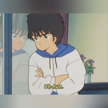
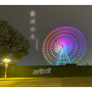
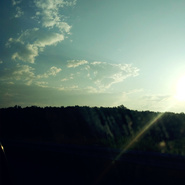
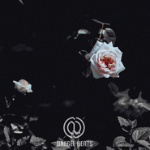
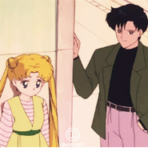
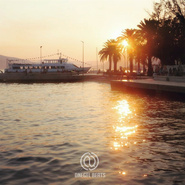
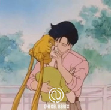
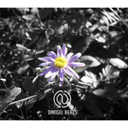
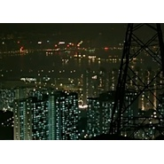

传琦SAMA
============================

|  |  |
| :--: | :-- |
| [ 传琦SAMA](https://i.xiami.com/dnegel) | **地区**: China 中国大陆 **风格**: 蒸汽波 Vaporwave, 电子 Electronic, 爵士嘻哈 Jazz Hip Hop, 流行说唱 Pop Rap **播放数**: 2783232 **粉丝数**: 9007 **评论数**: 212  |

## 档案

黑胶C  D收藏家,  飞碟灵异爱好者,  3   C数码手机控,     情感电台播音员,        演出派对兼D   J,     电子音乐制作人.    wechat:dnegel(请写验证)  weibo:传琦SAMA

## 专辑

| 名称 | 语种 | 唱片公司 | 发行时间 | 专辑类别 | 专辑风格 |
| :--: | :-- | :-- | :-- | :-- | :-- |
| [ Friday Night](./albums/2420393145.md) | 国语 | 独立发行 | 2020年03月04日 | EP, 单曲 | 电子 Electronic, 蒸汽波 Vaporwave, 迪斯科 Disco |
| [ 和你一起看星星♡](./albums/2106077374.md) | 国语 | 独立发行 | 2020年02月20日 | EP, 单曲 | 轻音乐 Easy Listening, 沙发音乐 Lounge, 爵士嘻哈 Jazz Hip Hop |
| [ 就這樣依偎在我的身後♡](./albums/2105521335.md) | 国语 |  | 2019年11月26日 | EP, 单曲 | 轻音乐 Easy Listening, 器乐嘻哈 Instrumental Hip Hop, 原声 Soundtrack |
| [ 蘇州の冬♡苏州的冬](./albums/2105433799.md) | 国语 |  | 2019年11月12日 | EP, 单曲 |  |
| [ Good Night](./albums/2105377210.md) | 英语 |  | 2019年10月26日 | EP, 单曲 | 声效拼贴 Sound Collage, 实验音乐 Experimental |
| [ 好溫柔3000Gentle 3000](./albums/2105343548.md) | 国语 |  | 2019年10月15日 | EP, 单曲 | 爵士嘻哈 Jazz Hip Hop, 器乐嘻哈 Instrumental Hip Hop, 轻音乐 Easy Listening |
| [ 忧伤便利店](./albums/2105164676.md) | 国语 |  | 2019年08月22日 | EP, 单曲 | 器乐嘻哈 Instrumental Hip Hop |
| [ 大人的世界多烦恼](./albums/2105044924.md) | 国语 |  | 2019年07月31日 | EP, 单曲 | 流行 Pop, 国语流行 Mandarin Pop, 流行说唱 Pop Rap |
| [ 孤獨Loneliness](./albums/2104965216.md) | 国语 |  | 2019年06月27日 | EP, 单曲 | 爵士嘻哈 Jazz Hip Hop, 陷阱说唱 Trap Rap, 器乐嘻哈 Instrumental Hip Hop |
| [ Clap Ur Handz拍拍手](./albums/2104833130.md) | 英语 |  | 2019年05月01日 | EP, 单曲 | 迪斯科 Disco, 蒸汽波 Vaporwave, 嘻哈 Hip-Hop |
| [ Don't Touch My Cassette Player别碰我的录音机](./albums/2104484278.md) | 英语 |  | 2019年01月10日 | EP, 单曲 | 迪斯科 Disco, 蒸汽波 Vaporwave |
| [ Uptown Future Funk](./albums/2104302041.md) | 英语 |  | 2018年11月30日 | EP, 单曲 | 迪斯科 Disco, 蒸汽波 Vaporwave |
| [ Future Vaporwave Circulation 未来蒸汽波循环フューチャー・ヴェイパーウェイヴ・サーキュレーション](./albums/2104173719.md) | 日语 |  | 2018年11月03日 | EP, 单曲 | 迪斯科 Disco, 蒸汽波 Vaporwave |
| [ To Love You More ♡](./albums/2103952077.md) | 英语 | 独立发行 | 2018年08月31日 | 录音室专辑 | 蒸汽波 Vaporwave |
| [ 倒計時♡](./albums/2103808587.md) | 国语 | 独立发行 | 2018年07月15日 | 录音室专辑 | 蒸汽波 Vaporwave |
| [ Groovy Love Song ♡](./albums/2103763011.md) | 日语 | 独立发行 | 2018年06月27日 | EP, 单曲 | 蒸汽波 Vaporwave |
| [ 恋の夏 Koi No Natsu ♡戀愛之夏](./albums/2103753644.md) | 日语 | 独立发行 | 2018年06月22日 | EP, 单曲 | 蒸汽波 Vaporwave, 迪斯科 Disco |
| [ Get Ready Tonight ♡](./albums/2103718673.md) | 英语 | 独立发行 | 2018年05月25日 | EP, 单曲 | 蒸汽波 Vaporwave, 迪斯科 Disco |
| [ Tokyo Lover ♡](./albums/2103699279.md) | 日语 | 独立发行 | 2018年05月01日 | EP, 单曲 | 蒸汽波 Vaporwave |
| [ So We Love Love Love Tonight ♡](./albums/2103693413.md) | 日语 | 独立发行 | 2018年04月23日 | EP, 单曲 | 蒸汽波 Vaporwave |
| [ Fantasy ファンタジー ♡](./albums/2103676230.md) | 日语 | 独立发行 | 2018年04月11日 | EP, 单曲 | 蒸汽波 Vaporwave, 迪斯科 Disco |
| [ 海灘戀人Beach Lover](./albums/2103641848.md) | 其他 | 独立发行 | 2018年03月26日 | EP, 单曲 | 蒸汽波 Vaporwave, 沙发音乐 Lounge |
| [ 超可愛的小可愛](./albums/2103589707.md) | 国语 | 独立发行 | 2018年03月07日 | EP, 单曲 | 节奏布鲁斯 R&B, 流行说唱 Pop Rap, 蒸汽波 Vaporwave |
| [ 對你使出愛的召喚](./albums/2103528084.md) | 英语 | 独立发行 | 2018年02月14日 | EP, 单曲 | 器乐嘻哈 Instrumental Hip Hop |
| [ Baby Love ベビー・ラブ♥](./albums/2103467958.md) | 英语 | 独立发行 | 2018年01月05日 | EP, 单曲 | 蒸汽波 Vaporwave, 迪斯科 Disco |
| [ Shmily ♡](./albums/2103464836.md) | 国语 | 独立发行 | 2017年12月29日 | EP, 单曲 | 嘻哈 Hip-Hop, 器乐嘻哈 Instrumental Hip Hop, 陷阱说唱 Trap Rap |
| [ Make a Wish ♡](./albums/2103357055.md) | 纯音乐 | 独立发行 | 2017年12月25日 | EP, 单曲 | 轻音乐 Easy Listening, 爵士说唱 Jazz Rap |
| [ Miracle Love ♡](./albums/2102974559.md) | 日语 | 独立发行 | 2017年12月15日 | EP, 单曲 | 蒸汽波 Vaporwave |
| [ Luv (Sic) Grand Finale Pt. 6 (传琦SAMA Remix)](./albums/2102970129.md) | 英语 | 独立发行 | 2017年12月08日 | EP, 单曲 | 爵士说唱 Jazz Rap, 嘻哈 Hip-Hop |
| [ Never Gonna Say Goodbye ♡̶](./albums/2102945921.md) | 英语 | 独立发行 | 2017年11月20日 | EP, 单曲 | 蒸汽波 Vaporwave, 迪斯科 Disco |
| [ Moonlight Romance](./albums/2104049325.md) | 其他 | 独立发行 | 2017年11月05日 | EP, 单曲 | 爵士嘻哈 Jazz Hip Hop |
| [ Too Late ❄](./albums/2102905612.md) | 英语 | 独立发行 | 2017年11月05日 | EP, 单曲 | 嘻哈 Hip-Hop, 爵士说唱 Jazz Rap, 器乐嘻哈 Instrumental Hip Hop |
| [ 呢喃♡](./albums/2102875428.md) | 国语 | 独立发行 | 2017年10月19日 | EP, 单曲 | 蒸汽波 Vaporwave |
| [ 告白♡ （当山ひとみ - Cathy 传琦SAMA bootleg）](./albums/2102869201.md) | 国语 | 独立发行 | 2017年10月08日 | EP, 单曲 | 器乐嘻哈 Instrumental Hip Hop, 蒸汽波 Vaporwave |
| [ Don't Leave Me Alone](./albums/2102866723.md) | 其他 | 独立发行 | 2017年09月30日 | EP, 单曲 | 器乐嘻哈 Instrumental Hip Hop, 嘻哈 Hip-Hop |
| [ Love Letter](./albums/2102865379.md) | 英语 | 独立发行 | 2017年09月28日 | EP, 单曲 | 蒸汽波 Vaporwave |
| [ Baby Talk ベビー・トーク♥](./albums/2102862579.md) | 英语 | 独立发行 | 2017年09月24日 | 录音室专辑 | 蒸汽波 Vaporwave, 电子 Electronic |
| [ Don't You Walk Away♫](./albums/2102856486.md) | 日语 | 独立发行 | 2017年09月14日 | EP, 单曲 | 蒸汽波 Vaporwave |
| [ Song For You ღ](./albums/2102855367.md) | 日语 | 独立发行 | 2017年09月12日 | EP, 单曲 | 蒸汽波 Vaporwave |
| [ Love Falling ❤](./albums/2102851941.md) | 英语 | 独立发行 | 2017年09月05日 | EP, 单曲 | 蒸汽波 Vaporwave |
| [ LOVE HEARTラブ・ハート♥（The One You Love Remix）ʟᴏᴠᴇ ʜᴇᴀʀᴛラブ・ハート♥](./albums/2102849921.md) | 英语 | 独立发行 | 2017年09月01日 | EP, 单曲 | 爵士说唱 Jazz Rap, 器乐嘻哈 Instrumental Hip Hop |
| [ Boom Shakalaka](./albums/2102823032.md) | 英语 | 独立发行 | 2017年08月30日 | EP, 单曲 | 蒸汽波 Vaporwave, 电子 Electronic |
| [ Long Time No See](./albums/2102819603.md) | 国语 | 独立发行 | 2017年08月25日 | 录音室专辑 | 器乐嘻哈 Instrumental Hip Hop |
| [ 不管](./albums/2102815589.md) | 国语 | 独立发行 | 2017年08月17日 | EP, 单曲 | 嘻哈 Hip-Hop, 蒸汽波 Vaporwave |
| [ 四 ピ](./albums/2102813442.md) | 日语 | 独立发行 | 2017年08月13日 | EP, 单曲 | 蒸汽波 Vaporwave |
| [ Fantastic 80's Dance Babe](./albums/2102811094.md) | 英语 | 独立发行 | 2017年08月09日 | EP, 单曲 | 蒸汽波 Vaporwave, 电子 Electronic, 迪斯科 Disco |
| [ 給你一個卡西米亞般的微笑♡](./albums/2102775834.md) | 其他 | 独立发行 | 2017年07月02日 | EP, 单曲 | 迪斯科 Disco, 电子 Electronic, 蒸汽波 Vaporwave |
| [ ✨午夜漫步✨](./albums/2102774555.md) | 其他 | 独立发行 | 2017年06月29日 | EP, 单曲 | 爵士说唱 Jazz Rap, 器乐嘻哈 Instrumental Hip Hop, 轻音乐 Easy Listening |
| [ ᴛᴀᴋᴇ ᴇᴀ$ʏ ♡̶](./albums/2102769193.md) | 英语 | 独立发行 | 2017年06月20日 | EP, 单曲 | 迪斯科 Disco |
| [ Y♡u Are S♡ Sweet](./albums/2102767130.md) | 日语 | 独立发行 | 2017年06月17日 | EP, 单曲 | 迪斯科 Disco, 蒸汽波 Vaporwave |
| [ BABY CAN'T YOU SEE ♡](./albums/2102762886.md) | 英语 | 独立发行 | 2017年06月09日 | EP, 单曲 | 电子 Electronic, 蒸汽波 Vaporwave |
| [ ᴋɪss ღKISS ღ](./albums/2102754639.md) | 英语 | 独立发行 | 2017年05月26日 | EP, 单曲 | 爵士说唱 Jazz Rap, 器乐嘻哈 Instrumental Hip Hop |
| [ 你認真的樣子我好喜歡♥](./albums/2102752160.md) | 国语 | 独立发行 | 2017年05月23日 | EP, 单曲 | 器乐嘻哈 Instrumental Hip Hop |
| [ LOVE HEART ♥ （The One You Love Remix）ʟᴏᴠᴇ ʜᴇᴀʀᴛ ♥](./albums/2102746684.md) | 英语 | 独立发行 | 2017年05月11日 | EP, 单曲 | 爵士说唱 Jazz Rap, 器乐嘻哈 Instrumental Hip Hop |
| [ Perfect Circle (Dnegel Remix)](./albums/2102741704.md) | 英语 | 独立发行 | 2017年05月02日 | EP, 单曲 | 爵士说唱 Jazz Rap, 嘻哈 Hip-Hop |
| [ 你出現在我的回憶裏](./albums/2102738787.md) | 其他 | 独立发行 | 2017年04月26日 | EP, 单曲 | 轻音乐 Easy Listening, 沙发音乐 Lounge, 蒸汽波 Vaporwave |
| [ 大盜賊](./albums/2102732592.md) | 国语 | 独立发行 | 2017年04月15日 | EP, 单曲 | 嘻哈 Hip-Hop, 器乐嘻哈 Instrumental Hip Hop |
| [ Rosy](./albums/2102728777.md) | 其他 | 独立发行 | 2017年04月08日 | EP, 单曲 | 轻音乐 Easy Listening, 器乐独奏 Solo Instrumental, 爵士说唱 Jazz Rap |
| [ Nostalgia](./albums/2102724179.md) | 国语 | 独立发行 | 2017年03月30日 | 录音室专辑 | 轻音乐 Easy Listening, 沙发音乐 Lounge, 爵士说唱 Jazz Rap |
| [ 未來迪斯科 Future DiscoFuture Disco](./albums/2102722027.md) | 英语 | 独立发行 | 2017年03月26日 | EP, 单曲 | 实验电子 Experimental Electronic, 蒸汽波 Vaporwave |
| [ 跟我約泡](./albums/2102721046.md) | 国语 | 独立发行 | 2017年03月24日 | EP, 单曲 | 嘻哈 Hip-Hop |
| [ 寫這首歌的我在想你Baby Tell Me Why](./albums/2102709190.md) | 国语 | 独立发行 | 2017年03月10日 | EP, 单曲 |  |
| [ 夏日海風](./albums/2102702090.md) | 国语 | 独立发行 | 2017年03月02日 | EP, 单曲 | 器乐嘻哈 Instrumental Hip Hop, 轻音乐 Easy Listening, 沙发音乐 Lounge |
| [ Romantic Valentine's Day浪漫情人節](./albums/2102693139.md) | 英语 | 独立发行 | 2017年02月14日 | EP, 单曲 | 爵士说唱 Jazz Rap, 嘻哈 Hip-Hop |
| [ 煙火Hanabi/花火](./albums/2102686658.md) | 国语 | 独立发行 | 2017年01月29日 | 录音室专辑 |  |
| [ Do You Still Love Me](./albums/2102683847.md) | 国语 | 独立发行 | 2017年01月21日 | EP, 单曲 | 爵士说唱 Jazz Rap, 嘻哈 Hip-Hop, 器乐嘻哈 Instrumental Hip Hop |
| [ 観 覧 車 M I X D O W N](./albums/2102681987.md) | 其他 | 独立发行 | 2017年01月17日 | 录音室专辑 | 迪斯科 Disco, 蒸汽波 Vaporwave |
| [ Du du du (Dnegel Remix)](./albums/2102678627.md) | 其他 | 独立发行 | 2017年01月10日 | EP, 单曲 | 电子 Electronic, 蒸汽波 Vaporwave |
| [ Back In The Day](./albums/2100287740.md) | 其他 | 独立发行 | 2016年03月06日 | 录音室专辑 | 放克 Funk, 轻音乐 Easy Listening, 蒸汽波 Vaporwave |
| [ BEAT TAPE](./albums/2100274394.md) | 国语 | 独立发行 | 2016年02月13日 | 合集, 杂锦 | 爵士说唱 Jazz Rap, 器乐嘻哈 Instrumental Hip Hop, 嘻哈 Hip-Hop |
| [ 夜の景色](./albums/2100269616.md) | 英语 | 独立发行 | 2016年02月10日 | EP, 单曲 | 轻音乐 Easy Listening, 蒸汽波 Vaporwave |
| [ Macross 90s穿越九十年代](./albums/2100215062.md) | 其他 | Dopetrack Records | 2015年10月09日 | 录音室专辑 | 电子 Electronic, 迪斯科 Disco, 蒸汽波 Vaporwave |
| [ Baby Girl](./albums/1583889354.md) | 国语 | 独立发行 | 2013年09月24日 | EP, 单曲 | 爵士流行 Jazz Pop, 节奏布鲁斯 Rhythm & Blues, 国语流行 Mandarin Pop |

## 评论

|  |  |  |
| :-- | :-- | :-- |
|  [虾米用户](https://emumo.xiami.com/u/5639391) be a hunter 2020-12-29 22:12 赞(0) 踩(0) | 
天啊 12月12来了深圳？
 |
|  [虾米用户](https://emumo.xiami.com/u/4400366) 再也不见 2020-12-21 19:43 赞(0) 踩(0) | 
囍
 |
|  [虾米用户](https://emumo.xiami.com/u/31745373) 这个人很懒，什么也没有留... 2020-12-16 00:01 赞(1) 踩(0) | 
农业漫游2009mv里有传奇sama的友情献唱哦⊙&amp;forall;⊙！
 |
|  [虾米用户](https://emumo.xiami.com/u/328675220) 再不留言就老了。 2020-11-17 20:28 赞(4) 踩(0) | 
你就特么进入我的身体
 |
|  [虾米用户](https://emumo.xiami.com/u/194876217) ！！！ 2020-10-25 21:50 赞(0) 踩(0) | 

 |
|  [虾米用户](https://emumo.xiami.com/u/299727941) 80后的我 2020-09-26 11:38 赞(1) 踩(0) | 
什么时候来太原
 |
|  [虾米用户](https://emumo.xiami.com/u/219278205) 我现在给你e-mail吧 2020-09-18 01:50 赞(0) 踩(0) | 
希望有一天可以现场听哦
 |
|  [虾米用户](https://emumo.xiami.com/u/427840279) 购买诗集《落日飞奔术》电... 2020-09-09 10:37 赞(0) 踩(0) | 
传奇
 |
|  [虾米用户](https://emumo.xiami.com/u/295542159) Ciao 2020-08-11 20:45 赞(1) 踩(0) | 
广东，plz 哦捏该
 |
|  [虾米用户](https://emumo.xiami.com/u/440396249) 世界愛我 2020-07-18 16:37 赞(0) 踩(0) | 
来广东！
 |
|  [虾米用户](https://emumo.xiami.com/u/15251406)  2020-07-15 00:39 赞(1) 踩(0) | 
深圳来吗？
 |
|  [虾米用户](https://emumo.xiami.com/u/12177420) 网易云: FIUFIU_... 2020-06-07 01:47 赞(1) 踩(0) | 
♡
 |
|  [虾米用户](https://emumo.xiami.com/u/421578063) fox god 2020-06-04 09:39 赞(0) 踩(0) | 
(&amp;acute;ฅ&amp;omega;&amp;bull;ฅ｀)ﾁﾗｯ
 |
|  [虾米用户](https://emumo.xiami.com/u/247168273) 多泡会儿，才有冰的味道 2020-05-20 08:26 赞(2) 踩(0) | 
这些封面图，也是吸引蒸汽波迷们的一个因素啊！
 |
|  [虾米用户](https://emumo.xiami.com/u/434946909) 沉 迷 蒸 汽 波 2020-04-17 12:41 赞(0) 踩(0) | 
比心
 |
|  [虾米用户](https://emumo.xiami.com/u/11481840)   2020-03-07 00:42 赞(0) 踩(0) | 
周星驰那张专辑怎么不见了？
 |
|  [虾米用户](https://emumo.xiami.com/u/42810132) Aprés l'amou... 2020-01-27 13:14 赞(0) 踩(0) | 

 |
|  [虾米用户](https://emumo.xiami.com/u/93291466) 来时莫徘徊 2019-11-26 00:22 赞(1) 踩(0) | 
你开心就好
 |
|  [虾米用户](https://emumo.xiami.com/u/187617264) 不要试图接近我 2019-11-07 23:09 赞(0) 踩(0) | 
强强强
 |
|  [虾米用户](https://emumo.xiami.com/u/40603098) You can’t ho... 2019-11-05 14:23 赞(0) 踩(0) | 

 |
|  [虾米用户](https://emumo.xiami.com/u/23136229) 不知乘月几人归 2019-11-03 07:40 赞(0) 踩(0) | 
  
 |
|  [虾米用户](https://emumo.xiami.com/u/412486902) Nothing but ... 2019-09-18 22:03 赞(2) 踩(0) | 
Glenn Frey《the 1 u luv》 這首歌最佳的翻唱版本是杜德偉の同名歌，最佳的改編版就是這個。
 |
|  [虾米用户](https://emumo.xiami.com/u/356763773) 我还没想好要写什么... 2019-09-18 08:26 赞(0) 踩(0) | 
。
 |
|  [虾米用户](https://emumo.xiami.com/u/21748173)  2019-09-17 22:05 赞(2) 踩(0) | 
喜欢你的作品，还有能叫下你滴好友lopu上虾米吗
 |
|  [虾米用户](https://emumo.xiami.com/u/223845151) _(:* ｣∠)_ 2019-09-13 07:56 赞(0) 踩(0) | 
♡
 |
|  [虾米用户](https://emumo.xiami.com/u/52056952) 人生即是到來、相遇、陪伴... 2019-08-07 21:35 赞(1) 踩(0) | 

 |
| ⇒ |  [虾米用户](https://emumo.xiami.com/u/430836626)  2019-11-01 13:01 赞(0) 踩(0) | 
姐妹怎么设置动图为头像鸭
 |
|  [虾米用户](https://emumo.xiami.com/u/416421202) 我还没想好要写什么... 2019-07-30 16:11 赞(0) 踩(0) | 
•ᴗ•
 |
|  [虾米用户](https://emumo.xiami.com/u/11046721) Spotify：Unwi... 2019-07-26 08:13 赞(0) 踩(0) | 
。
 |
|  [虾米用户](https://emumo.xiami.com/u/346492287) 虾米不要离开我！ 2019-07-21 23:23 赞(0) 踩(0) | 
去年和大同一起看的，留了个无法弥补的小遗憾，今年看不了了……不过反正他也已经忘记我了。
 |
|  [虾米用户](https://emumo.xiami.com/u/42963872) 我还没想好要写什么... 2019-07-05 00:31 赞(0) 踩(0) | 
.
 |
|  [虾米用户](https://emumo.xiami.com/u/402992512)  2019-06-22 21:25 赞(0) 踩(0) | 
不来上海么
 |
| ⇒ |  [虾米用户](https://emumo.xiami.com/u/105083) 青春骸骨 2019-07-25 00:30 赞(0) 踩(0) | 
8/24
 |
|  [虾米用户](https://emumo.xiami.com/u/346492287) 虾米不要离开我！ 2019-05-21 22:46 赞(1) 踩(0) | 
温柔男孩
 |
|  [虾米用户](https://emumo.xiami.com/u/40632091) 一劑三甲氧苯乙胺 2019-05-21 22:15 赞(0) 踩(0) | 
北京
 |
|  [虾米用户](https://emumo.xiami.com/u/320288876) 沉... 2019-05-21 21:59 赞(0) 踩(0) | 
长沙
 |
|  [虾米用户](https://emumo.xiami.com/u/360910006) The one I lo... 2019-05-21 14:01 赞(0) 踩(0) | 
太原
 |
|  [虾米用户](https://emumo.xiami.com/u/55094882) ｉｄ９１ｏｍｏ＞Ｉ  2019-05-17 15:31 赞(0) 踩(0) | 
✨
 |
|  [虾米用户](https://emumo.xiami.com/u/49365982) 当断则断 2019-05-15 19:08 赞(1) 踩(0) | 
ins刚注册好的时候就关注了(｡•̀ᴗ-)✧
 |
|  [虾米用户](https://emumo.xiami.com/u/191013679) 笑 2019-04-21 01:47 赞(4) 踩(0) | 
终于见到sama了～啊哈哈哈哈哈哈，脖子贴着膏药，病情加重也得蹦起来呀～sama最棒！日后也一定要来昆明哟  羞涩的我实在没能和sama多说几句，下次来我一定鼓起勇气  
 |
|  [虾米用户](https://emumo.xiami.com/u/411058641) 取之不尽 用之不竭 2019-04-16 23:12 赞(0) 踩(0) | 

 |
|  [虾米用户](https://emumo.xiami.com/u/4334438) 贫穷而倔强 2019-04-09 23:49 赞(1) 踩(0) | 
日常表白sama
 |
|  [虾米用户](https://emumo.xiami.com/u/32231879) Eine kosmisc... 2019-04-09 21:57 赞(1) 踩(0) | 
昂
 |
|  [虾米用户](https://emumo.xiami.com/u/374412299)  2019-03-30 19:52 赞(1) 踩(0) | 
来了来了
 |
|  [虾米用户](https://emumo.xiami.com/u/334451985) 万剑凌空 2019-03-28 04:08 赞(0) 踩(0) | 
来了来了
 |
|  [虾米用户](https://emumo.xiami.com/u/42066129) 我爱虾米 2019-03-14 13:03 赞(0) 踩(0) | 
歌手是中国人不是日本人？
 |
|  [虾米用户](https://emumo.xiami.com/u/2938235) 试着帮你找一些感觉 2019-02-13 00:59 赞(0) 踩(0) | 
上线了回个话哈，有个想法希望能联系上。
 |
|  [虾米用户](https://emumo.xiami.com/u/2763753) The best is ... 2019-01-31 20:05 赞(0) 踩(0) | 
～
 |
|  [虾米用户](https://emumo.xiami.com/u/104363356) 无论静躁 2019-01-31 00:00 赞(0) 踩(0) | 
好听！
 |
|  [虾米用户](https://emumo.xiami.com/u/90222976) Oh Hi! 2019-01-29 08:44 赞(0) 踩(0) | 

 |
|  [虾米用户](https://emumo.xiami.com/u/9135744) 皮囊 2019-01-21 19:45 赞(2) 踩(0) | 
内容已删除
 |
| ⇒ |  [虾米用户](https://emumo.xiami.com/u/301208116) 垃圾 2019-01-23 19:23 赞(0) 踩(0) | 
嗯嗯嗯？？？
 |
|  [虾米用户](https://emumo.xiami.com/u/38876938) 。 2019-01-18 14:42 赞(1) 踩(0) | 
给大佬递茶 
 |
|  [虾米用户](https://emumo.xiami.com/u/190876345) 我还没想好要写什么... 2019-01-17 16:19 赞(0) 踩(0) | 
草莓味蒸汽波
 |
|  [虾米用户](https://emumo.xiami.com/u/335038852)  2019-01-11 21:18 赞(0) 踩(0) | 
一听就停不下来了！抖音上听到的BGM
 |
|  [虾米用户](https://emumo.xiami.com/u/80993142) 皮卡皮卡 2019-01-11 15:50 赞(0) 踩(0) | 
求来深圳，华服迎接
 |
|  [虾米用户](https://emumo.xiami.com/u/9029590) 享受着他钟情的音乐 2019-01-06 15:58 赞(1) 踩(0) | 
南京呢！！南京呢？？？
 |
|  [虾米用户](https://emumo.xiami.com/u/297061438) 热泪盈眶 长生不老 2019-01-05 22:18 赞(4) 踩(0) | 
疯狂向同学推荐了传琦 同学也喜欢上了传琦 我好高兴 
 |
|  [虾米用户](https://emumo.xiami.com/u/32051445) 女孩儿的歌。 永爱虾米 2019-01-05 09:55 赞(0) 踩(0) | 
晚上见___
 |
|  [虾米用户](https://emumo.xiami.com/u/255798286) 不要不开心哦♡ 2018-12-24 01:39 赞(2) 踩(0) | 
人 超 好 鸭
 |
|  [虾米用户](https://emumo.xiami.com/u/255798286) 不要不开心哦♡ 2018-12-21 00:20 赞(1) 踩(0) | 
23号见
 |
|  [虾米用户](https://emumo.xiami.com/u/40612346) 我就像一颗榴莲、有人觉得... 2018-12-20 08:19 赞(0) 踩(0) | 
真惊喜
 |
|  [虾米用户](https://emumo.xiami.com/u/313434744) onlyforyan♡ 2018-12-13 01:08 赞(1) 踩(0) | 
待会儿和我喜欢的人一起去见你啦
 |
|  [虾米用户](https://emumo.xiami.com/u/19941586) 如果我是完美的 如果我是... 2018-12-08 18:07 赞(1) 踩(0) | 
一会儿育音堂见
 |
|  [虾米用户](https://emumo.xiami.com/u/11105615) faith&destin... 2018-12-05 10:42 赞(0) 踩(0) | 
请再来一次昆明
 |
|  [虾米用户](https://emumo.xiami.com/u/2165528)   2018-12-03 14:51 赞(0) 踩(0) | 
sama
 |
|  [虾米用户](https://emumo.xiami.com/u/255798286) 不要不开心哦♡ 2018-11-14 10:36 赞(0) 踩(0) | 
冬天了(想躺倒
 |
|  [虾米用户](https://emumo.xiami.com/u/51586444) ‍再見 2018-11-10 23:44 赞(1) 踩(0) | 
广州！！！！
 |
|  [虾米用户](https://emumo.xiami.com/u/10205776) 转Spotify 2018-11-04 21:23 赞(0) 踩(0) | 
M..
 |
|  [虾米用户](https://emumo.xiami.com/u/36730433) 不要慵懒 2018-10-31 17:10 赞(0) 踩(0) | 
你就是传奇？
 |
|  [虾米用户](https://emumo.xiami.com/u/124879246) Hello. This ... 2018-10-21 22:22 赞(0) 踩(0) | 
喜欢你
 |
|  [虾米用户](https://emumo.xiami.com/u/191013679) 笑 2018-10-21 15:21 赞(1) 踩(0) | 
心碎……完美错过昆明场和大理场……只恨自己不争气 希望sama下次一定还来昆明 
 |
|  [虾米用户](https://emumo.xiami.com/u/53594005) 传琦的甜心 2018-10-19 10:50 赞(2) 踩(0) | 
我来了
 |
|  [虾米用户](https://emumo.xiami.com/u/191013679) 笑 2018-10-18 22:06 赞(1) 踩(0) | 
sama要到大理？！我天我24号离开大理……不能23号晚上吗？心是碎成渣渣了   
 |
|  [虾米用户](https://emumo.xiami.com/u/30788105) 从不失手 2018-10-17 23:18 赞(0) 踩(0) | 
后天深圳有约的吗？不敢自己去
 |
|  [虾米用户](https://emumo.xiami.com/u/376225778)  2018-10-17 19:16 赞(1) 踩(0) | 
不错
 |
|  [虾米用户](https://emumo.xiami.com/u/50878892)  2018-10-15 11:12 赞(1) 踩(0) | 
终于来深圳了...蹦起~
 |
|  [虾米用户](https://emumo.xiami.com/u/8618271)  2018-10-10 03:10 赞(3) 踩(0) | 
传琦不来广州嘛 
 |
|  [虾米用户](https://emumo.xiami.com/u/346492287) 虾米不要离开我！ 2018-10-07 11:23 赞(1) 踩(0) | 
深圳走起
 |
|  [虾米用户](https://emumo.xiami.com/u/270121900) 你不来…………我不老……... 2018-10-05 15:37 赞(0) 踩(0) | 
不错
 |
|  [虾米用户](https://emumo.xiami.com/u/351270390) 我还没想好要写什么... 2018-09-24 15:35 赞(1) 踩(0) | 
有约武汉场的吗
 |
|  [虾米用户](https://emumo.xiami.com/u/191013679) 笑 2018-08-29 08:20 赞(0) 踩(0) | 
求加昆明场  
 |
|  [虾米用户](https://emumo.xiami.com/u/351563219)  2018-08-11 15:57 赞(0) 踩(0) | 
我爱蒸汽波！！
 |
|  [虾米用户](https://emumo.xiami.com/u/293924635) 网易云逃难狗 2018-07-20 13:20 赞(0) 踩(0) | 
有人要约杭州场吗！
 |
|  [虾米用户](https://emumo.xiami.com/u/59109096) ♡ 2018-07-17 01:27 赞(0) 踩(0) | 
♡
 |
|  [虾米用户](https://emumo.xiami.com/u/49778097) SINA：嗎啡緩釋片 2018-07-16 23:57 赞(0) 踩(0) | 
长沙哭泣
 |
|  [虾米用户](https://emumo.xiami.com/u/310423687) g 2018-07-16 20:09 赞(2) 踩(0) | 
武汉哭泣
 |
|  [虾米用户](https://emumo.xiami.com/u/50878892)  2018-07-16 10:30 赞(0) 踩(0) | 
深圳场的场地还没定么
 |
|  [虾米用户](https://emumo.xiami.com/u/351019069) 我还没想好要写什么... 2018-07-15 18:10 赞(0) 踩(0) | 
有机会来太原嘛
 |
|  [虾米用户](https://emumo.xiami.com/u/10302727) Doing well. 2018-07-14 00:18 赞(0) 踩(0) | 
真的真的不想来武汉吗？
 |
|  [虾米用户](https://emumo.xiami.com/u/49365982) 当断则断 2018-07-07 20:45 赞(1) 踩(0) | 
かっこいい ฅ(๑ ̀ㅅ ́๑)ฅ
 |
|  [虾米用户](https://emumo.xiami.com/u/328270119) 兴尽晚归舟，误入藕花深处... 2018-06-29 17:03 赞(1) 踩(0) | 
你怎么这么棒哇！
 |
|  [虾米用户](https://emumo.xiami.com/u/23652964) 相由心生 2018-06-20 09:13 赞(0) 踩(0) | 
头像是猫老师？
 |
|  [虾米用户](https://emumo.xiami.com/u/114458052) 吞下无意义想法 2018-06-14 18:41 赞(0) 踩(0) | 
躺下去听
 |
|  [虾米用户](https://emumo.xiami.com/u/53854640)  2018-06-09 03:17 赞(0) 踩(0) | 
♡
 |
|  [虾米用户](https://emumo.xiami.com/u/223845151) _(:* ｣∠)_ 2018-06-08 16:27 赞(0) 踩(0) | 
(〃&amp;omega;〃)
 |
|  [虾米用户](https://emumo.xiami.com/u/12695713) 食 2018-06-05 12:55 赞(0) 踩(0) | 
你是不是骗我点开评论（微笑脸）
 |
|  [虾米用户](https://emumo.xiami.com/u/13613638) 有猫病 2018-06-03 08:48 赞(0) 踩(0) | 
六一搬砖错过了
 |
|  [虾米用户](https://emumo.xiami.com/u/35822738) 爱我请打钱（ ´^ิω^... 2018-06-03 02:34 赞(3) 踩(0) | 
西安站听得超开心(&amp;acute;&amp;forall;｀)♡
 |
|  [虾米用户](https://emumo.xiami.com/u/5493286) 。 2018-05-30 12:00 赞(3) 踩(0) | 
儿童节见！
 |
|  [虾米用户](https://emumo.xiami.com/u/12695713) 食 2018-05-27 02:46 赞(1) 踩(0) | 
你来不来上海啊 一句话
 |
| ⇒ |  [虾米用户](https://emumo.xiami.com/u/12695713) 食 2018-05-30 15:42 赞(0) 踩(0) | 
<q><b>说：</b></q>
 |
| ⇒ |  [虾米用户](https://emumo.xiami.com/u/1019822) Weibo:传琦SAMA... 2018-06-05 12:51 赞(0) 踩(0) | 
看公告啊..我写了...六月十六上海mao livehouse
 |
| ⇒ |  [虾米用户](https://emumo.xiami.com/u/12695713) 食 2018-06-05 15:00 赞(0) 踩(0) | 
<q><b>传琦SAMA说：</b></q>
 |
| ⇒ |  [虾米用户](https://emumo.xiami.com/u/1019822) Weibo:传琦SAMA... 2018-06-05 20:54 赞(0) 踩(0) | 
<q><b>安全出口说：</b></q>
 |
| ⇒ |  [虾米用户](https://emumo.xiami.com/u/12695713) 食 2018-06-05 20:56 赞(0) 踩(0) | 
<q><b>传琦SAMA说：</b></q>
 |
|  [虾米用户](https://emumo.xiami.com/u/20177386) 感谢一切美好的遇见❤️ 2018-05-21 11:38 赞(0) 踩(0) | 

 |
|  [虾米用户](https://emumo.xiami.com/u/57528430) bad 2018-05-19 21:19 赞(18) 踩(0) | 
儿童节成都
 |
|  [虾米用户](https://emumo.xiami.com/u/48645394) 在沙哑独白中抱住你，缄默... 2018-05-16 00:32 赞(3) 踩(0) | 
巡演啦！！！！！！！
 |
|  [虾米用户](https://emumo.xiami.com/u/367041930) 留白。 2018-05-14 10:53 赞(2) 踩(0) | 
琦哥，爱你哦~ 
 |
|  [虾米用户](https://emumo.xiami.com/u/42936819) 网易云搜索恶法lex i... 2018-05-06 09:38 赞(0) 踩(0) | 
居然一直忘了关注
 |
|  [虾米用户](https://emumo.xiami.com/u/228843687) 懒惰统治人间 2018-05-02 17:37 赞(0) 踩(0) | 
:-O
 |
|  [虾米用户](https://emumo.xiami.com/u/71178106) 塵世や 酒、風呂を抜け ... 2018-04-24 12:32 赞(0) 踩(0) | 
♡
 |
|  [虾米用户](https://emumo.xiami.com/u/6879731) 失终人口回归 2018-04-21 23:45 赞(1) 踩(0) | 
失恋了，求安慰
 |
| ⇒ |  [虾米用户](https://emumo.xiami.com/u/223845151) _(:* ｣∠)_ 2018-04-22 02:11 赞(0) 踩(0) | 
揉揉
 |
| ⇒ |  [虾米用户](https://emumo.xiami.com/u/147361618) 再会 2018-05-01 17:49 赞(0) 踩(0) | 
摸摸头
 |
|  [虾米用户](https://emumo.xiami.com/u/3265273) 选我所爱，爱我所选 2018-04-20 18:51 赞(0) 踩(0) | 
支持！
 |
|  [虾米用户](https://emumo.xiami.com/u/49778097) SINA：嗎啡緩釋片 2018-04-17 22:41 赞(0) 踩(0) | 
啊为啥没和李老板去深圳，难过
 |
|  [虾米用户](https://emumo.xiami.com/u/74000308) rat rat come... 2018-04-17 22:36 赞(4) 踩(0) | 
尼桑演出加油～
 |
|  [虾米用户](https://emumo.xiami.com/u/51795971) ️️NEMESIS  2018-04-15 12:56 赞(0) 踩(0) | 
可以可以
 |
|  [虾米用户](https://emumo.xiami.com/u/49365982) 当断则断 2018-04-11 12:27 赞(1) 踩(0) | 
等着新歌
 |
|  [虾米用户](https://emumo.xiami.com/u/245293632) 我还没想好要写什么... 2018-04-07 21:34 赞(0) 踩(0) | 
喜欢，如同恋爱一般
 |
|  [虾米用户](https://emumo.xiami.com/u/206758094) 滚回去听歌 2018-04-05 12:16 赞(0) 踩(0) | 
大雕萝莉 
 |
|  [虾米用户](https://emumo.xiami.com/u/3032983)   2018-03-18 23:06 赞(0) 踩(0) | 
相见恨晚
 |
|  [虾米用户](https://emumo.xiami.com/u/49365982) 当断则断 2018-03-18 15:18 赞(3) 踩(0) | 
恭喜上3000
 |
|  [虾米用户](https://emumo.xiami.com/u/49265597) 我还没想好要写什么... 2018-03-11 02:39 赞(2) 踩(0) | 
为什么删了loving you
 |
|  [虾米用户](https://emumo.xiami.com/u/525562) 青山青水青少年 2018-03-07 15:37 赞(2) 踩(0) | 
啊原来你是豆瓣小站里的Dnegel。。。。。我好像10年关注过你的小站
 |
|  [虾米用户](https://emumo.xiami.com/u/23862178) keep the fai... 2018-03-04 00:10 赞(0) 踩(0) | 
&amp;hearts;︎
 |
|  [虾米用户](https://emumo.xiami.com/u/146107990) 我不是没想好写什么是根本... 2018-03-02 09:30 赞(2) 踩(0) | 
啊  我一直想不到传琦居然是个汉子  我一直以为是个操这萝莉音的萌妹子哇 (⇀‸↼‶)
 |
|  [虾米用户](https://emumo.xiami.com/u/2165528)   2018-02-21 17:56 赞(0) 踩(0) | 
Sama
 |
|  [虾米用户](https://emumo.xiami.com/u/32259880)  2018-01-23 19:16 赞(0) 踩(0) | 
快进版感觉会更得劲儿！哈哈哈
 |
|  [虾米用户](https://emumo.xiami.com/u/17146554) weibo：@L1RRO... 2018-01-19 19:56 赞(2) 踩(0) | 
明天339见～
 |
|  [虾米用户](https://emumo.xiami.com/u/5600976) Diiiisco gir... 2018-01-08 09:43 赞(1) 踩(0) | 
好听，喜欢
 |
|  [虾米用户](https://emumo.xiami.com/u/8399898) Whatever wil... 2018-01-04 16:00 赞(26) 踩(0) | 
你就这么闯入我的生活里，thank you
 |
|  [虾米用户](https://emumo.xiami.com/u/34376040) 再见 虾米！ 2018-01-03 15:23 赞(1) 踩(0) | 
1。3
 |
|  [虾米用户](https://emumo.xiami.com/u/17077682) 滚去spotify了。C... 2018-01-01 15:40 赞(1) 踩(0) | 
☑️
 |
|  [虾米用户](https://emumo.xiami.com/u/4230706)  2017-12-31 11:08 赞(2) 踩(0) | 
怎么私信，或者备注呀？找你有事
 |
|  [虾米用户](https://emumo.xiami.com/u/30861008) 间中饮下酒，很喜欢自由。 2017-12-30 03:08 赞(3) 踩(0) | 
你是龙还是虎
 |
|  [虾米用户](https://emumo.xiami.com/u/50093825) 。 2017-12-27 00:25 赞(1) 踩(0) | 
: )
 |
|  [虾米用户](https://emumo.xiami.com/u/8221701) 来微博找我吧@蕾雷枪 2017-12-23 10:51 赞(2) 踩(0) | 
ᵕ̤ᴗᵕ̤
 |
|  [虾米用户](https://emumo.xiami.com/u/43610229) 狡猾 2017-12-11 23:40 赞(2) 踩(0) | 
(๑&amp;bull;̀&amp;omega;&amp;bull;́๑)
 |
|  [虾米用户](https://emumo.xiami.com/u/10755105) 暂无签名~ 2017-11-23 12:37 赞(1) 踩(0) | 
这么多截图，商业侵权了吗
 |
|  [虾米用户](https://emumo.xiami.com/u/24826347) 我还没想好要写什么... 2017-11-22 20:23 赞(1) 踩(0) | 
什么时候来北京dada？
 |
|  [虾米用户](https://emumo.xiami.com/u/44565735) 人生是一方通行 2017-11-21 10:03 赞(1) 踩(0) | 
ᙏ̤̫
 |
|  [虾米用户](https://emumo.xiami.com/u/6879731) 失终人口回归 2017-11-20 19:09 赞(65) 踩(0) | 
向蒸汽波大佬低头 
 |
|  [虾米用户](https://emumo.xiami.com/u/82588094) 浪漫无用 2017-11-18 16:44 赞(2) 踩(0) | 
可爱
 |
|  [虾米用户](https://emumo.xiami.com/u/44126265) 透明 2017-11-12 14:01 赞(3) 踩(0) | 
我的心都给你
 |
|  [虾米用户](https://emumo.xiami.com/u/333390056)   2017-11-06 00:51 赞(4) 踩(0) | 
好想学做蒸汽音乐
 |
|  [虾米用户](https://emumo.xiami.com/u/333173104)  2017-11-04 16:05 赞(1) 踩(0) | 
喜欢
 |
|  [虾米用户](https://emumo.xiami.com/u/45110364) 生活を静観する 2017-11-01 05:51 赞(1) 踩(0) | 

 |
|  [虾米用户](https://emumo.xiami.com/u/237765277) tropical Fis... 2017-10-30 21:11 赞(1) 踩(0) | 
来晚了
 |
|  [虾米用户](https://emumo.xiami.com/u/224208) xv：foxtao2_ 2017-10-25 23:38 赞(2) 踩(0) | 
你很多泡约吗
 |
|  [虾米用户](https://emumo.xiami.com/u/270615774)   2017-10-18 08:01 赞(1) 踩(0) | 
好听支持
 |
|  [虾米用户](https://emumo.xiami.com/u/285085100) ‍ 2017-10-17 14:08 赞(2) 踩(0) | 
​
 |
|  [虾米用户](https://emumo.xiami.com/u/13111079) 有缘再见 2017-10-16 09:53 赞(2) 踩(0) | 

 |
|  [虾米用户](https://emumo.xiami.com/u/9028760) 豆瓣见 spotify ... 2017-10-14 18:56 赞(1) 踩(0) | 
mark◡̈⃝♡
 |
|  [虾米用户](https://emumo.xiami.com/u/33310780) ！ 2017-10-09 23:28 赞(1) 踩(0) | 
!!
 |
|  [虾米用户](https://emumo.xiami.com/u/11150860) jupitcr.com 2017-10-01 09:36 赞(1) 踩(0) | 
非常喜欢
 |
|  [虾米用户](https://emumo.xiami.com/u/314919510) LOVE MUSIC a... 2017-09-28 07:35 赞(1) 踩(0) | 
Not baddd
 |
|  [虾米用户](https://emumo.xiami.com/u/123441318)   2017-09-11 07:40 赞(2) 踩(0) | 
可以给我你的微信吗，我是男的
 |
|  [虾米用户](https://emumo.xiami.com/u/123441318)   2017-09-11 07:39 赞(2) 踩(0) | 
你是个浪漫的男人
 |
|  [虾米用户](https://emumo.xiami.com/u/49265597) 我还没想好要写什么... 2017-09-05 11:47 赞(0) 踩(0) | 
be better
 |
|  [虾米用户](https://emumo.xiami.com/u/5490437) 女士优先 2017-08-22 13:09 赞(2) 踩(0) | 
好
 |
|  [虾米用户](https://emumo.xiami.com/u/50381060)  2017-08-12 11:02 赞(0) 踩(0) | 
******
 |
| ⇒ |  [虾米用户](https://emumo.xiami.com/u/14091078) 我还没想好要写什么... 2017-08-18 19:03 赞(0) 踩(0) | 
小号
 |
| ⇒ |  [虾米用户](https://emumo.xiami.com/u/50381060)  2017-08-18 19:04 赞(0) 踩(0) | 
<q><b>Oeu5说：</b></q>
 |
|  [虾米用户](https://emumo.xiami.com/u/48373788) 模仿他人无异于自杀。 2017-08-06 15:28 赞(2) 踩(0) | 
有意思
 |
|  [虾米用户](https://emumo.xiami.com/u/87165768) 来自滇西 2017-07-11 22:01 赞(0) 踩(0) | 
这些Beat是买还是租用？
 |
| ⇒ |  [虾米用户](https://emumo.xiami.com/u/87165768) 来自滇西 2017-07-12 21:34 赞(0) 踩(0) | 
<q><b>说：</b></q>
 |
| ⇒ |  [虾米用户](https://emumo.xiami.com/u/5037224)  2017-07-13 04:39 赞(0) 踩(0) | 
<q><b>P!nk Tong说：</b></q>
 |
|  [虾米用户](https://emumo.xiami.com/u/2418238) weibo: @尤米口 2017-06-27 22:46 赞(2) 踩(0) | 
ღ
 |
| ⇒ |  [虾米用户](https://emumo.xiami.com/u/4306274)             ... 2017-10-19 23:08 赞(0) 踩(0) | 
ღ
 |
|  [虾米用户](https://emumo.xiami.com/u/255798286) 不要不开心哦♡ 2017-06-07 23:16 赞(0) 踩(0) | 
超棒 ！
 |
|  [虾米用户](https://emumo.xiami.com/u/13917752) . 2017-05-28 23:42 赞(0) 踩(0) | 
T
 |
|  [虾米用户](https://emumo.xiami.com/u/279699823)  2017-03-15 07:00 赞(0) 踩(0) | 
太厉害了
 |
|  [虾米用户](https://emumo.xiami.com/u/269261821)  2017-02-09 08:10 赞(1) 踩(0) | 
加油呗小传奇 
 |
|  [虾米用户](https://emumo.xiami.com/u/154643112)  2017-02-08 21:16 赞(0) 踩(0) | 
郭儿，加油吧。
 |
|  [虾米用户](https://emumo.xiami.com/u/379643) 暂无签名~ 2016-12-12 23:37 赞(0) 踩(0) | 
厉害了 收下我的膝盖 收徒吗
 |
|  [虾米用户](https://emumo.xiami.com/u/49828336)   2016-11-24 13:54 赞(0) 踩(0) | 
对味
 |
|  [虾米用户](https://emumo.xiami.com/u/49265597) 我还没想好要写什么... 2016-09-11 12:36 赞(0) 踩(0) | 

 |
|  [虾米用户](https://emumo.xiami.com/u/49265597) 我还没想好要写什么... 2016-07-05 10:32 赞(0) 踩(0) | 
好听啊！！
 |
|  [虾米用户](https://emumo.xiami.com/u/5861779) Weibo @Daddy... 2016-05-09 22:58 赞(0) 踩(0) | 
吼吼听！
 |
|  [虾米用户](https://emumo.xiami.com/u/37087360) thecutestcut... 2016-05-02 18:33 赞(2) 踩(0) | 
〰
 |
|  [虾米用户](https://emumo.xiami.com/u/39052743) BadA$$ 2016-04-07 23:28 赞(1) 踩(0) | 
加油.
 |
|  [虾米用户](https://emumo.xiami.com/u/47736446) 上传了最后一首 2016-03-07 09:47 赞(4) 踩(0) | 
好听好听真好听
 |
|  [虾米用户](https://emumo.xiami.com/u/57848)   2016-02-14 23:32 赞(1) 踩(0) | 
     赞！！
 |
|  [虾米用户](https://emumo.xiami.com/u/47736446) 上传了最后一首 2016-02-14 12:41 赞(41) 踩(0) | 
好听到不行
 |
|  [虾米用户](https://emumo.xiami.com/u/4756322)   2016-01-27 08:39 赞(1) 踩(0) | 
才发现是哈尔滨的。上周刚去过哈 
 |
|  [虾米用户](https://emumo.xiami.com/u/17930609) *上传反动、色情等照片将... 2016-01-14 21:40 赞(0) 踩(0) | 
666
 |
|  [虾米用户](https://emumo.xiami.com/u/41859773) 我听的都不好听 2015-09-13 13:34 赞(0) 踩(0) | 
忘了怎么转进来的，好听哈哈，加油
 |
|  [虾米用户](https://emumo.xiami.com/u/2527832) 超越生命 解放自由 2015-08-01 22:53 赞(2) 踩(0) | 
在你这边翻到些好货，愉快
 |
|  [虾米用户](https://emumo.xiami.com/u/10713441) 大傻帽儿 2015-06-16 00:49 赞(0) 踩(0) | 
Baby Girl唱这首歌的声音我好像听过，是不是Q-Ki
 |
| ⇒ |  [虾米用户](https://emumo.xiami.com/u/1019822) Weibo:传琦SAMA... 2015-06-16 18:41 赞(0) 踩(0) | 
不是哦亲
 |
| ⇒ |  [虾米用户](https://emumo.xiami.com/u/10713441) 大傻帽儿 2015-06-16 20:20 赞(0) 踩(0) | 
<q><b>传琦SAMA说：</b></q>
 |
|  [虾米用户](https://emumo.xiami.com/u/12237675) 脑乱/喜欢听伴奏 2015-03-03 18:03 赞(0) 踩(0) | 
都听了听  感觉都挺不错  如果调子能更走心就是要火的节奏- -  容我在火之前留个名233
 |
|  [虾米用户](https://emumo.xiami.com/u/12237675) 脑乱/喜欢听伴奏 2015-03-03 17:57 赞(0) 踩(0) | 
点个赞- -！
 |
|  [虾米用户](https://emumo.xiami.com/u/12237675) 脑乱/喜欢听伴奏 2015-03-03 17:56 赞(0) 踩(0) | 
加油 点歌赞
 |
|  [虾米用户](https://emumo.xiami.com/u/1485166)  2015-01-30 23:42 赞(0) 踩(0) | 
第一次听完整首饶舌，下载了全部
 |
|  [虾米用户](https://emumo.xiami.com/u/1485166)  2015-01-30 23:11 赞(0) 踩(0) | 
很棒
 |
|  [虾米用户](https://emumo.xiami.com/u/17126309) 我还没想好要写什么... 2014-11-02 13:52 赞(0) 踩(0) | 
说的很好哈哈，投一票，加油
 |
|  [虾米用户](https://emumo.xiami.com/u/7172752) 让寂寞狼狈偏安 2014-10-27 16:23 赞(0) 踩(0) | 
我懂你,我第一眼看成丹尼尔
 |
|  [虾米用户](https://emumo.xiami.com/u/42791362) 我还没想好要写什么... 2014-10-24 13:46 赞(0) 踩(0) | 
轻松的饶舌~~~ 除了说好听也说不出别的了。
 |
|  [虾米用户](https://emumo.xiami.com/u/12467448) 懒 2014-10-04 17:31 赞(0) 踩(0) | 
~~~
 |
|  [虾米用户](https://emumo.xiami.com/u/13333456)    . 2014-08-01 10:17 赞(1) 踩(0) | 
少年音~~~~
 |
|  [虾米用户](https://emumo.xiami.com/u/3643353) 虾米要关闭了，难说再见！... 2014-03-13 20:33 赞(1) 踩(0) | 
好听啊
 |
| ⇒ |  [虾米用户](https://emumo.xiami.com/u/1019822) Weibo:传琦SAMA... 2014-03-13 21:08 赞(0) 踩(0) | 
谢谢你分享的新ep
 |
| ⇒ |  [虾米用户](https://emumo.xiami.com/u/3643353) 虾米要关闭了，难说再见！... 2014-03-13 21:17 赞(0) 踩(0) | 
<q><b>传琦SAMA说：</b></q>
 |
|  [虾米用户](https://emumo.xiami.com/u/1346863) 感谢虾米，感谢大家！ 2014-02-07 00:25 赞(0) 踩(0) | 
Pretty!
 |
|  [虾米用户](https://emumo.xiami.com/u/4951186)  2014-01-18 23:25 赞(1) 踩(0) | 
我也算是一个producer，有空会玩玩sample什么的，能交流一下吗？
 |
|  [虾米用户](https://emumo.xiami.com/u/7172752) 让寂寞狼狈偏安 2014-01-08 21:57 赞(0) 踩(0) | 
不怎么像jazz hippop？
 |
|  [虾米用户](https://emumo.xiami.com/u/7448001) 订阅号：恩赐与勇气 2013-11-25 17:06 赞(0) 踩(0) | 
我也幻想开家咖啡店，不只是幻想而已
 |
|  [虾米用户](https://emumo.xiami.com/u/11712551) 外表南，性格北。 2013-11-25 15:20 赞(1) 踩(0) | 
郭郭我来啦~
 |
|  [虾米用户](https://emumo.xiami.com/u/18566621) 我是无肉不欢的素食主义者 2013-11-17 22:31 赞(0) 踩(0) | 
赞一个~
 |
