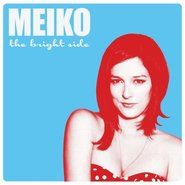

The Bright Side
============================

|  |  |
| :--: | :-- |
| [ The Bright Side](https://emumo.xiami.com/album/511207) | **艺人**: [Meiko](../index.md) **语种**: 英语 **唱片公司**: Fantasy **发行时间**: 2012年05月15日 **专辑类别**: 录音室专辑 **专辑风格**: 另类唱作人 Alternative Singer-Songwriter, 另类摇滚 Alternative Rock **播放数**: 1201495 **收藏数**: 466 **评论数**: 50  |

## 简介

The Bright Side, Meiko's second solo release and Fantasy Records/Concord debut, is an intimate, fearless song-cycle about risk, regret, tenderness and love. Her indelible melodies and sharp lyrical viewpoint give The Bright Side a powerful, artistic punch. It features eleven songs that blend sumptuous folk-pop with thumping electronic beats that Meiko helped create with producers Jimmy Messer, Greg Collins and Belgian electro-pop wiz Styrofoam, known for his remixes of songs by The Postal Service and The Submarines. "The new songs were all born on the guitar, but I wanted to make this record a little more lively," she says. "We played around with beats and came up with something that people could move to. There is more color, layers and texture this time around - acoustic guitars, piano, strings, horns and background harmonies."

## 曲目

## 评论

|  |  |  |
| :-- | :-- | :-- |
|  [虾米用户](https://emumo.xiami.com/u/362179237) 感谢上苍 2018-07-06 09:47 赞(0) 踩(0) | 
很喜欢，其实我是看封面进来的哦，哈哈
 |
|  [虾米用户](https://emumo.xiami.com/u/570784)  2017-10-27 23:23 赞(0) 踩(0) | 
声音和歌曲风格都是我喜欢的，最近推荐的一张
 |
|  [虾米用户](https://emumo.xiami.com/u/230287061) 垃圾虾米！受够了！ 2016-12-24 10:19 赞(0) 踩(0) | 
好听到爆了！
 |
|  [虾米用户](https://emumo.xiami.com/u/7322777) ∮ 2015-06-18 01:27 赞(0) 踩(0) | 
...A...
 |
|  [虾米用户](https://emumo.xiami.com/u/3293763) Rina的野猫生活 2014-10-23 13:41 赞(0) 踩(0) | 
很棒的嗓音
 |
|  [虾米用户](https://emumo.xiami.com/u/1787154)  2014-09-28 00:25 赞(0) 踩(0) | 
听meiko小妞的歌我的少女心都泛滥了
 |
|  [虾米用户](https://emumo.xiami.com/u/13974748) 只叙温暖  不言殇 2014-06-15 20:06 赞(0) 踩(0) | 
喜欢Lie To Me 这首，循环循环
 |
|  [虾米用户](https://emumo.xiami.com/u/5880322) 发觉自己喜欢的音乐 2014-05-26 13:09 赞(0) 踩(0) | 
有种王菲的味道，特别演唱Leave The Lights On 这首歌的时候特别像， 大家觉得呢？
 |
|  [虾米用户](https://emumo.xiami.com/u/11721040)  2013-04-07 10:40 赞(0) 踩(0) | 
qing song
 |
|  [虾米用户](https://emumo.xiami.com/u/11229787) 音乐是好东西 只是音乐！ 2013-03-22 20:03 赞(0) 踩(0) | 
我确实不知道这哪里能听出暗黑~~~MEIKO声音很慵懒才是真的
 |
|  [虾米用户](https://emumo.xiami.com/u/4160754)   2013-03-17 16:50 赞(0) 踩(0) | 
撇去几首小清新基调的，隐约能听到点暗黑，迷幻的味道。还行！！没办法，老娘就是重口味重鼓点爱好者。
 |
|  [虾米用户](https://emumo.xiami.com/u/7373455) 阳光里跳舞的猫咪 2013-03-14 23:14 赞(0) 踩(0) | 
动感，清新
 |
|  [虾米用户](https://emumo.xiami.com/u/7373455) 阳光里跳舞的猫咪 2013-03-14 23:13 赞(0) 踩(0) | 
动感，清新，她的声音一直是我的最爱。
 |
|  [虾米用户](https://emumo.xiami.com/u/4934492)   2013-02-20 20:29 赞(0) 踩(0) | 
my type of music
 |
|  [虾米用户](https://emumo.xiami.com/u/3168316)  2012-12-09 00:44 赞(0) 踩(0) | 
这题张不错~~有进步。又找到piano song的感觉了。
 |
|  [虾米用户](https://emumo.xiami.com/u/1748897)  2012-12-04 19:51 赞(0) 踩(0) | 
有味道
 |
|  [虾米用户](https://emumo.xiami.com/u/11264715) ~\\(≧▽≦)/~ 2012-11-04 09:05 赞(0) 踩(0) | 
很独特的嗓音，轻快
 |
|  [虾米用户](https://emumo.xiami.com/u/3010612) 透明人間 2012-10-25 11:55 赞(0) 踩(0) | 
愉悦
 |
|  [虾米用户](https://emumo.xiami.com/u/5002139)  2012-10-21 21:53 赞(0) 踩(0) | 
轻松美好
 |
|  [虾米用户](https://emumo.xiami.com/u/4544) 我继续，你要随意 2012-10-21 19:52 赞(0) 踩(0) | 
相当悦耳好听的indie pop专辑，Meiko的第二张个人专辑《The Bright Side》就如同专辑名字一样让人看到了太多的Bright Side，夏天的午后最适合跟着这种朗朗上口的小调调一起放轻松。我在听这张专辑的时候满脑子都是这样的情境：午后，小阳光，柳树，微风，吉他，冰咖啡，还有微笑。
 |
|  [虾米用户](https://emumo.xiami.com/u/4081417) 暂无签名~ 2012-08-15 23:12 赞(0) 踩(0) | 
my love
 |
|  [虾米用户](https://emumo.xiami.com/u/2577408) 我很坏。。木哈哈哈哈哈哈 2012-08-10 22:18 赞(0) 踩(0) | 
good job
 |
|  [虾米用户](https://emumo.xiami.com/u/8026916) 有分非难，是缘终合。 2012-07-02 17:56 赞(0) 踩(0) | 
夏天还是来一点小清新的歌
 |
|  [虾米用户](https://emumo.xiami.com/u/8542255)  2012-06-23 14:07 赞(0) 踩(0) | 
yeah
 |
|  [虾米用户](https://emumo.xiami.com/u/8542255)  2012-06-23 14:07 赞(0) 踩(0) | 
女神终于又发了
 |
|  [虾米用户](https://emumo.xiami.com/u/1828514)  2012-06-18 16:44 赞(0) 踩(0) | 
多欢乐啊~~
 |
|  [虾米用户](https://emumo.xiami.com/u/2300800)  2012-06-05 10:41 赞(1) 踩(0) | 
喜欢这女声
 |
|  [虾米用户](https://emumo.xiami.com/u/6875500)   2012-06-01 17:22 赞(0) 踩(0) | 
超级有辨析度～ 慵懒～感性～迷离的嗓音我很喜欢～～
 |
| ⇒ |  [虾米用户](https://emumo.xiami.com/u/629268)  2012-06-01 23:54 赞(0) 踩(0) | 
哈哈，乔治。的确不错。
 |
|  [虾米用户](https://emumo.xiami.com/u/2113721) We'll never ... 2012-05-28 13:28 赞(0) 踩(0) | 
OvfO
 |
|  [虾米用户](https://emumo.xiami.com/u/7662832) 太年轻的恋爱不是爱情，是... 2012-05-22 12:23 赞(0) 踩(0) | 
小清新，喜欢，很喜欢。一曲还没听完，继续听下去吧。。。
 |
|  [虾米用户](https://emumo.xiami.com/u/7428590) wechat- Gala... 2012-05-20 22:12 赞(0) 踩(0) | 
期待期待！
 |
|  [虾米用户](https://emumo.xiami.com/u/1779272) 午夜听鱼缸里扑腾~ 2012-05-20 19:30 赞(0) 踩(0) | 
好久木有新专辑咯~~~
 |
|  [虾米用户](https://emumo.xiami.com/u/622985)  2012-05-20 13:15 赞(0) 踩(0) | 
好這口
 |
|  [虾米用户](https://emumo.xiami.com/u/4241758)  2012-05-20 00:42 赞(0) 踩(0) | 
随便听到的。。很喜欢
 |
|  [虾米用户](https://emumo.xiami.com/u/2074548)  2012-05-19 23:44 赞(0) 踩(0) | 
声音好像The Cardigans的主唱
 |
|  [虾米用户](https://emumo.xiami.com/u/4980587) 我还没想好要写什么... 2012-05-19 20:11 赞(0) 踩(0) | 
感觉听完想说点什么， 却又不知道说什么。 大概是觉得没啥吸引的，  感觉平平， 不温不热 ，  不痒不疼 。
 |
|  [虾米用户](https://emumo.xiami.com/u/4145454) 寂寞遁逃 2012-05-19 11:51 赞(0) 踩(0) | 
自打那首piano song就喜欢上她了 这张专辑也很好听
 |
|  [虾米用户](https://emumo.xiami.com/u/2992967) Anthony 2012-05-19 07:18 赞(0) 踩(0) | 
nice
 |
|  [虾米用户](https://emumo.xiami.com/u/2565694)  2012-05-19 01:41 赞(0) 踩(0) | 
Nice.
 |
|  [虾米用户](https://emumo.xiami.com/u/2364105)  2012-05-18 19:29 赞(0) 踩(0) | 
小清新中带了一点疑惑和忧伤，不再绝对明亮的歌词依然具有安抚人心的力量。I am a good looking loser,too.But tomorrow,I will be okay.
 |
|  [虾米用户](https://emumo.xiami.com/u/8497037) 我确实还没想好要写什么，... 2012-05-18 17:17 赞(0) 踩(0) | 
第二首最好听
 |
|  [虾米用户](https://emumo.xiami.com/u/652547)  2012-05-16 23:28 赞(0) 踩(0) | 
Lie To Me
 |
|  [虾米用户](https://emumo.xiami.com/u/3587364) 微博 ：@鱼柳柳  2012-05-15 12:40 赞(0) 踩(0) | 
喜欢你没道理
 |
|  [虾米用户](https://emumo.xiami.com/u/937121)  2012-05-14 19:36 赞(0) 踩(0) | 
如果没老歌会更喜欢~
 |
|  [虾米用户](https://emumo.xiami.com/u/1247234) Silhouette。 2012-05-14 16:27 赞(0) 踩(0) | 
m
 |
|  [虾米用户](https://emumo.xiami.com/u/545516)  2012-05-14 15:41 赞(0) 踩(0) | 
和EP里一半的歌是一样的，下载时不要重复了
 |
|  [虾米用户](https://emumo.xiami.com/u/309136) I sing it fo... 2012-05-14 15:27 赞(0) 踩(0) | 
新砖嘛...总归稍微热一热嘛...
 |
|  [虾米用户](https://emumo.xiami.com/u/309136) I sing it fo... 2012-05-14 15:23 赞(0) 踩(0) | 
额，反正之前EPleave the lights on和between the sheet调调一样的...听听看再说..恩...
 |
|  [虾米用户](https://emumo.xiami.com/u/53367) 珍惜与老情人最后的美好时... 2012-05-14 15:17 赞(0) 踩(0) | 
终于出新了~
 |
