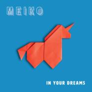
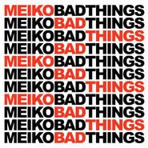
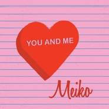
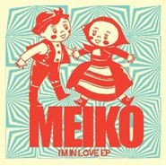

Meiko
============================

|  |  |
| :--: | :-- |
| [ Meiko](https://i.xiami.com/meiko) | **地区**: United States of America 美国 **风格**: 独立流行 Indie Pop, 欧美流行 Western Pop **播放数**: 19536684 **粉丝数**: 19065 **评论数**: 320  |

## 档案

Meiko（美国歌手）是美国歌手兼词曲作者，目前居住在加利福尼亚州的洛杉矶。她在2007年9月1日独立发布了首张同名专辑，并且，在LP内的曲目被全部刊登在了各大网络电视节目上。 
在乔治亚州的小城镇罗伯塔，她父亲提过，Meiko第一次在舞台上跟观众见面的时候为八岁，当时是给南美浸信会的教友演唱《白色圣诞》。在随后几年里，她的演唱足迹来到了小联盟棒球和垒球的比赛现场。 
在没有演出时，Meiko就会钻进自家的干衣机内，来花费数不清的时间来练习唱歌，原因是她坚信在里面会产生与众不同的音响效果。接著，在父亲的帮助下，她很快对写歌产生了浓厚的兴趣，父亲还教她如何用自己的老吉布森六弦吉它来演奏。当13岁时，Meiko拥有了自己的吉它，随后，大量的歌曲出现了，每当她学会了一个新和弦，就会说：“瞧，我写了首新歌。” 
十八岁时Meiko离开家乡，要去给更多观众来展示自己的才华。经过在迈阿密的短暂生活，她最终在洛杉矶定居，并认真开始了自己的职业生涯。 
2007年，Meiko在圣丹斯电影节的表现，引起了帕斯特音乐杂志编辑——乔希•杰克逊的注意，当时他在明幸耳边提起：“大获成功的事情”会随即发生，并预测，这只是时间的问题。 
2008年，Meiko在圣丹斯电影节和SXSW的表演过，并进行了全国的巡回演出。2011年底，Meiko和Fantasy Records/Concord Records签下了新合约。2012年,Meiko发布了个人的第二张专辑《The Bright Side》。 
Meiko八岁时第一次登上舞台，演唱了一首经典的《白色圣诞》。随后的几年里，她开始到小联盟棒球和垒球的比赛现场演唱。在没有演出时，Meiko就会钻进自家的干衣机内，来花费数不清的时间来练习唱歌，她坚信在里面会产生与众不同的音响效果。 
听Meiko的歌，跟随著节奏，会让人觉得惬意，而慵懒的曲调让人感到特别的轻松。如同踩在飘在空中的云朵，阳光洒满城市，就那么一直走著，也觉得从内而外的快乐。捧著一把吉他，随意的吟唱著简单的歌，慢慢的加入缓慢的节奏。一点点听下去，整个人都会觉得安静沉淀了下来。 
Meiko在日本语中，是四分之一的意思。 
在外婆那里，Meiko接触到了一些日本文化。她和她的姐妹，设计师Kelly Nishimoto，都采用了绰号：名幸和惠子。尽管这些名字在日本的发音为"May-ee-ko" 和"Kay-ee-ko" ，但她和她的姐妹还是读成了"MEE-ko" 和 "KEE-ko"。她们对这个错误的发音理解已经有一段时间了，但还是没有去改变心意来换成正确的读法。 
Meiko于10月14日发行新专辑《Dear you》。十一月，Mekio中国巡演即将开启。 
Meiko's songs find common ground between indie pop and coffeehouse folk, with her distinctive alto vocals sharing the spotlight with acoustic guitars and intimate arrangements. A longtime songwriter, Meiko was raised in the small town of Roberta, GA, where she discovered her love for public performance after singing at a Southern Baptist church. She then took up the guitar, playing her father's Gibson before receiving her own instrument as a birthday present. At the age of 18, Meiko left home for greener pastures, eventually resettling in Los Angeles and scheduling recurring performances at the Hotel Café, a popular haven for L.A.-based singer/songwriters. A self-titled album appeared in September 2007, followed by several song placements in such high-profile TV shows as Grey's Anatomy. Meiko found herself receiving a considerable amount of attention for an independent artist; her album shot to the top of iTunes' folk music charts, while peaking at number 35 on the iTunes Hot 100. Boosted by her Internet popularity, Meiko signed a contract with MySpace Records/DGC in June 2008; a re-release of her debut album followed in September.

## 专辑

| 名称 | 语种 | 唱片公司 | 发行时间 | 专辑类别 | 专辑风格 |
| :--: | :-- | :-- | :-- | :-- | :-- |
| [ In Your Dreams](./albums/5021011245.md) | 英语 | Independent | 2019年03月26日 | 录音室专辑 | 流行 Pop |
| [ Playing Favorites](./albums/2103736847.md) | 英语 | Chesky Records | 2018年05月25日 | 录音室专辑 | 欧美流行 Western Pop, 独立流行 Indie Pop |
| [ Back in the Game](./albums/2103649511.md) | 英语 | WAX LTD | 2018年03月16日 | EP, 单曲 |  |
| [ Moving Day](./albums/2100360165.md) | 英语 | Self-Released | 2016年06月24日 | 录音室专辑 | 流行 Pop |
| [ Lovers & Fighters](./albums/723335649.md) | 其他 | Universal Music | 2015年02月09日 | EP, 单曲 | 流行 Pop |
| [ Dear You](./albums/1913965675.md) | 英语 | Concord Music Group, Inc. | 2014年10月14日 | 录音室专辑 | 另类唱作人 Alternative Singer-Songwriter, 另类摇滚 Alternative Rock |
| [ Bad Things](./albums/267032144.md) | 英语 | Concord Music Group | 2013年04月16日 | EP, 单曲 | 另类唱作人 Alternative Singer-Songwriter, 另类摇滚 Alternative Rock |
| [ You and Me](./albums/576108.md) | 英语 | Concord Music Group | 2013年01月29日 | EP, 单曲 | 另类唱作人 Alternative Singer-Songwriter, 另类摇滚 Alternative Rock |
| [ The Bright Side](./albums/511207.md) | 英语 | Fantasy | 2012年05月15日 | 录音室专辑 | 另类唱作人 Alternative Singer-Songwriter, 另类摇滚 Alternative Rock |
| [ Leave the Lights On](./albums/508914.md) | 英语 | Concord Music | 2012年04月10日 | EP, 单曲 | 另类唱作人 Alternative Singer-Songwriter, 另类摇滚 Alternative Rock |
| [ I'm In Love](./albums/467791.md) | 英语 | Myspace Records | 2011年09月01日 | EP, 单曲 |  |
| [ All of Me](./albums/569139.md) | 英语 | Myspace Records | 2009年06月24日 | EP, 单曲 |  |
| [ Meiko](./albums/240560.md) | 英语 | Myspace Records | 2008年08月05日 | 录音室专辑 | 另类唱作人 Alternative Singer-Songwriter, 另类摇滚 Alternative Rock |
| [ Live Sessions](./albums/495094.md) | 英语 | Self-Released | 2008年08月05日 | 现场专辑 |  |

## 评论

|  |  |  |
| :-- | :-- | :-- |
|  [虾米用户](https://emumo.xiami.com/u/30074304) 寄蜉蝣于天地，渺沧海之一... 2020-08-22 19:23 赞(0) 踩(0) | 
✈
 |
|  [虾米用户](https://emumo.xiami.com/u/296549) 我还没想好要写什么... 2019-06-13 13:16 赞(0) 踩(0) | 
美国孙燕姿？
 |
|  [虾米用户](https://emumo.xiami.com/u/8017674) 暂无签名~ 2019-05-13 09:23 赞(1) 踩(0) | 
从高中起喜欢meiko。她的歌里总有一种天真气。
 |
|  [虾米用户](https://emumo.xiami.com/u/330900828) 高舉一面五星紅旗在蝦米！ 2019-02-19 03:09 赞(0) 踩(0) | 
都是音樂惹狂野的必備  
 |
|  [虾米用户](https://emumo.xiami.com/u/4487129)  2019-01-19 08:58 赞(0) 踩(0) | 
！！！
 |
|  [虾米用户](https://emumo.xiami.com/u/324879742)   2018-10-14 06:02 赞(1) 踩(0) | 
.
 |
|  [虾米用户](https://emumo.xiami.com/u/276968158) 梦想不只是梦，也不只是想... 2018-08-27 17:38 赞(0) 踩(0) | 
奇怪了，每首都好听，
 |
|  [虾米用户](https://emumo.xiami.com/u/8635478) 换个地方思考 2018-08-23 16:22 赞(0) 踩(0) | 
咦？公告的2014和2018有关系吗？是公告过期的意思？
 |
|  [虾米用户](https://emumo.xiami.com/u/8635478) 换个地方思考 2018-08-23 16:14 赞(1) 踩(0) | 
咦！？【广州】11月22日 周六 20:30-22:00 预售60元 现场80元 Tu凸空间！这么便宜？
 |
|  [虾米用户](https://emumo.xiami.com/u/342569473) 开心每一天 2018-07-21 14:20 赞(0) 踩(0) | 
你好 
 |
|  [虾米用户](https://emumo.xiami.com/u/293611068) 懒货，不喜欢发任何感言。 2018-06-15 22:46 赞(0) 踩(0) | 
声线跟trouble is afriend的歌手lenka有点像
 |
|  [虾米用户](https://emumo.xiami.com/u/345078209)  2018-06-12 23:25 赞(0) 踩(0) | 
好听
 |
|  [虾米用户](https://emumo.xiami.com/u/30098244)  2018-05-27 02:05 赞(0) 踩(0) | 
哇！认识你太晚了！非常喜欢你的音乐。I hope you'll be back in China   
 |
|  [虾米用户](https://emumo.xiami.com/u/124879246) Hello. This ... 2018-01-07 10:13 赞(0) 踩(0) | 
日式翻译就是芽衣子惹･ө･
 |
|  [虾米用户](https://emumo.xiami.com/u/55485698) 恒心毅力自信智慧！！！与... 2017-12-29 05:36 赞(0) 踩(0) | 
怎么艺人电台变成日本艺人了？重名弄错了吧？
 |
|  [虾米用户](https://emumo.xiami.com/u/15477519) 爱  是生命的和弦，而不... 2017-12-28 12:19 赞(2) 踩(0) | 
Meiko入驻虾米了&amp;hellip;
 |
|  [虾米用户](https://emumo.xiami.com/u/9575868)  2017-12-18 21:05 赞(0) 踩(0) | 
每次meiko出新专辑我必定一首一首的听非常认真,有些曲目也是越听越喜欢越听.今天闲来无事,又在听.    #就算meikol江郎才尽我仍旧是忠实拥趸#
 |
|  [虾米用户](https://emumo.xiami.com/u/338782757)  2017-12-06 09:18 赞(2) 踩(0) | 
可以
 |
|  [虾米用户](https://emumo.xiami.com/u/298948030) 中國詩音樂電影创始人作曲... 2017-10-17 22:03 赞(0) 踩(0) | 
你好
 |
|  [虾米用户](https://emumo.xiami.com/u/120109350) 我还没想好要写什么... 2017-10-15 14:00 赞(0) 踩(0) | 
2017.10.15
 |
|  [虾米用户](https://emumo.xiami.com/u/44045577) 希望夏天早点来，你也早点... 2017-10-02 23:59 赞(0) 踩(0) | 
I find a ferfect girl. thank u Meiko.
 |
|  [虾米用户](https://emumo.xiami.com/u/267701455) 我是条咸鱼 2017-09-23 17:31 赞(0) 踩(0) | 

 |
|  [虾米用户](https://emumo.xiami.com/u/3208690) 快乐的猫猫 2017-05-05 12:51 赞(1) 踩(0) | 
Meiko:感谢你收藏我的作品《怪盗Fの台本 ~消えたダイヤの謎~》，我在虾米音乐人期待你的关注。去看看 &amp;amp;gt;&amp;amp;gt; Meiko:感谢你收藏我的作品《Party&amp;times;Party》，我在虾米音乐人期待你的关注。去看看 &amp;amp;gt;&amp;amp;gt;  点进来是这个页面怎么破- -
 |
| ⇒ |  [虾米用户](https://emumo.xiami.com/u/37814707) El Psy Congr... 2017-06-04 12:22 赞(0) 踩(0) | 
我也&amp;hellip;&amp;hellip;
 |
| ⇒ |  [虾米用户](https://emumo.xiami.com/u/26217347) 我这家伙很懒，个人介绍也... 2017-07-26 23:50 赞(0) 踩(0) | 
添加一个新歌手及资料，懂的人去添加，不然只能这个情况
 |
|  [虾米用户](https://emumo.xiami.com/u/292173203)   2017-05-02 16:31 赞(0) 踩(0) | 
听了感觉心情很放松，很好听
 |
|  [虾米用户](https://emumo.xiami.com/u/35955457)  2017-04-05 19:48 赞(0) 踩(0) | 
差点想买巡演票，点进去才发觉是14年的  手动滑稽
 |
|  [虾米用户](https://emumo.xiami.com/u/260176390)  2017-02-25 09:00 赞(1) 踩(0) | 
Meiko（美国歌手）是美国歌手兼词曲作者，目前居住在加利福尼亚州的洛杉矶。她在2007年9月1日独立发布了首张同名专辑
 |
|  [虾米用户](https://emumo.xiami.com/u/13941491) 断幺九，1000点 2017-02-19 10:05 赞(0) 踩(0) | 
meiko？又串了虾米？
 |
|  [虾米用户](https://emumo.xiami.com/u/16705621) Stay weird. 2017-02-14 02:04 赞(0) 踩(0) | 
piano song喜欢她的 好久了 没想到巡演过
 |
|  [虾米用户](https://emumo.xiami.com/u/262074410)  2017-02-08 15:26 赞(0) 踩(0) | 
声音真的很好听
 |
|  [虾米用户](https://emumo.xiami.com/u/193804508) 有人夜里开车看海 2017-01-26 19:01 赞(0) 踩(0) | 
加油加油哦
 |
|  [虾米用户](https://emumo.xiami.com/u/230287061) 垃圾虾米！受够了！ 2016-12-23 23:08 赞(0) 踩(0) | 
歌唱真的很好，希望她一直唱下去
 |
|  [虾米用户](https://emumo.xiami.com/u/98252556)   2016-12-15 22:56 赞(1) 踩(0) | 
声音不错，可我为什么一直盯着看她的眼线……
 |
|  [虾米用户](https://emumo.xiami.com/u/3550322) 不喧哗。 2016-12-09 20:04 赞(0) 踩(0) | 
这么有才为什么不火
 |
|  [虾米用户](https://emumo.xiami.com/u/2888769)  2016-10-19 23:31 赞(0) 踩(0) | 
见个面吧，我请你吃一道地道的Chinese food
 |
|  [虾米用户](https://emumo.xiami.com/u/15284244) bye bye, goo... 2016-10-14 21:17 赞(0) 踩(0) | 
!
 |
|  [虾米用户](https://emumo.xiami.com/u/49876576) 向かい風 2016-10-10 17:45 赞(0) 踩(0) | 
好像绝命毒师里面的skyler
 |
|  [虾米用户](https://emumo.xiami.com/u/13180134) 敲丫挺的 2016-09-29 21:35 赞(0) 踩(0) | 
人美歌甜
 |
| ⇒ |  [虾米用户](https://emumo.xiami.com/u/1308967) 虾米听重型极端音乐这块的... 2016-12-01 18:37 赞(0) 踩(0) | 
就是皮肤不好
 |
|  [虾米用户](https://emumo.xiami.com/u/52997940) No music,no ... 2016-09-14 18:47 赞(0) 踩(0) | 
❤️
 |
|  [虾米用户](https://emumo.xiami.com/u/2888769)  2016-09-14 17:13 赞(0) 踩(0) | 
hi
 |
|  [虾米用户](https://emumo.xiami.com/u/33552517) 偏好、 2016-08-25 19:58 赞(0) 踩(0) | 

 |
|  [虾米用户](https://emumo.xiami.com/u/22881143) ㅤㅤㅤㅤ 2016-08-25 16:47 赞(1) 踩(0) | 
。
 |
|  [虾米用户](https://emumo.xiami.com/u/95333890)   2016-08-06 11:43 赞(0) 踩(0) | 
20
 |
|  [虾米用户](https://emumo.xiami.com/u/50017584) 我到底有多爱金属 2016-07-08 21:45 赞(0) 踩(0) | 
    
 |
|  [虾米用户](https://emumo.xiami.com/u/84571136) 唯有音乐不离不弃 2016-06-18 01:19 赞(0) 踩(0) | 
链接: <a href="http://pan.baidu.com/s/1hstvT6c" target="_blank" rel="nofollow noreferrer noopener">http://pan.baidu.com/s/1hstvT6c</a> 密码: jfiv
 |
|  [虾米用户](https://emumo.xiami.com/u/84571136) 唯有音乐不离不弃 2016-06-15 00:40 赞(0) 踩(0) | 
Meiko – Moving Day - 20160624
 |
|  [虾米用户](https://emumo.xiami.com/u/84571136) 唯有音乐不离不弃 2016-06-15 00:39 赞(0) 踩(0) | 
Meiko – I Do
 |
|  [虾米用户](https://emumo.xiami.com/u/6096021) Bo 2016-05-25 21:37 赞(3) 踩(0) | 
喜欢到结婚时每一首都是她的歌
 |
| ⇒ |  [虾米用户](https://emumo.xiami.com/u/2521041) 荣耀归神 喜悦与人 2016-06-18 17:50 赞(0) 踩(0) | 
啥时结婚的
 |
|  [虾米用户](https://emumo.xiami.com/u/45621221) 卸载状态。 2016-05-14 14:36 赞(0) 踩(0) | 
=
 |
|  [虾米用户](https://emumo.xiami.com/u/1394088) 世间智障合集 2016-03-29 19:22 赞(1) 踩(0) | 
EDG的辅助也会唱歌？
 |
| ⇒ |  [虾米用户](https://emumo.xiami.com/u/12957817) 音乐改变心情，净化心灵 2016-04-12 21:58 赞(0) 踩(0) | 
你脑子里除了LOL还有别的吗？
 |
| ⇒ |  [虾米用户](https://emumo.xiami.com/u/1394088) 世间智障合集 2016-04-12 22:09 赞(0) 踩(0) | 
<q><b>JSM说：</b></q>
 |
| ⇒ |  [虾米用户](https://emumo.xiami.com/u/1394088) 世间智障合集 2016-04-12 22:14 赞(0) 踩(0) | 
<q><b>JSM说：</b></q>
 |
| ⇒ |  [虾米用户](https://emumo.xiami.com/u/12957817) 音乐改变心情，净化心灵 2016-04-12 23:04 赞(0) 踩(0) | 
<q><b>语麟霖说：</b></q>
 |
|  [虾米用户](https://emumo.xiami.com/u/26761406) 一半明媚 ，一半忧伤 2016-03-25 20:54 赞(1) 踩(0) | 
i don&amp;#039;t want to run away any more~love this melody.
 |
|  [虾米用户](https://emumo.xiami.com/u/45189001) 这家伙很聪明什么也没留下... 2016-03-14 20:53 赞(0) 踩(0) | 
噗在下还以为是大姐来着
 |
|  [虾米用户](https://emumo.xiami.com/u/35619626) 他是真的神明 我是假的信... 2016-03-02 01:07 赞(0) 踩(0) | 
她的眉眼让人感觉很舒服
 |
|  [虾米用户](https://emumo.xiami.com/u/39063306) 只想做个安静的太（mei... 2016-02-03 13:35 赞(1) 踩(0) | 
被leave the lights on拉入坑
 |
| ⇒ |  [虾米用户](https://emumo.xiami.com/u/289037094)  2017-04-16 02:39 赞(0) 踩(0) | 
我也是，某天在咖啡店听完就喜欢上她了
 |
|  [虾米用户](https://emumo.xiami.com/u/3291786)  2016-01-09 08:13 赞(0) 踩(0) | 
眼珠很有力
 |
|  [虾米用户](https://emumo.xiami.com/u/44261599) 想好了 也不写 2016-01-09 03:13 赞(0) 踩(0) | 

 |
|  [虾米用户](https://emumo.xiami.com/u/7758656) \m/ 2015-12-22 20:31 赞(0) 踩(0) | 
人物封面有点像Tarja耶
 |
|  [虾米用户](https://emumo.xiami.com/u/14560964) Inner peace. 2015-12-05 21:59 赞(0) 踩(0) | 
声音和russian red好像。。。
 |
|  [虾米用户](https://emumo.xiami.com/u/13617745)  2015-11-26 14:37 赞(0) 踩(0) | 
妹控
 |
|  [虾米用户](https://emumo.xiami.com/u/47097008) 你连半途而废都没有，画地... 2015-11-07 18:48 赞(0) 踩(0) | 
good
 |
|  [虾米用户](https://emumo.xiami.com/u/52093145) 鹿 2015-10-31 11:51 赞(0) 踩(0) | 
就这样咧
 |
|  [虾米用户](https://emumo.xiami.com/u/1525780) 听不懂歌词的小清新能不能... 2015-10-27 17:10 赞(2) 踩(0) | 
为什么长得有点像amy acker
 |
|  [虾米用户](https://emumo.xiami.com/u/45659447) 暂无签名~ 2015-10-19 10:58 赞(0) 踩(0) | 
太爱她了！
 |
|  [虾米用户](https://emumo.xiami.com/u/8277847) 蠢 2015-10-09 17:14 赞(2) 踩(0) | 
有没有人觉得封面很像Katy Perry。。。
 |
|  [虾米用户](https://emumo.xiami.com/u/7268826)   2015-09-09 10:29 赞(1) 踩(0) | 
有点像poi里的root……
 |
|  [虾米用户](https://emumo.xiami.com/u/47310048) 搓圆又打bia, 打bi... 2015-08-18 10:20 赞(0) 踩(0) | 
240
 |
|  [虾米用户](https://emumo.xiami.com/u/47310048) 搓圆又打bia, 打bi... 2015-08-18 10:20 赞(0) 踩(0) | 
240
 |
|  [虾米用户](https://emumo.xiami.com/u/51646719) 愿每个人都可以从心所欲，... 2015-07-18 17:12 赞(0) 踩(0) | 
a
 |
|  [虾米用户](https://emumo.xiami.com/u/9110659)   2015-07-14 04:29 赞(1) 踩(0) | 
live有被惊艳到 
 |
|  [虾米用户](https://emumo.xiami.com/u/47310048) 搓圆又打bia, 打bi... 2015-06-29 20:12 赞(0) 踩(0) | 
meiko为毛名气还是这么小  她很优秀哦 
 |
|  [虾米用户](https://emumo.xiami.com/u/35103783)  2015-06-20 12:37 赞(0) 踩(0) | 
******
 |
|  [虾米用户](https://emumo.xiami.com/u/38640339) 我想好写什么了…… 2015-06-18 14:01 赞(0) 踩(0) | 

 |
|  [虾米用户](https://emumo.xiami.com/u/35714790)  2015-06-16 20:25 赞(0) 踩(0) | 
相册美度超不稳定哒说 噢 美国DJ DNTST砖封上哒女人原来是没扣(❁´◡`❁)*✲ﾟ*
 |
|  [虾米用户](https://emumo.xiami.com/u/36208991)   2015-06-11 04:25 赞(0) 踩(0) | 
❤️
 |
|  [虾米用户](https://emumo.xiami.com/u/47310048) 搓圆又打bia, 打bi... 2015-06-07 16:38 赞(0) 踩(0) | 
meiko的音色好有特点 
 |
|  [虾米用户](https://emumo.xiami.com/u/39340525) ◑▂◑-－ 2015-05-18 19:08 赞(0) 踩(0) | 
打辅助去啊唱啥歌
 |
|  [虾米用户](https://emumo.xiami.com/u/16770472) 暂无签名~ 2015-05-01 16:14 赞(0) 踩(0) | 
meiko本人回复，好亲切，大爱
 |
|  [虾米用户](https://emumo.xiami.com/u/6548494) shhhhhh 2015-04-21 11:38 赞(0) 踩(0) | 
卧槽本人来回复吗！看过现场！补留！
 |
|  [虾米用户](https://emumo.xiami.com/u/345619)  2015-04-16 13:12 赞(0) 踩(0) | 
Between the Sheets和Leave the Lights On是出错了吗？？？一样的？
 |
|  [虾米用户](https://emumo.xiami.com/u/46812689) 下个路口直走或转弯 2015-04-01 12:39 赞(0) 踩(0) | 
甜而不腻
 |
|  [虾米用户](https://emumo.xiami.com/u/8936710)  2015-03-17 15:48 赞(1) 踩(0) | 
Meiko订婚了，恭喜阿
 |
|  [虾米用户](https://emumo.xiami.com/u/7439332)  2015-02-06 16:10 赞(0) 踩(0) | 
123
 |
|  [虾米用户](https://emumo.xiami.com/u/10367201) 1R重症患者 2015-01-12 23:45 赞(0) 踩(0) | 
good voice!
 |
|  [虾米用户](https://emumo.xiami.com/u/8833102) 伟❤️375882267 2014-12-25 01:18 赞(0) 踩(0) | 
这里的歌真好听                       圣诞快乐  ！！！
 |
|  [虾米用户](https://emumo.xiami.com/u/43077042) 偏不简介 2014-12-12 19:56 赞(0) 踩(0) | 
i love u dear,
 |
|  [虾米用户](https://emumo.xiami.com/u/1839747)  2014-12-09 13:17 赞(0) 踩(0) | 
可以慵懒，可以欢快，喜欢这个调调
 |
|  [虾米用户](https://emumo.xiami.com/u/9024240) 谁说癞蛤蟆不是蛤蟆 2014-11-24 21:27 赞(0) 踩(0) | 
我什么时候能睡醒啊
 |
|  [虾米用户](https://emumo.xiami.com/u/15943590) No 2014-11-23 14:34 赞(0) 踩(0) | 
昨天要了签名 开熏
 |
|  [虾米用户](https://emumo.xiami.com/u/26391343)  2014-11-22 23:19 赞(0) 踩(0) | 
啊！！现场太萌了~受不了了，最最最最满足的是最后进和女神说i love u so much 得到回答“me too~”
 |
|  [虾米用户](https://emumo.xiami.com/u/507158) 不吃辣 狮子座 电音控 2014-11-21 10:00 赞(0) 踩(0) | 
1和6为什么是一首歌，不同的歌名啊
 |
|  [虾米用户](https://emumo.xiami.com/u/14543829) Love INDIE m... 2014-11-19 08:40 赞(0) 踩(0) | 
Wow you r awesome！：）
 |
|  [虾米用户](https://emumo.xiami.com/u/10463237) 我还没想好要写什么... 2014-11-18 05:03 赞(0) 踩(0) | 
十1
 |
|  [虾米用户](https://emumo.xiami.com/u/26391343)  2014-11-17 23:29 赞(0) 踩(0) | 
哈哈哈，星期六就可以看到meiko了~~噢耶~
 |
|  [虾米用户](https://emumo.xiami.com/u/7768554)  2014-11-17 16:41 赞(1) 踩(0) | 
现场超棒！
 |
|  [虾米用户](https://emumo.xiami.com/u/5090592) 热爱节奏的杂食动物 2014-11-16 18:24 赞(1) 踩(0) | 
meiko现场挺萌的~
 |
|  [虾米用户](https://emumo.xiami.com/u/10166016) 流年浮絮若烟。唯有愿生。 2014-11-13 18:25 赞(0) 踩(0) | 
16号有考试，不然姐就去了...
 |
|  [虾米用户](https://emumo.xiami.com/u/40579044) Let it be. 2014-11-13 17:16 赞(1) 踩(0) | 
Meiko首次中国巡演上海站有网络在线直播哦。关注Live直播，逼格高，只播演出，没节操。微信号：livelifezb。
 |
|  [虾米用户](https://emumo.xiami.com/u/5090592) 热爱节奏的杂食动物 2014-11-13 17:06 赞(1) 踩(0) | 
买好票了~
 |
|  [虾米用户](https://emumo.xiami.com/u/7799094)  2014-11-10 21:05 赞(0) 踩(0) | 
这名字第一反应就是我最爱吃的一道菜，梅菜扣肉。
 |
|  [虾米用户](https://emumo.xiami.com/u/2577408) 我很坏。。木哈哈哈哈哈哈 2014-11-08 15:27 赞(1) 踩(0) | 
好期待来上海呐~
 |
|  [虾米用户](https://emumo.xiami.com/u/27546) MArCo 2014-10-31 17:34 赞(2) 踩(0) | 
哇哇哇哇哇~~~~ 来武汉了~~~
 |
|  [虾米用户](https://emumo.xiami.com/u/16415125) 我们将死于自己热爱的事物 2014-10-28 16:24 赞(2) 踩(0) | 
#11.22美国流行创作歌手 Meiko 2014 中国巡演广州站@广州TU凸空间#活动详情：<a href="http://www.douban.com/event/22926568/" target="_blank" rel="nofollow noreferrer noopener">http://www.douban.com/event/22926568/</a>。预售请戳：<a href="http://shop61345640.taobao.com/" target="_blank" rel="nofollow noreferrer noopener">http://shop61345640.taobao.com/</a>。
 |
|  [虾米用户](https://emumo.xiami.com/u/1730251)  2014-10-26 15:49 赞(1) 踩(0) | 
即将来深圳！！！欢迎
 |
|  [虾米用户](https://emumo.xiami.com/u/6096021) Bo 2014-10-26 11:41 赞(1) 踩(0) | 
上海走起！
 |
|  [虾米用户](https://emumo.xiami.com/u/3884146)  2014-10-25 11:02 赞(0) 踩(0) | 
我想问问大家，今日推荐里的歌每天刷下，我怎么才能看到昨天的推荐的歌。
 |
|  [虾米用户](https://emumo.xiami.com/u/3711647)   丢到马桶让水流 2014-10-24 20:36 赞(1) 踩(0) | 
啊啊真身!!好期待!!!!
 |
| ⇒ |  [虾米用户](https://emumo.xiami.com/u/73003900)  2018-08-01 22:50 赞(0) 踩(0) | 
******
 |
|  [虾米用户](https://emumo.xiami.com/u/16094167) 听电子拒绝味精味严重的美... 2014-10-24 17:35 赞(1) 踩(0) | 
ohhhhhh my god,can&amp;#039;t believe that you‘ve actually settled in the Xiami music ,have fun in China !
 |
|  [虾米用户](https://emumo.xiami.com/u/33841656)  2014-10-24 16:04 赞(0) 踩(0) | 
11月14日起开始首次中国巡演，现场见~
 |
|  [虾米用户](https://emumo.xiami.com/u/41833211)  2014-10-24 12:41 赞(103) 踩(0) | 
Getting ready for my tour in China in a couple of weeks! Any tips or general info I should know? This is my 1st time going there!!
 |
| ⇒ |  [虾米用户](https://emumo.xiami.com/u/269414)  2014-10-24 16:52 赞(0) 踩(0) | 
一百个赞
 |
| ⇒ |  [虾米用户](https://emumo.xiami.com/u/4145454) 寂寞遁逃 2014-11-07 02:55 赞(0) 踩(0) | 
Hi! So happy to hear that you're gonna come  to Beijing! I love "I'm in love", "Piano Song". It's The Piano song that let me know you. A tip just for suggestion, you can learn simple Chinese greetings and say hi in Chinese to the fans. As for songs and performance, you just need to be yourself! :)
 |
| ⇒ |  [虾米用户](https://emumo.xiami.com/u/4145454) 寂寞遁逃 2014-11-07 03:28 赞(0) 踩(0) | 
Just got enlightened, maybe you can learn a Chinese song and sing it on your live performance. It will be very lovely! Even just a few lines, you know, something like that. Anyway, it's just a suggestion. Don't worry. We love you just the way you are.
 |
| ⇒ |  [虾米用户](https://emumo.xiami.com/u/7768554)  2014-11-18 18:07 赞(0) 踩(0) | 
Like~！~~~~~~~~~~~~~~~~~~~~~~~~ ~~~~~~~~~~~~~~~~~~~
 |
| ⇒ |  [虾米用户](https://emumo.xiami.com/u/7768554)  2014-11-18 18:09 赞(0) 踩(0) | 
I‘v met you in Shanghai~~~~~Next time would you come to Hangzhou??????Waiting for U~~~~~~~~~~~~~
 |
| ⇒ |  [虾米用户](https://emumo.xiami.com/u/47310048) 搓圆又打bia, 打bi... 2015-10-18 19:06 赞(0) 踩(0) | 
When will you have solo concerts in China again,Meiko?I just have missed the last one in Chengdu.So I think it's a big pity.I really expect to go to your next solo concert.（也许我的句子会有语法问题 不过希望她可以看见）
 |
| ⇒ |  [虾米用户](https://emumo.xiami.com/u/247643092)  2016-12-03 23:32 赞(0) 踩(0) | 
r u really meiko???
 |
| ⇒ |  [虾米用户](https://emumo.xiami.com/u/222074111)  2017-02-15 20:48 赞(0) 踩(0) | 
fighting   
 |
| ⇒ |  [虾米用户](https://emumo.xiami.com/u/39089376) live a life! 2017-08-03 00:02 赞(0) 踩(0) | 
wow
 |
| ⇒ |  [虾米用户](https://emumo.xiami.com/u/267701455) 我是条咸鱼 2017-09-23 17:30 赞(0) 踩(0) | 
when will you come again?
 |
| ⇒ |  [虾米用户](https://emumo.xiami.com/u/297418621)  2018-12-16 16:15 赞(0) 踩(0) | 
meiko sincerely invites you to come to China again, want to hear your live singing.
 |
| ⇒ |  [虾米用户](https://emumo.xiami.com/u/349448572)  2019-02-12 21:44 赞(0) 踩(0) | 
your  songs  moved  me.These songs are as beautiful and charming as you are.
 |
| ⇒ |  [虾米用户](https://emumo.xiami.com/u/1582050)  2019-06-21 01:51 赞(0) 踩(0) | 
Shall I go and receive you?
 |
|  [虾米用户](https://emumo.xiami.com/u/33841656)  2014-10-20 17:04 赞(0) 踩(0) | 
11月开始首次中国巡演~大家别错过，我们现场见！
 |
| ⇒ |  [虾米用户](https://emumo.xiami.com/u/41833211)  2014-10-24 15:43 赞(0) 踩(0) | 
:D
 |
|  [虾米用户](https://emumo.xiami.com/u/41833211)  2014-10-20 11:30 赞(3) 踩(0) | 
我刚入驻了虾米音乐人，欢迎大家来我的个人主页，收听我的最新音乐
 |
|  [虾米用户](https://emumo.xiami.com/u/8357689) 我是spark 2014-10-18 16:46 赞(0) 踩(0) | 
谢谢您的热心，因为meiko已经入驻虾米音乐人, 专辑资料将由其自己编辑发布。  不知道什么是音乐人，，现在只能等她发布了。。
 |
| ⇒ |  [虾米用户](https://emumo.xiami.com/u/41833211)  2014-10-24 15:44 赞(0) 踩(0) | 
Thanks!
 |
|  [虾米用户](https://emumo.xiami.com/u/42550522)  2014-10-17 10:29 赞(0) 踩(0) | 
节奏、音色都非常喜欢
 |
|  [虾米用户](https://emumo.xiami.com/u/1320174)  2014-10-11 10:06 赞(0) 踩(0) | 
Meiko 的 Dear You 新专，怎么没上传！
 |
|  [虾米用户](https://emumo.xiami.com/u/10913405)  2014-10-09 21:46 赞(0) 踩(0) | 
******
 |
|  [虾米用户](https://emumo.xiami.com/u/7571716) 因为穷所以宅！ 2014-10-09 17:45 赞(0) 踩(0) | 
以为是V+ 点进来的来着
 |
|  [虾米用户](https://emumo.xiami.com/u/40276537) 爱自由爱生活爱音乐！！ 2014-10-09 10:14 赞(0) 踩(0) | 
i love u so so much my sweets !!  hoho ho
 |
| ⇒ |  [虾米用户](https://emumo.xiami.com/u/41833211)  2014-10-24 15:44 赞(0) 踩(0) | 
Thank you!
 |
|  [虾米用户](https://emumo.xiami.com/u/8819956) 戴上耳机，开启虾米，我的... 2014-10-08 18:21 赞(0) 踩(0) | 
挤挤
 |
|  [虾米用户](https://emumo.xiami.com/u/17599629) just go 2014-10-06 08:28 赞(0) 踩(0) | 
还是外国人受欢迎啊
 |
|  [虾米用户](https://emumo.xiami.com/u/2709002)  2014-10-04 10:13 赞(0) 踩(0) | 
I like Stuck on you!~so cool~
 |
|  [虾米用户](https://emumo.xiami.com/u/2208847)  2014-10-04 09:45 赞(0) 踩(0) | 
welcome！
 |
|  [虾米用户](https://emumo.xiami.com/u/2208847)  2014-10-04 09:44 赞(0) 踩(0) | 
我靠！！！！！！1
 |
|  [虾米用户](https://emumo.xiami.com/u/64828)   2014-10-04 09:30 赞(0) 踩(0) | 
Welcome, 好多歌都喜欢。
 |
|  [虾米用户](https://emumo.xiami.com/u/545516)  2014-10-04 00:28 赞(0) 踩(0) | 
我都提交了她新专辑资料这么久了，怎么还没更新啊
 |
|  [虾米用户](https://emumo.xiami.com/u/1700333)  2014-10-03 22:26 赞(0) 踩(0) | 
站一下台，欢迎meiko入驻！！！！！
 |
|  [虾米用户](https://emumo.xiami.com/u/22475561) 面朝大海，春暖花开 2014-10-03 22:10 赞(0) 踩(0) | 
维康
 |
|  [虾米用户](https://emumo.xiami.com/u/8337431) 以乐会友 2014-10-03 22:00 赞(0) 踩(0) | 
看来虾米加入阿里后有钱了果然与前大不同，可以请更多大牌和国际艺人入驻了。 2463052，779，176
 |
|  [虾米用户](https://emumo.xiami.com/u/6944)  2014-10-03 21:08 赞(0) 踩(0) | 
Welcome! I love your voice and songs!
 |
|  [虾米用户](https://emumo.xiami.com/u/6069923) 平常心 2014-10-03 20:33 赞(0) 踩(0) | 
好奇虾米出英文界面了吗？ Anyway, welcome, like your voice
 |
|  [虾米用户](https://emumo.xiami.com/u/9615566) 我还没想好要写什么... 2014-10-03 20:02 赞(0) 踩(0) | 
吓尿了！欢迎啊！！
 |
|  [虾米用户](https://emumo.xiami.com/u/1597851)  2014-10-03 19:45 赞(0) 踩(0) | 
WELCOME !
 |
|  [虾米用户](https://emumo.xiami.com/u/4926807) 你会变成这样都是我害的 2014-10-03 18:42 赞(0) 踩(0) | 
welcome!
 |
|  [虾米用户](https://emumo.xiami.com/u/10183109) 我一直假装自己是个学霸… 2014-10-03 18:26 赞(0) 踩(0) | 
这什么节奏，虾米已经要进军国际了吗？什么时候上市啊？
 |
|  [虾米用户](https://emumo.xiami.com/u/2887063) 閑 庭 除 鶴 跡 2014-10-03 18:14 赞(0) 踩(0) | 
welcome!!!!!!!!!!!!
 |
|  [虾米用户](https://emumo.xiami.com/u/8226204) ≡ 2014-10-03 18:12 赞(2) 踩(0) | 
梅菜扣肉入驻了卧槽！！welcome！
 |
|  [虾米用户](https://emumo.xiami.com/u/7056029) 再 见 2014-09-30 16:48 赞(0) 踩(0) | 
北京有同去的小伙伴没有~<a href="http://www.zhongchou.cn/deal-show/id-17450" target="_blank" rel="nofollow noreferrer noopener">http://www.zhongchou.cn/deal-show/id-17450</a>
 |
|  [虾米用户](https://emumo.xiami.com/u/1755994)  2014-08-13 03:50 赞(0) 踩(0) | 
像極了ingrid michaelson... 連咬字都像...
 |
|  [虾米用户](https://emumo.xiami.com/u/11515027)  2014-08-10 23:27 赞(0) 踩(0) | 
好听
 |
|  [虾米用户](https://emumo.xiami.com/u/33817699) 音乐是一片树叶 2014-08-03 16:48 赞(1) 踩(0) | 
这小妞，好想咬她一口
 |
|  [虾米用户](https://emumo.xiami.com/u/39106386) 用心听，不要说话 2014-07-22 15:30 赞(0) 踩(0) | 
干净的声音
 |
|  [虾米用户](https://emumo.xiami.com/u/39106386) 用心听，不要说话 2014-07-22 15:29 赞(0) 踩(0) | 
喜欢她的声音，是首页猜你喜欢偶然听到的，发现piano song 和leave the lights on 都听过，非常喜欢。
 |
|  [虾米用户](https://emumo.xiami.com/u/20185251)  2014-07-19 22:35 赞(0) 踩(0) | 
我的声音
 |
|  [虾米用户](https://emumo.xiami.com/u/4875152) Spente Le St... 2014-07-11 17:20 赞(0) 踩(0) | 
meiko梅寇，梅菜扣肉。
 |
|  [虾米用户](https://emumo.xiami.com/u/37444603)   2014-06-14 02:28 赞(0) 踩(0) | 

 |
|  [虾米用户](https://emumo.xiami.com/u/37102367)  2014-06-05 11:41 赞(0) 踩(0) | 
梅寇
 |
|  [虾米用户](https://emumo.xiami.com/u/26012515)  2014-05-16 19:11 赞(36) 踩(0) | 
没人跟我一样只看名字以为是V家的大姐的么……
 |
| ⇒ |  [虾米用户](https://emumo.xiami.com/u/1477158) http://weibo... 2014-05-25 09:45 赞(0) 踩(0) | 
你不是一个人
 |
| ⇒ |  [虾米用户](https://emumo.xiami.com/u/1892979) qqq 2014-06-09 13:24 赞(0) 踩(0) | 
你不是一个人。。
 |
| ⇒ |  [虾米用户](https://emumo.xiami.com/u/6435221)  2014-07-01 18:48 赞(0) 踩(0) | 
你不是一个人
 |
| ⇒ |  [虾米用户](https://emumo.xiami.com/u/8833548) 无发可脱 2014-07-04 17:53 赞(0) 踩(0) | 
你不是一个人
 |
| ⇒ |  [虾米用户](https://emumo.xiami.com/u/9435320) 首席鉴萌师；心大口味杂 2015-05-25 21:24 赞(0) 踩(0) | 
我以为中文会译成芽衣子......
 |
|  [虾米用户](https://emumo.xiami.com/u/601978)  2014-05-05 08:21 赞(3) 踩(0) | 
11月来中国首次巡演！！8-9站
 |
| ⇒ |  [虾米用户](https://emumo.xiami.com/u/531254) 那又如何 2014-08-01 15:42 赞(0) 踩(0) | 
真的假的？
 |
|  [虾米用户](https://emumo.xiami.com/u/8977278)  2014-05-02 09:12 赞(0) 踩(0) | 
nice
 |
|  [虾米用户](https://emumo.xiami.com/u/34391030)  2014-04-29 15:52 赞(0) 踩(0) | 
耶~~~lala la ~~
 |
|  [虾米用户](https://emumo.xiami.com/u/12256370) love music！！ 2014-04-25 21:17 赞(0) 踩(0) | 
因为是Meiko，所以爱。
 |
|  [虾米用户](https://emumo.xiami.com/u/8397583) 00.00 2014-03-31 17:53 赞(1) 踩(0) | 
PS:Leave the Lights On 我听的不是原版，具体是谁制作的不清楚，是remix版本
 |
|  [虾米用户](https://emumo.xiami.com/u/8397583) 00.00 2014-03-31 17:47 赞(1) 踩(0) | 
Leave the Lights On 一天清晨被这首歌惊醒，一阵一阵的触动，试着将音响调高，那感觉太奇妙
 |
|  [虾米用户](https://emumo.xiami.com/u/3256886)  2014-03-10 01:31 赞(0) 踩(0) | 
梅菜扣肉最好吃 不服来辩~
 |
|  [虾米用户](https://emumo.xiami.com/u/588121) 我还没想好要写什么... 2014-02-22 20:52 赞(0) 踩(0) | 
没得feel
 |
|  [虾米用户](https://emumo.xiami.com/u/2393790) 一只少女 2014-02-04 21:51 赞(0) 踩(0) | 
我去，梅寇......翻译这么牛逼你爸妈知道吗
 |
|  [虾米用户](https://emumo.xiami.com/u/3505105)  2014-01-17 18:06 赞(0) 踩(0) | 
翻译成 没抠 更好
 |
|  [虾米用户](https://emumo.xiami.com/u/632448)  2014-01-01 16:16 赞(52) 踩(0) | 
梅扣... ... 嗯 梅菜扣肉 咸烧白
 |
|  [虾米用户](https://emumo.xiami.com/u/8961774)  2013-12-26 18:07 赞(0) 踩(0) | 
美瞄声线
 |
|  [虾米用户](https://emumo.xiami.com/u/3941329)  2013-12-14 22:14 赞(0) 踩(0) | 
meiko
 |
|  [虾米用户](https://emumo.xiami.com/u/13607440) DH 2013-12-09 21:21 赞(0) 踩(0) | 
嗓音
 |
|  [虾米用户](https://emumo.xiami.com/u/15360113)  2013-12-06 16:34 赞(0) 踩(0) | 
love at first moment
 |
|  [虾米用户](https://emumo.xiami.com/u/3454303)  2013-11-21 14:10 赞(0) 踩(0) | 
小清新
 |
|  [虾米用户](https://emumo.xiami.com/u/6008832)  2013-11-17 00:24 赞(0) 踩(0) | 
流行
 |
|  [虾米用户](https://emumo.xiami.com/u/11373577) 民谣轻音控 2013-11-14 10:13 赞(0) 踩(0) | 
和马钻一样有迷人磁性的嗓音
 |
|  [虾米用户](https://emumo.xiami.com/u/13974748) 只叙温暖  不言殇 2013-10-29 19:22 赞(0) 踩(0) | 
没别的词翻译了吗？
 |
|  [虾米用户](https://emumo.xiami.com/u/10064615) 签名中…… 2013-10-27 15:13 赞(1) 踩(0) | 
梅菜扣肉。怕黑么？别熄灯真好听。
 |
|  [虾米用户](https://emumo.xiami.com/u/18915444) 暂无签名~ 2013-10-02 18:46 赞(0) 踩(0) | 
梅寇
 |
|  [虾米用户](https://emumo.xiami.com/u/18665882)  2013-09-25 19:42 赞(0) 踩(0) | 
leave  the  light on
 |
|  [虾米用户](https://emumo.xiami.com/u/7577511) 我还没想好要写什么... 2013-08-22 16:38 赞(0) 踩(0) | 
这译名够怪异的。。。
 |
|  [虾米用户](https://emumo.xiami.com/u/11897273)   2013-07-27 19:41 赞(0) 踩(0) | 
meiko这名字我还以为是日本人。。
 |
|  [虾米用户](https://emumo.xiami.com/u/3857139)  2013-07-26 16:51 赞(0) 踩(0) | 
Leave the Lights On
 |
|  [虾米用户](https://emumo.xiami.com/u/9661519)  2013-07-03 14:17 赞(0) 踩(0) | 
因为她的一首歌的歌词，how lucky we are,就开始喜欢上她了，很清新 ，时不时的听一次，会好听的。
 |
|  [虾米用户](https://emumo.xiami.com/u/9741887)  2013-07-02 21:35 赞(0) 踩(0) | 
lalalala
 |
|  [虾米用户](https://emumo.xiami.com/u/69044) 这很正常，我亲爱的偏执狂 2013-06-18 14:40 赞(0) 踩(0) | 
。。。。。。。。。。。。。梅寇。。。。。。。。。。。。。。。。。
 |
|  [虾米用户](https://emumo.xiami.com/u/10547530) 生于白昼，隐与黑夜。 2013-05-21 19:16 赞(0) 踩(0) | 
真甜美。像一口咬下去的樱桃。
 |
|  [虾米用户](https://emumo.xiami.com/u/8644736) 呃 2013-05-21 18:03 赞(0) 踩(0) | 
LL
 |
|  [虾米用户](https://emumo.xiami.com/u/1670013)  2013-05-02 07:46 赞(0) 踩(0) | 
Maybe next year 好听
 |
|  [虾米用户](https://emumo.xiami.com/u/644618) 暂无签名~ 2013-04-28 05:26 赞(0) 踩(0) | 
巨喜欢这个声音 期待更有力的作品
 |
|  [虾米用户](https://emumo.xiami.com/u/3078046)  2013-04-28 03:19 赞(0) 踩(0) | 
其实一直都想知道为什么叫MEIKO这么日本的名字
 |
|  [虾米用户](https://emumo.xiami.com/u/14013592) 友人集 2013-04-27 00:15 赞(0) 踩(0) | 
总有  飞的高的鸟不落在跑不快的牛的背上
 |
|  [虾米用户](https://emumo.xiami.com/u/8337431) 以乐会友 2013-04-19 13:15 赞(0) 踩(0) | 
美国清新女声
 |
|  [虾米用户](https://emumo.xiami.com/u/13677342)  2013-04-16 13:28 赞(0) 踩(0) | 
吉他+清透
 |
|  [虾米用户](https://emumo.xiami.com/u/10183109) 我一直假装自己是个学霸… 2013-04-05 13:47 赞(0) 踩(0) | 
好声音  稀饭
 |
|  [虾米用户](https://emumo.xiami.com/u/2570561) 不写签名好多年 2013-03-29 15:36 赞(0) 踩(0) | 
ദ്ഫ്സ്ജ്ഫ്ല്ജൽജ്;ഒഫ്ദ്ല്ം;അസൊ
 |
|  [虾米用户](https://emumo.xiami.com/u/868146)  2013-03-28 23:20 赞(0) 踩(0) | 
piano song ，那样就想起coin laundry啦
 |
|  [虾米用户](https://emumo.xiami.com/u/2727327) 盛夏繁花 2013-03-25 12:43 赞(0) 踩(0) | 
唱腔有点意思
 |
|  [虾米用户](https://emumo.xiami.com/u/10264971) Hard candy. 2013-03-19 12:41 赞(0) 踩(0) | 
Under my bed
 |
|  [虾米用户](https://emumo.xiami.com/u/10264971) Hard candy. 2013-03-19 12:41 赞(0) 踩(0) | 
哎呀这个小女孩！！
 |
|  [虾米用户](https://emumo.xiami.com/u/13216911) 78.11g 2013-02-26 14:22 赞(0) 踩(0) | 
❤
 |
|  [虾米用户](https://emumo.xiami.com/u/1047000) 今天不蹦迪 明天变垃圾 2013-02-21 12:50 赞(0) 踩(0) | 
美。
 |
|  [虾米用户](https://emumo.xiami.com/u/7074555)  2013-02-06 11:42 赞(0) 踩(0) | 
清新
 |
|  [虾米用户](https://emumo.xiami.com/u/6201454) Kraftwerk 2013-02-06 01:59 赞(0) 踩(0) | 
So preemient
 |
|  [虾米用户](https://emumo.xiami.com/u/1213016) 老鬼：午夜梦回 【带感】 2013-02-05 20:36 赞(1) 踩(0) | 
梅寇   添加资料的太对不起妹子了
 |
|  [虾米用户](https://emumo.xiami.com/u/2893859)  2013-02-03 00:06 赞(0) 踩(0) | 
好听!
 |
|  [虾米用户](https://emumo.xiami.com/u/9251158)  2013-01-31 08:18 赞(0) 踩(0) | 
第一首听的是The Very Thought of You
 |
| ⇒ |  [虾米用户](https://emumo.xiami.com/u/7233720) 南無阿彌陀佛 2013-02-01 13:58 赞(0) 踩(0) | 
很好听！
 |
|  [虾米用户](https://emumo.xiami.com/u/1132789)  2013-01-27 13:24 赞(0) 踩(0) | 
这名字翻译的……美柯也行啊
 |
| ⇒ |  [虾米用户](https://emumo.xiami.com/u/8427016)  2013-02-26 12:18 赞(0) 踩(0) | 
哈哈哈~ 想起梅菜扣肉...
 |
|  [虾米用户](https://emumo.xiami.com/u/10171319)  2013-01-26 08:47 赞(0) 踩(0) | 
哈哈
 |
|  [虾米用户](https://emumo.xiami.com/u/10579319)  2013-01-09 11:09 赞(0) 踩(0) | 
清新·
 |
|  [虾米用户](https://emumo.xiami.com/u/3002042) 音乐是最好的情人……因为... 2013-01-07 11:08 赞(0) 踩(0) | 
清新
 |
|  [虾米用户](https://emumo.xiami.com/u/8137734)  2012-12-12 17:29 赞(0) 踩(0) | 
Piano Song  俏皮的曲调，手指在琴键上精致的跳跃和声音随意的质感各自独当一面。矛盾，却是天作之合，严丝合缝，相得益彰。
 |
|  [虾米用户](https://emumo.xiami.com/u/11311436) To be or not 2012-12-10 09:29 赞(0) 踩(0) | 
独立
 |
|  [虾米用户](https://emumo.xiami.com/u/11860573)  2012-12-09 19:10 赞(0) 踩(0) | 
声音不错
 |
|  [虾米用户](https://emumo.xiami.com/u/807647)  2012-12-01 14:12 赞(0) 踩(0) | 
Meiko
 |
|  [虾米用户](https://emumo.xiami.com/u/8079717) 暂无签名~ 2012-11-19 18:06 赞(0) 踩(0) | 
慵懒 随意的小调调
 |
|  [虾米用户](https://emumo.xiami.com/u/11102189)  2012-10-25 22:17 赞(1) 踩(0) | 
清新的小女生
 |
|  [虾米用户](https://emumo.xiami.com/u/11198829)  2012-10-25 21:30 赞(0) 踩(0) | 
喜欢她的声音
 |
|  [虾米用户](https://emumo.xiami.com/u/3998702)  2012-10-25 10:31 赞(0) 踩(0) | 
@德文先生 诺，说好的小清新
 |
|  [虾米用户](https://emumo.xiami.com/u/5002139)  2012-10-21 21:51 赞(0) 踩(0) | 
慵懒
 |
|  [虾米用户](https://emumo.xiami.com/u/5168463) 细谷病_(:з」∠)_ 2012-10-20 21:33 赞(0) 踩(0) | 
从Meiko这张专刚出来就喜欢这姑娘，居然忘记收藏她了太惭愧。。声音很喜欢~
 |
|  [虾米用户](https://emumo.xiami.com/u/9472756) 现在就很好。 2012-10-20 13:14 赞(0) 踩(0) | 
vampire
 |
|  [虾米用户](https://emumo.xiami.com/u/3631776)  2012-10-16 21:43 赞(0) 踩(0) | 
具备了我爱的三要素：节奏简单，声音清爽，情到深处有点小颓废。
 |
|  [虾米用户](https://emumo.xiami.com/u/10919921) 爷瞎许的诺言 2012-10-05 00:43 赞(0) 踩(0) | 
leave the lights on
 |
|  [虾米用户](https://emumo.xiami.com/u/10919921) 爷瞎许的诺言 2012-10-05 00:43 赞(0) 踩(0) | 
我喜欢leave the lights on!!!!!
 |
|  [虾米用户](https://emumo.xiami.com/u/10357012)  2012-10-02 19:49 赞(1) 踩(0) | 
实在是很喜欢这类的indie音乐，不做作，只唱给自己和能懂得自己的人
 |
|  [虾米用户](https://emumo.xiami.com/u/10435106) 听靓歌 2012-09-11 16:23 赞(0) 踩(0) | 
不错，好听。
 |
|  [虾米用户](https://emumo.xiami.com/u/933790)  2012-09-02 11:49 赞(0) 踩(0) | 
piano song
 |
|  [虾米用户](https://emumo.xiami.com/u/5034501)  2012-08-25 12:19 赞(0) 踩(0) | 
欧美,慵懒,清新
 |
|  [虾米用户](https://emumo.xiami.com/u/10316946)  2012-08-22 12:05 赞(0) 踩(0) | 
喜欢
 |
|  [虾米用户](https://emumo.xiami.com/u/10316946)  2012-08-22 11:10 赞(0) 踩(0) | 
除了好听还是好听
 |
|  [虾米用户](https://emumo.xiami.com/u/2602272) 你值得去爱和被爱 2012-08-15 17:10 赞(0) 踩(0) | 
哈哈，any more. more 音唱成mo..很喜欢啊啊。
 |
|  [虾米用户](https://emumo.xiami.com/u/2602272) 你值得去爱和被爱 2012-08-15 17:09 赞(0) 踩(0) | 
喜欢
 |
|  [虾米用户](https://emumo.xiami.com/u/9987250)  2012-07-30 21:27 赞(0) 踩(0) | 
很好听，就像遇到了知音、久别的好朋友一样
 |
|  [虾米用户](https://emumo.xiami.com/u/9987250)  2012-07-30 21:25 赞(0) 踩(0) | 
很不错的歌手，她的歌都很好听
 |
|  [虾米用户](https://emumo.xiami.com/u/9367546)  2012-07-17 18:31 赞(0) 踩(0) | 
好
 |
|  [虾米用户](https://emumo.xiami.com/u/6121541) 暂无签名~ 2012-07-07 18:06 赞(0) 踩(0) | 
Meiko
 |
|  [虾米用户](https://emumo.xiami.com/u/9568279)  2012-06-30 09:23 赞(0) 踩(0) | 
大爱啊
 |
|  [虾米用户](https://emumo.xiami.com/u/1046746)  2012-06-13 14:50 赞(0) 踩(0) | 
轻松
 |
|  [虾米用户](https://emumo.xiami.com/u/4012706)  2012-06-02 19:40 赞(0) 踩(0) | 
声线简单
 |
|  [虾米用户](https://emumo.xiami.com/u/9224595) FEED ON MUSI... 2012-05-23 23:51 赞(0) 踩(0) | 
治愈系小清新
 |
|  [虾米用户](https://emumo.xiami.com/u/9224595) FEED ON MUSI... 2012-05-23 23:30 赞(0) 踩(0) | 
0w0
 |
|  [虾米用户](https://emumo.xiami.com/u/2706907)  2012-05-20 18:52 赞(0) 踩(0) | 
,
 |
|  [虾米用户](https://emumo.xiami.com/u/1160114) 我慢慢的一步一步走 2012-05-19 10:48 赞(0) 踩(0) | 
不想被迷幻死，需要点阳光。。
 |
|  [虾米用户](https://emumo.xiami.com/u/164761)  2012-05-18 19:59 赞(0) 踩(0) | 
Leave the Lights On的节奏感感觉非常好。
 |
|  [虾米用户](https://emumo.xiami.com/u/1750628) 冬天，冬天把自己都冻住了 2012-05-15 00:44 赞(0) 踩(0) | 
声音美~
 |
|  [虾米用户](https://emumo.xiami.com/u/9093486)  2012-05-10 16:08 赞(0) 踩(0) | 
就爱特别的
 |
|  [虾米用户](https://emumo.xiami.com/u/7526160)  2012-05-04 23:52 赞(0) 踩(0) | 
很像weepies
 |
|  [虾米用户](https://emumo.xiami.com/u/6093341)  2012-04-30 09:54 赞(0) 踩(0) | 
~
 |
|  [虾米用户](https://emumo.xiami.com/u/6093341)  2012-04-30 09:54 赞(0) 踩(0) | 
~
 |
|  [虾米用户](https://emumo.xiami.com/u/2193668)  2012-04-29 10:18 赞(0) 踩(0) | 
声音不错=v=
 |
|  [虾米用户](https://emumo.xiami.com/u/2113721) We'll never ... 2012-04-13 18:33 赞(0) 踩(0) | 
Meiko。
 |
|  [虾米用户](https://emumo.xiami.com/u/2934657)  2012-03-11 13:11 赞(0) 踩(0) | 
略带沙哑的声线，想暖暖湿热的风拂过
 |
|  [虾米用户](https://emumo.xiami.com/u/8157435)  2012-02-23 23:18 赞(0) 踩(0) | 
很不错的声音，今天看到推荐才第一次听到。
 |
|  [虾米用户](https://emumo.xiami.com/u/286387)  2012-01-07 11:57 赞(0) 踩(0) | 
小清新得有格调，人也美
 |
|  [虾米用户](https://emumo.xiami.com/u/7452971)  2011-12-29 13:50 赞(0) 踩(0) | 
好舒服的声音
 |
|  [虾米用户](https://emumo.xiami.com/u/2190061)  2011-12-04 21:30 赞(0) 踩(0) | 
喜欢的声音~独特的个性的声音~
 |
|  [虾米用户](https://emumo.xiami.com/u/1247234) Silhouette。 2011-11-24 20:14 赞(0) 踩(0) | 
m
 |
|  [虾米用户](https://emumo.xiami.com/u/4980598) 这家伙很帅什么也没留下.... 2011-11-19 20:41 赞(0) 踩(0) | 
i love her voice
 |
|  [虾米用户](https://emumo.xiami.com/u/6851656)  2011-11-19 18:25 赞(0) 踩(0) | 
喜欢这种声音~歌好好听~
 |
|  [虾米用户](https://emumo.xiami.com/u/3238763)  2011-11-11 09:09 赞(0) 踩(0) | 
under my bed covered by the star dust,guitar &amp;amp; clear voice
 |
|  [虾米用户](https://emumo.xiami.com/u/270887) 拜啰嗦 2011-10-21 17:48 赞(0) 踩(0) | 
好声音
 |
|  [虾米用户](https://emumo.xiami.com/u/228659) 我还没想好要写什么... 2011-09-30 12:33 赞(0) 踩(0) | 
meiko,meiko,好声音
 |
|  [虾米用户](https://emumo.xiami.com/u/2821285)  2011-09-09 22:04 赞(0) 踩(0) | 
超爱PIANO SONG
 |
|  [虾米用户](https://emumo.xiami.com/u/827734)  2011-09-09 09:51 赞(0) 踩(0) | 
cozy, kindda like michell brank
 |
|  [虾米用户](https://emumo.xiami.com/u/1553118)  2011-09-05 23:55 赞(0) 踩(0) | 
有两首不错，整张听下来感觉惊喜度不足~~~~~~
 |
|  [虾米用户](https://emumo.xiami.com/u/5017300)  2011-09-05 23:30 赞(0) 踩(0) | 
突然记起来两年前的最爱piano song 还是满满阳光的味道
 |
|  [虾米用户](https://emumo.xiami.com/u/1181249)  2011-08-21 21:26 赞(0) 踩(0) | 
听了特舒服的声音，治愈我的胃疼
 |
|  [虾米用户](https://emumo.xiami.com/u/77013)  2011-07-23 20:52 赞(0) 踩(0) | 
吉他女声
 |
|  [虾米用户](https://emumo.xiami.com/u/3860371)  2011-07-12 00:59 赞(0) 踩(0) | 
one of the 200 greatest living singer/songwriter
 |
|  [虾米用户](https://emumo.xiami.com/u/4571940)  2011-06-30 22:50 赞(0) 踩(0) | 
喜欢的声音
 |
|  [虾米用户](https://emumo.xiami.com/u/2633111)  2011-06-28 10:12 赞(0) 踩(0) | 
对这类清新民谣真是超没抵抗力~声线也很美好~
 |
|  [虾米用户](https://emumo.xiami.com/u/2443072) music purifi... 2011-06-12 13:05 赞(0) 踩(0) | 
special
 |
|  [虾米用户](https://emumo.xiami.com/u/4121527)  2011-06-06 18:50 赞(0) 踩(0) | 
喜欢就是喜欢~~
 |
|  [虾米用户](https://emumo.xiami.com/u/2978328)  2011-05-30 20:40 赞(0) 踩(0) | 
怎么觉得有点TANYA，蔡健雅的感觉呢
 |
|  [虾米用户](https://emumo.xiami.com/u/2652428)  2011-05-12 13:32 赞(0) 踩(0) | 
~0.0~
 |
|  [虾米用户](https://emumo.xiami.com/u/2230334) 老不死的地球你好！ 2011-04-29 09:01 赞(0) 踩(0) | 
自在、积极的姑娘~
 |
|  [虾米用户](https://emumo.xiami.com/u/1171396) 以前办不到的事情，未来也... 2011-04-02 11:20 赞(0) 踩(0) | 
0.0
 |
| ⇒ |  [虾米用户](https://emumo.xiami.com/u/475552) 小橙子 2011-04-14 20:49 赞(0) 踩(0) | 
我在想  妞你要是没听我那个A Little Feel集子  咱俩的口味就果断的一致  嘻嘻
 |
| ⇒ |  [虾米用户](https://emumo.xiami.com/u/1171396) 以前办不到的事情，未来也... 2011-04-15 08:46 赞(0) 踩(0) | 
<q><b>槑说：</b></q>
 |
| ⇒ |  [虾米用户](https://emumo.xiami.com/u/475552) 小橙子 2011-04-15 09:16 赞(0) 踩(0) | 
<q><b>小讨厌。说：</b></q>
 |
| ⇒ |  [虾米用户](https://emumo.xiami.com/u/1171396) 以前办不到的事情，未来也... 2011-04-15 09:45 赞(0) 踩(0) | 
<q><b>槑说：</b></q>
 |
| ⇒ |  [虾米用户](https://emumo.xiami.com/u/475552) 小橙子 2011-04-15 10:16 赞(0) 踩(0) | 
<q><b>小讨厌。说：</b></q>
 |
| ⇒ |  [虾米用户](https://emumo.xiami.com/u/1171396) 以前办不到的事情，未来也... 2011-04-15 11:03 赞(0) 踩(0) | 
<q><b>槑说：</b></q>
 |
| ⇒ |  [虾米用户](https://emumo.xiami.com/u/475552) 小橙子 2011-04-15 11:31 赞(0) 踩(0) | 
<q><b>小讨厌。说：</b></q>
 |
| ⇒ |  [虾米用户](https://emumo.xiami.com/u/1171396) 以前办不到的事情，未来也... 2011-04-15 11:39 赞(0) 踩(0) | 
<q><b>槑说：</b></q>
 |
| ⇒ |  [虾米用户](https://emumo.xiami.com/u/475552) 小橙子 2011-04-15 18:36 赞(0) 踩(0) | 
<q><b>小讨厌。说：</b></q>
 |
| ⇒ |  [虾米用户](https://emumo.xiami.com/u/1171396) 以前办不到的事情，未来也... 2011-04-16 09:33 赞(0) 踩(0) | 
<q><b>槑说：</b></q>
 |
|  [虾米用户](https://emumo.xiami.com/u/1057422)  2011-03-25 21:49 赞(0) 踩(0) | 
陪我度過了半年的复讀生活
 |
|  [虾米用户](https://emumo.xiami.com/u/3280725)  2011-03-23 22:29 赞(0) 踩(0) | 
慵懒的声线
 |
|  [虾米用户](https://emumo.xiami.com/u/2765135) Rockazz 2011-03-12 09:49 赞(0) 踩(0) | 
简单的歌
 |
|  [虾米用户](https://emumo.xiami.com/u/2881966)  2011-03-08 23:40 赞(0) 踩(0) | 
收藏她是完全因为“Hiding”
 |
|  [虾米用户](https://emumo.xiami.com/u/555361)  2011-02-14 18:34 赞(0) 踩(0) | 
Meiko
 |
|  [虾米用户](https://emumo.xiami.com/u/662109) YOOOOOOO 2011-01-23 21:11 赞(0) 踩(0) | 
轻快，恩哼
 |
|  [虾米用户](https://emumo.xiami.com/u/545190) 颜色不一样的shit 2010-10-22 10:29 赞(0) 踩(0) | 
我想说。。。妹控你好！噗
 |
|  [虾米用户](https://emumo.xiami.com/u/255861) 再见。 2010-01-15 23:27 赞(0) 踩(0) | 
陪伴了我一个夏天的声音。
 |
|  [虾米用户](https://emumo.xiami.com/u/408249)  2009-12-07 13:42 赞(0) 踩(0) | 
第一首歌挺好听的啊，怎么就没人留言呢？？呵呵。
 |
| ⇒ |  [虾米用户](https://emumo.xiami.com/u/838455)   2010-05-23 15:32 赞(0) 踩(0) | 
第一首歌确实挺好的 嘿嘿
 |
| ⇒ |  [虾米用户](https://emumo.xiami.com/u/431260) 地心引力抓不住我 2010-09-28 12:32 赞(0) 踩(0) | 
第一首确实挺好听的
 |
