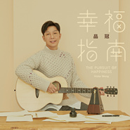

幸福指南The Pursuit Of Happiness
============================

|  |  |
| :--: | :-- |
| [ 幸福指南The Pursuit Of Happiness](https://emumo.xiami.com/album/2104808467) | **艺人**: [品冠](../index.md) **语种**: 国语 **唱片公司**: 海蝶音乐 **发行时间**: 2019年04月16日 **专辑类别**: EP, 单曲 **专辑风格**:  **播放数**: 500 **收藏数**: 3 **评论数**: 1  |

## 简介

品冠的“后幸福时代”  
2019 全新专辑 联动 巡回演唱会  
概念主题曲《幸福指南》  
人生可以自定义，幸福不能被代表  
  
品冠的“后幸福时代”，幸福无需代言人  
人生标准自定义，条条大路通幸福  
  
古希腊哲学家认为，哲学是帮助人们追寻幸福的工具。对品冠来说，音乐也是。他一路走来，用音乐讲述幸福的模样，坚定人们对幸福的信心。在刚刚过去的2018年，品冠有机会唱了许多影视作品的男主角主题曲，俨然男主角心声代言人。无论是《脱身》里陈坤饰演的乔智才、乔礼杰，还是《归去来》里罗晋的书澈，是《凉生，我们可不可以不忧伤》里钟汉良的程天佑，也是《创业时代》里黄轩的郭鑫年，他都化身音乐里的男主角，替男主角们在故事里开口。这让他体会到，其实这个时代有那么多故事，那么多形形色色的人，每个人都已经有了自己对幸福的理解。既然他可以为剧情里的男主角开口，那也可以为这人世间各种关于幸福的解读的新故事里的主人公们开口。  
  
幸福在这个主张自我个性和独立思考能力的时代已经没有了所谓统一的标准。每个时代的艺术作品，都应该反应那个时代的意志，也许曾经，那个时代的幸福的确有标准，就是家长们眼里的阖家欢乐、事业有成，但这个时代，品冠认为，并不是了。这个时代的幸福和成功一样，都没有了所谓标准，每个人可以有自己的选择，也就是自己对幸福的标准。这是一个人生可以自定义的时代。品冠称之为“后幸福时代”，觉得幸福不需要代言人。懂得尊重不同的选择，才是真的暖。  
  
《幸福指南》，没有标准，你就是幸福的标准  
品冠、易家扬、朱敬然Andrew 金曲铁三角组合 音乐“高级定制”  
  
上世纪90年代的《人间指南》编辑部的故事，用喜剧的手法，反映了那个社会巨变的大时代下，人们生活和社会观念的变迁，并获得了极大的成功，成为了一代人的记忆。然而品冠的《幸福指南》，虽然说名字是指南，但其实是一种反向操作的概念，指南并不是说教标准，而是用世界上、人间里正在发生着的事，让人们可以了解到，现在的时代不一样了，从而启发人们独立思考，自己要选什么样的人生，做什么样的人。  
  
这首被赋予了统领整张专辑的其他歌曲和演唱会内核的概念主题曲《幸福指南》，可谓是华语音乐创作界的“高级定制”。当品冠把这次的概念想法告诉著名词作人易家扬老师和已经超有默契的制作人朱敬然Andrew老师后，两位老师都相当喜欢这个概念，当下三人便投入了创作中。品冠负责写曲，家扬老师填词，朱敬然Andrew老师则思考音乐制作的部分。家扬老师举重若轻地把核心概念写进歌词里：“每个人喜欢的世界不一样……定义别人想要的梦不健康。”并表示，明白自己想要的世界和尊重别人的选择，都是需要勇气的，“定义自己的远方，远得那么勇敢”，也希望用这首歌给正在选择幸福路的朋友们力量。品冠谱曲过程中，不断地跟两位老师一起打磨和调整，旋律轻松愉快，又充满希望和积极的态度。他说歌词里的“我要翅膀，也要降落伞”，让他也反思，人生是需要取舍和选择的，无法贪心地什么都要。幸福的关键，就是知道自己真正的需求，学会取舍。制作方面，朱敬然Andrew老师为了凸显这首歌的属性，特别设计歌曲结构，让歌曲一开场就是副歌，开门见山，一下子就进入了歌的情境。他说，这也是属于这首歌的自定义结构。  
  
幸福指南编辑部 2019 概念新专辑  
三大幸福专栏，九名特约撰稿，企划音乐故事杂志概念专辑  
  
虽然表达的是最当下甚至可能有些超前的观念，但因为《人间指南》这个概念本身就自带有一种Vintage的含义，所以就彻底用Vintage的企划概念来支撑这样一个新的角度，反而会让人感受到幸福时代的变迁。在杂志这个媒体和唱片这个音乐载体都慢慢成了Vintage符号的大时代下，把唱片和杂志连接在一起，音乐的内核，杂志的外壳，特别把新专辑企划成一本音乐杂志。品冠也表示，现在音乐市场环境，能出完整唱片的机会真的越来越少，所以也很珍惜和感恩每一次做唱片的机会。  
  
专辑内每一首歌，除了主题概念曲《幸福指南》外，都是一个故事，有着不同的关于幸福的诠释角度，每一首歌的主人公，对于幸福都有自己的定义。因为故事核心不同，音乐性也就更丰富多样，因此这张专辑一共有5位知名制作人共同参与，负责用不一样的音乐属性传达各种独特面目的幸福。从pop rock到首次浅尝旋律型说唱段落，这次品冠可谓是天性大解放。根据每一首歌的精神内核，九首歌每三首在专辑内设有一个专栏：  
  
 “当幸福来敲门”：开，还是不开，这是个问题。门外那一款幸福，是你想要的么？ 这里的三个故事，分别讲述了告白的幸福（《你愿不愿意》）、认定的幸福（《My LOVE》）和吃货的幸福（《珍珠奶茶》）。  
  
 “幸福B-Side”：是痛苦和心碎，让幸福有了姓名。 这里的三个故事，分别讲述了遗憾的幸福（《上海站》）、去你的幸福（《最佳前任》）和虐恋的幸福（《暗恋美学》）。  
  
 “幸福自定义”： 幸福，就是可以自定义自己的人生。 这里的三个故事，分别讲述了单身的幸福（《1111》）、真实的幸福（《线下限定》）和自我的幸福（《投己所好》）。  
  
为此设定，企划团队特别邀请了9位优秀的撰稿人，来为这九首歌撰写歌曲相对应的故事。这9位撰稿人，有来自曾经的音乐杂志《当代歌坛》《音乐天堂》的记者和撰稿人，也有现下线上的编剧、小说作家、网文作者、自媒体作者等等。大家从各自的角度来解读每一首歌的故事。仿佛是一本“幸福音乐故事新编”。之所以会有请撰稿人写歌曲故事的想法，也是因为品冠有一个十分有才华的叫“纳兰”的上海歌迷，她会给每首品冠的歌写歌词故事，品冠觉得这种形式很有趣，也能帮听众了解歌的更多层次，所以便有了这次的特别企划。而纳兰，作为企划的起始点，也特别被邀请，来撰写其中一个故事。  
  
幸福指南 2019 巡回演唱会  
线下现场限定，一城一期一会，打造专属自定义歌单演唱会  
  
这次演唱会和新专辑，采用了一种特别的联动模式。专辑叫《幸福指南编辑部》，而2019年的巡回演唱会作为《幸福指南编辑部》的出品，就叫《幸福指南》。演唱会主体概念和段落划分，都与专辑一一对应。为此，金曲奖的视觉御用源活导演团队采用了品冠这么多次演唱会都没尝试过的一种舞台设计模式，让音乐故事感在舞台上更容易表现出来。同时，专辑内的新歌发布的节奏和巡演的城市场次时间互相配合。每一场巡演现场，都会首唱这一站前后新发布的新歌。  
  
这种联动的模式，也是品冠这些年来的一个想法。这样才能让自己的作品更完整地呈现出来，也更强调了音乐表达的内容。音乐本来就不该只有在线上用手机或者电脑来听的模式，没有线下的演出现场，就无法形成享受音乐的完整闭环。甚至对品冠来说，现场的音乐才最有魅力，他也是最享受现场演唱的过程，为了这个设定，这一次专辑制作和演唱会筹备的过程中，品冠特别尝试了一些比较适合现场气氛的节奏性比较强的歌。从而打破了之前一直罩在自己身上那个标准化暖男的壳，甚至可以说，对之前给自己设定的标准，叛逆一回。演唱会音乐总监朱敬然Andrew也表示，这是他第一次看到品冠唱这么多节奏性的快歌。品冠笑说，那可以真的是线下限定。因为每一站唱的新歌都是专门为那座城市那一场演唱会设计的。所以他说那真的是一城一期一会，一座城市仅此一次的独享，这也是品冠给每个城市歌迷的专属自定义歌单。  
  
人生自定义的歌单里，幸福，是心中的那几首主打歌。  
每个人都能在品冠的《幸福指南》里，找到属于自己的那一首。

## 曲目

- [幸福指南MVThe Pursuit Of Happiness](./2104808467/8IQU1N1702d.md)

## 评论

|  |  |  |  |
| :-- | :-- | :-- | :-- |
|  [虾米用户](https://emumo.xiami.com/u/419274927)  2020-10-31 20:21 赞(0) 踩(0) | 
不错
 |
