品冠
============================

|  |  |
| :--: | :-- |
| [ 品冠](https://i.xiami.com/victormusic) | **地区**: Malaysia 马来西亚 **风格**: 国语流行 Mandarin Pop **播放数**: 140683375 **粉丝数**: 60341 **评论数**: 618  |

## 档案

姓      名：黄品冠 
英文名：  Victor Wong 
国        籍：马来西亚 
星        座：双鱼座 
血        型：  B  型 
身        高：  178CM 
体        重：  67KG 
出     生     地：马来西亚  -  吉隆坡 
出生日期：  1972  年  2  月  26  日 
职        业：创作歌手、音乐制作人、演员 
代表作品：随时都在、蜿蜒、我以为、无可救药、掌心、门没锁等等 
配        偶：  Jennifer  （  2012  年结婚） 
儿        女：儿子  -  黄韦恩  Jayden  ；女儿  -Vivian 
爱        好：游泳、运动、听音乐 
艺人资料 
品冠，马来西亚流行歌手，活跃于华     语流行乐坛。被誉为  “  暖心情歌王     子  ”  ，早年在  “  无印良品  ”  组合时期，     大放异彩，是华语流行乐坛影响最大     的组合。从《掌心》到《想见你》，     几乎张张专辑都有白金销量的战绩。   2000  年，品冠单飞后更凭借《门没     锁》、《我以为》、《掌心》、《那     些女孩教我的事》等众多金曲树立起     个人风格极强的音乐品牌，以创作歌     手和音乐人为根基，口碑、人气、实     力皆获肯定，更借此活跃于《我是歌     手》、《蒙面歌王》、《金曲捞》、     《隐藏的歌手》、《梦想的声音》等     热门综艺、电视音乐真人秀，掀起一     波“品冠暖男热”。

## 专辑

| 名称 | 语种 | 唱片公司 | 发行时间 | 专辑类别 | 专辑风格 |
| :--: | :-- | :-- | :-- | :-- | :-- |
| [ 勇于追梦南方基金品牌歌曲](./albums/2105353937.md) | 国语 | 壹字唱片 | 2019年10月18日 | EP, 单曲 |  |
| [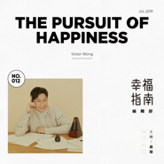 幸福指南编辑部The Pursuit of Happiness](./albums/2104967065.md) | 国语 | 海蝶音乐 | 2019年07月12日 | 录音室专辑 |  |
| [ 上海站](./albums/2105046427.md) | 国语 | 海蝶音乐 | 2019年06月21日 | EP, 单曲 |  |
| [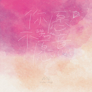 你愿不愿意](./albums/5020975682.md) | 国语 |  | 2019年05月20日 | EP, 单曲 | 流行 Pop |
| [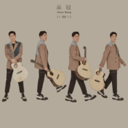 1111](./albums/2108135321.md) | 国语 | 海蝶音乐 | 2019年05月15日 | EP, 单曲 | 流行 Pop |
| [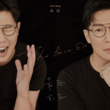 最佳前任](./albums/5020979178.md) | 国语 |  | 2019年05月08日 | EP, 单曲 | 流行 Pop |
| [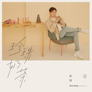 珍珠奶茶Bubble Tea](./albums/2104808484.md) | 国语 | 海蝶音乐 | 2019年04月25日 | EP, 单曲 |  |
| [ 幸福指南The Pursuit Of Happiness](./albums/2104808467.md) | 国语 | 海蝶音乐 | 2019年04月16日 | EP, 单曲 |  |
| [ 等等啊我的青春](./albums/2104698551.md) | 国语 | 星火映画 | 2019年03月22日 | EP, 单曲 | 国语流行 Mandarin Pop |
| [ 为你专属](./albums/2104122791.md) | 国语 | 仁溪文化 | 2018年10月12日 | EP, 单曲 | 电视原声 Television Music |
| [ 为你苏醒（电视剧《脱身》乔智才主题插曲）](./albums/2108150250.md) | 国语 | 华宇世博 | 2018年06月07日 | EP, 单曲 | 电视原声 Television Music |
| [ 勿念勿扰](./albums/2103730755.md) | 国语 | 海蝶音乐 | 2018年06月05日 | EP, 单曲 | 国语流行 Mandarin Pop |
| [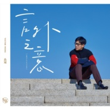 言外之意Implication](./albums/2102979814.md) | 国语 | 海蝶音乐 | 2017年12月27日 | 录音室专辑 | 国语流行 Mandarin Pop, 华语唱作人 Chinese Singer-Songwriter |
| [ 现在，你在哪里------品冠2016演唱会live精选辑I'm Still Here For You](./albums/2102978905.md) | 国语 | 种子音乐 | 2017年12月23日 | 现场专辑 | 国语流行 Mandarin Pop, 华语唱作人 Chinese Singer-Songwriter |
| [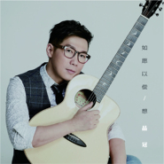 如愿以偿/想](./albums/5020893433.md) | 国语 | 海蝶音乐 | 2017年12月18日 | EP, 单曲 | 流行 Pop |
| [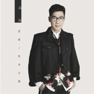 言表](./albums/5020898345.md) | 国语 | 海蝶音乐 | 2017年11月24日 | EP, 单曲 | 流行 Pop |
| [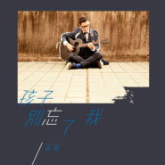 孩子别忘了我](./albums/2102861514.md) | 国语 | 海蝶音乐 | 2017年09月22日 | EP, 单曲 |  |
| [ 等](./albums/2108143241.md) | 国语 | 海蝶音乐 | 2017年08月11日 | EP, 单曲 | 国语流行 Mandarin Pop |
| [ 神奇的每一天](./albums/2100315870.md) | 国语 | 种子音乐 | 2016年04月18日 | EP, 单曲 | 国语流行 Mandarin Pop, 华语唱作人 Chinese Singer-Songwriter |
| [ 还好有你](./albums/2100215132.md) | 国语 | 种子音乐 | 2015年10月09日 | EP, 单曲 | 国语流行 Mandarin Pop |
| [ 无法理解的大人Adulthood](./albums/427341696.md) | 国语 | 种子音乐 | 2015年09月19日 | 录音室专辑 | 国语流行 Mandarin Pop, 华语唱作人 Chinese Singer-Songwriter |
| [ 随时都在I'm ALways Here](./albums/695628587.md) | 国语 | 种子音乐 | 2014年06月18日 | 录音室专辑 | 国语流行 Mandarin Pop, 华语唱作人 Chinese Singer-Songwriter |
| [ 闯关](./albums/1995632418.md) | 国语 | 相信音乐 | 2013年09月01日 | EP, 单曲 | 国语流行 Mandarin Pop, 华语唱作人 Chinese Singer-Songwriter |
| [ 下一站,幸福](./albums/5020387591.md) | 其他 |  | 2012年06月29日 | EP, 单曲 |  |
| [ 未拆的礼物](./albums/485062.md) | 国语 | 相信音乐 | 2011年12月30日 | 录音室专辑 | 国语流行 Mandarin Pop, 华语唱作人 Chinese Singer-Songwriter |
| [ 当品冠遇见几米我想记得的47件事](./albums/407820.md) | 国语 | 相信音乐 | 2010年10月09日 | 录音室专辑 | 国语流行 Mandarin Pop |
| [ 一切为了爱新歌+精选 / All For Love](./albums/333453.md) | 国语 | 相信音乐 | 2009年06月19日 | 精选集 | 国语流行 Mandarin Pop, 华语唱作人 Chinese Singer-Songwriter |
| [ 那些女孩教我的事](./albums/168021.md) | 国语 | 相信音乐 | 2008年04月18日 | 录音室专辑 | 国语流行 Mandarin Pop, 华语唱作人 Chinese Singer-Songwriter |
| [ Need U Most最需要你 - K歌情人](./albums/32580.md) | 英语 | 相信音乐 | 2007年10月05日 | 录音室专辑 | 国语流行 Mandarin Pop |
| [ 爱到无可救药](./albums/1705.md) | 国语 | 相信音乐 | 2006年11月10日 | 录音室专辑 | 国语流行 Mandarin Pop, 华语唱作人 Chinese Singer-Songwriter |
| [ 后来的我新歌+精选](./albums/167378.md) | 国语 | 滚石唱片 | 2005年06月28日 | 精选集 | 国语流行 Mandarin Pop, 华语唱作人 Chinese Singer-Songwriter |
| [ 门没锁](./albums/1708.md) | 国语 | 滚石唱片 | 2004年04月30日 | 录音室专辑 | 国语流行 Mandarin Pop, 华语唱作人 Chinese Singer-Songwriter |
| [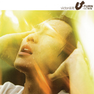 U-Turn 180°转弯](./albums/1709.md) | 国语 | 滚石唱片 | 2002年06月18日 | 录音室专辑 | 国语流行 Mandarin Pop, 华语唱作人 Chinese Singer-Songwriter |
| [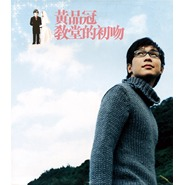 教堂的初吻](./albums/1710.md) | 国语 | 滚石唱片 | 2002年06月07日 | EP, 单曲 | 国语流行 Mandarin Pop, 粤语流行 Cantopop, 华语唱作人 Chinese Singer-Songwriter |
| [ 疼你的责任](./albums/1711.md) | 国语 | 滚石唱片 | 2001年03月28日 | 录音室专辑 | 国语流行 Mandarin Pop, 华语唱作人 Chinese Singer-Songwriter |
| [ 自创品牌品冠1996-2000创作记录](./albums/1712.md) | 国语 | 滚石唱片 | 2001年03月23日 | 精选集 | 国语流行 Mandarin Pop, 华语唱作人 Chinese Singer-Songwriter |

## 评论

|  |  |  |
| :-- | :-- | :-- |
|  [虾米用户](https://emumo.xiami.com/u/445989676) 如果音乐足够动人 2020-11-27 10:53 赞(0) 踩(0) | 
比光良好听一百倍，光良只要不唱歌，他是有才华的，真的受不了光良的声音，我知道这样说不好，但是我就是不喜欢他的声音
 |
|  [虾米用户](https://emumo.xiami.com/u/299698061) 俯身躬耕 仰望星空 浮云... 2020-10-18 03:11 赞(0) 踩(0) | 
帅！
 |
|  [虾米用户](https://emumo.xiami.com/u/445051236)  2020-10-09 19:48 赞(0) 踩(0) | 
国内歌手中最温柔的声音
 |
|  [虾米用户](https://emumo.xiami.com/u/52311837)   2020-09-21 22:51 赞(2) 踩(0) | 
没办法抗拒的声音 第一次听就无法自拔的沦陷 这个声音就是为唱情歌而生的。如果一直唱情歌应该会红到发紫 。每次听他的声音都心动止不住的心动呀！脾气再不好都不忍心发作的感觉 
 |
|  [虾米用户](https://emumo.xiami.com/u/302935551)  2020-06-10 09:49 赞(0) 踩(0) | 
你现在很幸福，从无印良品开始喜欢你们
 |
|  [虾米用户](https://emumo.xiami.com/u/83964128) 誓死捍卫铲屎官的荣耀！ 2020-05-04 11:31 赞(0) 踩(0) | 
无印良品真的是经典中的经典
 |
|  [虾米用户](https://emumo.xiami.com/u/189389241)   2020-04-24 00:15 赞(0) 踩(0) | 
品冠 很帅 很有魅力！
 |
|  [虾米用户](https://emumo.xiami.com/u/431425058)  2020-03-16 14:07 赞(0) 踩(0) | 
加油啦
 |
|  [虾米用户](https://emumo.xiami.com/u/318132) 抠啦 2020-03-10 12:27 赞(0) 踩(0) | 
欢迎品冠新专辑版权回归虾米，撒花
 |
|  [虾米用户](https://emumo.xiami.com/u/411339268) 为你钟情 2020-02-26 10:07 赞(0) 踩(0) | 
❤️
 |
|  [虾米用户](https://emumo.xiami.com/u/437581471) 清风扶杨柳，嗯！是春天来... 2020-01-29 07:44 赞(0) 踩(0) | 
喜欢你，尤其是你和梁静茹唱的情歌，很好听哦！
 |
|  [虾米用户](https://emumo.xiami.com/u/346908344) 我的世界 2019-09-05 20:58 赞(0) 踩(0) | 
胡夏的赶jio
 |
|  [虾米用户](https://emumo.xiami.com/u/85008772)  2019-08-19 10:32 赞(0) 踩(0) | 
品冠的声音太治愈了
 |
|  [虾米用户](https://emumo.xiami.com/u/189389241)   2019-04-30 02:39 赞(0) 踩(0) | 

 |
|  [虾米用户](https://emumo.xiami.com/u/423200595)  2019-04-15 09:21 赞(0) 踩(0) | 
那首歌最好听
 |
|  [虾米用户](https://emumo.xiami.com/u/31806133) 暂无签名~ 2019-02-27 08:05 赞(0) 踩(0) | 
昨天是品冠生日？迟到的生日快乐 
 |
|  [虾米用户](https://emumo.xiami.com/u/44704643) 終于等到妳 2019-02-26 22:56 赞(0) 踩(0) | 
95年一枚，喜欢无印良品7年，身边几乎没遇见一起喜欢品冠的人，就这么收藏起来吧，一个人偷偷听 毕竟有些好东西还是一个人享用更好些
 |
|  [虾米用户](https://emumo.xiami.com/u/315976506)  2019-02-26 13:35 赞(1) 踩(0) | 
暖心的歌    最喜欢那首我以为
 |
|  [虾米用户](https://emumo.xiami.com/u/201710129) 为你我想做更好的人。 ❤ 2019-02-26 12:37 赞(0) 踩(0) | 
偶像生日快乐！
 |
|  [虾米用户](https://emumo.xiami.com/u/329813215) 听，最内心的声音！ 2019-02-26 11:43 赞(0) 踩(0) | 
又一年又三年，乃流王于彘！记得你的那些温暖歌声，生日快乐
 |
|  [虾米用户](https://emumo.xiami.com/u/122670826) 我还没想好要写什么... 2019-01-31 18:53 赞(0) 踩(0) | 
他是五月天的成员吗
 |
| ⇒ |  [虾米用户](https://emumo.xiami.com/u/329813215) 听，最内心的声音！ 2019-02-26 11:43 赞(0) 踩(0) | 
你是魔鬼么哈哈哈 他之前在无印良品组合之一，另外一个叫光良！
 |
| ⇒ |  [虾米用户](https://emumo.xiami.com/u/31806133) 暂无签名~ 2019-02-27 08:06 赞(0) 踩(0) | 
是和五月天的有个人很像
 |
|  [虾米用户](https://emumo.xiami.com/u/412757740)  2019-01-22 20:04 赞(0) 踩(0) | 
黄品冠 祖籍广东揭西县坪上镇记得08年他父亲带他回来一次
 |
|  [虾米用户](https://emumo.xiami.com/u/8070377) 爱雾瑞性维欧腐漏 2019-01-02 13:52 赞(0) 踩(0) | 
老黄原来你比老黄小两岁啊
 |
|  [虾米用户](https://emumo.xiami.com/u/293692544) 你敢给我说话吗？我咬你 2018-12-09 09:52 赞(1) 踩(0) | 
好听
 |
|  [虾米用户](https://emumo.xiami.com/u/293692544) 你敢给我说话吗？我咬你 2018-11-28 05:20 赞(1) 踩(0) | 
好听
 |
|  [虾米用户](https://emumo.xiami.com/u/254076093) 感时花溅泪 恨别鸟惊心 2018-11-27 13:46 赞(1) 踩(0) | 
一直以为是台湾人。。
 |
|  [虾米用户](https://emumo.xiami.com/u/293692544) 你敢给我说话吗？我咬你 2018-11-21 17:17 赞(2) 踩(0) | 
好听
 |
|  [虾米用户](https://emumo.xiami.com/u/85008772)  2018-10-08 20:19 赞(1) 踩(0) | 
以前感觉一般，现在听了他的歌都很熟悉  明明以前没听过
 |
|  [虾米用户](https://emumo.xiami.com/u/244849832)  2018-09-08 09:30 赞(5) 踩(0) | 
喜欢无印良品，喜欢品冠，也喜欢光良，总能在他们的音乐中找到自己内心深处的东西，二十年前高中时候的故事用上心头，有甜蜜、有遗憾，更多的是回忆。
 |
|  [虾米用户](https://emumo.xiami.com/u/379766420)  2018-09-07 10:11 赞(1) 踩(0) | 
多年前不知道原来无印良品里面还有一个品冠，那时喜欢听这个声音以为光良就是他。就好像那年阴错阳差的心动
 |
|  [虾米用户](https://emumo.xiami.com/u/8070377) 爱雾瑞性维欧腐漏 2018-08-31 20:46 赞(2) 踩(0) | 
你走了 我住在雨里面
 |
|  [虾米用户](https://emumo.xiami.com/u/198863404)  2018-08-19 22:20 赞(3) 踩(0) | 
高中喜欢到现在，很温暖的声音。无法理解的大人最近听得好多
 |
|  [虾米用户](https://emumo.xiami.com/u/2387152)  2018-08-14 12:27 赞(3) 踩(0) | 
二十多年的老粉路过。 
 |
|  [虾米用户](https://emumo.xiami.com/u/248481521) 我还没想好要写什么... 2018-08-06 01:19 赞(1) 踩(0) | 
声音好温暖
 |
|  [虾米用户](https://emumo.xiami.com/u/139741578) 我还没想好要写什么... 2018-07-04 00:42 赞(2) 踩(0) | 
高中开始听，十七年了，最爱的还是他的声音
 |
|  [虾米用户](https://emumo.xiami.com/u/13413786) 加我微信TGSshell... 2018-05-31 13:52 赞(2) 踩(0) | 
可惜了 听不了言外之意
 |
|  [虾米用户](https://emumo.xiami.com/u/223878270)  2018-05-27 15:32 赞(1) 踩(0) | 
绿
 |
|  [虾米用户](https://emumo.xiami.com/u/266094375) 过去我们喜欢新的歌，现在... 2018-05-21 15:37 赞(3) 踩(0) | 
长大了，才发现你，品哥&amp;hellip;&amp;hellip;的歌每一首都是送给过去得我们的  还好我现在喜欢品哥还不晚  
 |
|  [虾米用户](https://emumo.xiami.com/u/215039028)  2018-05-07 19:18 赞(2) 踩(0) | 
这声音可以温暖岁月，追忆青春
 |
|  [虾米用户](https://emumo.xiami.com/u/343864483) 陆六6⑥ 2018-05-05 22:22 赞(1) 踩(0) | 
看了介绍，才知道他的籍贯，老乡啊！！！！
 |
|  [虾米用户](https://emumo.xiami.com/u/193007032)  2018-04-24 10:12 赞(2) 踩(0) | 
以前的歌多好听  滚石那个时代  那个时代过去了  我们也老了  听了二十年 还是他的声音最入耳
 |
|  [虾米用户](https://emumo.xiami.com/u/3941600)  2018-03-19 15:23 赞(2) 踩(0) | 
品冠的很多歌曲都是和失恋有关的，总觉得像专注失恋二十年前
 |
|  [虾米用户](https://emumo.xiami.com/u/112247) 西区苛刻 2018-02-11 22:21 赞(1) 踩(0) | 
虾米好像缺了《教我如何不想你》
 |
|  [虾米用户](https://emumo.xiami.com/u/326479694) 夜盲晚期 2018-01-24 23:18 赞(1) 踩(0) | 
品冠，我早年的男神
 |
|  [虾米用户](https://emumo.xiami.com/u/393635)  2017-12-27 06:57 赞(1) 踩(0) | 
好好好
 |
|  [虾米用户](https://emumo.xiami.com/u/329727717)  2017-12-17 22:35 赞(1) 踩(0) | 
我不愿让你一个人，心都化了
 |
|  [虾米用户](https://emumo.xiami.com/u/338660396)   2017-12-05 10:07 赞(6) 踩(0) | 
高中爱无印良品爱到钱包里面都是他们的照片 
 |
| ⇒ |  [虾米用户](https://emumo.xiami.com/u/21960748) 财上平如水，人中直似衡 2018-02-07 09:07 赞(0) 踩(0) | 
都暴露年龄了，同为八零后 
 |
| ⇒ |  [虾米用户](https://emumo.xiami.com/u/338660396)   2018-02-23 21:37 赞(0) 踩(0) | 
<q><b>子文说：</b></q>
 |
|  [虾米用户](https://emumo.xiami.com/u/140033252)  2017-11-17 13:01 赞(1) 踩(0) | 
暖男情歌典范
 |
|  [虾米用户](https://emumo.xiami.com/u/335554621) 品迷 2017-11-15 22:55 赞(3) 踩(0) | 
很优秀的音乐人，用心做音乐的歌手
 |
|  [虾米用户](https://emumo.xiami.com/u/311479018)   2017-10-30 14:27 赞(1) 踩(0) | 
嗯嗯
 |
|  [虾米用户](https://emumo.xiami.com/u/302034872)  2017-09-02 03:30 赞(7) 踩(0) | 
一个爱上就不会离开的声音
 |
|  [虾米用户](https://emumo.xiami.com/u/118428)  2017-08-18 13:50 赞(1) 踩(0) | 
马来式情歌
 |
|  [虾米用户](https://emumo.xiami.com/u/318785903)  2017-08-11 23:13 赞(14) 踩(0) | 
高中时代一直听品冠的歌，还唱着他的我以为上了学校五四晚会的舞台。今晚突然想起爱情不能做比较，几个大音乐播放器都没找到，微博上才找到虾米音乐有，为了品冠下的虾米。
 |
|  [虾米用户](https://emumo.xiami.com/u/310898848) 微笑天使 2017-08-10 08:35 赞(1) 踩(0) | 
shenqing.
 |
|  [虾米用户](https://emumo.xiami.com/u/202748785) 我还没想好要写什么... 2017-08-09 21:47 赞(2) 踩(0) | 
最喜欢的男歌手
 |
|  [虾米用户](https://emumo.xiami.com/u/311101913)  2017-07-15 17:35 赞(12) 踩(0) | 
声音温暖，光良品冠是永远的好兄弟。
 |
|  [虾米用户](https://emumo.xiami.com/u/279067558) 。 2017-07-05 23:53 赞(2) 踩(0) | 
怪我最近才喜欢上听品的歌
 |
|  [虾米用户](https://emumo.xiami.com/u/246125212)  2017-07-05 07:48 赞(2) 踩(0) | 
网易没有版权 
 |
|  [虾米用户](https://emumo.xiami.com/u/1606286)  2017-07-03 22:20 赞(3) 踩(0) | 
温暖的品冠，温暖的声音 温暖了我的成长、温暖了我的青春 
 |
|  [虾米用户](https://emumo.xiami.com/u/308104834)  2017-06-28 14:45 赞(3) 踩(0) | 
网易云、QQ音乐都没有品冠版权。听说虾米有，专门下的。。。
 |
|  [虾米用户](https://emumo.xiami.com/u/41038441)  2017-06-22 15:42 赞(6) 踩(0) | 
整个孕期宝宝最喜欢的就是品冠的歌！
 |
|  [虾米用户](https://emumo.xiami.com/u/292176162) 生命的具象，原来只是幻象... 2017-06-10 19:09 赞(15) 踩(0) | 
阿信为品冠写了几首歌呢，他演绎地很到位，挺喜欢他的
 |
|  [虾米用户](https://emumo.xiami.com/u/293362018)  2017-05-02 21:22 赞(3) 踩(0) | 
品冠很棒
 |
|  [虾米用户](https://emumo.xiami.com/u/282929177) 爱听歌 爱虾米 2017-04-29 07:08 赞(7) 踩(0) | 
品冠存在感就那么差吗
 |
|  [虾米用户](https://emumo.xiami.com/u/289802484)  2017-04-19 10:14 赞(2) 踩(0) | 
回忆
 |
|  [虾米用户](https://emumo.xiami.com/u/132099220)  2017-04-16 19:59 赞(2) 踩(0) | 
回忆
 |
|  [虾米用户](https://emumo.xiami.com/u/263448141)  2017-04-03 19:17 赞(8) 踩(0) | 
十几年了，一直最爱的声音
 |
|  [虾米用户](https://emumo.xiami.com/u/39595954)  就是这样 2017-04-02 13:20 赞(2) 踩(0) | 
有心的声音
 |
|  [虾米用户](https://emumo.xiami.com/u/282929177) 爱听歌 爱虾米 2017-03-25 15:12 赞(8) 踩(0) | 
喜欢品冠的笑，因为品冠的笑有一种正能量。
 |
|  [虾米用户](https://emumo.xiami.com/u/282929177) 爱听歌 爱虾米 2017-03-25 15:11 赞(2) 踩(0) | 
疼你的责任确实是一张非常好的专辑。 我非常爱品冠，支持品冠！
 |
|  [虾米用户](https://emumo.xiami.com/u/282929177) 爱听歌 爱虾米 2017-03-25 15:10 赞(16) 踩(0) | 
我认识的这几位男艺人当中，只有品冠唱出的时光，唱出了回忆，并唱出了我们的青春。
 |
| ⇒ |  [虾米用户](https://emumo.xiami.com/u/286942586)  2017-04-21 17:51 赞(0) 踩(0) | 
y
 |
|  [虾米用户](https://emumo.xiami.com/u/47929546)   2017-03-22 22:42 赞(20) 踩(0) | 
从云村滚过来的，云村的品冠的歌几乎全被版权了，可见品冠的歌是被云村当作付费精品的
 |
|  [虾米用户](https://emumo.xiami.com/u/280732010)  2017-03-18 18:54 赞(0) 踩(0) | 
我以为
 |
|  [虾米用户](https://emumo.xiami.com/u/280505139)  2017-03-15 11:37 赞(0) 踩(0) | 
因为
 |
|  [虾米用户](https://emumo.xiami.com/u/180758110)  2017-03-10 21:20 赞(0) 踩(0) | 
老哥才是经典
 |
|  [虾米用户](https://emumo.xiami.com/u/9837085)  2017-02-25 14:32 赞(3) 踩(0) | 
戳中内心的声音，喜欢他快20年了
 |
|  [虾米用户](https://emumo.xiami.com/u/4381399)   2017-02-23 17:39 赞(2) 踩(0) | 
喜欢这种清新的声音慢慢的唱着，淡淡的讲着，那段与感情有关的故事。
 |
|  [虾米用户](https://emumo.xiami.com/u/119985152)  2017-02-21 22:54 赞(3) 踩(0) | 
品冠最棒！我青春的记忆
 |
|  [虾米用户](https://emumo.xiami.com/u/250002674)   2017-02-20 22:25 赞(0) 踩(0) | 
所以淘汰出局哈哈哈哈  
 |
|  [虾米用户](https://emumo.xiami.com/u/97747450) 我还没想好要写什么... 2017-02-15 23:59 赞(0) 踩(0) | 
8008
 |
|  [虾米用户](https://emumo.xiami.com/u/108140644)  2017-02-04 21:49 赞(2) 踩(0) | 
品冠的歌百听不厌。
 |
|  [虾米用户](https://emumo.xiami.com/u/35577075) 再见 2017-01-26 19:04 赞(1) 踩(0) | 
好多好歌啊！
 |
|  [虾米用户](https://emumo.xiami.com/u/181365310)  2017-01-12 09:32 赞(2) 踩(0) | 
品冠，一直想告诉你，我有多么的爱你
 |
|  [虾米用户](https://emumo.xiami.com/u/181365310)  2017-01-10 17:24 赞(21) 踩(0) | 
特地下了虾米音乐就是为了听品冠的歌！
 |
|  [虾米用户](https://emumo.xiami.com/u/258328029)  2016-12-31 16:00 赞(3) 踩(0) | 
这个APP冠哥的歌曲比较齐全。   
 |
|  [虾米用户](https://emumo.xiami.com/u/23734940)  2016-12-30 23:00 赞(0) 踩(0) | 
dddddddd
 |
|  [虾米用户](https://emumo.xiami.com/u/40988076) 暂无签名~ 2016-12-25 18:02 赞(1) 踩(0) | 
喜欢他的声音，特别抒情
 |
|  [虾米用户](https://emumo.xiami.com/u/249937070) 人生若无悔放下过去归零 2016-12-20 19:36 赞(2) 踩(0) | 
一个人的思维意识和观念是多年的受教育经历阅历共同累积形成的结果。所以，不要指望你的三言两语就能改变别人对事物的认知和理解。绝大多数试图说服别人的行为都是以卵击石，都是徒劳的，只会令别人心生厌烦。与人交流时，表达清楚自己的观点即可，求同存异才是君子之交。
 |
|  [虾米用户](https://emumo.xiami.com/u/255061455)  2016-12-17 20:15 赞(0) 踩(0) | 
永恒的无印良品，永远的品冠
 |
|  [虾米用户](https://emumo.xiami.com/u/30193669)  2016-11-21 16:11 赞(1) 踩(0) | 
从品冠的歌里，可以听到从一开始的暗恋到热恋到最后分开的各种心情，听歌可能听的就是心情和自己
 |
|  [虾米用户](https://emumo.xiami.com/u/11065541) 从音乐中找感觉 2016-11-19 16:19 赞(0) 踩(0) | 
回忆青春回忆感情时，就来听他的歌．．．．
 |
|  [虾米用户](https://emumo.xiami.com/u/246706132)  2016-11-17 07:22 赞(3) 踩(0) | 
第一次知道他 是在14年一个喜欢我的男孩子唱给我听的 我并不喜欢他 可是他很喜欢我 后来他邀请我去ktv玩他唱给了我听 当时泪崩  记忆深刻  从此爱上品冠
 |
| ⇒ |  [虾米用户](https://emumo.xiami.com/u/22862035) 无品冠不音乐 2016-11-22 11:03 赞(0) 踩(0) | 
你爱上那个男生了吗？
 |
|  [虾米用户](https://emumo.xiami.com/u/6820570) 这是语言的变调，承接醒来... 2016-11-15 21:42 赞(2) 踩(0) | 
品冠的声音顺毛能力max
 |
|  [虾米用户](https://emumo.xiami.com/u/5159349) 我还没想好要写什么... 2016-11-08 16:24 赞(0) 踩(0) | 
喜欢他
 |
|  [虾米用户](https://emumo.xiami.com/u/194855860)  2016-11-06 21:37 赞(0) 踩(0) | 
适合KTV，哈哈
 |
|  [虾米用户](https://emumo.xiami.com/u/237564439)   2016-10-21 16:40 赞(1) 踩(0) | 
喜欢
 |
|  [虾米用户](https://emumo.xiami.com/u/185037)  2016-09-21 14:44 赞(0) 踩(0) | 
温暖的声音
 |
|  [虾米用户](https://emumo.xiami.com/u/185037)  2016-09-21 14:44 赞(0) 踩(0) | 
温暖的声音
 |
|  [虾米用户](https://emumo.xiami.com/u/193472789)  2016-09-15 11:55 赞(1) 踩(0) | 
品冠最喜欢的歌手是周华健
 |
|  [虾米用户](https://emumo.xiami.com/u/98319814)   2016-09-06 17:36 赞(0) 踩(0) | 
从小到大的偶像 从无印良品到单飞 永远支持你
 |
|  [虾米用户](https://emumo.xiami.com/u/37794162)  2016-09-02 10:48 赞(1) 踩(0) | 
十几年了 一直爱的声音
 |
|  [虾米用户](https://emumo.xiami.com/u/164697708)  2016-07-31 12:06 赞(2) 踩(0) | 
听过最好听的声音
 |
|  [虾米用户](https://emumo.xiami.com/u/206027750)  2016-07-28 10:16 赞(1) 踩(0) | 
這個社會都太緊張快速了, 多點温暖人心的聲音, 希望社會更多的温暖。
 |
|  [虾米用户](https://emumo.xiami.com/u/16251023) 1个聪明lū 2016-07-20 21:40 赞(1) 踩(0) | 
老是要把他跟陶喆混掉……怎么办
 |
|  [虾米用户](https://emumo.xiami.com/u/9941617)  2016-06-25 09:33 赞(3) 踩(0) | 
第一次见他是在我歌，在各个浮夸的歌手之间，只有他，安静地坐着，用他独特的声音静静地唱着，这才是真正的歌手。
 |
| ⇒ |  [虾米用户](https://emumo.xiami.com/u/195256023)  2017-01-22 02:01 赞(0) 踩(0) | 
你错过了无印良品。好蓝瘦 
 |
|  [虾米用户](https://emumo.xiami.com/u/191525904)  2016-06-18 23:53 赞(4) 踩(0) | 
歌坛暖男，讲话唱歌的嗓音都很酥～
 |
|  [虾米用户](https://emumo.xiami.com/u/16706052) Preparing... 2016-06-06 22:28 赞(1) 踩(0) | 
品冠,温柔,治愈,温暖,我以为
 |
|  [虾米用户](https://emumo.xiami.com/u/176938188) 一辈子都要保持一颗单纯善... 2016-05-22 20:36 赞(2) 踩(0) | 
最清新温暖的声音，感动的时候，心情不平静的时候，不能听品冠的歌，因为眼泪不够流   
 |
|  [虾米用户](https://emumo.xiami.com/u/31806133) 暂无签名~ 2016-05-22 15:36 赞(0) 踩(0) | 
额。。说他歌写的不好。。。我觉得好
 |
|  [虾米用户](https://emumo.xiami.com/u/126008948) 王厂长的小迷妹 2016-05-13 22:37 赞(1) 踩(0) | 
冠哥，您一直都在，我也一直都在
 |
|  [虾米用户](https://emumo.xiami.com/u/126008948) 王厂长的小迷妹 2016-05-13 22:37 赞(0) 踩(0) | 
品冠，我心目中的偶像男神和暖男，我永远爱您支持您！
 |
|  [虾米用户](https://emumo.xiami.com/u/72666568)  2016-05-11 19:11 赞(0) 踩(0) | 
你一直都在
 |
|  [虾米用户](https://emumo.xiami.com/u/151349584)  2016-04-25 18:39 赞(0) 踩(0) | 
求一首我最亲爱的原版伴奏
 |
|  [虾米用户](https://emumo.xiami.com/u/39325345)  2016-04-22 20:40 赞(0) 踩(0) | 
声音: 穿透细胞的温柔， 安抚了谁的情绪， 包容了谁的不解， 平静了谁的生命， 谢冠哥的存在，美好了声音
 |
|  [虾米用户](https://emumo.xiami.com/u/51574163) 为你我想做很好的人 2016-04-17 14:45 赞(0) 踩(0) | 
对品冠，多年的喜欢已经无需再提。原谅系情歌代言人，黄品冠，动听的暖声一直都将我抚慰。
 |
|  [虾米用户](https://emumo.xiami.com/u/98070144)  2016-04-13 22:32 赞(0) 踩(0) | 
干净温暖~老板的一贯风格
 |
|  [虾米用户](https://emumo.xiami.com/u/130376412)  2016-04-01 02:31 赞(0) 踩(0) | 
很喜欢无印良品的歌
 |
|  [虾米用户](https://emumo.xiami.com/u/185279)  2016-03-16 22:35 赞(0) 踩(0) | 
因为白大哥吧
 |
|  [虾米用户](https://emumo.xiami.com/u/185279)  2016-03-16 22:35 赞(0) 踩(0) | 
因为白大哥吧
 |
|  [虾米用户](https://emumo.xiami.com/u/52382077)   2016-02-16 12:43 赞(0) 踩(0) | 
声音真的超好听的啊
 |
|  [虾米用户](https://emumo.xiami.com/u/11833355) 我还没想好要写什么... 2016-02-10 23:25 赞(0) 踩(0) | 
品冠，你的聲音治癒了多少人的不眠夜。
 |
|  [虾米用户](https://emumo.xiami.com/u/8590156) 暂无签名~ 2016-01-23 13:32 赞(0) 踩(0) | 
自从品冠结婚后就没听他的歌了.现在重新听下. 
 |
|  [虾米用户](https://emumo.xiami.com/u/101917310)  2016-01-21 15:02 赞(0) 踩(0) | 
 
 |
|  [虾米用户](https://emumo.xiami.com/u/33961548) ♪ 2016-01-11 16:14 赞(3) 踩(0) | 
声音太好听。从初中喜欢这个声音喜欢了七年了。虽然他歌写得不好，但是这幅嗓子唱别人的歌能唱得比什么都好听啊。
 |
| ⇒ |  [虾米用户](https://emumo.xiami.com/u/51800191)  2016-04-09 01:06 赞(0) 踩(0) | 
你好呵呵
 |
|  [虾米用户](https://emumo.xiami.com/u/95213840)  2015-12-28 05:56 赞(1) 踩(0) | 
听着你的歌声。就感觉心里舒服温暖。也不知道怎么了
 |
|  [虾米用户](https://emumo.xiami.com/u/20990771) 听音乐是每天的必修课 2015-12-27 21:25 赞(1) 踩(0) | 
暖男啊 好老公模板 
 |
|  [虾米用户](https://emumo.xiami.com/u/12900556) 有關音樂的一切 2015-12-20 11:38 赞(2) 踩(0) | 
只要這聲音能溫暖我們的心 當一世暖男又何妨？
 |
|  [虾米用户](https://emumo.xiami.com/u/85935980)  2015-12-17 08:15 赞(0) 踩(0) | 
温暖
 |
|  [虾米用户](https://emumo.xiami.com/u/91674296) 最爱马卡龙 O(∩_∩)... 2015-12-15 03:28 赞(0) 踩(0) | 
超爱&amp;lt;&amp;lt;我是歌手&amp;gt;&amp;gt;那次唱我最亲爱的，一级棒   
 |
|  [虾米用户](https://emumo.xiami.com/u/10983386) 瘦子 朝夕奔梦 2015-12-13 22:41 赞(0) 踩(0) | 
音色真不错
 |
|  [虾米用户](https://emumo.xiami.com/u/89327720)  2015-12-06 23:21 赞(0) 踩(0) | 
好听
 |
|  [虾米用户](https://emumo.xiami.com/u/1296817) 我还没想好要写什么... 2015-12-04 16:11 赞(0) 踩(0) | 
感觉胡夏和他的定位非常像
 |
|  [虾米用户](https://emumo.xiami.com/u/55166493)  2015-11-26 21:51 赞(0) 踩(0) | 
sdws
 |
|  [虾米用户](https://emumo.xiami.com/u/84611638) 我就是我，不一样的烟火！ 2015-11-22 21:08 赞(0) 踩(0) | 
听到他的声音，如此窝心……暖心的歌手，暖心的歌……很多都是经典！
 |
| ⇒ |  [虾米用户](https://emumo.xiami.com/u/51800191)  2016-04-09 01:07 赞(0) 踩(0) | 
你好呵呵
 |
|  [虾米用户](https://emumo.xiami.com/u/45869152) 夏天真烦人 2015-11-21 22:23 赞(1) 踩(0) | 
第一次听品冠的歌时候，不大有感觉，手机任意循环多次了以后耳朵就像怀孕了般，戒不掉……像讲故事般的歌声
 |
|  [虾米用户](https://emumo.xiami.com/u/83737564)  2015-11-18 17:23 赞(0) 踩(0) | 
温暖的歌声
 |
|  [虾米用户](https://emumo.xiami.com/u/58835574)  2015-11-14 09:09 赞(0) 踩(0) | 
我最亲爱的怎么没有阿
 |
|  [虾米用户](https://emumo.xiami.com/u/56164335) 若想如何，全凭自己。 2015-11-09 01:02 赞(0) 踩(0) | 
“天都黑了谁都没来过没来坐。”
 |
|  [虾米用户](https://emumo.xiami.com/u/36081194) 酷狗音乐，一个有老歌的地... 2015-11-04 09:27 赞(0) 踩(0) | 
喜欢
 |
|  [虾米用户](https://emumo.xiami.com/u/12989471)  2015-11-03 15:19 赞(0) 踩(0) | 
声音如此温柔
 |
|  [虾米用户](https://emumo.xiami.com/u/6215578) 他诚恳 才不让你等 2015-10-25 22:20 赞(0) 踩(0) | 
太温柔
 |
|  [虾米用户](https://emumo.xiami.com/u/66977974)  2015-10-12 11:10 赞(0) 踩(0) | 
丑死了，跟林俊杰有一拼
 |
| ⇒ |  [虾米用户](https://emumo.xiami.com/u/1132252)  2015-10-24 16:53 赞(0) 踩(0) | 
拼不过
 |
| ⇒ |  [虾米用户](https://emumo.xiami.com/u/91674296) 最爱马卡龙 O(∩_∩)... 2015-12-15 03:25 赞(0) 踩(0) | 
这算好评还是差评啊？没看懂呢！！！不同风格也能放一起比？你是萧煌奇吗？
 |
| ⇒ |  [虾米用户](https://emumo.xiami.com/u/51812346) 此时 这儿 我 2015-12-27 16:41 赞(0) 踩(0) | 
拿毛线拼！
 |
|  [虾米用户](https://emumo.xiami.com/u/71448296)   2015-10-03 21:12 赞(0) 踩(0) | 
一如既往的支持
 |
|  [虾米用户](https://emumo.xiami.com/u/71444950)   2015-10-03 21:00 赞(0) 踩(0) | 
好看
 |
|  [虾米用户](https://emumo.xiami.com/u/71441784)   2015-10-03 20:49 赞(0) 踩(0) | 
好听
 |
|  [虾米用户](https://emumo.xiami.com/u/71438944)  2015-10-03 20:39 赞(0) 踩(0) | 
好听
 |
|  [虾米用户](https://emumo.xiami.com/u/71435954)  2015-10-03 20:28 赞(0) 踩(0) | 
好听
 |
|  [虾米用户](https://emumo.xiami.com/u/71432488)   2015-10-03 20:16 赞(0) 踩(0) | 
好听
 |
|  [虾米用户](https://emumo.xiami.com/u/71425750)   2015-10-03 19:53 赞(0) 踩(0) | 
好听
 |
|  [虾米用户](https://emumo.xiami.com/u/71422572)   2015-10-03 19:42 赞(0) 踩(0) | 
加油
 |
|  [虾米用户](https://emumo.xiami.com/u/71415172)   2015-10-03 19:14 赞(0) 踩(0) | 
加油！
 |
|  [虾米用户](https://emumo.xiami.com/u/71412316)   2015-10-03 19:04 赞(0) 踩(0) | 
好听
 |
|  [虾米用户](https://emumo.xiami.com/u/71391440)   2015-10-03 17:37 赞(0) 踩(0) | 
真好听啊
 |
| ⇒ |  [虾米用户](https://emumo.xiami.com/u/74791348) 南风熏昼长 2016-02-08 01:52 赞(0) 踩(0) | 
名字可以
 |
|  [虾米用户](https://emumo.xiami.com/u/71389178)   2015-10-03 17:26 赞(0) 踩(0) | 
好听
 |
|  [虾米用户](https://emumo.xiami.com/u/71378148)   2015-10-03 16:38 赞(0) 踩(0) | 
好听
 |
|  [虾米用户](https://emumo.xiami.com/u/71374666)   2015-10-03 16:23 赞(0) 踩(0) | 
好听
 |
|  [虾米用户](https://emumo.xiami.com/u/71372070)   2015-10-03 16:10 赞(0) 踩(0) | 
真好听
 |
|  [虾米用户](https://emumo.xiami.com/u/71368630)   2015-10-03 15:56 赞(0) 踩(0) | 
好听
 |
|  [虾米用户](https://emumo.xiami.com/u/71365566)   2015-10-03 15:42 赞(0) 踩(0) | 
真好听
 |
|  [虾米用户](https://emumo.xiami.com/u/71362576)   2015-10-03 15:27 赞(0) 踩(0) | 
爱你品冠哥哥
 |
|  [虾米用户](https://emumo.xiami.com/u/71309874)   2015-10-03 11:30 赞(0) 踩(0) | 
加油哥哥
 |
|  [虾米用户](https://emumo.xiami.com/u/71307444)   2015-10-03 11:20 赞(0) 踩(0) | 
还不错
 |
|  [虾米用户](https://emumo.xiami.com/u/71224076)   2015-10-02 22:47 赞(0) 踩(0) | 
爱你哥哥
 |
|  [虾米用户](https://emumo.xiami.com/u/71221246)   2015-10-02 22:35 赞(0) 踩(0) | 
好听
 |
|  [虾米用户](https://emumo.xiami.com/u/71217938)   2015-10-02 22:21 赞(0) 踩(0) | 
真是好听死了
 |
|  [虾米用户](https://emumo.xiami.com/u/71214724)   2015-10-02 22:09 赞(0) 踩(0) | 
真好听
 |
|  [虾米用户](https://emumo.xiami.com/u/71208978)   2015-10-02 21:49 赞(0) 踩(0) | 
好听
 |
|  [虾米用户](https://emumo.xiami.com/u/71205700)   2015-10-02 21:37 赞(0) 踩(0) | 
好听
 |
|  [虾米用户](https://emumo.xiami.com/u/71202104)   2015-10-02 21:25 赞(0) 踩(0) | 
真好听
 |
|  [虾米用户](https://emumo.xiami.com/u/71199046)   2015-10-02 21:14 赞(0) 踩(0) | 
你真棒
 |
|  [虾米用户](https://emumo.xiami.com/u/71196154)  2015-10-02 21:03 赞(0) 踩(0) | 
哥哥加油
 |
|  [虾米用户](https://emumo.xiami.com/u/71191580)   2015-10-02 20:48 赞(0) 踩(0) | 
好听
 |
|  [虾米用户](https://emumo.xiami.com/u/71188022)   2015-10-02 20:36 赞(0) 踩(0) | 
听现场才最厉害
 |
|  [虾米用户](https://emumo.xiami.com/u/71183822)   2015-10-02 20:23 赞(0) 踩(0) | 
圣安庭很好听
 |
|  [虾米用户](https://emumo.xiami.com/u/71164940)   2015-10-02 19:16 赞(0) 踩(0) | 
加油哥哥
 |
|  [虾米用户](https://emumo.xiami.com/u/71162248)   2015-10-02 19:06 赞(0) 踩(0) | 
真棒
 |
|  [虾米用户](https://emumo.xiami.com/u/70410766)   2015-09-29 21:53 赞(0) 踩(0) | 
听下啊，真心不错啊
 |
|  [虾米用户](https://emumo.xiami.com/u/70407468)   2015-09-29 21:40 赞(0) 踩(0) | 
哥哥啥时候开演唱会啊
 |
| ⇒ |  [虾米用户](https://emumo.xiami.com/u/91674296) 最爱马卡龙 O(∩_∩)... 2015-12-15 03:29 赞(0) 踩(0) | 
1月9日上海，你来吗？
 |
|  [虾米用户](https://emumo.xiami.com/u/70401600)   2015-09-29 21:20 赞(0) 踩(0) | 
加油，品冠哥哥
 |
|  [虾米用户](https://emumo.xiami.com/u/70397894)  2015-09-29 21:07 赞(0) 踩(0) | 
******
 |
|  [虾米用户](https://emumo.xiami.com/u/2425992) 听歌不识友 2015-09-29 18:57 赞(0) 踩(0) | 
温柔清澈
 |
|  [虾米用户](https://emumo.xiami.com/u/70361298)   2015-09-29 18:54 赞(0) 踩(0) | 
真心想听你的演唱会啊
 |
|  [虾米用户](https://emumo.xiami.com/u/70359022)   2015-09-29 18:44 赞(0) 踩(0) | 
加油！
 |
|  [虾米用户](https://emumo.xiami.com/u/39502943)  2015-09-29 16:45 赞(0) 踩(0) | 
soft &amp;amp; touch
 |
|  [虾米用户](https://emumo.xiami.com/u/70101268)   2015-09-28 17:25 赞(0) 踩(0) | 
好听
 |
|  [虾米用户](https://emumo.xiami.com/u/70098744)   2015-09-28 17:12 赞(0) 踩(0) | 
好好听的品冠哥哥
 |
|  [虾米用户](https://emumo.xiami.com/u/57130148)  2015-09-28 16:53 赞(0) 踩(0) | 
好听啊
 |
|  [虾米用户](https://emumo.xiami.com/u/70090664)   2015-09-28 16:34 赞(0) 踩(0) | 
真心喜欢这首歌
 |
|  [虾米用户](https://emumo.xiami.com/u/20097049)   2015-09-27 10:01 赞(0) 踩(0) | 
品冠的声音唱英文实在太好听.......求出英文歌 
 |
|  [虾米用户](https://emumo.xiami.com/u/51826194) Hey 2015-09-26 14:20 赞(0) 踩(0) | 
很棒的中低音
 |
|  [虾米用户](https://emumo.xiami.com/u/50834537)   2015-09-25 14:10 赞(0) 踩(0) | 
他的声音和他的星座好配。很温柔。
 |
|  [虾米用户](https://emumo.xiami.com/u/10008705)  2015-09-16 00:17 赞(0) 踩(0) | 
新X方学校有个老师声音非常非常像他，因此那天听得课格外愉悦，老师讲的是考研政治。
 |
|  [虾米用户](https://emumo.xiami.com/u/9806134)  2015-08-16 09:10 赞(1) 踩(0) | 
｡･ω･
 |
|  [虾米用户](https://emumo.xiami.com/u/1588045)   2015-08-16 00:00 赞(1) 踩(0) | 
亲爱的老板 一直很喜欢他的歌
 |
|  [虾米用户](https://emumo.xiami.com/u/33052557)  2015-06-27 17:15 赞(0) 踩(0) | 
喜欢品冠要什么理由
 |
|  [虾米用户](https://emumo.xiami.com/u/8406417) 让风吹 2015-06-24 11:18 赞(3) 踩(0) | 
籍贯广东揭阳，老乡啊
 |
|  [虾米用户](https://emumo.xiami.com/u/49502171)   2015-06-09 20:16 赞(0) 踩(0) | 

 |
|  [虾米用户](https://emumo.xiami.com/u/28547340) love~~ 2015-05-26 10:25 赞(0) 踩(0) | 
听着他的歌 心里暖暖的
 |
|  [虾米用户](https://emumo.xiami.com/u/50207765)  2015-05-23 15:19 赞(0) 踩(0) | 
唱出心里的感受     
 |
|  [虾米用户](https://emumo.xiami.com/u/5513730)  2015-05-16 10:29 赞(0) 踩(0) | 
溫暖
 |
|  [虾米用户](https://emumo.xiami.com/u/40584211)  2015-05-14 19:23 赞(2) 踩(0) | 
一首门没锁，那时一听一下午
 |
|  [虾米用户](https://emumo.xiami.com/u/45521392) 天地孤影任我行 2015-05-13 10:09 赞(0) 踩(0) | 
喜欢上了品冠的歌
 |
|  [虾米用户](https://emumo.xiami.com/u/9710770)  2015-05-12 14:13 赞(0) 踩(0) | 
中音
 |
|  [虾米用户](https://emumo.xiami.com/u/9876584) 我还没想好要写什么... 2015-05-12 12:47 赞(0) 踩(0) | 
声音超级低，感觉音域没那么窄的，唱功不行
 |
| ⇒ |  [虾米用户](https://emumo.xiami.com/u/91674296) 最爱马卡龙 O(∩_∩)... 2015-12-15 03:31 赞(0) 踩(0) | 
你耳朵有问题吧
 |
|  [虾米用户](https://emumo.xiami.com/u/9517738) Live for Lov... 2015-05-04 19:43 赞(0) 踩(0) | 
喜欢“门没锁”，前奏太好听
 |
|  [虾米用户](https://emumo.xiami.com/u/2268271) 爱生活，爱音乐 2015-05-02 23:10 赞(0) 踩(0) | 
暖男啊
 |
|  [虾米用户](https://emumo.xiami.com/u/2110305)   2015-04-09 00:48 赞(1) 踩(0) | 
品冠品味
 |
|  [虾米用户](https://emumo.xiami.com/u/12690979)  2015-03-22 19:39 赞(0) 踩(0) | 
真难想象《初恋红豆冰》里的白马王子是品冠，反差好大。
 |
|  [虾米用户](https://emumo.xiami.com/u/11572449)  2015-03-17 12:50 赞(0) 踩(0) | 
asdsfvd
 |
|  [虾米用户](https://emumo.xiami.com/u/45202537)   2015-02-27 08:26 赞(0) 踩(0) | 
我只想能够陪你一起老！每天都看到你的笑！
 |
|  [虾米用户](https://emumo.xiami.com/u/12465831)  2015-01-31 00:34 赞(0) 踩(0) | 
Love Victor
 |
|  [虾米用户](https://emumo.xiami.com/u/6801484) 暂无签名~ 2015-01-29 06:00 赞(0) 踩(0) | 
喜欢他的《无关善良》推荐
 |
|  [虾米用户](https://emumo.xiami.com/u/12690979)  2015-01-21 11:21 赞(0) 踩(0) | 
暖
 |
|  [虾米用户](https://emumo.xiami.com/u/10983386) 瘦子 朝夕奔梦 2015-01-11 18:31 赞(1) 踩(0) | 
音色超棒，但是不喜欢他的歌，没有我喜欢的歌，很遗憾
 |
|  [虾米用户](https://emumo.xiami.com/u/43336111)  2014-12-14 15:51 赞(0) 踩(0) | 
喜欢，安静的声音。
 |
|  [虾米用户](https://emumo.xiami.com/u/43903476)  2014-11-25 10:35 赞(0) 踩(0) | 
温暖绅士的男中音，笑容温暖
 |
|  [虾米用户](https://emumo.xiami.com/u/43241901)  2014-11-17 22:11 赞(0) 踩(0) | 
暖暖的
 |
|  [虾米用户](https://emumo.xiami.com/u/8201376)  2014-11-16 11:48 赞(0) 踩(0) | 
暖心
 |
|  [虾米用户](https://emumo.xiami.com/u/10113312)  2014-11-13 16:35 赞(0) 踩(0) | 
中学时代
 |
|  [虾米用户](https://emumo.xiami.com/u/40562826)  2014-08-31 18:26 赞(0) 踩(0) | 
(≧3≦)
 |
|  [虾米用户](https://emumo.xiami.com/u/8127875)  2014-08-20 00:16 赞(0) 踩(0) | 
欢喜伊清新适意个声音
 |
|  [虾米用户](https://emumo.xiami.com/u/6491619)  2014-08-03 16:38 赞(1) 踩(0) | 
歌手如果能够与光良一起去的话，不过那是不可能的了
 |
|  [虾米用户](https://emumo.xiami.com/u/20057753) 喜欢音乐的孩子永远不会变... 2014-07-24 00:09 赞(1) 踩(0) | 
品冠悲伤的情歌总能听出幸福的感觉
 |
|  [虾米用户](https://emumo.xiami.com/u/11086138) 闲云慕道 2014-06-19 19:48 赞(0) 踩(0) | 
温柔清澈的嗓音
 |
|  [虾米用户](https://emumo.xiami.com/u/1046784)   2014-06-15 20:50 赞(0) 踩(0) | 
《哄我入睡》啊QAQ以前初一听love radio 103.7的时候就是这个熟悉的音乐啊TaT
 |
|  [虾米用户](https://emumo.xiami.com/u/21457507) 难自在，想自由 2014-06-06 22:02 赞(0) 踩(0) | 
一切不过是我以为，
 |
|  [虾米用户](https://emumo.xiami.com/u/36568820) 喜欢那些温暖、纯净的声音 2014-06-06 09:34 赞(0) 踩(0) | 
品冠
 |
|  [虾米用户](https://emumo.xiami.com/u/25692151)  2014-06-04 13:46 赞(2) 踩(0) | 
超爱的歌手，那时候啊~才大一~第一张专辑静静的躺在货架上，封面上笑得很傻，就买下了~结果啊~回去一听啊~一发不可收拾啊~干净，清澈的嗓音，总能把心事娓娓道来~一次次的平静下来~思考~总结~嗯~是这个声音~一传进耳蜗，就给我安定的力量！
 |
| ⇒ |  [虾米用户](https://emumo.xiami.com/u/2829623) 野蛮生长，不忘初心 2014-07-11 10:57 赞(0) 踩(0) | 
暴露年龄啦！
 |
|  [虾米用户](https://emumo.xiami.com/u/36911212)  2014-05-25 12:13 赞(0) 踩(0) | 
他的歌很贴近生活，让人不自觉的感到幸福、难过、开心、悲伤。
 |
|  [虾米用户](https://emumo.xiami.com/u/36632896) O(∩_∩)O哈哈~ 2014-05-15 16:19 赞(0) 踩(0) | 
声音干净舒服
 |
|  [虾米用户](https://emumo.xiami.com/u/8471517)  2014-05-15 14:50 赞(0) 踩(0) | 
华语乐坛的秦基博
 |
|  [虾米用户](https://emumo.xiami.com/u/18239320) To be myself... 2014-04-12 20:35 赞(0) 踩(0) | 
他会用一种品冠式的温柔让你爱上他。
 |
|  [虾米用户](https://emumo.xiami.com/u/34499728) 港樂之血 2014-03-29 18:16 赞(0) 踩(0) | 
最溫暖的聲音
 |
|  [虾米用户](https://emumo.xiami.com/u/33884105) panpanzhu 2014-03-26 19:31 赞(0) 踩(0) | 
温暖
 |
|  [虾米用户](https://emumo.xiami.com/u/7564661)  2014-03-24 17:38 赞(0) 踩(0) | 
好聽
 |
|  [虾米用户](https://emumo.xiami.com/u/9599615)  2014-03-23 20:04 赞(0) 踩(0) | 
支持,他滴歌很有磁性,超爱的说
 |
|  [虾米用户](https://emumo.xiami.com/u/3468849) Did he have ... 2014-03-19 15:06 赞(0) 踩(0) | 
为神马品冠歌里描述的男主个个都那么悲了个催呢？
 |
|  [虾米用户](https://emumo.xiami.com/u/34048821)   2014-03-18 12:55 赞(0) 踩(0) | 
温暖
 |
|  [虾米用户](https://emumo.xiami.com/u/23311513)  2014-03-13 13:40 赞(0) 踩(0) | 
非常温暖舒适的声音
 |
|  [虾米用户](https://emumo.xiami.com/u/5822478) 暂无签名~ 2014-03-09 00:38 赞(0) 踩(0) | 
仔细听的话喘气声音很尖很刺耳
 |
|  [虾米用户](https://emumo.xiami.com/u/69044) 这很正常，我亲爱的偏执狂 2014-03-08 13:40 赞(0) 踩(0) | 
better man理想型♥
 |
|  [虾米用户](https://emumo.xiami.com/u/32730775)  2014-02-27 19:10 赞(0) 踩(0) | 
声音！
 |
|  [虾米用户](https://emumo.xiami.com/u/284959) 音乐杂食动物 2014-02-26 20:41 赞(0) 踩(0) | 
品冠！生快！
 |
|  [虾米用户](https://emumo.xiami.com/u/29654)   2014-02-26 18:58 赞(0) 踩(0) | 
生日快乐~~~
 |
|  [虾米用户](https://emumo.xiami.com/u/3949974) 此生留白 2014-02-26 14:34 赞(1) 踩(0) | 
生日快乐！！
 |
|  [虾米用户](https://emumo.xiami.com/u/5112049)  2014-02-26 14:23 赞(0) 踩(0) | 
Happy birthday！！！
 |
|  [虾米用户](https://emumo.xiami.com/u/2604752) 理论乃灰色，生命之树长青 2014-02-26 12:12 赞(0) 踩(0) | 
HBTY
 |
|  [虾米用户](https://emumo.xiami.com/u/6418206)  2014-02-26 08:23 赞(0) 踩(0) | 
生快~~victor~
 |
|  [虾米用户](https://emumo.xiami.com/u/2534028)  2014-02-26 04:29 赞(0) 踩(0) | 
生日快乐！
 |
|  [虾米用户](https://emumo.xiami.com/u/4325181) 为了买船而奋斗中~ 2014-02-25 21:45 赞(0) 踩(0) | 
一直都是这么干净、安静的声音，不可缺少的音乐
 |
|  [虾米用户](https://emumo.xiami.com/u/17629784)  2014-02-16 10:25 赞(0) 踩(0) | 
喜欢他的干净温暖的 声音
 |
|  [虾米用户](https://emumo.xiami.com/u/2132547) 等到你为了歌唱而震动血脉... 2014-02-15 23:01 赞(0) 踩(0) | 
美人尖那么好听的歌，翻了两篇才找着~比赛时候唱这个成绩会不会好一点呢？--参考林外星人唱烟花易冷
 |
|  [虾米用户](https://emumo.xiami.com/u/15371411) 最真实的某一个我 2014-02-08 15:58 赞(1) 踩(0) | 
突然好喜欢，被他的歌声感动了。喜欢《明明很爱你》mv中那个呆萌的暖男~也想起自己喜欢梁静茹的那些日子……那些纯情的日子啊
 |
|  [虾米用户](https://emumo.xiami.com/u/5755)  2014-02-08 14:40 赞(0) 踩(0) | 
喜欢他的声音~~~ 好有磁性~
 |
|  [虾米用户](https://emumo.xiami.com/u/2945044) 时光一去不复返 2014-02-08 01:20 赞(0) 踩(0) | 
温暖的声音
 |
|  [虾米用户](https://emumo.xiami.com/u/1688001)  2014-02-05 20:10 赞(0) 踩(0) | 
声音真好听！！！！
 |
|  [虾米用户](https://emumo.xiami.com/u/2065068) 装B模式已启动。 2014-02-05 00:10 赞(25) 踩(0) | 
瓶罐第7红果果的暴露了我是歌手的评审群体更趋于被高音、卖萌、high歌刺激感官，吸引眼球。    难得一个走心的歌手。虽然我觉得第2场的瑕疵是很明显……
 |
|  [虾米用户](https://emumo.xiami.com/u/8247233) 世事本无常，树静茶凉。 2014-02-01 05:51 赞(3) 踩(0) | 
品冠只拿了第七啊，不开心了。
 |
| ⇒ |  [虾米用户](https://emumo.xiami.com/u/15991072) 暂无签名~ 2014-02-01 13:38 赞(0) 踩(0) | 
赶脚第二轮如果拿不到前四就会被淘汰。。
 |
|  [虾米用户](https://emumo.xiami.com/u/31177521) 咕哇～ 2014-01-09 18:57 赞(0) 踩(0) | 
那些品冠的歌教我的事
 |
|  [虾米用户](https://emumo.xiami.com/u/7440330) 微醺 2014-01-08 15:07 赞(0) 踩(0) | 
暖男
 |
|  [虾米用户](https://emumo.xiami.com/u/2282124) 西风吹雨长路遥，葬花落魄... 2014-01-02 08:56 赞(1) 踩(0) | 
温馨，适合冬天晚上在屋子里面烤着火，喝着咖啡听。
 |
|  [虾米用户](https://emumo.xiami.com/u/12101907) 虽不能往，心向往之 2013-12-29 06:58 赞(0) 踩(0) | 
原来大家听他的歌都有一种很温暖的感觉。。  真好！
 |
|  [虾米用户](https://emumo.xiami.com/u/4754570)   2013-12-26 11:23 赞(0) 踩(0) | 
暖心
 |
|  [虾米用户](https://emumo.xiami.com/u/29359583)   2013-12-11 17:48 赞(0) 踩(0) | 
喜欢
 |
|  [虾米用户](https://emumo.xiami.com/u/22902209)  2013-12-03 19:17 赞(0) 踩(0) | 
GOOD
 |
|  [虾米用户](https://emumo.xiami.com/u/10915040)  2013-11-29 17:23 赞(1) 踩(0) | 
同样干净的声音
 |
|  [虾米用户](https://emumo.xiami.com/u/1700002) V5_ORZZZZZ 2013-11-05 21:20 赞(0) 踩(0) | 
籍贯：广东揭阳  - -尼玛同乡啊我次奥
 |
|  [虾米用户](https://emumo.xiami.com/u/8008346)  2013-11-05 00:38 赞(0) 踩(0) | 
好聽
 |
|  [虾米用户](https://emumo.xiami.com/u/24743922) 听音乐的秤子 2013-10-17 23:47 赞(0) 踩(0) | 
小时候的怀念，品冠的声音厚重，听起来很舒服
 |
|  [虾米用户](https://emumo.xiami.com/u/6057070) 卡农温言 2013-09-02 13:36 赞(0) 踩(0) | 
温暖的
 |
|  [虾米用户](https://emumo.xiami.com/u/6889748)  2013-08-17 21:36 赞(0) 踩(0) | 
无印良品里更喜欢他的声线
 |
|  [虾米用户](https://emumo.xiami.com/u/1608822) You are afra... 2013-08-07 17:02 赞(1) 踩(0) | 
前面竟然没有 后来的我们
 |
|  [虾米用户](https://emumo.xiami.com/u/2665550)  2013-07-20 22:42 赞(0) 踩(0) | 
喜   欢
 |
|  [虾米用户](https://emumo.xiami.com/u/1403795)  2013-07-09 14:58 赞(0) 踩(0) | 
温柔
 |
|  [虾米用户](https://emumo.xiami.com/u/8190769)  2013-07-09 14:03 赞(0) 踩(0) | 
喜欢
 |
|  [虾米用户](https://emumo.xiami.com/u/9301669) 我还没想好要写什么... 2013-06-16 17:38 赞(2) 踩(0) | 
他唱朋友的友字的时候特别好听
 |
|  [虾米用户](https://emumo.xiami.com/u/16028037)  2013-06-15 09:06 赞(0) 踩(0) | 
好听、
 |
|  [虾米用户](https://emumo.xiami.com/u/9301669) 我还没想好要写什么... 2013-06-04 21:23 赞(0) 踩(0) | 
可是好多年了我还是喜欢品冠.
 |
|  [虾米用户](https://emumo.xiami.com/u/7747744)  2013-05-31 21:24 赞(0) 踩(0) | 
喜欢品冠淡淡的，纯纯的，静静地声音。
 |
|  [虾米用户](https://emumo.xiami.com/u/15379178)  2013-05-25 16:16 赞(0) 踩(0) | 
纯净的声音，阳光的笑容，永远快乐！
 |
|  [虾米用户](https://emumo.xiami.com/u/14014266) 反正音乐没有边,哼。 2013-05-17 15:48 赞(50) 踩(0) | 
第一首  描述备胎 很适合  - -
 |
| ⇒ |  [虾米用户](https://emumo.xiami.com/u/3807650) 我是街上的游魂你是闻到我... 2014-07-12 18:55 赞(0) 踩(0) | 
how about 我以为
 |
| ⇒ |  [虾米用户](https://emumo.xiami.com/u/2761941) 我还没想好要写什么... 2014-07-20 05:38 赞(0) 踩(0) | 
是对唱，不算备胎
 |
| ⇒ |  [虾米用户](https://emumo.xiami.com/u/3807650) 我是街上的游魂你是闻到我... 2014-11-15 20:48 赞(0) 踩(0) | 
第十首也适合
 |
|  [虾米用户](https://emumo.xiami.com/u/4860301)  2013-05-02 16:53 赞(0) 踩(0) | 
品冠
 |
|  [虾米用户](https://emumo.xiami.com/u/3294725)  2013-05-01 15:30 赞(0) 踩(0) | 
没有多的，只有两个字，喜欢
 |
|  [虾米用户](https://emumo.xiami.com/u/13658126)  2013-04-24 19:37 赞(0) 踩(0) | 
最喜欢的男声之一，很纯净，很悦耳，唱的歌也很温和好听
 |
|  [虾米用户](https://emumo.xiami.com/u/492231) 童话故事都是骗人的 2013-04-22 14:35 赞(0) 踩(0) | 
听品冠的歌让我浮躁的心能平静下来！
 |
|  [虾米用户](https://emumo.xiami.com/u/8758269)  2013-04-21 11:08 赞(0) 踩(0) | 
品冠
 |
|  [虾米用户](https://emumo.xiami.com/u/5896241)  2013-04-18 19:17 赞(0) 踩(0) | 
\&amp;quot;我以為\&amp;quot;跟周杰倫的\&amp;quot;安靜\&amp;quot;也太雷同了吧....
 |
|  [虾米用户](https://emumo.xiami.com/u/13983720) 静静的静静的听 2013-04-17 19:33 赞(0) 踩(0) | 
喜欢
 |
|  [虾米用户](https://emumo.xiami.com/u/2171604) 我还没想好要写什么... 2013-04-16 14:19 赞(0) 踩(0) | 
我的以为，只是我以为。。。  艾玛，苦情歌大叔神马的声线听起来太舒服了有木有。。。像是被顺了毛一样o(≧v≦)o~~。。。虽然有时候有点苦=。=
 |
|  [虾米用户](https://emumo.xiami.com/u/4458644) 如花美眷，似水流年…… 2013-04-16 07:51 赞(0) 踩(0) | 
从前没有基友，只有阳光男孩；从前没有T和P，只有一吻定情的幻想……
 |
|  [虾米用户](https://emumo.xiami.com/u/6701637)  2013-04-13 21:33 赞(0) 踩(0) | 
从《那些女孩教我的事》开始认识品冠，从此爱上这首歌，这个声音。
 |
|  [虾米用户](https://emumo.xiami.com/u/2502682)  2013-04-09 18:53 赞(0) 踩(0) | 
享受当下的安之若素......
 |
|  [虾米用户](https://emumo.xiami.com/u/865954) The look of ... 2013-03-28 22:46 赞(0) 踩(0) | 
淡淡的却浓浓的
 |
|  [虾米用户](https://emumo.xiami.com/u/12795111) Mental Exalt 2013-03-25 23:04 赞(0) 踩(0) | 
我最喜欢的声音啦～真干净～
 |
|  [虾米用户](https://emumo.xiami.com/u/3293451)   2013-03-24 17:39 赞(0) 踩(0) | 
苦情歌之最 没有之一！
 |
|  [虾米用户](https://emumo.xiami.com/u/8195153)  2013-03-21 14:28 赞(0) 踩(0) | 
午後陽光里聽著好舒心。
 |
|  [虾米用户](https://emumo.xiami.com/u/13414935) Angel 2013-03-13 19:07 赞(0) 踩(0) | 
good
 |
|  [虾米用户](https://emumo.xiami.com/u/3555914) 最幸运是真心换真心 2013-03-08 20:55 赞(0) 踩(0) | 
很干净的男声。。。
 |
|  [虾米用户](https://emumo.xiami.com/u/1387146) 一个不安分的聆听者 2013-03-07 12:41 赞(0) 踩(0) | 
很安静，很温馨，很舒缓，很……
 |
|  [虾米用户](https://emumo.xiami.com/u/11517928) 音乐 2013-03-01 18:52 赞(0) 踩(0) | 
生日快乐！
 |
|  [虾米用户](https://emumo.xiami.com/u/4291697) 完蛋的玩意 2013-02-27 11:58 赞(0) 踩(0) | 
生日快乐！
 |
|  [虾米用户](https://emumo.xiami.com/u/4155936) 我是地球上的音乐疯！ 2013-02-27 00:57 赞(0) 踩(0) | 
生日快樂
 |
|  [虾米用户](https://emumo.xiami.com/u/8202986)  2013-02-27 00:00 赞(0) 踩(0) | 
生日快樂~♥
 |
|  [虾米用户](https://emumo.xiami.com/u/3226709) 音乐重于泰山 2013-02-26 23:36 赞(0) 踩(0) | 
生日快乐~~~
 |
|  [虾米用户](https://emumo.xiami.com/u/13033706) 阿殘 2013-02-26 20:12 赞(0) 踩(0) | 
生日快樂~♥
 |
|  [虾米用户](https://emumo.xiami.com/u/5955211)  2013-02-26 19:17 赞(0) 踩(0) | 
品冠  生日快乐哦!
 |
|  [虾米用户](https://emumo.xiami.com/u/9743169)  2013-02-26 19:15 赞(0) 踩(0) | 
生日快乐！
 |
|  [虾米用户](https://emumo.xiami.com/u/9610918)  2013-02-26 19:14 赞(0) 踩(0) | 
品冠生日快乐！
 |
|  [虾米用户](https://emumo.xiami.com/u/3949974) 此生留白 2013-02-26 13:49 赞(0) 踩(0) | 
生日快乐~~
 |
|  [虾米用户](https://emumo.xiami.com/u/1434547) 健康是最大的财富！ 2013-02-26 10:08 赞(0) 踩(0) | 
生日快乐~
 |
|  [虾米用户](https://emumo.xiami.com/u/2240179)  2013-02-26 09:09 赞(0) 踩(0) | 
品冠生快！！！！
 |
|  [虾米用户](https://emumo.xiami.com/u/619480)  2013-02-26 08:39 赞(0) 踩(0) | 
******
 |
|  [虾米用户](https://emumo.xiami.com/u/5877405) 静心听音 2013-02-23 18:42 赞(0) 踩(0) | 
很柔情的男声
 |
|  [虾米用户](https://emumo.xiami.com/u/13130371)  2013-02-20 08:52 赞(0) 踩(0) | 
音色
 |
|  [虾米用户](https://emumo.xiami.com/u/2830748) 虽苦还望莫作 2013-02-02 11:46 赞(0) 踩(0) | 
最干净的声音
 |
|  [虾米用户](https://emumo.xiami.com/u/3397162) 忠于自己，努力勇敢 2013-01-31 22:23 赞(0) 踩(0) | 
很warm
 |
|  [虾米用户](https://emumo.xiami.com/u/6645440) 黑与白的相遇不一定成灰，... 2013-01-29 14:40 赞(0) 踩(0) | 
磁性的男中音
 |
|  [虾米用户](https://emumo.xiami.com/u/12504799)  2013-01-27 01:13 赞(0) 踩(0) | 
疼你的责任，那些女孩教我的事
 |
|  [虾米用户](https://emumo.xiami.com/u/12671981)  2013-01-25 16:48 赞(0) 踩(0) | 
~
 |
|  [虾米用户](https://emumo.xiami.com/u/4957307) 暂无签名~ 2013-01-21 19:40 赞(0) 踩(0) | 
用耳机听 听到声音 耳朵 “一亮”。。。。
 |
|  [虾米用户](https://emumo.xiami.com/u/7494997)  2013-01-20 12:18 赞(1) 踩(0) | 
音乐没有品冠，世界哪有温暖
 |
|  [虾米用户](https://emumo.xiami.com/u/2592929)  2013-01-11 20:35 赞(0) 踩(0) | 
幸福...
 |
|  [虾米用户](https://emumo.xiami.com/u/4184056)  2013-01-11 10:52 赞(0) 踩(0) | 
声音太美好干净 应该能包容演绎更多的感情  期待以后品管能唱的不仅仅是情歌 而是唱出灵魂那最初的纯净
 |
|  [虾米用户](https://emumo.xiami.com/u/12327318) 怪。乖 2013-01-09 13:31 赞(0) 踩(0) | 
来了又去， 最干净的声音。
 |
|  [虾米用户](https://emumo.xiami.com/u/12296392)  2013-01-07 11:23 赞(0) 踩(0) | 
温暖的声音
 |
|  [虾米用户](https://emumo.xiami.com/u/12287087)  2013-01-06 18:16 赞(0) 踩(0) | 
喜欢品冠的声音，很清新~
 |
|  [虾米用户](https://emumo.xiami.com/u/12234360) 炭烤菠萝皮儿 2013-01-06 03:12 赞(0) 踩(0) | 
喜欢他的声音
 |
|  [虾米用户](https://emumo.xiami.com/u/3129532)  2013-01-04 20:39 赞(0) 踩(0) | 
从小学听无印良品开始，品冠就给我一种邻家大哥哥的感觉，到后来的单飞，一直很喜欢，所以一直希望能成为他那种可以给别人这种感觉的人，也对我产生了很大影响。
 |
|  [虾米用户](https://emumo.xiami.com/u/9430894)  2012-12-21 22:23 赞(0) 踩(0) | 
喜欢
 |
|  [虾米用户](https://emumo.xiami.com/u/11277917) Dongshan ere... 2012-12-05 22:56 赞(0) 踩(0) | 
<a href="mailto:1037965089@qq.com">1037965089@qq.com</a>
 |
|  [虾米用户](https://emumo.xiami.com/u/5939158)  2012-11-29 14:04 赞(0) 踩(0) | 
亚洲首席男中音
 |
|  [虾米用户](https://emumo.xiami.com/u/11484856)  2012-11-29 10:54 赞(0) 踩(0) | 
\\
 |
|  [虾米用户](https://emumo.xiami.com/u/11181263) 笛怨蕭清聽未真　　江湖舊... 2012-11-21 21:44 赞(0) 踩(0) | 
ooo
 |
|  [虾米用户](https://emumo.xiami.com/u/11279144) 暂无签名~ 2012-11-19 12:55 赞(0) 踩(0) | 
因为你
 |
|  [虾米用户](https://emumo.xiami.com/u/1388048) 预备，起。。 2012-11-14 22:07 赞(0) 踩(0) | 
温暖干净的声音 治愈系
 |
|  [虾米用户](https://emumo.xiami.com/u/8577660)  2012-11-12 20:31 赞(0) 踩(0) | 
亲切的邻家大哥哥
 |
|  [虾米用户](https://emumo.xiami.com/u/9926535)  2012-11-05 04:24 赞(0) 踩(0) | 
品冠
 |
|  [虾米用户](https://emumo.xiami.com/u/2147905)  2012-10-29 10:05 赞(0) 踩(0) | 
\\(^o^)/~
 |
|  [虾米用户](https://emumo.xiami.com/u/2466714) 我还没想好要写什么... 2012-10-19 11:58 赞(0) 踩(0) | 
好听
 |
|  [虾米用户](https://emumo.xiami.com/u/9570263)  2012-10-13 20:10 赞(0) 踩(0) | 
灵动
 |
|  [虾米用户](https://emumo.xiami.com/u/10435106) 听靓歌 2012-10-11 11:44 赞(0) 踩(0) | 
喜欢。
 |
|  [虾米用户](https://emumo.xiami.com/u/1004541)  2012-10-06 22:26 赞(0) 踩(0) | 
没有理由地喜欢
 |
|  [虾米用户](https://emumo.xiami.com/u/10358132)  2012-10-04 21:22 赞(0) 踩(0) | 
好
 |
|  [虾米用户](https://emumo.xiami.com/u/10914845)  2012-10-03 22:00 赞(0) 踩(0) | 
我是品迷~家族万岁~
 |
|  [虾米用户](https://emumo.xiami.com/u/5008176)  2012-09-24 12:50 赞(0) 踩(0) | 
11
 |
|  [虾米用户](https://emumo.xiami.com/u/1553212) 暂无签名~ 2012-09-18 22:59 赞(0) 踩(0) | 
这个男淫的声音辨识度高而且很舒服……
 |
|  [虾米用户](https://emumo.xiami.com/u/10544019)   2012-09-11 20:07 赞(0) 踩(0) | 
舒服 干净 温暖
 |
|  [虾米用户](https://emumo.xiami.com/u/10300630) 1983 2012-09-04 22:48 赞(0) 踩(0) | 
这个还行，挺好
 |
|  [虾米用户](https://emumo.xiami.com/u/9477186)  2012-09-04 12:15 赞(0) 踩(0) | 
暖心
 |
|  [虾米用户](https://emumo.xiami.com/u/8687098)  2012-09-01 17:15 赞(0) 踩(0) | 
小情歌
 |
|  [虾米用户](https://emumo.xiami.com/u/2990561)  2012-08-24 22:53 赞(0) 踩(0) | 
伤感古典
 |
|  [虾米用户](https://emumo.xiami.com/u/1000925) 其实我是那谁谁谁。 2012-08-10 21:49 赞(0) 踩(0) | 
你一微笑便是晴天~
 |
|  [虾米用户](https://emumo.xiami.com/u/10071517)  2012-08-10 16:38 赞(0) 踩(0) | 
干净的声音
 |
|  [虾米用户](https://emumo.xiami.com/u/5450329)  2012-08-04 09:09 赞(0) 踩(0) | 
喜欢，无可救药
 |
|  [虾米用户](https://emumo.xiami.com/u/981361)  2012-07-31 18:13 赞(0) 踩(0) | 
很好听 舒服
 |
|  [虾米用户](https://emumo.xiami.com/u/4346700) 。 2012-07-30 12:47 赞(0) 踩(0) | 
B型双鱼座戴眼镜的笨蛋&amp;gt;&amp;lt;
 |
|  [虾米用户](https://emumo.xiami.com/u/2602272) 你值得去爱和被爱 2012-07-27 17:08 赞(0) 踩(0) | 
好男人一只
 |
|  [虾米用户](https://emumo.xiami.com/u/9950468) iNvic 2012-07-25 10:22 赞(1) 踩(0) | 
听他的歌很久很久了 开始根本不知道他和光良原来就是无印良品。但这两个人里我更爱他，干净的声音，感觉他永远都不会变，永远看上去都那么温暖。永远支持品冠。
 |
|  [虾米用户](https://emumo.xiami.com/u/8180837)  2012-07-17 12:54 赞(0) 踩(0) | 
喜欢！！
 |
|  [虾米用户](https://emumo.xiami.com/u/9633951)  2012-07-12 20:00 赞(0) 踩(0) | 
心中无与伦比的偶像，只能喜欢一辈子
 |
|  [虾米用户](https://emumo.xiami.com/u/9462776)  2012-07-11 20:40 赞(0) 踩(0) | 
品冠
 |
|  [虾米用户](https://emumo.xiami.com/u/3236553)  2012-07-10 22:05 赞(0) 踩(0) | 
温文尔雅、谦谦君子，有些腼腆但又不失勇敢，就像我的性格。喜欢品冠，看到自己的影子。
 |
|  [虾米用户](https://emumo.xiami.com/u/670507) 春水初生，春林初盛，春风 2012-07-07 18:54 赞(0) 踩(0) | 
他的声音和歌吧
 |
|  [虾米用户](https://emumo.xiami.com/u/9579818)  2012-07-01 11:16 赞(0) 踩(0) | 
好聽的老歌
 |
|  [虾米用户](https://emumo.xiami.com/u/7903470) 都在一只渐沉船 2012-06-28 08:57 赞(0) 踩(0) | 
亲人
 |
|  [虾米用户](https://emumo.xiami.com/u/9519124) 快乐每一天 2012-06-27 11:25 赞(0) 踩(0) | 
好
 |
|  [虾米用户](https://emumo.xiami.com/u/4010469)  2012-06-26 22:09 赞(0) 踩(0) | 
情歌！！！
 |
|  [虾米用户](https://emumo.xiami.com/u/4010469)  2012-06-26 22:08 赞(0) 踩(0) | 
情歌！！！！
 |
|  [虾米用户](https://emumo.xiami.com/u/8796811)  2012-06-26 11:42 赞(0) 踩(0) | 
轻松
 |
|  [虾米用户](https://emumo.xiami.com/u/9582381)  2012-06-25 15:10 赞(0) 踩(0) | 
干净的声音,
 |
|  [虾米用户](https://emumo.xiami.com/u/1840632)  2012-06-25 12:38 赞(0) 踩(0) | 
喜欢情歌王子啊
 |
|  [虾米用户](https://emumo.xiami.com/u/4050183)  2012-06-25 09:54 赞(0) 踩(0) | 
情歌王子
 |
|  [虾米用户](https://emumo.xiami.com/u/3949974) 此生留白 2012-06-22 17:46 赞(0) 踩(0) | 
听他的歌，很舒服~~
 |
|  [虾米用户](https://emumo.xiami.com/u/8558263)  2012-06-20 10:04 赞(0) 踩(0) | 
从无印良品开始，一直喜欢这个声音温暖的男人。无印良品时期的歌都很出色，单飞之后逊色不少。歌与音乐，还是得与人一起成长才行。
 |
|  [虾米用户](https://emumo.xiami.com/u/9248137)  2012-06-17 11:23 赞(0) 踩(0) | 
刀削面好
 |
|  [虾米用户](https://emumo.xiami.com/u/1368952)  2012-06-17 08:17 赞(0) 踩(0) | 
一直很喜欢
 |
|  [虾米用户](https://emumo.xiami.com/u/9408185) do it 2012-06-15 20:38 赞(0) 踩(0) | 
很自然的艺人
 |
|  [虾米用户](https://emumo.xiami.com/u/3606642)  2012-06-14 11:26 赞(0) 踩(0) | 
因为他拥有温柔的声音
 |
|  [虾米用户](https://emumo.xiami.com/u/5744970)  2012-06-13 20:21 赞(0) 踩(0) | 
一时心情一时歌~而此时你滴森音最应景~╭(╯3╰)╮~
 |
|  [虾米用户](https://emumo.xiami.com/u/8462509) 我要学术。 2012-06-12 20:30 赞(0) 踩(0) | 
喜欢声音~而且特别舒服
 |
|  [虾米用户](https://emumo.xiami.com/u/2413203)  2012-06-10 01:26 赞(1) 踩(0) | 
【真心觉得品冠单飞后发展稳健好多，而且……一直坚持着真正的创作】
 |
|  [虾米用户](https://emumo.xiami.com/u/1065560) ‮‮ 2012-06-09 16:03 赞(0) 踩(0) | 
我擦100多万的试听啊
 |
|  [虾米用户](https://emumo.xiami.com/u/9387026)  2012-06-06 11:13 赞(0) 踩(0) | 
品冠
 |
|  [虾米用户](https://emumo.xiami.com/u/4446332) 写论文中…… 2012-06-06 09:21 赞(0) 踩(0) | 
品冠
 |
|  [虾米用户](https://emumo.xiami.com/u/9255545)  2012-05-31 22:37 赞(0) 踩(0) | 
无印良品+1
 |
|  [虾米用户](https://emumo.xiami.com/u/1342904)  2012-05-24 09:44 赞(0) 踩(0) | 
人生如何善变，已无所谓。
 |
|  [虾米用户](https://emumo.xiami.com/u/374450) GAME MAKER！！ 2012-05-21 17:07 赞(0) 踩(0) | 
门没锁无可救药
 |
|  [虾米用户](https://emumo.xiami.com/u/9193376)  2012-05-17 09:26 赞(0) 踩(0) | 
很好听啊好久以前的歌了现在听起来感觉不同了
 |
|  [虾米用户](https://emumo.xiami.com/u/1434547) 健康是最大的财富！ 2012-05-16 11:17 赞(0) 踩(0) | 
干净的声音
 |
|  [虾米用户](https://emumo.xiami.com/u/102169)  2012-05-11 12:04 赞(0) 踩(0) | 
他爱笑,清新简单
 |
|  [虾米用户](https://emumo.xiami.com/u/1099928) 无 2012-05-08 23:52 赞(0) 踩(0) | 
好亲切
 |
|  [虾米用户](https://emumo.xiami.com/u/4387627)  2012-05-07 09:57 赞(0) 踩(0) | 
GOOD
 |
|  [虾米用户](https://emumo.xiami.com/u/2098552) 老灵魂 2012-04-30 01:57 赞(0) 踩(0) | 
我爱死你啦
 |
|  [虾米用户](https://emumo.xiami.com/u/5070152)  2012-04-27 11:30 赞(0) 踩(0) | 
声音很温暖、有爱的说。。。
 |
|  [虾米用户](https://emumo.xiami.com/u/8977218)  2012-04-24 15:38 赞(0) 踩(0) | 
品冠
 |
|  [虾米用户](https://emumo.xiami.com/u/8638273)  2012-04-19 19:51 赞(0) 踩(0) | 
不知道背景的温柔声线，不知道未来的憧憬的事。。。总是契合的很好
 |
|  [虾米用户](https://emumo.xiami.com/u/7051680) 音符爆炸 2012-04-12 16:54 赞(0) 踩(0) | 
很喜欢品冠的声线，细腻的温柔。
 |
|  [虾米用户](https://emumo.xiami.com/u/8016752)  2012-04-11 00:29 赞(0) 踩(0) | 
安稳。
 |
|  [虾米用户](https://emumo.xiami.com/u/4082209)  2012-04-03 21:32 赞(0) 踩(0) | 
顺溜
 |
|  [虾米用户](https://emumo.xiami.com/u/8709009)  2012-04-03 21:11 赞(0) 踩(0) | 
很干净的声线
 |
|  [虾米用户](https://emumo.xiami.com/u/145156)  2012-03-31 00:50 赞(269) 踩(0) | 
听着他的声音，有种被顺了毛的感觉=w=
 |
| ⇒ |  [虾米用户](https://emumo.xiami.com/u/242595) Bipolar diso... 2012-04-09 21:46 赞(0) 踩(0) | 
虽然第一瞬间看到这形容有点被囧到了的感觉…… 可是再接下来我就再也想不出任何比这更贴切的形容了啊…… 您真是个人才~
 |
| ⇒ |  [虾米用户](https://emumo.xiami.com/u/25506591)  2014-06-04 18:10 赞(0) 踩(0) | 
我很奇怪那是什么感觉
 |
| ⇒ |  [虾米用户](https://emumo.xiami.com/u/47314316) 当旋律拥有一段故事便成了... 2015-07-01 21:08 赞(0) 踩(0) | 
给你100
 |
| ⇒ |  [虾米用户](https://emumo.xiami.com/u/16747562) 暂无签名~ 2015-12-18 10:23 赞(0) 踩(0) | 
     
 |
| ⇒ |  [虾米用户](https://emumo.xiami.com/u/55304318)  2016-04-25 15:31 赞(0) 踩(0) | 

 |
| ⇒ |  [虾米用户](https://emumo.xiami.com/u/33612170)  2020-04-23 07:50 赞(0) 踩(0) | 
8年前？？？
 |
|  [虾米用户](https://emumo.xiami.com/u/1705416) 眼浅。 2012-03-28 21:17 赞(0) 踩(0) | 
嘛还是有不错的歌的~
 |
|  [虾米用户](https://emumo.xiami.com/u/8327854)  2012-03-28 10:26 赞(0) 踩(0) | 
静静聆听。
 |
|  [虾米用户](https://emumo.xiami.com/u/1281545)  2012-03-17 19:53 赞(0) 踩(0) | 
温暖
 |
|  [虾米用户](https://emumo.xiami.com/u/3914150) 我本是普天下风流之才子 2012-03-16 23:26 赞(0) 踩(0) | 
从--我以为--喜欢上品冠的歌
 |
|  [虾米用户](https://emumo.xiami.com/u/4285302)  2012-03-09 14:44 赞(0) 踩(0) | 
特别的声音，一段关于青春特别的回忆
 |
|  [虾米用户](https://emumo.xiami.com/u/8318229)  2012-03-06 16:25 赞(0) 踩(0) | 
最美的男中音
 |
|  [虾米用户](https://emumo.xiami.com/u/2931382)  2012-03-01 00:10 赞(0) 踩(0) | 
对感情的真诚和一颗愿意的心！！
 |
|  [虾米用户](https://emumo.xiami.com/u/5705806)  2012-02-23 18:30 赞(0) 踩(0) | 
忧伤是因为深情，一直都在的温暖。是歌曲的感觉哦~
 |
|  [虾米用户](https://emumo.xiami.com/u/1359544)  2012-02-21 08:55 赞(0) 踩(0) | 
温柔，低调的幸福
 |
|  [虾米用户](https://emumo.xiami.com/u/8069069)  2012-02-16 16:59 赞(0) 踩(0) | 
音乐干净
 |
|  [虾米用户](https://emumo.xiami.com/u/2716752) 暂无签名~ 2012-02-15 21:31 赞(0) 踩(0) | 
录入或打D2时候听不错
 |
|  [虾米用户](https://emumo.xiami.com/u/8045454)  2012-02-14 19:23 赞(0) 踩(0) | 
干净的声音
 |
|  [虾米用户](https://emumo.xiami.com/u/274415)  2012-02-13 22:21 赞(0) 踩(0) | 
只闻其人，不闻其声，错过了好声音，现在听 ，还来得及。
 |
|  [虾米用户](https://emumo.xiami.com/u/3294610) 迷雾 2012-02-10 15:46 赞(0) 踩(0) | 
喜欢这么可爱的，温婉的男人
 |
|  [虾米用户](https://emumo.xiami.com/u/756118)  2012-02-09 11:23 赞(0) 踩(0) | 
今年40了？！ 保养真好啊。
 |
|  [虾米用户](https://emumo.xiami.com/u/7345739)  2012-02-07 19:51 赞(0) 踩(0) | 
不错
 |
|  [虾米用户](https://emumo.xiami.com/u/7119202)  2012-02-02 23:29 赞(0) 踩(0) | 
乾淨的聲音
 |
|  [虾米用户](https://emumo.xiami.com/u/5394112) Follow him  2012-01-29 21:28 赞(0) 踩(0) | 
一直陪伴我的温暖声音。谢谢。
 |
|  [虾米用户](https://emumo.xiami.com/u/7832459)  2012-01-29 12:47 赞(0) 踩(0) | 
.
 |
|  [虾米用户](https://emumo.xiami.com/u/6607238)  2012-01-20 11:28 赞(0) 踩(0) | 
温暖的男人
 |
|  [虾米用户](https://emumo.xiami.com/u/3051621) AUV 2012-01-19 12:33 赞(0) 踩(0) | 
感动
 |
|  [虾米用户](https://emumo.xiami.com/u/619480)  2012-01-18 09:13 赞(0) 踩(0) | 
******
 |
|  [虾米用户](https://emumo.xiami.com/u/3835488)  2012-01-18 00:06 赞(0) 踩(0) | 
歌曲喜歡
 |
|  [虾米用户](https://emumo.xiami.com/u/120875)  2012-01-17 16:39 赞(0) 踩(0) | 
嗓音很有感
 |
|  [虾米用户](https://emumo.xiami.com/u/120875)  2012-01-17 16:39 赞(0) 踩(0) | 
嗓音很有感
 |
|  [虾米用户](https://emumo.xiami.com/u/120875)  2012-01-17 16:38 赞(0) 踩(0) | 
嗓音很有感
 |
|  [虾米用户](https://emumo.xiami.com/u/120875)  2012-01-17 16:38 赞(0) 踩(0) | 
嗓音很有感
 |
|  [虾米用户](https://emumo.xiami.com/u/120875)  2012-01-17 16:38 赞(0) 踩(0) | 
嗓音很有感
 |
|  [虾米用户](https://emumo.xiami.com/u/3059817)  2012-01-16 15:01 赞(0) 踩(0) | 
喜欢他的温柔
 |
|  [虾米用户](https://emumo.xiami.com/u/2032877)  2012-01-16 12:56 赞(0) 踩(0) | 
男人
 |
|  [虾米用户](https://emumo.xiami.com/u/7685175)  2012-01-15 22:59 赞(0) 踩(0) | 
就是喜欢，没有理由。
 |
|  [虾米用户](https://emumo.xiami.com/u/1186821)  2012-01-15 22:20 赞(0) 踩(0) | 
从初中开始喜欢
 |
|  [虾米用户](https://emumo.xiami.com/u/3093899)  2012-01-11 15:08 赞(0) 踩(0) | 
好听
 |
|  [虾米用户](https://emumo.xiami.com/u/2485821)  2012-01-11 11:26 赞(0) 踩(0) | 
我很爱你，品冠。一如既往地支持你。
 |
|  [虾米用户](https://emumo.xiami.com/u/521661)  2012-01-09 10:08 赞(0) 踩(0) | 
刚刚不小心点击进了主页上的杨幂的专辑，让我难受了好半天 还好有品冠拯救了我的耳朵 一如既往的干净，温暖和淡淡的感动 歌者毕竟是歌者
 |
|  [虾米用户](https://emumo.xiami.com/u/6781708)  2012-01-08 15:05 赞(0) 踩(0) | 
干净的声音,温文尔雅
 |
|  [虾米用户](https://emumo.xiami.com/u/4394039) 迎着风听歌的 装B人！ 2012-01-08 14:13 赞(0) 踩(0) | 
ONE DAY
 |
|  [虾米用户](https://emumo.xiami.com/u/7536686) 我还没想好要写什么... 2012-01-08 00:13 赞(0) 踩(0) | 
个人认为这张专辑是无印良品单飞以来品冠质量最高的。品冠的声音还是一如既往的让人感动，只是以前的那几张专辑歌词都不太喜欢，感觉浪费了品冠的声线。这张专辑感觉很惊喜。
 |
|  [虾米用户](https://emumo.xiami.com/u/1606286)  2012-01-04 22:27 赞(0) 踩(0) | 
感动和温暖的品冠又回来了 这张专辑的风格，和陪你一起老 是我最喜欢的品冠
 |
|  [虾米用户](https://emumo.xiami.com/u/7230901)  2012-01-02 22:03 赞(0) 踩(0) | 
依旧经典~
 |
|  [虾米用户](https://emumo.xiami.com/u/6282695) 我还没想好要写什么... 2012-01-02 20:16 赞(0) 踩(0) | 
因为【我以为】。
 |
|  [虾米用户](https://emumo.xiami.com/u/417408)  2012-01-02 20:08 赞(0) 踩(0) | 
清澈剔透
 |
|  [虾米用户](https://emumo.xiami.com/u/1684165)  2012-01-01 19:02 赞(0) 踩(0) | 
音乐没有品冠，宇宙哪有温暖。
 |
|  [虾米用户](https://emumo.xiami.com/u/7268276)  2012-01-01 13:01 赞(0) 踩(0) | 
干净的声音，喧嚣中找到的安静。。。
 |
|  [虾米用户](https://emumo.xiami.com/u/1533483) 黑夜中我摸索而前 2012-01-01 11:43 赞(0) 踩(0) | 
想起了无印良品
 |
|  [虾米用户](https://emumo.xiami.com/u/6461024)  2011-12-31 20:01 赞(0) 踩(0) | 
还不错
 |
|  [虾米用户](https://emumo.xiami.com/u/5490479)  2011-12-31 19:10 赞(0) 踩(0) | 
品冠,温文尔雅,干净的声音,
 |
|  [虾米用户](https://emumo.xiami.com/u/5809181)  2011-12-31 19:02 赞(0) 踩(0) | 
好听
 |
|  [虾米用户](https://emumo.xiami.com/u/4203433) 冰比冰水冰！ 2011-12-31 13:52 赞(0) 踩(0) | 
干净的声音！
 |
|  [虾米用户](https://emumo.xiami.com/u/742292) 心之憂矣，自貽伊戚。 2011-12-31 11:22 赞(0) 踩(0) | 
相較於光良，品冠顯得溫暖幸福許多，至少聽他的歌不會揪心痛。
 |
|  [虾米用户](https://emumo.xiami.com/u/6960800)  2011-12-31 11:19 赞(0) 踩(0) | 
爱他温柔的声音
 |
|  [虾米用户](https://emumo.xiami.com/u/7330040)  2011-12-30 20:33 赞(0) 踩(0) | 
一聽就喜歡..沒有為什麼..
 |
|  [虾米用户](https://emumo.xiami.com/u/6361922) 暂无签名~ 2011-12-27 16:44 赞(0) 踩(0) | 
是的，我那么喜欢
 |
|  [虾米用户](https://emumo.xiami.com/u/7336698)  2011-12-22 19:03 赞(0) 踩(0) | 
******
 |
|  [虾米用户](https://emumo.xiami.com/u/4066961)  2011-12-18 17:51 赞(0) 踩(0) | 
从无印良品开始，一直很喜欢品冠~~
 |
|  [虾米用户](https://emumo.xiami.com/u/3733753) 暂无签名~ 2011-12-10 21:36 赞(0) 踩(0) | 
我们都爱的~是吧
 |
|  [虾米用户](https://emumo.xiami.com/u/6197383)  2011-12-07 10:36 赞(0) 踩(0) | 
组合解散后，还是品冠的音乐内涵些。
 |
|  [虾米用户](https://emumo.xiami.com/u/6797927)  2011-12-05 00:20 赞(0) 踩(0) | 
声音很好听
 |
|  [虾米用户](https://emumo.xiami.com/u/7078475) 我还没想好要写什么... 2011-12-03 16:01 赞(0) 踩(0) | 
这声音，着迷的味道
 |
|  [虾米用户](https://emumo.xiami.com/u/4700335)  2011-12-01 14:29 赞(0) 踩(0) | 
黄老板
 |
|  [虾米用户](https://emumo.xiami.com/u/767405) 读你千遍也不厌倦。 2011-11-29 22:50 赞(0) 踩(0) | 
那个掌心的疑问
 |
|  [虾米用户](https://emumo.xiami.com/u/561304)  2011-11-28 22:37 赞(0) 踩(0) | 
品冠的声音很好捏~
 |
|  [虾米用户](https://emumo.xiami.com/u/5750961)  2011-11-28 16:00 赞(0) 踩(0) | 
干净的声音
 |
|  [虾米用户](https://emumo.xiami.com/u/3903695)  2011-11-27 19:03 赞(0) 踩(0) | 
喜欢他的声音
 |
|  [虾米用户](https://emumo.xiami.com/u/6845811)  2011-11-18 20:49 赞(0) 踩(0) | 
優
 |
|  [虾米用户](https://emumo.xiami.com/u/6228518)  2011-11-18 15:34 赞(0) 踩(0) | 
優
 |
|  [虾米用户](https://emumo.xiami.com/u/791335) 你怎么还不来呢。。。 2011-11-17 15:05 赞(0) 踩(0) | 
在温热的阳光满满的下午，听品冠的声音，心里也会是满满的阳光；在寒冷的阴雨绵绵的下午，听品冠的声音，能够驱赶寒气，心里也会暖起来...对我来说，这就是温暖的声音。
 |
| ⇒ |  [虾米用户](https://emumo.xiami.com/u/2092543)  2011-12-02 16:40 赞(0) 踩(0) | 
太对了，感动~~~
 |
| ⇒ |  [虾米用户](https://emumo.xiami.com/u/791335) 你怎么还不来呢。。。 2012-01-04 15:04 赞(0) 踩(0) | 
<q><b>bing说：</b></q>
 |
|  [虾米用户](https://emumo.xiami.com/u/4386740)  2011-11-16 13:42 赞(0) 踩(0) | 
我怀念从前的品冠..
 |
|  [虾米用户](https://emumo.xiami.com/u/2206463) 得偿所愿。 2011-11-13 22:31 赞(0) 踩(0) | 
温暖的男银。
 |
|  [虾米用户](https://emumo.xiami.com/u/685983)  2011-11-03 16:02 赞(0) 踩(0) | 
华人最温暖的男中音！
 |
|  [虾米用户](https://emumo.xiami.com/u/6564942)  2011-11-02 12:42 赞(0) 踩(0) | 
完美的嗓子  怎么能这么完美啊～～～
 |
|  [虾米用户](https://emumo.xiami.com/u/591990) 随音乐成长 2011-10-25 13:29 赞(0) 踩(0) | 
很安静，会把我带到想要的感情世界！
 |
|  [虾米用户](https://emumo.xiami.com/u/6311672)  2011-10-18 15:00 赞(0) 踩(0) | 
好听的声音！
 |
|  [虾米用户](https://emumo.xiami.com/u/2307526) 连接比特与像素的造梦师！ 2011-10-17 00:56 赞(0) 踩(0) | 
无印良品……
 |
|  [虾米用户](https://emumo.xiami.com/u/5610744)  2011-10-13 09:08 赞(0) 踩(0) | 
不需要理由
 |
|  [虾米用户](https://emumo.xiami.com/u/2220781)  2011-10-12 10:35 赞(0) 踩(0) | 
我以為我的溫柔 能給妳整個宇宙 我以為我能全力 填滿妳感情的缺口 我以为..
 |
|  [虾米用户](https://emumo.xiami.com/u/1906642)  2011-10-07 13:02 赞(0) 踩(0) | 
喜欢
 |
|  [虾米用户](https://emumo.xiami.com/u/5885828)  2011-10-05 15:22 赞(0) 踩(0) | 
很喜欢很喜欢
 |
|  [虾米用户](https://emumo.xiami.com/u/6009137) ...... 2011-10-03 22:32 赞(0) 踩(0) | 
一直都喜欢这个声音～～清澈的暖暖的～～
 |
|  [虾米用户](https://emumo.xiami.com/u/5968793) 一眼望到老 2011-09-29 09:09 赞(0) 踩(0) | 
喜欢，暖暖
 |
|  [虾米用户](https://emumo.xiami.com/u/6002747)   2011-09-27 17:37 赞(0) 踩(0) | 
~
 |
|  [虾米用户](https://emumo.xiami.com/u/5966560)  2011-09-25 08:54 赞(0) 踩(0) | 
好听
 |
|  [虾米用户](https://emumo.xiami.com/u/2519957)  2011-09-25 07:52 赞(0) 踩(0) | 
i\'m lovin it!
 |
|  [虾米用户](https://emumo.xiami.com/u/5560298)  2011-09-17 01:25 赞(0) 踩(0) | 
73687
 |
|  [虾米用户](https://emumo.xiami.com/u/4908020)  2011-09-07 17:42 赞(0) 踩(0) | 
最佳男中音
 |
|  [虾米用户](https://emumo.xiami.com/u/5669733)  2011-09-07 08:23 赞(0) 踩(0) | 
特别的声音
 |
|  [虾米用户](https://emumo.xiami.com/u/5629122)  2011-09-07 00:47 赞(0) 踩(0) | 
喜欢
 |
|  [虾米用户](https://emumo.xiami.com/u/5669323)  2011-09-02 10:05 赞(0) 踩(0) | 
就是喜欢
 |
|  [虾米用户](https://emumo.xiami.com/u/715511)  2011-09-01 12:51 赞(0) 踩(0) | 
暖暖的。
 |
|  [虾米用户](https://emumo.xiami.com/u/1097787)  2011-08-31 18:12 赞(0) 踩(0) | 
最早喜欢品冠的注定，他的歌暖暖的
 |
|  [虾米用户](https://emumo.xiami.com/u/5497823)  2011-08-25 22:35 赞(0) 踩(0) | 
因為品冠
 |
|  [虾米用户](https://emumo.xiami.com/u/1119060)  2011-08-25 21:04 赞(0) 踩(0) | 
喜欢品冠淡淡的感觉！
 |
|  [虾米用户](https://emumo.xiami.com/u/4790533)  2011-08-25 16:32 赞(0) 踩(0) | 
很喜欢他的声音
 |
|  [虾米用户](https://emumo.xiami.com/u/3675661)  2011-08-24 18:54 赞(0) 踩(0) | 
实力歌手
 |
|  [虾米用户](https://emumo.xiami.com/u/1025037)  2011-08-22 22:35 赞(0) 踩(0) | 
好听
 |
|  [虾米用户](https://emumo.xiami.com/u/2494526)  2011-08-12 17:23 赞(0) 踩(0) | 
喜欢他的安静 喜欢他的歌词 喜欢他的音乐
 |
|  [虾米用户](https://emumo.xiami.com/u/2795020) 浮憩與遊離 2011-08-12 11:18 赞(0) 踩(0) | 
永远的温暖治愈嗓音
 |
|  [虾米用户](https://emumo.xiami.com/u/5159756)  2011-08-07 11:05 赞(0) 踩(0) | 
天籁般的磁性声带
 |
|  [虾米用户](https://emumo.xiami.com/u/803155)  2011-08-02 20:51 赞(0) 踩(0) | 
品冠的现场很好，实力派！
 |
|  [虾米用户](https://emumo.xiami.com/u/2722434)  2011-08-02 18:36 赞(0) 踩(0) | 
温柔，无可救药
 |
|  [虾米用户](https://emumo.xiami.com/u/4212924)  2011-08-02 13:56 赞(0) 踩(0) | 
这声音都没火，你们还选什么秀呢
 |
|  [虾米用户](https://emumo.xiami.com/u/1170785)  2011-07-26 10:43 赞(0) 踩(0) | 
...
 |
|  [虾米用户](https://emumo.xiami.com/u/4958611)  2011-07-21 18:50 赞(0) 踩(0) | 
新情歌王子
 |
|  [虾米用户](https://emumo.xiami.com/u/4899710)  2011-07-19 12:52 赞(0) 踩(0) | 
入耳即化的好声音！！
 |
|  [虾米用户](https://emumo.xiami.com/u/4899710)  2011-07-19 12:43 赞(0) 踩(0) | 
入耳即化~~
 |
|  [虾米用户](https://emumo.xiami.com/u/4830575)  2011-07-14 13:25 赞(0) 踩(0) | 
喜欢他干净平和的声音
 |
|  [虾米用户](https://emumo.xiami.com/u/4212924)  2011-07-11 12:17 赞(0) 踩(0) | 
只要你用心的听一听，怎么会有人不喜欢品冠呢
 |
|  [虾米用户](https://emumo.xiami.com/u/4212924)  2011-07-11 12:17 赞(0) 踩(0) | 
华语歌坛的天籁
 |
|  [虾米用户](https://emumo.xiami.com/u/4750448) nananananana 2011-07-09 11:43 赞(0) 踩(0) | 
温柔的声音
 |
|  [虾米用户](https://emumo.xiami.com/u/4368016)  2011-06-28 12:40 赞(0) 踩(0) | 
他很有活力。很容易感染别人。
 |
|  [虾米用户](https://emumo.xiami.com/u/4337545) 只在我心中感动 2011-06-25 20:04 赞(0) 踩(0) | 
听起来很舒心
 |
|  [虾米用户](https://emumo.xiami.com/u/4405436)  2011-06-25 10:17 赞(0) 踩(0) | 
很温暖
 |
|  [虾米用户](https://emumo.xiami.com/u/2795020) 浮憩與遊離 2011-06-20 13:51 赞(0) 踩(0) | 
金嗓子 Forever老板。
 |
|  [虾米用户](https://emumo.xiami.com/u/4219976)  2011-06-19 23:52 赞(0) 踩(0) | 
夜深的时候，塞上耳机，世界很美好很幸福
 |
|  [虾米用户](https://emumo.xiami.com/u/4219976)  2011-06-19 23:46 赞(0) 踩(0) | 
夜深的时候，塞上耳机，世界很美好很幸福
 |
|  [虾米用户](https://emumo.xiami.com/u/3900524)  2011-06-13 13:03 赞(0) 踩(0) | 
声线很美,很有磁性
 |
|  [虾米用户](https://emumo.xiami.com/u/3869401)  2011-06-10 22:11 赞(0) 踩(0) | 
温柔清澈~~
 |
|  [虾米用户](https://emumo.xiami.com/u/2904881)  2011-06-05 18:49 赞(0) 踩(0) | 
声音很干净，很舒服
 |
|  [虾米用户](https://emumo.xiami.com/u/4135774)  2011-05-31 22:17 赞(0) 踩(0) | 
好喜欢你哦，冠冠。话说我很早以前一直以为你和梁静茹是在一起的，，然后知道静茹结婚后，我好遗憾。喜欢你，一直。。
 |
|  [虾米用户](https://emumo.xiami.com/u/3972124)  2011-05-31 20:21 赞(0) 踩(0) | 
他的声音很好听。
 |
|  [虾米用户](https://emumo.xiami.com/u/4108331)  2011-05-29 18:50 赞(0) 踩(0) | 
声音特干净，听着舒服  能过把歌唱到别人心里去
 |
|  [虾米用户](https://emumo.xiami.com/u/1164924)  2011-05-27 09:55 赞(0) 踩(0) | 
身边
 |
|  [虾米用户](https://emumo.xiami.com/u/4019973)  2011-05-22 01:23 赞(0) 踩(0) | 
我以为，只是我以为
 |
|  [虾米用户](https://emumo.xiami.com/u/4000888)  2011-05-20 14:43 赞(0) 踩(0) | 
那些女孩教我的事
 |
|  [虾米用户](https://emumo.xiami.com/u/582917)  2011-05-18 19:22 赞(0) 踩(0) | 
无印良品分开后的单飞专辑。听下了还是喜欢品冠的声音。
 |
|  [虾米用户](https://emumo.xiami.com/u/3945709)  2011-05-15 10:13 赞(0) 踩(0) | 
耐听...
 |
|  [虾米用户](https://emumo.xiami.com/u/3945709)  2011-05-15 10:12 赞(0) 踩(0) | 
用心去唱歌...顶！
 |
|  [虾米用户](https://emumo.xiami.com/u/2484413)  2011-05-14 18:47 赞(0) 踩(0) | 
我以为。
 |
|  [虾米用户](https://emumo.xiami.com/u/3322211)  2011-05-11 13:23 赞(0) 踩(0) | 
特别喜欢我以为
 |
|  [虾米用户](https://emumo.xiami.com/u/3820557)  2011-05-11 13:00 赞(0) 踩(0) | 
声音好
 |
|  [虾米用户](https://emumo.xiami.com/u/3866072) 爱你等于爱自己 2011-05-10 18:19 赞(0) 踩(0) | 
好声音
 |
|  [虾米用户](https://emumo.xiami.com/u/289386)  2011-05-08 15:28 赞(0) 踩(0) | 
疼你的责任
 |
|  [虾米用户](https://emumo.xiami.com/u/886406)  2011-05-06 23:17 赞(0) 踩(0) | 
就是喜欢
 |
|  [虾米用户](https://emumo.xiami.com/u/3395113)   2011-04-29 06:18 赞(0) 踩(0) | 
好听
 |
|  [虾米用户](https://emumo.xiami.com/u/3471885)  2011-04-26 07:54 赞(0) 踩(0) | 
纯净的声音，喜欢
 |
|  [虾米用户](https://emumo.xiami.com/u/3320261)  2011-04-21 12:24 赞(0) 踩(0) | 
书生气
 |
|  [虾米用户](https://emumo.xiami.com/u/1335589)   2011-04-20 20:34 赞(0) 踩(0) | 
喜欢那首《我以为》
 |
|  [虾米用户](https://emumo.xiami.com/u/105945)  2011-04-15 16:52 赞(0) 踩(0) | 
为什么呢？
 |
|  [虾米用户](https://emumo.xiami.com/u/2361926)  2011-04-14 22:48 赞(0) 踩(0) | 
我也喜欢品冠。。。
 |
|  [虾米用户](https://emumo.xiami.com/u/3496718) idle space 2011-04-09 01:29 赞(0) 踩(0) | 
温情
 |
|  [虾米用户](https://emumo.xiami.com/u/155947) 一期一会 2011-04-06 14:39 赞(0) 踩(0) | 
我以为，只是我以为
 |
|  [虾米用户](https://emumo.xiami.com/u/3498868)  2011-04-06 10:33 赞(0) 踩(0) | 
要什么理由 有人不喜欢吗
 |
|  [虾米用户](https://emumo.xiami.com/u/3452849)   2011-04-02 19:56 赞(0) 踩(0) | 
纯粹温柔控的最爱！！
 |
|  [虾米用户](https://emumo.xiami.com/u/3403236)  2011-04-02 11:58 赞(0) 踩(0) | 
品冠的声音像晴天
 |
|  [虾米用户](https://emumo.xiami.com/u/1630755)  2011-03-28 14:29 赞(0) 踩(0) | 
很清澈的声音
 |
|  [虾米用户](https://emumo.xiami.com/u/3373595)  2011-03-27 10:33 赞(0) 踩(0) | 
年少的印记
 |
|  [虾米用户](https://emumo.xiami.com/u/3353419)  2011-03-26 00:30 赞(0) 踩(0) | 
掌心
 |
|  [虾米用户](https://emumo.xiami.com/u/3331616)  2011-03-24 09:47 赞(0) 踩(0) | 
那么干净的声音
 |
|  [虾米用户](https://emumo.xiami.com/u/3115688)  2011-03-18 12:35 赞(0) 踩(0) | 
就是喜歡
 |
|  [虾米用户](https://emumo.xiami.com/u/29654)   2011-03-16 21:53 赞(0) 踩(0) | 
=333=永远爱你～
 |
|  [虾米用户](https://emumo.xiami.com/u/168327) 暂无签名~ 2011-03-16 15:55 赞(0) 踩(0) | 
永远最最爱！！！
 |
|  [虾米用户](https://emumo.xiami.com/u/3215682)  2011-03-16 13:26 赞(0) 踩(0) | 
有一种淡淡的幸福的味道！
 |
|  [虾米用户](https://emumo.xiami.com/u/3224154)  2011-03-16 11:16 赞(0) 踩(0) | 
没理由
 |
|  [虾米用户](https://emumo.xiami.com/u/80694)  2011-03-15 22:26 赞(0) 踩(0) | 
一路听来...
 |
|  [虾米用户](https://emumo.xiami.com/u/3211841)  2011-03-15 05:50 赞(0) 踩(0) | 
很好听的歌曲 词也不错
 |
|  [虾米用户](https://emumo.xiami.com/u/1605665)  爱玩爱听爱一切事情 2011-03-13 22:58 赞(0) 踩(0) | 
从无印良品就开始一直关注了
 |
|  [虾米用户](https://emumo.xiami.com/u/2362137)  2011-03-04 21:52 赞(0) 踩(0) | 
喜欢他的笑容
 |
|  [虾米用户](https://emumo.xiami.com/u/2393473)  2011-02-24 20:58 赞(0) 踩(0) | 
太动听了。。
 |
|  [虾米用户](https://emumo.xiami.com/u/2961220)  2011-02-24 16:59 赞(0) 踩(0) | 
喜欢品冠的歌源于对无印良品清新音乐的一贯支持。很高兴品冠单飞后又给我们带来这么多的好音乐，谢谢他的努力，支持他的好音乐！
 |
|  [虾米用户](https://emumo.xiami.com/u/2823875)  2011-02-13 10:14 赞(0) 踩(0) | 
大爱品冠
 |
|  [虾米用户](https://emumo.xiami.com/u/2817962)  2011-02-12 19:25 赞(0) 踩(0) | 
喜欢
 |
|  [虾米用户](https://emumo.xiami.com/u/2772933) 穿帆布鞋是一种生活态度 2011-02-09 16:11 赞(0) 踩(0) | 
门没锁
 |
|  [虾米用户](https://emumo.xiami.com/u/532195)  2011-02-08 13:45 赞(0) 踩(0) | 
一首我以为
 |
|  [虾米用户](https://emumo.xiami.com/u/2712406)  2011-02-02 12:25 赞(0) 踩(0) | 
天籁之声
 |
|  [虾米用户](https://emumo.xiami.com/u/2517718)  2011-01-31 16:28 赞(0) 踩(0) | 
我喜欢这样的声音很多年了
 |
|  [虾米用户](https://emumo.xiami.com/u/2278347)  2011-01-30 09:14 赞(0) 踩(0) | 
实力派
 |
|  [虾米用户](https://emumo.xiami.com/u/2596228)  2011-01-25 08:04 赞(0) 踩(0) | 
歌声很温柔
 |
|  [虾米用户](https://emumo.xiami.com/u/1511679)  2011-01-18 10:57 赞(0) 踩(0) | 
比想象更想你，丹！ 她：这才是品冠的声音嘛！所以我就把我最心爱的耳机送给了她
 |
|  [虾米用户](https://emumo.xiami.com/u/2511153)  2011-01-16 22:36 赞(0) 踩(0) | 
纯净的声音
 |
|  [虾米用户](https://emumo.xiami.com/u/2099763)  2011-01-15 14:16 赞(0) 踩(0) | 
一条穿了很久都舍不得扔掉的levis牛仔裤
 |
|  [虾米用户](https://emumo.xiami.com/u/1585997)  2011-01-14 15:15 赞(0) 踩(0) | 
憨傻但多情的外表，柔情似水的嗓音
 |
|  [虾米用户](https://emumo.xiami.com/u/2490062)  2011-01-14 12:15 赞(0) 踩(0) | 
声音很磁性的
 |
|  [虾米用户](https://emumo.xiami.com/u/2072508)  2011-01-14 11:33 赞(0) 踩(0) | 
但是没有以前他们组合的歌经典
 |
|  [虾米用户](https://emumo.xiami.com/u/2483415)  2011-01-13 19:22 赞(0) 踩(0) | 
有些歌很好听啊
 |
|  [虾米用户](https://emumo.xiami.com/u/2403710)  2011-01-07 20:28 赞(0) 踩(0) | 
舒服
 |
|  [虾米用户](https://emumo.xiami.com/u/1861857)  2010-12-24 17:38 赞(0) 踩(0) | 
喜欢品冠
 |
|  [虾米用户](https://emumo.xiami.com/u/1052461) @blinK4sy- 2010-12-24 13:40 赞(0) 踩(0) | 
0...0
 |
|  [虾米用户](https://emumo.xiami.com/u/1171396) 以前办不到的事情，未来也... 2010-12-23 16:51 赞(0) 踩(0) | 
0.0
 |
|  [虾米用户](https://emumo.xiami.com/u/1335706) 迷恋感觉从无休 2010-11-18 10:26 赞(0) 踩(0) | 
喜欢啊啊啊啊啊啊啊啊啊啊啊啊啊啊
 |
|  [虾米用户](https://emumo.xiami.com/u/946972)  2010-11-08 00:20 赞(0) 踩(0) | 
爱光良 爱品冠
 |
|  [虾米用户](https://emumo.xiami.com/u/1676686)  2010-10-18 20:49 赞(0) 踩(0) | 
很清晰、很质感的嗓音~~
 |
|  [虾米用户](https://emumo.xiami.com/u/1676686)  2010-10-18 20:48 赞(0) 踩(0) | 
品冠跟静茹翻唱的 way back into love 同样很好听~~
 |
|  [虾米用户](https://emumo.xiami.com/u/1291159)  2010-08-12 13:38 赞(0) 踩(0) | 
最爱品冠！
 |
|  [虾米用户](https://emumo.xiami.com/u/1265106)  2010-08-06 13:08 赞(0) 踩(0) | 
好喜欢品冠的声音！
 |
|  [虾米用户](https://emumo.xiami.com/u/650450)  2010-06-18 19:09 赞(0) 踩(0) | 
舒服的歌  喜欢
 |
|  [虾米用户](https://emumo.xiami.com/u/713170)  2010-06-13 12:23 赞(0) 踩(0) | 
我以爲,當你想著我... 超好聽呢!!!!!!!
 |
|  [虾米用户](https://emumo.xiami.com/u/32687)  2010-05-24 23:37 赞(0) 踩(0) | 
很温暖的歌～～无可救药好听，MV也好呢。
 |
|  [虾米用户](https://emumo.xiami.com/u/570430)   2009-12-18 14:50 赞(0) 踩(0) | 
唯一让我喜欢戴眼镜的男子
 |
|  [虾米用户](https://emumo.xiami.com/u/252263)  2009-07-28 20:42 赞(0) 踩(0) | 
很喜欢他的声音 有一种很持久的魅力~~
 |
