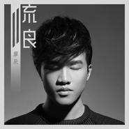

流浪
============================

|  |  |
| :--: | :-- |
| [ 流浪](https://emumo.xiami.com/album/2100245554) | **艺人**: [廖国钺](../index.md) **语种**: 国语 **唱片公司**: 独立发行 **发行时间**: 2015年12月09日 **专辑类别**: EP, 单曲 **专辑风格**: 国语流行 Mandarin Pop **播放数**: 590514 **收藏数**: 50 **评论数**: 12  |

## 简介

 

 
 

《流浪》将廖辰极美醇净的音色完美呈现，温暖中不失伤郁，似呢喃在耳边低语 ，毫不吝惜地邀人进入他的世界，
 

 
 

&nbsp; 在时间的边缘一起失控....
 

## 曲目

## 评论

|  |  |  |
| :-- | :-- | :-- |
|  [虾米用户](https://emumo.xiami.com/u/35369155) 我还没想好要写什么... 2016-02-28 18:58 赞(0) 踩(0) | 
还比较好听
 |
|  [虾米用户](https://emumo.xiami.com/u/1914457)  2015-12-23 21:26 赞(0) 踩(0) | 
为什么要改名
 |
|  [虾米用户](https://emumo.xiami.com/u/90719646)  2015-12-14 16:30 赞(0) 踩(0) | 
淘到好歌了
 |
|  [虾米用户](https://emumo.xiami.com/u/8384826) 再见，虾米，谢谢！ 2015-12-13 23:02 赞(0) 踩(0) | 
声线很干净，这首歌也简单明快。
 |
|  [虾米用户](https://emumo.xiami.com/u/87659158)  2015-12-13 22:21 赞(0) 踩(0) | 
   
 |
|  [虾米用户](https://emumo.xiami.com/u/87659158)  2015-12-13 22:20 赞(0) 踩(0) | 

 |
|  [虾米用户](https://emumo.xiami.com/u/87659158)  2015-12-13 22:20 赞(0) 踩(0) | 
钺钺一直在默默的支持你  
 |
|  [虾米用户](https://emumo.xiami.com/u/6721358) 青春不是年华,而是心境。 2015-12-13 16:35 赞(0) 踩(0) | 
封面不错！
 |
|  [虾米用户](https://emumo.xiami.com/u/7107168) 我还没想好要写什么... 2015-12-12 15:23 赞(0) 踩(0) | 
好棒
 |
|  [虾米用户](https://emumo.xiami.com/u/1418053) 我可努力啦！ 2015-12-11 14:11 赞(0) 踩(0) | 
编曲：胡晨
 |
|  [虾米用户](https://emumo.xiami.com/u/25949793) 我还没想好要写什么... 2015-12-11 00:16 赞(0) 踩(0) | 
舒服
 |
|  [虾米用户](https://emumo.xiami.com/u/19547977) 我躲进了自习室以期自救。 2015-12-11 00:02 赞(0) 踩(0) | 
  
 |
