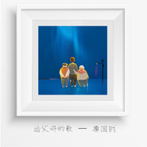

给父母的歌
============================

|  |  |
| :--: | :-- |
| [ 给父母的歌](https://emumo.xiami.com/album/2104040331) | **艺人**: [廖国钺](../index.md) **语种**: 国语 **唱片公司**: 咚吧嗒文化 **发行时间**: 2018年09月13日 **专辑类别**: EP, 单曲 **专辑风格**: 国语流行 Mandarin Pop **播放数**: 407 **收藏数**: 0 **评论数**: 0  |

## 简介

  
廖国钺单曲《给父母的歌》 是你让我来到这世界 是你让我拥有这一切 是你让我知道世界 有很多的凶险 这星空有你 不再是黑夜

## 曲目

## 评论

|  |  |  |  |
| :-- | :-- | :-- | :-- |
