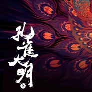

满·月已霜烛吟篇
============================

|  |  |
| :--: | :-- |
| [ 满·月已霜烛吟篇](https://emumo.xiami.com/album/504464151) | **艺人**: [廖国钺](../index.md) **语种**: 国语 **唱片公司**: 东墨林 **发行时间**: 2014年07月04日 **专辑类别**: EP, 单曲 **专辑风格**: 中国风 China-Wave **播放数**: 151665 **收藏数**: 86 **评论数**: 20  |

## 简介

这是一个有关于命运的故事，始于天地混沌初开之时，每一个角色，无论是凡人亦或是神明都是被命运控制的棋子，凤凰、孔雀、乌鸦，没有绝对的好与坏、善与恶，烛吟、将央有的也并不是缠绵悱恻的爱情，有的只是人性的冲突，有的只是对信仰的执着，如同旋转的太极两仪，今日为黑，明日成白。但也正是这些角色交织在一起才推动了命运的转轮，拉开了上古神话的舞台序幕，化作了说书人口中引人入胜的故事。  

 

突破传统“音乐专辑”“有声小说”的概念，将剧情歌曲依故事线索巧妙融入到有声小说中，配以富有感染力的人物对白和音乐，塑造了一个个有血有肉深入人心的角色。而每一首歌曲的风格都不尽相同，每一首歌曲又环环相扣、联系紧密，架构了这部古典神话大片。  
  
男女主角的爱情为主题，词曲中对爱情的回忆及分别时的痛苦的描绘，通过倒叙的方式阐述了故事的前因后果，为故事的叙述铺下了背景及伏笔。整首歌以回忆的形式体现了男主角对女主角的思恋，同时也表现出了男主角在失去女主角之后，内心的变化与挣扎。  

## 曲目

## 评论

|  |  |  |
| :-- | :-- | :-- |
|  [虾米用户](https://emumo.xiami.com/u/11950723) 有歌且乐 2015-12-15 12:11 赞(1) 踩(0) | 
声音干净又有张力，听起来很舒服，虽然有很多翻唱版本，听下来还是最喜欢原唱啊~~赞一个
 |
|  [虾米用户](https://emumo.xiami.com/u/8208812) 谁说蓝色等于忧伤 你看看... 2014-09-15 23:23 赞(0) 踩(0) | 
E大好棒～每次词用体会的就好啦，气势好强～(^３^)
 |
|  [虾米用户](https://emumo.xiami.com/u/10458197) 无所谓 2014-08-17 20:14 赞(0) 踩(0) | 
主歌部分真是充满了灵气啊 赞
 |
|  [虾米用户](https://emumo.xiami.com/u/9317797) 爱装X的毛病还没治好 2014-08-08 07:22 赞(2) 踩(0) | 
对副歌有微词是因为主歌部分太惊艳太惊艳，所以就期待副歌也那么轻盈婉转，然后发现副歌实在没那么有灵气，有点失望罢了。不过想想也是情节需要做出转折，可是转折之后又没有那么大气……无论如何，至少它有个完美的A段，就足够我单曲循环起来了
 |
|  [虾米用户](https://emumo.xiami.com/u/32079501)  2014-08-02 10:49 赞(0) 踩(0) | 
个人觉得挺好的，俗不俗的各人心中自有定论
 |
|  [虾米用户](https://emumo.xiami.com/u/3118818) 古路无行客 寒山独见君 2014-07-27 09:37 赞(0) 踩(0) | 
这个副歌可真够差的····
 |
|  [虾米用户](https://emumo.xiami.com/u/9736602)  2014-07-26 00:24 赞(0) 踩(0) | 
一首歌不太可能所有地方都出彩，调子复杂了节奏就简单，所谓副歌俗估计主要指的是歌词，曲调上虽然相比主歌也逊色一点不过不至于差，加上廖学长还在最后一句加一个抖音提了提意境。总体来说是首难得的作品。
 |
|  [虾米用户](https://emumo.xiami.com/u/35695348)  2014-07-23 23:53 赞(0) 踩(0) | 
其实还挺好听的啊 ==
 |
|  [虾米用户](https://emumo.xiami.com/u/19751790) 暂无签名~ 2014-07-14 14:40 赞(0) 踩(0) | 
副歌俗是在逗我么。
 |
|  [虾米用户](https://emumo.xiami.com/u/527304)  2014-07-11 19:06 赞(0) 踩(0) | 
为什么好几个人说俗呢。。。我怎么觉得听多了越听越顺耳呢。。。下一张古风精选集目测加这首。。。
 |
|  [虾米用户](https://emumo.xiami.com/u/8353721)  2014-07-11 04:24 赞(0) 踩(0) | 
，，，封面不错
 |
|  [虾米用户](https://emumo.xiami.com/u/33033530)  2014-07-11 03:38 赞(0) 踩(0) | 
副歌俗你妹啊。真的有听专辑么。
 |
|  [虾米用户](https://emumo.xiami.com/u/34461335) 武警先生的花园 2014-07-09 16:31 赞(0) 踩(0) | 
天噢，这副歌俗的呀！浪费了主调的意境！！
 |
|  [虾米用户](https://emumo.xiami.com/u/37712019)   2014-07-09 02:31 赞(0) 踩(0) | 
副歌不怎么
 |
|  [虾米用户](https://emumo.xiami.com/u/2575275) WEDDING.ART 2014-07-06 12:34 赞(0) 踩(0) | 
哎！！
 |
|  [虾米用户](https://emumo.xiami.com/u/792) 两个星座 遥望夜空 2014-07-05 22:13 赞(0) 踩(0) | 
副歌真心俗，主歌可惜了，主歌挺悠扬的。
 |
|  [虾米用户](https://emumo.xiami.com/u/3374257)  2014-07-05 14:35 赞(1) 踩(0) | 
封面太惊艳…
 |
|  [虾米用户](https://emumo.xiami.com/u/33668476) 夏日已远，繁花将尽 2014-07-05 10:33 赞(0) 踩(0) | 
有时候封面做的过于精美不是一件好事，你光放个头像上去听完之后落差也许就不会这么大。。
 |
| ⇒ |  [虾米用户](https://emumo.xiami.com/u/33033530)  2014-07-11 03:40 赞(0) 踩(0) | 
这是《孔雀大明》的专辑封面。不只有这一首歌也不只他自己唱。
 |
|  [虾米用户](https://emumo.xiami.com/u/2332621) SELF. 2014-07-04 17:41 赞(0) 踩(0) | 
v～
 |
