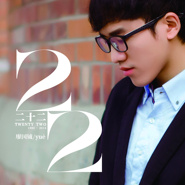

廖国钺
============================

|  |  |
| :--: | :-- |
| [ 廖国钺](https://i.xiami.com/liaoguoyue) | **地区**: China 中国大陆 **风格**: 国语流行 Mandarin Pop **播放数**: 4121742 **粉丝数**: 1512 **评论数**: 91  |

## 档案

廖国钺 1992年出生于重庆 毕业于清华大学美术学院染织艺术设计系 2012清华大学校园歌手大赛冠军 2013年海峡两岸校园歌手邀请赛金奖 2014最美和声黄绮珊组学员 O2录音棚 录音/混音师 90后独立歌手

## 专辑

| 名称 | 语种 | 唱片公司 | 发行时间 | 专辑类别 | 专辑风格 |
| :--: | :-- | :-- | :-- | :-- | :-- |
| [ 给父母的歌](./albums/2104040331.md) | 国语 | 咚吧嗒文化 | 2018年09月13日 | EP, 单曲 | 国语流行 Mandarin Pop |
| [ 四月](./albums/2103952120.md) | 国语 | 咚吧嗒文化 | 2018年08月31日 | EP, 单曲 | 国语流行 Mandarin Pop |
| [ 刺身](./albums/2100347654.md) | 国语 | 华羽先生 | 2016年05月30日 | EP, 单曲 |  |
| [ 自娱自乐](./albums/2100281840.md) | 国语 | 华羽先生 | 2016年02月26日 | EP, 单曲 | 国语流行 Mandarin Pop |
| [ 叶落](./albums/2100249126.md) | 国语 | 独立发行 | 2015年12月22日 | EP, 单曲 | 国语流行 Mandarin Pop |
| [ 流浪](./albums/2100245554.md) | 国语 | 独立发行 | 2015年12月09日 | EP, 单曲 | 国语流行 Mandarin Pop |
| [ 等](./albums/237923388.md) | 国语 | 独立发行 | 2015年07月24日 | EP, 单曲 | 国语流行 Mandarin Pop, 校园民谣 Campus Folk |
| [ 满·月已霜烛吟篇](./albums/504464151.md) | 国语 | 东墨林 | 2014年07月04日 | EP, 单曲 | 中国风 China-Wave |
| [ 二十二](./albums/997445634.md) | 国语 | O2工作室 | 2014年05月20日 | 录音室专辑 | 国语流行 Mandarin Pop |

## 评论

|  |  |  |
| :-- | :-- | :-- |
|  [虾米用户](https://emumo.xiami.com/u/377824949) 来自宇宙深处的双鱼座 2020-03-26 20:16 赞(1) 踩(0) | 
哇，清美毕业的，好羡慕  。声音好好听(ง &amp;bull;̀_&amp;bull;́)ง有次虾米推荐了《等》，听了一遍后明明已经不记得听过这首歌了，在学校里手机上交了一直没听歌，隔了好几天某个早晨在宿舍醒来睁开眼脑子里都是《等》的旋律，又想不起来这是什么歌，听过又好像没听过，就一直在努力回忆这个旋律，周日手机发下来后赶紧找这首歌，找到后感觉幸福的不得了，怎么说呢，就是我心目中最喜欢最理想的那种旋律和词，那一段时间就沉迷于这首歌，循环播放～
 |
|  [虾米用户](https://emumo.xiami.com/u/8499414)  2020-02-22 08:55 赞(1) 踩(0) | 
唱的不错 
 |
|  [虾米用户](https://emumo.xiami.com/u/324593243) 我还没想好要写什么... 2019-11-02 19:05 赞(1) 踩(0) | 
有机会可以合作一次哈 
 |
|  [虾米用户](https://emumo.xiami.com/u/347333871) 我屬貓，晚上不愛睡覺，太... 2019-05-21 04:08 赞(1) 踩(0) | 

 |
|  [虾米用户](https://emumo.xiami.com/u/18364364)  2019-03-16 19:58 赞(1) 踩(0) | 
是你本人？
 |
|  [虾米用户](https://emumo.xiami.com/u/16961401)  我的心房是单间，可以串... 2019-02-21 21:48 赞(2) 踩(0) | 
同年的你，拥有一副好嗓音，仿佛看到世界的另一个自己看时光流淌，看自己变得更好
 |
|  [虾米用户](https://emumo.xiami.com/u/85074868) 你若盛开，清风自来~~ 2019-02-08 16:47 赞(2) 踩(0) | 
被你的声音和你的歌吸引了
 |
|  [虾米用户](https://emumo.xiami.com/u/345573839) 等一把小黄伞，偷一只蓝色... 2018-03-29 23:06 赞(1) 踩(0) | 
学长加油
 |
|  [虾米用户](https://emumo.xiami.com/u/14678363)   2018-01-10 20:03 赞(0) 踩(0) | 
你最开始翻唱的那首莫文蔚的歌叫啥来着？有音频吗？很喜欢听
 |
| ⇒ |  [虾米用户](https://emumo.xiami.com/u/314638652)   2018-06-15 10:50 赞(0) 踩(0) | 
爱
 |
|  [虾米用户](https://emumo.xiami.com/u/21235305) 原创音乐达人 2017-10-27 23:41 赞(3) 踩(0) | 
小廖你好！我在QQ上给你留言了，在微博上给你私信了，望回复为盼！因为涉及到专辑制作发行进度，务请百忙之中答复！谢谢！
 |
|  [虾米用户](https://emumo.xiami.com/u/116799180) 我只是希望我们未曾见面，... 2017-09-01 17:57 赞(0) 踩(0) | 
好听
 |
|  [虾米用户](https://emumo.xiami.com/u/305439098)   2017-06-19 12:30 赞(0) 踩(0) | 
❤
 |
|  [虾米用户](https://emumo.xiami.com/u/72666568)  2017-06-02 11:52 赞(0) 踩(0) | 
蛮好的
 |
|  [虾米用户](https://emumo.xiami.com/u/281436354)  2017-05-11 21:26 赞(1) 踩(0) | 
着急啊~~~~
 |
|  [虾米用户](https://emumo.xiami.com/u/281436354)  2017-05-11 21:26 赞(0) 踩(0) | 
原创啊
 |
|  [虾米用户](https://emumo.xiami.com/u/43401055)   2017-05-10 16:21 赞(0) 踩(0) | 

 |
|  [虾米用户](https://emumo.xiami.com/u/88189370)  2017-05-06 00:33 赞(0) 踩(0) | 
快出那首原创原创啊！！！捉急！！
 |
|  [虾米用户](https://emumo.xiami.com/u/258542214)   2017-04-15 19:55 赞(0) 踩(0) | 
满，月已霜
 |
|  [虾米用户](https://emumo.xiami.com/u/253125896) 我要努力，然后漂亮的在一... 2017-03-27 08:16 赞(0) 踩(0) | 
从唱吧到这里
 |
|  [虾米用户](https://emumo.xiami.com/u/54534207) 再见，感谢虾米音乐深夜的... 2017-03-23 21:00 赞(0) 踩(0) | 
好想捏捏你的脸，亲亲你呀，这么温柔的小嗓音
 |
|  [虾米用户](https://emumo.xiami.com/u/46871227) 啊 2017-02-15 23:06 赞(1) 踩(0) | 
从廖国钺到廖辰再到廖国钺。你一直都是你啊
 |
|  [虾米用户](https://emumo.xiami.com/u/43417568) 暂无签名~ 2017-02-09 23:34 赞(0) 踩(0) | 
加油，很喜欢你的声音小伙子，一定要坚定不移的做你自己。 
 |
|  [虾米用户](https://emumo.xiami.com/u/248498018)  2017-01-18 19:30 赞(1) 踩(0) | 
怎么翻唱王力宏的串烧起来的那首歌没有
 |
|  [虾米用户](https://emumo.xiami.com/u/70054534) 人心都是喂不肥的狼，而我... 2016-11-28 23:38 赞(1) 踩(0) | 
清华大学校园歌曲大赛，一曲莫文蔚的爱，话说为什么改名
 |
|  [虾米用户](https://emumo.xiami.com/u/122688364) 生在愤坑，长在赤圈；挣脱 2016-10-11 00:15 赞(0) 踩(0) | 
4525
 |
|  [虾米用户](https://emumo.xiami.com/u/199994079)  2016-07-12 00:16 赞(0) 踩(0) | 
为了听你的歌 我已经下载了n个APP 喜马拉雅 唱吧 虾米
 |
|  [虾米用户](https://emumo.xiami.com/u/196430810)  2016-07-02 12:26 赞(0) 踩(0) | 
咦？为什么找不到静默的爱？ 
 |
|  [虾米用户](https://emumo.xiami.com/u/196430810)  2016-07-02 12:24 赞(0) 踩(0) | 
为了听你的歌才下的这个软件辣 
 |
|  [虾米用户](https://emumo.xiami.com/u/90239556) 我走的很慢、但»»從來不... 2016-05-18 17:22 赞(0) 踩(0) | 

 |
|  [虾米用户](https://emumo.xiami.com/u/168541498)  2016-05-14 15:06 赞(0) 踩(0) | 
听到一首“等”，像校园里的白衬衫，喜欢这个干净声音。
 |
|  [虾米用户](https://emumo.xiami.com/u/90239556) 我走的很慢、但»»從來不... 2016-04-25 23:40 赞(0) 踩(0) | 
晚安
 |
|  [虾米用户](https://emumo.xiami.com/u/55035680) 请叫我第一名！ 2016-03-03 23:55 赞(0) 踩(0) | 
我老大！
 |
|  [虾米用户](https://emumo.xiami.com/u/13833204)  2016-02-21 03:30 赞(0) 踩(0) | 
爱     记住了他
 |
|  [虾米用户](https://emumo.xiami.com/u/51690777) 解忧 2016-01-19 18:18 赞(0) 踩(0) | 
不错
 |
|  [虾米用户](https://emumo.xiami.com/u/98443762) Right here w... 2016-01-13 16:27 赞(0) 踩(0) | 
声音好美。
 |
|  [虾米用户](https://emumo.xiami.com/u/46871227) 啊 2015-12-26 22:27 赞(0) 踩(0) | 
歌都下架了？！
 |
|  [虾米用户](https://emumo.xiami.com/u/1366353)  2015-12-22 19:02 赞(1) 踩(0) | 
改名了，可你还是温柔的那个你。
 |
|  [虾米用户](https://emumo.xiami.com/u/50295979) 怎么去拥抱一夏天的风 2015-12-17 22:23 赞(0) 踩(0) | 
四月呢！为什么不是原来的那个版本了！
 |
|  [虾米用户](https://emumo.xiami.com/u/4196276) 下点雨吧 2015-12-13 12:05 赞(1) 踩(0) | 
原来改名了。。。之前就听过他的，舒服赞赞~
 |
|  [虾米用户](https://emumo.xiami.com/u/90239556) 我走的很慢、但»»從來不... 2015-12-12 08:39 赞(0) 踩(0) | 
爱你
 |
|  [虾米用户](https://emumo.xiami.com/u/49096190)  2015-12-07 12:42 赞(0) 踩(0) | 
加油↖(^ω^)↗
 |
|  [虾米用户](https://emumo.xiami.com/u/83805216)  2015-11-17 07:39 赞(0) 踩(0) | 
干净清透的声音，会一直支持！很遗憾加班没听到你在mao唱歌 你刚唱完我就到了 
 |
|  [虾米用户](https://emumo.xiami.com/u/52696611) 就这样逃跑吧 2015-10-26 11:45 赞(0) 踩(0) | 
廖国钺,清新,男声,
 |
|  [虾米用户](https://emumo.xiami.com/u/73886476)  2015-10-14 23:52 赞(0) 踩(0) | 
我也是偶滴歌神追来的，你的样子，你唱的神的很好听~
 |
|  [虾米用户](https://emumo.xiami.com/u/73886476)  2015-10-14 23:51 赞(0) 踩(0) | 
会一直支持你的，很喜欢你的声音，很动听~   
 |
|  [虾米用户](https://emumo.xiami.com/u/66078894) 一直很安静 2015-09-24 13:12 赞(0) 踩(0) | 
好喜欢你唱的重来和你的样子，能不能录出来呢 
 |
|  [虾米用户](https://emumo.xiami.com/u/3851935) Why so serio... 2015-09-23 22:10 赞(0) 踩(0) | 
喜欢你的声音很久了，希望你可以继续给我们带来这样的歌声！
 |
|  [虾米用户](https://emumo.xiami.com/u/1383764)  2015-08-16 19:26 赞(1) 踩(0) | 
从我滴歌神啊追过来的，两期里面唱的最好听的一个啦，和声《你的样子》比原版还好听！！支持~~！
 |
|  [虾米用户](https://emumo.xiami.com/u/21235305) 原创音乐达人 2015-08-16 12:06 赞(0) 踩(0) | 
廖国钺你好！我是内蒙赤峰的音乐人丁延哲。非常欣赏你的歌唱才华！我的第二张原创专辑想请你帮我唱一首歌，给你私信想问一下费用问题。我的电话：13084760009
 |
|  [虾米用户](https://emumo.xiami.com/u/21235305) 原创音乐达人 2015-08-16 12:05 赞(0) 踩(0) | 
好听
 |
|  [虾米用户](https://emumo.xiami.com/u/48074609)  2015-08-13 15:08 赞(0) 踩(0) | 
你的声音好温柔，每次听都好感动
 |
|  [虾米用户](https://emumo.xiami.com/u/48074609)  2015-08-13 12:59 赞(0) 踩(0) | 
声音好美，喜欢你，加油！
 |
|  [虾米用户](https://emumo.xiami.com/u/47667505) 音乐啊，享受吧 2015-08-13 07:58 赞(0) 踩(0) | 
歌神观光团 
 |
|  [虾米用户](https://emumo.xiami.com/u/47667505) 音乐啊，享受吧 2015-08-13 07:58 赞(0) 踩(0) | 
歌神观光团 
 |
|  [虾米用户](https://emumo.xiami.com/u/47667505) 音乐啊，享受吧 2015-08-13 07:58 赞(0) 踩(0) | 
歌神观光团 
 |
|  [虾米用户](https://emumo.xiami.com/u/51944999)  2015-07-01 16:45 赞(0) 踩(0) | 
终于发现了个同姓的名人。很喜欢你的声音
 |
|  [虾米用户](https://emumo.xiami.com/u/30417021) 送你一张过去的CD. 2015-04-19 13:31 赞(0) 踩(0) | 
《爱》呢 
 |
|  [虾米用户](https://emumo.xiami.com/u/30417021) 送你一张过去的CD. 2015-04-19 13:31 赞(0) 踩(0) | 
《爱》呢 
 |
|  [虾米用户](https://emumo.xiami.com/u/30417021) 送你一张过去的CD. 2015-04-19 13:31 赞(0) 踩(0) | 
《爱》呢 
 |
|  [虾米用户](https://emumo.xiami.com/u/383805) I love Music 2015-04-02 21:51 赞(0) 踩(0) | 
因为一曲满月已霜
 |
|  [虾米用户](https://emumo.xiami.com/u/43251672)  2014-11-01 21:47 赞(0) 踩(0) | 
怎么没有   爱   那首歌？
 |
|  [虾米用户](https://emumo.xiami.com/u/21918254)  2014-09-30 09:29 赞(0) 踩(0) | 
城市灯火好好听(☆_☆)
 |
|  [虾米用户](https://emumo.xiami.com/u/41522236)  2014-09-21 22:25 赞(0) 踩(0) | 
一直都很喜欢你的歌，，暑假去清华找同学玩的时候没有找到o2录音棚感觉挺遗憾的
 |
|  [虾米用户](https://emumo.xiami.com/u/10160562)   2014-09-18 23:50 赞(0) 踩(0) | 
还是喜欢你唱的夜空中最亮的星
 |
|  [虾米用户](https://emumo.xiami.com/u/19547977) 我躲进了自习室以期自救。 2014-08-02 13:37 赞(0) 踩(0) | 
我也是重庆的…
 |
|  [虾米用户](https://emumo.xiami.com/u/19547977) 我躲进了自习室以期自救。 2014-08-02 13:35 赞(0) 踩(0) | 
男神我又边写作业边听你的歌辣！
 |
|  [虾米用户](https://emumo.xiami.com/u/34300214) 温和 调皮 有魅力 我说... 2014-07-19 20:59 赞(0) 踩(0) | 
真的好喜欢你的歌●ｖ●～而且都分享给周围朋友了，胡晨好棒^ω^
 |
|  [虾米用户](https://emumo.xiami.com/u/6661598)  2014-07-01 16:21 赞(0) 踩(0) | 
最爱05
 |
|  [虾米用户](https://emumo.xiami.com/u/37899398)  2014-06-30 11:36 赞(0) 踩(0) | 
无限未来
 |
|  [虾米用户](https://emumo.xiami.com/u/37894939) 音乐是种缘分 2014-06-23 09:09 赞(0) 踩(0) | 
加油加油 昨天的live很精彩
 |
|  [虾米用户](https://emumo.xiami.com/u/37868664)  2014-06-22 17:56 赞(0) 踩(0) | 
思想者
 |
|  [虾米用户](https://emumo.xiami.com/u/12277483)  2014-06-09 13:56 赞(2) 踩(0) | 
声音太温柔了    觉得感情不自然    每一句太附和   随意起来 飘飘的      像是加了太多调味料的 虽然调出来的味道是甜的   但不真 听着有点压抑   感觉没放开  这样甜甜的声音有很多 不够独特     有话直说  抱歉 别介意啊
 |
|  [虾米用户](https://emumo.xiami.com/u/20791768)  2014-05-30 10:32 赞(0) 踩(0) | 
爱
 |
|  [虾米用户](https://emumo.xiami.com/u/12277483)  2014-05-29 11:38 赞(0) 踩(0) | 
清澈温柔
 |
|  [虾米用户](https://emumo.xiami.com/u/16865052)  2014-05-29 11:34 赞(0) 踩(0) | 
赞一个
 |
|  [虾米用户](https://emumo.xiami.com/u/12210972)  2014-05-24 22:38 赞(0) 踩(0) | 

 |
|  [虾米用户](https://emumo.xiami.com/u/12210972)  2014-05-24 22:35 赞(0) 踩(0) | 
学长男神加油↖(^ω^)↗
 |
|  [虾米用户](https://emumo.xiami.com/u/337895) 全平台同名 2014-05-22 03:49 赞(0) 踩(0) | 
你的声音很好听喔~ ^_^
 |
|  [虾米用户](https://emumo.xiami.com/u/13339691)  2014-05-21 22:55 赞(0) 踩(0) | 
声音很干净，加油~
 |
|  [虾米用户](https://emumo.xiami.com/u/7742078)  2014-05-21 17:38 赞(0) 踩(0) | 
昨天从人人上认识你，作为在南岸区生活四年的学姐，表支持！加油哟~
 |
|  [虾米用户](https://emumo.xiami.com/u/12461797)  2014-03-06 16:36 赞(0) 踩(0) | 
欢迎欢迎~~~~~
 |
|  [虾米用户](https://emumo.xiami.com/u/1820536)  2014-03-03 21:35 赞(0) 踩(0) | 
支持！来个沙发！
 |
|  [虾米用户](https://emumo.xiami.com/u/33512436)  2014-03-03 19:08 赞(86) 踩(0) | 
我刚入驻了虾米音乐人，欢迎大家来我的个人主页，收听我的最新音乐
 |
| ⇒ |  [虾米用户](https://emumo.xiami.com/u/28210886) pure and sim... 2014-05-07 12:57 赞(0) 踩(0) | 
好喜欢流浪，有吉他谱么？
 |
| ⇒ |  [虾米用户](https://emumo.xiami.com/u/22005103) 我有一个愿望 2014-06-23 18:29 赞(0) 踩(0) | 
我是老粉丝惹～～终于进军虾米～好欢乐呀！噗～～
 |
| ⇒ |  [虾米用户](https://emumo.xiami.com/u/55035680) 请叫我第一名！ 2015-08-11 20:44 赞(0) 踩(0) | 
老大 为了你特意下的 虾米音乐哦!
 |
| ⇒ |  [虾米用户](https://emumo.xiami.com/u/23488552) 我还没想好要写什么... 2015-11-21 18:03 赞(0) 踩(0) | 
学长加油加油！
 |
| ⇒ |  [虾米用户](https://emumo.xiami.com/u/98443762) Right here w... 2016-01-13 16:28 赞(0) 踩(0) | 
歌里的声音很柔和，听起来很美。
 |
| ⇒ |  [虾米用户](https://emumo.xiami.com/u/37296151) 默默关注 2016-02-29 20:57 赞(0) 踩(0) | 
声音好温柔
 |
| ⇒ |  [虾米用户](https://emumo.xiami.com/u/5701275)  2017-07-15 23:29 赞(0) 踩(0) | 
好美的歌声，支持你，加油！
 |
