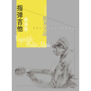

依凡享说原声指弹吉他曲谱集
============================

|  |  |
| :--: | :-- |
| [ 依凡享说原声指弹吉他曲谱集](https://emumo.xiami.com/album/2100230848) | **艺人**: [宋依凡](../index.md) **语种**: 国语 **唱片公司**: 中国科学文化音像出版社 **发行时间**: 2014年08月05日 **专辑类别**: 录音室专辑 **专辑风格**: 器乐独奏 Solo Instrumental, 轻音乐 Easy Listening **播放数**: 1146644 **收藏数**: 291 **评论数**: 31  |

## 简介

 生活其实可以很简单，可以很安静。一把木吉他来描述出脑海里的画面很贴切，感谢她与它的陪伴。。。
 

混音：The Samans王利夫
 

设计：薛峰 王世杰 孙皓
 

摄影：赵禹 孙丽卓
 

 

## 曲目

## 评论

|  |  |  |
| :-- | :-- | :-- |
|  [虾米用户](https://emumo.xiami.com/u/406259096)  2020-06-24 22:17 赞(0) 踩(0) | 
好听深情
 |
|  [虾米用户](https://emumo.xiami.com/u/4487129)  2020-05-20 05:48 赞(1) 踩(0) | 
！！！
 |
|  [虾米用户](https://emumo.xiami.com/u/36587362) 我给你，我空白的心灵 ;... 2019-09-10 09:42 赞(0) 踩(0) | 

 |
|  [虾米用户](https://emumo.xiami.com/u/413628232)  2019-03-16 12:57 赞(0) 踩(0) | 
有点嘈杂，感觉一个音追着一个音。不太干净
 |
| ⇒ |  [虾米用户](https://emumo.xiami.com/u/10009897)  2019-05-13 20:30 赞(0) 踩(0) | 
难听的要死
 |
|  [虾米用户](https://emumo.xiami.com/u/351468097) 喜欢指弹的小伙伴来听我的... 2018-06-10 21:53 赞(0) 踩(0) | 
宋老师很赞!
 |
|  [虾米用户](https://emumo.xiami.com/u/245041427) 往哪里找安慰会简单一些 2017-10-23 23:53 赞(0) 踩(0) | 
炒鸡喜欢♡
 |
|  [虾米用户](https://emumo.xiami.com/u/159084066)  2016-06-02 01:43 赞(0) 踩(0) | 
特别浪漫！
 |
|  [虾米用户](https://emumo.xiami.com/u/109019164) GOODBYE 2016-05-14 22:10 赞(0) 踩(0) | 
有天做梦梦见了大哥，梦见我在课堂
 |
|  [虾米用户](https://emumo.xiami.com/u/6025359)  2016-04-20 23:37 赞(0) 踩(0) | 
赞凡哥
 |
|  [虾米用户](https://emumo.xiami.com/u/11063430) *（oo）* 2016-03-20 21:06 赞(0) 踩(0) | 
弹指间的画面感真强啊 。。。。
 |
|  [虾米用户](https://emumo.xiami.com/u/33695886)  2016-03-14 16:18 赞(0) 踩(0) | 
！！！
 |
|  [虾米用户](https://emumo.xiami.com/u/105741222)  2016-03-12 22:44 赞(1) 踩(0) | 
曲谱就快到了 期待您写的勉励语 
 |
|  [虾米用户](https://emumo.xiami.com/u/103972788)  2016-01-30 22:23 赞(0) 踩(0) | 
jbv
 |
|  [虾米用户](https://emumo.xiami.com/u/100801)  2015-12-22 11:54 赞(0) 踩(0) | 
太！好听
 |
|  [虾米用户](https://emumo.xiami.com/u/5381882) 自在如风的少年 2015-12-07 22:48 赞(0) 踩(0) | 
听不了啊！
 |
|  [虾米用户](https://emumo.xiami.com/u/46812141)  2015-11-21 22:42 赞(0) 踩(0) | 
感谢！
 |
|  [虾米用户](https://emumo.xiami.com/u/46366785) 我还没想好要写什么... 2015-11-05 11:56 赞(0) 踩(0) | 
终于发布啦，支持！
 |
|  [虾米用户](https://emumo.xiami.com/u/52137981)  2015-11-02 19:37 赞(0) 踩(0) | 
嗷嗷支持
 |
|  [虾米用户](https://emumo.xiami.com/u/52137981)  2015-11-02 19:37 赞(0) 踩(0) | 
嗷嗷喜欢
 |
|  [虾米用户](https://emumo.xiami.com/u/52137981)  2015-11-02 19:36 赞(0) 踩(0) | 
听着嗷嗷有感觉!
 |
|  [虾米用户](https://emumo.xiami.com/u/43943321) ........cccc 2015-11-02 03:20 赞(1) 踩(0) | 
后期效果处理的不够好啊  可能是口味不同吧  先赞
 |
|  [虾米用户](https://emumo.xiami.com/u/43943321) ........cccc 2015-11-02 03:20 赞(0) 踩(0) | 
后期效果处理的不够好啊  可能是口味不同吧  先赞
 |
|  [虾米用户](https://emumo.xiami.com/u/42756133)  2015-11-02 01:16 赞(0) 踩(0) | 
弱弱的提点小意见 琴的音色不好
 |
|  [虾米用户](https://emumo.xiami.com/u/36382087)  2015-11-01 22:39 赞(2) 踩(0) | 
谢谢大家 
 |
|  [虾米用户](https://emumo.xiami.com/u/7654431)  2015-11-01 22:27 赞(0) 踩(0) | 
宋哥终于发了 支持 虾米推送的太晚了……现在才来 没抢到沙发很遗憾 不过依旧支持 
 |
|  [虾米用户](https://emumo.xiami.com/u/9260435)   2015-11-01 17:21 赞(0) 踩(0) | 
一凡老师终于发曲子了   
 |
|  [虾米用户](https://emumo.xiami.com/u/33814712)  2015-11-01 17:18 赞(0) 踩(0) | 
终于来了
 |
|  [虾米用户](https://emumo.xiami.com/u/52216054)   2015-11-01 17:15 赞(0) 踩(0) | 
依凡，不平凡
 |
|  [虾米用户](https://emumo.xiami.com/u/52216054)   2015-11-01 17:15 赞(1) 踩(0) | 
沙发沙发赶紧...
 |
|  [虾米用户](https://emumo.xiami.com/u/43658792) 不要将你的左手松开，我要... 2015-11-01 16:55 赞(0) 踩(0) | 
真的很棒
 |
