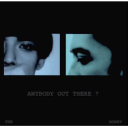

THE HONEY
============================

|  |  |
| :--: | :-- |
| [ THE HONEY](https://emumo.xiami.com/album/1715770785) | **艺人**: [HUSH](../index.md) **语种**: 英语 **唱片公司**: 独立发行 **发行时间**: 2014年09月05日 **专辑类别**: EP, 单曲 **专辑风格**:  **播放数**: 76983 **收藏数**: 140 **评论数**: 13  |

## 简介

这是一次宇宙安排的合作，一首听了就停不下来的歌  
  
草莓救星Arny 编曲混音+ HUSH词曲演唱=THE HONEY  
  
电影《八月梦游者》配乐抢先发表  
  
ANYBODY OUT THERE?

## 曲目

## 评论

|  |  |  |
| :-- | :-- | :-- |
|  [虾米用户](https://emumo.xiami.com/u/346010126) 我很想记得可是我记不得 2020-01-31 22:24 赞(0) 踩(0) | 
好
 |
|  [虾米用户](https://emumo.xiami.com/u/188196406) 喜歡獨單 2019-04-03 23:05 赞(0) 踩(0) | 
嗯
 |
|  [虾米用户](https://emumo.xiami.com/u/339191478)   2018-07-27 14:33 赞(0) 踩(0) | 
❤
 |
|  [虾米用户](https://emumo.xiami.com/u/339191478)   2018-07-27 14:32 赞(0) 踩(0) | 
:-)
 |
|  [虾米用户](https://emumo.xiami.com/u/49281501) 不要害怕长大 2017-10-18 13:16 赞(0) 踩(0) | 
nice
 |
|  [虾米用户](https://emumo.xiami.com/u/169123664) 你的碗。 2017-04-30 08:55 赞(0) 踩(0) | 
你
 |
|  [虾米用户](https://emumo.xiami.com/u/49586175)  2016-08-29 14:08 赞(0) 踩(0) | 

 |
|  [虾米用户](https://emumo.xiami.com/u/8226204) ≡ 2016-02-15 00:01 赞(2) 踩(0) | 
微电影土豆地址：<a href="http://t.cn/RwBBIw6" target="_blank" rel="nofollow noreferrer noopener">http://t.cn/RwBBIw6</a>  《八月梦游者》电影正式上架名称为《八月漫游》  令人印象深刻的电影，总免不了搭上一首好歌，图像与音乐的相呼辉映，通常更能让观众眼睛为之一亮，达到加乘的效果。日前HUSH和草莓救星吉他手Arny合作的歌曲〈ANYBODY OUT THERE？〉一发表即广受好评，目前电影《八月漫游》也于YouTube上架。  自从合作了歌曲〈ANYBODY OUT THERE？〉，HUSH也顺势与Arny共组虚拟乐团「The Honey」，虽然自称虚拟乐团，但是这个组合并非昙花一现，HUSH松口透露Arny将担任4/4「第一人称演唱会」的吉他手，看来两人之后合作相当值得期待。  via blow
 |
|  [虾米用户](https://emumo.xiami.com/u/2781284) 旧时热情又急躁 2015-12-29 11:14 赞(0) 踩(0) | 
这是直男不懂的世界~~
 |
|  [虾米用户](https://emumo.xiami.com/u/11286938) 慢慢回消息留言,不好意思 2015-09-21 13:22 赞(0) 踩(0) | 
原来是HUSH联手草莓救星。  歌名也符合电影名的感觉
 |
|  [虾米用户](https://emumo.xiami.com/u/24787512) 吃feel 2015-09-11 01:12 赞(0) 踩(0) | 
飞
 |
|  [虾米用户](https://emumo.xiami.com/u/420272)  2014-11-18 13:59 赞(0) 踩(0) | 
很棒！
 |
|  [虾米用户](https://emumo.xiami.com/u/8226204) ≡ 2014-11-15 09:42 赞(0) 踩(0) | 
！
 |
