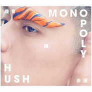

机会与命运Monopoly
============================

|  |  |
| :--: | :-- |
| [ 机会与命运Monopoly](https://emumo.xiami.com/album/2100195314) | **艺人**: [HUSH](../index.md) **语种**: 国语 **唱片公司**: re: public records **发行时间**: 2015年10月30日 **专辑类别**: 录音室专辑 **专辑风格**: 华语唱作人 Chinese Singer-Songwriter, 国语流行 Mandarin Pop, 独立流行 Indie Pop **播放数**: 2183114 **收藏数**: 2668 **评论数**: 378  |

## 简介

IIIIIIIIIIIIIIIIIIIIIIIIIIIIIIIIIIIIIIIIIIII 虾米音乐·全网独家音频 IIIIIIIIIIIIIIIIIIIIIIIIIIIIIIIIIIIIIIIIIIII
 

「命运」是决定
 

将生命历程拉成一条线
 

羁绊过往，牵扯未来
 

在光与影之间相互交叠；
 

  

 

「机会」是创造
 

把人生故事简化为一个点
 

没有过去，没有未来
 

只在当下。
 

  

 

终於来到「机会与命运」的格子。
 

你会选择「机会」还是「命运」？
 

  

 

在十字路口中不停穿梭，城市发出的光亮映照在你我的脸庞。脚底下交叉而过的影子，是否能因此领悟“命运"”不一定掌握在自己手中？原本握有的机会，下一秒也许就急速消失在更迭的道路上。
 

  

 

2015年4月份刚在台北TICC办完「第一人称」首场个人大型演唱会的HUSH这一年越来越忙碌，在一场接一场的演出中，HUSH仍不断累积创作，并持续观察这城市的变化，创造出《机会与命运》十二曲歌咏爱情与生活的大富翁游戏，歌曲中的第一人称，是生活在资本主义的世界中的你和我，以及我们在每一次骰子落在「机会与命运」的格子时，会做出的选择。也许是尝试寻求机会以摆脱原生的命运，或者最後选择相信命运，与此共生。
 

  

 

HUSH邀请陈建骐担任《机会与命运》制作人，其中〈都会感〉一曲特别找来好友左光平填词，也成为专辑唯一一首非HUSH自己填词的歌曲。将近半年时间，以〈都会感〉的失落丶〈岛屿城市〉的孤寂，到〈物质生活〉的承诺，〈我想知道你的一切〉的理所当然...共同解开这张专辑巨大的命题。
 

  

 

人生的大富翁游戏中，也许不是每一手都顺利，但是我们都有选择的权力，在游戏结束之前，还有机会再踯一次骰子。
 

  

 

曲目：
 

01. 今天的你如此不同
 

02. 机会与命运
 

03. 都会感
 

04. 岛屿城市
 

05. 白露
 

06. 诺贝尔寂寞奖
 

07. 我想知道你的一切
 

08. 物质生活
 

09. 底牌
 

10. 名单里
 

11. 同一个答案
 

12. 几个世纪之前
 

  

 

[ 专辑歌曲推荐 ]
 

  

 

<u>首波主打歌〈机会与命运〉</u>
 

  

 

<em>耐心等待生命的邀请 / 邀请机会与命运的来到</em>
 

专辑同名主打〈机会与命运〉阐述了一个你我正处於其中的疯狂世界。我们在生活与生存之间奔波，制式地工作五天才换来两天珍贵的休假。我们是不是已经不小心掉入资本主义的框架之中，一如经典游戏「大富翁」让我们体验到资源被独占的可怕？
 

  

 

每个人的手中都有一组未知的变数，谁也无法知道谁是最後的赢家。跟生活赌上一把，棋手不回。
 

  

 

<u>第二波主打歌〈我想知道你的一切〉</u>
 

  

 

<em>让迷幻都不算迷幻 / 疑惑是你的皇冠</em>
 

当天气骤变，自然灾害来袭；当人类踏上星球，甚至到更远的太空回望地球，你是否曾感觉过身为人类的渺小？〈我想知道你的一切〉单纯地道出当人在面对世界万物，对於未知的神丶命运丶思想等的好奇与纳闷，并迫切想要知道所有暧昧不明的一切，寻求解答。
 

  

 

<u>第三波主打歌〈同一个答案〉</u>
 

  

 

<em>就让他们去猜 / 就让我们愉快</em>
 

在爱的过程并非每个人都能称心如愿，有些人爱得艰难，不被外人所接受，但只要能依偎在恋人身边看着重复的日落，你是否就此心满意足？HUSH希望透过〈同一个答案〉推行婚姻平权理念：虽然不是每个人都想要有婚姻，不过当结婚成为每个人都拥有的权利与选择，就能让人权之展现更为全面。这首歌找来许多好友如洪佩瑜丶女孩与机器人的Riin丶灭火器的杨大正丶五月天阿信丶左光平丶吴志宁丶南瓜妮歌迷俱乐部的柯家洋等人一起大合唱，为这一共同理念发声。
 

  

 

即便有千百万种的可能方式，我们最终都只会找到同一个答案——爱。
 

  

 

<u>第四波主打歌〈物质生活〉</u>
 

  

 

<em>享受自我 / 在命运之前有谁抬得起头 / 他无时无刻引诱着我</em>
 

繁华落尽，又回到一个人的房间。欲望的满足总是能换来一时的精神寄托，但依旧无法填补生活的全部。HUSH娓娓道来那追求小确幸的小资男女，在丰富的物质生活背後，真正的精神生活是什麽。也许是为了让物质拥抱自己的寂寞感，为了填补自己在生活当中不足的空虚。
 

  

## 曲目

## 评论

|  |  |  |
| :-- | :-- | :-- |
|  [虾米用户](https://emumo.xiami.com/u/49655313) 長大就是一個不斷道別的過... 2021-01-18 15:32 赞(0) 踩(0) | 
再见
 |
|  [虾米用户](https://emumo.xiami.com/u/96296322)  2019-12-28 13:17 赞(0) 踩(0) | 
.
 |
|  [虾米用户](https://emumo.xiami.com/u/53058835) Everything i... 2019-04-27 02:55 赞(0) 踩(0) | 
介绍里还写着“虾米独家”，然而整张专辑已然下架了
 |
|  [虾米用户](https://emumo.xiami.com/u/809218)  2018-08-24 21:02 赞(1) 踩(0) | 
现在在哪里可以听
 |
| ⇒ |  [虾米用户](https://emumo.xiami.com/u/178106934)   2018-10-16 14:50 赞(0) 踩(0) | 
qq音乐
 |
|  [虾米用户](https://emumo.xiami.com/u/339191478)   2018-07-27 14:26 赞(0) 踩(0) | 
独家&amp;hellip;
 |
|  [虾米用户](https://emumo.xiami.com/u/47494497) 李志、陈升，“虾米也没有... 2018-07-22 22:13 赞(3) 踩(0) | 
犹记当年首发 转眼你就没版权 
 |
|  [虾米用户](https://emumo.xiami.com/u/247410560)  2018-07-18 08:09 赞(0) 踩(0) | 
独家怎么听不了了
 |
|  [虾米用户](https://emumo.xiami.com/u/36255358) 杂食动物一枚 2018-07-03 10:16 赞(0) 踩(0) | 
这张我没记错的话当时还要花钱购买吧！我买了，反正账户里面是没了
 |
|  [虾米用户](https://emumo.xiami.com/u/8805952)  2018-06-14 00:20 赞(0) 踩(0) | 
怎么突然没版权了！
 |
|  [虾米用户](https://emumo.xiami.com/u/43737239) 我还没想好要写什么... 2018-06-08 06:44 赞(0) 踩(0) | 
为什么又没版权了
 |
|  [虾米用户](https://emumo.xiami.com/u/175278550) 私は安本丹です 2018-05-27 11:56 赞(0) 踩(0) | 
i i
 |
|  [虾米用户](https://emumo.xiami.com/u/47026156) I am not a m... 2018-04-30 15:24 赞(0) 踩(0) | 
啊 好听
 |
|  [虾米用户](https://emumo.xiami.com/u/5517540) 我还没想好要写什么... 2018-04-10 09:43 赞(0) 踩(0) | 
开口好惊艳！Hush你什么时候有个唱    
 |
|  [虾米用户](https://emumo.xiami.com/u/4334438) 贫穷而倔强 2018-02-11 10:12 赞(0) 踩(0) | 
专辑的歌必须一首一首下载？ 
 |
|  [虾米用户](https://emumo.xiami.com/u/49904891)   2017-10-28 00:06 赞(1) 踩(0) | 
以往略有反讽意味的歌不同，这首歌词充满正能量，有种让人热血沸腾的感觉。去年10月1日歌曲开始成型，到今年4月复活节完成歌词，中间经历了无数次的风波和伤害，但邓紫棋却以一种积极向上的态度直面打击，内心十分
 |
| ⇒ |  [虾米用户](https://emumo.xiami.com/u/78377448)  2018-01-19 16:21 赞(0) 踩(0) | 
水军发错地方了？
 |
|  [虾米用户](https://emumo.xiami.com/u/1418053) 我可努力啦！ 2017-10-27 23:38 赞(0) 踩(0) | 
虽然今年第二届的上海简单生活节，只有EASY一个人来演出。但是HUSH的新专辑会从10月初开始预购！这也是HUSH与陈建骐合作的首张个人专辑，非常值得期待！搞不好HUSH明年会以乐团的live专辑和个人专辑同时入围台湾金曲奖！！！妈呀这不是阿密特想做没有来得及的事情吗！
 |
|  [虾米用户](https://emumo.xiami.com/u/1418053) 我可努力啦！ 2017-10-27 23:35 赞(2) 踩(0) | 
其實對HUSH不熟悉的人可以不用急著要發表什麼意見的！沒有人逼你們！扯那些不相干的名字，除了說明你們喜歡對自己不瞭解的事情胡亂發言還能說明啥？還能說明你們無知又自以為是！還能說明你們根本沒有什麼品味！還能說明你們真的很無聊！還能說明你們蠢得連趕時髦都不會！
 |
|  [虾米用户](https://emumo.xiami.com/u/1418053) 我可努力啦！ 2017-10-27 23:35 赞(1) 踩(0) | 
不知道為什麼有那麼多亂七八糟不負責任的點評！創作歌手裡面還真的沒有比Hush唱功好有特色的！說什麼Hush歌詞寫得不好的！請問《克卜勒》《尋人啟事》你是完全沒聽過嗎？歌詞寫得不好為什麼天後都找Hush寫歌詞！不買專輯不喜歡就滾遠點！推銷那點無知沒品味的自我並沒有什麼好竊喜的！少丟你媽媽的人！
 |
|  [虾米用户](https://emumo.xiami.com/u/1401579)  2017-10-27 23:35 赞(1) 踩(0) | 
眉毛上的东西好像一条肥嫩的豆虫或者蛞蝓啥的。。。。。。。。。
 |
|  [虾米用户](https://emumo.xiami.com/u/42183329)  2017-10-27 23:35 赞(0) 踩(0) | 
背景配乐很棒，想起很多听过的国外的纯音乐，或者歌曲配乐。唱功因为第一次听所以还需要时间去接受，哈哈。不错的，现在大中华的年轻人慢慢接轨国际，但又不完全国际，我们学设计的也是一样。大家都要努力。
 |
|  [虾米用户](https://emumo.xiami.com/u/4026266)  2017-10-23 15:55 赞(0) 踩(0) | 
为什么这张听起来这么寂寞咧。。
 |
|  [虾米用户](https://emumo.xiami.com/u/64859020) 我就是爱音乐别叫我停下来... 2017-08-02 20:59 赞(1) 踩(0) | 
因为诗人阿信推荐过他的歌过来的，一听就瞬间被圈粉，特别喜欢有才气会自己写歌的人，表白哲学家陈何许
 |
|  [虾米用户](https://emumo.xiami.com/u/312292486)  2017-07-31 11:52 赞(0) 踩(0) | 
完美编曲～
 |
|  [虾米用户](https://emumo.xiami.com/u/82089290) 学会了生活，能享受寂寞。 2017-06-30 23:21 赞(0) 踩(0) | 
下架网易云 只能来虾米听了
 |
|  [虾米用户](https://emumo.xiami.com/u/15574937)   2017-06-01 13:21 赞(0) 踩(0) | 
超级厉害
 |
|  [虾米用户](https://emumo.xiami.com/u/43052326)  2017-03-06 17:34 赞(1) 踩(0) | 
听这张专辑，第一遍觉得一般，第二三遍觉得有些东西没听懂促使你继续听，再往后就发现魅力所在，无法自拔了。
 |
|  [虾米用户](https://emumo.xiami.com/u/37832489) Random Piece... 2016-12-27 14:37 赞(0) 踩(0) | 
Hush baby hush
 |
|  [虾米用户](https://emumo.xiami.com/u/206040736)   2016-12-16 21:56 赞(0) 踩(0) | 
耳朵怀孕了
 |
|  [虾米用户](https://emumo.xiami.com/u/4436044)   2016-08-31 00:01 赞(1) 踩(0) | 
封面是一个男人抱着他
 |
|  [虾米用户](https://emumo.xiami.com/u/45298985) Wechat:dqx19... 2016-08-23 20:19 赞(0) 踩(0) | 
+
 |
|  [虾米用户](https://emumo.xiami.com/u/5104622)  2016-07-24 16:20 赞(2) 踩(0) | 
宣传说是首张专辑。怎么就成“首张”了？签约唱片公司后的第一张？这张陈建骐制作，我承认编曲经过精心加工，但是这就不是HUSH了啊~~~好吧，我直觉你也要火了，别去《我是歌手》什么的，只属于我们好不好？
 |
|  [虾米用户](https://emumo.xiami.com/u/51741479)   2016-07-20 21:20 赞(2) 踩(0) | 
看到你了！大事发声！
 |
|  [虾米用户](https://emumo.xiami.com/u/21450282) 哞~ 咩~ 2016-06-02 22:50 赞(2) 踩(0) | 
网易云也有版权了？不是虾米独家么？？
 |
|  [虾米用户](https://emumo.xiami.com/u/93909556)   2016-05-28 10:54 赞(0) 踩(0) | 
每首都好听啊啊啊啊啊
 |
|  [虾米用户](https://emumo.xiami.com/u/135675426)   2016-05-18 14:06 赞(0) 踩(0) | 
好听   
 |
|  [虾米用户](https://emumo.xiami.com/u/49630856)  2016-05-15 15:25 赞(0) 踩(0) | 
2015年男歌手最优秀的一张专辑，HUSH的创作视角独特新颖，陈建骐制作精良，每首作品编曲风格都有所不同，最喜欢02和07的编曲。至于唱功，我不是专业，所以听不出哪里有短板，一切都那么完美。
 |
|  [虾米用户](https://emumo.xiami.com/u/53636953) T 2016-05-15 14:14 赞(0) 踩(0) | 
虾米独家
 |
|  [虾米用户](https://emumo.xiami.com/u/156970606) 我不够透明 2016-05-11 00:28 赞(0) 踩(0) | 
哇 超级赞
 |
|  [虾米用户](https://emumo.xiami.com/u/1425529)   2016-04-28 15:53 赞(1) 踩(0) | 
决定买实体
 |
|  [虾米用户](https://emumo.xiami.com/u/851674)  2016-04-25 23:44 赞(1) 踩(0) | 
拆專輯了.....被白色那張騙了qwq，然後再拆，看到歌詞瞬間懵b.....算你狠！............................. .............我  喜  歡 ！！！
 |
|  [虾米用户](https://emumo.xiami.com/u/4334438) 贫穷而倔强 2016-04-03 23:24 赞(0) 踩(0) | 
大一上学期的后两个月，几乎都在循环这张专辑。
 |
| ⇒ |  [虾米用户](https://emumo.xiami.com/u/44131808) 我还没想好要写什么... 2016-04-18 22:04 赞(0) 踩(0) | 
你的主页封面是 广财三水校区 羽毛球场吗？ 
 |
| ⇒ |  [虾米用户](https://emumo.xiami.com/u/4334438) 贫穷而倔强 2016-04-18 23:02 赞(0) 踩(0) | 
<q><b>SmellMusic说：</b></q>
 |
| ⇒ |  [虾米用户](https://emumo.xiami.com/u/4334438) 贫穷而倔强 2016-04-18 23:02 赞(0) 踩(0) | 
<q><b>SmellMusic说：</b></q>
 |
| ⇒ |  [虾米用户](https://emumo.xiami.com/u/50038571)   2016-04-27 20:11 赞(0) 踩(0) | 
<q><b>秀才说：</b></q>
 |
| ⇒ |  [虾米用户](https://emumo.xiami.com/u/4334438) 贫穷而倔强 2016-04-28 15:17 赞(0) 踩(0) | 
<q><b>bshwyqorbz说：</b></q>
 |
| ⇒ |  [虾米用户](https://emumo.xiami.com/u/44131808) 我还没想好要写什么... 2017-10-30 09:56 赞(0) 踩(0) | 
<q><b>秀才说：</b></q>
 |
|  [虾米用户](https://emumo.xiami.com/u/126019438)   2016-03-22 23:53 赞(0) 踩(0) | 
整张专辑都好听
 |
|  [虾米用户](https://emumo.xiami.com/u/64668566)  2016-03-09 14:14 赞(0) 踩(0) | 

 |
|  [虾米用户](https://emumo.xiami.com/u/11774925) 。 2016-03-08 21:12 赞(0) 踩(0) | 
看你的评论，从没男票看到有，而你还是没有 
 |
|  [虾米用户](https://emumo.xiami.com/u/3854430) 是一个隐蔽的青年 2016-03-04 01:46 赞(0) 踩(0) | 
( ⁼̴̀ .̫ ⁼̴́ )✧
 |
|  [虾米用户](https://emumo.xiami.com/u/45257233)  2016-02-26 13:55 赞(0) 踩(0) | 
编曲感觉是国内独立流行里非常不错的
 |
|  [虾米用户](https://emumo.xiami.com/u/774059) 暂无签名~ 2016-02-15 20:19 赞(0) 踩(0) | 
很抱歉现在才听到这张专，太棒了！很喜欢！
 |
|  [虾米用户](https://emumo.xiami.com/u/774059) 暂无签名~ 2016-02-15 20:18 赞(0) 踩(0) | 
很抱歉现在才听到这张专！很喜欢很赞！
 |
|  [虾米用户](https://emumo.xiami.com/u/8475225)  2016-02-15 12:28 赞(0) 踩(0) | 
[[[[[[[[[[[[oooooOooooo]]]]]]] ]]]]]
 |
|  [虾米用户](https://emumo.xiami.com/u/2781284) 旧时热情又急躁 2016-01-25 11:33 赞(0) 踩(0) | 
编曲和歌词决定了这张专辑的耐听度。第一次听的时候真的没有觉得惊艳，然而第二次听就开始走进了专辑营造的氛围里，走不出来了。好喜欢HUSH~~~
 |
|  [虾米用户](https://emumo.xiami.com/u/7457796)  2016-01-20 18:50 赞(0) 踩(0) | 
请问用什么护肤品麻烦告诉下！
 |
|  [虾米用户](https://emumo.xiami.com/u/2753989)  2016-01-20 10:27 赞(0) 踩(0) | 
今天的你如此不同/都会感
 |
|  [虾米用户](https://emumo.xiami.com/u/4334438) 贫穷而倔强 2016-01-15 21:59 赞(0) 踩(0) | 
生日快乐 整天都在循环这张专辑 
 |
|  [虾米用户](https://emumo.xiami.com/u/32099789) 感谢有你 2016-01-10 09:53 赞(0) 踩(0) | 
华语流行里 算精彩算有意思的一张 synth pop专辑了
 |
|  [虾米用户](https://emumo.xiami.com/u/50687425) 希望时间静止住 2016-01-03 00:04 赞(0) 踩(0) | 
cool
 |
|  [虾米用户](https://emumo.xiami.com/u/70901498) 麻吉麻吉 2015-12-31 17:30 赞(0) 踩(0) | 
我好喜欢这张 惊喜充斥在每首歌的 每个细节里的 专辑啊
 |
|  [虾米用户](https://emumo.xiami.com/u/5956149) 我还没想好要写什么... 2015-12-31 14:31 赞(0) 踩(0) | 

 |
|  [虾米用户](https://emumo.xiami.com/u/8541480) 懒宅废 2015-12-28 00:29 赞(0) 踩(0) | 
冲着编曲我也要给五星
 |
|  [虾米用户](https://emumo.xiami.com/u/4334438) 贫穷而倔强 2015-12-26 14:17 赞(0) 踩(0) | 
我是不懂给这张专辑打一星、两星的人是怎么想的，好奇你们的理由是什么？
 |
|  [虾米用户](https://emumo.xiami.com/u/15466184) Niceboy 2015-12-25 06:03 赞(1) 踩(0) | 
两年的老粉我也还是无法认真听完这专
 |
|  [虾米用户](https://emumo.xiami.com/u/54518)  2015-12-24 12:16 赞(0) 踩(0) | 
佳
 |
|  [虾米用户](https://emumo.xiami.com/u/1257612)  2015-12-18 23:13 赞(0) 踩(0) | 
对啊、那些嚷嚷着唱功不好的文艺婊贝、你们去听韩红、孙楠啊、唱功可好了、
 |
|  [虾米用户](https://emumo.xiami.com/u/92285722)  2015-12-17 13:22 赞(0) 踩(0) | 
独特
 |
|  [虾米用户](https://emumo.xiami.com/u/36916591)  2015-12-17 08:59 赞(1) 踩(0) | 
整张专都很棒，为什么试听量上不去 
 |
|  [虾米用户](https://emumo.xiami.com/u/4334438) 贫穷而倔强 2015-12-14 12:37 赞(0) 踩(0) | 
莫名的被触动
 |
|  [虾米用户](https://emumo.xiami.com/u/843367)  2015-12-13 16:53 赞(3) 踩(0) | 
五星。出乎意料。感觉唱功比之前好多了，另外繁复的编曲也掩盖了一些声音的瑕疵。词曲编俱佳，无粪曲。
 |
| ⇒ |  [虾米用户](https://emumo.xiami.com/u/4334438) 贫穷而倔强 2015-12-30 13:43 赞(0) 踩(0) | 
对我来说首首主打
 |
|  [虾米用户](https://emumo.xiami.com/u/1201284)  2015-12-09 09:35 赞(0) 踩(0) | 
新晋男声！
 |
|  [虾米用户](https://emumo.xiami.com/u/1844) 农夫 山泉 有点田 2015-12-08 00:24 赞(4) 踩(0) | 
感觉可以和邱比或黄建为组一个团。但于他至今印象不灭的仍是写给徐佳莹的《寻人启事》
 |
| ⇒ |  [虾米用户](https://emumo.xiami.com/u/51741479)   2016-05-03 22:58 赞(0) 踩(0) | 
❤️
 |
|  [虾米用户](https://emumo.xiami.com/u/9559667) 音乐是有生命的花。 2015-12-07 15:09 赞(1) 踩(0) | 
想不到Hush这么有才华，五星，赞我！
 |
|  [虾米用户](https://emumo.xiami.com/u/40024038)  2015-12-07 10:11 赞(2) 踩(0) | 
和黄建为给我的感觉一样 都在探索电音了
 |
| ⇒ |  [虾米用户](https://emumo.xiami.com/u/4334438) 贫穷而倔强 2015-12-30 13:44 赞(0) 踩(0) | 
电音真的很和我口味，太喜欢这张专辑了。
 |
|  [虾米用户](https://emumo.xiami.com/u/1396391)  2015-12-07 08:48 赞(2) 踩(0) | 
封面让我想起郑秀文
 |
|  [虾米用户](https://emumo.xiami.com/u/8439356) 呦喂搞什么 2015-12-06 22:22 赞(0) 踩(0) | 
编曲赞！不过还是喜欢hush！哎。。。
 |
| ⇒ |  [虾米用户](https://emumo.xiami.com/u/13138202) 我还没想好要写什么... 2015-12-15 19:23 赞(0) 踩(0) | 
可惜呀！
 |
| ⇒ |  [虾米用户](https://emumo.xiami.com/u/8439356) 呦喂搞什么 2015-12-15 19:24 赞(0) 踩(0) | 
<q><b>--说：</b></q>
 |
| ⇒ |  [虾米用户](https://emumo.xiami.com/u/12852028) 国家级爱情退堂鼓专业鼓手... 2016-02-29 23:45 赞(0) 踩(0) | 
解散了吗
 |
| ⇒ |  [虾米用户](https://emumo.xiami.com/u/8439356) 呦喂搞什么 2016-02-29 23:47 赞(0) 踩(0) | 
<q><b>谢谢谢谢尔莫说：</b></q>
 |
| ⇒ |  [虾米用户](https://emumo.xiami.com/u/12852028) 国家级爱情退堂鼓专业鼓手... 2016-03-01 00:11 赞(0) 踩(0) | 
<q><b>陈乐哎说：</b></q>
 |
|  [虾米用户](https://emumo.xiami.com/u/1206019) 杂食动物 2015-12-06 22:13 赞(0) 踩(0) | 
新砖没以前好听
 |
|  [虾米用户](https://emumo.xiami.com/u/32678677)  2015-12-02 15:22 赞(0) 踩(0) | 
物质生活好听哭
 |
|  [虾米用户](https://emumo.xiami.com/u/193780) Everybody's ... 2015-12-01 20:12 赞(0) 踩(0) | 
没人觉得封面很像黄耀明么！~！~
 |
|  [虾米用户](https://emumo.xiami.com/u/46397103) 暂无签名~ 2015-11-21 18:24 赞(6) 踩(0) | 
比起原来的歌差太多。觉得他已经陷入了过于纠结歌词的怪圈，有点不知所云而且并不动人。在孤独寂寞几个词中反复兜圈。而且旋律并不抓耳。根本没有听完。
 |
|  [虾米用户](https://emumo.xiami.com/u/8406536)   2015-11-17 14:55 赞(0) 踩(0) | 
什么时候会拍MV呢？
 |
| ⇒ |  [虾米用户](https://emumo.xiami.com/u/4334438) 贫穷而倔强 2015-12-30 13:44 赞(0) 踩(0) | 
貌似已经出了四首MV
 |
|  [虾米用户](https://emumo.xiami.com/u/4267422) 我是喵美 2015-11-16 11:02 赞(0) 踩(0) | 
还是最喜欢天文特征耶
 |
|  [虾米用户](https://emumo.xiami.com/u/4267422) 我是喵美 2015-11-15 22:20 赞(0) 踩(0) | 
喜欢hush
 |
|  [虾米用户](https://emumo.xiami.com/u/850834) 不知道想要些什么、 2015-11-15 18:08 赞(0) 踩(0) | 
现在听个歌还要看是哪家公司的版权来选择APP也是不得了、
 |
|  [虾米用户](https://emumo.xiami.com/u/9882024) 直到你发现  我 （再也... 2015-11-13 00:21 赞(0) 踩(0) | 
嗨  再遇见
 |
|  [虾米用户](https://emumo.xiami.com/u/4020174)  2015-11-12 01:51 赞(0) 踩(0) | 
《我想知道你的一切》太美了…
 |
|  [虾米用户](https://emumo.xiami.com/u/18395771) 没头没尾 2015-11-11 21:52 赞(0) 踩(0) | 
真特么洗脑QAQ
 |
|  [虾米用户](https://emumo.xiami.com/u/33514232) 喜欢来这里找我喜欢的 2015-11-10 12:36 赞(0) 踩(0) | 
有点迷幻
 |
|  [虾米用户](https://emumo.xiami.com/u/8374980) 然后还有然后 2015-11-08 14:39 赞(0) 踩(0) | 
Hush是男版卢凯彤吧
 |
| ⇒ |  [虾米用户](https://emumo.xiami.com/u/9737983) 哦 2015-11-14 02:12 赞(0) 踩(0) | 
卢凯彤音准好些呢 哈哈
 |
|  [虾米用户](https://emumo.xiami.com/u/398493) 我还没想好要写什么... 2015-11-08 11:48 赞(0) 踩(0) | 
封面像只龙虾似的
 |
|  [虾米用户](https://emumo.xiami.com/u/3815293) baby Jesus s... 2015-11-07 17:01 赞(0) 踩(0) | 
除了封面都好评  
 |
|  [虾米用户](https://emumo.xiami.com/u/851674)  2015-11-07 00:35 赞(0) 踩(0) | 
又一張可以供我無限循環的專輯~
 |
|  [虾米用户](https://emumo.xiami.com/u/457666) 我还没想好要写什么... 2015-11-06 15:40 赞(2) 踩(0) | 
封面在说：妖妖切克闹，老娘回来撸 ＃橡皮泥没有阴影，ps差评
 |
|  [虾米用户](https://emumo.xiami.com/u/7958741)  2015-11-06 14:36 赞(0) 踩(0) | 
不知道是否如克卜勒般闪耀。还有，可惜不在网易，给虾米做独家了
 |
|  [虾米用户](https://emumo.xiami.com/u/7958741)  2015-11-06 14:31 赞(0) 踩(0) | 
不知道是否如克卜勒那样闪耀
 |
|  [虾米用户](https://emumo.xiami.com/u/8305765) 人体ETC 2015-11-06 11:09 赞(0) 踩(0) | 
封面美哭
 |
|  [虾米用户](https://emumo.xiami.com/u/19662931)   2015-11-05 22:23 赞(1) 踩(0) | 
好看康熙认识你哒！都好好听！
 |
|  [虾米用户](https://emumo.xiami.com/u/476608) 于是我 不再唱歌 2015-11-05 14:36 赞(1) 踩(0) | 
音乐真的很不错~ 但是声音是软肋啊！诺贝尔寂寞奖副歌的高音是什么鬼！听着刺耳啊~~
 |
|  [虾米用户](https://emumo.xiami.com/u/5132011) 我繼續  你要隨意 2015-11-05 13:29 赞(1) 踩(0) | 
同一個答案。
 |
|  [虾米用户](https://emumo.xiami.com/u/7011830)  2015-11-05 09:26 赞(0) 踩(0) | 
好迷幻，想买实体
 |
|  [虾米用户](https://emumo.xiami.com/u/8886203) 不确定 2015-11-04 23:05 赞(0) 踩(0) | 
好专！
 |
|  [虾米用户](https://emumo.xiami.com/u/54587712) 我还没想好要写什么... 2015-11-04 22:55 赞(4) 踩(0) | 
天了嚕 聽聲音我就要濕惹 你們居然說聲音不好聽 適可而止
 |
|  [虾米用户](https://emumo.xiami.com/u/15466184) Niceboy 2015-11-04 21:23 赞(0) 踩(0) | 
天啊！看来hush要红了！   
 |
| ⇒ |  [虾米用户](https://emumo.xiami.com/u/7603700) 我还没想好要写什么... 2015-11-05 07:29 赞(0) 踩(0) | 
然而有點捨不得了 
 |
| ⇒ |  [虾米用户](https://emumo.xiami.com/u/15466184) Niceboy 2015-11-05 09:20 赞(0) 踩(0) | 
<q><b>何尼寶说：</b></q>
 |
|  [虾米用户](https://emumo.xiami.com/u/722837) 886 2015-11-04 20:14 赞(0) 踩(0) | 
大富翁，命运和机会，哈哈哈
 |
|  [虾米用户](https://emumo.xiami.com/u/12950000)  2015-11-04 19:45 赞(0) 踩(0) | 
听 musicradio
 |
|  [虾米用户](https://emumo.xiami.com/u/9923708)  2015-11-04 16:45 赞(0) 踩(0) | 
出了出了啊啊啊！
 |
|  [虾米用户](https://emumo.xiami.com/u/18533729)   2015-11-04 10:48 赞(0) 踩(0) | 
橡皮泥
 |
|  [虾米用户](https://emumo.xiami.com/u/31311002) 公众号：昼夜厨房＞＞原谅... 2015-11-04 10:24 赞(0) 踩(0) | 
不小心点进来的，我天听的好爽！厉害的音乐人就是要靠好音乐抓耳啊～
 |
|  [虾米用户](https://emumo.xiami.com/u/2615992) shoot the co... 2015-11-04 10:11 赞(0) 踩(0) | 
哲學系迷幻天文少年首張個人專輯 兼有天文的恢弘和哲思的細膩 編曲也好有趣 好聽到我要趕快去入一張！ （機會是抓住恰好的點賴床 無所事事被窩裡聽歌 命運是肚子咕咕已來抗議 ROUND 1 命運勝^ ^
 |
|  [虾米用户](https://emumo.xiami.com/u/78523418)  2015-11-04 02:03 赞(0) 踩(0) | 
还行
 |
|  [虾米用户](https://emumo.xiami.com/u/11031828)  2015-11-04 01:06 赞(0) 踩(0) | 
最爱岛屿城市
 |
|  [虾米用户](https://emumo.xiami.com/u/21612813)  2015-11-03 22:11 赞(0) 踩(0) | 
最爱 物质生活
 |
|  [虾米用户](https://emumo.xiami.com/u/11574618) 昼夜不分，清净苦修 2015-11-03 22:02 赞(1) 踩(0) | 
啊啊啊我hush出新专了！生活又有点希望了  
 |
|  [虾米用户](https://emumo.xiami.com/u/37734184) 田馥甄 第5張全新個人專... 2015-11-03 16:44 赞(1) 踩(0) | 
最爱岛屿城市
 |
|  [虾米用户](https://emumo.xiami.com/u/40207993) funky/swing ... 2015-11-03 14:14 赞(0) 踩(0) | 
卧槽这整张的编曲都简直了
 |
|  [虾米用户](https://emumo.xiami.com/u/17766238) 你爱我像谁？ 2015-11-03 09:55 赞(0) 踩(0) | 
封面Sammi《Pink》即视感
 |
| ⇒ |  [虾米用户](https://emumo.xiami.com/u/4838658) 我还没想好要写什么... 2015-11-04 08:12 赞(0) 踩(0) | 
对……
 |
|  [虾米用户](https://emumo.xiami.com/u/34150817) 品尝了夜的铁岭 踏过下雪... 2015-11-03 07:59 赞(0) 踩(0) | 
唱的什么鬼 虾米为什么推荐这种垃圾给我
 |
|  [虾米用户](https://emumo.xiami.com/u/41663319) 我还没想好要写什么... 2015-11-03 07:55 赞(0) 踩(0) | 
hush真是个美人
 |
|  [虾米用户](https://emumo.xiami.com/u/44474726) 嘘 2015-11-03 06:55 赞(0) 踩(0) | 
编曲真的棒，很迷幻，又有一点后摇的味道
 |
|  [虾米用户](https://emumo.xiami.com/u/44474726) 嘘 2015-11-03 06:55 赞(1) 踩(0) | 
编曲真的棒，很迷幻，又有一点后摇的味道
 |
|  [虾米用户](https://emumo.xiami.com/u/1541023) 美是相通的 2015-11-03 00:41 赞(0) 踩(0) | 
我不得不买了一张专辑 作为收藏 这封面太好看了
 |
|  [虾米用户](https://emumo.xiami.com/u/13545370) 优美的低于生活。 2015-11-03 00:39 赞(0) 踩(0) | 
人声不行编曲上了，只是人声的短板想忽略都很难啊。
 |
|  [虾米用户](https://emumo.xiami.com/u/1287401) 喔 2015-11-03 00:05 赞(0) 踩(0) | 
- -vocal不足编曲来凑。
 |
|  [虾米用户](https://emumo.xiami.com/u/24802474)   2015-11-02 23:59 赞(0) 踩(0) | 
编曲太棒了吧
 |
|  [虾米用户](https://emumo.xiami.com/u/43052326)  2015-11-02 22:38 赞(19) 踩(0) | 
专辑《机会与命运》中的《机会与命运》歌词：  不要羡慕天空上的飞鸟——《今天的你如此不同》 没有什麽比得上一个拥抱——《同一个答案》 耐心等待生命的邀请——《几个世纪之前》 邀请机会与命运来到——《机会与命运》  不要羡慕海面上的孤岛——《岛屿城市》 你会怀念这城市的喧嚣——《都会感》 这里拥有最坏的光景——《诺贝尔寂寞奖》 却有最佳的气氛环绕——《白露》  永远无法真正知道——《我想知道你的一切》 谁是最後的赢家——《底牌》 只好选择循规蹈矩——《名单里》 这资本的游戏——《物质生活》  按照这个线索听，才算听懂了专辑。
 |
|  [虾米用户](https://emumo.xiami.com/u/31014526)  2015-11-02 19:16 赞(0) 踩(0) | 
哈哈哈
 |
|  [虾米用户](https://emumo.xiami.com/u/127842) Gigi 2015-11-02 16:51 赞(0) 踩(0) | 
编曲大赞 其他都很赞 或许少了很多慢歌 但这样的改变是可以接受的 必须来点不一样的hush
 |
|  [虾米用户](https://emumo.xiami.com/u/78573890)  2015-11-02 15:06 赞(0) 踩(0) | 
好
 |
|  [虾米用户](https://emumo.xiami.com/u/3041334)   2015-11-02 14:22 赞(0) 踩(0) | 
编曲用力好猛！赞！
 |
|  [虾米用户](https://emumo.xiami.com/u/45671708) 我还没想好要写什么... 2015-11-02 14:21 赞(0) 踩(0) | 
gud
 |
|  [虾米用户](https://emumo.xiami.com/u/10419853) 暂无签名~ 2015-11-02 13:25 赞(0) 踩(0) | 
他想知道那是谁。
 |
|  [虾米用户](https://emumo.xiami.com/u/36357718) 我还没想好要写什么... 2015-11-02 12:52 赞(0) 踩(0) | 
喜欢
 |
|  [虾米用户](https://emumo.xiami.com/u/16481595) 深夜孤独者自白 2015-11-02 11:55 赞(6) 踩(0) | 
何小p到底是干嘛的......
 |
|  [虾米用户](https://emumo.xiami.com/u/16481595) 深夜孤独者自白 2015-11-02 11:45 赞(0) 踩(0) | 
这也太好听了吧.....每一首都是我的type.....太好听了... 循环整专....要买专辑
 |
|  [虾米用户](https://emumo.xiami.com/u/47577064) 杂食耳 2015-11-02 10:56 赞(0) 踩(0) | 
确定不是西楼么？ 一直喜欢   第三人称  那首歌
 |
| ⇒ |  [虾米用户](https://emumo.xiami.com/u/36916591)  2015-11-02 16:01 赞(0) 踩(0) | 
他们是两个人，要说有什么相似，就是编曲都很出彩吧…
 |
| ⇒ |  [虾米用户](https://emumo.xiami.com/u/47577064) 杂食耳 2015-11-03 13:23 赞(0) 踩(0) | 
<q><b>kidult说：</b></q>
 |
|  [虾米用户](https://emumo.xiami.com/u/47577064) 杂食耳 2015-11-02 10:37 赞(0) 踩(0) | 
hush  是不是西楼啊
 |
|  [虾米用户](https://emumo.xiami.com/u/852192) 噢噢噢噢噢噢噢噢 2015-11-02 10:15 赞(0) 踩(0) | 
快歌多了，感觉更喜欢以前歌词有故事的慢歌。
 |
|  [虾米用户](https://emumo.xiami.com/u/4192851)  2015-11-02 08:58 赞(0) 踩(0) | 
good job. I like the style.
 |
|  [虾米用户](https://emumo.xiami.com/u/13054808) 你想看什么 2015-11-02 08:29 赞(0) 踩(0) | 

 |
|  [虾米用户](https://emumo.xiami.com/u/6995928) ∪ 2015-11-02 06:45 赞(0) 踩(0) | 
咬字太惊悚了，吓退。
 |
|  [虾米用户](https://emumo.xiami.com/u/34394124) 不必相送 2015-11-02 02:34 赞(5) 踩(0) | 
真是不想看到何小p了…………
 |
|  [虾米用户](https://emumo.xiami.com/u/17468132) 都行 2015-11-02 02:11 赞(0) 踩(0) | 
岛屿城市
 |
|  [虾米用户](https://emumo.xiami.com/u/38944393) 我还没想好要写什么... 2015-11-02 00:43 赞(7) 踩(0) | 
身为天文特征的死忠粉，我表示在每首曲子下面都看见同一个粉在和不同意见撕逼甚至撕扯，也觉得好烦。还能不能专心粉歌
 |
|  [虾米用户](https://emumo.xiami.com/u/5925350)  2015-11-02 00:17 赞(7) 踩(0) | 
酸的掉渣的乐评。还到处跟路人撕逼。真难为人家歌手要为这种fans埋单。清风啊清风～你要怎么自来。
 |
|  [虾米用户](https://emumo.xiami.com/u/7374594) 用一生，追寻前方阳光 2015-11-01 23:21 赞(2) 踩(0) | 
HUSH的声音，好像隔着一片浓雾缥缈不定，不热烈但时不时挠一下你的心脏
 |
|  [虾米用户](https://emumo.xiami.com/u/78477466) 喜欢真累。 2015-11-01 22:36 赞(2) 踩(0) | 
这张真的很好听啊…
 |
|  [虾米用户](https://emumo.xiami.com/u/33892529) 孤独终老 独善其身 2015-11-01 21:13 赞(0) 踩(0) | 
偶然听到，就着迷了
 |
|  [虾米用户](https://emumo.xiami.com/u/44433104)   2015-11-01 21:02 赞(0) 踩(0) | 
资本主义二三事233 séi缩声音没有特色!!很有!
 |
|  [虾米用户](https://emumo.xiami.com/u/14143960) 天下大同 2015-11-01 20:58 赞(0) 踩(0) | 
个人风格很独特的一张
 |
|  [虾米用户](https://emumo.xiami.com/u/9391790) 为你，千千万万遍。 2015-11-01 20:45 赞(0) 踩(0) | 
一路听来，非常非常喜欢你和你的音乐。期待你的每一次改变，但不变也没关系。反正我支持你啦
 |
|  [虾米用户](https://emumo.xiami.com/u/2997288)  2015-11-01 20:42 赞(0) 踩(0) | 
啥都很赞 声音没特色
 |
|  [虾米用户](https://emumo.xiami.com/u/45363517) 咩咩咩 2015-11-01 20:42 赞(0) 踩(0) | 
编曲很棒
 |
|  [虾米用户](https://emumo.xiami.com/u/8379907) Come as you ... 2015-11-01 20:18 赞(0) 踩(0) | 
有了网易云却迟迟不能舍弃虾米的原因
 |
|  [虾米用户](https://emumo.xiami.com/u/16476066) / /// 2015-11-01 19:58 赞(0) 踩(0) | 
之前在streetvoice上聽到的demo有種砥礪的顆粒感 像一顆無人星球兀自發光 今天的你如此不同 就算今如昨天的活 經過編曲解構重組以後 變得豐富而充沛 更加張揚毫無所畏 幾年前第一次聽天文特征 還是個人感情的二三事 吉他鋼琴夾雜電音 仍有一點不確定和不自信 但HUSH脫掉感歎號以後愈發展示出rocker的反抗精神 從波希米亞轉變成直指社會怪相的本質歌手 感情二三事變為資本主義的二三事 多好啊 什麼也不怕 什麼也不怕說 機會與命運讓自己把握 hush-hush 你懂的 :)
 |
|  [虾米用户](https://emumo.xiami.com/u/16481595) 深夜孤独者自白 2015-11-01 18:37 赞(0) 踩(0) | 
有种rush的即视感... Rush
 |
| ⇒ |  [虾米用户](https://emumo.xiami.com/u/3954808)  2015-11-03 15:37 赞(0) 踩(0) | 
吸一口酥软了么？
 |
|  [虾米用户](https://emumo.xiami.com/u/15230529) 步履不停 2015-11-01 17:00 赞(1) 踩(0) | 
赞一下封面~
 |
|  [虾米用户](https://emumo.xiami.com/u/8076212) 没什么好开心的 2015-11-01 14:29 赞(0) 踩(0) | 
相比以前在海边卡夫卡弹着木吉他唱歌的Hush!这张专辑华丽了很多，我想找一首类似以前的歌曲竟然没有。但每个人在每个阶段都有不同的风格，每个人在不同阶段都有在追求的事情，听到嗓音依旧，只要唯一不变的做音乐的初心就好。
 |
|  [虾米用户](https://emumo.xiami.com/u/3475541)  2015-11-01 14:28 赞(2) 踩(0) | 
这么多歌曲，被《物质生活》感动···生活本该如此把，再轰轰烈烈难熬的日子都化成旋律回归平静，像这首歌曲那样沉静，一种沉稳，心头暗涌。
 |
|  [虾米用户](https://emumo.xiami.com/u/6781295) 香菜黑猪 2015-11-01 14:01 赞(0) 踩(0) | 
喜欢喜欢喜欢
 |
|  [虾米用户](https://emumo.xiami.com/u/42183329)  2015-11-01 12:57 赞(0) 踩(0) | 
期待机会与命运出MV，那种节奏感，时代感，现代感，都市感。那种伟大~那种灵动~
 |
|  [虾米用户](https://emumo.xiami.com/u/42183329)  2015-11-01 11:50 赞(0) 踩(0) | 
麻烦也在网易云音乐发布一下好吗?
 |
|  [虾米用户](https://emumo.xiami.com/u/53795339)  2015-11-01 10:56 赞(0) 踩(0) | 
超级赞啊
 |
|  [虾米用户](https://emumo.xiami.com/u/38578467) 我还没想好要写什么... 2015-11-01 10:14 赞(0) 踩(0) | 
2 4 5 7 8 12好听
 |
|  [虾米用户](https://emumo.xiami.com/u/34876488) 也许遗憾和年轻总绑在一起 2015-11-01 09:37 赞(0) 踩(0) | 
；
 |
|  [虾米用户](https://emumo.xiami.com/u/73591576)  2015-11-01 07:37 赞(0) 踩(0) | 
hush 新歌，好听，熟悉的声音哦
 |
|  [虾米用户](https://emumo.xiami.com/u/46515715) 00s 2015-11-01 02:41 赞(0) 踩(0) | 
这张必收 
 |
|  [虾米用户](https://emumo.xiami.com/u/7132998) 总有一个人，我温柔待你。 2015-11-01 02:00 赞(0) 踩(0) | 
呦呦呦！  
 |
|  [虾米用户](https://emumo.xiami.com/u/3419686)  2015-11-01 01:27 赞(0) 踩(0) | 
唱腔好像黄建为+林宥嘉的合体 然而还是没什么特色
 |
| ⇒ |  [虾米用户](https://emumo.xiami.com/u/1418053) 我可努力啦！ 2015-11-01 06:29 赞(0) 踩(0) | 
放屁！
 |
| ⇒ |  [虾米用户](https://emumo.xiami.com/u/3419686)  2015-11-01 10:50 赞(0) 踩(0) | 
<q><b>何小P说：</b></q>
 |
| ⇒ |  [虾米用户](https://emumo.xiami.com/u/286201)  2015-11-01 11:18 赞(0) 踩(0) | 
<q><b>听你说说：</b></q>
 |
| ⇒ |  [虾米用户](https://emumo.xiami.com/u/5458792) 我觉得我收藏的歌都是"前... 2015-11-01 20:00 赞(0) 踩(0) | 
对你说得对，不用理粉丝。我也觉得很可惜声音没特色
 |
| ⇒ |  [虾米用户](https://emumo.xiami.com/u/5458792) 我觉得我收藏的歌都是"前... 2015-11-01 20:00 赞(0) 踩(0) | 
对你说得对，不用理粉丝。我也觉得很可惜声音没特色
 |
|  [虾米用户](https://emumo.xiami.com/u/37734184) 田馥甄 第5張全新個人專... 2015-10-31 23:35 赞(0) 踩(0) | 
赞一个
 |
|  [虾米用户](https://emumo.xiami.com/u/1267474) 二到尽头，覆水难收 2015-10-31 23:30 赞(0) 踩(0) | 
谢谢你写给燕姿的克卜勒，让我认识了你的声音，很喜欢
 |
|  [虾米用户](https://emumo.xiami.com/u/1267474) 二到尽头，覆水难收 2015-10-31 23:30 赞(0) 踩(0) | 
谢谢你写给燕姿的克卜勒，让我认识了你的声音，很喜欢
 |
|  [虾米用户](https://emumo.xiami.com/u/7938132) 请叫我美受大人 1572... 2015-10-31 22:38 赞(1) 踩(0) | 
哈哈好喜欢这个调调
 |
|  [虾米用户](https://emumo.xiami.com/u/16071065) “比兰州拉面还要普通” 2015-10-31 22:26 赞(0) 踩(0) | 

 |
|  [虾米用户](https://emumo.xiami.com/u/10135948) ⭐️ 2015-10-31 21:55 赞(0) 踩(0) | 
我还是喜欢简单编曲的hush
 |
|  [虾米用户](https://emumo.xiami.com/u/10135948) ⭐️ 2015-10-31 21:33 赞(0) 踩(0) | 
万圣惊喜
 |
|  [虾米用户](https://emumo.xiami.com/u/2086056)  2015-10-31 21:33 赞(0) 踩(0) | 
好像郑秀文《眉飞色舞》唱片封面哦！
 |
|  [虾米用户](https://emumo.xiami.com/u/31327629)   2015-10-31 21:08 赞(0) 踩(0) | 
封面太美
 |
|  [虾米用户](https://emumo.xiami.com/u/2356803) 小清新是病，得治… 2015-10-31 20:25 赞(0) 踩(0) | 
建骐好样的！
 |
|  [虾米用户](https://emumo.xiami.com/u/48095919) 还有什么以后可以怕 2015-10-31 19:44 赞(0) 踩(0) | 
好听哭
 |
|  [虾米用户](https://emumo.xiami.com/u/8401659) 无厌青春好 2015-10-31 19:30 赞(0) 踩(0) | 
太好听
 |
|  [虾米用户](https://emumo.xiami.com/u/52723417) 这家伙很坏什么也没留下…... 2015-10-31 18:40 赞(0) 踩(0) | 
哈哈 终于出新专了 
 |
|  [虾米用户](https://emumo.xiami.com/u/8137668)  2015-10-31 18:40 赞(1) 踩(0) | 
跟西楼一样，唱功不够，编曲来凑，不过西楼唱腔太恶了
 |
|  [虾米用户](https://emumo.xiami.com/u/47814682) dramaramaram... 2015-10-31 17:37 赞(0) 踩(0) | 
整张听下来了，舒服
 |
|  [虾米用户](https://emumo.xiami.com/u/812392) q音网易搜央央小月，酷g... 2015-10-31 17:27 赞(0) 踩(0) | 
赞！
 |
|  [虾米用户](https://emumo.xiami.com/u/45925336)  2015-10-31 14:48 赞(0) 踩(0) | 
新砖
 |
|  [虾米用户](https://emumo.xiami.com/u/3484930)  2015-10-31 14:17 赞(0) 踩(0) | 
对于当下时代的记录势必比过去更纷乱复杂，电子元素是埋在无穷多事物情绪下最共通基础的0和1，无常但最为准确。这样的音乐是最直接的感性表达，其提出的问题互相穿插又独立，最后难以得出至高的答案，就降而为慰藉和破折号。
 |
| ⇒ |  [虾米用户](https://emumo.xiami.com/u/78501530)  2015-11-02 05:11 赞(0) 踩(0) | 
梦境……
 |
|  [虾米用户](https://emumo.xiami.com/u/31278076)   2015-10-31 14:01 赞(1) 踩(0) | 
戳后现代资本主义的孤独 思考决定深度
 |
|  [虾米用户](https://emumo.xiami.com/u/7978992) 天空已蔚蓝 我会抬头看 2015-10-31 13:37 赞(1) 踩(0) | 
封面太骚 
 |
| ⇒ |  [虾米用户](https://emumo.xiami.com/u/42183329)  2015-10-31 16:51 赞(0) 踩(0) | 
呵呵，骚的人看什么不骚。
 |
| ⇒ |  [虾米用户](https://emumo.xiami.com/u/7978992) 天空已蔚蓝 我会抬头看 2015-10-31 17:30 赞(0) 踩(0) | 
<q><b>WILLIAMUSIC说：</b></q>
 |
| ⇒ |  [虾米用户](https://emumo.xiami.com/u/7978992) 天空已蔚蓝 我会抬头看 2015-10-31 17:33 赞(0) 踩(0) | 
<q><b>WILLIAMUSIC说：</b></q>
 |
| ⇒ |  [虾米用户](https://emumo.xiami.com/u/3189082) 我还没想好要写什么... 2015-11-01 16:43 赞(0) 踩(0) | 
<q><b>物是并不人非说：</b></q>
 |
|  [虾米用户](https://emumo.xiami.com/u/7978992) 天空已蔚蓝 我会抬头看 2015-10-31 13:32 赞(0) 踩(0) | 
太喜欢这张专辑的编曲了！！！！！！！！！！！！ 
 |
|  [虾米用户](https://emumo.xiami.com/u/50427611)  Alferdpacke... 2015-10-31 13:19 赞(0) 踩(0) | 
整张编曲太赞了！！～
 |
|  [虾米用户](https://emumo.xiami.com/u/9080508) 可知道 你的光 耀了我 2015-10-31 12:34 赞(0) 踩(0) | 
ஐ一直在等你
 |
|  [虾米用户](https://emumo.xiami.com/u/45206163)  2015-10-31 12:34 赞(0) 踩(0) | 
开心
 |
|  [虾米用户](https://emumo.xiami.com/u/55042814) my darling s... 2015-10-31 12:30 赞(0) 踩(0) | 

 |
|  [虾米用户](https://emumo.xiami.com/u/13009096)   2015-10-31 12:13 赞(0) 踩(0) | 
厦门的票我还没买诶
 |
|  [虾米用户](https://emumo.xiami.com/u/4722177)  2015-10-31 11:07 赞(0) 踩(0) | 
等待已久的单飞后新专辑！！
 |
|  [虾米用户](https://emumo.xiami.com/u/19494080) 不来也不去 2015-10-31 10:27 赞(0) 踩(0) | 
整张的编曲真是碉堡了！！
 |
|  [虾米用户](https://emumo.xiami.com/u/10665359) No music no ... 2015-10-31 10:07 赞(2) 踩(0) | 
一开始看到封面那一刻，说实话，小心脏着实被吓了一跳，有点妖娆，却又不知道在表达什么。当看到海报那一刻，就觉得不愧就是喜欢的HUSH，方序中的设计用意也不可能那么简单。专辑名字monopoly，其实就是大富翁，小时候最爱的一款游戏，那些未知也许是好也许是坏，正如这张专辑一样，你收到TA，小心翼翼地打开，却被震撼住，有人会惊喜，有人会失望一样。。。越来越喜欢陈建骐的编曲了，加上HUSH的词，真的是喜欢的不得了。这真的是一张可以拿下各项大奖的专辑！只能说喜欢喜欢喜欢！！！！！词穷了
 |
|  [虾米用户](https://emumo.xiami.com/u/7675172) 泛过一点浪花 2015-10-31 09:43 赞(0) 踩(0) | 

 |
|  [虾米用户](https://emumo.xiami.com/u/2709527) Easy come ea... 2015-10-31 09:24 赞(0) 踩(0) | 
一张需要反复咀嚼的作品
 |
|  [虾米用户](https://emumo.xiami.com/u/75744022) 猫有九条命 2015-10-31 08:01 赞(0) 踩(0) | 
  
 |
|  [虾米用户](https://emumo.xiami.com/u/2354958)  2015-10-31 07:28 赞(0) 踩(0) | 
新歌！！
 |
|  [虾米用户](https://emumo.xiami.com/u/7872544) I'm free 2015-10-31 07:22 赞(0) 踩(0) | 
好听 
 |
|  [虾米用户](https://emumo.xiami.com/u/36916591)  2015-10-31 07:12 赞(8) 踩(0) | 
Hush还是太寂寞了吧，爱不可得，渴望被了解和关注，却又在小心翼翼维护那份孤独感，谁能用一个坚定的拥抱穿透你的悲伤呢
 |
|  [虾米用户](https://emumo.xiami.com/u/10467955) 天黑了，想回家 2015-10-31 06:11 赞(0) 踩(0) | 
等好久喔 幾首現場聽過特別期待錄音室版 喜歡這個專輯 依然高水準～～
 |
|  [虾米用户](https://emumo.xiami.com/u/7992677) 我还没想好要写什么... 2015-10-31 01:43 赞(4) 踩(0) | 
monopoly，這個遊戲在大陸有個譯名叫「大富翁」，遊戲裡面，機會與命運的數量總是相同，起點和終點總是交接在一起，請允許我單方面地相信，整張專輯，無論從曲名到編曲到歌序排列，都是剛好和遊戲一樣，都是一段旅程一段循環，在我們循環往復的生命裡，機會與命運構築了我們的人生，在人生的起點和終點上，渡過了每個白露寒霜，願每一天都是「今天的你如此不同」，而且有「我會在原地等你」的那個人一直陪伴
 |
|  [虾米用户](https://emumo.xiami.com/u/23828558) 暂无签名~ 2015-10-31 01:02 赞(0) 踩(0) | 
終於發新專輯, 恭喜
 |
|  [虾米用户](https://emumo.xiami.com/u/42055351)   2015-10-31 00:33 赞(0) 踩(0) | 

 |
|  [虾米用户](https://emumo.xiami.com/u/45621221) 卸载状态。 2015-10-30 23:36 赞(0) 踩(0) | 
越来越棒。
 |
|  [虾米用户](https://emumo.xiami.com/u/54705020) 但我拖着躯壳 发现沿途寻... 2015-10-30 23:33 赞(0) 踩(0) | 
陈建骐真的好会编啊啊啊啊啊啊啊啊  
 |
|  [虾米用户](https://emumo.xiami.com/u/20621499)   2015-10-30 22:57 赞(1) 踩(0) | 
感觉有几首给别人唱会更好 特别是曲
 |
|  [虾米用户](https://emumo.xiami.com/u/224893) 你这是想红你造吗 2015-10-30 22:37 赞(0) 踩(0) | 
眉毛好像挺甜的
 |
|  [虾米用户](https://emumo.xiami.com/u/10072908) 来自好东西Radio 2015-10-30 22:21 赞(0) 踩(0) | 
这次的制作不多说 进步太多!!!唯一不变的还是写词的功力和完美情歌唱腔 终于有歌练了！！！
 |
|  [虾米用户](https://emumo.xiami.com/u/794813)  2015-10-30 22:04 赞(0) 踩(0) | 
good
 |
|  [虾米用户](https://emumo.xiami.com/u/34618931) 偏执的听歌狗。 2015-10-30 21:54 赞(0) 踩(0) | 
HUSH单飞后首张个人专辑，绝对支持！很爱的独立乐队之一，专辑制作人是陈建骐哦
 |
|  [虾米用户](https://emumo.xiami.com/u/11766396) - - 2015-10-30 21:35 赞(1) 踩(0) | 
大才子
 |
|  [虾米用户](https://emumo.xiami.com/u/2129245)  2015-10-30 21:13 赞(0) 踩(0) | 
时髦
 |
|  [虾米用户](https://emumo.xiami.com/u/45478460) 爱很烂❤️ 2015-10-30 20:45 赞(0) 踩(0) | 
封面帅
 |
|  [虾米用户](https://emumo.xiami.com/u/25991878) 不定期出没的虾米老玩家一... 2015-10-30 19:51 赞(0) 踩(0) | 
眼睛美哭了！！！！！
 |
|  [虾米用户](https://emumo.xiami.com/u/20756606) 如果有一件事是重要的。 2015-10-30 19:51 赞(0) 踩(0) | 
棒。
 |
|  [虾米用户](https://emumo.xiami.com/u/15790255) 你看见我的狗了吗？ 2015-10-30 19:37 赞(0) 踩(0) | 
等了太久
 |
|  [虾米用户](https://emumo.xiami.com/u/15790255) 你看见我的狗了吗？ 2015-10-30 19:37 赞(0) 踩(0) | 
等了太久
 |
|  [虾米用户](https://emumo.xiami.com/u/286201)  2015-10-30 19:36 赞(0) 踩(0) | 
这封面简直全面开启女皇霸气模式美哭惹~~~~
 |
|  [虾米用户](https://emumo.xiami.com/u/11938428) 本來無一物 2015-10-30 19:22 赞(0) 踩(0) | 
老婆好棒
 |
|  [虾米用户](https://emumo.xiami.com/u/77952252) 云落-悦 小号君. 负能... 2015-10-30 19:19 赞(0) 踩(0) | 
来围观眼熟的朋友们的评论，以及，在这里撕的人
 |
| ⇒ |  [虾米用户](https://emumo.xiami.com/u/1418053) 我可努力啦！ 2015-11-01 08:02 赞(0) 踩(0) | 
我要被氣死了！
 |
|  [虾米用户](https://emumo.xiami.com/u/68467324)  2015-10-30 18:54 赞(0) 踩(0) | 
 
 |
|  [虾米用户](https://emumo.xiami.com/u/68467324)  2015-10-30 18:54 赞(0) 踩(0) | 
 
 |
|  [虾米用户](https://emumo.xiami.com/u/10580472) 毁掉一首歌就把它设成闹铃 2015-10-30 18:25 赞(0) 踩(0) | 
眉飞色舞哈哈~
 |
|  [虾米用户](https://emumo.xiami.com/u/4203303) 我还没想好要写什么... 2015-10-30 18:03 赞(0) 踩(0) | 

 |
|  [虾米用户](https://emumo.xiami.com/u/18525973) ♡ 2015-10-30 18:02 赞(0) 踩(0) | 
封面美轩完
 |
|  [虾米用户](https://emumo.xiami.com/u/30387039)  2015-10-30 17:53 赞(0) 踩(0) | 
骚到不能自己 
 |
|  [虾米用户](https://emumo.xiami.com/u/63012052) 低洼粉 小透明 不怎么爱... 2015-10-30 17:34 赞(0) 踩(0) | 
啊啊啊啊啊hush新专！！听起来！！
 |
|  [虾米用户](https://emumo.xiami.com/u/13061956)  2015-10-30 17:05 赞(0) 踩(0) | 
无条件分享。虽然有点妖魔化电音，无损时髦、大气和真正的高级。
 |
|  [虾米用户](https://emumo.xiami.com/u/7992677) 我还没想好要写什么... 2015-10-30 17:03 赞(0) 踩(0) | 
不會「白露」了XD
 |
|  [虾米用户](https://emumo.xiami.com/u/3815293) baby Jesus s... 2015-10-30 16:54 赞(0) 踩(0) | 
马上听
 |
|  [虾米用户](https://emumo.xiami.com/u/24381227) 幻觉与对幻觉的迷恋 2015-10-30 16:31 赞(0) 踩(0) | 
喜欢！
 |
|  [虾米用户](https://emumo.xiami.com/u/8919085) 想念布莱恩 2015-10-30 16:16 赞(0) 踩(0) | 
封面有点帅
 |
|  [虾米用户](https://emumo.xiami.com/u/8919085) 想念布莱恩 2015-10-30 16:14 赞(0) 踩(0) | 
顺便找个对象。。。
 |
|  [虾米用户](https://emumo.xiami.com/u/11421497) dont act lik... 2015-10-30 16:10 赞(0) 踩(0) | 
来得如此突然 先下
 |
|  [虾米用户](https://emumo.xiami.com/u/28490757) 爱什麼 就死在什麼上 2015-10-30 15:58 赞(1) 踩(0) | 
太好听了 大帅哥
 |
|  [虾米用户](https://emumo.xiami.com/u/5386861)  2015-10-30 15:21 赞(0) 踩(0) | 
超级期待！
 |
|  [虾米用户](https://emumo.xiami.com/u/50867941)   2015-10-30 15:17 赞(0) 踩(0) | 
终于上架了w
 |
|  [虾米用户](https://emumo.xiami.com/u/62189210)  2015-10-30 15:03 赞(0) 踩(0) | 
男孩。
 |
|  [虾米用户](https://emumo.xiami.com/u/26463095)  2015-10-30 14:58 赞(0) 踩(0) | 
hush无脑转
 |
|  [虾米用户](https://emumo.xiami.com/u/2582482)  2015-10-30 14:54 赞(0) 踩(0) | 
最早是听streetvoice精选集里那个波西米亚，温暖的不行。
 |
|  [虾米用户](https://emumo.xiami.com/u/34445032)   2015-10-30 14:47 赞(0) 踩(0) | 
hush小公举的新专今天上架啦～
 |
|  [虾米用户](https://emumo.xiami.com/u/4015713)  2015-10-30 14:39 赞(0) 踩(0) | 
hush小公举的新专发啦～
 |
|  [虾米用户](https://emumo.xiami.com/u/5680342) 我还没想好要写什么... 2015-10-30 14:19 赞(0) 踩(0) | 
dddd
 |
|  [虾米用户](https://emumo.xiami.com/u/37364380)   2015-10-30 14:02 赞(0) 踩(0) | 
我爱HUSH
 |
|  [虾米用户](https://emumo.xiami.com/u/35167460) La vie elle ... 2015-10-30 13:41 赞(0) 踩(0) | 
换封面啦~~
 |
|  [虾米用户](https://emumo.xiami.com/u/887600)  2015-10-30 13:39 赞(0) 踩(0) | 
所以是故意在这个特别的日子吗
 |
| ⇒ |  [虾米用户](https://emumo.xiami.com/u/6630660) 猜赢涂口红… 2015-10-30 13:49 赞(0) 踩(0) | 
1030是什么特殊日子啊童鞋
 |
|  [虾米用户](https://emumo.xiami.com/u/887600)  2015-10-30 13:30 赞(0) 踩(0) | 
啊啊啊
 |
|  [虾米用户](https://emumo.xiami.com/u/8666027)  2015-10-30 13:11 赞(0) 踩(0) | 
Hush的歌蕴藏特立独行的孤独和适时而来的温暖。适合一个人安静欣赏
 |
|  [虾米用户](https://emumo.xiami.com/u/1418053) 我可努力啦！ 2015-10-30 13:05 赞(0) 踩(0) | 
我想知道你的一切 太好聽啦！害我一直Body Move！
 |
|  [虾米用户](https://emumo.xiami.com/u/1882463) 我还没想好要写什么... 2015-10-30 13:04 赞(0) 踩(0) | 
整张编曲都很赞。。
 |
|  [虾米用户](https://emumo.xiami.com/u/33048844) 坐你开的车，听你听的歌 2015-10-30 12:52 赞(0) 踩(0) | 
名單裡和物質生活怎麼是試聽版
 |
| ⇒ |  [虾米用户](https://emumo.xiami.com/u/3319) 老子是寶，丟了難找。 2015-10-30 14:58 赞(0) 踩(0) | 
真的耶 可惡
 |
|  [虾米用户](https://emumo.xiami.com/u/1882463) 我还没想好要写什么... 2015-10-30 12:50 赞(0) 踩(0) | 
封面美哭。。。
 |
|  [虾米用户](https://emumo.xiami.com/u/5988510) 小索索，安安呐～ 2015-10-30 12:40 赞(0) 踩(0) | 
负能量没有了，歌曲不阴沉了，所以不好听了
 |
|  [虾米用户](https://emumo.xiami.com/u/48899363) 真实 旅游 文艺 植物 ... 2015-10-30 12:39 赞(0) 踩(0) | 
今天的你确实如此不同。
 |
|  [虾米用户](https://emumo.xiami.com/u/77441504)  2015-10-28 15:31 赞(0) 踩(0) | 
  
 |
|  [虾米用户](https://emumo.xiami.com/u/4197666)  2015-10-28 13:44 赞(0) 踩(0) | 
之前还在期待说新专辑能收录这首，没想到！真的有！！
 |
|  [虾米用户](https://emumo.xiami.com/u/3168047) 来我放歌给你听。 2015-10-27 01:47 赞(0) 踩(0) | 
hush♡
 |
|  [虾米用户](https://emumo.xiami.com/u/421459) 董小姐，你熄灭了烟，谈起... 2015-10-21 20:32 赞(0) 踩(0) | 
哎哟
 |
|  [虾米用户](https://emumo.xiami.com/u/2987526) no Romeo 2015-09-16 11:46 赞(0) 踩(0) | 
啊啊啊啊啊啊啊啊啊啊啊啊啊啊啊啊啊啊啊！！！！！！！终于！！！！！！！！！
 |
|  [虾米用户](https://emumo.xiami.com/u/3475541)  2015-09-15 09:41 赞(0) 踩(0) | 
喜欢第三人称
 |
|  [虾米用户](https://emumo.xiami.com/u/5583519)  2015-09-14 17:49 赞(0) 踩(0) | 
蠻好聽
 |
|  [虾米用户](https://emumo.xiami.com/u/9033060)  2015-09-14 11:24 赞(0) 踩(0) | 
LS的一些人，听个歌都听出政治觉悟了。
 |
|  [虾米用户](https://emumo.xiami.com/u/6842965) 失控 2015-09-14 00:24 赞(0) 踩(0) | 
前奏真好听。。。<a href="http://www.xiami.com/song/1771189888" target="_blank" rel="nofollow noreferrer noopener">http://www.xiami.com/song/1771189888</a>
 |
|  [虾米用户](https://emumo.xiami.com/u/11574618) 昼夜不分，清净苦修 2015-09-13 22:17 赞(0) 踩(0) | 
啊啊啊啊啊啊啊啊先尖叫一会儿再试听！
 |
|  [虾米用户](https://emumo.xiami.com/u/11574618) 昼夜不分，清净苦修 2015-09-13 22:17 赞(0) 踩(0) | 
啊啊啊啊啊啊啊啊先尖叫一会儿再试听！
 |
|  [虾米用户](https://emumo.xiami.com/u/64332372)  2015-09-13 20:49 赞(0) 踩(0) | 
213123
 |
|  [虾米用户](https://emumo.xiami.com/u/64332372)  2015-09-13 20:49 赞(0) 踩(0) | 
先听听~~~~~~~~~~~~~~~~
 |
|  [虾米用户](https://emumo.xiami.com/u/4129448)  2015-09-13 09:41 赞(0) 踩(0) | 
越聽越好聽
 |
|  [虾米用户](https://emumo.xiami.com/u/54746787)  2015-09-13 00:36 赞(0) 踩(0) | 
评论区能不打繁体字吗？这里是大陆
 |
| ⇒ |  [虾米用户](https://emumo.xiami.com/u/10517853) I'm a social... 2015-09-13 05:14 赞(0) 踩(0) | 
关你屁事 人家爱打什么
 |
| ⇒ |  [虾米用户](https://emumo.xiami.com/u/46498485)   2015-09-13 10:26 赞(0) 踩(0) | 
繁体字是中国文化精华好吗 呵呵
 |
| ⇒ |  [虾米用户](https://emumo.xiami.com/u/1603133)  2015-09-13 10:30 赞(0) 踩(0) | 
编曲好出彩
 |
| ⇒ |  [虾米用户](https://emumo.xiami.com/u/54746787)  2015-09-13 13:47 赞(0) 踩(0) | 
<q><b>Twinkle说：</b></q>
 |
| ⇒ |  [虾米用户](https://emumo.xiami.com/u/54746787)  2015-09-13 13:49 赞(0) 踩(0) | 
<q><b>zhuziqi318说：</b></q>
 |
| ⇒ |  [虾米用户](https://emumo.xiami.com/u/54746787)  2015-09-13 13:50 赞(0) 踩(0) | 
<q><b>K-9说：</b></q>
 |
| ⇒ |  [虾米用户](https://emumo.xiami.com/u/37860314) 我还没想好要写什么... 2015-09-13 23:20 赞(0) 踩(0) | 
<q><b>Snow说：</b></q>
 |
| ⇒ |  [虾米用户](https://emumo.xiami.com/u/6630660) 猜赢涂口红… 2015-09-15 13:45 赞(0) 踩(0) | 
<q><b>Twinkle说：</b></q>
 |
| ⇒ |  [虾米用户](https://emumo.xiami.com/u/743598)   2015-09-28 20:20 赞(0) 踩(0) | 
天啊 还有野鸡在说这种话   
 |
| ⇒ |  [虾米用户](https://emumo.xiami.com/u/54746787)  2015-09-30 22:10 赞(0) 踩(0) | 
<q><b>秀美说：</b></q>
 |
| ⇒ |  [虾米用户](https://emumo.xiami.com/u/743598)   2015-10-01 13:28 赞(0) 踩(0) | 
<q><b>Snow说：</b></q>
 |
| ⇒ |  [虾米用户](https://emumo.xiami.com/u/11132816) 撒 2015-10-18 17:16 赞(0) 踩(0) | 
<q><b>Snow说：</b></q>
 |
| ⇒ |  [虾米用户](https://emumo.xiami.com/u/54746787)  2015-10-24 01:57 赞(0) 踩(0) | 
<q><b>污垢星团说：</b></q>
 |
| ⇒ |  [虾米用户](https://emumo.xiami.com/u/54746787)  2015-10-24 02:02 赞(0) 踩(0) | 
<q><b>污垢星团说：</b></q>
 |
| ⇒ |  [虾米用户](https://emumo.xiami.com/u/13042922)   2016-09-08 08:14 赞(0) 踩(0) | 
<q><b>Twinkle说：</b></q>
 |
|  [虾米用户](https://emumo.xiami.com/u/63857362)  2015-09-12 23:17 赞(0) 踩(0) | 

 |
|  [虾米用户](https://emumo.xiami.com/u/2510951)  2015-09-12 20:26 赞(0) 踩(0) | 
音樂到了商業化就毀了，現在衹有地下音樂才能表達音樂的靈魂
 |
|  [虾米用户](https://emumo.xiami.com/u/8226204) ≡ 2015-09-12 12:28 赞(0) 踩(0) | 
ok
 |
|  [虾米用户](https://emumo.xiami.com/u/16476066) / /// 2015-09-12 00:46 赞(1) 踩(0) | 
一年前在streetvoice第一次聽這首歌的demo 關於那南方的記憶 HUSH的聲音如苔蘚潮濕迷離 一年後再聽 仿佛這首歌這樣孤獨記著我 直到我不再孤單 但也許我還是孤單
 |
|  [虾米用户](https://emumo.xiami.com/u/43013557) 我还没想好要写什么... 2015-09-11 23:05 赞(1) 踩(0) | 
融化的男声
 |
|  [虾米用户](https://emumo.xiami.com/u/8386785)  2015-09-11 17:10 赞(0) 踩(0) | 
******
 |
|  [虾米用户](https://emumo.xiami.com/u/33677784)  2015-09-11 10:44 赞(0) 踩(0) | 
可以的
 |
|  [虾米用户](https://emumo.xiami.com/u/33668476) 夏日已远，繁花将尽 2015-09-10 23:28 赞(0) 踩(0) | 
天文特征那种恰到好处的作品实在可遇不可求，这首编曲既简陋又充斥着廉价感，本就偏弱的旋律顿时分崩离析
 |
|  [虾米用户](https://emumo.xiami.com/u/224893) 你这是想红你造吗 2015-09-10 22:31 赞(1) 踩(0) | 
他真的很爱用陈辉阳口中的&amp;quot;垃圾&amp;quot;音效
 |
|  [虾米用户](https://emumo.xiami.com/u/430828)  音乐你嫌吵吗？那就自己... 2015-09-10 21:49 赞(49) 踩(0) | 
《天文特征》、《第三人称》、《克卜勒》（孙燕姿）、《寻人启事》（徐佳莹）、《睡前故事》（汪苏泷）、《白露》……他总能用一种看似最遥远的方式，却直接写在最靠近内心的地方，很浪漫，很温暖。
 |
| ⇒ |  [虾米用户](https://emumo.xiami.com/u/78501530)  2015-11-02 02:27 赞(0) 踩(0) | 
好似神了……
 |
|  [虾米用户](https://emumo.xiami.com/u/13907042) 暂无签名~ 2015-09-10 20:47 赞(0) 踩(0) | 
好听
 |
|  [虾米用户](https://emumo.xiami.com/u/6393573) 我还没想好要写什么... 2015-09-10 16:35 赞(0) 踩(0) | 
秋属金 金色白 阴气渐重 露凝而白 谓之白露
 |
|  [虾米用户](https://emumo.xiami.com/u/8244559)  2015-09-10 10:35 赞(0) 踩(0) | 
******
 |
|  [虾米用户](https://emumo.xiami.com/u/61937430)  2015-09-10 02:02 赞(342) 踩(0) | 
現在蝦米也有白露了！之後新專輯也會出現在這裡唷！
 |
| ⇒ |  [虾米用户](https://emumo.xiami.com/u/127842) Gigi 2015-09-10 16:03 赞(0) 踩(0) | 
坐等预定首张新专辑！
 |
| ⇒ |  [虾米用户](https://emumo.xiami.com/u/2801992) 一点记录。 2015-09-10 16:41 赞(0) 踩(0) | 
HUSH你转投相信音乐了么？
 |
| ⇒ |  [虾米用户](https://emumo.xiami.com/u/10665359) No music no ... 2015-09-10 16:55 赞(0) 踩(0) | 
<q><b>Deer Friend说：</b></q>
 |
| ⇒ |  [虾米用户](https://emumo.xiami.com/u/1418053) 我可努力啦！ 2015-09-10 18:20 赞(0) 踩(0) | 
常常来！
 |
| ⇒ |  [虾米用户](https://emumo.xiami.com/u/41239110) 生不沉默 2015-09-10 20:36 赞(0) 踩(0) | 
超赞
 |
| ⇒ |  [虾米用户](https://emumo.xiami.com/u/10665359) No music no ... 2015-09-11 11:53 赞(0) 踩(0) | 
哇塞！！更改了。。。不是相信音乐！
 |
| ⇒ |  [虾米用户](https://emumo.xiami.com/u/2977282) ▲ 2015-09-11 22:29 赞(0) 踩(0) | 
常来
 |
| ⇒ |  [虾米用户](https://emumo.xiami.com/u/46498485)   2015-09-13 10:25 赞(0) 踩(0) | 
爱你爱你～
 |
| ⇒ |  [虾米用户](https://emumo.xiami.com/u/1523567)  2015-09-14 20:20 赞(0) 踩(0) | 
是不是会有秋分  
 |
| ⇒ |  [虾米用户](https://emumo.xiami.com/u/50656389) ☻ 2015-10-26 23:13 赞(0) 踩(0) | 
啊！HUSH！见到你的评论我莫名激动T T我还在电脑上花钱下载白露的正版来着T T超喜欢这首歌！也超喜欢你~
 |
| ⇒ |  [虾米用户](https://emumo.xiami.com/u/18282119) 我就是我，独一无二 2015-10-30 13:06 赞(0) 踩(0) | 
当然，只要有版权，什么问题都没有。
 |
| ⇒ |  [虾米用户](https://emumo.xiami.com/u/8436806)  2015-11-01 10:47 赞(0) 踩(0) | 
爱你一万年
 |
| ⇒ |  [虾米用户](https://emumo.xiami.com/u/17361455) 睹物思人？听曲识人。 2015-11-03 02:42 赞(0) 踩(0) | 
爱你！！
 |
| ⇒ |  [虾米用户](https://emumo.xiami.com/u/9424115) 色眼鏡 割り棄てて 2015-12-09 20:57 赞(0) 踩(0) | 
喜欢 
 |
| ⇒ |  [虾米用户](https://emumo.xiami.com/u/46808386)  2016-02-07 11:45 赞(0) 踩(0) | 
男神
 |
| ⇒ |  [虾米用户](https://emumo.xiami.com/u/2805952) 听，是谁在唱歌 2016-02-09 16:36 赞(0) 踩(0) | 
好棒
 |
| ⇒ |  [虾米用户](https://emumo.xiami.com/u/2709527) Easy come ea... 2016-05-19 18:48 赞(0) 踩(0) | 
明天去看你
 |
| ⇒ |  [虾米用户](https://emumo.xiami.com/u/34357263)  2016-05-19 19:30 赞(0) 踩(0) | 
谢谢你的温柔宇宙，斑驳星球。 
 |
| ⇒ |  [虾米用户](https://emumo.xiami.com/u/56262677) 无限定的感 2016-08-03 11:53 赞(0) 踩(0) | 
好的，希望你在孤独中也要好好幸福
 |
| ⇒ |  [虾米用户](https://emumo.xiami.com/u/68527914) 清醒∥浪漫 2017-05-02 17:20 赞(0) 踩(0) | 
爱你呦！
 |
| ⇒ |  [虾米用户](https://emumo.xiami.com/u/64859020) 我就是爱音乐别叫我停下来... 2017-08-02 21:05 赞(0) 踩(0) | 
想去听去看你的live，磨人的小妖精
 |
| ⇒ |  [虾米用户](https://emumo.xiami.com/u/15281316) 我还没想好要写什么... 2019-03-23 09:27 赞(0) 踩(0) | 
好的 满满期待噢
 |
| ⇒ |  [虾米用户](https://emumo.xiami.com/u/2318507)  2020-09-16 22:38 赞(0) 踩(0) | 
喜欢你
 |
| ⇒ |  [虾米用户](https://emumo.xiami.com/u/35427991)  2020-11-26 15:42 赞(0) 踩(0) | 
然后全部下架了   
 |
|  [虾米用户](https://emumo.xiami.com/u/1418053) 我可努力啦！ 2015-09-10 01:39 赞(0) 踩(0) | 
这是我和hush的故事！
 |
|  [虾米用户](https://emumo.xiami.com/u/7787634) 19 2015-09-09 23:28 赞(0) 踩(0) | 
看我刷到了什么~
 |
|  [虾米用户](https://emumo.xiami.com/u/15461154)   2015-09-09 21:40 赞(0) 踩(0) | 
就一首听不够
 |
|  [虾米用户](https://emumo.xiami.com/u/26109705) 温柔且酷 2015-09-09 21:08 赞(0) 踩(0) | 
爱死他的音色
 |
|  [虾米用户](https://emumo.xiami.com/u/41592501) ~法国举办环保 2015-09-09 19:52 赞(0) 踩(0) | 
什么鬼
 |
|  [虾米用户](https://emumo.xiami.com/u/41592501) ~法国举办环保 2015-09-09 19:52 赞(0) 踩(0) | 
哈哈哈
 |
|  [虾米用户](https://emumo.xiami.com/u/41592501) ~法国举办环保 2015-09-09 19:47 赞(0) 踩(0) | 
经济
 |
|  [虾米用户](https://emumo.xiami.com/u/41592501) ~法国举办环保 2015-09-09 19:44 赞(0) 踩(0) | 
哈哈
 |
|  [虾米用户](https://emumo.xiami.com/u/5386861)  2015-09-09 19:38 赞(0) 踩(0) | 
Hush！
 |
|  [虾米用户](https://emumo.xiami.com/u/7603700) 我还没想好要写什么... 2015-09-09 19:32 赞(0) 踩(0) | 
  
 |
|  [虾米用户](https://emumo.xiami.com/u/4378084) ok&ko 2015-09-09 18:27 赞(0) 踩(0) | 
前排
 |
|  [虾米用户](https://emumo.xiami.com/u/11421497) dont act lik... 2015-09-09 18:10 赞(0) 踩(0) | 
马
 |
|  [虾米用户](https://emumo.xiami.com/u/10665359) No music no ... 2015-09-09 17:12 赞(0) 踩(0) | 
这么快的评论！！
 |
|  [虾米用户](https://emumo.xiami.com/u/3595866)  2015-09-09 17:08 赞(0) 踩(0) | 
来啦
 |
|  [虾米用户](https://emumo.xiami.com/u/24393585) 你在她干净无菌 主题乐园... 2015-09-09 16:58 赞(0) 踩(0) | 
沙发就被人抢了  
 |
|  [虾米用户](https://emumo.xiami.com/u/9806134)  2015-09-09 16:58 赞(0) 踩(0) | 
｡･ω･
 |
|  [虾米用户](https://emumo.xiami.com/u/37364380)   2015-09-09 16:56 赞(0) 踩(0) | 
么么！超好听！
 |
|  [虾米用户](https://emumo.xiami.com/u/21806925)   2015-09-09 16:55 赞(1) 踩(0) | 
第一！
 |
