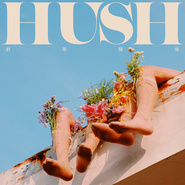

对等关系
============================

|  |  |
| :--: | :-- |
| [ 对等关系](https://emumo.xiami.com/album/2103795983) | **艺人**: [HUSH](../index.md) **语种**: 国语 **唱片公司**: 相知国际 **发行时间**: 2018年07月11日 **专辑类别**: EP, 单曲 **专辑风格**:  **播放数**: 728 **收藏数**: 34 **评论数**: 13  |

## 简介

有一种爱，  
寻找的是对手，而不是对象。  
与其说是爱的跷跷板，寻找完美的平衡；  
或是不完整的圆被补上了缺角。  
不如说是一场的拔河，  
在一来一往中，感受彼此，  
让原本独立的个体在这之中能量更为强大。  
  
那样的炙烈，  
不单单只是陪伴而已，  
而是想要比对方更好更强的存在，  
不单单是伴侣，而是同类。  
  
〈对等关系〉描绘出HUSH很大程度的感情观，  
那样的对等拉扯，不是好强也不是为了输赢，  
而是渴望遇到一个势均力敌的双生火焰。  
一同燃烧出独一无二的光芒，  
无法自拔地沉溺在那共生的爱里。

## 曲目

## 评论

|  |  |  |  |
| :-- | :-- | :-- | :-- |
|  [虾米用户](https://emumo.xiami.com/u/43052326)  2020-04-21 01:56 赞(0) 踩(0) | 
喜欢，编曲一如既往的高级，副歌刚出来那会儿很惊艳
 |
|  [虾米用户](https://emumo.xiami.com/u/342333995) ❍ 2019-02-16 22:46 赞(0) 踩(0) | 

 |
|  [虾米用户](https://emumo.xiami.com/u/49655313) 長大就是一個不斷道別的過... 2018-08-17 05:40 赞(0) 踩(0) | 

 |
|  [虾米用户](https://emumo.xiami.com/u/151767176) 一个糊粉 2018-08-09 23:24 赞(0) 踩(0) | 
虾米
 |
| ⇒ |  [虾米用户](https://emumo.xiami.com/u/319285245)  2018-08-10 00:39 赞(0) 踩(0) | 
好多都没版权了
 |
|  [虾米用户](https://emumo.xiami.com/u/126872994)   2018-07-28 12:52 赞(0) 踩(0) | 
好听 
 |
|  [虾米用户](https://emumo.xiami.com/u/27582296)   2018-07-27 21:19 赞(0) 踩(0) | 
虾米争点气！
 |
|  [虾米用户](https://emumo.xiami.com/u/339191478)   2018-07-27 14:43 赞(0) 踩(0) | 
:-)
 |
|  [虾米用户](https://emumo.xiami.com/u/2767442)   2018-07-19 17:18 赞(0) 踩(0) | 
又没版权。。。
 |
|  [虾米用户](https://emumo.xiami.com/u/5604492) ‪‪♬✧訂閱號：Morn... 2018-07-15 13:36 赞(0) 踩(0) | 
听啦
 |
|  [虾米用户](https://emumo.xiami.com/u/122538034) 沒什麼 只是一時脆弱 2018-07-14 21:34 赞(0) 踩(0) | 
坐在沙发等虾米上架
 |
|  [虾米用户](https://emumo.xiami.com/u/48584104) Everyday is ... 2018-07-13 13:07 赞(1) 踩(0) | 
虾米我等你上架 
 |
|  [虾米用户](https://emumo.xiami.com/u/116613734) 怀念的人啊，等你的來到。 2018-07-11 22:31 赞(0) 踩(0) | 
不是华语群星，是HUSH 啦！！
 |
