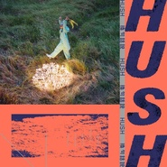

换句话说
============================

|  |  |
| :--: | :-- |
| [ 换句话说](https://emumo.xiami.com/album/2103925079) | **艺人**: [HUSH](../index.md) **语种**: 国语 **唱片公司**: 相知国际 **发行时间**: 2018年08月15日 **专辑类别**: EP, 单曲 **专辑风格**:  **播放数**: 342 **收藏数**: 14 **评论数**: 7  |

## 简介

换句话说如何说？    
当不再用言语述说我们的关系，该怎么说？    
关于这个世界的样貌，该怎么说。  关于你认识的HUSH，会怎么说。    
  
〈换句话说〉这首歌给了我们新的思考。    
当话语交错之后，还会是原本的意思吗？    
重置、删减、再生。  在这个混乱的世界里，  
你们确定所说出的都是真实，想说的话都是本意吗？    
当人人都宣称是第一手传递的当下，还能分出什么是真伪吗？

## 曲目

## 评论

|  |  |  |
| :-- | :-- | :-- |
|  [虾米用户](https://emumo.xiami.com/u/418976808) 22岁，我就应该考试了。 2019-11-10 19:26 赞(0) 踩(0) | 
现在马上就要版权了吧。
 |
|  [虾米用户](https://emumo.xiami.com/u/84571136) 唯有音乐不离不弃 2018-08-19 11:28 赞(0) 踩(0) | 
HUSH &amp;ndash; In Other Words
 |
|  [虾米用户](https://emumo.xiami.com/u/358149854)  2018-08-18 10:47 赞(0) 踩(0) | 
期待新专辑！
 |
|  [虾米用户](https://emumo.xiami.com/u/19813168)   2018-08-18 00:02 赞(0) 踩(0) | 
19.5个小时后见 
 |
|  [虾米用户](https://emumo.xiami.com/u/49655313) 長大就是一個不斷道別的過... 2018-08-17 05:39 赞(0) 踩(0) | 
呜呜呜想听
 |
|  [虾米用户](https://emumo.xiami.com/u/105469910)  2018-08-16 23:44 赞(0) 踩(0) | 
版权啊版权
 |
|  [虾米用户](https://emumo.xiami.com/u/335759143)  2018-08-16 00:41 赞(0) 踩(0) | 
虾米加油啊 争取下版权
 |
