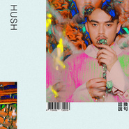

换句话说In Other Words
============================

|  |  |
| :--: | :-- |
| [ 换句话说In Other Words](https://emumo.xiami.com/album/2103969534) | **艺人**: [HUSH](../index.md) **语种**: 国语 **唱片公司**: 相知国际 **发行时间**: 2018年09月14日 **专辑类别**: 录音室专辑 **专辑风格**: 华语唱作人 Chinese Singer-Songwriter, 国语流行 Mandarin Pop, 独立流行 Indie Pop **播放数**: 16942 **收藏数**: 294 **评论数**: 64  |

## 简介

「天后御用创作才子」HUSH  
金曲26与林夕、李焯雄、黄伟文同时入围最佳作词人  
时隔三年推出全新创作专辑《换句话说》  
  
换句话说如何说？  
当不再用言语述说我们的关系，该怎么说？  
关于这个世界的样貌，该怎么说。  
  
当话语交错之后，还会是原本的意思吗？  
重置、删减、再生⋯⋯  
  
在这个混乱的世界里，你们确定所说出的都是真实，想说的话都是本意吗？  
当人人都宣称是第一手传递的当下，还能分出什么是真伪吗？  
  
曾为天后张惠妹、孙燕姿、刘若英、A-lin、徐佳莹等女艺人谱写过〈血腥爱情故事〉、〈身后〉、〈克卜勒〉、〈我要你好好的〉、〈寻人启事〉等脍炙金曲，被誉为「天后御用创作才子」的创作歌手HUSH，继首张个人创作专辑《机会与命运》后，睽违三年即将再度推出全新创作大碟《换句话说》。  
  
HUSH最新专辑《换句话说》，从〈怎么开始的〉打开序幕，像是一天的起点，到第十首歌〈梦游〉如同一天的结束。如梦似幻，睡睡醒醒，看起来是在重复，却又好像每天都是新的一天。  
  
这是一张专辑、可能是一天、可能是一辈子、可能是一场梦。  
那是你我的日常，那些说不出口的预感、怎么都挣脱不了的哀伤、从男孩变男人，从一个人到两个人，HUSH都帮我们唱出口了。  
  
这十首歌，像是一场人生剧幕，  
每个开始，毕竟都只是续篇，  
说著结束，其实也是某种开始。  
  
本次HUSH除了创作《换句话说》整张专辑外，更首次担任制作人，邀请了「五月天」玛莎、「东京事变」吉他手/「PETROLZ」的主脑长冈亮介、神级制作人黄中岳老师、红遍全亚洲的「落日飞车」的主唱国国、享誉国际的爵士乐钢琴家许郁瑛等音乐人跨刀合作。  
  
借由这十首歌串连着现代人一天的生活。  
试着观察所谓「过程的本质」是什么，从麻木到知觉、从睡到醒、现实与梦境、开始与结束、起点与终点，边界与中心⋯⋯任何过程，换句话说。  
  
「换句话说」像一个思考专用的螺丝起子，在扭转原意之后，锁入一个新的定义  
植入脑中，与之共生。在这本世界字典，哪几个字眼，最终会成为你？

## 曲目

## 评论

|  |  |  |  |
| :-- | :-- | :-- | :-- |
|  [虾米用户](https://emumo.xiami.com/u/96296322)  2020-08-10 21:09 赞(0) 踩(0) | 
.
 |
|  [虾米用户](https://emumo.xiami.com/u/112271196) 也没什么意思 2019-05-02 14:14 赞(0) 踩(0) | 
陳必娶的曲和詞555
 |
|  [虾米用户](https://emumo.xiami.com/u/8288058) 卑劣的情感共鸣 2019-03-25 11:36 赞(4) 踩(0) | 
秋秋音乐有版权我屈服了
 |
|  [虾米用户](https://emumo.xiami.com/u/56101620) 听世界的声音 它是一剂心... 2019-02-10 15:57 赞(0) 踩(0) | 
只有苹果能听了吗  
 |
|  [虾米用户](https://emumo.xiami.com/u/2616203) 爱你虾米 2018-11-17 18:01 赞(2) 踩(0) | 
直接买专辑了   设计也够酷
 |
| ⇒ |  [虾米用户](https://emumo.xiami.com/u/2654481)  2018-12-31 21:15 赞(0) 踩(0) | 
你哪里买的专辑啊
 |
|  [虾米用户](https://emumo.xiami.com/u/76029894) 我还没想好要写什么... 2018-11-15 21:40 赞(1) 踩(0) | 
算了，我去Apple music叭
 |
|  [虾米用户](https://emumo.xiami.com/u/44002651) - 2018-11-14 20:28 赞(0) 踩(0) | 
版权啊求求了
 |
|  [虾米用户](https://emumo.xiami.com/u/4334438) 贫穷而倔强 2018-10-26 18:08 赞(0) 踩(0) | 
唉 先看mv吧
 |
|  [虾米用户](https://emumo.xiami.com/u/32017881) wild and flu... 2018-10-22 16:23 赞(1) 踩(0) | 
这张跟Melodrama给我带来的惊喜感是一样的
 |
|  [虾米用户](https://emumo.xiami.com/u/31166693)   2018-10-15 22:40 赞(3) 踩(0) | 
小虾米你把版权拿回来啊！！~~~
 |
|  [虾米用户](https://emumo.xiami.com/u/817547)   2018-10-14 16:06 赞(0) 踩(0) | 
看来我迟了  我日
 |
|  [虾米用户](https://emumo.xiami.com/u/6644478) 我还没想好要写什么... 2018-10-13 22:34 赞(0) 踩(0) | 

 |
|  [虾米用户](https://emumo.xiami.com/u/1245452)  2018-10-03 20:35 赞(0) 踩(0) | 
词写的是真的好
 |
|  [虾米用户](https://emumo.xiami.com/u/327453260)  2018-10-03 18:27 赞(0) 踩(0) | 
今年我的最佳男歌手专辑
 |
|  [虾米用户](https://emumo.xiami.com/u/66880994) 如果你在前方回頭，而我不... 2018-09-28 18:24 赞(0) 踩(0) | 
超棒
 |
|  [虾米用户](https://emumo.xiami.com/u/59166902)   2018-09-25 14:59 赞(0) 踩(0) | 
为啥就差几天就没有了 
 |
|  [虾米用户](https://emumo.xiami.com/u/51844755) 正在输入中 2018-09-23 08:00 赞(0) 踩(0) | 
还好赶在前头下载了
 |
|  [虾米用户](https://emumo.xiami.com/u/12947529) 人生无悔/白走一回 2018-09-21 09:20 赞(0) 踩(0) | 
？？？？？？？？？？
 |
|  [虾米用户](https://emumo.xiami.com/u/53636953) T 2018-09-18 23:15 赞(2) 踩(0) | 
Apple music有
 |
|  [虾米用户](https://emumo.xiami.com/u/39920576)  2018-09-17 22:57 赞(0) 踩(0) | 
 
 |
|  [虾米用户](https://emumo.xiami.com/u/164935992)   2018-09-17 11:16 赞(0) 踩(0) | 
啊啊啊啊啊救命啊没有了
 |
|  [虾米用户](https://emumo.xiami.com/u/309841) 温血动物，单曲循环 2018-09-16 22:33 赞(0) 踩(0) | 
那什么拯救你，我的虾米啊&amp;hellip;
 |
|  [虾米用户](https://emumo.xiami.com/u/44421787) 长期单身 2018-09-16 15:43 赞(0) 踩(0) | 
呜呜呜
 |
|  [虾米用户](https://emumo.xiami.com/u/81287406)  2018-09-16 08:15 赞(1) 踩(0) | 
又下架了？后悔 
 |
|  [虾米用户](https://emumo.xiami.com/u/45478460) 爱很烂❤️ 2018-09-16 02:01 赞(0) 踩(0) | 
下架了 多少人会后悔 
 |
|  [虾米用户](https://emumo.xiami.com/u/230849183) 过的好就过的好，过不好就... 2018-09-15 19:00 赞(2) 踩(0) | 
太棒噜，寄居蟹与蜗牛有无损版，开心一整天
 |
| ⇒ |  [虾米用户](https://emumo.xiami.com/u/81287406)  2018-09-16 08:30 赞(0) 踩(0) | 
请问能分享吗 
 |
|  [虾米用户](https://emumo.xiami.com/u/71971302) 428 2018-09-15 16:44 赞(1) 踩(0) | 
太好太好
 |
|  [虾米用户](https://emumo.xiami.com/u/85848010) 再见 谢谢所有的鱼 2018-09-15 15:26 赞(0) 踩(0) | 
哇哦
 |
|  [虾米用户](https://emumo.xiami.com/u/34272626) 我还没想好要写什么... 2018-09-15 14:41 赞(0) 踩(0) | 
gift吧
 |
|  [虾米用户](https://emumo.xiami.com/u/18246699) 灵魂总是要贪 片刻灿烂 2018-09-15 13:52 赞(1) 踩(0) | 
虾米可以听了！感动
 |
|  [虾米用户](https://emumo.xiami.com/u/99406898) 。 2018-09-15 11:02 赞(1) 踩(0) | 
独善其身 无独有偶
 |
|  [虾米用户](https://emumo.xiami.com/u/114050210) 清淡而又疯狂 2018-09-15 10:41 赞(3) 踩(0) | 
自由而孤独，最喜欢的歌手没有之一
 |
|  [虾米用户](https://emumo.xiami.com/u/26668347) 我还没想好要写什么... 2018-09-15 00:42 赞(0) 踩(0) | 
虾米真厉害
 |
|  [虾米用户](https://emumo.xiami.com/u/96848516) 我们光脚越过人间荒唐 2018-09-14 23:48 赞(0) 踩(0) | 
啊嘞有版权了啊！
 |
|  [虾米用户](https://emumo.xiami.com/u/160963944) 天下之大，不要给我 2018-09-14 23:35 赞(0) 踩(0) | 
抢个板凳 今年可以听到hush现场吗
 |
|  [虾米用户](https://emumo.xiami.com/u/90021718) 五月的天，繁星点点 2018-09-14 22:47 赞(1) 踩(0) | 
前两遍听下来超级无敌喜欢 胡渣 和 寄居蟹与蜗牛！又帅又酷又有才华的hush！超棒！
 |
|  [虾米用户](https://emumo.xiami.com/u/50864130) 我还没想好要写什么... 2018-09-14 21:56 赞(0) 踩(0) | 
是不是太好听了
 |
|  [虾米用户](https://emumo.xiami.com/u/32315688) save me 2018-09-14 20:46 赞(0) 踩(0) | 
！！！！！我的妈
 |
|  [虾米用户](https://emumo.xiami.com/u/104359230) 勿忘初心 2018-09-14 18:49 赞(1) 踩(0) | 
wow虾米也能听了～
 |
|  [虾米用户](https://emumo.xiami.com/u/8226204) ≡ 2018-09-14 18:19 赞(2) 踩(0) | 
OK已在下架前下载完
 |
| ⇒ |  [虾米用户](https://emumo.xiami.com/u/81287406)  2018-09-16 08:55 赞(0) 踩(0) | 
请问可以分享吗 
 |
|  [虾米用户](https://emumo.xiami.com/u/336182365)   2018-09-14 13:26 赞(1) 踩(0) | 
这张专辑真不错，虾米真的没版权了么 
 |
|  [虾米用户](https://emumo.xiami.com/u/5973810) 我虽瞑目眉头仍热烫 2018-09-14 11:13 赞(2) 踩(0) | 
这张专一定要买的！
 |
|  [虾米用户](https://emumo.xiami.com/u/17766238) 你爱我像谁？ 2018-09-14 10:28 赞(4) 踩(0) | 
好听！绝了！有超越《机会与命运》！
 |
|  [虾米用户](https://emumo.xiami.com/u/84571136) 唯有音乐不离不弃 2018-09-14 10:01 赞(1) 踩(0) | 
HUSH &amp;ndash; In Other Words&amp;nbsp;
 |
|  [虾米用户](https://emumo.xiami.com/u/56834030) 我还没想好要写什么... 2018-09-14 09:26 赞(0) 踩(0) | 
对等关系好听鹅！
 |
|  [虾米用户](https://emumo.xiami.com/u/90021718) 五月的天，繁星点点 2018-09-14 07:53 赞(1) 踩(0) | 
大家移步qq吧，那边独家了
 |
|  [虾米用户](https://emumo.xiami.com/u/34564027) 我还没想好要写什么... 2018-09-14 00:05 赞(1) 踩(0) | 
等等的沒有
 |
|  [虾米用户](https://emumo.xiami.com/u/49656461)   2018-09-13 21:59 赞(1) 踩(0) | 
！
 |
|  [虾米用户](https://emumo.xiami.com/u/78560892)  2018-09-13 19:17 赞(2) 踩(0) | 
等零点，一定要发 
 |
|  [虾米用户](https://emumo.xiami.com/u/45478460) 爱很烂❤️ 2018-09-09 16:16 赞(1) 踩(0) | 
有版权的 虾米音乐有相信音乐的版权 大家不用担心 
 |
| ⇒ |  [虾米用户](https://emumo.xiami.com/u/48584104) Everyday is ... 2018-09-14 10:05 赞(0) 踩(0) | 
hush不是乡音的艺人
 |
| ⇒ |  [虾米用户](https://emumo.xiami.com/u/45478460) 爱很烂❤️ 2018-09-14 10:06 赞(0) 踩(0) | 
<q><b>0mile23说：</b></q>
 |
| ⇒ |  [虾米用户](https://emumo.xiami.com/u/48584104) Everyday is ... 2018-09-14 10:13 赞(0) 踩(0) | 
<q><b>海海ricky说：</b></q>
 |
| ⇒ |  [虾米用户](https://emumo.xiami.com/u/90021718) 五月的天，繁星点点 2018-09-14 20:02 赞(0) 踩(0) | 
<q><b>0mile23说：</b></q>
 |
| ⇒ |  [虾米用户](https://emumo.xiami.com/u/48584104) Everyday is ... 2018-09-14 20:03 赞(0) 踩(0) | 
<q><b>李谁说：</b></q>
 |
|  [虾米用户](https://emumo.xiami.com/u/13358191)  2018-09-06 10:48 赞(1) 踩(0) | 
？？？
 |
|  [虾米用户](https://emumo.xiami.com/u/8226204) ≡ 2018-09-04 18:12 赞(0) 踩(0) | 
估计会没版权
 |
|  [虾米用户](https://emumo.xiami.com/u/9619892) 多听歌 少放屁 2018-09-04 11:17 赞(0) 踩(0) | 
没有版权只能去iTunes买了
 |
