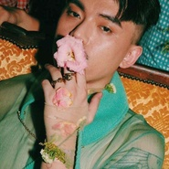

色彩
============================

|  |  |
| :--: | :-- |
| [ 色彩](https://emumo.xiami.com/album/5020857804) | **艺人**: [HUSH](../index.md) **语种**: 国语 **唱片公司**: 独立发行 **发行时间**: 2020年06月05日 **专辑类别**: EP, 单曲 **专辑风格**:  **播放数**: 11242 **收藏数**: 8 **评论数**: 5  |

## 简介

## 曲目

## 评论

|  |  |  |  |
| :-- | :-- | :-- | :-- |
|  [虾米用户](https://emumo.xiami.com/u/345253516) 我还没想好要写什么... 2020-07-14 17:40 赞(0) 踩(0) | 
喜欢
 |
|  [虾米用户](https://emumo.xiami.com/u/100848492) 我还没想好要写什么... 2020-06-23 23:20 赞(0) 踩(0) | 
俺来啦！！hush小公举我们爱你～～  
 |
|  [虾米用户](https://emumo.xiami.com/u/76023296)  2020-06-20 10:40 赞(0) 踩(0) | 
哇，占个前排，好听呀。hush小公主，等疫情过去后等你开巡演啊
 |
|  [虾米用户](https://emumo.xiami.com/u/192534864)  2020-06-14 23:30 赞(0) 踩(0) | 
前排
 |
|  [虾米用户](https://emumo.xiami.com/u/346837984) 一定要成为了不起的大人哦 2020-06-13 17:48 赞(0) 踩(0) | 
来啦 好听呢
 |
