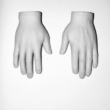
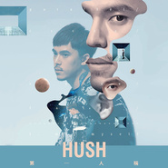
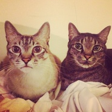
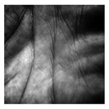
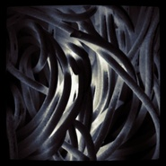

HUSH
============================

|  |  |
| :--: | :-- |
| [ HUSH](https://i.xiami.com/hush) | **地区**: Taiwan, PRC 中国台湾 **风格**: 独立流行 Indie Pop **播放数**: 14702726 **粉丝数**: 20268 **评论数**: 526  |

## 档案

从「海边的卡夫卡」发声的地下乐队—— Hush! 乐队主唱。 
以略带沙哑忧郁的歌声，从天文学和哲学等人文角度出发，诚恳地对自我与听者提出问题，思考一段段不同样貌的生活风景。在音乐流转之际，用音乐抚探你心底的忧怀之影。 
生日：1985年1月15日 (摩羯座) 
地区：台湾 
在安静以后， 
在诉说之前。

## 专辑

| 名称 | 语种 | 唱片公司 | 发行时间 | 专辑类别 | 专辑风格 |
| :--: | :-- | :-- | :-- | :-- | :-- |
| [ 色彩](./albums/5020857804.md) | 国语 | 独立发行 | 2020年06月05日 | EP, 单曲 |  |
| [ 永恒](./albums/2108366038.md) | 国语 | 独立发行 | 2020年03月06日 | EP, 单曲 | 另类唱作人 Alternative Singer-Songwriter, 梦幻流行 Dream Pop |
| [ 当我们谈论爱情](./albums/2104664527.md) | 国语 | 独立发行 | 2019年01月05日 | EP, 单曲 | 华语唱作人 Chinese Singer-Songwriter, 国语流行 Mandarin Pop |
| [ 洪水来了怎么办](./albums/2104664534.md) | 国语 | 独立发行 | 2018年12月30日 | EP, 单曲 | 艺术流行 Art Pop |
| [ 冷](./albums/2105183258.md) | 国语 | 独立发行 | 2018年12月11日 | EP, 单曲 |  |
| [ 换句话说In Other Words](./albums/2103969534.md) | 国语 | 相知国际 | 2018年09月14日 | 录音室专辑 | 华语唱作人 Chinese Singer-Songwriter, 国语流行 Mandarin Pop, 独立流行 Indie Pop |
| [ 换句话说](./albums/2103925079.md) | 国语 | 相知国际 | 2018年08月15日 | EP, 单曲 |  |
| [ 对等关系](./albums/2103795983.md) | 国语 | 相知国际 | 2018年07月11日 | EP, 单曲 |  |
| [ 怎么开始的](./albums/2103722833.md) | 国语 | 相知国际 | 2018年05月30日 | EP, 单曲 | 国语流行 Mandarin Pop |
| [ 换句话说](./albums/2103630694.md) | 国语 | 独立发行 | 2018年02月27日 | EP, 单曲 |  |
| [ 小事](./albums/2102643451.md) | 国语 | 独立发行 | 2016年08月11日 | EP, 单曲 | 国语流行 Mandarin Pop |
| [ 机会与命运Monopoly](./albums/2100195314.md) | 国语 | re: public records | 2015年10月30日 | 录音室专辑 | 华语唱作人 Chinese Singer-Songwriter, 国语流行 Mandarin Pop, 独立流行 Indie Pop |
| [ 我想对你好](./albums/2102726537.md) | 国语 | 独立发行 | 2015年03月24日 | EP, 单曲 |  |
| [ 第一人称三部曲](./albums/1626816338.md) | 国语 | 相知国际 | 2015年03月20日 | EP, 单曲 | 华语唱作人 Chinese Singer-Songwriter, 国语流行 Mandarin Pop, 独立流行 Indie Pop |
| [ THE HONEY](./albums/1715770785.md) | 英语 | 独立发行 | 2014年09月05日 | EP, 单曲 |  |
| [ COVER](./albums/2015770682.md) | 国语 | 独立发行 | 2013年12月30日 | 精选集 |  |
| [ In Between](./albums/1315770857.md) | 国语 | 独立发行 | 2011年09月29日 | 录音室专辑 |  |
| [ 科学实验](./albums/1716712893.md) | 国语 | 独立发行 | 2011年05月13日 | EP, 单曲 |  |
| [ 异常现象](./albums/2026489737.md) | 国语 | 独立发行 | 2011年04月21日 | 录音室专辑 | 国语流行 Mandarin Pop |
| [ 天文特征](./albums/415770829.md) | 国语 | 独立发行 | 2011年04月21日 | 录音室专辑 |  |

## 评论

|  |  |  |
| :-- | :-- | :-- |
|  [虾米用户](https://emumo.xiami.com/u/379162683) 我想要记住你们，我想要你... 2021-01-18 01:22 赞(0) 踩(0) | 
✧*｡
 |
|  [虾米用户](https://emumo.xiami.com/u/333657215) 我还没想好要写什么... 2020-06-12 20:51 赞(0) 踩(0) | 
男神，前来打卡 
 |
|  [虾米用户](https://emumo.xiami.com/u/73740960)  2020-02-29 09:12 赞(0) 踩(0) | 
我最爱的那张现场版呢
 |
|  [虾米用户](https://emumo.xiami.com/u/798356) 我还没想好要写什么... 2020-01-20 14:05 赞(0) 踩(0) | 
521就由我来吧
 |
|  [虾米用户](https://emumo.xiami.com/u/50185584) 厉害的人 2020-01-19 16:05 赞(0) 踩(0) | 
回来吧
 |
|  [虾米用户](https://emumo.xiami.com/u/99201456) 一家人就系要齐齐整整 2019-11-10 22:30 赞(0) 踩(0) | 
灵魂长着同样的悲伤？
 |
|  [虾米用户](https://emumo.xiami.com/u/7627013) 考古，深度挖掘华语音乐 2019-09-20 21:55 赞(0) 踩(0) | 
越来越GAY了
 |
|  [虾米用户](https://emumo.xiami.com/u/49365982) 当断则断 2019-09-19 02:15 赞(0) 踩(0) | 
399的票 买不买呢。。。
 |
|  [虾米用户](https://emumo.xiami.com/u/13814807) quit loving. 2019-08-28 21:41 赞(0) 踩(0) | 
三个字 我可以
 |
|  [虾米用户](https://emumo.xiami.com/u/5563088) 我还没想好要写什么... 2019-08-28 19:51 赞(0) 踩(0) | 
最近哥哥在内地各地各种活跃着啊～开心
 |
|  [虾米用户](https://emumo.xiami.com/u/21341578) 这家伙很聪明什么也没留下... 2019-08-28 14:07 赞(0) 踩(0) | 
什么时候来上海呀？？？？？之前错过了 ！
 |
|  [虾米用户](https://emumo.xiami.com/u/114747334)  2019-08-28 13:32 赞(0) 踩(0) | 
爱您
 |
|  [虾米用户](https://emumo.xiami.com/u/5563088) 我还没想好要写什么... 2019-07-08 20:36 赞(0) 踩(0) | 
您啥时候再来内地演出啊 
 |
| ⇒ |  [虾米用户](https://emumo.xiami.com/u/284184010)   2019-08-28 12:12 赞(0) 踩(0) | 
10.20广州有演唱会！
 |
| ⇒ |  [虾米用户](https://emumo.xiami.com/u/5563088) 我还没想好要写什么... 2019-08-28 19:32 赞(0) 踩(0) | 
<q><b>Swedream说：</b></q>
 |
|  [虾米用户](https://emumo.xiami.com/u/333657215) 我还没想好要写什么... 2019-06-30 14:19 赞(3) 踩(0) | 
天真以为是他的独特品味
 |
|  [虾米用户](https://emumo.xiami.com/u/333797816) 世界上的一切都在做出回答... 2019-06-27 00:26 赞(0) 踩(0) | 
今年因为成都的音乐节错过了你的现场，真的很想下次去听你的现场
 |
|  [虾米用户](https://emumo.xiami.com/u/228843687) 懒惰统治人间 2019-06-20 19:03 赞(1) 踩(0) | 

 |
|  [虾米用户](https://emumo.xiami.com/u/50472756) 没有关系 2019-06-16 18:53 赞(0) 踩(0) | 
高中听着过完 再开始听你的时候快大三了
 |
|  [虾米用户](https://emumo.xiami.com/u/71971302) 428 2019-05-29 11:17 赞(2) 踩(0) | 
恭喜啦
 |
|  [虾米用户](https://emumo.xiami.com/u/245316063) 不回头 不害怕 不介意孤... 2019-05-24 16:05 赞(1) 踩(0) | 
啊啊啊啊，hush,终于到这一步了，依旧爱您啊
 |
|  [虾米用户](https://emumo.xiami.com/u/43875708)  遣词造句 穿山过水 他... 2019-05-24 00:02 赞(7) 踩(0) | 
恭喜你终于和父母正式出柜并得到祝福 虽然我不是同性恋 但是觉得很勇敢 祝福
 |
|  [虾米用户](https://emumo.xiami.com/u/49655313) 除了再见还可以说些什么呢 2019-05-19 23:10 赞(1) 踩(0) | 
下次再见
 |
|  [虾米用户](https://emumo.xiami.com/u/49655313) 除了再见还可以说些什么呢 2019-05-19 19:23 赞(2) 踩(0) | 
还有一小时
 |
|  [虾米用户](https://emumo.xiami.com/u/6705873) 吐翔而亡 =皿 = 2019-05-17 00:59 赞(1) 踩(0) | 
第500个评论！占个位
 |
|  [虾米用户](https://emumo.xiami.com/u/50569150) Isolation. 2019-05-01 20:17 赞(0) 踩(0) | 
能否重翻一下《光和热》？真的很棒
 |
|  [虾米用户](https://emumo.xiami.com/u/412777246) 截断恶席。 2019-04-29 19:17 赞(1) 踩(0) | 
其实一个hush
 |
|  [虾米用户](https://emumo.xiami.com/u/401226000)         难过  ... 2019-04-28 22:52 赞(0) 踩(0) | 
好帅
 |
|  [虾米用户](https://emumo.xiami.com/u/924074)  2019-03-07 18:35 赞(0) 踩(0) | 
摩羯座…
 |
|  [虾米用户](https://emumo.xiami.com/u/121620230) 容易生气 2019-03-02 14:53 赞(0) 踩(0) | 
今年来看你
 |
|  [虾米用户](https://emumo.xiami.com/u/252496574) 关掉评论保智商。 2019-02-26 21:53 赞(1) 踩(0) | 
有生之年要去你的演唱会
 |
|  [虾米用户](https://emumo.xiami.com/u/107245618) 思念就像草丛里的一条蛇。 2019-02-08 23:26 赞(1) 踩(0) | 
晚安，hush
 |
|  [虾米用户](https://emumo.xiami.com/u/238427436)  2019-02-07 22:41 赞(0) 踩(0) | 
想学音乐要怎样学
 |
|  [虾米用户](https://emumo.xiami.com/u/49655313) 除了再见还可以说些什么呢 2019-01-24 00:53 赞(1) 踩(0) | 
西安見啦！（雖然還有好久
 |
|  [虾米用户](https://emumo.xiami.com/u/257074979) come and get... 2019-01-15 01:42 赞(1) 踩(0) | 
生日快乐哦我一直爱你
 |
|  [虾米用户](https://emumo.xiami.com/u/51586444) ‍再見 2019-01-08 12:37 赞(0) 踩(0) | 
没有广州场哭了 
 |
|  [虾米用户](https://emumo.xiami.com/u/220699398)  2019-01-07 00:57 赞(0) 踩(0) | 
喜欢
 |
|  [虾米用户](https://emumo.xiami.com/u/18950459) 对不起，我们世界观不同。 2018-12-09 22:50 赞(0) 踩(0) | 
爱你❤❤❤
 |
|  [虾米用户](https://emumo.xiami.com/u/45478460) 爱很烂❤️ 2018-12-09 09:08 赞(2) 踩(0) | 
昨晚见到了可爱帅气的hush 还签了专辑 开心 
 |
|  [虾米用户](https://emumo.xiami.com/u/45478460) 爱很烂❤️ 2018-12-03 15:18 赞(0) 踩(0) | 
八号晚上北京见 
 |
|  [虾米用户](https://emumo.xiami.com/u/7732308) 向前走你的路，猜猜未来给... 2018-11-17 19:45 赞(1) 踩(0) | 
想听你唱血腥爱情故事故事
 |
|  [虾米用户](https://emumo.xiami.com/u/4752654) 签名太短输不完我的一首诗 2018-11-16 21:55 赞(1) 踩(0) | 
为什么比哥还大的老雀儿还有人说是小鲜肉
 |
|  [虾米用户](https://emumo.xiami.com/u/9633915) 我还没想好要写什么... 2018-11-08 09:29 赞(0) 踩(0) | 
何许在live上说他今年26岁，今年18年
 |
| ⇒ |  [虾米用户](https://emumo.xiami.com/u/580358)  2018-11-08 21:24 赞(0) 踩(0) | 
不是吧，他在马世芳节目上说他30多了啊。
 |
|  [虾米用户](https://emumo.xiami.com/u/23638014) 生命 有一种绝对 2018-11-03 09:14 赞(0) 踩(0) | 
明晚见~ 何许 人也~
 |
|  [虾米用户](https://emumo.xiami.com/u/326243081) 我还没想好要写什么... 2018-11-01 13:37 赞(0) 踩(0) | 
1104见～
 |
|  [虾米用户](https://emumo.xiami.com/u/1722871) 下楼买菜 2018-10-31 21:32 赞(0) 踩(0) | 
出两张深圳本周五 11.02 hush的票 有需要的小伙伴欢迎骚扰
 |
|  [虾米用户](https://emumo.xiami.com/u/36967057) 我还没想好要写什么... 2018-10-23 20:23 赞(1) 踩(0) | 
11月会来广州诶
 |
| ⇒ |  [虾米用户](https://emumo.xiami.com/u/348874684) 等待戈多 2018-11-10 15:02 赞(0) 踩(0) | 
他什么时候要来广州
 |
|  [虾米用户](https://emumo.xiami.com/u/275711973)  2018-10-21 12:29 赞(2) 踩(0) | 
计划今年出柜
 |
|  [虾米用户](https://emumo.xiami.com/u/18074360)   2018-10-08 09:56 赞(0) 踩(0) | 
我终于看到你的现场了嘿！森林音乐节我有跟着唱哦~
 |
|  [虾米用户](https://emumo.xiami.com/u/259411204) 虾米，等到会员到期，我就... 2018-10-07 14:47 赞(1) 踩(0) | 
森林音乐节 第三人称打卡
 |
|  [虾米用户](https://emumo.xiami.com/u/17691156) あなたに出会えて よかっ... 2018-09-23 12:56 赞(0) 踩(0) | 
w
 |
|  [虾米用户](https://emumo.xiami.com/u/10213118)  2018-09-17 10:59 赞(0) 踩(0) | 
我 好喜欢你 的心灵
 |
|  [虾米用户](https://emumo.xiami.com/u/45478460) 爱很烂❤️ 2018-09-14 11:58 赞(1) 踩(0) | 
新专版权在QQ音乐 我是不会去QQ听的 去苹果音乐听 
 |
| ⇒ |  [虾米用户](https://emumo.xiami.com/u/116613734) 怀念的人啊，等你的來到。 2018-09-16 00:18 赞(0) 踩(0) | 
蝦米有新專輯的版權耶。
 |
|  [虾米用户](https://emumo.xiami.com/u/175278550) 私は安本丹です 2018-09-03 15:59 赞(2) 踩(0) | 
版权啊啊啊啊+_+
 |
|  [虾米用户](https://emumo.xiami.com/u/207726325)  2018-08-31 09:21 赞(0) 踩(0) | 
✨✨✨
 |
|  [虾米用户](https://emumo.xiami.com/u/194717784)   2018-08-22 23:37 赞(0) 踩(0) | 
一定是个内心温柔的人
 |
|  [虾米用户](https://emumo.xiami.com/u/45064730) 喜欢林宥嘉  2018-08-20 09:28 赞(0) 踩(0) | 
很喜欢您
 |
|  [虾米用户](https://emumo.xiami.com/u/280304671) 是一个好人 2018-08-18 23:24 赞(3) 踩(0) | 
南昌站五迷打卡！谢谢hush！又认识了一个优秀的人儿！
 |
|  [虾米用户](https://emumo.xiami.com/u/49655313) 除了再见还可以说些什么呢 2018-08-17 05:39 赞(1) 踩(0) | 
我有离线嘻嘻嘻嘻嘻嘻
 |
|  [虾米用户](https://emumo.xiami.com/u/203972461)   2018-08-02 11:47 赞(0) 踩(0) | 
走心了
 |
|  [虾米用户](https://emumo.xiami.com/u/318721517) 你努力前行，我努力爱你。 2018-07-29 22:46 赞(0) 踩(0) | 
好想早点知道你！
 |
|  [虾米用户](https://emumo.xiami.com/u/192800830) 太阳在坠落海浪在发愁 2018-07-18 23:46 赞(1) 踩(0) | 
還是想念你，祝好。 
 |
|  [虾米用户](https://emumo.xiami.com/u/292038858) 我还没想好要写什么... 2018-07-16 00:17 赞(1) 踩(0) | 
声音很美 伴着入睡了&amp;hellip;&amp;hellip;
 |
|  [虾米用户](https://emumo.xiami.com/u/122538034) 沒什麼 只是一時脆弱 2018-07-11 16:02 赞(0) 踩(0) | 
對等關係：）
 |
|  [虾米用户](https://emumo.xiami.com/u/11981821) 爱生活、爱猫、爱音乐。  2018-06-27 19:14 赞(0) 踩(0) | 
我喜欢的一首歌为什么没有了版权
 |
|  [虾米用户](https://emumo.xiami.com/u/46574948)  2018-06-12 07:36 赞(2) 踩(0) | 
所以版权呢？
 |
|  [虾米用户](https://emumo.xiami.com/u/6648881) 我还没想好要写什么... 2018-06-11 10:42 赞(1) 踩(0) | 
版权去哪了
 |
|  [虾米用户](https://emumo.xiami.com/u/317339343) Who did you ... 2018-06-08 16:57 赞(0) 踩(0) | 
今天点开，有些歌虾米没版权了&amp;hellip;&amp;hellip;
 |
|  [虾米用户](https://emumo.xiami.com/u/339191478)   2018-06-07 18:38 赞(0) 踩(0) | 
:-)
 |
|  [虾米用户](https://emumo.xiami.com/u/122538034) 沒什麼 只是一時脆弱 2018-05-30 00:27 赞(0) 踩(0) | 
怎麼開始的，等得肚子餓了
 |
|  [虾米用户](https://emumo.xiami.com/u/52372258)   2018-05-29 23:59 赞(1) 踩(0) | 
等等等
 |
|  [虾米用户](https://emumo.xiami.com/u/17416352) 没 有 了 . 2018-05-26 02:20 赞(0) 踩(0) | 
怎么开始的。等
 |
|  [虾米用户](https://emumo.xiami.com/u/305917956) 我还没想好要写什么... 2018-05-25 14:49 赞(0) 踩(0) | 
人也，要来天津嘛！有机会吗？ 如果困难的话，北京也可以啦
 |
|  [虾米用户](https://emumo.xiami.com/u/53590447) 梦归隐 2018-05-07 18:30 赞(1) 踩(0) | 
等 
 |
|  [虾米用户](https://emumo.xiami.com/u/78377448)  2018-05-02 20:53 赞(3) 踩(0) | 
hush的新专辑录好啦，等他巡回啊啊啊啊啊啊啊啊啊旋转开心
 |
|  [虾米用户](https://emumo.xiami.com/u/258424705) 我还没想好要写什么... 2018-04-23 10:11 赞(17) 踩(0) | 
hush可以说是满足了我对台湾小男生的各种期待了 ~
 |
|  [虾米用户](https://emumo.xiami.com/u/278395393)  2018-04-22 18:21 赞(0) 踩(0) | 
炒鸡棒
 |
|  [虾米用户](https://emumo.xiami.com/u/301392719) 所有的分离都是为了更好地... 2018-04-19 23:01 赞(0) 踩(0) | 
你的歌真的很棒 要一直坚持写下去
 |
|  [虾米用户](https://emumo.xiami.com/u/53590447) 梦归隐 2018-03-28 15:05 赞(2) 踩(0) | 
快出新专巡演吧 想念.
 |
|  [虾米用户](https://emumo.xiami.com/u/233337564) 先生 2018-03-27 16:31 赞(0) 踩(0) | 
么么
 |
|  [虾米用户](https://emumo.xiami.com/u/285049473) 剛拿起酒杯想和你碰杯 才... 2018-03-01 01:14 赞(0) 踩(0) | 
~我喜欢
 |
| ⇒ |  [虾米用户](https://emumo.xiami.com/u/14307836) 匿 2018-03-25 18:54 赞(0) 踩(0) | 
巧了哦
 |
| ⇒ |  [虾米用户](https://emumo.xiami.com/u/285049473) 剛拿起酒杯想和你碰杯 才... 2018-03-30 22:20 赞(0) 踩(0) | 
<q><b>周全一生说：</b></q>
 |
|  [虾米用户](https://emumo.xiami.com/u/94994884)  2018-02-26 20:16 赞(2) 踩(0) | 
hush《寻人启事》待续&amp;hellip;&amp;hellip;
 |
|  [虾米用户](https://emumo.xiami.com/u/30761314) 我还没想好要写什么... 2018-02-14 19:57 赞(1) 踩(0) | 
歌都挺有个性
 |
|  [虾米用户](https://emumo.xiami.com/u/290033622) 自由自私 自私高尚 2018-02-07 10:05 赞(0) 踩(0) | 
长得帅，关注了
 |
|  [虾米用户](https://emumo.xiami.com/u/53590447) 梦归隐 2018-02-06 12:30 赞(0) 踩(0) | 
等新专 xuming
 |
|  [虾米用户](https://emumo.xiami.com/u/326243081) 我还没想好要写什么... 2018-01-27 16:35 赞(0) 踩(0) | 
迷人的嗓音，(≧&amp;nabla;≦)ﾉ喜欢
 |
|  [虾米用户](https://emumo.xiami.com/u/328770949) 大叔一枚，有酒也有故事，... 2018-01-15 17:42 赞(0) 踩(0) | 
不知道2018年有木有在深圳或者广东港澳地区的演出安排呢？
 |
|  [虾米用户](https://emumo.xiami.com/u/49748006) Fly me to th... 2018-01-15 10:48 赞(0) 踩(0) | 
生日快乐呀 一如既往地喜欢你呦(*ฅ́ˇฅ̀*)
 |
|  [虾米用户](https://emumo.xiami.com/u/9633915) 我还没想好要写什么... 2018-01-12 02:41 赞(1) 踩(0) | 
hush挺暖心的
 |
|  [虾米用户](https://emumo.xiami.com/u/268340271) 我还没想好要写什么... 2018-01-08 04:42 赞(0) 踩(0) | 
太纯洁了 好棒
 |
|  [虾米用户](https://emumo.xiami.com/u/59784222) 努力～自信～不放弃 2017-12-16 09:04 赞(2) 踩(0) | 
他的声音真的有致命的诱惑力 
 |
|  [虾米用户](https://emumo.xiami.com/u/48888270) 中文饶舌像史诗一样浪漫；... 2017-12-13 08:18 赞(0) 踩(0) | 
(/&amp;omega;＼)
 |
|  [虾米用户](https://emumo.xiami.com/u/87014) 我还没想好要写什么... 2017-12-05 16:40 赞(0) 踩(0) | 
歌写的不错&amp;hellip;&amp;hellip;不过唱功有待提高
 |
|  [虾米用户](https://emumo.xiami.com/u/338640270)  2017-12-05 04:24 赞(0) 踩(0) | 
唱得好！
 |
|  [虾米用户](https://emumo.xiami.com/u/4334438) 贫穷而倔强 2017-12-01 17:25 赞(0) 踩(0) | 
等回归
 |
|  [虾米用户](https://emumo.xiami.com/u/245163700)  2017-10-30 09:53 赞(2) 踩(0) | 
这回双十一马云爸爸送了三个月虾米会员就过来看看 结果好多Hush的歌网易云没有的这里却有诶！太感动了！我要全部下载来！ 
 |
|  [虾米用户](https://emumo.xiami.com/u/320009642)  2017-10-25 09:31 赞(0) 踩(0) | 
还是想念
 |
|  [虾米用户](https://emumo.xiami.com/u/21216195) 我还没想好要写什么... 2017-10-21 09:04 赞(2) 踩(0) | 
头像就是海边的卡夫卡那个feel的。
 |
|  [虾米用户](https://emumo.xiami.com/u/50781419)  2017-10-18 00:32 赞(0) 踩(0) | 
希望你能早日找到自己的天文特征
 |
|  [虾米用户](https://emumo.xiami.com/u/50781419)  2017-10-18 00:31 赞(0) 踩(0) | 
希望只能早日找到自己的天文特征
 |
|  [虾米用户](https://emumo.xiami.com/u/45298985) Wechat:dqx19... 2017-10-16 11:57 赞(0) 踩(0) | 
+
 |
|  [虾米用户](https://emumo.xiami.com/u/10028400) 我还没想好要写什么... 2017-10-14 22:09 赞(0) 踩(0) | 
碍谁谁
 |
|  [虾米用户](https://emumo.xiami.com/u/10971033) 人总是费心爱着消失的一切 2017-10-10 16:25 赞(1) 踩(0) | 
我这几天天天来搜《怎么开始的》上架了没有，明明设置了消息推送 
 |
|  [虾米用户](https://emumo.xiami.com/u/11300541) 在五月天坐上八三夭的热血... 2017-10-10 16:24 赞(0) 踩(0) | 
不知道为什么HUSH有几首歌听起来让我联想到了李宗盛
 |
|  [虾米用户](https://emumo.xiami.com/u/59475706) 我还没想好要写什么... 2017-10-09 23:03 赞(0) 踩(0) | 
理想型，唉。
 |
|  [虾米用户](https://emumo.xiami.com/u/238430679) 两个宝宝的妈妈，多伦多，... 2017-10-03 02:01 赞(0) 踩(0) | 
第一次这首歌 被惊艳到了 会关注hush
 |
|  [虾米用户](https://emumo.xiami.com/u/54775025) 左边第三根肋骨往里三寸的... 2017-10-03 00:24 赞(0) 踩(0) | 
i like it all
 |
|  [虾米用户](https://emumo.xiami.com/u/189575309) 蓝色是宇宙之爱 2017-10-01 23:11 赞(0) 踩(0) | 
我在等你的新专辑
 |
|  [虾米用户](https://emumo.xiami.com/u/34122285) 天空中有只鲸鱼 2017-09-29 21:51 赞(0) 踩(0) | 
2017年9月29日21:30，Hush在北京场巡演唱了正在制作新专中也是巡演的同名歌曲《怎么开始的》。一如既往的好听，仿佛回到了第一次听Hush那一天 
 |
|  [虾米用户](https://emumo.xiami.com/u/212922807) ᴄᴏᴏʟ ᴀs ɪᴄᴇ ... 2017-09-28 12:06 赞(0) 踩(0) | 
喜欢你了好多好多好多好多好多年
 |
|  [虾米用户](https://emumo.xiami.com/u/4165342)  2017-09-26 17:08 赞(0) 踩(0) | 
HUSH 2017北京唯一专场，9月29日！！！！！！！！！！！   就在北京星光现场，预售即将售罄啦 ：<a href="http://www.showstart.com/event/35987" target="_blank" rel="nofollow noreferrer noopener">http://www.showstart.com/event/35987</a>     。
 |
|  [虾米用户](https://emumo.xiami.com/u/49959840) 无聊人 2017-09-07 21:40 赞(0) 踩(0) | 
喜欢
 |
|  [虾米用户](https://emumo.xiami.com/u/121620230) 容易生气 2017-08-27 21:16 赞(0) 踩(0) | 
何许何许
 |
|  [虾米用户](https://emumo.xiami.com/u/113364552) 想去南极，想去外太空。 2017-08-19 13:26 赞(1) 踩(0) | 
孤陋寡闻了。。。中国有这样的音乐人 被惊艳到
 |
|  [虾米用户](https://emumo.xiami.com/u/89058800) 很高兴你能来 不遗憾你走... 2017-08-15 21:04 赞(1) 踩(0) | 
南京见啦
 |
|  [虾米用户](https://emumo.xiami.com/u/44126265) 透明 2017-08-15 15:17 赞(0) 踩(0) | 
~
 |
|  [虾米用户](https://emumo.xiami.com/u/223930759)  2017-08-13 17:09 赞(0) 踩(0) | 
很治愈
 |
|  [虾米用户](https://emumo.xiami.com/u/52395373) 我还没想好要写什么... 2017-08-04 15:32 赞(0) 踩(0) | 
。
 |
|  [虾米用户](https://emumo.xiami.com/u/158722762)   2017-07-24 15:07 赞(0) 踩(0) | 
很棒不只是歌声更是歌词和曲
 |
|  [虾米用户](https://emumo.xiami.com/u/50728608) 我还没想好要写什么... 2017-07-21 17:08 赞(0) 踩(0) | 
喜欢你的歌 词
 |
|  [虾米用户](https://emumo.xiami.com/u/36822548) 苟且不止生活 2017-07-05 18:11 赞(3) 踩(0) | 
喜欢你哦，第一次听第三人称就喜欢你了 
 |
|  [虾米用户](https://emumo.xiami.com/u/138154158)  2017-07-03 10:45 赞(2) 踩(0) | 
毕竟是百年难得
 |
|  [虾米用户](https://emumo.xiami.com/u/306048989)  2017-06-20 16:02 赞(0) 踩(0) | 
喜欢
 |
|  [虾米用户](https://emumo.xiami.com/u/702290) 我还没想好要写什么... 2017-06-05 14:18 赞(0) 踩(0) | 

 |
|  [虾米用户](https://emumo.xiami.com/u/204477536) 慢慢来 比较快 2017-06-04 10:26 赞(1) 踩(0) | 
第一次听你，谢谢虾米的推荐，很喜欢
 |
|  [虾米用户](https://emumo.xiami.com/u/22353890)  2017-05-28 23:17 赞(1) 踩(0) | 
音乐特别
 |
|  [虾米用户](https://emumo.xiami.com/u/22353890)  2017-05-28 23:17 赞(1) 踩(0) | 
音乐特别
 |
|  [虾米用户](https://emumo.xiami.com/u/5912692) 我还没想好要写什么... 2017-05-17 12:34 赞(56) 踩(0) | 
男神都是gay系列
 |
| ⇒ |  [虾米用户](https://emumo.xiami.com/u/143979640) 我还没想好要写什么... 2017-06-13 12:19 赞(0) 踩(0) | 
没错 神秘力量&amp;hellip;
 |
|  [虾米用户](https://emumo.xiami.com/u/204412530) Just Rock It... 2017-05-17 11:22 赞(3) 踩(0) | 
我相信 校园巡回（西华大学），&amp;ldquo;我们现在算同框了，你们已经被我圈粉了&amp;rdquo;  
 |
|  [虾米用户](https://emumo.xiami.com/u/49748006) Fly me to th... 2017-05-16 21:40 赞(0) 踩(0) | 
从电话里听的你也太棒(~_~;)
 |
|  [虾米用户](https://emumo.xiami.com/u/61298574) 难解风情 2017-05-15 22:00 赞(3) 踩(0) | 
&amp;ldquo;你要的完美我怎么没有听说过&amp;rdquo;  大概因为你就是。
 |
|  [虾米用户](https://emumo.xiami.com/u/9028760) 豆瓣见 spotify ... 2017-05-14 06:46 赞(0) 踩(0) | 
◡̈
 |
|  [虾米用户](https://emumo.xiami.com/u/41276536)   2017-05-12 12:53 赞(0) 踩(0) | 
并不想让太多人认识你。
 |
|  [虾米用户](https://emumo.xiami.com/u/72180532) 你好 2017-05-10 18:36 赞(2) 踩(0) | 
汪苏泷现在已经不唱非主流了  我以前也不听他的歌现在觉得有的还可以
 |
|  [虾米用户](https://emumo.xiami.com/u/35509231) 提灯天后  策马小僧 2017-05-09 20:16 赞(2) 踩(0) | 
有一个叫海龟先生的，音色和他好像好像。但那个人唱风轻俏（这是一个严肃的中性词），而我偏向喜欢正剧，我一直以为是同一个人。后来才发现，差点损失了一个好声音～好险好险
 |
| ⇒ |  [虾米用户](https://emumo.xiami.com/u/270733510)  2017-08-22 22:47 赞(0) 踩(0) | 
男孩别哭
 |
|  [虾米用户](https://emumo.xiami.com/u/35509231) 提灯天后  策马小僧 2017-05-09 20:11 赞(0) 踩(0) | 
无可挑剔！优秀！完美！
 |
|  [虾米用户](https://emumo.xiami.com/u/85616288) 是的 这家伙很聪明什么也... 2017-05-08 21:31 赞(0) 踩(0) | 
何小p应该很羡慕这位友人吧
 |
|  [虾米用户](https://emumo.xiami.com/u/286535719)  2017-05-04 15:10 赞(0) 踩(0) | 
love u ,no reasons
 |
|  [虾米用户](https://emumo.xiami.com/u/238336548) I'M NOT FREE 2017-04-24 00:25 赞(1) 踩(0) | 
有你的声音陪伴
 |
|  [虾米用户](https://emumo.xiami.com/u/278885367)  2017-04-22 21:02 赞(0) 踩(0) | 
(❁ฺ&amp;bull;㉨ฺ&amp;bull;❁)
 |
|  [虾米用户](https://emumo.xiami.com/u/33710732)  2017-04-21 00:00 赞(0) 踩(0) | 
真的超喜欢你
 |
|  [虾米用户](https://emumo.xiami.com/u/95668260) see the futu... 2017-04-18 20:22 赞(0) 踩(0) | 
新驻
 |
|  [虾米用户](https://emumo.xiami.com/u/94961470) 来路无可眷恋，值得期待的... 2017-04-16 12:49 赞(0) 踩(0) | 
QAQ
 |
|  [虾米用户](https://emumo.xiami.com/u/83801604) 原來我非不快樂 2017-04-16 08:18 赞(0) 踩(0) | 
❤️❤️❤️
 |
|  [虾米用户](https://emumo.xiami.com/u/51967915)  2017-04-13 19:08 赞(0) 踩(0) | 
好喜欢你 一定要去看你的LIVE
 |
|  [虾米用户](https://emumo.xiami.com/u/273731806)  2017-04-07 18:23 赞(0) 踩(0) | 
好听
 |
|  [虾米用户](https://emumo.xiami.com/u/49748006) Fly me to th... 2017-04-03 20:25 赞(0) 踩(0) | 
对我好嘛 哭哭
 |
|  [虾米用户](https://emumo.xiami.com/u/90998432) 一生活一场五月天！！！ 2017-04-02 16:41 赞(0) 踩(0) | 
喜欢！！！
 |
|  [虾米用户](https://emumo.xiami.com/u/33575558) 一丈孤勇心外仙 2017-03-31 21:50 赞(0) 踩(0) | 

 |
|  [虾米用户](https://emumo.xiami.com/u/273190724) 别惹我 2017-03-27 21:14 赞(1) 踩(0) | 

 |
|  [虾米用户](https://emumo.xiami.com/u/201391232) 最快的方法是先抱抱 2017-03-22 23:37 赞(1) 踩(0) | 

 |
|  [虾米用户](https://emumo.xiami.com/u/9427011)  2017-03-20 10:05 赞(1) 踩(0) | 
喜欢一个人需要理由吗
 |
|  [虾米用户](https://emumo.xiami.com/u/49700107) 怕人类 2017-03-17 14:29 赞(0) 踩(0) | 
我一定要去看你
 |
|  [虾米用户](https://emumo.xiami.com/u/262317548)   2017-03-16 16:29 赞(0) 踩(0) | 
爱上他的声音 
 |
|  [虾米用户](https://emumo.xiami.com/u/46515323)   2017-03-16 14:40 赞(0) 踩(0) | 
同月同日生日！！！！！！！！
 |
|  [虾米用户](https://emumo.xiami.com/u/51820717)  2017-03-04 16:35 赞(0) 踩(0) | 
  
 |
|  [虾米用户](https://emumo.xiami.com/u/8305765) 人体ETC 2017-02-27 11:37 赞(1) 踩(0) | 
新頭像很帥啊
 |
|  [虾米用户](https://emumo.xiami.com/u/585351) 暂无签名~ 2017-02-22 20:08 赞(2) 踩(0) | 
第三人称，第一句就惊艳了我的耳朵，从此为你折服
 |
|  [虾米用户](https://emumo.xiami.com/u/9088315) 花了一年半来明白，朋友总... 2017-02-19 01:12 赞(2) 踩(0) | 
Ins里面发的东西好逗
 |
|  [虾米用户](https://emumo.xiami.com/u/7686338) 静静深夜 月涌江流 2017-02-17 12:26 赞(0) 踩(0) | 
哇
 |
|  [虾米用户](https://emumo.xiami.com/u/273796465)  2017-02-16 09:43 赞(1) 踩(0) | 
希望现在遇见你不晚。
 |
|  [虾米用户](https://emumo.xiami.com/u/17081295) 我还没想好要写什么... 2017-02-06 23:08 赞(0) 踩(0) | 
臥槽你居然是摩羯座⋯
 |
|  [虾米用户](https://emumo.xiami.com/u/264283064) bye  2017-02-02 20:32 赞(0) 踩(0) | 
△
 |
|  [虾米用户](https://emumo.xiami.com/u/6403692)  2017-01-29 23:31 赞(0) 踩(0) | 
好帅的基佬！
 |
|  [虾米用户](https://emumo.xiami.com/u/51741479)   2017-01-28 16:09 赞(0) 踩(0) | 
新年快乐 老陈
 |
|  [虾米用户](https://emumo.xiami.com/u/36737007) He travels f... 2017-01-23 16:47 赞(2) 踩(0) | 
喜欢虾米是因为有Demo和你
 |
|  [虾米用户](https://emumo.xiami.com/u/1219018) 你好，我叫谢有君。估计大... 2017-01-19 19:17 赞(3) 踩(0) | 
原来hush在虾米啊！
 |
|  [虾米用户](https://emumo.xiami.com/u/136095256) 最美的愿望一定最疯狂 。 2017-01-16 22:53 赞(3) 踩(0) | 
生日快乐，喜欢你的第四年
 |
|  [虾米用户](https://emumo.xiami.com/u/9882024) 直到你发现  我 （再也... 2017-01-16 22:44 赞(0) 踩(0) | 
爱你  ❤️
 |
|  [虾米用户](https://emumo.xiami.com/u/98051584) Completely A... 2017-01-15 02:28 赞(0) 踩(0) | 
生日快乐呢
 |
|  [虾米用户](https://emumo.xiami.com/u/203304172)  2017-01-11 19:11 赞(1) 踩(0) | 
发现一个创作人，写的很棒！
 |
|  [虾米用户](https://emumo.xiami.com/u/42725114) ThistheshitI... 2017-01-02 15:28 赞(0) 踩(0) | 

 |
|  [虾米用户](https://emumo.xiami.com/u/43838497) 陈奕迅神经研究所 2016-12-30 23:48 赞(4) 踩(0) | 
第三人称 后  还是想念  又把我召唤来了  
 |
|  [虾米用户](https://emumo.xiami.com/u/223821334) 我年少时 也曾策马扬鞭看... 2016-12-25 23:28 赞(0) 踩(0) | 
听了你一年半
 |
|  [虾米用户](https://emumo.xiami.com/u/72331380)   2016-12-23 15:28 赞(0) 踩(0) | 
换个封面吧…这张显得好丑…
 |
|  [虾米用户](https://emumo.xiami.com/u/116150638) 你能体谅  我有雨天 2016-12-22 23:22 赞(1) 踩(0) | 
《还是想念》《都是你害的》。
 |
|  [虾米用户](https://emumo.xiami.com/u/58069818) 一片乌云一座神秘的小森林 2016-12-18 19:54 赞(0) 踩(0) | 
就是好听啊
 |
|  [虾米用户](https://emumo.xiami.com/u/255137639) http://www. 2016-12-18 04:49 赞(0) 踩(0) | 
d
 |
|  [虾米用户](https://emumo.xiami.com/u/128558698) 豆瓣太孤独 2016-12-14 02:22 赞(0) 踩(0) | 
天文特征百听不厌 
 |
|  [虾米用户](https://emumo.xiami.com/u/3707881) 等你有版权了我会回来爱你... 2016-11-26 08:49 赞(1) 踩(0) | 
期待下次来杭能去听一下现场
 |
|  [虾米用户](https://emumo.xiami.com/u/44140680) 旅途愉快 2016-10-25 08:59 赞(0) 踩(0) | 
⚫️
 |
|  [虾米用户](https://emumo.xiami.com/u/9028760) 豆瓣见 spotify ... 2016-10-17 14:07 赞(0) 踩(0) | 
༛̥⃝ʺ̤
 |
|  [虾米用户](https://emumo.xiami.com/u/43838497) 陈奕迅神经研究所 2016-10-16 03:24 赞(1) 踩(0) | 
真的好舒服的声音   听的最多的是  第三人称！虾米推荐的你的歌也特别耐听
 |
|  [虾米用户](https://emumo.xiami.com/u/5464501)   2016-10-13 12:16 赞(0) 踩(0) | 
声线控制有点不够厉害
 |
|  [虾米用户](https://emumo.xiami.com/u/49748006) Fly me to th... 2016-10-09 19:13 赞(0) 踩(0) | 
嗨呀
 |
|  [虾米用户](https://emumo.xiami.com/u/1273) fine 2016-10-05 08:17 赞(2) 踩(0) | 
简单生活音乐节站在第一排，一秒爱上你！！！！！
 |
| ⇒ |  [虾米用户](https://emumo.xiami.com/u/24170187)  2016-10-08 15:17 赞(0) 踩(0) | 
簡單音樂節過來的too，本來要看逼哥的。。。最後一首歌我該喊天空之城來著。
 |
| ⇒ |  [虾米用户](https://emumo.xiami.com/u/1273) fine 2016-10-10 13:44 赞(0) 踩(0) | 
<q><b>宇智波左小祖咒说：</b></q>
 |
|  [虾米用户](https://emumo.xiami.com/u/10465473) 缘尽仍留慈悲 2016-10-03 09:21 赞(0) 踩(0) | 
301！
 |
|  [虾米用户](https://emumo.xiami.com/u/13978900) MUSIC 4 LIFE 2016-09-28 04:18 赞(0) 踩(0) | 
来吧 300
 |
|  [虾米用户](https://emumo.xiami.com/u/62924594) 世事无常 2016-09-25 17:50 赞(0) 踩(0) | 
i love you ~
 |
|  [虾米用户](https://emumo.xiami.com/u/100848492) 我还没想好要写什么... 2016-09-19 13:08 赞(0) 踩(0) | 
爱hush
 |
|  [虾米用户](https://emumo.xiami.com/u/774208) 我还没想好要写什么... 2016-08-24 11:51 赞(4) 踩(0) | 
HUSH将于10月4日于上海简单生活节演出！  10月4-6日 上海世博公园 简单生活节  陈绮贞、张震岳、徐佳莹、李荣浩、许巍、李志、老狼、窦靖童、陈粒、王若琳、赵雷、苏慧伦、陶晶莹、关淑怡、梁博、韦礼安、Faye飞、邱比、陈珊妮 feat 蔡健雅、MATZKA feat A-Lin、魏如萱 feat 马頔、杨乃文 feat 高旗、HUSH feat 阿肆、草东没有派对、万能青年旅店、逃跑计划、好妹妹、旅行团、果味VC、谢震廷、Hello Nico、声音玩具……众星云集！  微博：@简单生活节上海 <a href="http://weibo.com/simplelifeshanghai" target="_blank" rel="nofollow noreferrer noopener">http://weibo.com/simplelifeshanghai</a>
 |
|  [虾米用户](https://emumo.xiami.com/u/45298985) Wechat:dqx19... 2016-08-23 20:19 赞(0) 踩(0) | 
+
 |
|  [虾米用户](https://emumo.xiami.com/u/41997868) 爱听杨千嬅、梁静茹。愿我... 2016-08-20 11:24 赞(1) 踩(0) | 
林丹
 |
|  [虾米用户](https://emumo.xiami.com/u/162979530)  2016-08-18 13:07 赞(0) 踩(0) | 
291
 |
|  [虾米用户](https://emumo.xiami.com/u/96623828)   2016-08-18 12:07 赞(0) 踩(0) | 
自称老哈，你好可爱
 |
|  [虾米用户](https://emumo.xiami.com/u/96623828)   2016-08-18 12:07 赞(0) 踩(0) | 
小公举
 |
|  [虾米用户](https://emumo.xiami.com/u/49265597) 我还没想好要写什么... 2016-08-14 12:51 赞(0) 踩(0) | 
不
 |
|  [虾米用户](https://emumo.xiami.com/u/5093359) 。 2016-08-09 01:20 赞(0) 踩(0) | 
286
 |
|  [虾米用户](https://emumo.xiami.com/u/47019460) go make it b... 2016-08-07 16:55 赞(0) 踩(0) | 
怎么说 毕竟是百年难得
 |
|  [虾米用户](https://emumo.xiami.com/u/16928367) . 2016-08-05 22:29 赞(0) 踩(0) | 
想听 易碎的吻
 |
| ⇒ |  [虾米用户](https://emumo.xiami.com/u/162979530)  2016-08-10 13:12 赞(0) 踩(0) | 
同
 |
|  [虾米用户](https://emumo.xiami.com/u/18985669) 悲观过界 2016-08-03 13:47 赞(0) 踩(0) | 
嘘
 |
|  [虾米用户](https://emumo.xiami.com/u/49640493) 网易云SAINTDONT... 2016-07-03 22:48 赞(0) 踩(0) | 
牛逼
 |
|  [虾米用户](https://emumo.xiami.com/u/34697128) 我还没想好要写什么... 2016-06-30 19:54 赞(0) 踩(0) | 
喜欢你
 |
|  [虾米用户](https://emumo.xiami.com/u/97747450) 我还没想好要写什么... 2016-06-23 13:56 赞(0) 踩(0) | 
1550
 |
|  [虾米用户](https://emumo.xiami.com/u/50640749) 好时光都该被宝贝 2016-06-23 10:44 赞(0) 踩(0) | 
声音真是好惊艳
 |
|  [虾米用户](https://emumo.xiami.com/u/15860080) ᐉ 2016-06-15 19:53 赞(0) 踩(0) | 
哟:-O
 |
|  [虾米用户](https://emumo.xiami.com/u/341091) 偶爱我们呢~ 2016-06-06 15:09 赞(0) 踩(0) | 
我都听了这么久居然没收藏……不合理
 |
|  [虾米用户](https://emumo.xiami.com/u/2608518) 忙碌并快乐着。 2016-06-05 17:49 赞(0) 踩(0) | 
很喜欢。情歌也不那么俗套。
 |
|  [虾米用户](https://emumo.xiami.com/u/103706756) 感謝關注 2016-05-25 23:03 赞(1) 踩(0) | 
你的第三人称真的很棒
 |
|  [虾米用户](https://emumo.xiami.com/u/7797443) / / 2016-05-21 22:43 赞(1) 踩(0) | 
HUSH能不能唱一首《等着你回来》，Dome就好
 |
|  [虾米用户](https://emumo.xiami.com/u/49289768)  2016-05-19 23:44 赞(0) 踩(0) | 
突然发现两张专辑收费了。多亏我已经机智地全部下载了
 |
| ⇒ |  [虾米用户](https://emumo.xiami.com/u/86876920)  2016-10-05 12:15 赞(0) 踩(0) | 
你太机智了！
 |
|  [虾米用户](https://emumo.xiami.com/u/34936363) 零. 2016-05-17 09:37 赞(0) 踩(0) | 
何日再来？
 |
|  [虾米用户](https://emumo.xiami.com/u/42100089) 能安静听个歌就很好 2016-05-16 22:01 赞(0) 踩(0) | 

 |
|  [虾米用户](https://emumo.xiami.com/u/1848528)  2016-05-16 00:01 赞(0) 踩(0) | 
好喜欢你的声音啊 一听就哭了
 |
|  [虾米用户](https://emumo.xiami.com/u/150636826)   2016-05-15 23:03 赞(0) 踩(0) | 
上海站520一起走
 |
|  [虾米用户](https://emumo.xiami.com/u/21450282) 哞~ 咩~ 2016-05-15 00:45 赞(2) 踩(0) | 
说吧你是不是暗恋林宥嘉哈哈哈哈哈哈哈
 |
| ⇒ |  [虾米用户](https://emumo.xiami.com/u/132119586)  2016-10-05 13:53 赞(0) 踩(0) | 
嘘
 |
|  [虾米用户](https://emumo.xiami.com/u/21450282) 哞~ 咩~ 2016-05-13 00:29 赞(0) 踩(0) | 
厦门见～
 |
|  [虾米用户](https://emumo.xiami.com/u/881774)  2016-04-30 15:14 赞(0) 踩(0) | 
厦门见
 |
|  [虾米用户](https://emumo.xiami.com/u/7787634) 19 2016-04-29 16:36 赞(0) 踩(0) | 
后天见！
 |
|  [虾米用户](https://emumo.xiami.com/u/8192862) 诗人和先知。vchat:... 2016-04-28 12:47 赞(0) 踩(0) | 
忘记买票了TAT有要转广州站的请务必联系我谢谢orz
 |
|  [虾米用户](https://emumo.xiami.com/u/14817065)  2016-04-27 00:32 赞(0) 踩(0) | 
等不到你..
 |
|  [虾米用户](https://emumo.xiami.com/u/4397256) ※Good Music ... 2016-04-24 21:57 赞(0) 踩(0) | 
太爱你了
 |
|  [虾米用户](https://emumo.xiami.com/u/84018088) 谁亦能呵一呵、呼啦啦 2016-04-24 20:38 赞(1) 踩(0) | 
啥时候来大连呐。。。
 |
|  [虾米用户](https://emumo.xiami.com/u/49655313) 除了再见还可以说些什么呢 2016-04-23 23:39 赞(0) 踩(0) | 
goodnight
 |
|  [虾米用户](https://emumo.xiami.com/u/7676740) 没关系。 2016-04-21 16:04 赞(0) 踩(0) | 
小公举要来了 &amp;gt; /// &amp;lt;
 |
|  [虾米用户](https://emumo.xiami.com/u/11188031)  2016-04-19 15:00 赞(0) 踩(0) | 
陈何许，你好。
 |
|  [虾米用户](https://emumo.xiami.com/u/103863888) 交互，信息设计//传达，... 2016-04-18 03:32 赞(0) 踩(0) | 
喜欢这个哥哥
 |
|  [虾米用户](https://emumo.xiami.com/u/104011414) 我还没想好要写什么... 2016-04-16 22:26 赞(0) 踩(0) | 
廣州見阿哈許哥0v0
 |
|  [虾米用户](https://emumo.xiami.com/u/5604492) ‪‪♬✧訂閱號：Morn... 2016-04-16 10:51 赞(0) 踩(0) | 
杭州杭州！！！！！
 |
|  [虾米用户](https://emumo.xiami.com/u/7350916) 后摇 2016-04-15 13:34 赞(0) 踩(0) | 
北京有要一起的么
 |
|  [虾米用户](https://emumo.xiami.com/u/3465643)   2016-04-15 00:07 赞(0) 踩(0) | 
哦北京巡演有一起的吗 我孤身一人
 |
| ⇒ |  [虾米用户](https://emumo.xiami.com/u/7350916) 后摇 2016-04-15 13:34 赞(0) 踩(0) | 
约啊～
 |
|  [虾米用户](https://emumo.xiami.com/u/138119676)  2016-04-09 20:03 赞(0) 踩(0) | 

 |
|  [虾米用户](https://emumo.xiami.com/u/10881999) a luvly mist... 2016-04-04 00:16 赞(0) 踩(0) | 
天阿听了很久的歌，居然才发现主唱长这样！惊喜！
 |
|  [虾米用户](https://emumo.xiami.com/u/4334438) 贫穷而倔强 2016-04-03 23:30 赞(0) 踩(0) | 
没想到hush是85后
 |
|  [虾米用户](https://emumo.xiami.com/u/119896142)   2016-03-31 12:33 赞(0) 踩(0) | 
[带墨镜笑][带墨镜笑]
 |
|  [虾米用户](https://emumo.xiami.com/u/50702694) 后颈滚烫 2016-03-29 20:20 赞(0) 踩(0) | 
_
 |
|  [虾米用户](https://emumo.xiami.com/u/48211350) 已弃虾米，勿扰 2016-03-22 23:42 赞(0) 踩(0) | 
牛逼
 |
|  [虾米用户](https://emumo.xiami.com/u/7202270) 索 2016-03-22 22:16 赞(0) 踩(0) | 
嗓音有识别力！～期待更多更好的作品！～点赞！～～
 |
|  [虾米用户](https://emumo.xiami.com/u/2507372) 生而为人，对不起。 2016-03-19 05:37 赞(0) 踩(0) | 
摩羯座 :3 好爱啊
 |
|  [虾米用户](https://emumo.xiami.com/u/37158600) dreamer 2016-03-12 13:04 赞(0) 踩(0) | 
看在你和我同年同月同日生，我就收藏了你吧~嘿嘿~
 |
|  [虾米用户](https://emumo.xiami.com/u/82688830) 我还没想好要写什么... 2016-03-11 23:42 赞(0) 踩(0) | 
都是你害的！
 |
|  [虾米用户](https://emumo.xiami.com/u/12335944) dsfassadf 2016-03-09 04:04 赞(0) 踩(0) | 
dfsggsdfg
 |
|  [虾米用户](https://emumo.xiami.com/u/17020124) 来，临走照张合影。 2016-03-05 20:50 赞(1) 踩(0) | 
我想再关注再围观再置身事外的，终于还是无法自拔地点了收藏。
 |
|  [虾米用户](https://emumo.xiami.com/u/80239110)   尚好的青春都是你！ 2016-03-04 23:24 赞(0) 踩(0) | 
无意之间又发现了一位大才子，不一样的感觉，喜欢。
 |
|  [虾米用户](https://emumo.xiami.com/u/3854430) 是一个隐蔽的青年 2016-03-04 01:48 赞(0) 踩(0) | 
( ⁼̴̀ .̫ ⁼̴́ )✧
 |
|  [虾米用户](https://emumo.xiami.com/u/83763716) 给你的每一根发丝命名 2016-03-01 20:12 赞(0) 踩(0) | 
喜欢喜欢 声音控
 |
|  [虾米用户](https://emumo.xiami.com/u/9028760) 豆瓣见 spotify ... 2016-02-27 01:44 赞(1) 踩(0) | 
☄
 |
| ⇒ |  [虾米用户](https://emumo.xiami.com/u/48211350) 已弃虾米，勿扰 2016-03-22 23:42 赞(0) 踩(0) | 
怎么哪都有你
 |
| ⇒ |  [虾米用户](https://emumo.xiami.com/u/9028760) 豆瓣见 spotify ... 2016-03-23 12:24 赞(0) 踩(0) | 
<q><b>三天之内说：</b></q>
 |
|  [虾米用户](https://emumo.xiami.com/u/116207806)   2016-02-21 17:23 赞(1) 踩(0) | 
一开始就喜欢上你的嗓音 跟你也不是简单有缘分一句可以说明 三番两次在台北遇见你 要是能再遇见你就好了 （笑:-D）
 |
|  [虾米用户](https://emumo.xiami.com/u/8475225)  2016-02-15 12:27 赞(0) 踩(0) | 
[[[[[[[[[[[[oooooOooooo]]]]]]]]]]]]
 |
|  [虾米用户](https://emumo.xiami.com/u/7676740) 没关系。 2016-02-08 10:03 赞(0) 踩(0) | 
喜欢上这个魔蝎座
 |
| ⇒ |  [虾米用户](https://emumo.xiami.com/u/14817065)  2016-02-17 13:43 赞(0) 踩(0) | 
QAQ成日都钟意其他人
 |
| ⇒ |  [虾米用户](https://emumo.xiami.com/u/7676740) 没关系。 2016-02-17 13:47 赞(0) 踩(0) | 
<q><b>L说：</b></q>
 |
|  [虾米用户](https://emumo.xiami.com/u/7603700) 我还没想好要写什么... 2016-02-01 23:18 赞(0) 踩(0) | 
好久沒聽hush了
 |
|  [虾米用户](https://emumo.xiami.com/u/10944859) ‏‏‏‏‏‏‏‏ 2016-02-01 03:59 赞(0) 踩(0) | 
诶
 |
|  [虾米用户](https://emumo.xiami.com/u/51865794) 我还没想好要写什么... 2016-01-29 12:34 赞(3) 踩(0) | 
HUSH    HUSH!     hush!    虾米里有3个
 |
|  [虾米用户](https://emumo.xiami.com/u/102121668) hush 2016-01-22 09:51 赞(0) 踩(0) | 
love u
 |
|  [虾米用户](https://emumo.xiami.com/u/24802474)   2016-01-20 10:28 赞(2) 踩(0) | 
充分证明作词和唱功在一张专辑中其实没那么重要
 |
|  [虾米用户](https://emumo.xiami.com/u/27413373) weibo：i9xx 2016-01-17 21:21 赞(0) 踩(0) | 
很喜欢你的歌
 |
|  [虾米用户](https://emumo.xiami.com/u/4334438) 贫穷而倔强 2016-01-15 21:59 赞(0) 踩(0) | 
生日快乐 
 |
|  [虾米用户](https://emumo.xiami.com/u/52536056) (◉ω◉υ)⁼³₌₃悄咪... 2016-01-09 19:09 赞(0) 踩(0) | 
吸吸
 |
|  [虾米用户](https://emumo.xiami.com/u/96623828)   2016-01-09 14:38 赞(3) 踩(0) | 
本来是五迷观光团，没想到来了就回不去了，HUSH，好喜欢你啊！
 |
| ⇒ |  [虾米用户](https://emumo.xiami.com/u/83763716) 给你的每一根发丝命名 2016-03-01 20:11 赞(0) 踩(0) | 
哈哈哈一样一样 一起别回去 从此多爱一个hush
 |
|  [虾米用户](https://emumo.xiami.com/u/37901418) KEEP IT REAL 2016-01-09 13:51 赞(0) 踩(0) | 

 |
|  [虾米用户](https://emumo.xiami.com/u/153583) 我还没想好要写什么... 2016-01-04 16:29 赞(0) 踩(0) | 
挺好听的 艺人名字专辑名字歌曲名字都是中文+英文 也不嫌烦
 |
|  [虾米用户](https://emumo.xiami.com/u/33009066) 豬小小 2016-01-04 10:24 赞(0) 踩(0) | 
love
 |
|  [虾米用户](https://emumo.xiami.com/u/50687425) 希望时间静止住 2015-12-31 10:58 赞(0) 踩(0) | 
不经意间戳到内心
 |
| ⇒ |  [虾米用户](https://emumo.xiami.com/u/16119370) 腹中少食口中少言 2016-01-23 18:15 赞(0) 踩(0) | 
嘻嘻~
 |
|  [虾米用户](https://emumo.xiami.com/u/93104590) 青春梦与摇滚诗 2015-12-26 23:25 赞(0) 踩(0) | 
对有才气的人就支持喽
 |
|  [虾米用户](https://emumo.xiami.com/u/4334438) 贫穷而倔强 2015-12-26 14:31 赞(2) 踩(0) | 
胡子一剃又是一枚小鲜肉
 |
|  [虾米用户](https://emumo.xiami.com/u/6085880)  2015-12-20 11:16 赞(0) 踩(0) | 
声音~很舒服
 |
|  [虾米用户](https://emumo.xiami.com/u/43804647) 人生不如陶渊明 2015-12-17 23:43 赞(0) 踩(0) | 
我喜歡妳的慢歌 慢慢的唱
 |
|  [虾米用户](https://emumo.xiami.com/u/48998363)  2015-12-17 22:13 赞(0) 踩(0) | 
HUSH和hush是两个组合 现在才发现！！！
 |
| ⇒ |  [虾米用户](https://emumo.xiami.com/u/1541063) 口嫌体正直 2015-12-29 14:34 赞(0) 踩(0) | 
去找了下，你是说hush从hush里面独立了吗？
 |
|  [虾米用户](https://emumo.xiami.com/u/41373439) 我还没想好要写什么... 2015-12-14 22:14 赞(0) 踩(0) | 
你可爱
 |
|  [虾米用户](https://emumo.xiami.com/u/44324917) 虾米硬起来 2015-12-14 13:56 赞(0) 踩(0) | 
哎
 |
|  [虾米用户](https://emumo.xiami.com/u/79999668) 生命是华丽错觉，时间是贼... 2015-12-12 01:30 赞(1) 踩(0) | 
听你的歌听到睡不着，好听！ 
 |
|  [虾米用户](https://emumo.xiami.com/u/9424115) 色眼鏡 割り棄てて 2015-12-09 21:00 赞(0) 踩(0) | 
姐姐你为什么要给汪苏泷写歌 
 |
|  [虾米用户](https://emumo.xiami.com/u/49939050) I want to be... 2015-12-09 02:33 赞(0) 踩(0) | 
都不忍心晚上刷作业的时候听你的歌，只想什么都不做静静地听。 可是这样的话DDL怎么办 哭
 |
|  [虾米用户](https://emumo.xiami.com/u/11206846) 感动常在 2015-12-08 22:45 赞(2) 踩(0) | 
请问真的不是陈柏霖吗？
 |
|  [虾米用户](https://emumo.xiami.com/u/85410568) 不浪漫的罪名 2015-12-07 21:26 赞(0) 踩(0) | 
啊停不下来！好喜欢声音！！n
 |
|  [虾米用户](https://emumo.xiami.com/u/25652676) 我还没想好要写什么... 2015-12-07 18:20 赞(1) 踩(0) | 
对 为了对比才去听孙燕姿版的克卜勒 真的没有HUSH自己的版本好听 编曲太苏心 赞 
 |
|  [虾米用户](https://emumo.xiami.com/u/306476) 我还没想好要写什么... 2015-12-07 08:48 赞(1) 踩(0) | 
如果把他的颜给西楼
 |
| ⇒ |  [虾米用户](https://emumo.xiami.com/u/41364720)  2016-01-07 23:20 赞(0) 踩(0) | 
真是这样西楼要弯 
 |
| ⇒ |  [虾米用户](https://emumo.xiami.com/u/306476) 我还没想好要写什么... 2016-01-10 14:34 赞(0) 踩(0) | 
<q><b>尤竟说：</b></q>
 |
|  [虾米用户](https://emumo.xiami.com/u/46743164)   2015-12-07 00:30 赞(0) 踩(0) | 
觉得和玄彬很像啊哈哈…
 |
|  [虾米用户](https://emumo.xiami.com/u/607980) 我还没想好要写什么... 2015-12-06 14:38 赞(0) 踩(0) | 
真好听呀
 |
|  [虾米用户](https://emumo.xiami.com/u/1604131) :- 2015-12-06 13:54 赞(4) 踩(0) | 
越听越林宥嘉的感觉是怎么回事
 |
|  [虾米用户](https://emumo.xiami.com/u/14806565) loveyoubaby～ 2015-12-06 12:45 赞(4) 踩(0) | 
如果他真的和宥嘉在一起   也很不错呢
 |
|  [虾米用户](https://emumo.xiami.com/u/51690777) 解忧 2015-12-06 12:44 赞(0) 踩(0) | 
还行吧
 |
|  [虾米用户](https://emumo.xiami.com/u/51690777) 解忧 2015-12-06 12:44 赞(0) 踩(0) | 

 |
|  [虾米用户](https://emumo.xiami.com/u/9194882)  2015-12-06 11:29 赞(1) 踩(0) | 
觉得跟秦昊很像啊
 |
|  [虾米用户](https://emumo.xiami.com/u/47577064) 杂食耳 2015-12-03 14:51 赞(0) 踩(0) | 
有时候他的声音，比如说高声部他唱不上去啊还有点哑呀有点跑调，不过辨识度好高，关注吧
 |
|  [虾米用户](https://emumo.xiami.com/u/2667299) 宁在一思进，莫在一思停 2015-12-03 12:38 赞(0) 踩(0) | 
太喜欢这种风格了
 |
|  [虾米用户](https://emumo.xiami.com/u/39675936)  2015-12-01 01:48 赞(1) 踩(0) | 
第三人称
 |
|  [虾米用户](https://emumo.xiami.com/u/2523233) 太热 2015-11-26 09:58 赞(1) 踩(0) | 
▲Hush曾在演唱會上大談出櫃。（圖／取自Hush臉書）  此外，對於之前的「徵友事件」，Hush認為這並不是壞事，單純只是想要做自己，也因為這件事和公眾人物身分，讓他比起其他人有更多的發言權，想讓大眾知道同性戀並不可怕，更直言「台灣不能只有張惠妹和蔡依林」，雖然沒有想要結婚，仍是在新專輯中寫了1首《同一個答案》來宣揚婚姻平權，「結婚可以成為每個人的選項，這才是平權的真諦。」
 |
|  [虾米用户](https://emumo.xiami.com/u/9470280) I got stamin... 2015-11-24 22:57 赞(0) 踩(0) | 
Hush~sh~
 |
|  [虾米用户](https://emumo.xiami.com/u/50519364)  2015-11-21 08:34 赞(0) 踩(0) | 
长得有些像谁，范逸臣？
 |
|  [虾米用户](https://emumo.xiami.com/u/2482671) 时间到溜 2015-11-19 14:57 赞(0) 踩(0) | 
你
 |
|  [虾米用户](https://emumo.xiami.com/u/15253814) 爱属性吸收 2015-11-15 13:11 赞(0) 踩(0) | 
就是！！
 |
|  [虾米用户](https://emumo.xiami.com/u/44508734)  2015-11-13 10:01 赞(0) 踩(0) | 
好听好听好听   
 |
|  [虾米用户](https://emumo.xiami.com/u/9882024) 直到你发现  我 （再也... 2015-11-13 00:25 赞(0) 踩(0) | 
嗨
 |
|  [虾米用户](https://emumo.xiami.com/u/73993228) QQ  2015-11-12 17:47 赞(0) 踩(0) | 
看看
 |
|  [虾米用户](https://emumo.xiami.com/u/7628785)   2015-11-12 14:26 赞(2) 踩(0) | 
不难听，但也没有很惊艳
 |
|  [虾米用户](https://emumo.xiami.com/u/40849788)  loveshit 2015-11-11 22:48 赞(1) 踩(0) | 
为什么会有那么细腻的男生…
 |
|  [虾米用户](https://emumo.xiami.com/u/34958892) 暂无签名~ 2015-11-10 01:44 赞(0) 踩(0) | 
词好 
 |
|  [虾米用户](https://emumo.xiami.com/u/3312002) 我需要最狂的風和最靜的海 2015-11-07 21:46 赞(0) 踩(0) | 
第三人称啊！！！！！！！！！！
 |
|  [虾米用户](https://emumo.xiami.com/u/9630733)  2015-11-05 14:50 赞(1) 踩(0) | 
新歌很好听哦 ！看好你们 肯定会大红大紫
 |
|  [虾米用户](https://emumo.xiami.com/u/722837) 886 2015-11-04 20:20 赞(1) 踩(0) | 
完全不喜欢孙燕姿的克卜勒，然而他编曲的克卜勒实在太棒
 |
|  [虾米用户](https://emumo.xiami.com/u/49939050) I want to be... 2015-11-03 21:50 赞(0) 踩(0) | 
看了天文特征的mv我要给他生猴子！！！
 |
|  [虾米用户](https://emumo.xiami.com/u/43044429) 无中生有的恶趣味 2015-11-03 19:32 赞(0) 踩(0) | 
#
 |
|  [虾米用户](https://emumo.xiami.com/u/3301983) 暂无签名~ 2015-11-03 19:29 赞(0) 踩(0) | 
为什么给汪苏泷写歌，看来你是不太了解他的风格，气气死我了   
 |
|  [虾米用户](https://emumo.xiami.com/u/42183329)  2015-10-31 19:45 赞(3) 踩(0) | 
我发现你的姓名三个字都是姓氏。
 |
|  [虾米用户](https://emumo.xiami.com/u/55042814) my darling s... 2015-10-31 16:10 赞(0) 踩(0) | 

 |
|  [虾米用户](https://emumo.xiami.com/u/550969) 雞翅如我 2015-10-31 12:56 赞(20) 踩(0) | 
你到底是1还是0？
 |
| ⇒ |  [虾米用户](https://emumo.xiami.com/u/52372258)   2018-03-25 20:15 赞(0) 踩(0) | 
是0
 |
| ⇒ |  [虾米用户](https://emumo.xiami.com/u/15466184) Niceboy 2018-05-08 07:44 赞(0) 踩(0) | 
哈哈哈哈哈哈哈 反正我是1 
 |
|  [虾米用户](https://emumo.xiami.com/u/367581) 蒸馒头的时候，热气腾腾 2015-10-31 09:33 赞(0) 踩(0) | 
不错啊，编曲很有风格，电子加pop
 |
|  [虾米用户](https://emumo.xiami.com/u/25974217) 今天听什么呢 2015-10-30 16:47 赞(0) 踩(0) | 
声音和音乐都很赞 
 |
|  [虾米用户](https://emumo.xiami.com/u/72018680) 天生孤单过路再上路也不清... 2015-10-29 11:16 赞(0) 踩(0) | 
喜欢
 |
|  [虾米用户](https://emumo.xiami.com/u/49676295)  2015-10-28 16:49 赞(0) 踩(0) | 
喜欢第三人称，原来本人长这样 
 |
|  [虾米用户](https://emumo.xiami.com/u/50438206) 哔哦哔哦 2015-10-28 00:45 赞(0) 踩(0) | 
《白露》钢琴主伴奏那一版好听，可是只能在街声上听
 |
|  [虾米用户](https://emumo.xiami.com/u/2892750) 如果，你也喜欢。 2015-10-26 14:49 赞(1) 踩(0) | 
几年前感觉就是个乡村非主流的造型，留了个胡子打理了一下，有点文青的感觉了
 |
|  [虾米用户](https://emumo.xiami.com/u/46515715) 00s 2015-10-25 11:19 赞(4) 踩(0) | 
谁再说唱功差 唱功好的人多了去了 要听唱功请去看中国好声音 编曲和创作是大陆现在歌手能给的？闭上嘴谢谢 
 |
|  [虾米用户](https://emumo.xiami.com/u/35167460) La vie elle ... 2015-10-25 08:16 赞(0) 踩(0) | 
好棒~~
 |
|  [虾米用户](https://emumo.xiami.com/u/55425657)  2015-10-24 12:47 赞(0) 踩(0) | 
我很喜欢的第三人称，加油
 |
|  [虾米用户](https://emumo.xiami.com/u/61937430)  2015-10-23 21:37 赞(596) 踩(0) | 
我刚入驻了虾米音乐人，欢迎大家来我的个人主页，收听我的最新音乐
 |
| ⇒ |  [虾米用户](https://emumo.xiami.com/u/46515715) 00s 2015-10-24 12:52 赞(0) 踩(0) | 

 |
| ⇒ |  [虾米用户](https://emumo.xiami.com/u/633897) 克卜勒… 2015-10-30 00:53 赞(0) 踩(0) | 

 |
| ⇒ |  [虾米用户](https://emumo.xiami.com/u/90717568)  2016-01-01 17:20 赞(0) 踩(0) | 
2016愿你更好
 |
| ⇒ |  [虾米用户](https://emumo.xiami.com/u/137880878)  2016-05-03 23:21 赞(0) 踩(0) | 
hush能不能暑假再开一个演唱会，原谅高三狗！！
 |
| ⇒ |  [虾米用户](https://emumo.xiami.com/u/49928888) 电影 2016-05-13 17:49 赞(0) 踩(0) | 
在野音乐！！！可惜去不了
 |
| ⇒ |  [虾米用户](https://emumo.xiami.com/u/4246206) 摇头摆尾去心火 龙果 2016-08-24 21:36 赞(0) 踩(0) | 
微博是多少呀
 |
| ⇒ |  [虾米用户](https://emumo.xiami.com/u/162979530)  2016-09-04 12:57 赞(0) 踩(0) | 
<q><b>Pocari说：</b></q>
 |
| ⇒ |  [虾米用户](https://emumo.xiami.com/u/4246206) 摇头摆尾去心火 龙果 2016-09-04 13:13 赞(0) 踩(0) | 
<q><b>d yˇ说：</b></q>
 |
| ⇒ |  [虾米用户](https://emumo.xiami.com/u/11396522) 日，好耀眼。 2016-12-09 22:19 赞(0) 踩(0) | 
好好好
 |
| ⇒ |  [虾米用户](https://emumo.xiami.com/u/284133469)  2017-05-02 17:54 赞(0) 踩(0) | 
欢迎小公主
 |
| ⇒ |  [虾米用户](https://emumo.xiami.com/u/235804869)  2017-05-14 20:40 赞(0) 踩(0) | 
为啥没有了感叹号呀。
 |
| ⇒ |  [虾米用户](https://emumo.xiami.com/u/207460919)  2017-05-20 01:11 赞(0) 踩(0) | 
<q><b>橘over说：</b></q>
 |
| ⇒ |  [虾米用户](https://emumo.xiami.com/u/82886298)   2017-06-21 18:26 赞(0) 踩(0) | 
<q><b>橘over说：</b></q>
 |
| ⇒ |  [虾米用户](https://emumo.xiami.com/u/51741479)   2017-07-31 16:15 赞(0) 踩(0) | 
留这条言不知道Hush能不能看到 不知道Hush现在的生活是不是很幸福还是很孤单 很希望可以给Hush带来温暖和慰藉 不想看到他唱天文特征时心痛的人样子 我现在高二 明年高中毕业后 希望有机会可以见到Hush 人生才刚刚开始
 |
| ⇒ |  [虾米用户](https://emumo.xiami.com/u/34298111) All about Fe... 2017-10-29 14:25 赞(0) 踩(0) | 
爱死你！
 |
| ⇒ |  [虾米用户](https://emumo.xiami.com/u/186510653) 活了吗 2017-11-03 00:14 赞(0) 踩(0) | 
<q><b>未知生物说：</b></q>
 |
| ⇒ |  [虾米用户](https://emumo.xiami.com/u/34271820)   2017-11-21 00:31 赞(0) 踩(0) | 
爱你呦 
 |
| ⇒ |  [虾米用户](https://emumo.xiami.com/u/53590447) 梦归隐 2017-11-29 20:00 赞(0) 踩(0) | 
爱你
 |
| ⇒ |  [虾米用户](https://emumo.xiami.com/u/3189082) 我还没想好要写什么... 2018-02-11 09:10 赞(0) 踩(0) | 
正式的新专辑什么时候出来呀，已经3年了！
 |
| ⇒ |  [虾米用户](https://emumo.xiami.com/u/346908344) 我的世界 2018-11-25 12:32 赞(0) 踩(0) | 
喜歡
 |
| ⇒ |  [虾米用户](https://emumo.xiami.com/u/410426381) 愿此生，不管何时何地，你... 2018-12-18 21:32 赞(0) 踩(0) | 
第三人称，真好听！！！继续加油
 |
| ⇒ |  [虾米用户](https://emumo.xiami.com/u/273729608) 取暖. 2019-02-08 01:50 赞(0) 踩(0) | 
爱你很久了，
 |
| ⇒ |  [虾米用户](https://emumo.xiami.com/u/5563088) 我还没想好要写什么... 2019-03-11 00:44 赞(0) 踩(0) | 
当初听到你cover的夏夜晚风还有南瓜妮的版本，我毫不犹豫的选择了后者，认为后者更温柔。再后来就是听到了第三人称，再后来，就是沉迷在你的声音里不可自拔。（❤）
 |
| ⇒ |  [虾米用户](https://emumo.xiami.com/u/423604226)  2019-04-21 15:15 赞(0) 踩(0) | 
超级喜欢你呀
 |
| ⇒ |  [虾米用户](https://emumo.xiami.com/u/344196968)  2019-05-11 23:03 赞(0) 踩(0) | 
全民k歌怎么没有《在我前面那个人》
 |
|  [虾米用户](https://emumo.xiami.com/u/1017492)  2015-10-22 23:07 赞(0) 踩(0) | 
别唱一切都是美好的
 |
|  [虾米用户](https://emumo.xiami.com/u/7011377)  2015-10-20 12:29 赞(0) 踩(0) | 
还蛮好听
 |
|  [虾米用户](https://emumo.xiami.com/u/12345762)   2015-10-16 16:52 赞(0) 踩(0) | 
喜 欢 ❤️
 |
|  [虾米用户](https://emumo.xiami.com/u/60332256) 我等春雷 来提醒你爱谁 2015-10-14 00:09 赞(0) 踩(0) | 

 |
|  [虾米用户](https://emumo.xiami.com/u/44801607)   2015-10-13 13:54 赞(0) 踩(0) | 
太帅了惹！
 |
|  [虾米用户](https://emumo.xiami.com/u/43450941)  2015-10-12 23:22 赞(0) 踩(0) | 
一听就喜欢   没原因
 |
|  [虾米用户](https://emumo.xiami.com/u/6732260)  2015-10-10 21:42 赞(1) 踩(0) | 
哎哟喂 黑白侧脸照跟我哥好像
 |
|  [虾米用户](https://emumo.xiami.com/u/10135948) ⭐️ 2015-10-10 19:40 赞(1) 踩(0) | 
有点小喜欢hush的穿衣风格...
 |
|  [虾米用户](https://emumo.xiami.com/u/34348582) 你也在这里 2015-10-06 20:19 赞(0) 踩(0) | 
听了他的歌，都好适合暗恋的人听，嗯，暗恋。
 |
|  [虾米用户](https://emumo.xiami.com/u/41167138)   2015-10-04 18:25 赞(0) 踩(0) | 
不认识。。觉得封面有点像玄彬
 |
|  [虾米用户](https://emumo.xiami.com/u/37158591)   2015-10-03 10:11 赞(0) 踩(0) | 
hush 天文学的歌。声线好舒服。
 |
|  [虾米用户](https://emumo.xiami.com/u/1504139) 纵有万般才能，终敌不过天... 2015-09-30 09:29 赞(0) 踩(0) | 
一首寻人启事，让我找到了他，说晚不晚，终点到了
 |
|  [虾米用户](https://emumo.xiami.com/u/15099285) 音乐就是我人生的简码 2015-09-29 17:24 赞(0) 踩(0) | 
520
 |
|  [虾米用户](https://emumo.xiami.com/u/15388256) Ϛ⃘๑•͡ .̫•๑꒜✧ 2015-09-17 23:34 赞(0) 踩(0) | 
有人扒出来他在康熙来了唱的，等着你回来，吗  
 |
|  [虾米用户](https://emumo.xiami.com/u/13545370) 优美的低于生活。 2015-09-17 01:09 赞(0) 踩(0) | 
不知道会不会被看到，但是个人听觉喜好来说，歌的人声听着真的不够舒服，总觉得一直不稳小走音啥的......
 |
|  [虾米用户](https://emumo.xiami.com/u/7363174)  2015-09-16 21:20 赞(0) 踩(0) | 
编曲好有感觉 喜欢
 |
|  [虾米用户](https://emumo.xiami.com/u/34445031)  2015-09-16 12:28 赞(0) 踩(0) | 
在台湾认识的声音 看hush！变成hush 新出的几首歌 不知为何都没有以往打动我的力量 编曲太追求奇幻 反而没有最初的质朴
 |
|  [虾米用户](https://emumo.xiami.com/u/40046181) 黑抒情 白摇滚 2015-09-15 22:31 赞(0) 踩(0) | 

 |
|  [虾米用户](https://emumo.xiami.com/u/17036536) 我还没想好要写什么... 2015-09-13 10:51 赞(1) 踩(0) | 
从第三人称♥️
 |
|  [虾米用户](https://emumo.xiami.com/u/46498485)   2015-09-13 10:29 赞(1) 踩(0) | 
第三人称开始注意你 成功是一定的啦 打赌！
 |
|  [虾米用户](https://emumo.xiami.com/u/10665359) No music no ... 2015-09-11 22:01 赞(0) 踩(0) | 
我们有在听你的歌啦
 |
|  [虾米用户](https://emumo.xiami.com/u/35167460) La vie elle ... 2015-09-11 14:59 赞(0) 踩(0) | 
很Kuso的样子
 |
|  [虾米用户](https://emumo.xiami.com/u/7341630)  2015-09-10 18:14 赞(0) 踩(0) | 
hush！！hush！！！ 居然入驻虾米音乐人了啊！！！！！！！！！！！
 |
|  [虾米用户](https://emumo.xiami.com/u/9806134)  2015-09-10 10:51 赞(0) 踩(0) | 
｡･ω･
 |
|  [虾米用户](https://emumo.xiami.com/u/34373539)   2015-09-09 23:20 赞(0) 踩(0) | 
所以哈许也会看到热评咯←_←
 |
|  [虾米用户](https://emumo.xiami.com/u/41190273) 你！到底，怎么肥四啊？！ 2015-09-09 21:46 赞(0) 踩(0) | 
入驻了，入驻了，居然入驻虾米音乐人了！！终于来虾米了！！！！！
 |
|  [虾米用户](https://emumo.xiami.com/u/43318744)  2015-09-09 00:27 赞(189) 踩(0) | 
为什么要去给汪X泷写歌？啊！从燕姿拉拉阿妹奶茶一下子飞速下降到这种非主流我接受不了！
 |
| ⇒ |  [虾米用户](https://emumo.xiami.com/u/10665359) No music no ... 2015-09-10 12:39 赞(0) 踩(0) | 
怎么就非主流了 
 |
| ⇒ |  [虾米用户](https://emumo.xiami.com/u/8953203)  2015-09-10 23:16 赞(0) 踩(0) | 
任性和小心眼是小孩子干的事吧
 |
| ⇒ |  [虾米用户](https://emumo.xiami.com/u/809170) 最美的不是下雨天 2015-09-15 03:41 赞(0) 踩(0) | 
不能更赞同
 |
| ⇒ |  [虾米用户](https://emumo.xiami.com/u/15388256) Ϛ⃘๑•͡ .̫•๑꒜✧ 2015-09-17 23:34 赞(0) 踩(0) | 
好像只是歌词，我有点吁了口气…
 |
| ⇒ |  [虾米用户](https://emumo.xiami.com/u/2801992) 一点记录。 2015-10-22 18:26 赞(0) 踩(0) | 
HUSH说了是经纪人牵线，他自己对作品也很满意，没啥吧
 |
| ⇒ |  [虾米用户](https://emumo.xiami.com/u/6870499)   2016-01-13 16:04 赞(0) 踩(0) | 
可能是之前写的都卖的不好吧 
 |
| ⇒ |  [虾米用户](https://emumo.xiami.com/u/266221)  2016-03-21 19:21 赞(0) 踩(0) | 
失去优越感的悲伤。。。
 |
| ⇒ |  [虾米用户](https://emumo.xiami.com/u/26463095)  2016-03-30 08:50 赞(0) 踩(0) | 
其实那个词 认真看看还是挺hush的 曲嘛…/^#$[*\\
 |
| ⇒ |  [虾米用户](https://emumo.xiami.com/u/50792813) 爱你 虾米 2016-04-19 23:44 赞(0) 踩(0) | 
我也
 |
| ⇒ |  [虾米用户](https://emumo.xiami.com/u/49748006) Fly me to th... 2016-10-09 19:12 赞(0) 踩(0) | 
hhhh
 |
| ⇒ |  [虾米用户](https://emumo.xiami.com/u/132119586)  2017-01-16 09:14 赞(0) 踩(0) | 
汪苏泷也没那么辣鸡的
 |
| ⇒ |  [虾米用户](https://emumo.xiami.com/u/10251165) 下首歌可能会下雨❤️ 2017-01-16 23:20 赞(0) 踩(0) | 
并不稀罕你接受噢
 |
| ⇒ |  [虾米用户](https://emumo.xiami.com/u/256002746)   2017-02-21 22:46 赞(0) 踩(0) | 
显得自己特立独行？，需要你接受吗？
 |
| ⇒ |  [虾米用户](https://emumo.xiami.com/u/4334438) 贫穷而倔强 2017-03-30 08:23 赞(0) 踩(0) | 
我觉得并没有什么影响&amp;hellip;林夕的词现在不也是随便一个歌手都有
 |
| ⇒ |  [虾米用户](https://emumo.xiami.com/u/120755248) 一个爱音乐的蓝孩子。 2017-05-03 21:49 赞(0) 踩(0) | 
很正常啊，他愿意咯。
 |
| ⇒ |  [虾米用户](https://emumo.xiami.com/u/1433109) 听到的世界 2017-08-12 02:06 赞(0) 踩(0) | 
他怎样好像不需要你接受吧
 |
| ⇒ |  [虾米用户](https://emumo.xiami.com/u/272579120)  2017-11-18 19:04 赞(0) 踩(0) | 
汪苏泷是创作者，也是歌手，非主流的这种观念实在陈词滥调，从他的第一张专辑就开始将古典音乐与流行音乐结合，之后的专辑更是涉及了众多风格，他只是不写流水歌而已，所以你才觉得他非主流。hush给他写歌只是因为音雄惜音雄，这么说吧，你不懂汪苏泷，更不懂hush，谢谢。
 |
| ⇒ |  [虾米用户](https://emumo.xiami.com/u/301822847) 晚风吻尽荷花叶 2017-11-19 13:48 赞(0) 踩(0) | 
<q><b>见过银河的人说：</b></q>
 |
| ⇒ |  [虾米用户](https://emumo.xiami.com/u/31519355)  2018-12-05 14:44 赞(0) 踩(0) | 
这是一个自由的国家
 |
| ⇒ |  [虾米用户](https://emumo.xiami.com/u/444433002)  2020-09-25 11:10 赞(0) 踩(0) | 
周耀辉老师也给汪苏泷写了，然后汪苏泷不思进取又出了一首低廉洗脑曲
 |
|  [虾米用户](https://emumo.xiami.com/u/32174991) 我还没想好要写什么... 2015-08-24 12:16 赞(0) 踩(0) | 
小哥唱功要加油哦
 |
|  [虾米用户](https://emumo.xiami.com/u/4901225) Bad seed 2015-08-20 11:31 赞(0) 踩(0) | 
很好听欸～ 
 |
|  [虾米用户](https://emumo.xiami.com/u/1157436) 跳跳糖 2015-08-19 06:29 赞(0) 踩(0) | 
Cool! 你太棒了
 |
|  [虾米用户](https://emumo.xiami.com/u/2418238) weibo: @尤米口 2015-08-07 03:43 赞(0) 踩(0) | 
来看评论
 |
|  [虾米用户](https://emumo.xiami.com/u/8953203)  2015-08-02 15:16 赞(0) 踩(0) | 
找到个相同的频率
 |
|  [虾米用户](https://emumo.xiami.com/u/9981468) it will past 2015-07-30 21:07 赞(0) 踩(0) | 
我一直觉得他是双子的…
 |
|  [虾米用户](https://emumo.xiami.com/u/25614709) 苍白故事集。 2015-07-30 00:08 赞(0) 踩(0) | 
我是第一百条吗
 |
|  [虾米用户](https://emumo.xiami.com/u/11129459) =_= 2015-07-21 16:38 赞(0) 踩(0) | 
还不出歌，小公举差评！
 |
|  [虾米用户](https://emumo.xiami.com/u/19750324)   2015-07-21 04:52 赞(0) 踩(0) | 
我知道hush男朋友是誰哦 嘻嘻
 |
| ⇒ |  [虾米用户](https://emumo.xiami.com/u/5638317) 暂无签名~ 2015-07-23 23:31 赞(0) 踩(0) | 
谁
 |
| ⇒ |  [虾米用户](https://emumo.xiami.com/u/19750324)   2015-07-23 23:33 赞(0) 踩(0) | 
<q><b>梦不落说：</b></q>
 |
| ⇒ |  [虾米用户](https://emumo.xiami.com/u/52723417) 这家伙很坏什么也没留下…... 2015-08-14 15:12 赞(0) 踩(0) | 
你骗人   劳资去搜了的  你个死骗子  不得好死  
 |
| ⇒ |  [虾米用户](https://emumo.xiami.com/u/19750324)   2015-08-16 03:14 赞(0) 踩(0) | 
<q><b>xaM说：</b></q>
 |
|  [虾米用户](https://emumo.xiami.com/u/40169047)  2015-07-13 00:22 赞(0) 踩(0) | 
从海边的卡夫卡到如今的克卜勒 hush的音乐就是这样 起初总是波澜不惊 然后一点一点抓住人心 后劲十足
 |
|  [虾米用户](https://emumo.xiami.com/u/9806134)  2015-07-07 16:41 赞(0) 踩(0) | 
O
 |
|  [虾米用户](https://emumo.xiami.com/u/3301983) 暂无签名~ 2015-07-07 01:37 赞(0) 踩(0) | 
你们呀，唉……
 |
|  [虾米用户](https://emumo.xiami.com/u/46249322)   2015-07-05 20:05 赞(0) 踩(0) | 
sry 打错字了
 |
|  [虾米用户](https://emumo.xiami.com/u/46249322)   2015-07-05 20:04 赞(0) 踩(0) | 
虽然呀
 |
|  [虾米用户](https://emumo.xiami.com/u/46249322)   2015-07-05 20:04 赞(0) 踩(0) | 
唱歌很是不是homo关系？
 |
|  [虾米用户](https://emumo.xiami.com/u/50196902)  2015-06-24 10:46 赞(0) 踩(0) | 
意外的好听啊
 |
|  [虾米用户](https://emumo.xiami.com/u/19258387) Wechat: chri... 2015-06-19 01:44 赞(1) 踩(0) | 
哎为毛要单飞
 |
| ⇒ |  [虾米用户](https://emumo.xiami.com/u/11221879) time comes a... 2015-06-26 13:53 赞(0) 踩(0) | 
就是看到这次虾米Hush的介绍都只有一个人的皂片了，解散了吗？
 |
| ⇒ |  [虾米用户](https://emumo.xiami.com/u/19258387) Wechat: chri... 2015-06-26 21:14 赞(0) 踩(0) | 
<q><b>采桑木兰说：</b></q>
 |
| ⇒ |  [虾米用户](https://emumo.xiami.com/u/8226204) ≡ 2015-07-10 19:00 赞(0) 踩(0) | 
<q><b>采桑木兰说：</b></q>
 |
| ⇒ |  [虾米用户](https://emumo.xiami.com/u/11221879) time comes a... 2015-07-11 11:43 赞(0) 踩(0) | 
<q><b>Carou说：</b></q>
 |
|  [虾米用户](https://emumo.xiami.com/u/13138202) 我还没想好要写什么... 2015-06-17 19:10 赞(0) 踩(0) | 
好想听新歌呀～hush的歌好对我胃口～
 |
|  [虾米用户](https://emumo.xiami.com/u/12900556) 有關音樂的一切 2015-06-15 11:53 赞(0) 踩(0) | 
gay？！
 |
|  [虾米用户](https://emumo.xiami.com/u/5077880)  2015-06-10 12:10 赞(1) 踩(0) | 
脱了个感叹号就单飞了。。。
 |
|  [虾米用户](https://emumo.xiami.com/u/4317138)  2015-06-10 05:30 赞(1) 踩(0) | 
这种歌不是gay怎么写的出来 
 |
|  [虾米用户](https://emumo.xiami.com/u/2288372) 我还没想好要写什么... 2015-06-04 17:46 赞(0) 踩(0) | 
唱功不算好 却很带感= =
 |
|  [虾米用户](https://emumo.xiami.com/u/2903912)  2015-06-01 09:33 赞(0) 踩(0) | 
就是唱太烂
 |
|  [虾米用户](https://emumo.xiami.com/u/8953203)  2015-05-27 16:46 赞(1) 踩(0) | 
声音中听出了杨宗纬，但比他的声音沙 另外感觉跟这个人的气质很投合，还蛮喜欢
 |
|  [虾米用户](https://emumo.xiami.com/u/12843364) 期待与你的相遇。 2015-05-22 23:45 赞(0) 踩(0) | 
前排卖花生瓜子西瓜冰棍儿
 |
|  [虾米用户](https://emumo.xiami.com/u/2231127) Bleh 个性古怪 2015-05-14 15:52 赞(0) 踩(0) | 
都挺好 就鼻子整得有点over了些
 |
|  [虾米用户](https://emumo.xiami.com/u/13940839) 口头日记 2015-05-13 10:09 赞(0) 踩(0) | 
会红的
 |
|  [虾米用户](https://emumo.xiami.com/u/8270900)   2015-04-25 00:20 赞(0) 踩(0) | 
喜欢…
 |
|  [虾米用户](https://emumo.xiami.com/u/48441304) 我为你受冷风吹，寂寞时候... 2015-04-21 15:41 赞(0) 踩(0) | 
艹，gay
 |
|  [虾米用户](https://emumo.xiami.com/u/844974) 谁道飘零不可怜 2015-04-19 23:48 赞(0) 踩(0) | 
不错哟，很有个人风格
 |
|  [虾米用户](https://emumo.xiami.com/u/15388256) Ϛ⃘๑•͡ .̫•๑꒜✧ 2015-04-18 17:15 赞(0) 踩(0) | 
还有《五颜六色的》《波西米亚》很喜欢
 |
|  [虾米用户](https://emumo.xiami.com/u/46436744) 暂无签名~ 2015-04-18 02:36 赞(0) 踩(0) | 
哈许就酱紫红了……
 |
|  [虾米用户](https://emumo.xiami.com/u/42942990)   2015-04-15 23:51 赞(0) 踩(0) | 

 |
|  [虾米用户](https://emumo.xiami.com/u/5968552) 虾小米，我爱你所以讲不出... 2015-04-13 22:00 赞(0) 踩(0) | 
N个月看一次康熙，还能挖到宝，本来是为信的颜值去的，发现个有情商有品质的蓝孩子
 |
|  [虾米用户](https://emumo.xiami.com/u/7832092)  2015-04-13 00:15 赞(0) 踩(0) | 
和我itunes上的两张专辑里的个是两个版本啊
 |
|  [虾米用户](https://emumo.xiami.com/u/7832092)  2015-04-13 00:13 赞(0) 踩(0) | 
为什么上了这么多新专辑，而且好多歌和以前的不一样了，这是新版本？
 |
| ⇒ |  [虾米用户](https://emumo.xiami.com/u/8226204) ≡ 2015-05-03 09:30 赞(0) 踩(0) | 
这是街声上的专辑。。
 |
|  [虾米用户](https://emumo.xiami.com/u/38850842) 湖水见到大山 大山很喜欢 2015-04-12 09:48 赞(0) 踩(0) | 
从康熙来找hush的人多吗？
 |
|  [虾米用户](https://emumo.xiami.com/u/8943891) 你咋那么可爱？ 2015-04-10 16:00 赞(0) 踩(0) | 
ヾ(=ﾟ･ﾟ=)ﾉ
 |
|  [虾米用户](https://emumo.xiami.com/u/49022356)  2015-04-08 20:41 赞(0) 踩(0) | 
anybody out there原來這裡也有！太開心了！！之前只能在sv聽呢
 |
|  [虾米用户](https://emumo.xiami.com/u/18867665)  2015-04-08 16:51 赞(0) 踩(0) | 
好听~
 |
|  [虾米用户](https://emumo.xiami.com/u/2420496) catcher in t... 2015-04-08 00:44 赞(0) 踩(0) | 
喜欢他的音乐风格
 |
|  [虾米用户](https://emumo.xiami.com/u/199757)  2015-04-03 00:58 赞(0) 踩(0) | 
gay没什么好惊讶的，克卜勒 是他作词作曲的，反而惊讶到他的才华。从康熙认识到他。
 |
|  [虾米用户](https://emumo.xiami.com/u/6316164)  2015-04-01 22:12 赞(1) 踩(0) | 
喜欢摩羯座！就素介么简单！
 |
|  [虾米用户](https://emumo.xiami.com/u/9536293)   2015-04-01 09:24 赞(50) 踩(0) | 
：）
 |
| ⇒ |  [虾米用户](https://emumo.xiami.com/u/2801992) 一点记录。 2015-04-01 21:23 赞(0) 踩(0) | 
看了你这条才去搜，刚知道。。
 |
| ⇒ |  [虾米用户](https://emumo.xiami.com/u/9536293)   2015-04-02 20:24 赞(0) 踩(0) | 
<q><b>Deer Friend说：</b></q>
 |
| ⇒ |  [虾米用户](https://emumo.xiami.com/u/4180234) 尝尝神之怒火吧 2015-05-08 23:05 赞(0) 踩(0) | 
我都百度不到。。
 |
| ⇒ |  [虾米用户](https://emumo.xiami.com/u/7797443) / / 2015-05-24 09:39 赞(0) 踩(0) | 
熊爸也是...
 |
| ⇒ |  [虾米用户](https://emumo.xiami.com/u/3725242) 不听音乐会死 | 微信公... 2015-05-27 11:05 赞(0) 踩(0) | 
一看就觉得是gay...原来真的是...哎身边太多gay弄得我辨别gay的能力棒棒哒
 |
| ⇒ |  [虾米用户](https://emumo.xiami.com/u/5638317) 暂无签名~ 2015-07-06 17:12 赞(0) 踩(0) | 
谁说的？~
 |
| ⇒ |  [虾米用户](https://emumo.xiami.com/u/1852077)  2015-07-16 10:30 赞(0) 踩(0) | 
我都不知道！Orz。心想还蛮帅的。。
 |
| ⇒ |  [虾米用户](https://emumo.xiami.com/u/9536293)   2015-07-16 12:21 赞(0) 踩(0) | 
<q><b>ray说：</b></q>
 |
| ⇒ |  [虾米用户](https://emumo.xiami.com/u/1852077)  2015-07-16 12:22 赞(0) 踩(0) | 
<q><b>Kface说：</b></q>
 |
| ⇒ |  [虾米用户](https://emumo.xiami.com/u/957647) 简单生活 2015-07-16 22:27 赞(0) 踩(0) | 
是gay?我才知道。。。不过不管他性向，歌好听！声音好听！
 |
| ⇒ |  [虾米用户](https://emumo.xiami.com/u/9536293)   2015-07-16 22:45 赞(0) 踩(0) | 
<q><b>隆住人说：</b></q>
 |
| ⇒ |  [虾米用户](https://emumo.xiami.com/u/5638317) 暂无签名~ 2015-07-23 23:31 赞(0) 踩(0) | 
你确定吗
 |
| ⇒ |  [虾米用户](https://emumo.xiami.com/u/9536293)   2015-07-24 13:23 赞(0) 踩(0) | 
<q><b>梦不落说：</b></q>
 |
| ⇒ |  [虾米用户](https://emumo.xiami.com/u/9756829) 我还没想好要写什么... 2015-08-15 10:00 赞(0) 踩(0) | 
不晚，我今天才知道。
 |
| ⇒ |  [虾米用户](https://emumo.xiami.com/u/10665359) No music no ... 2015-09-10 12:38 赞(0) 踩(0) | 
有意思么
 |
| ⇒ |  [虾米用户](https://emumo.xiami.com/u/46498485)   2015-09-13 10:28 赞(0) 踩(0) | 
确定是gay了吗 有吗
 |
| ⇒ |  [虾米用户](https://emumo.xiami.com/u/9536293)   2015-09-13 10:30 赞(0) 踩(0) | 
<q><b>zhuziqi318说：</b></q>
 |
|  [虾米用户](https://emumo.xiami.com/u/5925350)  2015-03-31 01:54 赞(0) 踩(0) | 
牛！live情感爆炸!
 |
|  [虾米用户](https://emumo.xiami.com/u/598006) 飞越黑夜和考验 2015-03-29 01:01 赞(0) 踩(0) | 
后摇feel的终于走进台湾小主流，对我味。
 |
|  [虾米用户](https://emumo.xiami.com/u/12029849)  2015-03-28 23:57 赞(0) 踩(0) | 
超赞超赞！好有魅力的声音
 |
|  [虾米用户](https://emumo.xiami.com/u/11129459) =_= 2015-03-28 23:06 赞(1) 踩(0) | 
少男日记，嘿嘿
 |
| ⇒ |  [虾米用户](https://emumo.xiami.com/u/52723417) 这家伙很坏什么也没留下…... 2015-08-14 11:40 赞(0) 踩(0) | 
哟哟哟 
 |
|  [虾米用户](https://emumo.xiami.com/u/9391790) 为你，千千万万遍。 2015-03-28 22:18 赞(0) 踩(0) | 
一直在关注他...加油！
 |
|  [虾米用户](https://emumo.xiami.com/u/3601926) 到了独自行走的时候。 2015-03-28 21:17 赞(0) 踩(0) | 
个人觉得新demo的天文特征不如网上流传的几个版本好听。自然也是美的一种方式，不必太追求过度的雕琢。
 |
|  [虾米用户](https://emumo.xiami.com/u/18525973) ♡ 2015-03-28 15:41 赞(0) 踩(0) | 
棒棒哒
 |
|  [虾米用户](https://emumo.xiami.com/u/8226204) ≡ 2015-03-28 11:41 赞(0) 踩(0) | 
3-24新demo：<a href="http://tw.streetvoice.com/vocalwei/songs/324450/" target="_blank" rel="nofollow noreferrer noopener">http://tw.streetvoice.com/vocalwei/songs/324450/</a>
 |
|  [虾米用户](https://emumo.xiami.com/u/25715210) ♻️ 2015-03-27 13:14 赞(0) 踩(0) | 
❤️
 |
|  [虾米用户](https://emumo.xiami.com/u/25715210) ♻️ 2015-03-27 13:14 赞(0) 踩(0) | 
❤️
 |
|  [虾米用户](https://emumo.xiami.com/u/35504430) 何必太透彻 2015-03-26 23:32 赞(0) 踩(0) | 
么么哒！！！
 |
|  [虾米用户](https://emumo.xiami.com/u/35504430) 何必太透彻 2015-03-26 23:32 赞(0) 踩(0) | 

 |
|  [虾米用户](https://emumo.xiami.com/u/45441709)  2015-03-26 21:33 赞(0) 踩(0) | 
都快来！这里！
 |
|  [虾米用户](https://emumo.xiami.com/u/4180234) 尝尝神之怒火吧 2015-03-25 11:21 赞(0) 踩(0) | 
歌唱的好听 长得也蛮好的
 |
|  [虾米用户](https://emumo.xiami.com/u/26109705) 温柔且酷 2015-03-25 00:49 赞(0) 踩(0) | 
带感
 |
|  [虾米用户](https://emumo.xiami.com/u/9887617)  2015-03-24 23:27 赞(0) 踩(0) | 
前排占座。
 |
|  [虾米用户](https://emumo.xiami.com/u/39427907) suck 2015-03-24 23:23 赞(0) 踩(0) | 
帅
 |
|  [虾米用户](https://emumo.xiami.com/u/25991878) 不定期出没的虾米老玩家一... 2015-03-24 18:56 赞(0) 踩(0) | 
今天才知道何许竟然有独立页面；n；
 |
|  [虾米用户](https://emumo.xiami.com/u/40046181) 黑抒情 白摇滚 2015-03-24 18:54 赞(0) 踩(0) | 
康熙上的等着你回来
 |
|  [虾米用户](https://emumo.xiami.com/u/1553982) 喜欢养狗 不爱洗头 2015-03-23 23:10 赞(0) 踩(0) | 
下课十分钟改编的真好听
 |
|  [虾米用户](https://emumo.xiami.com/u/16383407) 在此之前 可以先忘记我 2015-03-23 15:56 赞(0) 踩(0) | 
好听呢
 |
|  [虾米用户](https://emumo.xiami.com/u/379141) 梦寐以求，是真爱和自由。 2015-03-23 09:52 赞(0) 踩(0) | 
想去老台北4/4的演唱会咋啊啊啊啊
 |
|  [虾米用户](https://emumo.xiami.com/u/1635914) 地上大老虎,江中小白龙. 2015-03-23 08:03 赞(0) 踩(0) | 
值得关注的朋友
 |
|  [虾米用户](https://emumo.xiami.com/u/45092067)  2015-03-22 23:56 赞(0) 踩(0) | 
当初在streetvoice听到《一人一伴》的时候就喜欢上Hush了
 |
|  [虾米用户](https://emumo.xiami.com/u/36255358) 杂食动物一枚 2015-03-21 19:37 赞(0) 踩(0) | 
趁现在来留个印
 |
|  [虾米用户](https://emumo.xiami.com/u/18525973) ♡ 2015-03-20 19:27 赞(0) 踩(0) | 
第三人称
 |
|  [虾米用户](https://emumo.xiami.com/u/22768742) 热爱过的都会留下痕迹。 2015-03-20 17:36 赞(0) 踩(0) | 
有点像林宥嘉诶..
 |
|  [虾米用户](https://emumo.xiami.com/u/7797443) / / 2015-03-20 16:24 赞(0) 踩(0) | 
我等着你回来~我等着你回来....
 |
|  [虾米用户](https://emumo.xiami.com/u/44376545) im who im 2015-03-17 18:29 赞(0) 踩(0) | 
棒
 |
|  [虾米用户](https://emumo.xiami.com/u/27697515) 沉湎 在自我里 2015-03-15 18:54 赞(0) 踩(0) | 
终于知道是几年生人了。
 |
|  [虾米用户](https://emumo.xiami.com/u/44944296)  2015-03-13 22:51 赞(0) 踩(0) | 
康熙光光团
 |
|  [虾米用户](https://emumo.xiami.com/u/23790298)  2015-03-13 20:44 赞(0) 踩(0) | 
康熙上看起来有点像陈柏霖诶
 |
|  [虾米用户](https://emumo.xiami.com/u/5672753)   2015-03-11 10:40 赞(0) 踩(0) | 
他的故事里的人很好听，为什么虾米没有：（
 |
|  [虾米用户](https://emumo.xiami.com/u/19928013) grunge 2015-03-11 05:05 赞(0) 踩(0) | 
康熙觀光團～ 質感不錯
 |
| ⇒ |  [虾米用户](https://emumo.xiami.com/u/3854430) 是一个隐蔽的青年 2015-03-11 15:27 赞(0) 踩(0) | 
我也是康熙观光团！
 |
|  [虾米用户](https://emumo.xiami.com/u/3113643) 参次多态乃幸福之本源 2015-03-10 23:27 赞(0) 踩(0) | 
占座
 |
|  [虾米用户](https://emumo.xiami.com/u/404445)   2015-03-10 15:01 赞(0) 踩(0) | 
康熙上还挺帅的
 |
|  [虾米用户](https://emumo.xiami.com/u/1489142) 我还没想好要写什么... 2015-03-10 03:26 赞(0) 踩(0) | 
嘘———
 |
|  [虾米用户](https://emumo.xiami.com/u/12765269)  2015-03-07 19:51 赞(0) 踩(0) | 
一直在听
 |
|  [虾米用户](https://emumo.xiami.com/u/8970902) 随着河流的声响 2015-01-25 13:14 赞(17) 踩(0) | 
前排占座 会红的
 |
| ⇒ |  [虾米用户](https://emumo.xiami.com/u/238347547) DiSappear  2020-03-19 16:09 赞(0) 踩(0) | 
红了哦
 |
|  [虾米用户](https://emumo.xiami.com/u/8226204) ≡ 2014-11-28 18:04 赞(0) 踩(0) | 
喜欢。
 |
