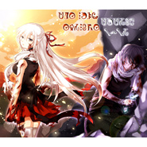

The Salutation Episode V-VI梦与妖精与晨昏之歌 V《Discord》VI《Engulf》
============================

|  |  |
| :--: | :-- |
| [ The Salutation Episode V-VI梦与妖精与晨昏之歌 V《Discord》VI《Engulf》](https://emumo.xiami.com/album/2102674677) | **艺人**: [Dia Schisma](../index.md) **语种**: 国语 **唱片公司**: 独立发行 **发行时间**: 2017年01月01日 **专辑类别**: 录音室专辑 **专辑风格**: 民族融合新世纪 Ethnic Fusion New Age, 异域 Exotica, 氛围浩室舞曲 Ambient House **播放数**: 122613 **收藏数**: 20 **评论数**: 15  |

## 简介

IIIIIIIIIIIIIIIIIIIIIIIIIIIIIIIIIIIIIIIIIIIIIIIIIIIIIIIIII 虾米音乐人·独家首发 IIIIIIIIIIIIIIIIIIIIIIIIIIIIIIIIIIIIIIIIIIIIIIIIIIIIIIIIII   
——【我歌唱的是无形式的民族融合，我讴歌的是不存在的神话。
 

我是讲述者，也是记录者。我是表演者，也是祈祷者。】——
 

 
 

《The Salutation~梦与晨昏与妖精之梦》，是一部架空题材的视听小说。
 

该专辑是整个音乐故事的第三张CD。
 

  

 

专辑简介  

 

  

 

角色简介  

 

  

 

故事简介  

 

  

 

CD的分集  

 

  

 

作者简介
 

 
 

 

## 曲目

## 评论

|  |  |  |  |
| :-- | :-- | :-- | :-- |
|  [虾米用户](https://emumo.xiami.com/u/50695614)   2017-01-02 09:27 赞(1) 踩(0) | 
能为你做的不多。
 |
| ⇒ |  [虾米用户](https://emumo.xiami.com/u/10849674) 不知道虾米的公告系统现在... 2017-01-02 16:38 赞(0) 踩(0) | 
这一勺致死量是我一点微小的工作（
 |
| ⇒ |  [虾米用户](https://emumo.xiami.com/u/50695614)   2017-01-09 09:51 赞(0) 踩(0) | 
<q><b>Dia Schisma说：</b></q>
 |
| ⇒ |  [虾米用户](https://emumo.xiami.com/u/10849674) 不知道虾米的公告系统现在... 2017-01-09 11:59 赞(0) 踩(0) | 
<q><b>战弟之王说：</b></q>
 |
|  [虾米用户](https://emumo.xiami.com/u/1292846) (#‵′) 2017-01-02 03:47 赞(1) 踩(0) | 
新年发专辑的好团！
 |
| ⇒ |  [虾米用户](https://emumo.xiami.com/u/10849674) 不知道虾米的公告系统现在... 2017-01-02 16:39 赞(0) 踩(0) | 
www今年过节不收礼
 |
|  [虾米用户](https://emumo.xiami.com/u/9014716) 未来再见！ 2017-01-01 20:17 赞(1) 踩(0) | 
突然兴奋(o◕∀◕)ﾉ
 |
| ⇒ |  [虾米用户](https://emumo.xiami.com/u/10849674) 不知道虾米的公告系统现在... 2017-01-01 23:25 赞(0) 踩(0) | 
我吼兴奋吖！
 |
|  [虾米用户](https://emumo.xiami.com/u/10849674) 不知道虾米的公告系统现在... 2017-01-01 18:07 赞(1) 踩(0) | 
新砖迎新年
 |
|  [虾米用户](https://emumo.xiami.com/u/51862222)   2017-01-01 17:19 赞(1) 踩(0) | 
突然兴奋
 |
| ⇒ |  [虾米用户](https://emumo.xiami.com/u/10849674) 不知道虾米的公告系统现在... 2017-01-01 17:22 赞(0) 踩(0) | 
噫=v=
 |
|  [虾米用户](https://emumo.xiami.com/u/10189190) 虾米行为最优秀的回路厨 2017-01-01 17:11 赞(1) 踩(0) | 
封面好漂亮
 |
| ⇒ |  [虾米用户](https://emumo.xiami.com/u/10849674) 不知道虾米的公告系统现在... 2017-01-01 17:20 赞(0) 踩(0) | 
(づ｡◕‿‿◕｡)づ 画画的小姐姐最棒啦！
 |
|  [虾米用户](https://emumo.xiami.com/u/32558701) 再见虾米 2017-01-01 15:43 赞(1) 踩(0) | 
沙发
 |
| ⇒ |  [虾米用户](https://emumo.xiami.com/u/10849674) 不知道虾米的公告系统现在... 2017-01-01 17:02 赞(0) 踩(0) | 
(づ｡◕‿‿◕｡)づ
 |
