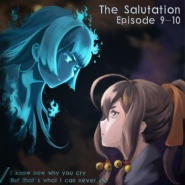

The Salutation Episode IX-X(梦与妖精与晨昏之歌 09-10)
============================

|  |  |
| :--: | :-- |
| [ The Salutation Episode IX-X(梦与妖精与晨昏之歌 09-10)](https://emumo.xiami.com/album/2102870471) | **艺人**: [Dia Schisma](../index.md) **语种**: 国语 **唱片公司**: 独立发行 **发行时间**: 2017年10月12日 **专辑类别**: 录音室专辑 **专辑风格**: 新世纪音乐 New Age, 异域 Exotica, 氛围浩室舞曲 Ambient House **播放数**: 291192 **收藏数**: 16 **评论数**: 8  |

## 简介

 
 

IIIIIIIIIIIIIIIIIIIIIIIIIIIIIIIIIIIIIIIIIIIIIIIIIIIIIIIIII 虾米音乐人·独家首发 IIIIIIIIIIIIIIIIIIIIIIIIIIIIIIIIIIIIIIIIIIIIIIIIIIIIIIIIII   
——【我歌唱的是无形式的民族融合，我讴歌的是不存在的神话。
 

我是讲述者，也是记录者。我是表演者，也是祈祷者。】——
 

 
 

《The Salutation~梦与晨昏与妖精之梦》，是一部架空题材的视听小说。
 

该专辑是整个音乐故事的第五张CD。
 

  

 

专辑简介  

 

  

 

角色简介  

 

  

 

故事简介  

 

  

 

CD的分集  

 

  

 

作者简介
 

 
 

 

## 曲目

## 评论

|  |  |  |
| :-- | :-- | :-- |
|  [虾米用户](https://emumo.xiami.com/u/1292846) (#‵′) 2017-10-12 23:02 赞(2) 踩(0) | 
出埃及记~（上个月看了一部相关的电影十诫，超级老的片子。。
 |
| ⇒ |  [虾米用户](https://emumo.xiami.com/u/10849674) 不知道虾米的公告系统现在... 2017-10-12 23:08 赞(0) 踩(0) | 
俺们的课堂示范片
 |
| ⇒ |  [虾米用户](https://emumo.xiami.com/u/1292846) (#‵′) 2017-10-14 02:57 赞(0) 踩(0) | 
<q><b>Dia Schisma说：</b></q>
 |
| ⇒ |  [虾米用户](https://emumo.xiami.com/u/10849674) 不知道虾米的公告系统现在... 2017-10-14 11:41 赞(0) 踩(0) | 
<q><b>isuelt//藤原妹紅说：</b></q>
 |
| ⇒ |  [虾米用户](https://emumo.xiami.com/u/1292846) (#‵′) 2017-10-14 21:44 赞(0) 踩(0) | 
<q><b>Dia Schisma说：</b></q>
 |
| ⇒ |  [虾米用户](https://emumo.xiami.com/u/10849674) 不知道虾米的公告系统现在... 2017-10-17 15:32 赞(0) 踩(0) | 
<q><b>isuelt//藤原妹紅说：</b></q>
 |
| ⇒ |  [虾米用户](https://emumo.xiami.com/u/1292846) (#‵′) 2017-10-18 02:16 赞(0) 踩(0) | 
<q><b>Dia Schisma说：</b></q>
 |
| ⇒ |  [虾米用户](https://emumo.xiami.com/u/10849674) 不知道虾米的公告系统现在... 2017-10-19 19:50 赞(0) 踩(0) | 
<q><b>isuelt//藤原妹紅说：</b></q>
 |
|  [虾米用户](https://emumo.xiami.com/u/51862222)   2017-10-12 21:55 赞(1) 踩(0) | 
沙发
 |
