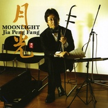

月光MOONLIGHT
============================

|  |  |
| :--: | :-- |
| [ 月光MOONLIGHT](https://emumo.xiami.com/album/1893) | **艺人**: [贾鹏芳](../index.md) **语种**: 纯音乐 **唱片公司**: Pacific MOON **发行时间**: 2006年01月18日 **专辑类别**: 录音室专辑 **专辑风格**: 轻音乐 Easy Listening **播放数**: 1218991 **收藏数**: 1788 **评论数**: 79  |

## 简介

必须承认，这张音乐碟的不断重复也在加深着我的回忆过程。旋律的重复和熟悉的乐器，非常自然的让人想起过去，想起成长的家乡。这种氛围是略微悲愁的，也许并不适合现在这样的气氛，但是，对我，却是对心灵的一次滋润。  
  
01. 冬之河（ふゆのかわ）WINTER RIVER  
  
这张专辑里我最喜欢的曲子并不是主题曲月光，恰恰就是这首“冬之河”，里面的旋律让我有无法抑制的思乡情绪，听了一遍又一遍。  
  
02. 月光（げっこう） MOONLIGHT  
主题曲，我猜想更多的人会喜欢这首吧。  
  
03. 乡（ふるさと） FURUSATO  
故乡是永远的话题，我相信在很大的因素上，这三首曲目的安排就足够打动一大批人了。虽然在后面的曲子里出现一些意外的变化，但是就凭借这三首曲子，应该会让许多人来下决心收藏这张专辑的。  
  
04. タンゴ オブ エイジア TANGO OF ASIA  
这支曲子就不做点评了。  
和月官方网也介绍了，这张专辑的编曲和制作有两位老朋友来完成，美也春树和渡边俊幸，这首曲子是体现亚洲风目的的，很明显不是我喜欢的风格，留给懂行的人来介绍吧。  
  
05. 永远に（とわに） FOREVER  
  
06. 舞曲（まいきょく） MAI KYOKU  
不做点评。  
我想，如果第四首还不足让你大吃一惊的话，第六首大概可以办到。  
  
07. 天地苍々（てんちそうそう） WHAT A BEAUTIFUL WORLD  
从这张专辑的推出目的来看，无疑是在向音效和制作的水准作更多的要求，原来看到这个封面的时候就有这样的疑惑。非常可惜，我没有高档的器材来求证这个疑问。其实很多唱片都有这样的现象，在发行多年后发现它的音效性超越音乐性本身，这张月光会不会也这样？先预埋这个问题吧。  
  
08. さざ波 RIPPLES  
09. 桜（さくら） CHERRY BLOSSOMS  
10. ジャムスの夏 SUMMER OF JIAMUSI 

## 曲目

- [冬之河(ふゆのかわ)Winter River](./1893/9pJ656c2.md)
- [月光(げっこう)Moonlight](./1893/9pK95147.md)
- [乡(ふるさと)Furusato](./1893/ZqFcf608.md)
- [タンゴ オブ エイジアTango Of Asia](./1893/9pM5316d.md)
- [永远に(とわに)Forever](./1893/ZqH990d1.md)
- [舞曲(まいきょく)Mai Kyoku](./1893/bzrCe365e.md)
- [天地苍々(てんちそうそう)What A Beautiful World](./1893/d5wj3d9ac.md)
- [さざ波Ripples](./1893/9pQ71782.md)
- [桜(さくら)Cherry Blossoms](./1893/dVxf468af.md)
- [ジャムスの夏Summer Of Jiamusi / 佳木斯之夏](./1893/dVxg471ab.md)

## 评论

|  |  |  |  |
| :-- | :-- | :-- | :-- |
|  [虾米用户](https://emumo.xiami.com/u/259065943)  2019-09-08 20:39 赞(0) 踩(0) | 
唯美
 |
|  [虾米用户](https://emumo.xiami.com/u/18940951) 上个月说的话这个月看了就... 2018-12-02 16:49 赞(0) 踩(0) | 
又下架了......
 |
|  [虾米用户](https://emumo.xiami.com/u/357176765) 这家伙很聪明什么也没留下... 2018-05-17 14:59 赞(0) 踩(0) | 
贾与许可，到底是谁开现代二胡演奏法之先河？
 |
|  [虾米用户](https://emumo.xiami.com/u/9932907)  2017-10-30 10:17 赞(0) 踩(0) | 
最近发现听贾鹏芳老师的作品很容易找到inner peace，有空时候听一下吧@大弓张
 |
|  [虾米用户](https://emumo.xiami.com/u/7589168)  2017-10-28 00:17 赞(0) 踩(0) | 
中西合璧自然不差，可是总感觉少了点东西在里头。西洋乐众星捧月一般烘托出来的胡琴。是否还是真正的民族乐？
 |
|  [虾米用户](https://emumo.xiami.com/u/5966198) love you to ... 2017-10-27 23:20 赞(0) 踩(0) | 
正需要一次洗礼 洗去尘杂 二胡果然还是最能治愈我的大爱
 |
|  [虾米用户](https://emumo.xiami.com/u/9599912)  2017-10-27 23:10 赞(0) 踩(0) | 
必须承认，这张音乐碟的不断重复也在加深着我的回忆过程。旋律的重复和熟悉的乐器，非常自然的让人想起过去，想起成长的家乡。这种氛围是略微悲愁的，也许并不适合现在这样的气氛，但是，对我，却是对心灵的一次滋润。
 |
|  [虾米用户](https://emumo.xiami.com/u/261961106) 流萤断续光，一明一灭一尺... 2017-06-24 10:11 赞(0) 踩(0) | 
❤️
 |
|  [虾米用户](https://emumo.xiami.com/u/52683150)  2017-05-23 23:52 赞(0) 踩(0) | 
无敌啊
 |
|  [虾米用户](https://emumo.xiami.com/u/7297679) 欢迎各位客官光临本小店 ... 2016-12-15 18:30 赞(1) 踩(0) | 
流落异乡的二胡
 |
|  [虾米用户](https://emumo.xiami.com/u/10401695)  2015-12-30 22:36 赞(1) 踩(0) | 
安宁，沉寂，淡淡的悲伤，却又能从中找到慰藉
 |
|  [虾米用户](https://emumo.xiami.com/u/360769)  2015-10-09 09:04 赞(0) 踩(0) | 
醉心
 |
|  [虾米用户](https://emumo.xiami.com/u/6084488)  2015-07-15 00:32 赞(0) 踩(0) | 
如水想流泪
 |
|  [虾米用户](https://emumo.xiami.com/u/18345951)  2015-05-07 19:26 赞(0) 踩(0) | 
一直对二胡有种情感 很喜欢这张专辑
 |
|  [虾米用户](https://emumo.xiami.com/u/35320145) 以音乐为伴，与世无争！ 2015-03-14 23:04 赞(0) 踩(0) | 
好听
 |
|  [虾米用户](https://emumo.xiami.com/u/14057652) hello 2014-09-07 20:20 赞(0) 踩(0) | 
非常好听
 |
|  [虾米用户](https://emumo.xiami.com/u/24670857) 暂无签名~ 2014-08-22 07:12 赞(2) 踩(0) | 
天啊 我中华何时能恢复 古时之光哪！！！ 天地悠悠 人不逢时 可叹苍凉。
 |
|  [虾米用户](https://emumo.xiami.com/u/13106000) 相似度为零 2014-08-07 11:57 赞(0) 踩(0) | 
喜歡
 |
|  [虾米用户](https://emumo.xiami.com/u/12222652) 再也不能好好的收藏了 2014-07-09 09:38 赞(3) 踩(0) | 
二胡拉出了樱花的国风之殇，实在难得听到这样的曲子
 |
|  [虾米用户](https://emumo.xiami.com/u/6215586)  2014-06-27 16:25 赞(0) 踩(0) | 
喜欢
 |
|  [虾米用户](https://emumo.xiami.com/u/16200948) 心如止水 2014-06-18 21:26 赞(0) 踩(0) | 
虽然我很少评论，但，留个名字。。。我喜欢纯音乐
 |
|  [虾米用户](https://emumo.xiami.com/u/5501161)  2014-05-31 16:33 赞(1) 踩(0) | 
听见恨晚
 |
|  [虾米用户](https://emumo.xiami.com/u/11157355) 榕树长青 2014-05-23 14:01 赞(0) 踩(0) | 
心比刀快
 |
|  [虾米用户](https://emumo.xiami.com/u/6984162) 还不如爱自己 2014-02-11 05:01 赞(1) 踩(0) | 
整张大部分旋律口水得让人捉急，反复听的意义不大，反倒最后三首气氛渲染得好，配上川端康成的雪国，成了我一息难以抹去的念想。
 |
|  [虾米用户](https://emumo.xiami.com/u/31028791) 网易和q也是神圣剑帝 2014-01-10 20:09 赞(1) 踩(0) | 
太好听了!:-[听见恨晚啊
 |
| ⇒ |  [虾米用户](https://emumo.xiami.com/u/5501161)  2014-05-31 16:32 赞(0) 踩(0) | 
听见恨晚+1
 |
|  [虾米用户](https://emumo.xiami.com/u/11969859) 别逃跑 2013-12-08 18:26 赞(0) 踩(0) | 
好忧桑。
 |
|  [虾米用户](https://emumo.xiami.com/u/8797801)  2013-11-23 04:16 赞(0) 踩(0) | 
神作
 |
|  [虾米用户](https://emumo.xiami.com/u/6605625) 暂无签名~ 2013-11-17 19:27 赞(0) 踩(0) | 
~欢乐5周年
 |
|  [虾米用户](https://emumo.xiami.com/u/13783299)  2013-10-24 17:56 赞(0) 踩(0) | 
圣迭戈的回忆
 |
|  [虾米用户](https://emumo.xiami.com/u/15939861) yk-yt 2013-10-11 21:54 赞(0) 踩(0) | 
二胡与西方乐器的极好配合
 |
|  [虾米用户](https://emumo.xiami.com/u/2065910)  2013-09-20 19:20 赞(0) 踩(0) | 
浪漫
 |
|  [虾米用户](https://emumo.xiami.com/u/19326964) 暂无签名~ 2013-08-14 22:26 赞(0) 踩(0) | 
amazing
 |
|  [虾米用户](https://emumo.xiami.com/u/11633546) ♡Winmetawin♡ 2013-08-01 22:05 赞(0) 踩(0) | 
挑动心弦，令人回味
 |
|  [虾米用户](https://emumo.xiami.com/u/11633546) ♡Winmetawin♡ 2013-08-01 20:02 赞(0) 踩(0) | 
挑动心弦，令人回味
 |
|  [虾米用户](https://emumo.xiami.com/u/2043189)  2013-05-15 04:49 赞(1) 踩(0) | 
越是简单的旋律音乐越不会出错，因为挑不出任何错误，所以好听，听了一遍又一遍……
 |
|  [虾米用户](https://emumo.xiami.com/u/12098497) 喵~喵嗷... 2013-05-01 09:00 赞(0) 踩(0) | 
非常完美的一张碟=W=~
 |
|  [虾米用户](https://emumo.xiami.com/u/606760) 魂牵一线 2013-04-18 07:07 赞(31) 踩(0) | 
什么流行音乐 在这个面前就是渣。。。中国本土出来的音乐人能让我记住的也就这么廖廖几个了。。。浮躁的国家 恨其不争啊
 |
|  [虾米用户](https://emumo.xiami.com/u/8069430)  2012-09-16 22:36 赞(0) 踩(0) | 
这二胡感人啊
 |
|  [虾米用户](https://emumo.xiami.com/u/8069430)  2012-09-16 22:36 赞(0) 踩(0) | 
这二胡感人啊
 |
|  [虾米用户](https://emumo.xiami.com/u/8069430)  2012-09-16 22:16 赞(0) 踩(0) | 
二胡的声音好美  被感动了
 |
|  [虾米用户](https://emumo.xiami.com/u/8069430)  2012-09-16 22:14 赞(0) 踩(0) | 
-
 |
|  [虾米用户](https://emumo.xiami.com/u/10641539)  2012-09-16 21:16 赞(0) 踩(0) | 
二胡美得让人想哭。。。
 |
|  [虾米用户](https://emumo.xiami.com/u/7846757)  2012-09-07 15:29 赞(0) 踩(0) | 
有味道
 |
|  [虾米用户](https://emumo.xiami.com/u/10529342)  2012-09-07 14:21 赞(0) 踩(0) | 
我的最愛!
 |
|  [虾米用户](https://emumo.xiami.com/u/9346718)  2012-09-04 12:18 赞(0) 踩(0) | 
纯音乐
 |
|  [虾米用户](https://emumo.xiami.com/u/3363959)  2012-08-15 13:31 赞(0) 踩(0) | 
绵长温柔的二胡 听得人心都融化了
 |
|  [虾米用户](https://emumo.xiami.com/u/3363959)  2012-08-15 11:27 赞(0) 踩(0) | 
03 乡（ふるさと）听得我心都快化了。。。。
 |
|  [虾米用户](https://emumo.xiami.com/u/9347359)  2012-06-12 13:55 赞(0) 踩(0) | 
很有电影画面感 喜欢
 |
|  [虾米用户](https://emumo.xiami.com/u/9354355)  2012-06-02 00:29 赞(0) 踩(0) | 
哇
 |
|  [虾米用户](https://emumo.xiami.com/u/919960) 再見了 蝦米 2012-04-24 14:31 赞(0) 踩(0) | 
喜欢跟月亮有关的作品
 |
|  [虾米用户](https://emumo.xiami.com/u/843363) 梵我两忘 2012-03-23 14:19 赞(0) 踩(0) | 
下雪时候听
 |
|  [虾米用户](https://emumo.xiami.com/u/3203857)  2012-03-04 17:58 赞(0) 踩(0) | 
11111
 |
|  [虾米用户](https://emumo.xiami.com/u/3179301)  2012-03-04 09:31 赞(0) 踩(0) | 
贾鹏芳的二胡很动情.
 |
|  [虾米用户](https://emumo.xiami.com/u/6417802) 暂无签名~ 2012-02-23 13:23 赞(1) 踩(0) | 
胡弓的究极魅力……音乐是没有国别的
 |
|  [虾米用户](https://emumo.xiami.com/u/6417802) 暂无签名~ 2012-02-23 13:23 赞(0) 踩(0) | 
胡弓的究极魅力……音乐是没有国别的
 |
|  [虾米用户](https://emumo.xiami.com/u/852305) 我还没想好要写什么... 2012-02-04 00:29 赞(0) 踩(0) | 
亚洲tango好！哈哈
 |
|  [虾米用户](https://emumo.xiami.com/u/5479014)  2012-02-01 03:53 赞(1) 踩(0) | 
Jazz 二胡，管弦乐 二胡，中国二胡演奏家贾鹏芳与日本音乐家的碰撞，中国传统乐器与世界音乐的融合，带来洗涤心灵、令人忘却尘嚣的美妙体验。大开眼界！
 |
|  [虾米用户](https://emumo.xiami.com/u/2069500)  2012-01-29 00:06 赞(0) 踩(0) | 
接触和平之月的第一张，我忘记了是什么时候。
 |
|  [虾米用户](https://emumo.xiami.com/u/7148307)  2011-12-08 02:53 赞(0) 踩(0) | 
新派二胡，传统与现代的结合。
 |
|  [虾米用户](https://emumo.xiami.com/u/6149697)  2011-12-01 23:15 赞(0) 踩(0) | 
爱
 |
|  [虾米用户](https://emumo.xiami.com/u/6211714)  2011-12-01 17:53 赞(0) 踩(0) | 
清水出芙蓉，天然去雕饰！
 |
|  [虾米用户](https://emumo.xiami.com/u/7047546)  2011-12-01 14:42 赞(0) 踩(0) | 
把二胡的气质都表现出来了
 |
|  [虾米用户](https://emumo.xiami.com/u/6457392)  2011-10-27 11:43 赞(0) 踩(0) | 
对心灵的一次滋润
 |
|  [虾米用户](https://emumo.xiami.com/u/6381578)  2011-10-25 13:18 赞(0) 踩(0) | 
主题曲好听愁思
 |
|  [虾米用户](https://emumo.xiami.com/u/2508629)  2011-10-24 15:41 赞(0) 踩(0) | 
凄美啊~~~叫人落泪啊~~~我想学二胡啊~~~~
 |
|  [虾米用户](https://emumo.xiami.com/u/6136520)  2011-10-15 20:09 赞(0) 踩(0) | 
xihuan
 |
|  [虾米用户](https://emumo.xiami.com/u/3593575)  2011-08-02 04:54 赞(0) 踩(0) | 
贾鹏芳
 |
|  [虾米用户](https://emumo.xiami.com/u/1491749) 暂无签名~ 2011-07-19 19:33 赞(0) 踩(0) | 
很棒
 |
|  [虾米用户](https://emumo.xiami.com/u/2432380)  2011-07-02 18:00 赞(0) 踩(0) | 
二胡
 |
|  [虾米用户](https://emumo.xiami.com/u/3419979)  2011-06-09 10:28 赞(0) 踩(0) | 
一抹阳光伴随着清和的音符，开启崭新的一天。宁静致远……
 |
|  [虾米用户](https://emumo.xiami.com/u/3210914)  2011-05-24 10:47 赞(0) 踩(0) | 
贾鹏芳
 |
|  [虾米用户](https://emumo.xiami.com/u/1315500)  2011-03-27 20:28 赞(0) 踩(0) | 
******
 |
|  [虾米用户](https://emumo.xiami.com/u/3274063)  2011-03-20 21:27 赞(0) 踩(0) | 
这张专辑的录音跟编曲太划时代了！整张专辑风格浑然大气，其水准堪与7年前初听《二胡》的惊艳度媲美！值得推荐！！
 |
|  [虾米用户](https://emumo.xiami.com/u/3274063)  2011-03-20 21:14 赞(0) 踩(0) | 
这张专辑的录音跟编曲太划时代了！整张专辑风格浑然大气，其水准堪与7年前初听《二胡》的惊艳度媲美！值得推荐！！
 |
|  [虾米用户](https://emumo.xiami.com/u/2811663)  2011-02-12 09:50 赞(0) 踩(0) | 
和平之月
 |
|  [虾米用户](https://emumo.xiami.com/u/1342581)  2011-01-31 17:26 赞(0) 踩(0) | 
贾鹏芳
 |
|  [虾米用户](https://emumo.xiami.com/u/1642030)  2010-10-31 19:29 赞(0) 踩(0) | 
贾鹏芳，1958年4月生，二胡演奏家。中国音乐家协会、日本东洋音乐学会会员。自幼受其兄影响，8岁开始学习二胡。1978年进入中央民族乐团。1979年开始任该团二胡独奏演员，1984年开始该团民族管弦乐队副首席。1980年起，先后为北京人民广播电台，中央人民广播电台，中国国际广播电台等录制了多首二胡独奏曲。1988年中央人民广播电台音乐节目《神州乐坛》专题介绍了他演奏的二胡，高胡，板胡，京胡独奏曲。中国国际广播电台用英语，日语等多种语言向各国介绍了他所演奏的乐曲。
 |
|  [虾米用户](https://emumo.xiami.com/u/220587)  2010-10-24 13:22 赞(0) 踩(0) | 
9
 |
