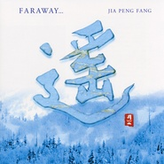

遥FARAWAY...
============================

|  |  |
| :--: | :-- |
| [ 遥FARAWAY...](https://emumo.xiami.com/album/1901) | **艺人**: [贾鹏芳](../index.md) **语种**: 其他 **唱片公司**: Pacific MOON **发行时间**: 2002年10月01日 **专辑类别**: 录音室专辑 **专辑风格**: 轻音乐 Easy Listening **播放数**: 6110124 **收藏数**: 3693 **评论数**: 218  |

## 简介

“二泉映月”、“河南小曲”、“怀乡曲”都是改编自同名中国传统曲目，其他曲子的作曲与所有曲子的编曲、专辑制作依然是由京田诚一担任。  
  
好像最近两三年来，像new age，疗程这类的音乐已逐步建立了属于它们自己的流派。现在，在音像店里，它们的地位也变得不容忽视。或许这正意味着，如今在这个世界上，生活变得越来越枯燥和艰难了。  
  
这张专辑有许多新奇独到的地方。当你让二胡的旋律自由的回荡在你的耳旁时，你会发现这旋律是多么的融洽，和谐，仿佛要带你去另外一个世界。在韵律方面，你可以听到无任何修饰的传统二胡曲，也可以享受新曲节奏和谐的往复。总之，二胡表现的内容是多种多样的。  
  
贾鹏芳先生将那些绝妙的音符和快乐感受，都倾注在了这张CD当中……我本人和贾鹏芳已相识多年。我想是十一年前，他参与录制我的《服部克久音乐精选》第六首曲子时，我们初次碰面。贾先生的日语说得不多，但我对他的音乐可是一见钟情——或许应该叫“一听钟情”吧。那时候就创作了一首“风之摇篮曲”——在我的音乐会上总是很重要的一个演出曲目。在此之后，我和贾先生也在世界各地——包括中国——举办了不计其数的音乐会。无论走到哪里，我们都得到了最高的评价。贾先生的二胡曲清晰，富有颤音，他以高超的二胡技艺和广受青睐的作曲风格而闻名。如今，当整个世界的目光都聚焦在了亚洲音乐上时，我相信贾先生的这张专辑，一定能驰骋在世界音乐的舞台上。  
  
“二泉映月”、“河南小曲”、“怀乡曲”都是改编自同名中国传统曲目，其他曲子的作曲与所有曲子的编曲、专辑制作依然是由京田诚一担任。  
 

## 曲目

- [萤Firefly / ほたる](./1901/9re6f761.md)
- [天狼星Sirius](./1901/d5xz42bcb.md)
- [睡莲MVA Water Lily / すいれん](./1901/Zsa9abc7.md)
- [东京归来Back To Tokyo](./1901/9rh795b0.md)
- [二泉映月にせんえいげつ](./1901/Zsce067c.md)
- [山雪Snow Line](./1901/bzsXf282c.md)
- [柳岛之风The Wind Of Liudao / リウダオのかぜ](./1901/9rk644a5.md)
- [河南小曲A Ditty From Henan / かなんしょうきょく](./1901/9rl74e42.md)
- [怀乡曲Nostalgia / かいきょうきょく](./1901/dfwC3b386.md)
- [清秋Pure](./1901/bztbe2e34.md)
- [我的家Our Home](./1901/dfwE390ab.md)

## 评论

|  |  |  |  |
| :-- | :-- | :-- | :-- |
|  [虾米用户](https://emumo.xiami.com/u/429750774) 我还没想好要写什么... 2019-10-06 18:43 赞(1) 踩(0) | 
从小听的音乐  小时候每天晚上的催眠曲
 |
|  [虾米用户](https://emumo.xiami.com/u/27911770)  2019-01-10 07:38 赞(0) 踩(0) | 
也许只有在国外现在才能潜心琢磨中国民乐了，现在本土浮躁
 |
|  [虾米用户](https://emumo.xiami.com/u/302830785)  2018-05-02 17:07 赞(1) 踩(0) | 
******
 |
|  [虾米用户](https://emumo.xiami.com/u/357176765) 这家伙很聪明什么也没留下... 2018-04-18 00:45 赞(0) 踩(0) | 
贾鹏芳几盘专辑能够取得比较轰动的效果，琴技并非最主要的因素（国内技术与贾相当或超过贾的大有人在）。贾突出的方面：一是对音乐及对二胡意境有着深刻透彻地理解和把握；二是对于二胡演奏形式的大规模创新与尝试（比如对二胡音色的改进及使用钢琴、吉他伴奏或协奏等）。另外，日本人的作曲及编曲理念也起到重要作用。
 |
|  [虾米用户](https://emumo.xiami.com/u/270487119)  2018-01-13 17:02 赞(0) 踩(0) | 
喜欢
 |
|  [虾米用户](https://emumo.xiami.com/u/23958395)  2018-01-10 15:48 赞(1) 踩(0) | 
啊啊啊啊啊啊，真是受不了！我收藏的是这本专辑里的《睡莲》版权没了就没了，怎么给我乱匹配成《朋友》专辑里的《睡莲》！！！我不喜欢那个版本！现在的虾米播放变得一塌糊涂了吗！！！！
 |
|  [虾米用户](https://emumo.xiami.com/u/5765082) 来自第九区 2017-10-28 00:10 赞(4) 踩(0) | 
音乐是给人听的，不是某些音乐家们用来固步自封的，所以，创新是必须而且大胆的。这张真心好听，不做作，不妥协，不失深度，而且耐听。
 |
|  [虾米用户](https://emumo.xiami.com/u/1775601)  2017-10-27 23:42 赞(1) 踩(0) | 
简直颠覆了我对二泉映月的印象....被打动了...
 |
|  [虾米用户](https://emumo.xiami.com/u/3828276) 生命中的一切问题，时间都... 2017-10-27 23:15 赞(0) 踩(0) | 
当岁月翩跹得像一只蝴蝶，我看见她倏地就曝露在阳光下的脸。苍白得近乎透明，却隐隐地浮现远山般青黛的剪影。在一片圣洁的光泽下，无处可藏的渺小的尘埃就慌乱地漂浮，一根一根清晰地矗立，尽管只是一粒尘土，却肃穆...
 |
|  [虾米用户](https://emumo.xiami.com/u/261038101) 慢。慢。慢 2017-04-20 11:14 赞(0) 踩(0) | 
睡莲。。。一股莫名伤感
 |
|  [虾米用户](https://emumo.xiami.com/u/53709041)  2017-04-17 16:49 赞(0) 踩(0) | 
纯音乐
 |
|  [虾米用户](https://emumo.xiami.com/u/1187054) 你我此一生若只一瞬，纵然... 2016-12-27 22:01 赞(0) 踩(0) | 
天下第一
 |
|  [虾米用户](https://emumo.xiami.com/u/106258374) 我还没想好要写什么... 2016-07-13 21:59 赞(3) 踩(0) | 
用睡莲做闹钟的铃声，结果越睡月香 
 |
|  [虾米用户](https://emumo.xiami.com/u/32020530)  2016-05-11 17:22 赞(0) 踩(0) | 
二胡。贾鹏芳
 |
|  [虾米用户](https://emumo.xiami.com/u/6210556)  2016-04-23 20:36 赞(0) 踩(0) | 
贾鹏芳老师的专辑，5星力荐，还需要什么理由？
 |
|  [虾米用户](https://emumo.xiami.com/u/5631805)  2016-03-05 00:07 赞(0) 踩(0) | 
好听
 |
|  [虾米用户](https://emumo.xiami.com/u/11548066)  2016-02-08 17:05 赞(2) 踩(0) | 
《睡莲》一曲，闭目凝听，曲始于清晨薄雾飘渺中，池中绿叶伸展，一朵红嫣，含苞欲放，水镜无波，潜鱼悬停。反复出现的“米叨米”如同宇宙的精灵，随音调上下飞舞，贯穿始终，柔弦不娇，滑弦不腻。一起一伏合唱的竹笛和扬琴如大地众生，补点二胡的间隙，煞是世间万物和谐之妙。
 |
| ⇒ |  [虾米用户](https://emumo.xiami.com/u/259505807)   2017-05-30 08:39 赞(0) 踩(0) | 
貌似是 mi la mi  
 |
|  [虾米用户](https://emumo.xiami.com/u/62429158)  2016-01-18 22:48 赞(0) 踩(0) | 
喜欢
 |
|  [虾米用户](https://emumo.xiami.com/u/52111807) 我有几个世界 2016-01-12 15:48 赞(1) 踩(0) | 
为什么听《睡莲》时，突然很悲伤，可实在想不起伤心的事情。
 |
|  [虾米用户](https://emumo.xiami.com/u/51631029)   2015-12-08 22:54 赞(0) 踩(0) | 
，
 |
|  [虾米用户](https://emumo.xiami.com/u/81940168)  2015-11-11 14:37 赞(0) 踩(0) | 
遥
 |
|  [虾米用户](https://emumo.xiami.com/u/32362730) 5はいいぞ~~ 2015-11-01 22:10 赞(0) 踩(0) | 
(⁎⁍̴̛ᴗ⁍̴̛⁎)
 |
|  [虾米用户](https://emumo.xiami.com/u/15484671)  2015-10-13 22:01 赞(0) 踩(0) | 
喜欢
 |
|  [虾米用户](https://emumo.xiami.com/u/10200698) NOW OR NEVER 2015-09-21 14:09 赞(0) 踩(0) | 
无意中发现此专里我最喜欢的《睡莲》《柳岛之风》原来是贾鹏芳自己做的曲，三年来我一直以为里面的新曲全都出自京田诚一之手o(╯□╰)o 两人何时能再合作一张像这样的神专……
 |
| ⇒ |  [虾米用户](https://emumo.xiami.com/u/4241117) 心外无物 2015-10-22 10:26 赞(0) 踩(0) | 
好多专辑都有贾鹏芳的作品 呵呵
 |
| ⇒ |  [虾米用户](https://emumo.xiami.com/u/10200698) NOW OR NEVER 2015-10-22 10:29 赞(0) 踩(0) | 
<q><b>遠山清说：</b></q>
 |
|  [虾米用户](https://emumo.xiami.com/u/9475262)   2015-09-16 22:00 赞(0) 踩(0) | 
贾鹏芳最喜欢的专辑，首首经典。
 |
|  [虾米用户](https://emumo.xiami.com/u/13006763) - 2015-09-09 20:04 赞(3) 踩(0) | 
二胡能去掉风尘味真是太好了
 |
|  [虾米用户](https://emumo.xiami.com/u/8832263)  2015-09-03 01:27 赞(0) 踩(0) | 
和平之月
 |
|  [虾米用户](https://emumo.xiami.com/u/4241117) 心外无物 2015-08-22 10:05 赞(0) 踩(0) | 
贾鹏芳 最棒的一张专辑 曲曲敲击你的心扉
 |
|  [虾米用户](https://emumo.xiami.com/u/35769552) 音乐是世界共通的语言 2015-08-17 21:52 赞(1) 踩(0) | 
听着听着人就安静了下来，仿佛尘世间的一切功名利禄，嘈杂纷纷，皆已飘然远去，剩下的只是对人生意义的思考，和对永恒的追寻。
 |
|  [虾米用户](https://emumo.xiami.com/u/46235090)  2015-08-12 18:51 赞(0) 踩(0) | 
遥远是音乐缩短了心灵的距离！！！！
 |
|  [虾米用户](https://emumo.xiami.com/u/32031632)  2015-07-25 20:07 赞(0) 踩(0) | 
好曲目，赞！
 |
|  [虾米用户](https://emumo.xiami.com/u/1485542) 情深多有误 2015-06-11 12:51 赞(0) 踩(0) | 
二胡从小听到大，浸入骨子里了。
 |
|  [虾米用户](https://emumo.xiami.com/u/3987161)  2015-05-09 22:20 赞(0) 踩(0) | 
贾鹏芳,和平之月,二胡,遥,
 |
|  [虾米用户](https://emumo.xiami.com/u/3987161)  2015-05-09 22:20 赞(1) 踩(0) | 
贾鹏芳,和平之月,二胡,遥,
 |
|  [虾米用户](https://emumo.xiami.com/u/47572531) 生活就像一首首歌，总能找... 2015-05-05 11:00 赞(0) 踩(0) | 
睡莲！！
 |
|  [虾米用户](https://emumo.xiami.com/u/49433593)   2015-04-21 11:45 赞(0) 踩(0) | 
美
 |
|  [虾米用户](https://emumo.xiami.com/u/77135) 每个人心里一亩田 2015-04-10 23:39 赞(0) 踩(0) | 
这张专辑真是没少听，竟然没在虾米里收藏
 |
|  [虾米用户](https://emumo.xiami.com/u/47061210)  2015-03-11 23:19 赞(3) 踩(0) | 
怀乡曲最棒!
 |
|  [虾米用户](https://emumo.xiami.com/u/4241117) 心外无物 2015-02-15 09:48 赞(0) 踩(0) | 
二泉映月改编的真的让人感动 用吉他配真是很赞。
 |
|  [虾米用户](https://emumo.xiami.com/u/39984468)  2015-02-07 22:06 赞(0) 踩(0) | 
超好听
 |
|  [虾米用户](https://emumo.xiami.com/u/15839554) 很高興與您相遇 什麼蝦米 2015-02-01 23:13 赞(0) 踩(0) | 
二泉映月的如泣如訴~
 |
|  [虾米用户](https://emumo.xiami.com/u/46676440)  2015-01-29 20:08 赞(0) 踩(0) | 
空灵
 |
|  [虾米用户](https://emumo.xiami.com/u/6227075)  2015-01-16 20:48 赞(0) 踩(0) | 
很诗情。
 |
|  [虾米用户](https://emumo.xiami.com/u/11762940) 欧~香榭丽舍~ 2015-01-16 09:04 赞(1) 踩(0) | 
为什么喜欢么。。就是让我对小时候学的乐器有了一种新的领悟，不是被动的学习，而是主动的倾听。
 |
|  [虾米用户](https://emumo.xiami.com/u/645218) 任性逍遥于有欲无欲之间 2015-01-15 23:56 赞(0) 踩(0) | 
喜欢这个调调
 |
|  [虾米用户](https://emumo.xiami.com/u/45759342) 唯音乐与爱情不可辜负！ 2015-01-14 14:03 赞(0) 踩(0) | 
贾鹏芳,纯音乐,
 |
|  [虾米用户](https://emumo.xiami.com/u/11962785)  2014-12-31 12:13 赞(0) 踩(0) | 
如泣如诉的民乐，融入现代配乐，舒缓心境
 |
|  [虾米用户](https://emumo.xiami.com/u/44037973)  2014-11-23 22:21 赞(0) 踩(0) | 
最爱《山雪》和《怀乡曲》
 |
|  [虾米用户](https://emumo.xiami.com/u/43607123)  2014-11-20 12:50 赞(4) 踩(0) | 
最爱东京归来 当故乡变成他乡 而他乡依旧是他乡 整张专辑曲子都不错 午休和夜晚睡前必备
 |
|  [虾米用户](https://emumo.xiami.com/u/11033156)  2014-10-29 16:03 赞(0) 踩(0) | 
触动心灵的音乐
 |
|  [虾米用户](https://emumo.xiami.com/u/42331059)  2014-10-21 19:21 赞(0) 踩(0) | 
天狼星。。。。。。
 |
|  [虾米用户](https://emumo.xiami.com/u/10270975) 好好学习天天向上 2014-10-18 17:27 赞(0) 踩(0) | 
喜欢
 |
|  [虾米用户](https://emumo.xiami.com/u/4491164) 多远 .... 2014-09-13 23:25 赞(0) 踩(0) | 
各种凋叶棕即视感还有拼音和英文的别名 莫名喜感
 |
|  [虾米用户](https://emumo.xiami.com/u/13123109)  2014-08-18 20:50 赞(0) 踩(0) | 
民曲
 |
|  [虾米用户](https://emumo.xiami.com/u/39860745) 暂无签名~ 2014-08-10 22:01 赞(0) 踩(0) | 
一耳朵的喜欢。宁静致远
 |
|  [虾米用户](https://emumo.xiami.com/u/16220728) 墨子声声 2014-08-08 20:32 赞(0) 踩(0) | 
心灵之音，遥想之乐，百听百感。
 |
|  [虾米用户](https://emumo.xiami.com/u/5500861)  2014-08-06 18:17 赞(0) 踩(0) | 
感觉这套音乐挺有灵性的~ 喜欢~~
 |
|  [虾米用户](https://emumo.xiami.com/u/2961623) 如欲相见 我在各种悲喜交... 2014-08-01 23:00 赞(0) 踩(0) | 
巨他妈赞
 |
|  [虾米用户](https://emumo.xiami.com/u/6215586)  2014-07-29 16:24 赞(0) 踩(0) | 
喜欢
 |
|  [虾米用户](https://emumo.xiami.com/u/6320375) 希然宁泊 2014-07-22 20:55 赞(0) 踩(0) | 
天狼星 东京归来 二泉映月 河南小曲 都很棒
 |
|  [虾米用户](https://emumo.xiami.com/u/16719116) 潮起潮落，聚散随风 2014-07-05 19:43 赞(0) 踩(0) | 
宁静悠远，宛若聆听岁月回声。
 |
|  [虾米用户](https://emumo.xiami.com/u/17022193)   2014-06-23 19:56 赞(0) 踩(0) | 
喜欢
 |
|  [虾米用户](https://emumo.xiami.com/u/22490403)  2014-06-10 21:34 赞(0) 踩(0) | 
回到乡下的晚上
 |
|  [虾米用户](https://emumo.xiami.com/u/33042329) 鼎阿哥 2014-05-25 11:38 赞(0) 踩(0) | 
古典
 |
|  [虾米用户](https://emumo.xiami.com/u/13079859)  2014-05-10 15:03 赞(0) 踩(0) | 
喜欢
 |
|  [虾米用户](https://emumo.xiami.com/u/36340378) 轻轻的我来了 2014-05-07 21:55 赞(0) 踩(0) | 
和平之月,
 |
|  [虾米用户](https://emumo.xiami.com/u/35527170)  2014-04-23 14:11 赞(0) 踩(0) | 
感受世外桃源的感覺
 |
|  [虾米用户](https://emumo.xiami.com/u/34527451)  2014-03-28 10:33 赞(0) 踩(0) | 
很美
 |
|  [虾米用户](https://emumo.xiami.com/u/526266) 我不能强迫自己天天签到，... 2014-03-14 16:18 赞(0) 踩(0) | 
赞
 |
|  [虾米用户](https://emumo.xiami.com/u/19959818) 我还没想好要写什么... 2014-03-08 17:50 赞(0) 踩(0) | 
听不厌的经典
 |
|  [虾米用户](https://emumo.xiami.com/u/32619688)  2014-02-11 10:59 赞(0) 踩(0) | 
听到《二泉映月》的时候，浑身震颤，收藏之！
 |
|  [虾米用户](https://emumo.xiami.com/u/3046096) 这样····也许··· 2014-02-09 15:59 赞(0) 踩(0) | 
new age
 |
|  [虾米用户](https://emumo.xiami.com/u/30900788)  2014-02-09 07:12 赞(0) 踩(0) | 
喜欢中国风
 |
|  [虾米用户](https://emumo.xiami.com/u/32508083) 祖葆 2014-02-08 16:25 赞(0) 踩(0) | 
古典而清新，质朴而脱俗
 |
|  [虾米用户](https://emumo.xiami.com/u/23377590) 行走中 2014-02-04 19:25 赞(0) 踩(0) | 
好听
 |
|  [虾米用户](https://emumo.xiami.com/u/9599912)  2014-01-28 02:38 赞(0) 踩(0) | 
“二泉映月”、“河南小曲”、“怀乡曲”都是改编自同名中国传统曲目，其他曲子的作曲与所有曲子的编曲、专辑制作依然是由京田诚一担任。
 |
|  [虾米用户](https://emumo.xiami.com/u/220) 微信公众号：最后的梦田 2014-01-26 14:23 赞(0) 踩(0) | 
居然忘了收藏这张，日本和平之乐的二胡
 |
|  [虾米用户](https://emumo.xiami.com/u/31759934) 贱货而重德 2014-01-18 11:22 赞(0) 踩(0) | 
评分挺高的
 |
|  [虾米用户](https://emumo.xiami.com/u/2025804)  2014-01-12 16:13 赞(0) 踩(0) | 
就是喜欢
 |
|  [虾米用户](https://emumo.xiami.com/u/31492491)  2014-01-12 01:14 赞(0) 踩(0) | 
首推怀乡曲！不管自己离故乡有多远但要记得回家的路！
 |
|  [虾米用户](https://emumo.xiami.com/u/7792034)  2014-01-11 14:22 赞(0) 踩(0) | 
民族乐器
 |
|  [虾米用户](https://emumo.xiami.com/u/2373126)  2014-01-10 07:46 赞(0) 踩(0) | 
阅
 |
|  [虾米用户](https://emumo.xiami.com/u/9138832)  2013-12-20 12:25 赞(0) 踩(0) | 
ok
 |
|  [虾米用户](https://emumo.xiami.com/u/29967700)  2013-12-17 18:45 赞(0) 踩(0) | 
喜欢
 |
|  [虾米用户](https://emumo.xiami.com/u/25109310)  2013-12-14 15:28 赞(0) 踩(0) | 
真的好柔好放鬆
 |
|  [虾米用户](https://emumo.xiami.com/u/9476311)  2013-12-05 23:13 赞(0) 踩(0) | 
睡莲专辑（中专毕业）
 |
|  [虾米用户](https://emumo.xiami.com/u/3959391) 我是正宗的 2013-11-26 22:45 赞(0) 踩(0) | 
【小妞推荐】有岁月的味道。明明曾是那么的沉重，却又故作轻淡。只有自己知道，心中那丝无奈的哽咽，才下眉头，却上心头。
 |
|  [虾米用户](https://emumo.xiami.com/u/27670825) 倾听 2013-11-25 20:14 赞(0) 踩(0) | 
好听
 |
|  [虾米用户](https://emumo.xiami.com/u/526266) 我不能强迫自己天天签到，... 2013-11-09 16:22 赞(0) 踩(0) | 
推荐大家请听听看，不会离你的感受偏差太远。
 |
|  [虾米用户](https://emumo.xiami.com/u/526266) 我不能强迫自己天天签到，... 2013-11-09 16:21 赞(1) 踩(0) | 
实在听不惯二胡大悲旋音，倒是贾鹏芳的不错，带一点点思想·所处所景。空洞却富含感情，实在令我难以抗拒啊···
 |
|  [虾米用户](https://emumo.xiami.com/u/20408186) 寻找动听声音 2013-11-05 16:28 赞(0) 踩(0) | 
还没听，
 |
|  [虾米用户](https://emumo.xiami.com/u/1637936)  2013-11-04 20:29 赞(1) 踩(0) | 
月光下如泣如诉的音乐响起，让人心思飘荡。心中的思念如同柔弱的芦苇在摇曳，盼望有个温暖的声音在远方响起，渴望寻找内心真正的归宿。
 |
|  [虾米用户](https://emumo.xiami.com/u/4439325)  2013-11-04 19:23 赞(0) 踩(0) | 
让人更接受的、现代的、思乡的。
 |
|  [虾米用户](https://emumo.xiami.com/u/17633273)  2013-10-31 21:07 赞(0) 踩(0) | 
民乐之魂，中国人千百年的结晶
 |
|  [虾米用户](https://emumo.xiami.com/u/6425556)  2013-10-16 18:26 赞(0) 踩(0) | 
二胡。原来没有哪一首比得上二泉映月的深层
 |
|  [虾米用户](https://emumo.xiami.com/u/16766854)  2013-10-13 07:31 赞(0) 踩(0) | 
安靜又富含感情的音樂
 |
|  [虾米用户](https://emumo.xiami.com/u/4876323) 文章 2013-10-09 01:56 赞(0) 踩(0) | 
喜欢。
 |
|  [虾米用户](https://emumo.xiami.com/u/5588294)  2013-10-02 15:07 赞(0) 踩(0) | 
醉了痴了
 |
|  [虾米用户](https://emumo.xiami.com/u/12314435)  2013-09-26 23:56 赞(0) 踩(0) | 
遥遥
 |
|  [虾米用户](https://emumo.xiami.com/u/9134017)  2013-09-21 10:36 赞(0) 踩(0) | 
好听
 |
|  [虾米用户](https://emumo.xiami.com/u/6929766)  2013-08-30 19:22 赞(1) 踩(0) | 
睡莲。我想应该是在人生路上经过干锤百练才能完成的好曲，悦耳动听，淡淡不经意的打动人心，我十分喜欢它。
 |
|  [虾米用户](https://emumo.xiami.com/u/2458320)  2013-08-22 10:26 赞(0) 踩(0) | 
悠扬的魅力！
 |
|  [虾米用户](https://emumo.xiami.com/u/9732818)  2013-08-15 13:17 赞(0) 踩(0) | 
有很多好的器乐曲
 |
|  [虾米用户](https://emumo.xiami.com/u/6975978) 在律动中发现自己 2013-08-07 13:26 赞(0) 踩(0) | 
之前零散听过贾鹏芳的一些曲子，《遥》是听他的第一张完整专辑。以前很喜欢的《睡莲》就收录其中。《二泉映月》又有不一样的演绎，二胡和吉他的结合，不似最初版本那样悲切。《天狼星》和《怀乡曲》也不错。今晚还同时听了贾鹏芳的另两张专辑《想》和《休日》，但相比之下还是这张《遥》更有感觉。
 |
|  [虾米用户](https://emumo.xiami.com/u/3150432)  2013-08-06 17:28 赞(0) 踩(0) | 
唐文化留给了日本，明文化留给了韩国，近代文化留在了岛上，似乎说起来有些愤愤，可静下心来思考之后，何尝不是如此？一个出生于中国，生长于中国，成名在日本的中国人演奏，日本人编曲，似乎说明了些什么.
 |
|  [虾米用户](https://emumo.xiami.com/u/5633817) 聽聽歌，談談情 2013-06-29 10:51 赞(0) 踩(0) | 
听着很舒服
 |
|  [虾米用户](https://emumo.xiami.com/u/11699681)  2013-06-20 15:06 赞(0) 踩(0) | 
收了
 |
|  [虾米用户](https://emumo.xiami.com/u/2759360) 自由自在，无忧无惧。 2013-06-10 20:39 赞(0) 踩(0) | 
@雁归来mh 拉二胡滴朋友听一下~~
 |
|  [虾米用户](https://emumo.xiami.com/u/6223947) 音乐里寻找宁静。 2013-06-10 12:49 赞(0) 踩(0) | 
有没的音乐
 |
|  [虾米用户](https://emumo.xiami.com/u/7576008) 從無始來，種種顛倒 2013-04-18 23:04 赞(0) 踩(0) | 
贾鹏芳先生 |   遥
 |
|  [虾米用户](https://emumo.xiami.com/u/4876323) 文章 2013-04-08 01:18 赞(0) 踩(0) | 
ok
 |
|  [虾米用户](https://emumo.xiami.com/u/10931217)  2013-04-02 22:40 赞(0) 踩(0) | 
Easy listening
 |
|  [虾米用户](https://emumo.xiami.com/u/13740066) 音乐，每天不可少… 2013-04-02 13:54 赞(1) 踩(0) | 
遥，中西结合的音乐，两种乐器融合在一起，感觉不错
 |
|  [虾米用户](https://emumo.xiami.com/u/478527) 好想跟衣服在洗衣机里滚 2013-03-26 21:33 赞(0) 踩(0) | 
m
 |
|  [虾米用户](https://emumo.xiami.com/u/1239084) 心之所向，微微芬芳。 2013-03-25 22:12 赞(0) 踩(0) | 
柳岛之风 也挺好听的
 |
|  [虾米用户](https://emumo.xiami.com/u/1239084) 心之所向，微微芬芳。 2013-03-25 22:04 赞(0) 踩(0) | 
想买这个CD不知道哪里有卖？？喜欢特别是 睡莲这首歌是在我哥哥的QQ空间里看一篇文章里面用的音乐很喜欢
 |
|  [虾米用户](https://emumo.xiami.com/u/13299122) 道法自然 2013-03-15 18:14 赞(0) 踩(0) | 
轻快
 |
|  [虾米用户](https://emumo.xiami.com/u/2527732) 爱音乐、爱虾米 2013-03-03 22:39 赞(0) 踩(0) | 
I like Jia
 |
|  [虾米用户](https://emumo.xiami.com/u/7961935)  2013-03-01 04:16 赞(0) 踩(0) | 
遥
 |
|  [虾米用户](https://emumo.xiami.com/u/12276943)  2013-02-24 15:22 赞(0) 踩(0) | 
不是姑娘丁香一般的蜡染裙摆锦绣小氅，是他负着背囊跋山涉水穿着的粗布衣裳
 |
|  [虾米用户](https://emumo.xiami.com/u/4412959) fresh steame... 2013-02-14 01:46 赞(0) 踩(0) | 
誰能告訴我,睡蓮的00:55-00:59像哪首曲子來著?
 |
| ⇒ |  [虾米用户](https://emumo.xiami.com/u/358616)  2013-03-26 20:16 赞(0) 踩(0) | 
同，不知找到否？
 |
|  [虾米用户](https://emumo.xiami.com/u/12918971)  2013-02-06 20:42 赞(0) 踩(0) | 
那一份静与闲
 |
|  [虾米用户](https://emumo.xiami.com/u/2600356)  2013-01-10 03:26 赞(0) 踩(0) | 
喜欢吧
 |
|  [虾米用户](https://emumo.xiami.com/u/4990704) 音乐永不停息。 2012-11-17 16:50 赞(0) 踩(0) | 
好好听！！
 |
|  [虾米用户](https://emumo.xiami.com/u/11242558) 我还没想好要写什么... 2012-11-11 18:09 赞(0) 踩(0) | 
很的一张专辑
 |
|  [虾米用户](https://emumo.xiami.com/u/8329421) 时光不及你眉眼 2012-10-24 21:51 赞(0) 踩(0) | 
1
 |
|  [虾米用户](https://emumo.xiami.com/u/10417733) 老猫 2012-10-11 11:53 赞(0) 踩(0) | 
二胡大师，风格更受现代人的欣赏。和古典的二胡来比，更显得轻快，而不是沉重。各有所好。
 |
|  [虾米用户](https://emumo.xiami.com/u/4051682) 一往无前 2012-10-03 10:47 赞(0) 踩(0) | 
悠扬
 |
|  [虾米用户](https://emumo.xiami.com/u/4051682) 一往无前 2012-10-03 10:47 赞(0) 踩(0) | 
悠扬
 |
|  [虾米用户](https://emumo.xiami.com/u/4051682) 一往无前 2012-10-03 10:47 赞(0) 踩(0) | 
悠扬
 |
|  [虾米用户](https://emumo.xiami.com/u/3701501)  2012-09-21 17:22 赞(0) 踩(0) | 
深邃的二胡，孤寂的我
 |
|  [虾米用户](https://emumo.xiami.com/u/5120818) 你是智智智全面发展的三好... 2012-09-20 22:03 赞(0) 踩(0) | 
好听~
 |
|  [虾米用户](https://emumo.xiami.com/u/6216135)  2012-09-17 17:25 赞(0) 踩(0) | 
中西结合
 |
|  [虾米用户](https://emumo.xiami.com/u/8580690) 人生几回如人愿 日满西堤 2012-09-08 16:53 赞(1) 踩(0) | 
和平之月出品的这张，让人忍不住看看每首的名字。。
 |
|  [虾米用户](https://emumo.xiami.com/u/10529342)  2012-09-07 14:14 赞(0) 踩(0) | 
撫動你的心靈
 |
|  [虾米用户](https://emumo.xiami.com/u/8526740)  2012-09-03 19:27 赞(0) 踩(0) | 
时间在这里凝固了。。。
 |
|  [虾米用户](https://emumo.xiami.com/u/9346718)  2012-09-03 06:24 赞(0) 踩(0) | 
纯音乐
 |
|  [虾米用户](https://emumo.xiami.com/u/4322757)  2012-09-02 00:58 赞(0) 踩(0) | 
空气仿佛都结上了霜
 |
|  [虾米用户](https://emumo.xiami.com/u/10386737)  2012-08-28 15:59 赞(0) 踩(0) | 
优雅绝伦！
 |
|  [虾米用户](https://emumo.xiami.com/u/10180899)  2012-08-18 17:15 赞(0) 踩(0) | 
音色优美，令人陶醉！
 |
|  [虾米用户](https://emumo.xiami.com/u/1433289)  2012-08-17 10:10 赞(0) 踩(0) | 
就是喜欢！
 |
|  [虾米用户](https://emumo.xiami.com/u/5811264)  2012-07-29 04:26 赞(1) 踩(0) | 
十年前就開始聽和平之月，也是這張碟讓我認識和平之月，整張碟最喜歡就是《東京歸來》了，聽著總有一種說不出來的感覺。
 |
|  [虾米用户](https://emumo.xiami.com/u/9248474)  2012-07-18 10:24 赞(0) 踩(0) | 
遥
 |
|  [虾米用户](https://emumo.xiami.com/u/6327985) 喜欢音乐 2012-07-11 18:45 赞(0) 踩(0) | 
喜欢
 |
|  [虾米用户](https://emumo.xiami.com/u/9381367)  2012-07-10 20:20 赞(0) 踩(0) | 
聆听最纯粹的声音
 |
|  [虾米用户](https://emumo.xiami.com/u/6764640) 再次拥抱黑暗 2012-06-16 21:33 赞(0) 踩(0) | 
神级奏曲
 |
|  [虾米用户](https://emumo.xiami.com/u/9464256)  2012-06-13 23:17 赞(0) 踩(0) | 
听得想哭，好想我外公。
 |
|  [虾米用户](https://emumo.xiami.com/u/2286200)  2012-06-12 12:26 赞(0) 踩(0) | 
睡莲
 |
|  [虾米用户](https://emumo.xiami.com/u/7964219) 这家伙很聪明什么也没留下... 2012-05-12 15:51 赞(1) 踩(0) | 
一张贾鹏芳的二胡集子，穿越回去，一笑泯恩仇，相忘于江湖
 |
|  [虾米用户](https://emumo.xiami.com/u/1310806)  2012-05-10 18:49 赞(1) 踩(0) | 
个人体会的贾鹏芳最佳专辑
 |
|  [虾米用户](https://emumo.xiami.com/u/653215) 无须解释 2012-05-08 17:43 赞(0) 踩(0) | 
之前在虾米上和某亲达成共识：经历丰富感情丰富的人才能演奏出这样好的音乐，能够引起共鸣、催人泪下。非常喜欢这张专集里的《睡莲》《清秋》《山雪》《东京归来》以及《我的家》，推荐给喜欢纯音乐的朋友。
 |
|  [虾米用户](https://emumo.xiami.com/u/838484) 为你点烟是我的快乐。 2012-04-03 17:54 赞(0) 踩(0) | 
让人很放松的一张专辑。
 |
|  [虾米用户](https://emumo.xiami.com/u/2168151)  2012-04-01 21:38 赞(0) 踩(0) | 
涤心
 |
|  [虾米用户](https://emumo.xiami.com/u/3976408)  2012-03-29 18:39 赞(0) 踩(0) | 
真好听，安安静静，让人觉得身处桃花园
 |
|  [虾米用户](https://emumo.xiami.com/u/3965437)  2012-02-29 20:30 赞(0) 踩(0) | 
这张专辑很舒服
 |
|  [虾米用户](https://emumo.xiami.com/u/7930508)  2012-02-16 00:09 赞(0) 踩(0) | 
喜欢
 |
|  [虾米用户](https://emumo.xiami.com/u/7755161)  2012-01-24 16:42 赞(0) 踩(0) | 
伤感
 |
| ⇒ |  [虾米用户](https://emumo.xiami.com/u/1347380) 我一直假装自己是个机器人 2014-03-10 19:34 赞(0) 踩(0) | 
我都有点想哭，昨日种种梦，借此机会把忍住的泪流出去。。。
 |
|  [虾米用户](https://emumo.xiami.com/u/295131)  2012-01-21 16:47 赞(0) 踩(0) | 
睡莲真是动听
 |
|  [虾米用户](https://emumo.xiami.com/u/7701798)  2012-01-17 10:55 赞(0) 踩(0) | 
S
 |
|  [虾米用户](https://emumo.xiami.com/u/5100802)   2012-01-15 18:55 赞(0) 踩(0) | 
中国风，喜欢！O(∩_∩)O~
 |
|  [虾米用户](https://emumo.xiami.com/u/7552417)  2012-01-05 18:23 赞(0) 踩(0) | 
好听
 |
|  [虾米用户](https://emumo.xiami.com/u/7552417)  2012-01-05 18:22 赞(0) 踩(0) | 
好听
 |
|  [虾米用户](https://emumo.xiami.com/u/2302160)  2012-01-05 14:00 赞(0) 踩(0) | 
让人心绪宁静。。。
 |
|  [虾米用户](https://emumo.xiami.com/u/7306587)  2011-12-19 09:53 赞(0) 踩(0) | 
睡蓮！二泉映月！河南小曲！懐郷曲！
 |
|  [虾米用户](https://emumo.xiami.com/u/7091352)  2011-12-05 09:56 赞(0) 踩(0) | 
不用多说。。只要享受。
 |
|  [虾米用户](https://emumo.xiami.com/u/6218582)  2011-11-23 12:10 赞(0) 踩(0) | 
喜欢中国古典
 |
|  [虾米用户](https://emumo.xiami.com/u/6655540) 爱音乐爱虾米 2011-11-21 12:29 赞(0) 踩(0) | 
通过“遥”，对二胡有了新的认识。
 |
|  [虾米用户](https://emumo.xiami.com/u/3024528) 暂无签名~ 2011-11-14 22:28 赞(0) 踩(0) | 
安静的如深山的风，又从深处穿了一丝音线。。。
 |
|  [虾米用户](https://emumo.xiami.com/u/2583716)  2011-11-11 22:20 赞(0) 踩(0) | 
二胡演奏的很美
 |
|  [虾米用户](https://emumo.xiami.com/u/6647424)  2011-11-07 13:38 赞(0) 踩(0) | 
就是从这张开始知道了和月知道了贾先生 也爱上了二胡的悠扬 不管是伤春悲秋的凄艾 还是细润入心的温暖 婉婉流淌
 |
|  [虾米用户](https://emumo.xiami.com/u/5418475)  2011-10-10 20:58 赞(0) 踩(0) | 
一切尽在不言中~
 |
|  [虾米用户](https://emumo.xiami.com/u/1027081)  2011-09-28 09:22 赞(0) 踩(0) | 
窗外的雨和着琴声，仿佛秋日里最后一丛莲，开的妩媚、凄婉。又一个清清浅浅的季节走来了……
 |
|  [虾米用户](https://emumo.xiami.com/u/5971752)  2011-09-25 14:33 赞(0) 踩(0) | 
好听！！
 |
|  [虾米用户](https://emumo.xiami.com/u/5883746)  2011-09-19 16:20 赞(0) 踩(0) | 
哀伤到极致归于宁静
 |
|  [虾米用户](https://emumo.xiami.com/u/5788821) 梦里花落知多少 2011-09-11 20:26 赞(0) 踩(0) | 
喜欢
 |
|  [虾米用户](https://emumo.xiami.com/u/1481671)  2011-09-08 22:05 赞(0) 踩(0) | 
特别喜欢那首睡莲，美极了
 |
|  [虾米用户](https://emumo.xiami.com/u/5630989)  2011-08-30 22:46 赞(0) 踩(0) | 
llll
 |
|  [虾米用户](https://emumo.xiami.com/u/618797)  2011-08-20 21:46 赞(0) 踩(0) | 
静心的音乐
 |
|  [虾米用户](https://emumo.xiami.com/u/1175795)  2011-08-19 09:38 赞(0) 踩(0) | 
美！死！了！
 |
|  [虾米用户](https://emumo.xiami.com/u/3593575)  2011-08-02 04:45 赞(0) 踩(0) | 
渗入心底。
 |
|  [虾米用户](https://emumo.xiami.com/u/5023929) 喵呜~ 2011-07-30 15:59 赞(0) 踩(0) | 
正如其名
 |
|  [虾米用户](https://emumo.xiami.com/u/4775092) donnylew 2011-07-08 13:24 赞(0) 踩(0) | 
'纯音乐'
 |
|  [虾米用户](https://emumo.xiami.com/u/4775092) donnylew 2011-07-08 13:24 赞(0) 踩(0) | 
\'纯音乐\'
 |
|  [虾米用户](https://emumo.xiami.com/u/3446538)   2011-07-04 16:01 赞(0) 踩(0) | 
我喜欢二胡
 |
|  [虾米用户](https://emumo.xiami.com/u/2432380)  2011-07-02 18:03 赞(0) 踩(0) | 
二胡
 |
|  [虾米用户](https://emumo.xiami.com/u/1366613)   2011-06-28 14:55 赞(0) 踩(0) | 
这么好听的音乐竟然改编和制作都是由日本人完成的……真希望都是中国人做的……
 |
|  [虾米用户](https://emumo.xiami.com/u/3697354) 这家伙很聪明什么也没留下... 2011-06-25 21:40 赞(0) 踩(0) | 
舒缓
 |
|  [虾米用户](https://emumo.xiami.com/u/4259312)  2011-06-12 00:15 赞(0) 踩(0) | 
别人推荐
 |
|  [虾米用户](https://emumo.xiami.com/u/2063022)  2011-05-10 21:38 赞(0) 踩(0) | 
怎么会这么好听！
 |
|  [虾米用户](https://emumo.xiami.com/u/817384)  2011-05-08 02:00 赞(0) 踩(0) | 
情有独钟的器乐
 |
|  [虾米用户](https://emumo.xiami.com/u/821947) S.H. 2011-04-21 21:03 赞(0) 踩(0) | 
让人静下心来的声音
 |
|  [虾米用户](https://emumo.xiami.com/u/394395)  2011-04-21 16:23 赞(0) 踩(0) | 
空灵 忧伤 中国风
 |
|  [虾米用户](https://emumo.xiami.com/u/2109927)  2011-04-14 03:33 赞(0) 踩(0) | 
二胡， 最喜欢睡莲， 还有事另外一张专辑里的春景
 |
|  [虾米用户](https://emumo.xiami.com/u/3524219)  2011-04-08 16:49 赞(0) 踩(0) | 
最爱睡莲
 |
|  [虾米用户](https://emumo.xiami.com/u/3491211)  2011-04-06 07:12 赞(0) 踩(0) | 
称得上最喜欢 之一
 |
|  [虾米用户](https://emumo.xiami.com/u/2840790) 没有音乐，我的生命将少了... 2011-03-24 11:43 赞(0) 踩(0) | 
空灵又略带忧伤的音乐总能引起我的共鸣...
 |
|  [虾米用户](https://emumo.xiami.com/u/2937802)  2011-03-23 00:22 赞(0) 踩(0) | 
这种感觉，不可拒绝！
 |
|  [虾米用户](https://emumo.xiami.com/u/3260040)  2011-03-18 23:57 赞(0) 踩(0) | 
喜欢就是喜欢
 |
|  [虾米用户](https://emumo.xiami.com/u/1695117)   2011-03-14 11:31 赞(0) 踩(0) | 
喜欢这样的音乐风格，超脱尘世之外，纯纯的美，能进到思绪的最深处。
 |
|  [虾米用户](https://emumo.xiami.com/u/3152732)  2011-03-11 18:55 赞(0) 踩(0) | 
遥
 |
|  [虾米用户](https://emumo.xiami.com/u/3121062)  2011-03-08 09:04 赞(0) 踩(0) | 
古韵，中国风，治愈系
 |
|  [虾米用户](https://emumo.xiami.com/u/2422182)  2011-02-25 11:36 赞(0) 踩(0) | 
真的很有韵味啊~很安静能一直听一直听····
 |
|  [虾米用户](https://emumo.xiami.com/u/2422182)  2011-02-25 11:36 赞(0) 踩(0) | 
很有韵味
 |
|  [虾米用户](https://emumo.xiami.com/u/638230) 善始者实繁，克终者盖寡。 2011-02-22 13:34 赞(0) 踩(0) | 
听着这二胡曲子我不由自主地像兔斯基那样晃啊晃啊晃啊O(∩_∩)O~
 |
|  [虾米用户](https://emumo.xiami.com/u/2897775)  2011-02-19 11:56 赞(0) 踩(0) | 
周末的下午，听着和平的音乐，品着茶，美~~~
 |
|  [虾米用户](https://emumo.xiami.com/u/1285430) 暂无签名~ 2011-02-11 16:08 赞(0) 踩(0) | 
好听的
 |
|  [虾米用户](https://emumo.xiami.com/u/1342581)  2011-01-31 17:28 赞(0) 踩(0) | 
贾鹏芳
 |
|  [虾米用户](https://emumo.xiami.com/u/236102) 我还没想好要写什么... 2010-06-28 21:53 赞(0) 踩(0) | 
真的蛮凄美的!!
 |
|  [虾米用户](https://emumo.xiami.com/u/786657)  2010-04-09 01:32 赞(0) 踩(0) | 
一直感觉《睡莲》是经典中的经典啊！
 |
|  [虾米用户](https://emumo.xiami.com/u/11231) 百里香 2010-01-26 09:51 赞(0) 踩(0) | 
二胡和钢琴的完美结合
 |
|  [虾米用户](https://emumo.xiami.com/u/12718)  2009-08-13 14:07 赞(0) 踩(0) | 
凄美
 |
|  [虾米用户](https://emumo.xiami.com/u/162454)  2009-05-18 11:21 赞(0) 踩(0) | 
太美了
 |
|  [虾米用户](https://emumo.xiami.com/u/60313)  2009-03-02 12:55 赞(0) 踩(0) | 
好美的二胡声....
 |
