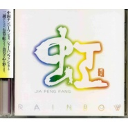

虹RAINBOW
============================

|  |  |
| :--: | :-- |
| [ 虹RAINBOW](https://emumo.xiami.com/album/1903) | **艺人**: [贾鹏芳](../index.md) **语种**: 其他 **唱片公司**: Pacific MOON **发行时间**: 2000年10月01日 **专辑类别**: 录音室专辑 **专辑风格**: 轻音乐 Easy Listening **播放数**: 233542 **收藏数**: 895 **评论数**: 44  |

## 简介

《虹》，是贾鹏芳所有专辑中最令人喜爱的作品。无论是旋律、编曲、整体感，无一不是上上之选。曲目各有特色，但又始终保持着微妙的统一感，令整张专辑一气呵成，浑然一体。第一曲“虹”带来的感触，是其他曲子所不曾有的。不管听多少次，那种深入心灵的感动都不曾减少半分。

## 曲目

- [RAINBOW虹](./1903/9r360dec.md)
- [LIGHT DANCE流光](./1903/Zsyb927d.md)
- [MEMORY OF CHILDHOOD童年回忆](./1903/9r564449.md)
- [IN THE GARDEN游园](./1903/9r65b124.md)
- [NIGHT OF BEIJING北京之夜](./1903/9r772ced.md)
- [DAWN晨曦](./1903/Zs2a9f38.md)
- [RIVERSIDE河畔](./1903/Zs3d14e1.md)
- [HOMEWARD归途](./1903/9rA89b82.md)
- [SWEET DREAMS甜梦](./1903/bPut3806d.md)
- [DEEP BLUE深蓝](./1903/Zs6c0a3e.md)
- [IN SILENCE寂静](./1903/9rD6787c.md)
- [END OF THE RAINBOW虹桥尽头](./1903/9rE7c37d.md)

## 评论

|  |  |  |  |
| :-- | :-- | :-- | :-- |
|  [虾米用户](https://emumo.xiami.com/u/2714996) https://www.... 2020-10-11 15:34 赞(1) 踩(0) | 
封面⌒
 |
|  [虾米用户](https://emumo.xiami.com/u/37693671)  2017-03-23 23:11 赞(2) 踩(0) | 
这还是我年轻气候淘碟买的一张专辑，先后买了《彩》《虹》两张。百听之下还是虹有味道，二胡表现淋漓尽致。转眼十几年了，儿子都十岁了，再听此曲，不胜悲凉，感觉时光白马过隙&amp;hellip;&amp;hellip;很多事情没有好好珍惜&amp;hellip;
 |
|  [虾米用户](https://emumo.xiami.com/u/164599) 打死我!我想死! 2015-11-30 12:57 赞(0) 踩(0) | 
棒呆
 |
|  [虾米用户](https://emumo.xiami.com/u/8832263)  2015-09-03 01:41 赞(1) 踩(0) | 
和平之月
 |
|  [虾米用户](https://emumo.xiami.com/u/4241117) 心外无物 2015-06-29 14:05 赞(1) 踩(0) | 
1RAINBOW京田誠一2LIGHT DANCE京田誠一3MEMORY OF CHILDHOOD賈鵬芳／京田誠一（編曲）4IN THE GARDEN京田誠一5NIGHT OF BEIJING京田誠一6DAWN賈鵬芳／京田誠一（編曲）7RIVERSIDE京田誠一8HOMEWARD賈鵬芳／京田誠一（編曲）9SWEET DREAMS京田誠一10DEEP BLUE京田誠一11IN SILENCE京田誠一12END OF THE RAINBOW京田誠一
 |
|  [虾米用户](https://emumo.xiami.com/u/10232844) 再完美的声音也不过是声音... 2015-03-12 17:55 赞(0) 踩(0) | 
在收和平之月
 |
|  [虾米用户](https://emumo.xiami.com/u/20025417) 暂无签名~ 2014-08-12 00:01 赞(0) 踩(0) | 
百听不厌！能推出这么多优秀的新作品确实厉害
 |
|  [虾米用户](https://emumo.xiami.com/u/1880062)  2014-07-30 15:38 赞(0) 踩(0) | 
和平之月
 |
|  [虾米用户](https://emumo.xiami.com/u/1880062)  2014-07-30 15:36 赞(0) 踩(0) | 
贾鹏芳，和平之月
 |
|  [虾米用户](https://emumo.xiami.com/u/33042329) 鼎阿哥 2014-06-07 20:16 赞(0) 踩(0) | 
古典
 |
|  [虾米用户](https://emumo.xiami.com/u/1820887) 与虾米共生死~~ 2014-02-27 13:09 赞(0) 踩(0) | 
第四首IN THE GARDEN也特別帶感~~
 |
|  [虾米用户](https://emumo.xiami.com/u/1820887) 与虾米共生死~~ 2014-02-27 13:04 赞(0) 踩(0) | 
沒人覺得第六首DAWN牛逼爆了么？
 |
|  [虾米用户](https://emumo.xiami.com/u/15477519) 爱  是生命的和弦，而不... 2013-12-06 11:42 赞(0) 踩(0) | 
贾鹏芳老师的经典作品...
 |
|  [虾米用户](https://emumo.xiami.com/u/2249408)  2013-10-16 15:05 赞(0) 踩(0) | 
经典！《虹》，是贾鹏芳所有专辑中最令人喜爱的作品。无论是旋律、编曲、整体感，无一不是上上之选。曲目各有特色，但又始终保持着微妙的统一感，令整张专辑一气呵成，浑然一体。第一曲“虹”带来的感触，是其他曲子所不曾有的。不管听多少次，那种深入心灵的感动都不曾减少半分。
 |
|  [虾米用户](https://emumo.xiami.com/u/5520861)  2013-09-28 13:24 赞(0) 踩(0) | 
为什么每次听到二胡声 眼泪就哗哗的流。。。
 |
| ⇒ |  [虾米用户](https://emumo.xiami.com/u/41840857)   2014-09-29 21:31 赞(0) 踩(0) | 
我也是
 |
|  [虾米用户](https://emumo.xiami.com/u/9134017)  2013-09-21 10:32 赞(0) 踩(0) | 
好听
 |
|  [虾米用户](https://emumo.xiami.com/u/12290647) 抓 2013-07-13 14:21 赞(0) 踩(0) | 
我能说神马呢 一入耳就着迷？
 |
|  [虾米用户](https://emumo.xiami.com/u/2249408)  2013-04-23 14:35 赞(0) 踩(0) | 
经典之作，热诚推崇！
 |
|  [虾米用户](https://emumo.xiami.com/u/11629226)  2013-02-18 01:07 赞(0) 踩(0) | 
不錯
 |
|  [虾米用户](https://emumo.xiami.com/u/12918971)  2013-02-06 20:43 赞(0) 踩(0) | 
那一份静与闲
 |
|  [虾米用户](https://emumo.xiami.com/u/1184951) 小宝宝 2013-01-11 22:10 赞(0) 踩(0) | 
喜欢
 |
|  [虾米用户](https://emumo.xiami.com/u/12058978)  2012-12-23 10:27 赞(0) 踩(0) | 
好听
 |
|  [虾米用户](https://emumo.xiami.com/u/4051682) 一往无前 2012-10-02 15:01 赞(0) 踩(0) | 
为啥这些人都去日本留学了。。。
 |
| ⇒ |  [虾米用户](https://emumo.xiami.com/u/2021970)  2012-10-07 21:25 赞(0) 踩(0) | 
因为去日本留学所以才能出来这些东西
 |
| ⇒ |  [虾米用户](https://emumo.xiami.com/u/9855899) 鼓动我心 2013-01-11 01:13 赞(0) 踩(0) | 
<q><b>一三十说：</b></q>
 |
| ⇒ |  [虾米用户](https://emumo.xiami.com/u/7604962)  2013-09-17 20:23 赞(0) 踩(0) | 
<q><b>Jade Young说：</b></q>
 |
|  [虾米用户](https://emumo.xiami.com/u/9346718)  2012-09-03 06:27 赞(0) 踩(0) | 
纯音乐
 |
|  [虾米用户](https://emumo.xiami.com/u/10180899)  2012-08-18 17:19 赞(0) 踩(0) | 
震撼心灵！
 |
|  [虾米用户](https://emumo.xiami.com/u/10099384) HONGDOU 2012-08-17 19:32 赞(0) 踩(0) | 
收藏专辑《虹》
 |
|  [虾米用户](https://emumo.xiami.com/u/798987) 风筝是什么好吃的 2012-05-26 01:32 赞(0) 踩(0) | 
IN THE GARDEN
 |
|  [虾米用户](https://emumo.xiami.com/u/9079688)  2012-05-05 00:54 赞(0) 踩(0) | 
凄美伤感
 |
|  [虾米用户](https://emumo.xiami.com/u/7306587)  2011-12-22 01:20 赞(0) 踩(0) | 
NIGHT　OF　BEIJING！
 |
|  [虾米用户](https://emumo.xiami.com/u/890038)  2011-11-30 17:33 赞(0) 踩(0) | 
很棒的二胡
 |
|  [虾米用户](https://emumo.xiami.com/u/6272380)  2011-10-18 16:27 赞(0) 踩(0) | 
他拉得比較凄美....
 |
|  [虾米用户](https://emumo.xiami.com/u/1052461) @blinK4sy- 2011-10-13 18:31 赞(0) 踩(0) | 
RAINBOW.
 |
|  [虾米用户](https://emumo.xiami.com/u/3605814) 是一个废人了 2011-09-22 18:27 赞(0) 踩(0) | 
贾鹏芳啊~~~  原来十二国记里的曲是他的
 |
|  [虾米用户](https://emumo.xiami.com/u/2432380)  2011-07-02 18:05 赞(0) 踩(0) | 
二胡
 |
|  [虾米用户](https://emumo.xiami.com/u/4417443)  2011-06-25 17:02 赞(0) 踩(0) | 
我是比较喜欢中乐的人，如果乐曲略带点忧伤而不悲伤时更好。喜欢贾鹏芳的音乐啰!
 |
|  [虾米用户](https://emumo.xiami.com/u/1898643)  2011-06-10 23:59 赞(0) 踩(0) | 
最近超爱贾鹏芳的二胡
 |
|  [虾米用户](https://emumo.xiami.com/u/1315500)  2011-04-04 12:37 赞(0) 踩(0) | 
******
 |
|  [虾米用户](https://emumo.xiami.com/u/3152732)  2011-03-11 18:58 赞(0) 踩(0) | 
虹
 |
|  [虾米用户](https://emumo.xiami.com/u/1342581)  2011-01-31 17:28 赞(0) 踩(0) | 
贾鹏芳
 |
|  [虾米用户](https://emumo.xiami.com/u/1941) 经不住似水流年，逃不过此... 2011-01-30 16:50 赞(0) 踩(0) | 
虹
 |
