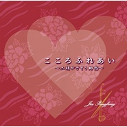

こころふれあい ~二胡がさそう郷愁~
============================

|  |  |
| :--: | :-- |
| [ こころふれあい ~二胡がさそう郷愁~](https://emumo.xiami.com/album/2102721604) | **艺人**: [贾鹏芳](../index.md) **语种**: 其他 **唱片公司**: Universal Music Japan **发行时间**: 2016年06月15日 **专辑类别**: 录音室专辑 **专辑风格**:  **播放数**: 35421 **收藏数**: 183 **评论数**: 18  |

## 简介

中国の伝統楽器“二胡”の世界的奏者、ジャー・パンファンがレギュラー出演しているBS-TBS『こころ ふれあい紀行~音と匠の旅~』から生まれたJ-POPインスト・カヴァー・album。今作はこれまでのOAで演奏されたJ-POPの名曲を“郷愁”をテーマに選曲し、深い二胡の音色で綴る音楽紀行ともいえる作品に仕上がっている。

## 曲目

- [サボテンの花](./2102721604/8HN8gNf7442.md)
- [SWEET MEMORIES](./2102721604/xNc9spdabf9.md)
- [真夏の果実](./2102721604/mSrA3G73ebc.md)
- [夏の終わり](./2102721604/8HN8gRff266.md)
- [君をのせて](./2102721604/mSrA3I8450a.md)
- [涙そうそう](./2102721604/mSrA3J6f751.md)
- [かざぐるま](./2102721604/mSrA3K92331.md)
- [Let It Go~ありのままで~](./2102721604/mSrA3Lb42a6.md)
- [雪の華](./2102721604/bf2e48G308ac.md)
- [北の国から~遙かなる大地より~](./2102721604/bqwP3xr38d0f.md)
- [Jupiter](./2102721604/8HN8gYf26a4.md)
- [愛しき日々](./2102721604/8HN8gZf9803.md)
- [フレンズ](./2102721604/8HN8gMecec9.md)
- [ヘッドライト・テールライト](./2102721604/xNc9soa0feb.md)

## 评论

|  |  |  |
| :-- | :-- | :-- |
|  [虾米用户](https://emumo.xiami.com/u/8577554) 我还没想好要写什么... 2018-04-15 07:36 赞(0) 踩(0) | 
好像是贾叔在日本的节目里的歌，每期都会拉二胡的那个
 |
|  [虾米用户](https://emumo.xiami.com/u/315592985) 他年得傍蟾宫客，不在梅边... 2017-11-13 22:04 赞(1) 踩(0) | 
音质升级了？
 |
|  [虾米用户](https://emumo.xiami.com/u/6361118) 黑洞無始終，音樂無疆界 2017-10-25 23:06 赞(2) 踩(0) | 
无论是封面还是编曲制作都给人一种廉价感，选曲毫无新意，演奏毫无情感。贾叔泯然众人矣。。。。。。
 |
|  [虾米用户](https://emumo.xiami.com/u/315592985) 他年得傍蟾宫客，不在梅边... 2017-10-12 22:39 赞(1) 踩(0) | 
这音质  但是仔细听还是同样撩人心弦的运弓，揉弦，装饰音，编曲给人耳目一新的感觉  作为真爱粉我喜欢的远远不止贾叔的音色 
 |
|  [虾米用户](https://emumo.xiami.com/u/8271338)  2017-07-04 11:03 赞(0) 踩(0) | 
No.2：如果有一天，我将要离去。。。囧。。。
 |
|  [虾米用户](https://emumo.xiami.com/u/1005227)  2017-04-03 23:04 赞(0) 踩(0) | 
感觉很一般啊，变味了。。。难道是退步了？
 |
|  [虾米用户](https://emumo.xiami.com/u/9198057) viktor 2017-04-02 01:23 赞(0) 踩(0) | 
Because the enhancement that gives to music thebeautiful sound of erhu
 |
|  [虾米用户](https://emumo.xiami.com/u/44128153) 暂无签名~ 2017-03-31 18:13 赞(0) 踩(0) | 
曲子都好听，可是录制差了点，还得京田诚一来
 |
|  [虾米用户](https://emumo.xiami.com/u/51843185) 谁能帮我养养虾米 2017-03-29 23:42 赞(0) 踩(0) | 
轻快了呢
 |
|  [虾米用户](https://emumo.xiami.com/u/47577064) 杂食耳 2017-03-29 13:14 赞(0) 踩(0) | 
实在听不下去了，先入为主吧，经典的的歌比如夏の終わり，二胡一弄各种奇怪窜味，毁了人家原作的感觉
 |
|  [虾米用户](https://emumo.xiami.com/u/2959963) . 2017-03-29 01:22 赞(1) 踩(0) | 
一张尝试性专辑，总体来说不是很好。二胡是比较高傲的乐器，因此不像钢琴，小提琴，笛子来得那么宽泛，适合的调不是很多。一些西方的和弦很难搭，例如let it go。。日本留学乐搭出来也比较中二。不负责任的说，贾老师一直包容力很强，大约是有一颗弹钢琴的心？（笑
 |
|  [虾米用户](https://emumo.xiami.com/u/8218530) 加油！ 2017-03-28 22:53 赞(0) 踩(0) | 
这张很失望，是贾老师的二胡学校给学生听的练习教材吗？
 |
|  [虾米用户](https://emumo.xiami.com/u/619586)  2017-03-28 13:25 赞(0) 踩(0) | 
我还是觉得以前的要好听些~~~头顶锅盖ing
 |
|  [虾米用户](https://emumo.xiami.com/u/72666568)  2017-03-27 23:06 赞(0) 踩(0) | 
嘿嘿。
 |
|  [虾米用户](https://emumo.xiami.com/u/1601859) 想啊想啊，想起你了。 2017-03-27 15:25 赞(0) 踩(0) | 
ｸﾞｯ!(๑&amp;bull;̀ㅂ&amp;bull;́)و✧
 |
|  [虾米用户](https://emumo.xiami.com/u/606760) 魂牵一线 2017-03-27 12:45 赞(0) 踩(0) | 
听
 |
|  [虾米用户](https://emumo.xiami.com/u/49640493) 网易云SAINTDONT... 2017-03-27 10:13 赞(0) 踩(0) | 

 |
|  [虾米用户](https://emumo.xiami.com/u/8792543)  2017-03-27 10:09 赞(0) 踩(0) | 
贾叔，耶耶～
 |
