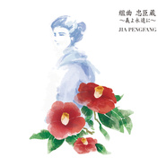

组曲 忠臣蔵 ～义よ永远に～
============================

|  |  |
| :--: | :-- |
| [ 组曲 忠臣蔵 ～义よ永远に～](https://emumo.xiami.com/album/2102959581) | **艺人**: [贾鹏芳](../index.md) **语种**: 英语 **唱片公司**: Universal Music **发行时间**: 2017年11月22日 **专辑类别**: 录音室专辑 **专辑风格**: 世界音乐 World Music **播放数**: 11971 **收藏数**: 120 **评论数**: 10  |

## 简介

## 曲目

- [雪見る想い ~瑤泉院~第一楽章](./2102959581/mS1mLD907b3.md)
- [母恋いし 大高源五忠雄第二楽章](./2102959581/xNmlApc536b.md)
- [遺言の大慶 ~矢頭右衛門七教兼~第三楽章](./2102959581/b1rKe3L3caf8.md)
- [秘めた胸中 ~高田郡兵衛資政~第四楽章](./2102959581/xNmlAsdc3f0.md)
- [忠孝の末に ~萱野三平重実~第五楽章](./2102959581/xNmlAua8ff6.md)
- [命を懸けた戦い ~天野屋利兵衛~第六楽章](./2102959581/mS1mLM8c89d.md)
- [遥か彼方 ~大石主税良金~第七楽章](./2102959581/xNmlAyac25f.md)
- [忠義の士 永遠なれ ~寺坂吉右衛門信行~第八楽章](./2102959581/xNmlAzb42b7.md)
- [月見る想いBonus Track](./2102959581/xNmlA2bb0a2.md)

## 评论

|  |  |  |  |
| :-- | :-- | :-- | :-- |
|  [虾米用户](https://emumo.xiami.com/u/20110837)  2019-02-07 19:08 赞(0) 踩(0) | 
很棒唉！为什么这么少人评呀！
 |
| ⇒ |  [虾米用户](https://emumo.xiami.com/u/376433458) 收集教宝宝b 2019-04-06 09:18 赞(0) 踩(0) | 
明白人都不说话  捣乱者很多。
 |
|  [虾米用户](https://emumo.xiami.com/u/309363521)  2018-02-20 12:59 赞(0) 踩(0) | 

 |
|  [虾米用户](https://emumo.xiami.com/u/7772147)  2018-02-10 00:29 赞(0) 踩(0) | 
我勒个去，小柳由纪！
 |
|  [虾米用户](https://emumo.xiami.com/u/30800139) 我在低俗与高雅间活的很尴... 2018-02-02 22:13 赞(0) 踩(0) | 
。
 |
|  [虾米用户](https://emumo.xiami.com/u/327521234)  2018-01-27 20:51 赞(0) 踩(0) | 
又是三国主题的专辑，比较含蓄的表达吧，情感丰富，大爱
 |
|  [虾米用户](https://emumo.xiami.com/u/283302958)  2018-01-26 11:23 赞(0) 踩(0) | 
很喜欢器乐。很伤心，只能从国外的乐曲里体会音乐的美&amp;hellip;当然国内也有大师级演奏家，就是太少了
 |
|  [虾米用户](https://emumo.xiami.com/u/49745190)  2018-01-04 17:28 赞(0) 踩(0) | 
美 
 |
|  [虾米用户](https://emumo.xiami.com/u/5751680) 我还没想好要写什么... 2017-12-27 20:48 赞(0) 踩(0) | 
棒
 |
|  [虾米用户](https://emumo.xiami.com/u/38848651)   2017-12-27 16:46 赞(0) 踩(0) | 
虽然和主题不符，但是可惜没有收录去年大热的&amp;ldquo;恋&amp;rdquo;。
 |
