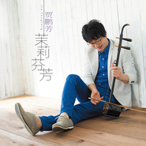

茉莉芬芳
============================

|  |  |
| :--: | :-- |
| [ 茉莉芬芳](https://emumo.xiami.com/album/2103719131) | **艺人**: [贾鹏芳](../index.md) **语种**: 国语 **唱片公司**: 源丰泰坤 **发行时间**: 2018年05月28日 **专辑类别**: 录音室专辑 **专辑风格**: 中国民乐 Chinese Folk Music **播放数**: 551221 **收藏数**: 749 **评论数**: 61  |

## 简介

国际二胡大师贾鹏芳发布全新国风主题专辑《茉莉芬芳》  
  
贾鹏芳，国际著名二胡演奏家、作曲家，现任中国二胡学会理事、日本二胡学会会长，代表作品有《睡莲》、《宁月》、《河》等。曾多次进行海外公演（美国、意大利、台湾、韩国、日本等），除了为张艺谋先生电影「十面埋伏」录制音乐外，还为「幽灵公主」（宫崎峻先生）、「悲情城市」、「汉诗纪行」、「北京千年王城」、「故宫」等电影、纪录片录制音乐。在中国、日本及欧美地区，先后发行出版了「华弦」、「悠久的风景」、「河」、「虹」、「遥」、「翔」、「浪漫」、「月光」、「明天」、「一抹天香」、「煌」、「三国志组曲Ⅰ義Ⅱ将」、「こころふれあいⅠⅡ」、「組曲忠臣蔵」、「来日二十周年纪念音乐会」等数十张个人CD唱片及音乐会实况DVD，唱片全球累计销量达到近300万张，而且多张专辑在发行后均荣登当年日本古典音乐销售排行榜冠军，并在美国亚洲音乐销售排行榜上名列前茅，是国际知名的东方流派音乐家代表人物之一。  
  
《茉莉芬芳》是贾鹏芳先生于2018年发布的全新专辑，也是他首次以中国为主导市场而面向全球发行的概念专辑。该专辑共有9首作品，其中不仅有《茉莉花》《橄榄树》《女人花》等经典曲目，还收录了贾鹏芳近年来全新创作的两首作品。专辑以《茉莉芬芳》为名，不仅是因为有特别改编版本的《茉莉花》做为主打曲目，还喻示着以中国作品为代表的东方流派音乐将会在世界舞台有着更好的未来，可谓茉莉花开，芬芳全球。本次专辑由其老搭档，日本著名音乐人，Newage 大师京田诚一亲自操刀制作，由久石让御用录音混音师泷田二朗担任录音制作，并邀请日本众多一流演奏家共同完成，是含金量极高的世界级轻音乐代表作品。  
  
《茉莉芬芳》专辑是贾鹏芳先生签约慕音乐后推出的全新专辑，慕音乐是内地实力音乐厂牌，此次与贾鹏芳的签约合作也标志着慕音乐正式启动与日本顶级音乐大师们的各项战略合作，自2017年初慕音乐独家代理日本著名Newage音乐厂牌“和平之月”全部版权内容开始，慕音乐就全力在拓展整合与国内外新派国风艺术家们的各项合作，也是国内率先推出国风禅乐分类概念的音乐公司。此次的《茉莉芬芳》专辑由慕音乐全网独家数字发行，黑胶唱片及HQCD由中唱（上海）独家发行。  
  
  
 

## 曲目

- [茉莉花](./2103719131/bqxuBfP37ef1.md)
- [不说话](./2103719131/mSMImw4c975.md)
- [橄榄树](./2103719131/mSMImx891b9.md)
- [Toriko](./2103719131/xN7HaY9f35b.md)
- [墨痕](./2103719131/mSMImz78e19.md)
- [女人花](./2103719131/xN7Hbabdccd.md)
- [旅人的诗](./2103719131/xN7Hbbc734f.md)
- [一个人](./2103719131/mSMIm26d224.md)
- [苏州夜曲](./2103719131/mSMIm390ad2.md)

## 评论

|  |  |  |
| :-- | :-- | :-- |
|  [虾米用户](https://emumo.xiami.com/u/47497292)  2020-11-15 11:37 赞(0) 踩(0) | 
心到则手到！
 |
|  [虾米用户](https://emumo.xiami.com/u/498326)  2020-08-25 09:06 赞(0) 踩(0) | 
感觉整体水平有所下降～
 |
|  [虾米用户](https://emumo.xiami.com/u/346594241) 一个不懂音乐的80后！ 2020-06-29 07:57 赞(0) 踩(0) | 
抒情，留恋，有种一路看风景的感觉！
 |
|  [虾米用户](https://emumo.xiami.com/u/442635432)  2020-05-08 01:39 赞(0) 踩(0) | 
音乐清晰，婉转动听，节奏感强。
 |
|  [虾米用户](https://emumo.xiami.com/u/227200081)  2019-06-28 06:21 赞(0) 踩(0) | 
很好听的，支持贾老师！
 |
|  [虾米用户](https://emumo.xiami.com/u/400214648)  2019-06-14 22:09 赞(0) 踩(0) | 
听过现场，真棒！
 |
|  [虾米用户](https://emumo.xiami.com/u/35552338) 寂静与时间 2019-04-23 19:03 赞(0) 踩(0) | 
Emm  二胡演奏家固然不错，只是中国音乐还是比不上西方音乐的大气啊
 |
|  [虾米用户](https://emumo.xiami.com/u/8420997) 我还没想好要写什么... 2019-02-23 20:09 赞(0) 踩(0) | 
永远支持贾鹏芳老师！真的很好听，难得的经典！不管你在哪个公司，不变的依然是对二胡的热忱和绝佳的技艺，请有的人不要捆绑和平了。
 |
|  [虾米用户](https://emumo.xiami.com/u/113362356) 冷酷男孩儿 2019-02-21 17:27 赞(0) 踩(0) | 
支持
 |
|  [虾米用户](https://emumo.xiami.com/u/1626082) 保持好奇，保持敏锐！ 2018-11-28 20:42 赞(0) 踩(0) | 
随心所欲！.. ^ w ^
 |
|  [虾米用户](https://emumo.xiami.com/u/38680148) 目的虽有，却无路可循；我... 2018-10-20 13:01 赞(1) 踩(0) | 
贾老师逆龄生长啊233333觉得墨痕好听，虽然没有歌词，有的东西却更多了
 |
|  [虾米用户](https://emumo.xiami.com/u/302779274)  2018-10-11 10:24 赞(0) 踩(0) | 
加油吧
 |
|  [虾米用户](https://emumo.xiami.com/u/356525838)  2018-08-29 20:44 赞(1) 踩(0) | 
希望能听他一次现场
 |
|  [虾米用户](https://emumo.xiami.com/u/54559220)  2018-08-26 18:06 赞(0) 踩(0) | 

 |
|  [虾米用户](https://emumo.xiami.com/u/345808436)  2018-08-25 13:26 赞(0) 踩(0) | 
茉莉花的音乐一起，仿佛回到了梦里的苏州，旧梦里伊人静坐窗边，房檐下蝴蝶飞舞。一杯茉莉花茶端上，茶烟氤氲，这幅发黄的画面豁然有了色彩。
 |
|  [虾米用户](https://emumo.xiami.com/u/476286) 浅斟低唱 2018-07-12 17:22 赞(0) 踩(0) | 
封面大赞！
 |
|  [虾米用户](https://emumo.xiami.com/u/25691511) 远去的风景 2018-06-22 14:30 赞(0) 踩(0) | 
好久没听了，喜欢，就是那个味~~
 |
|  [虾米用户](https://emumo.xiami.com/u/2724370) 王权没有永恒，你将何去何... 2018-06-22 03:21 赞(0) 踩(0) | 
挖~贾老师好棒
 |
|  [虾米用户](https://emumo.xiami.com/u/757262) 虾米深挖掘员。 2018-06-06 10:00 赞(1) 踩(0) | 
...不在和平之月 逼格一下掉下来
 |
| ⇒ |  [虾米用户](https://emumo.xiami.com/u/1315500)  2018-08-24 22:45 赞(0) 踩(0) | 
******
 |
|  [虾米用户](https://emumo.xiami.com/u/70700870)  2018-06-02 19:07 赞(0) 踩(0) | 
好听！
 |
|  [虾米用户](https://emumo.xiami.com/u/8209575) 等，漸漸會成爲好習慣。 2018-06-02 16:42 赞(0) 踩(0) | 
女人花--听得鸡皮疙瘩，太好听了
 |
|  [虾米用户](https://emumo.xiami.com/u/48935681) 樓閣新晨花欲語，夢中誰是... 2018-05-31 06:43 赞(0) 踩(0) | 
不错(*๓&amp;acute;╰╯`๓)♡
 |
|  [虾米用户](https://emumo.xiami.com/u/1559432)  2018-05-30 22:13 赞(1) 踩(0) | 
先不说到底好不好吧，至少，终于，哎哟嘛有生之年
 |
|  [虾米用户](https://emumo.xiami.com/u/49640493) 网易云SAINTDONT... 2018-05-30 06:35 赞(0) 踩(0) | 
老师
 |
|  [虾米用户](https://emumo.xiami.com/u/6361118) 黑洞無始終，音樂無疆界 2018-05-29 23:29 赞(1) 踩(0) | 
说是翻奏专辑有点冤枉贾叔了，其实翻奏曲只有一半，另一半都是原创新曲，但翻奏曲选的实在太烂俗，新曲又偏于平淡缺乏亮点，难免给人没有诚意的印象。最不能忍的是祖国版相比日本版居然还少三首曲子，之前《一抹天香》也是如此，实在无法理解是怎么考虑的。
 |
| ⇒ |  [虾米用户](https://emumo.xiami.com/u/327521234)  2018-05-29 23:52 赞(0) 踩(0) | 
还好吧，说得也有点
 |
| ⇒ |  [虾米用户](https://emumo.xiami.com/u/8577554) 我还没想好要写什么... 2018-08-20 19:57 赞(0) 踩(0) | 
入了一抹天香实体CD，我觉得非常好听，尤其是《烛影摇红》，编曲赞赞赞
 |
|  [虾米用户](https://emumo.xiami.com/u/3696268)  2018-05-29 17:59 赞(2) 踩(0) | 
您走时贫瘠落后，再看时浮现繁华，您喝杯酒，品碗茶，能不能给中国培养几个娃娃。
 |
|  [虾米用户](https://emumo.xiami.com/u/5042720)  2018-05-29 13:33 赞(0) 踩(0) | 
好听  封面看上去真的很年轻
 |
|  [虾米用户](https://emumo.xiami.com/u/7125566) 向上吧，少年。 2018-05-29 07:54 赞(1) 踩(0) | 
贾老师今年都60了！看封面，哇靠，妥妥的韩国30岁的欧巴诶 ！
 |
|  [虾米用户](https://emumo.xiami.com/u/31894265) 听点好歌也不容易呀。。。 2018-05-28 23:36 赞(0) 踩(0) | 
开心！～&amp;epsilon;٩(๑&amp;gt; ₃ &amp;lt;)۶ з
 |
|  [虾米用户](https://emumo.xiami.com/u/44128153) 暂无签名~ 2018-05-28 19:46 赞(0) 踩(0) | 
今天发布的，哇！
 |
|  [虾米用户](https://emumo.xiami.com/u/227200081)  2018-05-28 18:31 赞(1) 踩(0) | 
这么多年了，贾鹏芳老师的二胡依然天籁之音！赞赞赞！
 |
|  [虾米用户](https://emumo.xiami.com/u/2844718)  2018-05-28 18:25 赞(0) 踩(0) | 
已循环一天，爱不释耳
 |
|  [虾米用户](https://emumo.xiami.com/u/4218777) 博学之,审问之,慎思之,... 2018-05-28 16:55 赞(2) 踩(0) | 
这辑最喜欢《不说话》。
 |
|  [虾米用户](https://emumo.xiami.com/u/2052669) 温柔 坚定 明净 2018-05-28 16:36 赞(1) 踩(0) | 
还是更喜欢和平之月时期的曲子。
 |
|  [虾米用户](https://emumo.xiami.com/u/11751010) 感謝 人生無常 這回事。 2018-05-28 15:38 赞(0) 踩(0) | 
衹有賈先生配得上「溫潤如玉」這個詞了。
 |
|  [虾米用户](https://emumo.xiami.com/u/3941600)  2018-05-28 12:45 赞(0) 踩(0) | 
这个封面加分
 |
|  [虾米用户](https://emumo.xiami.com/u/12464012) 这个世界太疯狂 2018-05-28 12:36 赞(0) 踩(0) | 
贾鹏芳大神
 |
|  [虾米用户](https://emumo.xiami.com/u/1820887) 与虾米共生死~~ 2018-05-28 10:38 赞(20) 踩(0) | 
還是懷念和平之月時期，至少那時候的原創曲子是真多~~
 |
| ⇒ |  [虾米用户](https://emumo.xiami.com/u/140540) 生命是花，音乐是蜜。 2018-05-30 21:07 赞(0) 踩(0) | 
我又去听了听莎木哈哈
 |
| ⇒ |  [虾米用户](https://emumo.xiami.com/u/40088849) 各类通吃硬盘10万曲达成 2018-06-01 23:30 赞(0) 踩(0) | 
那个时候和平之月就是一片一望无垠的绿地，任意驰骋，永不满足。
 |
| ⇒ |  [虾米用户](https://emumo.xiami.com/u/1820887) 与虾米共生死~~ 2018-06-02 10:07 赞(0) 踩(0) | 
<q><b>萌叔来斗舞说：</b></q>
 |
|  [虾米用户](https://emumo.xiami.com/u/45060119) 独乐不如众乐乐，bran... 2018-05-28 10:14 赞(0) 踩(0) | 
嘿嘿，激动，前排
 |
|  [虾米用户](https://emumo.xiami.com/u/48935681) 樓閣新晨花欲語，夢中誰是... 2018-05-28 07:13 赞(0) 踩(0) | 
不错(*๓&amp;acute;╰╯`๓)♡
 |
|  [虾米用户](https://emumo.xiami.com/u/776088) 不愿一个人 2018-05-28 05:57 赞(1) 踩(0) | 
喜欢二胡
 |
|  [虾米用户](https://emumo.xiami.com/u/3863771) 你想好了嗎 2018-05-28 03:19 赞(0) 踩(0) | 
開心
 |
|  [虾米用户](https://emumo.xiami.com/u/8577554) 我还没想好要写什么... 2018-05-28 03:13 赞(0) 踩(0) | 
内容已删除
 |
| ⇒ |  [虾米用户](https://emumo.xiami.com/u/327521234)  2018-05-29 23:53 赞(0) 踩(0) | 
还有哪些啊
 |
|  [虾米用户](https://emumo.xiami.com/u/13940536) 赠人玫瑰，手留余香 2018-05-28 00:55 赞(1) 踩(0) | 
喜欢，听贾鹏芳老师好多年了
 |
|  [虾米用户](https://emumo.xiami.com/u/10990571) 花花世界，生生不息。 2018-05-28 00:37 赞(1) 踩(0) | 
专辑封面有种冬季恋歌时代的裴勇俊大叔的赶脚    
 |
| ⇒ |  [虾米用户](https://emumo.xiami.com/u/43467925)  2018-05-28 07:25 赞(0) 踩(0) | 
哈哈哈，真的有
 |
|  [虾米用户](https://emumo.xiami.com/u/11128904)  2018-05-28 00:26 赞(0) 踩(0) | 
第25个收藏  
 |
|  [虾米用户](https://emumo.xiami.com/u/190743936) 我哪里也不去，我一直都在... 2018-05-28 00:18 赞(1) 踩(0) | 
有点激动
 |
|  [虾米用户](https://emumo.xiami.com/u/207464079) 铸鹰 2018-05-28 00:15 赞(0) 踩(0) | 
啊，前排
 |
|  [虾米用户](https://emumo.xiami.com/u/318132) 抠啦 2018-05-28 00:13 赞(0) 踩(0) | 
抠啦
 |
|  [虾米用户](https://emumo.xiami.com/u/24207186) 我还没想好要写什么... 2018-05-28 00:11 赞(0) 踩(0) | 
来签到
 |
|  [虾米用户](https://emumo.xiami.com/u/213164785)  2018-05-28 00:09 赞(0) 踩(0) | 
嘻嘻，第十五个收藏&amp;frasl;(&amp;frasl;&amp;frasl;&amp;bull;&amp;frasl;&amp;omega;&amp;frasl;&amp;bull;&amp;frasl;&amp;frasl;)&amp;frasl;
 |
|  [虾米用户](https://emumo.xiami.com/u/10666367) BD-2L 2018-05-28 00:03 赞(0) 踩(0) | 
梦里不知身是客
 |
|  [虾米用户](https://emumo.xiami.com/u/16582344) 我还没想好要写什么... 2018-05-28 00:01 赞(0) 踩(0) | 
喜欢贾老师多年，独特的东方韵味。
 |
|  [虾米用户](https://emumo.xiami.com/u/3932008) Two sunsets 2018-05-28 00:01 赞(0) 踩(0) | 
沙发
 |
