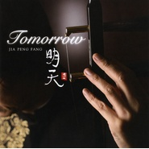

明天Tomorrow
============================

|  |  |
| :--: | :-- |
| [ 明天Tomorrow](https://emumo.xiami.com/album/348800) | **艺人**: [贾鹏芳](../index.md) **语种**: 其他 **唱片公司**: Pacific MOON **发行时间**: 2008年12月17日 **专辑类别**: 录音室专辑 **专辑风格**: 轻音乐 Easy Listening **播放数**: 568383 **收藏数**: 1063 **评论数**: 40  |

## 简介

贾鹏芳旅日20周年的纪念专辑，和月大手笔请来外援服部克久氏和渡辺俊幸两位名家，此外还有桑山哲也的手风琴以及天野清継的吉他助阵，幕后制作阵容可谓相当可观。服部克久为老贾写了专辑第一曲，老贾自己也写了两首，还有一首作词，其余作品都是由渡辺俊幸谱写和编曲制作。全新的创作也让这张久违的新作倍增期待。  
 

## 曲目

- [黎明れいめい / DAYBREAK](./348800/bf0ra8M32e39.md)
- [黄昏の詩たそがれのうた / DUSK](./348800/bf0ra8N2ea9b.md)
- [上海之夜シャンハイナイト / SHANGHAI NIGHT](./348800/mQ4g3U69c81.md)
- [明天ミンテェン / TOMORROW](./348800/mQ4g3V4db2e.md)
- [サマーダンス SUMMER DANCE](./348800/mQ4g3W61890.md)
- [遠い記憶MEMORIES / とおいきおく](./348800/U56bKr2afed.md)
- [潮風に吹かれてBAYSIDE / しおかぜにふかれて](./348800/JALcVI21c95.md)
- [エレジー ELEGY](./348800/xLpfs913155.md)
- [天馬ペガサス / PEGASUS](./348800/mQ4g4a9148d.md)
- [絆きずな / BOND](./348800/mQ4g4b6ca38.md)

## 评论

|  |  |  |  |
| :-- | :-- | :-- | :-- |
|  [虾米用户](https://emumo.xiami.com/u/2276166)  2019-03-20 17:10 赞(0) 踩(0) | 
这盛世，如你所愿。
 |
|  [虾米用户](https://emumo.xiami.com/u/33403485)  2017-10-28 00:37 赞(3) 踩(0) | 
二胡音乐应该在中国大地上遍地开花，从某种意义上讲，东方情调的弦乐比西方情调的弦乐，多了一份古韵
 |
|  [虾米用户](https://emumo.xiami.com/u/4723017)  2017-10-28 00:21 赞(2) 踩(0) | 
深夜倾听总是感觉到自己可以从城市喧嚣中抽离。一直很喜欢贾老师的作品，二胡总带有一种莫名的岁月感，让人感怀。很喜欢
 |
|  [虾米用户](https://emumo.xiami.com/u/11917209)   2015-06-09 21:20 赞(0) 踩(0) | 
让我对明天充满了希望
 |
|  [虾米用户](https://emumo.xiami.com/u/33403485)  2015-05-13 10:33 赞(1) 踩(0) | 
古韵之美属于华夏
 |
|  [虾米用户](https://emumo.xiami.com/u/10613138)  2015-04-08 14:27 赞(1) 踩(0) | 
明天，一切的一切.....
 |
|  [虾米用户](https://emumo.xiami.com/u/606760) 魂牵一线 2015-03-31 15:03 赞(0) 踩(0) | 
听
 |
|  [虾米用户](https://emumo.xiami.com/u/6353355)  2014-12-05 08:28 赞(0) 踩(0) | 
悲凉，回想
 |
|  [虾米用户](https://emumo.xiami.com/u/43607123)  2014-11-18 15:09 赞(0) 踩(0) | 
最爱上海之夜和明天 elegy summer dance其次 黎明 绊次之
 |
|  [虾米用户](https://emumo.xiami.com/u/13261597) 一个人要像一支队伍 2014-10-19 10:41 赞(0) 踩(0) | 
一直听不下去二胡的声音觉得太凄凉听得心慌 可是&amp;#039;明天&amp;#039;里面二胡跟比较有节奏感的编曲融合得真好！！ 妈妈再也不担心我不喜欢二胡惹＝3＝
 |
|  [虾米用户](https://emumo.xiami.com/u/7470024)  2014-10-10 22:12 赞(0) 踩(0) | 
就是喜欢贾鹏芳
 |
|  [虾米用户](https://emumo.xiami.com/u/36997943)  2014-06-02 21:59 赞(0) 踩(0) | 
喜欢二胡
 |
|  [虾米用户](https://emumo.xiami.com/u/9767102) 牧羊女 2014-05-29 12:47 赞(0) 踩(0) | 
一起欣赏
 |
|  [虾米用户](https://emumo.xiami.com/u/3327021) 少说多吃 2014-05-21 08:21 赞(0) 踩(0) | 
纯音乐
 |
|  [虾米用户](https://emumo.xiami.com/u/9599912)  2014-01-28 02:42 赞(1) 踩(0) | 
贾鹏芳旅日20周年的纪念专辑，和月大手笔请来外援服部克久氏和渡辺俊幸两位名家，此外还有桑山哲也的手风琴以及天野清継的吉他助阵，幕后制作阵容可谓相当可观。
 |
|  [虾米用户](https://emumo.xiami.com/u/25109310)  2013-12-14 15:36 赞(0) 踩(0) | 
一個字..........讚
 |
|  [虾米用户](https://emumo.xiami.com/u/24210538)  2013-10-22 11:02 赞(0) 踩(0) | 
好听
 |
|  [虾米用户](https://emumo.xiami.com/u/2002503) 追风筝的人。 2013-04-13 18:57 赞(0) 踩(0) | 
第一次听他的轻音乐是那首睡莲，让人心里很宁静的声音
 |
|  [虾米用户](https://emumo.xiami.com/u/2282124) 西风吹雨长路遥，葬花落魄... 2013-02-01 22:30 赞(0) 踩(0) | 
贾鹏芳老师......
 |
|  [虾米用户](https://emumo.xiami.com/u/7139756)  2013-02-01 02:57 赞(0) 踩(0) | 
好喜欢！！···
 |
|  [虾米用户](https://emumo.xiami.com/u/11128904)  2012-10-20 15:03 赞(0) 踩(0) | 
《明天》贾鹏芳老师！
 |
|  [虾米用户](https://emumo.xiami.com/u/8521990)  2012-09-22 23:28 赞(0) 踩(0) | 
贾鹏芳
 |
|  [虾米用户](https://emumo.xiami.com/u/5122966) 愿他年相见，花开如昔。 2012-08-05 21:29 赞(0) 踩(0) | 
如果你知道音乐的灵魂，你会喜欢的。
 |
|  [虾米用户](https://emumo.xiami.com/u/504642)  2012-03-07 15:43 赞(0) 踩(0) | 
仿若惊鸿
 |
|  [虾米用户](https://emumo.xiami.com/u/7207959) 我还没想好要写什么... 2011-12-15 23:47 赞(0) 踩(0) | 
委婉、深情、沧桑…
 |
|  [虾米用户](https://emumo.xiami.com/u/2551826)  2011-10-16 20:21 赞(0) 踩(0) | 
意境是任何词句都无法模拟的。
 |
|  [虾米用户](https://emumo.xiami.com/u/5971752)  2011-09-25 15:25 赞(0) 踩(0) | 
同样的感觉，手法更完美了！
 |
|  [虾米用户](https://emumo.xiami.com/u/5971752)  2011-09-25 15:06 赞(0) 踩(0) | 
一个人的任何时候来听，都会有感觉！
 |
|  [虾米用户](https://emumo.xiami.com/u/2139271)  2011-09-16 12:44 赞(0) 踩(0) | 
让人心醉的旋律
 |
|  [虾米用户](https://emumo.xiami.com/u/1522833)  2011-06-11 22:48 赞(0) 踩(0) | 
很好
 |
|  [虾米用户](https://emumo.xiami.com/u/828715)  2011-05-16 17:28 赞(0) 踩(0) | 
很现代的传统音乐。
 |
|  [虾米用户](https://emumo.xiami.com/u/2639208)  2011-05-02 22:42 赞(0) 踩(0) | 
最爱莫过二胡
 |
|  [虾米用户](https://emumo.xiami.com/u/3388046)  2011-04-14 14:46 赞(0) 踩(0) | 
当代把二胡音乐发扬光大走国际化线路的典范，一个是贾鹏芳，一个是温金龙，这二人的作品，一个都不要错过
 |
|  [虾米用户](https://emumo.xiami.com/u/2802586) 我还没想好要写什么... 2011-03-05 16:29 赞(0) 踩(0) | 
音乐没得说，封面也很赞！这只手好看啊
 |
|  [虾米用户](https://emumo.xiami.com/u/2635826)  2011-02-17 01:02 赞(0) 踩(0) | 
心的声音
 |
|  [虾米用户](https://emumo.xiami.com/u/1342581)  2011-01-31 17:25 赞(0) 踩(0) | 
贾鹏芳
 |
|  [虾米用户](https://emumo.xiami.com/u/396554)  2010-12-26 00:47 赞(0) 踩(0) | 
服部 克久，没有“氏”。
 |
| ⇒ |  [虾米用户](https://emumo.xiami.com/u/1315500)  2011-02-05 20:02 赞(0) 踩(0) | 
******
 |
|  [虾米用户](https://emumo.xiami.com/u/114815)  2010-04-13 12:27 赞(0) 踩(0) | 
真不错的专辑呀呀
 |
|  [虾米用户](https://emumo.xiami.com/u/565987) 苏打D 2010-02-05 14:15 赞(0) 踩(0) | 
厉害啊
 |
