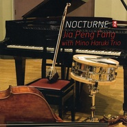

夜想曲NOCTURNE
============================

|  |  |
| :--: | :-- |
| [ 夜想曲NOCTURNE](https://emumo.xiami.com/album/397167) | **艺人**: [贾鹏芳](../index.md) **语种**: 日语 **唱片公司**: 和平之月 **发行时间**: 2007年06月20日 **专辑类别**: 录音室专辑 **专辑风格**: 轻音乐 Easy Listening **播放数**: 47670 **收藏数**: 608 **评论数**: 26  |

## 简介

アルバムを聴きながら、ニヤニヤ笑いが止まらなかった。クラシックの名曲たちが、これほどまでにfun&amp;stylishに生まれ変わるとは・・・。ワクワクするような“East meets West”の絶妙なブレンドは、まったくもって、予期せぬサプライズだった。  
いったいどういう経緯からこの企画が実現したのか。プロデューサーの吉岡一政氏に、アルバムにこめられた思いを伺った。「目指したのはシルキージャズです。今回取り上げたクラシックの名曲は誰もがよく知っている古典中の古典。まさに西洋の貴重なアンティーク作品です。一曲一曲を、華麗な大広間に飾られた家具に例えたとして、その上にシルクの布をふわっとかぶせたら、どんなシルエットが生れるか・・・その着想がこのアルバムの原点です」。  
シルクとはもちろん、東洋を意味する。発祥の地はジャー・パンファン氏の故郷、中国である。東洋の古典楽器と西洋の古典との出会い。“East meets West”の世界観は、そんなファンタジックな着想からさらなる新境地を切り開くこととなった。  
クラシックの名曲を、一皿一皿、音楽グルメも唸るヌーベル・キュイジーヌに料理にしたのが、今年結成27年を迎える「美野春樹トリオ」のリーダー、美野氏である。ピアノプレイヤーとしてはもちろんのこと、作曲家・編曲家としてさまざまなジャンルで活躍を続けてきた。「美野さんはミュージシャンからも絶大な信頼を寄せられるアレンジの天才です。いっぽうのジャーさんは、二胡奏者の天才。そんなふたりの天才がタグを組んだら、どんなアルバムが誕生するのか。そんな楽しみもありましたね」と吉岡氏。両者はここ数年、ライブでも競演、お互いをリスペクトしあう強い信頼関係を築いてきた。ジャー・パンファン氏の曲に対する理解力、表現力はとびぬけており、「それは卓越したテクニックがあってこそ成り立つもの」だという。美野氏はそんな彼の才能をあますところなく引き出そうと、さまざまなアレンジを試みた。  
このアルバムは、既成概念にとらわれず楽しむことをお薦めしたい。ジャズとして聴くにせよ、ポップスとして聴くにせよ、もしくはクラシックとして味わうにせよ、リスナーのお気に召すまま。カテゴリにとらわれない、とことん開かれた“East meets West”の境地。どうやらそれが、天才同士の導き出した答えのようである。   
  
上野まゆこ  

## 曲目

- [夜想曲 Nocturne](./397167/xLr47Ad6216.md)
- [家路 -新世界より-](./397167/b1pPx1f40c85.md)
- [鱒 Trout](./397167/mQ65Jc77cf5.md)
- [月光](./397167/8Gc3wne1df1.md)
- [恋とはどんなものかしら -フィガロの結婚より-](./397167/xLr47Ec2b8a.md)
- [メヌエット -ラヴァーズ・コンチェルト-](./397167/xLr47Fdc8b4.md)
- [夢のあとに](./397167/mQ65Jg8f88f.md)

## 评论

|  |  |  |
| :-- | :-- | :-- |
|  [虾米用户](https://emumo.xiami.com/u/43706189) 音乐唤醒想象力。 2017-11-19 11:48 赞(0) 踩(0) | 
special！
 |
|  [虾米用户](https://emumo.xiami.com/u/238646)  2017-08-03 00:34 赞(0) 踩(0) | 
鸡皮疙瘩！！
 |
|  [虾米用户](https://emumo.xiami.com/u/49787856) 网抑云：名侦探兔美酱0 2016-07-02 00:39 赞(1) 踩(0) | 
夜想曲。。用二胡就感觉像是看老头和老太太调情一样尴尬。。。
 |
| ⇒ |  [虾米用户](https://emumo.xiami.com/u/49787856) 网抑云：名侦探兔美酱0 2020-03-31 11:47 赞(0) 踩(0) | 
三年后再来听忽然有种黄昏恋的感觉&amp;hellip;也不尴尬了反倒挺美好 
 |
|  [虾米用户](https://emumo.xiami.com/u/670090)  2014-07-12 20:05 赞(0) 踩(0) | 
不错，挺有味道的
 |
|  [虾米用户](https://emumo.xiami.com/u/894020)  2014-01-09 00:22 赞(0) 踩(0) | 
夜的曲。
 |
|  [虾米用户](https://emumo.xiami.com/u/24789774)  2013-10-18 17:17 赞(0) 踩(0) | 
好听
 |
|  [虾米用户](https://emumo.xiami.com/u/13974748) 只叙温暖  不言殇 2013-08-11 08:55 赞(0) 踩(0) | 
二胡演奏的这般，good
 |
|  [虾米用户](https://emumo.xiami.com/u/8837352) 「満ちる月、優しい海。」 2013-06-22 01:42 赞(0) 踩(0) | 
棒！new age就是要尝试各种可能性！二胡+jazz真棒！那些说把二胡拉成小提琴的都洗洗睡吧，音色完全不同，味道也不一样好么~~
 |
|  [虾米用户](https://emumo.xiami.com/u/12699814) 用饱满的心情，拥抱整个世 2013-01-26 00:19 赞(0) 踩(0) | 
和平之月里面的吗，喜欢新世纪不需要理由的
 |
|  [虾米用户](https://emumo.xiami.com/u/1075105)   2013-01-11 21:54 赞(0) 踩(0) | 
用二胡演奏《你们可知道什么是爱情》，又加上jazz的渲染，好轻松愉快的气氛啊！！！
 |
|  [虾米用户](https://emumo.xiami.com/u/6905406) 多读书！ 2013-01-04 18:04 赞(0) 踩(0) | 
奇妙~
 |
|  [虾米用户](https://emumo.xiami.com/u/4242636) 爱 2012-12-27 21:19 赞(0) 踩(0) | 
夜想曲NOCTURNE
 |
|  [虾米用户](https://emumo.xiami.com/u/2501563) 云袂风襟。微博：璃夏_K... 2012-12-10 20:21 赞(0) 踩(0) | 
用二胡把古典翻奏成爵士…实在有些接受不能= = 只有算实验音乐了吧
 |
|  [虾米用户](https://emumo.xiami.com/u/1544614)  2012-09-20 15:01 赞(0) 踩(0) | 
二胡+爵士重新演绎古典名曲，这个策划有意思~
 |
|  [虾米用户](https://emumo.xiami.com/u/10483550)  2012-09-03 15:51 赞(0) 踩(0) | 
hao
 |
|  [虾米用户](https://emumo.xiami.com/u/4935919)  2012-06-23 01:17 赞(0) 踩(0) | 
good
 |
|  [虾米用户](https://emumo.xiami.com/u/8218473)  2012-04-08 13:00 赞(0) 踩(0) | 
夜想曲
 |
|  [虾米用户](https://emumo.xiami.com/u/4305889)  2011-11-30 14:53 赞(0) 踩(0) | 
夜想曲
 |
|  [虾米用户](https://emumo.xiami.com/u/1613558)  2011-10-31 18:46 赞(0) 踩(0) | 
二胡用爵士风格演奏了《小夜曲》等西洋传统古典曲目。很高级的crossover味道！！赞！！！支持贾鹏芳。。。
 |
|  [虾米用户](https://emumo.xiami.com/u/5971752)  2011-09-25 15:44 赞(0) 踩(0) | 
爵士的浪漫和二胡的委婉，演绎了一段悠闲的下午茶时光~
 |
|  [虾米用户](https://emumo.xiami.com/u/5834232)  2011-09-17 00:53 赞(0) 踩(0) | 
带爵士风格的二胡。。。
 |
|  [虾米用户](https://emumo.xiami.com/u/5565817)  2011-08-25 10:41 赞(0) 踩(0) | 
优美
 |
|  [虾米用户](https://emumo.xiami.com/u/840126)  2011-05-21 15:40 赞(0) 踩(0) | 
听听
 |
|  [虾米用户](https://emumo.xiami.com/u/3529481)  2011-04-11 19:39 赞(0) 踩(0) | 
只有二胡曲才能诠释我对生活的认识。
 |
|  [虾米用户](https://emumo.xiami.com/u/1342581)  2011-01-31 17:25 赞(0) 踩(0) | 
贾鹏芳
 |
