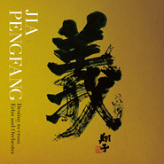

三国志組曲 ~二胡とシンフォニック・オーケストラの出會い~三国志组曲 ~二胡与交响乐团的邂逅~
============================

|  |  |
| :--: | :-- |
| [ 三国志組曲 ~二胡とシンフォニック・オーケストラの出會い~三国志组曲 ~二胡与交响乐团的邂逅~](https://emumo.xiami.com/album/403223) | **艺人**: [贾鹏芳](../index.md) **语种**: 其他 **唱片公司**: Universal Music **发行时间**: 2015年11月18日 **专辑类别**: 录音室专辑 **专辑风格**: 轻音乐 Easy Listening, 中国民乐 Chinese Folk Music **播放数**: 229869 **收藏数**: 1471 **评论数**: 128  |

## 简介

世界著名二胡演奏者贾鹏芳演绎四大名著之一《三国演义》。  
  
「西遊記」や「水滸伝」とならぶ中国を代表する名作として名高い「三国志」。中国のみならず、日本でも小説・漫画・アニメ・テレビゲーム化され、いまだに根強い人気を誇る「三国志」の壮大な世界観を、ジャー・パンファンの二胡と中国国立交響楽団によるオーケストラで見事に再現した作品となりました。  
  
現在BS-TBSにて好評放送中の「こころふれあい紀行〜音と匠の旅」のエンディングテーマ（桃園の契り）や、三重テレビ特別番組「芭蕉が詠む祈りの心」オープニング・エンディングテーマ（出師の表／義よ永遠に）、ボーナストラックとして、2014年までBS11にて放送された「Net's Professionals〜ハートフルメッセージ」のオープニングテーマ曲（冬至）を加えた全10曲を収録しています。  
  
世界を股に掛けて活動する二胡奏者、ジャー・パンファン(賈鵬芳)が歴史書『三国志』をフィーチャーしたCD。西洋も東洋も超越した清々しい柔らかさと評されるジャー・パンファンが、シンフォニック・オーケストラと共に組曲仕立てで壮大なストーリーとスペクタクルを持つ『三国志』の世界 を表現する作品。

## 曲目

- [孔明無常](./403223/bCkXQ9w48bff.md)
- [桃園の契り](./403223/xLEYRub0c64.md)
- [ホウ統あはれ](./403223/8GzXFWfaf15.md)
- [關羽儚く](./403223/xLEYRyc2d8f.md)
- [張飛花と散る](./403223/mQUacQe1896.md)
- [出師の表](./403223/8GzXGc1b91c.md)
- [嗚呼主君](./403223/xLEYR4a3146.md)
- [天に奉ずる](./403223/mQUacW6ee00.md)
- [義よ永遠に](./403223/xLEYR812472.md)
- [冬至 ~光の束の中で~Bonus Track](./403223/xLEYRA10997.md)

## 评论

|  |  |  |  |
| :-- | :-- | :-- | :-- |
|  [虾米用户](https://emumo.xiami.com/u/113821962)  2019-09-21 12:11 赞(0) 踩(0) | 
就是喜欢，没有道理可言！
 |
|  [虾米用户](https://emumo.xiami.com/u/308009730) 唉╯﹏╰ 2018-10-18 20:11 赞(0) 踩(0) | 
五星好评
 |
|  [虾米用户](https://emumo.xiami.com/u/13444318)  2018-09-15 12:20 赞(0) 踩(0) | 
《孔明無常》：小白菜呀～地里黄呀～两三岁呀～没了娘呀～
 |
|  [虾米用户](https://emumo.xiami.com/u/299649174)  2018-03-08 18:18 赞(0) 踩(0) | 
个人觉得这张专辑在同一时期里，不管编曲，还是演奏者，都是一级棒
 |
|  [虾米用户](https://emumo.xiami.com/u/37643181)  2017-10-28 00:38 赞(0) 踩(0) | 
从和平之月开始认识的贾鹏芳。最喜欢睡莲。
 |
|  [虾米用户](https://emumo.xiami.com/u/37576635) 我还没想好要写什么... 2017-05-16 11:20 赞(3) 踩(0) | 
内容已删除
 |
| ⇒ |  [虾米用户](https://emumo.xiami.com/u/8651036) You will nev... 2017-09-18 13:24 赞(0) 踩(0) | 
赞同~
 |
| ⇒ |  [虾米用户](https://emumo.xiami.com/u/13194141) 看到的给我来个联络方式。... 2017-09-21 22:09 赞(0) 踩(0) | 
<q><b>说：</b></q>
 |
|  [虾米用户](https://emumo.xiami.com/u/54348684) 只能像一朵向日葵在夜里默... 2016-11-19 23:59 赞(0) 踩(0) | 
  
 |
|  [虾米用户](https://emumo.xiami.com/u/2130210)  2016-11-14 23:49 赞(0) 踩(0) | 
马一张
 |
|  [虾米用户](https://emumo.xiami.com/u/4724469) 风回重楼。 2016-10-02 16:04 赞(3) 踩(0) | 
编曲不中国味的三国，也是另一种演绎与诠释。用日文没什么可争议的……女子十二乐坊在日本出名可见一斑。
 |
|  [虾米用户](https://emumo.xiami.com/u/8116842)  2016-07-18 16:31 赞(0) 踩(0) | 
确实别有一番风味
 |
|  [虾米用户](https://emumo.xiami.com/u/12709334) 像假的一樣，像做夢一樣。 2016-05-12 23:37 赞(0) 踩(0) | 
没有写给孟德的吗。
 |
|  [虾米用户](https://emumo.xiami.com/u/3753790)  2016-04-13 11:21 赞(0) 踩(0) | 
好悲伤的一系列曲...
 |
|  [虾米用户](https://emumo.xiami.com/u/46022056)  2016-04-05 16:30 赞(0) 踩(0) | 
别人早就超越我们了，这些东西我们应该多激起传统的创新
 |
|  [虾米用户](https://emumo.xiami.com/u/43385631) —突破五行山— 2016-03-23 01:38 赞(0) 踩(0) | 
义者至善。
 |
|  [虾米用户](https://emumo.xiami.com/u/43229790)  2016-02-07 00:16 赞(1) 踩(0) | 
贾鹏芳我炸了!!!
 |
|  [虾米用户](https://emumo.xiami.com/u/50057380)  2016-01-29 14:39 赞(0) 踩(0) | 
三国志11
 |
|  [虾米用户](https://emumo.xiami.com/u/18114091)  2016-01-28 16:08 赞(3) 踩(0) | 
贾老湿 我不愿意相信第一首编曲是你的意思……
 |
|  [虾米用户](https://emumo.xiami.com/u/12098450) 曲的情 2016-01-13 19:08 赞(1) 踩(0) | 
去你隔壁  孔明是小白菜 吐  你家这叫哪门子三国！！一个大白菜梆子拍死你！
 |
|  [虾米用户](https://emumo.xiami.com/u/17943175) 不見紅顏彈指老，無悔蒼天... 2015-12-21 21:23 赞(1) 踩(0) | 
孔明無常，開始這樣熟，原來是小白菜。。。
 |
|  [虾米用户](https://emumo.xiami.com/u/16939353) 就此别过，虾友们！ 2015-12-19 17:58 赞(0) 踩(0) | 
中国风、古典范
 |
|  [虾米用户](https://emumo.xiami.com/u/6361118) 黑洞無始終，音樂無疆界 2015-12-07 23:50 赞(4) 踩(0) | 
二胡+交响+三国，这本该是个万无一失的必胜组合，第一首孔明小白菜出来却把所有人雷得里焦外嫩，画风不对啊贾老湿！专辑后半还算不错，可惜第一印象太深已经回天乏力。嗣音奏多和西山勝两个日本人可以不知道小白菜，但贾鹏芳你不可能不懂啊！你自己拉的时候都不觉得别扭么？
 |
|  [虾米用户](https://emumo.xiami.com/u/42179454)  2015-12-03 14:13 赞(0) 踩(0) | 
小白菜。。。
 |
|  [虾米用户](https://emumo.xiami.com/u/164599) 打死我!我想死! 2015-11-30 13:23 赞(0) 踩(0) | 
!!
 |
|  [虾米用户](https://emumo.xiami.com/u/164599) 打死我!我想死! 2015-11-30 13:23 赞(0) 踩(0) | 
!!
 |
|  [虾米用户](https://emumo.xiami.com/u/87593626)  2015-11-30 11:14 赞(0) 踩(0) | 
日本为什么能入侵中国
 |
|  [虾米用户](https://emumo.xiami.com/u/1341479)  2015-11-26 13:27 赞(0) 踩(0) | 
恭喜贾老师又出新专辑，古风很喜欢。
 |
|  [虾米用户](https://emumo.xiami.com/u/2959963) . 2015-11-24 21:02 赞(15) 踩(0) | 
看到一些评论，有必要来几句：1:这张专辑其他二胡手（eg陈敏）来演奏同样成功—如果无法分辨各家长短，那么可能也就听个开心了。每首编曲都有个众里寻她，贾先生的二胡里面有的，他人不一定有。我相信这里喜欢他的人，还是比较能听出他的区别来，我就不献丑了。2: 日本人出的游戏不用日文用什么？听个音乐都要讲究历史仇恨国别家愁来，那世界上大部分好音乐跟你没有缘分了，慢走不送，好好听QQ音乐榜。3:结合游戏来看，编曲，演奏都很良心。中国人可能适应不了小白菜，因为我们已经固化了它的曲意。对于外国人来说并非如此，它的曲调有了新的可能性，这是很有意思的。最喜欢义之永存-贾先生的二胡大气。
 |
| ⇒ |  [虾米用户](https://emumo.xiami.com/u/6361118) 黑洞無始終，音樂無疆界 2015-12-07 23:56 赞(0) 踩(0) | 
这张专辑和游戏有什么关系？
 |
| ⇒ |  [虾米用户](https://emumo.xiami.com/u/2959963) . 2015-12-08 11:47 赞(0) 踩(0) | 
<q><b>宇文宙说：</b></q>
 |
|  [虾米用户](https://emumo.xiami.com/u/37824725)  2015-11-23 20:32 赞(1) 踩(0) | 
诸葛白菜的无常
 |
|  [虾米用户](https://emumo.xiami.com/u/37824725)  2015-11-23 20:25 赞(0) 踩(0) | 
确定不是小白菜。。。
 |
|  [虾米用户](https://emumo.xiami.com/u/7969730)  2015-11-22 16:48 赞(0) 踩(0) | 
被小白菜刷新了三观……三国志还能这样……整张CD都有种悲悯的基调。这不叫三国志，这叫三国怀古。
 |
|  [虾米用户](https://emumo.xiami.com/u/42636586) 隔海相望的时候最好 2015-11-22 08:27 赞(0) 踩(0) | 
赞
 |
|  [虾米用户](https://emumo.xiami.com/u/51741489)  2015-11-22 03:28 赞(0) 踩(0) | 
I like it!
 |
|  [虾米用户](https://emumo.xiami.com/u/10200698) NOW OR NEVER 2015-11-21 19:41 赞(1) 踩(0) | 
贾鹏芳老师的新专，已经循环了好几天，一如既往的水准。可能关于三国的音乐给我的印象太深刻了，而这张过于细腻，感觉不是很“三国”，但是曲子整体真的很棒。（不讨论第一首我们还是好朋友……）
 |
|  [虾米用户](https://emumo.xiami.com/u/52531506) I need some ... 2015-11-21 10:32 赞(0) 踩(0) | 
听完我和我猫都炸了
 |
|  [虾米用户](https://emumo.xiami.com/u/634922) 爱好无机感 2015-11-21 07:06 赞(0) 踩(0) | 
希望有朝一日贾鹏芳还会为游戏作曲。
 |
|  [虾米用户](https://emumo.xiami.com/u/50313042)  2015-11-21 01:38 赞(1) 踩(0) | 
必须出来评一下咯，日本国真是无处不泄露他们的＂拿来主义＂，把大中国的小白莱裹层寿司就说是他们出品的咯。难怪身边懂行的都说日本买回来的东西90％的基因都是我大中国出去的。
 |
| ⇒ |  [虾米用户](https://emumo.xiami.com/u/23652055) 永远不要放弃对生活的信念... 2015-11-21 03:05 赞(0) 踩(0) | 
不好意思，这张专辑的作曲人是贾鹏芳，被国内氛围逼走的中国二胡大师。
 |
| ⇒ |  [虾米用户](https://emumo.xiami.com/u/23652055) 永远不要放弃对生活的信念... 2015-11-21 03:07 赞(0) 踩(0) | 
他去了哪里呢，你瞧不起的日本。
 |
| ⇒ |  [虾米用户](https://emumo.xiami.com/u/2701140)  2015-11-21 17:55 赞(0) 踩(0) | 
<q><b>散尘说：</b></q>
 |
| ⇒ |  [虾米用户](https://emumo.xiami.com/u/23652055) 永远不要放弃对生活的信念... 2015-11-22 02:16 赞(0) 踩(0) | 
<q><b>Kloisiie说：</b></q>
 |
| ⇒ |  [虾米用户](https://emumo.xiami.com/u/2701140)  2015-11-22 12:06 赞(0) 踩(0) | 
<q><b>散尘说：</b></q>
 |
| ⇒ |  [虾米用户](https://emumo.xiami.com/u/23652055) 永远不要放弃对生活的信念... 2015-11-23 01:12 赞(0) 踩(0) | 
<q><b>Kloisiie说：</b></q>
 |
|  [虾米用户](https://emumo.xiami.com/u/41066502) 我还没想好要写什么... 2015-11-20 17:27 赞(0) 踩(0) | 
有点细腻过了
 |
|  [虾米用户](https://emumo.xiami.com/u/6163936) 想明白了点事儿 2015-11-20 15:50 赞(0) 踩(0) | 
上来就是小白菜╮(╯▽╰)╭
 |
|  [虾米用户](https://emumo.xiami.com/u/877474)  2015-11-20 14:41 赞(0) 踩(0) | 
是明年发售的三国志13的背景音乐吗
 |
| ⇒ |  [虾米用户](https://emumo.xiami.com/u/9909838) 签名什么的也不能浪费不是 2015-11-20 18:50 赞(0) 踩(0) | 
不是……好像是个节目的背景音乐
 |
|  [虾米用户](https://emumo.xiami.com/u/12076161) 兼容古典和嘻哈 2015-11-20 13:06 赞(0) 踩(0) | 
一口气听完，曲风确实很宏大编排也很华丽，但是日本味太浓缺少三国感个人认为还是古琴最适合三国
 |
|  [虾米用户](https://emumo.xiami.com/u/12076161) 兼容古典和嘻哈 2015-11-20 12:43 赞(8) 踩(0) | 
国人在异国找到发展的沃土，也是挺唏嘘的
 |
|  [虾米用户](https://emumo.xiami.com/u/4812681)  2015-11-20 11:34 赞(0) 踩(0) | 
小白菜和孔明无常啥关系？第一首听不下去鸟 
 |
|  [虾米用户](https://emumo.xiami.com/u/34400097)  2015-11-20 11:11 赞(0) 踩(0) | 
还是更喜欢光荣三国志11的原声
 |
|  [虾米用户](https://emumo.xiami.com/u/325032)  2015-11-20 10:21 赞(35) 踩(0) | 
这么多人听就没一个人关心下音乐人本身？贾鹏芳老师在日本发展，他的专辑本来面对的就是日本市场，这是在国外市场上买的东西，写中文？能把本国文化向外传播需要那么在乎一个标签吗？古诗词在国外市场上也得翻译成当地文字，一个日文标题就能让一群人说三道四
 |
| ⇒ |  [虾米用户](https://emumo.xiami.com/u/9909838) 签名什么的也不能浪费不是 2015-11-20 18:50 赞(0) 踩(0) | 
终于看到一个明白人……
 |
| ⇒ |  [虾米用户](https://emumo.xiami.com/u/293753731)  2017-09-09 11:37 赞(0) 踩(0) | 
是啊是啊，美国人看了一下文字标签，原来是日本的东西，日本文化还是挺有意思的，算了还是保保它吧。再过个几百上千年，连三国志都变成别人的啦。我到现在还记得读中学的时候，语文课本上有一篇课文《最后一课》，我觉得你该去拜读一下，你再来跟我们这样的粪青谈文化吧。
 |
| ⇒ |  [虾米用户](https://emumo.xiami.com/u/259707334) 女性向，欧美… 2018-03-19 21:55 赞(0) 踩(0) | 
<q><b>未知生物说：</b></q>
 |
|  [虾米用户](https://emumo.xiami.com/u/9909838) 签名什么的也不能浪费不是 2015-11-20 10:18 赞(1) 踩(0) | 
评论说为啥标题是日文的，这碟本身就是在日本卖的吧……
 |
|  [虾米用户](https://emumo.xiami.com/u/2597743) 人生五十年,如梦亦如幻, 2015-11-20 09:49 赞(0) 踩(0) | 
欺负日本人没听过小白菜啊，哈哈哈哈~~~咱不能这样~~~~
 |
|  [虾米用户](https://emumo.xiami.com/u/46235090)  2015-11-20 09:23 赞(2) 踩(0) | 
耐着性子听完这组《三国志组曲》，除了贾大师精湛的二胡演奏和《出师表》有点三国的韵味外，其它的太令人失望：第一，好好的《三国志组曲》，曲目为啥要用日文，可以说不伦不类的；第二，编曲和配器吵杂，难以入耳；其三，开篇曲太不严肃了，用那么熟悉的民歌来冠名《孔明无常》，真叫人难以接受；其四，大师如果没事做，要表现自己精湛的技艺，还是好好演奏《二泉映月》吧，但不要再用日文哈；其五，大师最令人难忘、久听不厌的只有《睡莲》了。
 |
| ⇒ |  [虾米用户](https://emumo.xiami.com/u/9909838) 签名什么的也不能浪费不是 2015-11-20 10:15 赞(0) 踩(0) | 
你用耐着性子的态度去听东西当然得不到什么
 |
| ⇒ |  [虾米用户](https://emumo.xiami.com/u/4724469) 风回重楼。 2016-10-02 15:58 赞(0) 踩(0) | 
用日文怎么了……说得好像用中文了就能红遍大江南北似的。
 |
|  [虾米用户](https://emumo.xiami.com/u/6831506)  2015-11-20 05:10 赞(1) 踩(0) | 
哦妈呀，这小白菜是什么鬼，孔明心里苦
 |
|  [虾米用户](https://emumo.xiami.com/u/31082710)   2015-11-20 02:19 赞(0) 踩(0) | 
新碟。
 |
|  [虾米用户](https://emumo.xiami.com/u/5806141)  2015-11-19 23:21 赞(1) 踩(0) | 
我不喜欢这张
 |
|  [虾米用户](https://emumo.xiami.com/u/4260538) 我还没想好要写什么... 2015-11-19 23:17 赞(0) 踩(0) | 
看我刷出什么了
 |
|  [虾米用户](https://emumo.xiami.com/u/1700002) V5_ORZZZZZ 2015-11-19 22:33 赞(0) 踩(0) | 
大好评09 義よ永遠に10 冬至 ~光の束の中で~
 |
|  [虾米用户](https://emumo.xiami.com/u/55053659) 休闲养生，随心所欲 2015-11-19 22:18 赞(0) 踩(0) | 
出新砖了！！帅～
 |
|  [虾米用户](https://emumo.xiami.com/u/25967907) 什么都听的杂食动物一枚 2015-11-19 21:23 赞(0) 踩(0) | 
看了你们的评论哈哈哈哈哈哈哈哈哈哈哈哈哈哈我去听一听
 |
|  [虾米用户](https://emumo.xiami.com/u/61570400)  2015-11-19 20:43 赞(1) 踩(0) | 
对啊，为毛是日文
 |
|  [虾米用户](https://emumo.xiami.com/u/2911077)  2015-11-19 19:32 赞(2) 踩(0) | 
诸葛君果然无常，原来还有过小白菜的心酸苦事，乃武他还好吗？
 |
|  [虾米用户](https://emumo.xiami.com/u/73547436)  2015-11-19 19:15 赞(0) 踩(0) | 
为毛是日文 
 |
|  [虾米用户](https://emumo.xiami.com/u/8849536) 隽存三分侠义 常怀赤子之... 2015-11-19 18:16 赞(0) 踩(0) | 
三国志之武将悲情篇…
 |
|  [虾米用户](https://emumo.xiami.com/u/20928371)  2015-11-19 17:51 赞(0) 踩(0) | 
耶！
 |
|  [虾米用户](https://emumo.xiami.com/u/24345242) 爱谁谁 2015-11-19 17:24 赞(0) 踩(0) | 

 |
|  [虾米用户](https://emumo.xiami.com/u/8244559)  2015-11-19 16:51 赞(0) 踩(0) | 
******
 |
|  [虾米用户](https://emumo.xiami.com/u/8622623)  2015-11-19 16:31 赞(1) 踩(0) | 
诸葛白菜……
 |
|  [虾米用户](https://emumo.xiami.com/u/60385186)  2015-11-19 16:09 赞(1) 踩(0) | 
垃圾，偷换概念，羊头卖狗肉。
 |
|  [虾米用户](https://emumo.xiami.com/u/8423470) 愛音樂 愛生活~ 2015-11-19 15:53 赞(0) 踩(0) | 
小白菜……各种乱入……
 |
|  [虾米用户](https://emumo.xiami.com/u/58589754) 一期一会 2015-11-19 15:02 赞(0) 踩(0) | 
新砖收了～～  
 |
|  [虾米用户](https://emumo.xiami.com/u/3609825) 行乐亦如此，万事东流水 2015-11-19 14:48 赞(2) 踩(0) | 
孔明以清新小白菜出场，笑得不行……
 |
|  [虾米用户](https://emumo.xiami.com/u/5633735) 我还没想好要写什么... 2015-11-19 14:07 赞(0) 踩(0) | 
孔明是棵小白菜
 |
|  [虾米用户](https://emumo.xiami.com/u/1017492)  2015-11-19 13:24 赞(0) 踩(0) | 
沂蒙山小调吗～
 |
|  [虾米用户](https://emumo.xiami.com/u/10383422)  2015-11-19 13:24 赞(0) 踩(0) | 
开头一听以为是白毛女
 |
|  [虾米用户](https://emumo.xiami.com/u/36154530) 呼哈～ 2015-11-19 13:05 赞(3) 踩(0) | 
孔明和小白菜不可不说的故事电视剧OST
 |
|  [虾米用户](https://emumo.xiami.com/u/8220520) Heavenly 2015-11-19 12:50 赞(0) 踩(0) | 
第九也好赞
 |
|  [虾米用户](https://emumo.xiami.com/u/4487129)  2015-11-19 12:47 赞(1) 踩(0) | 
小白菜呀～地里黄呀～两三岁呀～没了娘呀～。。。。。
 |
|  [虾米用户](https://emumo.xiami.com/u/8220520) Heavenly 2015-11-19 12:44 赞(0) 踩(0) | 
怎么有种管弦乐很好听的赶脚
 |
|  [虾米用户](https://emumo.xiami.com/u/42673563)  2015-11-19 12:39 赞(0) 踩(0) | 

 |
|  [虾米用户](https://emumo.xiami.com/u/48068917) AmazingGrace 2015-11-19 12:31 赞(0) 踩(0) | 
贾叔出新砖了，好激动。
 |
|  [虾米用户](https://emumo.xiami.com/u/1670510) 职业黑 2015-11-19 12:30 赞(3) 踩(0) | 
没意思，听了半天一首人唱的都没有！如果让TFBOYS来演唱，肯定能红遍大江南北。
 |
| ⇒ |  [虾米用户](https://emumo.xiami.com/u/8220520) Heavenly 2015-11-19 12:45 赞(0) 踩(0) | 
职业黑
 |
| ⇒ |  [虾米用户](https://emumo.xiami.com/u/10893417) 给我丰富，和丰富的痛苦。 2015-11-19 14:54 赞(0) 踩(0) | 
天啊，亲，贾鹏芳本身就是搞器乐的，他的专辑都是纯音乐。再说，他在一部分人心中，已经是大师级的人物了，比如说我！
 |
| ⇒ |  [虾米用户](https://emumo.xiami.com/u/2684973) 暂无签名~ 2015-11-19 23:07 赞(0) 踩(0) | 
高端黑
 |
| ⇒ |  [虾米用户](https://emumo.xiami.com/u/4724469) 风回重楼。 2016-10-02 15:56 赞(0) 踩(0) | 
呵呵。
 |
|  [虾米用户](https://emumo.xiami.com/u/8220520) Heavenly 2015-11-19 12:28 赞(0) 踩(0) | 
关羽那首还不错
 |
|  [虾米用户](https://emumo.xiami.com/u/1700002) V5_ORZZZZZ 2015-11-19 12:26 赞(0) 踩(0) | 
看到三国就无法淡定了内牛满面
 |
|  [虾米用户](https://emumo.xiami.com/u/51631029)   2015-11-19 12:24 赞(0) 踩(0) | 
，
 |
|  [虾米用户](https://emumo.xiami.com/u/606760) 魂牵一线 2015-11-19 12:05 赞(0) 踩(0) | 
听
 |
|  [虾米用户](https://emumo.xiami.com/u/4106767) 却道天凉好个秋 2015-11-19 12:03 赞(0) 踩(0) | 
悲曲啊
 |
|  [虾米用户](https://emumo.xiami.com/u/10360077) 同人/v系/电子/术 雷... 2015-11-19 11:59 赞(0) 踩(0) | 
小白菜
 |
|  [虾米用户](https://emumo.xiami.com/u/35714345) 暂无签名~ 2015-11-19 11:53 赞(3) 踩(0) | 
因为平时很少听民间乐器的演奏，只是抱着听下试试的节奏点开了这张专辑，想着能坚持听完3首就不错了，结果却一路听到了最后。二胡的存在感仍然强烈，但却因曲风和编曲，在听的过程中渐渐淡忘了其实是在听民乐演奏这么一回事，随着有情节感的调调而慢慢接受了它。
 |
|  [虾米用户](https://emumo.xiami.com/u/10580571) 世界唯一不变的是一直在变 2015-11-19 11:52 赞(0) 踩(0) | 
很无聊
 |
|  [虾米用户](https://emumo.xiami.com/u/7872701) 多一份远见，就少一分刺激 2015-11-19 11:42 赞(0) 踩(0) | 
.
 |
|  [虾米用户](https://emumo.xiami.com/u/8383486) 暂无签名~ 2015-11-19 11:41 赞(0) 踩(0) | 
小白菜啊…
 |
|  [虾米用户](https://emumo.xiami.com/u/41986308) 凡事只能靠自己。 2015-11-19 11:38 赞(0) 踩(0) | 
先收藏，有空慢慢听~
 |
|  [虾米用户](https://emumo.xiami.com/u/20877222) 我在未来等你。     ... 2015-11-19 11:23 赞(0) 踩(0) | 

 |
|  [虾米用户](https://emumo.xiami.com/u/15452208) 虾米是这几年唯一的听歌软... 2015-11-19 11:06 赞(0) 踩(0) | 

 |
|  [虾米用户](https://emumo.xiami.com/u/721990)  2015-11-19 11:04 赞(0) 踩(0) | 
惊喜
 |
|  [虾米用户](https://emumo.xiami.com/u/7365010) 超然 2015-11-19 11:00 赞(1) 踩(0) | 
改在环球唱片了，比和月时期风格有些不同，但这张的曲风还是可以的，虽然略带伤感。
 |
| ⇒ |  [虾米用户](https://emumo.xiami.com/u/37643181)  2015-11-19 16:33 赞(0) 踩(0) | 
喜欢和月
 |
|  [虾米用户](https://emumo.xiami.com/u/6443382)  2015-11-19 10:59 赞(0) 踩(0) | 
顶起
 |
|  [虾米用户](https://emumo.xiami.com/u/29465904)  2015-11-19 10:48 赞(46) 踩(0) | 
第一首响起，喷了，小白菜。。。。。。地里黄啊。。。。。
 |
|  [虾米用户](https://emumo.xiami.com/u/15477519) 爱  是生命的和弦，而不... 2015-11-19 10:46 赞(1) 踩(0) | 
老师的佳作必须要珍藏…顶起…
 |
|  [虾米用户](https://emumo.xiami.com/u/12688181) 尋人啟事 2015-11-19 10:45 赞(1) 踩(0) | 
谁来给翻译一下嘿
 |
| ⇒ |  [虾米用户](https://emumo.xiami.com/u/32085761) 俊琪小号 2015-11-21 07:52 赞(0) 踩(0) | 
用软件翻译出来大概就是这个意思01孔明无常02桃园结义的誓言03庞统遇难04关羽的梦境05张飞的凋零06出师表07主公 呜呼哀哉08天奉09义气永存10冬至 光束中
 |
|  [虾米用户](https://emumo.xiami.com/u/4245968) 时光不会辜负你 2015-11-19 10:43 赞(0) 踩(0) | 
五感回归～
 |
|  [虾米用户](https://emumo.xiami.com/u/84471102)  2015-11-19 10:36 赞(0) 踩(0) | 

 |
|  [虾米用户](https://emumo.xiami.com/u/8650117)  2015-11-19 10:33 赞(1) 踩(0) | 
贾老师这次的作品还算中规中矩，个人感觉以孔明的義为主题的音乐作品，从开始的第一首音乐作品就已经预示了孔明这一生的悲剧，鞠躬尽瘁死而后已中心就是忠义二字，虽出师未捷身先死，但他们的故事会永远流传下去，这是我对这张专辑所传递的感受
 |
|  [虾米用户](https://emumo.xiami.com/u/4267207)  2015-11-19 10:28 赞(0) 踩(0) | 
贾鹏芳的二胡配管弦乐，新鲜的感觉
 |
|  [虾米用户](https://emumo.xiami.com/u/225604)  2015-11-19 10:24 赞(1) 踩(0) | 
第一曲算是抄袭么？
 |
|  [虾米用户](https://emumo.xiami.com/u/710597) 真正的美无需隐藏。 2015-11-19 10:10 赞(0) 踩(0) | 
小白菜呀，地里黄呀。
 |
|  [虾米用户](https://emumo.xiami.com/u/6944)  2015-11-19 10:01 赞(15) 踩(0) | 
北风那个吹～雪花那个飘～雪花那个飘飘～年来到～小白菜呀～地里黄呀～两三岁呀～没了娘呀～
 |
| ⇒ |  [虾米用户](https://emumo.xiami.com/u/8650117)  2015-11-19 10:05 赞(0) 踩(0) | 
那个是小白菜 哈哈
 |
|  [虾米用户](https://emumo.xiami.com/u/3077191)   2015-11-19 09:57 赞(0) 踩(0) | 
收藏
 |
|  [虾米用户](https://emumo.xiami.com/u/8475225)  2015-11-19 09:49 赞(0) 踩(0) | 
lllllllllllllllllll
 |
|  [虾米用户](https://emumo.xiami.com/u/203227) 在隔壁云村活动，这里只剩... 2015-11-19 09:48 赞(0) 踩(0) | 
哇哦
 |
|  [虾米用户](https://emumo.xiami.com/u/114534)  2015-11-19 09:36 赞(0) 踩(0) | 
nice
 |
