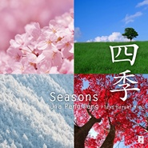

四季Seasons / シーズンズ
============================

|  |  |
| :--: | :-- |
| [ 四季Seasons / シーズンズ](https://emumo.xiami.com/album/434490) | **艺人**: [贾鹏芳](../index.md) **语种**: 日语 **唱片公司**: 和平之月 **发行时间**: 2011年03月23日 **专辑类别**: 录音室专辑 **专辑风格**: 轻音乐 Easy Listening **播放数**: 107823 **收藏数**: 1222 **评论数**: 90  |

## 简介

賈鵬芳の一年半ぶりのオリジナルアルバム”四季”このアルバムは「芳春」「夏色の風」「深山秋冷」「雪花」など四季をテーマにした情緒溢れるアルバム！！  
四季をテーマにした「芳春」「夏色の風」「深山秋冷」「雪花」そしてジャーパンファンのアルバム「月光」のアルバムタイトルにもなり演奏会で常に人気のある美野氏作曲の「月光」をコンサートで演奏しているピアノ、チェロ、ギターバージョンで収録。また二胡とチェロという珍しい編成のデュエット曲「鳥の歌」など、演奏会場で好評な曲をコンサートと同じ二胡、ピアノ、チェロ、ギターの編成で収録。  
芳春  
おだやかな日射しが遠くの山肌を薄紫色に染め、空気が徐々に暖かくなる頃。そんな風景をジャーパンファン氏の二胡の音色に乗せて書いた曲です。中間部には雪解けを思わせるようなフレーズも聞こえて来ませんか？  
深山秋冷  
Gマーラーの「大地の歌」の第二楽章（秋に寂しきもの）に感化されて作曲。（因みにこのマーラーの交響曲は中国の李太白、孟浩然、王維等の詩が元になって作られています。）まさに晩秋の山々の中を静かに歩くイメージで曲は進んでいきます。途中堀沢真己氏によるチェロのバルトーク・ピチカート（弦を指で引っ張って離し指盤にぶつける奏法）が強い衝撃音でよりいっそう曲の寂寥感を高めています。  
月光(New Version)  
数年前のアルバムの中の「月光」のニューヴァージョンとして編曲しました。原曲のイメージを損なわないように、それでいて又ちがった「月光」を目指しました。ここでは益田和嘉子さんの効果的なパーカッションが聞かれます。伴奏や楽器の編成のちがいによって、新たなインスピレーションを受けてのジャー氏の更なる深い音の世界をどうぞお楽しみ下さい。

## 曲目

- [芳春Fang chun / ふぁんちゅん](./434490/xLtqQcbc12f.md)
- [夏色の風なついろのかぜ / A Breeze Of Summer](./434490/mQ8sb35e473.md)
- [深山秋冷しんざんしゅうれい / Late Autumn](./434490/8GepEEf991b.md)
- [雪花Snow Flower / せっか](./434490/mQ8sb57eedd.md)
- [月光 (New Version)げっこう / Moonlight](./434490/JAPo3q1f923.md)
- [鳥の歌El Cant dels Ocells / とりのうた](./434490/mQ8sb74b494.md)
- [香菫に寄せてSweet Violet / においすみれによせて](./434490/mQ8sb857501.md)
- [白鳥Le Cygne / はくちょう](./434490/U5AnrT450dc.md)

## 评论

|  |  |  |  |
| :-- | :-- | :-- | :-- |
|  [虾米用户](https://emumo.xiami.com/u/301947385) 清明不语   2018-07-27 14:43 赞(0) 踩(0) | 
大地像裁缝，它常常给自己做着衣裳：春天对襟的翠绿，夏天无袖的火红，秋天圆领的金黄，冬天垫肩的雪白。&amp;mdash;&amp;mdash;车前子
 |
|  [虾米用户](https://emumo.xiami.com/u/7246378) 酒腻子 2016-09-14 15:10 赞(0) 踩(0) | 
四季，与你共赏，好在是东西而不是南北半球。
 |
|  [虾米用户](https://emumo.xiami.com/u/41930258)  2015-06-19 22:28 赞(0) 踩(0) | 
Moving~~~~   好感人的音乐
 |
|  [虾米用户](https://emumo.xiami.com/u/49345195) あなたを あなたを好きに... 2015-04-20 22:29 赞(0) 踩(0) | 
名字已经好吸引
 |
|  [虾米用户](https://emumo.xiami.com/u/4339107)  2015-02-11 21:50 赞(0) 踩(0) | 
念念不忘
 |
|  [虾米用户](https://emumo.xiami.com/u/20790983)  2014-12-15 19:45 赞(1) 踩(0) | 
^^^^^^^
 |
|  [虾米用户](https://emumo.xiami.com/u/7937244)  2014-10-23 22:09 赞(0) 踩(0) | 
@Maddy 另一个四季
 |
|  [虾米用户](https://emumo.xiami.com/u/6987547)  2014-10-05 15:13 赞(0) 踩(0) | 
清澈与纯净
 |
|  [虾米用户](https://emumo.xiami.com/u/203227) 在隔壁云村活动，这里只剩... 2014-09-07 20:09 赞(0) 踩(0) | 
<a href="http://emumo.xiami.com/u/4275776" target="_blank" rel="nofollow" name_card="4275776">@320K专门店</a>
 |
|  [虾米用户](https://emumo.xiami.com/u/20685303)  2014-04-20 21:43 赞(1) 踩(0) | 
因睡莲而喜欢她的作品！
 |
|  [虾米用户](https://emumo.xiami.com/u/32113283)  2014-02-12 22:00 赞(0) 踩(0) | 
平靜心靈
 |
|  [虾米用户](https://emumo.xiami.com/u/25109310)  2013-12-14 15:35 赞(0) 踩(0) | 
已經不知道要怎麼說了就是好聽
 |
|  [虾米用户](https://emumo.xiami.com/u/8065980) 暂无签名~ 2013-11-06 22:10 赞(0) 踩(0) | 
四季Seasons;シーズンズ
 |
|  [虾米用户](https://emumo.xiami.com/u/6546882)  2013-10-19 17:38 赞(0) 踩(0) | 
舒缓
 |
|  [虾米用户](https://emumo.xiami.com/u/9134017)  2013-09-21 10:44 赞(0) 踩(0) | 
好听
 |
|  [虾米用户](https://emumo.xiami.com/u/21414062) Lgary 2013-09-15 13:15 赞(0) 踩(0) | 
音樂優美
 |
|  [虾米用户](https://emumo.xiami.com/u/7794508) 我还没想好要写什么... 2013-07-10 21:53 赞(0) 踩(0) | 
听贾鹏芳的演奏会爱上二胡 有一首silent moon最经典
 |
|  [虾米用户](https://emumo.xiami.com/u/1186551)   2013-04-30 19:19 赞(0) 踩(0) | 
好听
 |
|  [虾米用户](https://emumo.xiami.com/u/4412959) fresh steame... 2013-03-06 21:50 赞(1) 踩(0) | 
诶,聽著聽著就突然好想看一場雪,桃李年華的我,居然未曾真正看過一場雪...
 |
|  [虾米用户](https://emumo.xiami.com/u/8453498)  2013-01-04 15:32 赞(0) 踩(0) | 
喜欢它的味道
 |
|  [虾米用户](https://emumo.xiami.com/u/11306704) 嗑瓜子 2013-01-03 15:36 赞(0) 踩(0) | 
看日升日落，听四季如歌
 |
|  [虾米用户](https://emumo.xiami.com/u/618871) 行在长安城  时常背包客 2012-09-18 11:06 赞(0) 踩(0) | 
喜欢贾鹏芳的二胡曲
 |
|  [虾米用户](https://emumo.xiami.com/u/618871) 行在长安城  时常背包客 2012-09-18 11:06 赞(0) 踩(0) | 
独特的二胡曲，特立独行的贾鹏芳。。收藏了
 |
|  [虾米用户](https://emumo.xiami.com/u/10647937)  2012-09-17 13:38 赞(0) 踩(0) | 
日升日落，日月如梭，四季更改，心如止水
 |
|  [虾米用户](https://emumo.xiami.com/u/9346718)  2012-09-04 12:23 赞(0) 踩(0) | 
纯音乐
 |
|  [虾米用户](https://emumo.xiami.com/u/10093813) 我还没想好要写什么... 2012-08-31 12:57 赞(1) 踩(0) | 
听贾鹏芳的音乐，灵魂都干净起来。
 |
|  [虾米用户](https://emumo.xiami.com/u/9436564) 音乐中低眉，思绪轻扬，浅 2012-08-20 17:50 赞(0) 踩(0) | 
大爱
 |
|  [虾米用户](https://emumo.xiami.com/u/5394699)  2012-07-08 18:10 赞(0) 踩(0) | 
..
 |
|  [虾米用户](https://emumo.xiami.com/u/727575) 一个游戏美术设计师疯狂迷... 2012-03-15 11:51 赞(0) 踩(0) | 
真的让人 振奋 感动·无比的感慨世间···把你受伤的心抚平！
 |
|  [虾米用户](https://emumo.xiami.com/u/8135330) 浓尽必枯  淡者屡深 2012-02-23 22:17 赞(0) 踩(0) | 
很喜欢贾鹏芳的二胡
 |
|  [虾米用户](https://emumo.xiami.com/u/8135330) 浓尽必枯  淡者屡深 2012-02-23 22:17 赞(0) 踩(0) | 
很喜欢贾鹏芳的二胡
 |
|  [虾米用户](https://emumo.xiami.com/u/7435638)  2012-02-09 10:47 赞(0) 踩(0) | 
音乐里透出来的气质.
 |
|  [虾米用户](https://emumo.xiami.com/u/2479280)  2012-02-05 13:09 赞(0) 踩(0) | 
好美的音
 |
|  [虾米用户](https://emumo.xiami.com/u/5100802)   2011-12-28 00:10 赞(0) 踩(0) | 
很喜欢
 |
|  [虾米用户](https://emumo.xiami.com/u/7306587)  2011-12-24 11:49 赞(0) 踩(0) | 
圣诞节快乐！我想『雪花』是对圣诞节恰好的曲子。
 |
|  [虾米用户](https://emumo.xiami.com/u/7130558)   2011-12-06 22:41 赞(0) 踩(0) | 
终于听到今年的新专辑
 |
|  [虾米用户](https://emumo.xiami.com/u/5110520)  2011-12-06 20:07 赞(0) 踩(0) | 
超喜欢~~~
 |
|  [虾米用户](https://emumo.xiami.com/u/5596291)  2011-12-02 21:25 赞(0) 踩(0) | 
名字都这么有诗意，喜欢！
 |
|  [虾米用户](https://emumo.xiami.com/u/4205948)  2011-11-25 08:55 赞(0) 踩(0) | 
如水的声音漫过喧嚣
 |
|  [虾米用户](https://emumo.xiami.com/u/4205948)  2011-11-25 08:53 赞(0) 踩(0) | 
很喜欢，谢谢分享。
 |
|  [虾米用户](https://emumo.xiami.com/u/6744967) 音乐无国界，你爱我也爱。 2011-11-21 18:44 赞(0) 踩(0) | 
喜欢
 |
|  [虾米用户](https://emumo.xiami.com/u/217346) 任性的孩子，还会回来的。 2011-11-10 22:32 赞(0) 踩(0) | 
@heidrich9
 |
|  [虾米用户](https://emumo.xiami.com/u/226721)  2011-11-09 21:59 赞(0) 踩(0) | 
终于有了，感谢发布！！虾米的环境还是不错的，可惜就是NEW AGE的资源有点少呐!
 |
|  [虾米用户](https://emumo.xiami.com/u/2367065)  2011-11-09 16:34 赞(0) 踩(0) | 
四季,,,,,,,
 |
|  [虾米用户](https://emumo.xiami.com/u/363069)  2011-11-09 13:00 赞(0) 踩(0) | 
还是比较喜欢南胡风味的芳春。夏色风加入小提琴技巧感觉倒不那么自然了。
 |
|  [虾米用户](https://emumo.xiami.com/u/2280317) 地中有山，永远 2011-11-09 09:20 赞(0) 踩(0) | 
令人心跟着颤得不行了。。。好细腻传神的演奏技巧！
 |
|  [虾米用户](https://emumo.xiami.com/u/5863629)  2011-11-07 22:10 赞(0) 踩(0) | 
轻音乐
 |
|  [虾米用户](https://emumo.xiami.com/u/1501985) 我还没想好要写什么... 2011-11-07 22:01 赞(0) 踩(0) | 
终于等到了，感谢发布者啊
 |
|  [虾米用户](https://emumo.xiami.com/u/2166371)   2011-11-07 20:57 赞(0) 踩(0) | 
很舒服哦~
 |
|  [虾米用户](https://emumo.xiami.com/u/4126226)  2011-11-07 19:33 赞(0) 踩(0) | 
无新意
 |
|  [虾米用户](https://emumo.xiami.com/u/2959963) . 2011-11-07 16:59 赞(0) 踩(0) | 
终于发布了～等到头发白了
 |
|  [虾米用户](https://emumo.xiami.com/u/1476257) 恍惚對世界、筆直對自己. 2011-11-07 16:52 赞(0) 踩(0) | 
四季
 |
|  [虾米用户](https://emumo.xiami.com/u/1473651)  2011-11-07 14:57 赞(0) 踩(0) | 
好！
 |
|  [虾米用户](https://emumo.xiami.com/u/213364)  2011-11-07 13:46 赞(0) 踩(0) | 
终于没杂音了。。。
 |
|  [虾米用户](https://emumo.xiami.com/u/6160269) 拥有 2011-11-07 11:14 赞(0) 踩(0) | 
和声有几点出彩的地方。
 |
|  [虾米用户](https://emumo.xiami.com/u/6160269) 拥有 2011-11-07 11:10 赞(0) 踩(0) | 
他乡色彩。
 |
|  [虾米用户](https://emumo.xiami.com/u/6160269) 拥有 2011-11-07 11:09 赞(0) 踩(0) | 
听歌需要心境太完美的音质才表现的不真实。
 |
|  [虾米用户](https://emumo.xiami.com/u/6272380)  2011-11-07 11:05 赞(0) 踩(0) | 
賈鵬芳拉的都是一些比較令人心酸的曲子........
 |
|  [虾米用户](https://emumo.xiami.com/u/2230334) 老不死的地球你好！ 2011-11-07 10:54 赞(0) 踩(0) | 
安宁
 |
|  [虾米用户](https://emumo.xiami.com/u/1052461) @blinK4sy- 2011-11-07 09:36 赞(0) 踩(0) | 
Seasons.
 |
|  [虾米用户](https://emumo.xiami.com/u/4724153)  2011-07-03 16:19 赞(0) 踩(0) | 
民乐，我喜欢。
 |
|  [虾米用户](https://emumo.xiami.com/u/1341479)  2011-05-22 21:13 赞(0) 踩(0) | 
和风比较重，刚听不是特别喜欢。
 |
|  [虾米用户](https://emumo.xiami.com/u/1738058) 音乐和草莓不可辜负。 2011-05-20 22:00 赞(0) 踩(0) | 
有杂声啊，，噪音啊，啊啊啊啊~~~~~
 |
|  [虾米用户](https://emumo.xiami.com/u/3822016)  2011-05-20 21:40 赞(0) 踩(0) | 
靠！！！！！一定要整！！！！
 |
|  [虾米用户](https://emumo.xiami.com/u/1315500)  2011-05-20 19:46 赞(0) 踩(0) | 
******
 |
|  [虾米用户](https://emumo.xiami.com/u/1473651)  2011-05-20 11:48 赞(0) 踩(0) | 
还我的虾币！冲着虾米的品质直接就下了，一听竟然是这种品质！！！还我的虾币！还我的虾币！还我的虾币！还我的虾币！
 |
| ⇒ |  [虾米用户](https://emumo.xiami.com/u/1315500)  2011-05-20 19:48 赞(0) 踩(0) | 
******
 |
|  [虾米用户](https://emumo.xiami.com/u/1327194)  2011-05-20 11:01 赞(0) 踩(0) | 
好吧，期待更好的版本
 |
|  [虾米用户](https://emumo.xiami.com/u/578467)  2011-05-19 18:52 赞(0) 踩(0) | 
第一次杂音吓了我一跳
 |
|  [虾米用户](https://emumo.xiami.com/u/573243)  2011-05-19 17:47 赞(0) 踩(0) | 
太多杂音，这样上传的MP3的音质通过虾歌也可审核过关？？？
 |
|  [虾米用户](https://emumo.xiami.com/u/1593238) V什么时候到期呢嘤 2011-05-19 17:38 赞(0) 踩(0) | 
原来是曲子音质的问题- -，我还以为是我耳机的问题呢，，，伤感啊啊求高音质版本啊啊啊
 |
|  [虾米用户](https://emumo.xiami.com/u/743344) 网易云：看云出岫本无心 2011-05-19 16:57 赞(0) 踩(0) | 
球更好VERISON.............T.T
 |
|  [虾米用户](https://emumo.xiami.com/u/329760)   2011-05-19 16:44 赞(0) 踩(0) | 
宅妹宅妹快来听听完你就成黑了（何
 |
|  [虾米用户](https://emumo.xiami.com/u/61245)  2011-05-19 15:16 赞(0) 踩(0) | 
杂音真的很严重，期待有更好的版本。不然就要错过这张专辑了。
 |
|  [虾米用户](https://emumo.xiami.com/u/121652) 汝之素年  谁予锦时 2011-05-19 14:00 赞(0) 踩(0) | 
贾鹏芳的新作终于响当当地登场啦！！……呃，怎么没抓好还是怎么回事，每隔几十秒就有杂音啊！！
 |
|  [虾米用户](https://emumo.xiami.com/u/719995) 事出有音 2011-05-19 13:47 赞(0) 踩(0) | 
终于出了！！
 |
|  [虾米用户](https://emumo.xiami.com/u/1440252) 不问耕耘，只问收获 2011-05-19 13:39 赞(0) 踩(0) | 
是的，因为是贾鹏芳，几乎是第一时间就来听，结果发现杂音太重了。没法听啊。
 |
|  [虾米用户](https://emumo.xiami.com/u/3260245)  2011-05-19 13:24 赞(0) 踩(0) | 
杂音太大，刺耳了些
 |
|  [虾米用户](https://emumo.xiami.com/u/456818)  2011-05-19 13:16 赞(0) 踩(0) | 
这么多杂音怎么听啊！
 |
|  [虾米用户](https://emumo.xiami.com/u/106909)  2011-05-19 13:13 赞(0) 踩(0) | 
這就是籌備了一年多的專輯。。。
 |
|  [虾米用户](https://emumo.xiami.com/u/67750) 音乐就是鸟的羽毛 2011-05-19 12:35 赞(0) 踩(0) | 
好像有杂音多了一些
 |
|  [虾米用户](https://emumo.xiami.com/u/492904) 只是喜欢开心的听歌～ 2011-05-19 11:43 赞(0) 踩(0) | 
呃。。为什么我感觉中间有掺杂音。
 |
|  [虾米用户](https://emumo.xiami.com/u/2959963) . 2011-05-19 11:27 赞(0) 踩(0) | 
seasons
 |
|  [虾米用户](https://emumo.xiami.com/u/2959963) . 2011-05-19 11:26 赞(0) 踩(0) | 
很好的一張專輯，個人非常喜歡~專輯如人，人各有好，也希望不要惡言相向~很高興，二胡的原色在，賈鵬芳先生的音色在
 |
|  [虾米用户](https://emumo.xiami.com/u/2959963) . 2011-05-16 17:33 赞(0) 踩(0) | 
求聽啊~
 |
|  [虾米用户](https://emumo.xiami.com/u/3710766)  2011-05-11 21:46 赞(0) 踩(0) | 
hao
 |
|  [虾米用户](https://emumo.xiami.com/u/3714964)  2011-04-24 10:32 赞(0) 踩(0) | 
东方音乐！
 |
|  [虾米用户](https://emumo.xiami.com/u/1315500)  2011-04-15 21:59 赞(0) 踩(0) | 
******
 |
|  [虾米用户](https://emumo.xiami.com/u/3224061)  2011-04-11 18:23 赞(0) 踩(0) | 
我的CD在途中。。。高兴~~
 |
|  [虾米用户](https://emumo.xiami.com/u/271820)  2011-04-09 16:13 赞(0) 踩(0) | 
新作~~~啊！期待！
 |
