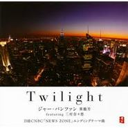

Twilight
============================

|  |  |
| :--: | :-- |
| [ Twilight](https://emumo.xiami.com/album/456728) | **艺人**: [贾鹏芳](../index.md) **语种**: 日语 **唱片公司**: Pacific MOON **发行时间**: 2009年11月27日 **专辑类别**: 录音室专辑 **专辑风格**: 轻音乐 Easy Listening **播放数**: 48916 **收藏数**: 297 **评论数**: 38  |

## 简介

2009.11.27 日経ホール「光と風のコンサート」にて初披露された楽曲「トワイライト」が大絶賛!!  
  
その後幅広い年齢層の方から支持されている日経CNBCのビジネス情報番組“夜エクスプレス”（3/29からは「NEWS ZONE」）のエンディングテーマに決定。  
  
二胡奏者のジャー・パンファン、マリンバ＆ビブラフォン奏者の三村奈々恵さんが参加した楽曲。  
  
他にも日経CNBC「株価速報　放送時間のお知らせ」"Tango of Asia"、"上海之夜"「Save Earth キャンペーン」使用曲を収録。

## 曲目

- [Twilight日経CNBC「NEWS ZONE」エンディングテーマ曲](./456728/xLutTE986c2.md)
- [Tango of Asia日経CNBC「株価速報 放送時間のお知らせ」使用曲](./456728/xLutTFb6240.md)
- [上海之夜日経CNBC「Save Earth キャンペーン」使用曲](./456728/mQ9vfg6c07e.md)
- [Twilight (二胡 & ピアノバージョン)](./456728/mQ9vfh8f76a.md)

## 评论

|  |  |  |
| :-- | :-- | :-- |
|  [虾米用户](https://emumo.xiami.com/u/3271247)  2018-01-05 09:48 赞(2) 踩(0) | 
可惜了，我们留不住这样的人才
 |
|  [虾米用户](https://emumo.xiami.com/u/2106870) 如果没有音乐，我一定用冰... 2015-07-28 22:19 赞(1) 踩(0) | 
感觉很糟糕，4首曲子没有一首能听进去一分钟，不是不能揉进新奇元素，但主器是二胡吧？二胡的灵魂是什么？如果二胡是丰韵优雅江南烟雨或荷塘月色中的女子，你让她涂着劣质口红超短裙在酒吧里溜达，有意思吗？怀念睡莲、宁月。。。中的那二胡。
 |
| ⇒ |  [虾米用户](https://emumo.xiami.com/u/32523638)  2016-04-21 16:07 赞(0) 踩(0) | 
同感！尽量宽容对待吧
 |
| ⇒ |  [虾米用户](https://emumo.xiami.com/u/327521234)  2018-02-05 15:04 赞(0) 踩(0) | 
为什么呢
 |
| ⇒ |  [虾米用户](https://emumo.xiami.com/u/9069569)  2021-01-02 17:51 赞(0) 踩(0) | 
不会与时代结合的产物只会被时代淘汰，一味守旧事物又怎样发展？本来音乐就是多元的，没有规定萧就要演绎悲伤的曲子，敲击乐器就只能伴奏，刷什么存在感？以为自己很懂音乐？
 |
|  [虾米用户](https://emumo.xiami.com/u/8141200)  2015-07-09 21:36 赞(0) 踩(0) | 
收藏了
 |
|  [虾米用户](https://emumo.xiami.com/u/1711512)  2015-05-30 12:18 赞(0) 踩(0) | 
总是能和不同的音乐融合 不错不错 下次准备跟什么类型合作
 |
|  [虾米用户](https://emumo.xiami.com/u/32189164) 寻找，发现，倾听，惊喜 2015-05-30 11:49 赞(0) 踩(0) | 
中西结合好评。
 |
|  [虾米用户](https://emumo.xiami.com/u/32189164) 寻找，发现，倾听，惊喜 2015-05-30 11:47 赞(0) 踩(0) | 
不错啊、
 |
|  [虾米用户](https://emumo.xiami.com/u/5085853) 在这个肮脏的世界上，音乐... 2015-05-28 23:47 赞(0) 踩(0) | 
虽油条依旧然仍不失动听
 |
|  [虾米用户](https://emumo.xiami.com/u/341348) 我还没想好要写什么... 2015-05-28 12:30 赞(0) 踩(0) | 
太美了！
 |
|  [虾米用户](https://emumo.xiami.com/u/1031) asca.lu 2015-05-28 08:44 赞(0) 踩(0) | 
09年的，还以为是新的呢
 |
|  [虾米用户](https://emumo.xiami.com/u/7917845) 「I.D.」 2015-05-27 23:20 赞(0) 踩(0) | 
喜欢 收藏了
 |
|  [虾米用户](https://emumo.xiami.com/u/7297679) 欢迎各位客官光临本小店 ... 2015-05-27 22:10 赞(0) 踩(0) | 
哈哈，二胡也可以加点jazz
 |
|  [虾米用户](https://emumo.xiami.com/u/32031632)  2015-05-27 21:45 赞(0) 踩(0) | 
好曲目，支持！
 |
|  [虾米用户](https://emumo.xiami.com/u/2230403)  2015-05-27 19:21 赞(0) 踩(0) | 
一般般，老贾也是老油条了。
 |
| ⇒ |  [虾米用户](https://emumo.xiami.com/u/7093443) wb已炸。B站音频：ya... 2015-05-27 22:03 赞(0) 踩(0) | 
贾鹏芳只是负责演奏的.......应该说，这就是和月一贯的风格吧。
 |
| ⇒ |  [虾米用户](https://emumo.xiami.com/u/2230403)  2015-05-28 11:19 赞(0) 踩(0) | 
<q><b>星間初弥说：</b></q>
 |
| ⇒ |  [虾米用户](https://emumo.xiami.com/u/5085853) 在这个肮脏的世界上，音乐... 2015-05-28 23:46 赞(0) 踩(0) | 
哈哈，确实油条
 |
|  [虾米用户](https://emumo.xiami.com/u/5764907) Mushroom,lot... 2015-05-27 17:59 赞(0) 踩(0) | 
前排
 |
|  [虾米用户](https://emumo.xiami.com/u/6409843)  2015-05-27 15:59 赞(0) 踩(0) | 
。
 |
|  [虾米用户](https://emumo.xiami.com/u/489546) 音乐化合物 2015-05-27 15:11 赞(0) 踩(0) | 
哇！好高B格！！！
 |
|  [虾米用户](https://emumo.xiami.com/u/606760) 魂牵一线 2015-05-27 14:14 赞(0) 踩(0) | 
听
 |
|  [虾米用户](https://emumo.xiami.com/u/9341862) 暂无签名~ 2015-05-27 13:41 赞(0) 踩(0) | 
回味的旋律
 |
|  [虾米用户](https://emumo.xiami.com/u/9341862) 暂无签名~ 2015-05-27 13:41 赞(0) 踩(0) | 
二胡的伤感
 |
|  [虾米用户](https://emumo.xiami.com/u/7661454) 为宝我的爱 2015-05-27 13:35 赞(0) 踩(0) | 
09年发行的啊
 |
|  [虾米用户](https://emumo.xiami.com/u/44720676) 人生处处听雨声，心境感悟... 2015-05-27 12:32 赞(0) 踩(0) | 
虾米发信通知，先听为快 
 |
|  [虾米用户](https://emumo.xiami.com/u/7093443) wb已炸。B站音频：ya... 2015-05-27 12:00 赞(0) 踩(0) | 
奇也怪哉，为什么这种音乐的融合让我感觉不到轻佻呢......TUT。
 |
|  [虾米用户](https://emumo.xiami.com/u/2174863) 无想 2015-05-27 11:06 赞(0) 踩(0) | 
亦。。。。。。。09年的
 |
|  [虾米用户](https://emumo.xiami.com/u/43650205)   2015-05-27 10:49 赞(0) 踩(0) | 
make
 |
|  [虾米用户](https://emumo.xiami.com/u/15452208) 虾米是这几年唯一的听歌软... 2015-05-27 10:47 赞(0) 踩(0) | 

 |
|  [虾米用户](https://emumo.xiami.com/u/1050473) 此生无悔入东方 2015-05-27 10:43 赞(0) 踩(0) | 
大师又发碟啦
 |
|  [虾米用户](https://emumo.xiami.com/u/15477519) 爱  是生命的和弦，而不... 2015-05-27 10:32 赞(0) 踩(0) | 
我喜欢的…
 |
|  [虾米用户](https://emumo.xiami.com/u/3442087) Dust To Dust 2015-05-27 10:23 赞(0) 踩(0) | 
m
 |
|  [虾米用户](https://emumo.xiami.com/u/8577554) 我还没想好要写什么... 2015-05-26 20:21 赞(0) 踩(0) | 
Twilight / ジャー・パンファン featuring 三村奈々恵
 |
|  [虾米用户](https://emumo.xiami.com/u/5662640) 失落 2015-03-05 12:48 赞(0) 踩(0) | 
贾鹏芳，收录
 |
|  [虾米用户](https://emumo.xiami.com/u/7322777) ∮ 2014-07-02 19:19 赞(0) 踩(0) | 
...A....
 |
|  [虾米用户](https://emumo.xiami.com/u/3504655)  2011-12-27 22:46 赞(0) 踩(0) | 
生之忧患。死之**。
 |
