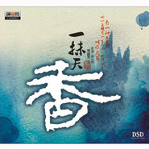

一抹天香
============================

|  |  |
| :--: | :-- |
| [ 一抹天香](https://emumo.xiami.com/album/488867) | **艺人**: [贾鹏芳](../index.md) **语种**: 其他 **唱片公司**: 火烈鸟文化 **发行时间**: 2011年10月18日 **专辑类别**: 录音室专辑 **专辑风格**: 轻音乐 Easy Listening **播放数**: 306366 **收藏数**: 1723 **评论数**: 195  |

## 简介

“弓弦一触，音乐便从他手中流淌出来：这种乐声深情而延绵，既特殊而又自然。曲声且悠且闲，或幽或远，一声不尽而一声又起，明明听的出这一旋这一律，却又无法确切分离段落，好一似红叶浮于溪中，虽有三绕五转七弯九曲，却到底还是借着缓流悠悠飘荡了去。” 这一抹飘荡的天香，绝世独芳。

## 曲目

- [烛影摇红](./488867/xLvQDbd96b6.md)
- [何日重逢](./488867/8GgP1Cf93df.md)
- [闲居吟](./488867/mQARO393698.md)
- [雪莲花](./488867/mQARO4942d6.md)
- [阳春花路](./488867/xLvQDfb32ce.md)
- [独弦操](./488867/b1pTJ6A431b9.md)
- [一帘海天](./488867/xLvQDhdc60e.md)
- [病中吟](./488867/mQARO8a3acf.md)
- [月夜](./488867/xLvQDjbea9d.md)
- [早秋](./488867/mQAROA58c71.md)
- [良宵Beautiful Night](./488867/mQI8Blef606.md)
- [いつまでも、いつまでもForever](./488867/mQI8Bm59fa5.md)

## 评论

|  |  |  |  |
| :-- | :-- | :-- | :-- |
|  [虾米用户](https://emumo.xiami.com/u/27906871)  2020-03-03 13:19 赞(0) 踩(0) | 
已入盘最喜欢雪莲花~
 |
|  [虾米用户](https://emumo.xiami.com/u/2724370) 王权没有永恒，你将何去何... 2018-06-22 03:29 赞(0) 踩(0) | 
挖！！下架了什么鬼
 |
|  [虾米用户](https://emumo.xiami.com/u/37150063)  2018-03-21 01:38 赞(0) 踩(0) | 
最喜欢烛影摇红和病中吟
 |
|  [虾米用户](https://emumo.xiami.com/u/727575) 一个游戏美术设计师疯狂迷... 2017-10-28 00:41 赞(0) 踩(0) | 
何日重逢 这首曲子 在一次家庭聚会上我放的背景音乐 恰好是 姑姑讲话 听到这样的音乐听着姑姑讲着 如何珍惜眼前的一切  感恩  奉献  关怀 怀念老人 怀念 儿时时一起玩耍 到如今儿孙满堂 时间流逝 兄弟姐妹们全国各地 见面相聚时间的次数少  说的我们在座的每一位泪流满面 ···············何日重逢 代表了什么，  意· 爱· 应该说 这首曲子代表的是  情
 |
|  [虾米用户](https://emumo.xiami.com/u/9192610)  2017-10-27 23:10 赞(0) 踩(0) | 
从和平之月就喜欢的。。
 |
|  [虾米用户](https://emumo.xiami.com/u/10518998)  2017-01-01 15:44 赞(0) 踩(0) | 
工作时听的音乐 安静 祥和
 |
|  [虾米用户](https://emumo.xiami.com/u/13905689) 爱音乐 2016-02-04 09:59 赞(0) 踩(0) | 
贾老师带着这张专集来过中国，可惜我错过了。
 |
|  [虾米用户](https://emumo.xiami.com/u/9372732)  2016-01-13 22:22 赞(0) 踩(0) | 
下架了 我哭 来晚了
 |
| ⇒ |  [虾米用户](https://emumo.xiami.com/u/13905689) 爱音乐 2016-02-04 09:59 赞(0) 踩(0) | 
到贴吧下载吧 ，这张真的很好听。
 |
|  [虾米用户](https://emumo.xiami.com/u/2249408)  2015-10-31 14:16 赞(0) 踩(0) | 
深情而延绵、悠闲而幽远、一抹而天香、绝世而独芳。
 |
|  [虾米用户](https://emumo.xiami.com/u/2249408)  2015-10-31 14:16 赞(0) 踩(0) | 
深情而延绵、悠闲而幽远、一抹而天香、绝世而独芳。
 |
|  [虾米用户](https://emumo.xiami.com/u/1688392) 网易扣扣酷狗咪咕都是一样... 2015-06-20 20:01 赞(0) 踩(0) | 
封面好看，其他不多说了。
 |
|  [虾米用户](https://emumo.xiami.com/u/49281390) 绝赞放送中 2015-06-19 02:28 赞(0) 踩(0) | 
浪漫二胡贾鹏芳 这张专辑最让我动情
 |
|  [虾米用户](https://emumo.xiami.com/u/11728160)  2015-06-08 08:10 赞(0) 踩(0) | 
一抹天香、超好听~
 |
|  [虾米用户](https://emumo.xiami.com/u/231736)  2015-05-18 23:50 赞(0) 踩(0) | 
伴奏应该还是美野春树Trio吧？
 |
|  [虾米用户](https://emumo.xiami.com/u/43607123)  2014-11-18 16:12 赞(0) 踩(0) | 
这张专辑我一直都在QQ音乐置顶 基本午休都喜欢听着睡觉 最爱烛影摇红和月夜 特别是烛影摇红爱到不行 日版的今天第一次听 良宵确定是阿炳的良宵嘛 只觉得部分相似之外别的都差距挺大的 改编之后相当有魅力不同于植物学家的女儿的chinese moon 各有风采
 |
|  [虾米用户](https://emumo.xiami.com/u/10085377) 冰雪儿 2014-11-08 19:17 赞(1) 踩(0) | 
山有雪，莲香叠，抬头望见苍茫月；丝弦曲尽心弦接，长天落我无双阙。这一抹飘荡的天香，将绝世而独芳！
 |
|  [虾米用户](https://emumo.xiami.com/u/7333659) 暂无签名~ 2014-09-15 22:02 赞(0) 踩(0) | 
分享贾鹏芳老师的一抹天香、超好听~
 |
|  [虾米用户](https://emumo.xiami.com/u/3834066)   2014-07-22 09:25 赞(0) 踩(0) | 
中国的乐器,日本的制作.再次推荐这张专辑.
 |
| ⇒ |  [虾米用户](https://emumo.xiami.com/u/8739024)  2014-11-15 23:25 赞(0) 踩(0) | 
中国的乐器，中国的原创，日本的配乐
 |
|  [虾米用户](https://emumo.xiami.com/u/33042329) 鼎阿哥 2014-05-25 11:56 赞(0) 踩(0) | 
古典
 |
|  [虾米用户](https://emumo.xiami.com/u/5161348)  2014-03-09 21:17 赞(0) 踩(0) | 
良宵是个什么情况！怎么如此不同！但是又同样迷人
 |
| ⇒ |  [虾米用户](https://emumo.xiami.com/u/18748728)  2014-05-08 07:47 赞(0) 踩(0) | 
Mmmmmm
 |
|  [虾米用户](https://emumo.xiami.com/u/7365010) 超然 2014-03-05 06:47 赞(0) 踩(0) | 
1年了，无意中发现原来还有日本版，差点错过精华
 |
| ⇒ |  [虾米用户](https://emumo.xiami.com/u/18748728)  2014-05-08 07:46 赞(0) 踩(0) | 
Reruns
 |
|  [虾米用户](https://emumo.xiami.com/u/2295572)  2014-03-02 23:41 赞(0) 踩(0) | 
日版真心好福利
 |
| ⇒ |  [虾米用户](https://emumo.xiami.com/u/18748728)  2014-05-08 07:45 赞(0) 踩(0) | 
ylrplr t kajp呃我 v
 |
| ⇒ |  [虾米用户](https://emumo.xiami.com/u/41840857)   2014-09-29 18:36 赞(0) 踩(0) | 
<q><b>pengyutang125说：</b></q>
 |
|  [虾米用户](https://emumo.xiami.com/u/6430154)  2014-03-02 19:01 赞(0) 踩(0) | 
棒！
 |
| ⇒ |  [虾米用户](https://emumo.xiami.com/u/18748728)  2014-05-08 07:45 赞(0) 踩(0) | 
raaayvoe
 |
| ⇒ |  [虾米用户](https://emumo.xiami.com/u/18748728)  2014-05-08 07:46 赞(0) 踩(0) | 
<q><b>pengyutang125说：</b></q>
 |
|  [虾米用户](https://emumo.xiami.com/u/2701140)  2014-02-23 14:24 赞(0) 踩(0) | 
<a href="http://emumo.xiami.com/u/2871" target="_blank" rel="nofollow" name_card="2871">@虾小编</a>  <a href="http://emumo.xiami.com/u/355865" target="_blank" rel="nofollow" name_card="355865">@拂袖</a>  <a href="http://emumo.xiami.com/u/6630660" target="_blank" rel="nofollow" name_card="6630660">@乱七∞糟</a> <a href="http://emumo.xiami.com/u/30705" target="_blank" rel="nofollow" name_card="30705">@beson</a>  <a href="http://emumo.xiami.com/u/4275776" target="_blank" rel="nofollow" name_card="4275776">@320K专门店</a>  直接提交日本版好呢？还是就提交日本版多的两首曲子？因为毕竟日本版与中国大陆版的区别就是曲序不同（个别曲名两版使用语言不同），另外就是多了两首曲子：08.良宵 Beautiful Night09.いつまでも、いつまでも Forever附带注释以下不同曲名：05.いつか、また Longing to Meet You Again（对应02 何日重逢）06.今日も晴れ In Sunny Day（对应05 阳春花路）07.碧い海、青い空、静かな暮らし The Blue Sea, The Blue Sky, Calm Life（对应07 一帘海天）
 |
| ⇒ |  [虾米用户](https://emumo.xiami.com/u/2701140)  2014-02-25 20:59 赞(0) 踩(0) | 
<q><b>说：</b></q>
 |
| ⇒ |  [虾米用户](https://emumo.xiami.com/u/30705) 我还没想好要写什么... 2014-02-25 22:20 赞(0) 踩(0) | 
提交日版多的曲目就好了，小编会再新建合并页面~另外，不知你是否清楚哪个为首版，因为我们是要按照首版的信息来的~
 |
| ⇒ |  [虾米用户](https://emumo.xiami.com/u/719995) 事出有音 2014-02-25 22:30 赞(0) 踩(0) | 
<q><b>Kloisiie说：</b></q>
 |
| ⇒ |  [虾米用户](https://emumo.xiami.com/u/30705) 我还没想好要写什么... 2014-02-26 10:30 赞(0) 踩(0) | 
<q><b>说：</b></q>
 |
| ⇒ |  [虾米用户](https://emumo.xiami.com/u/2871) 虾米编辑部唯一官方账号 ... 2014-02-26 10:40 赞(0) 踩(0) | 
<q><b>Kloisiie说：</b></q>
 |
|  [虾米用户](https://emumo.xiami.com/u/12281141)  2014-02-10 14:22 赞(0) 踩(0) | 
好
 |
|  [虾米用户](https://emumo.xiami.com/u/9599912)  2014-01-28 02:40 赞(0) 踩(0) | 
“弓弦一触，音乐便从他手中流淌出来：这种乐声深情而延绵，既特殊而又自然。曲声且悠且闲，或幽或远，一声不尽而一声又起，明明听的出这一旋这一律，却又无法确切分离段落，好一似红叶浮于溪中，虽有三绕五转七弯九曲，却到底还是借着缓流悠悠飘荡了去。” 这一抹飘荡的天香，绝世独芳。
 |
|  [虾米用户](https://emumo.xiami.com/u/29193413)  2014-01-13 13:43 赞(0) 踩(0) | 
二胡
 |
|  [虾米用户](https://emumo.xiami.com/u/10613138)  2013-12-19 23:19 赞(0) 踩(0) | 
余音绕梁，三日不绝
 |
|  [虾米用户](https://emumo.xiami.com/u/25109310)  2013-12-14 15:32 赞(0) 踩(0) | 
他二胡演奏的太棒了
 |
|  [虾米用户](https://emumo.xiami.com/u/15004821)  2013-11-13 23:44 赞(0) 踩(0) | 
一抹天香
 |
|  [虾米用户](https://emumo.xiami.com/u/10951828) 琴心剑魄 2013-11-07 00:31 赞(0) 踩(0) | 
非常好！
 |
|  [虾米用户](https://emumo.xiami.com/u/17931399)  2013-10-21 14:54 赞(0) 踩(0) | 
喜欢
 |
|  [虾米用户](https://emumo.xiami.com/u/4972808)  2013-09-29 16:42 赞(0) 踩(0) | 
听二胡也被美哭了
 |
|  [虾米用户](https://emumo.xiami.com/u/20387091)  2013-09-24 17:47 赞(0) 踩(0) | 
喜欢，尤其是听到熟悉的曲子
 |
|  [虾米用户](https://emumo.xiami.com/u/12355451)  2013-09-19 20:10 赞(0) 踩(0) | 
有&amp;quot;月夜&amp;quot;
 |
|  [虾米用户](https://emumo.xiami.com/u/19363368)  2013-09-18 22:20 赞(0) 踩(0) | 
又是怎样的无边~
 |
|  [虾米用户](https://emumo.xiami.com/u/5811443)  2013-09-14 08:38 赞(0) 踩(0) | 
一缕茶香
 |
|  [虾米用户](https://emumo.xiami.com/u/7853914)  2013-08-20 19:08 赞(0) 踩(0) | 
很好听呢，很有韵味，可惜我只会箫。。。我感觉身边学二胡的人好少啊
 |
|  [虾米用户](https://emumo.xiami.com/u/18060464)  2013-07-30 04:18 赞(0) 踩(0) | 
非常享受这位大家的演奏。不太能明白为什么会有人不喜欢二胡？！
 |
|  [虾米用户](https://emumo.xiami.com/u/9767102) 牧羊女 2013-07-22 12:15 赞(0) 踩(0) | 
沉醉不知归路
 |
|  [虾米用户](https://emumo.xiami.com/u/16202460) 来了就别走 2013-07-08 22:17 赞(0) 踩(0) | 
它就这样淡淡的拉着我的心摇啊摇~~
 |
|  [虾米用户](https://emumo.xiami.com/u/5875129) WesLey 2013-06-11 05:15 赞(0) 踩(0) | 
感动之情溢于言表
 |
|  [虾米用户](https://emumo.xiami.com/u/1635458)  2013-06-03 14:35 赞(0) 踩(0) | 
纯、静、宁
 |
|  [虾米用户](https://emumo.xiami.com/u/8400983) 暂无签名~ 2013-05-07 17:00 赞(0) 踩(0) | 
二胡——我们的国粹！
 |
|  [虾米用户](https://emumo.xiami.com/u/2249408)  2013-04-28 14:36 赞(0) 踩(0) | 
“弓弦一触，音乐便从他手中流淌出来：这种乐声深情而延绵，既特殊而又自然。曲声且悠且闲，或幽或远，一声不尽而一声又起，明明听的出这一旋这一律，却又无法确切分离段落，好一似红叶浮于溪中，虽有三绕五转七弯九曲，却到底还是借着缓流悠悠飘荡了去。” 这一抹飘荡的天香，绝世独芳。专辑介绍饱含深情，如诗如散文；欣赏老贾的曲，如歌如泣，心旷神怡。
 |
|  [虾米用户](https://emumo.xiami.com/u/11753193) 陌上花开香 2013-03-30 23:45 赞(0) 踩(0) | 
二胡是怎么的享受
 |
|  [虾米用户](https://emumo.xiami.com/u/13652613) musiclover 2013-03-25 21:30 赞(0) 踩(0) | 
再突破睡莲可能很难了。
 |
|  [虾米用户](https://emumo.xiami.com/u/2646839)  2013-02-23 20:10 赞(0) 踩(0) | 
就为了十二梦幻曲的动心
 |
|  [虾米用户](https://emumo.xiami.com/u/6240982)  2013-02-11 21:48 赞(0) 踩(0) | 
二胡
 |
|  [虾米用户](https://emumo.xiami.com/u/2701140)  2013-01-29 16:29 赞(4) 踩(0) | 
<a href="http://jia-pengfang.com/disc/cd/2012/03/post-3.html" target="_blank" rel="nofollow noreferrer noopener">http://jia-pengfang.com/disc/cd/2012/03/post-3.html</a>日本版还多两首曲子哦，谁把日本版的两首发一下嘛。01.燭影揺紅02.雪蓮花03.閑居吟04.独弦操05.いつか、また06.今日も晴れ07.碧い海、青い空、静かな暮らし08.良宵09.いつまでも、いつまでも10.月夜11.病中吟12.早秋查了一下，猜是这两首：08.良宵 Beautiful Night09.いつまでも、いつまでも Forever
 |
| ⇒ |  [虾米用户](https://emumo.xiami.com/u/7604962)  2014-02-22 19:23 赞(0) 踩(0) | 
哪里能找到贾鹏芳演奏的良宵呢，我只知道良宵和病中吟都是民乐
 |
| ⇒ |  [虾米用户](https://emumo.xiami.com/u/2701140)  2014-02-23 14:33 赞(0) 踩(0) | 
<q><b>小舍说：</b></q>
 |
|  [虾米用户](https://emumo.xiami.com/u/12444802)  2013-01-15 14:16 赞(1) 踩(0) | 
唯美
 |
|  [虾米用户](https://emumo.xiami.com/u/11981346)  2013-01-13 22:35 赞(0) 踩(0) | 
贾老师的音乐是我要听一辈子并带到来生去听的
 |
|  [虾米用户](https://emumo.xiami.com/u/12342695)  2013-01-10 14:14 赞(0) 踩(0) | 
喜欢民乐
 |
|  [虾米用户](https://emumo.xiami.com/u/5085853) 在这个肮脏的世界上，音乐... 2013-01-08 21:06 赞(0) 踩(0) | 
爱芳如常
 |
|  [虾米用户](https://emumo.xiami.com/u/7558919) Praise to th... 2013-01-08 05:08 赞(0) 踩(0) | 
有双二胡
 |
|  [虾米用户](https://emumo.xiami.com/u/6905406) 多读书！ 2013-01-04 17:58 赞(0) 踩(0) | 
干净
 |
|  [虾米用户](https://emumo.xiami.com/u/632324)  2013-01-01 21:20 赞(0) 踩(0) | 
比酒更让我醉
 |
|  [虾米用户](https://emumo.xiami.com/u/10127418)  2013-01-01 10:57 赞(0) 踩(0) | 
我说操表示好。
 |
|  [虾米用户](https://emumo.xiami.com/u/86522) 我还没想好要写什么... 2012-12-23 19:13 赞(0) 踩(0) | 
颠覆我对二胡悲戚风格的固有印象啊
 |
|  [虾米用户](https://emumo.xiami.com/u/11299204) 音乐无极限 2012-12-21 01:26 赞(0) 踩(0) | 
收费方式
 |
|  [虾米用户](https://emumo.xiami.com/u/10127418)  2012-12-05 20:07 赞(0) 踩(0) | 
操
 |
|  [虾米用户](https://emumo.xiami.com/u/6471116)  2012-11-22 13:36 赞(0) 踩(0) | 
悠扬就是这样，又暖又清冽
 |
|  [虾米用户](https://emumo.xiami.com/u/7963682)   2012-11-10 00:06 赞(1) 踩(0) | 
一张不错的专辑
 |
|  [虾米用户](https://emumo.xiami.com/u/780791)  2012-10-05 14:59 赞(0) 踩(0) | 
他的最新专辑了。
 |
|  [虾米用户](https://emumo.xiami.com/u/543165) 希望虾米音乐越来越好，因... 2012-09-22 22:59 赞(1) 踩(0) | 
音乐无界，海纳百川，有容乃大，集中西之精华，成东方之巨作。
 |
|  [虾米用户](https://emumo.xiami.com/u/10721886)  2012-09-22 22:38 赞(0) 踩(0) | 
喜欢
 |
|  [虾米用户](https://emumo.xiami.com/u/4717387)  2012-09-04 12:03 赞(0) 踩(0) | 
！
 |
|  [虾米用户](https://emumo.xiami.com/u/2814248) 帅得不能直视 2012-08-28 05:24 赞(0) 踩(0) | 
闲局吟太好听了OTL
 |
|  [虾米用户](https://emumo.xiami.com/u/4350174)  2012-08-19 02:18 赞(0) 踩(0) | 
!~
 |
|  [虾米用户](https://emumo.xiami.com/u/10255360)  2012-08-17 21:07 赞(0) 踩(0) | 
二胡是绝世而独立的乐器，琴声悠扬中带些许清冽，常能扣人心弦！
 |
|  [虾米用户](https://emumo.xiami.com/u/10180899)  2012-08-17 20:30 赞(0) 踩(0) | 
飘荡的天香，绝世的独芳。
 |
|  [虾米用户](https://emumo.xiami.com/u/10099384) HONGDOU 2012-08-17 19:26 赞(0) 踩(0) | 
《一抹天香》
 |
|  [虾米用户](https://emumo.xiami.com/u/1026736) 与君歌一曲 请君为我侧耳... 2012-08-04 20:01 赞(0) 踩(0) | 
我沦陷了~~~
 |
|  [虾米用户](https://emumo.xiami.com/u/9979636)  2012-07-27 11:32 赞(0) 踩(0) | 
喜欢的旋律～～
 |
|  [虾米用户](https://emumo.xiami.com/u/9979636)  2012-07-27 11:28 赞(0) 踩(0) | 
很美的旋律～～
 |
|  [虾米用户](https://emumo.xiami.com/u/8837352) 「満ちる月、優しい海。」 2012-07-01 01:14 赞(0) 踩(0) | 
轨1和轨9让我沦陷了，没救了╮(╯_╰)╭
 |
|  [虾米用户](https://emumo.xiami.com/u/9544993)  2012-06-24 16:36 赞(0) 踩(0) | 
在《月夜》中恰当地加入了现代的元素，这不是创新是什么？这不是大师是什么？
 |
|  [虾米用户](https://emumo.xiami.com/u/9550240)  2012-06-22 20:24 赞(0) 踩(0) | 
古典和现代音乐的完美结合
 |
|  [虾米用户](https://emumo.xiami.com/u/4927501)  2012-06-17 10:33 赞(0) 踩(0) | 
真是妙手 爹的二胡拉出来卖艺都会被人赶
 |
|  [虾米用户](https://emumo.xiami.com/u/2442452)  2012-06-15 21:26 赞(0) 踩(0) | 
悠扬而婉转，清丽脱俗
 |
|  [虾米用户](https://emumo.xiami.com/u/8636543)  2012-06-09 09:58 赞(0) 踩(0) | 
喜欢二胡的娓娓动听、如泣如诉、细腻如丝。
 |
|  [虾米用户](https://emumo.xiami.com/u/9254041)  2012-06-06 09:14 赞(0) 踩(0) | 
ok
 |
|  [虾米用户](https://emumo.xiami.com/u/4299782) ada 2012-06-01 17:18 赞(0) 踩(0) | 
日多色愈正，春和天与香
 |
|  [虾米用户](https://emumo.xiami.com/u/8375085)  2012-06-01 16:36 赞(0) 踩(0) | 
幽远
 |
|  [虾米用户](https://emumo.xiami.com/u/3394042)  2012-05-21 21:14 赞(0) 踩(0) | 
跌进民乐窟。。。
 |
|  [虾米用户](https://emumo.xiami.com/u/3184603)   2012-05-16 22:22 赞(0) 踩(0) | 
适合慢慢听
 |
|  [虾米用户](https://emumo.xiami.com/u/8780882) 歇斯底里者 2012-05-14 12:39 赞(0) 踩(0) | 
有鹏芳来，一醉二弦。这专辑太美了，听一辈子都不厌
 |
|  [虾米用户](https://emumo.xiami.com/u/1718509)  2012-05-07 11:10 赞(0) 踩(0) | 
从容
 |
|  [虾米用户](https://emumo.xiami.com/u/1718509)  2012-05-07 11:10 赞(0) 踩(0) | 
从容
 |
|  [虾米用户](https://emumo.xiami.com/u/4361903) 学真知，做实事，惜真情。 2012-05-06 13:59 赞(0) 踩(0) | 
精神世界的世外桃源
 |
|  [虾米用户](https://emumo.xiami.com/u/4159521)  2012-05-03 23:31 赞(0) 踩(0) | 
慢慢听~慢慢品~
 |
|  [虾米用户](https://emumo.xiami.com/u/7625763)  2012-04-24 20:57 赞(0) 踩(0) | 
喜欢二胡
 |
|  [虾米用户](https://emumo.xiami.com/u/8053882) 暂无签名~ 2012-04-23 12:56 赞(0) 踩(0) | 
爱茶，爱香，爱莲花!
 |
|  [虾米用户](https://emumo.xiami.com/u/7366460) 音乐，是心灵的感受，是心... 2012-04-18 14:38 赞(0) 踩(0) | 
很喜欢！
 |
|  [虾米用户](https://emumo.xiami.com/u/4151705) SM art 2012-04-06 20:07 赞(0) 踩(0) | 
冷静却可怖的美
 |
|  [虾米用户](https://emumo.xiami.com/u/5065196)  2012-04-03 00:31 赞(0) 踩(0) | 
喜欢
 |
|  [虾米用户](https://emumo.xiami.com/u/7365010) 超然 2012-04-02 08:35 赞(1) 踩(0) | 
贾先生的专辑曲曲都是经典，个人比较喜欢轨9《月夜》
 |
| ⇒ |  [虾米用户](https://emumo.xiami.com/u/8123097)  2014-02-13 19:11 赞(0) 踩(0) | 
志同道合 这首歌让人听得上瘾 行云流水
 |
|  [虾米用户](https://emumo.xiami.com/u/878517) 音乐是慰籍 书籍是粮食 ... 2012-03-24 16:52 赞(0) 踩(0) | 
还是那位老贾嘛。隐在弓弦后，带温暖的笑，一抺天香，渐渐漫起，沉醉......
 |
|  [虾米用户](https://emumo.xiami.com/u/8497826)  2012-03-23 13:11 赞(0) 踩(0) | 
飘荡的天香，绝世独芳。
 |
|  [虾米用户](https://emumo.xiami.com/u/8356245)  2012-03-20 12:54 赞(0) 踩(0) | 
喜欢
 |
|  [虾米用户](https://emumo.xiami.com/u/4310721) 春雨江南，秋风蓟北 2012-03-19 16:34 赞(0) 踩(0) | 
专门买了CD来听的，脑残粉真没救……
 |
|  [虾米用户](https://emumo.xiami.com/u/5126147)  2012-03-19 13:52 赞(0) 踩(0) | 
风格跟之前不一样了
 |
|  [虾米用户](https://emumo.xiami.com/u/3577835) 一扇门，一扇窗，一世界 2012-03-07 18:33 赞(26) 踩(0) | 
听的我都想去学二胡，《睡莲》听的我感动的直想哭，是我太伤感了么？有同感的童鞋请举个手
 |
| ⇒ |  [虾米用户](https://emumo.xiami.com/u/2925892) ？ 2013-02-16 11:21 赞(0) 踩(0) | 
举爪！
 |
| ⇒ |  [虾米用户](https://emumo.xiami.com/u/41840857)   2014-09-29 18:43 赞(0) 踩(0) | 
我也是流着泪听的
 |
| ⇒ |  [虾米用户](https://emumo.xiami.com/u/7125566) 向上吧，少年。 2016-05-16 14:37 赞(0) 踩(0) | 
哇咔咔，我是真的跑去学二胡了····
 |
|  [虾米用户](https://emumo.xiami.com/u/7366460) 音乐，是心灵的感受，是心... 2012-02-29 14:48 赞(1) 踩(0) | 
like！
 |
|  [虾米用户](https://emumo.xiami.com/u/517789)  2012-02-25 18:40 赞(0) 踩(0) | 
不解释
 |
|  [虾米用户](https://emumo.xiami.com/u/8159818)  2012-02-24 09:47 赞(0) 踩(0) | 
特别喜欢贾鹏芳的二胡曲，清新、优美、深深震撼我的心灵。
 |
|  [虾米用户](https://emumo.xiami.com/u/8135330) 浓尽必枯  淡者屡深 2012-02-23 22:16 赞(0) 踩(0) | 
很喜欢贾鹏芳的二胡
 |
|  [虾米用户](https://emumo.xiami.com/u/400817)  2012-02-10 05:05 赞(0) 踩(0) | 
闲适的，清澈的，优美的。
 |
|  [虾米用户](https://emumo.xiami.com/u/3433748)  2012-02-09 11:56 赞(0) 踩(0) | 
温婉的二胡，伴我走入干净的世界
 |
|  [虾米用户](https://emumo.xiami.com/u/7609037)  2012-02-09 00:57 赞(0) 踩(0) | 
真好听。一切有哀愁,很喜欢。三月,在日本的开始销售快乐。
 |
|  [虾米用户](https://emumo.xiami.com/u/6229951) 坐音乐的船，扬自由的帆 2012-02-08 14:49 赞(0) 踩(0) | 
一抹天香，一抹柔情！
 |
|  [虾米用户](https://emumo.xiami.com/u/852495)  2012-02-07 22:08 赞(0) 踩(0) | 
很好。
 |
|  [虾米用户](https://emumo.xiami.com/u/4043410) 唯夜色浪漫 2012-02-04 10:51 赞(0) 踩(0) | 
很是喜欢
 |
|  [虾米用户](https://emumo.xiami.com/u/6744967) 音乐无国界，你爱我也爱。 2012-02-02 10:27 赞(0) 踩(0) | 
好听
 |
|  [虾米用户](https://emumo.xiami.com/u/631347)  2012-02-01 15:20 赞(0) 踩(0) | 
总觉得听到这么优秀的二胡心情就各种复杂……
 |
|  [虾米用户](https://emumo.xiami.com/u/3387720) 笙歌歸院落 燈火下樓臺 2012-01-31 01:50 赞(0) 踩(0) | 
拉不出来他的韵味啊！
 |
|  [虾米用户](https://emumo.xiami.com/u/7604015)  2012-01-29 20:30 赞(0) 踩(0) | 
纯净而悠远
 |
|  [虾米用户](https://emumo.xiami.com/u/2959963) . 2012-01-28 00:05 赞(0) 踩(0) | 
美
 |
|  [虾米用户](https://emumo.xiami.com/u/2959963) . 2012-01-28 00:04 赞(0) 踩(0) | 
美
 |
|  [虾米用户](https://emumo.xiami.com/u/2959963) . 2012-01-28 00:04 赞(0) 踩(0) | 
悠久清扬
 |
|  [虾米用户](https://emumo.xiami.com/u/590223)  2012-01-26 09:45 赞(0) 踩(0) | 
en
 |
|  [虾米用户](https://emumo.xiami.com/u/4740034)  2012-01-25 19:32 赞(0) 踩(0) | 
东方的烂漫
 |
|  [虾米用户](https://emumo.xiami.com/u/2437298) 樂以抒情，爻以知理，情理... 2012-01-22 01:13 赞(0) 踩(0) | 
专辑介绍 文字挺美
 |
|  [虾米用户](https://emumo.xiami.com/u/5464626)   2012-01-21 13:15 赞(0) 踩(0) | 
听着心都飞扬了起来
 |
|  [虾米用户](https://emumo.xiami.com/u/3753162)  2012-01-21 10:28 赞(0) 踩(0) | 
美。
 |
|  [虾米用户](https://emumo.xiami.com/u/2819592)  2012-01-20 13:35 赞(0) 踩(0) | 
他的音乐依旧很赞
 |
|  [虾米用户](https://emumo.xiami.com/u/6298227)  2012-01-19 23:51 赞(0) 踩(0) | 
悠悠中国风，丝丝入心弦！
 |
|  [虾米用户](https://emumo.xiami.com/u/138418)  2012-01-19 11:23 赞(0) 踩(0) | 
绝世独芳
 |
|  [虾米用户](https://emumo.xiami.com/u/2725837)  2012-01-18 16:19 赞(0) 踩(0) | 
贾老师 必收藏
 |
|  [虾米用户](https://emumo.xiami.com/u/2725837)  2012-01-18 16:18 赞(0) 踩(0) | 
真好听。
 |
|  [虾米用户](https://emumo.xiami.com/u/7688686)  2012-01-17 20:44 赞(0) 踩(0) | 
喜欢老贾。。。
 |
|  [虾米用户](https://emumo.xiami.com/u/2428380) 暂无签名~ 2012-01-17 20:14 赞(0) 踩(0) | 
haohaohao
 |
|  [虾米用户](https://emumo.xiami.com/u/456151)  2012-01-17 17:17 赞(0) 踩(0) | 
“弓弦一触，音乐便从他手中流淌出来：这种乐声深情而延绵，既特殊而又自然。曲声且悠且闲，或幽或远，一声不尽而一声又起，明明听的出这一旋这一律，却又无法确切分离段落，好一似红叶浮于溪中，虽有三绕五转七弯九曲，却到底还是借着缓流悠悠飘荡了去。” 这一抹飘荡的天香，绝世独芳。
 |
|  [虾米用户](https://emumo.xiami.com/u/489457)  2012-01-17 13:16 赞(0) 踩(0) | 
终于又发新砖啦~
 |
|  [虾米用户](https://emumo.xiami.com/u/7137437)  2012-01-17 08:36 赞(0) 踩(0) | 
静雅悠长
 |
|  [虾米用户](https://emumo.xiami.com/u/7696405)  2012-01-16 20:47 赞(0) 踩(0) | 
贾老师的二胡，让人的心能很快的平静下来
 |
|  [虾米用户](https://emumo.xiami.com/u/2409724) 袖墨掬暝 2012-01-16 19:05 赞(0) 踩(0) | 
雨絮濛濛，浅香迤逦。
 |
|  [虾米用户](https://emumo.xiami.com/u/2839370) 闲散妇女 2012-01-16 15:23 赞(0) 踩(0) | 
且悠且闲，或幽或远，一声未尽一声又起。
 |
|  [虾米用户](https://emumo.xiami.com/u/1295127) 老老实实写小说的人 2012-01-16 13:16 赞(0) 踩(0) | 
今天听贾鹏芳的二胡。心里满是离散味儿。工作室的空气里少了大家的味道就算再热闹，徒增一层悲凉罢了。@兰舟催发的周  @hew09 @howl99  @杨云昭 @米泽_michael
 |
|  [虾米用户](https://emumo.xiami.com/u/7091352)  2012-01-16 11:32 赞(0) 踩(0) | 
依旧让人目眩神迷的二胡声~让这个寒冷的冬天变得“芳香可寻”~~~
 |
|  [虾米用户](https://emumo.xiami.com/u/4394406)  2012-01-16 04:46 赞(0) 踩(0) | 
雪莲花好棒
 |
|  [虾米用户](https://emumo.xiami.com/u/610575) 暂无签名~ 2012-01-16 00:11 赞(0) 踩(0) | 
二胡哎
 |
|  [虾米用户](https://emumo.xiami.com/u/180847) 只有心知道 岁月不宽宏 2012-01-15 22:45 赞(0) 踩(0) | 
很喜欢这种感觉
 |
|  [虾米用户](https://emumo.xiami.com/u/11440)  2012-01-15 22:29 赞(0) 踩(0) | 
贾老师的作品都是大爱~~
 |
|  [虾米用户](https://emumo.xiami.com/u/106909)  2012-01-15 21:30 赞(0) 踩(0) | 
還是這樣好，京田加賈叔，那麼的欣喜
 |
|  [虾米用户](https://emumo.xiami.com/u/7130558)   2012-01-15 20:58 赞(0) 踩(0) | 
旧曲新演，刘天华先生的曲子，老师的新作，旧搭档京田诚一先生，还有其他出色的演奏家一起，这张专辑的好，要听了才知道！
 |
|  [虾米用户](https://emumo.xiami.com/u/5690474)  2012-01-15 19:24 赞(0) 踩(0) | 
久违的新专辑，舒服的无以复加啊
 |
|  [虾米用户](https://emumo.xiami.com/u/606760) 魂牵一线 2012-01-15 17:55 赞(0) 踩(0) | 
ting
 |
|  [虾米用户](https://emumo.xiami.com/u/1441815)  2012-01-15 15:34 赞(0) 踩(0) | 
是新砖吗！？我顶、顶、顶……在卓越上看到了，貌似引进版，54块大洋，考虑是否收张CD。
 |
|  [虾米用户](https://emumo.xiami.com/u/2724370) 王权没有永恒，你将何去何... 2012-01-15 12:02 赞(0) 踩(0) | 
太柔美了= =！
 |
|  [虾米用户](https://emumo.xiami.com/u/877113)  2012-01-15 11:47 赞(0) 踩(0) | 
看来贾先生最近有了新灵感，不错：）
 |
|  [虾米用户](https://emumo.xiami.com/u/97619) 道崇清妙 2012-01-15 11:13 赞(0) 踩(0) | 
心爱的贾鹏芳的二胡又回来了，和京田诚一合作最完美。
 |
|  [虾米用户](https://emumo.xiami.com/u/140583) Website:lain... 2012-01-15 04:39 赞(0) 踩(0) | 
这新曲风，喜欢的说~
 |
|  [虾米用户](https://emumo.xiami.com/u/2181046)  2012-01-15 02:50 赞(0) 踩(0) | 
拉回去了
 |
|  [虾米用户](https://emumo.xiami.com/u/2627228)  2012-01-15 00:13 赞(0) 踩(0) | 
大师····
 |
|  [虾米用户](https://emumo.xiami.com/u/3449571) No.69 2012-01-14 23:52 赞(0) 踩(0) | 
「病中吟」和「月夜」好贊！嗷！！
 |
|  [虾米用户](https://emumo.xiami.com/u/4043410) 唯夜色浪漫 2012-01-14 23:49 赞(0) 踩(0) | 
从听第一首的时候我就不自主地爱上了弓弦之美了~
 |
|  [虾米用户](https://emumo.xiami.com/u/837425) 我还没想好要写什么... 2012-01-14 23:36 赞(0) 踩(0) | 
O(∩_∩)O谢谢上传！辛苦了！
 |
|  [虾米用户](https://emumo.xiami.com/u/1716114) 其疾如风,其徐如林 2012-01-14 23:09 赞(0) 踩(0) | 
病中吟 !嗷&amp;gt;&amp;lt;
 |
|  [虾米用户](https://emumo.xiami.com/u/2825558) 彼岸繁花似瑾。 2012-01-14 23:00 赞(0) 踩(0) | 
曲风变了 感觉
 |
|  [虾米用户](https://emumo.xiami.com/u/516079)  2012-01-14 22:55 赞(0) 踩(0) | 
喜欢这种风格的~O(∩_∩)O~~
 |
|  [虾米用户](https://emumo.xiami.com/u/7125566) 向上吧，少年。 2012-01-14 22:36 赞(0) 踩(0) | 
一直都喜欢这个乐器演奏的民乐！
 |
|  [虾米用户](https://emumo.xiami.com/u/7125566) 向上吧，少年。 2012-01-14 22:36 赞(0) 踩(0) | 
好听
 |
|  [虾米用户](https://emumo.xiami.com/u/572626) 不能让好的被埋没，也不能... 2012-01-14 21:56 赞(0) 踩(0) | 
回国你就开始堕落了。
 |
| ⇒ |  [虾米用户](https://emumo.xiami.com/u/2470471)  2012-01-14 22:19 赞(0) 踩(0) | 
他回国了啊？   芳芳啊，最喜欢他的远雷，睡莲
 |
| ⇒ |  [虾米用户](https://emumo.xiami.com/u/2470471)  2012-01-14 22:24 赞(0) 踩(0) | 
请问你知道芳芳现在签约的是哪个公司吗？是上面写的火烈鸟吗，这个公司是中国的？    求解答，谢谢
 |
| ⇒ |  [虾米用户](https://emumo.xiami.com/u/7125566) 向上吧，少年。 2012-01-14 22:34 赞(0) 踩(0) | 
<q><b>i love music说：</b></q>
 |
| ⇒ |  [虾米用户](https://emumo.xiami.com/u/572626) 不能让好的被埋没，也不能... 2012-01-14 23:09 赞(0) 踩(0) | 
<q><b>i love music说：</b></q>
 |
| ⇒ |  [虾米用户](https://emumo.xiami.com/u/2470471)  2012-01-15 14:06 赞(0) 踩(0) | 
<q><b>乡风说：</b></q>
 |
| ⇒ |  [虾米用户](https://emumo.xiami.com/u/1315500)  2012-01-15 17:04 赞(0) 踩(0) | 
<q><b>乡风说：</b></q>
 |
| ⇒ |  [虾米用户](https://emumo.xiami.com/u/572626) 不能让好的被埋没，也不能... 2012-01-15 21:52 赞(0) 踩(0) | 
<q><b>i love music说：</b></q>
 |
| ⇒ |  [虾米用户](https://emumo.xiami.com/u/572626) 不能让好的被埋没，也不能... 2012-01-16 15:11 赞(0) 踩(0) | 
<q><b>i love music说：</b></q>
 |
| ⇒ |  [虾米用户](https://emumo.xiami.com/u/8087307)  2012-03-23 15:11 赞(0) 踩(0) | 
<q><b>i love music说：</b></q>
 |
| ⇒ |  [虾米用户](https://emumo.xiami.com/u/178528) hehehe 2017-10-28 00:17 赞(0) 踩(0) | 
<q><b>i love music说：</b></q>
 |
| ⇒ |  [虾米用户](https://emumo.xiami.com/u/2470471)  2017-10-28 00:17 赞(0) 踩(0) | 
<q><b>诗人二胖子（腐烂）说：</b></q>
 |
| ⇒ |  [虾米用户](https://emumo.xiami.com/u/2470471)  2017-10-28 00:17 赞(0) 踩(0) | 
<q><b>诗人二胖子（腐烂）说：</b></q>
 |
