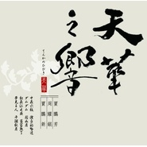

天华之响天華之響
============================

|  |  |
| :--: | :-- |
| [ 天华之响天華之響](https://emumo.xiami.com/album/577234) | **艺人**: [贾鹏芳](../index.md) **语种**: 国语 **唱片公司**: 天华音乐 **发行时间**: 2009年05月01日 **专辑类别**: 录音室专辑 **专辑风格**:  **播放数**: 1 **收藏数**: 39 **评论数**: 3  |

## 简介

贾鹏芳、周耀锟、贾鹏新ーソリストとして第一線で活躍する三人の二胡演奏家の競演を、二胡独奏曲の名曲からクラシック曲まで幅広い曲目で堪能できるCD。

## 曲目

- [中花六板](./577234/xLzF7db4dc8.md)
- [洁白的哈达](./577234/mQEGI48015e.md)
- [达姆达姆](./577234/mQEGI55f2cc.md)
- [关山月](./577234/xLzF7gd030b.md)
- [松花江之夜](./577234/xLzF7h15f07.md)
- [葡萄熟了](./577234/mQEGI875396.md)
- [夢見る人](./577234/bqvm9Cd3c2a6.md)
- [平湖秋月](./577234/xLzF7kbd06c.md)

## 评论

|  |  |  |  |
| :-- | :-- | :-- | :-- |
|  [虾米用户](https://emumo.xiami.com/u/3226613) 我还没想好要写什么... 2014-09-13 22:21 赞(0) 踩(0) | 
想听……
 |
|  [虾米用户](https://emumo.xiami.com/u/7322777) ∮ 2014-07-02 19:18 赞(0) 踩(0) | 
...A....
 |
|  [虾米用户](https://emumo.xiami.com/u/637279)  2013-08-17 22:40 赞(0) 踩(0) | 
好想听好想听好想听啊啊啊啊啊啊啊啊啊！！！！
 |
