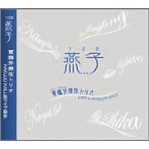

燕子つばめ / YANZ / Yanzi
============================

|  |  |
| :--: | :-- |
| [ 燕子つばめ / YANZ / Yanzi](https://emumo.xiami.com/album/577235) | **艺人**: [贾鹏芳](../index.md) **语种**: 国语 **唱片公司**: Pacific MOON **发行时间**: 2008年08月12日 **专辑类别**: 录音室专辑 **专辑风格**:  **播放数**: 27 **收藏数**: 33 **评论数**: 3  |

## 简介

这张专辑是贾鹏芳2006年7月在日本九久馆（Hakuju Hall）现场音乐会的部分录音合辑，有大家熟悉的老曲子，也有新曲，而且都是由久违的恩田直幸担任编曲制作。

## 曲目

- [天赐恩宠Amazing Grace](./577235/xLzF7l9f079.md)
- [梦迹沙河Mirage Of The Fall](./577235/xLzF7mbe1c3.md)
- [二泉映月](./577235/xLzF7nc6463.md)
- [怀夫歌电视剧《大长今》插曲 / Onara](./577235/8GkEvOee9ac.md)
- [燕子](./577235/b1pX80J4052c.md)
- [河南小曲](./577235/xLzF7qbbb28.md)
- [明日Tomorrow](./577235/8GkEvR1c81a.md)
- [赛马](./577235/bCkI7pw4abb3.md)

## 评论

|  |  |  |  |
| :-- | :-- | :-- | :-- |
|  [虾米用户](https://emumo.xiami.com/u/2701140)  2015-11-21 17:51 赞(0) 踩(0) | 
这张专辑算是比较诡异的。。。
 |
|  [虾米用户](https://emumo.xiami.com/u/5662640) 失落 2015-03-05 12:47 赞(0) 踩(0) | 
贾鹏芳，收录
 |
|  [虾米用户](https://emumo.xiami.com/u/7322777) ∮ 2014-07-02 19:18 赞(0) 踩(0) | 
...A...
 |
