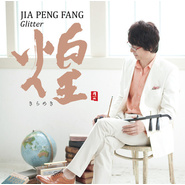
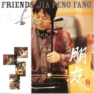
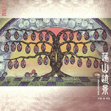
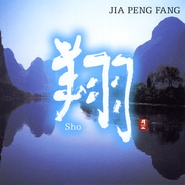
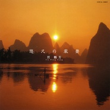
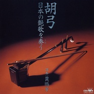

贾鹏芳
============================

|  |  |
| :--: | :-- |
| [ 贾鹏芳](https://i.xiami.com/jiapengfang) | **地区**: Japan 日本 **风格**: 中国民乐 Chinese Folk Music, 华语唱作人 Chinese Singer-Songwriter, 新世纪音乐 New Age **播放数**: 19660109 **粉丝数**: 37768 **评论数**: 1538  |

## 档案

小档案 
中   文   名：   贾鹏芳 
外   文   名：   无 
国        籍：   中国 
出   生   地：   黑龙江省佳木斯市 
出生日期：   1958  年  4  月 
职        业：   二胡演奏家 
代表作品：   《东京归来》、《  Roman   浪漫》、《凡庸》等多张专辑和精选辑 
简介 
贾鹏芳，  1958  年  4  月生于黑龙江省佳木斯市。二胡演奏家、中国音乐家协会、日本东洋音乐学会会员。  1978  年进入中央民族乐团。  1979  年开始任该团二胡独奏演员，  1984  年开始任该团民族管弦乐队副首席。  1980  年起，先后为北京人民广播电台，中央人民广播电台，中国国际广播电台等录制了多首二胡独奏曲。 
自幼受其兄影响，  8  岁开始学习二胡。先后为北京人民广播电台，中央人民广播电台，中国国际广播电台等录制了多首二胡独奏曲。他为了追求更高的艺术造诣，  1988  年留学日本。攻读日本艺术院校最高学府东京艺术大学大学院，并获得硕士学位。旅日后，幸会日本著名作曲家、日本作编曲家协会会长服部克久先生，并在其音乐会中被特约为常任独奏演奏家，往返于日本及世界各地音乐舞台。  1997  年，他在纽约卡内基音乐大厅与纽约现代管弦乐团的合奏创举，更是奠定了其作为世界一流演奏家不可动摇的地位。 
生平经历 
少年 
贾鹏芳生于黑龙江省佳木斯，在文化大革命开始的  1965  年他八岁的时候，得到了一把二胡。邻近苏联边境从北京坐火车都要  30  个钟头才到的北方小城——佳木斯也不可避免地受到文化大革命的狂风暴雨的浩劫，其实他能拿到的那把二胡也是因为参加“毛泽东思想宣传队”的缘故。  16  岁的时候，在大哥们的资助下，他到北京拜师学艺去了。当时的中国是不能随便改户口的，农村出身的人也不能在城市生活。  16  到  18  岁的时候，贾鹏芳在得不到口粮配给的情况下，在叔母家的阳台作了一个一米见方的围棚，以成为专业演奏家为目标每天不断坚持练习。终于，以他的实力可以时不时代替老师演奏了。然而在海政歌舞团的入团考试当天，唐山大地震发生，考试也随之中止，只能放弃入团。半年后，因为文革政策，他不得不回佳木斯务农。 
文革结束社会安定后，他收到一封信。原来是他以前的老师给他的，信中劝他去考音乐大学。就在他再次上京突破  500  选  1  的难关合格的时候，一位考官——中国中央民族乐团的  concert master  （乐团首席）极力劝他入团。考虑到能拿到北京户口和生活的保障，他同意了，从此就作为专业的演奏家参加乐团活动。 
1988    年——人生转折 
以发掘被文革破坏的民族曲艺和艺术启蒙为己任而坚持演奏活动，已被任命为乐团副首席的贾鹏芳，为了追求新的艺术可能，一个衣箱一把二胡就来了日本。 
一边打各种短工一边寻找演奏的工作时，有了转机——他遇到了音乐家服部克久。被贾鹏芳的才能和二胡的音色所折服的服部克久，在自己的专辑制作和音乐会活动中大胆起用贾鹏芳，开拓了贾鹏芳的音乐世界。那时，进东京艺术大学大学院的愿望也实现了。 
1997    年——新的艺术人生 
在纽约卡内基音乐厅与管弦乐团的合奏，奠定了他作为二胡演奏者不可动摇的地位。另外，  1998  年  6  月以和平之月品牌的处女作《  River   河》里对西洋乐器和中国民族乐器的融合所做的尝试和高品质，得到了国内外很高的评价，销售也取得了成功。  1999  年推出进一步推进此概念的专辑《  Rainbow   虹》取得了比前作更大的成功。 
后来的日子里，贾鹏芳在和平之月又陆续推出了《  Faraway   遥》、《  Sho   翔》、《  Roman   浪漫》、《  Erhu   二胡》、《  Moonlight   月光》等多张专辑和精选辑，进一步将二胡这种中国传统的民族乐器推向全世界。 
主要作品 
2015  年  11  月三国志組曲   ~  二胡とシンフォニック  ・  オーケストラの出會い  ~ 
2014  年  01  月煌  (Glitter) 
2011  年  10  月一抹天香 
2011  年  03  月四季  (Seasons /   シーズンズ  ) 
2010  年  01  月贾鹏芳作品特别版 
2009  年  11  月  Twilight 
2009  年  10  月朋友  (Friends) 
2009  年  05  月天华之响  (  天華之響  ) 
2008  年  12  月明天  (Tomorrow)

## 专辑

| 名称 | 语种 | 唱片公司 | 发行时间 | 专辑类别 | 专辑风格 |
| :--: | :-- | :-- | :-- | :-- | :-- |
| [ 茉莉芬芳](./albums/2103719131.md) | 国语 | 源丰泰坤 | 2018年05月28日 | 录音室专辑 | 中国民乐 Chinese Folk Music |
| [ 组曲 忠臣蔵 ～义よ永远に～](./albums/2102959581.md) | 英语 | Universal Music | 2017年11月22日 | 录音室专辑 | 世界音乐 World Music |
| [ 三国志組曲 第二番 ~二胡とシンフォニック・オーケストラで語る将軍伝説~三国志组曲 第二卷 ~二胡和交响乐乐团诉说将军传说~](./albums/2102659267.md) | 其他 | Universal Music Japan | 2016年12月07日 | 录音室专辑 |  |
| [ こころふれあい ~二胡がさそう郷愁~](./albums/2102721604.md) | 其他 | Universal Music Japan | 2016年06月15日 | 录音室专辑 |  |
| [ 三国志組曲 ~二胡とシンフォニック・オーケストラの出會い~三国志组曲 ~二胡与交响乐团的邂逅~](./albums/403223.md) | 其他 | Universal Music | 2015年11月18日 | 录音室专辑 | 轻音乐 Easy Listening, 中国民乐 Chinese Folk Music |
| [ 煌Glitter](./albums/1890715345.md) | 其他 | 和平之月 | 2014年01月22日 | 录音室专辑 | 轻音乐 Easy Listening, 新世纪音乐 New Age, 中国民乐 Chinese Folk Music, 中国风 China-Wave |
| [ 一抹天香](./albums/488867.md) | 其他 | 火烈鸟文化 | 2011年10月18日 | 录音室专辑 | 轻音乐 Easy Listening |
| [ 四季Seasons / シーズンズ](./albums/434490.md) | 日语 | 和平之月 | 2011年03月23日 | 录音室专辑 | 轻音乐 Easy Listening |
| [ 贾鹏芳作品特别版](./albums/1270674802.md) | 国语 | 天华音乐 | 2010年01月12日 | EP, 单曲 |  |
| [ Twilight](./albums/456728.md) | 日语 | Pacific MOON | 2009年11月27日 | 录音室专辑 | 轻音乐 Easy Listening |
| [ 朋友Friends](./albums/388320.md) | 其他 | 和平之月 | 2009年10月21日 | 录音室专辑 | 轻音乐 Easy Listening |
| [ 天华之响天華之響](./albums/577234.md) | 国语 | 天华音乐 | 2009年05月01日 | 录音室专辑 |  |
| [ 明天Tomorrow](./albums/348800.md) | 其他 | Pacific MOON | 2008年12月17日 | 录音室专辑 | 轻音乐 Easy Listening |
| [ 燕子つばめ / YANZ / Yanzi](./albums/577235.md) | 国语 | Pacific MOON | 2008年08月12日 | 录音室专辑 |  |
| [ 想Memories / Jia Peng Fang Best](./albums/336219.md) | 其他 | Pacific MOON | 2007年12月19日 | 精选集 | 轻音乐 Easy Listening |
| [ 夜想曲NOCTURNE](./albums/397167.md) | 日语 | 和平之月 | 2007年06月20日 | 录音室专辑 | 轻音乐 Easy Listening |
| [ 休日HOLIDAY](./albums/397205.md) | 日语 | 和平之月 | 2006年12月20日 | 录音室专辑 | 轻音乐 Easy Listening |
| [ 月光MOONLIGHT](./albums/1893.md) | 纯音乐 | Pacific MOON | 2006年01月18日 | 录音室专辑 | 轻音乐 Easy Listening |
| [ 二胡 IILOVERS / JIA PENG FANG BEST](./albums/444472.md) | 日语 | 和平之月 | 2004年10月20日 | 精选集 | 轻音乐 Easy Listening |
| [ 浪漫ROMAN](./albums/1895.md) | 其他 | Pacific MOON | 2003年12月01日 | 录音室专辑 | 轻音乐 Easy Listening |
| [ 十二国記 蓬山遠景～胡弓 Memories](./albums/1897.md) | 其他 | Victor Entertainment | 2003年06月21日 | 录音室专辑 | 轻音乐 Easy Listening |
| [ 翔SHO](./albums/1899.md) | 其他 | Pacific MOON | 2003年03月01日 | 录音室专辑 | 轻音乐 Easy Listening |
| [ 紫翠水明~遥なる二胡のしらべ~](./albums/1900.md) | 其他 | Della | 2002年11月12日 | 录音室专辑 | 轻音乐 Easy Listening |
| [ 遥FARAWAY...](./albums/1901.md) | 其他 | Pacific MOON | 2002年10月01日 | 录音室专辑 | 轻音乐 Easy Listening |
| [ 二胡ERHU / JIA PENG FANG BEST](./albums/1902.md) | 其他 | Pacific MOON | 2002年03月01日 | 精选集 | 轻音乐 Easy Listening |
| [ 虹RAINBOW](./albums/1903.md) | 其他 | Pacific MOON | 2000年10月01日 | 录音室专辑 | 轻音乐 Easy Listening |
| [ 【合并】ワダツミの木](./albums/467779.md) | 国语 |  | 1999年11月30日 | 录音室专辑 |  |
| [ 河RIVER](./albums/1904.md) | 其他 | Pacific MOON | 1999年04月01日 | 录音室专辑 | 轻音乐 Easy Listening |
| [ 悠久の風景悠久的风景](./albums/1898.md) | 其他 | Nippon Columbia | 1998年02月21日 | 录音室专辑 | 轻音乐 Easy Listening |
| [ 胡弓～日本の艶歌を奏う](./albums/424867.md) | 其他 | Nippon Crown | 1995年03月24日 | 录音室专辑 | 轻音乐 Easy Listening |
| [ 華弦~心揺さぶる胡琴の旋律 ](./albums/399203.md) | 其他 | Victor Entertainment | 1994年05月21日 | 录音室专辑 | 轻音乐 Easy Listening |

## 评论

|  |  |  |
| :-- | :-- | :-- |
|  [虾米用户](https://emumo.xiami.com/u/22994668)  2021-01-04 14:34 赞(0) 踩(0) | 
坦白说，编曲或有特色，若相比中国民乐大师，境界尚需焙火以修。
 |
|  [虾米用户](https://emumo.xiami.com/u/757994) J-POP命！ 2020-05-16 09:56 赞(0) 踩(0) | 
好期待大师来一曲菊次郎的头七 
 |
|  [虾米用户](https://emumo.xiami.com/u/442282433)  2020-04-29 02:59 赞(1) 踩(0) | 
评论区有毒吧。别人只是恰好在日本发展而且曲子弹的好，中国也有很多古典乐器和音乐曲子做的好的人。你就算是管中窥豹也不能这样窥吧，一上来就是谁谁音乐发展更好。我不搞音乐，单纯觉得好听。
 |
|  [虾米用户](https://emumo.xiami.com/u/377112509)  2020-04-23 10:55 赞(1) 踩(0) | 
你们能不能闭嘴听歌 本来就是安静浪漫的曲子 搞得这样争锋相对
 |
|  [虾米用户](https://emumo.xiami.com/u/13060658) 亦余心之所善兮，虽九死其... 2020-04-07 10:46 赞(2) 踩(0) | 
中国人谱写的古风音乐，下面的评论都很少超过999，诸君既然都不去听，也不关注，又何来的张口就言中国对古乐器，古音乐的传承不如日本？所谓的毫不带偏见的说事，张嘴就来我国不如日本，请问各位何德何能，能站在整个圈层的制高点上夸夸其谈？从不支持国内音乐，也请不要信口雌黄！没有任何人有资格对一个圈层下定义，对历史和文化没有任何贡献没有任何付出，我们都不配张嘴，那些黄口小儿，请闭嘴！
 |
|  [虾米用户](https://emumo.xiami.com/u/276944698) 不要自我设限..... 2020-03-28 21:30 赞(1) 踩(0) | 
⛎⛎⛎
 |
|  [虾米用户](https://emumo.xiami.com/u/2174863) 无想 2020-02-22 20:13 赞(0) 踩(0) | 
真正的大师
 |
|  [虾米用户](https://emumo.xiami.com/u/426763162)  2020-01-15 21:10 赞(0) 踩(0) | 
这个和声版本编得真日系 真好听
 |
|  [虾米用户](https://emumo.xiami.com/u/2763071) 冰冷的狂热 2019-08-03 21:27 赞(1) 踩(0) | 
哦哦，抱歉，我是来看各位的评论的
 |
|  [虾米用户](https://emumo.xiami.com/u/228463744) 我们只是想交换灵魂。喝酒... 2019-07-05 11:23 赞(0) 踩(0) | 
大师
 |
|  [虾米用户](https://emumo.xiami.com/u/166780998)  2019-05-08 12:46 赞(3) 踩(0) | 
在我15岁时，我看到了一篇文章，是关于时尚的，但是引起我注意的却是其中的中国文化，团扇。那时候我看完的第一感想就是中国文化还是有人在坚持的，当时就是觉得心酸又感动，再之后的好几年也陆陆续续看到了不少关于我国文化的传承一类，各行各业都有【动画、书画、音乐、古典舞、服饰、语言文化、膳食、游戏等】到如今的二胡，每次看到或听到时都会产生一种（啊，我国的文化还是流传下来了，还可以走出国门，一定会做得更好的）这种想法，在这里我只想对每一位认真做自己事业，每一位坚持自己理想的同袍们说一声，幸苦了，未来可期
 |
|  [虾米用户](https://emumo.xiami.com/u/424002155)  2019-05-01 20:26 赞(0) 踩(0) | 
  我心中永远的第一大作！最美的是音乐！
 |
|  [虾米用户](https://emumo.xiami.com/u/376433458) 收集教宝宝b 2019-03-15 12:10 赞(1) 踩(0) | 
希望 二胡 尺八 还有所有悲泣之类的乐器 来一场 超级捶泪炸弹演奏会 ！奏哭全世界 
 |
|  [虾米用户](https://emumo.xiami.com/u/345066210)  2019-03-14 19:50 赞(0) 踩(0) | 
西洋乐器与二胡的完美结合，乐队的大气烘托二胡的倩丽婉约。
 |
|  [虾米用户](https://emumo.xiami.com/u/35444733)  2019-03-09 10:14 赞(0) 踩(0) | 
佳木斯的骄傲！嘿嘿！
 |
|  [虾米用户](https://emumo.xiami.com/u/41504338) 无时不刻浪漫着 2019-01-17 18:46 赞(0) 踩(0) | 
没有版权好难过啊，找其他app也没有 
 |
| ⇒ |  [虾米用户](https://emumo.xiami.com/u/418784269)  2019-07-29 23:04 赞(0) 踩(0) | 
网易云好像挺多的
 |
|  [虾米用户](https://emumo.xiami.com/u/6121035) from here to... 2018-11-19 20:01 赞(0) 踩(0) | 
封面照看着像堺雅人 
 |
|  [虾米用户](https://emumo.xiami.com/u/32782633) “你心中有多少温柔才不会... 2018-08-26 22:03 赞(20) 踩(0) | 
晚上和妈妈去散步，隐隐听到二胡演奏声，近看是一位老先生，一身中山装，知识分子的儒雅风度&amp;hellip;&amp;hellip;  &amp;ldquo;忽然，觉得&amp;hellip;&amp;rdquo;  自己的一生也应该有一些这个时刻，在一个小角落里，静静拉琴，不为别人，只为自己
 |
|  [虾米用户](https://emumo.xiami.com/u/331782267)  2018-08-23 02:38 赞(5) 踩(0) | 
只能说，中国不缺人才，但为什么一定要到了墙外才能香?
 |
| ⇒ |  [虾米用户](https://emumo.xiami.com/u/1626082) 保持好奇，保持敏锐！ 2018-11-28 20:41 赞(0) 踩(0) | 
中国人太多，有才没人脉、单纯靠才华出头 得多幸运有多少贵人伯乐啊... :0
 |
| ⇒ |  [虾米用户](https://emumo.xiami.com/u/331782267)  2018-12-04 11:21 赞(0) 踩(0) | 
<q><b>w2jmoe说：</b></q>
 |
|  [虾米用户](https://emumo.xiami.com/u/19861496) 音乐带你走进另一个世界 2018-08-18 09:34 赞(2) 踩(0) | 
昨天去音乐厅看了贾老师的音乐会，演奏了《不说话》《睡莲》《墨迹》《自由的大地》《赛马》&amp;hellip;&amp;hellip;他看起来为什么辣么年轻！
 |
| ⇒ |  [虾米用户](https://emumo.xiami.com/u/2288542)  2018-10-23 01:46 赞(0) 踩(0) | 
在哪里开音乐会？
 |
| ⇒ |  [虾米用户](https://emumo.xiami.com/u/19861496) 音乐带你走进另一个世界 2018-10-23 23:58 赞(0) 踩(0) | 
<q><b>feijiangjun说：</b></q>
 |
| ⇒ |  [虾米用户](https://emumo.xiami.com/u/1626082) 保持好奇，保持敏锐！ 2018-11-28 20:42 赞(0) 踩(0) | 
怕也是每天早上用自来水洗脸吧？... /www @荒木飞吕彦
 |
|  [虾米用户](https://emumo.xiami.com/u/34522244)  2018-07-31 06:14 赞(3) 踩(0) | 
二胡的声音太传神 道尽人生悲凉
 |
|  [虾米用户](https://emumo.xiami.com/u/5555764) 阿Ken 2018-06-21 18:30 赞(4) 踩(0) | 
如果我们国家多些像贾鹏芳，林海的音乐人多好
 |
|  [虾米用户](https://emumo.xiami.com/u/97804464) 往事随风终成空 2018-06-19 01:02 赞(0) 踩(0) | 
虾米评论简直不忍直视，如果中国文化真的那么容易就被别国传承了，那这个世界早就不存在国家了。听个音乐都听的没劲
 |
|  [虾米用户](https://emumo.xiami.com/u/268729149) 先熄掉心跳才能拥抱 2018-05-28 12:26 赞(3) 踩(0) | 
我只听我喜欢的，哪国的无妨 
 |
|  [虾米用户](https://emumo.xiami.com/u/357674040)  2018-05-09 07:08 赞(0) 踩(0) | 

 |
|  [虾米用户](https://emumo.xiami.com/u/363752322)  2018-05-05 17:41 赞(0) 踩(0) | 
贾自称当时对国内传统音乐乐坛失望，去了日本却走了newage、动漫影视配乐的路子。 只能说人各有志，鸡有鸡的悲剧，鸭有鸭的喜剧。
 |
| ⇒ |  [虾米用户](https://emumo.xiami.com/u/12233120) 新之助 2018-06-13 08:03 赞(0) 踩(0) | 
只能说，良禽择槽木而栖.
 |
|  [虾米用户](https://emumo.xiami.com/u/97632344)  2018-04-19 12:16 赞(11) 踩(0) | 
听个音乐你们戏真多
 |
|  [虾米用户](https://emumo.xiami.com/u/7250151)  2018-04-12 22:32 赞(1) 踩(0) | 
乐感太美，恰似美酒甘泉，沁人心脾
 |
| ⇒ |  [虾米用户](https://emumo.xiami.com/u/267963599) 夏日的木叶不会凋零 2018-06-19 16:27 赞(0) 踩(0) | 
是啊
 |
|  [虾米用户](https://emumo.xiami.com/u/24325936) 无忧无虑，向前游。。。 2018-03-20 13:40 赞(0) 踩(0) | 
贾君鹏？
 |
|  [虾米用户](https://emumo.xiami.com/u/1688392)  2018-03-12 21:37 赞(2) 踩(0) | 
下架好多啊。百度自取，低调：1da997Cd3QMebuIM5_xPncw/6666
 |
| ⇒ |  [虾米用户](https://emumo.xiami.com/u/360596230)  2018-04-27 22:48 赞(0) 踩(0) | 
丶\
 |
| ⇒ |  [虾米用户](https://emumo.xiami.com/u/338098002)  2019-07-31 23:20 赞(0) 踩(0) | 
怎么下
 |
|  [虾米用户](https://emumo.xiami.com/u/2282124) 西风吹雨长路遥，葬花落魄... 2018-01-29 23:38 赞(0) 踩(0) | 
贾鹏芳的某些作品，总是抓住人心灵的脆弱之处予以抚慰，触景伤情，不禁潸然泪下......
 |
|  [虾米用户](https://emumo.xiami.com/u/32670582) 暂无签名~ 2018-01-18 14:02 赞(0) 踩(0) | 
黑龙江，松花江畔的佳木斯，是一个钟灵毓秀的好地方
 |
|  [虾米用户](https://emumo.xiami.com/u/52796626)   2018-01-16 11:19 赞(3) 踩(0) | 
小时候总觉得西洋乐器庄重高级，现在才感受到民乐的魅力，尤其喜欢二胡，行云流水一样的声音，真是如泣如诉，如怨如慕。
 |
|  [虾米用户](https://emumo.xiami.com/u/2491381) 只不过是个 2018-01-11 19:03 赞(4) 踩(0) | 
我想去听贾鹏芳的现场，不知道有没有  
 |
| ⇒ |  [虾米用户](https://emumo.xiami.com/u/266853049) 往前飞 2018-01-28 22:25 赞(0) 踩(0) | 
很多人都在这里争论中国音乐日本音乐，而我想的却和你一样！
 |
| ⇒ |  [虾米用户](https://emumo.xiami.com/u/2701140)  2018-03-25 00:22 赞(0) 踩(0) | 
8年前在中央民族乐团音乐厅开演奏会的时候有幸去现场了~~
 |
|  [虾米用户](https://emumo.xiami.com/u/336640648) To bare,to l... 2018-01-03 14:55 赞(0) 踩(0) | 
評論一堆作妖的。敗壞。
 |
|  [虾米用户](https://emumo.xiami.com/u/45597478) 啾啾莺燕何时还，夭夭之桃... 2017-11-17 13:58 赞(4) 踩(0) | 
昔日幽王戏褒姒，烽火连天招蛮戎。 仲尼周游敬祖制，九鼎入秦寻无踪。 深衣白袍分两界，寒门望族路不同。 南北分战江浸血，狼狄左衽始越陇。 两唐中周喜胡风，佛道相轻见峥嵘。 塞外有蓝胜群青，方令白瓷绘颜色。 唐肥宋瘦佳人美，明好男风龙阳宠。 自古风尚几轮转，何须夏日哀春穷。
 |
|  [虾米用户](https://emumo.xiami.com/u/5811443)  2017-11-05 12:06 赞(0) 踩(0) | 
二胡
 |
|  [虾米用户](https://emumo.xiami.com/u/9552691)  2017-10-30 10:10 赞(0) 踩(0) | 
很多人都喜欢莎木系列的音乐，特别是那悠扬的二胡声使人陶醉。但是没有多少人知道这些音乐出自何人之手。这带着浓郁中国特色的音乐就是出自旅日中国音乐家协会会员－贾鹏芳。
 |
|  [虾米用户](https://emumo.xiami.com/u/565987) 苏打D 2017-10-30 10:08 赞(2) 踩(0) | 
作品年表 服部克久〖音乐田地6〗〖音乐田地7〗〖音乐田地8〗〖音乐田地12〗〖音乐田地14〗 长野残废人奥运会冬季比赛主题歌〖出发之时-Asian Dream-〗 宗次郎〖风人〗〖鸟之歌〗 久石让〖I am〗〖怪物姬Image Album〗 中森明菜〖二人静〗 南高节〖心里的虹〗 Oyunna〖亚洲发见〗主题歌 永井龙云〖血〗 吉几三〖大黄河〗 S.E.N.S.〖故宫〗〖非情城市电影音乐〗 仙波清彦〖Jasmin Talk〗 渡边香津美〖Oyatsu2远足〗 金子飞鸟〖神话的时代〗 Fence of Defence〖三国志〗 .....
 |
|  [虾米用户](https://emumo.xiami.com/u/5042720)  2017-10-28 00:34 赞(1) 踩(0) | 
很优美  很赞  很好听 不论中日关系怎样，音乐艺术无界限，与政治无关。中国的，民俗的音乐应该得到大家更多的尊重，保护和关注。
 |
|  [虾米用户](https://emumo.xiami.com/u/1449747)  2017-10-28 00:34 赞(2) 踩(0) | 
某种程度上，中国传统音乐要发展得跑到日本去，中国民俗在比生物灭种的速度还快的遗失。中国传统音乐在国内市场狭小，文化不行。音乐方面看看苏联解体后的原苏联加盟国现在流行的都是什么东西？（罗马尼亚、俄罗斯、保加利亚。。。劲舞---DJ劲舞---劲舞---DJ劲舞……）
 |
|  [虾米用户](https://emumo.xiami.com/u/1550031) 我还没想好要写什么... 2017-10-28 00:23 赞(0) 踩(0) | 
我才说国人的二胡演绎除却传统终于可以走向国际感了，米想到还是个旅日的，连曲名都是片平假名，不是个这吧……贾鹏芳和梁邦彦是不是一个人？不是一个人也可以高山流水了！除了音乐风云榜的歌曲我都听，怎么样吧我就是别扭人儿……
 |
|  [虾米用户](https://emumo.xiami.com/u/5712440)  2017-10-28 00:08 赞(0) 踩(0) | 
喜欢和平之月相关的一切
 |
|  [虾米用户](https://emumo.xiami.com/u/3112386)  2017-10-27 23:59 赞(0) 踩(0) | 
二胡，喜欢和平之月。
 |
|  [虾米用户](https://emumo.xiami.com/u/1289295)  2017-10-27 23:57 赞(1) 踩(0) | 
此人简直是胡神，拉的二胡让你流泪如水。。。
 |
|  [虾米用户](https://emumo.xiami.com/u/1679996) 2019 2017-10-27 23:55 赞(0) 踩(0) | 
唯美的二胡，给人内心的洗涤是无止境的.....强烈推荐。在这喧闹的世界里，带上耳机静静听贾鹏芳带给我们心灵的慰藉......
 |
|  [虾米用户](https://emumo.xiami.com/u/543723) 戳手指【默 2017-10-27 23:29 赞(0) 踩(0) | 
二胡啊……不知道是不是和最近自己迷古风有关系……
 |
|  [虾米用户](https://emumo.xiami.com/u/44364141) 暂无签名~ 2017-10-27 23:29 赞(8) 踩(0) | 
中国的好人才不少   为什么都去外国发展了？ 中国人应该好好反思一下 天天愤青爱国 那就拿出真本事爱国   不要那么片面什么有钱了才能欣赏   不止音乐   艺术是无国界的  有些人非要加上隔膜才好么
 |
| ⇒ |  [虾米用户](https://emumo.xiami.com/u/369819275)  2018-06-04 05:17 赞(0) 踩(0) | 
贾是因为上个世纪六七十年代的缘故
 |
|  [虾米用户](https://emumo.xiami.com/u/392780)  2017-10-27 23:21 赞(0) 踩(0) | 
其实是喜欢和平之月的专辑，但是鉴于更为喜欢其中关于二胡的音乐所以喜欢贾先生。
 |
|  [虾米用户](https://emumo.xiami.com/u/8538056) Absolutely 2017-10-27 23:09 赞(0) 踩(0) | 
NIGHT OF BEIJING 北京之夜，竟然排在TOP100第51位，额滴神啊！这什么情况啊？现在的人品味都太高了是么？还是我品味太差了啊！
 |
|  [虾米用户](https://emumo.xiami.com/u/7148029) 学吉他中... 2017-10-12 12:55 赞(0) 踩(0) | 
神韵
 |
|  [虾米用户](https://emumo.xiami.com/u/8661521)  2017-09-25 13:03 赞(1) 踩(0) | 
第一次听  不明何故眼角湿润
 |
|  [虾米用户](https://emumo.xiami.com/u/325192577)  2017-09-15 22:02 赞(0) 踩(0) | 
民乐
 |
|  [虾米用户](https://emumo.xiami.com/u/153013324) 粤语经典，古风禅乐new... 2017-09-03 14:49 赞(2) 踩(0) | 
自己喜欢就好，什么大师，什么国内外，什么爱国等命题都是可笑无知，小孩子迷妹们的见识而己，只要自己觉得好就行，强迫他人赞同甚至非此即彼的思维还是留给野蛮人吧
 |
|  [虾米用户](https://emumo.xiami.com/u/43919543) 你的人生不需向任何人解释... 2017-08-31 17:13 赞(1) 踩(0) | 
古风古韵
 |
|  [虾米用户](https://emumo.xiami.com/u/60946858)  2017-07-20 18:57 赞(0) 踩(0) | 
背景音乐
 |
|  [虾米用户](https://emumo.xiami.com/u/4261281)  2017-07-15 20:35 赞(0) 踩(0) | 
賈鵬芳
 |
|  [虾米用户](https://emumo.xiami.com/u/43508780) 胖古古 2017-07-01 20:32 赞(2) 踩(0) | 
纵使才华横溢 也抵不过是身在异乡的孤寂
 |
|  [虾米用户](https://emumo.xiami.com/u/44639935)  2017-06-24 23:47 赞(1) 踩(0) | 
只管听歌，哪管唱歌的人是谁！在心底默默的感激唱歌的这个人就好了
 |
|  [虾米用户](https://emumo.xiami.com/u/16852456) 理想是御用配乐师(/ω＼... 2017-06-11 00:16 赞(0) 踩(0) | 
原来玩的三国志的配乐居然就是出自他手 那都是10多年前的事了
 |
|  [虾米用户](https://emumo.xiami.com/u/33145989) 音乐发烧友 2017-06-08 10:12 赞(0) 踩(0) | 
喜欢
 |
|  [虾米用户](https://emumo.xiami.com/u/38411615)  2017-06-01 20:18 赞(0) 踩(0) | 
传奇的一生   非常佩服 
 |
|  [虾米用户](https://emumo.xiami.com/u/300623269)  2017-05-30 23:04 赞(0) 踩(0) | 
第一次知道他是在专辑和平之月听见的 喜欢了很久
 |
|  [虾米用户](https://emumo.xiami.com/u/10369476)  2017-05-24 10:26 赞(0) 踩(0) | 
就是喜欢
 |
|  [虾米用户](https://emumo.xiami.com/u/295928074)  2017-05-21 12:02 赞(1) 踩(0) | 
睡莲很好听
 |
|  [虾米用户](https://emumo.xiami.com/u/294163913)  2017-05-12 09:42 赞(2) 踩(0) | 
就好好欣赏音乐不行吗？
 |
|  [虾米用户](https://emumo.xiami.com/u/9327494) http://www.x... 2017-04-27 12:33 赞(0) 踩(0) | 
love
 |
|  [虾米用户](https://emumo.xiami.com/u/71988220) 知命不懼 日日自新 2017-04-26 00:20 赞(3) 踩(0) | 
對音樂只有敬畏二字可言 其餘的多說無益
 |
|  [虾米用户](https://emumo.xiami.com/u/43650751)  2017-04-24 08:59 赞(1) 踩(0) | 
我听音乐一般只重旋律。是贾老师的《空山鸟语》直击心灵，让我第一次感受到乐器演奏者情绪与乐器的魅力。
 |
|  [虾米用户](https://emumo.xiami.com/u/18879901)   2017-04-21 00:28 赞(70) 踩(0) | 
我不反驳任何人，我只讲一个事实。一些旅日的民乐演奏者或者日本的作曲家的曲子评论数普遍多，而且评论中充斥着一些&amp;ldquo;日本继承中国文化之精髓&amp;rdquo;的言论。而一些正真的中国民族乐曲下面评论数却少的可怜，甚至无人问津。
 |
| ⇒ |  [虾米用户](https://emumo.xiami.com/u/246035078)  2017-06-03 13:31 赞(0) 踩(0) | 
最后一句的现象的确是的！ 今天才捕捉到了几位老艺术家的主页，有一位素有&amp;ldquo;神笛&amp;rdquo;之称，他的演奏作品梅花三弄真的很厉害啊！但是评论数量可以说是荒无人烟了 ，好的是评论里的人感觉都是真的爱笛之人了， （原谅我的渣文笔，哈哈）
 |
| ⇒ |  [虾米用户](https://emumo.xiami.com/u/18879901)   2017-06-03 21:10 赞(0) 踩(0) | 
<q><b>bet my life说：</b></q>
 |
| ⇒ |  [虾米用户](https://emumo.xiami.com/u/246035078)  2017-06-03 22:27 赞(0) 踩(0) | 
<q><b>KILLUA说：</b></q>
 |
| ⇒ |  [虾米用户](https://emumo.xiami.com/u/246035078)  2017-06-03 22:36 赞(0) 踩(0) | 
<q><b>KILLUA说：</b></q>
 |
| ⇒ |  [虾米用户](https://emumo.xiami.com/u/18879901)   2017-06-03 22:50 赞(0) 踩(0) | 
<q><b>bet my life说：</b></q>
 |
| ⇒ |  [虾米用户](https://emumo.xiami.com/u/246035078)  2017-06-03 23:01 赞(0) 踩(0) | 
<q><b>KILLUA说：</b></q>
 |
| ⇒ |  [虾米用户](https://emumo.xiami.com/u/2555708)  2018-01-20 18:17 赞(0) 踩(0) | 
原因很简单，日本的作曲更有味道，更好听，更具国际化
 |
| ⇒ |  [虾米用户](https://emumo.xiami.com/u/2555708)  2018-01-20 18:18 赞(0) 踩(0) | 
既有流行性，也有古典味道，中国的有点古板
 |
| ⇒ |  [虾米用户](https://emumo.xiami.com/u/18879901)   2018-01-20 19:11 赞(0) 踩(0) | 
<q><b>宇文雄目说：</b></q>
 |
| ⇒ |  [虾米用户](https://emumo.xiami.com/u/18879901)   2018-01-20 19:14 赞(0) 踩(0) | 
<q><b>宇文雄目说：</b></q>
 |
| ⇒ |  [虾米用户](https://emumo.xiami.com/u/2555708)  2018-02-06 06:52 赞(0) 踩(0) | 
<q><b>KILLUA说：</b></q>
 |
| ⇒ |  [虾米用户](https://emumo.xiami.com/u/2555708)  2018-02-06 06:58 赞(0) 踩(0) | 
<q><b>KILLUA说：</b></q>
 |
| ⇒ |  [虾米用户](https://emumo.xiami.com/u/18879901)   2018-02-06 22:32 赞(0) 踩(0) | 
<q><b>宇文雄目说：</b></q>
 |
| ⇒ |  [虾米用户](https://emumo.xiami.com/u/2555708)  2018-02-08 02:41 赞(0) 踩(0) | 
<q><b>KILLUA说：</b></q>
 |
| ⇒ |  [虾米用户](https://emumo.xiami.com/u/2555708)  2018-02-08 02:49 赞(0) 踩(0) | 
<q><b>KILLUA说：</b></q>
 |
| ⇒ |  [虾米用户](https://emumo.xiami.com/u/18879901)   2018-02-08 15:14 赞(0) 踩(0) | 
<q><b>宇文雄目说：</b></q>
 |
| ⇒ |  [虾米用户](https://emumo.xiami.com/u/2555708)  2018-02-08 19:22 赞(0) 踩(0) | 
<q><b>KILLUA说：</b></q>
 |
| ⇒ |  [虾米用户](https://emumo.xiami.com/u/302362787)  2018-06-13 21:48 赞(0) 踩(0) | 
悲华夏文明之沦丧。。。
 |
| ⇒ |  [虾米用户](https://emumo.xiami.com/u/37672121) 寄情于山水之间 2018-09-19 14:31 赞(0) 踩(0) | 
文化不自信，很正常的现象。当今社会的快捷需要快餐文化，我们文化传统有种曲高和寡的调调，因为那些本来就不是平民欣赏的东西，平民抛弃很正常。
 |
| ⇒ |  [虾米用户](https://emumo.xiami.com/u/7497937)  2020-03-01 17:06 赞(0) 踩(0) | 
事实证明，优胜劣汰，老百姓不瞎。
 |
|  [虾米用户](https://emumo.xiami.com/u/49745190)  2017-04-18 20:45 赞(2) 踩(0) | 
评论区好病态啊，有些人的生命里可能不存在好这种东西吧。。
 |
|  [虾米用户](https://emumo.xiami.com/u/196740700) Life's a str... 2017-04-17 20:39 赞(0) 踩(0) | 
听了让我沉思，让我感动。
 |
|  [虾米用户](https://emumo.xiami.com/u/259677268)  2017-04-10 18:33 赞(1) 踩(0) | 
好一曲睡莲，好一把二胡。可惜他出国了.........唉
 |
| ⇒ |  [虾米用户](https://emumo.xiami.com/u/336640648) To bare,to l... 2018-01-03 14:55 赞(0) 踩(0) | 
出國怎麼了&amp;hellip;&amp;hellip;
 |
|  [虾米用户](https://emumo.xiami.com/u/49640493) 网易云SAINTDONT... 2017-03-27 10:20 赞(0) 踩(0) | 

 |
|  [虾米用户](https://emumo.xiami.com/u/421459) 董小姐，你熄灭了烟，谈起... 2017-03-24 00:05 赞(0) 踩(0) | 
赞
 |
|  [虾米用户](https://emumo.xiami.com/u/278236290) 爱音乐爱ballet 2017-03-24 00:00 赞(0) 踩(0) | 
十二国记里的曲子 印象深刻，好听
 |
|  [虾米用户](https://emumo.xiami.com/u/468632)  2017-03-23 23:09 赞(0) 踩(0) | 
融合了新世纪风的中国元素更具有世界音乐的味道
 |
|  [虾米用户](https://emumo.xiami.com/u/14354507) 美好音乐相伴 2017-03-14 18:57 赞(1) 踩(0) | 
这是挺日本的音乐 没那么中国 日本文化虽然学于中国 但是早已脱离中国 人家日本传承的是他们的日本文化 最多算是弘扬了东亚文化
 |
|  [虾米用户](https://emumo.xiami.com/u/47199219) 万般皆苦，唯有自渡！ 2017-03-03 05:38 赞(1) 踩(0) | 
这才是中国的音乐！才是世界的音乐！
 |
|  [虾米用户](https://emumo.xiami.com/u/223234413)  2017-03-02 21:40 赞(0) 踩(0) | 
听了不止想学，对传统文化的敬佩更是对贾鹏芳老师坚持中国文化的艺术家们由衷的敬佩
 |
|  [虾米用户](https://emumo.xiami.com/u/11587987) 想你，想你 2017-02-18 13:23 赞(0) 踩(0) | 
想起我学到一半的二胡，，，
 |
|  [虾米用户](https://emumo.xiami.com/u/269293612)  2017-02-09 17:11 赞(3) 踩(0) | 
这音乐，比国内那些乱来的强多了
 |
|  [虾米用户](https://emumo.xiami.com/u/184095964)  2017-02-07 21:38 赞(0) 踩(0) | 
喜欢
 |
|  [虾米用户](https://emumo.xiami.com/u/1171396) 以前办不到的事情，未来也... 2017-01-29 19:51 赞(0) 踩(0) | 
0,0
 |
|  [虾米用户](https://emumo.xiami.com/u/18879901)   2017-01-28 22:53 赞(2) 踩(0) | 
这么多喜欢民乐的小伙伴，为什么我在生活中都没有碰到过 
 |
|  [虾米用户](https://emumo.xiami.com/u/16852456) 理想是御用配乐师(/ω＼... 2017-01-16 15:29 赞(0) 踩(0) | 
这不是中国人？
 |
| ⇒ |  [虾米用户](https://emumo.xiami.com/u/269293612)  2017-02-09 17:12 赞(0) 踩(0) | 
是中国人，只不过是在日本发展而已
 |
| ⇒ |  [虾米用户](https://emumo.xiami.com/u/16852456) 理想是御用配乐师(/ω＼... 2017-02-10 16:40 赞(0) 踩(0) | 
<q><b>一尊还酹江月说：</b></q>
 |
|  [虾米用户](https://emumo.xiami.com/u/261294437)  2017-01-12 14:30 赞(0) 踩(0) | 
为什么喜欢，随便说点什么？
 |
|  [虾米用户](https://emumo.xiami.com/u/72666568)  2017-01-04 11:55 赞(0) 踩(0) | 
听
 |
|  [虾米用户](https://emumo.xiami.com/u/5871201)  2017-01-03 23:57 赞(0) 踩(0) | 
贾鹏芳
 |
|  [虾米用户](https://emumo.xiami.com/u/256167176)  2016-12-27 01:27 赞(2) 踩(0) | 
二胡真的特别棒，演奏出来的都是情。我最早喜欢的二胡，也最喜欢的二胡是《好人一生平安》和《渴望》，当然，两年前又接触了贾鹏芳老师的曲子，我也特别喜欢，比如《睡莲》就是我很喜欢一首。二胡，它演奏出来的音乐总是饱含情意，因此，我最喜欢的乐器也就是二胡了 。最后说一下，音乐无国界，别说中国不好了，中国会心痛！！难道不是中国把你养大？
 |
|  [虾米用户](https://emumo.xiami.com/u/125828250)  2016-12-19 18:36 赞(0) 踩(0) | 
想让孩子在公司年会上演奏《芳春》，谁有这支曲子的伴奏啊？找了没有找到，请各位朋友帮帮忙～谢谢啦！
 |
|  [虾米用户](https://emumo.xiami.com/u/38626334) 可能 或许 大概 是个好... 2016-11-24 23:20 赞(2) 踩(0) | 
日本的 中国的怎么了？！ 艺术无国界 ！！！
 |
| ⇒ |  [虾米用户](https://emumo.xiami.com/u/51989815) 心满意足地去生活。 2017-01-07 10:06 赞(0) 踩(0) | 
艺术没国界，是指艺术能跨文化交流，欣赏，不是说艺术没有地域性，更不是漠视传统文化的理由。没有文化，民族就没有根基。
 |
| ⇒ |  [虾米用户](https://emumo.xiami.com/u/38626334) 可能 或许 大概 是个好... 2017-03-13 21:21 赞(0) 踩(0) | 
<q><b>黄稻谷说：</b></q>
 |
| ⇒ |  [虾米用户](https://emumo.xiami.com/u/51989815) 心满意足地去生活。 2017-03-13 23:21 赞(0) 踩(0) | 
<q><b>LILIHILILIHI说：</b></q>
 |
| ⇒ |  [虾米用户](https://emumo.xiami.com/u/51989815) 心满意足地去生活。 2017-03-13 23:23 赞(0) 踩(0) | 
<q><b>LILIHILILIHI说：</b></q>
 |
|  [虾米用户](https://emumo.xiami.com/u/40159126) 我还没想好要写什么... 2016-10-29 11:44 赞(0) 踩(0) | 
真正的大师
 |
|  [虾米用户](https://emumo.xiami.com/u/238935450) 宁静☆致远 2016-10-22 21:52 赞(0) 踩(0) | 
静静的睡莲。
 |
|  [虾米用户](https://emumo.xiami.com/u/2790273)  2016-10-12 20:55 赞(0) 踩(0) | 
二胡
 |
|  [虾米用户](https://emumo.xiami.com/u/8552878)  2016-10-07 12:35 赞(0) 踩(0) | 
喜欢
 |
|  [虾米用户](https://emumo.xiami.com/u/9198057) viktor 2016-09-12 12:58 赞(0) 踩(0) | 
Great mix of Erhu and Orchestra
 |
|  [虾米用户](https://emumo.xiami.com/u/86924612) 抠鼻】 2016-08-24 15:40 赞(0) 踩(0) | 
很喜欢贾老师的二胡演奏~每每会触动我的心。
 |
|  [虾米用户](https://emumo.xiami.com/u/208502083) 你不懂我,我不怪你 2016-08-03 16:54 赞(0) 踩(0) | 
好
 |
|  [虾米用户](https://emumo.xiami.com/u/43466037) 凛的冒险。釜山行（尾）。... 2016-08-02 13:18 赞(0) 踩(0) | 
1400
 |
|  [虾米用户](https://emumo.xiami.com/u/97747450) 我还没想好要写什么... 2016-07-31 15:07 赞(0) 踩(0) | 
2419
 |
|  [虾米用户](https://emumo.xiami.com/u/3696268)  2016-07-26 13:38 赞(2) 踩(0) | 
音乐透着你我，满满的敬意
 |
|  [虾米用户](https://emumo.xiami.com/u/803155)  2016-07-25 22:34 赞(0) 踩(0) | 
二鬼子编的什么玩意
 |
| ⇒ |  [虾米用户](https://emumo.xiami.com/u/12233120) 新之助 2018-04-23 00:30 赞(0) 踩(0) | 
傻*缺
 |
|  [虾米用户](https://emumo.xiami.com/u/28312818)  2016-07-23 14:47 赞(1) 踩(0) | 
弦音如我诉说己故事般哀愁。
 |
|  [虾米用户](https://emumo.xiami.com/u/10157899) 纯白色的天空 2016-07-06 07:52 赞(0) 踩(0) | 
原来是日本人啊
 |
|  [虾米用户](https://emumo.xiami.com/u/26993155)  2016-06-16 11:09 赞(0) 踩(0) | 
最喜欢的是睡莲
 |
|  [虾米用户](https://emumo.xiami.com/u/22265017)  2016-06-14 01:22 赞(3) 踩(0) | 
一梁半月栖，三更又鸡鸣。揭炉檀气腾，随风似叶徘。幽途凉意沁，萤燈几点落。周君唤吾返，车马伴客游。
 |
|  [虾米用户](https://emumo.xiami.com/u/140044192)   2016-06-13 20:17 赞(84) 踩(0) | 
日本传承中国音乐？呵呵。首先，日本有日本的民族音乐，调式大多为13467。中国有中国的民族音乐，五声调式。两者只能说影响，中国影响日本多一些。比如，日本的《樱花》fa和xi用得非常多，所以悲凉、异域。中国的《春江花月夜》没有fa和xI，所以稳重、大气一些。两者民族不同，国家不同，音乐形式更不同，怎么来的日本传承中国民族音乐一说？贾鹏芳是现代中国民乐，日本给他提供了相对好的发展空间，尊重音乐人，尊重好的音乐，无论什何种形式来自什么国家。我们这里可能只能有女子十二乐坊，耳朵的受众少，只能打扮得好看些，加入夸张表演。
 |
| ⇒ |  [虾米用户](https://emumo.xiami.com/u/7280945) 我要好好整理整理精选集了 2016-06-26 13:03 赞(0) 踩(0) | 
女子十二乐坊还不是在日本出道的  
 |
| ⇒ |  [虾米用户](https://emumo.xiami.com/u/47306820)  2017-11-03 21:38 赞(0) 踩(0) | 
女子十二乐坊也是在日本组建的
 |
| ⇒ |  [虾米用户](https://emumo.xiami.com/u/259854217)  2018-03-26 20:38 赞(0) 踩(0) | 
12356和13467的差别
 |
| ⇒ |  [虾米用户](https://emumo.xiami.com/u/331292596)  2019-04-02 09:36 赞(0) 踩(0) | 
您是外行
 |
| ⇒ |  [虾米用户](https://emumo.xiami.com/u/357019121) 人生是一场毫无意义的梦 2019-06-29 09:57 赞(0) 踩(0) | 
女子十二乐坊在日本出道，也是从日本火回国内的，虽然乐团属于中国，当年能大红大紫主要还是离不开日本音乐公司运作推广的！
 |
|  [虾米用户](https://emumo.xiami.com/u/28535064) 和光同尘 2016-06-05 11:23 赞(2) 踩(0) | 
旅居日本，乡愁是贾老师创作的不竭源泉，多少曲子透着思乡之情，无论是儿时的家乡还是精神的故土，都只能用来怀念了。
 |
| ⇒ |  [虾米用户](https://emumo.xiami.com/u/6242542)  2016-08-26 18:43 赞(0) 踩(0) | 
这个评价得好，《桜(さくら)》就是NO1了，百听不厌，每次听到这曲，就是中秋望月思父母的感觉
 |
|  [虾米用户](https://emumo.xiami.com/u/7248680) 音乐 2016-06-03 15:55 赞(6) 踩(0) | 
楼下的朋友.贾鹏芳的是中国元素加上西方的新世纪音乐.让听众听着有冥想.宋飞的音乐中国传统民乐.大众化.音乐的走向都不一样.他们做的东西都很不错.怎么会存在谁最好谁最差 呵呵
 |
|  [虾米用户](https://emumo.xiami.com/u/49909108) 请不要关注我，想一个人静... 2016-06-02 16:57 赞(0) 踩(0) | 
二胡国内是宋飞最好，推荐
 |
|  [虾米用户](https://emumo.xiami.com/u/48400435)  2016-05-30 23:14 赞(0) 踩(0) | 
音色很饱满，富有感情，打动人心
 |
|  [虾米用户](https://emumo.xiami.com/u/176461012)  2016-05-22 12:04 赞(0) 踩(0) | 
纯音乐
 |
|  [虾米用户](https://emumo.xiami.com/u/8007201)  2016-05-17 09:26 赞(0) 踩(0) | 
民乐之中，听得最多的，还是二胡。
 |
|  [虾米用户](https://emumo.xiami.com/u/5007293)  2016-05-04 20:41 赞(0) 踩(0) | 
喜欢
 |
|  [虾米用户](https://emumo.xiami.com/u/155044492)  2016-04-29 07:01 赞(1) 踩(0) | 
喜欢二胡
 |
|  [虾米用户](https://emumo.xiami.com/u/42720958) 痴醉 2016-04-17 12:32 赞(0) 踩(0) | 
一首睡莲，击中我的心。
 |
|  [虾米用户](https://emumo.xiami.com/u/6082125) Standing and... 2016-04-11 22:33 赞(0) 踩(0) | 
评论好累 静静听
 |
|  [虾米用户](https://emumo.xiami.com/u/6082125) Standing and... 2016-04-11 22:06 赞(0) 踩(0) | 
我真的很喜欢贾鹏芳这样类型的男士啊  很少有男偶像
 |
|  [虾米用户](https://emumo.xiami.com/u/6082125) Standing and... 2016-04-11 22:03 赞(0) 踩(0) | 
真的好帅！！
 |
|  [虾米用户](https://emumo.xiami.com/u/50172462)   2016-04-11 19:06 赞(3) 踩(0) | 
现在虾米中的渣滓太多了，多半是无脑民族主义者。
 |
| ⇒ |  [虾米用户](https://emumo.xiami.com/u/40162340)  2016-04-15 08:13 赞(0) 踩(0) | 
谁是你兄弟？  煞笔玩意 。音乐不分国界 那扯什么日本人的传承？ 贾先生的音乐和日本人的传承有鸡毛关系？
 |
|  [虾米用户](https://emumo.xiami.com/u/18879901)   2016-04-07 19:38 赞(8) 踩(0) | 
突然想到，很多人觉得这些旅日的音乐家的歌好听（包括我自己也觉得），是因为这些改编融合现在流行乐曲，我们都听惯了流行乐曲，自然就觉得这个好听。有的人就觉得日本继承了中华文化的精髓。让我感到害怕的一点是，我曾经也有这种想法，前段时间，找了很多歌版本的民乐来听，才觉得并不是那样，是我们听得太少了，我想，可怕的不是中国现在的音乐环境，而是抱有那种想法的我们。
 |
| ⇒ |  [虾米用户](https://emumo.xiami.com/u/3200106) 随心随意 2016-04-11 01:42 赞(0) 踩(0) | 
大陆没有培养传统音乐家流行向的环境。于是听流行听传统永远是分开的。旅日给的是融合风格的曲子，耳目一新。
 |
| ⇒ |  [虾米用户](https://emumo.xiami.com/u/18879901)   2016-04-11 07:46 赞(0) 踩(0) | 
<q><b>耶花花说：</b></q>
 |
| ⇒ |  [虾米用户](https://emumo.xiami.com/u/141862066) 我若盛开，蝴蝶自来。 2016-04-16 20:07 赞(0) 踩(0) | 
本来有点想学吉他呢，这段时间无意间听到中国的古典洞萧独奏，我一下子喜欢上了，好美，好有意境，就接着搜了些这方面的古典音乐，更加迷上了。嘿嘿(ಡωಡ)hiahiahia 看了你们的才知道原来日本在这儿方面做的比我们好，我不太了解。但我想我还是学这个洞箫吧，顺便感染一下我身边的人。嘿嘿(º﹃º&nbsp;)
 |
| ⇒ |  [虾米用户](https://emumo.xiami.com/u/18879901)   2016-04-17 18:24 赞(0) 踩(0) | 
<q><b>specialgirls说：</b></q>
 |
| ⇒ |  [虾米用户](https://emumo.xiami.com/u/141862066) 我若盛开，蝴蝶自来。 2016-04-18 08:00 赞(0) 踩(0) | 
<q><b>KILLUA说：</b></q>
 |
| ⇒ |  [虾米用户](https://emumo.xiami.com/u/18879901)   2016-04-18 19:34 赞(0) 踩(0) | 
<q><b>specialgirls说：</b></q>
 |
|  [虾米用户](https://emumo.xiami.com/u/55036485) 嗯，口味有点独特。 2016-04-06 01:02 赞(6) 踩(0) | 
对评论很失望
 |
|  [虾米用户](https://emumo.xiami.com/u/117316526) 忆梦语 2016-03-18 15:22 赞(1) 踩(0) | 
二胡演奏家，所演奏的乐章是无法用言语和笔墨能以形容的动人！
 |
|  [虾米用户](https://emumo.xiami.com/u/2876237) 闹呢 2016-03-07 23:35 赞(0) 踩(0) | 
★
 |
|  [虾米用户](https://emumo.xiami.com/u/50594832) 做正确的事，正确的做事。 2016-02-13 20:08 赞(0) 踩(0) | 
有点悲伤的曲调，总能勾起人性最深处的纯真！
 |
|  [虾米用户](https://emumo.xiami.com/u/104123026)  2016-01-30 10:54 赞(0) 踩(0) | 
贾鹏芳
 |
|  [虾米用户](https://emumo.xiami.com/u/3991706)  2016-01-28 15:55 赞(3) 踩(0) | 
中国从来不缺少好的音乐家，就是缺少好的环境能让他们发挥才能………
 |
|  [虾米用户](https://emumo.xiami.com/u/40162340)  2016-01-26 16:38 赞(1) 踩(0) | 
严格意义上他的大多数作品像是用传统国乐为基酒加上二胡这件“调酒器”混合不同风格的音乐调制出来的一杯“鸡尾酒” 好不好喝因人而异 洋气  高端 但谈不上传承“正宗”。
 |
|  [虾米用户](https://emumo.xiami.com/u/40162340)  2016-01-26 16:27 赞(1) 踩(0) | 
这是国乐 用传统的中国乐器演奏的中国韵味。 扯到日本传承上了 传承个几巴  跪舔都舔不好怎么找太君领赏？
 |
| ⇒ |  [虾米用户](https://emumo.xiami.com/u/50172462)   2016-04-11 19:03 赞(0) 踩(0) | 
忍不住想爆粗，兄弟检点下行不。（不必要的民族情结可以少点吧，音乐何必分国界。）
 |
|  [虾米用户](https://emumo.xiami.com/u/18879901)   2016-01-24 21:48 赞(22) 踩(0) | 
看了之前的一些评论，我觉得听音乐更多的是应该把关注放在音乐本身上，而不是一边说着音乐无国界，一边比来比去。你可以觉得日本音乐很优秀，但不要发表一些自以为是的话，来“彰显”自己品味非凡。
 |
| ⇒ |  [虾米用户](https://emumo.xiami.com/u/49976639) 青春又使我忧伤，通往坟墓... 2016-01-28 17:58 赞(0) 踩(0) | 
赞 赞 赞
 |
| ⇒ |  [虾米用户](https://emumo.xiami.com/u/13194141) 看到的给我来个联络方式。... 2016-02-16 17:20 赞(0) 踩(0) | 
是啊，多感受，要用精神视觉，而不是生理视觉
 |
| ⇒ |  [虾米用户](https://emumo.xiami.com/u/18879901)   2016-02-16 17:43 赞(0) 踩(0) | 
<q><b>縁の空说：</b></q>
 |
| ⇒ |  [虾米用户](https://emumo.xiami.com/u/13194141) 看到的给我来个联络方式。... 2016-02-16 18:46 赞(0) 踩(0) | 
<q><b>KILLUA说：</b></q>
 |
| ⇒ |  [虾米用户](https://emumo.xiami.com/u/155141)   2016-03-15 22:39 赞(0) 踩(0) | 
<q><b>縁の空说：</b></q>
 |
| ⇒ |  [虾米用户](https://emumo.xiami.com/u/35822739) 猫控 2016-04-07 12:40 赞(0) 踩(0) | 
说得好！我也觉得是，有些人虽然强调来强调去，最终还是跳不出一个小小的格局 尊重音乐最好的方式就是聆听它，感受其中的美。
 |
| ⇒ |  [虾米用户](https://emumo.xiami.com/u/18879901)   2016-04-07 14:14 赞(0) 踩(0) | 
<q><b>伽弥果说：</b></q>
 |
|  [虾米用户](https://emumo.xiami.com/u/98072746)  2016-01-21 20:00 赞(0) 踩(0) | 
喜欢
 |
|  [虾米用户](https://emumo.xiami.com/u/94573008)   2016-01-11 12:52 赞(0) 踩(0) | 
不得不感叹音乐的奇妙，心跟着走了
 |
|  [虾米用户](https://emumo.xiami.com/u/54495663) 最爱浅仓大介没有之一。 2016-01-09 12:20 赞(0) 踩(0) | 
虽然我特别不能接受二胡的声音，但是，我在这里！能让一个不喜欢二胡声音的人听下二胡的曲子，这才是才高八斗。
 |
|  [虾米用户](https://emumo.xiami.com/u/43534357) 我还没想好要写什么... 2016-01-08 12:55 赞(0) 踩(0) | 
听的一身鸡皮疙瘩
 |
|  [虾米用户](https://emumo.xiami.com/u/36642080)  2015-12-18 21:01 赞(0) 踩(0) | 
再捧上一本书，再惬意不过。
 |
|  [虾米用户](https://emumo.xiami.com/u/11640829) ._. 2015-12-09 21:04 赞(19) 踩(0) | 
心胸狭隘的人不配听音乐
 |
|  [虾米用户](https://emumo.xiami.com/u/8432113) 近期听的电音见收藏 早期... 2015-12-04 07:45 赞(0) 踩(0) | 
听的时候有花瓣在飘落
 |
|  [虾米用户](https://emumo.xiami.com/u/48830017) 别自以为是 先入为主了 2015-12-02 16:04 赞(1) 踩(0) | 
     让我来净化评论      
 |
|  [虾米用户](https://emumo.xiami.com/u/8709298)  2015-12-01 17:22 赞(0) 踩(0) | 
中国风
 |
|  [虾米用户](https://emumo.xiami.com/u/48343848)  2015-11-30 17:17 赞(1) 踩(0) | 
音乐无国界
 |
|  [虾米用户](https://emumo.xiami.com/u/10543171)  2015-11-28 15:15 赞(0) 踩(0) | 
每次都想起贾君鹏
 |
|  [虾米用户](https://emumo.xiami.com/u/27073258)  2015-11-23 12:55 赞(8) 踩(0) | 
演奏家和作曲家是两回事。朗朗琴弹的再好，他不可能成为配乐大师。国内培养演奏家是没问题的，但很少有作曲家，配乐大师。这是文化机制和文化氛围的问题，在这个领域向日本学习是应该的。
 |
|  [虾米用户](https://emumo.xiami.com/u/11474666) Keep pace. 2015-11-23 09:31 赞(0) 踩(0) | 
有机会一定看贾鹏芳先生的演出！！！
 |
| ⇒ |  [虾米用户](https://emumo.xiami.com/u/98072746)  2016-02-02 19:43 赞(0) 踩(0) | 
鹏芳先生已是快60的人的了 几乎没有可能再演出了~不过要是有机会现场享受一下真的此生无憾
 |
|  [虾米用户](https://emumo.xiami.com/u/29249838) Wechat:david... 2015-11-21 20:40 赞(1) 踩(0) | 
万万没想到评论是这样的。。。
 |
|  [虾米用户](https://emumo.xiami.com/u/2787983) . 2015-11-21 19:11 赞(3) 踩(0) | 
听歌就是了，看了几页了还是老样子，感觉真把自己当回事。
 |
|  [虾米用户](https://emumo.xiami.com/u/19359031)  2015-11-19 22:40 赞(19) 踩(0) | 
为什么？？为什么？？每次看评论都有人Ծ‸Ծ撕B～～就不能让我这个外行看点有用的？？
 |
|  [虾米用户](https://emumo.xiami.com/u/1381198)  2015-11-19 18:41 赞(0) 踩(0) | 
for childhood
 |
|  [虾米用户](https://emumo.xiami.com/u/1217671) 纯良笔直好少年 2015-11-18 23:44 赞(4) 踩(0) | 
辨得好，那两位的评论我都一字不漏地看完了，出发点都是好的，不过事实确实比我们想象得要复杂百倍，不过——多些这样的评论多好啊。
 |
| ⇒ |  [虾米用户](https://emumo.xiami.com/u/719995) 事出有音 2015-11-29 05:39 赞(0) 踩(0) | 
谢谢你
 |
|  [虾米用户](https://emumo.xiami.com/u/9535912)  2015-11-03 13:28 赞(3) 踩(0) | 
二胡演奏家和大师很多，技术和技巧拉得好的也很多，但是真正能打动人的却很少，贾鹏芳就是之一，无论是故宫日暮，还是睡莲，旅愁，春景，简直就是感人至深，抛去编曲作曲不说，贾鹏芳能将旋律中每个音符的情感通过二胡来表达出来，而不仅仅是单纯的演奏，还可以创作乐曲，这种程度应该称得上音乐家，而不是停留在演奏家阶段。
 |
|  [虾米用户](https://emumo.xiami.com/u/55079896)  2015-10-08 19:55 赞(0) 踩(0) | 
中国的最好的民乐音乐演奏家，也只有陈悦，贾鹏芳，林海等几个寥寥无几的几个人有好作品，太少了，希望更多的音乐家出现。
 |
| ⇒ |  [虾米用户](https://emumo.xiami.com/u/9535912)  2015-11-03 13:35 赞(0) 踩(0) | 
他们应该叫音乐家，因为他们可以创作音乐，而不仅仅停留在演奏上了。
 |
|  [虾米用户](https://emumo.xiami.com/u/34372525) 杂 2015-10-08 02:59 赞(6) 踩(0) | 
盗版横行加上种种原因导致音乐家们在中国处境尴尬，就像国产游戏，其实国产游戏也有一个辉煌的曾经，如今.......   不过其实也是有不少挺不错的音乐家  无论如何还是希望他们有一个好归宿
 |
|  [虾米用户](https://emumo.xiami.com/u/40142529)  2015-10-08 01:20 赞(7) 踩(0) | 
祖宗留给我们的东西没有被传承，国人应该反思。
 |
|  [虾米用户](https://emumo.xiami.com/u/47680736) ️ 2015-10-03 08:47 赞(0) 踩(0) | 
听了很久的纯音乐 终于看见国人辣 真的是很棒呢 
 |
|  [虾米用户](https://emumo.xiami.com/u/10226339) 虾米版权有点不行…_(´... 2015-09-30 23:42 赞(2) 踩(0) | 
现在虾米走到哪都能看到撕逼的，哎…
 |
|  [虾米用户](https://emumo.xiami.com/u/10896108) 我的燃料就是你。 2015-09-16 10:41 赞(0) 踩(0) | 
回家的感觉真好！ 
 |
|  [虾米用户](https://emumo.xiami.com/u/53653559) 茵帘雨梦 2015-09-15 00:55 赞(0) 踩(0) | 
喜欢！
 |
|  [虾米用户](https://emumo.xiami.com/u/53653559) 茵帘雨梦 2015-09-15 00:55 赞(0) 踩(0) | 
喜欢！
 |
|  [虾米用户](https://emumo.xiami.com/u/4412959) fresh steame... 2015-09-11 06:20 赞(0) 踩(0) | 
今夜听贾鹏芳入眠。
 |
|  [虾米用户](https://emumo.xiami.com/u/31417329)  2015-09-07 23:24 赞(2) 踩(0) | 
突然庆幸当年被逼着学二胡，现在不学了，反而挺想念的，有机会一定要把二胡重拾起来
 |
|  [虾米用户](https://emumo.xiami.com/u/2627008) 再见了，朋友们 2015-09-06 19:42 赞(0) 踩(0) | 
该庆幸的是还有一片土地能传承发展下去，那是对人类对艺术最好的了。
 |
|  [虾米用户](https://emumo.xiami.com/u/8832263)  2015-09-03 01:24 赞(0) 踩(0) | 
和平之月
 |
|  [虾米用户](https://emumo.xiami.com/u/12037380) 一键恢复出厂设置 2015-08-28 19:13 赞(10) 踩(0) | 
很多中国民乐演奏者都跑到日本去 因为也许在日本他们更能施展才华
 |
| ⇒ |  [虾米用户](https://emumo.xiami.com/u/10896108) 我的燃料就是你。 2015-09-16 10:44 赞(0) 踩(0) | 
中国的根，日本存留着，回家的感觉能不好吗？继续学习日本文化艺术是没错的，别把什么都摆在对立面才是。
 |
| ⇒ |  [虾米用户](https://emumo.xiami.com/u/97804464) 往事随风终成空 2018-06-19 00:58 赞(0) 踩(0) | 
<q><b>大侠无敌说：</b></q>
 |
|  [虾米用户](https://emumo.xiami.com/u/1806942) i wish i was... 2015-08-20 23:24 赞(0) 踩(0) | 
海黄的琴..比我紫檀的好太多 哈哈 当然 技术更重要 
 |
|  [虾米用户](https://emumo.xiami.com/u/6728242)  2015-08-15 23:11 赞(3) 踩(0) | 
音樂無國界，噴子請滾遠，別來沾污我們這片淨土。
 |
|  [虾米用户](https://emumo.xiami.com/u/36699107)  2015-08-15 13:57 赞(1) 踩(0) | 
怎么一个跪舔狗评论都上了热评，唉
 |
| ⇒ |  [虾米用户](https://emumo.xiami.com/u/6770405)  2015-09-05 04:13 赞(0) 踩(0) | 
因为你是劣等人，洗脑标本！
 |
| ⇒ |  [虾米用户](https://emumo.xiami.com/u/4241117) 心外无物 2015-09-06 10:00 赞(0) 踩(0) | 
你俩互咬 看的旁人无限有趣
 |
| ⇒ |  [虾米用户](https://emumo.xiami.com/u/12233120) 新之助 2018-06-09 13:50 赞(0) 踩(0) | 
滚
 |
|  [虾米用户](https://emumo.xiami.com/u/46147173)   2015-08-14 08:00 赞(1) 踩(0) | 
为什么大家就不能闭嘴好好听歌呢.........
 |
|  [虾米用户](https://emumo.xiami.com/u/46235090)  2015-08-12 19:01 赞(0) 踩(0) | 
希望大师多出属于自己、中国、世界的天籁之音！！！！！
 |
|  [虾米用户](https://emumo.xiami.com/u/46235090)  2015-08-12 19:00 赞(1) 踩(0) | 
属于自己、属于中国、属于世界！！！！
 |
|  [虾米用户](https://emumo.xiami.com/u/46235090)  2015-08-12 18:48 赞(0) 踩(0) | 
希望大师多出属于自己、中国、世界的天籁之音！！！！！
 |
|  [虾米用户](https://emumo.xiami.com/u/1894746)  2015-08-03 19:25 赞(1) 踩(0) | 
主要是喜欢二胡
 |
|  [虾米用户](https://emumo.xiami.com/u/32085761) 俊琪小号 2015-07-26 22:13 赞(0) 踩(0) | 
<a href="http://www.xiami.com/song/1773506159" target="_blank" rel="nofollow noreferrer noopener">http://www.xiami.com/song/1773506159</a>
 |
|  [虾米用户](https://emumo.xiami.com/u/50463227)  2015-07-26 19:15 赞(0) 踩(0) | 
真正的大师！
 |
|  [虾米用户](https://emumo.xiami.com/u/12855734) 人总是在不断追寻 2015-07-23 11:06 赞(0) 踩(0) | 
想想多少年前的二泉映月，高山流水 再看看现在，唉QAQ
 |
|  [虾米用户](https://emumo.xiami.com/u/33752346) 随着心游走 2015-07-21 14:28 赞(0) 踩(0) | 
《阳关三叠》
 |
|  [虾米用户](https://emumo.xiami.com/u/17927516) 窝是 ayi /lyr 2015-07-19 15:39 赞(8) 踩(0) | 
很多人爱国主义多于个人才华，说什么音乐是谁谁谁领导，真恶心。真有才华的人创作音乐是为了自己，为了艺术理想，不是为了某个国家，不是为了领导什么。祖国强大给我们比以前更好的条件我们要感恩，但很反感虚无的爱国主义，活的精彩最终还是为了做自己，无论自己的国家如何。但总有一天中国的创作时代也会到来，我相信。
 |
| ⇒ |  [虾米用户](https://emumo.xiami.com/u/5737515)  2015-07-24 10:41 赞(0) 踩(0) | 
<q><b>说：</b></q>
 |
| ⇒ |  [虾米用户](https://emumo.xiami.com/u/3208690) 快乐的猫猫 2015-07-24 11:06 赞(0) 踩(0) | 
<q><b>MCAD说：</b></q>
 |
|  [虾米用户](https://emumo.xiami.com/u/9730072) 垮掉的一代 2015-07-16 17:20 赞(0) 踩(0) | 
太好听了
 |
|  [虾米用户](https://emumo.xiami.com/u/517871)  2015-07-09 16:31 赞(3) 踩(0) | 
相比于其他页面各种清新逼和鸡汤表的小感悟和小情绪，我还是喜欢这种全国网友欢聚一堂迸溅思维火花的热烈氛围
 |
| ⇒ |  [虾米用户](https://emumo.xiami.com/u/51989815) 心满意足地去生活。 2015-12-05 16:29 赞(0) 踩(0) | 
<q><b>风的kokoro说：</b></q>
 |
| ⇒ |  [虾米用户](https://emumo.xiami.com/u/17927516) 窝是 ayi /lyr 2017-10-30 09:51 赞(0) 踩(0) | 
清新和鸡汤惹着你了？至于骂逼和表？呵呵哒，迸溅思维火花你很高冷啊。说实话我很少评论，对音乐口味很挑，对清新鸡汤无感，但反感你们这种高冷大爷。
 |
|  [虾米用户](https://emumo.xiami.com/u/10857224) 因为孤独喜欢上音乐，亦是... 2015-07-06 01:29 赞(2) 踩(0) | 
日本的音乐人才就是多啊，这个不得不服。
 |
|  [虾米用户](https://emumo.xiami.com/u/184723)  2015-07-03 20:41 赞(1) 踩(0) | 
介绍里没说他是佳木斯人。。。。
 |
|  [虾米用户](https://emumo.xiami.com/u/4702040)  2015-07-03 16:09 赞(0) 踩(0) | 
文化是水波一样的效应，有多强的力量，就会激起多大的波纹
 |
|  [虾米用户](https://emumo.xiami.com/u/844974) 谁道飘零不可怜 2015-06-23 00:28 赞(1) 踩(0) | 
愚蠢的人总是占多数
 |
|  [虾米用户](https://emumo.xiami.com/u/50028674)  2015-06-20 23:27 赞(1) 踩(0) | 
看到评论里某国际友人跳得那么欢，我还是取消关注好了
 |
|  [虾米用户](https://emumo.xiami.com/u/4343869) 在虾米也是你官方女友 2015-06-14 00:17 赞(4) 踩(0) | 
日奴好多哦
 |
|  [虾米用户](https://emumo.xiami.com/u/9591295)  2015-06-09 18:58 赞(66) 踩(0) | 
在虾米的日本音乐评论里，总是充斥一些“日本更好地继承了中国文化”之类的论调，偏又声称自己没有偏见、音乐无国界什么的，要与普罗大众划清界线来彰显自己的独特，实际上以此掩盖自己思想上的狭隘庸俗、知识上的贫乏肤浅，一副典型的文青作派！ 话已至此，一笑而过。
 |
| ⇒ |  [虾米用户](https://emumo.xiami.com/u/7081524)  2017-04-10 21:27 赞(0) 踩(0) | 
其实我觉得默默买碟支持中国音乐就是最好的行动了。不花钱只动嘴，又有什么意思呢？
 |
| ⇒ |  [虾米用户](https://emumo.xiami.com/u/226600015)  2017-05-05 10:41 赞(0) 踩(0) | 
udhyy
 |
| ⇒ |  [虾米用户](https://emumo.xiami.com/u/116510850) 别怀念，去飞翔，找回你自... 2017-10-03 12:38 赞(0) 踩(0) | 
令我伤心的是我播放中国传统纯音乐，一群年轻人说:&amp;ldquo;什么鬼，这么难听，赶快关了&amp;rdquo;，不是不能好好地继承，而是根本子想继承
 |
| ⇒ |  [虾米用户](https://emumo.xiami.com/u/2555708)  2018-01-20 18:19 赞(0) 踩(0) | 
这也是你的自以为是
 |
| ⇒ |  [虾米用户](https://emumo.xiami.com/u/351759545) REC  2018-07-04 17:04 赞(0) 踩(0) | 
既然一笑而过，又何必说这么多肤浅之词。
 |
|  [虾米用户](https://emumo.xiami.com/u/9591295)  2015-06-09 18:56 赞(11) 踩(0) | 
@遠山清ひこ ：不管你承认不承认，你的“日本领导亚洲音乐”这句话本身就是一个不折不扣的偏见，呵呵。你这是一个价值判断，而不是事实判断。 什么是亚洲音乐？它的内涵和外延是什么？你的“亚洲音乐”能涵盖中东的、高加索的、印度的以及南太平洋的音乐吗？你所谓的“亚洲音乐”，恐怕仅仅是商业和流行音乐吧，而且还仅局限于东亚地区，呵呵。日本在模仿西方的商业和流行音乐文化以及市场化方面，确实是模仿得挺像的。
 |
| ⇒ |  [虾米用户](https://emumo.xiami.com/u/6770405)  2015-09-05 04:14 赞(0) 踩(0) | 
说的是产业的发达和全面，你个土逼当然不懂
 |
|  [虾米用户](https://emumo.xiami.com/u/39147363)   2015-06-09 17:31 赞(8) 踩(0) | 
热门那条 ，看到日本的好这个知道，发展自己也知道，该恨的恨该学的学，但是就你那连名字都是日文的，我也看得出你的热爱，他们有他们的好，但是不得不说我们是根基，没有跟上也是我们的错，愤青也有不好的地方，但你这语气，也实实在在的醉，听歌
 |
|  [虾米用户](https://emumo.xiami.com/u/50505133) 真飞鸟&史黛拉 2015-06-08 09:11 赞(10) 踩(0) | 
亚洲音乐日本领导，这个结论你怎么得到的，亚洲多大啊，你没有经过调查就敢说这种话，我本身对日本没有什么偏见，也不会希望他哪天沉下去，我对你也没什么偏见，我跟你一不认识，二无仇无怨，尺有所长，寸有所短，你无法辩证的看待问题，我也拿你没办法，我也从来不认为我说你两句你就会认错。
 |
|  [虾米用户](https://emumo.xiami.com/u/43874479)  2015-06-03 09:40 赞(2) 踩(0) | 
哎，好几个喜欢的传统音乐演奏家都旅日了，略略心酸
 |
| ⇒ |  [虾米用户](https://emumo.xiami.com/u/12233120) 新之助 2017-09-28 10:27 赞(0) 踩(0) | 
良禽择木而栖
 |
|  [虾米用户](https://emumo.xiami.com/u/47698726) More&more 2015-06-02 21:39 赞(0) 踩(0) | 
还为沙幕
 |
|  [虾米用户](https://emumo.xiami.com/u/6504681)  2015-06-02 11:45 赞(9) 踩(0) | 
他们如果留在国内估计就是个民乐老师吧
 |
| ⇒ |  [虾米用户](https://emumo.xiami.com/u/116510850) 别怀念，去飞翔，找回你自... 2017-10-03 11:47 赞(0) 踩(0) | 
和华人诺贝尔奖获得者一样
 |
|  [虾米用户](https://emumo.xiami.com/u/50177360) 有口无心 2015-05-29 22:12 赞(25) 踩(0) | 
我从刚开始知道新世纪音乐这个概念的时候就接触了和平之月，知道这是亚洲顶级的新世纪音乐组合，有日本人也有旅日的中国人，虽然内心并不想承认但是日本对这些传统音乐的尊重与传承是中国无法相比的，国内音乐家去日本寻求更好的发展也无可厚非，其实不仅是传统古典音乐日本有很高的造诣，在流行乐曲上对中国整个华语乐坛有着重大的影响，早期我们听过的经典的粤语老歌大部分原唱都是出自日本，港台歌手靠着翻唱日文歌火遍大江南北的也不在少数，比我们优秀的东西我们应该承认并改进自身而不是一味拿爱国主义抨击懂音乐的人。
 |
| ⇒ |  [虾米用户](https://emumo.xiami.com/u/18879901)   2017-07-16 22:59 赞(0) 踩(0) | 
听中国传统的民乐乐曲，感觉中国的古典乐曲以五个声调为主，并且不重节奏，但是现在比较流行的是用民族乐器演绎现代歌曲，不是说日本的就更优秀，只是现在的听众更喜欢后者，而不是传统的民乐。
 |
| ⇒ |  [虾米用户](https://emumo.xiami.com/u/18879901)   2017-07-16 23:07 赞(0) 踩(0) | 
不过我也觉得优秀的地方需要学习，但是更多的应该是整个音乐产业的学习，只有把整个产业做好了，才能刺激作曲者创作出优秀的作品。
 |
| ⇒ |  [虾米用户](https://emumo.xiami.com/u/336640648) To bare,to l... 2018-01-03 14:52 赞(0) 踩(0) | 
<q><b>KILLUA说：</b></q>
 |
| ⇒ |  [虾米用户](https://emumo.xiami.com/u/336640648) To bare,to l... 2018-01-03 14:53 赞(0) 踩(0) | 
<q><b>KILLUA说：</b></q>
 |
| ⇒ |  [虾米用户](https://emumo.xiami.com/u/18879901)   2018-01-20 19:17 赞(0) 踩(0) | 
<q><b>列草台说：</b></q>
 |
| ⇒ |  [虾米用户](https://emumo.xiami.com/u/335703384)  2018-08-19 18:50 赞(0) 踩(0) | 
978986
 |
| ⇒ |  [虾米用户](https://emumo.xiami.com/u/968061)  2019-11-13 08:21 赞(0) 踩(0) | 
霸王别姬里，日本人要听戏，后解放了戏就
 |
|  [虾米用户](https://emumo.xiami.com/u/1972081) 飘啊飘啊飘呀飘~~ 2015-05-28 21:19 赞(11) 踩(0) | 
能有光明前景，谁愿背井离乡…… 国内现在二胡名家都有哪些？知道的同学希望能推荐一下…… 有些时候是不是应该考虑一下 被十年洗礼之后那些本就凋敝断层的东西 我们应该抱着怎样的态度去对待？ 还是任由他们这样子默默无闻直到消逝在历史长河里…… 希望以后的小家伙们，也能稍微留点足以传下去的、令人称道的东西吧……
 |
| ⇒ |  [虾米用户](https://emumo.xiami.com/u/116510850) 别怀念，去飞翔，找回你自... 2017-10-03 11:46 赞(0) 踩(0) | 
国内二胡名家很少创作曲子，除了配乐，其他肯定亏本
 |
|  [虾米用户](https://emumo.xiami.com/u/27184142)  2015-05-28 16:30 赞(0) 踩(0) | 
和平之月
 |
|  [虾米用户](https://emumo.xiami.com/u/6409843)  2015-05-27 15:59 赞(0) 踩(0) | 
。
 |
|  [虾米用户](https://emumo.xiami.com/u/9591295)  2015-05-27 14:53 赞(5) 踩(0) | 
文化不仅仅是艺术，艺术不仅仅是音乐，音乐也不仅仅是新世纪音乐。 日本人和一些旅日音乐人创作演奏的带有中国元素和风格的新世纪音乐，固然符合一些人的欣赏喜好，但又岂能与中国古典音乐的意蕴和博大精深相提并论？把它们与中国传统文化划等号，就更加显得狭隘肤浅了。 静下心来，多聆听一些中国古乐演奏大师们的作品吧。
 |
| ⇒ |  [虾米用户](https://emumo.xiami.com/u/4241117) 心外无物 2015-06-09 09:32 赞(0) 踩(0) | 
你又怎知我们没听过
 |
| ⇒ |  [虾米用户](https://emumo.xiami.com/u/9591295)  2015-06-09 19:04 赞(0) 踩(0) | 
<q><b>遠山清说：</b></q>
 |
| ⇒ |  [虾米用户](https://emumo.xiami.com/u/4241117) 心外无物 2015-06-12 15:49 赞(0) 踩(0) | 
<q><b>褐色海洋说：</b></q>
 |
| ⇒ |  [虾米用户](https://emumo.xiami.com/u/6770405)  2015-09-05 04:17 赞(0) 踩(0) | 
<q><b>遠山清说：</b></q>
 |
| ⇒ |  [虾米用户](https://emumo.xiami.com/u/4241117) 心外无物 2015-09-06 09:59 赞(0) 踩(0) | 
<q><b>玉phone说：</b></q>
 |
| ⇒ |  [虾米用户](https://emumo.xiami.com/u/9591295)  2017-10-30 09:51 赞(0) 踩(0) | 
<q><b>遠山清说：</b></q>
 |
|  [虾米用户](https://emumo.xiami.com/u/1898234) 暂无签名~ 2015-05-26 20:59 赞(0) 踩(0) | 
jiapengfang
 |
|  [虾米用户](https://emumo.xiami.com/u/415551)  2015-05-25 17:42 赞(0) 踩(0) | 
三国志的音乐大师！
 |
|  [虾米用户](https://emumo.xiami.com/u/8854264) Hypocrite. 2015-05-23 11:39 赞(0) 踩(0) | 
和平之月知道的大师 真心好听
 |
|  [虾米用户](https://emumo.xiami.com/u/9619750) 音乐电影图书都不可辜负 2015-05-23 09:01 赞(0) 踩(0) | 
听到《梦迹沙河》，起一身鸡皮疙瘩，有点SENSE的味道，点进来，发现是旅日中国演奏家，原来如此。
 |
|  [虾米用户](https://emumo.xiami.com/u/39230352)  2015-05-22 12:58 赞(6) 踩(0) | 
人才都跑日本去了，中国的文化环境啊！
 |
|  [虾米用户](https://emumo.xiami.com/u/8106547) 暂无签名~ 2015-05-18 11:28 赞(0) 踩(0) | 
也是个神了
 |
|  [虾米用户](https://emumo.xiami.com/u/14250095)  2015-05-10 11:24 赞(0) 踩(0) | 
喜欢你没道理
 |
|  [虾米用户](https://emumo.xiami.com/u/12233120) 新之助 2015-05-10 09:51 赞(0) 踩(0) | 
好！旅日的音乐家，就是非同凡响！
 |
|  [虾米用户](https://emumo.xiami.com/u/4380909)  2015-05-06 19:01 赞(0) 踩(0) | 
shishi
 |
|  [虾米用户](https://emumo.xiami.com/u/20515036) 无音乐，不生活。 2015-05-05 14:04 赞(0) 踩(0) | 
山有雪，莲香叠，  抬头望见苍茫月;  丝弦曲尽心弦接，  长天落我无双阙。这一抹飘荡的天香，将绝世而独芳。
 |
| ⇒ |  [虾米用户](https://emumo.xiami.com/u/42070816) 转战5sing辣 2015-05-07 00:04 赞(0) 踩(0) | 

 |
| ⇒ |  [虾米用户](https://emumo.xiami.com/u/42070816) 转战5sing辣 2015-05-08 00:40 赞(0) 踩(0) | 
意境好美，感觉自己很久没有感受到那种纯净的感觉了qwq
 |
| ⇒ |  [虾米用户](https://emumo.xiami.com/u/20515036) 无音乐，不生活。 2015-05-09 21:22 赞(0) 踩(0) | 
<q><b>沈奕白说：</b></q>
 |
|  [虾米用户](https://emumo.xiami.com/u/10039350)   2015-05-03 23:45 赞(0) 踩(0) | 
以前老用他的曲子配视频hahah
 |
|  [虾米用户](https://emumo.xiami.com/u/6629415) =。= 2015-04-29 00:25 赞(0) 踩(0) | 
神人！
 |
|  [虾米用户](https://emumo.xiami.com/u/44161162) 音乐人生 2015-04-27 20:23 赞(0) 踩(0) | 
胡言乱语。
 |
|  [虾米用户](https://emumo.xiami.com/u/2787983) . 2015-04-22 22:52 赞(1) 踩(0) | 
音乐理应无国界。好的音乐往往承载的是一种文化，情感，精神。好的音乐更要汲百家长处，才能到一个新的境界。
 |
|  [虾米用户](https://emumo.xiami.com/u/44513953)   2015-04-15 01:02 赞(0) 踩(0) | 
好棒
 |
|  [虾米用户](https://emumo.xiami.com/u/48983966)  2015-04-12 17:49 赞(1) 踩(0) | 
宁静悠远，天籁之声。
 |
|  [虾米用户](https://emumo.xiami.com/u/10343644)  2015-04-11 17:32 赞(0) 踩(0) | 
只是单纯的喜欢而已
 |
|  [虾米用户](https://emumo.xiami.com/u/46209114) 喜爱音乐 2015-04-07 23:14 赞(0) 踩(0) | 
喜欢，问好老师！
 |
|  [虾米用户](https://emumo.xiami.com/u/5764907) Mushroom,lot... 2015-04-03 19:24 赞(1) 踩(0) | 
卧槽，贾鹏芳原来是男的orz,我被我的无知深深地折服以前看封面都是女的么
 |
|  [虾米用户](https://emumo.xiami.com/u/15853740) 我还没想好要写什么... 2015-03-31 22:22 赞(0) 踩(0) | 
11
 |
|  [虾米用户](https://emumo.xiami.com/u/5186205)  2015-03-28 23:44 赞(6) 踩(0) | 
为什么要纠结于国籍？艺术无国界。
 |
| ⇒ |  [虾米用户](https://emumo.xiami.com/u/5013769) R&B ROCK JAZ... 2015-04-13 17:11 赞(0) 踩(0) | 
真理，艺术需要国界吗？一块金子就算在粪池中，它仍然是金子，一首好的作品，就算作者是日本人又怎样？更何况作者是中国人，历史不能忘记，但是把历史和艺术混淆，这不是太狭隘了吗？
 |
|  [虾米用户](https://emumo.xiami.com/u/5169131) 我还没想好要写什么... 2015-03-28 21:31 赞(0) 踩(0) | 
大师
 |
|  [虾米用户](https://emumo.xiami.com/u/10548211)  2015-03-26 19:23 赞(0) 踩(0) | 
我本是不喜欢二胡那凄忧的感觉，但是如今听来，也是一种韵味。他去哪里是他的事，我们无权评论，我们只是音乐的追随者。
 |
|  [虾米用户](https://emumo.xiami.com/u/48512851)  2015-03-26 13:51 赞(0) 踩(0) | 
喜欢二胡的优美旋律
 |
|  [虾米用户](https://emumo.xiami.com/u/7421258)  2015-03-21 21:33 赞(78) 踩(0) | 
内容已删除
 |
| ⇒ |  [虾米用户](https://emumo.xiami.com/u/18879901)   2017-05-06 21:08 赞(0) 踩(0) | 
即使在日本，民乐也不能算大众音乐，&amp;ldquo;山歌&amp;rdquo;也算中国传统民乐，我想你所说的山歌可能是指流行乐。然后，一些演奏家到旅日，是他们自己的选择，不代表中国没有优秀的民乐演奏者。中国没有像日本那样完善的产业链，就问你一个问题，你会去买碟和听音乐来支持这些民乐演奏者吗？
 |
|  [虾米用户](https://emumo.xiami.com/u/15729880) 平凡的阳光照亮不平凡的人 2015-03-20 10:13 赞(0) 踩(0) | 
喜欢喜欢
 |
|  [虾米用户](https://emumo.xiami.com/u/14314609)  2015-03-19 12:39 赞(9) 踩(0) | 
别说了，  无论去哪里。 只要能有好的发展，  别扯那些政治。  咱国家出的那是破事儿还要委屈别人一辈子才华得不到发展吗？不觉得牵强？？？  太过分了，  愤青都是脑子里有水的。
 |
|  [虾米用户](https://emumo.xiami.com/u/10232844) 再完美的声音也不过是声音... 2015-03-12 02:08 赞(0) 踩(0) | 
其实老贾在日本能得到一流的作曲家和制作团队，以及很棒的合奏者，缺了这些就不是我们所喜爱的老贾的音乐了。
 |
|  [虾米用户](https://emumo.xiami.com/u/1314472)  2015-03-06 12:26 赞(8) 踩(0) | 
我曾经在日本他的指导下学过二胡。贾老师真的太棒了！！！
 |
|  [虾米用户](https://emumo.xiami.com/u/11122439) 待ってる。 2015-03-05 21:57 赞(6) 踩(0) | 
这种人才，只能说国内留不住他。要是在国内，可能就不会取得现在这样的成就。
 |
|  [虾米用户](https://emumo.xiami.com/u/5662640) 失落 2015-03-05 12:50 赞(0) 踩(0) | 
贾鹏芳 、
 |
|  [虾米用户](https://emumo.xiami.com/u/12265808)  2015-03-03 17:28 赞(0) 踩(0) | 
为什么去日本了呢？人才流失啊~~我一听他的曲子，鸡皮疙瘩啊~~太好听了！！好想听现场啊~~
 |
| ⇒ |  [虾米用户](https://emumo.xiami.com/u/271820)  2015-04-16 03:13 赞(0) 踩(0) | 
告诉你，听现场更爽～真的，听过两次了
 |
|  [虾米用户](https://emumo.xiami.com/u/13049726) phoenix 2015-02-23 22:21 赞(0) 踩(0) | 
有没有真正听歌的人，这样互喷版面都不美了
 |
|  [虾米用户](https://emumo.xiami.com/u/18210561) 何以解忧，唯有暴富 2015-02-16 20:32 赞(0) 踩(0) | 
好喜欢这种忧伤的二胡曲，一首“宁月”仿佛能把心中所有的愁思伤感一丝丝抽出，让心在音乐的旋律中飘荡、沉醉...
 |
|  [虾米用户](https://emumo.xiami.com/u/20025417) 暂无签名~ 2015-02-12 21:43 赞(1) 踩(0) | 
浪漫二胡大师贾鹏芳。国内大师也不少，不过欣赏不懂啊！而且那些被很多大师们共同演奏过的名曲也没新鲜感。还是老贾好有这么多新作，满足我这个喜新厌旧的人。
 |
|  [虾米用户](https://emumo.xiami.com/u/11180438) 虾米的会员到底能干嘛。。... 2015-02-11 21:25 赞(2) 踩(0) | 
好好听歌，别扯些乱七八糟的，老是说要单纯的欣赏的音乐本身什么音乐无国界，然后又唧唧歪歪。还那么多人同意，，我也是醉了。。听国内歌太少见识太少吗，国内一点值得人赞扬欣赏尊敬的音乐人都没有？？？还有，贾叔去日本只不过是对于自我的追求，希望见识到新的事物，有新的认识，别搞得中国呆不下去还是没人认同他一样，，无语。。最后，到底是谁没事扯愤青啊，难道不是你们这些老是说别人咋好，说国内咋样不好，然后每次还要加句，你们这些愤青要怎样不要怎样。。这样的人不也是愤青吗。。
 |
| ⇒ |  [虾米用户](https://emumo.xiami.com/u/4241117) 心外无物 2015-02-13 15:53 赞(0) 踩(0) | 
哦对了 还有林海什么的 也是在台湾哦。
 |
| ⇒ |  [虾米用户](https://emumo.xiami.com/u/11180438) 虾米的会员到底能干嘛。。... 2015-02-13 22:24 赞(0) 踩(0) | 
<q><b>遠山清说：</b></q>
 |
| ⇒ |  [虾米用户](https://emumo.xiami.com/u/11180438) 虾米的会员到底能干嘛。。... 2015-02-13 22:34 赞(0) 踩(0) | 
<q><b>遠山清说：</b></q>
 |
| ⇒ |  [虾米用户](https://emumo.xiami.com/u/4241117) 心外无物 2015-02-15 09:33 赞(0) 踩(0) | 
<q><b>(¦3[▓▓]说：</b></q>
 |
| ⇒ |  [虾米用户](https://emumo.xiami.com/u/4241117) 心外无物 2015-02-15 09:36 赞(0) 踩(0) | 
<q><b>(¦3[▓▓]说：</b></q>
 |
| ⇒ |  [虾米用户](https://emumo.xiami.com/u/11180438) 虾米的会员到底能干嘛。。... 2015-02-15 15:22 赞(0) 踩(0) | 
<q><b>遠山清说：</b></q>
 |
| ⇒ |  [虾米用户](https://emumo.xiami.com/u/4241117) 心外无物 2017-10-27 23:23 赞(0) 踩(0) | 
不好意思啊 让你这么头疼 在下深感抱歉，不过贾叔因为 文化da革ming的原因 差点就从此告别二胡了 您知道吗？ 况且国内的艺术圈本来就乌七八糟 并且还排资论辈 就贾鹏芳的水平和年份 在国内真没什么发展。您还冰桶挑战一下自己吧 以免烧着您自己
 |
|  [虾米用户](https://emumo.xiami.com/u/11180438) 虾米的会员到底能干嘛。。... 2015-02-11 20:59 赞(0) 踩(0) | 
日本领导。。。。。呵呵。。。。没事，最后棒子都会说是他们的→_→
 |
| ⇒ |  [虾米用户](https://emumo.xiami.com/u/4241117) 心外无物 2015-03-20 10:42 赞(0) 踩(0) | 
怎样 要蹦起来吗？ 你问问中国的音乐人 哪个不深受日本音乐的影响。
 |
| ⇒ |  [虾米用户](https://emumo.xiami.com/u/11180438) 虾米的会员到底能干嘛。。... 2015-03-21 19:28 赞(0) 踩(0) | 
<q><b>遠山清说：</b></q>
 |
|  [虾米用户](https://emumo.xiami.com/u/13174725)  2015-02-11 11:50 赞(0) 踩(0) | 
作品风格我喜欢
 |
|  [虾米用户](https://emumo.xiami.com/u/39448964)  2015-02-10 08:17 赞(0) 踩(0) | 
很好听！太赞了！！！
 |
|  [虾米用户](https://emumo.xiami.com/u/12262252)  我知道，我都理解的，不... 2015-02-07 14:55 赞(0) 踩(0) | 
睡莲。。。十二幻梦曲。。。。
 |
|  [虾米用户](https://emumo.xiami.com/u/46330530)  2015-02-06 17:31 赞(0) 踩(0) | 
好听……
 |
|  [虾米用户](https://emumo.xiami.com/u/44364141) 暂无签名~ 2015-02-03 18:18 赞(0) 踩(0) | 
大师跪拜
 |
|  [虾米用户](https://emumo.xiami.com/u/35094478) 不学无术 2015-01-25 13:27 赞(0) 踩(0) | 
大师越活越年轻了
 |
|  [虾米用户](https://emumo.xiami.com/u/6946692) 我多想看到你，那依旧灿烂... 2015-01-22 17:14 赞(0) 踩(0) | 
贾鹏芳
 |
|  [虾米用户](https://emumo.xiami.com/u/1469896) 我心流浪江湖陶醉孤单 2015-01-18 00:34 赞(1) 踩(0) | 
静静地飘在那里，仰望空中的繁星点点，感受阵阵轻风的拂面，似乎缺少诉说的对象，唯有叹息声声。
 |
|  [虾米用户](https://emumo.xiami.com/u/46119340)  2015-01-16 22:42 赞(0) 踩(0) | 
和平之月这个专辑，让我记住他的音乐，好听
 |
|  [虾米用户](https://emumo.xiami.com/u/2962711) 杂食者：随身听，随手收藏... 2015-01-09 14:08 赞(0) 踩(0) | 
徐徐摇曳心门
 |
|  [虾米用户](https://emumo.xiami.com/u/8839628)  2015-01-08 19:44 赞(0) 踩(0) | 
二胡演奏也有高手
 |
|  [虾米用户](https://emumo.xiami.com/u/45413264)  2015-01-07 15:18 赞(0) 踩(0) | 
大师啊~中国古典文化传承
 |
|  [虾米用户](https://emumo.xiami.com/u/1670510) 职业黑 2015-01-03 19:21 赞(6) 踩(0) | 
悠扬如草长莺飞，洒脱如流风回雪。情动如秋波撩心，孤寂如月下弄影。 这么好听的音乐，如果填上词让张杰来唱，肯定能红遍大江南北~
 |
| ⇒ |  [虾米用户](https://emumo.xiami.com/u/1010656)  2015-01-07 21:33 赞(0) 踩(0) | 
有品位！
 |
| ⇒ |  [虾米用户](https://emumo.xiami.com/u/8578928) 故人入我梦，明我长相忆 2015-01-09 17:12 赞(0) 踩(0) | 
有品位！
 |
| ⇒ |  [虾米用户](https://emumo.xiami.com/u/40861786) 和有情人做快乐事，别问是... 2015-01-11 01:54 赞(0) 踩(0) | 
真的让闰土来唱，能红？？？？？
 |
| ⇒ |  [虾米用户](https://emumo.xiami.com/u/4406065) （闷树） 2015-01-12 09:46 赞(0) 踩(0) | 
找喷！
 |
| ⇒ |  [虾米用户](https://emumo.xiami.com/u/4491164) 多远 .... 2015-01-15 11:00 赞(0) 踩(0) | 
名副其实职业黑
 |
|  [虾米用户](https://emumo.xiami.com/u/43617494) 沉迷工作无法自拔…… 2014-12-27 02:52 赞(0) 踩(0) | 
二胡演奏大师
 |
|  [虾米用户](https://emumo.xiami.com/u/45209721)  2014-12-23 15:59 赞(0) 踩(0) | 
121
 |
|  [虾米用户](https://emumo.xiami.com/u/6479999)  2014-12-21 23:23 赞(0) 踩(0) | 
jpf
 |
|  [虾米用户](https://emumo.xiami.com/u/37165974)  2014-12-21 18:25 赞(1) 踩(0) | 
只能说音乐无国界，可是，可是，哎。
 |
|  [虾米用户](https://emumo.xiami.com/u/45122049)  2014-12-21 02:43 赞(0) 踩(0) | 
喜欢二胡的每秒音色
 |
|  [虾米用户](https://emumo.xiami.com/u/20790983)  2014-12-15 19:39 赞(0) 踩(0) | 
清灵
 |
|  [虾米用户](https://emumo.xiami.com/u/10543171)  2014-12-04 11:16 赞(2) 踩(0) | 
这个是不是妈妈经常叫回家吃饭那个贾鹏芳
 |
| ⇒ |  [虾米用户](https://emumo.xiami.com/u/44476235)  2014-12-06 15:30 赞(0) 踩(0) | 
那是贾君鹏
 |
| ⇒ |  [虾米用户](https://emumo.xiami.com/u/10543171)  2014-12-06 15:38 赞(0) 踩(0) | 
<q><b>竹露说：</b></q>
 |
| ⇒ |  [虾米用户](https://emumo.xiami.com/u/3487489) 多想想 2014-12-11 16:43 赞(0) 踩(0) | 
哈哈
 |
| ⇒ |  [虾米用户](https://emumo.xiami.com/u/11180438) 虾米的会员到底能干嘛。。... 2015-02-11 21:08 赞(0) 踩(0) | 
我去。。笑尿23333
 |
| ⇒ |  [虾米用户](https://emumo.xiami.com/u/10543171)  2015-02-13 23:35 赞(0) 踩(0) | 
<q><b>(¦3[▓▓]说：</b></q>
 |
|  [虾米用户](https://emumo.xiami.com/u/9909838) 签名什么的也不能浪费不是 2014-12-02 15:58 赞(0) 踩(0) | 
果然关注的晚了……
 |
|  [虾米用户](https://emumo.xiami.com/u/41361032) Let it be 2014-11-28 15:33 赞(0) 踩(0) | 
感谢大师
 |
|  [虾米用户](https://emumo.xiami.com/u/1420577)  2014-11-24 16:40 赞(0) 踩(0) | 
二胡~
 |
|  [虾米用户](https://emumo.xiami.com/u/14494009)  2014-11-21 09:05 赞(0) 踩(0) | 
二胡；和平之月
 |
|  [虾米用户](https://emumo.xiami.com/u/35950803) 做个梦给你 2014-11-19 23:05 赞(0) 踩(0) | 
我说听宁月的时候怎么情不自禁地 眼前好像日本动漫的画面一帧一帧闪过呢 啧啧啧
 |
|  [虾米用户](https://emumo.xiami.com/u/5720828) 暂无签名~ 2014-11-19 01:44 赞(2) 踩(0) | 
二胡声一起我的鸡皮疙瘩啊妈呀
 |
|  [虾米用户](https://emumo.xiami.com/u/205268)  2014-11-17 20:31 赞(2) 踩(0) | 
从S.E.N.S.的故宫，火影——三味线——吉田兄弟，终于找到这里，我只是不愿相信中国的传统文化都让日本帮我们传承了
 |
|  [虾米用户](https://emumo.xiami.com/u/2455553)  2014-11-14 22:15 赞(0) 踩(0) | 
心好平静   好好生活 致自己
 |
|  [虾米用户](https://emumo.xiami.com/u/6064450)   2014-11-13 07:59 赞(0) 踩(0) | 
唯有贾鹏芳大人能拯救我随时可以崩坏的情绪啊
 |
|  [虾米用户](https://emumo.xiami.com/u/3588918)  2014-11-11 20:47 赞(0) 踩(0) | 
贾鹏芳
 |
|  [虾米用户](https://emumo.xiami.com/u/32049300) signature1 2... 2014-11-04 18:53 赞(0) 踩(0) | 
66，
 |
|  [虾米用户](https://emumo.xiami.com/u/9304173)  2014-10-27 22:18 赞(0) 踩(0) | 
每当夜深宁静，内心的防线总在一首首优美的二胡曲中崩溃，也是练就自我刚强的时候吧。
 |
|  [虾米用户](https://emumo.xiami.com/u/8622623)  2014-10-25 00:53 赞(0) 踩(0) | 
日本对本国文化继承保护和发扬的精神值得他的邻国、他曾经的老师、现在的宿敌中国学习。
 |
|  [虾米用户](https://emumo.xiami.com/u/7205045) 慎思，笃行，永诀，不息 2014-10-16 16:19 赞(0) 踩(0) | 
民乐
 |
|  [虾米用户](https://emumo.xiami.com/u/1695352) 我还没想好要写什么... 2014-10-16 12:34 赞(0) 踩(0) | 
大神！
 |
|  [虾米用户](https://emumo.xiami.com/u/36615528) 戴上耳机聆听只有我的世界 2014-10-13 21:25 赞(0) 踩(0) | 
贾鹏芳大神，不解释！被夏影二胡版毒到，迷上了贾鹏芳
 |
|  [虾米用户](https://emumo.xiami.com/u/42429593)  2014-10-13 14:40 赞(0) 踩(0) | 
好!!!
 |
|  [虾米用户](https://emumo.xiami.com/u/3146104) 暂无签名~ 2014-10-09 21:13 赞(0) 踩(0) | 
美
 |
|  [虾米用户](https://emumo.xiami.com/u/12758607) @un_ink_orn 2014-10-09 19:02 赞(2) 踩(0) | 
好美啊，那些乱七八糟的网络古风歌曲简直不能比。
 |
|  [虾米用户](https://emumo.xiami.com/u/13552)  2014-10-08 10:46 赞(0) 踩(0) | 
睡莲、宁月
 |
|  [虾米用户](https://emumo.xiami.com/u/39759891) .. 2014-10-05 11:45 赞(0) 踩(0) | 
二胡好听！
 |
|  [虾米用户](https://emumo.xiami.com/u/23004292) 暂无签名~ 2014-10-04 15:53 赞(0) 踩(0) | 
第一次听。。。。好棒。。。想到了好多好多
 |
|  [虾米用户](https://emumo.xiami.com/u/13974748) 只叙温暖  不言殇 2014-09-30 11:29 赞(0) 踩(0) | 
二胡演奏家
 |
|  [虾米用户](https://emumo.xiami.com/u/11340472) 辣鸡强制收藏 2014-09-29 12:51 赞(0) 踩(0) | 
~
 |
|  [虾米用户](https://emumo.xiami.com/u/21085759) 歌是心灵的语言 2014-09-16 17:23 赞(0) 踩(0) | 
不知道为什么他的曲子就是好听，舒服。赞一个
 |
|  [虾米用户](https://emumo.xiami.com/u/8933843) 我还没想好要写什么... 2014-09-16 16:19 赞(0) 踩(0) | 
喜欢！！！！ 抱住！！！
 |
|  [虾米用户](https://emumo.xiami.com/u/2659823) 人間發電所 2014-09-15 22:26 赞(1) 踩(0) | 
说句不中听的话，此人只应天上有...
 |
|  [虾米用户](https://emumo.xiami.com/u/6110266)  2014-09-13 05:56 赞(0) 踩(0) | 
賈鵬芳
 |
|  [虾米用户](https://emumo.xiami.com/u/13900499) 献给好人的奏鸣曲 2014-09-10 10:46 赞(0) 踩(0) | 
<a href="http://emumo.xiami.com/u/8485542" target="_blank" rel="nofollow" name_card="8485542">@Xx_Rachel</a> 我要重拾起我的胡琴
 |
| ⇒ |  [虾米用户](https://emumo.xiami.com/u/8485542)  2014-09-11 21:00 赞(0) 踩(0) | 
去吧 小表砸
 |
|  [虾米用户](https://emumo.xiami.com/u/7658848)   2014-09-09 11:11 赞(0) 踩(0) | 
D
 |
|  [虾米用户](https://emumo.xiami.com/u/12931201)  2014-09-07 20:27 赞(0) 踩(0) | 
为什么热门里没旅愁？
 |
|  [虾米用户](https://emumo.xiami.com/u/4836939)  2014-08-31 09:14 赞(0) 踩(0) | 
给力
 |
|  [虾米用户](https://emumo.xiami.com/u/3749751) 白天是夜晚的仆从 2014-08-17 19:05 赞(0) 踩(0) | 
难道我们的历史真的和小皇帝一起跳进海里了么？我还是中国人~·但又不是中国人或许不是以前那些真正的中国人~·西方人说我们没有信仰~·祖先们千年的文化积淀传承那是华族的魂啊~·我们弄丢了~~·突然感觉好难过~·
 |
| ⇒ |  [虾米用户](https://emumo.xiami.com/u/8049837) 我还没想好要写什么... 2014-08-23 23:10 赞(0) 踩(0) | 
发展中阶段没办法  艺术家没有环境搞创作 纷纷流失海外
 |
| ⇒ |  [虾米用户](https://emumo.xiami.com/u/10567539) 暂无签名~ 2014-08-28 02:11 赞(0) 踩(0) | 
<q><b>Puff_Chan说：</b></q>
 |
|  [虾米用户](https://emumo.xiami.com/u/18280112)   2014-08-12 23:32 赞(0) 踩(0) | 
!
 |
|  [虾米用户](https://emumo.xiami.com/u/2875419) 我还没想好要写什么... 2014-08-10 10:03 赞(4) 踩(0) | 
艺术无国界究竟是什么意思？人类的文化传承下来的过程中，与其纠结于是谁创造的，不如，致力于将其发扬光大。
 |
|  [虾米用户](https://emumo.xiami.com/u/2875419) 我还没想好要写什么... 2014-08-10 10:00 赞(0) 踩(0) | 
最喜欢的二胡演奏家。
 |
|  [虾米用户](https://emumo.xiami.com/u/5573537) 音乐彩塑心灵 2014-08-06 18:22 赞(0) 踩(0) | 
音色沉郁有力，演奏者功力深厚，动人心弦。
 |
|  [虾米用户](https://emumo.xiami.com/u/10946244) 張 2014-08-05 13:32 赞(0) 踩(0) | 
听了贾鹏芳先生的二胡曲子之后就开始喜欢二胡这个乐器了。
 |
|  [虾米用户](https://emumo.xiami.com/u/8577554) 我还没想好要写什么... 2014-08-01 13:22 赞(0) 踩(0) | 
他的胡琴真是柔到不行 ，话说，贾叔给《永恒之塔》配过乐 ，叫《Blue Forest》
 |
|  [虾米用户](https://emumo.xiami.com/u/9304792) 很多时候我想我都忘了 2014-07-26 02:06 赞(0) 踩(0) | 
很安静，很辽远的声音。总让人想起家乡
 |
|  [虾米用户](https://emumo.xiami.com/u/27482631) 只要做你生命的鼓手就好 2014-07-16 19:31 赞(0) 踩(0) | 
宁月 宁月 宁月
 |
|  [虾米用户](https://emumo.xiami.com/u/6121035) from here to... 2014-07-15 15:55 赞(0) 踩(0) | 
請問賈鵬芳和賈鵬新是什麼關係
 |
| ⇒ |  [虾米用户](https://emumo.xiami.com/u/1335775) 暂无签名~ 2014-07-15 17:08 赞(0) 踩(0) | 
贾鹏新是哥哥，贾鹏芳是弟弟。
 |
|  [虾米用户](https://emumo.xiami.com/u/1340724) 风一般的少年 2014-07-11 11:38 赞(0) 踩(0) | 
邻国果然是培养艺术家的地方
 |
|  [虾米用户](https://emumo.xiami.com/u/9958610) 虾米 2014-07-06 13:23 赞(7) 踩(0) | 
中国的国粹靠日本人传承和发展，国人应该反思，而不是天天愤青。
 |
| ⇒ |  [虾米用户](https://emumo.xiami.com/u/17682703) 茸茸霧蘇，清清暮影。河畔... 2014-07-11 10:36 赞(0) 踩(0) | 
恩，一个民族的青年，应爱惜自己的民族文化。就如此悠扬的旋律，我们有什么理由不爱呢?
 |
| ⇒ |  [虾米用户](https://emumo.xiami.com/u/10567539) 暂无签名~ 2014-08-28 02:14 赞(0) 踩(0) | 
<q><b>ஐ¿霗鴒?°₩°说：</b></q>
 |
| ⇒ |  [虾米用户](https://emumo.xiami.com/u/17682703) 茸茸霧蘇，清清暮影。河畔... 2014-08-28 11:53 赞(0) 踩(0) | 
<q><b>♬乐泣说：</b></q>
 |
|  [虾米用户](https://emumo.xiami.com/u/10945673)  2014-07-04 14:15 赞(1) 踩(0) | 
我想这些乐器有新曲子很重要，古时的曲调值得流传，但有时以现代的审美真的不太好听。我挺喜欢秦时明月空山鸟语里弄月弹的一段曲子，让我对古琴印象大改。我只是个学生，我在电视剧和音乐频道里能接触到的古风东西大多偏旧，很难推广，这个领域感觉太寂寞。还在坚持的人们加油。
 |
| ⇒ |  [虾米用户](https://emumo.xiami.com/u/10965861)  2015-02-20 20:26 赞(0) 踩(0) | 
古时的曲调值得流传，但有时以现代的审美真的不太好听   是的
 |
|  [虾米用户](https://emumo.xiami.com/u/12779374)  2014-06-30 22:49 赞(3) 踩(0) | 
哀而不伤，就当是赏风景了
 |
|  [虾米用户](https://emumo.xiami.com/u/10547530) 生于白昼，隐与黑夜。 2014-06-30 16:20 赞(2) 踩(0) | 
1.它山之石可以攻玉 2.三人行必有我师 3.高山仰止景行行止 4.国粹的悲哀就在于它要么隐匿于乡野难见传承，要么如今高登殿堂难闻一曲——也许何时大街上的最炫民族风消失了，何时国粹才会有可能兴盛的那一天吧——虽然琉球已经没了，但琉球的岛歌还在——而且传承的相当好。但是我们呢？Master一个个的流失。不说了。说多了都是泪。
 |
|  [虾米用户](https://emumo.xiami.com/u/3303308) 唯有音乐万岁 2014-06-16 14:47 赞(4) 踩(0) | 
就像顶楼所说，我们就算有好的音乐人在国内也活的很艰难。从下载正版音乐要收钱的反应就能看出。 明明只是几块钱的事儿，却好像要了命一样，可叹。 我们需要培养的事情太多了。
 |
| ⇒ |  [虾米用户](https://emumo.xiami.com/u/11542364) …… 2014-07-03 20:07 赞(0) 踩(0) | 
这不是正版音乐，这是网友免费上传，下载收费的音乐，正版是指通过音像店、网络等途径购买官方出版或官方授权的音乐。｛这里肯定没授权｝
 |
| ⇒ |  [虾米用户](https://emumo.xiami.com/u/3254408)  2014-07-05 09:51 赞(0) 踩(0) | 
<q><b>秋棠空说：</b></q>
 |
|  [虾米用户](https://emumo.xiami.com/u/37224686)  2014-06-12 00:29 赞(0) 踩(0) | 
悠扬、流畅、抒情
 |
|  [虾米用户](https://emumo.xiami.com/u/2803524)   2014-06-07 18:59 赞(2) 踩(0) | 
我只能说有历史没文化真可怕，中国国粹被别人保存并发扬光大，
 |
|  [虾米用户](https://emumo.xiami.com/u/37151612) 每个人都无可替代。 2014-06-07 11:59 赞(0) 踩(0) | 
二胡拉的不错
 |
|  [虾米用户](https://emumo.xiami.com/u/37151612) 每个人都无可替代。 2014-06-07 11:48 赞(0) 踩(0) | 
喜欢这个二胡高手
 |
|  [虾米用户](https://emumo.xiami.com/u/36890586) 爱播音，爱主持，爱音乐，... 2014-06-04 23:13 赞(0) 踩(0) | 
试试
 |
|  [虾米用户](https://emumo.xiami.com/u/5939936) 再见吧，青年！ 2014-06-03 16:06 赞(0) 踩(0) | 
在国内，特别是像他这类的艺术家真心没有一个良好的发展环境！真正做音乐爱音乐的唱片公司和用心听音乐用心懂音乐的人都有，知识产权，市场监管跟不上，令人痛心，我相信如果这些情况得以改善我们这些听众都会买正版，唱片公司也就敢出些这类的真音乐！
 |
|  [虾米用户](https://emumo.xiami.com/u/30960893)  2014-05-31 23:30 赞(0) 踩(0) | 
一开始听到是因为自己学二胡，后来听到了广播剧纨绔里出现了宁月，再到现在学校需要写新民乐的论文，感觉每多听一次就会听出不一样的感觉，真的很赞
 |
|  [虾米用户](https://emumo.xiami.com/u/3390298) 何去何从 2014-05-22 00:22 赞(1) 踩(0) | 
听了十年，也许听得已经不仅仅是二胡了
 |
|  [虾米用户](https://emumo.xiami.com/u/623211)  2014-05-20 23:58 赞(0) 踩(0) | 
看看 看看人家 呵呵
 |
|  [虾米用户](https://emumo.xiami.com/u/17022193)   2014-05-16 20:06 赞(0) 踩(0) | 
喜欢
 |
|  [虾米用户](https://emumo.xiami.com/u/13416129)  2014-05-15 15:09 赞(0) 踩(0) | 
贾鹏芳
 |
|  [虾米用户](https://emumo.xiami.com/u/8608040) 在荒原里永远解不开的心结 2014-05-13 18:45 赞(0) 踩(0) | 
好美~~
 |
|  [虾米用户](https://emumo.xiami.com/u/36360337)  2014-05-08 22:10 赞(0) 踩(0) | 
太美了
 |
|  [虾米用户](https://emumo.xiami.com/u/13960432)  2014-05-08 12:37 赞(0) 踩(0) | 
安静歌曲
 |
|  [虾米用户](https://emumo.xiami.com/u/24735214) 喜欢老歌，也听新歌 2014-05-06 19:52 赞(0) 踩(0) | 
我听过各种音乐，流行的乐派以及西方古典和民乐还有电子乐等等，觉得像贾叔这类音乐是我认为最好的，在表达情感上最完美的，这才是我理想中的音乐吧。
 |
|  [虾米用户](https://emumo.xiami.com/u/16725670) 听歌房。 2014-05-05 19:16 赞(0) 踩(0) | 
的确很可惜  听了很多古乐器的曲子  但是。。。大部分都是日本的唱片公司出的
 |
|  [虾米用户](https://emumo.xiami.com/u/520978) 更多人死於心碎 2014-05-04 22:52 赞(0) 踩(0) | 
真好听
 |
|  [虾米用户](https://emumo.xiami.com/u/7282865)  2014-05-04 18:08 赞(0) 踩(0) | 
二胡
 |
|  [虾米用户](https://emumo.xiami.com/u/1598787)  2014-05-02 11:50 赞(0) 踩(0) | 
123
 |
|  [虾米用户](https://emumo.xiami.com/u/13838217)  2014-04-29 20:56 赞(0) 踩(0) | 
国内音乐艺人
 |
|  [虾米用户](https://emumo.xiami.com/u/35832530)  2014-04-25 15:16 赞(0) 踩(0) | 
好听我喜欢
 |
|  [虾米用户](https://emumo.xiami.com/u/5209161) 自由的意志洒脱的灵魂 2014-04-21 12:56 赞(0) 踩(0) | 
悠扬
 |
|  [虾米用户](https://emumo.xiami.com/u/8839323) 这里是最忠于自己的世界 2014-04-20 10:34 赞(0) 踩(0) | 
宁静，古朴，亲切
 |
|  [虾米用户](https://emumo.xiami.com/u/4729371) 007777-申请顺利 2014-04-19 21:24 赞(0) 踩(0) | 
喜欢他的二胡
 |
|  [虾米用户](https://emumo.xiami.com/u/1745594)  2014-04-18 00:31 赞(0) 踩(0) | 
睡莲 真的是太好听了
 |
|  [虾米用户](https://emumo.xiami.com/u/6471191)  2014-04-14 01:27 赞(0) 踩(0) | 
发现新大陆！XD
 |
|  [虾米用户](https://emumo.xiami.com/u/1555162)  2014-04-08 12:25 赞(0) 踩(0) | 
哎，虽然是中国的传统乐器，演奏的也是中国人，但是曲子一听就是日本的
 |
|  [虾米用户](https://emumo.xiami.com/u/10270456) 一种美丽而摧枯拉朽之物 2014-04-04 20:10 赞(3) 踩(0) | 
好几年前看十二国记才认识的他，居然不是以大陆文化认识的中国人，这是中国文化的悲哀吧，就像女子十二坊一样在日本才出名。有了伟人却不珍惜的民族啊。
 |
|  [虾米用户](https://emumo.xiami.com/u/33385873)  2014-04-04 16:11 赞(0) 踩(0) | 
文艺二胡
 |
|  [虾米用户](https://emumo.xiami.com/u/2938361)  2014-04-03 18:50 赞(0) 踩(0) | 
莫名的感动
 |
|  [虾米用户](https://emumo.xiami.com/u/4163880)  2014-03-31 16:55 赞(0) 踩(0) | 
所以说，我们不是没有人才_(:зゝ∠)_ …… ……
 |
|  [虾米用户](https://emumo.xiami.com/u/34527451)  2014-03-28 11:34 赞(0) 踩(0) | 
很美
 |
|  [虾米用户](https://emumo.xiami.com/u/3714973)  2014-03-26 16:21 赞(0) 踩(0) | 
喜欢的声音
 |
|  [虾米用户](https://emumo.xiami.com/u/11657722)  2014-03-22 23:21 赞(0) 踩(0) | 
绵绵无尽的悲伤，又是那么的古意悠长
 |
|  [虾米用户](https://emumo.xiami.com/u/2136664) 我还没想好要写什么... 2014-03-22 10:11 赞(0) 踩(0) | 
形容二胡的音色只有一个词——如泣如诉，这也是二胡魅力长存的原因
 |
|  [虾米用户](https://emumo.xiami.com/u/23349119) 我爱你，但我更爱音乐。 2014-03-21 09:59 赞(0) 踩(0) | 
pure and beautiful!
 |
|  [虾米用户](https://emumo.xiami.com/u/7966807) 暂无签名~ 2014-03-14 10:46 赞(0) 踩(0) | 
贾大师， 收徒弟吗？
 |
|  [虾米用户](https://emumo.xiami.com/u/14618321) 这是另一片天地 2014-03-09 14:29 赞(27) 踩(0) | 
日本人对文化的尊重是有前提的，强大的经济实力和地位才是保障。没有经济实力，没有综合国力，何谈文化？仓廪实而知礼节。日本人对文化的尊重是事实，但也不要否认国人即使在动荡中也有很多民族脊梁在保卫自己的种族文化。我想，一要正确面对日本的文化成就，二也不要妄自菲薄。文化是需要寄托和载体的，空谈文化是没用的。先把口袋里装满钱，再让自己衣服变干净，然后才会懂得、才有能力去欣赏、去挖掘自己的文化。
 |
| ⇒ |  [虾米用户](https://emumo.xiami.com/u/1306309)  2014-03-19 16:23 赞(0) 踩(0) | 
钱是物质基础，但不是文化的源头。思想和心灵被关进笼子里，再有钱也就是一暴发户
 |
| ⇒ |  [虾米用户](https://emumo.xiami.com/u/4241117) 心外无物 2014-07-17 17:26 赞(0) 踩(0) | 
<q><b>未来之瞳说：</b></q>
 |
| ⇒ |  [虾米用户](https://emumo.xiami.com/u/14618321) 这是另一片天地 2018-03-06 21:25 赞(0) 踩(0) | 
<q><b>遠山清说：</b></q>
 |
|  [虾米用户](https://emumo.xiami.com/u/8577554) 我还没想好要写什么... 2014-03-08 21:06 赞(0) 踩(0) | 
贾鹏芳还有个哥哥叫贾鹏新，跟贾鹏芳有合作
 |
|  [虾米用户](https://emumo.xiami.com/u/33611536)  2014-03-05 18:39 赞(0) 踩(0) | 
喜欢
 |
|  [虾米用户](https://emumo.xiami.com/u/645218) 任性逍遥于有欲无欲之间 2014-02-26 23:57 赞(0) 踩(0) | 
喜欢这个调调
 |
|  [虾米用户](https://emumo.xiami.com/u/16649625) 红尘世间？ 2014-02-26 12:54 赞(0) 踩(0) | 
屌炸天
 |
|  [虾米用户](https://emumo.xiami.com/u/31766134)  2014-02-25 12:03 赞(0) 踩(0) | 
木有理由
 |
|  [虾米用户](https://emumo.xiami.com/u/11960378) 意志的胜利 2014-02-24 22:31 赞(0) 踩(0) | 
喜欢轻音乐
 |
|  [虾米用户](https://emumo.xiami.com/u/2837814) 铁路追踪者 2014-02-19 14:53 赞(0) 踩(0) | 
二胡帝！
 |
|  [虾米用户](https://emumo.xiami.com/u/28194437)  2014-02-18 14:17 赞(0) 踩(0) | 
古典中国
 |
|  [虾米用户](https://emumo.xiami.com/u/32189164) 寻找，发现，倾听，惊喜 2014-02-16 22:42 赞(0) 踩(0) | 
back to tokyo好评
 |
|  [虾米用户](https://emumo.xiami.com/u/32433813)  2014-02-13 11:58 赞(0) 踩(0) | 
澄澈，悠远，沉淀心灵，悲情
 |
|  [虾米用户](https://emumo.xiami.com/u/2331884)  2014-02-11 20:50 赞(2) 踩(0) | 
中国人只有在海外才能创造奇迹啊
 |
|  [虾米用户](https://emumo.xiami.com/u/30900788)  2014-02-10 23:18 赞(0) 踩(0) | 
喜欢中国风
 |
|  [虾米用户](https://emumo.xiami.com/u/420951)  2014-02-09 21:13 赞(1) 踩(0) | 
从《莎木》而识贾鹏芳，不过我想说句题外话，你们不觉得他照片帅暴了吗？
 |
|  [虾米用户](https://emumo.xiami.com/u/5604569)  2014-02-09 20:42 赞(0) 踩(0) | 
ooo
 |
|  [虾米用户](https://emumo.xiami.com/u/4319855) when the sto... 2014-02-09 17:01 赞(1) 踩(0) | 
热门评论真逗，说的自己多有文化似的，真正有文化的人不会说出如此狭隘的话语。
 |
|  [虾米用户](https://emumo.xiami.com/u/2833353)  2014-02-08 20:49 赞(0) 踩(0) | 
民乐无敌
 |
|  [虾米用户](https://emumo.xiami.com/u/7917845) 「I.D.」 2014-02-08 16:41 赞(0) 踩(0) | 
二胡 才子
 |
|  [虾米用户](https://emumo.xiami.com/u/1300466) 暂无签名~ 2014-02-08 15:03 赞(0) 踩(0) | 
good
 |
|  [虾米用户](https://emumo.xiami.com/u/6945902)  2014-02-08 13:44 赞(0) 踩(0) | 
中國啥都不缺 就缺作曲的 這跟市場制度有關
 |
|  [虾米用户](https://emumo.xiami.com/u/7887694)  2014-02-05 13:57 赞(0) 踩(0) | 
二胡,纯音乐,
 |
|  [虾米用户](https://emumo.xiami.com/u/15344118) 随乐飘舞 2014-02-04 16:54 赞(0) 踩(0) | 
贾鹏芳，二胡演奏家
 |
|  [虾米用户](https://emumo.xiami.com/u/3435548)  2014-01-31 22:29 赞(0) 踩(0) | 
喜欢
 |
|  [虾米用户](https://emumo.xiami.com/u/5182467) 我还没想好要写什么... 2014-01-27 10:55 赞(1) 踩(0) | 
这么漂亮的音乐，怎么不上电视让更多人都知道。中国人不全是麻木，中国魂还在！文艺复兴啊！
 |
|  [虾米用户](https://emumo.xiami.com/u/17545675) 快没时间了 2014-01-24 15:23 赞(0) 踩(0) | 
不错啦
 |
|  [虾米用户](https://emumo.xiami.com/u/18719043)  2014-01-22 18:38 赞(0) 踩(0) | 
喜欢
 |
|  [虾米用户](https://emumo.xiami.com/u/30356276)  2014-01-19 18:14 赞(0) 踩(0) | 
意味深长
 |
|  [虾米用户](https://emumo.xiami.com/u/2448923)  2014-01-18 10:51 赞(0) 踩(0) | 
贾鹏芳
 |
|  [虾米用户](https://emumo.xiami.com/u/31767184)  2014-01-17 10:41 赞(0) 踩(0) | 
没理由
 |
|  [虾米用户](https://emumo.xiami.com/u/17927516) 窝是 ayi /lyr 2014-01-13 10:59 赞(0) 踩(0) | 
民族风大爱
 |
|  [虾米用户](https://emumo.xiami.com/u/3154609)  2014-01-10 14:44 赞(0) 踩(0) | 
123
 |
|  [虾米用户](https://emumo.xiami.com/u/31299502) 梦幻天使helen966 2014-01-08 15:41 赞(0) 踩(0) | 
喜欢乐曲的细腻！音乐的柔美
 |
|  [虾米用户](https://emumo.xiami.com/u/4163880)  2014-01-06 04:12 赞(0) 踩(0) | 
他跟和田熏戴眼镜之后都好斯文败类啊 不过喜欢这种＾▼＾
 |
| ⇒ |  [虾米用户](https://emumo.xiami.com/u/1300312)  2014-08-28 00:06 赞(0) 踩(0) | 
逗比欢乐多
 |
| ⇒ |  [虾米用户](https://emumo.xiami.com/u/4163880)  2014-08-29 09:43 赞(0) 踩(0) | 
<q><b>小熊说：</b></q>
 |
| ⇒ |  [虾米用户](https://emumo.xiami.com/u/1300312)  2014-09-10 16:19 赞(0) 踩(0) | 
<q><b>倔酱说：</b></q>
 |
|  [虾米用户](https://emumo.xiami.com/u/4201091)  2014-01-03 22:18 赞(0) 踩(0) | 
好听
 |
|  [虾米用户](https://emumo.xiami.com/u/220) 微信公众号：最后的梦田 2014-01-03 15:06 赞(0) 踩(0) | 
中国的二胡在日本做出特色
 |
|  [虾米用户](https://emumo.xiami.com/u/4951089) 半夜喝了葡萄酒的我 2014-01-03 13:36 赞(0) 踩(0) | 
听得好感动！！
 |
|  [虾米用户](https://emumo.xiami.com/u/11219020)  2014-01-02 09:06 赞(0) 踩(0) | 
動人心弦的樂曲!!
 |
|  [虾米用户](https://emumo.xiami.com/u/12949561)  2014-01-02 02:06 赞(0) 踩(0) | 
古风
 |
|  [虾米用户](https://emumo.xiami.com/u/29646269) miamia 2013-12-26 11:55 赞(0) 踩(0) | 
谦谦君子，温润如玉，二胡的魅力
 |
|  [虾米用户](https://emumo.xiami.com/u/21515145) wss 2013-12-23 09:23 赞(0) 踩(0) | 
贾鹏芳
 |
|  [虾米用户](https://emumo.xiami.com/u/29178737)  2013-12-21 14:46 赞(0) 踩(0) | 
曲子的意境很美
 |
|  [虾米用户](https://emumo.xiami.com/u/4346758) 音乐让我们相聚 2013-12-18 16:11 赞(0) 踩(0) | 
音乐拒绝政治
 |
|  [虾米用户](https://emumo.xiami.com/u/13394493) 热血，友情，奋斗 2013-12-14 11:24 赞(0) 踩(0) | 
睡莲，宁月等等真的很好听。
 |
|  [虾米用户](https://emumo.xiami.com/u/573642) 常不在线请留言 2013-12-10 14:30 赞(0) 踩(0) | 
美得让人心碎的二胡，一拉一按都有意味值得深品。
 |
|  [虾米用户](https://emumo.xiami.com/u/4787929)  2013-12-09 20:20 赞(0) 踩(0) | 
喜欢
 |
|  [虾米用户](https://emumo.xiami.com/u/9388585)  2013-12-06 16:44 赞(0) 踩(0) | 
青花一样的音乐，，，喜欢
 |
|  [虾米用户](https://emumo.xiami.com/u/21177513) 正在加馅...... 2013-12-06 05:12 赞(0) 踩(0) | 
暮春三月晴空里
 |
|  [虾米用户](https://emumo.xiami.com/u/6620497)  2013-11-29 21:12 赞(0) 踩(0) | 
.....膜拜，不多说。
 |
|  [虾米用户](https://emumo.xiami.com/u/520978) 更多人死於心碎 2013-11-28 20:25 赞(0) 踩(0) | 
二胡
 |
|  [虾米用户](https://emumo.xiami.com/u/4775164) fish.pierrot 2013-11-26 20:16 赞(0) 踩(0) | 
美妙
 |
|  [虾米用户](https://emumo.xiami.com/u/8083203)  2013-11-25 05:01 赞(0) 踩(0) | 
simply beautiful...
 |
|  [虾米用户](https://emumo.xiami.com/u/10165967)   2013-11-24 23:46 赞(0) 踩(0) | 
感情。
 |
|  [虾米用户](https://emumo.xiami.com/u/8443562)  2013-11-22 15:57 赞(0) 踩(0) | 
dd
 |
|  [虾米用户](https://emumo.xiami.com/u/25691511) 远去的风景 2013-11-20 19:27 赞(0) 踩(0) | 
喜欢很久了，二胡赞！
 |
|  [虾米用户](https://emumo.xiami.com/u/1108007)  2013-11-19 11:07 赞(0) 踩(0) | 
悠扬轻音乐
 |
|  [虾米用户](https://emumo.xiami.com/u/3433569)  2013-11-18 20:44 赞(0) 踩(0) | 
原来二胡也可以如此迷人~~
 |
|  [虾米用户](https://emumo.xiami.com/u/26266905)  2013-11-08 22:30 赞(0) 踩(0) | 
Great
 |
|  [虾米用户](https://emumo.xiami.com/u/25213464)  2013-11-08 12:20 赞(0) 踩(0) | 
純淨安定人心
 |
|  [虾米用户](https://emumo.xiami.com/u/4439325)  2013-11-04 22:18 赞(0) 踩(0) | 
闲适、淡淡的思乡情
 |
|  [虾米用户](https://emumo.xiami.com/u/9211993)  2013-11-04 19:17 赞(0) 踩(0) | 
二胡都这么赞！
 |
|  [虾米用户](https://emumo.xiami.com/u/13154160) 梧桐雨，爱惹秋风愁~ 2013-11-04 04:54 赞(0) 踩(0) | 
贾鹏芳和林海一样都是做New Age的，不算古典乐。
 |
| ⇒ |  [虾米用户](https://emumo.xiami.com/u/4241117) 心外无物 2013-11-14 10:04 赞(0) 踩(0) | 
贾鹏芳是演奏家 并不是制作New Age的 而且 也没人说这是古典乐
 |
|  [虾米用户](https://emumo.xiami.com/u/579147) 这家伙很聪明什么也没留下... 2013-11-02 18:54 赞(1) 踩(0) | 
为何不从文化的角度来看呢？日本的文化也是传承了中国古代文化并加入了他们自己的色彩。
 |
|  [虾米用户](https://emumo.xiami.com/u/3279168)  2013-10-30 09:26 赞(0) 踩(0) | 
喜欢有多少要说的
 |
|  [虾米用户](https://emumo.xiami.com/u/25168883)  2013-10-29 23:49 赞(0) 踩(0) | 
轻音乐
 |
|  [虾米用户](https://emumo.xiami.com/u/3807881)  2013-10-28 10:07 赞(1) 踩(0) | 
其实中国风一直在延续啊,只不过式样一直都没有什么变化, 几十年前是什么现在还是什么; 但是日本的音乐几十年以来已经改变很多了, 我也喜欢听日本的改编, 没什么办法, 但是传统的中国风我也喜欢, 因为她已经在血液里了; 只不过比我更年轻的人可能和我不一样了, 如果中国音乐再没有变革的话, 可能越来越多的的年轻人就不会关注传统的国乐了, 希望这样的事不要发生.
 |
|  [虾米用户](https://emumo.xiami.com/u/1004132) 比较挑食的杂食党 2013-10-26 18:35 赞(2) 踩(0) | 
现在根本没几个人听得进古典乐，就算是楼里这些人恐怕也不是真正的古典乐迷。看看虾米其他纯二胡专辑就知道了，听的人寥寥可数
 |
| ⇒ |  [虾米用户](https://emumo.xiami.com/u/4241117) 心外无物 2013-11-14 10:09 赞(0) 踩(0) | 
恩 我最早是听爵士乐的 尤其对cool jazz风格很有感觉 其次是blues 之后才对欧洲古典音乐有兴趣。我认为很多人会从NewAge中找到对中国古典音乐的兴趣 但是如果你直接走古典音乐 可能很多人难以接受 吃东西还是先吃容易啃的吧。恰恰是NewAge 给很多人喜欢古典音乐 铺平了道路
 |
|  [虾米用户](https://emumo.xiami.com/u/6341410) 柔情缱绻，似水年华 2013-10-25 03:34 赞(0) 踩(0) | 
二胡大师
 |
|  [虾米用户](https://emumo.xiami.com/u/25284814)  2013-10-24 21:05 赞(0) 踩(0) | 
二胡声起，撩动心弦
 |
|  [虾米用户](https://emumo.xiami.com/u/6689411)  2013-10-21 12:30 赞(3) 踩(0) | 
中国大氛围对艺术的态度太浮躁，只要现成的好东西，什么是好的，别人觉得好的就是有利用价值，那就是好的。多少艺术类人才只能在国外伸展拳脚，在国外红了，国内才知道这个人，然后因为那个人跟中国有关就开始各种贴脸关注，去追随炒热。就算炒热也不能在这种环境生存，只好离乡漂泊的继续自己的艺术路。然后我们神奇的大陆依然持续这个调调。——一个愤青的瞎想。
 |
|  [虾米用户](https://emumo.xiami.com/u/5815475)  2013-10-21 11:25 赞(0) 踩(0) | 
牛X，赞一个！
 |
|  [虾米用户](https://emumo.xiami.com/u/920729)  2013-10-18 09:39 赞(0) 踩(0) | 
宁月
 |
|  [虾米用户](https://emumo.xiami.com/u/7513070)  2013-10-16 14:52 赞(0) 踩(0) | 
omg太棒
 |
|  [虾米用户](https://emumo.xiami.com/u/16766854)  2013-10-13 07:32 赞(0) 踩(0) | 
安靜又富含感情的音樂，喜歡！
 |
|  [虾米用户](https://emumo.xiami.com/u/2439226) 我还没想好要写什么... 2013-10-09 17:35 赞(0) 踩(0) | 
中国啊中国！
 |
|  [虾米用户](https://emumo.xiami.com/u/3160169) 反方向的鐘 2013-10-02 12:21 赞(9) 踩(0) | 
为什么那么多中国的古典音乐家在国内默默无闻， 去日本后又开始红回国内了。 为什么为什么为什么！
 |
|  [虾米用户](https://emumo.xiami.com/u/22748998) 世间充满着爱和关怀 2013-10-02 08:45 赞(0) 踩(0) | 
和平之月
 |
|  [虾米用户](https://emumo.xiami.com/u/23182764)  2013-09-28 08:57 赞(0) 踩(0) | 
hi
 |
|  [虾米用户](https://emumo.xiami.com/u/12314435)  2013-09-27 04:32 赞(0) 踩(0) | 
宁月
 |
|  [虾米用户](https://emumo.xiami.com/u/19437149)  2013-09-26 15:21 赞(0) 踩(0) | 
现代民乐！！！
 |
|  [虾米用户](https://emumo.xiami.com/u/22070942)  2013-09-25 21:52 赞(0) 踩(0) | 
不错
 |
|  [虾米用户](https://emumo.xiami.com/u/3104788)  2013-09-25 18:56 赞(0) 踩(0) | 
神一般的二胡
 |
|  [虾米用户](https://emumo.xiami.com/u/22805324)  2013-09-23 21:00 赞(0) 踩(0) | 
浓郁民族古风情，哀婉优美二弦音。遥远华夏今留梦，和平之月静心听。
 |
|  [虾米用户](https://emumo.xiami.com/u/22389226)  2013-09-19 13:58 赞(0) 踩(0) | 
古风
 |
|  [虾米用户](https://emumo.xiami.com/u/3624586) 天使微笑 2013-09-17 14:39 赞(0) 踩(0) | 
内敛的东方人喜欢二胡这类悠扬婉转的声音。
 |
|  [虾米用户](https://emumo.xiami.com/u/11609653)  2013-09-12 22:37 赞(0) 踩(0) | 
喜欢
 |
|  [虾米用户](https://emumo.xiami.com/u/8333179)  2013-09-12 12:51 赞(0) 踩(0) | 
喜欢拉二胡的不一定是瞎子，但闭上眼睛聆听会纯净心灵。
 |
|  [虾米用户](https://emumo.xiami.com/u/20902313)  2013-09-09 01:30 赞(0) 踩(0) | 
。。晃悠了一圈，又回来听你的了。。
 |
|  [虾米用户](https://emumo.xiami.com/u/12076161) 兼容古典和嘻哈 2013-09-08 18:58 赞(0) 踩(0) | 
非常好听，适合一个人享受
 |
|  [虾米用户](https://emumo.xiami.com/u/4864312) 再生缘 2013-09-05 23:31 赞(0) 踩(0) | 
清空而又灵雅
 |
|  [虾米用户](https://emumo.xiami.com/u/615860)  2013-09-02 17:25 赞(0) 踩(0) | 
贾老师
 |
|  [虾米用户](https://emumo.xiami.com/u/10379233)  2013-09-02 14:20 赞(1) 踩(0) | 
传统的典范式的华夏二弦拉奏乐器演奏家。风格有承阿炳的忧怨与柔情，顿挫昂扬之间甚显大家风范。
 |
|  [虾米用户](https://emumo.xiami.com/u/45880)   2013-09-02 02:21 赞(0) 踩(0) | 
二胡
 |
|  [虾米用户](https://emumo.xiami.com/u/8354678)  2013-09-01 13:05 赞(0) 踩(0) | 
和平之月 (Pacific Moon)
 |
|  [虾米用户](https://emumo.xiami.com/u/19895582) 音痴什么的这是萌点！ 2013-08-29 22:10 赞(0) 踩(0) | 
喜欢
 |
|  [虾米用户](https://emumo.xiami.com/u/355865) Let it go, l... 2013-08-21 15:42 赞(0) 踩(0) | 
<a href="http://emumo.xiami.com/u/6630660" target="_blank" rel="nofollow" name_card="6630660">@乱七∞糟</a> 小编，这个人的主名和又名能调换一下么？毕竟是中国人而不是日本人嘛。曲婉婷在海外发行专辑，可虾米的主名不也是写的是曲婉婷而不是Wanting Qu，对吧~
 |
| ⇒ |  [虾米用户](https://emumo.xiami.com/u/6630660) 猜赢涂口红… 2013-08-21 15:50 赞(0) 踩(0) | 
是是是~但是马友友不能改哦
 |
| ⇒ |  [虾米用户](https://emumo.xiami.com/u/355865) Let it go, l... 2013-08-21 15:51 赞(0) 踩(0) | 
<q><b>哈哈哈哈哈哈哈哈哈哈哈皮说：</b></q>
 |
|  [虾米用户](https://emumo.xiami.com/u/458808)  2013-08-20 17:13 赞(0) 踩(0) | 
好久没听到贾叔的消息了，微博也不更新了哎
 |
|  [虾米用户](https://emumo.xiami.com/u/13392661) 喵喵喵~ 2013-08-16 20:12 赞(0) 踩(0) | 
还是中国人啦，旅日罢了~
 |
|  [虾米用户](https://emumo.xiami.com/u/5598422) 浊酒新杯 2013-08-15 15:34 赞(0) 踩(0) | 
一位旅日的中国音乐家，以二胡为主调，一些现代乐器为伴，仍不失悠扬凄婉的调子。争口气啊。
 |
|  [虾米用户](https://emumo.xiami.com/u/8344729) 暂无签名~ 2013-08-15 14:34 赞(0) 踩(0) | 
贾鹏芳
 |
|  [虾米用户](https://emumo.xiami.com/u/5087129)   2013-08-08 22:21 赞(0) 踩(0) | 
看到一个中国演奏家好高兴，结果一进来都是日本人操刀的T T不过很好听啦~
 |
|  [虾米用户](https://emumo.xiami.com/u/15477519) 爱  是生命的和弦，而不... 2013-08-07 22:24 赞(0) 踩(0) | 
二胡奇人---贾鹏芳
 |
|  [虾米用户](https://emumo.xiami.com/u/18698498)  2013-08-07 19:58 赞(0) 踩(0) | 
凄美纯和的二胡民族乐器和大气柔美的西洋乐器融合成了动人的乐章
 |
|  [虾米用户](https://emumo.xiami.com/u/11466775)  2013-08-06 15:58 赞(0) 踩(0) | 
听他拉二胡有画面感，就像在诉说着一曲曲故事，很耐人寻味~
 |
|  [虾米用户](https://emumo.xiami.com/u/3647157)  2013-08-04 21:26 赞(0) 踩(0) | 
很喜欢他的古典音乐
 |
|  [虾米用户](https://emumo.xiami.com/u/5605904) 黄梅时节家家雨，青草池塘... 2013-08-02 23:12 赞(0) 踩(0) | 
换头像了
 |
|  [虾米用户](https://emumo.xiami.com/u/8034057) 兆华你要多听歌 2013-07-31 19:48 赞(0) 踩(0) | 
在这里，我找回了自己
 |
|  [虾米用户](https://emumo.xiami.com/u/1612404) 我有时看不了你们的回复 2013-07-23 22:01 赞(0) 踩(0) | 
头像换的好！
 |
|  [虾米用户](https://emumo.xiami.com/u/8004916) 精分一下没事啦 2013-07-23 09:23 赞(0) 踩(0) | 
贾氏兄弟的二胡板胡实在优美悠扬～
 |
|  [虾米用户](https://emumo.xiami.com/u/10101874)  2013-07-21 18:23 赞(0) 踩(0) | 
古典
 |
|  [虾米用户](https://emumo.xiami.com/u/980050) Yolo 2013-07-21 06:05 赞(0) 踩(0) | 
贾鹏芳去了日本 很大程度也是为了让国风传承下去 就不要吵了 做好自己能做的啊 peace and love 私以为和风和国风还是有本质的区别的
 |
|  [虾米用户](https://emumo.xiami.com/u/980050) Yolo 2013-07-21 06:02 赞(0) 踩(0) | 
敬佩
 |
|  [虾米用户](https://emumo.xiami.com/u/17266052)   2013-07-20 22:06 赞(0) 踩(0) | 
他的音乐总是那么宁静，柔肠百转，令人心思万千
 |
|  [虾米用户](https://emumo.xiami.com/u/11071914) 古塔 2013-07-20 15:03 赞(0) 踩(0) | 
大师级别。
 |
|  [虾米用户](https://emumo.xiami.com/u/2198269) 是大厨- 2013-07-14 19:44 赞(0) 踩(0) | 
抱歉我的晚来~~~二胡原来也可以这样
 |
|  [虾米用户](https://emumo.xiami.com/u/2986930)  2013-07-12 00:48 赞(0) 踩(0) | 
二胡
 |
|  [虾米用户](https://emumo.xiami.com/u/1416241)  2013-07-11 22:44 赞(0) 踩(0) | 
贾君鹏。。。看走眼了。。。
 |
| ⇒ |  [虾米用户](https://emumo.xiami.com/u/1940302) 感觉就是一切 2013-07-27 15:05 赞(0) 踩(0) | 
何意
 |
|  [虾米用户](https://emumo.xiami.com/u/15804851) ygl5979 2013-07-11 22:39 赞(0) 踩(0) | 
好聽
 |
|  [虾米用户](https://emumo.xiami.com/u/16946809) 何も変わらない　 2013-07-10 23:21 赞(0) 踩(0) | 
第一次听说这个人 但不是第一次听他的音乐
 |
|  [虾米用户](https://emumo.xiami.com/u/16953507)  2013-07-07 23:54 赞(0) 踩(0) | 
一曲睡莲动我心~~~
 |
|  [虾米用户](https://emumo.xiami.com/u/3910708)  2013-07-03 22:16 赞(0) 踩(0) | 
二胡阿
 |
|  [虾米用户](https://emumo.xiami.com/u/14113089) life melody 2013-07-03 09:40 赞(0) 踩(0) | 
跟父亲很像。。。不过他比父亲幸运，圆了二胡梦。
 |
|  [虾米用户](https://emumo.xiami.com/u/10529026)  2013-07-02 17:04 赞(0) 踩(0) | 
喜欢他的歌
 |
|  [虾米用户](https://emumo.xiami.com/u/10529026)  2013-07-02 17:04 赞(0) 踩(0) | 
大爱中国风
 |
|  [虾米用户](https://emumo.xiami.com/u/8464512)  2013-07-02 15:40 赞(0) 踩(0) | 
古风,
 |
|  [虾米用户](https://emumo.xiami.com/u/16665751)  2013-07-01 20:26 赞(0) 踩(0) | 
。。。
 |
|  [虾米用户](https://emumo.xiami.com/u/16296193)  2013-06-27 09:55 赞(0) 踩(0) | 
因為好音樂所以我喜歡
 |
|  [虾米用户](https://emumo.xiami.com/u/3391916) 紫燕骄舞怡情趣 吟风唱完... 2013-06-25 22:36 赞(0) 踩(0) | 
悠扬的二胡声使人陶醉
 |
|  [虾米用户](https://emumo.xiami.com/u/1175794) 愚人木木 2013-06-25 13:20 赞(0) 踩(0) | 
贾的热门曲子听了感觉很忧伤很美 ，谱曲和演奏都是他吗？
 |
|  [虾米用户](https://emumo.xiami.com/u/563998)  2013-06-24 22:47 赞(0) 踩(0) | 
比较喜欢的二胡风格
 |
|  [虾米用户](https://emumo.xiami.com/u/16293417)  2013-06-24 15:57 赞(0) 踩(0) | 
纯音乐
 |
|  [虾米用户](https://emumo.xiami.com/u/16262030)  2013-06-23 21:20 赞(0) 踩(0) | 
sfssd
 |
|  [虾米用户](https://emumo.xiami.com/u/1344674)  2013-06-22 22:06 赞(0) 踩(0) | 
楼下的们，听音乐莫谈政治，你打这么多字不觉得无比的无聊？还虾米一个纯净的音乐空间吧，有事单独出去聊，谢谢！！！
 |
|  [虾米用户](https://emumo.xiami.com/u/2576933) 各种技术宅 2013-06-22 20:38 赞(1) 踩(0) | 
日本果然是亚洲音乐的领导者~许多方面都体现的出来。o(︶︿︶)o 唉~~~~中国音乐落日本好几条街呀~~~~~~~~~~~~~~
 |
| ⇒ |  [虾米用户](https://emumo.xiami.com/u/12233120) 新之助 2015-09-20 13:15 赞(0) 踩(0) | 
是啊，可是有些人不承认这个事实，还口口声声说日本音乐脱胎于中国音乐，这更是悲剧......
 |
|  [虾米用户](https://emumo.xiami.com/u/11699681)  2013-06-20 15:03 赞(0) 踩(0) | 
收了
 |
|  [虾米用户](https://emumo.xiami.com/u/6942518)  2013-06-19 17:11 赞(0) 踩(0) | 
二胡
 |
|  [虾米用户](https://emumo.xiami.com/u/2157676)  2013-06-17 17:35 赞(0) 踩(0) | 
二胡 悠扬
 |
|  [虾米用户](https://emumo.xiami.com/u/328360)  2013-06-10 21:26 赞(0) 踩(0) | 
太美了
 |
|  [虾米用户](https://emumo.xiami.com/u/62543)  2013-06-07 23:27 赞(0) 踩(0) | 
这位简直古风填词曲库啊 2333
 |
|  [虾米用户](https://emumo.xiami.com/u/15511222) 桃李春风一杯酒，江湖夜雨... 2013-06-04 22:07 赞(0) 踩(0) | 
很喜欢他的曲风
 |
|  [虾米用户](https://emumo.xiami.com/u/10651182)  2013-06-03 23:44 赞(5) 踩(0) | 
激动个蛋，干嘛要把中国风跟和风分那么清楚，还一口一个崖山，笑死人，什么中华正统，秦不是西域蛮族？唐不是有鲜卑血统？刘邦也不过是个屌丝，“汉室正统”根本是政治斗争的工具，谁继承谁不是一样，不要让文化带上政治的镣铐！“满清鞑子”皇族都要熟读经典，不一样统治所谓高人一等的中原人两百多年？！为什么反清复明会失败？因为明朝腐败堕落，就算复明老百姓也不一定比满清过得好……不要扯什么正统不正统，那是在逃避责任，逃避作为一个炎黄子孙传承文化的责任
 |
|  [虾米用户](https://emumo.xiami.com/u/9693726)   2013-06-03 19:00 赞(0) 踩(0) | 
看了虾米简介，我才知道莎木里那二胡是贾鹏芳拉的？
 |
|  [虾米用户](https://emumo.xiami.com/u/8346602)  2013-06-02 09:32 赞(0) 踩(0) | 
好听。仅此而已。
 |
|  [虾米用户](https://emumo.xiami.com/u/173579)  2013-06-01 20:08 赞(0) 踩(0) | 
睡莲，如梦令之类的，还满喜欢。
 |
|  [虾米用户](https://emumo.xiami.com/u/15440353)  2013-06-01 17:27 赞(0) 踩(0) | 
喜欢
 |
|  [虾米用户](https://emumo.xiami.com/u/4714741) 隔岸无旧情 姑苏有钟声 2013-06-01 01:30 赞(0) 踩(0) | 
最爱
 |
|  [虾米用户](https://emumo.xiami.com/u/11906345) 埋没在音乐中 2013-05-30 03:11 赞(0) 踩(0) | 
真的很不错，旋律优美
 |
|  [虾米用户](https://emumo.xiami.com/u/5011964)  2013-05-29 12:10 赞(0) 踩(0) | 
最喜欢睡莲和宁月，怎么感觉LEO_DE这个那么愤青的感觉啊。
 |
|  [虾米用户](https://emumo.xiami.com/u/13385181) 喜欢日文歌 2013-05-29 11:17 赞(0) 踩(0) | 
不错~~现在国内太缺乏这种了 ~~ 很多中国古风只能在和风里寻找了
 |
|  [虾米用户](https://emumo.xiami.com/u/5157125)  2013-05-28 15:22 赞(0) 踩(0) | 
like
 |
|  [虾米用户](https://emumo.xiami.com/u/6617203) 我还没想好要写什么... 2013-05-27 13:28 赞(0) 踩(0) | 
☯
 |
|  [虾米用户](https://emumo.xiami.com/u/10594620)   2013-05-26 20:19 赞(0) 踩(0) | 
民族的东西要慢慢品味
 |
|  [虾米用户](https://emumo.xiami.com/u/10881277)  2013-05-25 00:02 赞(1) 踩(0) | 
晚上不要听贾鹏芳，会哭的。
 |
| ⇒ |  [虾米用户](https://emumo.xiami.com/u/2043189)  2013-05-29 18:04 赞(0) 踩(0) | 
总是静悄悄的去戳你的伤口……身沉浸在苦海中，心却在空中随风雨飘荡……
 |
|  [虾米用户](https://emumo.xiami.com/u/1078275)  2013-05-24 18:36 赞(0) 踩(0) | 
喜欢需要理由吗？
 |
|  [虾米用户](https://emumo.xiami.com/u/11722351) JJ Lin & mus... 2013-05-20 12:53 赞(0) 踩(0) | 
二胡
 |
|  [虾米用户](https://emumo.xiami.com/u/298522)  2013-05-19 23:25 赞(0) 踩(0) | 
清灵
 |
|  [虾米用户](https://emumo.xiami.com/u/5143195)  2013-05-18 08:42 赞(0) 踩(0) | 
唯美二胡
 |
|  [虾米用户](https://emumo.xiami.com/u/8340356)  2013-05-17 12:02 赞(0) 踩(0) | 
喜欢
 |
|  [虾米用户](https://emumo.xiami.com/u/4901189)  2013-05-17 10:59 赞(0) 踩(0) | 
喜欢睡莲
 |
|  [虾米用户](https://emumo.xiami.com/u/380019)   2013-05-17 06:58 赞(2) 踩(0) | 
春江欲入户  雨势来不已  小屋如渔舟  蒙蒙水云里  空庖煮寒菜  破灶烧湿苇  哪知是寒食  但见乌衔纸  君门深九重  坟墓在万里  也拟哭途穷   死灰吹不起。
 |
|  [虾米用户](https://emumo.xiami.com/u/8690388) 竹杖笀鞋轻胜马，何妨吟啸... 2013-05-15 16:29 赞(0) 踩(0) | 
喜欢他的音乐
 |
|  [虾米用户](https://emumo.xiami.com/u/7716351)  2013-05-15 09:58 赞(0) 踩(0) | 
二胡演奏真是低调的华丽，优雅绵长，别有滋味。
 |
|  [虾米用户](https://emumo.xiami.com/u/2043189)  2013-05-15 04:42 赞(0) 踩(0) | 
音乐是世界的，賈鵬芳大师呀！希望大师能多多带动国内的民族乐器复兴……
 |
|  [虾米用户](https://emumo.xiami.com/u/2043189)  2013-05-15 04:33 赞(0) 踩(0) | 
莎木系列的音乐
 |
|  [虾米用户](https://emumo.xiami.com/u/2102042)  2013-05-14 14:22 赞(0) 踩(0) | 
听他的二胡声听哭了。我觉得这是不常有的音乐。
 |
|  [虾米用户](https://emumo.xiami.com/u/11230471)  2013-05-13 11:19 赞(0) 踩(0) | 
漂浮已久后的积淀
 |
|  [虾米用户](https://emumo.xiami.com/u/11367823) lacrimosa 2013-05-12 10:10 赞(0) 踩(0) | 
优雅绵长
 |
|  [虾米用户](https://emumo.xiami.com/u/3459598)  2013-05-12 00:38 赞(0) 踩(0) | 
世界的瑰宝
 |
|  [虾米用户](https://emumo.xiami.com/u/13359900)  2013-05-11 23:17 赞(0) 踩(0) | 
喜欢
 |
|  [虾米用户](https://emumo.xiami.com/u/9654032)  2013-05-09 10:32 赞(0) 踩(0) | 
对二胡的声音，绝对是没有任何抵抗力的~
 |
|  [虾米用户](https://emumo.xiami.com/u/14036512)  2013-05-08 16:32 赞(0) 踩(0) | 
二胡恋
 |
|  [虾米用户](https://emumo.xiami.com/u/294391)  2013-05-05 19:35 赞(0) 踩(0) | 
民族 经典
 |
|  [虾米用户](https://emumo.xiami.com/u/11800640) 天女星绿色影业 2013-05-05 10:23 赞(0) 踩(0) | 
ok
 |
|  [虾米用户](https://emumo.xiami.com/u/10483645)  2013-04-29 16:37 赞(0) 踩(0) | 
直达心灵的天籁
 |
|  [虾米用户](https://emumo.xiami.com/u/14055064)  2013-04-25 10:40 赞(0) 踩(0) | 
天籁、宁静
 |
|  [虾米用户](https://emumo.xiami.com/u/13864650)  2013-04-25 09:35 赞(0) 踩(0) | 
二胡的魅力怎一个深邃了的……
 |
|  [虾米用户](https://emumo.xiami.com/u/6510996)  2013-04-24 18:10 赞(0) 踩(0) | 
好聽
 |
|  [虾米用户](https://emumo.xiami.com/u/2763179) 我还没想好要写什么... 2013-04-24 14:05 赞(0) 踩(0) | 
喜欢
 |
|  [虾米用户](https://emumo.xiami.com/u/14036173)  2013-04-22 17:52 赞(0) 踩(0) | 
.....
 |
|  [虾米用户](https://emumo.xiami.com/u/3023241) 暂无签名~ 2013-04-21 01:14 赞(0) 踩(0) | 
天籁之音
 |
|  [虾米用户](https://emumo.xiami.com/u/2448794)  2013-04-20 21:51 赞(0) 踩(0) | 
大师！
 |
|  [虾米用户](https://emumo.xiami.com/u/400943) 爱到刺骨的痛…… 2013-04-15 16:37 赞(0) 踩(0) | 
二胡，最爱之一
 |
|  [虾米用户](https://emumo.xiami.com/u/13945341)  2013-04-14 22:29 赞(0) 踩(0) | 
国风
 |
|  [虾米用户](https://emumo.xiami.com/u/13731453)  2013-04-13 21:50 赞(0) 踩(0) | 
00
 |
|  [虾米用户](https://emumo.xiami.com/u/7988360) 朝闻美乐，夕死可矣。 2013-04-13 14:14 赞(0) 踩(0) | 
O(∩_∩)O~
 |
|  [虾米用户](https://emumo.xiami.com/u/13931907)  2013-04-12 19:48 赞(0) 踩(0) | 
good
 |
|  [虾米用户](https://emumo.xiami.com/u/13897310)  2013-04-09 16:16 赞(0) 踩(0) | 
舒缓心情,让人放松
 |
|  [虾米用户](https://emumo.xiami.com/u/3939266) 暂无签名~ 2013-04-08 19:13 赞(0) 踩(0) | 
听个音乐又扯这么多国恨家仇的，多无趣
 |
|  [虾米用户](https://emumo.xiami.com/u/10386737)  2013-04-05 22:52 赞(0) 踩(0) | 
优雅的二胡音乐迷人啊！
 |
|  [虾米用户](https://emumo.xiami.com/u/7963682)   2013-04-05 10:53 赞(0) 踩(0) | 
没什么特别，最近才发现二胡的好听而已~
 |
|  [虾米用户](https://emumo.xiami.com/u/13818815)  2013-04-04 22:05 赞(0) 踩(0) | 
淡淡的忧伤
 |
|  [虾米用户](https://emumo.xiami.com/u/9386375) 落下的是一颗疲倦的心 2013-04-04 02:09 赞(0) 踩(0) | 
原来二胡可以表达这么多啊啊.............................
 |
|  [虾米用户](https://emumo.xiami.com/u/13783330)  2013-04-02 12:53 赞(0) 踩(0) | 
love is love
 |
|  [虾米用户](https://emumo.xiami.com/u/13759164) 喜欢听安静的纯音乐 2013-03-31 21:58 赞(0) 踩(0) | 
喜欢中国风的纯音乐
 |
|  [虾米用户](https://emumo.xiami.com/u/10624358)  2013-03-27 17:47 赞(0) 踩(0) | 
很好听！
 |
|  [虾米用户](https://emumo.xiami.com/u/13673214)  2013-03-27 10:50 赞(0) 踩(0) | 
触动灵魂的音乐
 |
|  [虾米用户](https://emumo.xiami.com/u/7562762)  2013-03-26 22:54 赞(0) 踩(0) | 
民乐新发展
 |
|  [虾米用户](https://emumo.xiami.com/u/11711052) 咳~~咳 2013-03-25 20:18 赞(2) 踩(0) | 
听了再多的西洋的东西，民族乐器想起的时候，终究还是觉得骨子里的东西是很难变的
 |
|  [虾米用户](https://emumo.xiami.com/u/10547530) 生于白昼，隐与黑夜。 2013-03-24 23:11 赞(4) 踩(0) | 
他挽救了我对一个民族乐器垂垂危矣的固有看法——二泉映月，瞎子阿炳。终于知道。二胡的多情并不仅限于那古老的曲调。当他以琴弦随着钢琴演奏出来另一种缠绵悱恻，万千惊艳，却是无话可说。——月之下，睡莲悠悠绽放于水之滨，没有人停驻，却有两颗孤独的心映照彼此。二胡之凄艳哀伤，已是端丽难言。
 |
|  [虾米用户](https://emumo.xiami.com/u/13658141)  2013-03-24 14:59 赞(1) 踩(0) | 
中国风和悠扬的二胡旋律
 |
|  [虾米用户](https://emumo.xiami.com/u/11610616) 积极向上 不断超越 2013-03-22 23:46 赞(0) 踩(0) | 
幽灵、婉约
 |
|  [虾米用户](https://emumo.xiami.com/u/4311518)  2013-03-21 10:03 赞(0) 踩(0) | 
虾米都这么多中二青年了  果然一个网站一出名就会沦落么
 |
|  [虾米用户](https://emumo.xiami.com/u/6271810) 青莲水芙蓉，小荷绿之音。 2013-03-14 21:52 赞(0) 踩(0) | 
二胡拉的好
 |
|  [虾米用户](https://emumo.xiami.com/u/13414935) Angel 2013-03-13 18:02 赞(0) 踩(0) | 
good
 |
|  [虾米用户](https://emumo.xiami.com/u/13483342)  2013-03-13 01:06 赞(0) 踩(0) | 
琴声悠扬，但饱含悲伤
 |
|  [虾米用户](https://emumo.xiami.com/u/7797224)  2013-03-09 23:11 赞(1) 踩(0) | 
睡莲和宁月都太美了，就像在诉说一段段凄美的爱情故事。
 |
|  [虾米用户](https://emumo.xiami.com/u/8368125) 少私寡欲，不去争斗 2013-03-09 10:06 赞(0) 踩(0) | 
贾鹏芳
 |
|  [虾米用户](https://emumo.xiami.com/u/13396329)  2013-03-08 20:46 赞(0) 踩(0) | 
贾鹏芳
 |
|  [虾米用户](https://emumo.xiami.com/u/3218143)  2013-03-07 22:52 赞(0) 踩(0) | 
悠扬婉转的二胡！
 |
|  [虾米用户](https://emumo.xiami.com/u/6920463)  2013-03-06 15:08 赞(0) 踩(0) | 
其实我知道他 只在日本的一个游戏背景音乐。。莎木没人知道吗
 |
|  [虾米用户](https://emumo.xiami.com/u/6920463)  2013-03-06 15:06 赞(0) 踩(0) | 
绝对大神
 |
|  [虾米用户](https://emumo.xiami.com/u/1729742)  2013-03-03 16:56 赞(0) 踩(0) | 
喜欢
 |
|  [虾米用户](https://emumo.xiami.com/u/4973870)  2013-03-02 20:17 赞(0) 踩(0) | 
!
 |
|  [虾米用户](https://emumo.xiami.com/u/11357316) 暂无签名~ 2013-03-02 20:14 赞(0) 踩(0) | 
喜欢
 |
|  [虾米用户](https://emumo.xiami.com/u/2081390)  2013-03-01 00:25 赞(0) 踩(0) | 
贾鹏芳
 |
|  [虾米用户](https://emumo.xiami.com/u/3807881)  2013-02-27 12:23 赞(0) 踩(0) | 
贾大师如果没有年轻时在中国的学习经历也就不是现在的他了吧，也不要把中国音乐贬低的一无是处好吧。虽然国内目前的体制也是个大问题呢，啧啧
 |
|  [虾米用户](https://emumo.xiami.com/u/6762718)  2013-02-26 23:18 赞(2) 踩(0) | 
每次听贾鹏芳的音乐，总是被感动，也一次次的想，为什么我们国家这么多的人才，不计其数，都是在本国默默无闻，甚至窘迫！可到了海的那边却能闪耀光芒。这到底说明了什么？腐败了无数行业，腐败了几代人！唯一的安慰就是，他们是中国人！！！ 有时候朋友总讨论亚洲那个国家音乐做得好，哎！我只能咬着牙说，日本！ 希望咱国家一定强！
 |
|  [虾米用户](https://emumo.xiami.com/u/12343390) 嘉意自若不卖自萌 2013-02-26 10:31 赞(0) 踩(0) | 
贾鹏芳
 |
|  [虾米用户](https://emumo.xiami.com/u/13227045)  2013-02-24 23:33 赞(0) 踩(0) | 
悠扬
 |
|  [虾米用户](https://emumo.xiami.com/u/7997065)  2013-02-24 12:17 赞(0) 踩(0) | 
怪蜀黍！
 |
|  [虾米用户](https://emumo.xiami.com/u/12475264)  2013-02-23 21:44 赞(0) 踩(0) | 
第一次听睡莲的时候差点听哭
 |
|  [虾米用户](https://emumo.xiami.com/u/9003931) 千淘万漉虽辛苦 2013-02-22 23:20 赞(0) 踩(0) | 
不得不说两句，怎么贾鹏芳的相似艺人名单里赫然出现了李宇春、李霄云之类，哪位大虾解释下？
 |
| ⇒ |  [虾米用户](https://emumo.xiami.com/u/6762718)  2013-02-26 23:21 赞(0) 踩(0) | 
我这到没有，估计虾米每个月也会有那么几天吧！！~~~~抽风！
 |
| ⇒ |  [虾米用户](https://emumo.xiami.com/u/9003931) 千淘万漉虽辛苦 2013-02-27 00:06 赞(0) 踩(0) | 
<q><b>joey说：</b></q>
 |
|  [虾米用户](https://emumo.xiami.com/u/13186952) 心静自然凉。 2013-02-22 21:48 赞(0) 踩(0) | 
二胡
 |
|  [虾米用户](https://emumo.xiami.com/u/458731)  2013-02-21 19:45 赞(0) 踩(0) | 
和平之月
 |
|  [虾米用户](https://emumo.xiami.com/u/13154160) 梧桐雨，爱惹秋风愁~ 2013-02-21 01:39 赞(0) 踩(0) | 
现代最好的二胡作曲家之一
 |
|  [虾米用户](https://emumo.xiami.com/u/7997065)  2013-02-20 16:56 赞(2) 踩(0) | 
已经不拉二胡好久，突然好羞愧。要是能成为您一样的人多好。振兴国乐。以前都是拉传统的曲子，二泉映月什么的。外国曲子练练查尔达斯都了不起了【名字都记不清好像是这个】。要是大家能放下陈见向日本学习，也看到他们的长处，然后改变，多好。
 |
|  [虾米用户](https://emumo.xiami.com/u/13124451)  2013-02-19 15:37 赞(0) 踩(0) | 
啊啊~大爱！
 |
|  [虾米用户](https://emumo.xiami.com/u/1851561)  2013-02-17 23:30 赞(1) 踩(0) | 
啊啊   会件乐器真是件幸福事呢
 |
| ⇒ |  [虾米用户](https://emumo.xiami.com/u/12749530) 萌 2013-02-25 10:21 赞(0) 踩(0) | 
shi de,hui huahua
 |
|  [虾米用户](https://emumo.xiami.com/u/12321533)  2013-02-12 09:54 赞(0) 踩(0) | 
喜欢
 |
|  [虾米用户](https://emumo.xiami.com/u/10021861) 暂无签名~ 2013-02-10 17:03 赞(0) 踩(0) | 
早就喜欢上中国古典风味的歌曲了，雅致优美婉转长久祥和
 |
|  [虾米用户](https://emumo.xiami.com/u/10518323)  2013-02-04 16:39 赞(0) 踩(0) | 
二胡
 |
|  [虾米用户](https://emumo.xiami.com/u/12758413)   2013-02-04 10:46 赞(0) 踩(0) | 
喜欢的音乐家
 |
|  [虾米用户](https://emumo.xiami.com/u/144619)   2013-01-30 12:40 赞(0) 踩(0) | 
睡莲真是美得不得了...
 |
|  [虾米用户](https://emumo.xiami.com/u/10946244) 張 2013-01-29 00:01 赞(0) 踩(0) | 
喜歡的音樂類型
 |
|  [虾米用户](https://emumo.xiami.com/u/12729628) 敬生命，敬自由 2013-01-27 18:38 赞(0) 踩(0) | 
扣人心弦，赞透了
 |
|  [虾米用户](https://emumo.xiami.com/u/12725333)  2013-01-27 13:40 赞(0) 踩(0) | 
二胡很好听~~~
 |
|  [虾米用户](https://emumo.xiami.com/u/7581361)  2013-01-24 13:19 赞(0) 踩(0) | 
从没想到二胡也可以这么美，以前是我鼠目寸光了。
 |
|  [虾米用户](https://emumo.xiami.com/u/12662791) 南风知我意，吹梦到西洲 2013-01-24 11:50 赞(0) 踩(0) | 
喜欢，没有理由
 |
|  [虾米用户](https://emumo.xiami.com/u/12462665) 严冬寒碧，暖日凉星 2013-01-16 15:51 赞(0) 踩(0) | 
我要重学二胡！！！！！
 |
|  [虾米用户](https://emumo.xiami.com/u/11369941)  2013-01-14 20:00 赞(0) 踩(0) | 
CHINESES STYE
 |
|  [虾米用户](https://emumo.xiami.com/u/9821987) 茫思或本无因 2013-01-14 13:54 赞(0) 踩(0) | 
贾老师 ~~~
 |
|  [虾米用户](https://emumo.xiami.com/u/12413098) 你要如何让缘分就是缘分 2013-01-14 10:07 赞(0) 踩(0) | 
最擅长的二胡 和琵琶 因为太具有鲜明的个性 反而太用力 悲剧太强
 |
|  [虾米用户](https://emumo.xiami.com/u/12413098) 你要如何让缘分就是缘分 2013-01-14 09:59 赞(0) 踩(0) | 
有些太用力
 |
|  [虾米用户](https://emumo.xiami.com/u/8159670)  2013-01-14 08:52 赞(0) 踩(0) | 
night of beijing
 |
|  [虾米用户](https://emumo.xiami.com/u/12414629) 心情在音乐里流淌…… 2013-01-13 22:22 赞(0) 踩(0) | 
凄美。
 |
|  [虾米用户](https://emumo.xiami.com/u/4154583) 我还没想好要写什么... 2013-01-11 21:47 赞(0) 踩(0) | 
他是日本的还是中国的？
 |
| ⇒ |  [虾米用户](https://emumo.xiami.com/u/6762718)  2013-02-26 23:23 赞(0) 踩(0) | 
中国的，只不过在日本待时间长了，气质和装扮有很大变化了！很日式！呵呵~
 |
|  [虾米用户](https://emumo.xiami.com/u/6206006)  2013-01-09 11:18 赞(0) 踩(0) | 
好听呗，废话
 |
|  [虾米用户](https://emumo.xiami.com/u/10547530) 生于白昼，隐与黑夜。 2013-01-07 19:48 赞(7) 踩(0) | 
只有在虾米和豆瓣，我们才能看到一点点的尊重和承认。这个事实说明了什么，说明了我们叹息着看那些倒塌的古建筑和心灵中断掉传承的史诗，可我们一边叹息着，一边仍旧举起了凿子和锤子。富士山上的白雪皑皑，依旧纯净。而昆仑山之巅上的积雪融化，融合着各种污染的色彩。就像我们现在所生存的这个时代，这个地方的面貌一样——想哭。听着他们用先人发明的乐器再一次创造出辉煌，真的想哭。这句话不是我说的，是父辈中一位老教授说的。
 |
|  [虾米用户](https://emumo.xiami.com/u/5597408)  2013-01-07 17:17 赞(0) 踩(0) | 
可惜小时候练琴不努力，被说拉二胡像讨饭，就不练了，不然现在还能拉小曲子多开心
 |
|  [虾米用户](https://emumo.xiami.com/u/5608303)   2013-01-06 20:46 赞(0) 踩(0) | 
喜欢
 |
|  [虾米用户](https://emumo.xiami.com/u/11547903) 总是想起他 2013-01-06 16:37 赞(0) 踩(0) | 
凄婉 幽静
 |
|  [虾米用户](https://emumo.xiami.com/u/8453498)  2013-01-04 15:27 赞(0) 踩(0) | 
纯情完美的演绎
 |
|  [虾米用户](https://emumo.xiami.com/u/12216743)  2013-01-01 22:56 赞(0) 踩(0) | 
好！
 |
|  [虾米用户](https://emumo.xiami.com/u/6657270) 月高高  心廖廖 2012-12-31 14:52 赞(0) 踩(0) | 
国人
 |
|  [虾米用户](https://emumo.xiami.com/u/12018293) 唔...... 2012-12-30 12:27 赞(0) 踩(0) | 
很优美
 |
|  [虾米用户](https://emumo.xiami.com/u/11414444) 每个人都有一首歌 2012-12-30 00:48 赞(0) 踩(0) | 
喜欢
 |
|  [虾米用户](https://emumo.xiami.com/u/12152197) 宁静之人 2012-12-29 04:40 赞(0) 踩(0) | 
优雅的曲风
 |
|  [虾米用户](https://emumo.xiami.com/u/12152197) 宁静之人 2012-12-29 04:38 赞(0) 踩(0) | 
优雅的曲风
 |
|  [虾米用户](https://emumo.xiami.com/u/4242636) 爱 2012-12-27 21:19 赞(1) 踩(0) | 
喜欢听二胡的如果不知道贾鹏芳，那就不是真喜欢二胡。
 |
|  [虾米用户](https://emumo.xiami.com/u/7236717)  2012-12-25 16:51 赞(0) 踩(0) | 
拨动的是心弦
 |
|  [虾米用户](https://emumo.xiami.com/u/9932978)  2012-12-22 22:59 赞(0) 踩(0) | 
賈鵬芳
 |
|  [虾米用户](https://emumo.xiami.com/u/11385238)  2012-12-22 11:21 赞(0) 踩(0) | 
。。。
 |
|  [虾米用户](https://emumo.xiami.com/u/10349213)  2012-12-21 16:05 赞(0) 踩(0) | 
喜欢
 |
|  [虾米用户](https://emumo.xiami.com/u/775951)  2012-12-21 14:53 赞(0) 踩(0) | 
“莎木...”
 |
|  [虾米用户](https://emumo.xiami.com/u/12027466)  2012-12-21 13:49 赞(0) 踩(0) | 
喜欢
 |
|  [虾米用户](https://emumo.xiami.com/u/4455068)  2012-12-19 21:18 赞(0) 踩(0) | 
很有才气的二胡家，真的太好听太空灵了，超赞
 |
|  [虾米用户](https://emumo.xiami.com/u/11251418) 越熟悉越美好。。。 2012-12-18 21:59 赞(0) 踩(0) | 
沉思......
 |
|  [虾米用户](https://emumo.xiami.com/u/8141200)  2012-12-17 13:09 赞(0) 踩(0) | 
二胡
 |
|  [虾米用户](https://emumo.xiami.com/u/9990930)  2012-12-16 16:42 赞(0) 踩(0) | 
想找些经典的音乐
 |
|  [虾米用户](https://emumo.xiami.com/u/10828151) lxyshawn 2012-12-16 00:46 赞(0) 踩(0) | 
喜欢，朋友推荐
 |
|  [虾米用户](https://emumo.xiami.com/u/3783511)  2012-12-14 14:04 赞(3) 踩(0) | 
幸好在日本 留在中国的话我现在就听不到这音乐了
 |
|  [虾米用户](https://emumo.xiami.com/u/11886344)  2012-12-13 17:38 赞(0) 踩(0) | 
喜欢他的风格
 |
|  [虾米用户](https://emumo.xiami.com/u/11811237)  2012-12-10 01:54 赞(0) 踩(0) | 
二胡
 |
|  [虾米用户](https://emumo.xiami.com/u/3671937)  2012-12-09 20:09 赞(0) 踩(0) | 
二胡
 |
|  [虾米用户](https://emumo.xiami.com/u/11858455)  2012-12-09 16:58 赞(0) 踩(0) | 
和平之月
 |
|  [虾米用户](https://emumo.xiami.com/u/8022395)  2012-12-08 22:10 赞(0) 踩(0) | 
贾鹏芳,二胡
 |
|  [虾米用户](https://emumo.xiami.com/u/3334525)  2012-12-08 12:05 赞(0) 踩(0) | 
二胡
 |
|  [虾米用户](https://emumo.xiami.com/u/3639925)  2012-12-07 19:13 赞(0) 踩(0) | 
m
 |
|  [虾米用户](https://emumo.xiami.com/u/6346318)  2012-12-07 04:30 赞(0) 踩(0) | 
贾鹏芳
 |
|  [虾米用户](https://emumo.xiami.com/u/8558859)  2012-12-03 23:33 赞(0) 踩(0) | 
中国风
 |
|  [虾米用户](https://emumo.xiami.com/u/10971505) 一个人的失忆 2012-12-02 20:30 赞(0) 踩(0) | 
丝丝悲伤，伴我入眠
 |
|  [虾米用户](https://emumo.xiami.com/u/2228529) Ethan 2012-12-01 20:22 赞(0) 踩(0) | 
放松古风
 |
|  [虾米用户](https://emumo.xiami.com/u/1410020)  2012-11-30 13:51 赞(0) 踩(0) | 
延时
 |
|  [虾米用户](https://emumo.xiami.com/u/7202931)  2012-11-26 12:00 赞(0) 踩(0) | 
~~~~
 |
|  [虾米用户](https://emumo.xiami.com/u/10986915)  2012-11-26 08:34 赞(0) 踩(0) | 
喜歡那淡淡淺殤之韻
 |
|  [虾米用户](https://emumo.xiami.com/u/9963699)  2012-11-23 21:50 赞(0) 踩(0) | 
很悲伤
 |
|  [虾米用户](https://emumo.xiami.com/u/1553212) 暂无签名~ 2012-11-20 21:26 赞(0) 踩(0) | 
enjoy!
 |
|  [虾米用户](https://emumo.xiami.com/u/2307526) 连接比特与像素的造梦师！ 2012-11-20 11:15 赞(0) 踩(0) | 
比起阿炳的《二泉映月》也别有一番风味儿！
 |
|  [虾米用户](https://emumo.xiami.com/u/444583)   2012-11-19 13:02 赞(0) 踩(0) | 
一个词 惊艳啊。
 |
|  [虾米用户](https://emumo.xiami.com/u/3606998)   2012-11-16 19:50 赞(0) 踩(0) | 
很甜
 |
|  [虾米用户](https://emumo.xiami.com/u/6952023)  2012-11-16 10:22 赞(0) 踩(0) | 
一直喜欢贾鹏芳的作品 唯美动听 值得欣赏！
 |
|  [虾米用户](https://emumo.xiami.com/u/6952023)  2012-11-16 10:22 赞(0) 踩(0) | 
一直喜欢贾鹏芳的作品 唯美动听 值得欣赏！
 |
|  [虾米用户](https://emumo.xiami.com/u/6952023)  2012-11-16 10:19 赞(0) 踩(0) | 
（*@ο@*） 哇～
 |
|  [虾米用户](https://emumo.xiami.com/u/9361178) 优美的低于生活。 2012-11-14 17:50 赞(0) 踩(0) | 
悠扬之音，扣人心弦，引人入胜。
 |
|  [虾米用户](https://emumo.xiami.com/u/1665304) 自由  散漫  随性☁ 2012-11-12 13:34 赞(0) 踩(0) | 
他赋予二胡音乐新的思维！
 |
|  [虾米用户](https://emumo.xiami.com/u/11443135)  2012-11-11 12:43 赞(0) 踩(0) | 
贾老师的音乐好听
 |
|  [虾米用户](https://emumo.xiami.com/u/8258146)  2012-11-10 12:52 赞(0) 踩(0) | 
极力推荐贾鹏芳的二胡……
 |
|  [虾米用户](https://emumo.xiami.com/u/11111735)   2012-11-09 16:35 赞(0) 踩(0) | 
宁月宁月啊，大爱啊
 |
|  [虾米用户](https://emumo.xiami.com/u/10709094) Solitude 2012-11-09 00:00 赞(0) 踩(0) | 
很安静的轻音乐
 |
|  [虾米用户](https://emumo.xiami.com/u/9256390)  2012-11-08 16:25 赞(0) 踩(0) | 
只有改变才能进步，传统与现代的结合才能开拓新的道路。
 |
|  [虾米用户](https://emumo.xiami.com/u/9309909)  2012-11-07 19:21 赞(0) 踩(0) | 
真的真的很好听啊！！！
 |
|  [虾米用户](https://emumo.xiami.com/u/11292085) david 2012-11-07 09:53 赞(0) 踩(0) | 
好聽
 |
|  [虾米用户](https://emumo.xiami.com/u/9553663)  2012-11-06 19:07 赞(0) 踩(0) | 
夕阳下的少年
 |
|  [虾米用户](https://emumo.xiami.com/u/9438622) 努力多一点，微笑多一点！ 2012-11-05 15:17 赞(0) 踩(0) | 
中国特色的又带着东洋味道的 二胡--- 贾鹏芳 老师...
 |
|  [虾米用户](https://emumo.xiami.com/u/9438622) 努力多一点，微笑多一点！ 2012-11-05 15:06 赞(0) 踩(0) | 
不难说音乐方面，日、韩的音乐在亚洲 一直是领先的佼佼者... 但是影响着韩、日音乐的， 一直是世界音乐的“引导者”，那就是--- 【欧美音乐】 ... （不是崇洋） 欧美音乐永远是世界音乐的主流...  （无论哪种风格的）
 |
| ⇒ |  [虾米用户](https://emumo.xiami.com/u/9256390)  2012-11-08 16:22 赞(0) 踩(0) | 
国家强大，文化的影响力才能遍布世界
 |
|  [虾米用户](https://emumo.xiami.com/u/11357291)  2012-11-04 23:49 赞(0) 踩(0) | 
很喜欢
 |
|  [虾米用户](https://emumo.xiami.com/u/8414974)  2012-11-03 16:31 赞(0) 踩(0) | 
好听
 |
|  [虾米用户](https://emumo.xiami.com/u/1172925) UReverysong 2012-11-03 10:12 赞(0) 踩(0) | 
假日清早听到这个舒服，我好想回炉重睡。。。
 |
|  [虾米用户](https://emumo.xiami.com/u/11252654) 繁花落尽惹人怜 2012-11-02 12:19 赞(0) 踩(0) | 
最喜欢的是“远雷”，其他的也都喜欢
 |
| ⇒ |  [虾米用户](https://emumo.xiami.com/u/1643326) 旋律控 2012-11-04 23:06 赞(0) 踩(0) | 
我最喜欢的也是远雷，没有之一，第一次听这首歌的时候正在看小说诛仙，立刻就被带入进去了
 |
|  [虾米用户](https://emumo.xiami.com/u/3841791) 孤独的旅程 2012-11-01 21:12 赞(0) 踩(0) | 
中国的世界的。
 |
|  [虾米用户](https://emumo.xiami.com/u/743191)  2012-10-31 22:59 赞(0) 踩(0) | 
贾鹏芳
 |
|  [虾米用户](https://emumo.xiami.com/u/11273480)  2012-10-30 16:17 赞(0) 踩(0) | 
每一首歌都能让我走进一个梦。
 |
|  [虾米用户](https://emumo.xiami.com/u/10756017) 和平共处 2012-10-30 14:54 赞(0) 踩(0) | 
在日本啊！不喜欢了。
 |
|  [虾米用户](https://emumo.xiami.com/u/11258881)  2012-10-30 08:51 赞(0) 踩(0) | 
浪漫
 |
|  [虾米用户](https://emumo.xiami.com/u/11258881)  2012-10-30 08:50 赞(0) 踩(0) | 
喜欢
 |
|  [虾米用户](https://emumo.xiami.com/u/11048030) 夜的钢琴曲 2012-10-29 21:43 赞(0) 踩(0) | 
为什么国内的人静不下心来
 |
| ⇒ |  [虾米用户](https://emumo.xiami.com/u/12233120) 新之助 2015-10-03 14:54 赞(0) 踩(0) | 
因为没有信仰
 |
|  [虾米用户](https://emumo.xiami.com/u/9031479) 即便是痛苦也无法阻止我们 2012-10-28 10:47 赞(0) 踩(0) | 
爱爱爱~
 |
|  [虾米用户](https://emumo.xiami.com/u/3224446)  2012-10-27 23:59 赞(0) 踩(0) | 
悲伤的感觉。。
 |
|  [虾米用户](https://emumo.xiami.com/u/10395241)  2012-10-26 19:27 赞(0) 踩(0) | 
有种寂寥感
 |
|  [虾米用户](https://emumo.xiami.com/u/5124954) 陶笛 乌克丽丽 吉他 2012-10-23 21:46 赞(0) 踩(0) | 
旅愁
 |
|  [虾米用户](https://emumo.xiami.com/u/11155762)  2012-10-23 15:46 赞(592) 踩(0) | 
日本对文化的传承和尊重是国人无法比的
 |
| ⇒ |  [虾米用户](https://emumo.xiami.com/u/4364252)  2013-01-23 13:44 赞(0) 踩(0) | 
这是哪国人？？？你们都瞎了不成？
 |
| ⇒ |  [虾米用户](https://emumo.xiami.com/u/7604962)  2013-10-17 21:44 赞(0) 踩(0) | 
日韩都是，而我们似已把文化都抛弃了。不过日本那种对纯粹的追求更甚，至少在音乐和设计上在亚洲比较厉害的
 |
| ⇒ |  [虾米用户](https://emumo.xiami.com/u/2437298) 樂以抒情，爻以知理，情理... 2014-02-06 10:50 赞(0) 踩(0) | 
看到个评论：唐朝文化看日本，明朝看韩国，晚清看大陆~统归汉文化
 |
| ⇒ |  [虾米用户](https://emumo.xiami.com/u/6775979) 我还没想好要写什么... 2014-04-08 13:04 赞(0) 踩(0) | 
国人只要吃饱穿暖有票子花有车开就行了
 |
| ⇒ |  [虾米用户](https://emumo.xiami.com/u/195522)  2015-02-07 14:18 赞(0) 踩(0) | 
当今中国对于文化是采取实用主义和功利心态的,经常会有卸磨杀驴的事情发生.文化人付出了心血,却得不到应有的尊重和荣誉.反而是依靠剽窃仿造,哗众取宠或者钻营投机的家伙们占据了大众的视野.
 |
| ⇒ |  [虾米用户](https://emumo.xiami.com/u/39448964)  2015-02-10 08:14 赞(0) 踩(0) | 
<q><b>如影隨風Ace说：</b></q>
 |
| ⇒ |  [虾米用户](https://emumo.xiami.com/u/2516342)  2015-11-19 13:25 赞(0) 踩(0) | 
说你自己不争气就可以了，不要加上国人
 |
| ⇒ |  [虾米用户](https://emumo.xiami.com/u/40243109)  2015-11-20 10:33 赞(0) 踩(0) | 
神州陆沉 桴海诸夷
 |
| ⇒ |  [虾米用户](https://emumo.xiami.com/u/22265017)  2016-06-14 00:28 赞(0) 踩(0) | 
这点我倒是认同。但人无完人，罪由心生。
 |
| ⇒ |  [虾米用户](https://emumo.xiami.com/u/5011964)  2017-10-30 10:09 赞(0) 踩(0) | 
对的，就像人家把和服代代相传，而且着付上的讲究和细节都不曾丢失，传统的制作工艺都有很好的传承，比方刺绣，印染，但是我们却又很多东西流失掉了，看现在的汉服，布料各种影楼化，不说打版和工艺了，穿起来皱皱巴巴，某些自认为做的是汉服的人把脸都丢到国外去了。
 |
| ⇒ |  [虾米用户](https://emumo.xiami.com/u/336640648) To bare,to l... 2018-01-03 14:51 赞(0) 踩(0) | 
麻煩把國家 政府和國人分開說。這三者和其他的又可以再分。都像你這樣粗率地下定義，前輩們那些貢獻都作如何算法呢？
 |
| ⇒ |  [虾米用户](https://emumo.xiami.com/u/295836085) 我想有人会为我笑 会对我... 2018-01-20 13:56 赞(0) 踩(0) | 
我 日这不是中国人吗
 |
| ⇒ |  [虾米用户](https://emumo.xiami.com/u/335703384)  2018-08-19 18:49 赞(0) 踩(0) | 
<q><b>小青龙说：</b></q>
 |
|  [虾米用户](https://emumo.xiami.com/u/1671877)  2012-10-21 16:12 赞(0) 踩(0) | 
因此爱上二胡的音色
 |
|  [虾米用户](https://emumo.xiami.com/u/9604116)  2012-10-21 15:07 赞(0) 踩(0) | 
再来顶一下。
 |
|  [虾米用户](https://emumo.xiami.com/u/9604116)  2012-10-21 15:07 赞(0) 踩(0) | 
好歌要顶。真的不错。
 |
|  [虾米用户](https://emumo.xiami.com/u/10395241)  2012-10-20 20:51 赞(0) 踩(0) | 
心旷神怡
 |
|  [虾米用户](https://emumo.xiami.com/u/11128904)  2012-10-20 15:15 赞(0) 踩(0) | 
有幸听过贾鹏芳老师的演奏会，得到他的签名CD~！真的很喜欢他的音乐！！！
 |
|  [虾米用户](https://emumo.xiami.com/u/9076669)  2012-10-14 11:04 赞(0) 踩(0) | 
沁人心脾的二胡
 |
|  [虾米用户](https://emumo.xiami.com/u/11044584)  2012-10-13 20:51 赞(0) 踩(0) | 
还行
 |
|  [虾米用户](https://emumo.xiami.com/u/11025404)  2012-10-12 13:23 赞(0) 踩(0) | 
深入内心的悲伤
 |
|  [虾米用户](https://emumo.xiami.com/u/3754340)  2012-10-11 23:00 赞(0) 踩(0) | 
从音乐到游戏，从饮食到服饰，日本这个国家在软实力上真正的领导着亚洲，在文化上，也许他们才是黄种人的骄傲。可这些，都是我们曾经拥有的东西，从1644年通古斯的寒风掠过中华大地的时候，我们把这些东西丢失了300多年，遗忘了300多年。
 |
| ⇒ |  [虾米用户](https://emumo.xiami.com/u/8766000)  2012-10-12 08:40 赞(0) 踩(0) | 
饮食和服饰倒不见得,音乐到游戏确实是的
 |
| ⇒ |  [虾米用户](https://emumo.xiami.com/u/3754340)  2017-10-27 23:02 赞(0) 踩(0) | 
<q><b>想环游世界的苏苏说：</b></q>
 |
| ⇒ |  [虾米用户](https://emumo.xiami.com/u/8766000)  2017-10-30 10:10 赞(0) 踩(0) | 
<q><b>freedoman说：</b></q>
 |
|  [虾米用户](https://emumo.xiami.com/u/9060791) 我不知道这条路有多远 2012-10-09 07:33 赞(0) 踩(0) | 
这才是中国风
 |
|  [虾米用户](https://emumo.xiami.com/u/5470719)  2012-10-05 11:33 赞(0) 踩(0) | 
抒情
 |
|  [虾米用户](https://emumo.xiami.com/u/10182903) 2036678163 2012-10-05 09:25 赞(0) 踩(0) | 
后起之秀
 |
|  [虾米用户](https://emumo.xiami.com/u/10910584) 梦如尘 2012-10-03 20:43 赞(0) 踩(0) | 
艺术是无国界的，音乐是世界的通用交流语言。
 |
|  [虾米用户](https://emumo.xiami.com/u/2576244)  2012-09-29 16:53 赞(0) 踩(0) | 
二胡大师~
 |
|  [虾米用户](https://emumo.xiami.com/u/208810)  2012-09-29 16:25 赞(0) 踩(0) | 
二胡，这种纯民族的乐器，特别能体现中国文化的底蕴
 |
|  [虾米用户](https://emumo.xiami.com/u/9595996)  2012-09-25 13:14 赞(0) 踩(0) | 
贾鹏芳
 |
|  [虾米用户](https://emumo.xiami.com/u/10744272) shawyou 2012-09-24 12:46 赞(0) 踩(0) | 
音乐
 |
|  [虾米用户](https://emumo.xiami.com/u/6575775)  2012-09-24 10:44 赞(0) 踩(0) | 
民族的，长久的
 |
|  [虾米用户](https://emumo.xiami.com/u/1721242)  2012-09-23 21:43 赞(0) 踩(0) | 
喜欢二胡演绎出来的独特音韵
 |
|  [虾米用户](https://emumo.xiami.com/u/8695582)   2012-09-22 16:57 赞(0) 踩(0) | 
默默坚持古老的传统中国音乐的大家，他的二胡真的有让人感动到流泪的力量……
 |
|  [虾米用户](https://emumo.xiami.com/u/8800324) 大人になった子とも 2012-09-21 20:49 赞(0) 踩(0) | 
第一个所认识并被听到的第一声就喜欢上的中国的轻音乐作曲家！！！ 中国，加油！
 |
|  [虾米用户](https://emumo.xiami.com/u/7254739)  2012-09-21 13:51 赞(0) 踩(0) | 
賈鵬芳旅日中国人（二胡）
 |
|  [虾米用户](https://emumo.xiami.com/u/2309515) 戒定慧 2012-09-20 17:14 赞(0) 踩(0) | 
nice
 |
|  [虾米用户](https://emumo.xiami.com/u/2309515) 戒定慧 2012-09-20 17:09 赞(0) 踩(0) | 
bull
 |
|  [虾米用户](https://emumo.xiami.com/u/8129003)  2012-09-19 14:54 赞(0) 踩(0) | 
由衷
 |
|  [虾米用户](https://emumo.xiami.com/u/10633648) 对你的思念化作歌声， 2012-09-18 11:50 赞(0) 踩(0) | 
二胡
 |
|  [虾米用户](https://emumo.xiami.com/u/8521990)  2012-09-16 22:17 赞(0) 踩(0) | 
贾鹏芳老师
 |
|  [虾米用户](https://emumo.xiami.com/u/721393)  2012-09-14 01:11 赞(0) 踩(0) | 
娇艳欲滴 惹人怜爱
 |
|  [虾米用户](https://emumo.xiami.com/u/7538087)  2012-09-12 09:18 赞(0) 踩(0) | 
喜欢这种风格
 |
|  [虾米用户](https://emumo.xiami.com/u/9048009)  2012-09-10 14:01 赞(0) 踩(0) | 
m
 |
|  [虾米用户](https://emumo.xiami.com/u/10547505) 卡纳溪 2012-09-08 23:05 赞(0) 踩(0) | 
Good
 |
|  [虾米用户](https://emumo.xiami.com/u/7096201)   2012-09-08 16:47 赞(0) 踩(0) | 
做作业的时候听
 |
|  [虾米用户](https://emumo.xiami.com/u/10477319) 浮想尘世 2012-09-07 23:50 赞(0) 踩(0) | 
清音二胡真的感人又好听，每一次都会被那种深深的幽远所牵绊。。。
 |
|  [虾米用户](https://emumo.xiami.com/u/10475129)  2012-09-07 22:14 赞(0) 踩(0) | 
天涯落日     西风古道    苍凉凄美
 |
|  [虾米用户](https://emumo.xiami.com/u/6764640) 再次拥抱黑暗 2012-09-07 14:21 赞(0) 踩(0) | 
不解释
 |
|  [虾米用户](https://emumo.xiami.com/u/10529342)  2012-09-07 13:25 赞(0) 踩(0) | 
深入心靈的音樂
 |
|  [虾米用户](https://emumo.xiami.com/u/1600430)  2012-09-05 22:24 赞(0) 踩(0) | 
内涵
 |
|  [虾米用户](https://emumo.xiami.com/u/4125692)  2012-09-03 16:21 赞(0) 踩(0) | 
喜欢二胡
 |
|  [虾米用户](https://emumo.xiami.com/u/5915842) 没空去控妹的怪蜀熟 2012-09-03 12:17 赞(0) 踩(0) | 
二胡和钢琴
 |
|  [虾米用户](https://emumo.xiami.com/u/9238501)  2012-09-02 13:24 赞(0) 踩(0) | 
好听
 |
|  [虾米用户](https://emumo.xiami.com/u/10367203)  2012-09-01 23:07 赞(0) 踩(0) | 
可以拨动心弦的音乐
 |
|  [虾米用户](https://emumo.xiami.com/u/611760)  2012-08-31 23:08 赞(0) 踩(0) | 
最打动人心
 |
|  [虾米用户](https://emumo.xiami.com/u/2681828)  2012-08-31 18:17 赞(0) 踩(0) | 
二胡，若梦
 |
|  [虾米用户](https://emumo.xiami.com/u/10126366)  2012-08-31 17:49 赞(0) 踩(0) | 
凄凄惨惨戚戚   美的让人伤心
 |
|  [虾米用户](https://emumo.xiami.com/u/550093)  2012-08-31 14:31 赞(0) 踩(0) | 
悠扬中国风
 |
|  [虾米用户](https://emumo.xiami.com/u/7689250)  2012-08-30 22:30 赞(0) 踩(0) | 
可以诉说故事的音乐~
 |
|  [虾米用户](https://emumo.xiami.com/u/9827725)   2012-08-26 19:46 赞(0) 踩(0) | 
国风
 |
|  [虾米用户](https://emumo.xiami.com/u/1093256)  2012-08-25 14:44 赞(0) 踩(0) | 
贾鹏芳
 |
|  [虾米用户](https://emumo.xiami.com/u/2479344) 我还没想好要写什么... 2012-08-25 10:23 赞(1) 踩(0) | 
听着听着就流泪了......
 |
|  [虾米用户](https://emumo.xiami.com/u/8063902)  2012-08-23 14:03 赞(0) 踩(0) | 
啊啊
 |
|  [虾米用户](https://emumo.xiami.com/u/10314410) enjoy music 2012-08-22 16:26 赞(0) 踩(0) | 
经典的二胡啊
 |
|  [虾米用户](https://emumo.xiami.com/u/4737893) 要么精彩的活，要么去死！ 2012-08-22 10:18 赞(0) 踩(0) | 
听他的二泉映月的感觉怎么不一样，反正喜欢不需要理由
 |
|  [虾米用户](https://emumo.xiami.com/u/724798) 哦，是嘛？ 2012-08-22 09:40 赞(0) 踩(0) | 
没有原因的喜欢
 |
|  [虾米用户](https://emumo.xiami.com/u/10297330) Selamat pagi 2012-08-21 17:55 赞(0) 踩(0) | 
不错
 |
|  [虾米用户](https://emumo.xiami.com/u/4234080)  2012-08-21 17:43 赞(0) 踩(0) | 
……
 |
|  [虾米用户](https://emumo.xiami.com/u/4350174)  2012-08-21 09:29 赞(0) 踩(0) | 
!~
 |
|  [虾米用户](https://emumo.xiami.com/u/10298775)  2012-08-20 22:02 赞(0) 踩(0) | 
美妙不多言
 |
|  [虾米用户](https://emumo.xiami.com/u/9436564) 音乐中低眉，思绪轻扬，浅 2012-08-20 17:30 赞(0) 踩(0) | 
有种超然的感觉
 |
|  [虾米用户](https://emumo.xiami.com/u/2303506)  2012-08-19 22:04 赞(0) 踩(0) | 
为什么好的中国风总出自日本？坚持住，一切都会过去的。
 |
| ⇒ |  [虾米用户](https://emumo.xiami.com/u/12233120) 新之助 2017-10-30 10:03 赞(0) 踩(0) | 
过不去了，我跟你赌，至少你看不见那一天。O(∩_∩)O哈哈~
 |
|  [虾米用户](https://emumo.xiami.com/u/9525778)  2012-08-18 13:35 赞(0) 踩(0) | 
賈鵬芳這音樂拉的真棒
 |
|  [虾米用户](https://emumo.xiami.com/u/3383494)   2012-08-17 21:13 赞(0) 踩(0) | 
二胡很美
 |
|  [虾米用户](https://emumo.xiami.com/u/10250350)  2012-08-17 13:12 赞(0) 踩(0) | 
二胡新风尚
 |
|  [虾米用户](https://emumo.xiami.com/u/8130907)  2012-08-17 11:45 赞(0) 踩(0) | 
好听
 |
|  [虾米用户](https://emumo.xiami.com/u/8583918)  2012-08-17 08:55 赞(0) 踩(0) | 
他的二胡我最喜欢
 |
|  [虾米用户](https://emumo.xiami.com/u/1870443) 未来的风，吹向何处。 2012-08-10 10:52 赞(0) 踩(0) | 
神啊神
 |
|  [虾米用户](https://emumo.xiami.com/u/128339)  2012-08-09 23:46 赞(0) 踩(0) | 
完全是神一般的存在···
 |
|  [虾米用户](https://emumo.xiami.com/u/10128672)  2012-08-09 11:13 赞(0) 踩(0) | 
11111111
 |
|  [虾米用户](https://emumo.xiami.com/u/5583015) 黄泉！偶像！！ 2012-08-09 00:54 赞(0) 踩(0) | 
十二国记初认识，二胡声音优美没话说
 |
|  [虾米用户](https://emumo.xiami.com/u/3605814) 是一个废人了 2012-08-07 16:37 赞(0) 踩(0) | 
多来几个这样的人吧    哎~
 |
|  [虾米用户](https://emumo.xiami.com/u/5122966) 愿他年相见，花开如昔。 2012-08-05 21:27 赞(0) 踩(0) | 
不要小看中国。
 |
| ⇒ |  [虾米用户](https://emumo.xiami.com/u/3324737)  2012-08-14 06:18 赞(0) 踩(0) | 
日本人罢了
 |
| ⇒ |  [虾米用户](https://emumo.xiami.com/u/5122966) 愿他年相见，花开如昔。 2012-08-14 22:36 赞(0) 踩(0) | 
<q><b>恋上纯白色说：</b></q>
 |
| ⇒ |  [虾米用户](https://emumo.xiami.com/u/5122966) 愿他年相见，花开如昔。 2012-08-14 22:36 赞(0) 踩(0) | 
<q><b>恋上纯白色说：</b></q>
 |
| ⇒ |  [虾米用户](https://emumo.xiami.com/u/3324737)  2012-08-15 12:02 赞(0) 踩(0) | 
<q><b>韶华散说：</b></q>
 |
| ⇒ |  [虾米用户](https://emumo.xiami.com/u/12233120) 新之助 2015-10-13 00:47 赞(0) 踩(0) | 
<q><b>恋上纯白色说：</b></q>
 |
|  [虾米用户](https://emumo.xiami.com/u/301846)  2012-08-05 17:12 赞(0) 踩(0) | 
好听，音乐有些自然流露出的悲伤
 |
|  [虾米用户](https://emumo.xiami.com/u/5614819) 中二什么的最萌了(你够) 2012-08-01 14:02 赞(0) 踩(0) | 
国人！不顶不行！还有其实我第一眼看错成贾君鹏了
 |
| ⇒ |  [虾米用户](https://emumo.xiami.com/u/3324737)  2012-08-14 08:43 赞(0) 踩(0) | 
放屁！早成鬼子了
 |
| ⇒ |  [虾米用户](https://emumo.xiami.com/u/12233120) 新之助 2015-10-13 00:48 赞(0) 踩(0) | 
<q><b>恋上纯白色说：</b></q>
 |
|  [虾米用户](https://emumo.xiami.com/u/3077478)  2012-07-31 14:31 赞(0) 踩(0) | 
二胡之神，玩猫耳三国的时候简直被BGM美哭了
 |
|  [虾米用户](https://emumo.xiami.com/u/9842933)  2012-07-31 14:31 赞(0) 踩(0) | 
很多人都喜欢莎木系列的音乐，特别是那悠扬的二胡声使人陶醉。但是没有多少人知道这些音乐出自何人之手。这带着浓郁中国特色的音乐就是出自旅日中国音乐家协会会员－贾鹏芳。
 |
|  [虾米用户](https://emumo.xiami.com/u/9178074)  2012-07-29 06:55 赞(0) 踩(0) | 
喜欢没有理由！
 |
|  [虾米用户](https://emumo.xiami.com/u/4365648)  2012-07-26 19:15 赞(1) 踩(0) | 
我有罪。。我居然现在才收藏。。。。
 |
|  [虾米用户](https://emumo.xiami.com/u/2269300)  2012-07-26 14:09 赞(0) 踩(0) | 
和平之月听的他
 |
|  [虾米用户](https://emumo.xiami.com/u/2065797)  2012-07-22 21:39 赞(0) 踩(0) | 
贾鹏芳的二胡精选真心好听~特别在这样难得的可以看到繁星点点的夏夜~~~[心]
 |
|  [虾米用户](https://emumo.xiami.com/u/9798271)  2012-07-22 12:19 赞(0) 踩(0) | 
不论乐器，音乐艺术人人共赏
 |
|  [虾米用户](https://emumo.xiami.com/u/687193) 自由 2012-07-22 00:01 赞(0) 踩(0) | 
贾鹏芳,
 |
|  [虾米用户](https://emumo.xiami.com/u/1114583)  2012-07-18 18:21 赞(0) 踩(0) | 
在记忆里听过的歌曲。一定。
 |
|  [虾米用户](https://emumo.xiami.com/u/9248474)  2012-07-18 10:23 赞(0) 踩(0) | 
睡莲 A WATER LILY 宁月 SILENT MOON
 |
|  [虾米用户](https://emumo.xiami.com/u/7753720)  2012-07-17 10:56 赞(0) 踩(0) | 
绝对的好音乐！
 |
|  [虾米用户](https://emumo.xiami.com/u/7912422) 过节喝点快乐的酒 2012-07-14 20:47 赞(0) 踩(0) | 
啧啧 没得说
 |
|  [虾米用户](https://emumo.xiami.com/u/9743480)  2012-07-13 09:10 赞(0) 踩(0) | 
二胡
 |
|  [虾米用户](https://emumo.xiami.com/u/9690439)  2012-07-10 20:34 赞(0) 踩(0) | 
好听
 |
|  [虾米用户](https://emumo.xiami.com/u/9648543)  2012-07-05 16:22 赞(0) 踩(0) | 
轻柔
 |
|  [虾米用户](https://emumo.xiami.com/u/5653616)  2012-07-04 16:31 赞(0) 踩(0) | 
很多人都喜欢莎木系列的音乐，特别是那悠扬的二胡声使人陶醉。但是没有多少人知道这些音乐出自何人之手。这带着浓郁中国特色的音乐就是出自旅日中国音乐家协会会员－贾鹏芳。 1958年4月生，二胡演奏家。中国音乐家协会、日本东洋音乐学会会员。
 |
|  [虾米用户](https://emumo.xiami.com/u/374450) GAME MAKER！！ 2012-07-03 16:52 赞(0) 踩(0) | 
配乐大师
 |
|  [虾米用户](https://emumo.xiami.com/u/7827367)  2012-07-03 14:15 赞(0) 踩(0) | 
中国风最美
 |
|  [虾米用户](https://emumo.xiami.com/u/5864801)  2012-07-03 00:12 赞(0) 踩(0) | 
二胡曲太好听了
 |
|  [虾米用户](https://emumo.xiami.com/u/9664202)  2012-07-02 21:33 赞(0) 踩(0) | 
太美了，缠绵悱恻，天籁之音
 |
|  [虾米用户](https://emumo.xiami.com/u/775264)  2012-06-30 19:04 赞(0) 踩(0) | 
感谢贾老师让我领略到二胡的魅力
 |
|  [虾米用户](https://emumo.xiami.com/u/8661239) 淘醉在音乐里 2012-06-30 16:00 赞(0) 踩(0) | 
流水般的音乐
 |
|  [虾米用户](https://emumo.xiami.com/u/9538123)  2012-06-30 00:01 赞(0) 踩(0) | 
纯音
 |
|  [虾米用户](https://emumo.xiami.com/u/9598163)  2012-06-28 17:11 赞(0) 踩(0) | 
二胡竟然可以这么动听
 |
|  [虾米用户](https://emumo.xiami.com/u/5795649)  2012-06-27 12:57 赞(0) 踩(0) | 
His music is so pure and I can relax myself with his fantastic music.
 |
|  [虾米用户](https://emumo.xiami.com/u/2231451) 从来只是投射 2012-06-26 20:06 赞(0) 踩(0) | 
从去年到今年一直在听中国、日本的传统音乐，大师众多，但是听到最后还是贾鹏芳的最真切最打动人心，不卖弄技巧不做多的修饰，就凭二胡自身的婉转表达感情。
 |
|  [虾米用户](https://emumo.xiami.com/u/9594140)  2012-06-26 17:08 赞(0) 踩(0) | 
把二胡拉出了浓浓的中国味道
 |
|  [虾米用户](https://emumo.xiami.com/u/7193839)  2012-06-26 11:44 赞(0) 踩(0) | 
111
 |
|  [虾米用户](https://emumo.xiami.com/u/1838964)  2012-06-25 10:21 赞(0) 踩(0) | 
唯美的当代音乐家~~~
 |
|  [虾米用户](https://emumo.xiami.com/u/4935919)  2012-06-23 01:15 赞(0) 踩(0) | 
good
 |
|  [虾米用户](https://emumo.xiami.com/u/1843501) 暴走天使 2012-06-22 16:46 赞(0) 踩(0) | 
不错不愧是给莎木配乐的大师，给力。
 |
|  [虾米用户](https://emumo.xiami.com/u/9544993)  2012-06-22 14:35 赞(0) 踩(0) | 
越是民族的，越是世界的。
 |
|  [虾米用户](https://emumo.xiami.com/u/5743482) 我还没想好要写什么... 2012-06-22 12:52 赞(0) 踩(0) | 
寧月と十二夢幻曲。。。
 |
|  [虾米用户](https://emumo.xiami.com/u/9541152)  2012-06-21 23:40 赞(0) 踩(0) | 
天籁般的二胡演奏
 |
|  [虾米用户](https://emumo.xiami.com/u/1131431)  2012-06-19 19:23 赞(0) 踩(0) | 
传统乐器的演奏极致！
 |
|  [虾米用户](https://emumo.xiami.com/u/9516063)  2012-06-19 15:31 赞(0) 踩(0) | 
好动听
 |
|  [虾米用户](https://emumo.xiami.com/u/4998251)  2012-06-19 11:26 赞(0) 踩(0) | 
旅日演奏家贾鹏芳，他的二胡有种天涯之美，有点沧桑，有点凄美，接近理想，接近天边
 |
|  [虾米用户](https://emumo.xiami.com/u/4998251)  2012-06-19 11:25 赞(0) 踩(0) | 
旅日二胡演奏家贾鹏芳，他的音乐有种天涯之美，有点沧桑，有点凄美，接近理想，接近天边
 |
|  [虾米用户](https://emumo.xiami.com/u/9424463)  2012-06-14 19:38 赞(0) 踩(0) | 
不错 我喜欢的类型
 |
|  [虾米用户](https://emumo.xiami.com/u/5416475) 古风 、NEW AGE  2012-06-13 22:50 赞(0) 踩(0) | 
说到中国风，就不得不提一提林海和贾鹏芳。钢琴二胡的结合现在或许我们已经司空见惯，不那么感冒，但当时将这两种几乎可以代表中西方音乐的两种乐器合璧时，带给我们的除了惊艳就剩下震撼。
 |
|  [虾米用户](https://emumo.xiami.com/u/5434866) 暂无签名~ 2012-06-12 11:08 赞(0) 踩(0) | 
沁人心扉
 |
|  [虾米用户](https://emumo.xiami.com/u/4240549)  2012-06-11 13:30 赞(0) 踩(0) | 
这人气
 |
|  [虾米用户](https://emumo.xiami.com/u/8443420)  2012-06-11 10:19 赞(0) 踩(0) | 
二胡拉真心好听
 |
|  [虾米用户](https://emumo.xiami.com/u/8443420)  2012-06-11 10:18 赞(0) 踩(0) | 
真心好听，
 |
|  [虾米用户](https://emumo.xiami.com/u/8566332) 我还没想好要写什么... 2012-06-07 12:07 赞(0) 踩(0) | 
好听~
 |
|  [虾米用户](https://emumo.xiami.com/u/9361453)  2012-06-02 19:06 赞(0) 踩(0) | 
再简单的曲子都拉得很唯美
 |
|  [虾米用户](https://emumo.xiami.com/u/9343521)  2012-06-01 18:58 赞(0) 踩(0) | 
2胡
 |
|  [虾米用户](https://emumo.xiami.com/u/8751695)  2012-05-31 15:09 赞(0) 踩(0) | 
贾鹏芳
 |
|  [虾米用户](https://emumo.xiami.com/u/2316806)  2012-05-30 21:53 赞(0) 踩(0) | 
沁人心脾。。。深深喜欢的声音。。。
 |
|  [虾米用户](https://emumo.xiami.com/u/6166127)  2012-05-29 10:07 赞(0) 踩(0) | 
中国民族风，听了心静自然凉~~
 |
|  [虾米用户](https://emumo.xiami.com/u/9308540)  2012-05-28 15:04 赞(0) 踩(0) | 
喜欢
 |
|  [虾米用户](https://emumo.xiami.com/u/8579819)  2012-05-28 14:08 赞(0) 踩(0) | 
很喜欢
 |
|  [虾米用户](https://emumo.xiami.com/u/9203400)  2012-05-28 11:59 赞(0) 踩(0) | 
超好听~
 |
|  [虾米用户](https://emumo.xiami.com/u/7071707)  2012-05-27 19:07 赞(0) 踩(0) | 
哇哇哇。。。。这么好的音乐人竟然在日本。。。悲剧。。。。二胡融合现代元素，好听。最喜欢演奏的颤音了。音调广阔，柔美圆融。。单听瞎子阿炳的我就无感，听这个就好喜欢啊
 |
|  [虾米用户](https://emumo.xiami.com/u/9236049)  2012-05-25 13:27 赞(0) 踩(0) | 
膜拜
 |
|  [虾米用户](https://emumo.xiami.com/u/2291983)  2012-05-23 13:32 赞(0) 踩(0) | 
神一样的高手
 |
|  [虾米用户](https://emumo.xiami.com/u/5844391)  2012-05-22 16:38 赞(0) 踩(0) | 
因为喜欢，没说的了
 |
|  [虾米用户](https://emumo.xiami.com/u/359967)  2012-05-22 09:46 赞(0) 踩(0) | 
在别人的音乐会上听到的最后一首曲子 就是他的雪莲花
 |
|  [虾米用户](https://emumo.xiami.com/u/6681366)  2012-05-21 22:22 赞(0) 踩(0) | 
深沉有味
 |
|  [虾米用户](https://emumo.xiami.com/u/8538056) Absolutely 2012-05-17 13:16 赞(0) 踩(0) | 
NIGHT OF BEIJING 北京之夜 永远心中第一！
 |
|  [虾米用户](https://emumo.xiami.com/u/3709196)  2012-05-16 23:04 赞(0) 踩(0) | 
二胡
 |
|  [虾米用户](https://emumo.xiami.com/u/9193426)  2012-05-16 19:32 赞(0) 踩(0) | 
0k
 |
|  [虾米用户](https://emumo.xiami.com/u/9191573)  2012-05-16 15:27 赞(0) 踩(0) | 
喜欢民乐
 |
|  [虾米用户](https://emumo.xiami.com/u/6425192)  2012-05-15 20:20 赞(0) 踩(0) | 
很舒服的感觉，中国古典的乐器和东洋的风情。
 |
|  [虾米用户](https://emumo.xiami.com/u/1728486)  2012-05-12 22:13 赞(0) 踩(0) | 
安静，悠扬
 |
|  [虾米用户](https://emumo.xiami.com/u/8671470)  2012-05-12 17:25 赞(0) 踩(0) | 
不一样的感觉
 |
|  [虾米用户](https://emumo.xiami.com/u/9132912)  2012-05-10 18:56 赞(0) 踩(0) | 
中国风
 |
|  [虾米用户](https://emumo.xiami.com/u/9129221) 天然纯净带来心的愉悦 2012-05-10 11:19 赞(0) 踩(0) | 
有机会音乐推荐很多人都喜欢莎木系列的音乐特别是那悠扬的2胡声使人陶醉但是没有多少人知道这些音乐出自何人之手这带着浓郁中国特色的音乐就是出自旅日中国音乐家协会会员贾鹏芳
 |
|  [虾米用户](https://emumo.xiami.com/u/9129221) 天然纯净带来心的愉悦 2012-05-10 11:16 赞(0) 踩(0) | 
很多人都喜欢莎木系列的音乐特别是那悠扬的2胡声使人陶醉但是没有多少人知道这些音乐出自何人之手这带着浓郁中国特色的音乐就是出自旅日中国音乐家协会会员贾鹏芳
 |
|  [虾米用户](https://emumo.xiami.com/u/6336462)  2012-05-09 19:46 赞(0) 踩(0) | 
很中国，很棒的二胡
 |
|  [虾米用户](https://emumo.xiami.com/u/5829935)  2012-05-09 10:35 赞(0) 踩(0) | 
I love erhu and zither classical soft music.
 |
|  [虾米用户](https://emumo.xiami.com/u/9118386)  2012-05-08 23:43 赞(0) 踩(0) | 
宁静
 |
|  [虾米用户](https://emumo.xiami.com/u/8848799)  2012-05-07 18:20 赞(0) 踩(0) | 
最爱睡莲
 |
|  [虾米用户](https://emumo.xiami.com/u/8538056) Absolutely 2012-05-07 15:04 赞(0) 踩(0) | 
NIGHT OF BEIJING上升到了49位，这上升的速度实在太慢！
 |
|  [虾米用户](https://emumo.xiami.com/u/8648104)  2012-05-07 13:34 赞(0) 踩(0) | 
让你安静的理由
 |
|  [虾米用户](https://emumo.xiami.com/u/9047048)  2012-05-01 16:29 赞(0) 踩(0) | 
很喜欢这个版本的2泉映月恬静遐想
 |
|  [虾米用户](https://emumo.xiami.com/u/934690)  2012-04-30 21:36 赞(0) 踩(0) | 
喜欢这类音乐
 |
|  [虾米用户](https://emumo.xiami.com/u/7028949)  2012-04-30 14:48 赞(0) 踩(0) | 
二胡民族的
 |
|  [虾米用户](https://emumo.xiami.com/u/4063644) 雨奇晴舟 2012-04-29 23:27 赞(0) 踩(0) | 
中西音乐结合的典范！
 |
|  [虾米用户](https://emumo.xiami.com/u/8900419) 我很懒的…… 2012-04-28 20:08 赞(0) 踩(0) | 
睡莲~~
 |
|  [虾米用户](https://emumo.xiami.com/u/1705188)   2012-04-28 13:38 赞(0) 踩(0) | 
不知道贾鹏芳，ACG就白混十几年了。
 |
|  [虾米用户](https://emumo.xiami.com/u/212255) LESS IS MORE 2012-04-27 20:18 赞(0) 踩(0) | 
很有质感的音乐
 |
|  [虾米用户](https://emumo.xiami.com/u/8647495)  2012-04-27 19:53 赞(1) 踩(0) | 
拉的肝都颤了
 |
|  [虾米用户](https://emumo.xiami.com/u/4306998)  2012-04-26 20:36 赞(0) 踩(0) | 
因为小时候听过的二泉映月，一直认为二胡是哀怨与凄婉的乐器。但听过贾鹏芳先生的作品后对二胡有了新的认识。 但贾先生的二胡因为日本的缘故才被我所认识，不得不感慨下自己见识的狭小。
 |
|  [虾米用户](https://emumo.xiami.com/u/987707)  2012-04-26 13:29 赞(0) 踩(0) | 
此人的才华怎能用一个完美来形容！
 |
|  [虾米用户](https://emumo.xiami.com/u/907738) 云卷云舒 2012-04-26 12:55 赞(0) 踩(0) | 
静静的
 |
|  [虾米用户](https://emumo.xiami.com/u/8988497) 静静聆听 2012-04-25 19:24 赞(0) 踩(0) | 
喜欢他对乐曲独特的演绎与诠释
 |
|  [虾米用户](https://emumo.xiami.com/u/1065621) 无中生有 2012-04-25 12:18 赞(0) 踩(0) | 
我只是冲着莎木来膜拜他的！
 |
|  [虾米用户](https://emumo.xiami.com/u/2789047)  2012-04-23 10:15 赞(0) 踩(0) | 
从《十二国记》才知道他的，然后知道“和平之月”。优美。
 |
|  [虾米用户](https://emumo.xiami.com/u/6818385)  2012-04-23 01:59 赞(0) 踩(0) | 
good
 |
|  [虾米用户](https://emumo.xiami.com/u/8926667)  2012-04-20 10:06 赞(0) 踩(0) | 
11ke
 |
|  [虾米用户](https://emumo.xiami.com/u/2966290) 我还没想好要写什么... 2012-04-19 12:52 赞(0) 踩(0) | 
我是来听二胡的，顺便说一句鹏程你弱爆了，你也叫学过二胡的男人。
 |
|  [虾米用户](https://emumo.xiami.com/u/2966290) 我还没想好要写什么... 2012-04-19 12:51 赞(0) 踩(0) | 
我是来听二胡的，顺便说一句鹏程你弱爆了。你也叫学过二胡的男人吗。
 |
| ⇒ |  [虾米用户](https://emumo.xiami.com/u/2789047)  2012-04-23 10:21 赞(0) 踩(0) | 
在某地很多艺术领域，没人捧，红得了么？
 |
|  [虾米用户](https://emumo.xiami.com/u/8907132)  2012-04-18 16:23 赞(0) 踩(0) | 
静谧深远
 |
|  [虾米用户](https://emumo.xiami.com/u/7582659)  2012-04-17 20:55 赞(0) 踩(0) | 
闻曲如闻心声，一曲“二泉映月”拉出了对阿炳的理解，曲声悠扬，深邃。此曲犹如是对一位故人倾诉，缅怀。此曲最美的是无伤无哀，透着丝丝忧郁，顿醒释然。。。
 |
|  [虾米用户](https://emumo.xiami.com/u/8825923)  2012-04-17 10:18 赞(0) 踩(0) | 
有1种音乐叫悠扬
 |
|  [虾米用户](https://emumo.xiami.com/u/4271721)  2012-04-16 12:38 赞(0) 踩(0) | 
1
 |
|  [虾米用户](https://emumo.xiami.com/u/6516027)  2012-04-14 21:18 赞(0) 踩(0) | 
=
 |
|  [虾米用户](https://emumo.xiami.com/u/2416220) 万物静观皆自得 2012-04-13 22:37 赞(0) 踩(0) | 
没有为什么，倒让我想起儿时老爹一个人独自拉二胡的情景。题外话，本人二胡情节蛮浓的。
 |
|  [虾米用户](https://emumo.xiami.com/u/6895907) 一只快乐的烤咩咩。。 2012-04-13 11:46 赞(0) 踩(0) | 
一个贾鹏芳的标签足矣！！！
 |
|  [虾米用户](https://emumo.xiami.com/u/3070073)   2012-04-13 01:16 赞(0) 踩(0) | 
二胡
 |
|  [虾米用户](https://emumo.xiami.com/u/8831922)  2012-04-12 00:17 赞(0) 踩(0) | 
2泉映月哀而不伤
 |
|  [虾米用户](https://emumo.xiami.com/u/1313606)  2012-04-11 21:40 赞(0) 踩(0) | 
二胡拉得真棒
 |
|  [虾米用户](https://emumo.xiami.com/u/8581743)  2012-04-07 17:59 赞(0) 踩(0) | 
文质彬彬，曲如其人
 |
|  [虾米用户](https://emumo.xiami.com/u/8727264)  2012-04-04 00:29 赞(0) 踩(0) | 
二胡的声音
 |
|  [虾米用户](https://emumo.xiami.com/u/4518963)  2012-03-30 18:00 赞(0) 踩(0) | 
莎木系列
 |
|  [虾米用户](https://emumo.xiami.com/u/8397886)  2012-03-30 09:37 赞(0) 踩(0) | 
清音只为知音奏
 |
|  [虾米用户](https://emumo.xiami.com/u/8397886)  2012-03-30 09:36 赞(0) 踩(0) | 
悠扬的音乐，沉淀浮躁的心情
 |
|  [虾米用户](https://emumo.xiami.com/u/4117003)  2012-03-27 09:11 赞(0) 踩(0) | 
yyy
 |
|  [虾米用户](https://emumo.xiami.com/u/2512675)  2012-03-25 17:15 赞(0) 踩(0) | 
一直以为贾鹏芳是女的。。。。。。
 |
|  [虾米用户](https://emumo.xiami.com/u/8538063)  2012-03-23 13:24 赞(0) 踩(0) | 
和平之月
 |
|  [虾米用户](https://emumo.xiami.com/u/3166021)  2012-03-22 22:19 赞(0) 踩(0) | 
好听
 |
|  [虾米用户](https://emumo.xiami.com/u/8497826)  2012-03-22 21:12 赞(0) 踩(0) | 
天幻之音，雅人赏之
 |
|  [虾米用户](https://emumo.xiami.com/u/8018643)  2012-03-22 12:19 赞(0) 踩(0) | 
^_^
 |
|  [虾米用户](https://emumo.xiami.com/u/7256654)  2012-03-21 23:08 赞(1) 踩(0) | 
像贾鹏芳、邵容等优秀的音乐人都跑去日本发展了，哎，国内的音乐环境不容乐观啊，被口水歌曲淹没了
 |
|  [虾米用户](https://emumo.xiami.com/u/908450)  2012-03-20 13:24 赞(0) 踩(0) | 
被一首春景彻底的征服了。
 |
|  [虾米用户](https://emumo.xiami.com/u/8497802)  2012-03-19 16:59 赞(0) 踩(0) | 
平静
 |
|  [虾米用户](https://emumo.xiami.com/u/8296056)  2012-03-17 23:39 赞(0) 踩(0) | 
如聆泉水
 |
|  [虾米用户](https://emumo.xiami.com/u/1139579) 羽生君w 2012-03-17 22:11 赞(0) 踩(0) | 
几年前的回忆。
 |
|  [虾米用户](https://emumo.xiami.com/u/644567)  2012-03-17 22:00 赞(0) 踩(0) | 
十二国记，十二幻梦曲。
 |
|  [虾米用户](https://emumo.xiami.com/u/1960853)  2012-03-17 20:28 赞(0) 踩(0) | 
莎花不解釋~
 |
|  [虾米用户](https://emumo.xiami.com/u/8364191)  2012-03-17 11:32 赞(1) 踩(0) | 
曾经很迷恋那首《春景》，那首乐曲，带你踏入春天的景色
 |
|  [虾米用户](https://emumo.xiami.com/u/1289782)  2012-03-16 23:20 赞(0) 踩(0) | 
如此深情，我想芳老师是真的爱着的吧。。。
 |
|  [虾米用户](https://emumo.xiami.com/u/1247784) 签个粑粑~ 2012-03-16 17:44 赞(0) 踩(0) | 
一直觉得睡莲是在讲述一个故事，每次听的时候总是觉得好忧伤，但也好舒服！
 |
|  [虾米用户](https://emumo.xiami.com/u/8444895) 我还没想好要写什么... 2012-03-16 01:07 赞(0) 踩(0) | 
好听
 |
|  [虾米用户](https://emumo.xiami.com/u/8226750)  2012-03-15 21:19 赞(0) 踩(0) | 
安静的音乐，平静地听
 |
|  [虾米用户](https://emumo.xiami.com/u/2901457)  2012-03-15 19:21 赞(0) 踩(0) | 
就是喜欢
 |
|  [虾米用户](https://emumo.xiami.com/u/8399443)  2012-03-15 17:04 赞(0) 踩(0) | 
古典，好
 |
|  [虾米用户](https://emumo.xiami.com/u/5737029)  2012-03-15 11:41 赞(0) 踩(0) | 
先不评说，听了再说。
 |
|  [虾米用户](https://emumo.xiami.com/u/1199830)  2012-03-14 15:30 赞(0) 踩(0) | 
这个不用说了，中国的演奏家，二胡太动听了……。
 |
|  [虾米用户](https://emumo.xiami.com/u/7324864) 我还没想好要写什么... 2012-03-14 14:26 赞(0) 踩(0) | 
喜欢传统的中国音乐。
 |
|  [虾米用户](https://emumo.xiami.com/u/7810297)  2012-03-13 16:38 赞(0) 踩(0) | 
说你喜欢吧，嘿嘿
 |
|  [虾米用户](https://emumo.xiami.com/u/5875403)  2012-03-13 10:50 赞(0) 踩(0) | 
还有比这更婉转的吗？
 |
|  [虾米用户](https://emumo.xiami.com/u/8411607)  2012-03-13 09:58 赞(0) 踩(0) | 
中国古典乐器。。。
 |
|  [虾米用户](https://emumo.xiami.com/u/7548119) O.J. 2012-03-11 21:36 赞(0) 踩(0) | 
喜欢二胡的人可以选择他。
 |
|  [虾米用户](https://emumo.xiami.com/u/2777924)  2012-03-11 11:29 赞(0) 踩(0) | 
good
 |
|  [虾米用户](https://emumo.xiami.com/u/8354744)  2012-03-09 16:19 赞(0) 踩(0) | 
他的二胡很浪漫，具有浪漫诗意的情怀，我喜欢，并且愿意陶醉，
 |
|  [虾米用户](https://emumo.xiami.com/u/8063052)  2012-03-08 04:09 赞(0) 踩(0) | 
二胡的音色出乎意料的美妙
 |
|  [虾米用户](https://emumo.xiami.com/u/1857051) Warning 2012-03-08 01:05 赞(0) 踩(0) | 
仿佛在诉说着一个在遥远的他方的故事，或许那个是二次元的世界，但里边的一个个小故事，却编织出一张心的网
 |
|  [虾米用户](https://emumo.xiami.com/u/2148452)  2012-03-07 14:04 赞(0) 踩(0) | 
..
 |
|  [虾米用户](https://emumo.xiami.com/u/8093080)  2012-03-06 21:29 赞(0) 踩(0) | 
国乐天香
 |
|  [虾米用户](https://emumo.xiami.com/u/3384702)  2012-03-04 22:15 赞(0) 踩(0) | 
永远的莎木
 |
| ⇒ |  [虾米用户](https://emumo.xiami.com/u/784579)  2012-03-06 06:27 赞(0) 踩(0) | 
一不小心看见熟人了…楼上的太太！来猜猜我是谁！资料改了别看那个哦
 |
| ⇒ |  [虾米用户](https://emumo.xiami.com/u/3384702)  2012-03-06 09:30 赞(0) 踩(0) | 
<q><b>胃里良心说：</b></q>
 |
|  [虾米用户](https://emumo.xiami.com/u/6663527)  2012-03-04 18:49 赞(0) 踩(0) | 
安静的音乐
 |
|  [虾米用户](https://emumo.xiami.com/u/3779090)  2012-03-04 15:34 赞(0) 踩(0) | 
不错，非常古典
 |
|  [虾米用户](https://emumo.xiami.com/u/163981)  2012-03-03 20:26 赞(0) 踩(0) | 
二胡
 |
|  [虾米用户](https://emumo.xiami.com/u/8182607)  2012-03-03 15:45 赞(0) 踩(0) | 
听着好舒服！
 |
|  [虾米用户](https://emumo.xiami.com/u/6383415)  2012-03-03 12:54 赞(0) 踩(0) | 
我想学二胡啊大叔！这么美妙的声音，不是赤裸裸的勾引吗？！
 |
|  [虾米用户](https://emumo.xiami.com/u/2422182)  2012-03-02 18:25 赞(0) 踩(0) | 
只有用美来形容这种音乐······
 |
|  [虾米用户](https://emumo.xiami.com/u/7036495)  2012-03-02 15:26 赞(0) 踩(0) | 
很喜欢这种音乐 让人觉得恬静
 |
|  [虾米用户](https://emumo.xiami.com/u/8253225) 爱与音乐，不可辜负 2012-03-02 00:05 赞(0) 踩(0) | 
二胡NewAge
 |
|  [虾米用户](https://emumo.xiami.com/u/8242074)  2012-03-01 09:59 赞(0) 踩(0) | 
好听
 |
|  [虾米用户](https://emumo.xiami.com/u/7366460) 音乐，是心灵的感受，是心... 2012-02-29 14:42 赞(0) 踩(0) | 
like
 |
|  [虾米用户](https://emumo.xiami.com/u/7304732)  2012-02-27 22:40 赞(0) 踩(0) | 
这样的中西合璧真的很动听。[可爱]
 |
|  [虾米用户](https://emumo.xiami.com/u/5166224)  2012-02-25 17:42 赞(0) 踩(0) | 
中国像贾鹏芳这样的演奏家还有谁啊?
 |
|  [虾米用户](https://emumo.xiami.com/u/8135330) 浓尽必枯  淡者屡深 2012-02-23 22:16 赞(0) 踩(0) | 
很喜欢贾鹏芳的二胡
 |
|  [虾米用户](https://emumo.xiami.com/u/8135330) 浓尽必枯  淡者屡深 2012-02-23 22:15 赞(0) 踩(0) | 
很喜欢贾鹏芳的二胡
 |
|  [虾米用户](https://emumo.xiami.com/u/1647720)  2012-02-23 07:05 赞(0) 踩(0) | 
记得第一次听到莎木ost时的震撼.... 然后觉得代表中国得民族乐器居然被日本人演奏得这么有味道。 后来恍然原来是出自中国二胡大师贾鹏芳之手，心里有种说不出的感慨和骄傲 ：））
 |
|  [虾米用户](https://emumo.xiami.com/u/8116149)  2012-02-22 08:39 赞(0) 踩(0) | 
优美
 |
|  [虾米用户](https://emumo.xiami.com/u/353252) 我还没想好要写什么... 2012-02-21 17:53 赞(0) 踩(0) | 
二胡，很喜欢。
 |
|  [虾米用户](https://emumo.xiami.com/u/6765926)  2012-02-21 12:51 赞(0) 踩(0) | 
非常喜欢
 |
|  [虾米用户](https://emumo.xiami.com/u/7881284)  2012-02-18 18:59 赞(0) 踩(0) | 
贾叔...............
 |
|  [虾米用户](https://emumo.xiami.com/u/7148029) 学吉他中... 2012-02-18 13:47 赞(0) 踩(0) | 
今天，听完所有他在虾米所有的专辑
 |
|  [虾米用户](https://emumo.xiami.com/u/8066325)  2012-02-16 13:15 赞(0) 踩(0) | 
喜欢，从睡莲开始！
 |
|  [虾米用户](https://emumo.xiami.com/u/1583986)  2012-02-15 15:58 赞(0) 踩(0) | 
唯美中国风  二胡大师
 |
|  [虾米用户](https://emumo.xiami.com/u/426035)  2012-02-14 09:32 赞(0) 踩(0) | 
悠扬动听
 |
|  [虾米用户](https://emumo.xiami.com/u/7997678)  2012-02-13 11:19 赞(0) 踩(0) | 
喜欢他演奏的二胡曲，听起来是天籁之音
 |
|  [虾米用户](https://emumo.xiami.com/u/8025342)  2012-02-13 10:20 赞(0) 踩(0) | 
很棒撒=w=
 |
|  [虾米用户](https://emumo.xiami.com/u/3803522)  2012-02-11 00:14 赞(0) 踩(0) | 
\&amp;quot;谦谦君子，温润如玉。 浪漫二胡，倾听鹏芳。\&amp;quot;
 |
|  [虾米用户](https://emumo.xiami.com/u/5405789)  2012-02-10 23:10 赞(0) 踩(0) | 
难得一个空灵忧伤而好听的
 |
|  [虾米用户](https://emumo.xiami.com/u/7974257)  2012-02-09 16:00 赞(0) 踩(0) | 
音乐被他玩到一定境界，呵呵~
 |
|  [虾米用户](https://emumo.xiami.com/u/7435638)  2012-02-09 10:48 赞(0) 踩(0) | 
气质。
 |
|  [虾米用户](https://emumo.xiami.com/u/7965716)  2012-02-08 19:41 赞(0) 踩(0) | 
现代感的二胡
 |
|  [虾米用户](https://emumo.xiami.com/u/7942018)  2012-02-06 20:37 赞(0) 踩(0) | 
好听
 |
|  [虾米用户](https://emumo.xiami.com/u/2059643)  2012-02-06 13:13 赞(0) 踩(0) | 
不二的单曲循环
 |
|  [虾米用户](https://emumo.xiami.com/u/291289)  2012-02-06 11:45 赞(0) 踩(0) | 
推荐各位去听听夏影~
 |
|  [虾米用户](https://emumo.xiami.com/u/291289)  2012-02-06 11:39 赞(0) 踩(0) | 
他的二胡异常优美，充满了灵气。
 |
|  [虾米用户](https://emumo.xiami.com/u/7891082) 我有音乐和啤酒 2012-02-06 10:04 赞(0) 踩(0) | 
ss
 |
|  [虾米用户](https://emumo.xiami.com/u/3448615)  2012-02-04 09:13 赞(0) 踩(0) | 
中国 古风
 |
|  [虾米用户](https://emumo.xiami.com/u/2281038)   2012-02-03 21:58 赞(0) 踩(0) | 
悠扬
 |
|  [虾米用户](https://emumo.xiami.com/u/7034879)  2012-02-03 16:15 赞(0) 踩(0) | 
阿炳外，我听过的第一个拉二胡出名的~
 |
| ⇒ |  [虾米用户](https://emumo.xiami.com/u/291289)  2012-02-06 11:42 赞(0) 踩(0) | 
阿炳的听得不多，个人觉得两者风格差别挺大，一个比较硬朗，一个比较柔软
 |
| ⇒ |  [虾米用户](https://emumo.xiami.com/u/7034879)  2012-02-12 09:40 赞(0) 踩(0) | 
<q><b>米洛斯之夏说：</b></q>
 |
|  [虾米用户](https://emumo.xiami.com/u/7831157)  2012-02-03 12:55 赞(0) 踩(0) | 
贾鹏芳音乐演奏家，58年生，中国音乐家学会会员，硕士学会，
 |
|  [虾米用户](https://emumo.xiami.com/u/1111705)  2012-02-02 20:34 赞(0) 踩(0) | 
一首歌就征服了我
 |
|  [虾米用户](https://emumo.xiami.com/u/4973190)  2012-02-01 23:34 赞(0) 踩(0) | 
记得是睡莲最先听到....
 |
|  [虾米用户](https://emumo.xiami.com/u/5565504)  2012-01-30 20:25 赞(0) 踩(0) | 
大学时代迷恋和平之月，认知一个中国的二胡演奏家，触动心灵的音乐
 |
|  [虾米用户](https://emumo.xiami.com/u/315894)   2012-01-29 16:45 赞(0) 踩(0) | 
贾鹏芳,二胡,中国风,纯音乐,古风,
 |
|  [虾米用户](https://emumo.xiami.com/u/7818727)  2012-01-28 04:46 赞(0) 踩(0) | 
喜欢二胡
 |
|  [虾米用户](https://emumo.xiami.com/u/6459475)  2012-01-27 12:47 赞(0) 踩(0) | 
ar
 |
|  [虾米用户](https://emumo.xiami.com/u/7798493)  2012-01-26 10:44 赞(0) 踩(0) | 
静
 |
|  [虾米用户](https://emumo.xiami.com/u/6236597)  2012-01-26 00:32 赞(0) 踩(0) | 
反正就是喜欢
 |
|  [虾米用户](https://emumo.xiami.com/u/2217369) 不废一物，不轻一人，不着... 2012-01-23 17:48 赞(0) 踩(0) | 
喜欢
 |
|  [虾米用户](https://emumo.xiami.com/u/6812817)  2012-01-23 16:00 赞(0) 踩(0) | 
很喜欢那首《乡》听过的音乐不多，因为这首曲子喜欢上听二胡曲子
 |
|  [虾米用户](https://emumo.xiami.com/u/3863569)  2012-01-23 13:42 赞(0) 踩(0) | 
喜欢贾鹏芳的二胡很多年了...
 |
|  [虾米用户](https://emumo.xiami.com/u/6346320) 虾米星级筛选功能快回来！ 2012-01-21 15:36 赞(0) 踩(0) | 
比茶还深沉，还有韵味
 |
|  [虾米用户](https://emumo.xiami.com/u/3691514)  2012-01-20 21:28 赞(0) 踩(0) | 
123
 |
|  [虾米用户](https://emumo.xiami.com/u/6054516)  2012-01-19 09:24 赞(0) 踩(0) | 
极打的享受
 |
|  [虾米用户](https://emumo.xiami.com/u/7616483)  2012-01-18 00:16 赞(0) 踩(0) | 
优雅沉静。似一壶好茶。
 |
|  [虾米用户](https://emumo.xiami.com/u/656201) 暂无签名~ 2012-01-16 12:41 赞(0) 踩(0) | 
与众二胡不同啊，伴奏音乐十分出彩
 |
|  [虾米用户](https://emumo.xiami.com/u/1482652) 暂无签名~ 2012-01-16 00:10 赞(0) 踩(0) | 
教练我也想学二胡!
 |
|  [虾米用户](https://emumo.xiami.com/u/4927501)  2012-01-15 15:21 赞(0) 踩(0) | 
偶像啊 真想买到他的谱子
 |
|  [虾米用户](https://emumo.xiami.com/u/2338997)  2012-01-12 21:24 赞(0) 踩(0) | 
这二胡拉的真有意境啊。
 |
|  [虾米用户](https://emumo.xiami.com/u/457261)  2012-01-12 18:07 赞(0) 踩(0) | 
干净的喜欢
 |
|  [虾米用户](https://emumo.xiami.com/u/5805208) 风天 2012-01-12 12:19 赞(0) 踩(0) | 
纯粹就是喜欢，
 |
|  [虾米用户](https://emumo.xiami.com/u/7629060) 冬天了！不，又是一个冬天... 2012-01-11 20:23 赞(0) 踩(0) | 
让我很放松
 |
|  [虾米用户](https://emumo.xiami.com/u/5845261)  2012-01-11 19:34 赞(0) 踩(0) | 
浪漫
 |
|  [虾米用户](https://emumo.xiami.com/u/5674649)  2012-01-09 12:07 赞(0) 踩(0) | 
需要
 |
|  [虾米用户](https://emumo.xiami.com/u/3646508)  2012-01-08 21:20 赞(0) 踩(0) | 
很棒的民族音乐，一直很喜欢二胡悠长婉转的声音，边听边复习别有一番感觉……
 |
|  [虾米用户](https://emumo.xiami.com/u/4394406)  2012-01-07 05:37 赞(0) 踩(0) | 
思乡了
 |
|  [虾米用户](https://emumo.xiami.com/u/14163)  2012-01-07 03:18 赞(0) 踩(0) | 
震惊了
 |
|  [虾米用户](https://emumo.xiami.com/u/3766788)  2012-01-05 13:44 赞(0) 踩(0) | 
原来他是佳木斯出生的
 |
|  [虾米用户](https://emumo.xiami.com/u/3361790)  2012-01-03 19:08 赞(0) 踩(0) | 
我爱中国风~\\(≧▽≦)/~
 |
|  [虾米用户](https://emumo.xiami.com/u/3266744)  2012-01-02 22:26 赞(0) 踩(0) | 
此曲只应天上有，人间哪有几回闻
 |
|  [虾米用户](https://emumo.xiami.com/u/2470471)  2011-12-31 21:30 赞(0) 踩(0) | 
个人认为，在全世界，二胡无人能出贾鹏芳之右了
 |
|  [虾米用户](https://emumo.xiami.com/u/3605814) 是一个废人了 2011-12-30 23:06 赞(0) 踩(0) | 
凄楚啊
 |
|  [虾米用户](https://emumo.xiami.com/u/5100802)   2011-12-28 00:16 赞(0) 踩(0) | 
中国风的曲调，很舒服
 |
|  [虾米用户](https://emumo.xiami.com/u/4460891) For the dama... 2011-12-26 14:16 赞(0) 踩(0) | 
宁月
 |
|  [虾米用户](https://emumo.xiami.com/u/836657)  2011-12-23 10:19 赞(0) 踩(0) | 
喜欢他的望乡 喜欢他的睡莲
 |
|  [虾米用户](https://emumo.xiami.com/u/3570607)  2011-12-22 21:53 赞(0) 踩(0) | 
明日再与君...
 |
|  [虾米用户](https://emumo.xiami.com/u/7151265) 清净明洁 2011-12-22 15:00 赞(0) 踩(0) | 
隔了那么多年的风雪，二泉映月在这里已经听不出当年阿炳满腔悲愤的苍凉了，不过悲伤的曲子依旧听得人心凉，二胡，不愧是会说话的乐器~
 |
|  [虾米用户](https://emumo.xiami.com/u/643438) 寄蜉蝣于天地 渺沧海之一... 2011-12-21 17:11 赞(0) 踩(0) | 
一直 很喜欢二胡
 |
|  [虾米用户](https://emumo.xiami.com/u/5802860)  2011-12-19 21:14 赞(0) 踩(0) | 
叔这张照片儿真嫩啊！
 |
|  [虾米用户](https://emumo.xiami.com/u/7303143)  2011-12-19 17:27 赞(0) 踩(0) | 
音乐的魅力，永和的味道。
 |
|  [虾米用户](https://emumo.xiami.com/u/1941264)  2011-12-19 15:55 赞(0) 踩(0) | 
悠扬缠绵
 |
|  [虾米用户](https://emumo.xiami.com/u/7306587)  2011-12-19 09:44 赞(0) 踩(0) | 
石破天驚！
 |
|  [虾米用户](https://emumo.xiami.com/u/2937802)  2011-12-18 13:15 赞(0) 踩(0) | 
好废的问题啊，这种神作，喜欢根本不需要理由！
 |
|  [虾米用户](https://emumo.xiami.com/u/6318832)  2011-12-17 22:49 赞(0) 踩(0) | 
浪漫二胡
 |
|  [虾米用户](https://emumo.xiami.com/u/3091178)  2011-12-16 19:37 赞(0) 踩(0) | 
因为二胡版的岛歌而了解到的···超好听··
 |
|  [虾米用户](https://emumo.xiami.com/u/7052548)   2011-12-16 17:37 赞(0) 踩(0) | 
大爱
 |
|  [虾米用户](https://emumo.xiami.com/u/7207959) 我还没想好要写什么... 2011-12-15 23:35 赞(0) 踩(0) | 
深情、委婉、动人…
 |
|  [虾米用户](https://emumo.xiami.com/u/1530682) 签到的1314天，还有漏... 2011-12-14 20:44 赞(0) 踩(0) | 
嗯嗯 这姓好
 |
|  [虾米用户](https://emumo.xiami.com/u/6061244) 醒不来 2011-12-14 14:47 赞(0) 踩(0) | 
喜欢的一位先生~《Silent Moon 宁月》的演奏者
 |
|  [虾米用户](https://emumo.xiami.com/u/816179)  2011-12-14 13:53 赞(0) 踩(0) | 
大叔大叔 二胡二胡
 |
|  [虾米用户](https://emumo.xiami.com/u/7236105)  2011-12-14 12:40 赞(0) 踩(0) | 
凄美
 |
|  [虾米用户](https://emumo.xiami.com/u/2338997)  2011-12-13 21:21 赞(0) 踩(0) | 
牛
 |
|  [虾米用户](https://emumo.xiami.com/u/7154887) 暂无签名~ 2011-12-13 10:35 赞(0) 踩(0) | 
冬天听二胡好冷……
 |
| ⇒ |  [虾米用户](https://emumo.xiami.com/u/2876440)  2011-12-25 18:18 赞(0) 踩(0) | 
聲音太過獨特而高昂，很難融入合奏中。
 |
|  [虾米用户](https://emumo.xiami.com/u/606760) 魂牵一线 2011-12-13 00:15 赞(0) 踩(0) | 
听
 |
|  [虾米用户](https://emumo.xiami.com/u/6249981)  2011-12-12 10:02 赞(0) 踩(0) | 
优雅而又婉转的二胡，将凄美发挥到极致的悄然……
 |
|  [虾米用户](https://emumo.xiami.com/u/3456059)  2011-12-11 19:40 赞(0) 踩(0) | 
耳朵里就这么被老爸塞了十几年的二胡的声音。。。
 |
|  [虾米用户](https://emumo.xiami.com/u/6888793)  2011-12-10 23:04 赞(0) 踩(0) | 
悠扬婉转，涤荡心灵，华彩乐章。
 |
|  [虾米用户](https://emumo.xiami.com/u/7125566) 向上吧，少年。 2011-12-09 14:20 赞(0) 踩(0) | 
二胡的原因。我喜欢二胡。所以我喜欢能把二胡拉成这样的芳芳。
 |
|  [虾米用户](https://emumo.xiami.com/u/7091352)  2011-12-08 16:16 赞(0) 踩(0) | 
贾叔~~大爱！！直入心灵。
 |
|  [虾米用户](https://emumo.xiami.com/u/2807563)  2011-12-08 10:22 赞(0) 踩(0) | 
凄美婉转。
 |
|  [虾米用户](https://emumo.xiami.com/u/7141764)  2011-12-07 20:41 赞(0) 踩(0) | 
一支曲子，惆怅哀伤，用二胡表达，那彻骨的忧伤，通透地打动了我，这就是贾鹏芳的二胡曲《睡莲》。这支凄美绝伦的曲子出自怎样的心灵？是怎样的一双手在拨动琴弦，让心在弦上跳跃，让莲在弦上呢喃？又需要怎样的心灵去谛听，才能明白莲的内心与命运？
 |
|  [虾米用户](https://emumo.xiami.com/u/6744967) 音乐无国界，你爱我也爱。 2011-12-06 16:59 赞(0) 踩(0) | 
喜欢
 |
|  [虾米用户](https://emumo.xiami.com/u/7123078)  2011-12-06 12:46 赞(0) 踩(0) | 
因为睡莲
 |
|  [虾米用户](https://emumo.xiami.com/u/3967464)  2011-12-06 08:42 赞(0) 踩(0) | 
如泣如訴,動人心弦!
 |
|  [虾米用户](https://emumo.xiami.com/u/225506) 白天的月亮和晚上的太陽遙... 2011-12-05 16:55 赞(0) 踩(0) | 
哇
 |
|  [虾米用户](https://emumo.xiami.com/u/7086684) 我还没想好要写什么... 2011-12-03 23:17 赞(0) 踩(0) | 
喜欢民乐二胡
 |
|  [虾米用户](https://emumo.xiami.com/u/7082605)  2011-12-03 19:43 赞(0) 踩(0) | 
贾鹏芳先生的音乐是我的挚爱
 |
|  [虾米用户](https://emumo.xiami.com/u/6149697)  2011-12-02 23:34 赞(0) 踩(0) | 
飘逸悠扬
 |
|  [虾米用户](https://emumo.xiami.com/u/660762)  2011-12-02 22:28 赞(0) 踩(0) | 
我去~~这两兄弟都这么有才~~
 |
|  [虾米用户](https://emumo.xiami.com/u/3936608)  2011-12-02 22:07 赞(0) 踩(0) | 
太美的音乐，太美的意境。
 |
|  [虾米用户](https://emumo.xiami.com/u/6211714)  2011-12-01 17:51 赞(0) 踩(0) | 
清水出芙蓉，天然去雕饰！
 |
|  [虾米用户](https://emumo.xiami.com/u/3692990)  2011-11-30 16:38 赞(0) 踩(0) | 
听了就知道
 |
|  [虾米用户](https://emumo.xiami.com/u/1532598)  2011-11-30 15:29 赞(0) 踩(0) | 
中国器乐
 |
|  [虾米用户](https://emumo.xiami.com/u/1832645)  2011-11-30 11:34 赞(0) 踩(0) | 
唯美的二胡
 |
|  [虾米用户](https://emumo.xiami.com/u/7025506)  2011-11-29 23:23 赞(0) 踩(0) | 
喜欢就是喜欢，一定要原因吗？
 |
|  [虾米用户](https://emumo.xiami.com/u/4740034)  2011-11-29 18:18 赞(0) 踩(0) | 
错过了这么多次最终还是相遇了。
 |
|  [虾米用户](https://emumo.xiami.com/u/7002104)  2011-11-29 15:09 赞(0) 踩(0) | 
大师
 |
|  [虾米用户](https://emumo.xiami.com/u/7003628)  2011-11-29 10:33 赞(0) 踩(0) | 
叶子落在水面上，划起一片涟漪
 |
|  [虾米用户](https://emumo.xiami.com/u/6805058)  2011-11-28 13:25 赞(0) 踩(0) | 
好听
 |
|  [虾米用户](https://emumo.xiami.com/u/6911189)   2011-11-25 20:37 赞(0) 踩(0) | 
他的音乐没的说，好
 |
|  [虾米用户](https://emumo.xiami.com/u/2367624)  2011-11-24 19:50 赞(0) 踩(0) | 
很好听！~
 |
|  [虾米用户](https://emumo.xiami.com/u/4819828)  2011-11-24 13:56 赞(0) 踩(0) | 
谦谦君子温润如玉，喜欢贾老师忧伤沉静的乐风
 |
|  [虾米用户](https://emumo.xiami.com/u/6464426) 攘攘红尘槛内人 2011-11-24 10:47 赞(0) 踩(0) | 
二胡与现代配乐的完美融合,宁静而优美.最爱&amp;lt;宁月&amp;gt;,听时不觉间泪已沾襟.
 |
|  [虾米用户](https://emumo.xiami.com/u/6920150)  2011-11-24 09:36 赞(0) 踩(0) | 
没有大悲大喜，平淡中透露着点点情绪，调调充盈着中国和东洋的味道，曲风清新
 |
|  [虾米用户](https://emumo.xiami.com/u/6807998) 随性…听…感性 2011-11-22 21:05 赞(0) 踩(0) | 
听～～～～就知道为什么喜欢！
 |
|  [虾米用户](https://emumo.xiami.com/u/6876912)  2011-11-20 14:52 赞(0) 踩(0) | 
特喜欢胡弓夜想曲啊
 |
|  [虾米用户](https://emumo.xiami.com/u/186200)  2011-11-19 23:14 赞(0) 踩(0) | 
二胡帝不是盖得
 |
|  [虾米用户](https://emumo.xiami.com/u/495161)  2011-11-19 19:36 赞(0) 踩(0) | 
很喜欢贾老师的二胡曲
 |
|  [虾米用户](https://emumo.xiami.com/u/6801552)  2011-11-16 09:04 赞(0) 踩(0) | 
f喜欢莎木系列的音乐，特别是那悠扬的二胡声使人陶醉.....
 |
|  [虾米用户](https://emumo.xiami.com/u/6800519)  2011-11-16 03:22 赞(0) 踩(0) | 
一下子就把人拉进了回忆的长河里~~~~
 |
|  [虾米用户](https://emumo.xiami.com/u/6750760)  2011-11-13 13:50 赞(0) 踩(0) | 
能让人静心聆听的好音乐
 |
|  [虾米用户](https://emumo.xiami.com/u/3280814) 不听歌会死星人 2011-11-12 17:58 赞(0) 踩(0) | 
大师级二胡演奏家
 |
|  [虾米用户](https://emumo.xiami.com/u/6722196)  2011-11-11 02:48 赞(0) 踩(0) | 
他的二胡演奏有独特的韵味
 |
|  [虾米用户](https://emumo.xiami.com/u/5983325)  2011-11-10 12:15 赞(0) 踩(0) | 
记得他的睡莲
 |
|  [虾米用户](https://emumo.xiami.com/u/6158275) 想飞的海豚 2011-11-07 08:07 赞(0) 踩(0) | 
hao
 |
|  [虾米用户](https://emumo.xiami.com/u/552110) 我还没想好要写什么... 2011-11-06 20:11 赞(0) 踩(0) | 
有时候就特别着迷我们国家的古音乐。。。
 |
|  [虾米用户](https://emumo.xiami.com/u/5596291)  2011-11-06 19:05 赞(0) 踩(0) | 
好听
 |
|  [虾米用户](https://emumo.xiami.com/u/3879456)  2011-11-04 22:03 赞(0) 踩(0) | 
hao
 |
|  [虾米用户](https://emumo.xiami.com/u/688701)  2011-11-03 19:39 赞(0) 踩(0) | 
就爱她------二胡！中国最古老的弦乐器之一。
 |
|  [虾米用户](https://emumo.xiami.com/u/2658937)  2011-11-03 18:38 赞(0) 踩(0) | 
顶
 |
|  [虾米用户](https://emumo.xiami.com/u/6590786)  2011-11-03 17:46 赞(0) 踩(0) | 
！！！
 |
|  [虾米用户](https://emumo.xiami.com/u/6456222)  2011-11-03 08:27 赞(0) 踩(0) | 
喜欢
 |
|  [虾米用户](https://emumo.xiami.com/u/3946010)  2011-11-01 13:19 赞(0) 踩(0) | 
好听的二胡乐
 |
|  [虾米用户](https://emumo.xiami.com/u/1313606)  2011-10-30 09:28 赞(0) 踩(0) | 
民乐很棒
 |
|  [虾米用户](https://emumo.xiami.com/u/2582308)  2011-10-30 00:29 赞(0) 踩(0) | 
第一次从他的二胡里听到了优雅，而不仅仅是哀伤
 |
|  [虾米用户](https://emumo.xiami.com/u/6500959)  2011-10-29 19:58 赞(0) 踩(0) | 
他的二胡太美了。
 |
|  [虾米用户](https://emumo.xiami.com/u/6477215)  2011-10-29 15:50 赞(0) 踩(0) | 
喜欢
 |
|  [虾米用户](https://emumo.xiami.com/u/6448652)  2011-10-28 20:31 赞(0) 踩(0) | 
经典的睡莲，百感交集
 |
|  [虾米用户](https://emumo.xiami.com/u/2407477)  2011-10-28 19:02 赞(0) 踩(0) | 
好听，经典
 |
|  [虾米用户](https://emumo.xiami.com/u/1061889)  2011-10-28 10:41 赞(0) 踩(0) | 
no reason for favorite
 |
|  [虾米用户](https://emumo.xiami.com/u/6457392)  2011-10-27 11:42 赞(0) 踩(0) | 
好听,没理由的好听,亲切中透着灵气
 |
|  [虾米用户](https://emumo.xiami.com/u/5076787)   2011-10-26 16:32 赞(0) 踩(0) | 
好好好好好好听
 |
|  [虾米用户](https://emumo.xiami.com/u/3208725)  2011-10-25 14:53 赞(0) 踩(0) | 
厉害的乐者。
 |
|  [虾米用户](https://emumo.xiami.com/u/6424753)  2011-10-25 13:36 赞(0) 踩(0) | 
眼泪不由自主的滚落
 |
|  [虾米用户](https://emumo.xiami.com/u/3285226)  2011-10-23 18:04 赞(0) 踩(0) | 
s
 |
|  [虾米用户](https://emumo.xiami.com/u/1627606) 淡生涯一味谁参透 2011-10-23 15:14 赞(0) 踩(0) | 
二胡
 |
|  [虾米用户](https://emumo.xiami.com/u/5473182)  2011-10-23 12:01 赞(0) 踩(0) | 
静心
 |
|  [虾米用户](https://emumo.xiami.com/u/1711512)  2011-10-22 17:37 赞(0) 踩(0) | 
经典二胡
 |
|  [虾米用户](https://emumo.xiami.com/u/4308644)  2011-10-21 16:31 赞(0) 踩(0) | 
莎木
 |
|  [虾米用户](https://emumo.xiami.com/u/6298227)  2011-10-19 23:29 赞(0) 踩(0) | 
中国风
 |
|  [虾米用户](https://emumo.xiami.com/u/3865168)  2011-10-19 14:06 赞(0) 踩(0) | 
久已神往
 |
|  [虾米用户](https://emumo.xiami.com/u/4709677)  2011-10-18 23:47 赞(0) 踩(0) | 
如何能不爱
 |
|  [虾米用户](https://emumo.xiami.com/u/3916302)  2011-10-16 15:38 赞(0) 踩(0) | 
就是喜欢，没理由
 |
|  [虾米用户](https://emumo.xiami.com/u/6272488)  2011-10-15 22:59 赞(0) 踩(0) | 
今天在车上听到的，立马找度娘，注册虾米听，赞。
 |
|  [虾米用户](https://emumo.xiami.com/u/6248662)  2011-10-14 14:57 赞(0) 踩(0) | 
悲凉的美
 |
|  [虾米用户](https://emumo.xiami.com/u/6247697)  2011-10-14 14:29 赞(0) 踩(0) | 
xh
 |
|  [虾米用户](https://emumo.xiami.com/u/618871) 行在长安城  时常背包客 2011-10-12 16:12 赞(0) 踩(0) | 
中国风
 |
|  [虾米用户](https://emumo.xiami.com/u/6216843)  2011-10-12 11:12 赞(0) 踩(0) | 
在广播上听过他的专题介绍，挺平和的
 |
|  [虾米用户](https://emumo.xiami.com/u/6213066) 我还没想好要写什么... 2011-10-11 23:23 赞(0) 踩(0) | 
不是MADE IN CHINA
 |
|  [虾米用户](https://emumo.xiami.com/u/877753)   2011-10-11 22:40 赞(0) 踩(0) | 
舒服
 |
|  [虾米用户](https://emumo.xiami.com/u/6205642)  2011-10-11 14:37 赞(0) 踩(0) | 
安静，舒心
 |
|  [虾米用户](https://emumo.xiami.com/u/1447309)  2011-10-11 10:55 赞(0) 踩(0) | 
早先听就有种林海和久石让合体的感觉。原来是旅日人士~~比林海少了一份命运的感觉，但更清幽，更深情。
 |
|  [虾米用户](https://emumo.xiami.com/u/3647708) 世事如棋 2011-10-10 14:16 赞(0) 踩(0) | 
贾鹏芳先生的二胡很耐听，时而婉约，时而凄美，时而宁静
 |
|  [虾米用户](https://emumo.xiami.com/u/2428380) 暂无签名~ 2011-10-09 21:23 赞(0) 踩(0) | 
good
 |
|  [虾米用户](https://emumo.xiami.com/u/6173939)  2011-10-09 18:11 赞(0) 踩(0) | 
很有意境。
 |
|  [虾米用户](https://emumo.xiami.com/u/3771274)  2011-10-09 11:04 赞(0) 踩(0) | 
触动人心弦的音乐
 |
|  [虾米用户](https://emumo.xiami.com/u/1220788) 暂无签名~ 2011-10-08 19:35 赞(0) 踩(0) | 
原来二胡也是很有爱的！
 |
|  [虾米用户](https://emumo.xiami.com/u/6136520)  2011-10-06 19:38 赞(0) 踩(0) | 
优美深情委婉
 |
|  [虾米用户](https://emumo.xiami.com/u/6058563)  2011-10-06 10:13 赞(0) 踩(0) | 
完全颠覆我曾经对二胡的理解……另一个世界的声音~
 |
|  [虾米用户](https://emumo.xiami.com/u/5876462) 吾之所处   便是天堂 2011-10-05 22:13 赞(0) 踩(0) | 
他拉的二胡很好听，让心情变得宁静。
 |
|  [虾米用户](https://emumo.xiami.com/u/3650232)  2011-10-05 00:56 赞(0) 踩(0) | 
中国骄傲
 |
|  [虾米用户](https://emumo.xiami.com/u/5015659)  2011-10-04 11:05 赞(0) 踩(0) | 
现代的配乐，听着舒服，真切得你不相信。
 |
|  [虾米用户](https://emumo.xiami.com/u/2194538)  2011-10-03 16:22 赞(0) 踩(0) | 
二胡音乐的新境界。
 |
|  [虾米用户](https://emumo.xiami.com/u/6085475)  2011-10-03 02:32 赞(0) 踩(0) | 
******
 |
|  [虾米用户](https://emumo.xiami.com/u/6030729)  2011-10-01 14:43 赞(0) 踩(0) | 
贾鹏芳老师2011年11月5日 上海音乐会：<a href="http://www.flamesky.com/jpf2011/" target="_blank" rel="nofollow noreferrer noopener">http://www.flamesky.com/jpf2011/</a> 欢迎参加！
 |
|  [虾米用户](https://emumo.xiami.com/u/1675200)  2011-10-01 12:04 赞(0) 踩(0) | 
喜欢这种让心变得安静的感觉~~
 |
|  [虾米用户](https://emumo.xiami.com/u/5890830)  2011-10-01 10:21 赞(0) 踩(0) | 
宁月
 |
|  [虾米用户](https://emumo.xiami.com/u/957896)  2011-10-01 00:20 赞(0) 踩(0) | 
能触动心灵 这就够了
 |
|  [虾米用户](https://emumo.xiami.com/u/1222289)  2011-09-30 15:09 赞(0) 踩(0) | 
太好听了！！怎么能好听成这样！！！
 |
|  [虾米用户](https://emumo.xiami.com/u/306010) 小丑 2011-09-30 11:44 赞(0) 踩(0) | 
为何出自你手的二泉映月就那么好听~
 |
|  [虾米用户](https://emumo.xiami.com/u/306010) 小丑 2011-09-30 11:41 赞(0) 踩(0) | 
好感人啊
 |
|  [虾米用户](https://emumo.xiami.com/u/5437493)  2011-09-29 19:50 赞(0) 踩(0) | 
古典
 |
|  [虾米用户](https://emumo.xiami.com/u/1207507)  2011-09-28 22:46 赞(0) 踩(0) | 
二胡，浓郁的中国特色
 |
|  [虾米用户](https://emumo.xiami.com/u/684227)  2011-09-28 19:24 赞(0) 踩(0) | 
空灵
 |
|  [虾米用户](https://emumo.xiami.com/u/6008859)  2011-09-27 23:45 赞(0) 踩(0) | 
动人
 |
|  [虾米用户](https://emumo.xiami.com/u/2094816)  2011-09-27 23:27 赞(0) 踩(0) | 
二胡好伤
 |
|  [虾米用户](https://emumo.xiami.com/u/5664061)  2011-09-27 19:55 赞(0) 踩(0) | 
民族音乐发掘
 |
|  [虾米用户](https://emumo.xiami.com/u/5851979) 两个人在一起是什么感觉？ 2011-09-27 10:47 赞(0) 踩(0) | 
很有民风，我喜欢
 |
|  [虾米用户](https://emumo.xiami.com/u/1204754) 努力向前！ 2011-09-26 17:01 赞(0) 踩(0) | 
杯具了 我看成了贾君鹏了  哇赛 ---- ------
 |
|  [虾米用户](https://emumo.xiami.com/u/5985722)  2011-09-26 13:15 赞(0) 踩(0) | 
喜欢二胡
 |
|  [虾米用户](https://emumo.xiami.com/u/5971752)  2011-09-25 15:32 赞(0) 踩(0) | 
听了很多二胡，从手法和后期来说，他是最好的。
 |
|  [虾米用户](https://emumo.xiami.com/u/1690374)  2011-09-21 09:54 赞(0) 踩(0) | 
绝美！
 |
|  [虾米用户](https://emumo.xiami.com/u/5883746)  2011-09-19 16:23 赞(0) 踩(0) | 
喜欢他的音乐
 |
|  [虾米用户](https://emumo.xiami.com/u/1298825)  2011-09-17 20:53 赞(0) 踩(0) | 
+
 |
|  [虾米用户](https://emumo.xiami.com/u/2756413)  2011-09-17 10:25 赞(0) 踩(0) | 
二胡也可以这么可爱
 |
|  [虾米用户](https://emumo.xiami.com/u/2756413)  2011-09-17 10:24 赞(0) 踩(0) | 
喜欢,安静悠远的感觉
 |
|  [虾米用户](https://emumo.xiami.com/u/5464626)   2011-09-17 00:55 赞(0) 踩(0) | 
大爱的二胡
 |
|  [虾米用户](https://emumo.xiami.com/u/5464626)   2011-09-17 00:54 赞(0) 踩(0) | 
当年的十二国记，夜深人静的时候倾听，仿佛整个人都沉浸在夜色之中，大爱的二胡
 |
|  [虾米用户](https://emumo.xiami.com/u/5845948)  2011-09-16 17:00 赞(0) 踩(0) | 
终于找到了 ！！！！！！
 |
|  [虾米用户](https://emumo.xiami.com/u/5822057)  2011-09-14 21:17 赞(0) 踩(0) | 
喜欢这感觉！
 |
|  [虾米用户](https://emumo.xiami.com/u/5812484) 暂无签名~ 2011-09-14 03:47 赞(0) 踩(0) | 
名族的，支持！
 |
|  [虾米用户](https://emumo.xiami.com/u/5706421)  2011-09-13 21:39 赞(0) 踩(0) | 
新世纪的二胡
 |
|  [虾米用户](https://emumo.xiami.com/u/5571976)  2011-09-13 14:40 赞(0) 踩(0) | 
:)
 |
|  [虾米用户](https://emumo.xiami.com/u/5804998)  2011-09-13 09:59 赞(0) 踩(0) | 
乱入的贾鹏芳老师~
 |
|  [虾米用户](https://emumo.xiami.com/u/5742544)  2011-09-13 08:45 赞(0) 踩(0) | 
二胡拉得贼拉拉的好
 |
|  [虾米用户](https://emumo.xiami.com/u/5173161)  2011-09-12 15:18 赞(0) 踩(0) | 
睡莲，宁月！
 |
|  [虾米用户](https://emumo.xiami.com/u/4093929)  2011-09-12 14:43 赞(0) 踩(0) | 
这位当年在和平之月里算是我喜欢的作品最多的一位。从他开始，才知道二胡有那么多可塑性。
 |
|  [虾米用户](https://emumo.xiami.com/u/2148544)  2011-09-12 12:21 赞(0) 踩(0) | 
简介 　　很多人都喜欢莎木系列的音乐，特别是那悠扬的二胡声使人陶醉。但是没有多少人知道这些音乐出自何人之手。这带着浓郁中国特色的音乐就是出自旅日中国音乐家协会会员－贾鹏芳
 |
|  [虾米用户](https://emumo.xiami.com/u/2692873) 暂无签名~ 2011-09-09 13:31 赞(0) 踩(0) | 
中国风味十足的一位音乐人，不能不收藏，而且他的音乐都十分对偶的口味啊！~
 |
|  [虾米用户](https://emumo.xiami.com/u/5063329)  2011-09-08 23:26 赞(0) 踩(0) | 
賈鵬芳的二胡曲其實很不錯的，不過二泉映月不是特別的好。
 |
|  [虾米用户](https://emumo.xiami.com/u/5752038)  2011-09-08 20:06 赞(0) 踩(0) | 
您的弦乐很美
 |
|  [虾米用户](https://emumo.xiami.com/u/5536306)  2011-09-08 09:01 赞(0) 踩(0) | 
之前很喜欢听睡莲，但不知道演奏者；配合了现代的元素，传统就又焕然一新，这就是创造！
 |
|  [虾米用户](https://emumo.xiami.com/u/3765153)  2011-09-06 13:00 赞(0) 踩(0) | 
国粹，民乐
 |
|  [虾米用户](https://emumo.xiami.com/u/5722071)  2011-09-06 03:35 赞(0) 踩(0) | 
好听啊
 |
|  [虾米用户](https://emumo.xiami.com/u/5722071)  2011-09-06 03:35 赞(0) 踩(0) | 
听贾鹏芳老师的音乐还是从那张pacific l moon开始的
 |
|  [虾米用户](https://emumo.xiami.com/u/4987735)  2011-09-05 23:53 赞(0) 踩(0) | 
感觉跟传统的音乐有不同，喜欢这种曲风
 |
|  [虾米用户](https://emumo.xiami.com/u/1307640)  2011-09-05 11:12 赞(0) 踩(0) | 
二胡赞
 |
|  [虾米用户](https://emumo.xiami.com/u/1693932)  2011-09-04 20:15 赞(0) 踩(0) | 
二胡
 |
|  [虾米用户](https://emumo.xiami.com/u/3377424) 現役@つるぎゃ 2011-09-04 13:54 赞(0) 踩(0) | 
好きな声
 |
|  [虾米用户](https://emumo.xiami.com/u/4851067)  2011-09-04 10:18 赞(0) 踩(0) | 
二胡
 |
|  [虾米用户](https://emumo.xiami.com/u/296487)  2011-09-03 23:48 赞(0) 踩(0) | 
我老是把他和贾君鹏搞混..
 |
|  [虾米用户](https://emumo.xiami.com/u/609423)  2011-09-03 11:42 赞(0) 踩(0) | 
二胡，听的让人心疼
 |
|  [虾米用户](https://emumo.xiami.com/u/4995516)  2011-09-02 22:14 赞(0) 踩(0) | 
二胡，本身就带有感情的一种乐器
 |
|  [虾米用户](https://emumo.xiami.com/u/608683) 姐要瘦成一道闪电⚡️ 2011-09-01 21:24 赞(0) 踩(0) | 
优美~~喜欢~~
 |
|  [虾米用户](https://emumo.xiami.com/u/5662338)  2011-09-01 20:20 赞(0) 踩(0) | 
喜欢很久的二胡
 |
|  [虾米用户](https://emumo.xiami.com/u/3273811)  2011-08-31 16:03 赞(0) 踩(0) | 
虽然是看了十二国记才认识的贾鹏芳老师，但多听了几张老师的专辑之后就非常喜欢，《河南小曲》好喜感！
 |
|  [虾米用户](https://emumo.xiami.com/u/4876323) 文章 2011-08-31 03:49 赞(0) 踩(0) | 
特别喜欢
 |
|  [虾米用户](https://emumo.xiami.com/u/5424866)  2011-08-30 15:45 赞(0) 踩(0) | 
贾氏音乐魅力一直围绕
 |
|  [虾米用户](https://emumo.xiami.com/u/3273060)  2011-08-29 12:20 赞(0) 踩(0) | 
让人流泪的二胡神乐~让人膜拜的中国大师~~（您为十二国记做的曲子真不错~）
 |
| ⇒ |  [虾米用户](https://emumo.xiami.com/u/3273811)  2011-08-31 15:59 赞(0) 踩(0) | 
十二国记的曲子貌似是梁邦彦作曲的。。。贾鹏芳老师是演奏者
 |
| ⇒ |  [虾米用户](https://emumo.xiami.com/u/3273060)  2011-08-31 19:38 赞(0) 踩(0) | 
<q><b>金魔针说：</b></q>
 |
| ⇒ |  [虾米用户](https://emumo.xiami.com/u/3273060)  2011-08-31 19:40 赞(0) 踩(0) | 
<q><b>金魔针说：</b></q>
 |
| ⇒ |  [虾米用户](https://emumo.xiami.com/u/3273811)  2011-09-13 14:16 赞(0) 踩(0) | 
<q><b>Yueeee3说：</b></q>
 |
|  [虾米用户](https://emumo.xiami.com/u/5617254)  2011-08-29 06:13 赞(0) 踩(0) | 
hao
 |
|  [虾米用户](https://emumo.xiami.com/u/2536436)  2011-08-28 17:42 赞(0) 踩(0) | 
二胡，是漆黑的夜晚的，阵阵哀鸣
 |
|  [虾米用户](https://emumo.xiami.com/u/5523868) 你听起来很漂亮！ 2011-08-27 08:58 赞(0) 踩(0) | 
旅日国粹大师
 |
|  [虾米用户](https://emumo.xiami.com/u/460673)  2011-08-25 22:44 赞(0) 踩(0) | 
中国民族音乐在日本的创新与延续~
 |
|  [虾米用户](https://emumo.xiami.com/u/2139271)  2011-08-25 17:38 赞(0) 踩(0) | 
特别喜欢二胡曲《睡莲》，不知为什么每次听都会从心里泛起淡淡的忧伤，眼睛也会湿润。
 |
|  [虾米用户](https://emumo.xiami.com/u/1542174)  2011-08-25 13:31 赞(0) 踩(0) | 
新民乐
 |
|  [虾米用户](https://emumo.xiami.com/u/3940984) Are we cool ... 2011-08-25 12:53 赞(0) 踩(0) | 
我们因为有您而自豪
 |
|  [虾米用户](https://emumo.xiami.com/u/5558686)  2011-08-24 19:16 赞(0) 踩(0) | 
太好了。
 |
|  [虾米用户](https://emumo.xiami.com/u/5500948)  2011-08-20 17:11 赞(0) 踩(0) | 
好
 |
|  [虾米用户](https://emumo.xiami.com/u/4205579)  2011-08-18 11:40 赞(0) 踩(0) | 
神一样的和平之月啊啊啊啊~~~
 |
|  [虾米用户](https://emumo.xiami.com/u/5182755) I like xiami 2011-08-16 10:51 赞(0) 踩(0) | 
like
 |
|  [虾米用户](https://emumo.xiami.com/u/4998949)  2011-08-16 08:39 赞(0) 踩(0) | 
神一般的二胡
 |
|  [虾米用户](https://emumo.xiami.com/u/320564)  2011-08-14 03:12 赞(0) 踩(0) | 
贾鹏芳和邵容是本人非常喜欢两位民乐大师，讽刺的是需要在别的民族（日本）的环境下才能发挥才能，创作出好的音乐。
 |
|  [虾米用户](https://emumo.xiami.com/u/2806494) 我还没想好要写什么... 2011-08-12 10:07 赞(0) 踩(0) | 
贾鹏新是他的尼桑啊~~
 |
|  [虾米用户](https://emumo.xiami.com/u/5064088)  2011-08-07 13:57 赞(0) 踩(0) | 
国产轻音乐大师    国内啊......永远支持，永远中华之魂。。。我们的，不输日本。。
 |
|  [虾米用户](https://emumo.xiami.com/u/5064088)  2011-08-07 13:56 赞(0) 踩(0) | 
国产轻音乐大师    国内啊......永远支持，永远中华之魂。。。我们的，不输日本。。
 |
|  [虾米用户](https://emumo.xiami.com/u/5134530)  2011-08-04 19:50 赞(0) 踩(0) | 
遥远的忧思……
 |
|  [虾米用户](https://emumo.xiami.com/u/5085853) 在这个肮脏的世界上，音乐... 2011-08-04 16:56 赞(0) 踩(0) | 
最爱天狼星，我的天狼星
 |
|  [虾米用户](https://emumo.xiami.com/u/5014389)   2011-08-04 15:50 赞(0) 踩(0) | 
人称二胡之神，能拉出让人泪目的音乐
 |
|  [虾米用户](https://emumo.xiami.com/u/5060712)  2011-08-02 22:06 赞(0) 踩(0) | 
纯净之美……
 |
|  [虾米用户](https://emumo.xiami.com/u/5023929) 喵呜~ 2011-08-01 15:50 赞(0) 踩(0) | 
因为遥
 |
|  [虾米用户](https://emumo.xiami.com/u/5026180) 高高兴兴上班平平安安回家 2011-08-01 15:40 赞(0) 踩(0) | 
二胡清风
 |
|  [虾米用户](https://emumo.xiami.com/u/2515491)  2011-07-29 22:57 赞(0) 踩(0) | 
国粹 ~
 |
|  [虾米用户](https://emumo.xiami.com/u/5051745)  2011-07-29 09:25 赞(0) 踩(0) | 
就是很喜欢
 |
|  [虾米用户](https://emumo.xiami.com/u/5019533) 我还没想好要写什么... 2011-07-26 19:48 赞(0) 踩(0) | 
此间睡莲，只是睡莲
 |
|  [虾米用户](https://emumo.xiami.com/u/1915760)   2011-07-26 11:14 赞(0) 踩(0) | 
某人你应该会喜欢他。
 |
|  [虾米用户](https://emumo.xiami.com/u/1295127) 老老实实写小说的人 2011-07-25 13:43 赞(0) 踩(0) | 
喜欢
 |
|  [虾米用户](https://emumo.xiami.com/u/2767479)  2011-07-22 14:41 赞(0) 踩(0) | 
不错
 |
|  [虾米用户](https://emumo.xiami.com/u/2014426)  2011-07-22 01:14 赞(0) 踩(0) | 
恩，很不错的二胡演奏曲~还听到了许多很熟悉的曲子~~贾大师果然很强啊~
 |
|  [虾米用户](https://emumo.xiami.com/u/324804) Never Forget 2011-07-21 23:32 赞(0) 踩(0) | 
……
 |
|  [虾米用户](https://emumo.xiami.com/u/4920491)  2011-07-20 09:57 赞(0) 踩(0) | 
喜欢聆听天籁
 |
|  [虾米用户](https://emumo.xiami.com/u/4903520) 听八荒 2011-07-19 01:22 赞(0) 踩(0) | 
安静，想找点悲伤的感觉就听听，折磨自己。
 |
|  [虾米用户](https://emumo.xiami.com/u/3879061)  2011-07-17 20:16 赞(0) 踩(0) | 
一首cherry blossoms 从此被折服
 |
|  [虾米用户](https://emumo.xiami.com/u/4876945)  2011-07-17 15:30 赞(0) 踩(0) | 
绵绵的轻愁，雨季轻寒独立窗旁时的回忆
 |
|  [虾米用户](https://emumo.xiami.com/u/1233843)  2011-07-16 11:45 赞(0) 踩(0) | 
标记
 |
|  [虾米用户](https://emumo.xiami.com/u/4724469) 风回重楼。 2011-07-14 08:50 赞(0) 踩(0) | 
二胡不错
 |
|  [虾米用户](https://emumo.xiami.com/u/3488529)  2011-07-13 01:27 赞(0) 踩(0) | 
莎木
 |
|  [虾米用户](https://emumo.xiami.com/u/4416831)  2011-07-12 17:21 赞(0) 踩(0) | 
一点也不凄惨，不喜欢
 |
|  [虾米用户](https://emumo.xiami.com/u/1012636)  2011-07-11 14:42 赞(0) 踩(0) | 
喜欢没理由
 |
|  [虾米用户](https://emumo.xiami.com/u/4716111) 素情自处 2011-07-10 01:02 赞(0) 踩(0) | 
喜欢民乐
 |
|  [虾米用户](https://emumo.xiami.com/u/4030054) 虾米好吃还是虾仁好吃? 2011-07-08 08:10 赞(0) 踩(0) | 
乐声悠扬，心在荡漾，生活真美好。。。
 |
|  [虾米用户](https://emumo.xiami.com/u/2556225)  2011-07-06 19:39 赞(0) 踩(0) | 
那么，贾鹏芳和贾鹏新是什么关系啊
 |
| ⇒ |  [虾米用户](https://emumo.xiami.com/u/764798)  2011-07-30 20:18 赞(0) 踩(0) | 
兄弟，新是兄，芳是弟
 |
|  [虾米用户](https://emumo.xiami.com/u/3924005)  2011-07-06 09:09 赞(0) 踩(0) | 
好听，喜欢。
 |
|  [虾米用户](https://emumo.xiami.com/u/2510629)  2011-07-04 18:40 赞(0) 踩(0) | 
最近古典刚刚入门,试试咯
 |
|  [虾米用户](https://emumo.xiami.com/u/4271238)  2011-07-03 22:49 赞(0) 踩(0) | 
这首曲子我早有了，只是才知道是这个人演奏的，真的很好听很缠绵
 |
|  [虾米用户](https://emumo.xiami.com/u/4716101)  2011-07-03 09:40 赞(0) 踩(0) | 
全部收录
 |
|  [虾米用户](https://emumo.xiami.com/u/2432380)  2011-07-02 18:24 赞(0) 踩(0) | 
空灵 二胡
 |
|  [虾米用户](https://emumo.xiami.com/u/2536436)  2011-06-30 15:59 赞(0) 踩(0) | 
我觉得有点日本风格唉~
 |
|  [虾米用户](https://emumo.xiami.com/u/2536436)  2011-06-30 15:59 赞(0) 踩(0) | 
樱花兰花**……贾·鹏芳
 |
|  [虾米用户](https://emumo.xiami.com/u/3890354)  2011-06-27 00:08 赞(0) 踩(0) | 
大爱这样的曲风
 |
|  [虾米用户](https://emumo.xiami.com/u/3915525)  2011-06-26 10:18 赞(0) 踩(0) | 
喜欢啊
 |
|  [虾米用户](https://emumo.xiami.com/u/2326893)  2011-06-24 14:40 赞(0) 踩(0) | 
最喜欢的演奏家之一了！！
 |
|  [虾米用户](https://emumo.xiami.com/u/4391597)   2011-06-23 17:29 赞(0) 踩(0) | 
浓郁中国特色的音乐
 |
|  [虾米用户](https://emumo.xiami.com/u/3282058)  2011-06-22 21:21 赞(0) 踩(0) | 
好听~~~~
 |
|  [虾米用户](https://emumo.xiami.com/u/1429146)  2011-06-20 19:42 赞(0) 踩(0) | 
难得的国产音乐家，一定要支持
 |
|  [虾米用户](https://emumo.xiami.com/u/4351030)  2011-06-19 23:35 赞(0) 踩(0) | 
二胡
 |
|  [虾米用户](https://emumo.xiami.com/u/4105240) 水风空落眼前花 2011-06-19 18:26 赞(0) 踩(0) | 
对于音乐的需要
 |
|  [虾米用户](https://emumo.xiami.com/u/4126226)  2011-06-18 19:07 赞(0) 踩(0) | 
听过，喜欢
 |
|  [虾米用户](https://emumo.xiami.com/u/4298560)  2011-06-16 17:35 赞(0) 踩(0) | 
mirage of the fall不错～
 |
|  [虾米用户](https://emumo.xiami.com/u/4289582)  2011-06-16 14:16 赞(0) 踩(0) | 
喜欢纯音乐
 |
|  [虾米用户](https://emumo.xiami.com/u/4301003)  2011-06-16 11:32 赞(0) 踩(0) | 
这首睡莲大家都听听吧
 |
|  [虾米用户](https://emumo.xiami.com/u/3950021)  2011-06-15 21:55 赞(0) 踩(0) | 
凄婉，触动心弦
 |
|  [虾米用户](https://emumo.xiami.com/u/3080279)  2011-06-15 18:30 赞(0) 踩(0) | 
轻音乐
 |
|  [虾米用户](https://emumo.xiami.com/u/4280379)  2011-06-14 13:38 赞(0) 踩(0) | 
喜欢二胡
 |
|  [虾米用户](https://emumo.xiami.com/u/4167055)  2011-06-12 21:45 赞(0) 踩(0) | 
纯音乐！大爱！
 |
|  [虾米用户](https://emumo.xiami.com/u/1814727) Neverland 2011-06-12 05:35 赞(0) 踩(0) | 
睡莲,,
 |
|  [虾米用户](https://emumo.xiami.com/u/1522833)  2011-06-11 23:12 赞(0) 踩(0) | 
新民乐的大师
 |
|  [虾米用户](https://emumo.xiami.com/u/3812745)  2011-06-11 15:05 赞(0) 踩(0) | 
BGM
 |
|  [虾米用户](https://emumo.xiami.com/u/3857111)  2011-06-09 21:51 赞(0) 踩(0) | 
我喜欢
 |
|  [虾米用户](https://emumo.xiami.com/u/3771628)   2011-06-09 16:12 赞(0) 踩(0) | 
二胡 我也喜欢 也会 所以嘛
 |
|  [虾米用户](https://emumo.xiami.com/u/2709623)  2011-06-09 11:30 赞(0) 踩(0) | 
不知为什么，最喜欢贾鹏芳的《悠久的风景》，那种淡色系的静谧感淋漓尽致。
 |
|  [虾米用户](https://emumo.xiami.com/u/4218777) 博学之,审问之,慎思之,... 2011-06-08 13:22 赞(0) 踩(0) | 
睡莲！二胡啊
 |
|  [虾米用户](https://emumo.xiami.com/u/2139423) 若妳喜欢怪人,其实我很美 2011-06-06 11:39 赞(0) 踩(0) | 
其实虾米一直都有显示推荐 可始终不喜欢2胡那种绵绵感 可是今天特来看看中国人  果然没有失望。和范宗沛有得一拼~~·完全迷失了~~太谧人了~~
 |
|  [虾米用户](https://emumo.xiami.com/u/413021)  2011-06-06 00:48 赞(0) 踩(0) | 
静谧
 |
|  [虾米用户](https://emumo.xiami.com/u/1375600)  2011-06-05 15:17 赞(0) 踩(0) | 
大师
 |
|  [虾米用户](https://emumo.xiami.com/u/4154084)  2011-06-02 19:38 赞(0) 踩(0) | 
听和平之月的碟子 才知道 中国也有 新世纪人才 啊
 |
|  [虾米用户](https://emumo.xiami.com/u/3974000)  2011-06-02 19:36 赞(0) 踩(0) | 
不多说，你懂得
 |
|  [虾米用户](https://emumo.xiami.com/u/3657887)  2011-06-01 21:05 赞(0) 踩(0) | 
從瞎子阿炳的\&amp;quot; 二泉映月\&amp;quot; 開始   到閔惠芬老師的江河水  二胡的魅力無遠弗屆
 |
|  [虾米用户](https://emumo.xiami.com/u/1380401)  2011-05-31 14:51 赞(0) 踩(0) | 
老贾带我走进了new age music
 |
|  [虾米用户](https://emumo.xiami.com/u/1075105)   2011-05-31 10:30 赞(0) 踩(0) | 
一直喜欢贾鹏芳却忘记加入喜欢的音乐家里，罪过罪过.......
 |
|  [虾米用户](https://emumo.xiami.com/u/3860319)  2011-05-29 23:58 赞(0) 踩(0) | 
二胡也可以这样动听么。
 |
|  [虾米用户](https://emumo.xiami.com/u/1408808)  2011-05-29 20:15 赞(0) 踩(0) | 
完全颠覆了我觉得二胡不好听的人中国神人！！神人啊神人
 |
| ⇒ |  [虾米用户](https://emumo.xiami.com/u/206408)  2011-05-30 20:39 赞(0) 踩(0) | 
呵呵，你啊，是因为听太多原味的听腻了，突然听到另种风格的就内牛满面，二胡本来就很好听，一个日本的世界级指挥家第一次听到二泉映月的时候都忍不住跪下磕了三个头，这可是真事。
 |
| ⇒ |  [虾米用户](https://emumo.xiami.com/u/1408808)  2011-05-31 20:55 赞(0) 踩(0) | 
<q><b>秦朗说：</b></q>
 |
| ⇒ |  [虾米用户](https://emumo.xiami.com/u/5085853) 在这个肮脏的世界上，音乐... 2011-08-04 17:00 赞(0) 踩(0) | 
你听下贾鹏芳的  二泉映月吧~
 |
|  [虾米用户](https://emumo.xiami.com/u/3001049)  2011-05-29 17:07 赞(0) 踩(0) | 
睡莲最美...其实爷爷是想到了大美人=  3333=
 |
|  [虾米用户](https://emumo.xiami.com/u/815192)  2011-05-27 07:08 赞(0) 踩(0) | 
万物之美
 |
|  [虾米用户](https://emumo.xiami.com/u/4010312)  2011-05-22 18:13 赞(0) 踩(0) | 
二胡音乐
 |
|  [虾米用户](https://emumo.xiami.com/u/1504485) 暂无签名~ 2011-05-21 19:59 赞(0) 踩(0) | 
余音绕梁不绝于耳
 |
|  [虾米用户](https://emumo.xiami.com/u/4015560)  2011-05-21 19:27 赞(0) 踩(0) | 
xihuan
 |
|  [虾米用户](https://emumo.xiami.com/u/888808)  2011-05-21 09:54 赞(0) 踩(0) | 
睡莲不是一般的好听
 |
|  [虾米用户](https://emumo.xiami.com/u/2413366)  2011-05-19 21:04 赞(0) 踩(0) | 
大爱！！！！！！
 |
|  [虾米用户](https://emumo.xiami.com/u/3975735)  2011-05-19 13:06 赞(0) 踩(0) | 
动人
 |
|  [虾米用户](https://emumo.xiami.com/u/3763038) 青春不再，青春永在 2011-05-19 10:11 赞(0) 踩(0) | 
第一次听到他的音乐就很喜欢，原来二胡也这样好听，淡淡的哀愁。
 |
|  [虾米用户](https://emumo.xiami.com/u/1292495)  2011-05-18 17:33 赞(0) 踩(0) | 
动听的。
 |
|  [虾米用户](https://emumo.xiami.com/u/1796594)  2011-05-18 14:40 赞(0) 踩(0) | 
淡淡的忧伤
 |
|  [虾米用户](https://emumo.xiami.com/u/3976874)  2011-05-18 11:06 赞(0) 踩(0) | 
陶醉
 |
|  [虾米用户](https://emumo.xiami.com/u/1835863)  2011-05-17 23:23 赞(0) 踩(0) | 
虾米，少拿推荐烦人
 |
|  [虾米用户](https://emumo.xiami.com/u/3960291)  2011-05-16 17:52 赞(0) 踩(0) | 
如泣如诉
 |
|  [虾米用户](https://emumo.xiami.com/u/2959963) . 2011-05-15 18:41 赞(0) 踩(0) | 
二胡梦
 |
|  [虾米用户](https://emumo.xiami.com/u/1700217)  2011-05-12 12:46 赞(0) 踩(0) | 
二胡中的极品，将二胡的悠扬婉约与现代流行元素完美结合的作品。
 |
|  [虾米用户](https://emumo.xiami.com/u/1460293)  2011-05-10 10:17 赞(0) 踩(0) | 
很早就听过他的音乐。
 |
|  [虾米用户](https://emumo.xiami.com/u/3861958)  2011-05-10 00:12 赞(0) 踩(0) | 
《遥》，太美的一张一张，怎么说呢，天碟！
 |
| ⇒ |  [虾米用户](https://emumo.xiami.com/u/271820)  2011-05-12 14:40 赞(0) 踩(0) | 
买！
 |
|  [虾米用户](https://emumo.xiami.com/u/3861958)  2011-05-10 00:10 赞(0) 踩(0) | 
《遥》，太美的一张一张，怎么说呢，天碟！
 |
|  [虾米用户](https://emumo.xiami.com/u/2501563) 云袂风襟。微博：璃夏_K... 2011-05-09 21:13 赞(0) 踩(0) | 
原来一直不是特别喜欢二胡的，觉得特别喑哑沧桑。 后来听到贾鹏芳，才发现二胡的柔情浩渺之处……唉……
 |
|  [虾米用户](https://emumo.xiami.com/u/3618554)  2011-05-07 00:43 赞(0) 踩(0) | 
贾鹏芳那二胡令人着迷....
 |
|  [虾米用户](https://emumo.xiami.com/u/2044643) 氤氲对你的痴情。 2011-05-06 18:24 赞(0) 踩(0) | 
一曲弦音化千鹤,入梦江舟身作蝶
 |
|  [虾米用户](https://emumo.xiami.com/u/2166470) 咬你尾巴哦~ 2011-05-05 10:37 赞(0) 踩(0) | 
如泣如诉或荡气回肠，皆由二胡而起。
 |
|  [虾米用户](https://emumo.xiami.com/u/2961905)  2011-05-04 23:05 赞(0) 踩(0) | 
二胡的声音，带我回家
 |
|  [虾米用户](https://emumo.xiami.com/u/3818529)  2011-05-03 15:20 赞(0) 踩(0) | 
newage= =
 |
|  [虾米用户](https://emumo.xiami.com/u/2639208)  2011-05-01 15:00 赞(0) 踩(0) | 
一曲弦音化千鹤，入梦江舟身作蝶
 |
|  [虾米用户](https://emumo.xiami.com/u/3790484)  2011-05-01 13:35 赞(0) 踩(0) | 
国粹
 |
|  [虾米用户](https://emumo.xiami.com/u/3790343)  2011-04-30 22:32 赞(0) 踩(0) | 
《睡莲》好好听……
 |
|  [虾米用户](https://emumo.xiami.com/u/3765792)  2011-04-30 09:31 赞(0) 踩(0) | 
喜欢二胡曲
 |
|  [虾米用户](https://emumo.xiami.com/u/3765792)  2011-04-30 09:31 赞(0) 踩(0) | 
喜欢二胡曲
 |
|  [虾米用户](https://emumo.xiami.com/u/3395113)   2011-04-26 12:59 赞(0) 踩(0) | 
支持
 |
|  [虾米用户](https://emumo.xiami.com/u/60446)  2011-04-25 16:08 赞(0) 踩(0) | 
最近电台总是给我放他的音乐
 |
|  [虾米用户](https://emumo.xiami.com/u/1125489) 啦啦啦~ 我好想你QQ 2011-04-24 14:04 赞(0) 踩(0) | 
我偶尔也要陶冶下自己的情操^^
 |
|  [虾米用户](https://emumo.xiami.com/u/3714964)  2011-04-24 10:31 赞(0) 踩(0) | 
民族的就是世界的！
 |
|  [虾米用户](https://emumo.xiami.com/u/3715907)  2011-04-23 22:51 赞(0) 踩(0) | 
好象不错的音乐
 |
|  [虾米用户](https://emumo.xiami.com/u/3675099)  2011-04-22 16:20 赞(0) 踩(0) | 
没想到二胡的声音可以这么有感觉
 |
|  [虾米用户](https://emumo.xiami.com/u/3427576)  2011-04-22 08:19 赞(0) 踩(0) | 
这么干净的旋律，带着你穿越了千年
 |
|  [虾米用户](https://emumo.xiami.com/u/2114160)  2011-04-21 18:09 赞(0) 踩(0) | 
这样的音乐 还需要理由吗~
 |
|  [虾米用户](https://emumo.xiami.com/u/3340368)  2011-04-21 14:28 赞(0) 踩(0) | 
纯净，治愈，非常值得尊敬的华人音乐家
 |
|  [虾米用户](https://emumo.xiami.com/u/852495)  2011-04-20 22:23 赞(0) 踩(0) | 
【非常棒，非常出色，非常迷人。中国式的纯音乐。非常韵味。】
 |
|  [虾米用户](https://emumo.xiami.com/u/2501563) 云袂风襟。微博：璃夏_K... 2011-04-20 20:44 赞(0) 踩(0) | 
没错！他就是贾鹏芳！惭愧……通过梁邦彦我才认识他。
 |
|  [虾米用户](https://emumo.xiami.com/u/2501563) 云袂风襟。微博：璃夏_K... 2011-04-20 20:42 赞(0) 踩(0) | 
对！他就是《十二国记~蓬山远景》的演奏者！！！
 |
|  [虾米用户](https://emumo.xiami.com/u/3650770)  2011-04-19 10:29 赞(0) 踩(0) | 
fgdfhtvhh
 |
|  [虾米用户](https://emumo.xiami.com/u/969206)  2011-04-17 07:10 赞(0) 踩(0) | 
二胡传统与现代元素的完美结合，美丽的伤感悠扬舒心。
 |
|  [虾米用户](https://emumo.xiami.com/u/3455285)  2011-04-16 22:47 赞(0) 踩(0) | 
二胡在我印象中素来是凄风厉雨悲切之音，不忍听。但在贾先生的手里，二胡的音色也可悠扬明朗，变化多端
 |
|  [虾米用户](https://emumo.xiami.com/u/3631839)  2011-04-16 21:05 赞(0) 踩(0) | 
国产
 |
|  [虾米用户](https://emumo.xiami.com/u/3525462)  2011-04-14 13:48 赞(0) 踩(0) | 
婉转缠绵
 |
|  [虾米用户](https://emumo.xiami.com/u/1463168) 我永远都爱这样的我 2011-04-14 10:15 赞(0) 踩(0) | 
好听
 |
|  [虾米用户](https://emumo.xiami.com/u/3593920)  2011-04-13 18:44 赞(0) 踩(0) | 
太好听了，呵呵，以前怎么没发现呢……
 |
|  [虾米用户](https://emumo.xiami.com/u/2703134)  2011-04-10 22:55 赞(0) 踩(0) | 
纯音乐多么净化心灵
 |
|  [虾米用户](https://emumo.xiami.com/u/409922)  2011-04-10 21:02 赞(0) 踩(0) | 
民乐怎能不爱？尤其生在阿炳的故乡，情堪以何！
 |
|  [虾米用户](https://emumo.xiami.com/u/1468882)  2011-04-10 20:11 赞(0) 踩(0) | 
比小提琴更缠绵柔婉的乐声。大概只有中国人才能体会的风情
 |
|  [虾米用户](https://emumo.xiami.com/u/1027081)  2011-04-09 00:00 赞(0) 踩(0) | 
和平之月
 |
|  [虾米用户](https://emumo.xiami.com/u/195522)  2011-04-08 16:05 赞(0) 踩(0) | 
東方古典美~❤
 |
|  [虾米用户](https://emumo.xiami.com/u/2230334) 老不死的地球你好！ 2011-04-08 14:54 赞(0) 踩(0) | 
民乐，怎能不爱？
 |
|  [虾米用户](https://emumo.xiami.com/u/1052461) @blinK4sy- 2011-04-07 21:10 赞(0) 踩(0) | 
二胡.
 |
|  [虾米用户](https://emumo.xiami.com/u/1523861)  2011-04-07 15:14 赞(0) 踩(0) | 
和月的二胡演奏师~ 睡莲是经典啊，吉田洁作曲的。
 |
|  [虾米用户](https://emumo.xiami.com/u/3205320)  2011-04-07 00:36 赞(0) 踩(0) | 
~
 |
|  [虾米用户](https://emumo.xiami.com/u/1163763)   2011-04-06 23:36 赞(0) 踩(0) | 
很好听的二胡
 |
|  [虾米用户](https://emumo.xiami.com/u/1457409) 也许有一天 我像平时一样... 2011-04-06 22:11 赞(0) 踩(0) | 
最早的时候在豆瓣听的  非常不错
 |
|  [虾米用户](https://emumo.xiami.com/u/2323184) 鱼鸟，鲲鹏 2011-04-04 21:27 赞(0) 踩(0) | 
二胡
 |
|  [虾米用户](https://emumo.xiami.com/u/3246809)  2011-04-03 16:46 赞(0) 踩(0) | 
二胡声使人陶醉
 |
|  [虾米用户](https://emumo.xiami.com/u/3188573)  2011-04-02 21:27 赞(0) 踩(0) | 
喜欢很久啦
 |
|  [虾米用户](https://emumo.xiami.com/u/3035802) 爱吃不吃～ 2011-03-31 21:49 赞(0) 踩(0) | 
升华
 |
|  [虾米用户](https://emumo.xiami.com/u/761914)  2011-03-28 13:02 赞(0) 踩(0) | 
就听过他的甜梦..
 |
|  [虾米用户](https://emumo.xiami.com/u/1145196)  2011-03-27 18:22 赞(0) 踩(0) | 
真的真的太好听了 出神入化
 |
|  [虾米用户](https://emumo.xiami.com/u/1314472)  2011-03-26 11:41 赞(0) 踩(0) | 
曾经在他这里学过二胡！贾老师真棒！
 |
|  [虾米用户](https://emumo.xiami.com/u/1419519)  2011-03-25 18:50 赞(0) 踩(0) | 
good
 |
|  [虾米用户](https://emumo.xiami.com/u/1348566) 瞬间 2011-03-25 16:57 赞(0) 踩(0) | 
好听
 |
|  [虾米用户](https://emumo.xiami.com/u/802482)  2011-03-24 10:31 赞(0) 踩(0) | 
相遇，有时就是如此简单
 |
|  [虾米用户](https://emumo.xiami.com/u/1007655)  2011-03-20 12:58 赞(0) 踩(0) | 
大神级
 |
|  [虾米用户](https://emumo.xiami.com/u/1616741)  2011-03-17 15:56 赞(0) 踩(0) | 
喜欢那种静静的凄凉的感觉
 |
|  [虾米用户](https://emumo.xiami.com/u/2870318) 生活不需要那么多执着！ 2011-03-16 14:51 赞(0) 踩(0) | 
拉出了不一样的二胡
 |
|  [虾米用户](https://emumo.xiami.com/u/1753801)  2011-03-16 10:42 赞(0) 踩(0) | 
二胡 日本 华人
 |
|  [虾米用户](https://emumo.xiami.com/u/2749229)  2011-03-14 09:17 赞(0) 踩(0) | 
清澈,闲适,恬淡
 |
|  [虾米用户](https://emumo.xiami.com/u/2724623) NULL 2011-03-12 21:39 赞(0) 踩(0) | 
睡莲。。。
 |
|  [虾米用户](https://emumo.xiami.com/u/3114759)  2011-03-12 14:21 赞(0) 踩(0) | 
超喜欢二胡
 |
|  [虾米用户](https://emumo.xiami.com/u/3011623)  2011-03-12 12:27 赞(0) 踩(0) | 
\'贾鹏芳
 |
|  [虾米用户](https://emumo.xiami.com/u/3051193) Malheureusem... 2011-03-12 00:34 赞(0) 踩(0) | 
同志的二胡简直堪称出神入化！
 |
|  [虾米用户](https://emumo.xiami.com/u/2057973) 五月五端阳 插艾香满堂 2011-03-11 20:53 赞(0) 踩(0) | 
从  十二国记 认识了你……
 |
|  [虾米用户](https://emumo.xiami.com/u/2551242)  2011-03-11 09:15 赞(0) 踩(0) | 
国风
 |
|  [虾米用户](https://emumo.xiami.com/u/3047097) 依旧少女心 2011-03-10 15:22 赞(0) 踩(0) | 
二胡..我最爱的中国民乐器~~~
 |
|  [虾米用户](https://emumo.xiami.com/u/2952715)  2011-03-10 12:34 赞(0) 踩(0) | 
偶尔听听纯音乐也好……
 |
|  [虾米用户](https://emumo.xiami.com/u/3135834)  2011-03-09 21:19 赞(0) 踩(0) | 
沉静，简单，无呆气，不媚俗
 |
|  [虾米用户](https://emumo.xiami.com/u/3135834)  2011-03-09 21:18 赞(0) 踩(0) | 
嗯，喜欢，很沉静而毫无呆气
 |
|  [虾米用户](https://emumo.xiami.com/u/2959289)  2011-03-09 20:04 赞(0) 踩(0) | 
没有什么为什么，喜欢就是喜欢，静静的他，就想睡莲一样安静
 |
|  [虾米用户](https://emumo.xiami.com/u/1689749)   2011-03-09 17:11 赞(0) 踩(0) | 
没理由的喜欢
 |
|  [虾米用户](https://emumo.xiami.com/u/3114240)  2011-03-07 19:09 赞(0) 踩(0) | 
好听
 |
|  [虾米用户](https://emumo.xiami.com/u/2922113) 喵呜~ 2011-03-07 15:52 赞(0) 踩(0) | 
和平之月旗下的艺人都不错的，不过我还是要怨念一把为毛中国出不了这样的厂牌为毛啊为毛！
 |
|  [虾米用户](https://emumo.xiami.com/u/1301137)  2011-03-07 13:18 赞(0) 踩(0) | 
拉的好。
 |
|  [虾米用户](https://emumo.xiami.com/u/1005556)  2011-03-03 14:59 赞(0) 踩(0) | 
从阳关三叠知道了他
 |
|  [虾米用户](https://emumo.xiami.com/u/3036159)  2011-03-02 00:01 赞(0) 踩(0) | 
听
 |
|  [虾米用户](https://emumo.xiami.com/u/3036159)  2011-03-01 23:56 赞(0) 踩(0) | 
宁静
 |
|  [虾米用户](https://emumo.xiami.com/u/3021981)  2011-03-01 13:45 赞(0) 踩(0) | 
每次听到都会莫名的感动，久违的宁静
 |
|  [虾米用户](https://emumo.xiami.com/u/2348883) 书中人，目无天。 2011-02-28 22:21 赞(0) 踩(0) | 
好多优美的曲子。
 |
|  [虾米用户](https://emumo.xiami.com/u/2762048)  2011-02-27 18:10 赞(0) 踩(0) | 
陶醉在扬扬韵律中，往事幕幕，浮想连连
 |
|  [虾米用户](https://emumo.xiami.com/u/588661) 处女座 2011-02-25 22:36 赞(0) 踩(0) | 
二胡也能悠扬~~
 |
|  [虾米用户](https://emumo.xiami.com/u/2932818)  2011-02-22 11:24 赞(0) 踩(0) | 
二胡 悲鳴 沁動人心
 |
|  [虾米用户](https://emumo.xiami.com/u/173555)  2011-02-21 18:23 赞(0) 踩(0) | 
光大民乐
 |
|  [虾米用户](https://emumo.xiami.com/u/2906512)  2011-02-20 16:36 赞(0) 踩(0) | 
国乐悠扬
 |
|  [虾米用户](https://emumo.xiami.com/u/290961)  2011-02-20 14:46 赞(0) 踩(0) | 
幽幽二胡~
 |
|  [虾米用户](https://emumo.xiami.com/u/142441)  2011-02-20 12:05 赞(0) 踩(0) | 
很悠扬
 |
|  [虾米用户](https://emumo.xiami.com/u/236304)  2011-02-19 19:36 赞(0) 踩(0) | 
在日本可以听到的最高水准的中国传统音乐家
 |
|  [虾米用户](https://emumo.xiami.com/u/236304)  2011-02-19 19:34 赞(0) 踩(0) | 
在日本可听到的最高水准的中国音乐家...
 |
|  [虾米用户](https://emumo.xiami.com/u/936668)  2011-02-17 14:58 赞(0) 踩(0) | 
温润如玉，沁人心脾
 |
|  [虾米用户](https://emumo.xiami.com/u/1102958)  2011-02-16 16:04 赞(0) 踩(0) | 
好听
 |
|  [虾米用户](https://emumo.xiami.com/u/1540883)  2011-02-14 20:02 赞(0) 踩(0) | 
二胡大师，什么都不说了。
 |
|  [虾米用户](https://emumo.xiami.com/u/173361) 向恶势力低头 2011-02-14 12:29 赞(0) 踩(0) | 
nice
 |
|  [虾米用户](https://emumo.xiami.com/u/2661483)  2011-02-12 19:33 赞(0) 踩(0) | 
遙望之聲，充滿思鄉情。
 |
|  [虾米用户](https://emumo.xiami.com/u/1504989)  2011-02-12 08:14 赞(0) 踩(0) | 
喜欢他的深邃，淡淡的伤感。
 |
|  [虾米用户](https://emumo.xiami.com/u/2802461)  2011-02-11 14:57 赞(0) 踩(0) | 
优美动听的中国风纯音乐
 |
|  [虾米用户](https://emumo.xiami.com/u/684196) 一个喜欢弹钢琴的程序猿 2011-02-10 18:37 赞(0) 踩(0) | 
我以前还以为他是日本人呢(&amp;gt;_&amp;lt;)，哈哈原来他是中国人啊！！
 |
|  [虾米用户](https://emumo.xiami.com/u/2785156) 我还没想好要写什么... 2011-02-09 23:05 赞(0) 踩(0) | 
民乐大师，向您致敬。
 |
|  [虾米用户](https://emumo.xiami.com/u/2779748)  2011-02-09 15:24 赞(0) 踩(0) | 
莎木系列作者
 |
|  [虾米用户](https://emumo.xiami.com/u/2479268)  2011-02-08 17:49 赞(0) 踩(0) | 
二胡版的行星組曲-木星更能表達出這首曲子的情緒﹐旋律比交響版更細膩。
 |
|  [虾米用户](https://emumo.xiami.com/u/204186)  2011-02-08 09:58 赞(0) 踩(0) | 
和平之月的大神之一!!!小时侯很苦,虽然在日本发展,但感觉好象不是忘本的人,好人啊!
 |
|  [虾米用户](https://emumo.xiami.com/u/19787) 春观夜樱，夏望繁星 2011-02-07 10:26 赞(0) 踩(0) | 
听到现在最好听的二胡
 |
|  [虾米用户](https://emumo.xiami.com/u/201832)  2011-02-06 11:28 赞(0) 踩(0) | 
看到推荐的时候吓一跳，还以为是京戏神马的……原来是NewAge的民乐，还蛮好听的！！！！！居然！！！
 |
|  [虾米用户](https://emumo.xiami.com/u/2658171)  2011-02-05 23:09 赞(0) 踩(0) | 
唯美
 |
|  [虾米用户](https://emumo.xiami.com/u/276634)  2011-02-01 11:26 赞(0) 踩(0) | 
二胡
 |
|  [虾米用户](https://emumo.xiami.com/u/2692478)  2011-01-31 15:13 赞(0) 踩(0) | 
喜欢不需要理由
 |
|  [虾米用户](https://emumo.xiami.com/u/2689049) 往事浓淡，色如清，已清。... 2011-01-31 09:53 赞(0) 踩(0) | 
喜欢就是喜欢
 |
|  [虾米用户](https://emumo.xiami.com/u/52612) krsnam.com 2011-01-29 12:41 赞(0) 踩(0) | 
太有味道了
 |
|  [虾米用户](https://emumo.xiami.com/u/2621435)  2011-01-28 10:12 赞(0) 踩(0) | 
好，中国的，世界的，美的
 |
|  [虾米用户](https://emumo.xiami.com/u/2600073)  2011-01-26 23:15 赞(0) 踩(0) | 
磁性的男人
 |
|  [虾米用户](https://emumo.xiami.com/u/2627228)  2011-01-26 14:58 赞(0) 踩(0) | 
霸气···
 |
|  [虾米用户](https://emumo.xiami.com/u/1151778)  2011-01-24 09:55 赞(0) 踩(0) | 
二胡！
 |
|  [虾米用户](https://emumo.xiami.com/u/2586911)  2011-01-23 16:37 赞(0) 踩(0) | 
很久～
 |
|  [虾米用户](https://emumo.xiami.com/u/1221085) 大隐隐于 乐 2011-01-20 22:20 赞(0) 踩(0) | 
似水轻柔
 |
|  [虾米用户](https://emumo.xiami.com/u/1387664)  2011-01-19 15:47 赞(0) 踩(0) | 
古典乐曲！莎木！什么都不解释！
 |
|  [虾米用户](https://emumo.xiami.com/u/1342581)  2011-01-15 05:39 赞(0) 踩(0) | 
和平之月的印记!
 |
|  [虾米用户](https://emumo.xiami.com/u/1512406)  2011-01-14 16:45 赞(0) 踩(0) | 
睡莲，大名鼎鼎的睡莲~
 |
|  [虾米用户](https://emumo.xiami.com/u/2491818)  2011-01-14 14:57 赞(0) 踩(0) | 
哀叹，中国民乐做得好的居然都是日本公司，什么时候中国能重视自己的文化，不要仅有一个林海坚守在中国。
 |
|  [虾米用户](https://emumo.xiami.com/u/1948041)  2011-01-10 10:51 赞(0) 踩(0) | 
我喜欢他跟他兄弟~
 |
|  [虾米用户](https://emumo.xiami.com/u/468555) 下天五十年，如梦亦如电 2011-01-08 11:01 赞(0) 踩(0) | 
中国风
 |
|  [虾米用户](https://emumo.xiami.com/u/2350429) 语言的尽头，是音乐的开始 2011-01-03 14:43 赞(0) 踩(0) | 
客观的说，做这种音乐，日本比我们这里环境好。我们那么灿烂的文化，却不重视，哎。。。
 |
|  [虾米用户](https://emumo.xiami.com/u/2277348)  2010-12-28 14:07 赞(0) 踩(0) | 
国风~~~~
 |
|  [虾米用户](https://emumo.xiami.com/u/2148694)  2010-12-10 11:38 赞(0) 踩(0) | 
旅日音乐家 看到这笑了 地区这块确实 难说 他本人确实是大陆人 可做的曲 出的专辑 发行公司 都是在日本 人就打算在那边发展了 哎  和平之月+1~
 |
|  [虾米用户](https://emumo.xiami.com/u/753002)  2010-11-14 22:13 赞(0) 踩(0) | 
在很久以前就很欣赏贾鹏芳的音乐了。。。
 |
|  [虾米用户](https://emumo.xiami.com/u/220719) 自知不自見，自愛不自貴 2010-11-12 09:37 赞(0) 踩(0) | 
我真不明白，這個的地區為何要寫成大陸？
 |
|  [虾米用户](https://emumo.xiami.com/u/1642030)  2010-11-01 20:49 赞(0) 踩(0) | 
国音博大，直入心肠，不能忘噫不能忘诶
 |
|  [虾米用户](https://emumo.xiami.com/u/198653)  2010-09-03 19:53 赞(0) 踩(0) | 
和平之月
 |
|  [虾米用户](https://emumo.xiami.com/u/95514)   2010-08-27 19:19 赞(0) 踩(0) | 
silent moon  再次听，少了几分愁，唯有释怀与安宁。
 |
|  [虾米用户](https://emumo.xiami.com/u/1326168)  2010-08-17 07:44 赞(0) 踩(0) | 
听唯美  动感的二胡···
 |
|  [虾米用户](https://emumo.xiami.com/u/1258224)  2010-08-02 13:20 赞(0) 踩(0) | 
好长时间没听过这样的天籁之音了
 |
|  [虾米用户](https://emumo.xiami.com/u/751783) carmen 2010-07-21 14:19 赞(0) 踩(0) | 
太唯美了
 |
|  [虾米用户](https://emumo.xiami.com/u/632127)  2010-06-19 00:36 赞(0) 踩(0) | 
看名字一直以为是个女的,原来是儒雅的男士
 |
|  [虾米用户](https://emumo.xiami.com/u/752249)  2010-05-31 17:44 赞(0) 踩(0) | 
是因为去了日本，然后才做出这样美好的音乐么。。
 |
| ⇒ |  [虾米用户](https://emumo.xiami.com/u/103455)  2010-09-28 15:15 赞(0) 踩(0) | 
日本有更好的制作公司和更大的市场吧
 |
| ⇒ |  [虾米用户](https://emumo.xiami.com/u/4925267)  2012-05-27 13:09 赞(0) 踩(0) | 
<q><b>goldenwings说：</b></q>
 |
|  [虾米用户](https://emumo.xiami.com/u/750191) my will 2010-05-30 18:54 赞(0) 踩(0) | 
虽然听过无数次，再次听到宁月还是会心头一酸
 |
|  [虾米用户](https://emumo.xiami.com/u/589078)   2010-04-06 00:16 赞(0) 踩(0) | 
被晃了一眼好像贾君鹏字眼得名字迷惑住骗进来后发现不对的路过╮(╯_╰)╭
 |
|  [虾米用户](https://emumo.xiami.com/u/448685) Lucky, unalt... 2010-03-18 18:48 赞(0) 踩(0) | 
中国的奇人
 |
|  [虾米用户](https://emumo.xiami.com/u/565987) 苏打D 2010-02-05 12:53 赞(0) 踩(0) | 
牛掰
 |
|  [虾米用户](https://emumo.xiami.com/u/220587)  2010-01-06 13:41 赞(0) 踩(0) | 
喜欢他的睡莲啊。。。。人长的真儒雅。喜欢。
 |
|  [虾米用户](https://emumo.xiami.com/u/458804)  2009-12-17 18:51 赞(0) 踩(0) | 
一眼看去以为是贾君鹏
 |
| ⇒ |  [虾米用户](https://emumo.xiami.com/u/354506)  2010-01-05 19:34 赞(0) 踩(0) | 
他回家吃饭了过会儿再来
 |
