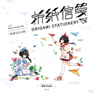
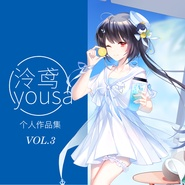
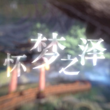
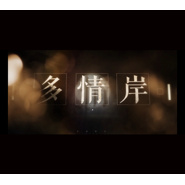
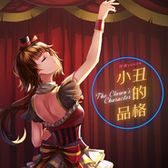
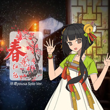
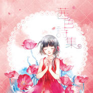

泠鸢yousa
============================

|  |  |
| :--: | :-- |
| [ 泠鸢yousa](https://i.xiami.com/lingyuanyousa) | **地区**: China 中国大陆 **风格**: 同人音乐 DouJin, 国语流行 Mandarin Pop, 中国风 China-Wave **播放数**: 22302346 **粉丝数**: 25014 **评论数**: 647  |

## 档案

虚拟艺人团体VirtuaReal Star成员 
身高：148cm 
特征：左耳处有一缕长发，为了逗猫而留的。 
擅长写歌词

## 专辑

| 名称 | 语种 | 唱片公司 | 发行时间 | 专辑类别 | 专辑风格 |
| :--: | :-- | :-- | :-- | :-- | :-- |
| [ 你别忘英雄联盟S10 LPL战队应援曲](./albums/5021773082.md) | 国语 | 独立发行 | 2020年10月24日 | EP, 单曲 | 国语流行 Mandarin Pop, 流行摇滚 Pop Rock |
| [ 白夜协奏曲爆裂魔女 主题曲](./albums/2108404001.md) | 其他 | 独立发行 | 2020年04月30日 | EP, 单曲 | 日本动漫游戏 Japanese ACG, 同人音乐 DouJin |
| [ 折纸信笺Origami Stationery / 泠鸢yousa第二张个人音乐专辑](./albums/2106090304.md) | 国语 | 中国科学文化音像出版社 | 2020年02月21日 | 录音室专辑 | 国语流行 Mandarin Pop, 流行摇滚 Pop Rock |
| [ 泠鸢yousa个人作品集 Vol.3](./albums/2105423784.md) | 日语 | 独立发行 | 2019年11月09日 | 合集, 杂锦 | 国语流行 Mandarin Pop, 古风 GuFeng Music, 同人音乐 DouJin |
| [ 田螺（yousa cover）原唱：音阙诗听](./albums/2105251857.md) | 国语 |  | 2019年09月16日 | EP, 单曲 | 国语流行 Mandarin Pop, 中国风 China-Wave |
| [ 勾指起誓（yousa ver.）](./albums/2104652453.md) | 国语 | 独立发行 | 2019年03月02日 | EP, 单曲 | 国语流行 Mandarin Pop |
| [ 繁华唱遍（yousa Ver.）](./albums/2104586223.md) | 国语 |  | 2019年02月08日 | EP, 单曲 | 国语流行 Mandarin Pop, 中国风 China-Wave |
| [ 私奔到月球（with KBshinya）](./albums/2104486721.md) | 国语 | 独立发行 | 2019年01月15日 | EP, 单曲 | 流行 Pop, 国语流行 Mandarin Pop |
| [ 千里邀月](./albums/2104396930.md) | 国语 |  | 2018年12月20日 | EP, 单曲 | 古风 GuFeng Music, 电音流行 Electropop |
| [ 恋爱语音导航音乐游戏《Muse dash》收录曲](./albums/2104229421.md) | 国语 | 独立发行 | 2018年11月18日 | EP, 单曲 | 电子舞曲 EDM / Electronic Dance Music, 同人音乐 DouJin, 电子 Electronic |
| [ 安稳最好啦！“非人学园”嫦娥 主题歌](./albums/2104053138.md) | 国语 | 独立发行 | 2018年09月23日 | EP, 单曲 | 日本动漫游戏 Japanese ACG, 国语流行 Mandarin Pop, 同人音乐 DouJin |
| [ 易水决 yousa Ver.忘川风华录 收录曲](./albums/2103886325.md) | 国语 | 独立发行 | 2018年08月01日 | EP, 单曲 | 古风 GuFeng Music, 流行 Pop, 国语流行 Mandarin Pop |
| [ 怀梦之泽  EP天谕动画第二季：苍古之绊ED](./albums/2103847381.md) | 国语 | 独立发行 | 2018年07月21日 | EP, 单曲 | 国语流行 Mandarin Pop, 古风 GuFeng Music, 同人音乐 DouJin |
| [ 多情岸（yousa Ver.）](./albums/2103773627.md) | 国语 | 独立发行 | 2018年07月02日 | EP, 单曲 | 古风 GuFeng Music |
| [ 就当做是幸福吧 - EPそれを幸せにしよう](./albums/2103751750.md) | 日语 | 独立发行 | 2018年06月15日 | EP, 单曲 | 日本流行 J-Pop, 同人音乐 DouJin |
| [ 羽忆游戏《云裳羽衣》同人曲](./albums/2103724924.md) | 国语 | 独立发行 | 2018年05月25日 | EP, 单曲 | 国语流行 Mandarin Pop, 同人音乐 DouJin, 古风 GuFeng Music |
| [ 何日重到苏澜桥 - EP](./albums/2103667241.md) | 国语 | 独立发行 | 2018年04月05日 | EP, 单曲 | 古风 GuFeng Music |
| [ 百万答谢 - For you.写给你的歌 ft.Wing翼泠鸢yousa百万粉丝答谢曲](./albums/2103646918.md) | 国语 | 独立发行 | 2018年03月24日 | EP, 单曲 | 流行 Pop, 国语流行 Mandarin Pop |
| [ 天空原本的颜色 - EP'恋与制作人' 白起同人原创曲](./albums/2103538038.md) | 国语 | 独立发行 | 2018年02月14日 | EP, 单曲 | 国语流行 Mandarin Pop, 独立流行 Indie Pop, 根源唱作人 Singer-Songwriter |
| [ 寄明月 - 泠鸢&三无 ver.](./albums/2103473116.md) | 国语 | 独立发行 | 2018年01月06日 | EP, 单曲 | 电音流行 Electropop, 同人音乐 DouJin, 中国风 China-Wave |
| [ 埋葬 - EPBuried / '茜色诗集'收录曲](./albums/2103465551.md) | 国语 | 独立发行 | 2018年01月01日 | EP, 单曲 | 流行摇滚 Pop Rock, 同人音乐 DouJin |
| [ Remember Me (yousa ver.)寻梦环游记/Coco(2017) 插曲](./albums/2102974487.md) | 英语 | 独立发行 | 2017年12月09日 | EP, 单曲 | 电影原声 Film Score |
| [ 交织Together - 泠鸢 SOLO Ver.2017 Bilibili Dancing Festival 主题曲](./albums/2102885242.md) | 国语 | 独立发行 | 2017年10月28日 | EP, 单曲 | 电子 Electronic, 浩室舞曲 House, 日本动漫游戏 Japanese ACG |
| [ 小丑的品格 - EPThe Clown's Character / '茜色诗集'收录曲 EP](./albums/2102867097.md) | 国语 | 独立发行 | 2017年10月02日 | EP, 单曲 | 爵士流行 Jazz Pop, 同人音乐 DouJin, 国语流行 Mandarin Pop |
| [ 泠氏蛋花汤 - 泠鸢yousa语音博客](./albums/2102857843.md) | 国语 | 独立发行 | 2017年09月16日 | 播客 | 广播剧 Radio Drama |
| [ 新·九九八十一 - EP九九八十一取经计划](./albums/2102816969.md) | 国语 | 独立发行 | 2017年08月11日 | EP, 单曲 | 国语流行 Mandarin Pop, 同人音乐 DouJin, 中国风 China-Wave |
| [ 乡情曲（yousa Ver.） - EP](./albums/2102754796.md) | 国语 | 独立发行 | 2017年05月27日 | EP, 单曲 | 国语流行 Mandarin Pop, 同人音乐 DouJin |
| [ 春意红包（yousa Solo Ver.）哔哩哔哩2017拜年祭开场曲](./albums/2102693943.md) | 国语 | 独立发行 | 2017年02月15日 | EP, 单曲 | 国语流行 Mandarin Pop, 中国风 China-Wave, 古风 GuFeng Music |
| [ 泼墨漓江 - EP'茜色诗集'收录曲 EP](./albums/2102682602.md) | 国语 | 独立发行 | 2017年01月19日 | EP, 单曲 | 古风 GuFeng Music, 国语流行 Mandarin Pop, 同人音乐 DouJin |
| [ 男孩们的旅行 - EP'茜色诗集'收录曲](./albums/2102671835.md) | 国语 | 独立发行 | 2016年12月25日 | EP, 单曲 | 国语流行 Mandarin Pop, 流行摇滚 Pop Rock |
| [ 泠鸢yousa个人作品集 Vol.2](./albums/2102651648.md) | 日语 |  | 2016年11月10日 | 合集, 杂锦 | 国语流行 Mandarin Pop, 日本动漫游戏 Japanese ACG, 中国风 China-Wave |
| [ 超远距连接 - EP](./albums/2102406426.md) | 国语 |  | 2016年10月14日 | EP, 单曲 | 电子 Electronic, 电音流行 Electropop, 日本动漫游戏 Japanese ACG |
| [ 夏日已所剩无几 - EPSummer Time Is Long Gone / ' 茜色诗集 ' 收录曲](./albums/2102406425.md) | 国语 |  | 2016年09月14日 | EP, 单曲 |  |
| [ 茜色诗集泠鸢yousa第一张个人专辑 / Yousa's Akane Poems](./albums/2100379105.md) | 国语 | 独立发行 | 2016年08月15日 | 录音室专辑 | 国语流行 Mandarin Pop, 日本动漫游戏 Japanese ACG |
| [ 春雨（yousa ver.）](./albums/2100331724.md) | 国语 | 独立发行 | 2016年04月24日 | EP, 单曲 | 流行摇滚 Pop Rock, 国语流行 Mandarin Pop, 中国风 China-Wave |
| [ Cinderella - EP灰姑娘 / Bilibili拜年祭作品](./albums/2100291970.md) | 国语 | 独立发行 | 2016年02月09日 | EP, 单曲 | 国语流行 Mandarin Pop |
| [ 泠鸢yousa 翻唱作品集](./albums/1236278638.md) | 其他 | 独立发行 | 2015年07月07日 | 合集, 杂锦 | 中国风 China-Wave |
| [ 泠鸢yousa 填词作品集](./albums/836258056.md) | 国语 | 泠鸢yousa | 2015年07月07日 | 合集, 杂锦 | 同人音乐 DouJin, 国语流行 Mandarin Pop, 中国风 China-Wave |
| [ 三月雨·三部曲](./albums/1178359394.md) | 国语 | 独立发行 | 2013年06月21日 | EP, 单曲 | 中国风 China-Wave |

## 评论

|  |  |  |
| :-- | :-- | :-- |
|  [虾米用户](https://emumo.xiami.com/u/81818)  2021-01-12 00:38 赞(1) 踩(0) | 
我喜欢冷鸟的时候，冷鸟还是三次元人儿呢。还没化为二次元呢&amp;hellip;&amp;hellip;
 |
|  [虾米用户](https://emumo.xiami.com/u/343801221)  2021-01-05 20:03 赞(0) 踩(0) | 
鸟头像好可爱
 |
|  [虾米用户](https://emumo.xiami.com/u/436469265)  我有病，我爱哭……所以... 2020-12-31 21:31 赞(2) 踩(0) | 
恭喜泠鸢登上2021年东方卫视元旦晚会唱九九八十一啦！！！
 |
|  [虾米用户](https://emumo.xiami.com/u/358104299) 悲观的唯心存在现实解构虚... 2020-12-17 13:24 赞(1) 踩(0) | 
43236
 |
|  [虾米用户](https://emumo.xiami.com/u/304622192) 把往日昔情抛在一边，我只... 2020-12-07 09:08 赞(0) 踩(0) | 
yousa！！&amp;hearts;
 |
|  [虾米用户](https://emumo.xiami.com/u/266788671) 宅在家里。 2020-11-11 22:27 赞(0) 踩(0) | 
如果可以的话我想倒这活一回， 是不是感觉哪里怪怪的， 其实想重活一辈子， 只不过想回到相识的那一天， 换个方式说 我不想重活一辈子， 我只想重新拥有你
 |
|  [虾米用户](https://emumo.xiami.com/u/306065331) 幸福开始有人选 2020-08-04 19:42 赞(0) 踩(0) | 
第一天关注微博nice 
 |
|  [虾米用户](https://emumo.xiami.com/u/279746713) 我深似是那浮萍，飘零到你... 2020-06-25 17:52 赞(0) 踩(0) | 
soso
 |
|  [虾米用户](https://emumo.xiami.com/u/440129724) 高考加油     （＞д... 2020-06-09 21:38 赞(0) 踩(0) | 
公告栏???
 |
|  [虾米用户](https://emumo.xiami.com/u/19706158) 暂无签名~ 2020-05-20 14:01 赞(1) 踩(0) | 
生日快乐哦！
 |
| ⇒ |  [虾米用户](https://emumo.xiami.com/u/423998266)  2020-06-04 23:02 赞(0) 踩(0) | 
？？？生日我竟然忘了  
 |
|  [虾米用户](https://emumo.xiami.com/u/439884954) 我还没想好要写什么... 2020-05-19 02:07 赞(0) 踩(0) | 
今天是冷鸟的生日！最最最喜欢鸟啦！会一直支持下去❤️
 |
|  [虾米用户](https://emumo.xiami.com/u/325456229) 你这么温柔一定是遇见了温... 2020-05-06 14:30 赞(0) 踩(0) | 
为我冷鸟打call
 |
|  [虾米用户](https://emumo.xiami.com/u/371023377)  2020-04-24 14:29 赞(2) 踩(0) | 
公告栏更新了，对不起，老婆来晚了     
 |
|  [虾米用户](https://emumo.xiami.com/u/405969137) ？！ 2020-04-19 10:08 赞(0) 踩(0) | 
超超超喜欢你！！！！！！！
 |
|  [虾米用户](https://emumo.xiami.com/u/5627391) 一定是打开的方式不对!! 2020-04-12 14:52 赞(0) 踩(0) | 
超棒啊！！好惊艳啊啊
 |
|  [虾米用户](https://emumo.xiami.com/u/408567457) MHA  Forever 2020-03-31 22:34 赞(3) 踩(0) | 
换头像了好可爱㖿
 |
|  [虾米用户](https://emumo.xiami.com/u/12128984) 我讨厌一切不押韵的歌，感... 2020-02-27 17:44 赞(0) 踩(0) | 
哇塞，这声音好柔亮，唱腔不做作，好赞
 |
|  [虾米用户](https://emumo.xiami.com/u/6755216) 向日葵终于出个人专了 2020-02-09 00:46 赞(0) 踩(0) | 
泠鸢yousa二专CD天猫店有售，还没收的童鞋赶快去支持一下，看来我是关注错地方了，虾米这居然没消息，还好现在还有。
 |
| ⇒ |  [虾米用户](https://emumo.xiami.com/u/6755216) 向日葵终于出个人专了 2020-02-09 00:47 赞(0) 踩(0) | 
<a href="https://detail.tmall.com/item.htm?id=611926471237&amp;amp;skuId=4304763328745" target="_blank" rel="nofollow noreferrer noopener">https://detail.tmall.com/item.htm?id=611926471237&amp;amp;skuId=4304763328745</a> 顺便转下地址
 |
|  [虾米用户](https://emumo.xiami.com/u/11773740)  2020-02-07 09:25 赞(0) 踩(0) | 
在? 你还是个人?
 |
|  [虾米用户](https://emumo.xiami.com/u/403966501)  2020-02-04 02:42 赞(0) 踩(0) | 
谢谢喜欢情歌
 |
|  [虾米用户](https://emumo.xiami.com/u/326702970) 诗和远方曾来过-心有猛虎... 2020-02-03 04:31 赞(0) 踩(0) | 
冷鸟偏心，虾米好多歌都听不了 
 |
|  [虾米用户](https://emumo.xiami.com/u/115521026) 再见::_ 2020-02-03 02:25 赞(0) 踩(0) | 
泠氏蛋花汤呜呜呜
 |
|  [虾米用户](https://emumo.xiami.com/u/374826022) 虾米区清粉A1 2020-01-30 22:24 赞(1) 踩(0) | 
这个名字好耳熟?
 |
|  [虾米用户](https://emumo.xiami.com/u/305505658)  2020-01-28 08:39 赞(0) 踩(0) | 
女神，能不能给我们宅男个真人照。
 |
|  [虾米用户](https://emumo.xiami.com/u/338350661)  2019-12-25 05:40 赞(0) 踩(0) | 
神代梦华谭怎么没有呢
 |
|  [虾米用户](https://emumo.xiami.com/u/237641906)  2019-12-19 09:58 赞(0) 踩(0) | 
刚刚无意听try everything，自动播放下一首切到yousa的版本瞬间就被吸引了，再顺着歌单听了一首万神纪，瞬间被圈粉了！！太棒了真的太厉害了！加油yousa
 |
|  [虾米用户](https://emumo.xiami.com/u/346807096)  2019-11-27 12:00 赞(0) 踩(0) | 
为啥评论区的都是铁粉？
 |
|  [虾米用户](https://emumo.xiami.com/u/54928590)  2019-11-26 08:35 赞(0) 踩(0) | 
中国风唱见担当，最喜欢带中国风的歌 
 |
|  [虾米用户](https://emumo.xiami.com/u/421904500)  2019-11-12 02:33 赞(0) 踩(0) | 
泠鸢yousa,你的歌都好好听
 |
|  [虾米用户](https://emumo.xiami.com/u/54335884) 蔑む声はもっと弱くなれと... 2019-11-06 00:27 赞(0) 踩(0) | 
就平日的口胡而言，很好奇冷鸟录歌到底要重来多少遍（
 |
|  [虾米用户](https://emumo.xiami.com/u/431646841) 我想好要写什么，但是懒 2019-11-04 21:26 赞(0) 踩(0) | 
虾米竟然有这首歌，惊了。
 |
|  [虾米用户](https://emumo.xiami.com/u/6755216) 向日葵终于出个人专了 2019-11-03 11:10 赞(0) 踩(0) | 
我是迟来的粉，居然一直没留意到国内也有这么赞的歌姬，初听泠鸢yousa=音染版的米白，听了半个月左右，听感不一样了，哪天这俩妹子一起来个合唱就人生无憾了。
 |
|  [虾米用户](https://emumo.xiami.com/u/251963593) 神秘的天才科学家 2019-10-28 15:23 赞(0) 踩(0) | 
想知道泠鸢真人长什么样子的，居然一张照片也没有。之前还以为泠鸢是初音一样的二次元电子人物呢。
 |
| ⇒ |  [虾米用户](https://emumo.xiami.com/u/6755216) 向日葵终于出个人专了 2019-11-03 11:05 赞(0) 踩(0) | 
度娘有。
 |
| ⇒ |  [虾米用户](https://emumo.xiami.com/u/326702970) 诗和远方曾来过-心有猛虎... 2020-02-03 04:32 赞(0) 踩(0) | 
<q><b>windx说：</b></q>
 |
|  [虾米用户](https://emumo.xiami.com/u/4290612)  2019-10-10 20:17 赞(0) 踩(0) | 
笔芯
 |
|  [虾米用户](https://emumo.xiami.com/u/318494643) 一切都是循环平衡，都遵循... 2019-09-13 16:34 赞(0) 踩(0) | 
好甜好纯净的女声哎，好听
 |
|  [虾米用户](https://emumo.xiami.com/u/412977498)  2019-08-13 15:30 赞(0) 踩(0) | 
你的歌唱的很好听，我很喜欢，我收藏了。
 |
|  [虾米用户](https://emumo.xiami.com/u/24101807)  2019-06-14 09:04 赞(1) 踩(0) | 
很好听，但感觉比原版少了几分英气 
 |
|  [虾米用户](https://emumo.xiami.com/u/424441070)  2019-06-04 20:16 赞(1) 踩(0) | 
挺好的
 |
|  [虾米用户](https://emumo.xiami.com/u/412707006)  2019-06-04 19:09 赞(1) 踩(0) | 
支持，好听
 |
|  [虾米用户](https://emumo.xiami.com/u/425405648)  2019-06-02 17:25 赞(1) 踩(0) | 
刚刚过来诶，这是我的第一位推荐的歌手诶
 |
|  [虾米用户](https://emumo.xiami.com/u/423697519) 我QQ号：2151830... 2019-05-25 15:42 赞(1) 踩(0) | 
无趣
 |
|  [虾米用户](https://emumo.xiami.com/u/424423590)  2019-05-24 20:04 赞(0) 踩(0) | 
加油呢
 |
|  [虾米用户](https://emumo.xiami.com/u/38953446) アロイニ 2019-05-11 23:06 赞(0) 踩(0) | 
冷鸢大大爱你!
 |
|  [虾米用户](https://emumo.xiami.com/u/9559905)  2019-05-04 16:52 赞(0) 踩(0) | 
最近很迷CAROLE &amp; TUESDAY第二话的那首歌，也很期待您的翻唱
 |
|  [虾米用户](https://emumo.xiami.com/u/311874519) 素质不由年龄决定 2019-05-03 22:42 赞(0) 踩(0) | 
新歌呢
 |
| ⇒ |  [虾米用户](https://emumo.xiami.com/u/266286212) 懒死的小编 ill.by... 2019-05-14 22:59 赞(0) 踩(0) | 
翻唱/填词都会发布在这哦 专辑分享 | 泠鸢yousa-《泠鸢yousa个人作品集 ...》<a href="https://www.xiami.com/album/2102651648" target="_blank" rel="nofollow noreferrer noopener">https://www.xiami.com/album/2102651648</a> (分享自@虾米音乐)
 |
|  [虾米用户](https://emumo.xiami.com/u/240159973) 我还没想好要写什么... 2019-05-03 19:10 赞(1) 踩(0) | 
坐等新歌
 |
|  [虾米用户](https://emumo.xiami.com/u/19806711)   2019-04-20 14:15 赞(2) 踩(0) | 
女神   我家娃很喜欢你唱的干物妹小埋主题曲中文版 
 |
| ⇒ |  [虾米用户](https://emumo.xiami.com/u/379392597) dying 2019-06-02 16:00 赞(0) 踩(0) | 
诶，你家娃？我发现了什么(ﾟoﾟ;
 |
| ⇒ |  [虾米用户](https://emumo.xiami.com/u/19806711)   2019-07-27 10:02 赞(0) 踩(0) | 
<q><b>烺烺是咸鱼画手求约稿‼️说：</b></q>
 |
|  [虾米用户](https://emumo.xiami.com/u/327699004)  2019-04-07 21:18 赞(1) 踩(0) | 
加油
 |
|  [虾米用户](https://emumo.xiami.com/u/380293282) 一团面粉 2019-04-06 07:43 赞(1) 踩(0) | 
今生如梦听了通宵 唱的简直是绝了
 |
|  [虾米用户](https://emumo.xiami.com/u/5938353) 没救了？？？？？？？ 2019-03-19 17:10 赞(1) 踩(0) | 
说不出来喜欢在哪 反正就是听着舒服 加油加油~
 |
|  [虾米用户](https://emumo.xiami.com/u/161526488)  2019-03-15 01:04 赞(1) 踩(0) | 
(￣▼￣)
 |
|  [虾米用户](https://emumo.xiami.com/u/11131049) 心静者多妙 2019-03-12 14:28 赞(0) 踩(0) | 
我终于想起了我的虾米号，关注一波再说
 |
|  [虾米用户](https://emumo.xiami.com/u/287279063) 风之誓，草戒指，年华最终... 2019-03-04 22:53 赞(1) 踩(0) | 
不用谢，应该的-_-||
 |
|  [虾米用户](https://emumo.xiami.com/u/419043320) 来咬我啊 2019-02-26 08:40 赞(1) 踩(0) | 
很好听
 |
|  [虾米用户](https://emumo.xiami.com/u/419543656)  2019-02-23 19:01 赞(1) 踩(0) | 
冷鸢唱的歌曲都听起来有一种治愈感
 |
|  [虾米用户](https://emumo.xiami.com/u/419543656)  2019-02-23 18:56 赞(1) 踩(0) | 
感觉有些地方有点像洛天依的电子音
 |
|  [虾米用户](https://emumo.xiami.com/u/2721787) Find me: Cee... 2019-02-23 02:01 赞(0) 踩(0) | 
厉害了喵~ 多出一点动漫作品呀 最好是没有版权的都出出来&amp;amp;gt;_&amp;amp;lt;
 |
|  [虾米用户](https://emumo.xiami.com/u/13261130) 不听音乐会死星人 2019-02-18 04:03 赞(2) 踩(0) | 
最喜欢的依然是寄明月
 |
|  [虾米用户](https://emumo.xiami.com/u/35555386)  2019-02-08 15:30 赞(2) 踩(0) | 
我要繁华唱遍(｡•ˇ‸ˇ•｡)
 |
| ⇒ |  [虾米用户](https://emumo.xiami.com/u/266286212) 懒死的小编 ill.by... 2019-02-09 23:28 赞(0) 踩(0) | 
已经有啦
 |
|  [虾米用户](https://emumo.xiami.com/u/416378846)  2019-02-02 13:59 赞(1) 踩(0) | 
告白，为什么没有
 |
| ⇒ |  [虾米用户](https://emumo.xiami.com/u/266286212) 懒死的小编 ill.by... 2019-02-09 23:15 赞(0) 踩(0) | 
这个曲子出品方有限制 发布要听他们安排的呢
 |
|  [虾米用户](https://emumo.xiami.com/u/2521128) 昵称和签名都回不去了。。... 2019-01-24 20:34 赞(4) 踩(0) | 
这个声线真是。。余音绕梁啊
 |
|  [虾米用户](https://emumo.xiami.com/u/2251173)   2019-01-03 07:47 赞(1) 踩(0) | 
女声演绎别有一番风味
 |
|  [虾米用户](https://emumo.xiami.com/u/354663306) 喜欢听好听但名气不大的歌... 2018-12-20 21:53 赞(0) 踩(0) | 
想听yousa单独唱千里邀月啊！！！
 |
|  [虾米用户](https://emumo.xiami.com/u/53008228) 尝试用旋律纪念我成长的一... 2018-12-05 18:59 赞(1) 踩(0) | 
(´｡• ᵕ •｡`) ♡
 |
|  [虾米用户](https://emumo.xiami.com/u/350182370)  2018-12-04 20:28 赞(0) 踩(0) | 
冷鸟！
 |
|  [虾米用户](https://emumo.xiami.com/u/409149420)  2018-12-02 22:47 赞(0) 踩(0) | 
喜欢妳
 |
| ⇒ |  [虾米用户](https://emumo.xiami.com/u/419043320) 来咬我啊 2019-02-15 18:36 赞(0) 踩(0) | 
打错字了
 |
| ⇒ |  [虾米用户](https://emumo.xiami.com/u/251188175) 食物是最重要的。不，水才... 2019-03-28 22:36 赞(0) 踩(0) | 
<q><b>芒晓天JOU说：</b></q>
 |
|  [虾米用户](https://emumo.xiami.com/u/295590033)  2018-11-28 22:44 赞(1) 踩(0) | 
留言 
 |
|  [虾米用户](https://emumo.xiami.com/u/376188278)  2018-11-17 18:54 赞(1) 踩(0) | 
为毛我听了之后 学会了女声？？
 |
|  [虾米用户](https://emumo.xiami.com/u/57946956) 我期待，我等待，期待着明... 2018-11-12 22:22 赞(2) 踩(0) | 
谁有冷鸟的图片，加我，我好像是老粉诶，初三到现在都高三了，biiliibiilii到现在的虾米
 |
|  [虾米用户](https://emumo.xiami.com/u/21810381)  2018-11-12 21:16 赞(0) 踩(0) | 
泠鸢唱歌怎么可以这么好听！
 |
|  [虾米用户](https://emumo.xiami.com/u/251815804)        2018-11-11 23:32 赞(0) 踩(0) | 
大晚上更新公告.
 |
| ⇒ |  [虾米用户](https://emumo.xiami.com/u/251815804)        2018-11-11 23:32 赞(0) 踩(0) | 
2018.11.1123:13
 |
|  [虾米用户](https://emumo.xiami.com/u/372284259)  2018-10-23 22:03 赞(3) 踩(0) | 
四川人表示：冷鸢唱歌真心好听——我也是四川人，为什么我的嗓子……    一把老泪
 |
|  [虾米用户](https://emumo.xiami.com/u/372355027) 清醒的人最荒唐 2018-09-09 19:41 赞(0) 踩(0) | 
超好听
 |
|  [虾米用户](https://emumo.xiami.com/u/274640876)   2018-08-16 10:20 赞(0) 踩(0) | 
注意休息，不要太累了
 |
|  [虾米用户](https://emumo.xiami.com/u/108659632)  2018-08-10 19:44 赞(1) 踩(0) | 
b站有冷鸟演唱的视频哟 (灬&amp;ordm;&amp;omega;&amp;ordm;灬)♩
 |
|  [虾米用户](https://emumo.xiami.com/u/86879602)  2018-08-08 07:38 赞(0) 踩(0) | 
爱你呦，么么哒＾3＾
 |
|  [虾米用户](https://emumo.xiami.com/u/86879602)  2018-08-08 07:38 赞(0) 踩(0) | 
冷鸟，，，，哈哈。
 |
|  [虾米用户](https://emumo.xiami.com/u/282922609) 我还没想好要写什么... 2018-07-31 12:43 赞(0) 踩(0) | 
想听小姐姐唱 瞬き back number 
 |
|  [虾米用户](https://emumo.xiami.com/u/316502674) 在最后陪着你吧，我的虾米 2018-07-30 10:36 赞(0) 踩(0) | 
终于更新了，感动！
 |
|  [虾米用户](https://emumo.xiami.com/u/252567602) 这家伙很聪明什么也没留下... 2018-07-29 02:06 赞(0) 踩(0) | 
泠鸢唱的歌最高 
 |
|  [虾米用户](https://emumo.xiami.com/u/347310714) 为了什么？时间？成功？不... 2018-07-26 23:01 赞(1) 踩(0) | 
泠鸢yousa 小姐姐，你的歌曲唱的十分让人想回味，是我听过中译里面最好的，没有之一，希望你可以继续努力，出更多好听的歌，也要注意休息，不希望你为了大家忘了身体 
 |
|  [虾米用户](https://emumo.xiami.com/u/358119040) 以为什么都选了，却什么都... 2018-07-26 14:13 赞(0) 踩(0) | 
爱你加
 |
|  [虾米用户](https://emumo.xiami.com/u/51561608) 虾米音乐音质非常好，都是... 2018-07-16 02:02 赞(0) 踩(0) | 
来，摸头杀
 |
|  [虾米用户](https://emumo.xiami.com/u/357254268)  2018-06-24 19:09 赞(1) 踩(0) | 
游戏关服，所以你就来唱这么好听的歌了。。。谢谢，我心情不好时就是 神的随波逐流单循环
 |
|  [虾米用户](https://emumo.xiami.com/u/48958443) 非淡泊无以明志，非宁静无... 2018-06-24 12:27 赞(1) 踩(0) | 
大爱冷鸢
 |
|  [虾米用户](https://emumo.xiami.com/u/46868589)  2018-06-20 13:29 赞(0) 踩(0) | 
陌生人妻，感觉不一样，hhhh
 |
|  [虾米用户](https://emumo.xiami.com/u/334308009)  2018-06-05 21:24 赞(1) 踩(0) | 
加你微信
 |
|  [虾米用户](https://emumo.xiami.com/u/352528060)  2018-05-28 08:53 赞(3) 踩(0) | 
明明能好好唱，你中间的时候为什么就不认真唱呢？
 |
| ⇒ |  [虾米用户](https://emumo.xiami.com/u/305506644) 我还没想好要写什么... 2018-09-16 10:22 赞(0) 踩(0) | 

 |
|  [虾米用户](https://emumo.xiami.com/u/345812472)  2018-05-23 10:57 赞(3) 踩(0) | 
大大你唱的歌都好好听啊~
 |
|  [虾米用户](https://emumo.xiami.com/u/57623902)  2018-05-15 06:32 赞(4) 踩(0) | 
要是你们翻唱萝莉控组曲就神 
 |
|  [虾米用户](https://emumo.xiami.com/u/70216634) 请某些人滚回网易云去 2018-05-13 11:05 赞(93) 踩(0) | 
148cm四舍五入就是2米了
 |
| ⇒ |  [虾米用户](https://emumo.xiami.com/u/374998961) 保持善良 2018-06-19 19:28 赞(0) 踩(0) | 
四舍五入不是一米吗
 |
| ⇒ |  [虾米用户](https://emumo.xiami.com/u/70216634) 请某些人滚回网易云去 2018-06-20 12:53 赞(0) 踩(0) | 
<q><b>林沐吖.说：</b></q>
 |
| ⇒ |  [虾米用户](https://emumo.xiami.com/u/70216634) 请某些人滚回网易云去 2018-06-20 12:55 赞(0) 踩(0) | 
<q><b>林沐吖.说：</b></q>
 |
| ⇒ |  [虾米用户](https://emumo.xiami.com/u/51561608) 虾米音乐音质非常好，都是... 2018-07-16 02:01 赞(0) 踩(0) | 
嗯嗯，内存
 |
| ⇒ |  [虾米用户](https://emumo.xiami.com/u/250156059)  2018-09-30 23:09 赞(0) 踩(0) | 
<q><b>被占用的超小咪说：</b></q>
 |
| ⇒ |  [虾米用户](https://emumo.xiami.com/u/341378690) 大家好，我是个自带光环的... 2018-10-22 08:13 赞(0) 踩(0) | 
你几年级啊
 |
| ⇒ |  [虾米用户](https://emumo.xiami.com/u/355882071) 我的神明不救我。 2018-10-24 19:05 赞(0) 踩(0) | 
<q><b>啦啦啦说：</b></q>
 |
| ⇒ |  [虾米用户](https://emumo.xiami.com/u/405285698)  2018-11-13 09:15 赞(0) 踩(0) | 
<q><b>林沐吖.说：</b></q>
 |
| ⇒ |  [虾米用户](https://emumo.xiami.com/u/204954085) 心若冰清，天塌不惊。 2018-12-23 21:52 赞(0) 踩(0) | 
十米舍两米～～～变没了～～～
 |
| ⇒ |  [虾米用户](https://emumo.xiami.com/u/354848597)  2019-01-20 23:45 赞(0) 踩(0) | 
不不不四舍五入就是没有了
 |
| ⇒ |  [虾米用户](https://emumo.xiami.com/u/251188175) 食物是最重要的。不，水才... 2019-02-10 06:28 赞(0) 踩(0) | 
你们不会数学？？148我们可以舍入为150，150我们再进行二次舍入，不就是两米了，你们是不是傻
 |
| ⇒ |  [虾米用户](https://emumo.xiami.com/u/250156059)  2019-03-09 16:12 赞(0) 踩(0) | 
<q><b>木之本社乱说：</b></q>
 |
| ⇒ |  [虾米用户](https://emumo.xiami.com/u/405036375) 世界はいつも素晴らしい 2019-03-19 21:57 赞(0) 踩(0) | 
不不不，兄弟们你们都错了！ 首先通过5入变成150 然后在通过5入变成2米 最后通过4舍变为0！！！
 |
| ⇒ |  [虾米用户](https://emumo.xiami.com/u/251188175) 食物是最重要的。不，水才... 2019-03-28 22:35 赞(0) 踩(0) | 
<q><b>Me♡说：</b></q>
 |
| ⇒ |  [虾米用户](https://emumo.xiami.com/u/251188175) 食物是最重要的。不，水才... 2019-03-28 22:36 赞(0) 踩(0) | 
<q><b>啦啦啦说：</b></q>
 |
| ⇒ |  [虾米用户](https://emumo.xiami.com/u/346807096)  2019-08-09 21:17 赞(0) 踩(0) | 
一群数学痴，身高能四舍五入吗？
 |
| ⇒ |  [虾米用户](https://emumo.xiami.com/u/346807096)  2019-10-21 12:19 赞(0) 踩(0) | 
<q><b>说：</b></q>
 |
| ⇒ |  [虾米用户](https://emumo.xiami.com/u/346807096)  2019-11-27 11:57 赞(0) 踩(0) | 
<q><b>说：</b></q>
 |
| ⇒ |  [虾米用户](https://emumo.xiami.com/u/326702970) 诗和远方曾来过-心有猛虎... 2020-02-03 04:33 赞(0) 踩(0) | 
<q><b>一天不喷人，浑身难受说：</b></q>
 |
|  [虾米用户](https://emumo.xiami.com/u/31204076) ؏؏☝ᖗ乛◡乛ᖘ☝؏؏完... 2018-05-08 18:17 赞(2) 踩(0) | 
身高暴露了
 |
|  [虾米用户](https://emumo.xiami.com/u/358123164)  2018-05-08 13:33 赞(0) 踩(0) | 
 
 |
|  [虾米用户](https://emumo.xiami.com/u/109715) 热爱摇滚乐。 2018-05-08 11:18 赞(0) 踩(0) | 
唱的非常不错。
 |
|  [虾米用户](https://emumo.xiami.com/u/258273928)  2018-05-06 00:08 赞(0) 踩(0) | 
(&amp;acute;-&amp;omega;-`)
 |
|  [虾米用户](https://emumo.xiami.com/u/339257676)  2018-05-05 10:20 赞(2) 踩(0) | 
好听好听
 |
|  [虾米用户](https://emumo.xiami.com/u/43190247)  2018-05-03 22:03 赞(1) 踩(0) | 
第五百评论~
 |
|  [虾米用户](https://emumo.xiami.com/u/345172835) 不念过往，不畏将来 2018-05-03 15:04 赞(0) 踩(0) | 
终于更新虾米了 
 |
|  [虾米用户](https://emumo.xiami.com/u/228843687) 懒惰统治人间 2018-05-03 12:37 赞(0) 踩(0) | 
:-O
 |
|  [虾米用户](https://emumo.xiami.com/u/268489439) 世上没有绝对，所以，那个... 2018-05-02 18:38 赞(3) 踩(0) | 
冷鸢唱什么都好听，第一个也是唯一一个收藏了的音乐人，我感觉我已被洗脑 
 |
| ⇒ |  [虾米用户](https://emumo.xiami.com/u/266286212) 懒死的小编 ill.by... 2018-05-04 00:13 赞(0) 踩(0) | 
泠鸢
 |
| ⇒ |  [虾米用户](https://emumo.xiami.com/u/54054533) 时光知味。 2018-05-24 17:29 赞(0) 踩(0) | 
<q><b>Armee.暗语说：</b></q>
 |
|  [虾米用户](https://emumo.xiami.com/u/169086204) 呸呸呸 2018-04-24 23:45 赞(0) 踩(0) | 
新人报道!
 |
|  [虾米用户](https://emumo.xiami.com/u/337385118)  2018-04-21 12:23 赞(1) 踩(0) | 
好好听
 |
|  [虾米用户](https://emumo.xiami.com/u/61498864)  2018-04-15 21:11 赞(0) 踩(0) | 
出新了!出新了!
 |
|  [虾米用户](https://emumo.xiami.com/u/37458820) 我还没想好要写什么... 2018-04-15 18:24 赞(0) 踩(0) | 
超喜欢你～
 |
|  [虾米用户](https://emumo.xiami.com/u/357815787)  2018-04-12 13:48 赞(2) 踩(0) | 
冷鸟好可爱(/&amp;omega;＼)害羞
 |
|  [虾米用户](https://emumo.xiami.com/u/123232680) 还可以多活25年 2018-04-08 17:14 赞(1) 踩(0) | 
好可爱的声音~~~~~~~~有点大特头~
 |
|  [虾米用户](https://emumo.xiami.com/u/319793465)  2018-04-06 16:22 赞(1) 踩(0) | 
超喜欢你的声音
 |
|  [虾米用户](https://emumo.xiami.com/u/308733858) . 2018-04-04 10:36 赞(1) 踩(0) | 
支持
 |
|  [虾米用户](https://emumo.xiami.com/u/352375245)  2018-04-02 12:16 赞(1) 踩(0) | 
我喜欢你的歌 很美
 |
|  [虾米用户](https://emumo.xiami.com/u/333143912)  2018-04-02 04:05 赞(1) 踩(0) | 
歌声治愈了我的狂躁症
 |
|  [虾米用户](https://emumo.xiami.com/u/71566968) すみません(。_。) 2018-04-01 17:39 赞(1) 踩(0) | 
你超可爱哦
 |
|  [虾米用户](https://emumo.xiami.com/u/4260538) 我还没想好要写什么... 2018-03-22 16:16 赞(2) 踩(0) | 
喜欢啊
 |
|  [虾米用户](https://emumo.xiami.com/u/263065721) 这家伙很懒啥也没留下..... 2018-03-19 17:34 赞(2) 踩(0) | 
非常喜欢冷鸟的，禁忌的边界线！
 |
|  [虾米用户](https://emumo.xiami.com/u/182437606) 余生很长，何必慌张 2018-03-08 16:11 赞(3) 踩(0) | 
开头和最后好听，中间唱的什么玩意儿 
 |
|  [虾米用户](https://emumo.xiami.com/u/128905038) 叶子叶子叶子叶子叶子叶子... 2018-02-26 16:29 赞(20) 踩(0) | 
为有撒女神打call
 |
|  [虾米用户](https://emumo.xiami.com/u/196305576) (๑•̀ㅂ•́)و✧ 2018-02-25 22:46 赞(0) 踩(0) | 
可爱 
 |
|  [虾米用户](https://emumo.xiami.com/u/322652029) 是你，绯红之王！ 2018-02-25 13:53 赞(2) 踩(0) | 
喜欢，比初音唱的好听
 |
|  [虾米用户](https://emumo.xiami.com/u/339254913)  2018-02-21 16:48 赞(0) 踩(0) | 
爱你。   
 |
|  [虾米用户](https://emumo.xiami.com/u/342105603)  2018-02-14 18:03 赞(1) 踩(0) | 
大爱
 |
|  [虾米用户](https://emumo.xiami.com/u/85568296) 只有阳光而无阴影 只有欢... 2018-02-14 00:51 赞(1) 踩(0) | 

 |
|  [虾米用户](https://emumo.xiami.com/u/347426319) 你不是我的，从来都不是 2018-02-06 23:04 赞(2) 踩(0) | 
爱你  
 |
|  [虾米用户](https://emumo.xiami.com/u/272976950) You are a mi... 2018-02-04 21:41 赞(2) 踩(0) | 
放几张照片在相册里看看嘛
 |
|  [虾米用户](https://emumo.xiami.com/u/347057547)  2018-02-02 22:11 赞(1) 踩(0) | 
无意中听到一首歌，好好听，找了好久，终于找到了，还好没放弃 
 |
|  [虾米用户](https://emumo.xiami.com/u/225670249)  2018-01-28 11:00 赞(3) 踩(0) | 
冷鸢妹妹真的声音好温柔又有力量，喜欢喜欢喜欢
 |
|  [虾米用户](https://emumo.xiami.com/u/36147268) 苦路第十四处：耶稣死于我... 2018-01-28 00:54 赞(0) 踩(0) | 
软妹子系列 
 |
|  [虾米用户](https://emumo.xiami.com/u/345906812)  2018-01-22 17:06 赞(0) 踩(0) | 
不错
 |
|  [虾米用户](https://emumo.xiami.com/u/277071090) 虾米最近一波什么操作?直... 2018-01-16 21:18 赞(3) 踩(0) | 
老是看成yasuo然后激起我的愤怒怎么办 
 |
| ⇒ |  [虾米用户](https://emumo.xiami.com/u/1394088) 世间智障合集 2018-01-18 12:23 赞(0) 踩(0) | 
那你就别看 &amp;mdash;&amp;mdash;麦克美
 |
| ⇒ |  [虾米用户](https://emumo.xiami.com/u/36530912) 等你哭的时候，你才会知道... 2018-02-04 22:24 赞(0) 踩(0) | 
hhh渴望战斗
 |
| ⇒ |  [虾米用户](https://emumo.xiami.com/u/1394088) 世间智障合集 2018-02-16 13:53 赞(0) 踩(0) | 
有毒吧你，不过裂墙资词删除yasuo
 |
|  [虾米用户](https://emumo.xiami.com/u/252688379) 心还在，便不再说放弃 2018-01-07 14:43 赞(0) 踩(0) | 

 |
|  [虾米用户](https://emumo.xiami.com/u/6873849) 好了，终于把ID改过来了 2017-12-23 18:36 赞(35) 踩(0) | 
好消息，大好消息，特大好消息。星与君消失之日终于有了，终于有了！ 收录在《泠鸢yousa个人作品集 Vol.2》 德丽莎世界第一可爱！
 |
| ⇒ |  [虾米用户](https://emumo.xiami.com/u/354848597)  2019-01-20 23:48 赞(0) 踩(0) | 
德丽莎赛高
 |
|  [虾米用户](https://emumo.xiami.com/u/340280974)  2017-12-17 04:24 赞(1) 踩(0) | 
加油
 |
|  [虾米用户](https://emumo.xiami.com/u/331019795) 我还没想好要写什么... 2017-12-15 10:14 赞(4) 踩(0) | 
听了一首《前前世世》成为了你的粉丝，听了其他歌曲发现都非常有特点，该劲爆时候劲爆，该温柔时候温柔!我居然听了你的歌居然要变成声控了   
 |
|  [虾米用户](https://emumo.xiami.com/u/58318544) 所缺 2017-12-09 09:28 赞(1) 踩(0) | 
加油哦
 |
|  [虾米用户](https://emumo.xiami.com/u/273167762)   2017-12-09 00:45 赞(2) 踩(0) | 
大佬更新公告了
 |
|  [虾米用户](https://emumo.xiami.com/u/298587887) 我只能送你到这里，剩下的... 2017-12-07 14:28 赞(0) 踩(0) | 
加油
 |
|  [虾米用户](https://emumo.xiami.com/u/337646366) 不要为小事遮住视线，我们... 2017-11-28 13:09 赞(0) 踩(0) | 
听闻你的声音找到了你，就被你打动了，哈哈， 
 |
|  [虾米用户](https://emumo.xiami.com/u/16037926) 艾斯兔一生推 2017-11-26 10:24 赞(0) 踩(0) | 
表白冷鸟www
 |
|  [虾米用户](https://emumo.xiami.com/u/77360780) 又将是新的开始 2017-11-25 23:24 赞(1) 踩(0) | 
最喜欢泠鸢的声音
 |
|  [虾米用户](https://emumo.xiami.com/u/1230490) 是知燈者，破愚暗以明斯道 2017-11-23 21:44 赞(3) 踩(0) | 
网易云移民
 |
|  [虾米用户](https://emumo.xiami.com/u/331569953)  2017-11-07 23:37 赞(3) 踩(0) | 
yousa！yousa！
 |
|  [虾米用户](https://emumo.xiami.com/u/163900292) 不知道写什么呐，暂时就这... 2017-11-05 20:24 赞(0) 踩(0) | 
好喜欢
 |
|  [虾米用户](https://emumo.xiami.com/u/48607224) 山水一程 三生有幸 2017-11-03 19:35 赞(0) 踩(0) | 
厉害啊
 |
|  [虾米用户](https://emumo.xiami.com/u/322230836)  2017-11-02 21:29 赞(0) 踩(0) | 
这名字简直是笔画党福利。
 |
|  [虾米用户](https://emumo.xiami.com/u/6873849) 好了，终于把ID改过来了 2017-10-31 18:20 赞(1) 踩(0) | 
我……想……听……星与君消失之日…… 为什么…没有…… 连崩坏世界歌姬都有……
 |
| ⇒ |  [虾米用户](https://emumo.xiami.com/u/187876070)  2017-12-19 20:44 赞(0) 踩(0) | 
有啊
 |
|  [虾米用户](https://emumo.xiami.com/u/331030588)  2017-10-27 01:03 赞(0) 踩(0) | 
冷鸟
 |
|  [虾米用户](https://emumo.xiami.com/u/330754428)  2017-10-25 13:17 赞(0) 踩(0) | 
好听
 |
|  [虾米用户](https://emumo.xiami.com/u/330003698)  2017-10-21 16:06 赞(0) 踩(0) | 
哈喽
 |
|  [虾米用户](https://emumo.xiami.com/u/298948030) 中國詩音樂電影创始人作曲... 2017-10-17 22:01 赞(0) 踩(0) | 
你好
 |
|  [虾米用户](https://emumo.xiami.com/u/280916172) 交个朋友吧。 2017-10-13 16:10 赞(2) 踩(0) | 
加油，我会在背后全力支持你！！！泠鸢……
 |
|  [虾米用户](https://emumo.xiami.com/u/328651591)  2017-10-05 21:53 赞(0) 踩(0) | 
.........(^v^)
 |
|  [虾米用户](https://emumo.xiami.com/u/318068962) 呵呵。 2017-10-05 20:51 赞(1) 踩(0) | 
加油，爱死你啦！新.九九八十一很好听哟！
 |
|  [虾米用户](https://emumo.xiami.com/u/327634466)  2017-10-01 00:32 赞(3) 踩(0) | 
内容已删除
 |
| ⇒ |  [虾米用户](https://emumo.xiami.com/u/6975678) 生命如此短暂我比烟花灿烂 2017-10-02 17:24 赞(0) 踩(0) | 
不是机器人！关于这个她本人已经吐槽过很多次了，详见她语音博客 &amp;amp;#039;泠氏蛋花汤&amp;amp;#039; 第一期开播宣言
 |
|  [虾米用户](https://emumo.xiami.com/u/260679866) 我只是一个音乐爱好者 2017-09-23 07:38 赞(0) 踩(0) | 
支持
 |
|  [虾米用户](https://emumo.xiami.com/u/258948887)  2017-09-21 19:07 赞(4) 踩(0) | 
太好听了！路转粉！泠鸢姐姐，我最爱你了！加油！
 |
|  [虾米用户](https://emumo.xiami.com/u/255462465) 我还没想好要写什么... 2017-09-18 12:15 赞(1) 踩(0) | 
声音好可爱呀 
 |
|  [虾米用户](https://emumo.xiami.com/u/325368900)  2017-09-16 20:58 赞(2) 踩(0) | 
非常好听
 |
|  [虾米用户](https://emumo.xiami.com/u/45008182) 青空下の梦 2017-09-16 20:09 赞(71) 踩(0) | 
萝莉控国内必修声线
 |
|  [虾米用户](https://emumo.xiami.com/u/266070042) 我想好了要写什么 2017-09-13 12:20 赞(1) 踩(0) | 
想听泠鸢姐姐唱《流光逝梦》
 |
|  [虾米用户](https://emumo.xiami.com/u/278981178) 哎呀大哥哥不好意思啦 2017-09-11 20:51 赞(0) 踩(0) | 
Yousa 大人对不起打扰了
 |
|  [虾米用户](https://emumo.xiami.com/u/323704079)  2017-09-09 18:33 赞(0) 踩(0) | 
很好听
 |
|  [虾米用户](https://emumo.xiami.com/u/310048715)  2017-09-08 21:50 赞(0) 踩(0) | 
好听
 |
|  [虾米用户](https://emumo.xiami.com/u/115761662)  2017-09-08 16:20 赞(0) 踩(0) | 
有什么为什么，喜欢楼
 |
|  [虾米用户](https://emumo.xiami.com/u/86927572) 原谅我词穷，写不出你想要... 2017-08-30 15:39 赞(0) 踩(0) | 
泠鸢yousa,
 |
|  [虾米用户](https://emumo.xiami.com/u/321746640)  2017-08-30 04:03 赞(0) 踩(0) | 
期待更多好歌，顺便催婚
 |
|  [虾米用户](https://emumo.xiami.com/u/322305418)  2017-08-29 20:51 赞(0) 踩(0) | 
喜欢你的歌
 |
|  [虾米用户](https://emumo.xiami.com/u/54054533) 时光知味。 2017-08-26 13:50 赞(12) 踩(0) | 
我来到了成都，来到了赵雷的阴雨小城，和yousa住在了一个城市，却没有理由留下
 |
|  [虾米用户](https://emumo.xiami.com/u/169283262) (´▽｀)ノ♪ 2017-08-15 10:12 赞(2) 踩(0) | 
求九九八十一啊
 |
| ⇒ |  [虾米用户](https://emumo.xiami.com/u/324600658) 我还没想好要写什么... 2017-09-12 01:44 赞(0) 踩(0) | 
有了有了 新●
 |
|  [虾米用户](https://emumo.xiami.com/u/271545828)  2017-08-14 19:05 赞(1) 踩(0) | 
啊啊啊啊啊
 |
|  [虾米用户](https://emumo.xiami.com/u/258860895)  2017-08-11 17:11 赞(2) 踩(0) | 
问一下，新《九九八十一》什么时候发布
 |
|  [虾米用户](https://emumo.xiami.com/u/318453812) o(〃'▽'〃)o 2017-08-10 13:04 赞(1) 踩(0) | 
喜欢你的声音，大爱比心
 |
|  [虾米用户](https://emumo.xiami.com/u/93338854) 明明想保护你却把心埋藏在... 2017-08-10 10:30 赞(1) 踩(0) | 
我要神代梦华谭 
 |
|  [虾米用户](https://emumo.xiami.com/u/311956940)  2017-08-06 23:11 赞(2) 踩(0) | 
太好听了，给我弟和我妹听后，他们都说这姐姐唱歌好听
 |
| ⇒ |  [虾米用户](https://emumo.xiami.com/u/249961608) 我喜欢薛洋，可他必须死…... 2017-11-22 12:25 赞(0) 踩(0) | 
当然，泠鸢yuosa君可是儿歌组高赛。
 |
|  [虾米用户](https://emumo.xiami.com/u/300231765)  2017-08-05 18:43 赞(2) 踩(0) | 
没毛病。最爱听你唱歌了
 |
|  [虾米用户](https://emumo.xiami.com/u/304266939)  2017-08-03 06:42 赞(2) 踩(0) | 
编歌能力太强了，有的是模仿编出来的
 |
|  [虾米用户](https://emumo.xiami.com/u/315937059)  2017-08-02 07:48 赞(0) 踩(0) | 
声音好听 
 |
|  [虾米用户](https://emumo.xiami.com/u/1556328) 看着眼前枯萎的小竹林，阿... 2017-07-28 23:59 赞(1) 踩(0) | 
好气哦，突然发现虾米没有《在庭院中》 
 |
| ⇒ |  [虾米用户](https://emumo.xiami.com/u/93338854) 明明想保护你却把心埋藏在... 2017-08-10 10:29 赞(0) 踩(0) | 
有啊 
 |
|  [虾米用户](https://emumo.xiami.com/u/206880143) 挚爱于小天 2017-07-28 21:42 赞(1) 踩(0) | 
声音好美
 |
|  [虾米用户](https://emumo.xiami.com/u/4731252)  2017-07-27 21:37 赞(0) 踩(0) | 
求把jojo补上！
 |
|  [虾米用户](https://emumo.xiami.com/u/313950799)  2017-07-25 13:01 赞(1) 踩(0) | 
泠鸢小姐姐声线好听。
 |
|  [虾米用户](https://emumo.xiami.com/u/26532668) 中国原创力量如此的强，满... 2017-07-23 08:56 赞(0) 踩(0) | 
喜欢岛国的人我不懂，但亚洲音乐出日本
 |
|  [虾米用户](https://emumo.xiami.com/u/26532668) 中国原创力量如此的强，满... 2017-07-22 21:07 赞(0) 踩(0) | 
What
 |
|  [虾米用户](https://emumo.xiami.com/u/313847157)  2017-07-21 13:37 赞(0) 踩(0) | 
你猜
 |
|  [虾米用户](https://emumo.xiami.com/u/13998042)   2017-07-20 22:45 赞(1) 踩(0) | 
妹子声音真好听
 |
|  [虾米用户](https://emumo.xiami.com/u/52066466)   2017-07-17 15:40 赞(0) 踩(0) | 
好听
 |
|  [虾米用户](https://emumo.xiami.com/u/312510156) 这里是曼妮家最最最可爱的... 2017-07-16 03:26 赞(0) 踩(0) | 
冷鸟一米三 
 |
|  [虾米用户](https://emumo.xiami.com/u/238549679) 呵呵 2017-07-15 16:34 赞(0) 踩(0) | 
好可爱的妹妹 
 |
|  [虾米用户](https://emumo.xiami.com/u/311281155)  2017-07-15 08:46 赞(0) 踩(0) | 
冷鸟冷鸟
 |
|  [虾米用户](https://emumo.xiami.com/u/287575705) 退虾米倒计时。等2月_(... 2017-07-10 11:53 赞(0) 踩(0) | 
交织为什么没有？
 |
|  [虾米用户](https://emumo.xiami.com/u/229646087)  2017-07-08 17:34 赞(1) 踩(0) | 
冷鸟啊啊啊稀饭_(： 」&amp;ang; )_已经不省人事了(๑&amp;macr;ํ &amp;sup3; &amp;macr;ํ๑)
 |
|  [虾米用户](https://emumo.xiami.com/u/308465804)  2017-07-04 00:10 赞(0) 踩(0) | 
好棒
 |
|  [虾米用户](https://emumo.xiami.com/u/278981178) 哎呀大哥哥不好意思啦 2017-06-29 15:44 赞(0) 踩(0) | 
好喜欢啊
 |
|  [虾米用户](https://emumo.xiami.com/u/277338306)  2017-06-28 19:19 赞(0) 踩(0) | 
好好啊，赞一个
 |
|  [虾米用户](https://emumo.xiami.com/u/296472527) 男人鳝变爱钻眼 2017-06-28 16:11 赞(0) 踩(0) | 
刚听了《醉》，唱的真的是好！6666
 |
|  [虾米用户](https://emumo.xiami.com/u/299248335)  2017-06-28 10:17 赞(0) 踩(0) | 
泠鸢觉得这些，写成一首歌怎么样
 |
|  [虾米用户](https://emumo.xiami.com/u/299248335)  2017-06-28 10:16 赞(27) 踩(0) | 
一场雨碎徒落在塞北，我又想起那盏相思乱，几回霜色寒，几度秋风怜，依旧是那场烟雨不散，千年的守望，孤独的等待，月色花台间，谁又遗忘了誓言？莹莹的星光还是昨日残星，多少痴情散在塞北大风天，只叹那一生夙愿，终是未婵娟，千年守候断天涯，叶落无心是晚霞，五弊三缺红尘乱，而今你又在谁家，如今相遇能否续前缘？你可认出我如霜？敢问君可知归期，提笔欲写霓裳曲，转身未语泪先滴&amp;hellip;&amp;hellip;&amp;rdquo;
 |
|  [虾米用户](https://emumo.xiami.com/u/307865204)  2017-06-27 18:44 赞(0) 踩(0) | 
我想知道这么好听的歌是谁唱的，一定是个大美人
 |
|  [虾米用户](https://emumo.xiami.com/u/31085635) 长期不在线 2017-06-26 13:28 赞(0) 踩(0) | 
喜欢还用说吗？
 |
|  [虾米用户](https://emumo.xiami.com/u/298425972) 改变不了别人就改变自己 2017-06-25 16:46 赞(0) 踩(0) | 
想都不想就关注了
 |
|  [虾米用户](https://emumo.xiami.com/u/298425972) 改变不了别人就改变自己 2017-06-25 16:46 赞(0) 踩(0) | 
赞
 |
|  [虾米用户](https://emumo.xiami.com/u/189495257) 缪斯赛高 aqours ... 2017-06-23 04:30 赞(0) 踩(0) | 
开头结尾好喜欢 
 |
|  [虾米用户](https://emumo.xiami.com/u/34119445)  2017-06-20 00:57 赞(0) 踩(0) | 
女神爱，超爱!
 |
|  [虾米用户](https://emumo.xiami.com/u/298457001) 酷哇 2017-06-19 13:36 赞(0) 踩(0) | 
声音好听
 |
|  [虾米用户](https://emumo.xiami.com/u/257431138)  2017-06-18 17:29 赞(0) 踩(0) | 
爱你
 |
|  [虾米用户](https://emumo.xiami.com/u/257431138)  2017-06-18 17:28 赞(0) 踩(0) | 
啊啊啊超好听！
 |
|  [虾米用户](https://emumo.xiami.com/u/304266939)  2017-06-18 13:28 赞(0) 踩(0) | 
他唱的很好听有时间来听听
 |
|  [虾米用户](https://emumo.xiami.com/u/304266939)  2017-06-18 13:16 赞(0) 踩(0) | 
       
 |
|  [虾米用户](https://emumo.xiami.com/u/303545306)  2017-06-14 07:09 赞(1) 踩(0) | 
b站来的。。不太全
 |
|  [虾米用户](https://emumo.xiami.com/u/264976904) 安静 2017-06-08 18:50 赞(0) 踩(0) | 
从乡情区过来的    感觉耳朵要怀孕了   两个字  好听
 |
|  [虾米用户](https://emumo.xiami.com/u/9634140)  2017-06-06 15:25 赞(1) 踩(0) | 
因为爱，所以爱
 |
|  [虾米用户](https://emumo.xiami.com/u/124008128) 何其有幸，此生遇到你 2017-06-03 21:12 赞(0) 踩(0) | 
 
 |
|  [虾米用户](https://emumo.xiami.com/u/13941491) 断幺九，1000点 2017-06-03 06:58 赞(0) 踩(0) | 
不知道为什么想起了地狱猫w
 |
|  [虾米用户](https://emumo.xiami.com/u/301122210)  2017-06-01 23:03 赞(0) 踩(0) | 
想听
 |
|  [虾米用户](https://emumo.xiami.com/u/299248335)  2017-05-29 11:30 赞(1) 踩(0) | 
想问一下泠鸢妹子打算出《小丑的品格》的单曲么？
 |
|  [虾米用户](https://emumo.xiami.com/u/299703688)  2017-05-28 00:42 赞(0) 踩(0) | 
唱的挺好的
 |
|  [虾米用户](https://emumo.xiami.com/u/286909766) 白羊女生琉璃酱~ 2017-05-27 22:18 赞(0) 踩(0) | 
棒棒哒，木马
 |
|  [虾米用户](https://emumo.xiami.com/u/232291299)  2017-05-26 20:46 赞(0) 踩(0) | 
喜欢啊。
 |
|  [虾米用户](https://emumo.xiami.com/u/44490447)  2017-05-22 13:31 赞(0) 踩(0) | 
交织together没有 
 |
|  [虾米用户](https://emumo.xiami.com/u/96781328)  2017-05-14 10:59 赞(1) 踩(0) | 
去听いけないボーダーライン 她唱的gili gili eye~好毒啊。 我忍不住猛吸了一口维他柠檬茶。
 |
|  [虾米用户](https://emumo.xiami.com/u/144577070) 满船清梦压星河 2017-05-03 11:20 赞(0) 踩(0) | 
星与你消失之日怎么找不到了&amp;ge;﹏&amp;le;
 |
|  [虾米用户](https://emumo.xiami.com/u/48325359)  2017-04-29 18:42 赞(0) 踩(0) | 
女神声音好好听啊
 |
|  [虾米用户](https://emumo.xiami.com/u/283239555)  2017-04-26 13:47 赞(0) 踩(0) | 
喜欢 
 |
|  [虾米用户](https://emumo.xiami.com/u/28381021) 所有人都跟我没关系 2017-04-24 20:26 赞(1) 踩(0) | 
mark
 |
|  [虾米用户](https://emumo.xiami.com/u/286017685) 唯啦一世！(^ρ^)/ 2017-04-23 10:18 赞(0) 踩(0) | 
声音好好听
 |
|  [虾米用户](https://emumo.xiami.com/u/83218142)  2017-04-15 10:46 赞(2) 踩(0) | 
Yousa可以自己唱万神吗？简直太好听了！！！
 |
|  [虾米用户](https://emumo.xiami.com/u/11113313) 暂无签名~ 2017-04-12 21:22 赞(0) 踩(0) | 
很棒的声线
 |
|  [虾米用户](https://emumo.xiami.com/u/287344954) 言七七七七七 2017-04-09 10:27 赞(3) 踩(0) | 
女神❤❤❤
 |
|  [虾米用户](https://emumo.xiami.com/u/218611168)  2017-04-09 09:05 赞(0) 踩(0) | 
我等好久了，啥时候才发新专辑。
 |
|  [虾米用户](https://emumo.xiami.com/u/264159611)   2017-04-08 13:19 赞(0) 踩(0) | 
女神
 |
|  [虾米用户](https://emumo.xiami.com/u/283005288)  2017-04-02 07:49 赞(0) 踩(0) | 
清澈
 |
|  [虾米用户](https://emumo.xiami.com/u/257829993)   2017-03-31 07:04 赞(0) 踩(0) | 
好喜欢这轻快的声音
 |
|  [虾米用户](https://emumo.xiami.com/u/281535692)  2017-03-23 05:52 赞(0) 踩(0) | 
爱你
 |
|  [虾米用户](https://emumo.xiami.com/u/155548744) なんとかなるさ 2017-03-20 23:41 赞(1) 踩(0) | 
这大概就是自己喜欢的民族风！？
 |
|  [虾米用户](https://emumo.xiami.com/u/278854999)  2017-03-19 23:50 赞(0) 踩(0) | 

 |
|  [虾米用户](https://emumo.xiami.com/u/9370650)  2017-03-19 00:49 赞(1) 踩(0) | 
一定要火，一定要火！
 |
|  [虾米用户](https://emumo.xiami.com/u/9370650)  2017-03-19 00:48 赞(0) 踩(0) | 
你的声音很有特色，听了让人心情很开心
 |
|  [虾米用户](https://emumo.xiami.com/u/281390321) 干净. 2017-03-18 20:03 赞(0) 踩(0) | 

 |
|  [虾米用户](https://emumo.xiami.com/u/277133050)  2017-03-18 08:41 赞(1) 踩(0) | 
一首歌循环到老。
 |
|  [虾米用户](https://emumo.xiami.com/u/278362308)  2017-03-06 23:19 赞(0) 踩(0) | 
泠鸢yousa
 |
|  [虾米用户](https://emumo.xiami.com/u/266211916) 聋子听到哑巴说瞎子看见了... 2017-03-04 18:15 赞(0) 踩(0) | 
超爱
 |
|  [虾米用户](https://emumo.xiami.com/u/251568672)  2017-03-04 08:03 赞(0) 踩(0) | 
我鸟赛美 
 |
|  [虾米用户](https://emumo.xiami.com/u/213712339) 我还没想好要写什么... 2017-02-25 12:24 赞(1) 踩(0) | 
神的隨波逐流填得很好聽～
 |
|  [虾米用户](https://emumo.xiami.com/u/255811380)  2017-02-23 23:32 赞(0) 踩(0) | 
好喜欢冷鸢
 |
|  [虾米用户](https://emumo.xiami.com/u/1394088) 世间智障合集 2017-02-15 18:10 赞(0) 踩(0) | 
不看不知道，原来泠鸢你有猫眼！！也是售馍裂人！！
 |
|  [虾米用户](https://emumo.xiami.com/u/40597497) 暂无签名~ 2017-02-13 14:05 赞(0) 踩(0) | 
厉害了
 |
|  [虾米用户](https://emumo.xiami.com/u/269607248)  2017-02-02 16:56 赞(0) 踩(0) | 
。
 |
|  [虾米用户](https://emumo.xiami.com/u/75905444) 大家好，我是小叶 2017-01-31 17:02 赞(0) 踩(0) | 
突然好想要弄成冷鸢yousa的样子啊～(￣▽￣～)(～￣▽￣)～～(￣▽￣～)(～￣▽￣)～～(￣▽￣～)(～￣▽￣)～～(￣▽￣～)(～￣▽￣)～
 |
|  [虾米用户](https://emumo.xiami.com/u/254643839)  2017-01-26 12:20 赞(0) 踩(0) | 
挺好听的啊
 |
|  [虾米用户](https://emumo.xiami.com/u/251568672)  2017-01-21 23:25 赞(0) 踩(0) | 
虾米也来支持我鸟下 
 |
|  [虾米用户](https://emumo.xiami.com/u/44884926) 听 2017-01-10 07:45 赞(0) 踩(0) | 
300 
 |
|  [虾米用户](https://emumo.xiami.com/u/250287576)  2017-01-01 23:53 赞(2) 踩(0) | 
沉迷yousa不能自拔(´▽｀)ノ♪
 |
|  [虾米用户](https://emumo.xiami.com/u/54054533) 时光知味。 2017-01-01 11:26 赞(1) 踩(0) | 
大家新年快乐
 |
|  [虾米用户](https://emumo.xiami.com/u/256695741)  2016-12-24 20:56 赞(1) 踩(0) | 
加油！
 |
|  [虾米用户](https://emumo.xiami.com/u/1394088) 世间智障合集 2016-12-23 02:50 赞(0) 踩(0) | 
楼下辣末多求翻唱的- - 我也不知道该说什么。总觉得不太好
 |
|  [虾米用户](https://emumo.xiami.com/u/85235996)   2016-12-18 22:30 赞(0) 踩(0) | 
只是觉得好听而已，好听，而已
 |
|  [虾米用户](https://emumo.xiami.com/u/93226796) 只见雪色映衣袂，抚琴月显... 2016-12-17 20:57 赞(2) 踩(0) | 
泠鸢女神~要是你翻唱一下《中华水墨娘》就好了，其实你的声音应该超适合的
 |
|  [虾米用户](https://emumo.xiami.com/u/4184215) 故事的小黄花 2016-12-12 22:58 赞(3) 踩(0) | 
求《前前前世》
 |
| ⇒ |  [虾米用户](https://emumo.xiami.com/u/9124188) 我还没想好要写什么... 2016-12-13 13:24 赞(0) 踩(0) | 
前前前世挂在days那边发布了：<a href="http://www.xiami.com/album/bC7hxUy47e38" target="_blank" rel="nofollow noreferrer noopener">http://www.xiami.com/album/bC7hxUy47e38</a>
 |
| ⇒ |  [虾米用户](https://emumo.xiami.com/u/205066605)  2017-07-12 10:16 赞(0) 踩(0) | 
<q><b>泠鸢yousa说：</b></q>
 |
| ⇒ |  [虾米用户](https://emumo.xiami.com/u/315937059)  2017-08-02 07:48 赞(0) 踩(0) | 
<q><b>说：</b></q>
 |
| ⇒ |  [虾米用户](https://emumo.xiami.com/u/328488081) 倒浇红烛夜行船 2017-10-04 23:51 赞(0) 踩(0) | 
<q><b>泠鸢yousa说：</b></q>
 |
| ⇒ |  [虾米用户](https://emumo.xiami.com/u/419486383) 三月风景，无君不晴。三千... 2019-04-02 20:46 赞(0) 踩(0) | 
这都被翻牌了……
 |
|  [虾米用户](https://emumo.xiami.com/u/6873849) 好了，终于把ID改过来了 2016-12-06 13:38 赞(0) 踩(0) | 
跪求崩坏学园2德丽莎角色歌《星与君消失之日》，完整版出来当天我就连夜填好了中文词
 |
|  [虾米用户](https://emumo.xiami.com/u/5686973)  2016-11-08 23:39 赞(0) 踩(0) | 
啊，我女神，一直默默的听你的歌
 |
|  [虾米用户](https://emumo.xiami.com/u/237477541)  2016-11-06 10:34 赞(0) 踩(0) | 
好听
 |
|  [虾米用户](https://emumo.xiami.com/u/122688364) 生在愤坑，长在赤圈；挣脱 2016-10-28 18:03 赞(0) 踩(0) | 
5390
 |
|  [虾米用户](https://emumo.xiami.com/u/237447247)  2016-10-21 18:58 赞(4) 踩(0) | 
我下虾米的原因就是因为有冷鸟在   
 |
| ⇒ |  [虾米用户](https://emumo.xiami.com/u/258222549) Be all you c... 2017-01-04 12:51 赞(0) 踩(0) | 
是泠鸢啦！“ling yuan”!
 |
|  [虾米用户](https://emumo.xiami.com/u/234744873)  2016-10-08 18:10 赞(0) 踩(0) | 
无比喜欢她的声音
 |
|  [虾米用户](https://emumo.xiami.com/u/2956992) 墨染霜華 2016-10-07 21:11 赞(0) 踩(0) | 
哇塞！成都滴萌妹纸！来来来出来请你喝一杯咖啡~
 |
|  [虾米用户](https://emumo.xiami.com/u/33657017) 这货很懒，啥都没留下~ 2016-10-02 09:41 赞(0) 踩(0) | 
甩 甩？
 |
|  [虾米用户](https://emumo.xiami.com/u/33702533) --就算世界荒芜，也总有... 2016-10-01 12:55 赞(0) 踩(0) | 
  
 |
|  [虾米用户](https://emumo.xiami.com/u/99952048) 爱音乐的人不会变老 2016-09-20 23:50 赞(2) 踩(0) | 
新歌还不出
 |
|  [虾米用户](https://emumo.xiami.com/u/44313971) 我还没想好要写什么... 2016-09-13 15:32 赞(2) 踩(0) | 
合法萝莉
 |
|  [虾米用户](https://emumo.xiami.com/u/11109195) 暂无签名~ 2016-09-04 21:28 赞(0) 踩(0) | 
声线好喜欢！
 |
|  [虾米用户](https://emumo.xiami.com/u/199810819) QQ：156341212... 2016-08-02 15:41 赞(0) 踩(0) | 
凡音堪比仙人之音，非常好
 |
|  [虾米用户](https://emumo.xiami.com/u/207312386)  2016-07-31 15:31 赞(0) 踩(0) | 
噫，声音好听。。
 |
|  [虾米用户](https://emumo.xiami.com/u/126711166)   2016-07-31 01:29 赞(0) 踩(0) | 
女神啊星与你消失之日什么时候放出来啊，太好听了 
 |
|  [虾米用户](https://emumo.xiami.com/u/30125411) 红魔馆妹抖小舞 2016-07-16 09:31 赞(0) 踩(0) | 
冷鸟大大加油~\(≧▽≦)/~
 |
|  [虾米用户](https://emumo.xiami.com/u/7322541)  2016-07-16 08:45 赞(0) 踩(0) | 
好可爱
 |
|  [虾米用户](https://emumo.xiami.com/u/193287879) 换个头像不奇怪啊！ 2016-07-15 13:43 赞(0) 踩(0) | 
(๑• . •๑)
 |
|  [虾米用户](https://emumo.xiami.com/u/24805577)  2016-07-13 13:22 赞(0) 踩(0) | 
坐等更新《妖域》
 |
|  [虾米用户](https://emumo.xiami.com/u/37168965) 让天地在我剑下分离，所有... 2016-06-24 14:47 赞(0) 踩(0) | 
我想听女神的星星和你消失之日
 |
|  [虾米用户](https://emumo.xiami.com/u/37168965) 让天地在我剑下分离，所有... 2016-06-24 14:45 赞(0) 踩(0) | 
怎么说呢大力支持，怎么说呢想和女神玩耍，怎么说呢女神永远冷鸟
 |
|  [虾米用户](https://emumo.xiami.com/u/3307075)   2016-06-13 11:08 赞(0) 踩(0) | 
萌萌哒
 |
|  [虾米用户](https://emumo.xiami.com/u/4243757) 没玩没了各有需要把青春贱 2016-06-12 22:27 赞(0) 踩(0) | 
萌
 |
|  [虾米用户](https://emumo.xiami.com/u/63843350)  2016-06-11 02:56 赞(0) 踩(0) | 
希望女神能唱威风堂堂 每天听10遍 
 |
|  [虾米用户](https://emumo.xiami.com/u/45818524) 致我所爱的人好夢~Twi... 2016-06-07 19:54 赞(0) 踩(0) | 
(ﾉ≧ڡ≦)
 |
|  [虾米用户](https://emumo.xiami.com/u/186876088)  2016-06-07 16:46 赞(0) 踩(0) | 
大爱黑猫
 |
|  [虾米用户](https://emumo.xiami.com/u/48181110) wyy缓慢搬运中 2016-06-05 11:05 赞(0) 踩(0) | 
清悦的声音有着直抵人心的温暖。
 |
|  [虾米用户](https://emumo.xiami.com/u/181436836) 鸟类生存环境观察员 2016-05-29 17:02 赞(0) 踩(0) | 
为什么点冷鸟的音乐主页会出现域名错误啊啊啊啊啊啊！
 |
|  [虾米用户](https://emumo.xiami.com/u/170287516)  2016-05-29 16:52 赞(0) 踩(0) | 
看到有人评论(冷鸟)   
 |
|  [虾米用户](https://emumo.xiami.com/u/181436836) 鸟类生存环境观察员 2016-05-29 16:47 赞(0) 踩(0) | 
为什么手机打不开冷鸟的音乐主页(ノ=Д=)ノ┻━┻
 |
|  [虾米用户](https://emumo.xiami.com/u/45616427) 我最厉害了！ 2016-05-26 16:25 赞(0) 踩(0) | 
声音美！
 |
|  [虾米用户](https://emumo.xiami.com/u/54054533) 时光知味。 2016-05-21 22:12 赞(0) 踩(0) | 
yousa，5,19生日快乐。
 |
|  [虾米用户](https://emumo.xiami.com/u/47472255) 无路赛！ 2016-05-08 22:56 赞(0) 踩(0) | 
噫，原来，虾米也有冷鸟的歌
 |
| ⇒ |  [虾米用户](https://emumo.xiami.com/u/47472255) 无路赛！ 2016-05-11 14:02 赞(0) 踩(0) | 
<q><b>说：</b></q>
 |
| ⇒ |  [虾米用户](https://emumo.xiami.com/u/54054533) 时光知味。 2016-05-29 14:28 赞(0) 踩(0) | 
<q><b>说：</b></q>
 |
| ⇒ |  [虾米用户](https://emumo.xiami.com/u/54054533) 时光知味。 2016-06-05 17:04 赞(0) 踩(0) | 
<q><b>Rain.Penber说：</b></q>
 |
| ⇒ |  [虾米用户](https://emumo.xiami.com/u/54054533) 时光知味。 2016-07-16 17:09 赞(0) 踩(0) | 
<q><b>Rain.Penber说：</b></q>
 |
| ⇒ |  [虾米用户](https://emumo.xiami.com/u/6975678) 生命如此短暂我比烟花灿烂 2016-07-16 22:56 赞(0) 踩(0) | 
<q><b>半梦~笙花落说：</b></q>
 |
| ⇒ |  [虾米用户](https://emumo.xiami.com/u/6975678) 生命如此短暂我比烟花灿烂 2017-10-28 00:46 赞(0) 踩(0) | 
<q><b>半梦~笙花落说：</b></q>
 |
|  [虾米用户](https://emumo.xiami.com/u/13045139)  2016-05-03 15:42 赞(0) 踩(0) | 
喜欢就是喜欢
 |
|  [虾米用户](https://emumo.xiami.com/u/101599480) 以为自己很了不起吗？ 2016-05-02 20:35 赞(0) 踩(0) | 
Love   you!  
 |
|  [虾米用户](https://emumo.xiami.com/u/7322541)  2016-04-26 08:24 赞(0) 踩(0) | 
快歌咬字不清需加强
 |
|  [虾米用户](https://emumo.xiami.com/u/53008228) 尝试用旋律纪念我成长的一... 2016-04-24 08:08 赞(0) 踩(0) | 
唱的好有感情。。。。
 |
|  [虾米用户](https://emumo.xiami.com/u/10575371) 爸不姓福 我不幸福 2016-04-20 20:21 赞(2) 踩(0) | 
声线很特别，一听就迷上了~~
 |
|  [虾米用户](https://emumo.xiami.com/u/140500262)  2016-04-18 20:19 赞(0) 踩(0) | 
喜欢还有什么理由吗？
 |
|  [虾米用户](https://emumo.xiami.com/u/1608640) MD每次回来都一堆失效歌... 2016-04-16 01:44 赞(1) 踩(0) | 
喜欢，之前因为神的随波逐流才开始关注
 |
|  [虾米用户](https://emumo.xiami.com/u/3081572) 不忘初心，方得始终 2016-04-14 20:47 赞(1) 踩(0) | 
上一首还是奇迹之山好么，虾米猜你好可怕。。
 |
|  [虾米用户](https://emumo.xiami.com/u/57649046)  2016-04-09 23:22 赞(0) 踩(0) | 
好听啊将来必成大器
 |
|  [虾米用户](https://emumo.xiami.com/u/35239576) 这个家伙很懒，懒到连签名... 2016-04-03 19:32 赞(0) 踩(0) | 
what?赞^=^
 |
|  [虾米用户](https://emumo.xiami.com/u/35239576) 这个家伙很懒，懒到连签名... 2016-04-03 19:31 赞(0) 踩(0) | 
^_^OuO#=#^_^^&amp;amp;^$_$^_^^_^
 |
|  [虾米用户](https://emumo.xiami.com/u/53698661)  2016-03-27 21:18 赞(0) 踩(0) | 
 
 |
|  [虾米用户](https://emumo.xiami.com/u/44007052) 我一直搞不懂 只病不娇是... 2016-03-23 18:11 赞(0) 踩(0) | 
没有Freely Tomorrow不开森 
 |
|  [虾米用户](https://emumo.xiami.com/u/51908082) 以后不想说属性了,老被教... 2016-03-23 16:53 赞(1) 踩(0) | 
为了你才第一次登录虾米啊女神我真心爱你我对你一见钟情！
 |
|  [虾米用户](https://emumo.xiami.com/u/51908082) 以后不想说属性了,老被教... 2016-03-23 16:53 赞(0) 踩(0) | 
听女神的歌声听到几乎流泪，女神我的嫁！
 |
|  [虾米用户](https://emumo.xiami.com/u/44231329) 这家伙很聪明，什么也没有... 2016-03-14 00:02 赞(0) 踩(0) | 
赞
 |
|  [虾米用户](https://emumo.xiami.com/u/120262406)  2016-03-05 14:05 赞(0) 踩(0) | 
哔哩哔哩
 |
|  [虾米用户](https://emumo.xiami.com/u/62927100)  2016-03-04 23:19 赞(0) 踩(0) | 
7
 |
|  [虾米用户](https://emumo.xiami.com/u/9956904) 生亦何欢 死亦何惧 2016-02-24 09:30 赞(0) 踩(0) | 
跪求Cinderella！
 |
| ⇒ |  [虾米用户](https://emumo.xiami.com/u/6975678) 生命如此短暂我比烟花灿烂 2016-03-12 21:31 赞(0) 踩(0) | 
cinderella已经上传，之前无果主要是音源质量低 第二图片素材方面不太方便
 |
| ⇒ |  [虾米用户](https://emumo.xiami.com/u/9956904) 生亦何欢 死亦何惧 2016-03-12 21:47 赞(0) 踩(0) | 
<q><b>Rain.Penber说：</b></q>
 |
| ⇒ |  [虾米用户](https://emumo.xiami.com/u/6975678) 生命如此短暂我比烟花灿烂 2016-03-13 23:20 赞(0) 踩(0) | 
<q><b>霜冻丶冰凌说：</b></q>
 |
|  [虾米用户](https://emumo.xiami.com/u/4325930)  2016-02-23 07:42 赞(0) 踩(0) | 
冷鸟女神的无限循环233333泠鸢
 |
|  [虾米用户](https://emumo.xiami.com/u/20750143)   2016-02-21 18:15 赞(0) 踩(0) | 
卡住了 不给关注Ծ‸Ծ
 |
|  [虾米用户](https://emumo.xiami.com/u/38672059) 暂无签名~ 2016-02-21 04:49 赞(0) 踩(0) | 
听声音软甜适中 但又有一丝坚韧
 |
|  [虾米用户](https://emumo.xiami.com/u/54054533) 时光知味。 2016-02-21 00:22 赞(0) 踩(0) | 
喜爱淩鸢的各位我们在虾米为她筑一个鸟巢可好（感觉淩鸢的精选集好少）
 |
|  [虾米用户](https://emumo.xiami.com/u/114692572)  2016-02-17 01:06 赞(0) 踩(0) | 
还是女神好，居然有60多首歌～我家小公举居然没有歌！！甚至没有封面！！！（不过还是最爱小公举_(:з」∠)_）
 |
|  [虾米用户](https://emumo.xiami.com/u/25906520)   2016-02-13 23:44 赞(0) 踩(0) | 
有调教的阿绫的夜莺咩quq 女神求翻唱啊啊啊啊
 |
|  [虾米用户](https://emumo.xiami.com/u/50789228)  2016-02-12 21:14 赞(0) 踩(0) | 
火前留名
 |
|  [虾米用户](https://emumo.xiami.com/u/51680480)   2016-02-10 02:20 赞(1) 踩(0) | 
泠鸢的普通话说得真好 
 |
|  [虾米用户](https://emumo.xiami.com/u/30125411) 红魔馆妹抖小舞 2016-02-09 17:50 赞(1) 踩(0) | 
泠鸢大大新年快乐~\(≧▽≦)/~
 |
|  [虾米用户](https://emumo.xiami.com/u/12380672) 我还没想好要写什么... 2016-02-02 18:29 赞(0) 踩(0) | 
求上传翻唱的 いのちの名前
 |
| ⇒ |  [虾米用户](https://emumo.xiami.com/u/6975678) 生命如此短暂我比烟花灿烂 2016-02-06 00:29 赞(0) 踩(0) | 
在翻唱作品集里面
 |
| ⇒ |  [虾米用户](https://emumo.xiami.com/u/12380672) 我还没想好要写什么... 2016-02-06 00:55 赞(0) 踩(0) | 
<q><b>Rain.Penber说：</b></q>
 |
|  [虾米用户](https://emumo.xiami.com/u/102156676)   2016-01-22 12:31 赞(0) 踩(0) | 
对！外婆桥
 |
|  [虾米用户](https://emumo.xiami.com/u/8567254) wallows in e... 2016-01-19 10:02 赞(0) 踩(0) | 
是四川人来的
 |
|  [虾米用户](https://emumo.xiami.com/u/48034559) 此生无悔入东方，来世愿生... 2016-01-19 09:57 赞(0) 踩(0) | 
喵
 |
|  [虾米用户](https://emumo.xiami.com/u/70684168)  2016-01-17 21:41 赞(0) 踩(0) | 
yousa上线啦
 |
|  [虾米用户](https://emumo.xiami.com/u/100126760) 专为yousa而注册。 2016-01-16 23:06 赞(0) 踩(0) | 
yousa加油~！A~A~哦~~！(´-ω-`)
 |
|  [虾米用户](https://emumo.xiami.com/u/513435) 靠近你温暖你也温暖我 2016-01-09 13:27 赞(1) 踩(0) | 
请问泠鸢是咱们四川人么？资料显示是现居，但是未必就是这里的人哦，因为普通话说的好好~
 |
| ⇒ |  [虾米用户](https://emumo.xiami.com/u/25906520)   2016-02-13 23:43 赞(0) 踩(0) | 
是的噢
 |
|  [虾米用户](https://emumo.xiami.com/u/55743635)  2016-01-01 21:51 赞(0) 踩(0) | 
冒昧问一下是软件还是真人？
 |
| ⇒ |  [虾米用户](https://emumo.xiami.com/u/6975678) 生命如此短暂我比烟花灿烂 2016-01-02 22:10 赞(0) 踩(0) | 
真人
 |
| ⇒ |  [虾米用户](https://emumo.xiami.com/u/55028037) 听力障碍，悲 2016-01-03 10:38 赞(0) 踩(0) | 
真人 ⁽⁽ ◟(눈_눈)◞ ⁾⁾，别多想。两者还是区分得开得吧。
 |
| ⇒ |  [虾米用户](https://emumo.xiami.com/u/48939367) 留下我的爪印，证明我来过 2016-01-17 22:12 赞(0) 踩(0) | 
真人
 |
|  [虾米用户](https://emumo.xiami.com/u/47765762)  2015-12-23 22:41 赞(0) 踩(0) | 
冷鸟冷鸟冷~o(〃'▽'〃)o才知道虾米这里也有
 |
|  [虾米用户](https://emumo.xiami.com/u/24805577)  2015-12-21 14:09 赞(1) 踩(0) | 
yousa求上传《-重力-GRAVITY》~~
 |
| ⇒ |  [虾米用户](https://emumo.xiami.com/u/6975678) 生命如此短暂我比烟花灿烂 2016-01-02 22:10 赞(0) 踩(0) | 
有啊 在翻唱集里面
 |
| ⇒ |  [虾米用户](https://emumo.xiami.com/u/24805577)  2016-01-03 21:19 赞(0) 踩(0) | 
<q><b>Rain.Penber说：</b></q>
 |
|  [虾米用户](https://emumo.xiami.com/u/93286238)   2015-12-21 00:31 赞(0) 踩(0) | 
爱她
 |
|  [虾米用户](https://emumo.xiami.com/u/14206356) 暂无签名~ 2015-12-20 14:06 赞(0) 踩(0) | 
才发现，身高148……
 |
|  [虾米用户](https://emumo.xiami.com/u/50115013)  2015-12-20 12:49 赞(0) 踩(0) | 
网页过不去
 |
|  [虾米用户](https://emumo.xiami.com/u/8534322) 我的境界。 2015-12-20 11:46 赞(0) 踩(0) | 
你回来啦，楼下的爷爷奶奶们准备好了吗。。。
 |
|  [虾米用户](https://emumo.xiami.com/u/8286923) 赛赛粉丝 2015-12-20 11:30 赞(0) 踩(0) | 
抱枕……
 |
|  [虾米用户](https://emumo.xiami.com/u/24805577)  2015-12-20 10:24 赞(0) 踩(0) | 
yousa抱枕？买买买买买！要是有碟就更好了
 |
|  [虾米用户](https://emumo.xiami.com/u/81452486) 风华是一指流沙，苍老是一... 2015-12-20 09:44 赞(0) 踩(0) | 
愛你
 |
|  [虾米用户](https://emumo.xiami.com/u/48034559) 此生无悔入东方，来世愿生... 2015-12-20 09:31 赞(0) 踩(0) | 
喵
 |
|  [虾米用户](https://emumo.xiami.com/u/48676771)  2015-12-15 00:44 赞(0) 踩(0) | 
声线美得不行w
 |
|  [虾米用户](https://emumo.xiami.com/u/82715900)  2015-12-13 04:32 赞(0) 踩(0) | 
不错不错……
 |
|  [虾米用户](https://emumo.xiami.com/u/73248962)  2015-12-12 10:59 赞(0) 踩(0) | 
女神
 |
|  [虾米用户](https://emumo.xiami.com/u/81452486) 风华是一指流沙，苍老是一... 2015-12-07 22:58 赞(0) 踩(0) | 
爱你 
 |
|  [虾米用户](https://emumo.xiami.com/u/50716796)  2015-12-04 22:19 赞(0) 踩(0) | 
支持
 |
|  [虾米用户](https://emumo.xiami.com/u/8567254) wallows in e... 2015-11-30 10:35 赞(0) 踩(0) | 
老婆真美 
 |
|  [虾米用户](https://emumo.xiami.com/u/55438619)  2015-11-29 09:02 赞(0) 踩(0) | 
大爱冷鸢女神
 |
|  [虾米用户](https://emumo.xiami.com/u/14213293)  2015-11-28 09:08 赞(0) 踩(0) | 
我爱你yousa///////////我是你的女粉
 |
|  [虾米用户](https://emumo.xiami.com/u/4881334) 不生不灭 不垢不净 不增... 2015-11-27 15:19 赞(0) 踩(0) | 
女神赛高
 |
|  [虾米用户](https://emumo.xiami.com/u/48146624) 堇月之夜 2015-11-24 15:27 赞(0) 踩(0) | 
支持！
 |
|  [虾米用户](https://emumo.xiami.com/u/61295226)  2015-11-21 00:13 赞(0) 踩(0) | 
大爱冷鸢酱
 |
|  [虾米用户](https://emumo.xiami.com/u/57545588) 無駄無駄！ホホッ！ 2015-11-10 00:33 赞(0) 踩(0) | 
万能女神(/ω＼)！
 |
|  [虾米用户](https://emumo.xiami.com/u/81310838)  2015-11-09 01:15 赞(0) 踩(0) | 
好听
 |
|  [虾米用户](https://emumo.xiami.com/u/40151568) i have been ... 2015-11-08 19:02 赞(0) 踩(0) | 
you酱赛高
 |
|  [虾米用户](https://emumo.xiami.com/u/32335845)  2015-10-31 19:46 赞(0) 踩(0) | 
泠鸢是成都的人吗？刚才看到资料上填的
 |
|  [虾米用户](https://emumo.xiami.com/u/32335845)  2015-10-31 19:44 赞(0) 踩(0) | 
泠鸢，冷鸟都一样嘛
 |
| ⇒ |  [虾米用户](https://emumo.xiami.com/u/112200654)  2017-10-31 23:56 赞(0) 踩(0) | 
6
 |
|  [虾米用户](https://emumo.xiami.com/u/12425675)  2015-10-29 19:45 赞(0) 踩(0) | 
 
 |
|  [虾米用户](https://emumo.xiami.com/u/5745036)  2015-10-27 19:36 赞(2) 踩(0) | 
泠鸢~泠=ling 鸢=yuan.....这两个字不念冷鸟。。。
 |
| ⇒ |  [虾米用户](https://emumo.xiami.com/u/8190976) 温柔好比你的脸 2015-11-07 09:43 赞(0) 踩(0) | 
泠鸢本人承认冷鸟这个称呼的，这都是大家的爱称。
 |
| ⇒ |  [虾米用户](https://emumo.xiami.com/u/24367067) pv师 2016-02-19 19:51 赞(0) 踩(0) | 
女神说可以这么叫她
 |
|  [虾米用户](https://emumo.xiami.com/u/48601748) 喂，我喜欢你。 2015-10-25 15:22 赞(0) 踩(0) | 
萌
 |
|  [虾米用户](https://emumo.xiami.com/u/47754722)  2015-10-24 19:52 赞(0) 踩(0) | 
女神我来了
 |
|  [虾米用户](https://emumo.xiami.com/u/1691267)  2015-10-23 19:19 赞(0) 踩(0) | 
不错 我喜欢
 |
|  [虾米用户](https://emumo.xiami.com/u/16083461)   2015-10-18 00:52 赞(0) 踩(0) | 
妹子声音太萌
 |
|  [虾米用户](https://emumo.xiami.com/u/24668948)  2015-10-16 12:23 赞(0) 踩(0) | 
就是喜欢不需要理由
 |
|  [虾米用户](https://emumo.xiami.com/u/33986026)   2015-10-14 19:27 赞(0) 踩(0) | 
萝莉音还包着御姐音，赞赞赞
 |
|  [虾米用户](https://emumo.xiami.com/u/35885587)  2015-10-13 18:38 赞(0) 踩(0) | 
冷鸟大大！
 |
|  [虾米用户](https://emumo.xiami.com/u/49918204) Ni cK_Sakura 2015-10-11 16:54 赞(0) 踩(0) | 
原来不可以发差评…… 
 |
|  [虾米用户](https://emumo.xiami.com/u/49918204) Ni cK_Sakura 2015-10-11 11:40 赞(0) 踩(0) | 
很难听
 |
| ⇒ |  [虾米用户](https://emumo.xiami.com/u/36535554)  2015-10-11 16:28 赞(0) 踩(0) | 
闭上嘴，没人当你是哑巴 
 |
| ⇒ |  [虾米用户](https://emumo.xiami.com/u/49918204) Ni cK_Sakura 2015-10-11 16:29 赞(0) 踩(0) | 
<q><b>与鸮说：</b></q>
 |
| ⇒ |  [虾米用户](https://emumo.xiami.com/u/49918204) Ni cK_Sakura 2015-10-11 16:32 赞(0) 踩(0) | 
<q><b>与鸮说：</b></q>
 |
| ⇒ |  [虾米用户](https://emumo.xiami.com/u/36535554)  2015-10-11 16:35 赞(0) 踩(0) | 
<q><b>桐谷和人说：</b></q>
 |
| ⇒ |  [虾米用户](https://emumo.xiami.com/u/49918204) Ni cK_Sakura 2015-10-11 16:36 赞(0) 踩(0) | 
<q><b>与鸮说：</b></q>
 |
| ⇒ |  [虾米用户](https://emumo.xiami.com/u/49918204) Ni cK_Sakura 2015-10-11 16:37 赞(0) 踩(0) | 
<q><b>与鸮说：</b></q>
 |
| ⇒ |  [虾米用户](https://emumo.xiami.com/u/49918204) Ni cK_Sakura 2015-10-11 16:42 赞(0) 踩(0) | 
<q><b>与鸮说：</b></q>
 |
| ⇒ |  [虾米用户](https://emumo.xiami.com/u/36535554)  2017-10-30 10:03 赞(0) 踩(0) | 
<q><b>桐谷和人说：</b></q>
 |
| ⇒ |  [虾米用户](https://emumo.xiami.com/u/36535554)  2017-10-30 10:03 赞(0) 踩(0) | 
<q><b>桐谷和人说：</b></q>
 |
|  [虾米用户](https://emumo.xiami.com/u/72895882) 奶瓶喝凉茶的妹子就是呆萌 2015-10-10 14:37 赞(0) 踩(0) | 
第2个字是不是读鸟的阿， 
 |
|  [虾米用户](https://emumo.xiami.com/u/5442228) 爱。 2015-10-10 00:22 赞(0) 踩(0) | 
感觉什么唱法都会啊这是专业级别的吧……好厉害……
 |
|  [虾米用户](https://emumo.xiami.com/u/72104842) 嗯？ 2015-10-06 16:09 赞(0) 踩(0) | 
女神！唔嗷嗷这里也有你！！
 |
|  [虾米用户](https://emumo.xiami.com/u/48939367) 留下我的爪印，证明我来过 2015-10-01 00:38 赞(0) 踩(0) | 
yousa加油！
 |
|  [虾米用户](https://emumo.xiami.com/u/48939367) 留下我的爪印，证明我来过 2015-10-01 00:32 赞(0) 踩(0) | 
当这是什么地方！
 |
|  [虾米用户](https://emumo.xiami.com/u/48939367) 留下我的爪印，证明我来过 2015-10-01 00:31 赞(0) 踩(0) | 
广告真是讨厌
 |
|  [虾米用户](https://emumo.xiami.com/u/513435) 靠近你温暖你也温暖我 2015-09-25 17:35 赞(0) 踩(0) | 
泠鸢能在日语和华语翻唱中得心应手，给人的赶脚完全就是日系音乐所传达的，一点违和感都没有，欣赏！
 |
|  [虾米用户](https://emumo.xiami.com/u/513435) 靠近你温暖你也温暖我 2015-09-25 17:30 赞(1) 踩(0) | 
自己有一个疑问喏，走在成都的大街上，通过左耳的那个细小的小辫子加上萌系的身高会不会很容易就辨认出那是泠鸢咧~~
 |
|  [虾米用户](https://emumo.xiami.com/u/7857685) 好听的音乐不需要理由~ 2015-09-17 23:37 赞(0) 踩(0) | 
干物妹小埋那边过来。。泠鸢
 |
|  [虾米用户](https://emumo.xiami.com/u/12502685) 故乡就在他的面前 2015-09-16 16:19 赞(0) 踩(0) | 
成都的咩？我去找你玩可以咩？
 |
|  [虾米用户](https://emumo.xiami.com/u/3483174) 版权流民 2015-09-08 22:08 赞(0) 踩(0) | 
路转粉~
 |
|  [虾米用户](https://emumo.xiami.com/u/20122664) 暂无签名~ 2015-09-05 08:55 赞(0) 踩(0) | 
才发现女神入住虾米了诶！！！
 |
|  [虾米用户](https://emumo.xiami.com/u/60327838)  2015-09-03 08:27 赞(0) 踩(0) | 
好可爱的歌
 |
|  [虾米用户](https://emumo.xiami.com/u/54784136)  2015-09-01 00:03 赞(1) 踩(0) | 
当初听了《找到了！永远幸福的方法！》瞬间路转粉
 |
|  [虾米用户](https://emumo.xiami.com/u/12601222) Tsugiwaomae 2015-08-28 11:17 赞(0) 踩(0) | 
萌萌哒
 |
|  [虾米用户](https://emumo.xiami.com/u/6008835) 砕月...墨染の樱 2015-08-27 23:49 赞(0) 踩(0) | 
现在才发现冷鸟进来虾米了(*ﾉωﾉ) 。。
 |
|  [虾米用户](https://emumo.xiami.com/u/8228168) 感谢虾米，有缘再会。  ... 2015-08-25 21:26 赞(0) 踩(0) | 
啊啊啊yousa女神！！
 |
|  [虾米用户](https://emumo.xiami.com/u/55049304) I wanna be y... 2015-08-23 10:38 赞(1) 踩(0) | 
女神声线美美哒
 |
|  [虾米用户](https://emumo.xiami.com/u/55049304) I wanna be y... 2015-08-23 10:38 赞(0) 踩(0) | 
女神声线美美哒
 |
|  [虾米用户](https://emumo.xiami.com/u/55157339)  2015-08-22 12:15 赞(0) 踩(0) | 
冷鸟女神
 |
|  [虾米用户](https://emumo.xiami.com/u/55157339)  2015-08-22 12:15 赞(0) 踩(0) | 
冷鸟女神
 |
|  [虾米用户](https://emumo.xiami.com/u/28541501)  2015-08-20 01:41 赞(0) 踩(0) | 
！
 |
|  [虾米用户](https://emumo.xiami.com/u/46822332) Lalala 2015-08-19 00:11 赞(0) 踩(0) | 
月光润泽路转粉，说实话特好听。。。
 |
|  [虾米用户](https://emumo.xiami.com/u/52188076)   2015-08-18 12:28 赞(0) 踩(0) | 
just love
 |
|  [虾米用户](https://emumo.xiami.com/u/39449267)  2015-08-18 08:16 赞(0) 踩(0) | 
封面这红裙妹子是你画的？嘛~我也是画动漫的说
 |
|  [虾米用户](https://emumo.xiami.com/u/39449267)  2015-08-18 08:15 赞(0) 踩(0) | 
翻唱棒棒的
 |
|  [虾米用户](https://emumo.xiami.com/u/50829186) 『啊啊。。。』 2015-08-17 21:02 赞(0) 踩(0) | 
好开心 
 |
|  [虾米用户](https://emumo.xiami.com/u/52560427)  2015-08-17 12:57 赞(0) 踩(0) | 
女神几岁啦
 |
|  [虾米用户](https://emumo.xiami.com/u/55185536) 一名用命奔跑在梦想道路的... 2015-08-14 01:00 赞(0) 踩(0) | 
有趣 
 |
|  [虾米用户](https://emumo.xiami.com/u/55008302)  2015-08-11 13:48 赞(0) 踩(0) | 
最喜欢听你唱歌了
 |
|  [虾米用户](https://emumo.xiami.com/u/55008302)  2015-08-11 13:48 赞(0) 踩(0) | 
最喜欢听你唱歌了
 |
|  [虾米用户](https://emumo.xiami.com/u/49727106)  2015-08-09 21:01 赞(0) 踩(0) | 
咱来啦
 |
|  [虾米用户](https://emumo.xiami.com/u/49727106)  2015-08-09 21:01 赞(0) 踩(0) | 
咱来啦
 |
|  [虾米用户](https://emumo.xiami.com/u/47091484) 暂无签名~ 2015-08-09 12:36 赞(0) 踩(0) | 
好听
 |
|  [虾米用户](https://emumo.xiami.com/u/10908248) 东方控 芙兰乃本命 2015-08-01 23:21 赞(0) 踩(0) | 
太太我喜欢你呀
 |
|  [虾米用户](https://emumo.xiami.com/u/54042329)  2015-07-31 10:40 赞(0) 踩(0) | 
美美美 
 |
|  [虾米用户](https://emumo.xiami.com/u/45736248) 再累也有一首音乐能够懂你 2015-07-30 15:37 赞(0) 踩(0) | 
支持！
 |
|  [虾米用户](https://emumo.xiami.com/u/6643078) 这家伙太帅了什么也没留下... 2015-07-22 15:36 赞(0) 踩(0) | 
终于终于有歌了！
 |
|  [虾米用户](https://emumo.xiami.com/u/11378411)  2015-07-22 14:16 赞(0) 踩(0) | 
终于入虾米啦～
 |
|  [虾米用户](https://emumo.xiami.com/u/39788841)  . 2015-07-21 14:39 赞(0) 踩(0) | 
Lium
 |
|  [虾米用户](https://emumo.xiami.com/u/4276846) 狸狸狸狸狸狸狸狸～ 2015-07-19 17:41 赞(0) 踩(0) | 
Hi~ o(*￣▽￣*)ブ
 |
|  [虾米用户](https://emumo.xiami.com/u/6788685) - 2015-07-13 17:56 赞(0) 踩(0) | 
给跪
 |
|  [虾米用户](https://emumo.xiami.com/u/12328952) 春来发几枝？ 2015-07-12 21:30 赞(0) 踩(0) | 
为何不见b站循环祭神曲 
 |
|  [虾米用户](https://emumo.xiami.com/u/8480402) 没网就没法累计播放数好可... 2015-07-11 17:12 赞(0) 踩(0) | 
唯一喜欢的国人女声啊！终于更新了投稿曲了！
 |
|  [虾米用户](https://emumo.xiami.com/u/43895616)  2015-07-11 04:55 赞(0) 踩(0) | 
有机会一起合作~ 声音真好听。
 |
|  [虾米用户](https://emumo.xiami.com/u/41814524) 我有一言请诸位静听 2015-07-11 01:26 赞(0) 踩(0) | 
女神棒棒哒！！！
 |
|  [虾米用户](https://emumo.xiami.com/u/32348665) (●ↀωↀ●)✧ 2015-07-10 22:49 赞(0) 踩(0) | 

 |
|  [虾米用户](https://emumo.xiami.com/u/46853747) 淡漠了沉浮、寂寥与沧桑… 2015-07-10 21:09 赞(0) 踩(0) | 
一年以后终于放新歌了，7月以前还只有3首歌…
 |
| ⇒ |  [虾米用户](https://emumo.xiami.com/u/6975678) 生命如此短暂我比烟花灿烂 2015-07-10 22:11 赞(0) 踩(0) | 
毕竟要把旧曲整理一下吧？
 |
|  [虾米用户](https://emumo.xiami.com/u/43277292)  2015-07-10 16:41 赞(0) 踩(0) | 
B站老听你歌呀  终于在这看到你了 
 |
|  [虾米用户](https://emumo.xiami.com/u/1294938) BONNE JOURNE... 2015-07-10 11:58 赞(0) 踩(0) | 
yousa酱我真的好喜欢你的声音啊  
 |
|  [虾米用户](https://emumo.xiami.com/u/20146657) 偶尔虾米中 2015-07-10 09:57 赞(0) 踩(0) | 
身高别闹hhh
 |
|  [虾米用户](https://emumo.xiami.com/u/5781632)  2015-07-09 19:43 赞(0) 踩(0) | 
果然三月雨才是真爱啊
 |
|  [虾米用户](https://emumo.xiami.com/u/4489591)  2015-07-09 03:09 赞(0) 踩(0) | 
B站滚过
 |
|  [虾米用户](https://emumo.xiami.com/u/33288206) 为爱而唱，唱出自己 2015-07-09 00:13 赞(0) 踩(0) | 
我是为黑猫而来的！
 |
|  [虾米用户](https://emumo.xiami.com/u/52271012)   2015-07-08 17:33 赞(0) 踩(0) | 
女神么么哒 
 |
|  [虾米用户](https://emumo.xiami.com/u/4999114) 海境 2015-07-08 11:01 赞(0) 踩(0) | 
虾米里的泠鸢终于不冷清了
 |
|  [虾米用户](https://emumo.xiami.com/u/8123628)  2015-07-08 10:49 赞(0) 踩(0) | 
终于打理虾米了+1
 |
|  [虾米用户](https://emumo.xiami.com/u/37659024)   2015-07-07 23:18 赞(0) 踩(0) | 
第一次听到泠鸢姐姐的翻唱是在b站上的《神的随波逐流》
 |
|  [虾米用户](https://emumo.xiami.com/u/19783778) 暂无签名~ 2015-07-07 23:08 赞(0) 踩(0) | 
终于打理虾米了
 |
|  [虾米用户](https://emumo.xiami.com/u/9800398)  2015-07-07 22:52 赞(0) 踩(0) | 
留个名o(∩_∩)o 声音很喜欢！
 |
|  [虾米用户](https://emumo.xiami.com/u/8307238) 这个触手很孤独，它什么都... 2015-07-07 20:08 赞(0) 踩(0) | 
我听到第一首泠鸢姐的歌是蹈火涅槃，大概是好几年前了吧，那时候b站还没有火，注册也还不需要答题，泠鸢姐的歌也还不成熟，但是我一下就粉上了泠鸢姐，我相信我是这里粉泠鸢姐时间最久的！！我最喜欢的歌是泠鸢姐的灵魂燃尽！！希望泠鸢姐能唱出更好的声音ヽ(ﾟ∀ﾟ)ﾉ
 |
|  [虾米用户](https://emumo.xiami.com/u/8307238) 这个触手很孤独，它什么都... 2015-07-07 19:55 赞(0) 踩(0) | 
好幸福！！
 |
|  [虾米用户](https://emumo.xiami.com/u/29747883) 也无风雨也无晴。 2015-07-07 13:12 赞(0) 踩(0) | 
女神！
 |
|  [虾米用户](https://emumo.xiami.com/u/3635195) 3hp 2015-07-07 13:02 赞(0) 踩(0) | 
yousa   
 |
|  [虾米用户](https://emumo.xiami.com/u/1294938) BONNE JOURNE... 2015-07-07 12:31 赞(0) 踩(0) | 
女神欢迎欢迎   
 |
|  [虾米用户](https://emumo.xiami.com/u/8307238) 这个触手很孤独，它什么都... 2015-07-07 12:31 赞(0) 踩(0) | 
yousa姐！我好喜欢你！虾米只能放原创不能放翻唱吗QAQ
 |
| ⇒ |  [虾米用户](https://emumo.xiami.com/u/9124188) 我还没想好要写什么... 2015-07-07 15:44 赞(0) 踩(0) | 
正在施工( •ิ_• ิ)
 |
|  [虾米用户](https://emumo.xiami.com/u/1294938) BONNE JOURNE... 2015-07-07 12:31 赞(0) 踩(0) | 
女神终于来啦
 |
|  [虾米用户](https://emumo.xiami.com/u/48326094) 那么 什么是二律背反呢 2015-06-18 17:59 赞(1) 踩(0) | 
女神完爆b站所有唱姬
 |
|  [虾米用户](https://emumo.xiami.com/u/47223342) maya最近发现女神和男... 2015-05-02 21:07 赞(113) 踩(0) | 
yousa女神我好爱你呀呀呀终于入驻啦！
 |
| ⇒ |  [虾米用户](https://emumo.xiami.com/u/266567359)  2017-02-10 11:54 赞(0) 踩(0) | 
额
 |
| ⇒ |  [虾米用户](https://emumo.xiami.com/u/310309348)  2017-12-09 01:38 赞(0) 踩(0) | 
呵呵
 |
|  [虾米用户](https://emumo.xiami.com/u/43965388) 暂无签名~ 2015-04-30 00:23 赞(0) 踩(0) | 
酷爱搬歌啊
 |
|  [虾米用户](https://emumo.xiami.com/u/12380672) 我还没想好要写什么... 2015-04-21 15:44 赞(0) 踩(0) | 
希望能将氤氲语上传虾米~
 |
|  [虾米用户](https://emumo.xiami.com/u/26502210) .. 2015-04-14 16:05 赞(0) 踩(0) | 
5sing
 |
|  [虾米用户](https://emumo.xiami.com/u/787827)  2015-04-12 13:33 赞(0) 踩(0) | 
求搬歌！
 |
|  [虾米用户](https://emumo.xiami.com/u/43610229) 狡猾 2015-04-05 23:08 赞(1) 踩(0) | 
声音很特别
 |
|  [虾米用户](https://emumo.xiami.com/u/6399214)  2015-03-24 18:38 赞(57) 踩(0) | 
为何没有外婆桥和最美的单思！很好听 可惜只能在B站 这里却没有
 |
| ⇒ |  [虾米用户](https://emumo.xiami.com/u/227798198) ……无奈瘗玉埋香 2017-08-21 10:12 赞(0) 踩(0) | 
有啊
 |
| ⇒ |  [虾米用户](https://emumo.xiami.com/u/31806133) 暂无签名~ 2020-02-21 18:52 赞(0) 踩(0) | 
有了，快来
 |
|  [虾米用户](https://emumo.xiami.com/u/39242891) 杂食，嘴欠，略厨唱见，忽... 2015-03-16 12:59 赞(0) 踩(0) | 
冷鸟棒棒棒(・∀・｀*)
 |
|  [虾米用户](https://emumo.xiami.com/u/35723759) 好懒哦~~~~ 2015-02-18 22:53 赞(0) 踩(0) | 
新年快乐！感谢音乐路上一路有你！2015，一起加油！↖(^ω^)↗
 |
|  [虾米用户](https://emumo.xiami.com/u/4854127) ...只看看不说话 2015-01-28 15:37 赞(0) 踩(0) | 
..
 |
|  [虾米用户](https://emumo.xiami.com/u/4147324)  2015-01-04 16:47 赞(0) 踩(0) | 
泠鸢姐~~求速度搬歌啊~~~5Sing上下了您很作品的说~~~
 |
|  [虾米用户](https://emumo.xiami.com/u/11740171) mogege！ 2014-12-28 00:13 赞(0) 踩(0) | 
居然有冷鳥了！！
 |
|  [虾米用户](https://emumo.xiami.com/u/18383898) 我还没想好要写什么... 2014-12-20 23:36 赞(1) 踩(0) | 
快把般若心经放上来  哈哈
 |
|  [虾米用户](https://emumo.xiami.com/u/13611710)  2014-12-13 18:59 赞(1) 踩(0) | 
快把神的随波逐流放上来呀
 |
|  [虾米用户](https://emumo.xiami.com/u/5012788) 以白羽为衣，于天际起舞。 2014-12-10 14:18 赞(0) 踩(0) | 
支持冷鸟(大雾233333
 |
|  [虾米用户](https://emumo.xiami.com/u/39462011) = w = 2014-12-08 13:02 赞(1) 踩(0) | 
对这种声线根本把持不住
 |
|  [虾米用户](https://emumo.xiami.com/u/4400366) 再也不见 2014-11-30 01:14 赞(0) 踩(0) | 
。
 |
|  [虾米用户](https://emumo.xiami.com/u/40600959) 我想见你 2014-11-25 23:12 赞(0) 踩(0) | 
冷鸟好好好
 |
|  [虾米用户](https://emumo.xiami.com/u/1294938) BONNE JOURNE... 2014-10-31 16:41 赞(0) 踩(0) | 
力挺泠姐！！声音巨美啊~～
 |
|  [虾米用户](https://emumo.xiami.com/u/28476594) 人生若只如初见 2014-09-29 21:45 赞(0) 踩(0) | 
支持泠鸢。（ 你的2年粉丝 ）打成冷鸟的去死
 |
| ⇒ |  [虾米用户](https://emumo.xiami.com/u/47223342) maya最近发现女神和男... 2015-05-02 21:05 赞(0) 踩(0) | 
拜托，冷鸟是昵称好伐╮(╯▽╰)╭
 |
|  [虾米用户](https://emumo.xiami.com/u/13832855) H什么的最喜欢了（捂脸） 2014-09-21 14:33 赞(0) 踩(0) | 
unravel翻唱美腻ε=ε=(ノ≧∇≦)ノ
 |
|  [虾米用户](https://emumo.xiami.com/u/40640888)  2014-08-30 23:23 赞(0) 踩(0) | 
支持泠鸢！！
 |
|  [虾米用户](https://emumo.xiami.com/u/34337841) 我还没想好要写什么... 2014-08-24 18:08 赞(0) 踩(0) | 
在B站听了，声线很吸引人。
 |
|  [虾米用户](https://emumo.xiami.com/u/32533459) ╮(╯_╰)╭ 2014-08-02 20:45 赞(0) 踩(0) | 
0w0
 |
|  [虾米用户](https://emumo.xiami.com/u/5025099) hey hey 2014-07-30 12:57 赞(0) 踩(0) | 
求更新TAT
 |
|  [虾米用户](https://emumo.xiami.com/u/37135072) I want my dr... 2014-07-29 14:10 赞(0) 踩(0) | 
开口跪！
 |
|  [虾米用户](https://emumo.xiami.com/u/39390940)  2014-07-26 22:18 赞(0) 踩(0) | 
音色甜美高音有实力
 |
|  [虾米用户](https://emumo.xiami.com/u/35633205) 雪花飘落之冬，与之邂逅 2014-07-26 17:11 赞(0) 踩(0) | 
前奏的秒杀型
 |
|  [虾米用户](https://emumo.xiami.com/u/1812276) 喂！ 2014-07-11 04:18 赞(0) 踩(0) | 
gj!
 |
|  [虾米用户](https://emumo.xiami.com/u/8607738)  2014-07-09 11:55 赞(0) 踩(0) | 
一直都是这张专辑在撑场面 终于虾米上也可以全面搞起来啦~ qwq
 |
|  [虾米用户](https://emumo.xiami.com/u/37306728) 静静听首歌 2014-07-08 21:20 赞(0) 踩(0) | 
毒物，声线细腻悦耳。
 |
|  [虾米用户](https://emumo.xiami.com/u/6676328)  2014-07-06 00:29 赞(0) 踩(0) | 
希望越唱越好~
 |
|  [虾米用户](https://emumo.xiami.com/u/38637200)  2014-07-04 23:32 赞(0) 踩(0) | 
女神好伐！
 |
|  [虾米用户](https://emumo.xiami.com/u/10257940)  2014-07-04 10:18 赞(0) 踩(0) | 
歌少啊！希望以后更多。
 |
|  [虾米用户](https://emumo.xiami.com/u/10257940)  2014-07-04 10:17 赞(0) 踩(0) | 

 |
|  [虾米用户](https://emumo.xiami.com/u/10721795)  2014-07-03 18:06 赞(0) 踩(0) | 
在虾米可以听泠鸢了，耶！
 |
|  [虾米用户](https://emumo.xiami.com/u/38589320)  2014-06-30 14:16 赞(0) 踩(0) | 
QAQ5sing跪了所以滚来虾米了  怎么才三首撒ORZ
 |
|  [虾米用户](https://emumo.xiami.com/u/9124188) 我还没想好要写什么... 2014-06-30 05:06 赞(1288) 踩(0) | 
我刚入驻了虾米音乐人，欢迎大家来我的个人主页，收听我的最新音乐
 |
| ⇒ |  [虾米用户](https://emumo.xiami.com/u/43282092) 暂无签名~ 2015-07-09 15:46 赞(0) 踩(0) | 
加油哦
 |
| ⇒ |  [虾米用户](https://emumo.xiami.com/u/34386913) 二次元赛高！！！ 2015-10-09 13:03 赞(0) 踩(0) | 
好想和冷鸟认识o(*≧▽≦)ツ
 |
| ⇒ |  [虾米用户](https://emumo.xiami.com/u/33910135)  2015-12-30 09:07 赞(0) 踩(0) | 
哈哈哈，听了食尸鬼OP混音版，略diao~
 |
| ⇒ |  [虾米用户](https://emumo.xiami.com/u/56580516)  2016-05-26 09:50 赞(0) 踩(0) | 
赛高！
 |
| ⇒ |  [虾米用户](https://emumo.xiami.com/u/63843350)  2016-06-11 02:54 赞(0) 踩(0) | 
永远支持你！！ 
 |
| ⇒ |  [虾米用户](https://emumo.xiami.com/u/195505235)  2016-07-02 02:10 赞(0) 踩(0) | 
styx helix，yousa酱，不知道能否有幸听你翻唱或者做词唱一次呢？如果是你的话一定会一如既往的动人心魄的。大爱，还有，能不能给个签名照啊？极度崇拜你啊，我的女神
 |
| ⇒ |  [虾米用户](https://emumo.xiami.com/u/207312386)  2016-07-31 15:32 赞(0) 踩(0) | 
噫声音真好听。
 |
| ⇒ |  [虾米用户](https://emumo.xiami.com/u/211803872)  2016-08-11 22:25 赞(0) 踩(0) | 
你唱的太好啊 
 |
| ⇒ |  [虾米用户](https://emumo.xiami.com/u/260348055)  2017-01-08 12:05 赞(0) 踩(0) | 
好可以又可以听你唱歌了
 |
| ⇒ |  [虾米用户](https://emumo.xiami.com/u/266211916) 聋子听到哑巴说瞎子看见了... 2017-03-04 18:15 赞(0) 踩(0) | 
超爱你
 |
| ⇒ |  [虾米用户](https://emumo.xiami.com/u/124629690)   2017-03-12 21:28 赞(0) 踩(0) | 
冷鸟唱个深海少女吧
 |
| ⇒ |  [虾米用户](https://emumo.xiami.com/u/277818259)  2017-03-28 18:28 赞(0) 踩(0) | 
女神女神  
 |
| ⇒ |  [虾米用户](https://emumo.xiami.com/u/280716603)  2017-04-01 19:51 赞(0) 踩(0) | 
<q><b>大胖爪子说：</b></q>
 |
| ⇒ |  [虾米用户](https://emumo.xiami.com/u/272032810) 猜猜我是谁？ 2017-04-17 11:53 赞(0) 踩(0) | 
哇！
 |
| ⇒ |  [虾米用户](https://emumo.xiami.com/u/26150651)   2017-05-30 13:57 赞(0) 踩(0) | 
想一睹芳容啊
 |
| ⇒ |  [虾米用户](https://emumo.xiami.com/u/304266939)  2017-06-18 13:17 赞(0) 踩(0) | 
       
 |
| ⇒ |  [虾米用户](https://emumo.xiami.com/u/304266939)  2017-06-18 13:17 赞(0) 踩(0) | 
太好听啦好听到爆
 |
| ⇒ |  [虾米用户](https://emumo.xiami.com/u/307865204)  2017-06-27 18:42 赞(0) 踩(0) | 
我想知道这么好听的歌曲是谁唱的，一定是个大美人
 |
| ⇒ |  [虾米用户](https://emumo.xiami.com/u/278981178) 哎呀大哥哥不好意思啦 2017-06-29 15:45 赞(0) 踩(0) | 
Yousa 真是一个女神
 |
| ⇒ |  [虾米用户](https://emumo.xiami.com/u/296960086)  2017-06-30 07:37 赞(0) 踩(0) | 
女神真好 
 |
| ⇒ |  [虾米用户](https://emumo.xiami.com/u/303413632)  2017-07-07 20:19 赞(0) 踩(0) | 
2个僵尸粉
 |
| ⇒ |  [虾米用户](https://emumo.xiami.com/u/79613726)  2017-07-21 23:05 赞(0) 踩(0) | 

 |
| ⇒ |  [虾米用户](https://emumo.xiami.com/u/57623902)  2017-08-11 02:56 赞(0) 踩(0) | 
喜欢萝莉的声音 
 |
| ⇒ |  [虾米用户](https://emumo.xiami.com/u/320606426) 喜欢交朋友^_^ 2017-08-24 10:22 赞(0) 踩(0) | 
好听  
 |
| ⇒ |  [虾米用户](https://emumo.xiami.com/u/48922318)  2017-08-28 23:04 赞(0) 踩(0) | 
loli控在此，好想见一下泠鸢真人
 |
| ⇒ |  [虾米用户](https://emumo.xiami.com/u/44745022) 大爱泠鸢yousa 2017-08-31 21:46 赞(0) 踩(0) | 
表白泠鸢小姐姐
 |
| ⇒ |  [虾米用户](https://emumo.xiami.com/u/31217128) Hides my tru... 2017-09-12 14:59 赞(0) 踩(0) | 
怎么说呢，我也要入驻，你是大高个儿！
 |
| ⇒ |  [虾米用户](https://emumo.xiami.com/u/328488081) 倒浇红烛夜行船 2017-10-04 23:50 赞(0) 踩(0) | 
爱死你了yousa，你是最棒哒
 |
| ⇒ |  [虾米用户](https://emumo.xiami.com/u/318068962) 呵呵。 2017-10-13 17:01 赞(0) 踩(0) | 
怎么说呢？该说方言吗？
 |
| ⇒ |  [虾米用户](https://emumo.xiami.com/u/267978990) 游荡在草原上寻找狼群的孤... 2017-10-15 19:51 赞(0) 踩(0) | 
我从b战来
 |
| ⇒ |  [虾米用户](https://emumo.xiami.com/u/335911334)  2017-11-18 20:36 赞(0) 踩(0) | 
好听哦，泠鸢
 |
| ⇒ |  [虾米用户](https://emumo.xiami.com/u/55759019) 冬日朽木 2017-11-19 21:56 赞(0) 踩(0) | 
向来喜欢有个性有特点的歌。
 |
| ⇒ |  [虾米用户](https://emumo.xiami.com/u/71566968) すみません(。_。) 2017-11-27 20:35 赞(0) 踩(0) | 
超级喜欢你
 |
| ⇒ |  [虾米用户](https://emumo.xiami.com/u/139084158)  2017-12-23 11:20 赞(0) 踩(0) | 
加油
 |
| ⇒ |  [虾米用户](https://emumo.xiami.com/u/277914084) 青松碎云蹁跹，饮风共醉月... 2018-01-09 16:43 赞(0) 踩(0) | 
不客气  
 |
| ⇒ |  [虾米用户](https://emumo.xiami.com/u/300322881)  2018-01-21 06:37 赞(0) 踩(0) | 
。。。
 |
| ⇒ |  [虾米用户](https://emumo.xiami.com/u/313412053)  2018-01-26 02:57 赞(0) 踩(0) | 
加油哦~
 |
| ⇒ |  [虾米用户](https://emumo.xiami.com/u/254400017)  2018-02-05 21:58 赞(0) 踩(0) | 
我爱你 加油
 |
| ⇒ |  [虾米用户](https://emumo.xiami.com/u/108659632)  2018-02-16 17:56 赞(0) 踩(0) | 
很好听
 |
| ⇒ |  [虾米用户](https://emumo.xiami.com/u/287538999)  2018-02-22 17:01 赞(0) 踩(0) | 
我聪明可爱机智勇敢温柔体贴善良美丽大方贤惠的你女神
 |
| ⇒ |  [虾米用户](https://emumo.xiami.com/u/342831122)  2018-02-24 02:13 赞(0) 踩(0) | 
太好听了
 |
| ⇒ |  [虾米用户](https://emumo.xiami.com/u/342831122)  2018-02-24 02:15 赞(0) 踩(0) | 
冷鸢，加油
 |
| ⇒ |  [虾米用户](https://emumo.xiami.com/u/63916888) 生如夏花之绚烂死如秋叶之... 2018-03-31 15:58 赞(0) 踩(0) | 
喜欢萝莉般的小姐姐
 |
| ⇒ |  [虾米用户](https://emumo.xiami.com/u/271169707) 找个爱人的啊 2018-04-29 12:22 赞(0) 踩(0) | 
好棒哒好听   
 |
| ⇒ |  [虾米用户](https://emumo.xiami.com/u/241322426)  2018-05-05 03:52 赞(0) 踩(0) | 
唉！你唱得前前前世，真的是太好听了！简直柔情似水堪称完美！！从此一生粉 
 |
| ⇒ |  [虾米用户](https://emumo.xiami.com/u/354274628)  2018-07-28 09:34 赞(0) 踩(0) | 
<q><b>唯你～说：</b></q>
 |
| ⇒ |  [虾米用户](https://emumo.xiami.com/u/252567602) 这家伙很聪明什么也没留下... 2018-07-29 02:15 赞(0) 踩(0) | 
超超超超超喜欢❤️你
 |
| ⇒ |  [虾米用户](https://emumo.xiami.com/u/252567602) 这家伙很聪明什么也没留下... 2018-07-29 02:16 赞(0) 踩(0) | 
加油！
 |
| ⇒ |  [虾米用户](https://emumo.xiami.com/u/138268766) 互相牵挂的感情应该被珍惜... 2018-08-08 10:38 赞(0) 踩(0) | 
好可爱
 |
| ⇒ |  [虾米用户](https://emumo.xiami.com/u/372355027) 清醒的人最荒唐 2018-09-05 19:18 赞(0) 踩(0) | 
超喜欢你的歌！
 |
| ⇒ |  [虾米用户](https://emumo.xiami.com/u/372355027) 清醒的人最荒唐 2018-09-05 19:18 赞(0) 踩(0) | 
今后也要加油哦。
 |
| ⇒ |  [虾米用户](https://emumo.xiami.com/u/405285698)  2018-11-13 09:13 赞(0) 踩(0) | 
泠鸢长什么样子？没有照片。日语怎么这么好！
 |
| ⇒ |  [虾米用户](https://emumo.xiami.com/u/259846918)  2018-11-24 15:50 赞(0) 踩(0) | 
不知道能不能翻唱童年动漫《瑶玲啊瑶玲》的主题曲和片尾曲 听到别人的翻唱十分糟糕 毁童年 一下就想到了你的声音 很干净 会很好听 要是能唱就好了
 |
| ⇒ |  [虾米用户](https://emumo.xiami.com/u/411520514)  2018-12-30 23:40 赞(0) 踩(0) | 
签唱片约了吗？
 |
| ⇒ |  [虾米用户](https://emumo.xiami.com/u/377146899) Anti-TikTok ... 2019-03-10 19:11 赞(0) 踩(0) | 
写真ぐらい見せてよ～
 |
| ⇒ |  [虾米用户](https://emumo.xiami.com/u/304497598) 会忘记的吧 2019-05-25 01:17 赞(0) 踩(0) | 
✨✨✨
 |
| ⇒ |  [虾米用户](https://emumo.xiami.com/u/440932310)  2020-02-26 21:24 赞(0) 踩(0) | 
哈哈五年前
 |
| ⇒ |  [虾米用户](https://emumo.xiami.com/u/423998266)  2020-06-25 21:13 赞(0) 踩(0) | 
5年前了呐
 |
| ⇒ |  [虾米用户](https://emumo.xiami.com/u/423998266)  2020-06-25 21:14 赞(0) 踩(0) | 
我五年前还不知道有虾米呢
 |
| ⇒ |  [虾米用户](https://emumo.xiami.com/u/444069282)  2021-01-26 14:39 赞(0) 踩(0) | 
想听你唱 四季予你
 |
|  [虾米用户](https://emumo.xiami.com/u/37256374)  2014-06-28 11:26 赞(0) 踩(0) | 
欢迎欢迎！！！
 |
|  [虾米用户](https://emumo.xiami.com/u/9768560)  2014-06-27 16:49 赞(0) 踩(0) | 
yousa真过来了。
 |
|  [虾米用户](https://emumo.xiami.com/u/18586004) 只会逞强的话 皮肤会变得... 2014-06-26 21:37 赞(0) 踩(0) | 
入住啦！好开心！
 |
|  [虾米用户](https://emumo.xiami.com/u/6975678) 生命如此短暂我比烟花灿烂 2014-06-26 12:34 赞(0) 踩(0) | 
欢迎入住~~
 |
|  [虾米用户](https://emumo.xiami.com/u/6760432) 这家伙有点懒，什么也没写 2014-06-26 08:06 赞(0) 踩(0) | 
入驻啦，真好~~
 |
|  [虾米用户](https://emumo.xiami.com/u/1294938) BONNE JOURNE... 2014-06-26 00:02 赞(0) 踩(0) | 
yousa酱，我爱你~
 |
|  [虾米用户](https://emumo.xiami.com/u/1801615)  2014-06-25 21:42 赞(0) 踩(0) | 
大好^ω^
 |
|  [虾米用户](https://emumo.xiami.com/u/9014716) 未来再见！ 2014-06-25 21:13 赞(0) 踩(0) | 
····Yousa····
 |
|  [虾米用户](https://emumo.xiami.com/u/34419476)  2014-06-25 21:00 赞(0) 踩(0) | 
入住了呀！恭喜！
 |
|  [虾米用户](https://emumo.xiami.com/u/34419476)  2014-06-25 21:00 赞(0) 踩(0) | 
入住了呀！恭喜恭喜
 |
|  [虾米用户](https://emumo.xiami.com/u/11786384) 虾米丶说不出的再见 2014-06-25 18:09 赞(0) 踩(0) | 
快把那首卖萌曲(幸福的方法)传到DEMO里面..  .ort... 360度打滚跪求!~~  2333
 |
|  [虾米用户](https://emumo.xiami.com/u/22913167) i'm looking ... 2014-06-25 17:52 赞(0) 踩(0) | 
其实我只是来听 Lost Ruins 翻唱的, 嘛 其实一个大方面也是原唱实在捉急得无法直闻 Yousa酱的声线很不错 作曲什么的别搞了 先好好练发声来娱♂乐大家吧 ︿(￣︶￣)︿
 |
| ⇒ |  [虾米用户](https://emumo.xiami.com/u/34419476)  2014-06-25 21:01 赞(0) 踩(0) | 
又是你....= = 多多来捧呀
 |
| ⇒ |  [虾米用户](https://emumo.xiami.com/u/22913167) i'm looking ... 2014-06-26 15:00 赞(0) 踩(0) | 
<q><b>Days乐团说：</b></q>
 |
|  [虾米用户](https://emumo.xiami.com/u/8701834) 沉淀中 2014-06-25 17:22 赞(0) 踩(0) | 
太棒！！！！！！！！！！！！！！！！！！！！ ！
 |
|  [虾米用户](https://emumo.xiami.com/u/2576304) 圣德太子与苏我马子 2014-06-25 17:19 赞(0) 踩(0) | 
泠鸢入住音乐人 好棒啦~
 |
|  [虾米用户](https://emumo.xiami.com/u/5014644)  2014-06-12 13:50 赞(0) 踩(0) | 
在B站听起来完全不是这样子
 |
|  [虾米用户](https://emumo.xiami.com/u/5014644)  2014-06-12 13:49 赞(0) 踩(0) | 
为什么音质那么差？
 |
|  [虾米用户](https://emumo.xiami.com/u/2008001) 一曲肝肠断，天涯何处觅知... 2014-05-28 20:12 赞(1) 踩(0) | 
声音美！人呢？
 |
|  [虾米用户](https://emumo.xiami.com/u/8644380) 好き        嫌い 2014-05-28 18:40 赞(0) 踩(0) | 
卧槽！？
 |
|  [虾米用户](https://emumo.xiami.com/u/2829623) 野蛮生长，不忘初心 2014-05-25 15:00 赞(2) 踩(0) | 
跟楼下那位衬衫撕裂者的意见一致，很烂。跟风脑残粉想想你真正需要的是音乐还是虚荣？
 |
| ⇒ |  [虾米用户](https://emumo.xiami.com/u/2829623) 野蛮生长，不忘初心 2014-10-03 15:37 赞(0) 踩(0) | 
<q><b>莔茗詁詁说：</b></q>
 |
| ⇒ |  [虾米用户](https://emumo.xiami.com/u/43461711)  2014-12-06 10:07 赞(0) 踩(0) | 
<q><b>Gustave说：</b></q>
 |
| ⇒ |  [虾米用户](https://emumo.xiami.com/u/5591366)  2017-10-28 00:18 赞(0) 踩(0) | 
看你关注的就知道你喜欢的是什么垃圾
 |
|  [虾米用户](https://emumo.xiami.com/u/11874730) 沉舟侧畔 千帆过。 2014-05-24 17:20 赞(0) 踩(0) | 
诶诶B站有很多翻唱w
 |
|  [虾米用户](https://emumo.xiami.com/u/6205474) 我只是个酱油~ 2014-03-04 20:41 赞(0) 踩(0) | 
~~~~~~~~~~~~~~~~
 |
|  [虾米用户](https://emumo.xiami.com/u/6037106)   2014-02-20 00:28 赞(0) 踩(0) | 
原来这就是泠鸢Yousa啊……我第一次知道这名字只是因为有个很厉害的dota选手ID使这个……
 |
|  [虾米用户](https://emumo.xiami.com/u/224336) 在座的各位都是垃圾 2014-02-07 10:31 赞(1) 踩(0) | 
能再烂点吗
 |
|  [虾米用户](https://emumo.xiami.com/u/5511496) ◜◡◝ 2014-01-30 15:46 赞(0) 踩(0) | 
唱的好棒w
 |
|  [虾米用户](https://emumo.xiami.com/u/6437058)  2013-12-07 07:07 赞(0) 踩(0) | 
泠鸢yousa  的音乐虾米好少啊，她翻唱了不少歌呢
 |
|  [虾米用户](https://emumo.xiami.com/u/7792063)  2013-11-11 10:52 赞(0) 踩(0) | 
喜欢的女歌手
 |
|  [虾米用户](https://emumo.xiami.com/u/9983382) 不灭のFace 2013-10-18 15:57 赞(0) 踩(0) | 
三月雨之前的故事
 |
|  [虾米用户](https://emumo.xiami.com/u/2204673)  2013-10-11 10:38 赞(0) 踩(0) | 
一开始还以为是日本人唱中文歌。。。听到“绵绵春雨到 无期，漾起心湖水中影”的时候。。。只能祝福LZ了
 |
|  [虾米用户](https://emumo.xiami.com/u/10896921) Fly me to th... 2013-09-19 21:42 赞(0) 踩(0) | 
yousa 我爱你~
 |
|  [虾米用户](https://emumo.xiami.com/u/3083305)  2013-09-05 15:43 赞(0) 踩(0) | 
三月雨审核中，从三月雨开始认识泠鸢的，戏腔美死了！
 |
|  [虾米用户](https://emumo.xiami.com/u/11786384) 虾米丶说不出的再见 2013-08-01 19:21 赞(0) 踩(0) | 
审核通过了. 但是,歌曲呢?`~
 |
