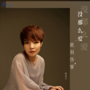
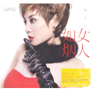

魏佳艺
============================

|  |  |
| :--: | :-- |
| [ 魏佳艺](https://i.xiami.com/joyandheat) | **播放数**: 5391648 **粉丝数**: 585 **评论数**: 31 **地区**: China 中国大陆 **风格**: 流行 Pop, 电子 Electronic, 流行说唱 Pop Rap, 华语唱作人 Chinese Singer-Songwriter  |

## 档案

## 专辑

| 名称 | 语种 | 唱片公司 | 发行时间 | 专辑类别 | 专辑风格 |
| :--: | :-- | :-- | :-- | :-- | :-- |
| [ 熬夜的人有很多想法](./albums/5021270136.md) | 国语 | 川合音乐 | 2020年08月18日 | EP, 单曲 | 国语流行 Mandarin Pop |
| [ 我唱的不是歌是无尽的心痛](./albums/5021181880.md) | 国语 | 塑星文化 | 2020年07月31日 | EP, 单曲 | 国语流行 Mandarin Pop |
| [ 以我深情 许你白首](./albums/5021058281.md) | 国语 | 酷乐传媒 | 2020年07月18日 | EP, 单曲 | 国语流行 Mandarin Pop |
| [ 我被你的爱情打了脸](./albums/5021090771.md) | 国语 | 塑星文化 | 2020年07月18日 | EP, 单曲 | 国语流行 Mandarin Pop |
| [ 没那么爱就别伤害](./albums/2105436499.md) | 国语 | 淳music | 2019年11月16日 | EP, 单曲 | 国语流行 Mandarin Pop |
| [ A&B](./albums/2102853272.md) | 国语 | 百艺星图文化 | 2017年09月08日 | EP, 单曲 | 国语流行 Mandarin Pop |
| [ 时间](./albums/2102748222.md) | 国语 | 独立发行 | 2017年05月15日 | EP, 单曲 | 国语流行 Mandarin Pop, 电子 Electronic, 华语唱作人 Chinese Singer-Songwriter |
| [ 怎么爱都爱不够](./albums/2102684079.md) | 国语 | 梦响当然 | 2016年02月23日 | EP, 单曲 | 国语流行 Mandarin Pop |
| [ 十六年以后](./albums/2100181224.md) | 国语 | 百艺星图 | 2015年08月20日 | EP, 单曲 |  |
| [ 艺曲同功三部曲](./albums/1525721987.md) | 国语 | 竹书娱乐 | 2015年02月05日 | EP, 单曲 | 电音流行 Electropop |
| [ 中国好歌曲第二季-魏佳艺okok](./albums/1325721542.md) | 国语 | 独立发行 | 2015年01月23日 | 现场专辑 | 流行摇滚 Pop Rock |
| [ 带我走](./albums/1894450433.md) | 国语 | 嘉娱帝华文化 | 2014年02月28日 | EP, 单曲 |  |
| [ 阿尔香慕的等待](./albums/1623447505.md) | 国语 | 梧桐文化 | 2011年01月10日 | EP, 单曲 |  |
| [ 女人如烟](./albums/511168.md) | 国语 | 深圳音像 | 2010年11月01日 | 录音室专辑 |  |
| [ 把事情看淡(伴奏)](./albums/388874.md) | 国语 | 梧桐文化 | 2010年01月16日 | EP, 单曲 |  |

## 评论

|  |  |  |  |
| :-- | :-- | :-- | :-- |
|  [虾米用户](https://emumo.xiami.com/u/358104299) 悲观的唯心存在现实解构虚... 2020-11-22 11:38 赞(0) 踩(0) | 
42091
 |
|  [虾米用户](https://emumo.xiami.com/u/262726350)  2020-11-19 18:39 赞(0) 踩(0) | 
这就是网络流行的烟嗓吗？很有穿透力，喜欢！
 |
|  [虾米用户](https://emumo.xiami.com/u/445617412)  2020-11-16 08:45 赞(0) 踩(0) | 
以前的呢？
 |
|  [虾米用户](https://emumo.xiami.com/u/431447637)  2019-10-31 23:41 赞(2) 踩(0) | 
好好听孟婆的碗
 |
|  [虾米用户](https://emumo.xiami.com/u/352754459) 虾米真的很棒 2019-06-19 22:03 赞(0) 踩(0) | 
我听了你唱的友谊之光，太棒了，  
 |
|  [虾米用户](https://emumo.xiami.com/u/349310290)  2018-05-26 20:59 赞(2) 踩(0) | 
怎么都不是以前的嗓音了？？？怎么都不是以前的嗓音了？？？怎么都不是以前的嗓音了？？？全都降调了，还是喜欢以前的魏佳艺
 |
|  [虾米用户](https://emumo.xiami.com/u/308467781)  2018-05-26 00:03 赞(3) 踩(0) | 
好喜欢孟婆的碗这首歌   
 |
|  [虾米用户](https://emumo.xiami.com/u/371088875)  2018-05-23 21:20 赞(0) 踩(0) | 
只有乐曲,没人声.
 |
|  [虾米用户](https://emumo.xiami.com/u/89960516)  2018-03-06 17:19 赞(0) 踩(0) | 
我是冰雨、好喜欢你
 |
|  [虾米用户](https://emumo.xiami.com/u/323562488)  2017-11-24 03:05 赞(0) 踩(0) | 
我单曲循环3天了 挺好的
 |
|  [虾米用户](https://emumo.xiami.com/u/324035033)  2017-09-15 13:36 赞(1) 踩(0) | 
单曲循环 孟婆的碗
 |
|  [虾米用户](https://emumo.xiami.com/u/13146444) 说我想说 做我想做 2017-09-01 00:11 赞(1) 踩(0) | 
好有磁性的嗓音
 |
| ⇒ |  [虾米用户](https://emumo.xiami.com/u/18698885) 低音女声 2017-09-13 17:34 赞(0) 踩(0) | 
谢谢您嘞~
 |
| ⇒ |  [虾米用户](https://emumo.xiami.com/u/13146444) 说我想说 做我想做 2017-09-13 17:36 赞(0) 踩(0) | 
<q><b>魏佳艺说：</b></q>
 |
|  [虾米用户](https://emumo.xiami.com/u/50205540)  2017-05-29 13:26 赞(1) 踩(0) | 
孟婆的碗！！！？？？
 |
|  [虾米用户](https://emumo.xiami.com/u/292373215)  2017-05-01 21:21 赞(2) 踩(0) | 
期待你的孟婆的碗，难过现在不能听
 |
|  [虾米用户](https://emumo.xiami.com/u/280056042)  2017-03-15 08:48 赞(1) 踩(0) | 
我想听你的孟婆的碗
 |
| ⇒ |  [虾米用户](https://emumo.xiami.com/u/18698885) 低音女声 2017-09-13 17:34 赞(0) 踩(0) | 
现在试试？
 |
|  [虾米用户](https://emumo.xiami.com/u/8580173)  2015-12-17 22:33 赞(1) 踩(0) | 
怎么没有 带我走
 |
|  [虾米用户](https://emumo.xiami.com/u/61751984)  2015-09-27 22:42 赞(1) 踩(0) | 
魏佳艺 我喜欢你的歌 已经好久咯
 |
|  [虾米用户](https://emumo.xiami.com/u/52750933) 我还没想好要写什么... 2015-07-23 00:41 赞(0) 踩(0) | 
  
 |
|  [虾米用户](https://emumo.xiami.com/u/49109572)  2015-04-11 17:19 赞(0) 踩(0) | 
OK
 |
|  [虾米用户](https://emumo.xiami.com/u/13564448) 暂无签名~ 2015-03-16 13:15 赞(2) 踩(0) | 
挺喜欢你的，舞台气场很足，跟我一个朋友声音很像 包括唱法。   加油！
 |
|  [虾米用户](https://emumo.xiami.com/u/18698885) 低音女声 2014-09-05 12:00 赞(21) 踩(0) | 
我刚入驻了虾米音乐人，欢迎大家来我的个人主页，收听我的最新音乐
 |
| ⇒ |  [虾米用户](https://emumo.xiami.com/u/658953) 世界核平 2016-01-05 20:30 赞(0) 踩(0) | 
好
 |
| ⇒ |  [虾米用户](https://emumo.xiami.com/u/270076047)  2017-04-29 23:13 赞(0) 踩(0) | 
哪个是新歌阿
 |
| ⇒ |  [虾米用户](https://emumo.xiami.com/u/347035045)  2018-01-30 22:21 赞(0) 踩(0) | 
 佳艺。我听你这歌三年了。感觉好好听。越听越不腻。我还是听你以前唱的。可以换过来嘛。
 |
| ⇒ |  [虾米用户](https://emumo.xiami.com/u/142091526)  2018-04-25 05:39 赞(0) 踩(0) | 
喜欢你
 |
| ⇒ |  [虾米用户](https://emumo.xiami.com/u/370387811)  2018-05-22 09:41 赞(0) 踩(0) | 
老大，这都是三年以前的留言了，而我现在才看到，有点迟到了这里面你唱过的歌不多呀
 |
| ⇒ |  [虾米用户](https://emumo.xiami.com/u/349310290)  2018-05-26 21:01 赞(0) 踩(0) | 
怎么都不是以前的嗓音了？？？怎么都不是以前的嗓音了？？？怎么都不是以前的嗓音了？？？全都降调了，为什么？还是喜欢以前的魏佳艺，现在的嗓音根本没有了以前的激情啊！从女人如烟开始迷恋你的嗓音了，消失了很久，再出来就不是原来的魏佳艺了
 |
| ⇒ |  [虾米用户](https://emumo.xiami.com/u/351448969) 中国我爱你么么哒 2019-07-01 01:54 赞(0) 踩(0) | 
唱的挺好的我给你一百个赞吧     
 |
