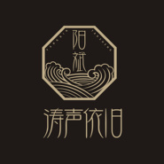

阳斌
============================

|  |  |
| :--: | :-- |
| [ 阳斌](https://i.xiami.com/yangbin) | **播放数**: 1913565 **粉丝数**: 44 **评论数**: 3 **地区**: China 中国大陆 **风格**: 流行 Pop  |

## 档案

阳斌，国内知名节目主持人，原创歌手。中国文联会员，北京文联理事。央视《星光大道》评委，中国关爱下一代形象大使。原创音乐代表作《忆华年》《悦容颜》等。

## 专辑

| 名称 | 语种 | 唱片公司 | 发行时间 | 专辑类别 | 专辑风格 |
| :--: | :-- | :-- | :-- | :-- | :-- |
| [ 禅韵](./albums/5020777401.md) | 国语 | 独立发行 | 2020年05月31日 | 录音室专辑 | 流行 Pop |
| [ 悦容颜](./albums/2105615173.md) | 国语 | 独立发行 | 2019年12月22日 | 录音室专辑 | 流行 Pop |
| [ 看山看水看中国](./albums/2104406201.md) | 国语 |  | 2018年12月18日 | 录音室专辑 | 流行 Pop |
| [ 弯弯的月亮](./albums/2104176979.md) | 国语 |  | 2018年11月12日 | 录音室专辑 | 流行 Pop |
| [ 粉红情歌](./albums/2104024309.md) | 国语 | 独立发行 | 2018年08月18日 | 录音室专辑 | 流行 Pop |
| [ 绒花](./albums/2103499268.md) | 国语 | 独立发行 | 2018年01月23日 | EP, 单曲 | 流行 Pop |
| [ 涛声依旧](./albums/2102815245.md) | 国语 | 星之梦音乐 | 2017年08月20日 | EP, 单曲 | 流行 Pop |
| [ 忆华年](./albums/2100380845.md) | 国语 | 音瀚文化 | 2016年08月20日 | EP, 单曲 |  |
| [ 青梅曲](./albums/377484152.md) | 国语 | 映帆音乐 | 2013年08月20日 | EP, 单曲 |  |

## 评论

|  |  |  |  |
| :-- | :-- | :-- | :-- |
|  [虾米用户](https://emumo.xiami.com/u/358104299) 悲观的唯心存在现实解构虚... 2021-01-06 06:31 赞(0) 踩(0) | 
45466
 |
|  [虾米用户](https://emumo.xiami.com/u/356066383)  2018-11-28 15:35 赞(1) 踩(0) | 
加油加油  
 |
|  [虾米用户](https://emumo.xiami.com/u/293692544) 你敢给我说话吗？我咬你 2018-10-14 08:10 赞(0) 踩(0) | 
来了
 |
