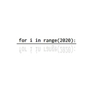
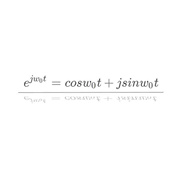
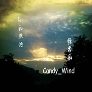

Candy_Wind
============================

|  |  |
| :--: | :-- |
| [ Candy_Wind](https://i.xiami.com/wuei) | **播放数**: 2778411 **粉丝数**: 1046 **评论数**: 63 **地区**: China 中国大陆 **风格**: 爵士说唱 Jazz Rap, 轻音乐 Easy Listening  |

## 档案

喜欢音乐~

## 专辑

| 名称 | 语种 | 唱片公司 | 发行时间 | 专辑类别 | 专辑风格 |
| :--: | :-- | :-- | :-- | :-- | :-- |
| [ Dancing with fireflies](./albums/5020665209.md) | 纯音乐 | 看见文娱 | 2020年05月22日 | EP, 单曲 | 电子乐 Electronica |
| [ 春日春风春之语](./albums/2108384036.md) | 国语 | 看见文娱 | 2020年04月17日 | EP, 单曲 | 国语流行 Mandarin Pop |
| [ 夜空与雪、都不能吃](./albums/2108274694.md) | 国语 | 看见文娱 | 2020年04月01日 | EP, 单曲 | 国语流行 Mandarin Pop |
| [ 噓を付いた](./albums/2108193235.md) | 国语 | 看见文娱 | 2020年03月18日 | EP, 单曲 | 国语流行 Mandarin Pop |
| [ Against The God](./albums/2105569717.md) | 纯音乐 | 看见文娱 | 2019年12月10日 | EP, 单曲 | 国语流行 Mandarin Pop |
| [ 雨之翼](./albums/2104881488.md) | 纯音乐 | 看见文娱 | 2019年04月27日 | 录音室专辑 | 器乐流行 Instrumental Pop, 轻音乐 Easy Listening, 器乐嘻哈 Instrumental Hip Hop |
| [ 和煦的糖果风](./albums/2104881483.md) | 纯音乐 | 看见文娱 | 2016年11月05日 | EP, 单曲 | 器乐流行 Instrumental Pop, 轻音乐 Easy Listening, 器乐嘻哈 Instrumental Hip Hop |
| [ 日常-短篇集](./albums/2100318806.md) | 纯音乐 | 独立发行 | 2016年04月21日 | 合集, 杂锦 | 爵士说唱 Jazz Rap, 器乐流行 Instrumental Pop, 轻音乐 Easy Listening, 器乐嘻哈 Instrumental Hip Hop |
| [ 拂晓车站](./albums/1932254454.md) | 纯音乐 | 看见文娱 | 2015年05月22日 | 录音室专辑 | 轻音乐 Easy Listening, 器乐流行 Instrumental Pop, 器乐嘻哈 Instrumental Hip Hop |

## 评论

|  |  |  |  |
| :-- | :-- | :-- | :-- |
|  [虾米用户](https://emumo.xiami.com/u/441462122) 最近转来虾米，不想删了。 2020-08-01 18:14 赞(1) 踩(0) | 
希望虾米弄一下《夜空和雪，都不能吃》的版权
 |
|  [虾米用户](https://emumo.xiami.com/u/340986269)   2020-07-17 17:50 赞(0) 踩(0) | 
捡到宝藏了！
 |
|  [虾米用户](https://emumo.xiami.com/u/427698722)  2020-05-28 17:28 赞(2) 踩(0) | 
从拂晓车站接触了candy的歌，一发不可收拾了໒(⊙ᴗ⊙)७✎▤真的太好听了
 |
|  [虾米用户](https://emumo.xiami.com/u/442434286)  2020-05-25 22:24 赞(2) 踩(0) | 
目前我觉得比较好的大陆纯音乐家就三个:羽肿，candy_wind，四季音色
 |
| ⇒ |  [虾米用户](https://emumo.xiami.com/u/441232153) D.W. 2020-06-07 16:26 赞(0) 踩(0) | 
还有好多优秀的原创纯音乐音乐人呢
 |
|  [虾米用户](https://emumo.xiami.com/u/3250268) 一首好歌都比爱一个人长久... 2020-05-13 21:37 赞(0) 踩(0) | 
真好听  
 |
|  [虾米用户](https://emumo.xiami.com/u/375225801)  2020-04-13 18:45 赞(0) 踩(0) | 
666
 |
|  [虾米用户](https://emumo.xiami.com/u/434667651) 我还没想好要写什么...... 2020-03-17 02:29 赞(1) 踩(0) | 
嗨你好凌晨2点半
 |
|  [虾米用户](https://emumo.xiami.com/u/344018512) 我还没想好要写什么... 2020-02-29 13:13 赞(0) 踩(0) | 
D
 |
|  [虾米用户](https://emumo.xiami.com/u/6205474) 我只是个酱油~ 2019-12-22 21:13 赞(0) 踩(0) | 
~~~~~~~~~~~~~
 |
|  [虾米用户](https://emumo.xiami.com/u/427337780)  2019-12-18 22:39 赞(0) 踩(0) | 
超喜欢青空 像极了编导独舞音乐
 |
|  [虾米用户](https://emumo.xiami.com/u/411614306)  2019-10-11 16:50 赞(2) 踩(0) | 
青空，一直作为手机铃声
 |
|  [虾米用户](https://emumo.xiami.com/u/334422245)  2019-09-21 20:52 赞(0) 踩(0) | 
谢谢你的纯音乐，很安静很好听。
 |
|  [虾米用户](https://emumo.xiami.com/u/326826579) 不愁明月尽  自有暗香来 2019-08-27 18:30 赞(0) 踩(0) | 
不错不错
 |
|  [虾米用户](https://emumo.xiami.com/u/326000452) 天大地大各不同的路，你和... 2019-08-21 19:43 赞(0) 踩(0) | 

 |
|  [虾米用户](https://emumo.xiami.com/u/304805621) 愿做一粒尘，与光同化去。 2019-06-18 14:35 赞(2) 踩(0) | 
我想冷淡的我，发现了一个契合我心的作曲家 
 |
|  [虾米用户](https://emumo.xiami.com/u/166302128) 冷冷清清的风风火火. 2019-06-16 16:05 赞(1) 踩(0) | 
发现宝藏！
 |
|  [虾米用户](https://emumo.xiami.com/u/325374787)  2019-04-22 18:54 赞(0) 踩(0) | 
到此一游
 |
|  [虾米用户](https://emumo.xiami.com/u/251844349) 犹记得那年夏至........ 2019-03-13 08:36 赞(1) 踩(0) | 
这么唯美的音乐，为什么这么少评论。。。 
 |
| ⇒ |  [虾米用户](https://emumo.xiami.com/u/346365882)  2019-04-06 23:15 赞(0) 踩(0) | 
因为轨风大大在网易云比较活跃~
 |
|  [虾米用户](https://emumo.xiami.com/u/12227858) 黑与白 你和他 2019-03-07 00:55 赞(1) 踩(0) | 
好听
 |
|  [虾米用户](https://emumo.xiami.com/u/30273866) 请勿关注。 2019-02-03 00:59 赞(1) 踩(0) | 
加油加油！ 看好你哦
 |
|  [虾米用户](https://emumo.xiami.com/u/5751859) 最爱New Age 2019-01-05 18:37 赞(2) 踩(0) | 
中国的新世纪音乐作曲家吗？支持，加油！
 |
|  [虾米用户](https://emumo.xiami.com/u/339407573)  2018-10-09 23:49 赞(4) 踩(0) | 
超喜歡 拂曉車站 (σ･ω･)σYO♪
 |
|  [虾米用户](https://emumo.xiami.com/u/375047773) 越努力，越幸运 2018-06-09 17:39 赞(2) 踩(0) | 
很喜欢大大的作品，希望大大继续发出新的作品马上要中考了，每天背书都在单曲循环着，加油＾０＾~
 |
|  [虾米用户](https://emumo.xiami.com/u/12194481) 敲击的不是音符,是心率;... 2018-04-28 09:31 赞(2) 踩(0) | 
很多曲在虾米没有啊，在网易上有许多
 |
|  [虾米用户](https://emumo.xiami.com/u/51720459) 活着或死去。 2018-03-26 17:29 赞(4) 踩(0) | 
可以把猫的舞步发布到虾米上来吗(ฅ&amp;gt;&amp;omega;&amp;lt;*ฅ)真的很喜欢那首(ฅ&amp;gt;&amp;omega;&amp;lt;*ฅ)超级可爱
 |
|  [虾米用户](https://emumo.xiami.com/u/131986908) 如果你眼神能够为我片刻的... 2018-03-15 14:25 赞(1) 踩(0) | 
眼前一亮
 |
|  [虾米用户](https://emumo.xiami.com/u/313188899)  2018-02-12 17:24 赞(0) 踩(0) | 
怎么没看到GoForTheNext那首歌
 |
|  [虾米用户](https://emumo.xiami.com/u/348588434) 我对爱情，真的是厌恶至极... 2018-02-11 10:56 赞(0) 踩(0) | 
轨风！
 |
|  [虾米用户](https://emumo.xiami.com/u/332765835)  2018-01-25 10:43 赞(1) 踩(0) | 
支持Candy_Wind，用心做好heartfelt音乐～
 |
|  [虾米用户](https://emumo.xiami.com/u/134857402) 谁在南方群星之间用烟写你... 2018-01-18 09:38 赞(0) 踩(0) | 
喜欢
 |
|  [虾米用户](https://emumo.xiami.com/u/282658094) 师泊泊 2018-01-05 22:16 赞(0) 踩(0) | 
好美的旋律，百听不厌
 |
|  [虾米用户](https://emumo.xiami.com/u/54686131) 要听更多喜欢的歌~~~ 2017-11-29 19:03 赞(0) 踩(0) | 
期待你的2018~~~
 |
|  [虾米用户](https://emumo.xiami.com/u/6726293) 曲美詞美意境美。 2017-09-10 11:30 赞(2) 踩(0) | 
jhh是jazzy hiphop嘛？(ฅ&amp;gt;&amp;omega;&amp;lt;*ฅ)
 |
|  [虾米用户](https://emumo.xiami.com/u/271017410) 我一直都想做一个冷酷的人 2017-09-02 03:14 赞(1) 踩(0) | 
嗯嗯
 |
|  [虾米用户](https://emumo.xiami.com/u/54686131) 要听更多喜欢的歌~~~ 2017-08-25 10:34 赞(1) 踩(0) | 
喜欢，终于来了~~~
 |
|  [虾米用户](https://emumo.xiami.com/u/54445709) 于无声处听惊雷。 2017-05-07 23:09 赞(1) 踩(0) | 
清新唯美的曲风，很喜欢。
 |
|  [虾米用户](https://emumo.xiami.com/u/52512015)  2017-03-18 10:19 赞(0) 踩(0) | 
最喜欢11月风。
 |
|  [虾米用户](https://emumo.xiami.com/u/52512015)  2017-03-18 10:18 赞(4) 踩(0) | 
这么美的乐曲，这么优秀的作曲家，关注人竟如此之少。我来这里添砖加瓦，增加点人气。
 |
|  [虾米用户](https://emumo.xiami.com/u/2754685)  2017-03-15 15:22 赞(3) 踩(0) | 
喜欢拂晓车站，青空，十一月风~~
 |
|  [虾米用户](https://emumo.xiami.com/u/1643164) 阳光淌过手心天空笑了笑！ 2016-10-21 10:50 赞(0) 踩(0) | 
~~
 |
|  [虾米用户](https://emumo.xiami.com/u/234486813)  2016-10-07 20:40 赞(0) 踩(0) | 
喜欢十一月风，风风晚好，嘻嘻~
 |
|  [虾米用户](https://emumo.xiami.com/u/4370606) 我爱头发比人多 2016-09-22 15:38 赞(3) 踩(0) | 
这么少人关注，不科学。赞一个 
 |
|  [虾米用户](https://emumo.xiami.com/u/32056965) stay gold. 2016-07-30 11:13 赞(3) 踩(0) | 
支持一下～
 |
|  [虾米用户](https://emumo.xiami.com/u/44884926) 听 2016-07-10 17:08 赞(1) 踩(0) | 
青空好听
 |
|  [虾米用户](https://emumo.xiami.com/u/32288678) 彩月 2016-04-22 13:08 赞(0) 踩(0) | 
新砖最后一首快点弄好撒
 |
|  [虾米用户](https://emumo.xiami.com/u/32288678) 彩月 2016-04-21 22:11 赞(0) 踩(0) | 
……
 |
|  [虾米用户](https://emumo.xiami.com/u/49075538) 爱笑 简单 清澈 温暖而... 2016-04-13 20:41 赞(0) 踩(0) | 
十一月风
 |
|  [虾米用户](https://emumo.xiami.com/u/231797) 活着真好 好好活着 2016-04-06 19:24 赞(0) 踩(0) | 
支持~
 |
|  [虾米用户](https://emumo.xiami.com/u/8326332) 后来，即便是音乐，也无法... 2016-02-03 09:57 赞(0) 踩(0) | 
早安，Candy_Wind
 |
|  [虾米用户](https://emumo.xiami.com/u/45435466) Learn By Hea... 2015-12-23 12:34 赞(0) 踩(0) | 
加油！！！
 |
|  [虾米用户](https://emumo.xiami.com/u/8326332) 后来，即便是音乐，也无法... 2015-12-23 11:00 赞(0) 踩(0) | 
不错，支持，加油
 |
|  [虾米用户](https://emumo.xiami.com/u/41203183)  2015-12-15 04:06 赞(2) 踩(0) | 
太美了 十一月风~ 特地来捧场 给赞~\(≧▽≦)/~
 |
|  [虾米用户](https://emumo.xiami.com/u/46732858) ミ◉ V ◉彡 2015-10-22 20:17 赞(0) 踩(0) | 
不错
 |
|  [虾米用户](https://emumo.xiami.com/u/12876004) ` 2015-10-17 11:59 赞(0) 踩(0) | 
~~
 |
|  [虾米用户](https://emumo.xiami.com/u/32288678) 彩月 2015-10-12 22:27 赞(0) 踩(0) | 
作者人呢
 |
|  [虾米用户](https://emumo.xiami.com/u/32288678) 彩月 2015-10-03 08:58 赞(0) 踩(0) | 
作者
 |
|  [虾米用户](https://emumo.xiami.com/u/32288678) 彩月 2015-09-21 12:58 赞(0) 踩(0) | 
支持
 |
|  [虾米用户](https://emumo.xiami.com/u/32288678) 彩月 2015-09-16 13:18 赞(0) 踩(0) | 
贴吧来的
 |
|  [虾米用户](https://emumo.xiami.com/u/50452313)  2015-08-22 20:21 赞(0) 踩(0) | 
赞
 |
|  [虾米用户](https://emumo.xiami.com/u/43036139)  2015-07-18 12:22 赞(0) 踩(0) | 
好漂亮
 |
|  [虾米用户](https://emumo.xiami.com/u/39861541) 音乐是世界上最美的语言 2015-06-17 14:42 赞(0) 踩(0) | 
偶哈哈哈哈特来点赞！一首《情书》真的好听！
 |
