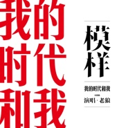

模样
============================

|  |  |
| :--: | :-- |
| [ 模样](https://emumo.xiami.com/album/2103834452) | **艺人**: [老狼](../index.md) **语种**: 国语 **唱片公司**: StreetVoice **发行时间**: 2018年07月23日 **专辑类别**: EP, 单曲 **专辑风格**: 国语流行 Mandarin Pop **播放数**: 489868 **收藏数**: 88 **评论数**: 6  |

## 简介

《模样》是纪录片《我的时代和我》的主题曲，由老狼演唱，火星电台作词作曲。  
 

## 曲目

- [模样MV纪录片《我的时代和我》主题曲](./2103834452/bCmUe5Q76904.md)

## 评论

|  |  |  |  |
| :-- | :-- | :-- | :-- |
|  [虾米用户](https://emumo.xiami.com/u/245776883) 我还没想好要写什么... 2018-10-17 09:28 赞(1) 踩(0) | 
纯净的声音就是青春的印记，无论何时都要笑得像孩子一样！
 |
|  [虾米用户](https://emumo.xiami.com/u/30752796) 我还没想好要写什么... 2018-10-07 22:07 赞(0) 踩(0) | 
回不到的过去 梦不完的将来
 |
|  [虾米用户](https://emumo.xiami.com/u/16217772) 听听老歌,念念过去. 2018-07-25 09:06 赞(0) 踩(0) | 
笑得像孩子一样！
 |
|  [虾米用户](https://emumo.xiami.com/u/411496) 我还没想好要写什么... 2018-07-24 10:59 赞(1) 踩(0) | 
被时代召唤的命运/你想要怎样的答案/被青春挥霍的愤怒/用平庸交换
 |
|  [虾米用户](https://emumo.xiami.com/u/12464012) 这个世界太疯狂 2018-07-24 09:41 赞(1) 踩(0) | 
有些人无论多老，声音依然那么青春。
 |
|  [虾米用户](https://emumo.xiami.com/u/47555314)   2018-07-23 21:44 赞(1) 踩(0) | 
你就是我的那个模样！
 |
