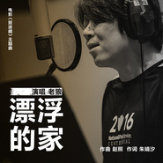
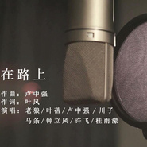
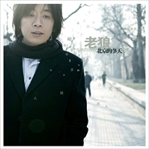
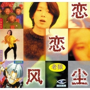

老狼
============================

|  |  |
| :--: | :-- |
| [ 老狼](https://i.xiami.com/laolang) | **地区**: China 中国大陆 **风格**: 城市民谣 Urban Folk, 民谣 Folk, 校园民谣 Campus Folk **播放数**: 50273129 **粉丝数**: 56425 **评论数**: 903  |

## 档案

老狼，本名王阳，原来是学无线电，大学毕业两年后在工业自动化设计的公司里面做铸造机的自动化自控……后来还是觉得不太适应这种生活方式，所以才决定改变，而且认为自己挺幸运的，因为辞职后没过多久就开始唱歌，然后就出名了。 
1989-1991年，加入中国第一支大学生摇滚乐队“青铜器”担任主唱，在北京各种地下摇滚音乐会与崔健、唐朝、黑豹等乐队同台演出。 
1991-1993年，乐队解散，大学毕业，在北京一家工业自动化设计公司做电脑工程师；参加大地唱片公司唱片《校园民谣1》的录制，演唱《同桌的你》《睡在我上铺的兄弟》及《流浪歌手的情人》三首主打歌。 
1994-1997年《校园民谣1》发行近六十万张，《同桌的你》及《睡在我上铺的兄弟》在全国各地的流行音乐排行榜上连续数周位居榜首； 
参加中央电视台“94大学生毕业晚会”，引起巨大反响； 
参加中央电视台1995年春节联欢晚会，演唱《同桌的你》，获“观众评选最喜爱节目金奖”。 
1995年，签约中国大陆著名音乐制作人黄小茂创建的风行音乐工作室。首张个人专辑《恋恋风尘》由上海声像出版社发行，专辑发行20天便创下了23万的销售记录，共发行40万张，成为当年中国国内歌手发行量最高的专辑； 
《同桌的你》被收入红星公司制作的“红星一号”专辑中，由宝丽金香港正东公司代理香港及东南亚发行； 
专辑《恋恋风尘》在香港重新缩混，并由宝丽金正东公司在香港及东南亚发行； 
参加由全国多家电台、音乐台及音乐生活报主办的“流行音乐十年回顾”大型演出，《同桌的你》演唱会版收录于中国唱片总公司出版的“十年经典歌曲”中。 
1996年，与北京麦田音乐制作公司合作出版《青春无悔》专辑，其中演唱的《模范情书》、《月亮》《青春无悔》和《久违的事》纷纷成为各地电台榜首的歌曲； 
荣获97年度Channel[V]中文TOP20榜中榜音乐无限评审团特别推荐男歌手奖。 
2000年2月，与世界五大唱片公司之一的“华纳唱片”签订唱片约，并与“麦田音乐”签订演艺合约； 
3月，久违的老狼出现在首都体育馆“搜狐之夜”大型演唱会的现场，用久违的声音把观众重新带回了经典年代； 
6月参加中央电视台黄金节目“同一首歌”校园行大型歌会的录制，演唱其经典曲目《同桌的你》； 
8月推出郁冬词曲制作的两首全新单曲《百分之百的女孩》、《虎口脱险》，在各大排行榜上再显威力； 
全程参加“搜狐2000·华纳群星神州行大型高校巡回演唱会”，在全国十城市十所高校掀起阵阵狂澜。 
2001年5月，参加凤凰卫视发起的“申奥万里行”特别节目。 
5-10月担任“统一闪亮之星2001年大学生歌手选拔赛”西安、沈阳、北京、南京赛区的演出嘉宾。 
2002年3月，发布单曲《关于现在关于未来》； 
5月在北京首都体育馆参加“三星之夜—为国足壮行”大型演唱会。6月，《青春无悔》再版； 
9月与西藏登山协会及“雪山清扫队”一齐， 参予“还珠峰清洁”环保大行动，负重登上6000米高峰成为内地“海拔最高”的艺人。 
10月，发布单曲《晴朗》； 
11月，第二张个人专辑《晴朗》出版发行，著名门户网站“新浪”联合“卓越网”进行网上独家限量发售CD活动。 
2004  年  10  月  8  日，与潘茜在北京郡王府结婚。 
2016  年  3  月  18  日以补位歌手身份参加湖南卫视《我是歌手第四季》。

## 专辑

| 名称 | 语种 | 唱片公司 | 发行时间 | 专辑类别 | 专辑风格 |
| :--: | :-- | :-- | :-- | :-- | :-- |
| [ 因为有你](./albums/2104760523.md) | 国语 | 东家文化 | 2019年04月10日 | EP, 单曲 | 国语流行 Mandarin Pop |
| [ 谁](./albums/2104700005.md) | 国语 | 反正靠谱 | 2019年03月25日 | EP, 单曲 |  |
| [ 飞驰的人生](./albums/2104554138.md) | 国语 | 亭东影业 | 2019年01月30日 | EP, 单曲 | 国语流行 Mandarin Pop |
| [ 模样](./albums/2103834452.md) | 国语 | StreetVoice | 2018年07月23日 | EP, 单曲 | 国语流行 Mandarin Pop |
| [ 无忧的蓝天](./albums/2103489767.md) | 国语 | 乐之云文化 | 2018年01月15日 | EP, 单曲 | 国语流行 Mandarin Pop, 民谣 Folk |
| [ 我要你](./albums/2102410124.md) | 国语 | 斯立文化 | 2016年10月21日 | EP, 单曲 | 国语流行 Mandarin Pop, 民谣 Folk |
| [ 漂浮的家](./albums/2102408905.md) | 国语 | 霍尔果斯青春光线 | 2016年10月18日 | EP, 单曲 | 国语流行 Mandarin Pop |
| [ 管艺](./albums/2100240824.md) | 国语 | 音乐肖像 | 2015年11月24日 | EP, 单曲 | 国语流行 Mandarin Pop, 摇滚 Rock & Roll |
| [ 恒大音乐狂欢节, Vol. 12: 老狼](./albums/2105921017.md) | 英语 | 恒大音乐 | 2014年12月01日 | EP, 单曲 | 欧美流行 Western Pop |
| [ 2014恒大音乐节现场版-老狼](./albums/2103922566.md) | 国语 | 恒大音乐 | 2014年09月18日 | 现场专辑 |  |
| [ 在路上](./albums/1708691068.md) | 国语 | 十三月唱片 | 2014年08月22日 | EP, 单曲 | 国语流行 Mandarin Pop |
| [ 北京的冬天](./albums/2109.md) | 国语 | 华纳音乐 | 2007年02月08日 | 录音室专辑 | 城市民谣 Urban Folk, 校园民谣 Campus Folk |
| [ 晴朗Shine](./albums/2110.md) | 国语 | 华纳音乐 | 2002年11月18日 | 录音室专辑 | 校园民谣 Campus Folk, 城市民谣 Urban Folk |
| [ 恋恋风尘](./albums/2112.md) | 国语 | 红星生产社, 风行唱片 | 1995年07月01日 | 录音室专辑 | 校园民谣 Campus Folk, 城市民谣 Urban Folk |

## 评论

|  |  |  |
| :-- | :-- | :-- |
|  [虾米用户](https://emumo.xiami.com/u/252450080) 老铁 2020-09-25 20:33 赞(0) 踩(0) | 
有句话很贴切   老狼的声音自带回忆启动键
 |
|  [虾米用户](https://emumo.xiami.com/u/1569233)   2020-08-17 22:03 赞(0) 踩(0) | 
与其王阳补牢，不如叛变老狼
 |
|  [虾米用户](https://emumo.xiami.com/u/43492923) 行到水穷我才开始害怕，夕... 2020-07-25 19:41 赞(0) 踩(0) | 
-
 |
|  [虾米用户](https://emumo.xiami.com/u/442479914)  2020-07-18 13:49 赞(0) 踩(0) | 
第一次听您的歌还是磁带呢
 |
|  [虾米用户](https://emumo.xiami.com/u/5555764) 阿Ken 2020-02-17 22:59 赞(0) 踩(0) | 
唉
 |
|  [虾米用户](https://emumo.xiami.com/u/428479358)  2019-12-19 19:16 赞(0) 踩(0) | 
唉
 |
|  [虾米用户](https://emumo.xiami.com/u/357434151)  2019-11-28 08:49 赞(0) 踩(0) | 
白衬衣，牛仔裤，飘逸的长发。谢谢你，我的回忆。
 |
|  [虾米用户](https://emumo.xiami.com/u/324006665) 最近小宇宙又蠢蠢欲动了…... 2019-11-12 11:02 赞(0) 踩(0) | 
大概是2001还是2002，老狼在科大办歌友会，我姐们儿据说是牺牲了色相给我要来了票（感谢她的牺牲），那天老狼穿着蓝色格子衬衫和牛仔裤，不漂亮，但很帅（帅和好看完全是两个概念），让我意外的是我一直以为民谣歌手唱功是可以忽略的，但老狼的现场和卡带没区别。另外，那天的嘉宾是刚刚减掉长发的汪峰，片染了点红色，那个造型很短暂。
 |
|  [虾米用户](https://emumo.xiami.com/u/31980556) 瑞尔 2019-07-10 12:36 赞(0) 踩(0) | 
喜欢你 
 |
|  [虾米用户](https://emumo.xiami.com/u/286470877) 热爱一切好听的歌。 2019-07-08 20:25 赞(0) 踩(0) | 
老狼一开口，时光好像倒退了十几年……
 |
|  [虾米用户](https://emumo.xiami.com/u/419044371)  2019-06-26 14:42 赞(0) 踩(0) | 
大哥，你的音乐魅力，影响了几代人，喜欢你是时代的烙印！永远支持你
 |
|  [虾米用户](https://emumo.xiami.com/u/47724946) 快乐快乐哈 2019-05-06 22:10 赞(1) 踩(0) | 
现在才知道你叫王阳，我是你
 |
|  [虾米用户](https://emumo.xiami.com/u/408363051)  2019-03-06 13:53 赞(0) 踩(0) | 
老狼，收藏的那首歌前半部很好听，后半部可惜
 |
|  [虾米用户](https://emumo.xiami.com/u/48084409) 我还没想好要写什么.. 2019-02-01 21:03 赞(1) 踩(0) | 
最喜欢老狼演唱的两首歌，一首是由高旗词曲的电视剧《温州女人》片尾曲《别说》，一首是老狼和明哥合唱的《来》，可惜都找不到
 |
|  [虾米用户](https://emumo.xiami.com/u/277110877)  2019-01-08 23:26 赞(1) 踩(0) | 
意外的惊喜，感谢有你带来的记录那个年代的好歌。有缘在二十多年前看过你的演出，也有了你的签名（在我的退伍证的最后一页），今天他依然静静的躺在我的记忆的某个地方。只是略微有点泛黄的签名告诉我，那份爱不变……
 |
|  [虾米用户](https://emumo.xiami.com/u/303506160) 因为我对你爱的深沉 2019-01-03 08:20 赞(1) 踩(0) | 
嘿呦
 |
|  [虾米用户](https://emumo.xiami.com/u/95358620) 这个世界没有光也没有虾米... 2018-12-03 11:38 赞(0) 踩(0) | 

 |
|  [虾米用户](https://emumo.xiami.com/u/355089303) 我来虾米多少天了?！ 2018-12-03 10:23 赞(0) 踩(0) | 
嗨皮波斯带
 |
|  [虾米用户](https://emumo.xiami.com/u/284023212)  2018-12-03 10:21 赞(0) 踩(0) | 
美妙绝伦的歌声，大概是这个世界地理位置最远灵魂最近的距离 。祝福你！
 |
|  [虾米用户](https://emumo.xiami.com/u/349165379)  2018-12-03 10:08 赞(0) 踩(0) | 
祝你生日快乐！ 
 |
|  [虾米用户](https://emumo.xiami.com/u/41803364) 暂无签名~ 2018-12-03 10:01 赞(0) 踩(0) | 
生日快乐
 |
|  [虾米用户](https://emumo.xiami.com/u/354249056) 我还没想好要写什么... 2018-11-25 21:40 赞(0) 踩(0) | 
五年前去成都草莓 崩了两天 最后一起走到舞台很远的草坪 累得睡着 小狼叫我 姐 迷迷糊糊起来 远远的恋恋风尘 有热风吹着 我很喜欢
 |
|  [虾米用户](https://emumo.xiami.com/u/347278135)  2018-10-05 17:51 赞(2) 踩(0) | 
谢谢老狼的歌声陪我长大
 |
| ⇒ |  [虾米用户](https://emumo.xiami.com/u/366255329)  2018-11-02 16:41 赞(0) 踩(0) | 
我也是
 |
|  [虾米用户](https://emumo.xiami.com/u/3566813) 菩萨，祝您身体健康！34... 2018-09-27 01:23 赞(3) 踩(0) | 
听一圈下来，老狼的嗓子唱民谣，最妥帖
 |
|  [虾米用户](https://emumo.xiami.com/u/27516357)  2018-09-17 07:16 赞(2) 踩(0) | 
太好听了
 |
|  [虾米用户](https://emumo.xiami.com/u/130542278) 未来 谁又说得准呢 2018-09-01 13:03 赞(1) 踩(0) | 
你们不觉得老狼和赵雷长得有点像吗
 |
|  [虾米用户](https://emumo.xiami.com/u/303506160) 因为我对你爱的深沉 2018-08-25 02:00 赞(1) 踩(0) | 
嘿呦
 |
|  [虾米用户](https://emumo.xiami.com/u/350433957)  2018-06-20 20:45 赞(0) 踩(0) | 
有在劫难逃这首歌不是live版的吗？，我昨天一个误操作不小心给删了  
 |
|  [虾米用户](https://emumo.xiami.com/u/70786838) 你还有一些年轻人的不快乐 2018-06-14 13:17 赞(1) 踩(0) | 
我愛你
 |
|  [虾米用户](https://emumo.xiami.com/u/212191641) 想好写什么...我也不会... 2018-05-26 08:05 赞(2) 踩(0) | 
过年回家高速堵车我在全民K歌唱了一首《同桌的你》，遗憾唱错了两个词，很熟练没好意思发布！有些歌曲是我们的美好回忆，心里深处的声音！给您点赞！老师！
 |
|  [虾米用户](https://emumo.xiami.com/u/10703) 土窑爱好者 2018-05-20 22:44 赞(1) 踩(0) | 
距离「北京的冬天」已经 10 年多了，当年正是高考前，音乐是精神支柱。好期待老狼出新专辑。
 |
|  [虾米用户](https://emumo.xiami.com/u/271174134)   2018-05-15 12:46 赞(1) 踩(0) | 
喜欢老狼的声音 
 |
|  [虾米用户](https://emumo.xiami.com/u/361503987) 我还没想好要写什么... 2018-04-30 16:12 赞(0) 踩(0) | 
很喜欢老狼唱的歌   
 |
|  [虾米用户](https://emumo.xiami.com/u/327321413)  2018-03-06 23:50 赞(0) 踩(0) | 
这首歌最遗憾的是没有mv   
 |
|  [虾米用户](https://emumo.xiami.com/u/300891156)  2018-03-05 22:39 赞(3) 踩(0) | 
民谣老狼无可替代
 |
|  [虾米用户](https://emumo.xiami.com/u/46970481)  2018-02-24 00:17 赞(2) 踩(0) | 
声音太好听了
 |
|  [虾米用户](https://emumo.xiami.com/u/348204011)  2018-02-07 16:00 赞(1) 踩(0) | 
老狼的歌竟然没版权....开虾米玩笑
 |
| ⇒ |  [虾米用户](https://emumo.xiami.com/u/404911508)  2018-09-26 00:43 赞(0) 踩(0) | 
看过报道，高晓松说版权给了另一家公司，自己写的歌，虾米也没法听   
 |
|  [虾米用户](https://emumo.xiami.com/u/8892726) 天气不似预期，但要走，总... 2017-12-16 02:38 赞(1) 踩(0) | 
以前朋友说他听某首歌哭了，我就觉得搞笑，大老爷们哭、还是因为听歌。直到现在我才明白为什么
 |
|  [虾米用户](https://emumo.xiami.com/u/24325936) 无忧无虑，向前游。。。 2017-12-04 15:14 赞(0) 踩(0) | 
最后一张照片啥意思啊？ 另外，老狼、郭峰傻傻分不清。
 |
|  [虾米用户](https://emumo.xiami.com/u/54081537)  2017-11-23 09:26 赞(1) 踩(0) | 
狼哥，我爱你
 |
|  [虾米用户](https://emumo.xiami.com/u/251497785)  2017-11-14 13:17 赞(0) 踩(0) | 
回不去了，偶尔静下来听他的歌，涤去浮躁，消去烦闷，继续生活！
 |
|  [虾米用户](https://emumo.xiami.com/u/330904958)  2017-11-10 02:51 赞(1) 踩(0) | 
《同桌的你》这首歌是我们80后记忆，是我这辈子最喜欢的一首老歌，无论走到哪里，只要听到这首歌，小学的那段时光立刻浮现在眼前。  不是说一首歌一个故事吗？就是因为这首歌我喜欢上了我的同桌，所以每次听到这首歌的时候我都情不自禁的跟着唱起来，明天你是否会想起&amp;hellip;&amp;hellip;
 |
|  [虾米用户](https://emumo.xiami.com/u/298456114)  2017-11-07 01:35 赞(0) 踩(0) | 

 |
|  [虾米用户](https://emumo.xiami.com/u/224564578)   2017-11-01 01:06 赞(0) 踩(0) | 
狼哥。你那首睡在我上铺的兄弟 为什么不能听在哪里能下载？
 |
|  [虾米用户](https://emumo.xiami.com/u/774208) 我还没想好要写什么... 2017-10-27 23:54 赞(2) 踩(0) | 
老狼将于10月6日于上海简单生活节演出！  10月4-6日 上海世博公园 简单生活节  刘若英、陈绮贞、郑秀文、张震岳、徐佳莹、朴树、李荣浩、许巍、李志、老狼、窦靖童、陈粒、王若琳、赵雷、苏慧伦、陶晶莹、关淑怡、梁博、韦礼安、Faye飞、邱比、陈珊妮 feat 蔡健雅、MATZKA feat A-Lin、魏如萱 feat 马頔、杨乃文 feat 高旗、HUSH feat 阿肆、草东没有派对、万能青年旅店、逃跑计划、好妹妹、旅行团、果味VC、Hello Nico、声音玩具……众星云集！  微博：@简单生活节上海 <a href="http://weibo.com/simplelifeshanghai" target="_blank" rel="nofollow noreferrer noopener">http://weibo.com/simplelifeshanghai</a>
 |
|  [虾米用户](https://emumo.xiami.com/u/4011970)  2017-10-27 23:30 赞(1) 踩(0) | 
老狼就是一种情怀，一个年代，又遥远又距离内心最近
 |
|  [虾米用户](https://emumo.xiami.com/u/9043661)  2017-10-27 23:20 赞(0) 踩(0) | 
青葱岁月纯真感情每每听到总能勾起心中那抹淡淡的忧伤
 |
|  [虾米用户](https://emumo.xiami.com/u/13606751)  2017-10-27 23:06 赞(0) 踩(0) | 
一直就比较喜欢民谣，作为民谣歌手的代表人物，一直都很喜欢。那种平淡、低调与真实
 |
|  [虾米用户](https://emumo.xiami.com/u/298948030) 中國詩音樂電影创始人作曲... 2017-10-17 21:56 赞(1) 踩(0) | 
你好
 |
|  [虾米用户](https://emumo.xiami.com/u/306675924)  2017-10-17 17:56 赞(0) 踩(0) | 
有着很多的
 |
|  [虾米用户](https://emumo.xiami.com/u/39816876) 全世界不缺你一个 2017-10-09 23:09 赞(0) 踩(0) | 
艺人相册中居然没有你的照片 矮大紧这董事长做得 好歹把哥们的主页搞一搞啊 还有买回恋恋风尘的版权啊 整天就知道侃大山
 |
|  [虾米用户](https://emumo.xiami.com/u/39816876) 全世界不缺你一个 2017-10-09 23:06 赞(4) 踩(0) | 
老狼这家伙二十几年来也没出多少专辑 平时都在干嘛啊 几年才录一首 浪费这把好嗓子
 |
| ⇒ |  [虾米用户](https://emumo.xiami.com/u/404911508)  2018-09-26 00:44 赞(0) 踩(0) | 
十年没出了。北京的冬天好像是08年的。期待。哎
 |
|  [虾米用户](https://emumo.xiami.com/u/2340635) 我还没想好要写什么... 2017-09-29 11:50 赞(1) 踩(0) | 
喜欢狼哥唱郁冬的作品、希望能出个郁冬作品辑、我现在爱上了这样的女人、、 Radio北京、、
 |
|  [虾米用户](https://emumo.xiami.com/u/72752436) 我女朋友，高级。 2017-09-18 17:57 赞(0) 踩(0) | 
版权来啦 天哪
 |
|  [虾米用户](https://emumo.xiami.com/u/325094497)  2017-09-15 11:15 赞(0) 踩(0) | 
能不能把二微码去掉
 |
|  [虾米用户](https://emumo.xiami.com/u/21690011)  2017-08-31 10:25 赞(0) 踩(0) | 
那素颜的青春，永远是我一生的向往。每当孤独，彷徨，我在这里徜徉。
 |
|  [虾米用户](https://emumo.xiami.com/u/315187077) TYTD 2017-07-26 19:15 赞(1) 踩(0) | 
接觸的第一張內地唱片就是老狼
 |
|  [虾米用户](https://emumo.xiami.com/u/50854016) 我还没想好要写什么... 2017-07-14 22:53 赞(0) 踩(0) | 
老狼居然这么多歌没版权，我该说什么好，往昔的情份都是捕风吗 
 |
|  [虾米用户](https://emumo.xiami.com/u/311745467)  2017-07-13 15:21 赞(1) 踩(0) | 
老狼唱的同桌的你真好
 |
|  [虾米用户](https://emumo.xiami.com/u/308105116) 哈哈O(∩_∩)O哈哈~ 2017-06-28 15:01 赞(0) 踩(0) | 
666
 |
|  [虾米用户](https://emumo.xiami.com/u/305989437) 友善 2017-06-20 22:38 赞(0) 踩(0) | 
期待你的出现！
 |
|  [虾米用户](https://emumo.xiami.com/u/2991904) 希望虾米芝麻开花噢 2017-06-17 09:20 赞(0) 踩(0) | 
希望再一次能和高同志合作出精品
 |
|  [虾米用户](https://emumo.xiami.com/u/297302109)  2017-05-29 13:16 赞(0) 踩(0) | 
既有才华又有文艺范的校园老大哥！
 |
|  [虾米用户](https://emumo.xiami.com/u/205802381)  2017-05-15 19:40 赞(0) 踩(0) | 
喜欢岁月留下的痕迹
 |
|  [虾米用户](https://emumo.xiami.com/u/296557173)  2017-05-15 17:06 赞(0) 踩(0) | 
棒棒哒
 |
|  [虾米用户](https://emumo.xiami.com/u/36093606) 我还没想好要写什么... 2017-05-09 10:21 赞(0) 踩(0) | 
想转一张票&amp;hellip;朋友去不了了&amp;hellip;&amp;hellip;   
 |
|  [虾米用户](https://emumo.xiami.com/u/36093606) 我还没想好要写什么... 2017-05-08 11:08 赞(0) 踩(0) | 
520来天津哈哈哈哈哈哈哈
 |
|  [虾米用户](https://emumo.xiami.com/u/291471103)  2017-04-25 23:59 赞(0) 踩(0) | 
有新歌吗，我喜欢你的歌
 |
|  [虾米用户](https://emumo.xiami.com/u/290130451) 因为音乐生活变得更有色彩 2017-04-22 22:06 赞(0) 踩(0) | 
太赞了 
 |
|  [虾米用户](https://emumo.xiami.com/u/287737643)  2017-04-14 12:46 赞(0) 踩(0) | 
嗯
 |
|  [虾米用户](https://emumo.xiami.com/u/74150580)  2017-04-01 12:31 赞(0) 踩(0) | 
支持！太喜欢您这纯净清澈的声音了！永远听不腻！
 |
|  [虾米用户](https://emumo.xiami.com/u/284724369) 我还没想好要写什么... 2017-03-31 09:08 赞(0) 踩(0) | 
好
 |
|  [虾米用户](https://emumo.xiami.com/u/10572761)  2017-03-30 19:35 赞(0) 踩(0) | 
这是让老狼更有价值啊
 |
|  [虾米用户](https://emumo.xiami.com/u/32106929) 你管他那么多  上天安排... 2017-03-29 12:59 赞(0) 踩(0) | 
心里住着一个老狼 
 |
|  [虾米用户](https://emumo.xiami.com/u/58921238)  2017-03-27 01:11 赞(0) 踩(0) | 
看了老狼&amp;ldquo;爱已成歌&amp;rdquo;演唱会，唱的真好  
 |
|  [虾米用户](https://emumo.xiami.com/u/281906090)  2017-03-26 19:06 赞(1) 踩(0) | 
声音总有故意
 |
|  [虾米用户](https://emumo.xiami.com/u/126412066)  2017-03-23 21:43 赞(0) 踩(0) | 
虎口脱险
 |
|  [虾米用户](https://emumo.xiami.com/u/281657542)  2017-03-19 15:29 赞(1) 踩(0) | 
写的真好，唱的也好，永远的回忆。
 |
|  [虾米用户](https://emumo.xiami.com/u/281495657)  2017-03-18 23:33 赞(0) 踩(0) | 
很好听
 |
|  [虾米用户](https://emumo.xiami.com/u/20550793)  2017-03-16 10:15 赞(0) 踩(0) | 
[Reply@Johnny Zhu][Reply@Johnny Zhu]
 |
|  [虾米用户](https://emumo.xiami.com/u/280061210) 沙和海洋 2017-03-15 22:36 赞(0) 踩(0) | 
不错不错
 |
| ⇒ |  [虾米用户](https://emumo.xiami.com/u/328789099)  2018-04-25 14:01 赞(0) 踩(0) | 
45
 |
|  [虾米用户](https://emumo.xiami.com/u/276263371)  2017-03-15 17:52 赞(0) 踩(0) | 
80后也是听着你的歌长大的
 |
|  [虾米用户](https://emumo.xiami.com/u/273207620) 我是√的，你是我的维一。 2017-03-10 19:39 赞(1) 踩(0) | 
老狼，你唱的同桌的你，最好听
 |
|  [虾米用户](https://emumo.xiami.com/u/85937576) 虾米，再见 2017-02-17 16:12 赞(0) 踩(0) | 

 |
|  [虾米用户](https://emumo.xiami.com/u/270401273)   2017-02-15 10:02 赞(0) 踩(0) | 
70后听你的歌长大的
 |
|  [虾米用户](https://emumo.xiami.com/u/272101967)  2017-02-09 14:54 赞(0) 踩(0) | 
听老狼的歌很长时间了。还是那么熟悉。
 |
|  [虾米用户](https://emumo.xiami.com/u/6893736) 冷耳听语 冷情当感 2017-02-07 23:10 赞(0) 踩(0) | 
大紧同志，你地盘儿上曾经黄金搭档的歌大部分都消失了，你觉得合适吗？
 |
|  [虾米用户](https://emumo.xiami.com/u/264401354)  2017-01-20 21:23 赞(1) 踩(0) | 
狼叔的歌好少！睡兄，鸟幻，昨今，很多都没有！
 |
|  [虾米用户](https://emumo.xiami.com/u/20012026) - 2016-12-29 20:03 赞(2) 踩(0) | 
老狼的歌是什么毒，无损都是70.80M 心疼流量
 |
|  [虾米用户](https://emumo.xiami.com/u/254358468) 不爱笑的我 2016-12-14 18:25 赞(1) 踩(0) | 
狼哥，送我张你的签名唱片吧，太爱你了！ 
 |
|  [虾米用户](https://emumo.xiami.com/u/19928334) 正视不完美，是对过去的一... 2016-12-14 15:05 赞(0) 踩(0) | 
支持！敬请关注！
 |
|  [虾米用户](https://emumo.xiami.com/u/114966994) 拖延至死 2016-12-04 13:37 赞(3) 踩(0) | 
好喜欢这位老少年哦
 |
|  [虾米用户](https://emumo.xiami.com/u/3649538)  2016-12-03 21:19 赞(0) 踩(0) | 
那是我最喜欢唱片，你说那只是一段音乐。
 |
|  [虾米用户](https://emumo.xiami.com/u/196996545)  2016-10-20 18:39 赞(0) 踩(0) | 
好
 |
|  [虾米用户](https://emumo.xiami.com/u/14043928) 呸 2016-10-07 22:59 赞(0) 踩(0) | 
努力真的有用吗 什么才能被称为努力呢
 |
| ⇒ |  [虾米用户](https://emumo.xiami.com/u/40420719) 想起不心酸 2017-10-28 00:37 赞(0) 踩(0) | 
懦夫，失败者，废物，一般这些人都不愿意努力，稍微情况好一点的就抱怨努力不能百分百收获黄金。我很唾弃这些人，不知道仁兄喜不喜欢他们？
 |
|  [虾米用户](https://emumo.xiami.com/u/8329540)  2016-09-13 19:01 赞(0) 踩(0) | 
能让我想起以前的一个人
 |
|  [虾米用户](https://emumo.xiami.com/u/97747450) 我还没想好要写什么... 2016-08-31 00:53 赞(1) 踩(0) | 
3314
 |
|  [虾米用户](https://emumo.xiami.com/u/68188456)   2016-08-23 22:51 赞(1) 踩(0) | 
狼哥，你那个晴朗的专辑我听了不下一万遍，至今一个人开车的时候，实在找不想听的音乐时，仍会不自觉的打开它，跟着音乐轻轻的哼唱。
 |
|  [虾米用户](https://emumo.xiami.com/u/217138044)  2016-08-23 21:21 赞(0) 踩(0) | 
《在路上》真好听
 |
|  [虾米用户](https://emumo.xiami.com/u/217138044)  2016-08-23 21:10 赞(0) 踩(0) | 
老狼好
 |
|  [虾米用户](https://emumo.xiami.com/u/5908213)  2016-07-30 09:55 赞(0) 踩(0) | 
稀饭
 |
|  [虾米用户](https://emumo.xiami.com/u/114336932) 梦中没有对与错 2016-07-15 07:28 赞(1) 踩(0) | 
听不了啊
 |
| ⇒ |  [虾米用户](https://emumo.xiami.com/u/332701343)  2018-04-23 10:39 赞(0) 踩(0) | 
我2w问我跑鸥片有KWO
 |
|  [虾米用户](https://emumo.xiami.com/u/198662133)  2016-07-09 23:14 赞(0) 踩(0) | 
龙哥和你合作天衣无缝，但是更喜欢晓松，此间的少年为什么不来郑州，很伤心，想私奔两小时
 |
|  [虾米用户](https://emumo.xiami.com/u/196886090)  2016-07-03 14:00 赞(1) 踩(0) | 
太好听了
 |
|  [虾米用户](https://emumo.xiami.com/u/50592759) 噫 2016-06-23 00:22 赞(2) 踩(0) | 
全都听不了啊马云爸爸 
 |
|  [虾米用户](https://emumo.xiami.com/u/178817928)   2016-05-31 22:17 赞(1) 踩(0) | 
6.22 南京见
 |
| ⇒ |  [虾米用户](https://emumo.xiami.com/u/50592759) 噫 2016-06-23 00:22 赞(0) 踩(0) | 
今天太棒啦哈哈！
 |
|  [虾米用户](https://emumo.xiami.com/u/4264517) 人生短短几十载，做有趣的... 2016-05-20 22:05 赞(0) 踩(0) | 
版权终于讨来了
 |
| ⇒ |  [虾米用户](https://emumo.xiami.com/u/3992862)  2016-05-30 19:55 赞(0) 踩(0) | 
你说啥？
 |
|  [虾米用户](https://emumo.xiami.com/u/7040246) 勿忘初心 2016-05-04 23:14 赞(0) 踩(0) | 
时光清新的味道
 |
|  [虾米用户](https://emumo.xiami.com/u/153613876)  2016-04-27 19:10 赞(0) 踩(0) | 
想把我唱给你听。这一生我也只跟你唱过，不会再有第二个了。有些歌，只跟一个人唱，很美，许久后，那是一段年华，那是一段回忆。你永远不懂我。――天下第一情痴。
 |
|  [虾米用户](https://emumo.xiami.com/u/17298421)  2016-04-21 23:25 赞(0) 踩(0) | 
虾米没有原版，那属于百代还是什么的版权，可我忘不了当年拿着磁带给你推荐的喜悦，即使我死了，也忘不了那份只属于我们的单纯，就这样吧，戛然而止，虎口脱险
 |
|  [虾米用户](https://emumo.xiami.com/u/41036423)  2016-04-11 08:40 赞(44) 踩(0) | 
高晓松，你的虾米居然听不了老狼的歌，太扯了！
 |
|  [虾米用户](https://emumo.xiami.com/u/96764284)  2016-04-09 20:22 赞(0) 踩(0) | 
好听 很治愈
 |
|  [虾米用户](https://emumo.xiami.com/u/2831839)   2016-04-09 12:00 赞(3) 踩(0) | 
喜欢老狼的风格 台风，谦卑的谈吐。这个社会太浮躁，你如一股清风让人清凉舒服。喜欢你！
 |
|  [虾米用户](https://emumo.xiami.com/u/485322) 地球大虾 2016-04-08 13:11 赞(2) 踩(0) | 
期待狼哥新专辑《似曾相识》
 |
|  [虾米用户](https://emumo.xiami.com/u/9077266)  2016-04-06 19:42 赞(0) 踩(0) | 
老狼是高晓松的朋友 ，为什么虾米没有老狼的歌曲
 |
| ⇒ |  [虾米用户](https://emumo.xiami.com/u/6215042) 欢迎关注同名音乐公众号 2016-04-11 07:28 赞(0) 踩(0) | 
高晓松自己的歌都没有
 |
|  [虾米用户](https://emumo.xiami.com/u/113378418) 清清素心听歌... 2016-04-05 16:10 赞(0) 踩(0) | 
老狼先生在突围赛踢进来了，我好感动，，，，，，，，！！！
 |
|  [虾米用户](https://emumo.xiami.com/u/113378418) 清清素心听歌... 2016-04-05 16:08 赞(2) 踩(0) | 
（那天我在笔记中很疼的写下一句话：就这么一个唱歌让我温暖动心到流泪的人还被赶走了.....）  ——在我是歌手听《冬季校园》》，看见老狼先生隔着一张屏幕在那儿安静的唱着歌儿，不由得湿了眼眶...   我觉得人们这是怎么了？那么好的歌儿却是这样子的结果，是人们丢了最原始最本真的东西吗？还是说明人们都喜欢喧嚣华丽的东西？我很难过、为当时的老狼先生！
 |
| ⇒ |  [虾米用户](https://emumo.xiami.com/u/189457077)  2016-10-20 22:59 赞(0) 踩(0) | 
tong gan
 |
| ⇒ |  [虾米用户](https://emumo.xiami.com/u/113378418) 清清素心听歌... 2016-10-24 16:52 赞(0) 踩(0) | 
<q><b>玻璃窗外oо说：</b></q>
 |
| ⇒ |  [虾米用户](https://emumo.xiami.com/u/113378418) 清清素心听歌... 2016-12-29 13:20 赞(0) 踩(0) | 
<q><b>玻璃窗外oо说：</b></q>
 |
|  [虾米用户](https://emumo.xiami.com/u/90268262)  2016-04-05 10:32 赞(0) 踩(0) | 
喜欢他的声音
 |
|  [虾米用户](https://emumo.xiami.com/u/6215042) 欢迎关注同名音乐公众号 2016-04-03 06:23 赞(0) 踩(0) | 
老狼和高晓松的狼狈为奸  <a href="https://www.zhihu.com/question/41291170/answer/92368588" target="_blank" rel="nofollow noreferrer noopener">https://www.zhihu.com/question/41291170/answer/92368588</a>
 |
|  [虾米用户](https://emumo.xiami.com/u/40736857) 厉害厉害厉害 2016-04-02 22:38 赞(12) 踩(0) | 
矮大紧你在做甚！！！你基友的歌你都下架了药丸！
 |
|  [虾米用户](https://emumo.xiami.com/u/132329608)  2016-04-02 21:12 赞(1) 踩(0) | 
怎么说…听你的歌不单单只是泪奔这么简单……是在听一个有味道的人讲解一个动听的故事！大家都说是听你的歌长大的、说实话我不是，但是在你开嗓的那一瞬我就喜欢上了这个大叔的年轻的带有味道的嗓音！从你的言行举止让我感受到不随波逐流的人格魅力、不管结果怎么样都希望大叔以后好好的。
 |
|  [虾米用户](https://emumo.xiami.com/u/9300628)  2016-03-31 12:37 赞(0) 踩(0) | 
高晓松要你死你就不得不死，高晓松要你下架你就不得不下架。
 |
|  [虾米用户](https://emumo.xiami.com/u/5444539) 迷失的人迷失了，相逢的人... 2016-03-30 20:25 赞(1) 踩(0) | 
高晓松的音乐app里为啥要下架老狼？？？？？
 |
| ⇒ |  [虾米用户](https://emumo.xiami.com/u/18282119) 我就是我，独一无二 2016-04-02 09:58 赞(0) 踩(0) | 
版权问题，高晓松也无法解决。
 |
| ⇒ |  [虾米用户](https://emumo.xiami.com/u/5444539) 迷失的人迷失了，相逢的人... 2016-04-03 09:00 赞(0) 踩(0) | 
<q><b>______说：</b></q>
 |
| ⇒ |  [虾米用户](https://emumo.xiami.com/u/18282119) 我就是我，独一无二 2016-04-03 09:03 赞(0) 踩(0) | 
<q><b>破树说：</b></q>
 |
|  [虾米用户](https://emumo.xiami.com/u/105378338)  2016-03-29 09:40 赞(0) 踩(0) | 
我想说狼叔好有型 
 |
|  [虾米用户](https://emumo.xiami.com/u/125761608)  2016-03-27 10:53 赞(0) 踩(0) | 
@老狼 我不算是您那个时代的人，但总能因偶尔撞见您的歌声，悲伤幸福回忆思念都满溢～谢谢你的歌，你的声音～要继续幸福噢～
 |
|  [虾米用户](https://emumo.xiami.com/u/2774453) 暂无签名~ 2016-03-26 18:09 赞(0) 踩(0) | 
我滴个天，居然下架到这种地步了。
 |
|  [虾米用户](https://emumo.xiami.com/u/89512026)   2016-03-26 15:19 赞(0) 踩(0) | 
请坚持你的音乐
 |
|  [虾米用户](https://emumo.xiami.com/u/115270718)   2016-03-26 14:44 赞(0) 踩(0) | 
睡在我上铺的兄弟呢？
 |
|  [虾米用户](https://emumo.xiami.com/u/35949246) WEI KUO 2016-03-26 13:49 赞(1) 踩(0) | 
喜歡老狼的歌。
 |
|  [虾米用户](https://emumo.xiami.com/u/3619853)   2016-03-26 11:14 赞(18) 踩(0) | 
都拿不到版权，董事长，说好的兄弟呢？
 |
|  [虾米用户](https://emumo.xiami.com/u/3907946) 唯好音樂不能辜負。 2016-03-24 13:55 赞(3) 踩(0) | 
既然是蝦米音樂人為何版權都木有………………
 |
| ⇒ |  [虾米用户](https://emumo.xiami.com/u/18282119) 我就是我，独一无二 2016-04-02 09:58 赞(0) 踩(0) | 
音乐人只是发行Demo，没啥大用。
 |
|  [虾米用户](https://emumo.xiami.com/u/49730423)  2016-03-20 18:33 赞(0) 踩(0) | 
狼哥 支持你 
 |
|  [虾米用户](https://emumo.xiami.com/u/8213189)  2016-03-19 21:43 赞(0) 踩(0) | 
最爱老狼！
 |
|  [虾米用户](https://emumo.xiami.com/u/99341530) 众里寻人。 2016-03-19 19:33 赞(0) 踩(0) | 
你的声音是我的安慰
 |
|  [虾米用户](https://emumo.xiami.com/u/3522302)  2016-03-19 14:22 赞(1) 踩(0) | 
老高，为何老狼的歌也下架了？？
 |
|  [虾米用户](https://emumo.xiami.com/u/10983386) 瘦子 朝夕奔梦 2016-03-18 22:20 赞(0) 踩(0) | 
我擦，没版权…
 |
|  [虾米用户](https://emumo.xiami.com/u/25895150)  2016-03-16 01:38 赞(29) 踩(0) | 
这是在逗吗？高晓松搞不定老狼的版权？？
 |
|  [虾米用户](https://emumo.xiami.com/u/2279444) 爱在左，同情在右。 2016-02-25 22:13 赞(1) 踩(0) | 
瞒不住了，狼叔也上电视凑热闹了,演唱的是朴师傅的《旅途》 ......  来自android客户端  来自android客户端
 |
|  [虾米用户](https://emumo.xiami.com/u/1769888)  2016-02-19 16:40 赞(1) 踩(0) | 
好听
 |
|  [虾米用户](https://emumo.xiami.com/u/5880842)  2016-02-05 02:30 赞(0) 踩(0) | 
校园
 |
|  [虾米用户](https://emumo.xiami.com/u/43430340)  2016-01-20 12:55 赞(10) 踩(0) | 
高晓松去了阿里 ，老狼的版权搞不定，哎
 |
|  [虾米用户](https://emumo.xiami.com/u/315665)  2016-01-11 16:56 赞(11) 踩(0) | 
虾米你好，虾米再见。作为8年的虾米用户，表示很心痛，要做这个艰难的决定。 好多我喜欢的歌手都听不了。收藏的歌曲能听的越来越少。我他妈弄个VIP也听不了。
 |
|  [虾米用户](https://emumo.xiami.com/u/315665)  2016-01-11 16:23 赞(0) 踩(0) | 
何时重新上架啊？
 |
|  [虾米用户](https://emumo.xiami.com/u/879175)  2016-01-06 13:17 赞(1) 踩(0) | 
学生时代的感觉
 |
|  [虾米用户](https://emumo.xiami.com/u/490489)  2016-01-02 16:25 赞(0) 踩(0) | 
听了15年，如果说有哪个歌手的声音，能让你瞬间泪奔的。就只有他。在哪个孤寂的青少年时期，只有这盒从哥哥那里拿来的卡带，一圈有一圈的。陪着你。
 |
| ⇒ |  [虾米用户](https://emumo.xiami.com/u/60395) 春种一粒粟 2016-04-02 00:37 赞(0) 踩(0) | 
是
 |
| ⇒ |  [虾米用户](https://emumo.xiami.com/u/60395) 春种一粒粟 2016-04-02 00:37 赞(0) 踩(0) | 
是，一样的
 |
|  [虾米用户](https://emumo.xiami.com/u/14800134)   2015-12-17 20:56 赞(2) 踩(0) | 
……歌都不能放
 |
|  [虾米用户](https://emumo.xiami.com/u/37374742)  2015-12-10 22:55 赞(3) 踩(0) | 
这么多都下架了，还要不要让人听了 
 |
|  [虾米用户](https://emumo.xiami.com/u/1335706) 迷恋感觉从无休 2015-12-03 13:37 赞(0) 踩(0) | 
没能听得老歌，不掉粉才怪嘞
 |
|  [虾米用户](https://emumo.xiami.com/u/558689) 冰冷的热烈 2015-12-02 00:34 赞(0) 踩(0) | 
过几天，来听你的演唱会。节目中的你已不再年轻，却永远唤起最纯白的青春。
 |
|  [虾米用户](https://emumo.xiami.com/u/5431577)   2015-11-29 21:58 赞(0) 踩(0) | 
播放艺人电台就tm两首歌？能忍？
 |
|  [虾米用户](https://emumo.xiami.com/u/40803404)   2015-11-29 02:55 赞(0) 踩(0) | 
极致。
 |
|  [虾米用户](https://emumo.xiami.com/u/43963013) ‭ 2015-11-27 14:23 赞(0) 踩(0) | 
虾米音乐人的歌都下架 什么鬼
 |
|  [虾米用户](https://emumo.xiami.com/u/50232898) 欲壑难填 2015-11-25 21:35 赞(0) 踩(0) | 
啊
 |
|  [虾米用户](https://emumo.xiami.com/u/315665)  2015-11-25 10:30 赞(0) 踩(0) | 
咦，狼哥的歌怎么都没了？
 |
|  [虾米用户](https://emumo.xiami.com/u/40328529) 暂无签名~ 2015-11-25 09:55 赞(0) 踩(0) | 
高晓松快买老狼的歌啊
 |
|  [虾米用户](https://emumo.xiami.com/u/714906)  2015-11-23 15:11 赞(1) 踩(0) | 
狼哥是来给晓松站台捧场的吗？那得先让晓松把狼哥的歌曲版权买过来，赶紧上架啊！（虽然狼哥的专辑我都买过了，但还是想让更多的人听到）
 |
|  [虾米用户](https://emumo.xiami.com/u/19135689)  2015-11-23 12:24 赞(1) 踩(0) | 
怎么又下架了 苦了我们这些听歌的人
 |
|  [虾米用户](https://emumo.xiami.com/u/32623827) 独立音乐人刘昰 2015-11-22 22:35 赞(0) 踩(0) | 
才来
 |
|  [虾米用户](https://emumo.xiami.com/u/76487692)  2015-11-22 19:33 赞(0) 踩(0) | 
能和杨乐老师联系吗
 |
|  [虾米用户](https://emumo.xiami.com/u/76487692)  2015-11-22 19:14 赞(0) 踩(0) | 
你的同桌的你好棒，老狼先生，我们有机会和杨乐老师联系上吗
 |
|  [虾米用户](https://emumo.xiami.com/u/8070377) 爱雾瑞性维欧腐漏 2015-11-20 22:00 赞(0) 踩(0) | 
非受迫性的增加一位关注 不过是你 我欣然接受~
 |
|  [虾米用户](https://emumo.xiami.com/u/181863) 声音就是音乐，是音乐就听... 2015-11-20 22:00 赞(0) 踩(0) | 
陪伴我整个青春直到现在的声音。谢谢你。 P.S.我手里你的磁带和CD都是正版。
 |
|  [虾米用户](https://emumo.xiami.com/u/11970559) 音乐有生命。 2015-11-20 21:11 赞(1) 踩(0) | 
跟着你一起在路上，然后、然后把美好的歌曲一首首拾回来：）
 |
|  [虾米用户](https://emumo.xiami.com/u/8337431) 以乐会友 2015-11-20 20:39 赞(0) 踩(0) | 
狼来了 15545300,43332,697
 |
|  [虾米用户](https://emumo.xiami.com/u/3581084)   2015-11-20 20:20 赞(0) 踩(0) | 
晓松在 老狼的歌还回不来？
 |
|  [虾米用户](https://emumo.xiami.com/u/1308967) 虾米听重型极端音乐这块的... 2015-11-20 20:02 赞(0) 踩(0) | 
欢迎老狼哥哥，各位老少爷们们！
 |
|  [虾米用户](https://emumo.xiami.com/u/7305096) 没事听着玩儿~~ 2015-11-20 19:52 赞(0) 踩(0) | 
居然才入驻。。。为啥我早就关注了呢？
 |
|  [虾米用户](https://emumo.xiami.com/u/1954436) 一生所爱 2015-11-20 19:49 赞(0) 踩(0) | 
这么些年啦  老狼你怎么才来啊
 |
|  [虾米用户](https://emumo.xiami.com/u/5429478) 唯有音乐和亲情不可遗落！ 2015-11-20 18:11 赞(1) 踩(0) | 
欢迎入驻虾米音乐人
 |
|  [虾米用户](https://emumo.xiami.com/u/1303309) 生活中只有两件事情，即爱 2015-11-20 16:44 赞(0) 踩(0) | 
欢迎欢迎
 |
|  [虾米用户](https://emumo.xiami.com/u/355865) Let it go, l... 2015-11-20 15:58 赞(2) 踩(0) | 
入驻又怎样，之前的歌曲还是听不了啊╮(╯▽╰)╭
 |
|  [虾米用户](https://emumo.xiami.com/u/84745300)  2015-11-20 15:22 赞(401) 踩(0) | 
我刚入驻了虾米音乐人，欢迎大家来我的个人主页，收听我的最新音乐
 |
| ⇒ |  [虾米用户](https://emumo.xiami.com/u/41190273) 你！到底，怎么肥四啊？！ 2015-11-20 15:30 赞(0) 踩(0) | 
哈哈哈哈哈哈，老狼也入驻了~~
 |
| ⇒ |  [虾米用户](https://emumo.xiami.com/u/9327772)   2015-11-20 15:36 赞(0) 踩(0) | 
大哥好~~
 |
| ⇒ |  [虾米用户](https://emumo.xiami.com/u/73) 等风景都看透 谁陪我看细... 2015-11-20 15:46 赞(0) 踩(0) | 
偶像！偶像！欢迎狼哥！
 |
| ⇒ |  [虾米用户](https://emumo.xiami.com/u/18282119) 我就是我，独一无二 2015-11-20 16:54 赞(0) 踩(0) | 
你这时候入驻虾米音乐人，一点用都没有啊！！！
 |
| ⇒ |  [虾米用户](https://emumo.xiami.com/u/5429478) 唯有音乐和亲情不可遗落！ 2015-11-20 18:11 赞(0) 踩(0) | 
欢迎同桌的老狼
 |
| ⇒ |  [虾米用户](https://emumo.xiami.com/u/11970559) 音乐有生命。 2015-11-20 21:06 赞(0) 踩(0) | 
真好：）你们一个个都来了：）：）
 |
| ⇒ |  [虾米用户](https://emumo.xiami.com/u/6215042) 欢迎关注同名音乐公众号 2015-12-11 22:56 赞(0) 踩(0) | 
版权也一起带来啊
 |
| ⇒ |  [虾米用户](https://emumo.xiami.com/u/13031911) 吾亦愛吾廬。 2016-01-27 12:14 赞(0) 踩(0) | 
都不能听了…
 |
| ⇒ |  [虾米用户](https://emumo.xiami.com/u/43128905) 生活不知只眼前的苟且 2016-03-19 10:08 赞(0) 踩(0) | 
最爱老狼的声音！ 厚重有深度
 |
| ⇒ |  [虾米用户](https://emumo.xiami.com/u/43128905) 生活不知只眼前的苟且 2016-03-19 10:11 赞(0) 踩(0) | 
怎么歌曲都听不到了？？？？
 |
| ⇒ |  [虾米用户](https://emumo.xiami.com/u/124717762)  2016-03-28 12:16 赞(0) 踩(0) | 
我就是白衣飘飘年代里不爱钱财的女生。这么多年后依然可以听到你和小松的歌真幸福
 |
| ⇒ |  [虾米用户](https://emumo.xiami.com/u/107132284)  2016-03-28 23:13 赞(0) 踩(0) | 
回复我一下吧！为了从《同桌的你》开始到现在，到都白发暮年，那有如何，毕竟我们都曾高山湖泊。
 |
| ⇒ |  [虾米用户](https://emumo.xiami.com/u/39816876) 全世界不缺你一个 2016-03-29 00:06 赞(0) 踩(0) | 
你们两兄弟的歌都没有 大紧这个董事长怎么做的
 |
| ⇒ |  [虾米用户](https://emumo.xiami.com/u/21750200)  2016-04-08 22:18 赞(0) 踩(0) | 
很喜欢你，谢谢
 |
| ⇒ |  [虾米用户](https://emumo.xiami.com/u/30149848)  2016-04-17 14:12 赞(0) 踩(0) | 
狼哥加油！！！！
 |
| ⇒ |  [虾米用户](https://emumo.xiami.com/u/196886090)  2016-07-03 14:01 赞(0) 踩(0) | 
你好
 |
| ⇒ |  [虾米用户](https://emumo.xiami.com/u/238299777)  2016-10-19 21:12 赞(0) 踩(0) | 
经典，在这个信息流的时代，永远不怕D版。请放开所有！谢谢！
 |
| ⇒ |  [虾米用户](https://emumo.xiami.com/u/238299777)  2016-10-19 21:13 赞(0) 踩(0) | 
在这信息流的世界，请放开所有。经典永远就是经典！！！
 |
| ⇒ |  [虾米用户](https://emumo.xiami.com/u/203686200) 生活中有诗，诗中有歌；有... 2016-12-09 09:05 赞(0) 踩(0) | 
刚12月3号 看了您的演唱会，现场真的很棒！风格多变，一改同桌的你在我心里的形象。。。
 |
| ⇒ |  [虾米用户](https://emumo.xiami.com/u/289024820)  2017-04-16 00:11 赞(0) 踩(0) | 
感觉是一生都离不开的声音了
 |
| ⇒ |  [虾米用户](https://emumo.xiami.com/u/291471103)  2017-04-25 23:55 赞(0) 踩(0) | 
有新歌吗
 |
| ⇒ |  [虾米用户](https://emumo.xiami.com/u/291471103)  2017-04-25 23:56 赞(0) 踩(0) | 
请问有新歌吗
 |
| ⇒ |  [虾米用户](https://emumo.xiami.com/u/291471103)  2017-04-25 23:57 赞(0) 踩(0) | 
有新的歌吗
 |
| ⇒ |  [虾米用户](https://emumo.xiami.com/u/10624907) 翠微布衣 2017-05-09 17:52 赞(0) 踩(0) | 
94年夏天我在中山公园音乐堂和你聊过天，我认识赵伟和蒋涛，这两位你熟悉吧？ 祝你歌唱事业长青！
 |
| ⇒ |  [虾米用户](https://emumo.xiami.com/u/3173571)  2017-09-20 22:17 赞(0) 踩(0) | 
喜欢你的歌声
 |
| ⇒ |  [虾米用户](https://emumo.xiami.com/u/331450071)  2018-02-13 22:07 赞(0) 踩(0) | 
喜欢狼哥的声音
 |
| ⇒ |  [虾米用户](https://emumo.xiami.com/u/345990905)  2018-03-07 20:54 赞(0) 踩(0) | 
你是我学生时代的偶像，初学吉他从《同桌的你》入门，经久不衰的旋律！暴露年龄的歌。
 |
| ⇒ |  [虾米用户](https://emumo.xiami.com/u/401043529)  2018-08-31 13:52 赞(0) 踩(0) | 
feyrrt68:-rc3CRAMfghwr8wt4try7ifrvr3ftjr5fcr6ti2vt gh2a4vrychhu
 |
| ⇒ |  [虾米用户](https://emumo.xiami.com/u/401043529)  2018-08-31 13:52 赞(0) 踩(0) | 
<q><b>英俊的蓝天说：</b></q>
 |
| ⇒ |  [虾米用户](https://emumo.xiami.com/u/100698516)  2018-10-01 08:11 赞(0) 踩(0) | 
期待你的新作品！！！！
 |
| ⇒ |  [虾米用户](https://emumo.xiami.com/u/34009937)  2018-12-03 19:37 赞(0) 踩(0) | 
喜欢。生日快乐，狼哥 
 |
| ⇒ |  [虾米用户](https://emumo.xiami.com/u/420150648)  2019-05-31 04:13 赞(0) 踩(0) | 
现在还抽烟？老狼
 |
| ⇒ |  [虾米用户](https://emumo.xiami.com/u/305287481) 时光不能倒流 那些声音却... 2019-07-08 12:51 赞(0) 踩(0) | 
也许您看不到 爸爸 这歌谁唱的 好听 来自我的心 老狼 排行榜上没见过 车里CD那个老头啊 唱的还挺好的 1995年 你爸初中有有盘磁带叫恋恋风尘 就是这老头唱的 什么是磁带以后解释 其中第六首就是这歌 最后一首叫同桌的你 漩涡一样的回忆时不时会翻涌而出，让人搞不清现实和幻想。 一代人的青春 青春无悔
 |
|  [虾米用户](https://emumo.xiami.com/u/50700350) 卡比巴拉的海 2015-11-20 11:14 赞(0) 踩(0) | 
都下架了 
 |
|  [虾米用户](https://emumo.xiami.com/u/12345762)   2015-11-20 10:26 赞(0) 踩(0) | 
全下架 这是逼我用qq音乐的节奏啊   
 |
|  [虾米用户](https://emumo.xiami.com/u/12345762)   2015-11-20 10:22 赞(0) 踩(0) | 
刚搜了罗大佑 没几首歌了 老狼也是 呵呵呵
 |
|  [虾米用户](https://emumo.xiami.com/u/43923282) 音乐狂人 2015-11-19 00:49 赞(1) 踩(0) | 
都下架了还办什么音乐网站？
 |
|  [虾米用户](https://emumo.xiami.com/u/51911154)   2015-11-13 11:06 赞(0) 踩(0) | 
老狼是：唱一首 歌爱一个 过一生
 |
|  [虾米用户](https://emumo.xiami.com/u/886551)  2015-11-10 19:14 赞(0) 踩(0) | 
没歌了？？？  晴天霹雳
 |
|  [虾米用户](https://emumo.xiami.com/u/10230901)  2015-11-08 22:47 赞(0) 踩(0) | 
连老狼的版权都没有。。。我去看看叶蓓。
 |
|  [虾米用户](https://emumo.xiami.com/u/2193835) 马老湿 2015-11-08 00:01 赞(0) 踩(0) | 
搞笑么，没歌了？
 |
|  [虾米用户](https://emumo.xiami.com/u/7693217)  2015-11-06 07:39 赞(0) 踩(0) | 
老狼的版权还不给高晓松…你们难道面和心不和？ 
 |
| ⇒ |  [虾米用户](https://emumo.xiami.com/u/6215042) 欢迎关注同名音乐公众号 2015-11-09 10:35 赞(0) 踩(0) | 
高晓松自己的歌都没了
 |
| ⇒ |  [虾米用户](https://emumo.xiami.com/u/7693217)  2015-11-09 15:10 赞(0) 踩(0) | 
<q><b>JohnnyZhu说：</b></q>
 |
|  [虾米用户](https://emumo.xiami.com/u/15314556)   2015-11-02 23:15 赞(0) 踩(0) | 
今天搜的仨歌手都下架了，不能再心塞了
 |
|  [虾米用户](https://emumo.xiami.com/u/13031911) 吾亦愛吾廬。 2015-11-01 22:37 赞(0) 踩(0) | 
这个不能下架啊
 |
|  [虾米用户](https://emumo.xiami.com/u/284986) If I could t... 2015-11-01 15:11 赞(2) 踩(0) | 
什么都下架，那你每个月收尼玛的费啊！！！一点没长进的虾米，还倒退，回去卖红薯吧！
 |
|  [虾米用户](https://emumo.xiami.com/u/6215042) 欢迎关注同名音乐公众号 2015-11-01 08:44 赞(0) 踩(0) | 
下架
 |
|  [虾米用户](https://emumo.xiami.com/u/6762718)  2015-10-22 17:44 赞(0) 踩(0) | 
很多歌曲，让老狼唱出来后，感觉马上就不同了！国内绝对风格独树一帜，并且不会被替代的一位歌手！
 |
|  [虾米用户](https://emumo.xiami.com/u/75313932)  2015-10-21 08:49 赞(0) 踩(0) | 
民谣
 |
|  [虾米用户](https://emumo.xiami.com/u/1155429)  2015-10-14 22:36 赞(0) 踩(0) | 
喜欢
 |
|  [虾米用户](https://emumo.xiami.com/u/11384569) 我还没想好要写什么... 2015-10-03 04:27 赞(0) 踩(0) | 
老狼,校园民谣,
 |
|  [虾米用户](https://emumo.xiami.com/u/40736857) 厉害厉害厉害 2015-10-02 10:12 赞(0) 踩(0) | 
老狼的歌没有一首不好听
 |
|  [虾米用户](https://emumo.xiami.com/u/15767068) 生生不息 2015-10-01 17:34 赞(4) 踩(0) | 
他的声音直至现在无论是音色还是质感 都有一种不可替代性 说是沧桑也不对 说是青涩也不对 有一种青春不知所措但又坚定无比的冲突感并且它居然是温暖的
 |
| ⇒ |  [虾米用户](https://emumo.xiami.com/u/50122426)  2015-10-19 23:45 赞(0) 踩(0) | 
同感，这声音太让我妒忌了
 |
| ⇒ |  [虾米用户](https://emumo.xiami.com/u/15767068) 生生不息 2015-10-19 23:47 赞(0) 踩(0) | 
<q><b>monkeystar2009说：</b></q>
 |
| ⇒ |  [虾米用户](https://emumo.xiami.com/u/507604)  2015-11-13 03:22 赞(0) 踩(0) | 
赞同得不能再赞同了
 |
| ⇒ |  [虾米用户](https://emumo.xiami.com/u/60395) 春种一粒粟 2016-04-02 00:39 赞(0) 踩(0) | 
形容的也太准确了
 |
|  [虾米用户](https://emumo.xiami.com/u/43796950) 暂无签名~ 2015-09-24 22:59 赞(0) 踩(0) | 
牛逼
 |
|  [虾米用户](https://emumo.xiami.com/u/43358920) 别来无恙 2015-09-20 18:39 赞(0) 踩(0) | 

 |
|  [虾米用户](https://emumo.xiami.com/u/38884714)  2015-08-18 19:02 赞(1) 踩(0) | 
感觉老狼很装逼
 |
| ⇒ |  [虾米用户](https://emumo.xiami.com/u/42870241) 百無禁忌 2015-08-24 21:16 赞(0) 踩(0) | 
You can you up,no can no bb
 |
|  [虾米用户](https://emumo.xiami.com/u/2798071) 轮回，羯磨 2015-08-13 21:04 赞(0) 踩(0) | 
喜欢老狼的经典歌曲
 |
|  [虾米用户](https://emumo.xiami.com/u/5968552) 虾小米，我爱你所以讲不出... 2015-07-29 21:04 赞(1) 踩(0) | 
十岁出头的少女第一个偶像，第一个理想型，第一个一听就喜欢的男人。
 |
|  [虾米用户](https://emumo.xiami.com/u/51493723) 21世纪，李二蛋的一天及... 2015-07-11 23:25 赞(0) 踩(0) | 
江苏徐州根音朋克贝斯组乐队
 |
|  [虾米用户](https://emumo.xiami.com/u/52431827)  2015-07-11 10:53 赞(1) 踩(0) | 
声音怎么这么好听，最喜欢男声，没有之一。
 |
|  [虾米用户](https://emumo.xiami.com/u/8098186) 音乐边界的拓展 2015-06-28 14:27 赞(2) 踩(0) | 
狼师傅，我在
 |
|  [虾米用户](https://emumo.xiami.com/u/11322495) 有一种思念，叫远方。 2015-06-19 15:37 赞(1) 踩(0) | 
爱他，真诚真挚纯纯的情感，唱出内心深处的爱恋。
 |
|  [虾米用户](https://emumo.xiami.com/u/50568700)  2015-06-05 08:56 赞(0) 踩(0) | 
听老狼的歌走过大学时代的人都会喜欢的吧...
 |
|  [虾米用户](https://emumo.xiami.com/u/27184142)  2015-05-27 09:19 赞(0) 踩(0) | 
民谣
 |
|  [虾米用户](https://emumo.xiami.com/u/8589018) 这家伙很聪明什么也没留下... 2015-05-21 19:07 赞(0) 踩(0) | 
忧伤但不轻浮 是高晓松对老狼的评价 最贴切
 |
| ⇒ |  [虾米用户](https://emumo.xiami.com/u/41826764) 你是一首打动我的歌… 2015-07-16 00:47 赞(0) 踩(0) | 
贴切
 |
|  [虾米用户](https://emumo.xiami.com/u/18721686) 我没个性，我不签名。 2015-05-18 10:39 赞(0) 踩(0) | 
喜欢就喜欢，没有为什么。
 |
|  [虾米用户](https://emumo.xiami.com/u/49719355)  2015-05-01 00:00 赞(0) 踩(0) | 
恋恋风尘我最爱
 |
|  [虾米用户](https://emumo.xiami.com/u/1317952)  2015-04-17 11:55 赞(0) 踩(0) | 
喜欢老狼，喜欢他的歌，喜欢他的词，喜欢这感觉。
 |
|  [虾米用户](https://emumo.xiami.com/u/45703532)   2015-04-02 12:45 赞(1) 踩(0) | 
曾经，呆望着窗外的斑驳的树影，很多次循环听一下午
 |
|  [虾米用户](https://emumo.xiami.com/u/1940847) 嘘であり、悪である。 2015-03-28 02:57 赞(3) 踩(0) | 
今儿晚上在万总的场子见了狼哥不能更棒！
 |
|  [虾米用户](https://emumo.xiami.com/u/48379350)  2015-03-22 09:09 赞(0) 踩(0) | 
雖然身在远方，但心从未離開。
 |
|  [虾米用户](https://emumo.xiami.com/u/48162922)  2015-03-15 14:57 赞(0) 踩(0) | 
就是喜欢这种感觉有点伤感又很美好
 |
|  [虾米用户](https://emumo.xiami.com/u/32606081)  2015-02-09 00:05 赞(1) 踩(0) | 
温柔
 |
|  [虾米用户](https://emumo.xiami.com/u/24393151) 有生之年，欣然相逢 2015-01-08 10:14 赞(0) 踩(0) | 
从程壁的恋恋风尘，一路摸索，终于找到了老狼。那是和我一样大的歌。
 |
|  [虾米用户](https://emumo.xiami.com/u/36486758)  2015-01-01 12:07 赞(0) 踩(0) | 
最爱恋恋风尘
 |
|  [虾米用户](https://emumo.xiami.com/u/2548745) 余生 2014-12-30 16:41 赞(0) 踩(0) | 
老狼不要肥起来啊啊啊不要剪短发555
 |
| ⇒ |  [虾米用户](https://emumo.xiami.com/u/39784952)   2015-01-07 20:16 赞(0) 踩(0) | 
+1
 |
|  [虾米用户](https://emumo.xiami.com/u/25269635)  2014-12-18 14:20 赞(0) 踩(0) | 
远去的纯真年代
 |
|  [虾米用户](https://emumo.xiami.com/u/4767281) 好姑娘光芒万丈 2014-11-21 18:17 赞(0) 踩(0) | 
老狼有些沧桑的声音还是蛮性感的嘛
 |
|  [虾米用户](https://emumo.xiami.com/u/4110355)  2014-11-15 15:58 赞(0) 踩(0) | 
独特的嗓音，真挚的情感，无可撼动的民谣地位
 |
|  [虾米用户](https://emumo.xiami.com/u/43229517)  2014-11-01 11:09 赞(2) 踩(0) | 
老狼是个违背时间改变的人，对爱情还是那般忠贞，祝福你开心快乐~
 |
|  [虾米用户](https://emumo.xiami.com/u/32913866)  2014-10-28 15:00 赞(0) 踩(0) | 
老狼
 |
|  [虾米用户](https://emumo.xiami.com/u/4017387) 生命是颤栗的刹那 2014-10-28 08:30 赞(0) 踩(0) | 
听得心动，听得想哭
 |
|  [虾米用户](https://emumo.xiami.com/u/22397364)  2014-10-27 19:56 赞(0) 踩(0) | 
尼玛，第一次听歌听哭
 |
|  [虾米用户](https://emumo.xiami.com/u/9281390)  2014-10-20 09:42 赞(0) 踩(0) | 
基金会更好过法国德国
 |
|  [虾米用户](https://emumo.xiami.com/u/25863674) 我是你闲坐窗前的那棵橡树... 2014-09-29 22:00 赞(0) 踩(0) | 
九月最后的几天，珍惜啊！
 |
|  [虾米用户](https://emumo.xiami.com/u/13552)  2014-09-13 11:35 赞(0) 踩(0) | 
弄错的车站、想把我唱给你听、晴朗、恋恋风尘、美人、为你难过、昨天今天、来自我心、模范情书
 |
|  [虾米用户](https://emumo.xiami.com/u/35950839) 我是尹弋，不是尹戈。 2014-09-03 14:14 赞(0) 踩(0) | 
只有你陪我唱歌
 |
|  [虾米用户](https://emumo.xiami.com/u/165150)  2014-08-22 17:13 赞(14) 踩(0) | 
你们有没有意识到老狼快50了。。。
 |
| ⇒ |  [虾米用户](https://emumo.xiami.com/u/261025438)  2019-07-23 14:21 赞(0) 踩(0) | 
之前综艺节目被叫爷爷
 |
|  [虾米用户](https://emumo.xiami.com/u/39784952)   2014-08-08 09:22 赞(0) 踩(0) | 
听歌这么久喜欢过陈奕迅 张学友 黄建为 朴树 周云蓬 王菲 好多好多 老狼还是我从头到尾一直最喜欢的 月光倾城简直是爱到要死了
 |
|  [虾米用户](https://emumo.xiami.com/u/11713606) 爱Pippo，爱语言学 2014-08-01 09:38 赞(2) 踩(0) | 
如果把男人比作糕点。高晓松应当是翡翠烧麦，肚子里的货看的一清二楚。老狼大概是蟹黄汤包，内心的世界藏在里面，始终是潮湿的。
 |
|  [虾米用户](https://emumo.xiami.com/u/8754154) sunshine 2014-07-28 22:01 赞(0) 踩(0) | 
我最喜欢的男声，没有之一！！
 |
| ⇒ |  [虾米用户](https://emumo.xiami.com/u/33211156) 一群嗜血的蚂蚁，被腐肉所... 2014-10-01 21:51 赞(0) 踩(0) | 
那你听一听平凡之路，之后你就会改变三观了.
 |
| ⇒ |  [虾米用户](https://emumo.xiami.com/u/3344447) 海阔天空 2014-10-08 02:42 赞(0) 踩(0) | 
<q><b>弑神者说：</b></q>
 |
| ⇒ |  [虾米用户](https://emumo.xiami.com/u/39784952)   2014-11-08 19:36 赞(0) 踩(0) | 
<q><b>Captain说：</b></q>
 |
|  [虾米用户](https://emumo.xiami.com/u/10291638)  2014-07-23 13:37 赞(0) 踩(0) | 
super classic voice, grow up with his song.
 |
|  [虾米用户](https://emumo.xiami.com/u/17694252) 归于真实 2014-07-17 11:04 赞(2) 踩(0) | 
喜欢他身上那股悠然平和的味道~同时这股气息也录入他的歌声里
 |
|  [虾米用户](https://emumo.xiami.com/u/769334) 暂无签名~ 2014-07-11 02:12 赞(0) 踩(0) | 
听着好压抑(#ﾟДﾟ)
 |
|  [虾米用户](https://emumo.xiami.com/u/3250187) 图书作者、填词人 2014-07-03 09:19 赞(0) 踩(0) | 
校园民谣让老狼红极一时，音乐人高晓松也走入了我们的视野。
 |
|  [虾米用户](https://emumo.xiami.com/u/37962416) 如果我们没有才华，那努力... 2014-06-24 20:45 赞(0) 踩(0) | 
关于现在关于未来
 |
|  [虾米用户](https://emumo.xiami.com/u/24560018)   2014-06-22 23:51 赞(0) 踩(0) | 
睡在我上铺的兄弟...
 |
|  [虾米用户](https://emumo.xiami.com/u/19462503) 内部装修中…… 2014-06-14 19:07 赞(2) 踩(0) | 
我一直在想老狼唱金属是啥感觉
 |
| ⇒ |  [虾米用户](https://emumo.xiami.com/u/39784952)   2014-08-08 09:23 赞(0) 踩(0) | 
可怕
 |
|  [虾米用户](https://emumo.xiami.com/u/12728197)  2014-06-03 18:42 赞(0) 踩(0) | 
多年最爱。。
 |
|  [虾米用户](https://emumo.xiami.com/u/398739)  2014-06-03 11:03 赞(0) 踩(0) | 
啊哈！~乌龙乌龙~原来是红色耳机插松了~哦呵呵呵呵
 |
| ⇒ |  [虾米用户](https://emumo.xiami.com/u/6540279) 严肃活泼 2014-07-09 17:13 赞(0) 踩(0) | 
哥们你太欢乐了
 |
|  [虾米用户](https://emumo.xiami.com/u/398739)  2014-06-03 10:57 赞(0) 踩(0) | 
怎么回事!今天想听一下老狼的歌，放出来的居然全是伴奏，没有人声！…… 卡拉OK么？虾米啥时候有了这种功能？
 |
| ⇒ |  [虾米用户](https://emumo.xiami.com/u/11498949)  2014-07-17 15:42 赞(0) 踩(0) | 
估计你是插耳机听的吧？也许是手机耳机不配
 |
|  [虾米用户](https://emumo.xiami.com/u/7180461)  2014-04-29 15:16 赞(0) 踩(0) | 
just like
 |
|  [虾米用户](https://emumo.xiami.com/u/35415608)  2014-04-20 14:30 赞(0) 踩(0) | 
喜欢
 |
|  [虾米用户](https://emumo.xiami.com/u/9301669) 我还没想好要写什么... 2014-04-18 21:42 赞(1) 踩(0) | 
还有四十多天毕业了，现在我们下午唱同桌的你。
 |
|  [虾米用户](https://emumo.xiami.com/u/3108584) をすにばば 2014-04-06 11:40 赞(1) 踩(0) | 
模范情书呢
 |
| ⇒ |  [虾米用户](https://emumo.xiami.com/u/6215042) 欢迎关注同名音乐公众号 2014-05-07 03:52 赞(0) 踩(0) | 
在高晓松那边
 |
|  [虾米用户](https://emumo.xiami.com/u/21878340) 陈主任 2014-03-07 17:25 赞(0) 踩(0) | 
校园
 |
|  [虾米用户](https://emumo.xiami.com/u/8147731)  2014-03-07 14:04 赞(70) 踩(0) | 
《恋恋风尘》这首歌从中学听到研究生。以前听觉得真是有点无病呻吟，到现在身边的人换了一茬又一茬，再听这个真惆怅
 |
| ⇒ |  [虾米用户](https://emumo.xiami.com/u/1866201) Color my lif... 2014-03-07 23:49 赞(0) 踩(0) | 
+1
 |
| ⇒ |  [虾米用户](https://emumo.xiami.com/u/4896139) 独木成林 2014-04-05 09:19 赞(0) 踩(0) | 
最后那两句极其写实
 |
| ⇒ |  [虾米用户](https://emumo.xiami.com/u/16766850)  2014-06-27 12:07 赞(0) 踩(0) | 
<q><b>斑布布布说：</b></q>
 |
|  [虾米用户](https://emumo.xiami.com/u/8320903)  2014-03-06 21:58 赞(0) 踩(0) | 
赞
 |
|  [虾米用户](https://emumo.xiami.com/u/33517129)  2014-03-06 13:22 赞(0) 踩(0) | 
!
 |
|  [虾米用户](https://emumo.xiami.com/u/11960655) 闲来听听 2014-03-03 23:23 赞(0) 踩(0) | 
就是喜欢老狼，跟自己哥们一样！
 |
| ⇒ |  [虾米用户](https://emumo.xiami.com/u/614004) random life 2014-03-15 09:35 赞(0) 踩(0) | 
没错儿，就这感觉，狼哥特好玩儿，哈哈哈
 |
|  [虾米用户](https://emumo.xiami.com/u/1609946) 一即一切 2014-02-10 22:31 赞(0) 踩(0) | 
心 境不二
 |
| ⇒ |  [虾米用户](https://emumo.xiami.com/u/6215042) 欢迎关注同名音乐公众号 2014-05-08 12:12 赞(0) 踩(0) | 
你留这么多一样的话 虾米让你发吗
 |
|  [虾米用户](https://emumo.xiami.com/u/2130824) 有想法有做法 2014-01-23 21:56 赞(0) 踩(0) | 
《流浪歌手的情人》这一首经典没归到老狼名下吗？
 |
| ⇒ |  [虾米用户](https://emumo.xiami.com/u/6215042) 欢迎关注同名音乐公众号 2014-02-08 14:24 赞(0) 踩(0) | 
在校园民谣合辑里
 |
|  [虾米用户](https://emumo.xiami.com/u/5968552) 虾小米，我爱你所以讲不出... 2014-01-20 12:26 赞(0) 踩(0) | 
永远的男神
 |
|  [虾米用户](https://emumo.xiami.com/u/30445354) 这么近 那么远 2014-01-05 21:46 赞(0) 踩(0) | 
听不腻的青葱岁月。
 |
|  [虾米用户](https://emumo.xiami.com/u/323993) 浪漫是我的本性 2013-12-07 10:13 赞(0) 踩(0) | 
真的一直没变的样子
 |
|  [虾米用户](https://emumo.xiami.com/u/704264)  2013-12-06 13:36 赞(0) 踩(0) | 
生日快乐!
 |
|  [虾米用户](https://emumo.xiami.com/u/6215042) 欢迎关注同名音乐公众号 2013-12-06 11:28 赞(0) 踩(0) | 
生日快乐
 |
|  [虾米用户](https://emumo.xiami.com/u/13139634)  2013-12-05 13:03 赞(0) 踩(0) | 
喜欢
 |
|  [虾米用户](https://emumo.xiami.com/u/5647428) 暂无签名~ 2013-12-05 10:42 赞(0) 踩(0) | 
good
 |
|  [虾米用户](https://emumo.xiami.com/u/1458528) 欣赏就是用心去读音符 2013-12-04 01:19 赞(0) 踩(0) | 
生日快乐
 |
|  [虾米用户](https://emumo.xiami.com/u/103113) 从现在始有我在你身边 2013-12-03 19:28 赞(0) 踩(0) | 
生日快乐。
 |
|  [虾米用户](https://emumo.xiami.com/u/110865) 暂无签名~ 2013-12-03 15:06 赞(0) 踩(0) | 
生日快乐
 |
|  [虾米用户](https://emumo.xiami.com/u/846130) 如果是真的 就让他来吧 2013-12-03 12:08 赞(0) 踩(0) | 
快
 |
|  [虾米用户](https://emumo.xiami.com/u/4762858) 明天签到为什么呢？ 2013-12-03 11:41 赞(0) 踩(0) | 
生日快乐！
 |
|  [虾米用户](https://emumo.xiami.com/u/1887174)  2013-11-23 11:59 赞(0) 踩(0) | 
这个就不用说了
 |
|  [虾米用户](https://emumo.xiami.com/u/6477353)   2013-11-22 14:52 赞(0) 踩(0) | 
校园情结。
 |
|  [虾米用户](https://emumo.xiami.com/u/1226865) 爱音乐的人原本就该活简单 2013-11-19 06:19 赞(0) 踩(0) | 
好音乐
 |
|  [虾米用户](https://emumo.xiami.com/u/188085)  2013-11-12 22:14 赞(0) 踩(0) | 
1-2:7年；2-3:5年；3-4：？？？
 |
|  [虾米用户](https://emumo.xiami.com/u/25953460) 思考 2013-11-12 21:50 赞(0) 踩(0) | 
校园的记忆
 |
|  [虾米用户](https://emumo.xiami.com/u/2257555) Enoc 2013-11-08 08:27 赞(0) 踩(0) | 
一把声音听得我眼泪都要下来了。。。。
 |
|  [虾米用户](https://emumo.xiami.com/u/16606849) can we...... 2013-11-01 19:22 赞(1) 踩(0) | 
诠释校园民谣最好的嗓音，没有之一。
 |
|  [虾米用户](https://emumo.xiami.com/u/9233148) 我只爱陌生人 2013-10-28 16:59 赞(0) 踩(0) | 
才气
 |
|  [虾米用户](https://emumo.xiami.com/u/5095734)  2013-10-23 15:13 赞(0) 踩(0) | 
很有味道
 |
|  [虾米用户](https://emumo.xiami.com/u/557536)  2013-10-13 01:15 赞(0) 踩(0) | 
属于曾经那个时代的人和歌。近者甘之如饴，远着如同嚼蜡。
 |
|  [虾米用户](https://emumo.xiami.com/u/13917385) 但使愿无违。 2013-10-10 19:36 赞(0) 踩(0) | 
相信爱的年纪，没能唱给你的歌曲，让我一生中常常追忆。
 |
|  [虾米用户](https://emumo.xiami.com/u/9777922) 金属米 2013-09-30 19:31 赞(0) 踩(0) | 
不错哦
 |
|  [虾米用户](https://emumo.xiami.com/u/2794844) 暂无签名~ 2013-09-28 21:47 赞(0) 踩(0) | 
怎么没有睡在我上铺的兄弟？
 |
| ⇒ |  [虾米用户](https://emumo.xiami.com/u/6215042) 欢迎关注同名音乐公众号 2013-10-09 14:35 赞(0) 踩(0) | 
收在合辑校园民谣里
 |
|  [虾米用户](https://emumo.xiami.com/u/22793757)  2013-09-23 17:44 赞(0) 踩(0) | 
好听!
 |
|  [虾米用户](https://emumo.xiami.com/u/22444099)  2013-09-20 23:19 赞(0) 踩(0) | 
forever young
 |
|  [虾米用户](https://emumo.xiami.com/u/9946063) 空谈误国。实干兴邦 2013-09-04 21:31 赞(0) 踩(0) | 
，
 |
|  [虾米用户](https://emumo.xiami.com/u/19744095)  2013-09-02 22:53 赞(0) 踩(0) | 
住在川大后门的青春之歌。
 |
|  [虾米用户](https://emumo.xiami.com/u/9057831)  2013-08-28 02:45 赞(0) 踩(0) | 
你曾经唱过的那些青春，如今再无人吟起
 |
|  [虾米用户](https://emumo.xiami.com/u/49643)  2013-08-26 22:57 赞(1) 踩(0) | 
这样的夜晚听着老狼的歌声真的会流下眼泪
 |
|  [虾米用户](https://emumo.xiami.com/u/9191724)  2013-08-12 14:11 赞(0) 踩(0) | 
虾米上老狼的歌少了不少啊···
 |
|  [虾米用户](https://emumo.xiami.com/u/18154432)  2013-08-12 11:47 赞(0) 踩(0) | 
x
 |
|  [虾米用户](https://emumo.xiami.com/u/18154432)  2013-08-12 11:47 赞(0) 踩(0) | 
x
 |
|  [虾米用户](https://emumo.xiami.com/u/18872979) 因爱而乐 2013-08-10 10:01 赞(0) 踩(0) | 
就是喜欢
 |
|  [虾米用户](https://emumo.xiami.com/u/18872979) 因爱而乐 2013-08-10 10:01 赞(0) 踩(0) | 
就是喜欢
 |
|  [虾米用户](https://emumo.xiami.com/u/18238133)  2013-08-06 10:39 赞(0) 踩(0) | 
喜欢他的声音
 |
|  [虾米用户](https://emumo.xiami.com/u/199122)  2013-08-03 00:29 赞(0) 踩(0) | 
专门跑来怀念
 |
|  [虾米用户](https://emumo.xiami.com/u/18174357)  2013-07-31 15:12 赞(0) 踩(0) | 
模范情书
 |
|  [虾米用户](https://emumo.xiami.com/u/6260832)  2013-07-27 16:56 赞(0) 踩(0) | 
就是喜欢
 |
|  [虾米用户](https://emumo.xiami.com/u/17456613) voidair 2013-07-18 20:16 赞(0) 踩(0) | 
同桌的你。
 |
|  [虾米用户](https://emumo.xiami.com/u/17361700) 嘬牙花子乐队。 2013-07-16 05:14 赞(0) 踩(0) | 
民谣
 |
|  [虾米用户](https://emumo.xiami.com/u/3439182)  2013-07-14 23:39 赞(0) 踩(0) | 
老早就喜欢了
 |
|  [虾米用户](https://emumo.xiami.com/u/16959140)  2013-07-10 09:59 赞(0) 踩(0) | 
搭王婧,好極了
 |
|  [虾米用户](https://emumo.xiami.com/u/9257035) 我还没想好要写什么... 2013-07-08 11:14 赞(0) 踩(0) | 
经典
 |
|  [虾米用户](https://emumo.xiami.com/u/15402680) 我还没想好要写什么... 2013-07-04 20:17 赞(0) 踩(0) | 
校园民谣
 |
|  [虾米用户](https://emumo.xiami.com/u/16672095)  2013-07-01 22:21 赞(0) 踩(0) | 
好听
 |
|  [虾米用户](https://emumo.xiami.com/u/16542443) 音乐是我的生命 2013-06-29 22:44 赞(0) 踩(0) | 
民谣领军人物
 |
|  [虾米用户](https://emumo.xiami.com/u/16430129) 往生光明之门。 2013-06-27 10:03 赞(0) 踩(0) | 
是我一生  最初的迷惘
 |
|  [虾米用户](https://emumo.xiami.com/u/6215042) 欢迎关注同名音乐公众号 2013-06-19 08:24 赞(0) 踩(0) | 
郁冬的也好
 |
|  [虾米用户](https://emumo.xiami.com/u/6215042) 欢迎关注同名音乐公众号 2013-06-19 03:40 赞(92) 踩(0) | 
高晓松的歌老狼唱最好听 老狼的歌高晓松写的最好听 郁冬的也好  老狼和高晓松的狼狈为奸  <a href="https://www.zhihu.com/question/41291170/answer/92368588" target="_blank" rel="nofollow noreferrer noopener">https://www.zhihu.com/question/41291170/answer/92368588</a>    假如你今后一辈子只能听7个歌手或乐队或作曲家或词人的歌曲，你会选择哪七个？为什么？ <a href="http://www.zhihu.com/question/36541374/answer/71175049" target="_blank" rel="nofollow noreferrer noopener">http://www.zhihu.com/question/36541374/answer/71175049</a>  如何评价黄小茂？ <a href="http://www.zhihu.com/question/33617204/answer/57015267" target="_blank" rel="nofollow noreferrer noopener">http://www.zhihu.com/question/33617204/answer/57015267</a>   有哪些音乐中的创意让你感到“音乐还可以是这样”？ <a href="http://www.zhihu.com/question/33649954/answer/57296361" target="_blank" rel="nofollow noreferrer noopener">http://www.zhihu.com/question/33649954/answer/57296361</a>  高晓松2012年北京此间的少年演唱会  <a href="http://www.xiami.com/song/showcollect/id/27222377" target="_blank" rel="nofollow noreferrer noopener">http://www.xiami.com/song/showcollect/id/27222377</a>  老狼全集  <a href="http://www.xiami.com/collect/35465287" target="_blank" rel="nofollow noreferrer noopener">http://www.xiami.com/collect/35465287</a>
 |
| ⇒ |  [虾米用户](https://emumo.xiami.com/u/2320033)   2013-07-21 23:51 赞(0) 踩(0) | 
老狼的歌郁冬写的最好听
 |
| ⇒ |  [虾米用户](https://emumo.xiami.com/u/120) 椒盐排条 2013-09-16 19:01 赞(0) 踩(0) | 
我覺得是郁冬寫得更好
 |
| ⇒ |  [虾米用户](https://emumo.xiami.com/u/6215042) 欢迎关注同名音乐公众号 2013-09-16 23:16 赞(0) 踩(0) | 
<q><b>darkill说：</b></q>
 |
| ⇒ |  [虾米用户](https://emumo.xiami.com/u/94539264)  2016-02-27 00:42 赞(0) 踩(0) | 
b.
 |
| ⇒ |  [虾米用户](https://emumo.xiami.com/u/298456114)  2017-11-07 01:36 赞(0) 踩(0) | 
已经是过去了
 |
|  [虾米用户](https://emumo.xiami.com/u/2344438) 我还没想好要写什么... 2013-06-14 16:11 赞(0) 踩(0) | 
大叔好温暖
 |
|  [虾米用户](https://emumo.xiami.com/u/939510)  2013-06-03 12:51 赞(0) 踩(0) | 
一起成长～
 |
|  [虾米用户](https://emumo.xiami.com/u/15768675) 笑傲江湖 2013-06-02 12:36 赞(0) 踩(0) | 
最爱同桌的你， 想起青春的怒放的时光， 有爱有痛，有欢笑有悲伤。 怀旧的声音－－－是老狼。
 |
|  [虾米用户](https://emumo.xiami.com/u/4408540)  2013-05-31 15:48 赞(0) 踩(0) | 
人老了呀....
 |
|  [虾米用户](https://emumo.xiami.com/u/15458727) 唯一知道的是我无知 2013-05-28 14:20 赞(0) 踩(0) | 
怀旧
 |
|  [虾米用户](https://emumo.xiami.com/u/15282171)  2013-05-15 23:42 赞(0) 踩(0) | 
没理由！
 |
|  [虾米用户](https://emumo.xiami.com/u/13914042) 啊呀你看那个人，好像一条... 2013-05-14 13:04 赞(0) 踩(0) | 
老狼，都生小孩了。。
 |
|  [虾米用户](https://emumo.xiami.com/u/15256281)  2013-05-14 01:15 赞(0) 踩(0) | 
记忆的声音
 |
|  [虾米用户](https://emumo.xiami.com/u/14323380)  2013-04-30 21:52 赞(0) 踩(0) | 
感动心灵
 |
|  [虾米用户](https://emumo.xiami.com/u/12758888) 暂无签名~ 2013-04-28 23:07 赞(0) 踩(0) | 
温暖的声线，青春的回忆
 |
|  [虾米用户](https://emumo.xiami.com/u/5871081)  2013-04-23 13:16 赞(0) 踩(0) | 
撫慰人心。
 |
|  [虾米用户](https://emumo.xiami.com/u/14017137) 虾听 2013-04-20 21:20 赞(0) 踩(0) | 
喜欢这样的声音~
 |
|  [虾米用户](https://emumo.xiami.com/u/2763179) 我还没想好要写什么... 2013-04-17 09:01 赞(0) 踩(0) | 
喜欢
 |
|  [虾米用户](https://emumo.xiami.com/u/2957724)  2013-04-14 07:19 赞(0) 踩(0) | 
撫慰人心。這麼些年。
 |
|  [虾米用户](https://emumo.xiami.com/u/835968)   2013-04-13 17:02 赞(0) 踩(0) | 
老狼的民谣 怎么听都喜欢
 |
|  [虾米用户](https://emumo.xiami.com/u/9444045)  2013-04-09 10:36 赞(0) 踩(0) | 
闪闪发光的声音
 |
|  [虾米用户](https://emumo.xiami.com/u/10676552)   2013-04-06 23:13 赞(0) 踩(0) | 
青春 如果能回去
 |
|  [虾米用户](https://emumo.xiami.com/u/7326814)  2013-03-28 22:58 赞(0) 踩(0) | 
声音干净！ 自然
 |
|  [虾米用户](https://emumo.xiami.com/u/13345360) 意动身止，咫尺天涯…… 2013-03-26 22:40 赞(0) 踩(0) | 
老狼的声音总是那么干净，透着那段已经过去的青葱岁月的感觉，听到就觉得自己仿佛也还是那时年岁那时少年。
 |
|  [虾米用户](https://emumo.xiami.com/u/2947507)  2013-03-25 21:22 赞(1) 踩(0) | 
老狼是我最爱的声音，就是那么独特，平和的把生活唱出来。小的时候听不懂，只是跟着唱《同桌的你》，长大后才越来越发现老狼声音的魅力，每首歌经过老狼的演绎，都无形中有了阳光的味道。无论是发呆还是写论文，甚至是打开音响专门听他唱歌，每次都把我震到！@老狼 太棒了！！！
 |
|  [虾米用户](https://emumo.xiami.com/u/1116160)  2013-03-19 03:24 赞(0) 踩(0) | 
小时候错过了这么好听的歌，现在也不晚
 |
|  [虾米用户](https://emumo.xiami.com/u/1116160)  2013-03-19 03:23 赞(0) 踩(0) | 
没想到这么好听呀
 |
|  [虾米用户](https://emumo.xiami.com/u/886551)  2013-03-18 11:27 赞(0) 踩(0) | 
嘿。麦克。
 |
|  [虾米用户](https://emumo.xiami.com/u/3574860)  2013-03-15 14:44 赞(0) 踩(0) | 
我们回忆 同学的开始！
 |
|  [虾米用户](https://emumo.xiami.com/u/10152318) 还没有玩够 2013-03-13 09:54 赞(0) 踩(0) | 
一个闷骚的歌手，想得到已经离开的人
 |
|  [虾米用户](https://emumo.xiami.com/u/13456458)  2013-03-11 18:28 赞(0) 踩(0) | 
老狼，你好！老狼，再见！
 |
|  [虾米用户](https://emumo.xiami.com/u/13451803)  2013-03-10 02:45 赞(0) 踩(0) | 
我对那个时光的无限遐想, 都在他的歌声里生长...
 |
|  [虾米用户](https://emumo.xiami.com/u/13290199) duxiaofang 2013-03-04 16:03 赞(0) 踩(0) | 
没理由，听上去舒服。
 |
|  [虾米用户](https://emumo.xiami.com/u/13362186) 相信爱的年纪没能唱给你的 2013-03-04 02:49 赞(0) 踩(0) | 
挺好的
 |
|  [虾米用户](https://emumo.xiami.com/u/13354587)  2013-03-03 18:58 赞(0) 踩(0) | 
吉他
 |
|  [虾米用户](https://emumo.xiami.com/u/13214108)  2013-02-24 17:05 赞(0) 踩(0) | 
好听
 |
|  [虾米用户](https://emumo.xiami.com/u/9988007)  2013-02-21 17:42 赞(0) 踩(0) | 
老狼
 |
|  [虾米用户](https://emumo.xiami.com/u/2768484) good time 2013-02-21 14:42 赞(0) 踩(0) | 
来自我心
 |
|  [虾米用户](https://emumo.xiami.com/u/3493424) 不畏将来，不念过去 2013-02-04 22:09 赞(0) 踩(0) | 
曾经的校园民谣，曾经的老狼...
 |
|  [虾米用户](https://emumo.xiami.com/u/6215042) 欢迎关注同名音乐公众号 2013-01-31 01:36 赞(0) 踩(0) | 
原来好消息是当爹了 我还以为是新专辑
 |
|  [虾米用户](https://emumo.xiami.com/u/11420900) erase me 2013-01-30 17:19 赞(0) 踩(0) | 
是谁遇见谁 是谁爱上谁
 |
|  [虾米用户](https://emumo.xiami.com/u/8977211) 暂无签名~ 2013-01-25 16:00 赞(0) 踩(0) | 
怀旧好歌
 |
|  [虾米用户](https://emumo.xiami.com/u/5939265)  2013-01-22 11:45 赞(0) 踩(0) | 
青春的诠释
 |
|  [虾米用户](https://emumo.xiami.com/u/12483630) 东边的胖子 2013-01-18 20:46 赞(0) 踩(0) | 
校园民谣
 |
|  [虾米用户](https://emumo.xiami.com/u/6649580)  2013-01-17 15:12 赞(0) 踩(0) | 
老狼 老狼
 |
|  [虾米用户](https://emumo.xiami.com/u/8517269)  2013-01-13 17:02 赞(0) 踩(0) | 
特别
 |
|  [虾米用户](https://emumo.xiami.com/u/12264750)  2013-01-05 08:55 赞(0) 踩(0) | 
喜欢这首歌
 |
|  [虾米用户](https://emumo.xiami.com/u/10435106) 听靓歌 2013-01-03 03:06 赞(0) 踩(0) | 
喜欢。
 |
|  [虾米用户](https://emumo.xiami.com/u/12223986) 雨夜花 2013-01-02 14:41 赞(0) 踩(0) | 
恋恋风尘，青春的远逝，远远看不清楚，铁轨、流浪、汽笛声，天空是否依旧晴朗
 |
|  [虾米用户](https://emumo.xiami.com/u/1395168) 随着音乐思绪游离于身体… 2012-12-30 15:09 赞(0) 踩(0) | 
就是喜欢
 |
|  [虾米用户](https://emumo.xiami.com/u/2563404)  2012-12-27 20:08 赞(0) 踩(0) | 
随性，特别，让我感动的声音。
 |
|  [虾米用户](https://emumo.xiami.com/u/199481)  2012-12-25 17:04 赞(0) 踩(0) | 
一听他的声音就会忆起校园生活， 永远
 |
|  [虾米用户](https://emumo.xiami.com/u/8919004)  2012-12-16 21:27 赞(0) 踩(0) | 
大学时广播台放得最多的一盘带子就是《校园民谣》
 |
|  [虾米用户](https://emumo.xiami.com/u/11954030) Here am I 2012-12-16 12:25 赞(0) 踩(0) | 
很喜欢民谣
 |
|  [虾米用户](https://emumo.xiami.com/u/10813966) 暂无签名~ 2012-12-15 12:24 赞(0) 踩(0) | 
就好像我的从前从未远去。。。
 |
|  [虾米用户](https://emumo.xiami.com/u/1587492) 暂无签名~ 2012-12-15 07:57 赞(0) 踩(0) | 
怎么还没把他收藏呢？老狼让我想起那令人缅怀的九十年代。虽然我刚刚出生，但是正如高晓松所言，他的音乐是永远不会过时的。每个人都会有二十岁，每个人到生命的那个阶段都会对他们的音乐感同身受。
 |
|  [虾米用户](https://emumo.xiami.com/u/1098660) 好玩的才刚刚开始！ 2012-12-13 19:49 赞(0) 踩(0) | 
生快！
 |
|  [虾米用户](https://emumo.xiami.com/u/749046) 不忘初心 2012-12-11 10:06 赞(0) 踩(0) | 
生日快乐！
 |
|  [虾米用户](https://emumo.xiami.com/u/10133652)  2012-12-10 16:34 赞(0) 踩(0) | 
原创民谣
 |
|  [虾米用户](https://emumo.xiami.com/u/3133572) 闭上眼睛我听见了自己 2012-12-09 21:09 赞(0) 踩(0) | 
生日快乐
 |
|  [虾米用户](https://emumo.xiami.com/u/1988759)  2012-12-08 01:43 赞(0) 踩(0) | 
生日快乐
 |
|  [虾米用户](https://emumo.xiami.com/u/463807) 所有真实的人生，皆是相遇 2012-12-07 09:57 赞(0) 踩(0) | 
生日快乐，快出新作品吧。
 |
|  [虾米用户](https://emumo.xiami.com/u/9525778)  2012-12-06 22:52 赞(0) 踩(0) | 
生日快樂喔
 |
|  [虾米用户](https://emumo.xiami.com/u/10887701) 笑傲江湖 2012-12-06 22:36 赞(0) 踩(0) | 
生日快乐！
 |
|  [虾米用户](https://emumo.xiami.com/u/6034676)  2012-12-06 21:08 赞(0) 踩(0) | 
生日快乐~~
 |
|  [虾米用户](https://emumo.xiami.com/u/1367684) 太阳看起来圆圆的 2012-12-06 20:11 赞(0) 踩(0) | 
生日快乐！
 |
|  [虾米用户](https://emumo.xiami.com/u/4970326)  2012-12-06 20:10 赞(0) 踩(0) | 
生日快樂
 |
|  [虾米用户](https://emumo.xiami.com/u/892845) 这个签名咋能凑到十二个字 2012-12-06 18:46 赞(0) 踩(0) | 
生日快乐。
 |
|  [虾米用户](https://emumo.xiami.com/u/7834374) emmanuel 2012-12-06 17:21 赞(0) 踩(0) | 
让人舒服的人呐~~生日快乐~
 |
|  [虾米用户](https://emumo.xiami.com/u/3326617)  2012-12-06 16:39 赞(0) 踩(0) | 
中学时**始喜欢，校园风
 |
|  [虾米用户](https://emumo.xiami.com/u/1457638)  2012-12-06 15:30 赞(0) 踩(0) | 
至今也喜欢你的歌，生快！
 |
|  [虾米用户](https://emumo.xiami.com/u/1171742)  2012-12-06 11:29 赞(0) 踩(0) | 
生日快乐!_!
 |
|  [虾米用户](https://emumo.xiami.com/u/4762858) 明天签到为什么呢？ 2012-12-06 10:50 赞(0) 踩(0) | 
生日快乐！
 |
|  [虾米用户](https://emumo.xiami.com/u/3515304) work，work 2012-12-06 10:43 赞(0) 踩(0) | 
生日快乐！
 |
|  [虾米用户](https://emumo.xiami.com/u/10772284)  2012-12-06 10:30 赞(0) 踩(0) | 
生日快乐 射手男~~
 |
|  [虾米用户](https://emumo.xiami.com/u/2501563) 云袂风襟。微博：璃夏_K... 2012-12-06 10:18 赞(0) 踩(0) | 
狼哥生日快乐~
 |
|  [虾米用户](https://emumo.xiami.com/u/2198512)  2012-12-06 09:43 赞(0) 踩(0) | 
生日快乐 永远的记忆
 |
|  [虾米用户](https://emumo.xiami.com/u/4161796)  2012-12-06 09:39 赞(0) 踩(0) | 
天天快乐！
 |
|  [虾米用户](https://emumo.xiami.com/u/1237261) 王者归来 2012-12-06 09:38 赞(0) 踩(0) | 
永远快乐
 |
|  [虾米用户](https://emumo.xiami.com/u/10568238) 唯有音乐可以匹敌建筑 2012-12-06 09:33 赞(0) 踩(0) | 
大家同乐同乐……
 |
|  [虾米用户](https://emumo.xiami.com/u/1617425)  2012-12-06 09:27 赞(0) 踩(0) | 
生日快乐！
 |
|  [虾米用户](https://emumo.xiami.com/u/1481645) 。。。 2012-12-06 09:15 赞(0) 踩(0) | 
狼叔生日快乐！！！
 |
|  [虾米用户](https://emumo.xiami.com/u/9722367)  2012-12-06 08:55 赞(0) 踩(0) | 
生日快樂
 |
|  [虾米用户](https://emumo.xiami.com/u/1391982)  2012-12-06 08:48 赞(0) 踩(0) | 
生日快乐～
 |
|  [虾米用户](https://emumo.xiami.com/u/7062411)  2012-12-06 08:42 赞(0) 踩(0) | 
是生日就一定要快乐哟！
 |
|  [虾米用户](https://emumo.xiami.com/u/5815393) 落单续 2012-12-06 08:32 赞(0) 踩(0) | 
生日快乐！
 |
|  [虾米用户](https://emumo.xiami.com/u/6462299)  2012-12-06 08:24 赞(0) 踩(0) | 
我喜欢那首  流浪歌手的情人   祝生日快乐
 |
|  [虾米用户](https://emumo.xiami.com/u/723820)  2012-12-06 08:15 赞(0) 踩(0) | 
生快！喜欢你那首《虎口脱险》！
 |
|  [虾米用户](https://emumo.xiami.com/u/16250) 让我升华,放我自由 2012-12-06 07:38 赞(0) 踩(0) | 
狼哥生快！
 |
|  [虾米用户](https://emumo.xiami.com/u/1080627) 我还没想好要写什么... 2012-12-06 05:58 赞(0) 踩(0) | 
生日快乐！
 |
|  [虾米用户](https://emumo.xiami.com/u/7260464)  2012-11-30 00:35 赞(0) 踩(0) | 
特别珍惜青春   还年轻就应该去执着，去成长
 |
|  [虾米用户](https://emumo.xiami.com/u/11094686) 聆听凋零的青春 2012-11-28 23:07 赞(0) 踩(0) | 
怀旧,
 |
|  [虾米用户](https://emumo.xiami.com/u/9525778)  2012-11-27 17:35 赞(0) 踩(0) | 
老狼唱的蠻好聽的
 |
|  [虾米用户](https://emumo.xiami.com/u/11668446)  2012-11-26 14:41 赞(0) 踩(0) | 
老狼，少年轻狂的梦瑶
 |
|  [虾米用户](https://emumo.xiami.com/u/522205) 一切很美，音為有你﹏ 2012-11-16 22:34 赞(0) 踩(0) | 
一匹来自校园的狼。。。
 |
|  [虾米用户](https://emumo.xiami.com/u/11194067) 岁月`静美 2012-11-15 11:52 赞(0) 踩(0) | 
纯真的岁月
 |
|  [虾米用户](https://emumo.xiami.com/u/2409614)  2012-11-15 02:53 赞(0) 踩(0) | 
相信爱的年纪 没能唱给你的歌曲
 |
|  [虾米用户](https://emumo.xiami.com/u/3572228)  2012-11-13 10:32 赞(1) 踩(0) | 
民谣风格
 |
|  [虾米用户](https://emumo.xiami.com/u/11097808) 無 2012-11-12 15:46 赞(0) 踩(0) | 
喜欢这种淡淡的带点儿旧的感觉
 |
|  [虾米用户](https://emumo.xiami.com/u/6893828)  2012-11-12 14:37 赞(0) 踩(0) | 
流浪歌手的情人...
 |
|  [虾米用户](https://emumo.xiami.com/u/11410676) yb 2012-11-10 23:53 赞(0) 踩(0) | 
感动,怀旧
 |
|  [虾米用户](https://emumo.xiami.com/u/11011215) 挣扎在伪艺术的长河 2012-11-09 22:52 赞(0) 踩(0) | 
老狼
 |
|  [虾米用户](https://emumo.xiami.com/u/11399550)  2012-11-08 10:48 赞(0) 踩(0) | 
一样的青春
 |
|  [虾米用户](https://emumo.xiami.com/u/11396873)   2012-11-08 00:03 赞(0) 踩(0) | 
校园的记忆，温暖干燥的声音
 |
|  [虾米用户](https://emumo.xiami.com/u/1636678) 这家伙很低调什么都没留下 2012-11-06 08:56 赞(0) 踩(0) | 
朝花夕拾
 |
|  [虾米用户](https://emumo.xiami.com/u/6215042) 欢迎关注同名音乐公众号 2012-11-06 02:00 赞(0) 踩(0) | 
狼哥貌似要发片了 高晓松说的
 |
|  [虾米用户](https://emumo.xiami.com/u/7834374) emmanuel 2012-11-05 13:52 赞(0) 踩(0) | 
青春的记忆~~~~~
 |
|  [虾米用户](https://emumo.xiami.com/u/1723819)  2012-11-03 20:30 赞(1) 踩(0) | 
青春在哪里，在最远的地方，最远的地方在哪里，在诗里。 恩，发微薄去。
 |
|  [虾米用户](https://emumo.xiami.com/u/11211898)  2012-10-26 18:28 赞(0) 踩(0) | 
那些年的校园民谣呀！
 |
|  [虾米用户](https://emumo.xiami.com/u/692249) …… 2012-10-25 22:59 赞(0) 踩(0) | 
没什么理由
 |
|  [虾米用户](https://emumo.xiami.com/u/11157824) 我很爱音乐 2012-10-22 17:34 赞(0) 踩(0) | 
喜欢
 |
|  [虾米用户](https://emumo.xiami.com/u/2746383) 静静的流逝。。。 2012-10-20 14:09 赞(0) 踩(0) | 
试听的音乐，音效太差了。。。 编辑同志改善一下了~
 |
|  [虾米用户](https://emumo.xiami.com/u/11068597) ERICBAND 2012-10-19 10:32 赞(0) 踩(0) | 
70
 |
|  [虾米用户](https://emumo.xiami.com/u/11082713)  2012-10-16 18:54 赞(0) 踩(0) | 
喜欢
 |
|  [虾米用户](https://emumo.xiami.com/u/8399735)  2012-10-13 04:08 赞(0) 踩(0) | 
声音让人好舒服，独特的温柔
 |
|  [虾米用户](https://emumo.xiami.com/u/6229958) 音乐天下最美的东西 2012-10-11 15:41 赞(0) 踩(0) | 
1
 |
|  [虾米用户](https://emumo.xiami.com/u/5610453)  2012-10-02 00:29 赞(0) 踩(0) | 
这不需要理由
 |
|  [虾米用户](https://emumo.xiami.com/u/4164834)  2012-09-25 20:24 赞(0) 踩(0) | 
童年记忆
 |
|  [虾米用户](https://emumo.xiami.com/u/3068388)  2012-09-22 06:10 赞(0) 踩(0) | 
喜欢很多年了。
 |
|  [虾米用户](https://emumo.xiami.com/u/10721169)  2012-09-22 02:10 赞(0) 踩(0) | 
北东很不错的
 |
|  [虾米用户](https://emumo.xiami.com/u/2050930)  2012-09-20 11:44 赞(0) 踩(0) | 
回忆青春
 |
|  [虾米用户](https://emumo.xiami.com/u/8680998)  2012-09-19 11:02 赞(0) 踩(0) | 
听老狼的歌 总会感觉那每一首歌里都有一个故事  那故事让人留恋 也让人回味
 |
|  [虾米用户](https://emumo.xiami.com/u/8365665)  2012-09-17 11:27 赞(0) 踩(0) | 
声音很棒
 |
|  [虾米用户](https://emumo.xiami.com/u/1503506) 我还没想好要写什么... 2012-09-16 17:52 赞(1) 踩(0) | 
非商业！
 |
|  [虾米用户](https://emumo.xiami.com/u/10613062)  2012-09-14 16:29 赞(0) 踩(0) | 
jdshirewidk
 |
|  [虾米用户](https://emumo.xiami.com/u/10549172) 願我緊緊跟隨... 2012-09-14 15:25 赞(0) 踩(0) | 
他很老
 |
|  [虾米用户](https://emumo.xiami.com/u/10400110) 我还没想好要写什么... 2012-09-12 02:15 赞(0) 踩(0) | 
听见他的歌声，心底最柔软的地方总是会轻轻摇曳。
 |
|  [虾米用户](https://emumo.xiami.com/u/2768195) silence 2012-09-08 16:32 赞(1) 踩(0) | 
校园民谣就是这样
 |
|  [虾米用户](https://emumo.xiami.com/u/3570038) 是杯酒渐浓 2012-09-07 09:49 赞(0) 踩(0) | 
谁娶了多愁善感的你 谁安慰爱哭的你 谁把你的长发盘起 谁给你做的嫁衣
 |
|  [虾米用户](https://emumo.xiami.com/u/6962437)  2012-09-05 03:12 赞(0) 踩(0) | 
留待继续听
 |
|  [虾米用户](https://emumo.xiami.com/u/6215042) 欢迎关注同名音乐公众号 2012-09-04 09:27 赞(1) 踩(0) | 
狼哥只出过三张唱片 太浪费他的嗓音了
 |
|  [虾米用户](https://emumo.xiami.com/u/3269320)  2012-08-28 01:01 赞(0) 踩(0) | 
和青春有关的声音
 |
|  [虾米用户](https://emumo.xiami.com/u/10296383)  2012-08-20 20:35 赞(0) 踩(0) | 
好听
 |
|  [虾米用户](https://emumo.xiami.com/u/6760878)  2012-08-18 20:00 赞(0) 踩(0) | 
沉沉的心声。
 |
|  [虾米用户](https://emumo.xiami.com/u/2184629)  2012-08-15 12:39 赞(0) 踩(0) | 
睡在上铺的兄弟呢~
 |
|  [虾米用户](https://emumo.xiami.com/u/10212786)  2012-08-14 19:19 赞(0) 踩(0) | 
同桌的你~
 |
|  [虾米用户](https://emumo.xiami.com/u/10199676)  2012-08-14 11:40 赞(0) 踩(0) | 
北京的冬天这张专辑是做得最好最完美的
 |
|  [虾米用户](https://emumo.xiami.com/u/10200098)  2012-08-14 09:06 赞(0) 踩(0) | 
校园民谣记得有你
 |
|  [虾米用户](https://emumo.xiami.com/u/1399255)  2012-08-05 12:48 赞(0) 踩(0) | 
喜欢沧桑的感觉吧
 |
|  [虾米用户](https://emumo.xiami.com/u/6738117)  2012-08-01 22:14 赞(0) 踩(0) | 
校园歌曲啊
 |
|  [虾米用户](https://emumo.xiami.com/u/314738)  2012-07-27 13:39 赞(0) 踩(0) | 
我记得我喜欢的
 |
|  [虾米用户](https://emumo.xiami.com/u/6231170) 相爱吧，终有一散的人们 2012-07-21 18:41 赞(0) 踩(0) | 
喜欢
 |
|  [虾米用户](https://emumo.xiami.com/u/9866687) 垃圾 2012-07-18 22:18 赞(0) 踩(0) | 
喜欢的大陆音乐人
 |
|  [虾米用户](https://emumo.xiami.com/u/9058580)  2012-07-18 15:46 赞(0) 踩(0) | 
喜欢
 |
|  [虾米用户](https://emumo.xiami.com/u/9737703) 西西里拉拉哦 2012-07-10 22:52 赞(0) 踩(0) | 
喵~~~~~~~~~
 |
|  [虾米用户](https://emumo.xiami.com/u/9622157)  2012-07-10 21:04 赞(0) 踩(0) | 
永远的老狼，永远的校园
 |
|  [虾米用户](https://emumo.xiami.com/u/6696867)  2012-07-04 00:18 赞(0) 踩(0) | 
同桌的你
 |
|  [虾米用户](https://emumo.xiami.com/u/9639312)  2012-07-01 17:40 赞(0) 踩(0) | 
老歌
 |
|  [虾米用户](https://emumo.xiami.com/u/665706) 好久不来，发现好友不在了... 2012-06-28 19:13 赞(0) 踩(0) | 
老狼还是可以的。
 |
|  [虾米用户](https://emumo.xiami.com/u/9555516)  2012-06-25 08:02 赞(0) 踩(0) | 
校园民谣风格
 |
|  [虾米用户](https://emumo.xiami.com/u/9529646)  2012-06-23 20:24 赞(0) 踩(0) | 
太熟悉了
 |
|  [虾米用户](https://emumo.xiami.com/u/3877736)  2012-06-21 17:37 赞(0) 踩(0) | 
好听的校园民谣
 |
|  [虾米用户](https://emumo.xiami.com/u/9528529)  2012-06-20 20:55 赞(0) 踩(0) | 
想把我唱给你听...
 |
|  [虾米用户](https://emumo.xiami.com/u/1485697)  2012-06-12 11:46 赞(0) 踩(0) | 
最爱
 |
|  [虾米用户](https://emumo.xiami.com/u/721)  2012-06-07 10:38 赞(0) 踩(0) | 
其实现在听听……还是很好听。
 |
|  [虾米用户](https://emumo.xiami.com/u/8714372)  2012-06-06 12:35 赞(0) 踩(0) | 
不随便喜欢，一直喜欢。
 |
|  [虾米用户](https://emumo.xiami.com/u/9267853)  2012-06-04 09:10 赞(0) 踩(0) | 
合唱
 |
|  [虾米用户](https://emumo.xiami.com/u/9365071)  2012-06-03 00:37 赞(0) 踩(0) | 
喜欢
 |
|  [虾米用户](https://emumo.xiami.com/u/341091) 偶爱我们呢~ 2012-06-02 20:07 赞(0) 踩(0) | 
朴实单纯
 |
|  [虾米用户](https://emumo.xiami.com/u/9306731)  2012-05-31 17:03 赞(0) 踩(0) | 
喜欢
 |
|  [虾米用户](https://emumo.xiami.com/u/9210577)  2012-05-30 11:28 赞(1) 踩(0) | 
上次有幸听老狼的现场，逝去的青春劈头盖脸呼啸而来 我辈已然一身疲沓的中年上班族， 只有老狼，依旧格子衬衫+牛仔裤， 永远青春无悔。
 |
|  [虾米用户](https://emumo.xiami.com/u/9287003)  2012-05-27 20:33 赞(0) 踩(0) | 
这首歌真应景正读纳兰容若
 |
|  [虾米用户](https://emumo.xiami.com/u/2766447)  2012-05-21 22:26 赞(0) 踩(0) | 
喜欢，泪流满面！
 |
|  [虾米用户](https://emumo.xiami.com/u/9217590)  2012-05-19 14:26 赞(0) 踩(0) | 
校园的歌
 |
|  [虾米用户](https://emumo.xiami.com/u/9206190)  2012-05-17 23:42 赞(1) 踩(0) | 
看着同桌的你歌词就突然泪流满面
 |
|  [虾米用户](https://emumo.xiami.com/u/9198521) 那里可有风吗？ 2012-05-17 09:59 赞(0) 踩(0) | 
青春里面全是你
 |
|  [虾米用户](https://emumo.xiami.com/u/8418334)  2012-05-13 18:12 赞(0) 踩(0) | 
我爱你老狼
 |
|  [虾米用户](https://emumo.xiami.com/u/1142794) kevin 2012-05-12 09:28 赞(0) 踩(0) | 
当岁月和美丽，已成风尘中的叹息~
 |
|  [虾米用户](https://emumo.xiami.com/u/7222892)  2012-05-10 14:58 赞(0) 踩(0) | 
当岁月和美丽，已成风尘中的叹息……看着过往到现在的照片，听这歌……
 |
|  [虾米用户](https://emumo.xiami.com/u/4915069)  2012-05-09 18:17 赞(0) 踩(0) | 
xihuan
 |
|  [虾米用户](https://emumo.xiami.com/u/7849758)  2012-05-07 20:17 赞(0) 踩(0) | 
较为纯真的风格
 |
|  [虾米用户](https://emumo.xiami.com/u/2206905) 前世的我 2012-05-05 15:53 赞(0) 踩(0) | 
好朋友的姐夫
 |
|  [虾米用户](https://emumo.xiami.com/u/5370682)  2012-05-05 13:43 赞(1) 踩(0) | 
让青春的祭奠，迎风吟唱....... 让岁月的迷茫，开满希望....... 让爱情的美丽，长留心中.......
 |
|  [虾米用户](https://emumo.xiami.com/u/6427499)  2012-05-03 18:49 赞(0) 踩(0) | 
伴随着他的歌声回到那个少不更事的年纪~~
 |
|  [虾米用户](https://emumo.xiami.com/u/9003834) kathy 2012-05-03 15:21 赞(0) 踩(0) | 
就是喜欢
 |
|  [虾米用户](https://emumo.xiami.com/u/9048210)  2012-05-01 18:14 赞(0) 踩(0) | 
青葱回忆
 |
|  [虾米用户](https://emumo.xiami.com/u/339220)  2012-04-28 03:40 赞(0) 踩(0) | 
永远的青春和青涩
 |
|  [虾米用户](https://emumo.xiami.com/u/8990944)  2012-04-25 22:34 赞(0) 踩(0) | 
听着舒服
 |
|  [虾米用户](https://emumo.xiami.com/u/1993271) Cool夏days 2012-04-25 11:11 赞(0) 踩(0) | 
一万个美丽的未来，比不上一个温暖的现在
 |
|  [虾米用户](https://emumo.xiami.com/u/8975758)  2012-04-24 13:38 赞(0) 踩(0) | 
怀念青春
 |
|  [虾米用户](https://emumo.xiami.com/u/7982974)  2012-04-22 14:54 赞(0) 踩(0) | 
陪你走来的我的青春，陪我走来的你的歌。
 |
|  [虾米用户](https://emumo.xiami.com/u/3268924) 朴素且真实吧 2012-04-21 15:02 赞(0) 踩(0) | 
温暖的声音
 |
|  [虾米用户](https://emumo.xiami.com/u/8451433)  2012-04-20 16:54 赞(0) 踩(0) | 
共鸣
 |
|  [虾米用户](https://emumo.xiami.com/u/8636279)  2012-04-20 12:32 赞(0) 踩(0) | 
厚重略带沧桑的声音
 |
|  [虾米用户](https://emumo.xiami.com/u/8337431) 以乐会友 2012-04-20 04:24 赞(0) 踩(0) | 
青春的记忆
 |
|  [虾米用户](https://emumo.xiami.com/u/5400774)  2012-04-19 21:18 赞(0) 踩(0) | 
喜欢校园民谣
 |
|  [虾米用户](https://emumo.xiami.com/u/8524420)  2012-04-19 01:16 赞(0) 踩(0) | 
一个朋友给我唱了好多他的歌
 |
|  [虾米用户](https://emumo.xiami.com/u/6330057)  2012-04-18 22:38 赞(0) 踩(0) | 
魅力老狼
 |
|  [虾米用户](https://emumo.xiami.com/u/1530684)  2012-04-18 21:37 赞(1) 踩(0) | 
你与朴树，一个明亮如月，一个忧郁如风
 |
|  [虾米用户](https://emumo.xiami.com/u/868338)  2012-04-18 21:07 赞(0) 踩(0) | 
青春的记忆
 |
|  [虾米用户](https://emumo.xiami.com/u/8268312)  2012-04-16 14:27 赞(0) 踩(0) | 
青春年少时
 |
|  [虾米用户](https://emumo.xiami.com/u/3133572) 闭上眼睛我听见了自己 2012-04-16 09:09 赞(0) 踩(0) | 
经典就是经典
 |
|  [虾米用户](https://emumo.xiami.com/u/175376)  2012-04-14 18:35 赞(0) 踩(0) | 
突然在想，如果老狼唱《李娜》，会是什么样子的。
 |
|  [虾米用户](https://emumo.xiami.com/u/8843601)  2012-04-13 07:27 赞(0) 踩(0) | 
不为什么
 |
|  [虾米用户](https://emumo.xiami.com/u/8826538)  2012-04-11 16:21 赞(0) 踩(0) | 
最喜欢虎口脱险
 |
|  [虾米用户](https://emumo.xiami.com/u/8052145)  2012-04-08 22:46 赞(0) 踩(0) | 
想把我唱给你听
 |
|  [虾米用户](https://emumo.xiami.com/u/5520444)  2012-04-07 16:56 赞(0) 踩(0) | 
多年的挚爱了
 |
|  [虾米用户](https://emumo.xiami.com/u/8203255)  2012-04-06 12:15 赞(0) 踩(0) | 
那些青春啊，年少时的蠢蠢欲动啊，为赋新诗强说愁啊。。。。
 |
|  [虾米用户](https://emumo.xiami.com/u/5505329)  2012-04-03 13:41 赞(0) 踩(0) | 
声音很独特
 |
|  [虾米用户](https://emumo.xiami.com/u/8689815)  2012-04-01 15:51 赞(0) 踩(0) | 
同桌的你还好吗
 |
|  [虾米用户](https://emumo.xiami.com/u/6261936)  2012-03-29 11:58 赞(0) 踩(0) | 
校园民谣最真切的记忆
 |
|  [虾米用户](https://emumo.xiami.com/u/6215042) 欢迎关注同名音乐公众号 2012-03-25 07:57 赞(0) 踩(0) | 
老狼
 |
|  [虾米用户](https://emumo.xiami.com/u/2714390) 面朝大海 春暖花开 2012-03-22 22:17 赞(0) 踩(0) | 
老狼啊 睡在我上铺的兄弟
 |
|  [虾米用户](https://emumo.xiami.com/u/6929666)  2012-03-20 22:13 赞(0) 踩(0) | 
老狼的声音本身就带着忧伤，风格很不错哟，我喜欢
 |
|  [虾米用户](https://emumo.xiami.com/u/8509988)  2012-03-20 11:41 赞(0) 踩(0) | 
深情。
 |
|  [虾米用户](https://emumo.xiami.com/u/777675) 事物发生研究员 2012-03-18 02:28 赞(0) 踩(0) | 
想把我唱给你听
 |
|  [虾米用户](https://emumo.xiami.com/u/8298150)  2012-03-16 22:10 赞(0) 踩(0) | 
有感觉的旋律~
 |
|  [虾米用户](https://emumo.xiami.com/u/3435880)  2012-03-15 12:43 赞(0) 踩(0) | 
最近迷上老狼的声音了
 |
|  [虾米用户](https://emumo.xiami.com/u/7468270)  2012-03-06 12:36 赞(0) 踩(0) | 
老狼啊，不用介绍了吧
 |
|  [虾米用户](https://emumo.xiami.com/u/7832104)  2012-03-04 02:15 赞(0) 踩(0) | 
简单 单纯
 |
|  [虾米用户](https://emumo.xiami.com/u/6042197)  2012-03-03 17:08 赞(0) 踩(0) | 
温暖，随性
 |
|  [虾米用户](https://emumo.xiami.com/u/5752421)  2012-03-02 20:25 赞(0) 踩(0) | 
有味
 |
|  [虾米用户](https://emumo.xiami.com/u/7875334)  2012-03-01 17:38 赞(0) 踩(0) | 
岁月
 |
|  [虾米用户](https://emumo.xiami.com/u/5072408) 暂无签名~ 2012-02-26 01:20 赞(0) 踩(0) | 
老狼
 |
|  [虾米用户](https://emumo.xiami.com/u/8179565)  2012-02-25 19:32 赞(0) 踩(0) | 
因为爱
 |
|  [虾米用户](https://emumo.xiami.com/u/8158350)  2012-02-24 01:38 赞(0) 踩(0) | 
老狼,老狼.
 |
|  [虾米用户](https://emumo.xiami.com/u/5158054) 大不同 2012-02-17 13:47 赞(0) 踩(0) | 
淡淡的感伤 悠悠的温暖
 |
|  [虾米用户](https://emumo.xiami.com/u/8043205)  2012-02-15 21:11 赞(0) 踩(0) | 
真的很好听呢  1
 |
|  [虾米用户](https://emumo.xiami.com/u/5777313) 活着就是为了折腾 2012-02-14 21:31 赞(0) 踩(0) | 
北京的冬天，飘着白雪
 |
|  [虾米用户](https://emumo.xiami.com/u/5777313) 活着就是为了折腾 2012-02-14 21:30 赞(0) 踩(0) | 
北京的冬天，飘着白雪
 |
|  [虾米用户](https://emumo.xiami.com/u/7964127)  2012-02-12 12:54 赞(0) 踩(0) | 
沧桑的声音
 |
|  [虾米用户](https://emumo.xiami.com/u/7464618)  2012-02-11 21:53 赞(0) 踩(0) | 
曾经最爱~~~
 |
|  [虾米用户](https://emumo.xiami.com/u/172643)  2012-02-10 20:53 赞(0) 踩(0) | 
晴朗
 |
|  [虾米用户](https://emumo.xiami.com/u/7972229)  2012-02-09 10:49 赞(0) 踩(0) | 
一直喜欢
 |
|  [虾米用户](https://emumo.xiami.com/u/7964127)  2012-02-08 18:16 赞(0) 踩(0) | 
不落的经典
 |
|  [虾米用户](https://emumo.xiami.com/u/7452099)  2012-02-06 13:41 赞(0) 踩(0) | 
轻爽
 |
|  [虾米用户](https://emumo.xiami.com/u/7918005)  2012-02-05 20:25 赞(0) 踩(0) | 
校园歌曲
 |
|  [虾米用户](https://emumo.xiami.com/u/7898154)  2012-02-03 14:41 赞(0) 踩(0) | 
喜欢没有理由
 |
|  [虾米用户](https://emumo.xiami.com/u/7853238)  2012-01-31 23:57 赞(0) 踩(0) | 
心中最爱
 |
|  [虾米用户](https://emumo.xiami.com/u/7836039)  2012-01-29 17:10 赞(0) 踩(0) | 
经典的经典
 |
|  [虾米用户](https://emumo.xiami.com/u/3982537) 我爱这世界，因为我爱你。 2012-01-24 18:09 赞(0) 踩(0) | 
永远的经典！
 |
|  [虾米用户](https://emumo.xiami.com/u/3255139)  2012-01-20 21:37 赞(0) 踩(0) | 
感觉
 |
|  [虾米用户](https://emumo.xiami.com/u/7698042)  2012-01-16 23:07 赞(0) 踩(0) | 
感触往事，感怀时代
 |
|  [虾米用户](https://emumo.xiami.com/u/7564900) 蓝天白云梦 2012-01-15 22:40 赞(0) 踩(0) | 
校园的感觉回忆起来总是宝贵的
 |
|  [虾米用户](https://emumo.xiami.com/u/5151480)  2012-01-14 15:03 赞(0) 踩(0) | 
《想把我唱给你听》···在电台听到两次
 |
|  [虾米用户](https://emumo.xiami.com/u/5151480)  2012-01-14 15:01 赞(0) 踩(0) | 
老狼加油
 |
|  [虾米用户](https://emumo.xiami.com/u/2767171)  2012-01-10 09:05 赞(0) 踩(0) | 
那时青春。
 |
|  [虾米用户](https://emumo.xiami.com/u/2952945)  2012-01-05 21:42 赞(0) 踩(0) | 
纯粹
 |
|  [虾米用户](https://emumo.xiami.com/u/1958182) 那年的冬天 2012-01-05 19:33 赞(0) 踩(0) | 
从前的校园歌谣....那依然熟悉的声音、那怀念的感情和青春...依稀...
 |
|  [虾米用户](https://emumo.xiami.com/u/4779792)  2012-01-05 09:14 赞(0) 踩(0) | 
我的年少時光
 |
|  [虾米用户](https://emumo.xiami.com/u/7544250)  2012-01-04 22:05 赞(0) 踩(0) | 
听了8年
 |
|  [虾米用户](https://emumo.xiami.com/u/7379227)  2012-01-04 11:46 赞(0) 踩(0) | 
老狼____怀旧撒____
 |
|  [虾米用户](https://emumo.xiami.com/u/7015064)  2011-12-28 15:02 赞(0) 踩(0) | 
文艺青年的选择
 |
| ⇒ |  [虾米用户](https://emumo.xiami.com/u/10703) 土窑爱好者 2011-12-31 00:00 赞(0) 踩(0) | 
现在文艺青年早已不听老狼了
 |
| ⇒ |  [虾米用户](https://emumo.xiami.com/u/7015064)  2012-01-07 14:48 赞(0) 踩(0) | 
<q><b>Ouch！说：</b></q>
 |
| ⇒ |  [虾米用户](https://emumo.xiami.com/u/309225) RIOT 2012-01-10 13:43 赞(0) 踩(0) | 
<q><b>Ouch！说：</b></q>
 |
| ⇒ |  [虾米用户](https://emumo.xiami.com/u/10703) 土窑爱好者 2012-01-11 01:33 赞(0) 踩(0) | 
<q><b>爱音乐麦克说：</b></q>
 |
|  [虾米用户](https://emumo.xiami.com/u/6790213) 藏於心底的 2011-12-26 14:38 赞(0) 踩(0) | 
同桌的你
 |
|  [虾米用户](https://emumo.xiami.com/u/2146215)  2011-12-25 22:53 赞(0) 踩(0) | 
喜欢民谣
 |
|  [虾米用户](https://emumo.xiami.com/u/7072546)  2011-12-24 15:28 赞(0) 踩(0) | 
怀旧
 |
|  [虾米用户](https://emumo.xiami.com/u/6260030)  2011-12-24 11:19 赞(0) 踩(0) | 
喜欢
 |
|  [虾米用户](https://emumo.xiami.com/u/7375978)  2011-12-23 23:01 赞(0) 踩(0) | 
真实，安静，
 |
|  [虾米用户](https://emumo.xiami.com/u/5597950)  2011-12-23 12:41 赞(0) 踩(0) | 
校园民谣的代表
 |
|  [虾米用户](https://emumo.xiami.com/u/626275)  2011-12-21 22:14 赞(0) 踩(0) | 
來自我心……高中時聽到哭
 |
|  [虾米用户](https://emumo.xiami.com/u/3422234)  2011-12-20 10:32 赞(0) 踩(0) | 
老狼  啊           每每回想起  恋恋风尘
 |
|  [虾米用户](https://emumo.xiami.com/u/6852957)  2011-12-16 08:29 赞(0) 踩(0) | 
歌声很纯，听着舒坦！
 |
|  [虾米用户](https://emumo.xiami.com/u/808791)  2011-12-15 11:50 赞(0) 踩(0) | 
老狼的歌陪伴我上学一直到工作这么多年，一直以来很爱听，清醒苦涩的感觉
 |
|  [虾米用户](https://emumo.xiami.com/u/6405854)  2011-12-13 14:26 赞(0) 踩(0) | 
爱
 |
|  [虾米用户](https://emumo.xiami.com/u/7145329)  2011-12-07 22:10 赞(0) 踩(0) | 
狼哥！老了！
 |
| ⇒ |  [虾米用户](https://emumo.xiami.com/u/5664117) 沒有簽名很久了 2011-12-08 13:34 赞(0) 踩(0) | 
歌不老~~
 |
|  [虾米用户](https://emumo.xiami.com/u/3689640) 不放弃 2011-12-07 19:38 赞(0) 踩(0) | 
同桌的你
 |
|  [虾米用户](https://emumo.xiami.com/u/1367684) 太阳看起来圆圆的 2011-12-07 10:59 赞(0) 踩(0) | 
喜欢
 |
|  [虾米用户](https://emumo.xiami.com/u/6951678)  2011-12-05 13:48 赞(0) 踩(0) | 
喜欢，需要理由么？
 |
|  [虾米用户](https://emumo.xiami.com/u/6465227)  2011-12-03 22:18 赞(1) 踩(0) | 
Unique woman Distinctive song Feel so special！
 |
|  [虾米用户](https://emumo.xiami.com/u/3080279)  2011-12-02 17:46 赞(0) 踩(0) | 
校园
 |
|  [虾米用户](https://emumo.xiami.com/u/6980843)  2011-11-29 17:57 赞(0) 踩(0) | 
伴我走过了大学生活，直至现在，甚至以后。。。。。。
 |
|  [虾米用户](https://emumo.xiami.com/u/3006511)  2011-11-28 22:04 赞(0) 踩(0) | 
老狼
 |
|  [虾米用户](https://emumo.xiami.com/u/6888611)  2011-11-26 23:31 赞(0) 踩(0) | 
蓝色理想
 |
|  [虾米用户](https://emumo.xiami.com/u/463807) 所有真实的人生，皆是相遇 2011-11-25 21:14 赞(0) 踩(0) | 
喜欢上了虎口脱险。。
 |
|  [虾米用户](https://emumo.xiami.com/u/323993) 浪漫是我的本性 2011-11-25 16:56 赞(0) 踩(0) | 
太干净的歌曲。
 |
|  [虾米用户](https://emumo.xiami.com/u/323993) 浪漫是我的本性 2011-11-25 16:56 赞(0) 踩(0) | 
老狼的声音一响起，就像见到喜欢的人那般，开始心跳加速了，囧。
 |
|  [虾米用户](https://emumo.xiami.com/u/6030311)  2011-11-25 11:49 赞(0) 踩(0) | 
越来越喜欢老狼的歌了，词写得那么好。虎口脱险，关于现在关于未来
 |
|  [虾米用户](https://emumo.xiami.com/u/4458644) 如花美眷，似水流年…… 2011-11-18 12:14 赞(0) 踩(0) | 
什么也代替不了的那个遥远时代，谁也代替不了的那些民谣歌手。
 |
|  [虾米用户](https://emumo.xiami.com/u/1581571)  2011-11-17 12:40 赞(0) 踩(0) | 
我所理解的民谣，就是这个味儿
 |
|  [虾米用户](https://emumo.xiami.com/u/6773122)  2011-11-17 09:13 赞(0) 踩(0) | 
那个鼎盛的校园民谣时代的代表人物。回不去的青春，回不去的时光
 |
|  [虾米用户](https://emumo.xiami.com/u/6704036)  2011-11-16 23:02 赞(0) 踩(0) | 
不需要理由，
 |
|  [虾米用户](https://emumo.xiami.com/u/3884765)  2011-11-13 09:23 赞(0) 踩(0) | 
校园民谣歌手
 |
|  [虾米用户](https://emumo.xiami.com/u/6681678)  2011-11-12 15:45 赞(0) 踩(0) | 
写在心里的话也会改变 昨天，今天早已说不清
 |
|  [虾米用户](https://emumo.xiami.com/u/6686862)  2011-11-10 14:51 赞(0) 踩(0) | 
校园民谣歌手 推荐几首就是 北京的冬天 情人劫 一个北京人在北京 睡在我上铺的兄弟 关于现在关于未来
 |
|  [虾米用户](https://emumo.xiami.com/u/6343785)  2011-11-06 15:17 赞(0) 踩(0) | 
就是喜欢
 |
|  [虾米用户](https://emumo.xiami.com/u/6343785)  2011-11-06 15:17 赞(0) 踩(0) | 
还是喜欢，不老的中音
 |
|  [虾米用户](https://emumo.xiami.com/u/6636253)  2011-11-05 22:24 赞(0) 踩(0) | 
就是喜欢
 |
|  [虾米用户](https://emumo.xiami.com/u/3094071)  2011-11-05 14:14 赞(0) 踩(0) | 
记忆中，永远不老的回忆！
 |
|  [虾米用户](https://emumo.xiami.com/u/2562662)   2011-11-03 14:38 赞(0) 踩(0) | 
怀念我的青春岁月
 |
|  [虾米用户](https://emumo.xiami.com/u/4985787)  2011-10-23 19:36 赞(0) 踩(0) | 
没啥说的。。。。
 |
|  [虾米用户](https://emumo.xiami.com/u/6389880)  2011-10-23 11:08 赞(0) 踩(0) | 
因为同桌的你
 |
|  [虾米用户](https://emumo.xiami.com/u/4164834)  2011-10-22 23:37 赞(0) 踩(0) | 
这么好听的校园民谣
 |
|  [虾米用户](https://emumo.xiami.com/u/2306822)   2011-10-22 14:28 赞(0) 踩(0) | 
123
 |
|  [虾米用户](https://emumo.xiami.com/u/2307526) 连接比特与像素的造梦师！ 2011-10-21 15:01 赞(0) 踩(0) | 
想把我唱歌你听……
 |
|  [虾米用户](https://emumo.xiami.com/u/5182977)   2011-10-21 12:41 赞(0) 踩(0) | 
清新，伤感，百听不厌
 |
|  [虾米用户](https://emumo.xiami.com/u/6328546)  2011-10-19 18:34 赞(0) 踩(0) | 
like~
 |
|  [虾米用户](https://emumo.xiami.com/u/6325188)  2011-10-19 12:50 赞(0) 踩(0) | 
喜欢他的校园民谣~质朴,直指心底~
 |
|  [虾米用户](https://emumo.xiami.com/u/568159) 哇啦啦啦啦 2011-10-16 14:45 赞(0) 踩(0) | 
怀旧
 |
|  [虾米用户](https://emumo.xiami.com/u/6238420)  2011-10-14 07:22 赞(0) 踩(0) | 
不知道什么时候还有新专辑
 |
|  [虾米用户](https://emumo.xiami.com/u/5621371)  2011-10-13 16:30 赞(0) 踩(0) | 
晴朗。
 |
|  [虾米用户](https://emumo.xiami.com/u/5058852)  2011-10-10 17:47 赞(0) 踩(0) | 
气质
 |
|  [虾米用户](https://emumo.xiami.com/u/4005902)  2011-10-07 17:08 赞(0) 踩(0) | 
老狼的歌声总是那么沧桑
 |
|  [虾米用户](https://emumo.xiami.com/u/3442265) 错误可以让我们很快接近真... 2011-10-06 20:13 赞(0) 踩(0) | 
希望有一天，在ktv有人能与我一起唱\&amp;quot;想把我唱给你听\&amp;quot;，“关于现在关于未来”。
 |
|  [虾米用户](https://emumo.xiami.com/u/1363798)  2011-10-05 08:07 赞(0) 踩(0) | 
同桌的你，不解释
 |
|  [虾米用户](https://emumo.xiami.com/u/1253909)  2011-10-04 22:20 赞(1) 踩(0) | 
始终未曾改变的感动 不论世界怎么变 听到那声音 就会找到曾经的自己 让守候变得如此伟大 @老狼
 |
|  [虾米用户](https://emumo.xiami.com/u/4288044)  2011-10-03 13:14 赞(0) 踩(0) | 
忘不了老狼的歌声
 |
|  [虾米用户](https://emumo.xiami.com/u/5949219)  2011-09-24 10:19 赞(0) 踩(0) | 
青春啊青春
 |
|  [虾米用户](https://emumo.xiami.com/u/1016691)  2011-09-22 12:30 赞(0) 踩(0) | 
想把我唱给你听！
 |
|  [虾米用户](https://emumo.xiami.com/u/5031414)  2011-09-19 20:56 赞(0) 踩(0) | 
月光倾城
 |
|  [虾米用户](https://emumo.xiami.com/u/3090245)  2011-09-15 13:42 赞(0) 踩(0) | 
怀念不属于我的年代情怀
 |
|  [虾米用户](https://emumo.xiami.com/u/2807672)   2011-09-11 17:59 赞(0) 踩(0) | 
哥们儿，好久不见！！！
 |
|  [虾米用户](https://emumo.xiami.com/u/5440174)  2011-09-08 18:49 赞(0) 踩(0) | 
好呗
 |
|  [虾米用户](https://emumo.xiami.com/u/5740212)  2011-09-07 20:00 赞(0) 踩(0) | 
喜欢，无话可说
 |
|  [虾米用户](https://emumo.xiami.com/u/1220750)  2011-09-05 15:13 赞(0) 踩(0) | 
喜欢那首虎口脱险。。。
 |
| ⇒ |  [虾米用户](https://emumo.xiami.com/u/3584562)  2011-09-06 01:42 赞(0) 踩(0) | 
是啊。有很多回忆呢。
 |
| ⇒ |  [虾米用户](https://emumo.xiami.com/u/1220750)  2011-09-06 14:36 赞(0) 踩(0) | 
<q><b>戔末熾華说：</b></q>
 |
|  [虾米用户](https://emumo.xiami.com/u/3519136)  2011-09-03 10:31 赞(0) 踩(0) | 
喜欢老狼还需要说什么吗？
 |
|  [虾米用户](https://emumo.xiami.com/u/5559808) 我还没想好要写什么... 2011-08-25 21:37 赞(0) 踩(0) | 
虽然不是我们那个年代的，但是现在听也很好呢，干净的声音
 |
|  [虾米用户](https://emumo.xiami.com/u/5569095)  2011-08-25 15:14 赞(0) 踩(0) | 
同桌的你，不解释
 |
|  [虾米用户](https://emumo.xiami.com/u/5087730)  2011-08-23 12:42 赞(0) 踩(0) | 
时隔几年又听他，才发现自己是真的喜欢他。
 |
|  [虾米用户](https://emumo.xiami.com/u/3367770)  2011-08-21 02:30 赞(0) 踩(0) | 
沧桑啊
 |
|  [虾米用户](https://emumo.xiami.com/u/5500450)  2011-08-20 15:59 赞(0) 踩(0) | 
很好听
 |
|  [虾米用户](https://emumo.xiami.com/u/5147476)  2011-08-17 17:04 赞(0) 踩(0) | 
把烟熄灭了吧
 |
|  [虾米用户](https://emumo.xiami.com/u/1984852)  2011-08-10 18:28 赞(0) 踩(0) | 
那个年代的校园民谣真好 毫无小清新的娇柔做作
 |
|  [虾米用户](https://emumo.xiami.com/u/5194117)  2011-08-09 14:27 赞(0) 踩(0) | 
小男人
 |
|  [虾米用户](https://emumo.xiami.com/u/5161126) 我还没想好要写什么... 2011-08-06 21:28 赞(0) 踩(0) | 
钟爱~
 |
|  [虾米用户](https://emumo.xiami.com/u/5152852)  2011-08-06 07:32 赞(0) 踩(0) | 
说不出的理由
 |
|  [虾米用户](https://emumo.xiami.com/u/77574)  2011-08-05 09:30 赞(0) 踩(0) | 
给人安全感的声音
 |
|  [虾米用户](https://emumo.xiami.com/u/4380064)  2011-08-03 23:16 赞(0) 踩(0) | 
老狼的 还能说些什么呢？
 |
|  [虾米用户](https://emumo.xiami.com/u/5122921)  2011-08-03 19:53 赞(0) 踩(0) | 
纯如水
 |
|  [虾米用户](https://emumo.xiami.com/u/3285240) 好讨厌夏天 2011-07-31 13:01 赞(0) 踩(0) | 
人文气质
 |
|  [虾米用户](https://emumo.xiami.com/u/5081466)  2011-07-31 12:38 赞(0) 踩(0) | 
关于青春
 |
|  [虾米用户](https://emumo.xiami.com/u/5015367)  2011-07-26 19:20 赞(0) 踩(0) | 
1
 |
|  [虾米用户](https://emumo.xiami.com/u/2898422) 爱是一颗幸福的子弹 2011-07-25 20:35 赞(0) 踩(0) | 
校园民谣的代表
 |
|  [虾米用户](https://emumo.xiami.com/u/1382528)  2011-07-23 22:15 赞(0) 踩(0) | 
hao
 |
|  [虾米用户](https://emumo.xiami.com/u/4924472)  2011-07-20 22:59 赞(0) 踩(0) | 
就是喜欢
 |
|  [虾米用户](https://emumo.xiami.com/u/4912002) 知黑守白 2011-07-19 19:57 赞(0) 踩(0) | 
老狼！！
 |
|  [虾米用户](https://emumo.xiami.com/u/2892150)   2011-07-19 09:46 赞(0) 踩(0) | 
想起了以前求学的日子。。。。
 |
|  [虾米用户](https://emumo.xiami.com/u/4899416)  2011-07-18 19:49 赞(0) 踩(0) | 
自然
 |
|  [虾米用户](https://emumo.xiami.com/u/4889432)  2011-07-18 11:07 赞(0) 踩(0) | 
学生时代的回忆。
 |
|  [虾米用户](https://emumo.xiami.com/u/4866595)  2011-07-16 15:54 赞(0) 踩(0) | 
属于那个纯情年代的声音。
 |
|  [虾米用户](https://emumo.xiami.com/u/4801946)  2011-07-11 12:26 赞(0) 踩(0) | 
、、、
 |
|  [虾米用户](https://emumo.xiami.com/u/4161796)  2011-07-08 23:15 赞(0) 踩(0) | 
怀旧
 |
|  [虾米用户](https://emumo.xiami.com/u/4404780)  2011-07-08 17:10 赞(0) 踩(0) | 
静
 |
|  [虾米用户](https://emumo.xiami.com/u/3394976)   2011-07-04 18:46 赞(0) 踩(0) | 
岁月，永恒
 |
|  [虾米用户](https://emumo.xiami.com/u/3824315)  2011-07-03 21:40 赞(0) 踩(0) | 
北京味儿特浓，感觉挺好。
 |
|  [虾米用户](https://emumo.xiami.com/u/4467705)  2011-07-03 09:40 赞(0) 踩(0) | 
怀念校园的味道
 |
|  [虾米用户](https://emumo.xiami.com/u/4701196)  2011-07-01 18:09 赞(0) 踩(0) | 
想把我唱给你听
 |
|  [虾米用户](https://emumo.xiami.com/u/4563498)  2011-06-30 21:33 赞(0) 踩(0) | 
听他的歌总能让我想起以前校园的事情
 |
|  [虾米用户](https://emumo.xiami.com/u/4530905)  2011-06-30 17:35 赞(0) 踩(0) | 
民谣控
 |
|  [虾米用户](https://emumo.xiami.com/u/4530905)  2011-06-30 17:34 赞(0) 踩(0) | 
~
 |
|  [虾米用户](https://emumo.xiami.com/u/2680852)  2011-06-30 11:36 赞(0) 踩(0) | 
找感觉
 |
|  [虾米用户](https://emumo.xiami.com/u/3421618)  2011-06-29 12:46 赞(0) 踩(0) | 
十年前听过的那些歌
 |
|  [虾米用户](https://emumo.xiami.com/u/3710239) BeALongHorn 2011-06-28 20:29 赞(0) 踩(0) | 
校园民谣从来不曾过时...
 |
|  [虾米用户](https://emumo.xiami.com/u/2501563) 云袂风襟。微博：璃夏_K... 2011-06-27 00:18 赞(0) 踩(0) | 
狼哥~~~我听到你的现场了！！ 好激动~~好开心~~~~
 |
|  [虾米用户](https://emumo.xiami.com/u/4404881)  2011-06-24 20:06 赞(0) 踩(0) | 
喜欢
 |
|  [虾米用户](https://emumo.xiami.com/u/4395562) 2016 2011-06-24 00:12 赞(1) 踩(0) | 
狼，怎么说呢，喜欢他不走纯粹的商业路线，不去糟蹋那些我们对音乐美好的认知，而且不想窦唯那种过于骄傲的清高另类，但是确实是在做音乐，从歌曲和声音当中能听到很多时间的沉淀。希望可以独树一派有灵魂。
 |
|  [虾米用户](https://emumo.xiami.com/u/4026460) You have mus... 2011-06-21 19:48 赞(0) 踩(0) | 
关于校园，关于青春年少，总少不了他的歌。
 |
|  [虾米用户](https://emumo.xiami.com/u/3353076)  2011-06-21 17:35 赞(0) 踩(0) | 
纯真的年代
 |
|  [虾米用户](https://emumo.xiami.com/u/485206)  2011-06-21 00:23 赞(0) 踩(0) | 
我坐在窗口注视人群，那匆匆来去的是谁的爱情，翻开日记本，没有了你的笑脸和落满山花的背影
 |
|  [虾米用户](https://emumo.xiami.com/u/3668393)  2011-06-16 14:14 赞(0) 踩(0) | 
情愫是怎样升腾的~
 |
|  [虾米用户](https://emumo.xiami.com/u/252423)  2011-06-14 13:10 赞(0) 踩(0) | 
想把我唱给你听
 |
|  [虾米用户](https://emumo.xiami.com/u/4010598)  2011-06-13 21:14 赞(0) 踩(0) | 
回到了校园，回到年少轻狂
 |
|  [虾米用户](https://emumo.xiami.com/u/4264518)  2011-06-12 14:02 赞(0) 踩(0) | 
如诉说般的歌
 |
|  [虾米用户](https://emumo.xiami.com/u/4179528)  2011-06-12 09:28 赞(0) 踩(0) | 
同桌的你
 |
|  [虾米用户](https://emumo.xiami.com/u/4170843)  2011-06-11 16:03 赞(0) 踩(0) | 
听他的歌，回到学生时代
 |
|  [虾米用户](https://emumo.xiami.com/u/2048099) 单车踏着落叶，看着夕阳不... 2011-06-09 20:14 赞(0) 踩(0) | 
想念我的校园！想念老狼、叶培……
 |
|  [虾米用户](https://emumo.xiami.com/u/3049271) 最近我走的是复古风~ 2011-06-07 18:57 赞(0) 踩(0) | 
没理由吧，他做的是很实在的真诚的音乐
 |
|  [虾米用户](https://emumo.xiami.com/u/2413887)  2011-06-07 13:34 赞(0) 踩(0) | 
忧伤、怀念、奋斗~太多的感觉从音乐中缓缓的流出，老狼不宜啊，为什么这样说，因为凡是听过他歌的人，总是那么轻易的就迷上他
 |
|  [虾米用户](https://emumo.xiami.com/u/4161217)  2011-06-07 12:00 赞(0) 踩(0) | 
老大哥好
 |
|  [虾米用户](https://emumo.xiami.com/u/3783605)  2011-06-05 12:23 赞(0) 踩(0) | 
民谣
 |
|  [虾米用户](https://emumo.xiami.com/u/4173755)  2011-06-04 15:12 赞(0) 踩(0) | 
嗓子好
 |
|  [虾米用户](https://emumo.xiami.com/u/4166199)  2011-06-03 22:59 赞(0) 踩(0) | 
干
 |
|  [虾米用户](https://emumo.xiami.com/u/4084725)  2011-06-03 22:54 赞(0) 踩(0) | 
听了十几年了
 |
|  [虾米用户](https://emumo.xiami.com/u/4124270)  2011-06-03 21:56 赞(0) 踩(0) | 
校园。。。怀旧。。。青葱岁月。。
 |
|  [虾米用户](https://emumo.xiami.com/u/205979) 我只想听听歌，再想想你 2011-06-03 06:41 赞(0) 踩(0) | 
最最亲爱的人啊，路途遥远我们在一起吧。
 |
|  [虾米用户](https://emumo.xiami.com/u/4138222)  2011-06-02 16:15 赞(0) 踩(0) | 
老狼的风格
 |
|  [虾米用户](https://emumo.xiami.com/u/3948849)  2011-06-01 17:56 赞(0) 踩(0) | 
好听
 |
|  [虾米用户](https://emumo.xiami.com/u/3149830)  2011-05-31 13:37 赞(0) 踩(0) | 
因为他推荐的万晓利和苏阳，听了你的歌感觉很好
 |
|  [虾米用户](https://emumo.xiami.com/u/3825829) 民谣 2011-05-27 16:21 赞(0) 踩(0) | 
温
 |
|  [虾米用户](https://emumo.xiami.com/u/2429933)   2011-05-25 20:40 赞(0) 踩(0) | 
帅气啊。
 |
|  [虾米用户](https://emumo.xiami.com/u/6037) 写歌 唱歌 歌唱 2011-05-25 03:29 赞(0) 踩(0) | 
狼哥太帅了
 |
|  [虾米用户](https://emumo.xiami.com/u/3804172)  2011-05-25 01:14 赞(0) 踩(0) | 
硬板床
 |
|  [虾米用户](https://emumo.xiami.com/u/4050382)  2011-05-24 20:20 赞(0) 踩(0) | 
深情。
 |
|  [虾米用户](https://emumo.xiami.com/u/561149)  2011-05-23 11:19 赞(0) 踩(0) | 
淡淡
 |
|  [虾米用户](https://emumo.xiami.com/u/1454433)  2011-05-23 00:38 赞(0) 踩(0) | 
那个歌曲让我回忆那个时代的人、事和情。。。
 |
|  [虾米用户](https://emumo.xiami.com/u/2357772)  2011-05-21 17:05 赞(0) 踩(0) | 
中国校园民谣老大
 |
|  [虾米用户](https://emumo.xiami.com/u/4004577)  2011-05-20 21:17 赞(0) 踩(0) | 
同桌的你，美好的大学时光
 |
|  [虾米用户](https://emumo.xiami.com/u/3661471)  2011-05-19 20:10 赞(0) 踩(0) | 
永远的青春
 |
|  [虾米用户](https://emumo.xiami.com/u/3597784)  2011-05-19 19:02 赞(0) 踩(0) | 
没发现他声音也蛮好听的
 |
|  [虾米用户](https://emumo.xiami.com/u/1232742)  2011-05-13 20:56 赞(0) 踩(0) | 
老狼值得怀念
 |
|  [虾米用户](https://emumo.xiami.com/u/3891031)  2011-05-13 14:29 赞(0) 踩(0) | 
叫岁月的东西
 |
|  [虾米用户](https://emumo.xiami.com/u/3345513)  2011-05-12 10:23 赞(0) 踩(0) | 
那天听到他的歌声，感觉很舒服
 |
|  [虾米用户](https://emumo.xiami.com/u/3591043) 我回来啦 2011-05-12 10:16 赞(0) 踩(0) | 
打动心的是情感，思念谁，音乐告诉你
 |
|  [虾米用户](https://emumo.xiami.com/u/3820557)  2011-05-11 13:02 赞(0) 踩(0) | 
有感觉
 |
|  [虾米用户](https://emumo.xiami.com/u/717268)  2011-05-09 19:27 赞(0) 踩(0) | 
去年北京方家胡同看了你的演出，后来又在大宁看了，期待9月东方艺术中心。
 |
|  [虾米用户](https://emumo.xiami.com/u/3837446)  2011-05-07 11:23 赞(0) 踩(0) | 
喜欢他属于中国音乐的特色！
 |
|  [虾米用户](https://emumo.xiami.com/u/3842149) 这个世界会好吗 2011-05-06 23:16 赞(0) 踩(0) | 
喜欢就是喜欢，没有没什么...
 |
|  [虾米用户](https://emumo.xiami.com/u/1393477)  2011-05-06 18:27 赞(0) 踩(0) | 
喜欢没话说
 |
|  [虾米用户](https://emumo.xiami.com/u/179280)  2011-05-06 13:11 赞(0) 踩(0) | 
那时，我是个坐在地上看“音乐电视”的孩子。
 |
|  [虾米用户](https://emumo.xiami.com/u/3842421)  2011-05-05 20:05 赞(0) 踩(0) | 
喜欢
 |
|  [虾米用户](https://emumo.xiami.com/u/2259223)  2011-05-05 10:41 赞(0) 踩(0) | 
纪念我们终将逝去的青春
 |
|  [虾米用户](https://emumo.xiami.com/u/2223562) 我啊，就是谦虚。 2011-05-04 13:17 赞(0) 踩(0) | 
老狼全是泪~
 |
|  [虾米用户](https://emumo.xiami.com/u/3273763)  2011-05-02 09:19 赞(0) 踩(0) | 
好。
 |
|  [虾米用户](https://emumo.xiami.com/u/3792183)  2011-05-01 07:54 赞(0) 踩(0) | 
校园民谣就只喜欢他了
 |
|  [虾米用户](https://emumo.xiami.com/u/3598074)  2011-04-29 22:29 赞(0) 踩(0) | 
经典
 |
|  [虾米用户](https://emumo.xiami.com/u/3776537)  2011-04-29 17:44 赞(0) 踩(0) | 
独特的声音完美的诠释着已失的青春。。。
 |
|  [虾米用户](https://emumo.xiami.com/u/2812839)  2011-04-29 11:19 赞(0) 踩(0) | 
青春无悔
 |
|  [虾米用户](https://emumo.xiami.com/u/3768021)  2011-04-28 23:29 赞(0) 踩(0) | 
真人，感人
 |
|  [虾米用户](https://emumo.xiami.com/u/3755097)  2011-04-27 14:07 赞(0) 踩(0) | 
不错
 |
|  [虾米用户](https://emumo.xiami.com/u/3753415)  2011-04-27 11:16 赞(0) 踩(0) | 
说起来，老狼的样貌真是和声音成反比
 |
|  [虾米用户](https://emumo.xiami.com/u/3204789) 生活吧 就像今天是末日一... 2011-04-26 13:33 赞(0) 踩(0) | 
同桌的你
 |
|  [虾米用户](https://emumo.xiami.com/u/148621)  2011-04-25 09:32 赞(0) 踩(0) | 
滴答滴答，时间忧伤而欢畅...
 |
|  [虾米用户](https://emumo.xiami.com/u/3395113)   2011-04-24 16:13 赞(0) 踩(0) | 
喜欢他的歌曲‘同桌的你’
 |
|  [虾米用户](https://emumo.xiami.com/u/21142)  2011-04-23 21:18 赞(0) 踩(0) | 
那些年少的故事……
 |
|  [虾米用户](https://emumo.xiami.com/u/1066539) 座右铭 2011-04-22 10:40 赞(0) 踩(0) | 
那些都快要被遗忘的旋律 当再次听见 日子就这么漂过去了 青春还剩下多久
 |
|  [虾米用户](https://emumo.xiami.com/u/72151)  2011-04-22 08:58 赞(0) 踩(0) | 
老狼的歌很喜欢
 |
|  [虾米用户](https://emumo.xiami.com/u/3602546)  2011-04-20 10:05 赞(0) 踩(0) | 
很舒服的声音
 |
|  [虾米用户](https://emumo.xiami.com/u/3578100)  2011-04-15 19:56 赞(0) 踩(0) | 
爱他的校园风~~~~~~~~~
 |
|  [虾米用户](https://emumo.xiami.com/u/531398)  2011-04-14 09:48 赞(0) 踩(0) | 
大学时代的符号
 |
|  [虾米用户](https://emumo.xiami.com/u/3462143)  2011-04-11 19:03 赞(0) 踩(0) | 
久违的事  月光倾城
 |
|  [虾米用户](https://emumo.xiami.com/u/3466615)  2011-04-10 21:00 赞(0) 踩(0) | 
校园 民谣
 |
|  [虾米用户](https://emumo.xiami.com/u/1432537)  2011-04-09 20:07 赞(0) 踩(0) | 
清新的味道
 |
|  [虾米用户](https://emumo.xiami.com/u/3514818)  2011-04-08 23:23 赞(0) 踩(0) | 
老狼
 |
|  [虾米用户](https://emumo.xiami.com/u/1073870) 暂无签名~ 2011-04-07 10:00 赞(0) 踩(0) | 
狼哥那睡在我上铺的兄弟，百听不厌。
 |
|  [虾米用户](https://emumo.xiami.com/u/1207907) 心依旧 2011-04-05 14:36 赞(0) 踩(0) | 
怀旧，喜欢
 |
|  [虾米用户](https://emumo.xiami.com/u/3446028)  2011-04-04 11:49 赞(0) 踩(0) | 
独特的风格，流露着自然轻松的韵味。
 |
|  [虾米用户](https://emumo.xiami.com/u/1154010)  2011-04-02 23:52 赞(0) 踩(0) | 
一开口，就让人很陶醉，似乎年轻许多。
 |
|  [虾米用户](https://emumo.xiami.com/u/3431708)  2011-04-01 10:50 赞(0) 踩(0) | 
《睡在我上铺的兄弟》和《同桌的你》，经典呀！
 |
|  [虾米用户](https://emumo.xiami.com/u/3207897)  2011-03-28 22:49 赞(0) 踩(0) | 
听他的声音让人平静。
 |
|  [虾米用户](https://emumo.xiami.com/u/2921187)  2011-03-25 12:51 赞(1) 踩(0) | 
虽然这几年已经没有他的声音，偶尔还能在媒体的户外节目或杂志上看到。怀念旧式的walkman里放着他的卡带，坐很长的公交去做家教的时光。
 |
|  [虾米用户](https://emumo.xiami.com/u/826018)  2011-03-24 22:08 赞(0) 踩(0) | 
温柔的嗓音
 |
|  [虾米用户](https://emumo.xiami.com/u/906948)  2011-03-23 18:19 赞(0) 踩(0) | 
旋律好听。
 |
|  [虾米用户](https://emumo.xiami.com/u/3137417)  2011-03-22 09:15 赞(0) 踩(0) | 
曾经的校园歌手，曾经清澈的声音
 |
|  [虾米用户](https://emumo.xiami.com/u/623453)  2011-03-21 21:54 赞(0) 踩(0) | 
青春的味道，回忆的感动。
 |
|  [虾米用户](https://emumo.xiami.com/u/657286) 我头发长了，挡住了我的眼 2011-03-20 22:05 赞(0) 踩(0) | 
他的声音真好听！
 |
|  [虾米用户](https://emumo.xiami.com/u/3270252)  2011-03-20 17:00 赞(0) 踩(0) | 
听着听着，我们长大了......
 |
|  [虾米用户](https://emumo.xiami.com/u/1390519)  2011-03-20 14:35 赞(0) 踩(0) | 
好多回忆
 |
|  [虾米用户](https://emumo.xiami.com/u/2557841) 疼是别人给的，伤是自己好... 2011-03-18 21:38 赞(0) 踩(0) | 
听他的歌，能够起很多过去的记忆······
 |
|  [虾米用户](https://emumo.xiami.com/u/3242099)  2011-03-18 11:40 赞(0) 踩(0) | 
嗨，那个谁，你还好吗
 |
|  [虾米用户](https://emumo.xiami.com/u/3205177)  2011-03-15 14:08 赞(0) 踩(0) | 
狼来了
 |
|  [虾米用户](https://emumo.xiami.com/u/2039548)  2011-03-12 19:28 赞(0) 踩(0) | 
分给我快乐的往昔
 |
|  [虾米用户](https://emumo.xiami.com/u/2291475) 爱拼才会赢 2011-03-11 08:50 赞(0) 踩(0) | 
\'校园民谣\\
 |
|  [虾米用户](https://emumo.xiami.com/u/2100528)  2011-03-09 21:12 赞(0) 踩(0) | 
\'老狼\'
 |
|  [虾米用户](https://emumo.xiami.com/u/2708503) 我自己第一个被感动 2011-03-08 21:20 赞(0) 踩(0) | 
歌不在多
 |
|  [虾米用户](https://emumo.xiami.com/u/228718)  2011-03-08 00:48 赞(0) 踩(0) | 
******
 |
|  [虾米用户](https://emumo.xiami.com/u/2987563)  2011-03-07 12:14 赞(0) 踩(0) | 
校园民谣,你懂的
 |
|  [虾米用户](https://emumo.xiami.com/u/3108975)  2011-03-07 10:32 赞(0) 踩(0) | 
老狼，老浪
 |
|  [虾米用户](https://emumo.xiami.com/u/155947) 一期一会 2011-03-06 13:10 赞(0) 踩(0) | 
你歌唱着美好的青铜年代
 |
|  [虾米用户](https://emumo.xiami.com/u/2627937)  2011-03-05 21:27 赞(0) 踩(0) | 
感觉回到了学生时代，因为他的歌，让我有一段时间迷上上了民谣，迷上了吉他！感谢你给我带来美的享受！
 |
|  [虾米用户](https://emumo.xiami.com/u/3068059)  2011-03-04 13:48 赞(0) 踩(0) | 
听着老狼的歌走过学生时代
 |
|  [虾米用户](https://emumo.xiami.com/u/1673883)  2011-03-03 23:19 赞(0) 踩(0) | 
喜欢
 |
|  [虾米用户](https://emumo.xiami.com/u/3048675)  2011-03-02 22:16 赞(0) 踩(0) | 
喜欢
 |
|  [虾米用户](https://emumo.xiami.com/u/3048212)  2011-03-02 21:25 赞(0) 踩(0) | 
清新的风格和年少的情怀
 |
|  [虾米用户](https://emumo.xiami.com/u/3032915)  2011-03-02 17:03 赞(0) 踩(0) | 
那些过去的时光在这沙哑的声音里慢慢显像
 |
|  [虾米用户](https://emumo.xiami.com/u/2853111)  2011-03-02 15:33 赞(0) 踩(0) | 
北京印象！
 |
|  [虾米用户](https://emumo.xiami.com/u/1098812)  2011-03-02 09:58 赞(0) 踩(0) | 
青春无悔
 |
|  [虾米用户](https://emumo.xiami.com/u/2924087)  2011-02-23 22:47 赞(0) 踩(0) | 
永远的校园回忆
 |
|  [虾米用户](https://emumo.xiami.com/u/2902373)  2011-02-23 02:32 赞(0) 踩(0) | 
为你
 |
|  [虾米用户](https://emumo.xiami.com/u/2177048)  2011-02-22 22:31 赞(0) 踩(0) | 
读书的哥，记得当年我一顿饭吃2毛钱的菜的时候花了9块7买了恋恋风尘。
 |
|  [虾米用户](https://emumo.xiami.com/u/545197)  2011-02-17 17:50 赞(0) 踩(0) | 
美而沧桑
 |
|  [虾米用户](https://emumo.xiami.com/u/2870543)  2011-02-17 01:13 赞(0) 踩(0) | 
陪我成长。
 |
|  [虾米用户](https://emumo.xiami.com/u/1175013)  2011-02-16 09:54 赞(0) 踩(0) | 
同桌的你  校园经典歌曲的代表作啊
 |
|  [虾米用户](https://emumo.xiami.com/u/2814144)  2011-02-12 13:35 赞(0) 踩(0) | 
老狼便是老狼
 |
|  [虾米用户](https://emumo.xiami.com/u/2802104)  2011-02-11 13:38 赞(0) 踩(0) | 
能让我想到温暖的过去片段
 |
|  [虾米用户](https://emumo.xiami.com/u/2788520)  2011-02-10 11:01 赞(0) 踩(0) | 
还用说什么么?永远的青春的偶像~~
 |
|  [虾米用户](https://emumo.xiami.com/u/2585813)  2011-02-09 17:22 赞(0) 踩(0) | 
遥远的校园音乐
 |
|  [虾米用户](https://emumo.xiami.com/u/219559)  2011-02-09 10:40 赞(0) 踩(0) | 
\'怀旧\'
 |
|  [虾米用户](https://emumo.xiami.com/u/2744827)  2011-02-05 23:02 赞(0) 踩(0) | 
让我产生共鸣
 |
|  [虾米用户](https://emumo.xiami.com/u/2729152)  2011-02-04 08:16 赞(0) 踩(0) | 
lao lang, I admire you for pursuing your dream.
 |
|  [虾米用户](https://emumo.xiami.com/u/2511033)  2011-02-02 08:35 赞(0) 踩(0) | 
没理由
 |
|  [虾米用户](https://emumo.xiami.com/u/1078476)  2011-01-31 10:27 赞(0) 踩(0) | 
老狼
 |
|  [虾米用户](https://emumo.xiami.com/u/2680484)  2011-01-30 15:57 赞(0) 踩(0) | 
像
 |
|  [虾米用户](https://emumo.xiami.com/u/2673804)  2011-01-30 00:11 赞(0) 踩(0) | 
那个年代的记忆~
 |
|  [虾米用户](https://emumo.xiami.com/u/630760) 感谢11年来的陪伴，我爱... 2011-01-29 23:53 赞(0) 踩(0) | 
不想说为什么，只想说喜欢。
 |
|  [虾米用户](https://emumo.xiami.com/u/2523846)  2011-01-29 11:00 赞(0) 踩(0) | 
温暖，随性
 |
|  [虾米用户](https://emumo.xiami.com/u/2591709)  2011-01-26 20:23 赞(0) 踩(0) | 
老东西就是让人办听不厌
 |
|  [虾米用户](https://emumo.xiami.com/u/2591709)  2011-01-26 20:18 赞(0) 踩(0) | 
记忆抹不掉
 |
|  [虾米用户](https://emumo.xiami.com/u/1042075)   2011-01-25 20:07 赞(0) 踩(0) | 
青春。我怀念那些时光灿烂
 |
|  [虾米用户](https://emumo.xiami.com/u/1042075)   2011-01-25 20:06 赞(0) 踩(0) | 
青春。我怀念那些时光灿烂
 |
|  [虾米用户](https://emumo.xiami.com/u/2600433)  2011-01-24 16:30 赞(0) 踩(0) | 
温暖
 |
|  [虾米用户](https://emumo.xiami.com/u/2276796)  2011-01-22 23:52 赞(0) 踩(0) | 
ㄒ
 |
|  [虾米用户](https://emumo.xiami.com/u/248370)  2011-01-22 00:43 赞(0) 踩(0) | 
不记得伴随着你的声音让我多少次陷入情境，又多少次虎口脱险。一个又一个凌晨十二点，写下了一页又一页的情话，累了困了笑了哭了。
 |
|  [虾米用户](https://emumo.xiami.com/u/2356087) 我还没想好要写什么... 2011-01-19 14:35 赞(0) 踩(0) | 
民谣
 |
|  [虾米用户](https://emumo.xiami.com/u/2356087) 我还没想好要写什么... 2011-01-19 14:35 赞(0) 踩(0) | 
没话说
 |
|  [虾米用户](https://emumo.xiami.com/u/2542042)  2011-01-19 12:48 赞(0) 踩(0) | 
难忘那青葱岁月，难忘那恋恋时光
 |
|  [虾米用户](https://emumo.xiami.com/u/2292963)  2011-01-16 17:25 赞(0) 踩(0) | 
同桌的你开始 恋恋风尘却还没结束
 |
|  [虾米用户](https://emumo.xiami.com/u/2512285)  2011-01-16 13:40 赞(0) 踩(0) | 
111111
 |
|  [虾米用户](https://emumo.xiami.com/u/1780472)  2011-01-12 14:51 赞(0) 踩(0) | 
青春的回忆
 |
|  [虾米用户](https://emumo.xiami.com/u/1830516)  2011-01-10 16:15 赞(0) 踩(0) | 
青春的记忆
 |
|  [虾米用户](https://emumo.xiami.com/u/2445402)  2011-01-09 23:45 赞(0) 踩(0) | 
喜欢老狼，源于对校园民谣的喜欢
 |
|  [虾米用户](https://emumo.xiami.com/u/1043865) Have gun, wi... 2011-01-08 21:12 赞(0) 踩(0) | 
喵……
 |
|  [虾米用户](https://emumo.xiami.com/u/2275370)  2011-01-08 18:02 赞(0) 踩(0) | 
回想起读书时的太多太多了。
 |
|  [虾米用户](https://emumo.xiami.com/u/2390970)  2011-01-08 16:43 赞(0) 踩(0) | 
校园民谣
 |
|  [虾米用户](https://emumo.xiami.com/u/1942398)  2011-01-07 09:38 赞(0) 踩(0) | 
怀旧，记忆
 |
|  [虾米用户](https://emumo.xiami.com/u/2415604)  2011-01-07 08:36 赞(0) 踩(0) | 
校园歌曲
 |
|  [虾米用户](https://emumo.xiami.com/u/2235921)  2011-01-07 01:24 赞(0) 踩(0) | 
好久不听了，可是那是我心底永不褪色的记忆啊。
 |
|  [虾米用户](https://emumo.xiami.com/u/1038045)  2011-01-06 19:18 赞(0) 踩(0) | 
青葱的岁月
 |
|  [虾米用户](https://emumo.xiami.com/u/948270)  2011-01-06 19:10 赞(0) 踩(0) | 
一路上有你
 |
|  [虾米用户](https://emumo.xiami.com/u/2390606) 不二 2011-01-06 15:56 赞(0) 踩(0) | 
老！感动！
 |
|  [虾米用户](https://emumo.xiami.com/u/1101106)  2011-01-06 15:52 赞(0) 踩(0) | 
情人劫
 |
|  [虾米用户](https://emumo.xiami.com/u/1381258)  2010-12-31 22:03 赞(0) 踩(0) | 
还是怀念他当初在人群中自弹自唱的那首《同桌的你》
 |
|  [虾米用户](https://emumo.xiami.com/u/2353171)  2010-12-31 21:18 赞(0) 踩(0) | 
代表了青葱岁月啊~
 |
|  [虾米用户](https://emumo.xiami.com/u/903127)  2010-12-31 12:58 赞(0) 踩(0) | 
曾经的经典吧。
 |
|  [虾米用户](https://emumo.xiami.com/u/2236861) 我还没想好要写什么... 2010-12-28 20:02 赞(0) 踩(0) | 
第一首还真不是盖的好听~
 |
|  [虾米用户](https://emumo.xiami.com/u/1695462)  2010-12-26 10:13 赞(0) 踩(0) | 
曾经的自己
 |
|  [虾米用户](https://emumo.xiami.com/u/1052461) @blinK4sy- 2010-12-15 20:16 赞(0) 踩(0) | 
青春如歌。
 |
|  [虾米用户](https://emumo.xiami.com/u/2090653) I O U、 2010-12-10 00:49 赞(0) 踩(0) | 
707895806
 |
|  [虾米用户](https://emumo.xiami.com/u/480469) 暂无签名~ 2010-10-17 14:21 赞(1) 踩(0) | 
昨天去了大宁音乐节，第一场：老狼。第一首：北京的冬天。最后一首：恋恋风尘。加唱一首：睡在我上铺的兄弟。老狼最后说：我的兄弟们啊，你们都要幸福啊！都要幸福啊！那一刻，终于没有忍住泪水。
 |
|  [虾米用户](https://emumo.xiami.com/u/1244020)  2010-08-01 16:03 赞(0) 踩(0) | 
每一次听都有不一样的感觉
 |
|  [虾米用户](https://emumo.xiami.com/u/1069852)  2010-07-31 15:30 赞(0) 踩(0) | 
当年高一全班课前10分钟统一学唱同桌的你。。。
 |
|  [虾米用户](https://emumo.xiami.com/u/83346)  2010-07-29 10:57 赞(0) 踩(0) | 
haoting
 |
|  [虾米用户](https://emumo.xiami.com/u/122149)  2010-07-24 09:20 赞(0) 踩(0) | 
热门歌曲怎么没有《睡在我上铺的兄弟》和《流浪歌手的情人》呢？
 |
|  [虾米用户](https://emumo.xiami.com/u/853575)  2010-07-03 13:28 赞(0) 踩(0) | 
怎么热门歌曲竟然没有《模范情书》呢？
 |
| ⇒ |  [虾米用户](https://emumo.xiami.com/u/1120375)   2010-08-06 21:19 赞(0) 踩(0) | 
这里面很多都是收歌不全··
 |
| ⇒ |  [虾米用户](https://emumo.xiami.com/u/811354)  2010-10-04 19:04 赞(0) 踩(0) | 
<q><b>BLACK说：</b></q>
 |
|  [虾米用户](https://emumo.xiami.com/u/30332)  2010-05-24 09:17 赞(0) 踩(0) | 
大学时被感动了！
 |
|  [虾米用户](https://emumo.xiami.com/u/533197)  2010-05-22 23:25 赞(0) 踩(0) | 
同桌的你，风行版式什么版本？
 |
|  [虾米用户](https://emumo.xiami.com/u/21) 暂无签名~ 2010-05-07 19:43 赞(0) 踩(0) | 
热门竟然没有流浪歌手的情人.....
 |
|  [虾米用户](https://emumo.xiami.com/u/327082) 如何是我爱你。 2010-01-25 16:26 赞(0) 踩(0) | 
夏日已老
 |
|  [虾米用户](https://emumo.xiami.com/u/60395) 春种一粒粟 2010-01-16 11:23 赞(0) 踩(0) | 
好想也能去
 |
|  [虾米用户](https://emumo.xiami.com/u/215063)  2010-01-08 22:29 赞(0) 踩(0) | 
南京，我来了！
 |
|  [虾米用户](https://emumo.xiami.com/u/5109)  2010-01-08 09:34 赞(0) 踩(0) | 
买了票，一个人来了！
 |
| ⇒ |  [虾米用户](https://emumo.xiami.com/u/73) 等风景都看透 谁陪我看细... 2010-01-08 21:06 赞(0) 踩(0) | 
那就南京见，哈
 |
|  [虾米用户](https://emumo.xiami.com/u/616874)  2010-01-08 07:45 赞(0) 踩(0) | 
好听
 |
|  [虾米用户](https://emumo.xiami.com/u/597299)  2009-12-27 12:49 赞(0) 踩(0) | 
什么时候到上海？
 |
| ⇒ |  [虾米用户](https://emumo.xiami.com/u/73) 等风景都看透 谁陪我看细... 2010-01-05 10:16 赞(0) 踩(0) | 
一起去南京看吧~
 |
|  [虾米用户](https://emumo.xiami.com/u/118575)  2009-10-15 11:35 赞(0) 踩(0) | 
我的同桌你长得实在有点抱歉
 |
|  [虾米用户](https://emumo.xiami.com/u/72856)  2009-09-12 15:20 赞(0) 踩(0) | 
演唱会不见不散
 |
|  [虾米用户](https://emumo.xiami.com/u/99173)  2009-03-31 09:02 赞(0) 踩(0) | 
我喜欢有多远走多远和想把我唱给你听.
 |
|  [虾米用户](https://emumo.xiami.com/u/83554) 你好 2009-03-22 17:47 赞(0) 踩(0) | 
高晓松-《青春无悔》
 |
|  [虾米用户](https://emumo.xiami.com/u/52719) 想说却还没说的，还很多。 2009-02-27 13:47 赞(0) 踩(0) | 
《久违的事》呢？
 |
