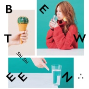

Between
============================

|  |  |
| :--: | :-- |
| [ Between](https://emumo.xiami.com/album/2102657748) | **艺人**: [孙盛希](../index.md) **语种**: 国语 **唱片公司**: 滚石唱片 **发行时间**: 2016年12月23日 **专辑类别**: 录音室专辑 **专辑风格**: 国语流行 Mandarin Pop, 华语唱作人 Chinese Singer-Songwriter **播放数**: 10278951 **收藏数**: 13100 **评论数**: 238  |

## 简介

华语乐坛的 『希有声物』  
孙盛希Shi Shi  
第二张个人全创作  三段式专辑   
BETWEEN在路上  
  
12/16  iTunes独家预购   
预购全专辑 立即独家拥有希有单曲__  
孙盛希最新词曲全创作「非关爱情DEMO版」  
研磨出好音乐的最开端，感受最直接不羁的音乐灵魂  
12/23 全专辑发行  
  
手冲慢调 希有音乐新品种  
获iTunes 2014年度最佳新人奖、入围2015年金曲奖最佳新人奖的孙盛希，因为热爱华语音乐，大学时来台参加歌唱比赛，独特的歌声立即惊艳大众；她的创作力也很惊人，首张专辑「Girls」即收录7首个人创作，第二张专辑更以10首曲全创作的方向前进。  
孙盛希的音乐创作过程，像手冲咖啡一样，讲究每个细节与手感，冲泡出又醇香又浓烈的音乐新品种。  
  
10首多样曲风创作曲 + 10位跨界作词人    
导演、作家、诗人、星座专家、平面摄影师、平面设计师、知名部落客  
各界艺术工作者首次跨界写词  激荡惊艳新火花  
  
从第一张专辑「Girls」发行之后，孙盛希立即开始创作新专辑的歌曲，从2015年一路写到2016年7月；在路上，孙盛希写了10首DEMO，自己词曲全创作一首之外，邀请了九位跨界作词者：导演苏三毛、作家肆一、诗人林婉瑜、星座专家唐立淇、平面摄影师萧希如、平面设计师颜伯骏、知名部落客阿飞、以及乐团BASS手Molly、宇宙人主唱小玉、名制作人陶山…等，因为听了这10首DEMO，而有了10个故事、变成了10首歌词。  
从每首未完成的DEMO，到各自拥有故事的每首歌，过程是艰辛与幸福的；在路上，孙盛希遇见了每个作词者描绘的画面，透过音乐，认识彼此、分享心事，孙盛希将在路上获得的每个感动，唱给大家听。  
  
城市里的「希有声物」--孙盛希  
孙盛希，像潜伏在城市里的稀有声物，将内心感受与生活点滴，转化成音乐创作。  
在台北这个凡事求快的城市，从一开始的格格不入、战战兢兢、到慢慢熟悉这个城市的节奏、周围人事物的步调，孙盛希用她独有的节奏漫步着；沿途也曾慌乱挫折，但是在音乐的路上，所有的风雨心情，都转变成她歌里丰富的风景。  
我们也曾在路上，迷路过、慌乱过、陶醉过、不舍过；这些心思与触动，重新在孙盛希的歌里看见当时的自己，彼此像是旅途中偶遇的人，在路上给予彼此陪伴与慰藉。  
  
三段式创作专辑「BETWEEN」  
在路上  不歇未尽  一直向前  
→从单身到失恋的路上  看见爱情  
→从生活到创作的路上  听见生命  
→从听希希唱歌的路上  遇见自己  
  
孙盛希将这张专辑命名为「Between」，就是想要表达她目前正处在这个「过程」：  
Between，是她第一张专辑「Girls」和下一张专辑「Women」演进的过程；而孙盛希的现在，正处在女孩转变成女人的路上。  
在路上，希希用音乐记录她的心情，Between希希和作词者，是一首歌的完成；  
Between 「Girls」到「Women」，是孙盛希的每个当下，Between听歌的我们和孙盛希，将共同创造属于彼此的感动回忆。  
  
三段主题：1、「LOVE爱」 2、「PANIC慌」 3、「GO走」  
专辑以三主题「LOVE爱」、「PANIC慌」、「GO走」将孙盛希10首创作曲，分成三种面向、三个转折，从”爱”破题、以”走”做结尾，迎向下一步的开放结局；以这三个主题，让10位跨界作词人自由发挥，将爱情里、人生中的这三个命题，做最自由的发挥。  
歌里面有孙盛希也有作词人自己的心情与故事，更不小心命中了许多人的心事吧！未来充满未知，其实，人生就是不断的在路上love、panic然后go啊！  
你准备好一起「在路上」了吗？  
  
12/16  iTunes独家预购   
立即独家拥有希有单曲__  
孙盛希最新词曲全创作「非关爱情DEMO版」  
研磨出好音乐的最开端，感受最直接不羁的音乐灵魂  
  
预购独家免费获得单曲，是孙盛希的词曲全创作「非关爱情」的DEMO，她以一把吉他随兴地哼唱出这个旋律，还没歌词的情况下，以韩文随意哼唱，更能感受出孙盛希的创作心情。 

## 曲目

## 评论

|  |  |  |  |
| :-- | :-- | :-- | :-- |
|  [虾米用户](https://emumo.xiami.com/u/376662142) 流星 2020-05-31 11:11 赞(0) 踩(0) | 
好听！！！
 |
|  [虾米用户](https://emumo.xiami.com/u/278281118)  2020-02-11 17:30 赞(0) 踩(0) | 
完美！
 |
|  [虾米用户](https://emumo.xiami.com/u/21298110)  2019-07-26 20:34 赞(0) 踩(0) | 

 |
|  [虾米用户](https://emumo.xiami.com/u/412731168)  2019-07-23 08:58 赞(0) 踩(0) | 
，1，一
 |
|  [虾米用户](https://emumo.xiami.com/u/120997976) 我还没想好要写什么... 2019-06-25 20:40 赞(0) 踩(0) | 
满分～～
 |
|  [虾米用户](https://emumo.xiami.com/u/120997976) 我还没想好要写什么... 2019-06-25 20:40 赞(0) 踩(0) | 
喜欢～表白 
 |
|  [虾米用户](https://emumo.xiami.com/u/96296322)  2019-03-26 19:12 赞(0) 踩(0) | 
.
 |
|  [虾米用户](https://emumo.xiami.com/u/15270473) 听到喜欢的歌 身体不跟着... 2019-01-01 14:49 赞(0) 踩(0) | 
-
 |
|  [虾米用户](https://emumo.xiami.com/u/325399758) ☕ 2018-12-13 13:18 赞(0) 踩(0) | 
良心專輯
 |
|  [虾米用户](https://emumo.xiami.com/u/325399758) ☕ 2018-12-13 13:17 赞(2) 踩(0) | 
不多說 神專！
 |
|  [虾米用户](https://emumo.xiami.com/u/8939226) 我还没想好要写什么... 2018-12-10 18:07 赞(0) 踩(0) | 
小玉给自己写了《两人舞》给shishi《三人舞》
 |
|  [虾米用户](https://emumo.xiami.com/u/6278882)  2018-10-24 21:02 赞(0) 踩(0) | 
神专
 |
|  [虾米用户](https://emumo.xiami.com/u/339695808) 不骄不躁戒熬夜，破界跨界... 2018-08-14 13:09 赞(0) 踩(0) | 
很棒的一张专！
 |
|  [虾米用户](https://emumo.xiami.com/u/74215948)  2018-07-27 20:07 赞(0) 踩(0) | 
这张专辑真是精品
 |
|  [虾米用户](https://emumo.xiami.com/u/370125431)  2018-07-06 15:19 赞(0) 踩(0) | 
非常棒的专辑！
 |
|  [虾米用户](https://emumo.xiami.com/u/23613046)   2018-04-22 11:52 赞(1) 踩(0) | 
在我的心中收藏 
 |
|  [虾米用户](https://emumo.xiami.com/u/9905436)  2018-04-08 23:01 赞(0) 踩(0) | 
爱你爱你孙盛希！
 |
|  [虾米用户](https://emumo.xiami.com/u/46149197) 我想我会变成这样都是你害... 2017-11-28 07:17 赞(1) 踩(0) | 
每一首歌都是那么悦耳
 |
|  [虾米用户](https://emumo.xiami.com/u/8339282)  2017-10-28 00:42 赞(1) 踩(0) | 
很难再喜欢一个新歌手了 最近这几年 这是我唯一期待的一个希望出新专辑的歌手
 |
| ⇒ |  [虾米用户](https://emumo.xiami.com/u/47479564)  2018-04-23 12:52 赞(0) 踩(0) | 
7月份就要出啦！！！
 |
|  [虾米用户](https://emumo.xiami.com/u/10665359) No music no ... 2017-10-17 10:11 赞(0) 踩(0) | 
哈哈哈 都是看小P姐姐天天在朋友圈分享啦~~~还不错  专辑封面设计也好喜欢
 |
|  [虾米用户](https://emumo.xiami.com/u/32128110) 我有多想他 / 他不知道 2017-10-14 21:35 赞(0) 踩(0) | 
对于歌手自己而言可能是极上乘且发挥自我的一张专辑；但我愚见有点单一，更爱 Girls
 |
|  [虾米用户](https://emumo.xiami.com/u/46112286)   2017-09-11 01:16 赞(0) 踩(0) | 
好喜欢她的声音
 |
|  [虾米用户](https://emumo.xiami.com/u/316878877)  2017-09-07 09:22 赞(0) 踩(0) | 
唱作兼具 棒棒的
 |
|  [虾米用户](https://emumo.xiami.com/u/100984438)  2017-08-29 21:41 赞(0) 踩(0) | 
整张专辑都很喜欢
 |
|  [虾米用户](https://emumo.xiami.com/u/11737392) 音乐是一种生活方式 2017-08-26 06:16 赞(0) 踩(0) | 
很有潜力的创作新人
 |
|  [虾米用户](https://emumo.xiami.com/u/11737392) 音乐是一种生活方式 2017-08-26 06:15 赞(0) 踩(0) | 
回来看看 
 |
|  [虾米用户](https://emumo.xiami.com/u/47479564)  2017-06-23 09:18 赞(0) 踩(0) | 
很特别，很不错！！！
 |
|  [虾米用户](https://emumo.xiami.com/u/175094548)  2017-06-17 14:43 赞(0) 踩(0) | 
每首歌都很良心
 |
|  [虾米用户](https://emumo.xiami.com/u/6075899)  2017-06-06 12:57 赞(1) 踩(0) | 
制作人是陶山，很多歌作词作曲都是陶山，厉害，有保障
 |
|  [虾米用户](https://emumo.xiami.com/u/276671441) 要优秀。 2017-05-21 11:34 赞(0) 踩(0) | 
喜欢
 |
|  [虾米用户](https://emumo.xiami.com/u/11737392) 音乐是一种生活方式 2017-05-17 19:31 赞(0) 踩(0) | 
没入围挺可惜，很有质量的一张流行专辑
 |
|  [虾米用户](https://emumo.xiami.com/u/43637685) 。 2017-05-17 07:54 赞(0) 踩(0) | 
喜欢的专辑都没入围  日常 贼 between 生气！
 |
|  [虾米用户](https://emumo.xiami.com/u/8200350) Sparkling wi... 2017-05-16 22:34 赞(0) 踩(0) | 
这张专辑好洋气啊！
 |
|  [虾米用户](https://emumo.xiami.com/u/189763505)  2017-05-16 10:16 赞(0) 踩(0) | 
经常点开来听
 |
|  [虾米用户](https://emumo.xiami.com/u/51776543) Get Everybod... 2017-05-16 10:01 赞(0) 踩(0) | 

 |
|  [虾米用户](https://emumo.xiami.com/u/237164981)  2017-05-06 12:21 赞(0) 踩(0) | 
好听好听好听好听
 |
|  [虾米用户](https://emumo.xiami.com/u/85928852) 穷极一生 追求快乐 2017-05-01 14:22 赞(0) 踩(0) | 
  
 |
|  [虾米用户](https://emumo.xiami.com/u/182488740) best wishes ... 2017-04-29 20:43 赞(0) 踩(0) | 
挺像蔡健雅  长相和某些唱法
 |
|  [虾米用户](https://emumo.xiami.com/u/291008152)  2017-04-23 23:47 赞(0) 踩(0) | 
因为浮士德的微笑来听是他不配，然后发现整专都好听，全是良心曲，好喜欢她的声音
 |
|  [虾米用户](https://emumo.xiami.com/u/85455518) 我不要钻石.我不要婚礼.... 2017-04-15 20:32 赞(1) 踩(0) | 
是不是下一个徐佳莹我不知道 但是听她的歌突然想起了邓福如 ✨数着你的情节一遍一遍 不知不觉飞过每个冬天✨
 |
|  [虾米用户](https://emumo.xiami.com/u/12210840) 主业生活 副业学习 2017-04-12 17:47 赞(1) 踩(0) | 
感觉是suboptimal版的徐佳莹，这种好歌手好声音值得被发掘。
 |
|  [虾米用户](https://emumo.xiami.com/u/152181068)   2017-04-05 22:01 赞(0) 踩(0) | 
看到某高的推荐还想来占个装逼的位置。过来发现原来是参加过星光大道的那个孙盛希。那我早知道她了，是不是现在就已经可以装逼了
 |
|  [虾米用户](https://emumo.xiami.com/u/52045517)   2017-04-05 15:33 赞(0) 踩(0) | 
好听
 |
|  [虾米用户](https://emumo.xiami.com/u/6295354)   2017-04-04 21:21 赞(1) 踩(0) | 
奇葩说某高观光团&amp;hellip;并没有任何徐佳莹的感觉
 |
| ⇒ |  [虾米用户](https://emumo.xiami.com/u/294561804)  2017-05-26 16:12 赞(0) 踩(0) | 
请问是哪一期奇葩说啊
 |
|  [虾米用户](https://emumo.xiami.com/u/268117688)  2017-04-04 19:57 赞(2) 踩(0) | 
奇葩说某高推荐来的
 |
| ⇒ |  [虾米用户](https://emumo.xiami.com/u/43637685) 。 2017-04-05 23:28 赞(0) 踩(0) | 
谁推荐了？哪期节目 
 |
|  [虾米用户](https://emumo.xiami.com/u/283735850)  2017-03-28 09:38 赞(0) 踩(0) | 
好喜歡希希
 |
|  [虾米用户](https://emumo.xiami.com/u/43637685) 。 2017-03-23 22:43 赞(0) 踩(0) | 
这张太好听了吧&amp;hellip;
 |
|  [虾米用户](https://emumo.xiami.com/u/193438910)  2017-03-11 07:52 赞(0) 踩(0) | 
听你的声音心里会冒泡泡 
 |
|  [虾米用户](https://emumo.xiami.com/u/270357761) 五迷+夭怪 2017-03-08 13:15 赞(0) 踩(0) | 
希希棒！
 |
|  [虾米用户](https://emumo.xiami.com/u/30402213)  2017-03-08 01:04 赞(0) 踩(0) | 
新专辑好听！你总是这样特别！ 
 |
|  [虾米用户](https://emumo.xiami.com/u/52283741) 我还没想好要写什么... 2017-03-06 20:35 赞(0) 踩(0) | 
非常好听。值得循环的一张专辑。
 |
|  [虾米用户](https://emumo.xiami.com/u/277003698)  2017-03-01 14:37 赞(0) 踩(0) | 
好听
 |
|  [虾米用户](https://emumo.xiami.com/u/128963698)  2017-02-28 21:35 赞(0) 踩(0) | 
都特么youmv  大制作啊
 |
|  [虾米用户](https://emumo.xiami.com/u/82293016) 深自缄默  如云漂泊  2017-02-27 02:58 赞(0) 踩(0) | 
真的很棒很棒的一张专辑，每一首歌都很好听！
 |
|  [虾米用户](https://emumo.xiami.com/u/228992700)  2017-02-22 16:51 赞(0) 踩(0) | 
tingshouge
 |
|  [虾米用户](https://emumo.xiami.com/u/228992700)  2017-02-22 16:49 赞(0) 踩(0) | 
tingshouge
 |
|  [虾米用户](https://emumo.xiami.com/u/33514232) 喜欢来这里找我喜欢的 2017-02-20 12:32 赞(0) 踩(0) | 
编曲太棒了
 |
|  [虾米用户](https://emumo.xiami.com/u/273702720)  2017-02-15 20:27 赞(1) 踩(0) | 
还没听，希望不错。
 |
|  [虾米用户](https://emumo.xiami.com/u/570876) 不够写 2017-02-14 18:27 赞(1) 踩(0) | 
这是华语歌坛的准新生统领
 |
|  [虾米用户](https://emumo.xiami.com/u/254623313)   2017-02-12 11:21 赞(1) 踩(0) | 
好听
 |
|  [虾米用户](https://emumo.xiami.com/u/270050586)  2017-02-10 23:11 赞(1) 踩(0) | 
虾米终于有一个可以让我爱上的理由了。。
 |
|  [虾米用户](https://emumo.xiami.com/u/2953730)  2017-02-07 10:21 赞(0) 踩(0) | 
很好的一张国语专辑。歌手名字好像韩国人啊~
 |
| ⇒ |  [虾米用户](https://emumo.xiami.com/u/118743092)  2017-04-16 18:16 赞(0) 踩(0) | 
韩国华侨
 |
|  [虾米用户](https://emumo.xiami.com/u/44671454) 搬进不失眠旅馆 2017-02-04 21:19 赞(0) 踩(0) | 
这几号虾米发行的啊？当然听单身≠失恋的时候就在盼出张长专了
 |
|  [虾米用户](https://emumo.xiami.com/u/82293016) 深自缄默  如云漂泊  2017-01-31 14:19 赞(1) 踩(0) | 
真的，专辑全部歌曲我都喜欢，很好听啊！
 |
|  [虾米用户](https://emumo.xiami.com/u/38935829) 让我成为你的有可能 2017-01-22 23:10 赞(0) 踩(0) | 
封面好像蔡健雅
 |
|  [虾米用户](https://emumo.xiami.com/u/48642971)   2017-01-20 22:12 赞(0) 踩(0) | 
果然力捧 MV一个一个soon出来
 |
|  [虾米用户](https://emumo.xiami.com/u/206252953)  2017-01-19 10:19 赞(0) 踩(0) | 
表白shishi
 |
|  [虾米用户](https://emumo.xiami.com/u/224102205)   2017-01-17 15:06 赞(0) 踩(0) | 
好听
 |
|  [虾米用户](https://emumo.xiami.com/u/88823304)   2017-01-12 22:35 赞(0) 踩(0) | 
全部的专辑我都喜欢   
 |
|  [虾米用户](https://emumo.xiami.com/u/19807540) 听我所爱 2017-01-12 01:51 赞(0) 踩(0) | 
期待第三张
 |
|  [虾米用户](https://emumo.xiami.com/u/124475814)  2017-01-11 23:54 赞(1) 踩(0) | 
在快餐歌曲充斥的时代，遇见一张好的国语专辑，这种惊喜的感觉竟然很久不曾有的。认真做音乐的歌手最值得尊敬，无关资历
 |
|  [虾米用户](https://emumo.xiami.com/u/124475814)  2017-01-11 23:51 赞(1) 踩(0) | 
神专啊这妹子要火！
 |
|  [虾米用户](https://emumo.xiami.com/u/3795908) 所谓歌迷即听歌入迷 2017-01-11 22:04 赞(2) 踩(0) | 
我觉得现在的孙盛希非常像几年前的拉拉，虽然了解的人很少，却也是因为这样可以耐下心来做音乐。就像是一块原石，虽然看上去比较粗糙，但可挖掘的潜力很大。再过几年沉淀，她会是下一个徐佳莹[爱心]
 |
|  [虾米用户](https://emumo.xiami.com/u/12878826) 谢谢陪伴 再见哦！ 2017-01-10 19:42 赞(4) 踩(0) | 
这张专辑成功地干扰了我自习
 |
|  [虾米用户](https://emumo.xiami.com/u/12878826) 谢谢陪伴 再见哦！ 2017-01-10 19:41 赞(0) 踩(0) | 
表白表白表白
 |
|  [虾米用户](https://emumo.xiami.com/u/12878826) 谢谢陪伴 再见哦！ 2017-01-10 19:41 赞(0) 踩(0) | 
太棒太棒太棒
 |
|  [虾米用户](https://emumo.xiami.com/u/52283741) 我还没想好要写什么... 2017-01-08 13:16 赞(0) 踩(0) | 
新专辑好好听 
 |
|  [虾米用户](https://emumo.xiami.com/u/44354428)  2017-01-04 00:23 赞(0) 踩(0) | 
演唱可能不够个人化.和气息，发音有关系.这张用的气音少，转音多，但是她好像气音更特别一点.疯起来里面的声音最特别.这专没有这方面的歌.听得时候会带入其他歌手的感觉.下专在制作要注意下.而且这张混音肯定有问题.滚石砸钱不够.
 |
|  [虾米用户](https://emumo.xiami.com/u/44354428)  2017-01-04 00:12 赞(4) 踩(0) | 
听了两天，最深刻的印象就是曲子写的太tm流畅了.整张都这么好的旋律很少出现过了.可能也就戴佩妮的纯属意外让我有过同样感受.
 |
|  [虾米用户](https://emumo.xiami.com/u/44354428)  2017-01-04 00:00 赞(1) 踩(0) | 
做的很好！乐坛新势力，写的曲子非常成熟！可以努力的方向就是演唱了！但是这个应该不用担心.未来可期待！
 |
|  [虾米用户](https://emumo.xiami.com/u/478527) 好想跟衣服在洗衣机里滚 2017-01-03 23:15 赞(0) 踩(0) | 
已乐
 |
|  [虾米用户](https://emumo.xiami.com/u/478527) 好想跟衣服在洗衣机里滚 2017-01-03 23:15 赞(0) 踩(0) | 
已乐
 |
|  [虾米用户](https://emumo.xiami.com/u/9591718)  2017-01-03 18:33 赞(0) 踩(0) | 
好爱孙盛希。
 |
|  [虾米用户](https://emumo.xiami.com/u/35051980)   2017-01-02 21:04 赞(3) 踩(0) | 
完全不像新生代歌手，这专做得好老练 
 |
|  [虾米用户](https://emumo.xiami.com/u/127265)  2017-01-01 23:57 赞(1) 踩(0) | 
二专还是如此惊艳！
 |
|  [虾米用户](https://emumo.xiami.com/u/540203)  2016-12-30 14:15 赞(0) 踩(0) | 
终于等到你呀～
 |
|  [虾米用户](https://emumo.xiami.com/u/251011994)  2016-12-30 02:17 赞(0) 踩(0) | 
  
 |
|  [虾米用户](https://emumo.xiami.com/u/668311) ฏ๎๎๎๎๎๎ฏ๎๎๎๎ 2016-12-30 00:57 赞(0) 踩(0) | 
感觉比星光时更出彩了
 |
|  [虾米用户](https://emumo.xiami.com/u/19807540) 听我所爱 2016-12-28 20:09 赞(0) 踩(0) | 
看过她选秀  没想到竟然还有作曲的才华 上一张很惊艳 来听新专~~
 |
|  [虾米用户](https://emumo.xiami.com/u/15) 吃嘛嘛香 2016-12-28 01:36 赞(1) 踩(0) | 
今年底的华语音乐之光
 |
|  [虾米用户](https://emumo.xiami.com/u/216644855)   2016-12-27 23:26 赞(0) 踩(0) | 
很喜欢啊，以前都没听过，应该会火的
 |
|  [虾米用户](https://emumo.xiami.com/u/10266978) 暂无签名~ 2016-12-27 17:14 赞(0) 踩(0) | 
  
 |
|  [虾米用户](https://emumo.xiami.com/u/32905621) 记得法克和钢琴的第89键 2016-12-27 17:06 赞(0) 踩(0) | 
华语乐坛的 『希有声物』孙盛希Shi Shi第二张个人全创作 三段式专辑BETWEEN在路上
 |
|  [虾米用户](https://emumo.xiami.com/u/143048) 我还没想好要写什么... 2016-12-27 14:08 赞(0) 踩(0) | 
年底华语流行 shishi 带来的一个小惊喜
 |
|  [虾米用户](https://emumo.xiami.com/u/6442199)  2016-12-27 13:16 赞(0) 踩(0) | 
旋律唱腔都好听到上瘾，国际范又有自己的特色，真是越听越着迷的声音，就算扔到人堆里也能立马辨识出来。但内容差一些——没有共鸣的故事，有点俗的歌词。总而言之，这么好的歌手，为什么不能红！！！（p.s.有两首怎么有隔壁葛仲珊的曲风在233333）
 |
|  [虾米用户](https://emumo.xiami.com/u/9202248)   2016-12-27 10:37 赞(0) 踩(0) | 
很好，还是很孙盛希！
 |
|  [虾米用户](https://emumo.xiami.com/u/600368) 群众的眼睛是雪亮的=喷子 2016-12-27 00:39 赞(0) 踩(0) | 
意外的觉得不错呢
 |
|  [虾米用户](https://emumo.xiami.com/u/2940320) 华语乐迷唱片控 2016-12-26 22:36 赞(2) 踩(0) | 
韵律感、节奏感都接近完美，这就是唱歌的天赋啊。全碟一首粪曲都没有，太不容易了
 |
|  [虾米用户](https://emumo.xiami.com/u/2943748)  2016-12-26 21:41 赞(1) 踩(0) | 
好几首Skot Suyama陶山编曲。。。很棒他老婆庭竹也不错呢。。。大家去听听
 |
| ⇒ |  [虾米用户](https://emumo.xiami.com/u/90100756) 我还没想好要写什么... 2017-09-27 19:50 赞(0) 踩(0) | 
你不说我都不知道陶山的老婆是庭竹   
 |
|  [虾米用户](https://emumo.xiami.com/u/2943748)  2016-12-26 21:40 赞(0) 踩(0) | 
好几首Skot Suyama陶山编曲。。。很棒他老婆庭竹也不错呢。。。大家去听听
 |
|  [虾米用户](https://emumo.xiami.com/u/52343280) 人生不过苦酒一杯罢了 2016-12-26 20:47 赞(1) 踩(0) | 
总有二逼希望火，小众最迷人，红了反而没意思了
 |
| ⇒ |  [虾米用户](https://emumo.xiami.com/u/11046808) 暗河里涌动 2016-12-31 00:50 赞(0) 踩(0) | 
不能再赞同！
 |
| ⇒ |  [虾米用户](https://emumo.xiami.com/u/104286494)  2017-01-10 11:26 赞(0) 踩(0) | 
你这是狭隘的想法，对于你来说你不希望你喜欢的歌手火，但对于歌手来说谁不希望自己的歌被更多的人喜欢。如果你真的喜欢这个歌手，绝不是抱着孩子般据为己有的想法。
 |
| ⇒ |  [虾米用户](https://emumo.xiami.com/u/9554040) Never knows ... 2017-03-06 23:21 赞(0) 踩(0) | 
<q><b>秦风同泽2说：</b></q>
 |
|  [虾米用户](https://emumo.xiami.com/u/42828200)   2016-12-26 09:58 赞(0) 踩(0) | 
终于有新专辑啦✌
 |
|  [虾米用户](https://emumo.xiami.com/u/3245069) 创作吗？！ 2016-12-26 08:44 赞(0) 踩(0) | 
喜欢的女歌手，孙盛希新专，好听！！
 |
|  [虾米用户](https://emumo.xiami.com/u/32594610) 风雨无阻 2016-12-26 03:32 赞(2) 踩(0) | 
喜欢蔡健雅的人可能也会喜欢孙盛希。
 |
|  [虾米用户](https://emumo.xiami.com/u/29009371)   2016-12-26 00:12 赞(0) 踩(0) | 
好听
 |
|  [虾米用户](https://emumo.xiami.com/u/28553877)   2016-12-25 22:35 赞(0) 踩(0) | 
希希的歌一直都很溫暖很好聽
 |
|  [虾米用户](https://emumo.xiami.com/u/28553877)   2016-12-25 21:13 赞(0) 踩(0) | 
超喜歡她的歌
 |
|  [虾米用户](https://emumo.xiami.com/u/8244559)  2016-12-25 21:09 赞(0) 踩(0) | 
******
 |
|  [虾米用户](https://emumo.xiami.com/u/13551960) 暂无签名~ 2016-12-25 15:35 赞(0) 踩(0) | 
终于又等来了新专！超爱啊 
 |
|  [虾米用户](https://emumo.xiami.com/u/31987867) 爱生活 爱自己 2016-12-25 12:52 赞(2) 踩(0) | 
从曝光出来到现在已经循环两天了卧槽太他妈好听了！操！好听到想骂人，要飞起来了！妈的！   
 |
| ⇒ |  [虾米用户](https://emumo.xiami.com/u/197724291)   2017-01-04 19:17 赞(0) 踩(0) | 
我也觉得好听得要报警！！ 
 |
|  [虾米用户](https://emumo.xiami.com/u/245229114)  2016-12-25 10:21 赞(0) 踩(0) | 
声音很好听，歌很不错，希望能火 
 |
|  [虾米用户](https://emumo.xiami.com/u/33405904) 让耳朵怀孕 2016-12-25 05:35 赞(0) 踩(0) | 
天啊，每一首歌都好赞啊！！好听爆，主要是无条件免费！
 |
|  [虾米用户](https://emumo.xiami.com/u/10079475) 有过太多纯粹的快乐 才会... 2016-12-25 01:26 赞(1) 踩(0) | 
这一张就迷些路旋律还比较独立吧，希望好声音都多点独立少点流行，流行也行但得抓耳否则好浪费_(:з」∠)_
 |
|  [虾米用户](https://emumo.xiami.com/u/7199830) 再见了，亲爱的虾米 2016-12-25 01:19 赞(1) 踩(0) | 
年度最佳。。孙盛希大概是现在话语歌坛里和王诗安最喜欢的两个女歌手了~
 |
|  [虾米用户](https://emumo.xiami.com/u/238363085) 谢谢你的爱 2016-12-25 00:04 赞(0) 踩(0) | 
听的好爽～唱功了得
 |
|  [虾米用户](https://emumo.xiami.com/u/29626677)  2016-12-24 22:57 赞(0) 踩(0) | 
大爱希希！整张专辑都棒呆！！！
 |
|  [虾米用户](https://emumo.xiami.com/u/40517037) 暂无签名~ 2016-12-24 20:44 赞(0) 踩(0) | 
还没听呢，先下载
 |
|  [虾米用户](https://emumo.xiami.com/u/6522601) 聆听世界中每一种味道 2016-12-24 20:14 赞(0) 踩(0) | 
好歌手不用多讲，支持她
 |
|  [虾米用户](https://emumo.xiami.com/u/240436998)  2016-12-24 15:48 赞(0) 踩(0) | 
棒棒哒~ 
 |
|  [虾米用户](https://emumo.xiami.com/u/256602821)  2016-12-24 14:48 赞(0) 踩(0) | 
喜欢
 |
|  [虾米用户](https://emumo.xiami.com/u/202958177)   2016-12-24 12:13 赞(2) 踩(0) | 
希望付费，我会买的。
 |
|  [虾米用户](https://emumo.xiami.com/u/9325342) ❥ 2016-12-24 11:49 赞(0) 踩(0) | 
啵啵
 |
|  [虾米用户](https://emumo.xiami.com/u/80684052)  2016-12-24 11:29 赞(0) 踩(0) | 
全满分好评！
 |
|  [虾米用户](https://emumo.xiami.com/u/35613190)   2016-12-24 10:42 赞(0) 踩(0) | 
等你好久
 |
|  [虾米用户](https://emumo.xiami.com/u/32594610) 风雨无阻 2016-12-24 10:21 赞(1) 踩(0) | 
个性，才华，市场兼顾的比较均衡的歌手，近年来比较难得看到了。
 |
| ⇒ |  [虾米用户](https://emumo.xiami.com/u/42108939)  2017-01-04 22:45 赞(0) 踩(0) | 
赞
 |
|  [虾米用户](https://emumo.xiami.com/u/43344663) 一直寻找好音乐。 2016-12-24 09:38 赞(0) 踩(0) | 
我想过，这个问题，跟你住在一起
 |
|  [虾米用户](https://emumo.xiami.com/u/3882720) 人生如逆旅 我亦是行人 2016-12-24 09:30 赞(0) 踩(0) | 
声音反正很喜欢
 |
|  [虾米用户](https://emumo.xiami.com/u/57592500) 要听就听到底 2016-12-24 08:53 赞(1) 踩(0) | 
盛希终于回来了   
 |
|  [虾米用户](https://emumo.xiami.com/u/10079475) 有过太多纯粹的快乐 才会... 2016-12-24 01:47 赞(1) 踩(0) | 
才华就不说了，和朱婧汐一样偏欧美曲风的大气声线…都很喜欢…
 |
| ⇒ |  [虾米用户](https://emumo.xiami.com/u/74338500) 无人可爱 2016-12-24 13:57 赞(0) 踩(0) | 
同喜欢朱婧汐和孙盛希！！！！！
 |
|  [虾米用户](https://emumo.xiami.com/u/239703615) “一个重建的人。” 2016-12-24 01:29 赞(0) 踩(0) | 
  
 |
|  [虾米用户](https://emumo.xiami.com/u/50555961)   2016-12-24 00:10 赞(0) 踩(0) | 
支持新专～
 |
|  [虾米用户](https://emumo.xiami.com/u/208975904) 全民宝贝李莎Dora需要... 2016-12-23 23:04 赞(0) 踩(0) | 
shishi的新专辑好好听
 |
|  [虾米用户](https://emumo.xiami.com/u/16891955) ♥ 2016-12-23 22:57 赞(0) 踩(0) | 
实力小姐姐赞赞赞，超喜欢她的歌，不论是词还是曲
 |
|  [虾米用户](https://emumo.xiami.com/u/31126792)  2016-12-23 22:55 赞(0) 踩(0) | 
整张都好好听！
 |
|  [虾米用户](https://emumo.xiami.com/u/15357468)   2016-12-23 22:37 赞(1) 踩(0) | 
稳扎稳打的歌手～今晚听了四张新专，葛仲珊洋气，郭修彧惊喜，孙盛希稳定，就数郭静不争气
 |
|  [虾米用户](https://emumo.xiami.com/u/99710488) 迷失 2016-12-23 22:36 赞(0) 踩(0) | 
很少听新人的歌，但她的歌却莫名吸引我，so新专辑还是有点期待，加油！
 |
|  [虾米用户](https://emumo.xiami.com/u/103681422)   2016-12-23 22:26 赞(0) 踩(0) | 
强！ 
 |
|  [虾米用户](https://emumo.xiami.com/u/72666568)  2016-12-23 22:23 赞(0) 踩(0) | 
都没注意的，新的你。
 |
|  [虾米用户](https://emumo.xiami.com/u/44274293)  2016-12-23 21:05 赞(0) 踩(0) | 
终于等到你！
 |
|  [虾米用户](https://emumo.xiami.com/u/17533159) 雅誉酒 2016-12-23 20:25 赞(0) 踩(0) | 
为家亲点赞
 |
|  [虾米用户](https://emumo.xiami.com/u/230810227) Music Just F... 2016-12-23 20:24 赞(0) 踩(0) | 
很好的歌声和创作新人
 |
|  [虾米用户](https://emumo.xiami.com/u/48535413) 你说你是谁 我有点骄傲 2016-12-23 19:44 赞(0) 踩(0) | 
久违的质量专辑啊  好味道
 |
|  [虾米用户](https://emumo.xiami.com/u/31800879)   2016-12-23 19:12 赞(0) 踩(0) | 
一直把她和张碧晨弄混了
 |
|  [虾米用户](https://emumo.xiami.com/u/10212497)   2016-12-23 18:43 赞(0) 踩(0) | 
天啊小姐姐的新专！
 |
|  [虾米用户](https://emumo.xiami.com/u/2830724) 我們終將不會相遇 都湮滅... 2016-12-23 17:03 赞(0) 踩(0) | 
马克
 |
|  [虾米用户](https://emumo.xiami.com/u/2361171) 音乐响起.又是美好的一天 2016-12-23 16:17 赞(0) 踩(0) | 
这是极好的 !~
 |
|  [虾米用户](https://emumo.xiami.com/u/218891123)  2016-12-23 14:47 赞(0) 踩(0) | 
加油
 |
|  [虾米用户](https://emumo.xiami.com/u/32077938)   2016-12-23 12:51 赞(0) 踩(0) | 
我希终于出新砖啦[带墨镜笑]
 |
|  [虾米用户](https://emumo.xiami.com/u/167487966)  2016-12-23 12:16 赞(0) 踩(0) | 
好听
 |
|  [虾米用户](https://emumo.xiami.com/u/50371964) 我还没想好要写什么... 2016-12-23 11:28 赞(1) 踩(0) | 
一整张专都很好听[带墨镜笑]
 |
|  [虾米用户](https://emumo.xiami.com/u/6543591)   2016-12-23 11:05 赞(0) 踩(0) | 
居然被我第一时间发现新专辑，第一天哦，爽
 |
|  [虾米用户](https://emumo.xiami.com/u/44204226)  2016-12-23 10:53 赞(3) 踩(0) | 
是耐听的专辑。
 |
|  [虾米用户](https://emumo.xiami.com/u/28413299)  2016-12-23 10:20 赞(0) 踩(0) | 
就是这个声音！2016最好的圣诞礼物
 |
|  [虾米用户](https://emumo.xiami.com/u/13850531) 暂无签名~ 2016-12-23 10:08 赞(0) 踩(0) | 
来啦
 |
|  [虾米用户](https://emumo.xiami.com/u/169431754)   2016-12-23 09:58 赞(0) 踩(0) | 
台湾新才女，最近好喜欢她声音 
 |
|  [虾米用户](https://emumo.xiami.com/u/2523233) 太热 2016-12-23 09:48 赞(0) 踩(0) | 
独家保镖片尾曲 滚石孙盛希 - 微笑带过独家保镖片头曲 滚石八三夭 - 翻白眼留意到所以兴起昨天特意去看了一集《独家保镖》， 我的老天鹅……多少年过去了还是那么浮夸套路，简直吓die
 |
| ⇒ |  [虾米用户](https://emumo.xiami.com/u/41190273) 你！到底，怎么肥四啊？！ 2016-12-23 10:09 赞(0) 踩(0) | 
哈哈哈哈哈哈
 |
|  [虾米用户](https://emumo.xiami.com/u/4042128) go away 2016-12-23 09:30 赞(1) 踩(0) | 
封面也是太美图秀秀了吧
 |
|  [虾米用户](https://emumo.xiami.com/u/128155888)  2016-12-23 09:17 赞(0) 踩(0) | 
没有跟你住和恒温这样的歌撑专辑注定完了.... 
 |
|  [虾米用户](https://emumo.xiami.com/u/61605364) 偏偏还会关切 他最后属于... 2016-12-23 00:06 赞(0) 踩(0) | 
有点失望吧……想听情歌 悲伤点的
 |
|  [虾米用户](https://emumo.xiami.com/u/43637685) 。 2016-12-23 00:04 赞(0) 踩(0) | 
太好听了
 |
|  [虾米用户](https://emumo.xiami.com/u/256269248)  2016-12-23 00:02 赞(1) 踩(0) | 
华语之光靴靴，请大家支持了
 |
|  [虾米用户](https://emumo.xiami.com/u/36490062) 我还没想好要写什么... 2016-12-23 00:02 赞(0) 踩(0) | 
终于发行了
 |
|  [虾米用户](https://emumo.xiami.com/u/1247344) Cyrus 2016-12-22 22:49 赞(1) 踩(0) | 
期待Don't Panic！
 |
|  [虾米用户](https://emumo.xiami.com/u/43637685) 。 2016-12-22 21:07 赞(1) 踩(0) | 
就是今晚
 |
|  [虾米用户](https://emumo.xiami.com/u/225773374)  2016-12-21 00:47 赞(1) 踩(0) | 
终于要出了，很多新尝试，果然是女孩和女人之间
 |
|  [虾米用户](https://emumo.xiami.com/u/254623313)   2016-12-20 23:01 赞(0) 踩(0) | 
好聽
 |
|  [虾米用户](https://emumo.xiami.com/u/48642971)   2016-12-20 01:17 赞(0) 踩(0) | 
才女
 |
|  [虾米用户](https://emumo.xiami.com/u/240445728)  2016-12-19 16:21 赞(25) 踩(0) | 
她的声音很特别，可会什么不红
 |
| ⇒ |  [虾米用户](https://emumo.xiami.com/u/13560350) 音乐music就是我的灵... 2016-12-25 09:35 赞(0) 踩(0) | 
大概需要个像我是歌手那样的契机吧
 |
| ⇒ |  [虾米用户](https://emumo.xiami.com/u/50168366) 曾经 百米冲刺 追逐爱，... 2016-12-26 11:45 赞(0) 踩(0) | 
我猜是像某某某
 |
| ⇒ |  [虾米用户](https://emumo.xiami.com/u/73388804)  2017-12-14 22:15 赞(0) 踩(0) | 
我很自私，并不想让她让太多人知道 
 |
|  [虾米用户](https://emumo.xiami.com/u/210741025) 你永远不知道在你面前笑着... 2016-12-19 09:52 赞(0) 踩(0) | 
zl
 |
|  [虾米用户](https://emumo.xiami.com/u/28553877)   2016-12-18 20:16 赞(1) 踩(0) | 
她的歌，首首经典啊   
 |
|  [虾米用户](https://emumo.xiami.com/u/17814975)   2016-12-18 15:09 赞(0) 踩(0) | 
迷些路和是他不配 強推！
 |
|  [虾米用户](https://emumo.xiami.com/u/177572640)  2016-12-17 20:59 赞(0) 踩(0) | 
喜欢独家保镖里的歌  
 |
|  [虾米用户](https://emumo.xiami.com/u/130590966) 开启一段新的旅程。 2016-12-16 23:45 赞(0) 踩(0) | 
目前四首歌好像没有找林迈可老师来，希望接下来的新歌会有。毕竟编曲很重要。
 |
|  [虾米用户](https://emumo.xiami.com/u/249763439)  2016-12-16 21:52 赞(0) 踩(0) | 
期待
 |
|  [虾米用户](https://emumo.xiami.com/u/177892614)  2016-12-16 21:18 赞(0) 踩(0) | 
加油 
 |
|  [虾米用户](https://emumo.xiami.com/u/177892614)  2016-12-16 21:10 赞(0) 踩(0) | 
等好久了
 |
|  [虾米用户](https://emumo.xiami.com/u/11263235)  2016-12-16 20:48 赞(2) 踩(0) | 
话说希希的歌已经是第二次搭小铃的剧了 上一次女人30的“是爱还是陪伴”和“跟你住”也超好听
 |
|  [虾米用户](https://emumo.xiami.com/u/11263235)  2016-12-16 20:44 赞(1) 踩(0) | 
推希希的新专~ 微笑带过真的超级好听  从独家保镖开始播的时候就在期待这首歌了~~
 |
|  [虾米用户](https://emumo.xiami.com/u/2523233) 太热 2016-12-16 16:00 赞(2) 踩(0) | 
1.Theme 1 爱2.非关爱情3.三人舞4.单身≠失恋5.是他不配6.Theme 2 慌7.塌下来8.嫌疑9.Don`t Panic10. Theme 3 走11.迷些路12.微笑带过13.Where Will You Go14.Between
 |
|  [虾米用户](https://emumo.xiami.com/u/124426130) 每天听歌养成好习惯 2016-12-16 11:47 赞(0) 踩(0) | 
终于等到了
 |
|  [虾米用户](https://emumo.xiami.com/u/2523233) 太热 2016-12-16 11:12 赞(1) 踩(0) | 
额、要等全专发了再推首页吗？
 |
|  [虾米用户](https://emumo.xiami.com/u/92561982) 音乐，生命中的一部分 2016-12-16 09:05 赞(0) 踩(0) | 
超级喜欢，终于等到啦
 |
|  [虾米用户](https://emumo.xiami.com/u/92561982) 音乐，生命中的一部分 2016-12-16 09:04 赞(0) 踩(0) | 
孙盛希
 |
|  [虾米用户](https://emumo.xiami.com/u/36490062) 我还没想好要写什么... 2016-12-15 23:58 赞(0) 踩(0) | 
求今晚上架微笑带过和是他不配啊啊啊啊啊啊啊
 |
|  [虾米用户](https://emumo.xiami.com/u/202312701)  2016-12-15 21:34 赞(0) 踩(0) | 
超喜欢她的歌 很独特! 赞!
 |
|  [虾米用户](https://emumo.xiami.com/u/249763439)  2016-12-15 17:34 赞(0) 踩(0) | 
期待浮士德里的歌
 |
|  [虾米用户](https://emumo.xiami.com/u/13850531) 暂无签名~ 2016-12-15 17:33 赞(0) 踩(0) | 
期待！
 |
|  [虾米用户](https://emumo.xiami.com/u/40517037) 暂无签名~ 2016-12-15 12:55 赞(0) 踩(0) | 
终于有新歌啦
 |
|  [虾米用户](https://emumo.xiami.com/u/123444262)  2016-12-13 10:42 赞(0) 踩(0) | 
非常好听，震撼！
 |
|  [虾米用户](https://emumo.xiami.com/u/190440609) 要永远鲜活，beauty... 2016-12-06 18:25 赞(0) 踩(0) | 
浮士德的微笑 原声带真滴好好听
 |
|  [虾米用户](https://emumo.xiami.com/u/37110070)  2016-12-06 12:40 赞(0) 踩(0) | 
期待
 |
|  [虾米用户](https://emumo.xiami.com/u/74123702)  2016-12-04 20:50 赞(29) 踩(0) | 
支持，很喜欢她的声音，我最近两年听歌听的就这么几首循环，年纪大了很难喜欢新的歌手了
 |
|  [虾米用户](https://emumo.xiami.com/u/4865927)  2016-12-04 16:19 赞(0) 踩(0) | 
新专支持 大力支持
 |
|  [虾米用户](https://emumo.xiami.com/u/249763439)  2016-12-03 22:21 赞(0) 踩(0) | 
坐等是他不配
 |
|  [虾米用户](https://emumo.xiami.com/u/172069868) 浪野酷還冷 2016-12-02 02:07 赞(0) 踩(0) | 
。。
 |
|  [虾米用户](https://emumo.xiami.com/u/2830724) 我們終將不會相遇 都湮滅... 2016-12-01 20:53 赞(0) 踩(0) | 
马克 支持
 |
|  [虾米用户](https://emumo.xiami.com/u/244400412) 我没时间讨厌虾米 2016-12-01 08:53 赞(0) 踩(0) | 
是他不配会在里面吗
 |
|  [虾米用户](https://emumo.xiami.com/u/16206377) rabbit_❀moon 2016-11-30 23:41 赞(0) 踩(0) | 
为什么我听到男声那里会起疙瘩
 |
|  [虾米用户](https://emumo.xiami.com/u/1418053) 我可努力啦！ 2016-11-30 23:03 赞(0) 踩(0) | 
期待顏伯駿的那首！
 |
|  [虾米用户](https://emumo.xiami.com/u/2523233) 太热 2016-11-30 22:50 赞(42) 踩(0) | 
第二张全创作专辑《Between》将在12/23 发行。十首新歌分為愛、慌、走三段主題創作全专会有10支MV！第三张全创作专辑也已经定名《Women》二专的概念代表着从首专《Girls》到三专《Women》的演进过程~
 |
| ⇒ |  [虾米用户](https://emumo.xiami.com/u/43637685) 。 2016-12-19 10:58 赞(0) 踩(0) | 
好期待～年底就等她和郭静了
 |
| ⇒ |  [虾米用户](https://emumo.xiami.com/u/51776543) Get Everybod... 2017-02-01 23:15 赞(0) 踩(0) | 
让我想到邓紫棋的《新的心跳》也是十支MV ，词曲也都是她自己
 |
|  [虾米用户](https://emumo.xiami.com/u/2523233) 太热 2016-11-30 21:21 赞(0) 踩(0) | 
戴耳机还能听……做首波是不是太弱了……
 |
|  [虾米用户](https://emumo.xiami.com/u/10215500)   2016-11-30 19:38 赞(0) 踩(0) | 
6666
 |
|  [虾米用户](https://emumo.xiami.com/u/42862031)  2016-11-30 18:10 赞(0) 踩(0) | 
还不错。。
 |
|  [虾米用户](https://emumo.xiami.com/u/856434) Linne天下第一！ 2016-11-30 18:09 赞(0) 踩(0) | 
强无敌
 |
|  [虾米用户](https://emumo.xiami.com/u/18244944) 親友だな 2016-11-30 16:23 赞(1) 踩(0) | 
宇宙超级无敌电气迷幻死亡摇滚诗
 |
|  [虾米用户](https://emumo.xiami.com/u/562905) 我还没想好要写什么... 2016-11-30 16:22 赞(0) 踩(0) | 
只有前奏能听。
 |
|  [虾米用户](https://emumo.xiami.com/u/43637685) 。 2016-11-30 16:08 赞(0) 踩(0) | 
好听
 |
|  [虾米用户](https://emumo.xiami.com/u/72666568)  2016-11-30 16:04 赞(0) 踩(0) | 
蛮好的
 |
|  [虾米用户](https://emumo.xiami.com/u/9325342) ❥ 2016-11-30 15:05 赞(0) 踩(0) | 
啊啊啊啊
 |
|  [虾米用户](https://emumo.xiami.com/u/47960403)   2016-11-30 13:07 赞(0) 踩(0) | 
她是不是参加过超级星光大道？
 |
| ⇒ |  [虾米用户](https://emumo.xiami.com/u/223879236) 与君一面 一生一忆 2016-12-30 11:52 赞(0) 踩(0) | 
是 好像那一届第六…还是第五
 |
| ⇒ |  [虾米用户](https://emumo.xiami.com/u/256629462)  2016-12-30 12:05 赞(0) 踩(0) | 
<q><b>Train-spotti说：</b></q>
 |
|  [虾米用户](https://emumo.xiami.com/u/8244559)  2016-11-30 12:57 赞(0) 踩(0) | 
******
 |
|  [虾米用户](https://emumo.xiami.com/u/249948903) 好风凭借力，送我上青云。 2016-11-30 12:47 赞(0) 踩(0) | 
加油
 |
|  [虾米用户](https://emumo.xiami.com/u/27961576) 虽然不完美，但这就是我啊 2016-11-30 12:38 赞(0) 踩(0) | 
前排打卡，加油加油孙盛希。
 |
|  [虾米用户](https://emumo.xiami.com/u/2523233) 太热 2016-11-30 11:01 赞(0) 踩(0) | 
新专辑年底发行！
 |
|  [虾米用户](https://emumo.xiami.com/u/98901196) 我是坠屌的 2016-11-30 10:56 赞(0) 踩(0) | 
好像是很久不见的老朋友，欢迎回来 
 |
|  [虾米用户](https://emumo.xiami.com/u/2458715)  2016-11-30 10:53 赞(0) 踩(0) | 
封面很有意境，很美
 |
|  [虾米用户](https://emumo.xiami.com/u/1287077)  2016-11-30 10:39 赞(0) 踩(0) | 
终于有新歌了！
 |
|  [虾米用户](https://emumo.xiami.com/u/245060055) 子不语怪力乱神 2016-11-30 09:22 赞(0) 踩(0) | 
心里怀念着某人 见了泽上萤火 也疑是从身里出来的梦游的魂。
 |
|  [虾米用户](https://emumo.xiami.com/u/41190273) 你！到底，怎么肥四啊？！ 2016-11-30 00:08 赞(0) 踩(0) | 
沙发。期待新专辑。
 |
