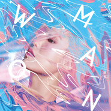

女・人 Woman
============================

|  |  |
| :--: | :-- |
| [ 女・人 Woman](https://emumo.xiami.com/album/2103775301) | **艺人**: [孙盛希](../index.md) **语种**: 国语 **唱片公司**: 滚石唱片 **发行时间**: 2018年07月06日 **专辑类别**: 录音室专辑 **专辑风格**: 国语流行 Mandarin Pop, 华语唱作人 Chinese Singer-Songwriter **播放数**: 5341449 **收藏数**: 964 **评论数**: 104  |

## 简介

首次担纲全专辑制作人的惊艳之作  
孙盛希 第三张全新创作专辑《女・人 Woman》  
  
女人 矛盾也简单  
女人 是庞大繁复的哲学题   
当了解自己的女人 很过瘾  
每句自我 有人性 有人心  
未曾经过混乱，就无法听见心里的节奏  
  
姚若龙X李焯雄 X葛大为X严云农X蓝小邪 黄金作词阵容  
J.Sheon X 剃刀蒋 新生代最强潜力股 嘻哈、R&amp;B音乐人  
韩国混音大师MasterKey X滚石电音DJ Slamer X 电子摇滚女力 Molly  
姊的时代女主角 钟瑶 友情执笔  
10首风格之作 余震不断  
  
《女・人》是一张完整属于孙盛希的音乐  
从首张专辑《Girls》、《Between》，从女孩蜕变到《Woman》  
首次担纲全专辑制作人 展露创作锋芒   
倾听27岁女人的决心、感性、直觉、情爱、哲学，痛处及自我调适  
初学女人灵魂的独特形状 看不见情热的极限  
你熟悉的孙盛希 以及那个你未曾见过的她  
  
历经发行两张专辑，近一年多的酝酿，在词曲创作上逐渐成熟并在数字平台屡获好成绩的孙盛希，俨然已从当年滚石力捧的清新女声，走出自我魅力、唱作俱佳的实力派创作女歌手之路。第三张个人创作专辑《女・人 Woman》，孙盛希首度挑战担纲全专辑制作人，与新锐音乐制作人Joe (陈骏翔)共同策划；这张专辑对孙盛希意义重大，音乐制作过程中，希希从迷惘到笃定，从挣扎分裂到做下决定，逐步架构出能说清楚「我是个什么样的人」的个人音乐风格，内心那还没长大的女孩蜕变女人的情绪转折，彷佛经历一次重生，27岁女人的决心、感性、直觉、情爱、哲学，痛处及自我调适，这转变期间散发的精萃香气与惊艳思路，经历混乱后的果敢与自信，从懵懂单纯起步成为独立女人的坚定，那仅属这一时刻绽放的独特魅力，承载感性灵魂与性感小女人姿态于一身，这是，此刻最真实的孙盛希。  
  
「对我来说，这张专辑像是一张毕业证书，同时也是入门迈向一个新阶段，从女孩毕业，成为心中的理想女人。」___孙盛希   
—献给妈妈，也献给未能从大学毕业的自己，这一张人生的证书—  
  
专辑名称《女・人 Woman》暗藏希式玄机  
我是妳，妳是我们(Woman)，如此独特且复杂的存在   
核心概念紧扣「因矛盾而领悟的真实 因坦诚而找到的自由」  
量身以「女人哲学」出发 从第一到第十首巧思写进女人成长脉络  
作为女人 是庞大繁复的哲学题 我仍在学习  
  
孙盛希，是一个比起爱哭，更爱笑的灵魂；透明恳切的个性，用最大的热情与好奇，渴望理解自己，也渴望被世界理解。从五年前不谙中文，到现在已能用自己真实独一的逻辑，思考人生哲理，在这张专辑中她尝试放入了简单却深刻隽永的哲学理论，引申成自己对生命的观察与想象，如诗如实地扎根吐露她那令人无法忽视的赤裸真心，十首歌，坦诚剖析一个花漾女人心境转变的成长脉络，有混乱才有平衡，有自我才有自由。  
《女・人 Woman》专辑名称来自孙盛希的希式说文解字，不仅单指「女人」的意象，《女・人》中间的「・」实心圆点代表「乘以」的意思，架构于身为「人」的基础上，即使男人女人都拥有感受上的相似本质，《女・人》有着别于「男人」在生活态度上的独特观点与特质。英文《Woman》的巧思，从第一张专辑《Girls》、第二张《Between》，第三张进化成《女・人 Woman》，《Woman》音似「我们」，孙盛希试图厘清初学女人的心情，与听众对话共鸣：「我就是妳，妳就是我们(Woman)。」  
  
姚若龙X李焯雄X葛大为X严云农X蓝小邪   
韩国混音大师MasterKey X J.Sheon X剃刀蒋X DJ Slamer   
囊括顶尖音乐创作人 黄金阵容连手打造  
OST常胜美声女神亮眼进化 变身操刀电子摇滚、R&amp;B两大曲风   
  
孙盛希在身任制作人的初试啼声，即展现了在音乐制作上的才华与独特见解，将自己韩国出生、对韩乐文化略有研究的背景，融合在华语乐坛成长的所知所学，发挥台韩音乐各自优势的多元制作观点。专辑中有近九首是希希的原创作曲，而十首歌全已有她这一年来构思设定的主题与概念，力邀崇拜的作词大师们连手合作，细微精确地刻画孙盛希的女人心境，融入兼具流行感与实验突破的各式电子乐元素、R&amp;B乐风曲线，加上希希深具声音表情的感性诠释，完美细腻呈现女人情绪心思的翻腾，灵魂深处的吸吐律动，彷佛有日夜变化，新颖、大气、脱俗，让人中毒反复一再聆听；专辑母带后期工程交由纽约Sterling Sound完成，曾为Lorde、Adele、Lady Gaga、Taylor Swift后制的母带录音师Randy Merrill操刀，穿透且具生命力的专辑就此完整了全貌。  
  
主打歌曲介绍  
众人回归简单 孙盛希选在最美好的时刻忍不住绽放  
  
01.专辑气势开场曲《分裂》，创作灵感引述上古神话「盘古开天」，从一切混沌(Chaos)开辟天地，吉他强烈回荡Delay效果，尝试暗黑唱腔转音层迭和声，在崩裂与重生的反复轮回，严云农挥笔哲学诗意的精粹歌词，让生命真实的色彩逐渐成形，矛盾与领悟、爱与恨、对与错，同时存在。  
  
02.崭新听觉冲击主打《内疚》，不落俗套的全新抒情电子层次由韩国混音大师MasterKey操盘，滚石电音DJ Slamer与孙盛希合力编曲，葛大为保留希希原词精神，引用柏拉图「洞穴理论」，逐步刻画、坦然说出女人内心的光明与黑暗，对爱情中自由的想望与罪恶感。  
  
03.沉缓自省灵魂单曲《原来你是这样的人》，这一首唱给自己的歌，以钢琴与弦乐旋律交织的沉重感，渐进唱出内心的纠结与告解，引申拉冈的「镜像理论」探究自我厌恶自怜之处的懊悔与矛盾，是不是在不知不觉间，也成了我们最讨厌的人，镜中我看见的是你，还是我自己？  
  
04.疯狂自白的节奏快嘴单曲《听起来像借口吗？》，轻快古怪带着歇斯底里的自嘲歌词，一五一十细数孙盛希作为女人的生活哲学，有牢骚有真理，矛盾又异常认真的可爱个性展露无遗。  
  
05.《We Can't Be Together》一首国际乐手交流揉合Jazz、R&amp;B的抒情金曲，倾诉年龄时差之恋的情感内心戏。爵士风味的Acoustic钢琴与电钢琴旋律，孙盛希流畅收放自如的转音唱腔，令人惊艳反复聆听。女人总会面对的一种年纪之差的恋情「姐弟恋」，成熟女人与不成熟男孩之间的魅力角力，天生就是无法抗拒的致命吸引。  
  
06.揪疼人心的椎心情歌《自然凋谢》，姚若龙成熟精炼的歌词，写尽女人看透再美的爱情，终有结束的一天，这首细腻坦诚的用情之作，亦为三立偶像剧「姊的时代」最受观众欢迎歌曲，攻占各大数字排行榜。  
  
07.《自我愈合》邀请因「姊的时代」插曲结缘的钟瑶、好友 DJ Molly，三个全然不同的女人一起共识谱写女人自我疗愈之歌。对于渐渐习惯独立生活、能力越来越强大的现代女人来说，表现出脆弱的那一面，不自觉开始小心翼翼，这首孙盛希擅长的都会抒情摇滚曲风，加上自我疗愈的暖系歌词，深深抚慰了好女人们摇晃受伤、故作坚强的心。  
  
08.性感至极、令人脸红心跳的R&amp;B陷阱情歌《闯空门》，是突破自我的重量主打，R&amp;B撩歌鬼才J.Sheon助一臂之力，让孙盛希深具R&amp;B转音女神潜力强力放电，大胆道出女人主动攻陷男人的从容享受，对身体与欲望的自主。  
  
09.《有多美丽》，蓝小邪简单近新诗的韵味文字，传达爱自己的哲理，令人共鸣的歌词细节让人一再细细回味。歌曲最后，孙盛希巧思安排学校下课铃声的桥段设计，隐指此阶段的女人入门，专辑的第九堂课，下课了。天与地之间日复一日运行的美，因人的心境转变有了新的意义，无关世俗价值观对美的定义与比较，孙盛希特别喜欢斯多葛派思想中提到的「依照自然而生活，爱人如己，融合于整个大自然」，每一个人，都是如此独特而唯一的美丽存在，当我们能真正的看着自己、面对自己、爱着自己。  
  
10.李焯雄X孙盛希，本世纪最暖心的晚安曲《很晚的晚安》。这是一首「晚安歌」，关于思念，唱给最爱的对方听，也唱给自己听；「很晚的晚安」，就是「很早的早安」。在带着现代感、都会感的电子音色编曲设计上，充分表现出歌曲的温暖里的疏离感，孤单里的充实感，就如同歌词里写的：「眼泪，是伤感，可是也让我们温暖」，孙盛希细腻、呢喃、耳语般的吟唱，让这首歌的温度慢慢渲染开来，将这句问候，跨越时间空间，传递到最爱的身旁。  
  
「亲爱的，晚安，我们明天见。」关于学习成为什么样的女人，这条路永远矛盾难解，但探索人性的这份「永远的未知」，孙盛希难掩兴奋之情，已踏上了下段旅程。 

## 曲目

## 评论

|  |  |  |  |
| :-- | :-- | :-- | :-- |
|  [虾米用户](https://emumo.xiami.com/u/431540067)  2019-11-02 13:08 赞(0) 踩(0) | 
我愛你
 |
|  [虾米用户](https://emumo.xiami.com/u/320538138) 我还没想好要写什么... 2019-07-11 10:07 赞(0) 踩(0) | 
很喜欢开口跪
 |
|  [虾米用户](https://emumo.xiami.com/u/146660900) 独一，无二 2019-07-05 23:56 赞(0) 踩(0) | 
看过现场，专辑很棒！因为美好，爱被运用的十分狭窄。因为珍贵，爱被反复提出而没有证明。
 |
|  [虾米用户](https://emumo.xiami.com/u/231434665) 人间理想：金茶蛋❤️ 2019-05-27 22:32 赞(0) 踩(0) | 
好听，很有感觉，有人开始都觉得不好听，但是慢慢听下来真的是一种不错的专辑
 |
|  [虾米用户](https://emumo.xiami.com/u/96296322)  2019-03-26 19:50 赞(0) 踩(0) | 
.
 |
|  [虾米用户](https://emumo.xiami.com/u/217280349)  2019-03-16 21:49 赞(0) 踩(0) | 
很好听，很好听……
 |
|  [虾米用户](https://emumo.xiami.com/u/297651790)   2019-03-13 09:17 赞(0) 踩(0) | 
好听诶，喜欢这个妹子
 |
|  [虾米用户](https://emumo.xiami.com/u/379980723)  2019-03-09 18:35 赞(0) 踩(0) | 
女性的情绪展现
 |
|  [虾米用户](https://emumo.xiami.com/u/3172703)  2018-10-30 23:11 赞(5) 踩(0) | 
这张真的是耐听专，并非口水歌，真的初听无感，越听无法自拔
 |
|  [虾米用户](https://emumo.xiami.com/u/117088164)  2018-10-30 21:56 赞(3) 踩(0) | 
我本人特别喜欢孙盛希唱给电视剧的那类型的歌，每次都觉得特别走心，特别喜欢那风格，配合她的嗓音就是完美无人可以超越！
 |
|  [虾米用户](https://emumo.xiami.com/u/6278882)  2018-10-24 21:03 赞(0) 踩(0) | 
❤❤❤
 |
|  [虾米用户](https://emumo.xiami.com/u/39839842) 现在以后永远都是少女时代... 2018-09-23 07:53 赞(0) 踩(0) | 
专辑封面有模仿的嫌疑
 |
|  [虾米用户](https://emumo.xiami.com/u/39839842) 现在以后永远都是少女时代... 2018-09-23 07:52 赞(0) 踩(0) | 
这个专辑的封面跟某个明星的好像
 |
|  [虾米用户](https://emumo.xiami.com/u/48913158) 你有你的花海，我有我的剑... 2018-09-07 09:45 赞(1) 踩(0) | 
讲真，没有抓耳的歌曲，比上一张差了一些～加油吧
 |
|  [虾米用户](https://emumo.xiami.com/u/199763576) 料理是给人带来幸福的东西 2018-08-26 01:22 赞(1) 踩(0) | 
很棒很棒
 |
|  [虾米用户](https://emumo.xiami.com/u/24968228)  2018-08-25 17:29 赞(2) 踩(0) | 
送给有缘人，两张票，今晚，广州场今晚广州场因行程原因，无法赶到。送给有缘人吧6点半前回复吧，我将私信相关票务认证
 |
|  [虾米用户](https://emumo.xiami.com/u/80743840)  2018-08-24 00:26 赞(2) 踩(0) | 
16年才知道shishi，当时觉得一专太特别了，一听就爱上了，曲真的是有自己的独有明显的风格，希望自己的词可以更加油！今天去了上海场的live，虽然超级远，但很值得。现场真的很棒啊！性格真的很可爱啊！以为自己基本都能跟着唱，结果还是有我完全不会的歌啊 ~ 真的是个特别的人，要加油~，希望下次见面给我to签哦！
 |
|  [虾米用户](https://emumo.xiami.com/u/40747134) 暂无签名~ 2018-08-23 22:10 赞(4) 踩(0) | 
生活《少一点天分》学会《自我愈合》离开的《是他不配》你会变得《有多美丽》道一声《很晚的晚安》谢谢虾米，live很精彩孙盛希的新歌很赞
 |
|  [虾米用户](https://emumo.xiami.com/u/6587063)  2018-08-22 09:10 赞(10) 踩(0) | 
昨晚去听了她的LIVE，现场很棒，爆发力惊人~英文歌惊艳了。
 |
|  [虾米用户](https://emumo.xiami.com/u/12857577)  2018-08-21 23:38 赞(13) 踩(0) | 
今晚刚看了shishi的巡回北京站，超级棒唉，更喜欢你喽
 |
| ⇒ |  [虾米用户](https://emumo.xiami.com/u/2830724) 我們終將不會相遇 都湮滅... 2018-08-25 21:37 赞(0) 踩(0) | 
可以
 |
|  [虾米用户](https://emumo.xiami.com/u/277702797)   2018-08-20 15:19 赞(2) 踩(0) | 
好听 
 |
|  [虾米用户](https://emumo.xiami.com/u/54387005)  2018-08-16 09:50 赞(2) 踩(0) | 
很抓耳啊
 |
|  [虾米用户](https://emumo.xiami.com/u/17954969)   2018-08-12 12:03 赞(2) 踩(0) | 
想买一张
 |
|  [虾米用户](https://emumo.xiami.com/u/2961074) 听两首歌 2018-08-02 13:33 赞(4) 踩(0) | 
惊艳！
 |
|  [虾米用户](https://emumo.xiami.com/u/99606564)  2018-07-27 00:00 赞(1) 踩(0) | 
❤️
 |
|  [虾米用户](https://emumo.xiami.com/u/24968228)  2018-07-24 23:49 赞(3) 踩(0) | 
这次的巡演应该都是以新歌为主的吧？上次的between就挺不错~支持sisi
 |
|  [虾米用户](https://emumo.xiami.com/u/104224890) Only one 2018-07-24 15:40 赞(1) 踩(0) | 
成熟的味道
 |
|  [虾米用户](https://emumo.xiami.com/u/4487129)  2018-07-21 23:30 赞(0) 踩(0) | 
！！！
 |
|  [虾米用户](https://emumo.xiami.com/u/3183998) 虾米感谢遇见 2018-07-21 18:33 赞(3) 踩(0) | 
沉静下心来听吧朋友
 |
|  [虾米用户](https://emumo.xiami.com/u/3183998) 虾米感谢遇见 2018-07-21 18:30 赞(3) 踩(0) | 
都说了这是自传式的专辑肯定有很多想法在里面 不那么大众化而已 不了解的人听不明白
 |
|  [虾米用户](https://emumo.xiami.com/u/3183998) 虾米感谢遇见 2018-07-21 18:29 赞(2) 踩(0) | 
希希加油。
 |
|  [虾米用户](https://emumo.xiami.com/u/3069378) 你从海上来 2018-07-19 18:35 赞(0) 踩(0) | 
这张专辑真是一言难尽，简言之就是让人听一遍就弃的那种。唱功是有了，终于也不再像蔡健雅了，编曲也洋气了，就是找不到歌里的共鸣，没有留下有记忆的歌。
 |
|  [虾米用户](https://emumo.xiami.com/u/47479564)  2018-07-19 14:15 赞(2) 踩(0) | 
我觉得孙盛希的这张专辑很棒啊！还有，封面也很好看啊！   
 |
|  [虾米用户](https://emumo.xiami.com/u/139135836)  2018-07-16 23:51 赞(1) 踩(0) | 
主打的歌曲都非常有代入感，非常真诚的一张专辑
 |
|  [虾米用户](https://emumo.xiami.com/u/46112286)   2018-07-15 18:10 赞(0) 踩(0) | 
全专就三首好听，原来你是这样的人，听起来像借口吗，闯空门。
 |
|  [虾米用户](https://emumo.xiami.com/u/259984201)  2018-07-15 15:05 赞(1) 踩(0) | 
太难听了。
 |
| ⇒ |  [虾米用户](https://emumo.xiami.com/u/259984201)  2018-07-15 15:06 赞(0) 踩(0) | 
请不要来跟我说&amp;ldquo;不想听就别听&amp;rdquo;这种话，谢谢。觉得难听自然不会去听。
 |
|  [虾米用户](https://emumo.xiami.com/u/89264938) - 2018-07-15 01:33 赞(0) 踩(0) | 
emmmmm，曲目編排感覺不太流暢。
 |
|  [虾米用户](https://emumo.xiami.com/u/256591443) 潜意识作祟 2018-07-11 11:03 赞(4) 踩(0) | 
专辑封面真的丑。。
 |
|  [虾米用户](https://emumo.xiami.com/u/47355043)  2018-07-10 13:44 赞(0) 踩(0) | 
希希的音乐天赋很好，只是感觉还需要有人带带，可是滚石还有能力给她找吗？
 |
|  [虾米用户](https://emumo.xiami.com/u/18102499)  2018-07-10 10:32 赞(1) 踩(0) | 
支持一下！
 |
|  [虾米用户](https://emumo.xiami.com/u/32125734) weibo：白菜y少女  2018-07-10 08:37 赞(0) 踩(0) | 
~
 |
|  [虾米用户](https://emumo.xiami.com/u/6429584) 请让我延续 所有的思念 2018-07-09 13:58 赞(1) 踩(0) | 
可以可以
 |
|  [虾米用户](https://emumo.xiami.com/u/327453260)  2018-07-08 17:00 赞(2) 踩(0) | 
她是我可以无限循环的女歌手
 |
|  [虾米用户](https://emumo.xiami.com/u/189485585)  2018-07-08 16:20 赞(3) 踩(0) | 
初听的觉得旋律没有前两专的抓耳和惊艳，这两天有空就循环这张专辑；现在觉得，她的歌是需要时间品究的。入场曲《分裂》拉开蜕变的序幕，和between专做了不错的承接；纵观全专，快歌质量没上专的好，慢歌到是更感情化了；但都有耐听的点......气息和转音的运用到是很大进步。不知道三部曲做完之后，她下一步的路线会怎么走，希望下一张能艳惊四座！顺便一提，蓝小邪的词真的是醉了，有点硬塞感hhhh&amp;hellip;&amp;hellip;
 |
|  [虾米用户](https://emumo.xiami.com/u/359501701)  2018-07-08 10:05 赞(2) 踩(0) | 
越来越棒！！！你就是最棒的 
 |
|  [虾米用户](https://emumo.xiami.com/u/285049473) 剛拿起酒杯想和你碰杯 才... 2018-07-07 23:51 赞(1) 踩(0) | 
尷尬的
 |
|  [虾米用户](https://emumo.xiami.com/u/296894468) 知识分子抱负远大点 2018-07-07 21:30 赞(1) 踩(0) | 
自然凋谢之前就很喜欢
 |
|  [虾米用户](https://emumo.xiami.com/u/16206377) rabbit_❀moon 2018-07-07 21:02 赞(1) 踩(0) | 
说实话，没以前的歌好听
 |
|  [虾米用户](https://emumo.xiami.com/u/38349272) 呛辣温顺，对立共生。 围... 2018-07-07 18:44 赞(1) 踩(0) | 
★★★★☆  尽管为了企划有些硬扛，而实际也才迈入轻熟的年纪；但三部曲的创意的确诚意满满，转音与气声掌控愈发纯熟，包办创作也的确是值得称赞的技能，并能与时俱进将电气融入恰到好处，就同辈而言已是出类拔萃；只是要将『女人』这一主题诠释深刻，的确尚欠火候，但并不妨有望拿到金曲30入场券，值得表扬。
 |
|  [虾米用户](https://emumo.xiami.com/u/48404891) 我还没想好要写什么... 2018-07-07 17:41 赞(3) 踩(0) | 
快歌，慢歌，都有属于shishi自己的风格，值得等待，
 |
|  [虾米用户](https://emumo.xiami.com/u/7779218) 性冷淡. 2018-07-07 14:46 赞(0) 踩(0) | 
太难听了啦，搞什么女人女孩三部曲，多用点心思在选歌上不好吗，白瞎好嗓子了呢
 |
|  [虾米用户](https://emumo.xiami.com/u/128211494) 淡.. 2018-07-07 09:52 赞(0) 踩(0) | 
期待呀！
 |
|  [虾米用户](https://emumo.xiami.com/u/8488171) 我还没想好要写什么... 2018-07-07 00:02 赞(3) 踩(0) | 
上次闯空门真的好听
 |
|  [虾米用户](https://emumo.xiami.com/u/47550112)  2018-07-06 23:30 赞(3) 踩(0) | 
喜欢了三年的歌手 真的很棒 加油
 |
|  [虾米用户](https://emumo.xiami.com/u/309245250) 我喜欢苏打绿 2018-07-06 22:36 赞(2) 踩(0) | 
好棒！！
 |
|  [虾米用户](https://emumo.xiami.com/u/45621221) 卸载状态。 2018-07-06 21:24 赞(2) 踩(0) | 
期待很久。
 |
|  [虾米用户](https://emumo.xiami.com/u/41664550)  2018-07-06 20:51 赞(0) 踩(0) | 
鬼眉鬼眼 还以为是韩国歌手 一听结果鬼叫
 |
| ⇒ |  [虾米用户](https://emumo.xiami.com/u/3419686)  2018-07-06 23:03 赞(0) 踩(0) | 
确实是韩国歌手
 |
|  [虾米用户](https://emumo.xiami.com/u/237833694) 我能遇见你已经是很不可思... 2018-07-06 18:37 赞(2) 踩(0) | 
我最喜欢的女歌手之一发专辑了 真好
 |
|  [虾米用户](https://emumo.xiami.com/u/204631884) 闪闪 2018-07-06 18:17 赞(4) 踩(0) | 
希!
 |
|  [虾米用户](https://emumo.xiami.com/u/74482628)  2018-07-06 16:12 赞(4) 踩(0) | 
这张除了概念外真的完胜前面两张，编曲真的是听到鸡皮疙瘩起来......
 |
|  [虾米用户](https://emumo.xiami.com/u/370125431)  2018-07-06 15:18 赞(2) 踩(0) | 
很好的歌手！
 |
|  [虾米用户](https://emumo.xiami.com/u/55301514) . 2018-07-06 14:03 赞(2) 踩(0) | 
我觉得好听
 |
|  [虾米用户](https://emumo.xiami.com/u/4544) 我继续，你要随意 2018-07-06 13:25 赞(2) 踩(0) | 
我最不喜欢的声线和唱歌方式加强我很讨厌的旋律节奏然后又冠上了一个特别大而空的title做概念。有时候听歌跟吃东西一样，别人觉得特好吃，你就觉得难以下咽。为孙盛希和滚石还能出一张完整的录音室专辑而叫好。至于质量和味道，我是真不敢恭维。不管快歌还是慢歌都夹杂了种说不出来的牵强和刻意。
 |
| ⇒ |  [虾米用户](https://emumo.xiami.com/u/344162552) 我还没想好要写什么... 2018-07-24 03:54 赞(0) 踩(0) | 
你的接纳度好差，滚出去
 |
|  [虾米用户](https://emumo.xiami.com/u/189485585)  2018-07-06 12:09 赞(1) 踩(0) | 
内容已删除
 |
| ⇒ |  [虾米用户](https://emumo.xiami.com/u/50200589)   2018-07-07 15:38 赞(0) 踩(0) | 
我也觉得
 |
|  [虾米用户](https://emumo.xiami.com/u/4282340)  2018-07-06 12:06 赞(3) 踩(0) | 
怎么还没红，不过这样也好，独享
 |
|  [虾米用户](https://emumo.xiami.com/u/309731124) 啦啦啦 2018-07-06 10:26 赞(2) 踩(0) | 
非常棒，你是可以的
 |
|  [虾米用户](https://emumo.xiami.com/u/309731124) 啦啦啦 2018-07-06 10:26 赞(1) 踩(0) | 
非常棒
 |
|  [虾米用户](https://emumo.xiami.com/u/9457588)  2018-07-06 09:25 赞(2) 踩(0) | 
出新专啦？  好哇好哇
 |
| ⇒ |  [虾米用户](https://emumo.xiami.com/u/309731124) 啦啦啦 2018-07-06 10:27 赞(0) 踩(0) | 
你是很棒的
 |
|  [虾米用户](https://emumo.xiami.com/u/13113280) 靡哲不愚 2018-07-06 09:22 赞(1) 踩(0) | 

 |
|  [虾米用户](https://emumo.xiami.com/u/11421497) dont act lik... 2018-07-06 08:41 赞(1) 踩(0) | 
好
 |
|  [虾米用户](https://emumo.xiami.com/u/24968228)  2018-07-06 08:02 赞(0) 踩(0) | 
还是前两张专辑耐听。我个人更喜欢以前的感觉。这张也不错，sisi加油
 |
|  [虾米用户](https://emumo.xiami.com/u/2830724) 我們終將不會相遇 都湮滅... 2018-07-06 07:57 赞(0) 踩(0) | 
马克
 |
|  [虾米用户](https://emumo.xiami.com/u/47479564)  2018-07-06 07:33 赞(3) 踩(0) | 
希希的歌我要是不给满分，我就是傻子。
 |
|  [虾米用户](https://emumo.xiami.com/u/45776372) 爱听音乐90后 2018-07-06 07:33 赞(1) 踩(0) | 
求翻牌女神٩(♡㉨♡&amp;nbsp;)۶&amp;nbsp;
 |
|  [虾米用户](https://emumo.xiami.com/u/73388804)  2018-07-06 07:20 赞(1) 踩(0) | 
感恩遇到你的声音 
 |
|  [虾米用户](https://emumo.xiami.com/u/47479564)  2018-07-06 07:18 赞(2) 踩(0) | 
希希，啊啊啊啊啊啊啊啊啊！你太棒了！
 |
|  [虾米用户](https://emumo.xiami.com/u/281126608)  2018-07-06 05:36 赞(1) 踩(0) | 
太棒了shishi
 |
|  [虾米用户](https://emumo.xiami.com/u/1274034) 虾米最好用 2018-07-06 03:04 赞(0) 踩(0) | 
终于发行了，吸吸的12张砖都喜欢，一直在等3，没想到今夜发行惹
 |
|  [虾米用户](https://emumo.xiami.com/u/35783) 身体给雨，灵魂给风。 2018-07-06 02:58 赞(4) 踩(0) | 
孙盛希是华语歌坛近年来最有才华的女歌手之一，没得辩。
 |
|  [虾米用户](https://emumo.xiami.com/u/63046270) 请叫我歌神 2018-07-06 01:19 赞(3) 踩(0) | 
加油哦希希 我爱你
 |
|  [虾米用户](https://emumo.xiami.com/u/43637685) 。 2018-07-06 01:13 赞(3) 踩(0) | 
真好听啊
 |
|  [虾米用户](https://emumo.xiami.com/u/28878477) 我还没想好要写什么... 2018-07-06 01:00 赞(4) 踩(0) | 
算是我去年最喜欢的新人歌手
 |
|  [虾米用户](https://emumo.xiami.com/u/245723517) 乐行乐远 2018-07-06 00:47 赞(4) 踩(0) | 
太棒了，先鼓掌再品 
 |
|  [虾米用户](https://emumo.xiami.com/u/9236928)  2018-07-06 00:42 赞(2) 踩(0) | 
来了来了
 |
|  [虾米用户](https://emumo.xiami.com/u/1783780) LIVE IN LIVE 2018-07-06 00:29 赞(3) 踩(0) | 
希希超级棒！
 |
|  [虾米用户](https://emumo.xiami.com/u/48642020) 我还没想好要写什么... 2018-07-06 00:26 赞(2) 踩(0) | 
   
 |
|  [虾米用户](https://emumo.xiami.com/u/285049473) 剛拿起酒杯想和你碰杯 才... 2018-07-06 00:26 赞(2) 踩(0) | 
聽起來像是藉口嗎？
 |
|  [虾米用户](https://emumo.xiami.com/u/40836586) 我还没想好要写什么... 2018-07-06 00:24 赞(4) 踩(0) | 
孙盛希三张专辑的概念，第二张的创作爆发，到第三张的耐听，现在的创作太高质量了，可预见会是乐坛一顶梁唱作人。
 |
|  [虾米用户](https://emumo.xiami.com/u/123246788) Music is my ... 2018-07-06 00:19 赞(3) 踩(0) | 
女神！ 
 |
|  [虾米用户](https://emumo.xiami.com/u/279046752)  2018-07-06 00:15 赞(2) 踩(0) | 
封面好好看♡
 |
|  [虾米用户](https://emumo.xiami.com/u/1936781) 华语流行音乐乐评人，新浪... 2018-07-06 00:06 赞(9) 踩(0) | 
感觉会好听
 |
|  [虾米用户](https://emumo.xiami.com/u/188993647) 赖床没上午,早起傻一天. 2018-07-06 00:03 赞(9) 踩(0) | 
shishi棒
 |
|  [虾米用户](https://emumo.xiami.com/u/38606890) O_o爱音乐的人不会老。 2018-07-06 00:01 赞(4) 踩(0) | 
汪汪汪
 |
|  [虾米用户](https://emumo.xiami.com/u/59929154) 被放逐的裁缝师 2018-07-06 00:01 赞(2) 踩(0) | 
耶！
 |
|  [虾米用户](https://emumo.xiami.com/u/6531780) 想要变成你 2018-07-06 00:01 赞(3) 踩(0) | 
实体已预购
 |
|  [虾米用户](https://emumo.xiami.com/u/15811196) 辛苦时躲进音乐的世界，防... 2018-07-06 00:01 赞(2) 踩(0) | 
今天喜欢的女歌手都在发专辑，会不会太幸福
 |
|  [虾米用户](https://emumo.xiami.com/u/46149197) 我想我会变成这样都是你害... 2018-07-06 00:00 赞(4) 踩(0) | 
大半夜给我来了个大惊喜！！！！
 |
|  [虾米用户](https://emumo.xiami.com/u/99946788) 住在 2018-07-06 00:00 赞(2) 踩(0) | 

 |
|  [虾米用户](https://emumo.xiami.com/u/6531780) 想要变成你 2018-07-06 00:00 赞(4) 踩(0) | 
惹 沙发
 |
