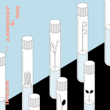

希游记
============================

|  |  |
| :--: | :-- |
| [ 希游记](https://emumo.xiami.com/album/2104143695) | **艺人**: [孙盛希](../index.md) **语种**: 国语 **唱片公司**: 滚石唱片 **发行时间**: 2018年10月31日 **专辑类别**: 录音室专辑 **专辑风格**: 国语流行 Mandarin Pop **播放数**: 1467077 **收藏数**: 1030 **评论数**: 139  |

## 简介

乐坛希有声物＿  
SHI SHI  
2018 Fusion实验专辑「希游记」  
  
金曲陣容 李欣芸x陈君豪x李守信x许郁瑛x葛大为x严云农  
希有合作 魏如萱x<em>ØZI</em>xHUSH   
  
关于「SHI SHI」  
孙盛希，大家昵称她希希  
希的一般拼音是「HSI」，但是希希喜欢拼成「SHI」  
和一般有点一样又不一样；有点循规又不按常理，  
冷静与热情之间、疼痛与愉悦之间，摇摆着、矛盾着、平衡着  
从小在韩国长大的华侨，来台湾开发自己的音乐生命  
唱歌、创作，脱离不了自己的生活、恋爱、工作、创作、成长  
SHI SHI代表着某一个跳脱框架的自己  
  
关于「希游记」  
SHISHI希希，一位从韩国江原道到台湾追逐音乐梦的女孩，一连串关于音乐与灵魂的游记，就在她离开韩国，前往台北追梦的那天展开……。  
  
带着希视角度观看世界，多元融合实验性爵士  
R&amp;B x Motown x Funk x Disco x Rock x Urban x Slow rock x Waltz  
  
历时两年的灌溉，把沿途遇见的希有植物，一一种进心里。  
10首希有实验  
掉进SHI’s Journey  
  
  
  
  
  
  
  
  
  
  
  
  
  
  
  
SHISHI x 装置艺术 贾茜茹  
  
装置艺术家贾茜茹搜集日常物品和生活经验，擅长并加以来创作，捡拾随手可得的灵感，赋予出新的生命。  
这次特地为「希游记」打造十株「希有植物」，和希希的音乐相呼应和着，有点循规蹈矩但又不按照常理运行着，  
其中蕴藏的小细节，让人想再仔细多看一眼、两眼、三眼！  
  
  
SHISHI x 装帧设计 颜伯骏  
  
设计师颜伯骏：「设计就是整理的过程，整理生活的方式。」  
对希希而言创作即是整理团团的思绪，从希希的歌词里窥见，可以感受到她对待生活的认真。  
以实验精神的概念来回应「希游记」，不同种乐风彼此融合的实验精神，  
每支试管里头藏着迷人的小惊喜，搭配希希百变的歌声，等待听众自行挖掘。  
  
  
  
SHISHI x ØZI  
  
SHI SHI少女心的呢喃，<em>ØZI</em>性感的声线响应着，  
搭配新锐制作人林米奇funky的一面，和先前合作过已培养出默契的混音师陈文骏把SHI SHI的歌声处理得更耀眼。  
  
  
  
  
  
  
  
  
  
  
  
  
  
  
  
  
  
  
SHISHI x 李欣芸老师  
  
  
  
暧  
  
希希第⼀次寄这⾸歌给我听时，就觉得这⾸歌好「希希」⾵啊！  
⾃⼰写歌、参与编曲，营造出来的⻘春律动，爱情中飘忽的暧昧以及属于她的⼩性感，与ØZI的对唱让两⼈声⾳好有四⺫传情的画⾯。  
  
搭和声时，希希⼀⼈饰多⾓，不断接受挑战，唱了10几轨不同的⾳⾊，  
即使半夜也欲罢不能，简直如和声万花筒ㄧ般地绚烂多彩，我们因此⽽给她⼀个「美少⼥战⼠」的称号，觉得她愈挫愈勇、声⾳愈美丽。  
  
每个⼈听到这⾸歌，都不⾃觉地舞动身体，这是⼀⾸最能代表“此刻的她”的歌曲。  
  
  
  
  
  
  
  
  
红苹果  
  
初期制作这张专辑「希游记」计划，便是希望⽤live的⽅式收⾳，让主唱与乐⼿彼此互动，只要有⼀个⼈不完美就必须全部重来。  
虽然这是刺激的挑战，但也考验着每位成员在技术与感性上的⾳乐能⼒。  
幸运的是，这次有⼩⽩（李守信）⽼师的⿎技与带领（这⾸歌的Groove and Punch⾮他莫属啊！） 。  
⼤头（张为智）稳健的Bass，滑⾳是间奏的⼤惊喜，酷劲十足。  
Wico（翁光炜）电吉他Q弹的Riff，让整⾸歌闪亮funky起来。  
键盘⼿（政廷）爵⼠⾵的和弦，贡献超迷⼈的Organ。  
最后再加上李承育、⿈线与何亚萤的Shoutting Brass ，希希跟乐⼿⼀起狂飙，唱功全释放！  
  
⾼⼿云集，堪称本年制作最野性、放纵与淋漓尽致的⼀⾸歌！  
不讶异，我们最后选了希希与乐⼿⼀气呵成的那⼀轨，没有补唱、没有修改，惊艳的红苹果 ，⼀⼝咬定！  
  
  
  
  
  
  
  
  
  
你那边几点  
  
⼀⾸忧郁到极点的慢歌，也是⼀⾸动⼈的情歌。  
旋律⽤了很多特别的转⾳，希希游刃有余、超龄演出，聆听这⾸感性的歌要⼩⼼，随着歌曲，思念会像⼀条河恣意奔流到⼀个⿊暗的梦，很深 很深，直到无法再醒来......  
  
  
  
  
稀有植物  
  
希希随性、独⾏的作⾵，就像⼀棵稀有植物 。  
在⾓落兀⾃的⽣⻑、摇摆并⾃得其乐 ，保⼘的作曲、指弹吉他，吴易纬的词 ，神秘的和弦与独特旋律的进⾏让这⾸歌变得⼗分与众不同⼜耐⼈寻味 ，So Jazzy So Groovy and Sexy  
  
  
  
  
  
  
  
  
  
  
Say Goodbye  
  
⼀⾸听到前奏就想让⼈去流浪的歌。  
不管⽣活中受到什么创伤，⼀觉醒来都能够挥挥⾐袖，拎起吉他并远⾛天涯 。对于过去、对于他、对于曾经太执着的⾃⼰，潇洒的Say Goodbye  
  
前奏要有Hook是我对编曲的第⼀要求，四位乐⼿的纯熟营造了⼀股舒服与惬意，真⼈实奏的Band Sound ，⼀起呼吸，节奏紧密，听着这⾸歌 就想跟着唱、去流浪，宛如电影般驶向⼀条看不到尽头的黄昏公路，说爱就爱、说⾛就⾛。  
  
  
  
  
  
  
  
  
  
  
  
  
  
  
SHISHI x 陈君豪老师  
  
  
  
Let it roll:  
  
这首歌先由瑞士音乐人Kubi完成几个简单的beats，希希挑一首她有所感觉的beats，当时是用哼唱的方式去唱出副歌旋律，因此维持了这样的状态，再由我跟Kubi把beats做了final编曲。  
  
而我发现希希与其他歌手很不同的是有好的唱功之外，她也喜欢把自己的声音当成乐器，尝试各种唱法，而她总能在复杂的和弦中，唱出简单美丽的旋律。  
  
这首歌最特别的地方是让希希像爵士歌手般即兴Jam出一段美丽的人声哼唱段落。  
  
  
梦游：  
  
经过Let it roll合作后，发现希希诠释慵懒声线时非常迷人，因此我们决定玩ㄧ首urban但有都会慵懒感的歌曲，找了擅长拼贴电子鼓的钟潍宇跟爵士钢琴家许郁瑛来跟希希ㄧ起Jam这首歌。  
  
这首歌以urban、laid back的J Dilla style beats 融合许郁瑛的爵士钢琴，加上希希写出chill又RnB的旋律，变成ㄧ首特别的曲子。  
  
  
  
  
人样：  
  
希希想做一首极端融合爵士与摇滚的曲子，向椎名林檎致敬，我们仅仅花了30分钟的时间，full Band的Jam出这首曲子。  
  
吉他是我、Bass是四分卫的奥迪、钢琴是许郁瑛、Drum programming是钟潍宇、主唱是希希。  
  
主旋律部分，希希是one take唱出来的，后来试图想再写不同的旋律，都还是觉得当初one take版最完美，甚至连乐器部分的弹奏，成品也是采用大家在那30分钟里Jam出的句子，ㄧ气呵成。  
  
  
  
  
  
  
我又不是女超人  
  
我自己很喜欢Motown音乐，想做一首歌曲向Marvin Gaye Stevie wonder致敬，因此朝这个方向与希希Jam出这首歌。  
  
这首歌在制作上使用取样、搜集的方式，想尝试以取样hiphop的逻辑，来完成大部分本是同步录音的motown音乐。  
  
完成主架构的beat后，让希希写了好多版的旋律，再剪贴拼凑成final。  
  
人声录唱亦是，先搜集娃娃魏如萱许多声音与旋律，剪贴拼凑，加入希希，希希编写许多精彩合音，再让keyboard手Musa弹了一些take后，请口琴李让也一起即兴，整理后，鼓手江尚谦、Bass手奥迪跟我的吉他依照当时声音画面去录音，虽然许多音乐人ㄧ起Jam，但我们并没有互相见到面，甚至也不知道成品会变成什么样子，是ㄧ趟奇妙的旅程。  
  
  
  
  
  
SHISHI x 陈骏翔Joe  
  
  
  
刚进滚石工作，因为工作上的需求对旗下艺人做了许多功课、听了希希所有的demo，对这首怪里怪气的歌印象深刻，也发现希希音乐广度的潜力，原来这位女孩内心还有如此奔放自由的一面。  
  
因缘际会下能够为希希规划并制作这张特别的专辑「希游记」 ，我马上想起这首歌曲，了解到这首歌曲背后原来有着这么激励人心的故事，当下我们两个开始着手制作这首歌曲。制作上我们保留了原汁原味的想法，想呈现当时写歌的情境，这也是为什么我们最后会选择当初希希录制Demo时，那不完美而美的吉他轨道。  
  
希望当这首歌响起时，能够唤起那个当下，当你在迷惘失落时，随意翻开书本，来自祂给的一句话“Never Lose your smile”  
  
  
  
  
  
  
  
  
  
  
  
SHISHI x 孙盛希  
  
  
写不出歌词而失落地盯着本子的那天，发现角落上写着“Never Lose Your Smile”，于是自然的接下去写了一句“There'll be sunshine”  
  
居然让我在这么微不足道的地方得到鼓励，感觉一切变得简单温暖，而我拿起吉他弹了最爱的和弦，让意识流写完这首歌。  
  
歌曲从一开始的温馨到古怪、激烈的结尾，表达着事情的两种面向，NLYS是一种鼓励，也是一种压力，希望这首歌能给听众力量与发泄。  
  
第一次正式进录音室，为自己的歌录了木吉他的部分，很值得纪念，但最后和Joe还是决定使用demo里的吉他，虽然弹得不好、收音方式简便，但却让这首歌变得更特别了。  
  
音乐上，我喜欢最初始、自然的idea，深信着用“心”的创作、制作是无可取代的。 

## 曲目

## 评论

|  |  |  |
| :-- | :-- | :-- |
|  [虾米用户](https://emumo.xiami.com/u/440388038)  2020-09-06 12:36 赞(0) 踩(0) | 
7月份才刚发行过新专辑，10月又发一张新专辑，华语乐坛从来都没有这样的例子吧
 |
|  [虾米用户](https://emumo.xiami.com/u/236468260) . 2019-10-20 21:25 赞(0) 踩(0) | 
挺好听
 |
|  [虾米用户](https://emumo.xiami.com/u/39119174)  2019-07-24 20:39 赞(1) 踩(0) | 
，
 |
|  [虾米用户](https://emumo.xiami.com/u/250860346) 音你乐我 2019-07-23 00:55 赞(0) 踩(0) | 
专辑介绍乱七八糟的一大堆，文字编排还很乱，谁想看？？？ 专辑介绍反而丝毫不提获奖的事，奇葩吗？？？ 一句获了大奖顶过千言万语啦！！！ 这宣传，活该不火
 |
|  [虾米用户](https://emumo.xiami.com/u/158393848)  2019-07-14 23:35 赞(0) 踩(0) | 
不得不说这张专辑蛮走心的
 |
|  [虾米用户](https://emumo.xiami.com/u/516050) 风吹过我的耳畔，便有了回... 2019-07-09 16:12 赞(0) 踩(0) | 
要爱死这张了
 |
|  [虾米用户](https://emumo.xiami.com/u/90100756) 我还没想好要写什么... 2019-06-30 01:10 赞(11) 踩(0) | 
shishi专辑拿奖了哟！！
 |
|  [虾米用户](https://emumo.xiami.com/u/32231042) 没 个 性 2019-06-29 23:44 赞(1) 踩(0) | 
拿惹
 |
|  [虾米用户](https://emumo.xiami.com/u/370892) 心如宝月映琉璃 2019-06-29 23:36 赞(1) 踩(0) | 
最佳国语专辑!
 |
|  [虾米用户](https://emumo.xiami.com/u/43637685) 。 2019-06-29 23:32 赞(0) 踩(0) | 
恭喜
 |
|  [虾米用户](https://emumo.xiami.com/u/17313594) i'm lovin' i... 2019-06-29 23:26 赞(0) 踩(0) | 
金曲奖过来打卡
 |
|  [虾米用户](https://emumo.xiami.com/u/12222134)   2019-06-23 17:29 赞(1) 踩(0) | 
实验性很强，让人感到新鲜，却又不尖锐，灵动而丰富的专辑。喜欢暧，人样和你那边几点。希希继续加油，会有更多人认识你的！
 |
|  [虾米用户](https://emumo.xiami.com/u/7283411)  2019-06-20 11:51 赞(0) 踩(0) | 
整张专辑前卫时尚吧啦吧啦的 反正就一个字屌！！！！
 |
|  [虾米用户](https://emumo.xiami.com/u/37973897)  2019-06-13 22:58 赞(1) 踩(0) | 
太不错了，去拿下最佳女歌手吧冲冲冲！！
 |
|  [虾米用户](https://emumo.xiami.com/u/53704659) 我还没想好要写什么... 2019-06-12 11:25 赞(1) 踩(0) | 
金曲黑马❤️
 |
|  [虾米用户](https://emumo.xiami.com/u/71706684) 你我山前没相见，山后别相... 2019-06-07 19:43 赞(0) 踩(0) | 
第30届金曲奖歌后 预定！
 |
|  [虾米用户](https://emumo.xiami.com/u/352085638)  2019-06-03 06:36 赞(0) 踩(0) | 
还不错啊！加油↖(^ω^)↗@孙盛希
 |
|  [虾米用户](https://emumo.xiami.com/u/201698259) 我真的很想去东北 2019-06-02 07:44 赞(0) 踩(0) | 
观光，很喜欢的一张专辑
 |
|  [虾米用户](https://emumo.xiami.com/u/32231042) 没 个 性 2019-05-22 19:15 赞(0) 踩(0) | 
我很满意
 |
|  [虾米用户](https://emumo.xiami.com/u/1585310) 音乐是药，不能停 2019-05-21 15:06 赞(0) 踩(0) | 
金曲奖提名，很有爆发力的一张专辑啊，希望好运
 |
|  [虾米用户](https://emumo.xiami.com/u/256937179)  2019-05-21 12:22 赞(0) 踩(0) | 
来评论一下
 |
|  [虾米用户](https://emumo.xiami.com/u/104063482) 她們甚至很怪很怪 2019-05-17 13:46 赞(0) 踩(0) | 
《人样》的编曲请拿奖吧！
 |
|  [虾米用户](https://emumo.xiami.com/u/89155576)  2019-05-16 13:21 赞(0) 踩(0) | 
金曲奖观光客
 |
|  [虾米用户](https://emumo.xiami.com/u/347953911)  2019-05-16 00:06 赞(0) 踩(0) | 
宝 藏
 |
|  [虾米用户](https://emumo.xiami.com/u/868146)  2019-05-15 14:58 赞(0) 踩(0) | 
07
 |
|  [虾米用户](https://emumo.xiami.com/u/325537322) try and find... 2019-05-15 14:36 赞(0) 踩(0) | 
太 赞 了！
 |
|  [虾米用户](https://emumo.xiami.com/u/9236928)  2019-05-15 14:13 赞(1) 踩(0) | 
加油!給我沖啊!
 |
|  [虾米用户](https://emumo.xiami.com/u/43637685) 。 2019-05-15 13:48 赞(1) 踩(0) | 
恭喜入围 
 |
|  [虾米用户](https://emumo.xiami.com/u/201698259) 我真的很想去东北 2019-04-20 19:15 赞(1) 踩(0) | 
很高级的一张专呢
 |
|  [虾米用户](https://emumo.xiami.com/u/43199759) 我也曾七次鄙视自己的灵魂 2019-04-11 17:59 赞(1) 踩(0) | 
牛逼
 |
|  [虾米用户](https://emumo.xiami.com/u/89852088)  2019-04-01 14:31 赞(11) 踩(0) | 
昨天朋友提到孙盛希 我:孙盛希是什么东西，nbcs靴靴 今天心血来潮听听 我:天哪，slay！！！今年金曲林忆莲蔡依林可要小心了
 |
| ⇒ |  [虾米用户](https://emumo.xiami.com/u/49448100) 我还没想好要写什么... 2019-07-04 16:30 赞(0) 踩(0) | 
鸡笼警告~这个头像我可以╭(°A°`)╮
 |
|  [虾米用户](https://emumo.xiami.com/u/96296322)  2019-03-26 20:01 赞(0) 踩(0) | 
.
 |
|  [虾米用户](https://emumo.xiami.com/u/191464123) 听多了就自然明白某些音乐... 2019-03-25 23:55 赞(0) 踩(0) | 
为什么我的喜爱专辑里突然多出了这个东西? 呵呵
 |
| ⇒ |  [虾米用户](https://emumo.xiami.com/u/268719558)  2019-07-03 20:04 赞(0) 踩(0) | 
您当时看不起的这张专辑成为了金曲奖最佳国语专辑呢。
 |
| ⇒ |  [虾米用户](https://emumo.xiami.com/u/191464123) 听多了就自然明白某些音乐... 2019-07-03 20:31 赞(0) 踩(0) | 
<q><b>说，你说过的说：</b></q>
 |
| ⇒ |  [虾米用户](https://emumo.xiami.com/u/268719558)  2019-07-14 00:43 赞(0) 踩(0) | 
<q><b>la说：</b></q>
 |
| ⇒ |  [虾米用户](https://emumo.xiami.com/u/191464123) 听多了就自然明白某些音乐... 2019-07-14 00:44 赞(0) 踩(0) | 
<q><b>说，你说过的说：</b></q>
 |
| ⇒ |  [虾米用户](https://emumo.xiami.com/u/268719558)  2019-07-14 00:44 赞(0) 踩(0) | 
<q><b>la说：</b></q>
 |
|  [虾米用户](https://emumo.xiami.com/u/41309501) 虾米音乐 要一直努力呀 2019-03-13 03:28 赞(1) 踩(0) | 
这张专被低估了呀
 |
|  [虾米用户](https://emumo.xiami.com/u/844299) 因寂寞而失语，所以有了音... 2019-03-08 08:49 赞(1) 踩(0) | 
华语城市音乐典范。
 |
|  [虾米用户](https://emumo.xiami.com/u/86427642)  2019-03-05 20:17 赞(1) 踩(0) | 
这张专辑简直让我惊喜，很好听，让我对希希刮目相看！加油！
 |
|  [虾米用户](https://emumo.xiami.com/u/336718515)  2019-02-23 09:08 赞(1) 踩(0) | 
很特别的一专
 |
|  [虾米用户](https://emumo.xiami.com/u/28497537) 古典、粤语、民谣，流行。 2019-02-19 20:51 赞(0) 踩(0) | 
一般般
 |
|  [虾米用户](https://emumo.xiami.com/u/1697859) 一百三十二线乐手 2019-02-19 19:41 赞(6) 踩(0) | 
其实华语音乐人敢出这种话类型的实验专辑本来就是一件很值得鼓励的事情，同时，这张碟并没有并没有很青涩难懂，把融合复杂的编曲，再配上相对流行上耳的旋律，就算普通的听众，听着也有共鸣，不会无聊。孙盛希这次煮出来的这道菜，就好比用最高级的食材做大家都喜欢家常菜。提名金曲奖应该是没问题的
 |
| ⇒ |  [虾米用户](https://emumo.xiami.com/u/96296322)  2019-03-26 20:08 赞(0) 踩(0) | 
今年竞争异常激烈，还真不一定能提名 
 |
| ⇒ |  [虾米用户](https://emumo.xiami.com/u/1697859) 一百三十二线乐手 2019-03-26 20:11 赞(0) 踩(0) | 
<q><b>Solarie说：</b></q>
 |
| ⇒ |  [虾米用户](https://emumo.xiami.com/u/96296322)  2019-03-26 20:11 赞(0) 踩(0) | 
<q><b>Jimson说：</b></q>
 |
| ⇒ |  [虾米用户](https://emumo.xiami.com/u/1697859) 一百三十二线乐手 2019-05-15 17:30 赞(0) 踩(0) | 
哈哈哈，不负众望的入围了
 |
|  [虾米用户](https://emumo.xiami.com/u/6705375) 最多12个字符。 2019-02-02 23:13 赞(0) 踩(0) | 
加油啊  实验很难得 但是人样真的是一绝
 |
|  [虾米用户](https://emumo.xiami.com/u/86239758) I do believe... 2019-01-29 16:33 赞(0) 踩(0) | 
来了！
 |
|  [虾米用户](https://emumo.xiami.com/u/32348567)  2019-01-15 22:23 赞(1) 踩(0) | 
很不错的实验性，而且很好接受，好听好听
 |
|  [虾米用户](https://emumo.xiami.com/u/32231042) 没 个 性 2018-12-22 14:06 赞(17) 踩(0) | 
怎么听都是最爱shishi今年的这张二专 明年一定要冲金曲喔
 |
| ⇒ |  [虾米用户](https://emumo.xiami.com/u/45553702) 若無其事是愛情最殘酷的告... 2019-05-15 13:53 赞(0) 踩(0) | 
真的冲金曲了
 |
| ⇒ |  [虾米用户](https://emumo.xiami.com/u/325537322) try and find... 2019-05-15 14:29 赞(0) 踩(0) | 
你你你预言成真了！！！好开心超开心！
 |
|  [虾米用户](https://emumo.xiami.com/u/353121075)  2018-12-14 10:44 赞(1) 踩(0) | 
还是在我生日这天发行的呢
 |
|  [虾米用户](https://emumo.xiami.com/u/8932704) 我还没想好要写什么... 2018-12-14 06:57 赞(0) 踩(0) | 
副歌老以为要唱到&amp;ldquo;what's up&amp;quot;
 |
|  [虾米用户](https://emumo.xiami.com/u/257932186)  2018-12-12 14:41 赞(0) 踩(0) | 
很实验
 |
|  [虾米用户](https://emumo.xiami.com/u/335703141)  2018-12-07 14:24 赞(0) 踩(0) | 
戏说不是胡说,改编不是乱编
 |
|  [虾米用户](https://emumo.xiami.com/u/28085676) 我还没想好要写什么... 2018-11-26 12:12 赞(3) 踩(0) | 
最近听的最好的一张专辑，音乐性比以前强很多，有突破。
 |
|  [虾米用户](https://emumo.xiami.com/u/22709687)  2018-11-20 16:39 赞(0) 踩(0) | 
好听
 |
|  [虾米用户](https://emumo.xiami.com/u/3291025) 我还没想好要写什么... 2018-11-16 08:07 赞(0) 踩(0) | 
难听 质量下降
 |
| ⇒ |  [虾米用户](https://emumo.xiami.com/u/90775812)   2018-11-27 13:48 赞(0) 踩(0) | 
？？？
 |
|  [虾米用户](https://emumo.xiami.com/u/37157775) 粤语歌种下程/哪个时势能... 2018-11-13 10:21 赞(12) 踩(0) | 
一年两专 高产希希 金曲提名 双喜临门
 |
| ⇒ |  [虾米用户](https://emumo.xiami.com/u/45553702) 若無其事是愛情最殘酷的告... 2019-05-15 13:53 赞(0) 踩(0) | 
提名了
 |
|  [虾米用户](https://emumo.xiami.com/u/380102008)  2018-11-10 22:30 赞(1) 踩(0) | 
这是要冲击金曲奖吗
 |
|  [虾米用户](https://emumo.xiami.com/u/7802620)   2018-11-07 21:59 赞(0) 踩(0) | 
充满惊喜~
 |
|  [虾米用户](https://emumo.xiami.com/u/35783) 身体给雨，灵魂给风。 2018-11-06 19:52 赞(0) 踩(0) | 
循环起来。
 |
|  [虾米用户](https://emumo.xiami.com/u/83179204)  2018-11-05 10:37 赞(1) 踩(0) | 
下面某个人有点儿烦
 |
|  [虾米用户](https://emumo.xiami.com/u/404410370)  2018-11-04 23:44 赞(1) 踩(0) | 
还来，128G的卡都不够使啦！
 |
| ⇒ |  [虾米用户](https://emumo.xiami.com/u/355241124) 我还没想好要写什么... 2018-11-21 03:02 赞(0) 踩(0) | 
64早不够
 |
|  [虾米用户](https://emumo.xiami.com/u/140733054)   2018-11-04 13:51 赞(1) 踩(0) | 
炒鸡喜欢，女神加油啊啊啊啊啊
 |
|  [虾米用户](https://emumo.xiami.com/u/45621221) 卸载状态。 2018-11-04 10:14 赞(0) 踩(0) | 
内容已删除
 |
| ⇒ |  [虾米用户](https://emumo.xiami.com/u/4269987) 灵魂交出来给我 2018-11-05 10:36 赞(0) 踩(0) | 
呵呵
 |
| ⇒ |  [虾米用户](https://emumo.xiami.com/u/45621221) 卸载状态。 2018-11-05 10:44 赞(0) 踩(0) | 
<q><b>Neosoul元说：</b></q>
 |
| ⇒ |  [虾米用户](https://emumo.xiami.com/u/4269987) 灵魂交出来给我 2018-11-05 14:22 赞(0) 踩(0) | 
<q><b>刘左泽 　说：</b></q>
 |
| ⇒ |  [虾米用户](https://emumo.xiami.com/u/45621221) 卸载状态。 2018-11-05 17:20 赞(0) 踩(0) | 
<q><b>Neosoul元说：</b></q>
 |
|  [虾米用户](https://emumo.xiami.com/u/11318963) Moral servan... 2018-11-03 08:19 赞(0) 踩(0) | 
开始两首真的好应季节的，冬天早晨天还未亮起床洗漱时听好舒服，，个人还是喜欢她的轻摇滚，小节奏上的咬字处理是她的特色，看以后唱片公司怎么选择吧。
 |
|  [虾米用户](https://emumo.xiami.com/u/90100756) 我还没想好要写什么... 2018-11-02 14:58 赞(15) 踩(0) | 
shishi也太高产了吧
 |
|  [虾米用户](https://emumo.xiami.com/u/52311812) 我能过情关！ 2018-11-02 12:53 赞(1) 踩(0) | 
吹爆！
 |
|  [虾米用户](https://emumo.xiami.com/u/327453260)  2018-11-02 02:02 赞(2) 踩(0) | 
牛逼
 |
|  [虾米用户](https://emumo.xiami.com/u/4327847) 左眼的悲伤 右眼的倔强 ... 2018-11-01 23:18 赞(0) 踩(0) | 
Say goodbye 唯一还觉得不错的 不过专辑倒是很统一
 |
|  [虾米用户](https://emumo.xiami.com/u/35487836)   2018-11-01 22:38 赞(1) 踩(0) | 
整张专辑循环好几遍了，越听越顺，越听越好听！
 |
|  [虾米用户](https://emumo.xiami.com/u/42995034)  2018-11-01 20:21 赞(1) 踩(0) | 
这张专辑好好听！
 |
|  [虾米用户](https://emumo.xiami.com/u/39242117) 往前奔跑 偶尔回头 2018-11-01 14:26 赞(1) 踩(0) | 
这张专辑真的风格很好 凸显个人个性 感觉日后再回顾这张专辑 对孙盛希来说一定是重要的一步
 |
|  [虾米用户](https://emumo.xiami.com/u/74290616) 对于自己就像是对于世界一... 2018-11-01 13:56 赞(2) 踩(0) | 
希望希希空下来多休息，为我们带来更多的音乐作品
 |
|  [虾米用户](https://emumo.xiami.com/u/279340540)  2018-11-01 12:42 赞(1) 踩(0) | 
风格多样。很赞啊
 |
|  [虾米用户](https://emumo.xiami.com/u/11421497) dont act lik... 2018-11-01 07:46 赞(0) 踩(0) | 
好
 |
|  [虾米用户](https://emumo.xiami.com/u/48935681) 樓閣新晨花欲語，夢中誰是... 2018-11-01 06:08 赞(0) 踩(0) | 
不错(*๓´╰╯`๓)♡
 |
|  [虾米用户](https://emumo.xiami.com/u/16700603)   2018-10-31 23:49 赞(1) 踩(0) | 
买了实体！
 |
|  [虾米用户](https://emumo.xiami.com/u/29125787) 我还没想好要写什么... 2018-10-31 22:57 赞(0) 踩(0) | 
啊啊啊啊啊啊啊
 |
|  [虾米用户](https://emumo.xiami.com/u/47479564)  2018-10-31 22:16 赞(2) 踩(0) | 
孙盛希不到四个月发布了两张专辑，两张！！！共20首歌！！！
 |
|  [虾米用户](https://emumo.xiami.com/u/43637685) 。 2018-10-31 22:10 赞(0) 踩(0) | 
整张都好听 太厉害了
 |
|  [虾米用户](https://emumo.xiami.com/u/100436256) 人生若只如初见 何事秋风... 2018-10-31 22:05 赞(0) 踩(0) | 
真的很厉害
 |
|  [虾米用户](https://emumo.xiami.com/u/55399153) inly @ hrj 2018-10-31 22:03 赞(0) 踩(0) | 
这个专辑太全了
 |
|  [虾米用户](https://emumo.xiami.com/u/43637685) 。 2018-10-31 21:57 赞(0) 踩(0) | 
好听
 |
|  [虾米用户](https://emumo.xiami.com/u/393635)  2018-10-31 21:25 赞(0) 踩(0) | 
嗯嗯
 |
|  [虾米用户](https://emumo.xiami.com/u/84571136) 唯有音乐不离不弃 2018-10-31 20:59 赞(0) 踩(0) | 
嗯
 |
|  [虾米用户](https://emumo.xiami.com/u/6176773)  2018-10-31 20:40 赞(0) 踩(0) | 
好听
 |
|  [虾米用户](https://emumo.xiami.com/u/324471565)  2018-10-31 19:34 赞(1) 踩(0) | 
希希超赞啊
 |
|  [虾米用户](https://emumo.xiami.com/u/379273886)  2018-10-31 19:24 赞(4) 踩(0) | 
希希厉害！才没几个月又出新专，哈哈
 |
|  [虾米用户](https://emumo.xiami.com/u/10205776) 转Spotify 2018-10-31 19:19 赞(0) 踩(0) | 
M.
 |
|  [虾米用户](https://emumo.xiami.com/u/39957797)  2018-10-31 17:41 赞(0) 踩(0) | 
这张 比较适合叫女人 比较有韵味
 |
|  [虾米用户](https://emumo.xiami.com/u/4355028) 喜欢音乐，喜欢听歌。 2018-10-31 16:31 赞(2) 踩(0) | 
我喜欢的歌手都喜欢xi游记 没错我说的是方大同
 |
|  [虾米用户](https://emumo.xiami.com/u/15428533) 稻香里的知足，晴天下的步... 2018-10-31 16:17 赞(0) 踩(0) | 
4年咯
 |
|  [虾米用户](https://emumo.xiami.com/u/15428533) 稻香里的知足，晴天下的步... 2018-10-31 16:16 赞(0) 踩(0) | 
从巷弄里的那家书店认识你的~
 |
|  [虾米用户](https://emumo.xiami.com/u/404193221)  2018-10-31 16:09 赞(0) 踩(0) | 
一般
 |
|  [虾米用户](https://emumo.xiami.com/u/13551960) 暂无签名~ 2018-10-31 15:56 赞(1) 踩(0) | 
我的天，我发现了什么大宝贝 
 |
|  [虾米用户](https://emumo.xiami.com/u/246944202) 我不喜欢你的眼睛~ 2018-10-31 13:39 赞(1) 踩(0) | 
感觉只听得来恒温…
 |
| ⇒ |  [虾米用户](https://emumo.xiami.com/u/104224890) Only one 2018-10-31 15:57 赞(0) 踩(0) | 
你是广州的老师或者学生吗？
 |
|  [虾米用户](https://emumo.xiami.com/u/235338809) 来一场和音符对弈  躲猫... 2018-10-31 13:39 赞(1) 踩(0) | 
华语流行少见的前卫创作
 |
| ⇒ |  [虾米用户](https://emumo.xiami.com/u/235338809) 来一场和音符对弈  躲猫... 2018-10-31 16:33 赞(0) 踩(0) | 
一张很用心的r&amp;b专辑
 |
|  [虾米用户](https://emumo.xiami.com/u/50196440)  陈意涵 2018-10-31 11:28 赞(1) 踩(0) | 
好听～
 |
|  [虾米用户](https://emumo.xiami.com/u/361014317) 略略略 2018-10-31 11:20 赞(1) 踩(0) | 
下课立马滚去听新专辑希希新专辑要大卖呀
 |
|  [虾米用户](https://emumo.xiami.com/u/48642020) 我还没想好要写什么... 2018-10-31 11:09 赞(0) 踩(0) | 
好听
 |
|  [虾米用户](https://emumo.xiami.com/u/193504880)  2018-10-31 10:13 赞(2) 踩(0) | 
喜欢，希希的音乐总有惊喜 
 |
|  [虾米用户](https://emumo.xiami.com/u/62792788) 还在路上~~ 2018-10-31 10:10 赞(0) 踩(0) | 
好评！正在听ing
 |
|  [虾米用户](https://emumo.xiami.com/u/833591) 我还没想好要写什么... 2018-10-31 10:00 赞(0) 踩(0) | 
这么高产而且质量之高，现在真的很难见了，加油！
 |
|  [虾米用户](https://emumo.xiami.com/u/47479564)  2018-10-31 09:32 赞(0) 踩(0) | 
超爱希希！！！
 |
|  [虾米用户](https://emumo.xiami.com/u/38349272) 呛辣温顺，对立共生。 围... 2018-10-31 09:00 赞(2) 踩(0) | 
fusion baby~这个频率也只有千禧年初的华纳孙燕姿和环球蔡依林能做到了。可见精力都投入到音乐里，就一定会有可喜的成果，既然双胎诞下，必然得有一胎参与镀金决选吧？
 |
|  [虾米用户](https://emumo.xiami.com/u/32125734) weibo：白菜y少女  2018-10-31 08:17 赞(0) 踩(0) | 
昂
 |
|  [虾米用户](https://emumo.xiami.com/u/2830724) 我們終將不會相遇 都湮滅... 2018-10-31 07:14 赞(0) 踩(0) | 
厉害
 |
|  [虾米用户](https://emumo.xiami.com/u/46704933) H E L L O  T... 2018-10-31 04:39 赞(1) 踩(0) | 
请问，实验。。。。。。在哪啊。
 |
| ⇒ |  [虾米用户](https://emumo.xiami.com/u/63046270) 请叫我歌神 2018-10-31 16:36 赞(0) 踩(0) | 
请先听听第三首
 |
| ⇒ |  [虾米用户](https://emumo.xiami.com/u/46704933) H E L L O  T... 2018-11-01 03:42 赞(0) 踩(0) | 
<q><b>我蠢说：</b></q>
 |
|  [虾米用户](https://emumo.xiami.com/u/220032127) 你想要我写什么？ 2018-10-31 02:56 赞(0) 踩(0) | 
完美
 |
|  [虾米用户](https://emumo.xiami.com/u/376379766)  2018-10-31 02:20 赞(0) 踩(0) | 
  
 |
|  [虾米用户](https://emumo.xiami.com/u/245723517) 乐行乐远 2018-10-31 02:13 赞(2) 踩(0) | 
以为是单曲，结果是新专，惊喜 
 |
|  [虾米用户](https://emumo.xiami.com/u/76183722)  2018-10-31 01:09 赞(1) 踩(0) | 
顶一哈
 |
|  [虾米用户](https://emumo.xiami.com/u/2523233) 太热 2018-10-31 00:54 赞(2) 踩(0) | 
高产啊
 |
|  [虾米用户](https://emumo.xiami.com/u/1783780) LIVE IN LIVE 2018-10-31 00:54 赞(0) 踩(0) | 
希希出新专辑了超开心！！超棒der！！！
 |
|  [虾米用户](https://emumo.xiami.com/u/9079913) 林宥嘉心里 2018-10-31 00:42 赞(0) 踩(0) | 
shishi新专！支持啦～
 |
|  [虾米用户](https://emumo.xiami.com/u/43344663) 一直寻找好音乐。 2018-10-31 00:20 赞(0) 踩(0) | 
高产高产
 |
|  [虾米用户](https://emumo.xiami.com/u/8796057) 爱生活，爱妹子 2018-10-31 00:16 赞(0) 踩(0) | 
专辑概念好棒！
 |
|  [虾米用户](https://emumo.xiami.com/u/42862031)  2018-10-31 00:08 赞(0) 踩(0) | 
先评论马上听
 |
|  [虾米用户](https://emumo.xiami.com/u/258253436) 汹涌澎湃放在心底 2018-10-31 00:06 赞(0) 踩(0) | 
很晚的晚安 希希加油
 |
|  [虾米用户](https://emumo.xiami.com/u/38847730) 我还没想好要写什么... 2018-10-31 00:03 赞(0) 踩(0) | 
xhuu
 |
|  [虾米用户](https://emumo.xiami.com/u/6531780) 想要变成你 2018-10-31 00:02 赞(0) 踩(0) | 

 |
|  [虾米用户](https://emumo.xiami.com/u/54387005)  2018-10-31 00:01 赞(0) 踩(0) | 
棒！
 |
|  [虾米用户](https://emumo.xiami.com/u/2615992) shoot the co... 2018-10-31 00:00 赞(0) 踩(0) | 
️
 |
