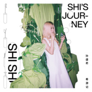

希游记-藏金版
============================

|  |  |
| :--: | :-- |
| [ 希游记-藏金版](https://emumo.xiami.com/album/2104918281) | **艺人**: [孙盛希](../index.md) **语种**: 国语 **唱片公司**: 滚石唱片 **发行时间**: 2019年06月06日 **专辑类别**: 录音室专辑 **专辑风格**: 国语流行 Mandarin Pop **播放数**: 915870 **收藏数**: 541 **评论数**: 55  |

## 简介

孙盛希 SHI SHI  
2018 Fusion实验专辑《希游记》  
2019 希有发行 《希遊記_藏金版》  
同步上线  &lt;梦游Demo_实验原型&gt;  
金曲陣容<strong> </strong>李欣芸<strong>x</strong>陈君豪<strong>x</strong>李守信<strong>x</strong>许郁瑛<strong>x</strong>葛大为<strong>x</strong>严云农<strong>x</strong>保卜  
希有合作<strong> </strong>魏如萱<strong>x<em>ØZI</em>xHUSH</strong><strong>  </strong>  
R&amp;B x Motown x Funk x Disco x Rock x Urban x Slow rock x Waltz  
  
孙盛希—质量兼具能量爆发的转音天后，《希游记》一张处处蕴藏惊喜的实验专辑，入围金曲30 【最佳国语女歌手】、【最佳国语专辑】、【年度专辑】、【最佳编曲人】两项，共五项大奖。  
《希遊記_藏金版》特别收录&lt;梦游Demo_实验原型&gt; 带大家回到实验室现场。  
  
孙盛希<strong>SHISHI</strong>，有点循规又不按常理， 冷静与热情之间、疼痛与愉悦之间，摇摆着、矛盾着、平衡着，从小在韩国长大的华侨，来台湾开发自己的音乐生命，从韩国江原道到台湾追逐音乐梦的女孩，从「华人星光大道」出发，经历一连串音乐与灵魂的游记，至今已发行三张创作专辑与第四张实验专辑《希游记》。  
  
《希游记》的由来，取自经典名著《西游记》的谐音，其中唐僧取经的故事最为人熟知，而希希想藉由《希游记》开启每个人心中的冒险灵魂，带着实验精神跳脱日复一日的生活，抛开框架，抓住生活中的出其不意，用心感受。  
  
金曲制作人李欣芸与陈君豪采取不同以往的制作方式，藉由同步录音、即兴创作在此实验里琢磨乐句，激荡音乐火花，顺着当下进行音乐对话。  
  
十首希有实验，邀请你/妳一同掉进SHI’s Journey。

## 曲目

## 评论

|  |  |  |  |
| :-- | :-- | :-- | :-- |
|  [虾米用户](https://emumo.xiami.com/u/341091) 偶爱我们呢~ 2020-06-11 15:59 赞(1) 踩(0) | 
也怪不得虾米这么大力推荐了，真是优秀的旋律创作啊。
 |
|  [虾米用户](https://emumo.xiami.com/u/245275341) 認歌不認人(大部分時間是... 2020-06-11 13:26 赞(2) 踩(0) | 
nb啊都是我的菜
 |
|  [虾米用户](https://emumo.xiami.com/u/404488429) Hello 2020-06-11 08:16 赞(1) 踩(0) | 
好听
 |
|  [虾米用户](https://emumo.xiami.com/u/246653949)  2019-10-08 09:10 赞(2) 踩(0) | 
完美
 |
|  [虾米用户](https://emumo.xiami.com/u/43042024) 点击编辑 2019-08-24 11:42 赞(3) 踩(0) | 
这张专辑 牛逼啊好好听
 |
|  [虾米用户](https://emumo.xiami.com/u/80824232)   2019-07-04 17:21 赞(2) 踩(0) | 
人样！被惊艳到！！！
 |
|  [虾米用户](https://emumo.xiami.com/u/89155576)  2019-07-03 08:53 赞(2) 踩(0) | 
实至名归！
 |
|  [虾米用户](https://emumo.xiami.com/u/7292098) 我們不斷相遇 在未來里 2019-07-01 11:10 赞(1) 踩(0) | 
'
 |
|  [虾米用户](https://emumo.xiami.com/u/37015357) 我还没想好要写什么... 2019-06-30 11:23 赞(0) 踩(0) | 
live也超棒的希希 ！
 |
|  [虾米用户](https://emumo.xiami.com/u/47226504)  2019-06-30 00:49 赞(0) 踩(0) | 
恭喜希希，太棒啦，我的宝藏女孩
 |
|  [虾米用户](https://emumo.xiami.com/u/246158137) 我还没想好要写什么... 2019-06-30 00:06 赞(0) 踩(0) | 
恭喜 金曲奖最佳国语专辑 
 |
|  [虾米用户](https://emumo.xiami.com/u/10037213)   2019-06-29 23:24 赞(1) 踩(0) | 
恭喜
 |
|  [虾米用户](https://emumo.xiami.com/u/15875700)  2019-06-27 09:11 赞(1) 踩(0) | 
第一次听到就喜欢了的歌手，整专都耐听哦
 |
|  [虾米用户](https://emumo.xiami.com/u/193504880)  2019-06-26 18:40 赞(0) 踩(0) | 
整张专辑真的超级耐听，希式旋律辨识度超高。希希实力超强✪ω✪
 |
|  [虾米用户](https://emumo.xiami.com/u/52436439) 孤岛。 2019-06-26 11:40 赞(0) 踩(0) | 
越听越好听噢～ 
 |
|  [虾米用户](https://emumo.xiami.com/u/268719558)  2019-06-21 16:51 赞(0) 踩(0) | 
新声夺人
 |
|  [虾米用户](https://emumo.xiami.com/u/833591) 我还没想好要写什么... 2019-06-13 22:13 赞(5) 踩(0) | 
都说陈奕迅没有烂歌，我终于找到另一个没有烂歌的女歌手了
 |
|  [虾米用户](https://emumo.xiami.com/u/146660900) 独一，无二 2019-06-10 14:20 赞(0) 踩(0) | 
人生不过匆匆数十年你我身为匆匆过客从降临在人世间开始就踏上死亡列车而我们又不得不从一节车厢逃向下一节车厢或许我们不会在下一节车厢里，相遇，或你或我即便奋心工事，想要弥留人间，终也不尝所愿纵使岁月蹉跎纵也在湍汹的人生激流中迷路或者无谓抵抗放下心来，糟糟之过往亦或奕奕之前事也如倒带一般，早已时过境迁我和你，不过一滚红尘，残放于空中也不止地消散，终归天地我和你，要做一抷黄土，再见时，我是大漠戈壁被风扬起的一面沙旗，而你，将于海岸上，螃蟹压住，鹅石遍布做一片沙滩
 |
|  [虾米用户](https://emumo.xiami.com/u/15415412) 我还没想好要写什么... 2019-06-08 16:20 赞(1) 踩(0) | 
梦游 人样 一直单曲循环!
 |
| ⇒ |  [虾米用户](https://emumo.xiami.com/u/41663356)  2019-06-10 00:49 赞(0) 踩(0) | 
俺也一样
 |
|  [虾米用户](https://emumo.xiami.com/u/193504880)  2019-06-08 09:34 赞(1) 踩(0) | 
希希就是一股清流，坚持做自己!
 |
|  [虾米用户](https://emumo.xiami.com/u/297247871)  2019-06-08 07:41 赞(0) 踩(0) | 
好听
 |
|  [虾米用户](https://emumo.xiami.com/u/415791718)  2019-06-07 22:36 赞(1) 踩(0) | 
大呼过瘾整张专辑几乎是一首歌一种风格，现代R&amp;B，爵士FUNK+SOUL，Indie摇滚，迷幻乐，实验性电子，还有一点Vapourpower。动则撕心裂肺，地动山摇，轻则缓缓呢喃，切切低语，慵懒和炸裂，原创的思考，实验性的冒险精神，当代年轻音乐人的跨时代精神！
 |
| ⇒ |  [虾米用户](https://emumo.xiami.com/u/264595711) 原来我才是那具该被嘲笑的... 2019-06-10 19:15 赞(0) 踩(0) | 
indie摇滚是什么鬼。。。
 |
| ⇒ |  [虾米用户](https://emumo.xiami.com/u/324850786) 當你我錯過今天 人潮將彼... 2019-06-30 05:03 赞(0) 踩(0) | 
<q><b>逾清说：</b></q>
 |
|  [虾米用户](https://emumo.xiami.com/u/203017284)  2019-06-07 20:11 赞(0) 踩(0) | 
爱
 |
|  [虾米用户](https://emumo.xiami.com/u/34477395)   2019-06-07 16:56 赞(0) 踩(0) | 
太棒了吧，整张专辑都充满着高级感，每首都是用心制作的感觉，感谢感谢，带来了真正美好的音乐。
 |
|  [虾米用户](https://emumo.xiami.com/u/217280349)  2019-06-07 16:44 赞(1) 踩(0) | 
棒棒棒
 |
|  [虾米用户](https://emumo.xiami.com/u/361014317) 略略略 2019-06-07 16:24 赞(0) 踩(0) | 
希希的声线，唱慢歌很有feel！慵懒之中带点俏皮，很enjoy！
 |
|  [虾米用户](https://emumo.xiami.com/u/2220053) 在你出现之前，我能和自己... 2019-06-07 15:05 赞(0) 踩(0) | 
好听
 |
|  [虾米用户](https://emumo.xiami.com/u/1638542)  2019-06-07 02:36 赞(1) 踩(0) | 
为什么不写编曲，太不尊重人了，除非你只清唱不放伴奏。
 |
|  [虾米用户](https://emumo.xiami.com/u/307611577) 那些说好的，就都算了吧。 2019-06-06 21:25 赞(0) 踩(0) | 
这张果然还是很耐听
 |
|  [虾米用户](https://emumo.xiami.com/u/419366957) 我还没想好要写什么... 2019-06-06 20:17 赞(2) 踩(0) | 
希希就像初夏晨光下涌动的白色海浪，又柔缓空灵如海豚
 |
|  [虾米用户](https://emumo.xiami.com/u/84571136) 唯有音乐不离不弃 2019-06-06 18:37 赞(0) 踩(0) | 
嗯
 |
|  [虾米用户](https://emumo.xiami.com/u/20952104)  2019-06-06 18:01 赞(2) 踩(0) | 
没有一首好听的
 |
| ⇒ |  [虾米用户](https://emumo.xiami.com/u/43042024) 点击编辑 2019-08-26 17:20 赞(0) 踩(0) | 
理解不能
 |
|  [虾米用户](https://emumo.xiami.com/u/352085638)  2019-06-06 15:11 赞(1) 踩(0) | 
求实体专辑，第三四张
 |
|  [虾米用户](https://emumo.xiami.com/u/34247002) 音乐_这世界的一缕灵魂_ 2019-06-06 14:49 赞(0) 踩(0) | 
喜欢 567
 |
|  [虾米用户](https://emumo.xiami.com/u/47479564)  2019-06-06 13:21 赞(1) 踩(0) | 
等你金曲奖得奖。
 |
|  [虾米用户](https://emumo.xiami.com/u/202958177)   2019-06-06 12:33 赞(2) 踩(0) | 
高级版。
 |
|  [虾米用户](https://emumo.xiami.com/u/57904630) 加拿大王心凌真是名不虚传... 2019-06-06 12:12 赞(0) 踩(0) | 
有点迷幻的感觉
 |
|  [虾米用户](https://emumo.xiami.com/u/104224890) Only one 2019-06-06 12:03 赞(0) 踩(0) | 
有什么不一样的吗？
 |
|  [虾米用户](https://emumo.xiami.com/u/8015941)   2019-06-06 09:23 赞(0) 踩(0) | 
好棒啊！爱了爱了！还有waa和hush～惊喜
 |
| ⇒ |  [虾米用户](https://emumo.xiami.com/u/324850786) 當你我錯過今天 人潮將彼... 2019-06-07 13:48 赞(0) 踩(0) | 
娃娃在哪里
 |
|  [虾米用户](https://emumo.xiami.com/u/321838275)  2019-06-06 09:04 赞(0) 踩(0) | 
好听哟
 |
|  [虾米用户](https://emumo.xiami.com/u/43637685) 。 2019-06-06 08:27 赞(0) 踩(0) | 
喜欢
 |
|  [虾米用户](https://emumo.xiami.com/u/377724527)  2019-06-06 07:08 赞(1) 踩(0) | 
给封面设计师加鸡腿，紫色盛希+完美补色的清新绿bg，看似杂乱但其实精心安排的三角构图~啊~~~酥糊 
 |
|  [虾米用户](https://emumo.xiami.com/u/44269716) 暂无签名~ 2019-06-06 06:31 赞(0) 踩(0) | 
今天正好是自己的生日，最爱的歌手发布新专辑很开心 
 |
|  [虾米用户](https://emumo.xiami.com/u/355241124) 我还没想好要写什么... 2019-06-06 00:43 赞(0) 踩(0) | 
好听
 |
|  [虾米用户](https://emumo.xiami.com/u/283939501)  2019-06-06 00:13 赞(2) 踩(0) | 
歌詞完全把現代人的愛情模式表達出來，搭配輕快的節奏，chill又嘻哈又帶點毒
 |
|  [虾米用户](https://emumo.xiami.com/u/255598316) 我一直在养一盆不长草的花 2019-06-06 00:05 赞(1) 踩(0) | 
喜欢
 |
|  [虾米用户](https://emumo.xiami.com/u/13450954) 咩～ 2019-06-06 00:03 赞(0) 踩(0) | 
来啦❤️
 |
|  [虾米用户](https://emumo.xiami.com/u/210502072) 妹纸一枚！ 2019-06-06 00:03 赞(0) 踩(0) | 
第二耶，爱你❤shishi
 |
|  [虾米用户](https://emumo.xiami.com/u/113664348) 我还没想好要写什么... 2019-06-06 00:03 赞(1) 踩(0) | 
太爱这张了！等实体！
 |
|  [虾米用户](https://emumo.xiami.com/u/37157775) 粤语歌种下程/哪个时势能... 2019-06-06 00:01 赞(0) 踩(0) | 
第一！
 |
