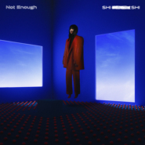

还不够Not Enough
============================

|  |  |
| :--: | :-- |
| [ 还不够Not Enough](https://emumo.xiami.com/album/5021966301) | **艺人**: [孙盛希](../index.md) **语种**: 国语 **唱片公司**: 滚石唱片 **发行时间**: 2020年11月20日 **专辑类别**: EP, 单曲 **专辑风格**:  **播放数**: 90656 **收藏数**: 3 **评论数**: 0  |

## 简介

在2019金曲奖大放异彩，获得「最佳国语专辑」大奖肯定，孙盛希已然公认是新一代唱作实力俱佳的创作歌手，富有感染力的迷人声线，自带气场的转音女神。在大奖加持之下，孙盛希精心酝酿全新专辑《出没地带 Where is SHI?》，以R&amp;B曲风为主体，融合Neo-Soul、Alternative R&amp;B、当代电子元素的企图之作，并回归最初做音乐的原型，使用大量真乐器Live即兴录制，收放自如的嗓音情绪更显张力，深入探索R&amp;B精神世界里最为贴近并能呈现此刻自我阶段的情感语言。孙盛希力邀好友亦是乐坛最活跃厂牌「新乐园」关键主脑米奇林、剃刀蒋共同担任专辑制作人，由擅长制作最纯正R&amp;B音乐的两位音乐奇才统筹专辑A&amp;R及整体企宣，浪漫量级无庸置疑；专辑整体视觉风格由新锐视觉总监Yii操刀，搭档时尚摄影师 Po-yen Chen打造，在美丽与不寻常氛围之间，激起无限想象，情境美学具有极高辨识度。

专辑首波开门主打〈还不够〉，孙盛希&amp;剃刀蒋&amp;米奇林带你进入2000年R&amp;B的黄金年代，新生代编曲人Shawn加入经典吉他音色，剃刀蒋犀利观察量身打造贴切孙盛希真实状态的歌词，展现嘻哈态度胆大自信；以歌手成功后的忙碌生活为开场，毫无保留地直率表达，就算达到当初的目标、证明了自己，也还是觉得不够，还想要更好、也值得更好；有趣的是，人性本质中的欲望同时也是驱动前进的动力，内心喊话要继续努力不要停下，也问着自己，真正的成功到底该怎么定义。就如专辑英文名“Where is SHI?”，留下了想象伏笔，也是正在寻找答案的过程，一边也向听众抛出思辨，“我是谁，我正在哪里？”

## 曲目

## 评论

