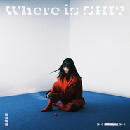

孙盛希
============================

|  |  |
| :--: | :-- |
| [ 孙盛希](https://i.xiami.com/shishi) | **播放数**: 74606422 **粉丝数**: 16735 **评论数**: 619 **地区**: Taiwan, PRC 中国台湾 **风格**: 国语流行 Mandarin Pop, 华语唱作人 Chinese Singer-Songwriter  |

## 档案

小档案   本 名：孙盛希  英 文 名：shi shi  昵 称：希希  国 籍：韩国华侨  出 生：1990年11月13日  职 业：唱作歌手  语 言：汉语、英语、韩语  教育程度：韩国延世大学  演奏乐器：吉他、钢琴  出道地点：台湾  出道日期：2013年  出道作品：《GIRLS》  代表作品：《跟你住》、《不该不该》、《恒温》、《少一点天分》  唱片公司：滚石唱片  经纪公司：滚石唱片   艺人简介   孙盛希（昵称希希，因为出道前英文名是 Shi Shi，1990年11月13日－），韩国华侨，参加过第二届《华人星光大道》，得到第6名的成绩，也因而被滚石唱片签约，并开始栽培希希的音乐创作概念。  孙盛希曾参加大学乐团 SONAGI 两年，在各种大小规模的学校以及外部小俱乐部演出。第34届MBC‘大学歌谣祭’中，为进入决赛的13队之一。  在2014年，发行首张个人专辑《GIRLS》。虽然专辑在6月20日发行，但此前单曲已经成为电视剧插曲或主题曲。2015年凭借此张专辑入围第26届金曲奖最佳新人奖。  孙盛希声线突出，她将女孩在爱情里的脆弱与坚持，在音乐创作里，毫不掩饰流露出来。韩国华侨的身分也让她在不同的成长文化熏陶下，创作带有柔中带刚的生命力，除此之外，韩国多元化音乐类型，影响孙盛希音乐创作风格多变的样貌。就像她身上多方文化混合一样，她的音乐展现及创作力不止单一路线，在多风格音乐混搭的可能性下，音乐的流动感让人惊喜与称赞。  孙盛希从小身上就有2种不同的文化混合着，父亲严格要求不仅要把成长环境的韩国文化学好，更不能忘记中文的学习与训练。10岁开始，希希开始学习钢琴，也是她接触音乐的第一步，紧接父亲在希希初中开始指导她玩吉他，曾参加大学乐团 SONAGI 两年，在各种大小规模的学校以及外部小俱乐部演出。在第34届MBC大学歌谣祭中，为进入决赛的13队之一。  在摇滚音乐社团与同学一起玩音乐、参加比赛的经历，让孙盛希发现自己原来有创作的可能性，于是与父亲商量后，暂时停止大学的课业，开始探索的音乐之路。孙盛希中低真假嗓音唱法与丰沛的创作力，一个因缘巧合下，受到滚石唱片青睐，秘密培训、潜心创作，近一年半的时间，于2014年6月20日推出个人首张专辑《GIRLS》。

## 专辑

| 名称 | 语种 | 唱片公司 | 发行时间 | 专辑类别 | 专辑风格 |
| :--: | :-- | :-- | :-- | :-- | :-- |
| [ 出没地带](./albums/5022241879.md) | 国语 | 滚石唱片 | 2020年12月18日 | 录音室专辑 | 国语流行 Mandarin Pop |
| [ Give It to Me](./albums/5022128861.md) | 国语 | 滚石唱片 | 2020年12月09日 | EP, 单曲 | 恍惚嘻哈舞曲 Wonky, 国语流行 Mandarin Pop |
| [ 还不够Not Enough](./albums/5021966301.md) | 国语 | 滚石唱片 | 2020年11月20日 | EP, 单曲 |  |
| [ 明天会更好 (群星公益版)](./albums/2420329009.md) | 国语 | 咪咕音乐 | 2020年02月27日 | EP, 单曲 | 国语流行 Mandarin Pop |
| [ 逃](./albums/2105431262.md) | 国语 | 滚石唱片 | 2019年11月29日 | EP, 单曲 | 国语流行 Mandarin Pop |
| [ Let Me Fall电影《圣人大盗》片尾曲](./albums/2105319198.md) | 国语 | 滚石唱片 | 2019年10月16日 | EP, 单曲 |  |
| [ Someday or One Day电视剧《想见你》片头曲](./albums/2105253175.md) | 英语 | 滚石唱片 | 2019年09月27日 | EP, 单曲 | 原声 Soundtrack |
| [ 希游记-藏金版](./albums/2104918281.md) | 国语 | 滚石唱片 | 2019年06月06日 | 录音室专辑 | 国语流行 Mandarin Pop |
| [ 希游记](./albums/2104143695.md) | 国语 | 滚石唱片 | 2018年10月31日 | 录音室专辑 | 国语流行 Mandarin Pop |
| [ 女・人 Woman](./albums/2103775301.md) | 国语 | 滚石唱片 | 2018年07月06日 | 录音室专辑 | 国语流行 Mandarin Pop, 华语唱作人 Chinese Singer-Songwriter |
| [ 另一个结局Raphael](./albums/2103521192.md) | 国语 | 滚石唱片 | 2018年02月12日 | EP, 单曲 | 国语流行 Mandarin Pop |
| [ Never Lose Your Smile](./albums/2103509211.md) | 国语 | 滚石唱片 | 2018年01月31日 | EP, 单曲 | 融合爵士 Jazz Fusion |
| [ Between](./albums/2102657748.md) | 国语 | 滚石唱片 | 2016年12月23日 | 录音室专辑 | 国语流行 Mandarin Pop, 华语唱作人 Chinese Singer-Songwriter |
| [ Stay With Me](./albums/1832523842.md) | 英语 | 滚石唱片 | 2015年05月25日 | EP, 单曲 |  |
| [ |希。O2 | 初雪限定Shi's Original 2 첫눈 한정](./albums/616915611.md) | 国语 | 滚石唱片 | 2014年11月26日 | EP, 单曲 | 国语流行 Mandarin Pop, 华语唱作人 Chinese Singer-Songwriter |
| [ Girls孙盛希1st创作专辑](./albums/301355284.md) | 国语 | 滚石唱片 | 2014年06月20日 | 录音室专辑 | 国语流行 Mandarin Pop, 华语唱作人 Chinese Singer-Songwriter |

## 评论

|  |  |  |  |
| :-- | :-- | :-- | :-- |
|  [虾米用户](https://emumo.xiami.com/u/32231042) 没 个 性 2020-12-29 13:35 赞(0) 踩(0) | 
新专辑还不上架
 |
|  [虾米用户](https://emumo.xiami.com/u/38578052)  2020-12-28 20:52 赞(0) 踩(0) | 
每一首都好好听！太绝了
 |
|  [虾米用户](https://emumo.xiami.com/u/51568184)   2020-11-28 15:08 赞(0) 踩(0) | 
-
 |
|  [虾米用户](https://emumo.xiami.com/u/24968228)  2020-11-21 23:10 赞(0) 踩(0) | 
《还不够》还没有上架。虾米的努力还不够呢 
 |
|  [虾米用户](https://emumo.xiami.com/u/349880325) 노래...... 2020-11-15 23:37 赞(0) 踩(0) | 
今天因你而特别
 |
|  [虾米用户](https://emumo.xiami.com/u/400443260)  2020-11-13 12:01 赞(1) 踩(0) | 
才女，美女，我爱孙盛希 
 |
|  [虾米用户](https://emumo.xiami.com/u/93776162) 生活也许是美好的... 2020-11-13 11:16 赞(0) 踩(0) | 
希希生日快乐，等新专辑出来～
 |
|  [虾米用户](https://emumo.xiami.com/u/40788268)  2020-11-13 10:31 赞(0) 踩(0) | 
生日快乐
 |
|  [虾米用户](https://emumo.xiami.com/u/124998020)   2020-11-13 10:06 赞(0) 踩(0) | 
希希生日快乐！期待新专啦！
 |
|  [虾米用户](https://emumo.xiami.com/u/407513385)  2020-11-13 10:04 赞(0) 踩(0) | 
爱你的 自然凋谢 
 |
|  [虾米用户](https://emumo.xiami.com/u/252406730)  2020-11-13 10:03 赞(0) 踩(0) | 
生日快乐！期待你的作品哦
 |
|  [虾米用户](https://emumo.xiami.com/u/375391486) 力求無上進◇誰鸟你 2020-11-13 10:03 赞(0) 踩(0) | 
小希生日快樂餒 
 |
|  [虾米用户](https://emumo.xiami.com/u/354175027)  2020-11-13 10:01 赞(0) 踩(0) | 
生日快乐！
 |
|  [虾米用户](https://emumo.xiami.com/u/230803304) 三观正又爱国的成都宝藏男... 2020-11-13 10:01 赞(0) 踩(0) | 
祝孙盛希生日快乐
 |
|  [虾米用户](https://emumo.xiami.com/u/443374782)  2020-06-07 03:00 赞(0) 踩(0) | 
красиво исполняет
 |
|  [虾米用户](https://emumo.xiami.com/u/421578063) fox god 2020-06-01 20:19 赞(0) 踩(0) | 
(*^▽^)/★*☆
 |
|  [虾米用户](https://emumo.xiami.com/u/200824124) 再见啦 2020-05-27 17:22 赞(0) 踩(0) | 
感觉早期的歌和想见你原创这几首，音色变化很大～
 |
|  [虾米用户](https://emumo.xiami.com/u/8866457) 你從未與夜晚降臨。 2020-04-10 22:38 赞(0) 踩(0) | 
不痛不痒 麻醉了伤痕
 |
|  [虾米用户](https://emumo.xiami.com/u/4793902) 孤单的时候才知道你真正想... 2020-04-06 08:08 赞(0) 踩(0) | 
注意身体，多出经典。
 |
|  [虾米用户](https://emumo.xiami.com/u/201698259) 我真的很想去东北 2020-03-20 22:04 赞(0) 踩(0) | 
等一波下张专辑，保持状态的话我就入手实专了 
 |
|  [虾米用户](https://emumo.xiami.com/u/436434179) 我没想过离开你后我会有多... 2020-02-27 00:00 赞(0) 踩(0) | 
音色很独特
 |
|  [虾米用户](https://emumo.xiami.com/u/359775470) 用洗涤心灵 2020-02-20 16:54 赞(3) 踩(0) | 
一个有魔力的女孩子，时间的沉淀会让你更加魅力，实力总会被看见，shi shi，未来的你会越来越好，你会成为乐坛的那颗shining star.___一直默默支持你的fan（第一次鼓起勇气和你说）
 |
|  [虾米用户](https://emumo.xiami.com/u/259649716)  2020-02-04 20:13 赞(2) 踩(0) | 
看了想见你来的  没想到是几年前的歌了啊
 |
|  [虾米用户](https://emumo.xiami.com/u/44925253) Four_0522 2020-01-15 01:36 赞(1) 踩(0) | 
优秀
 |
|  [虾米用户](https://emumo.xiami.com/u/293764257)  2019-12-30 14:16 赞(0) 踩(0) | 
很喜欢你的歌，循环好久
 |
|  [虾米用户](https://emumo.xiami.com/u/43496858) 我还没想好要写什么... 2019-12-08 02:17 赞(0) 踩(0) | 
今晚看了广州场，幸福  
 |
|  [虾米用户](https://emumo.xiami.com/u/258600787)  2019-11-28 23:46 赞(0) 踩(0) | 
我在等新歌 
 |
|  [虾米用户](https://emumo.xiami.com/u/52356404) 做题听歌 2019-11-13 10:32 赞(1) 踩(0) | 
生日快乐！期待更多好的作品！
 |
|  [虾米用户](https://emumo.xiami.com/u/44743196) 听虾米记得收藏～ 2019-11-13 10:02 赞(0) 踩(0) | 
希希生日快乐
 |
|  [虾米用户](https://emumo.xiami.com/u/190455675) 牛行天下 2019-11-13 10:01 赞(0) 踩(0) | 
个性舒服的声线…… 
 |
|  [虾米用户](https://emumo.xiami.com/u/5853535)  2019-09-06 19:09 赞(1) 踩(0) | 
音乐又有品味，情绪又正面。同时满足很难得，爱了
 |
|  [虾米用户](https://emumo.xiami.com/u/54480399) 四季是你，你还是你。 2019-09-02 21:20 赞(1) 踩(0) | 
声音特别好听，必须火
 |
|  [虾米用户](https://emumo.xiami.com/u/5853535)  2019-09-02 13:30 赞(3) 踩(0) | 
不要唱流行音乐了，来做中国的椎名林檎
 |
|  [虾米用户](https://emumo.xiami.com/u/3183998) 虾米感谢遇见 2019-07-21 02:30 赞(0) 踩(0) | 
恭喜
 |
|  [虾米用户](https://emumo.xiami.com/u/15987186)  2019-07-05 19:00 赞(0) 踩(0) | 
韩国华侨
 |
|  [虾米用户](https://emumo.xiami.com/u/426455296)  2019-07-01 18:00 赞(0) 踩(0) | 
删除
 |
|  [虾米用户](https://emumo.xiami.com/u/268719558)  2019-06-30 13:45 赞(1) 踩(0) | 
最佳国专！
 |
|  [虾米用户](https://emumo.xiami.com/u/114458052) 吞下无意义想法 2019-06-30 02:32 赞(4) 踩(0) | 
恭喜获奖！
 |
|  [虾米用户](https://emumo.xiami.com/u/220414754) 浪漫和梦想等于死亡 2019-06-21 20:45 赞(0) 踩(0) | 
今天北京场很棒！❤️
 |
|  [虾米用户](https://emumo.xiami.com/u/347309216) 觅食的人 2019-06-21 11:14 赞(0) 踩(0) | 
希！
 |
|  [虾米用户](https://emumo.xiami.com/u/95248584)  2019-06-08 00:01 赞(1) 踩(0) | 
不容易啊，星光2先出道那批都成名多久了，终于熬出头了，晚点出道不一定是坏事，你看第一张专辑多成熟
 |
|  [虾米用户](https://emumo.xiami.com/u/256937179)  2019-06-07 08:26 赞(2) 踩(0) | 
真是个宝藏女孩
 |
|  [虾米用户](https://emumo.xiami.com/u/358104299) 悲观的唯心存在现实解构虚... 2019-05-21 11:36 赞(2) 踩(0) | 
11138
 |
|  [虾米用户](https://emumo.xiami.com/u/82406246) WhereverUAre... 2019-05-18 16:22 赞(1) 踩(0) | 
宝藏女孩儿[带墨镜笑]
 |
|  [虾米用户](https://emumo.xiami.com/u/245892947) 我还没想好要写什么... 2019-03-22 07:21 赞(1) 踩(0) | 
确实唱的好，粉色头发不错
 |
|  [虾米用户](https://emumo.xiami.com/u/378843180)   Boring. 2019-03-02 21:23 赞(0) 踩(0) | 
✔✔
 |
|  [虾米用户](https://emumo.xiami.com/u/352703275)  2019-02-27 09:27 赞(1) 踩(0) | 
听出了许多感触
 |
|  [虾米用户](https://emumo.xiami.com/u/57904630) 加拿大王心凌真是名不虚传... 2019-02-23 18:01 赞(0) 踩(0) | 
哇又被你的新歌萌到了
 |
|  [虾米用户](https://emumo.xiami.com/u/8859148) 水,空气,爱,音乐, 2019-02-23 09:49 赞(1) 踩(0) | 
她的歌都很有氛围感，让人不自觉沉迷
 |
|  [虾米用户](https://emumo.xiami.com/u/38168812) 他人即是地狱 2019-02-17 17:00 赞(1) 踩(0) | 
因为恒温 看上了 喜欢你的歌 祝好
 |
|  [虾米用户](https://emumo.xiami.com/u/416842429)  2019-02-05 04:40 赞(1) 踩(0) | 
新专辑大卖，创造出越来越好听音乐大紫大红
 |
|  [虾米用户](https://emumo.xiami.com/u/45281958)  2019-01-30 08:51 赞(1) 踩(0) | 
喜爱始于恒温，如今希希简直是心中的一颗朱砂痣
 |
|  [虾米用户](https://emumo.xiami.com/u/3183998) 虾米感谢遇见 2019-01-29 00:22 赞(2) 踩(0) | 
打卡
 |
|  [虾米用户](https://emumo.xiami.com/u/47479564)  2018-12-30 10:37 赞(11) 踩(0) | 
路过的有缘人，《少一点天分》原唱孙盛希报名《歌手》了，她有太多好歌《恒温》《跟你住》《不该不该》等等全都是。她是一位优秀的创作歌手，我好想在《歌手》上看到她唱《少一点天分》啊，大家可以给她投票吗？去微博，感谢大家。
 |
|  [虾米用户](https://emumo.xiami.com/u/361839699) 淋漓尽致见怪不怪美不胜收... 2018-12-12 22:52 赞(1) 踩(0) | 
shishi孙盛希快乐听一听空舞
 |
|  [虾米用户](https://emumo.xiami.com/u/375937525) 还给你！你不欠我什么！ 2018-12-06 14:50 赞(1) 踩(0) | 
很喜欢（少一点天分）这首歌。听出了很多真实。谢谢你 
 |
|  [虾米用户](https://emumo.xiami.com/u/406268244)  2018-12-02 11:06 赞(1) 踩(0) | 
少一点天分好听
 |
|  [虾米用户](https://emumo.xiami.com/u/25911528) 怎么才能不花钱当虾米会员... 2018-11-23 22:46 赞(1) 踩(0) | 
感觉新专辑都没有超过between的水平，还是个人感觉哦？？between 里的每一首歌都好经典的！！！！！今年接着出的两张，都没有找到最初的感觉    可能我还停留在《恒温》《少一点天份》的余味里。
 |
|  [虾米用户](https://emumo.xiami.com/u/361014317) 略略略 2018-11-13 13:02 赞(0) 踩(0) | 
HBD to shishi  很棒啊啊！
 |
|  [虾米用户](https://emumo.xiami.com/u/377355768)  2018-11-13 12:59 赞(0) 踩(0) | 
生日快乐
 |
|  [虾米用户](https://emumo.xiami.com/u/210502072) 妹纸一枚！ 2018-11-13 12:48 赞(1) 踩(0) | 
shishi生日快乐，越来越美丽，永远才华满溢，永远听你唱 
 |
|  [虾米用户](https://emumo.xiami.com/u/104224890) Only one 2018-11-13 10:25 赞(1) 踩(0) | 
合批波斯带！
 |
|  [虾米用户](https://emumo.xiami.com/u/355089303) 我来虾米多少天了?！ 2018-11-13 10:10 赞(0) 踩(0) | 
嗨皮波斯带
 |
|  [虾米用户](https://emumo.xiami.com/u/32052730) 虾米虾米？ 2018-11-13 10:08 赞(1) 踩(0) | 
生日快乐哦
 |
|  [虾米用户](https://emumo.xiami.com/u/357601655)  2018-11-13 10:02 赞(0) 踩(0) | 
生日快乐希希
 |
|  [虾米用户](https://emumo.xiami.com/u/160356382)   2018-11-13 10:01 赞(1) 踩(0) | 
shishi生日快乐
 |
|  [虾米用户](https://emumo.xiami.com/u/357868735)  2018-11-01 12:33 赞(0) 踩(0) | 
少一点天分也非常好听
 |
|  [虾米用户](https://emumo.xiami.com/u/833591) 我还没想好要写什么... 2018-10-31 09:41 赞(1) 踩(0) | 
新生代歌手最欣赏的歌手，能写能弹能唱能把握各种风格的新人基本绝迹了，高产并保持高水准，希望有机会能听次live
 |
|  [虾米用户](https://emumo.xiami.com/u/3183998) 虾米感谢遇见 2018-10-31 03:14 赞(1) 踩(0) | 
恭喜希希新专优秀登场，明天 
 |
|  [虾米用户](https://emumo.xiami.com/u/405761014) 把你的难过给我，我要你快... 2018-10-24 17:52 赞(0) 踩(0) | 
好听好听
 |
|  [虾米用户](https://emumo.xiami.com/u/557560) 多伦多的多 2018-10-22 13:55 赞(1) 踩(0) | 
长得像不像马蓉
 |
|  [虾米用户](https://emumo.xiami.com/u/3183998) 虾米感谢遇见 2018-10-21 22:27 赞(0) 踩(0) | 
打卡1111111
 |
|  [虾米用户](https://emumo.xiami.com/u/293692544) 你敢给我说话吗？我咬你 2018-09-23 18:59 赞(2) 踩(0) | 
好听
 |
|  [虾米用户](https://emumo.xiami.com/u/3183998) 虾米感谢遇见 2018-09-20 17:59 赞(3) 踩(0) | 
 希希新专辑筹备中，期待
 |
|  [虾米用户](https://emumo.xiami.com/u/357046588) 心累，听歌吧 2018-09-15 21:48 赞(2) 踩(0) | 
超好听，找歌名找好久了，终于找到了
 |
|  [虾米用户](https://emumo.xiami.com/u/351821777)  2018-08-27 00:46 赞(4) 踩(0) | 
很喜欢这个声音
 |
|  [虾米用户](https://emumo.xiami.com/u/24968228)  2018-08-25 16:42 赞(9) 踩(0) | 
送给有缘人，两张票，今晚，广州场今晚广州场因行程原因，无法赶到。送给有缘人吧6点前回复的，我将私信相关票务认证
 |
| ⇒ |  [虾米用户](https://emumo.xiami.com/u/24968228)  2018-08-25 20:34 赞(0) 踩(0) | 
没想到没人回复&amp;hellip;&amp;hellip;优酷有现场直播，欢迎没到场的粉丝前往撑场
 |
|  [虾米用户](https://emumo.xiami.com/u/402557057)  2018-08-24 13:01 赞(0) 踩(0) | 
广州求一张票
 |
| ⇒ |  [虾米用户](https://emumo.xiami.com/u/288940175) 打死也不吃香菜 2018-09-07 12:58 赞(0) 踩(0) | 
楼上，可是好像过了啊
 |
|  [虾米用户](https://emumo.xiami.com/u/90100756) 我还没想好要写什么... 2018-08-24 00:24 赞(1) 踩(0) | 
live比录音室好听
 |
|  [虾米用户](https://emumo.xiami.com/u/37966428)   2018-08-23 17:28 赞(0) 踩(0) | 
今天上海场的票，有需要速戳我哈  
 |
|  [虾米用户](https://emumo.xiami.com/u/3494351)  2018-08-23 14:57 赞(0) 踩(0) | 
今天上海站 有2张票 去不了 有需要的联系
 |
| ⇒ |  [虾米用户](https://emumo.xiami.com/u/402391306)  2018-08-23 15:12 赞(0) 踩(0) | 
hello 可以方便转给我嘛，万分感谢
 |
| ⇒ |  [虾米用户](https://emumo.xiami.com/u/402391306)  2018-08-23 15:20 赞(0) 踩(0) | 
在的 虾米私信 我回不了你的消息 说是陌生人等级不够
 |
| ⇒ |  [虾米用户](https://emumo.xiami.com/u/3494351)  2018-08-23 15:21 赞(0) 踩(0) | 
<q><b>Chenyi说：</b></q>
 |
| ⇒ |  [虾米用户](https://emumo.xiami.com/u/402391306)  2018-08-23 15:22 赞(0) 踩(0) | 
<q><b>co_od说：</b></q>
 |
| ⇒ |  [虾米用户](https://emumo.xiami.com/u/3494351)  2018-08-23 15:25 赞(0) 踩(0) | 
你要什么qq或者 微信吗 加你
 |
|  [虾米用户](https://emumo.xiami.com/u/402429666)  2018-08-23 12:46 赞(0) 踩(0) | 
广州求一张票
 |
|  [虾米用户](https://emumo.xiami.com/u/569666) 我还没想好要写什么... 2018-08-23 10:25 赞(0) 踩(0) | 
。
 |
|  [虾米用户](https://emumo.xiami.com/u/37966428)   2018-08-22 17:51 赞(0) 踩(0) | 
内容已删除
 |
| ⇒ |  [虾米用户](https://emumo.xiami.com/u/402391306)  2018-08-22 22:06 赞(0) 踩(0) | 
你好 请问你有两张票可以转让吗
 |
| ⇒ |  [虾米用户](https://emumo.xiami.com/u/37966428)   2018-08-23 12:11 赞(0) 踩(0) | 
<q><b>Chenyi说：</b></q>
 |
| ⇒ |  [虾米用户](https://emumo.xiami.com/u/402391306)  2018-08-23 13:56 赞(0) 踩(0) | 
<q><b>我记得海的蓝和海风徐徐说：</b></q>
 |
|  [虾米用户](https://emumo.xiami.com/u/13375340)   2018-08-20 17:14 赞(1) 踩(0) | 
北京站，多了一张票，想要去演唱会的可以私我 
 |
|  [虾米用户](https://emumo.xiami.com/u/175593516) 聽 那些暖暖的溫柔和明媚... 2018-08-19 14:39 赞(1) 踩(0) | 
有两张北京的票，可是只有我一个人，一个人想去听的可以联系我哈
 |
| ⇒ |  [虾米用户](https://emumo.xiami.com/u/277490971)  2018-08-19 18:09 赞(0) 踩(0) | 
现在还能约到吗 哈哈
 |
| ⇒ |  [虾米用户](https://emumo.xiami.com/u/175593516) 聽 那些暖暖的溫柔和明媚... 2018-08-19 18:10 赞(0) 踩(0) | 
<q><b>阿青青青说：</b></q>
 |
|  [虾米用户](https://emumo.xiami.com/u/215830013)   2018-08-17 12:59 赞(1) 踩(0) | 
有没有人抽中广州场一个人去找伴的 求搭
 |
| ⇒ |  [虾米用户](https://emumo.xiami.com/u/402429666)  2018-08-23 12:54 赞(0) 踩(0) | 
没票跪求
 |
|  [虾米用户](https://emumo.xiami.com/u/346974975) 我还没想好要写什么... 2018-08-14 17:45 赞(0) 踩(0) | 
上海场，有的票吗，一张两张都可以。
 |
| ⇒ |  [虾米用户](https://emumo.xiami.com/u/269793659) ♡XXX♡ 2018-08-15 16:17 赞(0) 踩(0) | 
嗷呜&amp;hellip;我有你要嘛因为旅游所以没办法去了&amp;hellip;
 |
| ⇒ |  [虾米用户](https://emumo.xiami.com/u/79272028)  2018-08-16 14:29 赞(0) 踩(0) | 
<q><b>Sailor moon.说：</b></q>
 |
| ⇒ |  [虾米用户](https://emumo.xiami.com/u/47479564)  2018-08-16 18:03 赞(0) 踩(0) | 
<q><b>shengjingxin说：</b></q>
 |
| ⇒ |  [虾米用户](https://emumo.xiami.com/u/269793659) ♡XXX♡ 2018-08-16 18:59 赞(0) 踩(0) | 
<q><b>shengjingxin说：</b></q>
 |
|  [虾米用户](https://emumo.xiami.com/u/336820607)  2018-08-13 23:44 赞(0) 踩(0) | 
我有北京两张票，真的很想去，可是太远，想转，有人要吗 
 |
|  [虾米用户](https://emumo.xiami.com/u/123667906)   2018-08-13 20:11 赞(0) 踩(0) | 
我也抽中广州场了，不知道是不是真的
 |
|  [虾米用户](https://emumo.xiami.com/u/246833553)  2018-08-13 18:44 赞(0) 踩(0) | 
上海场，去不了，谁要的
 |
| ⇒ |  [虾米用户](https://emumo.xiami.com/u/346974975) 我还没想好要写什么... 2018-08-14 17:40 赞(0) 踩(0) | 
上海场，想要两张。还有吗
 |
| ⇒ |  [虾米用户](https://emumo.xiami.com/u/47479564)  2018-08-16 18:04 赞(0) 踩(0) | 
<q><b>林Star说：</b></q>
 |
|  [虾米用户](https://emumo.xiami.com/u/142824606) We are one. 2018-08-13 18:30 赞(1) 踩(0) | 
我也抽中了哈哈哈
 |
|  [虾米用户](https://emumo.xiami.com/u/283700127)  2018-08-13 18:03 赞(0) 踩(0) | 
报名广州场的都抽中了~开心~~25号不见不散~~
 |
|  [虾米用户](https://emumo.xiami.com/u/93396706)   2018-08-13 17:25 赞(0) 踩(0) | 
抽到广州票两张~有想去的小伙伴吗
 |
| ⇒ |  [虾米用户](https://emumo.xiami.com/u/215830013)   2018-08-17 12:59 赞(0) 踩(0) | 
你是不去了吗
 |
| ⇒ |  [虾米用户](https://emumo.xiami.com/u/20411238)  2018-08-22 22:40 赞(0) 踩(0) | 
我想去！
 |
| ⇒ |  [虾米用户](https://emumo.xiami.com/u/402429666)  2018-08-23 12:47 赞(0) 踩(0) | 
想去 没票 跪求
 |
| ⇒ |  [虾米用户](https://emumo.xiami.com/u/93396706)   2018-08-24 08:03 赞(0) 踩(0) | 
<q><b>未知生物说：</b></q>
 |
|  [虾米用户](https://emumo.xiami.com/u/286826256)  2018-08-13 17:22 赞(0) 踩(0) | 
25号有没有广州的朋友感兴趣的，多一张票，一起
 |
| ⇒ |  [虾米用户](https://emumo.xiami.com/u/215830013)   2018-08-17 12:59 赞(0) 踩(0) | 
这里这里！
 |
| ⇒ |  [虾米用户](https://emumo.xiami.com/u/20411238)  2018-08-22 22:41 赞(0) 踩(0) | 
还有吗？
 |
| ⇒ |  [虾米用户](https://emumo.xiami.com/u/402429666)  2018-08-23 12:47 赞(0) 踩(0) | 
可以一起吗 跪求
 |
|  [虾米用户](https://emumo.xiami.com/u/400679990)  2018-08-13 17:14 赞(0) 踩(0) | 
刚收到了短信，很开心，就是不知道是真是假，到时候进场是出示短信和验证身份、手机号就可以直接进场了是吗？
 |
|  [虾米用户](https://emumo.xiami.com/u/231630337)  2018-08-13 17:11 赞(0) 踩(0) | 
我收到了短信，这是真的假的
 |
| ⇒ |  [虾米用户](https://emumo.xiami.com/u/231630337)  2018-08-13 17:20 赞(0) 踩(0) | 
关键短信上还没有提示哪个软件上的，有点怀疑是假的，来问问
 |
|  [虾米用户](https://emumo.xiami.com/u/24968228)  2018-08-13 17:00 赞(0) 踩(0) | 
报名广州场的都抽中了么？25号咱们不见不散
 |
| ⇒ |  [虾米用户](https://emumo.xiami.com/u/286826256)  2018-08-13 17:21 赞(0) 踩(0) | 
抽中了，开心
 |
|  [虾米用户](https://emumo.xiami.com/u/42862031)  2018-08-13 16:57 赞(0) 踩(0) | 
啊哈，我收到短信啦，上海站！开心
 |
|  [虾米用户](https://emumo.xiami.com/u/10904821) 小郭侦探社美男助理 2018-08-13 16:48 赞(0) 踩(0) | 
内容已删除
 |
| ⇒ |  [虾米用户](https://emumo.xiami.com/u/10904821) 小郭侦探社美男助理 2018-08-13 18:50 赞(0) 踩(0) | 
50两张
 |
| ⇒ |  [虾米用户](https://emumo.xiami.com/u/402429666)  2018-08-23 13:01 赞(0) 踩(0) | 
有意加wechat:13727053972
 |
|  [虾米用户](https://emumo.xiami.com/u/47474159) 我还没想好要写什么... 2018-08-13 16:46 赞(0) 踩(0) | 
我也多了一张票
 |
|  [虾米用户](https://emumo.xiami.com/u/47474159) 我还没想好要写什么... 2018-08-13 16:38 赞(1) 踩(0) | 
喔喔北京抽中了，要怎么进场啊各位大佬，有什么规矩要教小弟吗
 |
|  [虾米用户](https://emumo.xiami.com/u/180306670) EXO是初心 张艺兴是本... 2018-08-13 15:49 赞(0) 踩(0) | 
有多余一张票 有一个人的可以一起
 |
|  [虾米用户](https://emumo.xiami.com/u/24763758)  2018-08-13 14:45 赞(0) 踩(0) | 
今天收到短信了 我都怀疑是不是真的
 |
| ⇒ |  [虾米用户](https://emumo.xiami.com/u/220414754) 浪漫和梦想等于死亡 2018-08-13 15:22 赞(0) 踩(0) | 
我也收到了短信
 |
|  [虾米用户](https://emumo.xiami.com/u/10904821) 小郭侦探社美男助理 2018-08-13 14:29 赞(0) 踩(0) | 
内容已删除
 |
| ⇒ |  [虾米用户](https://emumo.xiami.com/u/220414754) 浪漫和梦想等于死亡 2018-08-13 15:21 赞(0) 踩(0) | 
是凭短信入场的，要怎么出啊 
 |
| ⇒ |  [虾米用户](https://emumo.xiami.com/u/10904821) 小郭侦探社美男助理 2018-08-13 15:32 赞(0) 踩(0) | 
<q><b>fender说：</b></q>
 |
| ⇒ |  [虾米用户](https://emumo.xiami.com/u/3494351)  2018-08-13 18:22 赞(0) 踩(0) | 
<q><b>Ephedrine说：</b></q>
 |
| ⇒ |  [虾米用户](https://emumo.xiami.com/u/10904821) 小郭侦探社美男助理 2018-08-13 18:31 赞(0) 踩(0) | 
<q><b>co_od说：</b></q>
 |
|  [虾米用户](https://emumo.xiami.com/u/124667552)  2018-08-12 16:19 赞(0) 踩(0) | 
shishi的fans叫什么
 |
|  [虾米用户](https://emumo.xiami.com/u/401249650)  2018-08-12 02:37 赞(2) 踩(0) | 
喜欢你到不敢分享你的歌，怕别人也爱上你。
 |
|  [虾米用户](https://emumo.xiami.com/u/400665914) 就让我成为你期待的人吧 2018-08-10 14:18 赞(1) 踩(0) | 
我可是能把恒温倒过来唱的人 
 |
|  [虾米用户](https://emumo.xiami.com/u/279355929)  2018-08-09 13:42 赞(0) 踩(0) | 
求抽中！！超想去现场听！！上张专辑每首歌都单曲循环了好久 台湾行一直陪伴着我  
 |
|  [虾米用户](https://emumo.xiami.com/u/88062860)   2018-08-09 00:19 赞(0) 踩(0) | 
要抽到我哦！
 |
|  [虾米用户](https://emumo.xiami.com/u/268138110)  2018-08-08 21:01 赞(1) 踩(0) | 
超级喜欢shishi的希望能够抽中我啊 广州广州看我呀
 |
|  [虾米用户](https://emumo.xiami.com/u/400742055) 音乐让快乐倍增，让痛苦减... 2018-08-08 19:08 赞(1) 踩(0) | 
住在中央车站附近，希望中奖
 |
|  [虾米用户](https://emumo.xiami.com/u/74290616) 对于自己就像是对于世界一... 2018-08-08 14:17 赞(1) 踩(0) | 
大家快报名呀！上次成都live我去了，很赞
 |
|  [虾米用户](https://emumo.xiami.com/u/8390992) 暂无签名~ 2018-08-08 12:38 赞(0) 踩(0) | 
恒温真的很好听 啊啊啊只能抽奖才可以有门票吗 好想去广州场啊啊啊啊
 |
|  [虾米用户](https://emumo.xiami.com/u/14396165) You and I go... 2018-08-08 10:51 赞(0) 踩(0) | 
  
 |
|  [虾米用户](https://emumo.xiami.com/u/48721594) 离愁 2018-08-07 23:32 赞(0) 踩(0) | 
报名了，嘿嘿，少一点天分
 |
|  [虾米用户](https://emumo.xiami.com/u/15534414)  2018-08-07 21:45 赞(0) 踩(0) | 
去年去了上海站，很棒
 |
|  [虾米用户](https://emumo.xiami.com/u/344429888) 我还没想好要写什么... 2018-08-07 20:50 赞(0) 踩(0) | 
天啊，pick我一下好不啦    
 |
|  [虾米用户](https://emumo.xiami.com/u/228700599) 你在终点等我 2018-08-07 12:54 赞(1) 踩(0) | 
2017年，一首恒温重复150+遍，陪我度过失恋时光，陪我自我疗伤。现在我好起来了。girl to  woman。我想去见证。
 |
|  [虾米用户](https://emumo.xiami.com/u/140733054)   2018-08-07 12:18 赞(0) 踩(0) | 
选我选我选我～广州跪求    
 |
|  [虾米用户](https://emumo.xiami.com/u/13551960) 暂无签名~ 2018-08-07 12:09 赞(0) 踩(0) | 
上海场上海场！！我要评论多少次才能选到我  
 |
|  [虾米用户](https://emumo.xiami.com/u/3183998) 虾米感谢遇见 2018-08-07 00:04 赞(1) 踩(0) | 
我来打卡，不来不代表不想念~
 |
|  [虾米用户](https://emumo.xiami.com/u/2277335)  2018-08-04 15:11 赞(1) 踩(0) | 
喜欢喜欢
 |
|  [虾米用户](https://emumo.xiami.com/u/86513568)  2018-07-31 14:06 赞(1) 踩(0) | 
呃
 |
|  [虾米用户](https://emumo.xiami.com/u/84817814) 不负相逢不负别离 2018-07-28 23:53 赞(2) 踩(0) | 
就想知道抽不到票的话，要到哪去买票！
 |
|  [虾米用户](https://emumo.xiami.com/u/344429888) 我还没想好要写什么... 2018-07-28 00:52 赞(2) 踩(0) | 
上海站一定要pick我我我我哦我！！上次音乐吧没有尽心！   
 |
|  [虾米用户](https://emumo.xiami.com/u/51659132) 音乐可以改变世界 2018-07-27 23:42 赞(1) 踩(0) | 
上次意犹未尽，这次还想在广州看到shishi，听新歌耶耶耶！
 |
|  [虾米用户](https://emumo.xiami.com/u/3183998) 虾米感谢遇见 2018-07-27 22:21 赞(0) 踩(0) | 
想去没抽到的话我支付宝买两张票也可以   
 |
| ⇒ |  [虾米用户](https://emumo.xiami.com/u/93396706)   2018-08-13 17:24 赞(0) 踩(0) | 
抽到广州的要吗~
 |
| ⇒ |  [虾米用户](https://emumo.xiami.com/u/3183998) 虾米感谢遇见 2018-08-15 16:13 赞(0) 踩(0) | 
<q><b>0424wmx说：</b></q>
 |
|  [虾米用户](https://emumo.xiami.com/u/42862031)  2018-07-27 11:40 赞(0) 踩(0) | 
上海站！想去！
 |
|  [虾米用户](https://emumo.xiami.com/u/12773497)  2018-07-27 08:55 赞(0) 踩(0) | 
广州站pick me 唱疯起来的时候我可以 rap啊pick me pick me
 |
|  [虾米用户](https://emumo.xiami.com/u/361014317) 略略略 2018-07-26 20:54 赞(0) 踩(0) | 
想知道虾米登录用户名是只昵称嘛？
 |
| ⇒ |  [虾米用户](https://emumo.xiami.com/u/24968228)  2018-07-26 22:00 赞(0) 踩(0) | 
用淘宝登录的就是淘宝名
 |
| ⇒ |  [虾米用户](https://emumo.xiami.com/u/361014317) 略略略 2018-07-26 23:22 赞(0) 踩(0) | 
<q><b>timchan说：</b></q>
 |
| ⇒ |  [虾米用户](https://emumo.xiami.com/u/24968228)  2018-07-26 23:27 赞(0) 踩(0) | 
<q><b>Ka Ching说：</b></q>
 |
| ⇒ |  [虾米用户](https://emumo.xiami.com/u/361014317) 略略略 2018-07-26 23:37 赞(0) 踩(0) | 
<q><b>timchan说：</b></q>
 |
|  [虾米用户](https://emumo.xiami.com/u/29563128) 我还没想好要写什么... 2018-07-26 18:36 赞(0) 踩(0) | 
广州见
 |
|  [虾米用户](https://emumo.xiami.com/u/314203462) 只听歌         ... 2018-07-26 17:53 赞(2) 踩(0) | 
记得第一次听到盛希的歌是在三年前，那时唱歌软件刚兴起，那天刚巧点了一歌友新唱的歌，歌声里渗透着淡淡的忧伤与无奈，虽然不是专业但唱得很好听，后来慢慢的和歌友小墨熟了才知道，不久前她刚失恋，刚好听到这首少了一点天分，就一直单曲循环，后来慢慢的也喜欢上了盛希的所以歌。之后我们一起聊了很多少为人知的实力歌手，因为这首歌我结识了远在他乡的小墨，虽然在爱情里面少了一点天分但上天回赠了一份友情，祝愿小墨明年顺利完成学业在异国实现中国梦！祝愿盛希的演唱会圆满完成！期待盛希创作出更多好的作品带给我们！
 |
|  [虾米用户](https://emumo.xiami.com/u/26522920) 网易那边我有千千万万，虾... 2018-07-26 17:38 赞(0) 踩(0) | 
希望能抽到廣州站 
 |
|  [虾米用户](https://emumo.xiami.com/u/351218365)  2018-07-26 17:10 赞(0) 踩(0) | 
希望能在广州场上见希希一面
 |
|  [虾米用户](https://emumo.xiami.com/u/245749627)  2018-07-26 12:20 赞(0) 踩(0) | 
广州站pick me
 |
|  [虾米用户](https://emumo.xiami.com/u/7702273) 容我一首歌的微醺 2018-07-26 10:24 赞(0) 踩(0) | 
上海站pick我 
 |
|  [虾米用户](https://emumo.xiami.com/u/28347507)  2018-07-26 08:13 赞(0) 踩(0) | 
希望广州场能中
 |
|  [虾米用户](https://emumo.xiami.com/u/310833805)  2018-07-26 00:14 赞(0) 踩(0) | 
超喜欢呢！ 
 |
|  [虾米用户](https://emumo.xiami.com/u/282480160)   2018-07-25 20:41 赞(28) 踩(0) | 
上海站.已报名.期待孙盛希2018巡演❤️
 |
| ⇒ |  [虾米用户](https://emumo.xiami.com/u/199763576) 料理是给人带来幸福的东西 2018-08-17 21:14 赞(0) 踩(0) | 
Hi，我这里多一张票，请问需要吗，不要钱的。我只是怕浪费。
 |
| ⇒ |  [虾米用户](https://emumo.xiami.com/u/282480160)   2018-08-17 23:48 赞(0) 踩(0) | 
<q><b>wilsonblack0说：</b></q>
 |
|  [虾米用户](https://emumo.xiami.com/u/47479564)  2018-07-25 20:30 赞(0) 踩(0) | 
超喜欢希希！！！
 |
|  [虾米用户](https://emumo.xiami.com/u/378710832)  2018-07-25 20:25 赞(0) 踩(0) | 
声音很有穿透力啊，很喜欢哦
 |
|  [虾米用户](https://emumo.xiami.com/u/327852466)  2018-07-25 19:19 赞(1) 踩(0) | 
听过她的歌，很不错哦！
 |
|  [虾米用户](https://emumo.xiami.com/u/6347905)  2018-07-25 17:14 赞(0) 踩(0) | 
中午等来上海站
 |
|  [虾米用户](https://emumo.xiami.com/u/370884)  2018-07-25 16:19 赞(0) 踩(0) | 
期待上海场 
 |
|  [虾米用户](https://emumo.xiami.com/u/88706254) 我还没想好要写什么... 2018-07-25 14:25 赞(0) 踩(0) | 
想去广州场
 |
|  [虾米用户](https://emumo.xiami.com/u/361014317) 略略略 2018-07-25 09:14 赞(0) 踩(0) | 
哇喔哇喔。我的广州有安排了  
 |
|  [虾米用户](https://emumo.xiami.com/u/24968228)  2018-07-24 20:49 赞(1) 踩(0) | 
还有，广州场是星期六喔！不要太幸福~
 |
|  [虾米用户](https://emumo.xiami.com/u/24968228)  2018-07-24 20:47 赞(1) 踩(0) | 
终于有广州站了，感谢组织方的积极安排，感谢虾米音乐&amp;hellip;&amp;hellip;&amp;hellip;&amp;hellip;广州歌迷有福了
 |
|  [虾米用户](https://emumo.xiami.com/u/297020171) 爱虾米的一切！ 2018-07-23 13:46 赞(0) 踩(0) | 
这是一首我️以循环听一天的歌曲，超级喜欢你，棒棒哒！
 |
|  [虾米用户](https://emumo.xiami.com/u/3183998) 虾米感谢遇见 2018-07-21 18:34 赞(1) 踩(0) | 
签到+1 上海站倒计时
 |
|  [虾米用户](https://emumo.xiami.com/u/3183998) 虾米感谢遇见 2018-07-21 18:26 赞(1) 踩(0) | 
shishi多来上海哟
 |
|  [虾米用户](https://emumo.xiami.com/u/3183998) 虾米感谢遇见 2018-07-21 18:26 赞(1) 踩(0) | 
虾米大大们 上海站爱你们
 |
|  [虾米用户](https://emumo.xiami.com/u/378463007) 我还是我，你还记得你自己... 2018-07-19 16:06 赞(2) 踩(0) | 
不认识这是谁呀
 |
|  [虾米用户](https://emumo.xiami.com/u/374826002)  2018-07-19 14:36 赞(0) 踩(0) | 
上海想去
 |
|  [虾米用户](https://emumo.xiami.com/u/4476755)  2018-07-18 22:56 赞(1) 踩(0) | 
现场听少一点天分会更赞！！
 |
|  [虾米用户](https://emumo.xiami.com/u/266400971) 喜欢各种轻音乐，古典音乐... 2018-07-18 21:27 赞(1) 踩(0) | 
想听少一点天分！总归是现在心有体会&amp;hellip;&amp;hellip;或许，可能，她可以治愈我嘛？
 |
|  [虾米用户](https://emumo.xiami.com/u/13551960) 暂无签名~ 2018-07-18 20:51 赞(0) 踩(0) | 
感谢虾米宣传这个活动！希望能去啊！！
 |
|  [虾米用户](https://emumo.xiami.com/u/13551960) 暂无签名~ 2018-07-18 20:50 赞(0) 踩(0) | 
好想去！！一定要抽到啊！！
 |
|  [虾米用户](https://emumo.xiami.com/u/26984705)  2018-07-18 20:45 赞(0) 踩(0) | 
第一次这么想去看演唱会以前都没感觉  
 |
|  [虾米用户](https://emumo.xiami.com/u/245525539) 丧气满满小萌新 2018-07-18 17:12 赞(2) 踩(0) | 
喜欢小姐姐 买不起票 从没看过演唱会 希望能圆梦 
 |
|  [虾米用户](https://emumo.xiami.com/u/278161823) 599905632   ... 2018-07-17 17:39 赞(1) 踩(0) | 
第一次来上海，想去看一次演唱会啊
 |
|  [虾米用户](https://emumo.xiami.com/u/378063669)  2018-07-17 17:06 赞(0) 踩(0) | 
555
 |
|  [虾米用户](https://emumo.xiami.com/u/157603454) 百度的方小顿 2018-07-17 09:05 赞(2) 踩(0) | 
报名啦！真的很喜欢,看我的幸运程度啦～
 |
|  [虾米用户](https://emumo.xiami.com/u/5439858) 我还没想好要写什么... 2018-07-17 07:48 赞(1) 踩(0) | 
虾米收了多少好处费，每天一打开都能看到她
 |
| ⇒ |  [虾米用户](https://emumo.xiami.com/u/47479564)  2018-07-17 10:36 赞(0) 踩(0) | 
她的歌是虾米独家的，虾米再不宣传谁去宣传，那就会与唱片公司关系不合的。
 |
|  [虾米用户](https://emumo.xiami.com/u/74290616) 对于自己就像是对于世界一... 2018-07-17 06:44 赞(2) 踩(0) | 
支持希希，但是去不到北京和上海，希望其他粉丝有机会
 |
|  [虾米用户](https://emumo.xiami.com/u/10660579)  2018-07-17 01:34 赞(2) 踩(0) | 
是重庆太热了吗，都不安排一下，把你忘了，不再做假设
 |
|  [虾米用户](https://emumo.xiami.com/u/52343280) 人生不过苦酒一杯罢了 2018-07-17 01:24 赞(4) 踩(0) | 
好的歌手！请原谅我自私收藏，真的不希望她闪闪发光，就跟以前听邓紫棋的一样，没人听就我天天听，后来红了，就再也没听了。。。
 |
| ⇒ |  [虾米用户](https://emumo.xiami.com/u/299632136) 民谣&hip-hop &... 2018-07-18 08:04 赞(0) 踩(0) | 
理解不了你的自私 好音乐就应该分享 不然别人做音乐的为啥要发出来 还不就是为了能让更多的人听到ta的声音吗
 |
| ⇒ |  [虾米用户](https://emumo.xiami.com/u/345732382)   2018-07-18 23:17 赞(0) 踩(0) | 
哈哈哈 跟我一样 邓紫棋没红以前她是我的独家私藏  她红了总觉得失去了什么 而孙盛希现在是我内心的小秘密
 |
|  [虾米用户](https://emumo.xiami.com/u/51910602) 我还没想好要写什么... 2018-07-17 01:18 赞(1) 踩(0) | 
报名啦！真的很喜欢shi shi！能不能去就看我的幸运程度啦～
 |
|  [虾米用户](https://emumo.xiami.com/u/236648590)   2018-07-16 23:59 赞(2) 踩(0) | 
独特的嗓音 创作才女 喜欢你边弹吉他边唱的样子
 |
|  [虾米用户](https://emumo.xiami.com/u/4476755)  2018-07-16 23:43 赞(0) 踩(0) | 
已经报名，好想听到少一点天分这首歌！不过话又说回来能不能参与就不一定了
 |
|  [虾米用户](https://emumo.xiami.com/u/256140222) 我还没想好要写什么... 2018-07-16 23:34 赞(0) 踩(0) | 
成为分母&amp;hellip;
 |
|  [虾米用户](https://emumo.xiami.com/u/24968228)  2018-07-16 23:34 赞(0) 踩(0) | 
木有广州场有点失望~虽然上次的广州场现场气氛一般 但是大伙儿都是很喜欢听sisi唱歌的
 |
|  [虾米用户](https://emumo.xiami.com/u/378816980)  2018-07-16 23:29 赞(2) 踩(0) | 
超喜欢她！！！
 |
|  [虾米用户](https://emumo.xiami.com/u/139135836)  2018-07-16 23:16 赞(2) 踩(0) | 
上海上海！！一见钟情的喜爱！
 |
|  [虾米用户](https://emumo.xiami.com/u/269793659) ♡XXX♡ 2018-07-16 21:37 赞(2) 踩(0) | 
上海场up
 |
|  [虾米用户](https://emumo.xiami.com/u/9368417) 听最酷的歌，摸最柔的波 2018-07-16 20:55 赞(1) 踩(0) | 
啊啊啊啊啊啊啊啊啊啊我要去现场，希希
 |
|  [虾米用户](https://emumo.xiami.com/u/19513138) stay  2018-07-16 20:51 赞(2) 踩(0) | 
啊！我的女神啊啊啊啊啊！上海站好想去啊！求中！！ 
 |
|  [虾米用户](https://emumo.xiami.com/u/47479564)  2018-07-16 20:49 赞(2) 踩(0) | 
&lt;去不成，但我就是想评论一下，希希我中意你啊，你一定会火的！[url=/u/235945800]@孙盛希 [/url]   &gt;&lt;235945800&gt;
 |
|  [虾米用户](https://emumo.xiami.com/u/6363139)  2018-07-16 20:25 赞(4) 踩(0) | 
从想想你也好这首插曲被圈粉 到现在一直很看好的一位女歌手
 |
|  [虾米用户](https://emumo.xiami.com/u/215830013)   2018-07-16 20:16 赞(2) 踩(0) | 
有没有基友约一起啊   
 |
| ⇒ |  [虾米用户](https://emumo.xiami.com/u/139135836)  2018-07-16 23:31 赞(0) 踩(0) | 
约
 |
| ⇒ |  [虾米用户](https://emumo.xiami.com/u/215830013)   2018-07-17 22:52 赞(0) 踩(0) | 
<q><b>empress布卡说：</b></q>
 |
|  [虾米用户](https://emumo.xiami.com/u/89620286)   2018-07-16 20:14 赞(1) 踩(0) | 
啥时候来广州
 |
| ⇒ |  [虾米用户](https://emumo.xiami.com/u/13780273)  2018-07-19 12:24 赞(0) 踩(0) | 
已经有了
 |
|  [虾米用户](https://emumo.xiami.com/u/5009080) 无音乐，不生活。 2018-07-16 19:23 赞(2) 踩(0) | 
从恒温圈粉到现在 上海见
 |
| ⇒ |  [虾米用户](https://emumo.xiami.com/u/202342396)  2018-07-16 20:14 赞(0) 踩(0) | 
Mv具体up图2 7865 2:？？死i4G4去！:)℃.吗   是？✔4144w
 |
| ⇒ |  [虾米用户](https://emumo.xiami.com/u/357859939)  2018-07-17 15:01 赞(0) 踩(0) | 
i
 |
|  [虾米用户](https://emumo.xiami.com/u/17018691) 五月天//SHE//八三... 2018-07-16 19:05 赞(19) 踩(0) | 
不久前刚见过希希，但是是嘉宾，所以时间很短，希望这次可以抽到，这样就可以多听几首现场了 
 |
|  [虾米用户](https://emumo.xiami.com/u/17018691) 五月天//SHE//八三... 2018-07-16 19:03 赞(2) 踩(0) | 
作为滚石艺人的死忠粉，请黑幕我！哈哈哈自己加狗头 
 |
|  [虾米用户](https://emumo.xiami.com/u/335153377)  2018-07-16 18:49 赞(1) 踩(0) | 
希望自己能夠報名成功，炒雞喜歡盛希的，唱歌好好聽喔，耳朵都懷孕了～
 |
|  [虾米用户](https://emumo.xiami.com/u/336718515)  2018-07-16 18:39 赞(0) 踩(0) | 
想知道会抽多少人啊 
 |
|  [虾米用户](https://emumo.xiami.com/u/168170760) 我还没想好要写什么... 2018-07-16 18:00 赞(1) 踩(0) | 
823上海见！
 |
|  [虾米用户](https://emumo.xiami.com/u/82704850) 我还没想好要写什么... 2018-07-16 17:56 赞(0) 踩(0) | 
给自己一个见希希的机会
 |
|  [虾米用户](https://emumo.xiami.com/u/201698259) 我真的很想去东北 2018-07-16 17:39 赞(2) 踩(0) | 
给自己一个去上海的机会   
 |
|  [虾米用户](https://emumo.xiami.com/u/3183998) 虾米感谢遇见 2018-07-16 16:30 赞(12) 踩(0) | 
上海站等你  希希
 |
|  [虾米用户](https://emumo.xiami.com/u/348743600) 悟道 2018-07-16 16:23 赞(1) 踩(0) | 
我想去，可惜我是五线城市，松原
 |
|  [虾米用户](https://emumo.xiami.com/u/197126167)  2018-07-16 16:12 赞(1) 踩(0) | 
为什么不来深圳555
 |
|  [虾米用户](https://emumo.xiami.com/u/306214516) 虾虾虾，指鹿为马的虾虾 2018-07-16 15:40 赞(1) 踩(0) | 
呀哦，小姐姐嗯，加油
 |
|  [虾米用户](https://emumo.xiami.com/u/2830724) 我們終將不會相遇 都湮滅... 2018-07-16 15:04 赞(0) 踩(0) | 
登录用户名是不是邮箱 ？
 |
|  [虾米用户](https://emumo.xiami.com/u/160356382)   2018-07-16 15:02 赞(0) 踩(0) | 
期待上海哦
 |
|  [虾米用户](https://emumo.xiami.com/u/342835108)  2018-07-16 14:32 赞(0) 踩(0) | 
先谢谢虾米爸爸了
 |
|  [虾米用户](https://emumo.xiami.com/u/9079913) 林宥嘉心里 2018-07-16 14:18 赞(0) 踩(0) | 
yes，期待上海场
 |
|  [虾米用户](https://emumo.xiami.com/u/180306670) EXO是初心 张艺兴是本... 2018-07-16 14:03 赞(4) 踩(0) | 
超期期待北京场 너무 기대해
 |
|  [虾米用户](https://emumo.xiami.com/u/203061351)   2018-07-16 14:02 赞(1) 踩(0) | 
求中求中，最爱那首 跟你住
 |
|  [虾米用户](https://emumo.xiami.com/u/357601655)  2018-07-16 14:02 赞(0) 踩(0) | 
主要是我已经安排了台北8.18的行程
 |
|  [虾米用户](https://emumo.xiami.com/u/274732398)   2018-07-16 14:01 赞(1) 踩(0) | 
8.23是我生日欸
 |
| ⇒ |  [虾米用户](https://emumo.xiami.com/u/225676302)  2018-07-16 14:07 赞(0) 踩(0) | 
祝你中奖哈哈
 |
| ⇒ |  [虾米用户](https://emumo.xiami.com/u/274732398)   2018-07-16 14:07 赞(0) 踩(0) | 
<q><b>那就一个人说：</b></q>
 |
| ⇒ |  [虾米用户](https://emumo.xiami.com/u/104210344)  2018-07-16 17:31 赞(0) 踩(0) | 
i有
 |
|  [虾米用户](https://emumo.xiami.com/u/231388199) 我还没想好要写什么... 2018-07-16 14:00 赞(2) 踩(0) | 
好想去！求抽我！喜欢很久了想听很晚的晚安这首歌！
 |
|  [虾米用户](https://emumo.xiami.com/u/361014317) 略略略 2018-07-16 13:49 赞(14) 踩(0) | 
广州能不能安排一下    
 |
|  [虾米用户](https://emumo.xiami.com/u/378756477)  2018-07-16 13:42 赞(1) 踩(0) | 
希希唱歌超好听的
 |
|  [虾米用户](https://emumo.xiami.com/u/193386246) Singhom洪言翔❣️ 2018-07-16 13:33 赞(1) 踩(0) | 
廣州場等你！！！
 |
|  [虾米用户](https://emumo.xiami.com/u/3830987)  2018-07-16 13:21 赞(0) 踩(0) | 
哇哇哇，刚好去北京呢，希望能抽到我！！！我要爆炸了
 |
|  [虾米用户](https://emumo.xiami.com/u/98790670)  2018-07-16 13:14 赞(0) 踩(0) | 
感觉眉宇之间有点像唐诗咏 
 |
|  [虾米用户](https://emumo.xiami.com/u/53564334) 我还没想好要写什么... 2018-07-16 13:14 赞(0) 踩(0) | 
15年偶然间听到你，少一点天分，恒温，当时想着这个姑娘不可限量，不曾想会有机会现场聆听，看看幸运女神是否眷顾我了 
 |
|  [虾米用户](https://emumo.xiami.com/u/942248)  2018-07-16 12:27 赞(2) 踩(0) | 
广州在哪里？？
 |
|  [虾米用户](https://emumo.xiami.com/u/13937861) 我还没想好要写什么... 2018-07-16 12:25 赞(0) 踩(0) | 
我肯定中奖
 |
|  [虾米用户](https://emumo.xiami.com/u/339216881) 我还没想好要写什么... 2018-07-16 12:16 赞(1) 踩(0) | 
希希 延世大学高才生、自己作词、作曲、自己唱。超级棒！
 |
|  [虾米用户](https://emumo.xiami.com/u/365238650)  2018-07-16 11:40 赞(0) 踩(0) | 
喜欢
 |
|  [虾米用户](https://emumo.xiami.com/u/196088061) 颈椎病重症患者 2018-07-16 11:26 赞(3) 踩(0) | 
好像真的真的更加有韵味了
 |
|  [虾米用户](https://emumo.xiami.com/u/2235917)   2018-07-16 11:01 赞(0) 踩(0) | 
抽我啊！！！
 |
|  [虾米用户](https://emumo.xiami.com/u/5145155) WONDER WORLD... 2018-07-16 10:51 赞(0) 踩(0) | 
来成都吧～ 
 |
|  [虾米用户](https://emumo.xiami.com/u/135655370) 静 2018-07-16 10:37 赞(1) 踩(0) | 
美 ！
 |
|  [虾米用户](https://emumo.xiami.com/u/1224725) 最近很忙啷里个啷，奖励自... 2018-07-07 18:00 赞(1) 踩(0) | 
有才有貌有记忆点，只要一个契机就绝对能红，不过觉得这妹纸的风格怕不是越来越抖音了 
 |
|  [虾米用户](https://emumo.xiami.com/u/3600352)   2018-07-07 12:58 赞(1) 踩(0) | 
嗓音非常有辨识度，可惜生不逢时，要早15-20年肯定会大火。。。
 |
|  [虾米用户](https://emumo.xiami.com/u/3587364) 微博 ：@鱼柳柳  2018-07-06 00:46 赞(0) 踩(0) | 
曲风很合口味 ~
 |
|  [虾米用户](https://emumo.xiami.com/u/265453655) 黄沙百战穿金甲，不破楼兰... 2018-06-16 00:55 赞(0) 踩(0) | 
又胖了 
 |
| ⇒ |  [虾米用户](https://emumo.xiami.com/u/66332266) 糖 2018-07-16 12:51 赞(0) 踩(0) | 
但是说实话 胖了一点显得更美了
 |
|  [虾米用户](https://emumo.xiami.com/u/166579048)  2018-06-09 19:43 赞(1) 踩(0) | 
看着你要火了有点舍不得哈哈
 |
|  [虾米用户](https://emumo.xiami.com/u/366265922)  2018-06-08 17:12 赞(0) 踩(0) | 
好听
 |
|  [虾米用户](https://emumo.xiami.com/u/248758814)  2018-06-02 13:42 赞(2) 踩(0) | 
加油啊！！！你的歌真的很好听！很喜欢你的声音！！ 
 |
|  [虾米用户](https://emumo.xiami.com/u/309824931)   2018-05-21 15:56 赞(0) 踩(0) | 
恩
 |
|  [虾米用户](https://emumo.xiami.com/u/100718816) 我还没想好要写什么... 2018-05-20 23:53 赞(0) 踩(0) | 
不要拘泥于数量，优先精品
 |
|  [虾米用户](https://emumo.xiami.com/u/369411927)  2018-05-20 18:49 赞(0) 踩(0) | 
挺喜欢你的歌
 |
|  [虾米用户](https://emumo.xiami.com/u/57904630) 加拿大王心凌真是名不虚传... 2018-05-11 20:57 赞(0) 踩(0) | 
小姐姐超腻害的
 |
|  [虾米用户](https://emumo.xiami.com/u/190385385)   2018-05-10 16:54 赞(3) 踩(0) | 
为什么还不火，无论唱功和创作都真的很棒了
 |
|  [虾米用户](https://emumo.xiami.com/u/47479564)  2018-05-09 18:32 赞(0) 踩(0) | 
你会成为滚石的新晋大姐的。
 |
|  [虾米用户](https://emumo.xiami.com/u/350173957) 我还没想好要写什么... 2018-05-04 21:21 赞(2) 踩(0) | 
你会火起来的
 |
|  [虾米用户](https://emumo.xiami.com/u/333988614) 是我太傻我以为一切都还来... 2018-05-01 11:34 赞(1) 踩(0) | 
好声音专注好音乐 特别喜欢你的歌曲
 |
|  [虾米用户](https://emumo.xiami.com/u/166457634)  2018-04-21 23:41 赞(0) 踩(0) | 
我有一首歌，不知道怎么推广
 |
|  [虾米用户](https://emumo.xiami.com/u/228843687) 懒惰统治人间 2018-04-13 16:23 赞(1) 踩(0) | 
才女，不火也罢！
 |
|  [虾米用户](https://emumo.xiami.com/u/95183816) 我还没想好要写什么... 2018-04-08 17:53 赞(2) 踩(0) | 
我想要广州场
 |
|  [虾米用户](https://emumo.xiami.com/u/218118846)  2018-03-30 13:53 赞(2) 踩(0) | 
我认为有点之前王心凌和杨丞琳张韶涵偶像剧第四棒的潜质，尤其是温哥华这种地方小KTV大厅放的那种调调hhh
 |
|  [虾米用户](https://emumo.xiami.com/u/351434571)  2018-03-13 18:00 赞(0) 踩(0) | 
666666
 |
|  [虾米用户](https://emumo.xiami.com/u/8007111)   2018-01-31 14:44 赞(0) 踩(0) | 
什么？我听的清楚
 |
|  [虾米用户](https://emumo.xiami.com/u/193294944)  2018-01-24 19:55 赞(0) 踩(0) | 
在寻找《另一个结局》
 |
| ⇒ |  [虾米用户](https://emumo.xiami.com/u/6429584) 请让我延续 所有的思念 2018-02-13 01:51 赞(0) 踩(0) | 
有了有了，上了首页
 |
| ⇒ |  [虾米用户](https://emumo.xiami.com/u/193294944)  2018-02-13 20:24 赞(0) 踩(0) | 
<q><b>企鹅wendy说：</b></q>
 |
|  [虾米用户](https://emumo.xiami.com/u/47762849) Love fish. 2018-01-20 21:29 赞(1) 踩(0) | 
实在好听的声音，
 |
|  [虾米用户](https://emumo.xiami.com/u/239942073)  2017-12-22 01:25 赞(2) 踩(0) | 
孙盛希，其实是真的很棒的音乐人
 |
|  [虾米用户](https://emumo.xiami.com/u/43323692) 脾气永远不要大于本事 2017-12-07 22:38 赞(2) 踩(0) | 
好听的声音
 |
|  [虾米用户](https://emumo.xiami.com/u/43323692) 脾气永远不要大于本事 2017-12-07 22:38 赞(1) 踩(0) | 
真的很好听，听了和葛仲珊合唱的，就想去了解这位歌手，结果真的是很惊喜
 |
|  [虾米用户](https://emumo.xiami.com/u/54665629) 腿上没毛办事不牢 2017-12-04 13:00 赞(2) 踩(0) | 
难得的歌少但都是精品，真的有毒！
 |
|  [虾米用户](https://emumo.xiami.com/u/337566855) 有情饮水饱 2017-12-03 00:07 赞(0) 踩(0) | 
今晚超级棒！
 |
|  [虾米用户](https://emumo.xiami.com/u/338289465)  2017-12-02 18:41 赞(2) 踩(0) | 
现场听演出，好可爱的小姐姐 
 |
|  [虾米用户](https://emumo.xiami.com/u/63300008) 这家伙很聪明什么也没留下... 2017-11-20 11:24 赞(0) 踩(0) | 
恒温 好听
 |
| ⇒ |  [虾米用户](https://emumo.xiami.com/u/361133234)  2018-07-16 11:55 赞(0) 踩(0) | 
就这一首歌，单曲循环了一个星期
 |
|  [虾米用户](https://emumo.xiami.com/u/1716769) YO 2017-11-16 00:21 赞(0) 踩(0) | 
一个孙盛希 一个金玟岐 都是唱得我心碎和陶醉
 |
|  [虾米用户](https://emumo.xiami.com/u/100623516)  2017-10-30 16:20 赞(0) 踩(0) | 
可以教我弹吉他吗？
 |
|  [虾米用户](https://emumo.xiami.com/u/2880357)  2017-10-28 00:23 赞(1) 踩(0) | 
整个头像还非得用手挡半拉脸，老实说，一句话，目前来看，总体的评价是中上等，但就商业化角度而言，特点不够鲜明，无论是外在的长相和唱功都不是能让人一下就记住的，但明显基本功非常扎实，如果歌曲都是自己写的话，我想还欠火候，在各个方面都需要历练，拭目以待，加油。
 |
|  [虾米用户](https://emumo.xiami.com/u/246951)  2017-10-27 23:47 赞(2) 踩(0) | 
声音像屏幕上平稳前进的波频
 |
|  [虾米用户](https://emumo.xiami.com/u/5062396) 热爱真实生活即真实英雄主... 2017-10-24 00:15 赞(0) 踩(0) | 
看好你加油
 |
|  [虾米用户](https://emumo.xiami.com/u/10930339) 我，我就是爱听歌，各种歌... 2017-10-15 20:18 赞(4) 踩(0) | 
恒温才知道他然后不该不该很好听啊金子总会发光的
 |
|  [虾米用户](https://emumo.xiami.com/u/226833808) 梦里见 2017-10-01 23:15 赞(2) 踩(0) | 
恒温
 |
|  [虾米用户](https://emumo.xiami.com/u/226833808) 梦里见 2017-10-01 23:15 赞(0) 踩(0) | 
超棒
 |
|  [虾米用户](https://emumo.xiami.com/u/57131188)   2017-09-29 10:34 赞(0) 踩(0) | 
挺好听的
 |
|  [虾米用户](https://emumo.xiami.com/u/79624842) 一如既往 万事胜意 2017-09-26 01:29 赞(1) 踩(0) | 
好听  接着努力吧小姐姐 Fighting 
 |
|  [虾米用户](https://emumo.xiami.com/u/278386560) 听歌听到流泪只是因为歌词... 2017-09-23 20:42 赞(0) 踩(0) | 
为什么没歌词
 |
|  [虾米用户](https://emumo.xiami.com/u/127265)  2017-09-22 13:32 赞(0) 踩(0) | 
我爱希希！！
 |
|  [虾米用户](https://emumo.xiami.com/u/225676302)  2017-09-13 13:10 赞(0) 踩(0) | 
一定会火的
 |
|  [虾米用户](https://emumo.xiami.com/u/44290058) 希望你的未来像音乐一样缤... 2017-09-11 20:13 赞(3) 踩(0) | 
这么好的歌为啥没火  可见有品味的人才会听
 |
| ⇒ |  [虾米用户](https://emumo.xiami.com/u/346709720) 我还没想好要写什么... 2018-05-02 04:51 赞(0) 踩(0) | 
火肯定没那么快，但是好歌总会火的，重要的是人也要火起来才能算真正火，
 |
| ⇒ |  [虾米用户](https://emumo.xiami.com/u/44290058) 希望你的未来像音乐一样缤... 2018-05-02 07:29 赞(0) 踩(0) | 
<q><b>木白～white说：</b></q>
 |
| ⇒ |  [虾米用户](https://emumo.xiami.com/u/346709720) 我还没想好要写什么... 2018-05-02 15:39 赞(0) 踩(0) | 
<q><b>果子雷说：</b></q>
 |
| ⇒ |  [虾米用户](https://emumo.xiami.com/u/44290058) 希望你的未来像音乐一样缤... 2018-05-02 16:39 赞(0) 踩(0) | 
<q><b>木白～white说：</b></q>
 |
|  [虾米用户](https://emumo.xiami.com/u/77599102)  2017-09-08 08:20 赞(0) 踩(0) | 
声线真心不错！
 |
|  [虾米用户](https://emumo.xiami.com/u/239942073)  2017-08-31 02:16 赞(2) 踩(0) | 
你真的是我不怎么经常听，一听就一直听的女歌手，真的很棒，有你的味道
 |
|  [虾米用户](https://emumo.xiami.com/u/207738789)  2017-08-26 23:22 赞(0) 踩(0) | 
又来听你的歌了
 |
|  [虾米用户](https://emumo.xiami.com/u/263914247) What's your ... 2017-08-22 22:33 赞(0) 踩(0) | 
前40个绿茶都是我捐的哦。shishi永远支持你！！！
 |
|  [虾米用户](https://emumo.xiami.com/u/12961575)  2017-08-13 19:14 赞(2) 踩(0) | 
恒温放在歌单里很久很久了...
 |
|  [虾米用户](https://emumo.xiami.com/u/193993725)  2017-08-10 23:35 赞(0) 踩(0) | 
这是韩国来的吗？？
 |
|  [虾米用户](https://emumo.xiami.com/u/256899537)  2017-08-10 11:31 赞(0) 踩(0) | 
唱作歌手
 |
|  [虾米用户](https://emumo.xiami.com/u/14835159) Jazz Voicing 2017-08-07 11:11 赞(2) 踩(0) | 
不得不说，唱功真的很强，韩式唱法唱中文歌当你听习惯后，也感觉很美！
 |
|  [虾米用户](https://emumo.xiami.com/u/109850650)  2017-08-04 19:31 赞(0) 踩(0) | 
歌很好听啊，人太少
 |
|  [虾米用户](https://emumo.xiami.com/u/111402582)  是你静香不够骚，还是我... 2017-08-03 04:44 赞(0) 踩(0) | 
名字吸引我了
 |
|  [虾米用户](https://emumo.xiami.com/u/268133937)  2017-07-22 02:54 赞(0) 踩(0) | 
我关注你了！
 |
|  [虾米用户](https://emumo.xiami.com/u/261178163)  2017-07-18 10:02 赞(1) 踩(0) | 
每一首歌都很好听，声线很不错
 |
|  [虾米用户](https://emumo.xiami.com/u/147684820) 失之东隅 收之桑榆 2017-07-15 13:21 赞(0) 踩(0) | 
一首恒温压抑了灵魂
 |
|  [虾米用户](https://emumo.xiami.com/u/258603704)  2017-07-11 12:41 赞(0) 踩(0) | 
讲道理很赞
 |
|  [虾米用户](https://emumo.xiami.com/u/85479092) 听自己喜欢听的歌，爱自己... 2017-07-10 19:31 赞(1) 踩(0) | 
专辑中一首《不该 不该》直接把我打败.
 |
|  [虾米用户](https://emumo.xiami.com/u/269101213)  2017-07-02 04:05 赞(0) 踩(0) | 
棒棒哒 
 |
|  [虾米用户](https://emumo.xiami.com/u/305483960)  2017-06-30 18:58 赞(1) 踩(0) | 
不错哦(⊙o⊙)，支持你 ！
 |
|  [虾米用户](https://emumo.xiami.com/u/2117847) 1874 2017-06-23 14:59 赞(3) 踩(0) | 
她就像每一个在光照闪耀前的星星，你拿着天文望远镜在星空中找啊找，突然某天以外看到了，发现原来这个小世界意外的美妙，这熟悉有新鲜的一切让你留恋，让你起了私心不想与人分享又害怕这里过于荒芜，可明星终归是明星，慢慢小世界这里越来越多人，越来越美妙。最终，你陪着这里，她也陪着你，慢慢长大，慢慢走入更大的银河，再慢慢沉淀成一颗钻石。可能是第二个谁谁谁，但也是第一个孙盛希。ps：看到艺人头像有人说怎么朱丹开始唱歌了...
 |
|  [虾米用户](https://emumo.xiami.com/u/273694509)   2017-06-23 12:45 赞(1) 踩(0) | 
好听
 |
|  [虾米用户](https://emumo.xiami.com/u/221055062) 你我终年不遇，承蒙时光不... 2017-06-22 18:27 赞(1) 踩(0) | 
加油啊
 |
|  [虾米用户](https://emumo.xiami.com/u/297020171) 爱虾米的一切！ 2017-06-18 22:19 赞(1) 踩(0) | 
第一次听到你的恒温心是痛的！喜欢你的声音！！！
 |
|  [虾米用户](https://emumo.xiami.com/u/232257296)  2017-06-16 09:04 赞(1) 踩(0) | 
我爱你
 |
|  [虾米用户](https://emumo.xiami.com/u/127212982) 听歌是我的爱好之一 2017-06-13 10:41 赞(1) 踩(0) | 
爱听
 |
|  [虾米用户](https://emumo.xiami.com/u/8269897)  2017-06-13 10:35 赞(1) 踩(0) | 
旋律！
 |
|  [虾米用户](https://emumo.xiami.com/u/8269897)  2017-06-13 10:35 赞(1) 踩(0) | 
旋律！
 |
|  [虾米用户](https://emumo.xiami.com/u/227086005)  2017-06-08 21:24 赞(1) 踩(0) | 
留个名
 |
|  [虾米用户](https://emumo.xiami.com/u/300809091) 我是咪朵的小姐姐 2017-05-31 19:12 赞(2) 踩(0) | 
超喜欢女神的歌
 |
|  [虾米用户](https://emumo.xiami.com/u/12082625) 我依然在等待 你说的未来 2017-05-24 15:43 赞(2) 踩(0) | 
我女神，没有之一
 |
|  [虾米用户](https://emumo.xiami.com/u/297137297)  2017-05-18 17:43 赞(2) 踩(0) | 
这歌不错
 |
|  [虾米用户](https://emumo.xiami.com/u/289533169)  2017-05-17 15:48 赞(1) 踩(0) | 
我的女神
 |
|  [虾米用户](https://emumo.xiami.com/u/292806951)  2017-05-04 20:23 赞(0) 踩(0) | 
好听
 |
|  [虾米用户](https://emumo.xiami.com/u/112249384)   2017-05-03 11:25 赞(0) 踩(0) | 
加油
 |
|  [虾米用户](https://emumo.xiami.com/u/267097634)  2017-04-30 17:57 赞(0) 踩(0) | 
虾米，不错
 |
|  [虾米用户](https://emumo.xiami.com/u/182488740) best wishes ... 2017-04-30 12:40 赞(0) 踩(0) | 
明明虾米试听量这么多，微博粉丝为啥那么少，才六千多
 |
| ⇒ |  [虾米用户](https://emumo.xiami.com/u/18858747) 非逃也 2017-05-01 09:04 赞(0) 踩(0) | 
亲，有些人是歌红人不红，不奇怪
 |
|  [虾米用户](https://emumo.xiami.com/u/977310) 人生开始了新篇章 2017-04-29 10:10 赞(0) 踩(0) | 
她是真的唱歌挺好听的
 |
|  [虾米用户](https://emumo.xiami.com/u/110732348)   2017-04-29 04:06 赞(0) 踩(0) | 
她唱的好多ost都好好听
 |
|  [虾米用户](https://emumo.xiami.com/u/267036047)  2017-04-27 11:08 赞(0) 踩(0) | 
疯起来，听完真的疯起来了，把所有的歌都下了
 |
|  [虾米用户](https://emumo.xiami.com/u/90714932)  2017-04-24 23:09 赞(0) 踩(0) | 
喜欢
 |
|  [虾米用户](https://emumo.xiami.com/u/290658537) 我就是我 2017-04-24 17:03 赞(0) 踩(0) | 
很好听哦
 |
|  [虾米用户](https://emumo.xiami.com/u/72121500) 桃花初夏 2017-04-23 13:29 赞(3) 踩(0) | 
我真的很喜欢你的是他不配这首歌，我听一次哭一次  
 |
|  [虾米用户](https://emumo.xiami.com/u/226833808) 梦里见 2017-04-21 19:45 赞(1) 踩(0) | 
恒温
 |
|  [虾米用户](https://emumo.xiami.com/u/226833808) 梦里见 2017-04-21 19:45 赞(0) 踩(0) | 
爱你 
 |
|  [虾米用户](https://emumo.xiami.com/u/199539731) 快乐的就是我 2017-04-19 13:32 赞(0) 踩(0) | 
喜欢上了他的歌声。悲伤中带了一丝坚强。加油加油  
 |
|  [虾米用户](https://emumo.xiami.com/u/245592005)  2017-04-18 12:48 赞(0) 踩(0) | 
加油加油加油巨喜欢你！
 |
|  [虾米用户](https://emumo.xiami.com/u/152271200)  2017-04-15 07:41 赞(0) 踩(0) | 
前途无量
 |
|  [虾米用户](https://emumo.xiami.com/u/6790136)  2017-04-13 22:26 赞(0) 踩(0) | 
喜歡是他不配
 |
|  [虾米用户](https://emumo.xiami.com/u/262366343)  2017-04-10 10:55 赞(0) 踩(0) | 
滚石终于拿到一只潜力股，老滚石粉丝表示这嗓音大爱。
 |
|  [虾米用户](https://emumo.xiami.com/u/287188864)  2017-04-08 22:26 赞(1) 踩(0) | 
我很喜欢《是他不配》
 |
|  [虾米用户](https://emumo.xiami.com/u/59690030) 女生是听觉动物 2017-04-08 15:45 赞(0) 踩(0) | 
喜欢的声音
 |
|  [虾米用户](https://emumo.xiami.com/u/201557625) 何不跳多一支舞 2017-04-06 23:55 赞(0) 踩(0) | 
听到恒温迷上了
 |
|  [虾米用户](https://emumo.xiami.com/u/286430989)  2017-04-05 21:14 赞(2) 踩(0) | 
我真的好喜欢      是他不配
 |
|  [虾米用户](https://emumo.xiami.com/u/228742112) 哇哦 2017-04-04 20:42 赞(3) 踩(0) | 
用心骂人观光团 
 |
| ⇒ |  [虾米用户](https://emumo.xiami.com/u/278148177)  2017-04-04 21:53 赞(0) 踩(0) | 
我也是用心骂人的观光团
 |
|  [虾米用户](https://emumo.xiami.com/u/285994364) 鄭景分 2017-04-04 14:37 赞(0) 踩(0) | 
好聽
 |
|  [虾米用户](https://emumo.xiami.com/u/285669804)  2017-04-03 14:32 赞(0) 踩(0) | 
支持
 |
|  [虾米用户](https://emumo.xiami.com/u/24968228)  2017-03-31 23:45 赞(3) 踩(0) | 
2017.3.31广州场！真人比mv美多了。2.5首粤语歌太惊喜了。shishi加油~期待新专。
 |
|  [虾米用户](https://emumo.xiami.com/u/3830812)   2017-03-31 22:36 赞(1) 踩(0) | 
真人比照片好看 
 |
|  [虾米用户](https://emumo.xiami.com/u/119065516) 活在彩虹条绸的世界之下！ 2017-03-31 22:34 赞(1) 踩(0) | 
刚刚听完她的在路上巡回演唱会广州场。感觉还不错的呢
 |
|  [虾米用户](https://emumo.xiami.com/u/4285664) 我我我我我我我我爱我 2017-03-31 13:15 赞(0) 踩(0) | 
喜欢 加油
 |
|  [虾米用户](https://emumo.xiami.com/u/15516762) 微 笑、就 罒 释 怀 ... 2017-03-30 19:43 赞(0) 踩(0) | 
恒温好好听 
 |
|  [虾米用户](https://emumo.xiami.com/u/6347905)  2017-03-26 03:19 赞(0) 踩(0) | 
不知道是不是之前发的专辑对她期望太高了，这次新专讲真不是特别惊艳
 |
|  [虾米用户](https://emumo.xiami.com/u/226833808) 梦里见 2017-03-23 11:03 赞(0) 踩(0) | 
喜欢
 |
|  [虾米用户](https://emumo.xiami.com/u/189409034)  2017-03-20 10:54 赞(0) 踩(0) | 
希望能拿到广州场的门票啊
 |
| ⇒ |  [虾米用户](https://emumo.xiami.com/u/13003945) 输入签名... 2017-03-21 14:48 赞(0) 踩(0) | 
同希望
 |
| ⇒ |  [虾米用户](https://emumo.xiami.com/u/12533778) 我的花让我自己开 2017-03-31 09:55 赞(0) 踩(0) | 
<q><b>維恩瑞可说：</b></q>
 |
| ⇒ |  [虾米用户](https://emumo.xiami.com/u/13003945) 输入签名... 2017-10-28 00:43 赞(0) 踩(0) | 
<q><b>Babyface说：</b></q>
 |
|  [虾米用户](https://emumo.xiami.com/u/188875418)  2017-03-20 07:59 赞(0) 踩(0) | 
好听
 |
|  [虾米用户](https://emumo.xiami.com/u/281424097)  2017-03-19 11:17 赞(0) 踩(0) | 
加油(ง &amp;bull;̀_&amp;bull;́)ง
 |
|  [虾米用户](https://emumo.xiami.com/u/3496847) 夢醒了，所以心碎了。 2017-03-17 23:23 赞(0) 踩(0) | 
原来你是这样的希希 现场可爱炸了！！！树懒少女希XD
 |
|  [虾米用户](https://emumo.xiami.com/u/35509231) 提灯天后  策马小僧 2017-03-17 08:50 赞(0) 踩(0) | 
希望多一点作品呀！就爱你天赋异禀又自知，不糟蹋天分，吐字清楚！！！！！！！！！！！！！！！音色相近曲风都差不多的另一个女歌手，多听一句都心里发毛
 |
|  [虾米用户](https://emumo.xiami.com/u/35509231) 提灯天后  策马小僧 2017-03-17 08:50 赞(1) 踩(0) | 
希望多一点作品呀！就爱你天赋异禀又自知，不糟蹋天分，吐字清楚！！！！！！！！！！！！！！！音色相近曲风都差不多的另一个女歌手，多听一句都心里发毛
 |
|  [虾米用户](https://emumo.xiami.com/u/280846882)  2017-03-16 19:52 赞(1) 踩(0) | 
是他不配  真心不错
 |
|  [虾米用户](https://emumo.xiami.com/u/49303880) 我还没想好要写什么... 2017-03-14 21:58 赞(0) 踩(0) | 
shuai qi, yingzisashuang
 |
|  [虾米用户](https://emumo.xiami.com/u/279199263)  2017-03-13 16:50 赞(1) 踩(0) | 
是他不配  好听
 |
|  [虾米用户](https://emumo.xiami.com/u/254151930) 我还没想好要写什么... 2017-03-12 12:34 赞(2) 踩(0) | 
孙盛希喜欢我，我也喜欢孙盛希。 
 |
|  [虾米用户](https://emumo.xiami.com/u/7624701) 记录，游荡，希望。 2017-03-09 21:52 赞(0) 踩(0) | 
挺甜的~
 |
|  [虾米用户](https://emumo.xiami.com/u/96656276) 石头。 2017-02-28 12:57 赞(0) 踩(0) | 
笑起来真好看。
 |
|  [虾米用户](https://emumo.xiami.com/u/265377939)  2017-02-25 22:27 赞(0) 踩(0) | 
听了(不该 不该)取消关注了！
 |
|  [虾米用户](https://emumo.xiami.com/u/12817707) 暂无签名~ 2017-02-23 20:52 赞(0) 踩(0) | 
歌好听 华侨怎么也是大饼脸 朝鲜族么~
 |
|  [虾米用户](https://emumo.xiami.com/u/263610611) 淮 2017-02-16 22:25 赞(0) 踩(0) | 
喜欢
 |
|  [虾米用户](https://emumo.xiami.com/u/570876) 不够写 2017-02-14 18:31 赞(0) 踩(0) | 
新专大牛！
 |
|  [虾米用户](https://emumo.xiami.com/u/570876) 不够写 2017-02-14 18:30 赞(0) 踩(0) | 
未来的准统领
 |
|  [虾米用户](https://emumo.xiami.com/u/11193439) 坚持做一件小事 2017-02-13 11:13 赞(0) 踩(0) | 
太好听~
 |
|  [虾米用户](https://emumo.xiami.com/u/111222288) 嘣嚓嚓…哦咪嘎… 2017-02-11 13:24 赞(0) 踩(0) | 
牛逼
 |
|  [虾米用户](https://emumo.xiami.com/u/39681498) lucky to mee... 2017-02-09 15:34 赞(0) 踩(0) | 
此妹必火！
 |
|  [虾米用户](https://emumo.xiami.com/u/39681498) lucky to mee... 2017-02-09 15:32 赞(0) 踩(0) | 
长得好看就关注！
 |
|  [虾米用户](https://emumo.xiami.com/u/7672451)  2017-02-07 00:51 赞(0) 踩(0) | 
火钳刘明
 |
|  [虾米用户](https://emumo.xiami.com/u/225398288)  2017-02-03 19:01 赞(0) 踩(0) | 
很好的创作歌手！
 |
|  [虾米用户](https://emumo.xiami.com/u/155947) 一期一会 2017-02-02 08:49 赞(0) 踩(0) | 
试试
 |
|  [虾米用户](https://emumo.xiami.com/u/233076633) 始于脸红 终于眼红 2017-02-01 14:14 赞(0) 踩(0) | 
很喜欢这首歌 勾起爱的回忆
 |
|  [虾米用户](https://emumo.xiami.com/u/260265876)  2017-01-31 09:44 赞(1) 踩(0) | 
上&amp;lt;我是歌手&amp;gt;
 |
| ⇒ |  [虾米用户](https://emumo.xiami.com/u/51776543) Get Everybod... 2017-02-01 23:05 赞(0) 踩(0) | 
＋1
 |
|  [虾米用户](https://emumo.xiami.com/u/844974) 谁道飘零不可怜 2017-01-29 23:30 赞(0) 踩(0) | 
在合适的时候成为万众瞩目的歌手吧
 |
|  [虾米用户](https://emumo.xiami.com/u/42415373) Witness. 2017-01-29 00:01 赞(0) 踩(0) | 
很少听女歌手的歌 但真的好喜欢希希   都幻想过娶她   别骂我……
 |
|  [虾米用户](https://emumo.xiami.com/u/11288490)   2017-01-28 22:48 赞(1) 踩(0) | 
超喜歡恆溫和少一點天分！好好聽，音色也很喜歡，一定關注。
 |
|  [虾米用户](https://emumo.xiami.com/u/267909846)  2017-01-26 13:11 赞(0) 踩(0) | 
初二的时候听少一点天分 超爱的。
 |
|  [虾米用户](https://emumo.xiami.com/u/267909846)  2017-01-26 13:10 赞(0) 踩(0) | 
小蔡健雅
 |
|  [虾米用户](https://emumo.xiami.com/u/266416570)   2017-01-23 23:36 赞(0) 踩(0) | 
声音超级好听  啊~支持~
 |
|  [虾米用户](https://emumo.xiami.com/u/265969708)  2017-01-22 23:09 赞(0) 踩(0) | 
喜欢 ，不做作的声音，听不厌的声音。加油！  
 |
|  [虾米用户](https://emumo.xiami.com/u/49962710)  Peace 2017-01-18 15:29 赞(0) 踩(0) | 
不错
 |
|  [虾米用户](https://emumo.xiami.com/u/12878826) 谢谢陪伴 再见哦！ 2017-01-10 19:31 赞(0) 踩(0) | 
新专辑让我爱上你了 
 |
|  [虾米用户](https://emumo.xiami.com/u/260639673)  2017-01-09 16:18 赞(0) 踩(0) | 
好多给劲的音乐，好听
 |
|  [虾米用户](https://emumo.xiami.com/u/12108936)  2017-01-07 15:51 赞(0) 踩(0) | 
喜欢你的恒温，单曲不会厌
 |
|  [虾米用户](https://emumo.xiami.com/u/55469507) 就让无常如常 2017-01-06 11:25 赞(0) 踩(0) | 
喜欢这张专辑
 |
|  [虾米用户](https://emumo.xiami.com/u/43979060) 活着才值得 2017-01-03 23:27 赞(0) 踩(0) | 
遇见你好幸运
 |
|  [虾米用户](https://emumo.xiami.com/u/232187295)  2016-12-27 16:45 赞(0) 踩(0) | 
怎么这么喜欢她转假音的音色！！
 |
|  [虾米用户](https://emumo.xiami.com/u/49188604)  2016-12-27 11:10 赞(1) 踩(0) | 
最近听Where  will you go   多出这样类型的歌。
 |
|  [虾米用户](https://emumo.xiami.com/u/137825326)   2016-12-25 16:40 赞(0) 踩(0) | 
可以
 |
|  [虾米用户](https://emumo.xiami.com/u/44854131) 天了噜 你已被锁定 当心... 2016-12-25 16:37 赞(0) 踩(0) | 
没人觉得某几个角度很像王蓉吗
 |
| ⇒ |  [虾米用户](https://emumo.xiami.com/u/12878826) 谢谢陪伴 再见哦！ 2017-01-10 19:31 赞(0) 踩(0) | 
头像里面的几张图片确实有点像 短发的那张 
 |
|  [虾米用户](https://emumo.xiami.com/u/7664231)  2016-12-24 19:27 赞(0) 踩(0) | 
喜欢。
 |
|  [虾米用户](https://emumo.xiami.com/u/247150694)   2016-12-23 22:13 赞(2) 踩(0) | 
挺她
 |
|  [虾米用户](https://emumo.xiami.com/u/255709777)  2016-12-20 15:22 赞(0) 踩(0) | 
yeah
 |
|  [虾米用户](https://emumo.xiami.com/u/244400412) 我没时间讨厌虾米 2016-11-29 07:53 赞(1) 踩(0) | 
是他不配 什么时候上线？
 |
| ⇒ |  [虾米用户](https://emumo.xiami.com/u/43637685) 。 2016-12-16 23:53 赞(0) 踩(0) | 
上啦
 |
|  [虾米用户](https://emumo.xiami.com/u/7284447)  2016-11-21 23:24 赞(0) 踩(0) | 
原来跟拉拉还有合作   
 |
| ⇒ |  [虾米用户](https://emumo.xiami.com/u/266416570)   2017-01-23 23:37 赞(0) 踩(0) | 
什嘛意思呀?
 |
|  [虾米用户](https://emumo.xiami.com/u/23395686) 我还没想好要写什么... 2016-11-19 08:27 赞(0) 踩(0) | 
y
 |
|  [虾米用户](https://emumo.xiami.com/u/92415422) 起初如何  今日亦然  ... 2016-11-13 11:13 赞(1) 踩(0) | 
本来是两年前喜欢的歌那时候听烦了少一点天分和恒温，就删了，可是最近一听才发现原来一直都那么好听，支持你，希望你多出这种类型的歌哦
 |
|  [虾米用户](https://emumo.xiami.com/u/38168812) 他人即是地狱 2016-10-29 22:31 赞(2) 踩(0) | 
最近超喜欢恒温，开始关注一个超会唱歌的孙盛希
 |
|  [虾米用户](https://emumo.xiami.com/u/206029922) 一笑泯恩仇 2016-10-16 23:20 赞(0) 踩(0) | 
超爱《恒温》
 |
|  [虾米用户](https://emumo.xiami.com/u/226833808) 梦里见 2016-10-05 05:44 赞(0) 踩(0) | 
喜欢你 
 |
|  [虾米用户](https://emumo.xiami.com/u/226833808) 梦里见 2016-10-05 05:43 赞(0) 踩(0) | 
  
 |
|  [虾米用户](https://emumo.xiami.com/u/94708504)  2016-09-23 21:18 赞(0) 踩(0) | 
疯起来 
 |
|  [虾米用户](https://emumo.xiami.com/u/206660383)  2016-07-29 23:22 赞(1) 踩(0) | 
因为前任爱上孙盛希，听着歌就像一直在
 |
|  [虾米用户](https://emumo.xiami.com/u/206396558)   2016-07-29 10:07 赞(0) 踩(0) | 
声音很美腻   暖心
 |
|  [虾米用户](https://emumo.xiami.com/u/38723653) 我还没想好要写什么... 2016-07-13 16:11 赞(2) 踩(0) | 
默默在心里祈祷不要大火，但能出更多好作品给我们 
 |
|  [虾米用户](https://emumo.xiami.com/u/186269806)  2016-07-04 14:21 赞(1) 踩(0) | 
不错  喜欢恒温
 |
|  [虾米用户](https://emumo.xiami.com/u/197026005)  2016-07-03 20:13 赞(0) 踩(0) | 
好爱她，其它应用大多找不到她的歌
 |
|  [虾米用户](https://emumo.xiami.com/u/15133738) 呼~吸~ 2016-06-30 19:07 赞(1) 踩(0) | 
她的声音让我想起仙剑
 |
|  [虾米用户](https://emumo.xiami.com/u/194128166)  2016-06-26 01:19 赞(2) 踩(0) | 
很喜欢，静静听很有味道 
 |
|  [虾米用户](https://emumo.xiami.com/u/172971294)   2016-06-24 22:05 赞(0) 踩(0) | 
很好听
 |
|  [虾米用户](https://emumo.xiami.com/u/62052812) 你拉着我 说你有些鱿鱼。 2016-06-21 12:44 赞(0) 踩(0) | 
好好听的清新味道
 |
|  [虾米用户](https://emumo.xiami.com/u/52337825) 每天都睡不醒啊 2016-06-13 23:41 赞(0) 踩(0) | 
第一次听她的歌
 |
|  [虾米用户](https://emumo.xiami.com/u/11015370) 我还没想好要写什么... 2016-06-01 00:22 赞(0) 踩(0) | 
还不错，缺出彩的歌
 |
|  [虾米用户](https://emumo.xiami.com/u/40474739)  2016-05-31 02:16 赞(0) 踩(0) | 
小蔡健雅
 |
|  [虾米用户](https://emumo.xiami.com/u/10079475) 有过太多纯粹的快乐 才会... 2016-05-26 17:47 赞(4) 踩(0) | 
声音和曲风都是我喜欢的，特意来手动点赞。
 |
|  [虾米用户](https://emumo.xiami.com/u/454506) 我还没想好要写什么... 2016-04-24 06:01 赞(1) 踩(0) | 
不知道怎么形容她的声音 好像总是感冒着 塞塞的感觉
 |
|  [虾米用户](https://emumo.xiami.com/u/30402213)  2016-04-22 16:14 赞(0) 踩(0) | 
这么舒服的声音
 |
|  [虾米用户](https://emumo.xiami.com/u/54216727)  2016-04-18 08:34 赞(1) 踩(0) | 
加油，看好你 
 |
|  [虾米用户](https://emumo.xiami.com/u/126744288)  2016-03-26 21:32 赞(1) 踩(0) | 
爱恒温，加油
 |
|  [虾米用户](https://emumo.xiami.com/u/1224725) 最近很忙啷里个啷，奖励自... 2016-03-19 21:12 赞(2) 踩(0) | 
声音太好听了，恒温无限循环
 |
|  [虾米用户](https://emumo.xiami.com/u/43929559) 暂无签名~ 2016-03-13 14:12 赞(0) 踩(0) | 
很好听。 喜欢
 |
|  [虾米用户](https://emumo.xiami.com/u/13551960) 暂无签名~ 2016-03-09 00:10 赞(0) 踩(0) | 
为什么还不火！！
 |
|  [虾米用户](https://emumo.xiami.com/u/35509231) 提灯天后  策马小僧 2016-03-01 14:32 赞(1) 踩(0) | 
hi姑娘我就喜欢你咬字清楚！！！！！加上你的唱功就是锦上添花。很真实。不作。
 |
|  [虾米用户](https://emumo.xiami.com/u/5033574) 给音乐一个机会 2016-02-26 11:12 赞(2) 踩(0) | 
好听，但是嗓音或风格跟大牌过于类似就会很难火。
 |
|  [虾米用户](https://emumo.xiami.com/u/3088517) 遇见未来 2016-02-03 10:36 赞(1) 踩(0) | 
对于这样的嗓音没有抵抗力
 |
|  [虾米用户](https://emumo.xiami.com/u/2830724) 我們終將不會相遇 都湮滅... 2016-01-29 09:39 赞(1) 踩(0) | 
為何還沒發新歌啊
 |
|  [虾米用户](https://emumo.xiami.com/u/362661) 好听 2016-01-26 00:22 赞(1) 踩(0) | 
快去参加好声音吧！ 不然难。。。。
 |
|  [虾米用户](https://emumo.xiami.com/u/9436115) 暂无签名~ 2016-01-23 22:58 赞(1) 踩(0) | 
希望滚石不要埋没她，等新专 
 |
|  [虾米用户](https://emumo.xiami.com/u/87770554)  2016-01-18 20:51 赞(0) 踩(0) | 
喜欢恒温
 |
|  [虾米用户](https://emumo.xiami.com/u/5975975)   2016-01-07 22:40 赞(0) 踩(0) | 
不错不错
 |
|  [虾米用户](https://emumo.xiami.com/u/15669030)   2016-01-04 12:43 赞(0) 踩(0) | 
希希 孙盛希
 |
|  [虾米用户](https://emumo.xiami.com/u/852820)   2015-12-25 11:43 赞(0) 踩(0) | 
听电台无意听到的，感觉很好
 |
|  [虾米用户](https://emumo.xiami.com/u/36200260)  2015-12-22 00:54 赞(0) 踩(0) | 
关注关注，耐听得很呢！假装留前排，会红的哈哈哈
 |
|  [虾米用户](https://emumo.xiami.com/u/4282340)  2015-12-13 16:09 赞(0) 踩(0) | 
怎么还没红啊。。。。。
 |
|  [虾米用户](https://emumo.xiami.com/u/10777190)   2015-12-12 14:30 赞(0) 踩(0) | 
有点萧潇的味道 
 |
|  [虾米用户](https://emumo.xiami.com/u/101215)  2015-12-06 09:42 赞(1) 踩(0) | 
时不时就听到她的歌，专辑的图还都那么漂亮～不是说颜值，是风格～～～哈哈
 |
|  [虾米用户](https://emumo.xiami.com/u/14265718) wx:osakarock... 2015-11-22 16:41 赞(0) 踩(0) | 
不是因为像谁就是因为你是你美丽的声音
 |
|  [虾米用户](https://emumo.xiami.com/u/54936194) 好的坏的，都是风景。 2015-11-21 23:07 赞(0) 踩(0) | 
小蔡健雅 
 |
|  [虾米用户](https://emumo.xiami.com/u/79725994) ♚生活中没有音乐就像生命... 2015-11-21 16:43 赞(0) 踩(0) | 
喜欢她的嗓音，淡淡的沙哑又有力量，确实有孙燕姿＋蔡健雅的味道，这么好听的嗓子，以后一定会红的
 |
|  [虾米用户](https://emumo.xiami.com/u/83204374)  2015-11-18 20:36 赞(1) 踩(0) | 
I LOVE 左婷
 |
|  [虾米用户](https://emumo.xiami.com/u/83204374)  2015-11-18 20:35 赞(1) 踩(0) | 
我最爱听你的歌了，在这里我要和左婷结婚了，希望大家可以祝福我们。
 |
|  [虾米用户](https://emumo.xiami.com/u/2480213)  2015-11-07 12:07 赞(2) 踩(0) | 
听得我等了半天的天猫红包都忘记抢了 
 |
| ⇒ |  [虾米用户](https://emumo.xiami.com/u/2640323)   2015-11-20 23:53 赞(0) 踩(0) | 
哈哈
 |
|  [虾米用户](https://emumo.xiami.com/u/8859148) 水,空气,爱,音乐, 2015-10-31 16:27 赞(0) 踩(0) | 
难得对味的华语女声
 |
|  [虾米用户](https://emumo.xiami.com/u/39463592) 用优雅姿态穿梭不完美这世... 2015-10-17 13:20 赞(1) 踩(0) | 
平胸...
 |
| ⇒ |  [虾米用户](https://emumo.xiami.com/u/88279314)  2015-12-29 13:54 赞(0) 踩(0) | 
听音乐看哪呢
 |
|  [虾米用户](https://emumo.xiami.com/u/30402213)  2015-10-11 09:33 赞(0) 踩(0) | 
缓缓的声音
 |
|  [虾米用户](https://emumo.xiami.com/u/13551960) 暂无签名~ 2015-09-18 23:45 赞(0) 踩(0) | 
声音好听！ 声音好听！ 声音好听！
 |
|  [虾米用户](https://emumo.xiami.com/u/13552)  2015-09-11 08:19 赞(0) 踩(0) | 
***
 |
|  [虾米用户](https://emumo.xiami.com/u/32748502) 二七 + 狗儒 的 连体... 2015-08-22 17:08 赞(0) 踩(0) | 
真的是我最喜欢的华语新生代之一啊
 |
|  [虾米用户](https://emumo.xiami.com/u/5790969) Just listen.... 2015-08-18 20:27 赞(0) 踩(0) | 
很喜欢的声音
 |
|  [虾米用户](https://emumo.xiami.com/u/2640323)   2015-07-24 09:28 赞(0) 踩(0) | 
棒呆了
 |
|  [虾米用户](https://emumo.xiami.com/u/14565894) 一起去远方吧~ 2015-06-29 11:00 赞(1) 踩(0) | 
人家90后唱着不该不该，我90后还在做着该做的事
 |
|  [虾米用户](https://emumo.xiami.com/u/49840698) 言之命至，人随己愿 2015-06-28 20:22 赞(0) 踩(0) | 
不错哟~ 关注ING.
 |
|  [虾米用户](https://emumo.xiami.com/u/40517037) 暂无签名~ 2015-06-20 21:09 赞(1) 踩(0) | 
听了这么久她的歌，几乎每一首都会唱，等着你火起来～～
 |
|  [虾米用户](https://emumo.xiami.com/u/12115445) 爱音乐爱虾米。 2015-06-14 05:55 赞(1) 踩(0) | 
高产歌手！！风格独立！
 |
|  [虾米用户](https://emumo.xiami.com/u/26392108)  2015-06-12 08:55 赞(1) 踩(0) | 
清澈
 |
|  [虾米用户](https://emumo.xiami.com/u/49778197)  2015-05-31 23:44 赞(0) 踩(0) | 

 |
|  [虾米用户](https://emumo.xiami.com/u/8550460)   2015-05-31 12:35 赞(0) 踩(0) | 
那句不该不该好像Goodbye goodbye
 |
|  [虾米用户](https://emumo.xiami.com/u/33088570)  2015-05-29 09:26 赞(58) 踩(0) | 
一个椰子味的声音(´இ皿இ｀)
 |
|  [虾米用户](https://emumo.xiami.com/u/40854699)  2015-05-27 18:30 赞(1) 踩(0) | 
声音特殊啊 希望火啊！
 |
|  [虾米用户](https://emumo.xiami.com/u/10088250) 自己的国王 2015-05-27 17:44 赞(1) 踩(0) | 
看名字以为是韩国人，看简介发现果然“韩国华侨”
 |
| ⇒ |  [虾米用户](https://emumo.xiami.com/u/2803524)   2015-06-03 17:49 赞(0) 踩(0) | 
姜育桓也是韩国华侨
 |
| ⇒ |  [虾米用户](https://emumo.xiami.com/u/10088250) 自己的国王 2015-06-03 23:31 赞(0) 踩(0) | 
<q><b>shellpicker说：</b></q>
 |
|  [虾米用户](https://emumo.xiami.com/u/44965093) 我是个百依百顺的孩子 至... 2015-05-26 23:29 赞(0) 踩(0) | 
喜欢 你是谁 她会红
 |
|  [虾米用户](https://emumo.xiami.com/u/26367408)  2015-05-26 21:59 赞(0) 踩(0) | 
其实我觉得这个妹子的歌还不错，但看了一眼简介她被称为小蔡健雅.......呵呵呵呵呵，你丫招惹谁不好招惹歌坛甄嬛啊，演艺生涯算是完蛋了。
 |
| ⇒ |  [虾米用户](https://emumo.xiami.com/u/484786) 人无再少年 2015-05-27 09:29 赞(0) 踩(0) | 
哈哈哈，为什么这么说？为什么说蔡健雅是歌坛甄嬛？
 |
|  [虾米用户](https://emumo.xiami.com/u/3717719) breathing 2015-05-26 19:14 赞(2) 踩(0) | 
可不可以换个英文名，不要叫shi shi啊 
 |
|  [虾米用户](https://emumo.xiami.com/u/392773) Finding U. 2015-05-26 10:39 赞(1) 踩(0) | 
才女，有灵魂的girl
 |
|  [虾米用户](https://emumo.xiami.com/u/1716769) YO 2015-05-26 08:58 赞(0) 踩(0) | 
太喜欢了 循环了一晚上 真的一晚上
 |
|  [虾米用户](https://emumo.xiami.com/u/33088570)  2015-05-26 07:42 赞(0) 踩(0) | 
安利一个椰子味的声音
 |
| ⇒ |  [虾米用户](https://emumo.xiami.com/u/49860711) 有点意思 2015-05-26 12:56 赞(0) 踩(0) | 
椰子味是什么味啊？
 |
|  [虾米用户](https://emumo.xiami.com/u/1716769) YO 2015-05-25 23:42 赞(0) 踩(0) | 
舒服
 |
|  [虾米用户](https://emumo.xiami.com/u/16396825) do you ? 2015-05-25 22:42 赞(0) 踩(0) | 
恭喜入围，望得奖！
 |
|  [虾米用户](https://emumo.xiami.com/u/12833523) 春日宴,绿酒一杯歌一遍 2015-05-25 19:55 赞(0) 踩(0) | 
新人新人!!!!!!!!!!!!
 |
|  [虾米用户](https://emumo.xiami.com/u/314738)  2015-05-25 17:07 赞(0) 踩(0) | 
1916
 |
|  [虾米用户](https://emumo.xiami.com/u/2039725) 我还没想好要写什么... 2015-05-25 13:01 赞(1) 踩(0) | 
我在慢慢等她红起来～ 
 |
|  [虾米用户](https://emumo.xiami.com/u/43210821) 暂无签名~ 2015-05-22 21:58 赞(0) 踩(0) | 
轻轻的，感情好容易被勾起……
 |
|  [虾米用户](https://emumo.xiami.com/u/13551960) 暂无签名~ 2015-05-21 20:02 赞(0) 踩(0) | 
有才华不需要解释
 |
|  [虾米用户](https://emumo.xiami.com/u/35881963)  2015-05-21 08:46 赞(0) 踩(0) | 
太棒了
 |
|  [虾米用户](https://emumo.xiami.com/u/37877033)   2015-05-18 17:52 赞(0) 踩(0) | 
赞
 |
|  [虾米用户](https://emumo.xiami.com/u/36124044) ◆© 2015-04-22 21:07 赞(0) 踩(0) | 
确实有点点蔡健雅
 |
|  [虾米用户](https://emumo.xiami.com/u/10512638) Do or Die Go... 2015-04-20 23:13 赞(0) 踩(0) | 
最爱恒温~
 |
|  [虾米用户](https://emumo.xiami.com/u/5443127) COMING SOON 2015-04-06 11:46 赞(0) 踩(0) | 
看好
 |
|  [虾米用户](https://emumo.xiami.com/u/38881044)  2015-03-15 10:45 赞(1) 踩(0) | 
最强新人 没有之一
 |
|  [虾米用户](https://emumo.xiami.com/u/5482499) 太空。 2015-03-12 00:46 赞(0) 踩(0) | 
以为能保有自己 却不断在爱情中丢失自己
 |
|  [虾米用户](https://emumo.xiami.com/u/5482499) 太空。 2015-03-12 00:34 赞(0) 踩(0) | 
从刚出道到现在陆陆续续听了一些歌曲慢慢就开始喜欢上了～
 |
|  [虾米用户](https://emumo.xiami.com/u/6497663) 再不见雷峰塔倒 2015-02-27 11:05 赞(0) 踩(0) | 
声音很像蔡健雅，对声音情感的把握却更加具有90年代的气息。
 |
|  [虾米用户](https://emumo.xiami.com/u/6652575) mbz2006 2015-02-08 20:22 赞(0) 踩(0) | 
ok
 |
|  [虾米用户](https://emumo.xiami.com/u/46136217)  2015-01-29 21:30 赞(0) 踩(0) | 
不该。
 |
|  [虾米用户](https://emumo.xiami.com/u/9632894) 没什么大不了，我有我奥妙 2015-01-29 09:19 赞(0) 踩(0) | 
soul
 |
|  [虾米用户](https://emumo.xiami.com/u/22310266) just go 2015-01-29 02:09 赞(0) 踩(0) | 
声音很好听
 |
|  [虾米用户](https://emumo.xiami.com/u/35580409) 对你不感兴趣 2015-01-28 14:37 赞(0) 踩(0) | 
喜欢 恒温
 |
|  [虾米用户](https://emumo.xiami.com/u/7771399) High functio... 2015-01-25 09:03 赞(1) 踩(0) | 
恒温好听到爆
 |
|  [虾米用户](https://emumo.xiami.com/u/32052730) 虾米虾米？ 2015-01-24 00:43 赞(0) 踩(0) | 
你这么棒 决定喜欢你
 |
|  [虾米用户](https://emumo.xiami.com/u/44418464) 暂无签名~ 2015-01-21 13:05 赞(0) 踩(0) | 
不错
 |
|  [虾米用户](https://emumo.xiami.com/u/31450902) 暂无签名~ 2014-12-27 22:58 赞(0) 踩(0) | 
不错嘛，听的挺舒服的。
 |
|  [虾米用户](https://emumo.xiami.com/u/43281628) 暂无签名~ 2014-12-25 13:11 赞(0) 踩(0) | 
喜欢
 |
|  [虾米用户](https://emumo.xiami.com/u/8390992) 暂无签名~ 2014-12-20 10:26 赞(1) 踩(0) | 
最喜欢恒温！！可惜滚石的宣传啊.......
 |
|  [虾米用户](https://emumo.xiami.com/u/18770624) ...... 2014-12-19 19:08 赞(0) 踩(0) | 
好听。
 |
|  [虾米用户](https://emumo.xiami.com/u/9202248)   2014-12-15 10:17 赞(1) 踩(0) | 
歌都好耐听啊啊啊啊啊 可以循环一整天！
 |
|  [虾米用户](https://emumo.xiami.com/u/9202248)   2014-12-15 10:16 赞(1) 踩(0) | 
好喜欢啊啊啊啊啊 被迷住了 真的好有才华 歌都很好听 一直循环。。。只可惜Ktv里还没有她的歌 好可惜 太喜欢了 很有潜力啊！
 |
| ⇒ |  [虾米用户](https://emumo.xiami.com/u/36315020) 喜欢各种音乐 2014-12-15 16:43 赞(0) 踩(0) | 
+10086 说出我的心声
 |
| ⇒ |  [虾米用户](https://emumo.xiami.com/u/9202248)   2014-12-16 00:17 赞(0) 踩(0) | 
<q><b>LinderellasWonderland说：</b></q>
 |
|  [虾米用户](https://emumo.xiami.com/u/4387270)   2014-12-14 20:52 赞(1) 踩(0) | 
2014年最佳新人～～
 |
|  [虾米用户](https://emumo.xiami.com/u/8943891) 你咋那么可爱？ 2014-12-13 08:10 赞(0) 踩(0) | 
٩(๑ᵒ̴̶̷͈᷄ᗨᵒ̴̶̷͈᷅)و ... . 。o   O     〇
 |
|  [虾米用户](https://emumo.xiami.com/u/9202248)   2014-12-12 11:31 赞(0) 踩(0) | 
有希望 挺漂亮 声音也干净 还能创作
 |
|  [虾米用户](https://emumo.xiami.com/u/9202248)   2014-12-12 11:30 赞(0) 踩(0) | 
感觉不错
 |
|  [虾米用户](https://emumo.xiami.com/u/11820365)  2014-12-10 01:24 赞(0) 踩(0) | 
这两年出道的人就识住了你，唉
 |
|  [虾米用户](https://emumo.xiami.com/u/16718814) BE HAPPY ! 2014-12-04 20:43 赞(0) 踩(0) | 
能火
 |
|  [虾米用户](https://emumo.xiami.com/u/4738909) 我还没想好要写什么... 2014-12-02 02:52 赞(0) 踩(0) | 
一大要来晃晃
 |
|  [虾米用户](https://emumo.xiami.com/u/94663)  2014-11-30 22:04 赞(0) 踩(0) | 
嗓音还不错哇~
 |
|  [虾米用户](https://emumo.xiami.com/u/28077653) melt me down... 2014-11-30 17:32 赞(0) 踩(0) | 
真心赞
 |
|  [虾米用户](https://emumo.xiami.com/u/557271)  2014-11-30 11:49 赞(0) 踩(0) | 
淡淡忧伤
 |
|  [虾米用户](https://emumo.xiami.com/u/11420216)  2014-11-30 05:29 赞(0) 踩(0) | 
能戳到泪点。
 |
|  [虾米用户](https://emumo.xiami.com/u/44204226)  2014-11-29 11:39 赞(0) 踩(0) | 
哎。真的好爱你。
 |
|  [虾米用户](https://emumo.xiami.com/u/203243) 用嘻哈的蓝调精神去过二胡... 2014-11-28 21:11 赞(0) 踩(0) | 
相当耐听，原来传说都是真的
 |
|  [虾米用户](https://emumo.xiami.com/u/298789)   2014-11-28 19:01 赞(0) 踩(0) | 
发现新的可以听的人真好啊，确实有小蔡健雅的感觉，哈哈...
 |
|  [虾米用户](https://emumo.xiami.com/u/9807096)  2014-11-28 03:27 赞(0) 踩(0) | 
蔡健雅
 |
|  [虾米用户](https://emumo.xiami.com/u/39106386) 用心听，不要说话 2014-11-27 20:15 赞(0) 踩(0) | 
你的谁 听的简直停不下来~
 |
|  [虾米用户](https://emumo.xiami.com/u/43281628) 暂无签名~ 2014-11-27 14:30 赞(0) 踩(0) | 
真是年度彩蛋
 |
|  [虾米用户](https://emumo.xiami.com/u/30950155) 千山雪寂 2014-11-27 12:51 赞(0) 踩(0) | 
有感觉，好听
 |
|  [虾米用户](https://emumo.xiami.com/u/38881044)  2014-11-27 08:35 赞(0) 踩(0) | 
这个真的是惊喜
 |
|  [虾米用户](https://emumo.xiami.com/u/33794594) 呼啦啦呼啦啦呼啦呼啦嘿 2014-11-26 21:08 赞(0) 踩(0) | 
这姑娘不错。
 |
|  [虾米用户](https://emumo.xiami.com/u/14696873) 暂无签名~ 2014-11-07 00:10 赞(0) 踩(0) | 
都很耐听啊
 |
|  [虾米用户](https://emumo.xiami.com/u/808984) 啦啦啦 2014-10-10 16:57 赞(0) 踩(0) | 
听了现场， 感觉人很nice~
 |
|  [虾米用户](https://emumo.xiami.com/u/1019008)  2014-09-27 22:24 赞(1) 踩(0) | 
真的很好听～
 |
|  [虾米用户](https://emumo.xiami.com/u/10435106) 听靓歌 2014-09-23 01:58 赞(1) 踩(0) | 
不错。
 |
|  [虾米用户](https://emumo.xiami.com/u/40849904)  2014-09-05 09:32 赞(1) 踩(0) | 
喜歡~~好聽
 |
|  [虾米用户](https://emumo.xiami.com/u/7471738) 1901 2014-08-30 17:56 赞(0) 踩(0) | 
制作很赞啊，编曲方面很有灵气，加油吧
 |
|  [虾米用户](https://emumo.xiami.com/u/783753) 我还没想好要写什么... 2014-08-29 15:34 赞(0) 踩(0) | 
总能找到一丝丝惊喜，好个性
 |
|  [虾米用户](https://emumo.xiami.com/u/320897) 音乐无国界，分享无境界 2014-08-29 14:49 赞(2) 踩(0) | 
哎哟！！不错。。。。哎哟。哎哟
 |
|  [虾米用户](https://emumo.xiami.com/u/6008071) 暂无签名~ 2014-08-28 19:32 赞(1) 踩(0) | 
第一张专辑质量就很高啊，加油
 |
|  [虾米用户](https://emumo.xiami.com/u/2830464)  2014-08-24 23:07 赞(128) 踩(0) | 
不容易啊，星光2先出道那批都成名多久了，终于熬出头了，晚点出道不一定是坏事，你看第一张专辑多成熟
 |
| ⇒ |  [虾米用户](https://emumo.xiami.com/u/6768236)  2015-01-29 19:34 赞(0) 踩(0) | 
华人星光大道好像也就前两年的事 你说的星光2应该是超级星光大道
 |
| ⇒ |  [虾米用户](https://emumo.xiami.com/u/331008971)  2018-01-01 07:22 赞(0) 踩(0) | 
<q><b>karenstyle说：</b></q>
 |
|  [虾米用户](https://emumo.xiami.com/u/7892448)  2014-08-17 14:00 赞(2) 踩(0) | 
昨晚在中央车站看到你~ 很赞~
 |
|  [虾米用户](https://emumo.xiami.com/u/8241619)  2014-08-09 18:28 赞(1) 踩(0) | 
喜欢她的声音，恒温很好听
 |
|  [虾米用户](https://emumo.xiami.com/u/7771399) High functio... 2014-07-31 16:29 赞(1) 踩(0) | 
单曲循坏《恒温》 “你把爱变成恒温，对我是另类残忍。”
 |
|  [虾米用户](https://emumo.xiami.com/u/39422581)  2014-07-27 20:51 赞(0) 踩(0) | 
偶尔路过，随手赞一下。
 |
|  [虾米用户](https://emumo.xiami.com/u/8977854) 我还没想好要写什么... 2014-07-22 16:32 赞(0) 踩(0) | 
前阵子虾米首页推专辑的时候我还以为是韩国专辑呢，借《那家书店》专辑听到了这把不错的女声
 |
|  [虾米用户](https://emumo.xiami.com/u/8977854) 我还没想好要写什么... 2014-07-22 16:07 赞(0) 踩(0) | 
和黄宇希一样，可以欣赏的女声
 |
|  [虾米用户](https://emumo.xiami.com/u/16209569)  2014-07-15 17:16 赞(0) 踩(0) | 
从华人星光大道开始关注！一直赞！
 |
|  [虾米用户](https://emumo.xiami.com/u/3427467) 喜欢一个倔强的女孩儿 2014-07-14 19:02 赞(1) 踩(0) | 
偶然听到了不该不该 不能自拔啊
 |
|  [虾米用户](https://emumo.xiami.com/u/3877240)  2014-07-13 03:53 赞(0) 踩(0) | 
超有特色 女生!!
 |
|  [虾米用户](https://emumo.xiami.com/u/6491765) 我只是个门外汉。 2014-06-22 09:55 赞(76) 踩(0) | 
一听《不该不该》就爱上了。
 |
| ⇒ |  [虾米用户](https://emumo.xiami.com/u/45600441) 耳朵别闲。 2016-06-17 15:50 赞(0) 踩(0) | 
啊 D姐 好巧
 |
| ⇒ |  [虾米用户](https://emumo.xiami.com/u/197026005)  2016-07-03 20:11 赞(0) 踩(0) | 
我也是
 |
| ⇒ |  [虾米用户](https://emumo.xiami.com/u/197026005)  2016-07-03 20:11 赞(0) 踩(0) | 
我也是
 |
|  [虾米用户](https://emumo.xiami.com/u/6037106)   2014-06-20 20:29 赞(2) 踩(0) | 
看到这个英文名 不得不送上这个：<a href="http://www.xiami.com/album/516853" target="_blank" rel="nofollow noreferrer noopener">http://www.xiami.com/album/516853</a>
 |
|  [虾米用户](https://emumo.xiami.com/u/9777989) 巴拉布拉噶啦 2014-06-20 17:17 赞(0) 踩(0) | 
看歌词就知道有棒子的基因
 |
| ⇒ |  [虾米用户](https://emumo.xiami.com/u/13055832)   2014-06-21 00:09 赞(0) 踩(0) | 
你要不百度你就能看出来是棒子你妈原地复活
 |
| ⇒ |  [虾米用户](https://emumo.xiami.com/u/9777989) 巴拉布拉噶啦 2014-11-10 20:03 赞(0) 踩(0) | 
<q><b>说：</b></q>
 |
|  [虾米用户](https://emumo.xiami.com/u/2361171) 音乐响起.又是美好的一天 2014-06-20 14:20 赞(0) 踩(0) | 
嗯哼  不错哦!~
 |
|  [虾米用户](https://emumo.xiami.com/u/1705569) CHOCCHOC 2014-06-18 22:28 赞(0) 踩(0) | 
声线太不韩国 幸好离开棒国回国了 学到了技术回国发展更自在 应该是最好的结局了吧。
 |
| ⇒ |  [虾米用户](https://emumo.xiami.com/u/13055832)   2014-06-21 00:09 赞(0) 踩(0) | 
老棒子棒子的韩国人刨你妈坟了？
 |
|  [虾米用户](https://emumo.xiami.com/u/13850531) 暂无签名~ 2014-06-18 19:23 赞(0) 踩(0) | 
很好听！
 |
|  [虾米用户](https://emumo.xiami.com/u/8680070) 只有偏执的人能得以生存 2014-06-14 08:32 赞(0) 踩(0) | 
我喜欢想想你也好！
 |
|  [虾米用户](https://emumo.xiami.com/u/1694372)  2014-06-11 13:58 赞(0) 踩(0) | 
求没有理由伪装成理由
 |
|  [虾米用户](https://emumo.xiami.com/u/5123007)  2014-06-03 16:08 赞(1) 踩(0) | 
wow,同一天出生！
 |
|  [虾米用户](https://emumo.xiami.com/u/37177228) 暂无签名~ 2014-06-02 23:34 赞(0) 踩(0) | 
求 想想你也好！！
 |
|  [虾米用户](https://emumo.xiami.com/u/36383297) 暂无签名~ 2014-06-02 18:07 赞(0) 踩(0) | 
好像
 |
|  [虾米用户](https://emumo.xiami.com/u/269484)  2014-06-01 13:50 赞(0) 踩(0) | 
在他比賽的時候就很喜歡她，很有特色的嗓音
 |
|  [虾米用户](https://emumo.xiami.com/u/18282119) 我就是我，独一无二 2014-06-01 09:22 赞(0) 踩(0) | 
不错。
 |
|  [虾米用户](https://emumo.xiami.com/u/13459075) in love with... 2014-05-31 20:34 赞(0) 踩(0) | 
好听
 |
|  [虾米用户](https://emumo.xiami.com/u/6540129) 明日隔山岳，世事两茫茫 2014-05-31 16:38 赞(0) 踩(0) | 
虾米给的相似艺人是在黑么。。。
 |
| ⇒ |  [虾米用户](https://emumo.xiami.com/u/18282119) 我就是我，独一无二 2014-06-01 09:21 赞(0) 踩(0) | 
陈文婷不错。
 |
|  [虾米用户](https://emumo.xiami.com/u/1641418)  2014-05-31 09:29 赞(0) 踩(0) | 
孙盛希
 |
|  [虾米用户](https://emumo.xiami.com/u/22978)  2014-05-30 21:29 赞(0) 踩(0) | 
一开口感觉不错 不得不让我想起之前听过的杭士琁 起初大家也是一片看好 结果快两年了也没再出新专辑。。。
 |
|  [虾米用户](https://emumo.xiami.com/u/1287077)  2014-05-30 20:34 赞(0) 踩(0) | 
只有一首歌，听完还期待着听听其他歌呢
 |
|  [虾米用户](https://emumo.xiami.com/u/35322075)  2014-05-30 18:54 赞(0) 踩(0) | 
很不错～期待专辑^_^
 |
|  [虾米用户](https://emumo.xiami.com/u/13496155) Bring it. 2014-05-30 18:01 赞(1) 踩(0) | 
像蔡健雅啊
 |
|  [虾米用户](https://emumo.xiami.com/u/2320708)  2014-05-30 16:09 赞(0) 踩(0) | 
一针见血的歌词！
 |
|  [虾米用户](https://emumo.xiami.com/u/1178305)  2014-05-30 14:15 赞(0) 踩(0) | 
wow
 |
|  [虾米用户](https://emumo.xiami.com/u/15270779)  2014-05-30 14:09 赞(0) 踩(0) | 
确实挺Tanya的
 |
|  [虾米用户](https://emumo.xiami.com/u/5759996)  2014-05-30 13:36 赞(0) 踩(0) | 
不错耶！Sounds Good！
 |
