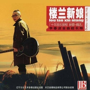

楼兰新娘十年音乐旅程 新歌+精选 / Lou Lan Xin Niang
============================

|  |  |
| :--: | :-- |
| [ 楼兰新娘十年音乐旅程 新歌+精选 / Lou Lan Xin Niang](https://emumo.xiami.com/album/2236) | **艺人**: [李春波](../index.md) **语种**: 国语 **唱片公司**: 天艺音像 **发行时间**: 2004年06月28日 **专辑类别**: 精选集 **专辑风格**: 城市民谣 Urban Folk, 国语流行 Mandarin Pop, 华语唱作人 Chinese Singer-Songwriter **播放数**: 3215341 **收藏数**: 218 **评论数**: 10  |

## 简介

6年磨一剑，当年高唱《小芳》的李春波又回来了！远离“小芳”的他这次却带来了他的新专辑《楼兰新娘》。1993年，一曲《小芳》之后，尽管紧接着第二年又出了《一封家书》，但“小芳”年代毕竟一去不再来。8年前他去北京电影学院导演研修班深造，就此又迷上了电影。今年4月，沉寂许久的他带来新作《楼兰新娘》。  
  
许多人知道李春波，就是从《小芳》开始的，那段曾经唱遍大江南北的旋律着实曾经让许多人着迷，甚至到现在仍旧有人对《小芳》念念不忘。李春波说自己也没忘记，“所以新专辑《楼兰新娘》里收录的最后一首歌就是《小芳》。” “从当年唱《小芳》到现在，足足有10年的时间了。出这个专辑也算是对这10年的一个回顾和收藏，里边还有《一封家书》、《转来转去》，还有去年出的那首《爱上你的样子》，可以说每首歌都代表了当时的一种心情。为了这张专辑，我准备了6年的时间。”  
  
不过，李春波说专辑的主打歌却不是那些老歌，而是“李春波版的《楼兰新娘》”，他说自己所演绎的男人版《楼兰新娘》肯定不会让歌迷失望。  
  
虽然也是为新专辑做宣传，但昨天来杭的李春波丝毫没有张扬。在所住的饭店接受几位记者的采访，他的脸躲在光影中，看不出岁月的痕迹。倒是从头顶扎起的辫子引人注意。他一边捋着头发一边解释，就是想跟别人不一样，不喜欢别人跟他学———那口气竟带着一些童真和任性。  
  
好久没出新歌的李春波还真觉得有点对不住歌迷。“从《小芳》到现在10年了，也算是对我个人的一个总结。”新专辑以新歌加精选的方式收录了15首歌，主打歌《楼兰新娘》的词曲作者杨海潮我们并不熟悉，但他却打动了李春波。“这首歌讲述了一个和初恋有关的故事，我觉得它的真挚是作品中最值钱的东西。”很奇怪他没像其他歌手宣传新歌时那样大造声势，李春波有自己的想法：“现在大家听的东西多了，我觉得还是让歌迷慢慢去听、去买吧。最主要还是唱片本身的东西，当然宣传我也在做啊！”谈到对新专辑的期待，他表示说到底还是一个心态问题，因为“再怎么火也不可能像《小芳》那样”，加上猖獗的盗版，“我已做好准备，自己和自己比就行了，只要不觉遗憾，别太累！”  
  
当记者向他证实“复出是为了拯救歌坛”的传言时，李春波不置可否，但他对新生代歌手的抨击毫不留情：“我也不知道自己能不能拯？但现在歌坛确实情况很严重。以前的歌十首中我们能记住七八首，现在一百首中只能记住两首。现在的歌手和原来比出发点不同，他们更急功近利。只要你长得漂亮、帅就可以被包装成歌星，操作的成分很重，而忽略了做歌手的本质是一定要有音乐修养。我了解内情，很多歌手在录音室唱十遍就可以走了，后面都是一句句修出来的，连音高都可以修！”不过面对这种畸形的现状，他乐观地认为不会持续太久，“会回到从前那样”。 

## 曲目

- [楼兰新娘](./2236/UdRa1674.md)
- [爱上你的样子](./2236/4cY81f41.md)
- [转来转去](./2236/UdTc040b.md)
- [边走边唱](./2236/UdUd4f52.md)
- [咿哟咿哟](./2236/4db507ac.md)
- [小桃红](./2236/4dc664a4.md)
- [一生一世](./2236/4dd7d4cc.md)
- [贫穷与富有](./2236/bueSeb8fb.md)
- [友谊MV](./2236/UdZbcd76.md)
- [谁能告诉我MV电视剧《孽债》主题曲](./2236/ckgI2afeb.md)
- [塞车](./2236/bKfP2577c.md)
- [呼儿嘿哟MV](./2236/bueW1da55.md)
- [天上飘着雨MV](./2236/Uedba8fb.md)
- [一封家书MV](./2236/4dk90ce5.md)
- [小芳MV](./2236/dQkz76862.md)

## 评论

|  |  |  |  |
| :-- | :-- | :-- | :-- |
|  [虾米用户](https://emumo.xiami.com/u/356515793)  2020-10-06 12:34 赞(0) 踩(0) | 
每一首都是经典！
 |
|  [虾米用户](https://emumo.xiami.com/u/38391787)  2019-08-01 19:35 赞(0) 踩(0) | 
可以的
 |
|  [虾米用户](https://emumo.xiami.com/u/100227648) 人的生命是有限的―善法佛... 2018-08-09 18:28 赞(0) 踩(0) | 
什么是美好  李春波的歌曲无论多少年过后依然不变的味道
 |
|  [虾米用户](https://emumo.xiami.com/u/5442977)  2013-09-15 19:22 赞(0) 踩(0) | 
赞！！！
 |
|  [虾米用户](https://emumo.xiami.com/u/16993480) 黄鹤楼 2013-09-15 15:41 赞(0) 踩(0) | 
很喜欢  呼儿嘿呦  带劲
 |
|  [虾米用户](https://emumo.xiami.com/u/2971726)  2013-09-14 11:17 赞(0) 踩(0) | 
有味道
 |
|  [虾米用户](https://emumo.xiami.com/u/6229958) 音乐天下最美的东西 2012-06-12 10:30 赞(0) 踩(0) | 
4
 |
|  [虾米用户](https://emumo.xiami.com/u/5873743)  2011-10-09 09:04 赞(0) 踩(0) | 
那时的记忆！
 |
|  [虾米用户](https://emumo.xiami.com/u/1342581)  2011-02-07 13:39 赞(0) 踩(0) | 
李春波
 |
|  [虾米用户](https://emumo.xiami.com/u/2033635)  2010-12-03 08:44 赞(0) 踩(0) | 
印象中是杨海潮唱的···
 |
