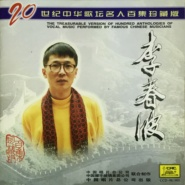
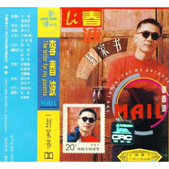
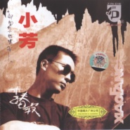

李春波
============================

|  |  |
| :--: | :-- |
| [ 李春波](https://i.xiami.com/lichunbo1112) | **播放数**: 16995194 **粉丝数**: 1981 **评论数**: 120 **地区**: China 中国大陆 **风格**: 城市民谣 Urban Folk, 国语流行 Mandarin Pop  |

## 档案

李春波，中国民谣教父，词曲作家，导演。 
1993年由李春波自己作词、作曲并演唱的《小芳》迅速红遍全国，同年由中国唱片广州公司出版发行的同名专辑，半年内销量就突破100万大关，创中国唱片业的奇迹，并摘取全国各地排行榜冠军。获1993年度全国十大最受欢迎男歌手奖。1993年被媒体称为“小芳年”、“李春波年”。 
1994年又以一曲《一封家书》[更巩固其在歌坛的地位，一个月之内销量轻松突破100万大关，获94年度最受欢迎男歌手奖，并荣获中国唱片最高奖《金唱片》奖和中国流行音乐——94风云人物奖。 
1995年李春波为上海电视台，由黄蜀琴导演的，反映上海知青在云南插队生活的20集电视连续剧《孽债》创作并演唱的主题曲《谁能告诉我 》、《哪里有我的家 》深受好评，由中国唱片广州公司出版发行的同名专辑，仅上海一地，一星期之内就售出15万张，被多家媒体称其为“知青代言人”。 
2013年3月24日发表新歌《火车站》再次掀起“城市民谣”热。 
2014年7月2日，在北京举办了新歌发布会，携手一曲感人肺腑、质朴真诚的民谣歌曲《姐姐》回归中国原创歌坛。

## 专辑

| 名称 | 语种 | 唱片公司 | 发行时间 | 专辑类别 | 专辑风格 |
| :--: | :-- | :-- | :-- | :-- | :-- |
| [ 有梦有爱有快乐](./albums/2100356568.md) | 国语 | 独立发行 | 2016年06月18日 | EP, 单曲 | 国语流行 Mandarin Pop, 华语唱作人 Chinese Singer-Songwriter |
| [ 意外](./albums/2100283574.md) | 国语 | 汉馨九天 | 2016年02月29日 | EP, 单曲 | 国语流行 Mandarin Pop, 华语唱作人 Chinese Singer-Songwriter |
| [ 家](./albums/2100252682.md) | 国语 | 汉馨九天 | 2015年12月30日 | EP, 单曲 | 国语流行 Mandarin Pop, 华语唱作人 Chinese Singer-Songwriter |
| [ 岁月Years](./albums/888727613.md) | 国语 | 李春波工作室 | 2015年04月14日 | 录音室专辑 | 城市民谣 Urban Folk, 国语流行 Mandarin Pop, 华语唱作人 Chinese Singer-Songwriter |
| [ 回家的路](./albums/551549.md) | 国语 |  | 2012年10月25日 | EP, 单曲 | 国语流行 Mandarin Pop |
| [ 楼兰新娘十年音乐旅程 新歌+精选 / Lou Lan Xin Niang](./albums/2236.md) | 国语 | 天艺音像 | 2004年06月28日 | 精选集 | 城市民谣 Urban Folk, 国语流行 Mandarin Pop, 华语唱作人 Chinese Singer-Songwriter |
| [ 贫穷与富有Rich & Poor](./albums/2238.md) | 国语 | 索尼声像 | 1998年07月01日 | 录音室专辑 | 城市民谣 Urban Folk, 国语流行 Mandarin Pop, 华语唱作人 Chinese Singer-Songwriter |
| [ 20世纪中华歌坛名人百集珍藏版](./albums/2237.md) | 国语 | 中国唱片 | 1998年01月01日 | 精选集 | 华语唱作人 Chinese Singer-Songwriter, 国语流行 Mandarin Pop, 城市民谣 Urban Folk |
| [ 谁能告诉我](./albums/1104468529.md) | 国语 | 中唱广州 | 1995年06月21日 | 录音室专辑 | 华语唱作人 Chinese Singer-Songwriter, 国语流行 Mandarin Pop, 城市民谣 Urban Folk |
| [ 一封家书The Letter For My Parents Mail](./albums/2239.md) | 国语 | 中唱广州 | 1993年12月19日 | 录音室专辑 | 城市民谣 Urban Folk, 国语流行 Mandarin Pop, 华语唱作人 Chinese Singer-Songwriter |
| [ 小芳Xiao Fang](./albums/2240.md) | 国语 | 中唱广州 | 1993年04月29日 | 录音室专辑 | 城市民谣 Urban Folk, 国语流行 Mandarin Pop, 华语唱作人 Chinese Singer-Songwriter |

## 评论

|  |  |  |  |
| :-- | :-- | :-- | :-- |
|  [虾米用户](https://emumo.xiami.com/u/425667521) 我还没想好要写什么... 2020-05-19 22:00 赞(0) 踩(0) | 
非常喜欢这首歌曲
 |
|  [虾米用户](https://emumo.xiami.com/u/54847802) 大家的虾米，我的青春ヾ(... 2020-04-13 23:14 赞(1) 踩(0) | 
支持，喜欢民谣
 |
|  [虾米用户](https://emumo.xiami.com/u/345314591) 一个人看星空，生活不易善... 2020-03-06 06:34 赞(0) 踩(0) | 
经典
 |
|  [虾米用户](https://emumo.xiami.com/u/12221090) 逍遥于天地而心意自得 2019-11-17 22:02 赞(0) 踩(0) | 
赞
 |
|  [虾米用户](https://emumo.xiami.com/u/379206110)  2019-07-12 20:51 赞(1) 踩(0) | 
很喜欢《一封家书》这首歌    ，永远支持您
 |
|  [虾米用户](https://emumo.xiami.com/u/253072268)  2019-07-01 00:11 赞(1) 踩(0) | 
前奏现在听起来就是天籁之音
 |
|  [虾米用户](https://emumo.xiami.com/u/349333277)  2019-06-30 07:36 赞(2) 踩(0) | 
喜欢唱歌就是从您唱的小芳开始的！为了学这首歌的曾长时间坐在音响店的门口，那时候满大街都是您清亮的声音，小芳无论是曲、词、唱我认为都很完美！的确经典！
 |
|  [虾米用户](https://emumo.xiami.com/u/181838144) 我还没想好要写什么... 2019-05-11 21:59 赞(3) 踩(0) | 
我老婆叫芳芳，这首歌对我有不一样的意义。虽然歌很老了，但还是耐听。
 |
|  [虾米用户](https://emumo.xiami.com/u/355824141)  2019-02-20 11:40 赞(0) 踩(0) | 
這首歌正唱出我的心聲!!!
 |
|  [虾米用户](https://emumo.xiami.com/u/91032728) 花有重开日 人无再少年 2019-02-13 23:55 赞(0) 踩(0) | 
以前我妈非常喜欢放你歌 可我妈在天堂了 我每次听到你的歌都会想到我妈。
 |
|  [虾米用户](https://emumo.xiami.com/u/411559569) Never too la... 2019-01-29 23:20 赞(0) 踩(0) | 
呼儿嗨吆
 |
|  [虾米用户](https://emumo.xiami.com/u/53737210) 哼哼哼 2018-11-03 22:42 赞(2) 踩(0) | 
真正的大陆城市民谣先驱
 |
|  [虾米用户](https://emumo.xiami.com/u/327737041)   2018-10-20 17:34 赞(1) 踩(0) | 
很伤心的歌，《小芳》
 |
|  [虾米用户](https://emumo.xiami.com/u/100227648) 人的生命是有限的―善法佛... 2018-07-22 13:58 赞(0) 踩(0) | 
lichunbo  李春波的歌曲让人温暖自在  我喜欢  无论走过多少年过去都温暖人心
 |
|  [虾米用户](https://emumo.xiami.com/u/377857524)  2018-07-11 21:41 赞(0) 踩(0) | 
儿时经常听到，对这首歌很有情感。
 |
|  [虾米用户](https://emumo.xiami.com/u/43492923) 行到水穷我才开始害怕，夕... 2018-06-19 18:57 赞(0) 踩(0) | 
。
 |
|  [虾米用户](https://emumo.xiami.com/u/284238675)   2018-06-06 00:58 赞(0) 踩(0) | 
小子，可惜了你的嗓音，创作的脍炙人口的歌太少了，你的歌是音乐界的永恒你知道么？
 |
|  [虾米用户](https://emumo.xiami.com/u/353977106)  2018-05-13 14:32 赞(0) 踩(0) | 
跨越时代和背景来看，真诚的音乐都好听
 |
|  [虾米用户](https://emumo.xiami.com/u/289438595)  2018-04-27 11:33 赞(0) 踩(0) | 
已经三十四五的我，依然还记得在我十一二岁是您唱的那首悦耳的歌。
 |
|  [虾米用户](https://emumo.xiami.com/u/356028276)  2018-04-16 12:09 赞(0) 踩(0) | 
一个时代的记忆，没法忘却
 |
|  [虾米用户](https://emumo.xiami.com/u/355130328)  2018-04-07 01:34 赞(0) 踩(0) | 
经典好听
 |
|  [虾米用户](https://emumo.xiami.com/u/353928173)  2018-03-10 19:12 赞(0) 踩(0) | 
很好！表达出了对父母的思念之情。很感人。
 |
|  [虾米用户](https://emumo.xiami.com/u/347867113)  2018-02-23 13:25 赞(0) 踩(0) | 
一起爱过，一起走过，一起拥有过 足矣！
 |
|  [虾米用户](https://emumo.xiami.com/u/347867113)  2018-02-23 13:24 赞(0) 踩(0) | 
你的歌好伤感   
 |
|  [虾米用户](https://emumo.xiami.com/u/343648216) 天下畅游 2018-01-09 19:20 赞(1) 踩(0) | 
小芳，很好听  
 |
|  [虾米用户](https://emumo.xiami.com/u/283798164)  2017-12-25 11:39 赞(0) 踩(0) | 
想起了洛桑！
 |
|  [虾米用户](https://emumo.xiami.com/u/277691735)  2017-12-23 10:13 赞(0) 踩(0) | 
太帅了
 |
|  [虾米用户](https://emumo.xiami.com/u/337199725) 阳春白雪 2017-12-10 17:24 赞(0) 踩(0) | 
曾经最喜欢唱的歌，也是唱的最好的， 
 |
|  [虾米用户](https://emumo.xiami.com/u/298948030) 中國詩音樂電影创始人作曲... 2017-10-17 22:02 赞(0) 踩(0) | 
你好
 |
|  [虾米用户](https://emumo.xiami.com/u/138768966) 為了子孫後代，請節約用水... 2017-08-27 09:52 赞(0) 踩(0) | 
老歌像一股清流流遍全身，让人说不出的泰然&amp;hellip;&amp;hellip;
 |
|  [虾米用户](https://emumo.xiami.com/u/280630449)  2017-08-19 09:01 赞(0) 踩(0) | 
经典回忆
 |
|  [虾米用户](https://emumo.xiami.com/u/1582050)  2017-08-13 04:20 赞(0) 踩(0) | 
儿时的回忆，一首经典的小芳红遍大江南北，那个纯真的年代！
 |
|  [虾米用户](https://emumo.xiami.com/u/314344883)  2017-08-09 06:12 赞(0) 踩(0) | 
你唱呼儿嘿啦！好听
 |
|  [虾米用户](https://emumo.xiami.com/u/252735858)  2017-06-15 17:19 赞(0) 踩(0) | 
我的家书寄不出了
 |
|  [虾米用户](https://emumo.xiami.com/u/31664682)  2017-05-13 13:17 赞(0) 踩(0) | 
二十二年前听小芳的时候和现在听，完全不一样的感觉啊   
 |
|  [虾米用户](https://emumo.xiami.com/u/284562238)  2017-05-08 04:07 赞(0) 踩(0) | 
波歌，去全民吧，那里肯定有你的自由空间
 |
|  [虾米用户](https://emumo.xiami.com/u/293565868)  2017-05-04 10:32 赞(0) 踩(0) | 
支持李春波
 |
|  [虾米用户](https://emumo.xiami.com/u/260167529) 爱音乐的疯子 2017-01-20 17:07 赞(0) 踩(0) | 
90年代内地原创抗旗子的之一
 |
|  [虾米用户](https://emumo.xiami.com/u/121262314) 性格开放。热爱生活。努力... 2017-01-15 14:32 赞(0) 踩(0) | 
  
 |
|  [虾米用户](https://emumo.xiami.com/u/11763865)  2016-11-01 17:04 赞(0) 踩(0) | 

 |
|  [虾米用户](https://emumo.xiami.com/u/99736226)   2016-09-11 19:53 赞(0) 踩(0) | 
  回忆
 |
|  [虾米用户](https://emumo.xiami.com/u/97747450) 我还没想好要写什么... 2016-09-09 00:28 赞(0) 踩(0) | 
3401
 |
|  [虾米用户](https://emumo.xiami.com/u/29119620) 夜幕海岸線/藍色大門後/... 2016-06-17 17:46 赞(0) 踩(0) | 
冷清的心酸。
 |
|  [虾米用户](https://emumo.xiami.com/u/52127742) 呼。啦啦啦，啦啦啦， 2016-05-17 01:30 赞(0) 踩(0) | 

 |
|  [虾米用户](https://emumo.xiami.com/u/46233036)  2016-04-24 10:36 赞(0) 踩(0) | 
。。。。
 |
|  [虾米用户](https://emumo.xiami.com/u/128488978)  2016-04-03 08:02 赞(1) 踩(0) | 
知识青年很好！现在在也不会有下乡上山的了，也没人有这么伟大的思想和感染力了！怀念那个时代，致敬那个时代！！
 |
|  [虾米用户](https://emumo.xiami.com/u/125764458)  2016-03-22 14:16 赞(0) 踩(0) | 
喜欢他的歌，就是喜欢。
 |
|  [虾米用户](https://emumo.xiami.com/u/30270934)  2016-03-17 14:56 赞(0) 踩(0) | 
。
 |
|  [虾米用户](https://emumo.xiami.com/u/70815656) 音乐使我们的灵魂得以自由 2015-11-07 16:22 赞(2) 踩(0) | 
一下就回到20多年前了，那时这首歌火遍大江南北 
 |
|  [虾米用户](https://emumo.xiami.com/u/36081194) 酷狗音乐，一个有老歌的地... 2015-10-28 10:19 赞(1) 踩(0) | 
喜欢
 |
|  [虾米用户](https://emumo.xiami.com/u/52988748) wait！ 2015-09-25 20:03 赞(1) 踩(0) | 
觉得这歌朴实，感人。
 |
|  [虾米用户](https://emumo.xiami.com/u/49958973) 睡麻痹，起来嗨… 2015-09-22 19:20 赞(0) 踩(0) | 
向民谣教父致敬！
 |
|  [虾米用户](https://emumo.xiami.com/u/7370) Léon 2015-09-16 01:21 赞(0) 踩(0) | 
赞。
 |
|  [虾米用户](https://emumo.xiami.com/u/1278125) 我还没想好要写什么... 2015-08-24 23:08 赞(17) 踩(0) | 
他才算是或者说是大陆那个时候最早的民谣了吧，现在这些大部分民谣都什么玩意。都成小清新了。很多民谣都成了小资们听的矫情口水歌了。
 |
| ⇒ |  [虾米用户](https://emumo.xiami.com/u/43280155) 虾米，感谢陪伴。 2015-10-10 00:30 赞(0) 踩(0) | 
对对对
 |
| ⇒ |  [虾米用户](https://emumo.xiami.com/u/176258538)  2017-11-11 11:04 赞(0) 踩(0) | 
同感不能更多啊!泛滥的民谣矫情货。
 |
|  [虾米用户](https://emumo.xiami.com/u/48394827)  2015-08-17 19:24 赞(0) 踩(0) | 
李春波终于复出了，祝他与爱人越来越幸福。
 |
|  [虾米用户](https://emumo.xiami.com/u/855824)  2015-08-10 06:23 赞(0) 踩(0) | 
莲花！
 |
|  [虾米用户](https://emumo.xiami.com/u/11711308)  2015-05-11 19:43 赞(0) 踩(0) | 
那个年代就玩民谣，不能更前卫
 |
|  [虾米用户](https://emumo.xiami.com/u/2346467)  2015-05-09 02:41 赞(2) 踩(0) | 
《小芳》跟《一封家书》是小时候跟着父母跟保姆听录音带的
 |
|  [虾米用户](https://emumo.xiami.com/u/115238)  2015-03-24 11:32 赞(1) 踩(0) | 
李春波《岁月》，阔别20年依然还是那个味道，只是我已少了当年听小芳时的那份激动，岁月走过，既怀念曾经那份情怀，又喜欢现在这份淡然。好听！平和地对待接受，安静的倾听讲诉，没有那种尖锐的刻薄，只是心领神会由衷地笑了。
 |
|  [虾米用户](https://emumo.xiami.com/u/43398239) 暂无签名~ 2015-03-21 20:30 赞(0) 踩(0) | 
小芳
 |
|  [虾米用户](https://emumo.xiami.com/u/8182190) 我还没想好要写什么... 2015-03-19 13:46 赞(0) 踩(0) | 
等俺有钱了 呢？！
 |
|  [虾米用户](https://emumo.xiami.com/u/10158761)  2015-03-08 10:00 赞(0) 踩(0) | 
这么多年了~今天终于听出来~原来是大舌头？？！！仔细听小芳。。。。
 |
|  [虾米用户](https://emumo.xiami.com/u/6770643) 谨言慎行，戒急用忍 2015-02-22 22:54 赞(0) 踩(0) | 
小芳，谢谢你给我的爱
 |
|  [虾米用户](https://emumo.xiami.com/u/6717745) 不 要 告 别 2015-02-11 18:08 赞(0) 踩(0) | 
中国民谣教父????
 |
|  [虾米用户](https://emumo.xiami.com/u/44274587) 健康最重要 2015-01-28 12:06 赞(0) 踩(0) | 
就这么几个人？。。
 |
|  [虾米用户](https://emumo.xiami.com/u/963821) L’ Arc～en～Ci... 2015-01-27 03:49 赞(1) 踩(0) | 
回不去的年代！经典！
 |
|  [虾米用户](https://emumo.xiami.com/u/296069) 暂无签名~ 2014-12-09 12:08 赞(3) 踩(0) | 
李春波老婆是我们村的
 |
|  [虾米用户](https://emumo.xiami.com/u/8469936)   2014-11-24 17:32 赞(0) 踩(0) | 
永远不会忘记我第一张专辑就是来自他的，我妈给买的（谢了老妈！
 |
|  [虾米用户](https://emumo.xiami.com/u/520819) who am i?who... 2014-11-15 13:44 赞(0) 踩(0) | 
孽债那个专辑没有了
 |
|  [虾米用户](https://emumo.xiami.com/u/19462503) 内部装修中…… 2014-10-28 21:40 赞(0) 踩(0) | 
没想到一封家书和小芳是一个人唱的
 |
|  [虾米用户](https://emumo.xiami.com/u/19462503) 内部装修中…… 2014-10-28 21:39 赞(0) 踩(0) | 
= =虾米音乐人？
 |
|  [虾米用户](https://emumo.xiami.com/u/2279101)  2014-10-22 18:33 赞(0) 踩(0) | 
真是太牛逼了。。
 |
|  [虾米用户](https://emumo.xiami.com/u/38784582) 只做好听的音乐 2014-07-17 11:44 赞(0) 踩(0) | 
小时候挺喜欢歌曲《小芳》的！长大后我把小芳改歌词变成了《大芳》我的原创音乐<a href="http://i.xiami.com/yangzhengao/demo/1773347556?spm=a1z1s.6632057.350708697.2.5JPKhd###" target="_blank" rel="nofollow noreferrer noopener">http://i.xiami.com/yangzhengao/demo/1773347556?spm=a1z1s.6632057.350708697.2.5JPKhd###</a>
 |
|  [虾米用户](https://emumo.xiami.com/u/3062639) 青春青春青你媽個逼 才活... 2014-07-08 15:27 赞(0) 踩(0) | 
唉唷呵~李春波居然來蝦米了
 |
|  [虾米用户](https://emumo.xiami.com/u/38792966)  2014-07-08 15:26 赞(126) 踩(0) | 
我刚入驻了虾米音乐人，欢迎大家来我的个人主页，收听我的最新音乐
 |
| ⇒ |  [虾米用户](https://emumo.xiami.com/u/3062639) 青春青春青你媽個逼 才活... 2014-07-08 15:28 赞(0) 踩(0) | 
有新歌麼？
 |
| ⇒ |  [虾米用户](https://emumo.xiami.com/u/18282119) 我就是我，独一无二 2014-07-09 10:37 赞(0) 踩(0) | 
欢迎啊！
 |
| ⇒ |  [虾米用户](https://emumo.xiami.com/u/855824)  2015-08-10 06:25 赞(0) 踩(0) | 
“姐姐”里就有“莲花”
 |
| ⇒ |  [虾米用户](https://emumo.xiami.com/u/48394827)  2015-08-17 19:25 赞(0) 踩(0) | 
欢迎
 |
| ⇒ |  [虾米用户](https://emumo.xiami.com/u/48394827)  2015-08-17 19:25 赞(0) 踩(0) | 
欢迎
 |
| ⇒ |  [虾米用户](https://emumo.xiami.com/u/48394827)  2015-08-17 19:25 赞(0) 踩(0) | 
欢迎
 |
| ⇒ |  [虾米用户](https://emumo.xiami.com/u/1245943) Perfume 2015-08-25 19:56 赞(0) 踩(0) | 
在蒙面歌王上看到你了。波哥加油，期待在电视上多多的看到你。
 |
| ⇒ |  [虾米用户](https://emumo.xiami.com/u/127838982)  2016-04-25 17:18 赞(0) 踩(0) | 
欢迎
 |
| ⇒ |  [虾米用户](https://emumo.xiami.com/u/284562238)  2017-05-08 04:08 赞(0) 踩(0) | 
去全民发展发展吧
 |
| ⇒ |  [虾米用户](https://emumo.xiami.com/u/143613770)   2017-07-26 00:35 赞(0) 踩(0) | 
↖(^&amp;omega;^)↗↖(^&amp;omega;^)↗
 |
| ⇒ |  [虾米用户](https://emumo.xiami.com/u/280630449)  2017-08-19 09:01 赞(0) 踩(0) | 
经典回忆    
 |
| ⇒ |  [虾米用户](https://emumo.xiami.com/u/321001425)  2017-08-24 10:05 赞(0) 踩(0) | 
最喜欢听《小芳》，百听不厌，小时候最先学会的歌。~我是80后
 |
| ⇒ |  [虾米用户](https://emumo.xiami.com/u/7878790) 音乐无国界！ 2017-10-01 09:55 赞(0) 踩(0) | 
国庆节快乐，虾米欢迎您！
 |
| ⇒ |  [虾米用户](https://emumo.xiami.com/u/290446647) 这家伙很聪明什么也没留下... 2018-03-28 19:53 赞(0) 踩(0) | 
我觉的李春波很帅  
 |
| ⇒ |  [虾米用户](https://emumo.xiami.com/u/290446647) 这家伙很聪明什么也没留下... 2018-03-28 19:55 赞(0) 踩(0) | 
我才十岁，我就爱听 
 |
| ⇒ |  [虾米用户](https://emumo.xiami.com/u/290446647) 这家伙很聪明什么也没留下... 2018-03-28 19:55 赞(0) 踩(0) | 
小芳真好听           
 |
| ⇒ |  [虾米用户](https://emumo.xiami.com/u/125372126)  2019-02-22 20:27 赞(0) 踩(0) | 
向大佬致敬，谢谢你，用歌声陪伴我走过寂寞的青春！
 |
|  [虾米用户](https://emumo.xiami.com/u/2306444) 见证虾米起家式… 2014-04-18 20:07 赞(0) 踩(0) | 
这么多年过去了,小芳也大妈. 唯有歌声记忆永存
 |
|  [虾米用户](https://emumo.xiami.com/u/9004080)  2014-03-27 11:09 赞(0) 踩(0) | 
再见 小芳
 |
|  [虾米用户](https://emumo.xiami.com/u/3895917)  2014-02-11 19:05 赞(29) 踩(0) | 
现在民谣火成这样 这里还是这么冷清 真是只能呵呵
 |
|  [虾米用户](https://emumo.xiami.com/u/25614146)  2014-01-14 18:03 赞(0) 踩(0) | 
ok
 |
|  [虾米用户](https://emumo.xiami.com/u/722784) Bite me！Baby 2013-11-10 12:12 赞(53) 踩(0) | 
小时候以为 《小芳》 唱的是我姑姑，她有一双大眼睛，一根乌黑的辫子，最关键是：她的名字就叫 小芳
 |
| ⇒ |  [虾米用户](https://emumo.xiami.com/u/4251198) 这个人很懒，所以只写了这... 2016-09-07 22:50 赞(0) 踩(0) | 
唉唉，我的姑姑也是叫 小芳，我爸妈唱这个歌的时候，我就会问，为啥又唱姑姑？233
 |
| ⇒ |  [虾米用户](https://emumo.xiami.com/u/4113587)  2016-12-26 18:21 赞(0) 踩(0) | 
哈哈，那她应该很幸福，那么多人喜欢她
 |
|  [虾米用户](https://emumo.xiami.com/u/21867878)  2013-09-13 16:28 赞(1) 踩(0) | 
小爸爸中听到的这首歌，场景感动
 |
|  [虾米用户](https://emumo.xiami.com/u/2502959) you are what... 2013-09-13 11:05 赞(0) 踩(0) | 
从小爸爸看到的。。。木哈哈。。。
 |
|  [虾米用户](https://emumo.xiami.com/u/2409614)  2013-08-10 20:10 赞(2) 踩(0) | 
美丽的西双版纳留不住我的爸爸
 |
|  [虾米用户](https://emumo.xiami.com/u/14460333)  2013-05-03 21:14 赞(1) 踩(0) | 
拥椿庭萱堂者 需珍惜~~~
 |
|  [虾米用户](https://emumo.xiami.com/u/7867049)  2013-01-22 10:36 赞(0) 踩(0) | 
精品
 |
|  [虾米用户](https://emumo.xiami.com/u/7853238)  2012-10-18 11:18 赞(0) 踩(0) | 
儿时的回忆
 |
|  [虾米用户](https://emumo.xiami.com/u/3631691) 以梦喂马 2012-08-19 21:51 赞(0) 踩(0) | 
我爱小芳
 |
|  [虾米用户](https://emumo.xiami.com/u/1555537)  2011-12-13 03:00 赞(0) 踩(0) | 
怎么听怎么90年代
 |
|  [虾米用户](https://emumo.xiami.com/u/1674845)  2011-11-18 17:35 赞(0) 踩(0) | 
小芳
 |
|  [虾米用户](https://emumo.xiami.com/u/1674845)  2011-11-18 17:35 赞(0) 踩(0) | 
小芳
 |
|  [虾米用户](https://emumo.xiami.com/u/155947) 一期一会 2011-06-06 20:54 赞(0) 踩(0) | 
一下回到那个时代
 |
|  [虾米用户](https://emumo.xiami.com/u/2545319) 因为爱所以爱 2011-05-01 12:40 赞(0) 踩(0) | 
小芳
 |
|  [虾米用户](https://emumo.xiami.com/u/3395113)   2011-04-24 16:08 赞(0) 踩(0) | 
‘小芳’一炮而红
 |
|  [虾米用户](https://emumo.xiami.com/u/2186356)  2011-04-02 19:13 赞(0) 踩(0) | 
现在也很前卫！小芳。。。
 |
| ⇒ |  [虾米用户](https://emumo.xiami.com/u/210975690)  2016-12-04 18:48 赞(0) 踩(0) | 
dddd
 |
|  [虾米用户](https://emumo.xiami.com/u/1425256) 随便说说，不要当真。 2011-03-19 01:10 赞(0) 踩(0) | 
放在当年，真是前卫啊。。。歌词也很好最近怎么换口味了我- -
 |
|  [虾米用户](https://emumo.xiami.com/u/2934562)  2011-03-02 12:32 赞(1) 踩(0) | 
让我想起了非常童年。。。。。。虽然对我来说有点遥远，但记忆犹新
 |
|  [虾米用户](https://emumo.xiami.com/u/2717520)  2011-02-10 01:51 赞(1) 踩(0) | 
这他妈的是最早的潮人啊！
 |
|  [虾米用户](https://emumo.xiami.com/u/1342581)  2011-02-07 13:39 赞(0) 踩(0) | 
李春波
 |
