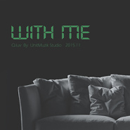

With Me
============================

|  |  |
| :--: | :-- |
| [ With Me](https://emumo.xiami.com/album/2100238710) | **艺人**: [Q.luv](../index.md) **语种**: 国语 **唱片公司**: 千和世纪 **发行时间**: 2015年11月17日 **专辑类别**: EP, 单曲 **专辑风格**:  **播放数**: 199748 **收藏数**: 22 **评论数**: 14  |

## 简介

这次Q.luv依然带来他的R&amp;B新单《 WITH ME 》 ;关于歌名,这可以是任意一种组合:Fly with me,Be with me,Ride with me. 同时也代表着相爱的两人在一起会产生的无限可能,可以一起天马行空,也可以一起舒服的沙发Life.  
  
在歌曲后半部分Q.luv首次尝试旋律Rap,同时也带出他第一张专辑《GAME OVER》其中几首精品歌曲的歌名,延续以往的风格定位。 

## 曲目

## 评论

|  |  |  |  |
| :-- | :-- | :-- | :-- |
|  [虾米用户](https://emumo.xiami.com/u/612355) 好听音乐收藏了 2016-01-12 20:13 赞(0) 踩(0) | 

 |
|  [虾米用户](https://emumo.xiami.com/u/50707657)  2015-11-30 17:35 赞(1) 踩(0) | 
中国stevie hoang啊
 |
|  [虾米用户](https://emumo.xiami.com/u/52695152)  2015-11-28 21:05 赞(0) 踩(0) | 
Q哥加油 我心中的中国rnb第一人
 |
|  [虾米用户](https://emumo.xiami.com/u/5947170) Let Me Be Me 2015-11-23 20:32 赞(0) 踩(0) | 
melody rap
 |
|  [虾米用户](https://emumo.xiami.com/u/5947170) Let Me Be Me 2015-11-23 20:31 赞(0) 踩(0) | 
等到
 |
|  [虾米用户](https://emumo.xiami.com/u/38699838) 黑人音乐爱好者内容运营老... 2015-11-23 11:48 赞(0) 踩(0) | 
Q.Luv，每一首歌都有不同的感觉！唱功也太棒了 [文字cool]
 |
| ⇒ |  [虾米用户](https://emumo.xiami.com/u/16377813)   2015-11-27 19:55 赞(0) 踩(0) | 
我都会尽量做到不同！好眼力！
 |
| ⇒ |  [虾米用户](https://emumo.xiami.com/u/38699838) 黑人音乐爱好者内容运营老... 2015-11-28 12:09 赞(0) 踩(0) | 
<q><b>Q.luv说：</b></q>
 |
|  [虾米用户](https://emumo.xiami.com/u/36208991)   2015-11-23 11:34 赞(0) 踩(0) | 
๑
 |
|  [虾米用户](https://emumo.xiami.com/u/36755876) Let it be.  2015-11-21 19:19 赞(0) 踩(0) | 
好听啊
 |
|  [虾米用户](https://emumo.xiami.com/u/49616058)  2015-11-20 20:22 赞(0) 踩(0) | 
来了~
 |
|  [虾米用户](https://emumo.xiami.com/u/48803288)  2015-11-20 17:22 赞(0) 踩(0) | 
赞。
 |
|  [虾米用户](https://emumo.xiami.com/u/2960029) 如果世界太危险 只有音乐... 2015-11-20 01:47 赞(0) 踩(0) | 
到！
 |
|  [虾米用户](https://emumo.xiami.com/u/59699232) 好好写歌。 2015-11-19 13:25 赞(0) 踩(0) | 
酷！
 |
