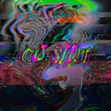

CØ. $H!T
============================

|  |  |
| :--: | :-- |
| [ CØ. $H!T](https://emumo.xiami.com/album/2102410001) | **艺人**: [Q.luv](../index.md) **语种**: 国语 **唱片公司**: 银河音乐 **发行时间**: 2016年10月21日 **专辑类别**: EP, 单曲 **专辑风格**:  **播放数**: 100267 **收藏数**: 6 **评论数**: 3  |

## 简介

  
眼与眼的对接  
像毒素扩散  
当然希望你能安全使用CO. SHIT  
  
R&amp;B歌手Q.LUV联手90后音乐制作人Fcyco，用chillout音乐，带你在808的世界下沉。

## 曲目

## 评论

|  |  |  |  |
| :-- | :-- | :-- | :-- |
|  [虾米用户](https://emumo.xiami.com/u/45372790) ༒ 2016-11-18 21:37 赞(0) 踩(0) | 
早
 |
|  [虾米用户](https://emumo.xiami.com/u/73639238) Yk. 2016-10-24 20:27 赞(0) 踩(0) | 
沙发
 |
|  [虾米用户](https://emumo.xiami.com/u/43044429) 无中生有的恶趣味 2016-10-21 01:04 赞(0) 踩(0) | 

 |
